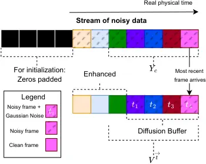

MOS  
Mean Opinion Score

BB  
Brownian Bridge

DB  
Diffusion Buffer

RIR  
Room impulse responds

NN  
Neural Network

FLOPs  
Floating Point Operations per second

DSM  
Denoising Score Matching

DP  
Data Prediction

SGM  
score-based generative model

SNR  
signal-to-noise ratio

GAN  
generative adversarial network

VAE  
variational autoencoder

DDPM  
denoising diffusion probabilistic model

NCSN++  
Noise Conditional Score Network

Sym-NCSN++  
Symmetric Noise Conditional Score Network

STFT  
short-time Fourier transform

iSTFT  
inverse short-time Fourier transform

SDE  
stochastic differential equation

BBED  
Brownin Bridge with Exploding Diffusion Coefficient

EuM  
Euler-Maruyama

FL  
Frames-Lag

ODE  
ordinary differential equation

OU  
Ornstein-Uhlenbeck

VE  
Variance Exploding

DNN  
deep neural network

PESQ  
Perceptual Evaluation of Speech Quality

SE  
speech enhancement

BWE  
bandwidth extension

T-F  
time-frequency

ELBO  
evidence lower bound

WPE  
weighted prediction error

PSD  
power spectral density

RIR  
room impulse response

NN  
Neural Network

MSE  
Mean-Squared-Error

SNR  
signal-to-noise ratio

LSTM  
long short-term memory

POLQA  
Perceptual Objectve Listening Quality Analysis

SDR  
signal-to-distortion ratio

ESTOI  
Extended Short-Term Objective Intelligibility

ELR  
early-to-late reverberation ratio

TCN  
temporal convolutional network

DRR  
direct-to-reverberant ratio

NFE  
number of function evaluations

RTF  
real-time factor

SQA  
speech quality assessment

# Diffusion Buffer for Online Generative Speech Enhancement

Bunlong
Lay [](https://orcid.org/0000-0002-0847-7896)
   Rostislav
Makarov [](https://orcid.org/0009-0006-7319-6413)
   Simon
Welker [](https://orcid.org/0000-0002-6349-8462)
   Maris
Hillemann [](https://orcid.org/0009-0007-5701-8411)
   Timo
Gerkmann [](https://orcid.org/0000-0002-8678-4699)
^(†)^(†)thanks: All authors are with the Signal Processing Group,
Department of Informatics, Universität Hamburg, 22527 Hamburg Germany
(e-mail: {bunlong.lay; rostislav.makarov; simon.welker;
timo.gerkmann}@uni-hamburg.de).

###### Abstract

Online Speech Enhancement was mainly reserved for predictive models. A
key advantage of these models is that for an incoming signal frame from
a stream of data, the model is called only once for enhancement. In
contrast, generative Speech Enhancement models often require multiple
calls, resulting in a computational complexity that is too high for many
online speech enhancement applications. This work presents the
_Diffusion Buffer_, a generative diffusion-based Speech Enhancement
model, which only requires one neural network call per incoming signal
frame from a stream of data and performs enhancement in an online
fashion on a consumer-grade GPU. The key idea of the Diffusion Buffer is
to align physical time with Diffusion time-steps. The approach
progressively denoises frames through physical time, where past frames
have more noise removed. Consequently, an enhanced frame is output to
the listener with a delay defined by the Diffusion Buffer, and the
output frame has a corresponding look-ahead. In this work, we extend
upon our previous work \[1\] by carefully designing a 2D convolutional
UNet architecture that specifically aligns with the Diffusion Buffer’s
look-ahead. We observe that the proposed UNet improves performance,
particularly when the algorithmic latency is low. Moreover, we show that
using a Data Prediction loss instead of Denoising Score Matching loss
enables flexible control over the trade-off between algorithmic latency
and quality during inference. The extended Diffusion Buffer equipped
with a novel neural network and loss function drastically reduces the
algorithmic latency from
$`320\text{\,}\mathrm{m}\mathrm{s}`$–$`960\text{\,}\mathrm{m}\mathrm{s}`$
to
$`32\text{\,}\mathrm{m}\mathrm{s}`$–$`176\text{\,}\mathrm{m}\mathrm{s}`$
with an even increased performance. While it has been shown before that
offline generative diffusion models outperform predictive approaches in
unseen noisy speech data, we confirm that the online Diffusion Buffer
also outperforms its predictive counterpart on unseen noisy speech
data¹¹ 1 Code will be released after acceptance..

###### Index Terms: 

Online speech enhancement, Diffusion models

## I Introduction

Online se (se) refers to enhancing a noisy speech signal on a
frame-by-frame basis. This means that when one signal-frame arrives from
a stream of noisy observations, the se system needs to output one
enhanced frame. In this work, we use the term _online_ when a small
input-to-output delay up to $`200\text{\,}\mathrm{m}\mathrm{s}`$ is
allowed. The ability to perform online se in real-world scenarios is
critical for ensuring clear and intelligible communication in video
conferencing, VoIP calls, and other live interaction platforms. However,
developing online se systems is challenging. It requires low
computational latency for processing a signal-frame, which makes the
employment of computationally costly methods impractical. Therefore,
online se has to use a low-parameterized model that is capable of
handling real-world data unseen during the development of these systems.

Prominent online-capable Neural Networks \[2, 3\] belong to the class of
predictive (also known as discriminative) models. These approaches learn
a direct mapping from the noisy observation to the clean target by
training on pairs of clean and noisy mixtures in a supervised manner.
During training, the different noise types, and a range of snr are
fixed. However, capturing all acoustic conditions during training that
could occur in the real-world is not possible. As a result of this
limitation, unpleasant distortions may occur when real-world data differ
from training data.

Diverging from predictive approaches, generative approaches focus on
learning a distribution of clean speech data, demonstrating promising
results on unseen data \[4\]. Recently, a category of generative models
known as _Diffusion models_ has been introduced to the realm of SE \[5,
6, 7, 4, 8\]. The concept involves adding Gaussian noise to the data in
the so-called _forward process_, thereby transforming the data into a
tractable distribution such as a Gaussian distribution. Subsequently, a
nn (nn) is trained to reverse this Diffusion process in a so-called
_reverse process_ \[9\]. Often, the forward and reverse processes are
modeled by a forward and reverse sde (sde) \[4, 10\]. In the context of
se, the initial distribution is the clean speech data, and the
terminating distribution is centered around the noisy mixture. Hence,
these sde can be thought of as a stochastic interpolation \[11\] between
the clean speech signal and the noisy mixture. Enhancement is then done
by solving the reverse process, which is computationally intensive,
requiring many evaluations of a large neural network. Therefore, the
large computational burden of solving the reverse process makes
Diffusion models impractical for online applications.

In order to reduce the computational complexity of Diffusion models,
many methods \[12, 13\] aim to reduce the number of network evaluations.
When approximating the so-called dsm (dsm) with a large nn, called the
score model, inference often requires a large number of score model
evaluations for generating high-quality audio files. For instance, in
\[4, 8\], more than 30 score model evaluations are required for good
performance. With 30 score model evaluations, the computational
complexity is too large for many consumer-grade GPUs. In \[14, 15\], the
number of evaluations is reduced with the aid of a predictive model.
However, still the complexity in \[14, 15\] remains too high for many
consumer-grade GPUs.

This paper expands our prior work, the db (db) \[1\], which adapts
SGMSE+ for streamable inference. The db is the first generative se
method that achieves online speech enhancement on a consumer-grade GPU,
an _NVIDIA RTX 4080 Laptop_ GPU, with a latency between
$`320\text{\,}\mathrm{m}\mathrm{s}`$–$`960\text{\,}\mathrm{m}\mathrm{s}`$.
A live demo was presented at the Interspeech 2025 conference \[16\],
where code and video demonstrating its live performance can be found
here²² 2 Video and code
[https://github.com/sp-uhh/Diffusion-Buffer](https://github.com/sp-uhh/Diffusion-Buffer).
The approach had been inspired by \[17, 18\], where the idea is to
denoise frames through physical time. The db is a buffer containing the
most recent frames. Within this buffer, frames closer to the present are
placed at a larger Diffusion time-step, while frames further in the past
are progressively denoised. There are two important consequences of this
idea. First, the $`i`$-th last output frame of the Diffusion Buffer has
undergone $`i`$ reverse steps without the aid of any predictive
guidance. In addition, it has a look-ahead of exactly $`i-1`$ frames.
However, the symmetrical receptive field of the underlying 2D
convolutional UNet architecture ncsnpp (ncsnpp) does not align with this
look-ahead constraint. In fact, whenever look-ahead frames are required
but not available, then ncsnpp used in \[1\] processes zeros instead of
actual data. Therefore, suboptimal performance is achieved. Second, the
Diffusion Buffer architecture achieves a drastic reduction in
computational footprint as the underlying nn is only required to be
called once per incoming frame. However, as the underlying network is a
large 2D convolutional nn, even one call may be too computationally
heavy for consumer devices. For this reason, the parameters of that 2D
convolutional nn were reduced. It has been shown that Diffusion models
perform very well when the underlying nn has many parameters \[19\].
However, it remains unclear if a lower-parameterized nn still results in
the good generalization to unseen data reported in \[4\].

In addition, we expand the experimental framework of our previous
publication \[1\] with the following contributions. We propose to change
the formerly employed dsm loss with the dp (dp) loss, which achieves
improved performance for lower latencies, e.g., when the algorithmic
latency is only $`192\text{\,}\mathrm{m}\mathrm{s}`$ opposed to
latencies between
$`320\text{\,}\mathrm{m}\mathrm{s}`$–$`960\text{\,}\mathrm{m}\mathrm{s}`$.
In addition, as employing the dp loss retrieves a clean speech estimate
with every nn evaluation, any frame from the output of the Diffusion
Buffer can be outputted to the listener. Hence, employing the dp loss
allows for trading performance for latency during inference. This was
not possible in the original implementation of the Diffusion Buffer
\[1\], which had a fixed delay during inference. In addition, we develop
a 2D convolutional UNet where the receptive field aligns precisely with
the look-ahead constraint of the Diffusion Buffer. The newly developed
Diffusion Buffer with different loss and different underlying nn
outperforms largely the initial proposal in \[1\]. The proposed changes
not only yield lower algorithmic latency between
$`32\text{\,}\mathrm{m}\mathrm{s}`$–$`192\text{\,}\mathrm{m}\mathrm{s}`$
but also lower computational processing time. In fact, with the proposed
improvements, the Diffusion Buffer also runs online on a lower-end GPU
(_NVIDIA RTX 2080Ti_). Moreover, we revalidate the results of \[4, 14\],
as we find that the newly developed generative Diffusion Buffer performs
better with unseen data than its predictive counterpart, i. e. the
underlying architecture trained in a predictive manner.

## II Background

### II-A Notation

With lowercase letters, we denote a vector with $`v\in\mathbb{R}^{n}`$,
where $`n>0`$. In the context of se, $`v`$ can be understood as a
time-discrete signal and $`n`$ is the number of samples. In this case,
their corresponding uppercase bold versions are complex-valued stft
(stft) spectra. More precisely, $`\mathbf{V}\in\mathbb{C}^{F\times K}`$
with $`F`$ being the number of frequency bins and $`K`$ the number of
frames. We refer to an entry of $`v`$ with $`v[i]\in\mathbb{R}`$,
$`1\leq i\leq n`$. Sometimes, we also write $`v_{i}`$ to refer to the
$`i-`$th entry of a vector. For a single coefficient of a time-frequency
bin of $`\mathbf{V}`$, we write $`V[\ell,k]\in\mathbb{C}`$,
$`1\leq\ell\leq F`$, $`1\leq k\leq K`$. By abuse of notation, we are
often only interested in the frames of the stft $`\mathbf{V}`$, for
which we write
$`\mathbf{V}[k]\coloneqq\mathbf{V}[\cdot,k]\in\mathbb{C}^{F}`$. Often,
we are interested in a sequence of entries in $`v`$ starting from $`i`$
to $`j`$, $`i<j`$. In this case, we write
$`v[i:j]=[v[i],\dots,v[j]]^{T}\in\mathbb{R}^{j-i}`$. In addition, we
denote the hop-size, number of frequency bins, and frequency sampling
rate of the stft by $`h_{s}`$, $`\mathrm{n_{fft}}`$, and $`f_{s}`$.

### II-B Speech Enhancement

se is the task of retrieving the clean speech signal
$`s\in\mathbb{R}^{n}`$ from a noisy observation $`y\in\mathbb{R}^{n}`$.
In general, we can write

```math
y=u(s), \tag{1}
```

where $`u(\cdot)`$ is the corruption operator. The precise definition of
$`u`$ depends on which corruption type is considered. In this work, we
only investigate on the additive corruption type that can be written as
$`u(s)=s+e`$, where $`e`$ is environmental noise. However, applying to
other corruption types is straightforward.

An se model $`f_{\text{SE}}`$ is a function that maps an input sequence
$`y=(y_{1},\dots,y_{n})^{T}`$ to an output sequence
$`\hat{s}=(\hat{s}(1),\dots,\hat{s}(n))^{T}`$, where
$`\hat{s},y\in\mathbb{R}^{n}`$. If $`f_{\text{SE}}`$ is a
well-parameterized se model, then $`\hat{s}`$ is a good approximation of
$`s`$. To perform enhancement, we distinguish between online and offline
enhancement.

### II-C Offline Inference

Offline processing (a.k.a. batch processing or utterance-based
processing) is the evaluation of $`f_{\text{SE}}(y)`$ by providing the
whole sequence $`y`$ to the model $`f_{\text{SE}}(\cdot)`$ at once. This
assumes that the whole noisy observation $`y`$ is already available
before the model begins to process any input. Therefore, this processing
scheme cannot be used for enhancing a stream of audio data.

### II-D Online Processing

Online processing (a.k.a. frame-by-frame processing) can be used to
enhance a stream of audio data. For online enhancement in the stft
domain, we assume that in the $`i-`$th iteration, a new frame
$`\mathbf{Y}[i]`$ arrives from the stream of noisy observations. More
precisely, every hop-size $`h_{s}`$ we take the last
$`\mathrm{n_{fft}}`$ samples to transform them into a frame in the stft
domain. The model is evaluated on the new frame $`\mathbf{Y}[i]`$
together with all available past frames. The exact amount of past
information depends on the width of the receptive field of the model.
For se, we believe that only a few hundred milliseconds of past
information are sufficient to achieve good performance. Hence, limiting
past information, opposed to all available past information, is
reasonable and can be achieved with chunk-based processing.

A generic chunk-based processing scheme is described in Algorithm 1
where the present frame and past frames are simply stored in the current
chunk $`\mathbf{Y}_{c}`$. This current chunk contains the last $`M>0`$
frames and is fed to the se model $`f_{\text{SE}}`$. From the evaluation
$`\mathbf{O}=f_{\text{SE}}(\mathbf{Y}_{c})`$, the $`d`$-th last frame
$`O[M-d]`$, $`d\geq 0`$, is then directed to the listener. Throughout
this work, we call $`d`$ the dint (dint) where a larger $`d`$ increases
the algorithmic latency.

#### II-D1 Latency

We define the algorithmic latency as the intrinsic latency of a
processing system independent of its hardware constraints. Or
differently stated, the algorithmic latency is the delay that would
still exist even when processing on infinitely fast hardware. The
algorithmic latency in seconds of Algorithm 1 is given by

```math
\frac{\mathrm{n_{fft}}}{f_{s}}+\frac{d\cdot h_{s}}{f_{s}}. \tag{2}
```

For minimal algorithmic latency with such a scheme, it is desired to
have $`d=0`$. The dint parameter $`d`$ trades algorithmic latency for
how much maximal look-ahead is possible in the enhanced output.
Therefore, increasing $`d`$ may be reasonable when higher algorithmic
latency is acceptable.

The total latency is defined as the delay between the input signal and
the output signal of a speech enhancement system. It is dominated by the
sum of algorithmic latency and $`h_{\text{time}}`$, where
$`h_{\text{time}}\coloneqq\frac{h_{s}}{f_{s}}`$ is the duration of a
single frame hop in seconds. The total latency also includes other
delays, such as the latency introduced by analog-to-digital conversion.
We will not consider these other latencies in this work, as they are
negligible. We therefore define the total latency as the sum of
algorithmic latency and $`h_{\text{time}}`$.

#### II-D2 Real-time-factor

An important constraint in Algorithm 1 is that the processing time
$`\text{proc-time}(f_{\text{SE}}(\mathbf{Y}_{c}))`$ must be shorter than
$`h_{\text{time}}`$. We define the rtf (rtf) for streaming as

```math
\text{RTF}=\frac{\text{proc-time}(f_{\text{SE}}(\mathbf{Y}_{c}))}{h_{\text{time}}} \tag{3}
```

By this defintion, we have that online se is only possible if the rtf is
smaller than 1. If rtf $`\geq 1`$, then processing an input frame is not
completed before the next one arrives from the stream of audio data.
This accumulates additional delays with each incoming frame and
therefore prevents the se system from operating online on an audio
stream.

1: SE model $`f_{\text{SE}}(\cdot)`$, $`\mathbf{Y}`$ stream of audio
data in STFT.

2: for i = 0, 1, … do

3:   $`\mathbf{Y}_{c}\leftarrow\mathbf{Y}[i-M:i]`$ $`\triangleright`$
get last M frames

4:   $`\mathbf{O}=f_{\text{SE}}(\mathbf{Y}_{c})`$ $`\triangleright`$
compute estimate

5:   output $`\mathbf{O}[M-d]`$ to the listener

6: end for

Algorithm 1 Chunk-based Online Speech Enhancement

## III Diffusion Models

### III-A Stochastic Differential Equations

We formulate our Diffusion process in the stft domain. Moreover, the
following applies simultaneously to all time-frequency bins of
$`Y[\ell,k]`$ of $`\mathbb{Y}`$. This means that the following equations
are one-dimensional. For readability, we will omit indices $`\ell,k`$ in
this section and reintroduce them when discussing loss functions from
Section III-A1 on. Following the approach in \[8, 4\], we model the
forward process of the score-based generative model with an sde defined
on $`0\leq t<T_{\text{max}}`$:

```math
\mathrm{d}{X_{t}}=f(X_{t},Y)\mathrm{d}{t}+g(t)\mathrm{d}{{w}}, \tag{4}
```

where $`w`$ is the standard Wiener process \[20\], $`X_{t}`$ is the
current process state with initial condition $`X_{0}=S`$, and $`t`$ is a
continuous Diffusion time-step variable that describes the progress of
the process that ends in the last Diffusion time-step
$`T_{\text{max}}`$. The term $`f(X_{t},Y)\mathrm{d}{t}`$ can be
integrated by Lebesgue integration \[21\], and $`g(t)\mathrm{d}{{w}}`$
follows Ito integration \[20\]. The diffusion coefficient $`g`$
regulates the amount of Gaussian noise that is added to the process, and
the drift coefficient $`f`$ mainly affects the mean of $`X_{t}`$ (see
\[20, (6.10)\]) in the case of linear SDEs. The process state $`X_{t}`$
follows a Gaussian distribution \[22, Ch. 5\], called the _perturbation
kernel_:

```math
p_{0t}(X_{t}|X_{0},Y)=\mathcal{N}_{\mathbb{C}}\left(X_{t};\mu_{t}(X_{0},Y),\sigma_{t}^{2}{I}\right). \tag{5}
```

We call $`\mu_{t}(X_{0},Y)`$ the mean evolution and $`\sigma_{t}`$ the
variance evolution as they describe how the mean and variance of the
process state $`X_{t}`$ are evolving over the Diffusion time $`t`$. If
we can find analytically closed-form solutions for the mean and variance
evolution, then (5) allows us to efficiently compute the process state
$`\mathbf{X}_{t}`$ for each $`t`$ by calculating

```math
X_{t}=\mu_{t}(X_{0},Y)+\sigma_{t}z, \tag{6}
```

with $`z\sim\mathcal{N}_{\mathbb{C}}(0,1)`$. By Anderson \[23\], each
forward SDE as in (4) can be associated to a reverse SDE:

```math
\mathrm{d}{X_{t}}=\left[-f(X_{t},Y)+g(t)^{2}\nabla_{X_{t}}\log p_{t}(X_{t}|Y)\right]\mathrm{d}{t}+g(t)\mathrm{d}{\bar{w}}\,, \tag{7}
```

where $`\mathrm{d}{\bar{w}}`$ is a Wiener process going backwards in
time. In particular, the reverse process starts at $`t=T`$ and ends at
$`t=0`$. Here $`T<T_{\text{max}}`$ is a parameter that needs to be set
for practical reasons, as the last Diffusion time-step
$`T_{\text{max}}`$ is only reached in limit.

In this work, we employ the bbed (bbed) SDE from \[8\]. The mean
evolution is given by

```math
\mu_{t}(X_{0},Y)=\left(1-t\right)X_{0}+tY\,, \tag{8}
```

and the variance is

```math
\displaystyle\hskip-6.49994pt\sigma(t)^{2} \displaystyle=(1-t)c\left[(r^{2t}-1+t)+\log(r^{2r^{2}})(1-t)E\right], \tag{9}
```

```math
\displaystyle E \displaystyle=\text{Ei}\left[2(t-1)\log(r)\right]-\text{Ei}\left[-2\log(r)\right], \tag{10}
```

where $`\text{Ei}[\cdot]`$ denotes the exponential integral function
\[24, 25\], and $`c,r>0`$ are sde specific real-valued parameters.

The drift and diffusion coefficients are

```math
\displaystyle f(X_{t},Y) \displaystyle=\frac{Y-X_{t}}{1-t}, \tag{11}
```

and

```math
g(t)=\sqrt{c}r^{t}, \tag{12}
```

There are different reverse process strategies to obtain $`X_{0}`$ from
a given $`X_{T}`$ depending on the training objective.

#### III-A1 Denoising Score Matching

One straightforward way is to simply solve the reverse SDE in (7). To
this end, the so-called _score function_
$`\nabla_{\mathbf{X}_{t}}\log p_{t}(\mathbf{X}_{t}|\mathbf{Y})`$ in (7)
is approximated by a NN (NN)
$`\mathfrak{s}_{\theta}(\mathbf{X}_{t},\mathbf{Y},t)`$. More precisely,
the dsm loss $`L_{\text{DSM}}`$ is defined as:

```math
L_{\text{DSM}}=\mathbb{E}_{t,(\mathbf{X}_{0},\mathbf{Y}),\mathbf{Z},\mathbf{X}_{t}|(\mathbf{X}_{0},\mathbf{Y})}\left[\lVert\mathfrak{s}_{\theta}(\mathbf{X}_{t},\mathbf{Y},t)+\frac{\mathbf{Z}}{\sigma_{t}}\rVert_{2}^{2}\right]\,. \tag{13}
```

Assuming that $`\mathfrak{s}_{\theta}`$ is available, we can generate an
estimate of the clean speech $`\mathbf{X}_{0}`$ from $`\mathbf{Y}`$ by
solving the reverse SDE (7) for instance, with the first-order solver
eum (eum).

#### III-A2 Data Prediction

Another way is to simply predict the clean data with the dp loss
$`L_{\text{DP}}`$:

```math
L_{\text{DP}}=\mathbb{E}_{t,(\mathbf{X}_{0},\mathbf{Y}),\mathbf{Z},\mathbf{X}_{t}|(\mathbf{X}_{0},\mathbf{Y})}\left[\lVert\mathfrak{s}_{\theta}(\mathbf{X}_{t},\mathbf{Y},t)-\mathbf{X}_{0}\rVert_{2}^{2}\right]. \tag{14}
```

To obtain $`\mathbf{X}_{0}`$ from the initial $`\mathbf{X}_{T}`$, we
iteratively refine the estimate given by
$`\mathfrak{s}_{\theta}(\mathbf{X}_{t},\mathbf{Y},t)`$. Starting with
$`\mathbf{X}_{T}`$, one reverse step of this reverse process is given by

```math
\mathbf{X}_{t_{i-1}}=\mu_{t_{i-1}}(\hat{\mathbf{X}}_{0},\mathbf{Y})+\sigma_{t_{i-1}}\mathbf{Z}, \tag{15}
```

where $`\mathbf{Z}\sim\mathcal{N}_{\mathbb{C}}(0,1)`$. The clean signal
estimate $`\hat{\mathbf{X}}_{0}`$ used in the mean evolution is obtained
from $`X_{t_{i}}`$ by computing
$`s_{\theta}(\mathbf{X}_{t},\mathbf{Y},t)`$.

### III-B Latency considerations for streaming data

For the rest of this work, \[8, 4\] are referred to as offline Diffusion
Models. To perform online enhancement with offline Diffusion Models as
described in this section, we must call a large nn many times in line 3
of Algorithm 1. If we called the NN only once, then usually the
performance under the dsm is of poor quality. When the NN is trained
with the dp, then $`N=1`$ may yield reasonable quality, but does not
differ much from a predictive method. An advantage of a generative model
can be only observed when $`N>1`$, which we will show in Section VII-C.
However, calling the nn multiple times is computationally not feasible
with large nns. Therefore, we want to have only one nn call in line 3 of
Algorithm 1, while still applying multiple reverse steps to each frame.
The db solves this problem at the cost of increased algorithmic latency.

## IV Diffusion Buffer

In this section, we introduce the _Diffusion Buffer_ for se from \[1\],
which originally optimizes on the dsm in (18) loss in \[1\]. We also
propose to optimize on the dp loss in (19). In (20) we formulate the
look-ahead constraint of the Diffusion Buffer for which in Section V we
design a 2D convolutional UNet whose receptive field aligns with the
look-ahead constraint.

The work of \[1\] was inspired by \[18, 17\], where it was proposed to
align the Diffusion time-steps with the time axis of the noisy mixture.
To this end, we introduce a buffer, called Diffusion Buffer, containing
the last $`B`$ frames, whereas the current frame
$`\mathbf{R}\in\mathbb{C}^{F\times 1}`$ is placed at the end of this
buffer and past frames are closer to the beginning of the buffer. Within
this buffer, frames that are closer to the end are modeled to be at
larger Diffusion time-steps and therefore contain more noise.
Equivalently, frames that are further in the past are progressively
denoised until they become fully denoised. Consequently, with each new
frame added into the buffer, we output a denoised frame that lies
further in the past. Since there is a considerable delay between the
current frame $`R`$ and the output frame, this approach increases
algorithmic latency.

When the training objective is the dsm loss, then the added algorithmic
latency is proportional to $`B`$, whereas when training the Diffusion
Buffer on the dp loss, then the additional algorithmic latency is
proportional to dint $`d`$. Whereas $`d`$, as before in Algorithm 1,
describes which output frame is taken to be directed to the listener. It
can be flexibly adjusted during streaming to values between
$`1,\dots,B`$. This differs from enhancing with the dsm loss as the
output frame is fixed to be the $`(B-1)-`$th last frame from the
Diffusion Buffer.

An important advantage of the Diffusion Buffer is that within the time
of each hop length, the reverse process only requires a single
evaluation of the nn.

Mathematically, we formulate this process as follows: we fix
$`1\leq B\leq K`$ as the number of reverse steps taken to enhance the
frames of the noisy mixture. Let
$`\overrightarrow{t}=(t_{1},\dots,t_{B})`$ be an ascending sequence of
Diffusion time-steps, i.e $`0<t_{1}<\dots<t_{B}=T_{\text{max}}`$. Then
we call $`\mathbf{V}^{\overrightarrow{t}}\in\mathbb{C}^{F\times K}`$ the
perturbed input and define it as



Fig. 1: Diffusion Buffer illustration. Input to the NN is the noisy
chunk $`Y_{c}`$ and perturbed input $`\mathbf{V}^{\overrightarrow{t}}`$,
which contains the Diffusion Buffer. Frames within the Diffusion Buffer
are modeled at different Diffusion-timesteps (white numbers in frame).
In this example, $`Y_{c}`$ and $`\mathbf{V}^{\overrightarrow{t}}`$
contain $`K=5`$ frames, and the Diffusion Buffer contains $`B=4`$
frames.

```math
V^{\overrightarrow{t}}[\ell,k]\coloneqq\begin{cases}S[\ell,k]&if $k<K-B$\,,\\[4.30554pt]
X_{t_{\iota(k)}}[\ell,k]&if $k\geq K-B$\,.\end{cases} \tag{16}
```

where $`\iota(k)=k-(K-B)+1`$ and $`X_{t_{\iota(k)}}[\ell,k]`$ can be
computed via (6). In this formulation, the current frame from streamed
data is placed at the last frame $`V[\ell,K]^{\overrightarrow{t}}`$.
Moreover, we see that the frames $`V^{\overrightarrow{t}}[\ell,k]`$ for
$`K-B\leq k\leq K`$ are becoming more and more enhanced when close to
$`K-B`$ and noisy when $`k`$ is close to $`K`$. All other frames outside
of this buffer are already assumed to be cleaned. The collection of
frames $`V^{\overrightarrow{t}}[\ell,k]`$ with $`K-B\leq k\leq K`$ can
also be thought of as a buffer on which we perform the diffusion
process, hence the naming Diffusion Buffer. Figure 1 shows an example of
the Diffusion Buffer.

### IV-A Training

For training, we fix the number of frames $`K`$, frequency bands $`F`$,
the maximal number of reverse steps $`B`$ in the Diffusion Buffer, and
the smallest Diffusion time-step $`\epsilon>0`$. We first sample a pair
of clean and noisy files from the dataset. Then we pad the clean and
noisy files with $`K-1`$ leading zeros in the STFT domain to mimic
initialization when processing streamed data. In addition, we randomly
crop a segment of $`K`$ frames from the clean and noisy file, which we
call $`S=X_{0}`$ and $`Y`$, respectively, for the sequel. Second, we
uniformly randomly sample an ascending sequence
$`\overrightarrow{t}=(t_{1},\dots,t_{B})`$ of Diffusion time-steps with
$`t_{1}=\epsilon>0`$. Third, based on (6), we compute for
$`K-B\leq k\leq K`$

```math
X_{t_{g(k)}}[\ell,k]=\mu_{t_{g(k)}}(X_{0}[\ell,k],Y[\ell,k])+\sigma_{t_{g(k)}}z(\ell,k) \tag{17}
```

with $`z(\ell,k)\sim\mathcal{N}_{\mathbb{C}}(0,1)`$. We arrange
$`z(\ell,k)`$ in a matrix as $`\mathbf{Z}\in\mathbb{C}^{F\times B}`$,
likewise $`\mathbf{\Sigma}\in\mathbb{C}^{F\times B}`$. Fourth, we use
(17) to calculate $`V^{\overrightarrow{t}}[\ell,k]`$ as in (16) for all
frequencies $`1\leq\ell\leq F`$ and frames $`1\leq k\leq K`$. Last, we
can either optimize on the dsm loss or on the dp loss. The dsm loss for
the Diffusion Buffer is defined as:

```math
L_{\text{DSM}}=\mathbb{E}_{t,(\mathbf{X}_{0},\mathbf{Y}),\mathbf{Z},\mathbf{X}_{t}|(\mathbf{X}_{0},\mathbf{Y})}\left[\lVert\mathfrak{s}_{\theta}(\mathbf{\mathbf{V}^{\overrightarrow{t}}},\mathbf{Y},t)+\frac{\mathbf{Z}}{\mathbf{\Sigma}}\rVert_{2}^{2}\right] \tag{18}
```

where the division of matrices $`\frac{\mathbf{Z}}{\mathbf{\Sigma}}`$ is
meant to be elementwise. The dp loss for the Diffusion Buffer is given
by:

```math
L_{\text{DP}}=\mathbb{E}_{t,(\mathbf{X}_{0},\mathbf{Y}),\mathbf{Z},\mathbf{X}_{t}|(\mathbf{X}_{0},\mathbf{Y})}\left[\lVert\mathfrak{s}_{\theta}(\mathbf{\mathbf{V}^{\overrightarrow{t}}},\mathbf{Y},t)-\mathbf{A}\rVert_{2}^{2}\right], \tag{19}
```

where
$`\mathbf{A}=\mathbf{X}_{0}[\cdot,K-B:B]\in\mathbb{C}^{F\times K}`$ is
the clean target restricted to the last $`K`$ frames. Note that the
input
$`\mathbf{\mathbf{V}^{\overrightarrow{t}}},\mathbf{Y}\in\mathbb{C}^{F\times K}`$,
but output of the network $`\mathfrak{s}_{\theta}`$ is in
$`\mathbb{C}^{F\times B}`$.

1: Reverse process $`u_{\theta}`$ with trained model
$`\mathfrak{s}_{\theta}`$, noisy stream $`\mathbf{Y}_{s}`$, chunk size
$`K`$, fixed Diffusion time-steps
$`\overrightarrow{t}=(t_{1},\dots,t_{B})`$

2: $`\hat{\mathbf{S}}`$ $`\leftarrow`$ \[\] $`\triangleright`$
initialize output

3: $`\mathbf{V}^{\overrightarrow{t}}`$ $`\leftarrow[0,\dots,0]`$
$`\triangleright`$ $`K`$ empty frames

4: for frame $`\mathbf{R}`$ in $`Y_{s}`$ do

5:   $`\mathbf{Y}_{c}\leftarrow`$ last $`K`$ received frames
$`\triangleright`$ initialize with 0

6:   $`\mathbf{V}^{\overrightarrow{t}}`$ pops $`\triangleright`$ removes
its first frame

7:   $`\mathbf{V}^{\overrightarrow{t}}`$ appends
$`\mathbf{R}+\sigma_{t_{B}}\mathbf{Z}`$ $`\triangleright`$
$`\mathbf{Z}\sim\mathcal{N}_{\mathbb{C}}(\mathbf{0},\mathbf{I}_{F\times 1})`$

8:
  $`\mathbf{O}\leftarrow\mathfrak{s}_{\theta}(\mathbf{V}^{\overrightarrow{t}},\mathbf{Y}_{c},\overrightarrow{t})`$
$`\triangleright`$ only one $`\mathfrak{s}_{\theta}`$ call

9:   $`\mathbf{V}^{\overrightarrow{t}}`$
$`\leftarrow u_{\theta}(O,\mathbf{V}^{\overrightarrow{t}},\mathbf{Y}_{c},\overrightarrow{t})`$
$`\triangleright`$ take one reverse step

10:   if trained on $`L_{\text{DSM}}`$ then

11:    $`\hat{\mathbf{S}}`$ appends $`(B-1)`$-th last frame of
$`\mathbf{V}^{\overrightarrow{t}}`$

12:   else if trained on $`L_{\text{DP}}`$ then

13:    $`\hat{\mathbf{S}}`$ appends $`d`$-th last frame of $`O`$

14:   end if

15: end for

16: Return $`\hat{S}`$

Algorithm 2 Chunk-based processing for Diffusion Buffer

### IV-B Online inference for streamed data

Once we have a trained model as described in Section IV-A, we run
inference by chunk-based processing as described earlier in Algorithm 1.
We adapt Algorithm 1 for the Diffusion Buffer in Algorithm 2. Let
$`\mathbf{Y}_{s}`$ be an infinite stream of data in the STFT domain and
assume we receive the frame $`\mathbf{R}`$ in the for-loop of
Algorithm 2. We then add in line 6 an amount of Gaussian noise so that
the random variable
$`\mathbf{R}^{\prime}=\mathbf{R}+\sigma_{t_{B}}\mathbf{Z}`$ follows the
perturbation kernel (5), meaning $`\mathbf{R}^{\prime}`$ is at Diffusion
time-step $`t_{B}`$. As usual, with the aid of the underlying trained
nn, we then run one reverse step for $`\mathbf{R}^{\prime}`$ where the
reverse process is either based on eum (if trained on
$`L_{\text{DSM}}`$) or (15) (if trained on $`L_{\text{DP}}`$).
Consequently, $`\mathbf{R}^{\prime}`$ is now at Diffusion time-step
$`t_{B-1}`$. In fact, we run the reverse step for all frames within the
db. In particular, this means that the $`(B-1)`$-th last frame, which
was before the reverse step at Diffusion time-step $`t_{1}=\epsilon`$ is
now at Diffusion time-step $`0`$. We therefore have enhanced this frame
and output it to the listener when training on the dsm loss (18). When
training on the dp loss (19), then it is also possible to output the
$`d`$-th last frame in line 12 of Algorithm 1 as an estimate of clean
speech is available with each evaluation of $`\mathfrak{s}_{\theta}`$.
An advantage of the dp loss over the dsm loss with the Diffusion Buffer
is that the output frame can be flexibly adjusted during inference, as
opposed to outputting the $`(B-1)`$-the last frame, where $`B`$ is
fixed.

The algorithmic latency as described in Section II is
$`\frac{\mathrm{n_{fft}}}{f_{s}}+\frac{(B-1)\cdot h_{s}}{f_{s}}`$ when
optimizing the Diffusion Buffer on the dsm loss. For the dp loss, the
algorithmic latency is
$`\frac{\mathrm{n_{fft}}}{h_{s}}+\frac{d\cdot h_{s}}{f_{s}}`$. Note that
the reverse process only enhances frames within the db, all other frames
are not processed as they are already enhanced. As we advance with
streamed data, we ensure that the output frame has undergone $`B`$
reverse steps when trained on dsm, and $`d+1`$ reverse steps when
trained on dp. The zero part (black frames) in Figure 1 is required for
initialization. For this, we intentionally padded the training data with
leading zeros in the first step in Section IV-A to match the
initialization.

### IV-C Look-ahead Constraint of the Diffusion Buffer

Recall from Section II, that we use the notation $`\mathbf{O}[j]`$ to
refer to the frame $`\mathbf{O}[\cdot,j]\in\mathbb{C}^{F}`$ as we shift
our focus now to look-ahead constraints of the frames within the
Diffusion Buffer. An important aspect of the Diffusion Buffer is that
the output frames $`\mathbf{O}[i+K-B]`$ depend on input frames
$`\mathbf{Y}[i+K-B:K]`$ for $`i=0,\dots,B`$. In particular, the output
frame

```math
\mathbf{O}[K-B+i]\text{ has a look-ahead of exactly }B-i\text{ frames}. \tag{20}
```

We call (20), the _look-ahead constraint_. We hypothesize that using a
NN that satisfies this constraint is beneficial when outputting one of
the last frames in line 12 of Algorithm 2. We believe the reason is that
the last frames in the buffer process many uninformative zeros instead
of only real data. As outputting one of the last frames relates to lower
algorithmic latency (see (2)), we believe that we would achieve improved
performance when algorithmic latency is low with such a NN. We will
discuss in the next section why the NN from \[1\] does not fulfill this
constraint and how to design a NN that meets the look-ahead constraint.
In addition, we will see the benefits of such a nn in Section VII.

Fig. 2: Two examples of receptive fields for an input sequence of length 43. The global stride of the network is 8. (a) Applying the three
proposed modifications to the convolutional layers. The receptive field
has block-causal dependencies. The look-ahead is at most equal to the
global stride $`g`$. (b) Default down- and upsampling operations. The
receptive is symmetrically placed around blocks and has a large
look-ahead.

## V Architecture Design

We start our discussion by explaining ncsnpp in Section V-A, which
serves as a starting point for our experiments. In addition, we show
that the receptive field of ncsnpp induces a large look-ahead in
Section V-B. As a novelty, we provide precise instructions on how to
modify ncsnpp to fulfill the look-ahead constraint in Section V-D, which
can be applied to any UNet architecture based on convolutional layers.

In what follows, we consider an stft representation as a sequence
$`\mathbf{X}`$ of tokens $`\mathbf{X}[i]`$, where each token can be
thought of as a frame of the stft.

### V-A NCSN++

The NN ncsnpp was originally introduced in \[26\]. The first occurrence
of the 2D UNet architecture ncsnpp for se is due to \[4\]. In \[4\],
ncsnpp was adapted for the use on complex spectrograms by taking the
real and imaginary parts of a complex spectrogram and using their
concatenation as the network’s input. The network is based on a
multi-resolution U-Net structure where the downsampling and upsampling
operations are realized by non-learnable finite impulse response (FIR)
filters \[27\]. In addition, the network employs self-attention \[28\]
and GroupNorm for normalization. Furthermore, the network incorporates a
so-called progressive growing to stabilize high-resolution image
generation \[29\].

### V-B Receptive field of NCSN++

There are several components that immediately affect the receptive field
of ncsnpp. First, there are self-attention mechanisms that are
completely non-causal. Second, there is the GroupNorm that is also
completely non-causal. When using either of these modules, the receptive
field is at least the size of the input sequence. Therefore, we exclude
these modules from the following discussion and focus on the remaining
components’ effects on the receptive field.

Without self-attention and GroupNorm, a key aspect of determining the
width of the receptive field of a 2D UNet architecture, such as ncsnpp,
are the down- and upsampling operations in that architecture. Since the
down- and upsampling operations are done with symmetric padding, the
width of the receptive field of ncsnpp without self-attention and
GroupNorm is also symmetric. This means in the context of se, that if
$`r\in\mathbb{N}`$ is the width of the receptive field, we need access
to approximately $`k-\frac{r}{2}`$ input frames from the past and
$`k+\frac{r}{2}`$ input frames from the future, in order to compute an
$`k`$-th output frame $`\mathbf{O}[k]`$. In practice, the receptive
field of ncsnpp is relatively large. For instance, the receptive field
of the used low-parameterized ncsnpp with only 18M parameters from \[1\]
without self-attention and GroupNorm is $`r=200`$. This leads to a
look-ahead of approximately $`100`$ tokens, which corresponds to
approximately 1.6 seconds look-ahead in \[1\]. An illustration of a
symmetric receptive field is given in Figure 2b. In the case that the
computation of an output token $`\mathbf{O}[k]`$ requires more future
tokens than are available, zero-padding is used. This means that to
compute the output token $`\mathbf{O}[k]`$, many zeros have been
processed. This can result in performance degradation on the output
token $`\mathbf{O}[k]`$ compared to actual data being processed instead
of zeros.

Fig. 3: Proposed downsampling and upsampling on an input sequence $`X`$.
Blue tokens represent zero-padding. The red token in the output will be
cropped out, it will not be part of the final output.

### V-C Modification of NCSN++

As in \[30\], we modify ncsnpp as follows. The downsampling and
upsampling operations of ncsnpp are done with non-learnable FIR filters.
Instead of the FIR filters, we use learnable 2D convolutional layer and
2D transposed convolutional layer for the down- and upsampling operation
with symmetrical padding, respectively. In addition, all attention
layers were removed, and GroupNorm was replaced by cumulative GroupNorm.
Moreover, the progressive growing branch was also removed. As a
consequence, the resulting network sncsnpp (sncsnpp) has a symmetrical
receptive field.

A causal attempt in \[30\] has been made by introducing causal 2D
convolutional layers for the downsampling operation by padding and
cropping the 2D convolutional layer of sncsnpp. However, it has not been
considered that the causality of the NN changes when composing the
downsampling with its corresponding upsampling operation when the stride
is larger than 1. In this case, introducing causal 2D convolutional
layers is insufficient to obtain a causal NN that cascades several down-
and upsampling operations. Instead of proposing only cropping and
padding for the downsampling operation, we propose three design choices
that achieve a _block-causal_ network. We will next see that a
block-causal architecture automatically fulfills the look-ahead
constraint described in Section IV-C.

### V-D Designing the Block-Causal Architecture

We start modifying the UNet architecture sncsnpp to fulfill the
look-ahead constraint. As a novelty, we make three important design
choices that are different from standard convolutional layers:

- •
  Inference performance quality: We do not pad the input sequences of
  downsampling operations from the right with zeros.
- •
  $`p_{\ell}`$-padding choice: We pad the input sequences of
  downsampling operations with exactly $`p_{\ell}`$ zeros from the left.
- •
  Left-crop-upsampling: We only crop output sequences of upsampling
  operations from the left.

We motivate the inference performance quality design choice as follows.
Assume that during inference with streaming data, sufficiently many past
tokens are available. Then, since we do not zero-pad from the right in
all downsampling layers, the newest output tokens are only affected by
actual input data and do not process any zeros from zero-padding. We
believe this design choice is important as processing zeros may degrade
performance compared to processing actual data. For the second design
choice, let $`k_{\ell}`$ be the kernel-width, $`s_{\ell}`$ be the
stride, and $`n_{\ell}`$ be the length of the input sequence to the
$`\ell-`$th downsampling operation. The number of zeros padded from the
left in the $`\ell-`$th downsampling layer is

```math
p_{\ell}=d_{\ell}s_{k}-n_{\ell}+(k_{\ell}-s_{\ell}), \tag{21}
```

where $`d_{\ell}=\lceil\frac{n_{\ell}}{s_{\ell}}\rceil`$ is the maximum
number of strides (partially) fitting into the input.

The left-crop-upsampling choice is motivated by the fact that we padded
with the $`p_{\ell}`$-padding choice from the left in its corresponding
downsampling operation. The left padding in the downsampling operation
results in some excess output length after upsampling, which we crop
from the left.

In Figure 3, we see an example of an architecture following the
design-choices. In this example, we have one downsampling and one
upsampling operation with (non dilated) kernel-width $`k=3`$ and stride
$`s=2`$. The figure shows that an input sequence $`X`$ of length $`7`$
is mapped to an output sequence $`O`$ of the same length (this length
preservation holds for any input length). Note that for computing
$`H[4]`$, no zeros were processed (inference performance quality). For
computing $`H[1]`$ two zeros were processed ($`p_{\ell}`$-padding
choice). For the upsampling operation, we center the kernel of the
transposed strided convolutional layer around its input frame. In
Figure 3, $`H`$ is the input of the upsampling operation and the output
is given by $`O`$. Note that two effects may occur at the beginning and
end of the output sequence of the upsampling operation. First, it may
happen that the beginning of the output sequence, in this example
$`O[0]`$, does not have a corresponding input frame $`X[0]`$. In this
case, we simply crop the output sequence to the length of the input
sequence $`X`$ (left-crop-upsampling). Second, it could happen that the
end frame $`O[8]`$ cannot be computed yet as it requires more frames in
the input, e.g., in Figure 3 we would need $`X[8],X[9]`$ for computing
$`O[8]`$.

The result of executing the down- and upsampling operation on $`X`$
yields the following look-ahead. The last two output frames
$`O[6],O[7]`$ depend on $`X[6],X[7]`$. In particular, $`O[6]`$ has a
look-ahead of one frame and $`O[7]`$ does not have a look-ahead. For
uneven $`i`$ we have that $`O[i-1],O[i]`$ depend on $`X[i-1]`$,
$`X[i]`$, and $`O[i-1]`$ has a look-ahead of one frame and $`O[i]`$ does
not have a look-ahead.

In Figure 2a, we can see what happens if we stack multiple down- and
upsampling operations obeying the three design-choices. To this end, we
can assume that each downsampling operation has an arbitrary kernel
width with a smaller stride. Let $`g`$ be the global stride, which we
defined as the product of all strides in the downsampling operations. We
then divide the input length $`n`$ of the sequence into blocks of length
$`g`$. The output-to-input dependencies is best described in terms of
blocks. The $`i`$-th output block depends up until the $`i`$-th input
block. For this reason, we call such a model _block-causal_. For
instance, in Figure 2a we see an example with $`g=8`$. In this example,
we have that all output tokens of a color depend on their corresponding
input tokens of the same color. For example, all blue output tokens
depend on past tokens and on all blue input tokens, but have no
dependencies on future tokens from the green and pink input tokens. In
particular, we can describe the look-ahead behavior of such a model as
follows. Let $`O[i]`$ be the $`i-`$th token of a block in the output,
$`i=1,\dots,g`$, then

```math
O[i]\text{ has a look-ahead of exactly }g-i\text{ frames}. \tag{22}
```

As we can see, this formulation matches the look-ahead constraint
precisely, if we have that the global stride $`g`$ is equal to the
buffer length $`B`$ of the Diffusion Buffer.

To summarize, to fulfill the look-ahead constraint of the Diffusion
Buffer, we propose three design-choices. We do not pad from the right of
the input sequence, we pad adequately with zeros from left in the
downsampling operation and crop the output sequence of the upsampling
operation to the same size as the input sequence of the downsampling
operation. Cascading multiple down- and upsampling operations will yield
a block-causal architecture. We report that we experimentally verified³³
3 Python script will be part of the repository upon acceptance the
block-causal receptive field of the nn by backpropagating the gradients
\[31\]. We call the resulting block-causal architecture block-causal
NCSN++ or briefly BC-ncsnpp.

### V-E Modification for Diffusion Buffer

We derived BC-ncsnpp from sncsnpp by applying the three proposed design
choices. However, for the db we also need to modify the time-embedding
layers as the Diffusion time-step sequence $`\overrightarrow{t}`$ is a
$`B`$-dimensional vector, opposed to a scalar as it was before in
ncsnpp, sncsnpp. To this end, we simply follow the modification of \[1\]
made for the time-embeddings. We expand $`\overrightarrow{t}`$ with
Fourier-embeddings to an $`M\times B`$ dimensional vector. Sequentially,
for each down- and upsampling operation, the $`M\times B`$ dimensional
vector is then transformed by a 2D convolutional layer to match the
dimension of the down- or upsampling operation. The resulting
time-embedding vector is then added to the down- or upsampling
operation.

## VI Experimental setup

### VI-A Data representation

Each audio input, sampled at 16 kHz, is converted to a complex-valued
stft. As in \[1\], we use a window size of $`\mathrm{n_{fft}}=510`$
samples ($`\approx$32\text{\,}\mathrm{ms}$`$), a hop length of
$`h\_{s}=256`$ samples ($`16\text{\,}\mathrm{ms}`$), and a periodic Hann
window. The input to the nn for training is cropped randomly to
$`K=128`$ time frames, resulting in approximately 2 seconds of data. A
magnitude compression is used to compensate for the typically
heavy-tailed distribution of stft speech magnitudes \[32\]. Each complex
coefficient $`v`$ of the stft representation is transformed as
$`\beta|v|^{\alpha}\mathrm{e}^{i\angle(v)}`$, as in previous works \[1,
4\] we use $`\beta=0.5`$, $`\alpha=0.15`$.

### VI-B Methods and Baselines

#### VI-B1 Diffusion Models

As mentioned in Section III, we employ the BBED SDE from \[8\] with
$`\text{T}_{\text{max}}=0.999`$, $`k=2.6`$ and $`c=0.08`$ following the
parameterization from \[33\]. As in \[1\], we used BBED for the
Diffusion Buffer, which we refer to as DB-BBED. In addition, we can
choose to optimize on the (18) (online) or on the (19) (online). We will
also experiment with different underlying architectures, whereas we
either employ ncsnpp or BC-ncsnpp. When employing BC-ncsnpp, we set the
global stride $`g`$ to be the length of the Diffusion Buffer $`B`$ as
this ensures that the look-ahead constraint is fulfilled as discussed in
(22).

#### VI-B2 Predictive

We employ ncsnpp or BC-ncsnpp in a predictive setup. The input to the
model is simply the degraded observation $`y`$ without the diffusion
state and time-embeddings. This baseline is optimized on the mse (mse)
to predict the target directly. For a fair comparison, when we use these
NNs for the Diffusion models, we employ the same data representation as
described in Section VI-A. The exact parameterization of both NNs is in
Section VI-C.

In addition, we also train SEMamba \[3\] in a causal way from the
official repository. The model has 1.09G FLOPs and 6M parameters. For
online enhancement, we use the official streaming pipeline from the
repository ⁴⁴ 4
[https://github.com/RoyChao19477/SEMamba](https://github.com/RoyChao19477/SEMamba).

|           |               |                |       |
| --------- | ------------- | -------------- | ----- |
| NN        | RTF           | Num. Parameter | FLOPs |
|           | 2080Ti / 4080 | M              | Giga  |
| BC-NCSN++ | 0.97 / 0.44   | 15.35          | 56    |
| $`g=16`$  |               |                |       |
| BC-NCSN++ | 0.97 / 0.44   | 22.18          | 56    |
| $`g=32`$  |               |                |       |
| NCSN++    | 1.15 / 0.63   | 18.28          | 87    |

TABLE I: Computational demands of BC-ncsnpp and ncsnpp when
time-embeddings are removed. rtf computed based on (3) with
torch.compile on two NVIDIA GPUs (RTX 4080 Laptop, RTX 2080 Ti) with one
second chunk. FLOPs computed with torch.utils.flop_counter.

### VI-C Parameterization and Training of BC-NCSN++, NCSN++

We used the following parameterization for BC-NCSN++ and NCSN++ in
Table I. We mention first that the reported flop (flop), rtf, and number
of trainable parameters are based on evaluation without any
time-embeddings, which are necessary for the Diffusion Buffer (see
Section V-E). When running online inference with the Diffusion Buffer,
we can simply cache the time-embedding operations as they do not depend
on actual data. Therefore, we can disregard time-embeddings, and the
numbers from Table I remain the same when the Diffusion Buffer employs
one of the NN from Table I during inference with cached time-embeddings.

The reported ncsnpp from Table I follows the parameterization from
\[1\]. More precisely, the channel dimensions are $`(96,96,96,96,96)`$
with downsampling/upsampling factors $`(1,2,2,2)`$. The BC-NCSN++
architecture with $`g=16`$ has channel dimension
$`(128,256,256,256,128)`$ with downsampling/upsampling factors
$`(2,2,2,2)`$. For $`g=32`$, we double the last channel dimension to
256, and the last downsampling factor to 4.

For training DB-BBED and the predictive methods using NCSN++ or
BC-NCSN++, we optimized with ADAM \[34\] with a learning rate of
$`0.0001`$ with a batch-size of $`32`$. We track an exponential moving
average of the DNN weights with a decay of 0.999. We trained a total of
200 epochs, which lasted for approximately 1 day on an NVIDIA A100.

### VI-D Datasets

We train, validate and test on the publicly available dataset
EARS-WHAM-v2⁵⁵ 5
[https://github.com/sp-uhh/ears_benchmark](https://github.com/sp-uhh/ears_benchmark)
with clean files from the EARS dataset \[35\] and noise files from the
WHAM dataset \[36\]. The dataset, originally recorded at 48 kHz, was
downsampled for this work to 16 kHz. This dataset has 54 hours for
training, 1.1 hours of validation, and 3.5 hours for testing.

To test on mismatched conditions, we generate a test set containing
impulsive noise types. For this end, we take files from the
SoundIdeasGeneral 6000 (www.sound-ideas.com) data set. We filter for
classes that potentially contain impulsive noise files. Hence, we check
if the class name of a file contains one of the following keywords:
‘ball‘, ‘gun‘, ‘footsteps‘, ‘archery‘, ‘drop‘, and ‘tennis‘. In
addition, we use a heuristic method to detect if the file is indeed
impulsive. For this, we check if the kurtosis of a time-domain file is
larger than 10 \[37\]. Moreover, we check if the duration of the noise
file is between 0.5 and 20 seconds, and if less than 70 percent of the
noise file is active. Finally, we mixed the impulsive noise files with
the clean files from the EARS-WHAM-v2 test set with an SNR between -7 to
5 dB at 16 kHz. We call the resulting test set of 1.5 hours duration
EARS-General.

### VI-E Metrics

To evaluate the performance of the proposed method, we use standard
metrics, which we will describe in detail below. Higher values indicate
better performance for all metrics.

##### PESQ

The Perceptual Evaluation of Speech Quality (PESQ) is used for objective
speech quality testing and is standardized in ITU-T P.862 \[38\]. The
PESQ score lies between 1 (poor) and 4.5 (excellent). We use the
wideband PESQ version.

##### ESTOI

The Extended Short-Time Objective Intelligibility (ESTOI) is an
instrumental measure for predicting the intelligibility of speech
subjected to various kinds of degradation \[39\]. The metric is
normalized and lies between 0 and 1, with higher values indicating
better intelligibility.

##### SI-SDR, SI-SIR

Scale-Invariant (SI-) Signal-to-Distortion Ratio (SDR),
Signal-to-Interference Ratio (SIR) are standard evaluation metrics for
single-channel speech enhancement and speech separation\[40\] which are
measured in dB.

##### DistillMOS

DistillMOS \[41\] is a mos (mos) prediction method, built by distilling
a wav2vec2.0-based SQA (SQA) model into a more efficient model.

Fig. 4: Comparison of sncsnpp (symmetric receptive field) versus
BC-NCSN++ (block-causal receptive field) on EARS-WHAM-v2. Chunk-based
(online) processing performance plotted against different dint (dint)
$`d`$. We see that sncsnpp degrades much more for small $`d`$ opposed to
BC-NCSN++.

## VII Results

The following results are based on online processing. For predictive
methods ncsnpp, sncsnpp, and BC-ncsnpp, we used the chunk-based
algorithm as described in Algorithm 1, and for the generative DB-BBED
approaches, we used the chunk-based Diffusion Buffer adoption as
described in Algorithm 2. Although these methods were trained on
$`K=128`$ ($`\approx`$ 2 seconds) chunks, for inference we used only
$`K=64`$ ($`\approx`$ 1 second), as lowering the time context to
$`K=64`$ does not decrease performance. SEMamba uses its streaming
pipeline from its official repository.

In Section VII-A, we evaluate the performance of the proposed BC-ncsnpp
against its symmetrical version sncsnpp. We will see that these methods
achieve a similar maximal PESQ value, when the dint $`d`$ is large
enough. However, an advantage of the block-causal receptive field is
that at low $`d`$, NC-ncsnpp largely outperforms sncsnpp, justifying the
need of a block-causal over a symmetrical receptive field. This means
BC-ncsnpp has better performance in applications with low algorithmic
latency, but achieves similar performance when algorithmic latency is
allowed to be large.

In Section VII-B, we present an ablation study of the Diffusion Buffer
in terms of changing the loss function and the underlying nn to
BC-ncsnpp.

Last, in Section VII-C we compare DB-BBED against its predictive
counterpart. We observe that on the matched test set, the predictive
counterpart has in most metrics a small advantage. However, we observe
that on the unseen noise types in the mismatched test set, the
generative methods now outperform the predictive method when we take
more reverse steps. In fact, the predictive method is sometimes not able
to remove the unseen impulsive noise types.

### VII-A Analysis of Block-Causal NCSN++

In Figure 4, we see how the block-causal architecture BC-NCSN++ compares
against its counterpart sncsnpp with a symmetric receptive field when
trained and tested on EARS-WHAM-v2 in a predictive manner as described
in Section VI-B. The parameterizations for $`g=16,32`$ are described in
Section VI-C. In addition, sncsnpp from Figure 4 follows the same
parameterization as for BC-NCSN++ with $`g=16`$. It is therefore
directly comparable, as the symmetric and block-causal versions have the
same nn architecture, except for the padding and cropping in the down-
and upsampling operations based on the design choices detailed in
Section V-D.

We observe a periodic behavior of BC-NCSN++ with periodicity equal to
the global stride $`g`$. The performance degrades to a minimum for every
$`d`$-th output frame, which does not have any look-ahead. For instance,
for BC-NCSN++ $`g=16`$ (green solid line), this is given by
$`d=0,16,32,48`$. When the output frame has a look-ahead, then
performance also increases, whereas we observe that we have a
diminishing return on performance when allowing for more look-ahead. For
instance, performance barely increases when the look-ahead is more than
10 frames ($`\geq$144\text{\,}\mathrm{m}\mathrm{s}$`$), as the green and
red solid lines become almost constant in each periodic block. Likewise,
sncsnpp (blue solid line) remains virtually constant in PESQ when
$`d\geq 15`$ ($`\geq$240\text{\,}\mathrm{m}\mathrm{s}$`$). These results
hint that se is a highly temporally local problem, which means that a
look-ahead of $`144\text{\,}\mathrm{m}\mathrm{s}`$ -
$`240\text{\,}\mathrm{m}\mathrm{s}`$ is already sufficient for optimal
se performance. A similar finding has been observed in \[42\], where
$`200\text{\,}\mathrm{m}\mathrm{s}`$ look-ahead is sufficient for
optimal performance.

Moreover, we observe that BC-NCSN++ ($`g=16,32`$) achieves a similar
maximal PESQ value as sncsnpp when the delay $`d\mod g`$ is large
enough. Concretely, we find a maximum PESQ value of $`2.11`$ for sncsnpp
at $`d=35`$. For BC-ncsnpp with $`g=16`$ and $`g=32`$, the maximum PESQ
values are $`2.07`$ and $`2.09`$ respectively, with also only a minor
difference ($`0.04`$ PESQ). Other metrics lead to similar conclusions,
see Section VI-E. We therefore conclude that the block-causal
symmetrical field given by BC-ncsnpp achieves similar performance as its
symmetrical receptive field counterpart in sncsnpp.

However, we see an advantage of BC-NCSN++ over sncsnpp when $`d`$ is
small. In this case, sncsnpp degrades quickly to a much lower
performance than BC-NCSN++ with $`g=16,32`$. This is simply explained by
the fact that sncsnpp processes many uninformative zeros from the
symmetrical zero-padding used in the architecture. In contrast, due to
the design-choices made in Section V-D, BC-NCSN++ does not degrade as
much as its symmetric counterpart sncsnpp. For $`d=0`$, the difference
between BC-NCSN++ with $`g=16`$ and sncsnpp is more than $`0.16`$ in
PESQ in favor of BC-NCSN++. This is a key advantage of the block-causal
architecture over its symmetrical version sncsnpp, as it allows for
lowering the algorithmic latency without sacrificing too much
performance.

Fig. 5: Comparison between generative DB-BBED and its predictive
counterpart on the mismatched EARS-General test set. Unlike the matched
case in Table II, we can now see that the generative method outperforms
the predictive method.

[TABLE]

TABLE II: Results on EARS-WHAM-v2 when noisy files were chunk-based
processed online. $`d`$ is the dint from which the alg. latency can be
computed as described in Section II-D. $`N`$ is the number of reverse
steps. $`B`$ for DB-BBED.

### VII-B Ablation on Diffusion Buffer in matched conditions

In Table II, we can see the results on the EARS-WHAM-v2 test set of the
predictive methods BC-ncsnpp ($`g=16`$) and ncsnpp, whereas the three
methods follow the parameterization described in Section VI-C. All
methods are evaluated in a chunk-based online processing scheme. As we
observed from Section VII-A that with $`d=9`$ performance remains
stable, we set for the experiments $`d=9`$. We observe that ncsnpp
outperforms BC-ncsnpp and SEMamba in all reported metrics except for
PESQ. As SEMamba is optimized on PESQ, it achieves a relatively large
PESQ value, even with a low latency of $`25\text{\,}\mathrm{ms}`$.

System 2a of Table II is the original Diffusion Buffer from \[1\] with
$`B=16`$. As we can see, this performs poorly compared to the predictive
methods. For System 2b, we changed ncsnpp for BC-ncsnpp with $`g=16`$.
This system shows similar performance as when trained with ncsnpp,
although BC-ncsnpp has lower computational demand in terms of number of
parameters, rtf and flop than ncsnpp, as can be seen from Table I. An
improvement in all metrics can be observed in System 2c, when changing
the loss function to the dp loss, albeit lowering dint $`d`$ and
therefore using fewer reverse steps. As for the predictive methods, we
report that we do not observe performance improvement when increasing
$`d`$ beyond $`d=9`$, we therefore set $`d=9`$. Note that changing dint
$`d`$ from $`15`$ to $`9`$ also decreases the algorithmic latency by
$`96\text{\,}\mathrm{ms}`$ down to $`176\text{\,}\mathrm{ms}`$. Last, we
changed BC-ncsnpp with $`g=16`$ to BC-ncsnpp with $`g=32`$, which again
improves the Diffusion Buffer (compare System 2c versus 2d). The
improvement is possibly due to an increase in the nn’s number of
parameters. This behavior differs from the predictive counterparts, as
discussed in Section VII-A where both predictive counterparts achieve
similar maximal PESQ value. The newly developed Diffusion Buffer (System
2d) with different loss and different nn largely outperforms the first
implementation of Diffusion Buffer (System 2a) from \[1\] in all
reported metrics. System 2d even reduces the algorithmic latency by
$`96\text{\,}\mathrm{ms}`$, and uses a nn that even performs online on
an NVIDIA 2080 Ti, opposed to the employed ncsnpp of System 2a (see
Table I).

### VII-C Predictive versus Generative

Comparing the generative DB-BBED in System 2d from Table II with its
predictive counterpart in System 1b, we can see that the predictive
counterpart marginally outperforms the generative DB-BBED in most
metrics. In DistillMOS we observe a relatively large gap of $`0.17`$. In
addition, we report that when $`d=0`$, or equivalently
$`32\text{\,}\mathrm{m}\mathrm{s}`$ latency, System 2d performs worse
than SEMamba.

In Figure 5, we compare the generative DB-BBED (System 2d from Table II)
against its predictive counterpart (System 1b from Table II). Results
are based on testing on the mismatched EARS-General test set. In the
matched case in Table II, generative DB-BBED was outperformed in
DistillMOS by its predictive counterpart. However, the converse is true
on the mismatched test set. We see in DistillMOS that the generative
method even outperforms the predictive baseline with larger $`d`$.
Similarly, we observe in SI-SIR a relatively large difference of
approximately 7 dB when $`d`$ is large enough. As SI-SIR is a metric
that measures the amount of background noise removal, we conclude that
the predictive baseline struggles to remove unseen impulsive noises⁶⁶ 6
Audio examples in supplementary material..

We observe that increasing $`d`$ is important to ensure that the
generative DB-BBED outperforms the predictive baseline on unseen data.
We hypothesize that this is due to the following argument. Note that the
stochastic process of BBED has no variance at Diffusion time-step
$`t=1`$. This means, when taking only one step, thereby outputting the
last frame from the Diffusion Buffer ($`d=0`$), then DB-BBED trained
with the dp is simply a direct mapping from
$`X_{\text{T}_{\text{max}}}\approx Y`$ to $`X_{0}=S`$. Hence, it does
not differ much from the predictive counterpart, which is also a direct
mapping from $`Y`$ to $`X_{0}`$. Therefore, no improvement of the
Diffusion Buffer over its predictive baseline can be expected when
taking only a single step.

## VIII Conclusion

In this work, we build upon our existing work, the Diffusion Buffer
\[1\]. The Diffusion Buffer is the first Diffusion model demonstrating
that it performs Speech Enhancement online on consumer-grade GPUs. As
the original Diffusion Buffer from \[1\] outputs enhanced frames with a
delay, the output frame has a certain look-ahead. However, the
underlying 2D convolutional UNet does not align with this look-ahead
constraint. This means that the network processes zeros due to
zero-padding instead of processing only actual audio data. We showed
that such a UNet has suboptimal performance when the algorithmic latency
is low. We therefore designed a novel 2D convolutional UNet architecture
whose receptive field is explicitly aligned with the look-ahead
constraints of the Diffusion Buffer. In addition, we shifted from the
Denoising Score Matching loss to the Data Prediction loss, which allows
now to flexibly adjust the latency during streaming for the output
frame, thereby trading enhancement performance for algorithmic latency.
The newly developed Diffusion Buffer, equipped with the novel 2D
convolutional UNet and trained on the data prediction loss, reduces
latency to $`32\text{\,}`$–$`176\text{\,}\mathrm{m}\mathrm{s}`$ opposed
to $`320\text{\,}`$–$`960\text{\,}\mathrm{m}\mathrm{s}`$, while
outperforming the original Diffusion Buffer. In addition, the newly
developed Diffusion Buffer can now also perform live enhancement on an
NVIDIA RTX 2080Ti, whereas previously a more powerful GPU (e.g., RTX
4080 Laptop) was required. Moreover, we showed experimentally that the
generative Diffusion-Buffer generalizes better to unseen noise types
than its predictive counterpart, that is, the underlying UNet trained in
a predictive way.

## IX Acknowledgements

Funded by the Deutsche Forschungsgemeinschaft (DFG, German Research
Foundation) – 545210893, 498394658; by the Federal Ministry for Economic
Affairs and Climate Action (Bundesministerium für Wirtschaft und
Klimaschutz), Zentrales Innovationsprogramm Mittelstand (ZIM), Germany,
within the project FKZ KK5528802VW4; and by the German Federal Ministry
of Research, Technology and Space (BMFTR) under grant agreement No.
01IS24072A (COMFORT).

The authors gratefully acknowledge the scientific support and HPC
resources provided by the Erlangen National High Performance Computing
Center (NHR@FAU) of the Friedrich-Alexander-Universität
Erlangen-Nürnberg (FAU) under the NHR projects f101ac, f102ac. NHR
funding is provided by federal and Bavarian state authorities. NHR@FAU
hardware is partially funded by the German Research Foundation (DFG) – 440719683.

## References

- \[1\] B. Lay, R. Makarov, and T. Gerkmann, “Diffusion buffer: Online
  diffusion-based speech enhancement with sub-second latency,” _ISCA
  Interspeech_, 2025.
- \[2\] A. Defossez, G. Synnaeve, and Y. Adi, “Real time speech
  enhancement in the waveform domain,” in _Interspeech_, 2020.
- \[3\] R. Chao, W.-H. Cheng, M. L. Quatra, S. M. Siniscalchi, C.-H. H.
  Yang, S.-W. Fu, and Y. Tsao, “An investigation of incorporating mamba
  for speech enhancement,” 2024, pp. 302–308.
- \[4\] J. Richter, S. Welker, J.-M. Lemercier, B. Lay, and T. Gerkmann,
  “Speech enhancement and dereverberation with diffusion-based
  generative models,” _IEEE Trans. on Audio, Speech, and Language Proc.
  (TASLP)_, 2023.
- \[5\] Y.-J. Lu, Y. Tsao, and S. Watanabe, “A study on speech
  enhancement based on diffusion probabilistic model,” _IEEE
  Asia-Pacific Signal and Inf. Proc. Assoc. Annual Summit and Conf.
  (APSIPA ASC)_, pp. 659–666, 2021.
- \[6\] Y.-J. Lu, Z.-Q. Wang, S. Watanabe, A. Richard, C. Yu, and
  Y. Tsao, “Conditional diffusion probabilistic model for speech
  enhancement,” _IEEE Int. Conf. on Acoustics, Speech and Signal Proc.
  (ICASSP)_, pp. 7402–7406, 2022.
- \[7\] S. Welker, J. Richter, and T. Gerkmann, “Speech enhancement with
  score-based generative models in the complex STFT domain,” _ISCA
  Interspeech_, pp. 2928–2932, 2022.
- \[8\] B. Lay, S. Welker, J. Richter, and T. Gerkamnn, “Reducing the
  prior mismatch of stochastic differential equations for
  diffusion-based speech enhancement,” _ISCA Interspeech_, 2023.
- \[9\] J. Ho, A. Jain, and P. Abbeel, “Denoising diffusion
  probabilistic models,” _Advances in Neural Inf. Proc. Systems
  (NeurIPS)_, vol. 33, pp. 6840–6851, 2020.
- \[10\] A. Jukic, R. Korostik, J. Balam, and B. Ginsburg, “Schroedinger
  bridge for generative speech enhancement,” _IEEE Int. Conf. on
  Acoustics, Speech and Signal Proc. (ICASSP)_, 2024.
- \[11\] M. S. Albergo, M. Goldstein, N. M. Boffi, R. Ranganath, and
  E. Vanden-Eijnden, “Stochastic interpolants with data-dependent
  couplings,” 2024.
- \[12\] B. Lay, J.-M. Lemercier, J. Richter, and T. Gerkmann, “Single
  and few-step diffusion for generative speech enhancement,” _IEEE Int.
  Conf. on Acoustics, Speech and Signal Proc. (ICASSP)_, 2024.
- \[13\] Y. Song, P. Dhariwal, M. Chen, and I. Sutskever, “Consistency
  models,” _Int. Conf. on Machine Learning (ICML)_, 2023.
- \[14\] C. Li, S. Cornell, S. Watanabe, and Y. Qian, “Diffusion-based
  generative modeling with discriminative guidance for streamable speech
  enhancement,” _2024 IEEE Spoken Language Technology Workshop (SLT)_,
  pp. 333–340, 2024.
- \[15\] J.-M. Lemercier, J. Richter, S. Welker, and T. Gerkmann,
  “Storm: A diffusion-based stochastic regeneration model for speech
  enhancement and dereverberation,” _IEEE Trans. on Audio, Speech, and
  Language Proc. (TASLP)_, vol. 31, 2023.
- \[16\] B. Lay, R. Makarov, and T. Gerkmann, “Real-time diffusion
  buffer for speech enhancement on a laptop,” _ISCA Interspeech_, 2025.
- \[17\] J. Kim, J. Kang, J. Choi, and B. Han, “Fifo-diffusion:
  Generating infinite videos from text without training,” _Advances in
  Neural Inf. Proc. Systems (NeurIPS)_, 2024.
- \[18\] D. Ruhe, J. Heek, T. Salimans, and E. Hoogeboom, “Rolling
  diffusion models,” _Int. Conf. on Machine Learning (ICML)_, 2024.
- \[19\] D. Podell, Z. English, K. Lacey, A. Blattmann, T. Dockhorn,
  J. Muller, J. Penna, and R. Rombach, “Sdxl: Improving latent diffusion
  models for high-resolution image synthesis,” _International Conference
  on Learning Representations (ICLR)_, 2023.
- \[20\] I. Karatzas and S. E. Shreve, _Brownian Motion and Stochastic
  Calculus_, 2nd ed. Springer, 1996.
- \[21\] W. Rudin, _Real and Complex Analysis_, 3rd ed. McGraw-Hill,
  Inc., 1987.
- \[22\] S. Särkkä and A. Solin, _Applied Stochastic Differential
  Equations_. Cambridge University Press, 2019.
- \[23\] B. D. Anderson, “Reverse-time diffusion equation models,”
  _Stochastic Processes and their Applications_, vol. 12, no. 3, pp.
  313–326, 1982.
- \[24\] C. M. Bender and S. A. Orszag, _Advanced Mathematical Methods
  for Scientists and Engineers_. McGraw-Hill, 1978.
- \[25\] I. S. Gradshteyn and I. M. Ryzhik, _Table of integrals, series,
  and products_, 7th ed. Elsevier/Academic Press, Amsterdam, 2007.
- \[26\] Y. Song, J. Sohl-Dickstein, D. P. Kingma, A. Kumar, S. Ermon,
  and B. Poole, “Score-based generative modeling through stochastic
  differential equations,” _Int. Conf. on Learning Representations
  (ICLR)_, 2021.
- \[27\] R. Zhang, “Making convolutional networks shift-invariant
  again,” _Int. Conf. on Machine Learning (ICML)_, pp. 7324–7334, 2019.
- \[28\] A. Vaswani, N. Shazeer, N. Parmar, J. Uszkoreit, L. Jones,
  A. N. Gomez, Ł. Kaiser, and I. Polosukhin, “Attention is all you
  need,” _Advances in Neural Inf. Proc. Systems (NeurIPS)_,
  vol. 30, 2017.
- \[29\] T. Karras, S. Laine, M. Aittala, J. Hellsten, J. Lehtinen, and
  T. Aila, “Analyzing and improving the image quality of StyleGAN,”
  _IEEE/CVF Conf. on Computer Vision and Pattern Recognition (CVPR)_,
  pp. 8110–8119, 2020.
- \[30\] J. Richter, S. Welker, J.-M. Lemercier, B. Lay, T. Peer, and
  T. Gerkmann, “Causal diffusion models for generalized speech
  enhancement,” _IEEE Open Journal of Signal Processing_, vol. 5, pp.
  780–789, 2024.
- \[31\] W. Luo, Y. Li, R. Urtasun, and R. Zemel, “Understanding the
  effective receptive field in deep convolutional neural networks,”
  _Advances in Neural Inf. Proc. Systems (NeurIPS)_, p. 4905–4913, 2016.
- \[32\] T. Gerkmann and R. Martin, “Empirical distributions of
  DFT-domain speech coefficients based on estimated speech variances,”
  _Int. Workshop on Acoustic Echo and Noise Control_, 2010.
- \[33\] B. Lay and T. Gerkmann, “An analysis of the variance of
  diffusion-based speech enhancement,” _ISCA Interspeech_, 2024.
- \[34\] D. P. Kingma and J. Ba, “Adam: A method for stochastic
  optimization,” _Int. Conf. on Learning Representations (ICLR)_, 2015.
- \[35\] J. Richter, Y.-C. Wu, S. Krenn, S. Welker, B. Lay, S. Watanabe,
  A. Richard, and T. Gerkmann, “EARS: An anechoic fullband speech
  dataset benchmarked for speech enhancement and dereverberation,” _ISCA
  Interspeech_, 2024.
- \[36\] G. Wichern, J. Antognini, M. Flynn, L. Zhu, E. McQuinn,
  D. Crow, E. Manilow, and J. Le Roux, “Wham!: Extending speech
  separation to noisy environments,” _ISCA Interspeech_, 07 2019.
- \[37\] J. Antoni, “The spectral kurtosis: a useful tool for
  characterising non-stationary signals,” _Mechanical Systems and Signal
  Processing_, vol. 20, no. 2, pp. 282–307, 2006.
- \[38\] A. Rix, J. Beerends, M. Hollier, and A. Hekstra, “Perceptual
  evaluation of speech quality (PESQ) - a new method for speech quality
  assessment of telephone networks and codecs,” _IEEE Int. Conf. on
  Acoustics, Speech and Signal Proc. (ICASSP)_, vol. 2, pp.
  749–752, 2001.
- \[39\] J. Jensen and C. H. Taal, “An algorithm for predicting the
  intelligibility of speech masked by modulated noise maskers,” _IEEE
  Trans. on Audio, Speech, and Language Proc. (TASLP)_, vol. 24, no. 11,
  pp. 2009–2022, 2016.
- \[40\] J. Le Roux, S. Wisdom, H. Erdogan, and J. R. Hershey,
  “SDR–half-baked or well done?” _IEEE Int. Conf. on Acoustics, Speech
  and Signal Proc. (ICASSP)_, pp. 626–630, 2019.
- \[41\] B. Stahl and H. Gamper, “Distillation and pruning for scalable
  self-supervised representation-based speech quality assessment,” _IEEE
  Int. Conf. on Acoustics, Speech and Signal Proc. (ICASSP)_, 2025.
- \[42\] K. Wilson, M. Chinen, J. Thorpe, B. Patton, J. Hershey,
  R. Saurous, J. Skoglund, and R. Lyon, “Exploring tradeoffs in models
  for low-latency speech enhancement,” _International Workshop on
  Acoustic Signal Enhancement (IWAENC)_, 11 2018.

## X Biography Section

|                                                                                |                                                                                                                                                                                                                                                                                                                                                                                                                                                                                            |
| ------------------------------------------------------------------------------ | ------------------------------------------------------------------------------------------------------------------------------------------------------------------------------------------------------------------------------------------------------------------------------------------------------------------------------------------------------------------------------------------------------------------------------------------------------------------------------------------ |
| ![[Uncaptioned image]](arxiv-2510-18744v1--61cbb0584236.figures/figure-2.webp) | Bunlong Lay obtained a B.Sc. and M.Sc. in Mathematics in 2015 and 2017 from the University of Bonn, Germany. He subsequently joined the research institute Fraunhofer FKIE in Wachtberg Germany from 2018 until 2021, where he focused on research in the field of radar signal processing. In 2021 he started his Ph.D. at the University of Hamburg. Currently researching Diffusion-based models for Speech Enhancement for real-time applications. He received the VDE ITG award 2024. |

|                                                                                |                                                                                                                                                                                                                                                                                                                                                                                                                                                                                                    |
| ------------------------------------------------------------------------------ | -------------------------------------------------------------------------------------------------------------------------------------------------------------------------------------------------------------------------------------------------------------------------------------------------------------------------------------------------------------------------------------------------------------------------------------------------------------------------------------------------- |
| ![[Uncaptioned image]](arxiv-2510-18744v1--61cbb0584236.figures/figure-3.webp) | Rostislav Makarov received the B.Sc. in Laser Physics (2017) and the M.Sc. in Information Systems and Technology (2019) from ITMO University, Saint Petersburg, Russia. From 2019 to 2025, he was a Machine Learning Research Engineer at ID R&D, researching production-grade systems for speaker recognition, anti-spoofing, and speech processing. Since 2025, he has been pursuing his Ph.D. at the Universität Hamburg, focusing on Diffusion-based generative models for speech enhancement. |

|                                                                                |                                                                                                                                                                                                                                                                                                                                                                                                                                                                                                          |
| ------------------------------------------------------------------------------ | -------------------------------------------------------------------------------------------------------------------------------------------------------------------------------------------------------------------------------------------------------------------------------------------------------------------------------------------------------------------------------------------------------------------------------------------------------------------------------------------------------- |
| ![[Uncaptioned image]](arxiv-2510-18744v1--61cbb0584236.figures/figure-4.webp) | Simon Welker received a B.Sc. in Computing in Science (2019) and M.Sc. in Bioinformatics (2021) from Universität Hamburg, Germany. He is currently a fourth-year PhD student in the labs of Prof. Timo Gerkmann (Signal Processing, Universität Hamburg) and Prof. Henry N. Chapman (Center for Free-Electron Laser Science, DESY, Hamburg), researching machine learning techniques for solving inverse problems that arise in speech processing and X-ray imaging. He received the VDE ITG award 2024. |

|                                                                                |                                                                                                                                                                                                                                                                          |
| ------------------------------------------------------------------------------ | ------------------------------------------------------------------------------------------------------------------------------------------------------------------------------------------------------------------------------------------------------------------------ |
| ![[Uncaptioned image]](arxiv-2510-18744v1--61cbb0584236.figures/figure-5.webp) | Maris Hillemann obtained a B.Sc. in Computer Science in 2024 from the University of Hamburg, Germany. He is currently a master’s student in Computer Science at the University of Hamburg and a student assistant in the Signal Processing group of Prof. Timo Gerkmann. |

|                                                                                |                                                                                                                                                                                                                                                                                                                                                                                                                                                                                                                                                                                                                                                                                                                                                                                                                                                                                  |
| ------------------------------------------------------------------------------ | -------------------------------------------------------------------------------------------------------------------------------------------------------------------------------------------------------------------------------------------------------------------------------------------------------------------------------------------------------------------------------------------------------------------------------------------------------------------------------------------------------------------------------------------------------------------------------------------------------------------------------------------------------------------------------------------------------------------------------------------------------------------------------------------------------------------------------------------------------------------------------- |
| ![[Uncaptioned image]](arxiv-2510-18744v1--61cbb0584236.figures/figure-6.webp) | Timo Gerkmann (S’08–M’10–SM’15) is a professor for Signal Processing at the Universität Hamburg, Germany. He has previously held positions at Technicolor Research & Innovation in Germany, the University of Oldenburg in Germany, KTH Royal Institute of Technology in Sweden, Ruhr-Universität Bochum in Germany, and Siemens Corporate Research in Princeton, NJ, USA. His main research interests are on statistical signal processing and machine learning for speech and audio applied to communication devices, hearing instruments, audio-visual media, and human-machine interfaces. Timo Gerkmann served as member of the IEEE Signal Processing Society Technical Committee on Audio and Acoustic Signal Processing and is currently a Senior Area Editor of the IEEE/ACM Transactions on Audio, Speech and Language Processing. He received the VDE ITG award 2022. |
