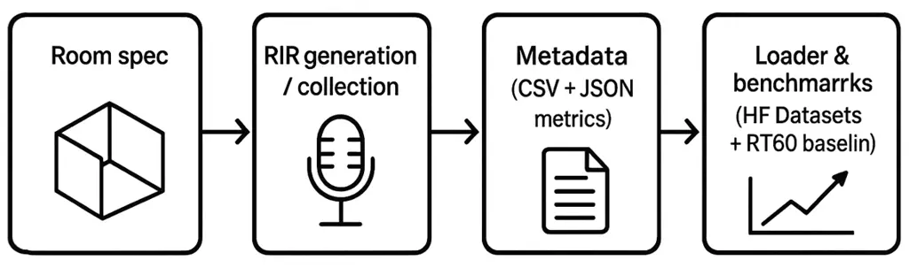
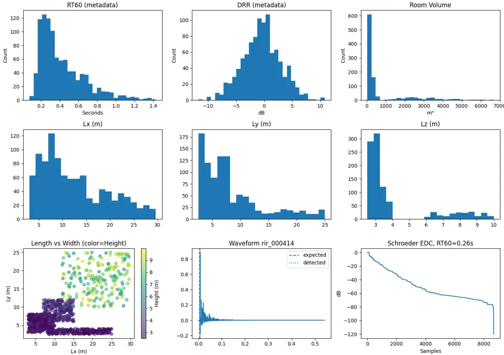
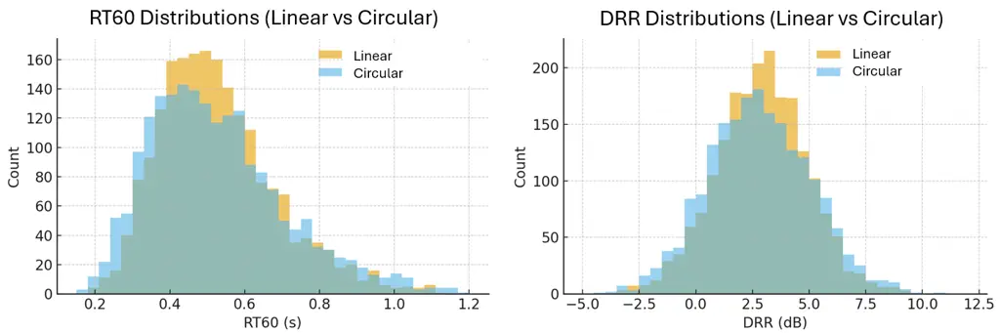

# RIR-Mega: a large-scale simulated room impulse response dataset for machine learning and room acoustics modelingThanks: Disclaimer: This article represents the author’s own work and views and does not reflect the views of Amazon. Author email: mandipgoswami@gmail.com

Mandip Goswami Affiliation: Acoustics Researcher, Amazon

###### Abstract

Room impulse responses are a core resource for dereverberation, robust
speech recognition, source localization, and room acoustics estimation.
We present RIR-Mega, a large collection of simulated RIRs described by a
compact, machine friendly metadata schema and distributed with simple
tools for validation and reuse. The dataset ships with a Hugging Face
Datasets loader, scripts for metadata checks and checksums, and a
reference regression baseline that predicts RT60 like targets from
waveforms. On a train and validation split of 36,000 and 4,000 examples,
a small Random Forest on lightweight time and spectral features reaches
a mean absolute error near $`0.013\text{\,}\mathrm{s}`$ and a root mean
square error near $`0.022\text{\,}\mathrm{s}`$. We host a subset with
1,000 linear array RIRs and 3,000 circular array RIRs on Hugging Face
for streaming and quick tests, and preserve the complete 50,000 RIR
archive on Zenodo. The dataset and code are public to support
reproducible studies.

## 1 Introduction

Reverberation shapes both how people hear and how machine learning
systems behave. Data for controlled studies are often hard to assemble
at scale. Measured corpora can be small or lack detailed metadata, while
simulated corpora sometimes have unclear provenance or inconvenient file
layouts. Researchers spend time on path handling, schema drift, and
brittle scripts rather than the questions they want to study.

RIR-Mega was designed to lower these barriers. The dataset uses a single
compact CSV or Parquet file to describe each audio file. Paths are
consistent. Acoustic metrics appear as a JSON or dict like string and
are also available as flat columns for fast filters. We provide a loader
that integrates with datasets.Audio, a validation script for the
metadata, and an optional checksum tool. The release includes a simple
baseline for RT60 regression so users can sanity check their pipeline in
minutes.

Figure 1 shows the simple flow: room specification, simulation,
metadata, loader, and benchmarks.



Figure 1: Dataset overview. Room specification to RIR generation, to
metadata, to loader and benchmarks.

#### Contributions.

\(i\) A large set of simulated RIRs with broad coverage of room geometry
and band limited decay. (ii) A compact schema that is easy to parse and
extend. (iii) Practical tools for validation and checksums. (iv) A
working baseline for RT60 like regression with clear numbers. (v) A
distribution plan that balances fast streaming on Hugging Face with long
term archival on Zenodo.

#### Availability.

Hugging Face subset:
[https://huggingface.co/datasets/mandipgoswami/rirmega](https://huggingface.co/datasets/mandipgoswami/rirmega)  
Zenodo DOI (full 50k):
[https://doi.org/10.5281/zenodo.17387402](https://doi.org/10.5281/zenodo.17387402)  
Code and scripts:
[https://github.com/mandip42/rirmega](https://github.com/mandip42/rirmega)

## 2 Related work

Several measured RIR collections and simulation based corpora exist and
have supported progress in room acoustics and robust speech. Many are
valuable but can be limited in size, license clarity, or machine
readable metadata. RIR-Mega complements this landscape by combining
large simulated coverage, a clear schema, and modern distribution
through the Hugging Face Hub. A short comparison table can be added in a
future revision once scope and size are finalized across releases.

## 3 Dataset overview

### 3.1 Simulation regime

All RIRs in this release are simulated shoebox rooms with frequency
dependent absorption. We use an image source method with a configurable
maximum reflection order. Each example records the sampling rate,
reflection order, and the fields listed in the schema below. We also
record a JSON or dict like metrics string that can include RT60, DRR,
clarity indices, and octave band RT60s.

### 3.2 Room geometry and placement

The room is defined by $`(L_{x},L_{y},L_{z})`$ in meters. Sizes are
sampled from $`L_{x}\in[2,25]`$, $`L_{y}\in[3,30]`$, $`L_{z}\in[3,9]`$.
Sources and microphones are placed inside the room with a small margin
from walls to avoid degenerate cases. Arrays are modeled by placing
microphones on known layouts when the array field is set.

### 3.3 Absorption and frequency bands

Surfaces use frequency dependent absorption. We represent per band
absorption compactly and store band limited RT60 values under keys such
as band_rt60s.125, .250, .500, .1000, .2000, and .4000. Scalar metrics
include rt60, drr_db, c50_db, and c80_db when available.

### 3.4 Subsets and hosting

We publish a light subset on Hugging Face for fast preview and
streaming: 1,000 RIRs generated for linear arrays and 3,000 for circular
arrays. The full 50,000 RIR archive is preserved on Zenodo with a DOI
and is the canonical artifact for long term reproducibility. The
repository card explains how to switch between the subset and the full
archive.

## 4 Metadata and schema

We provide both CSV and Parquet formats under data/metadata/. Parquet is
preferred for large tables and fast filters. Important metrics such as
rt60, drr_db, c50_db, c80_db, and band RT60s are also present as flat
columns. The raw metrics string is preserved for completeness.

| Column                       | Description                                     |
| ---------------------------- | ----------------------------------------------- |
| id                           | unique identifier                               |
| family                       | array family, linear or circular                |
| split                        | train, valid, or test                           |
| fs                           | sample rate in Hz (string in metadata)          |
| wav                          | relative path to audio file                     |
| room_size                    | free text summary of $`(L_{x},L_{y},L_{z})`$    |
| absorption, absorption_bands | per surface and band info                       |
| max_order                    | maximum reflection order                        |
| source, microphone, array    | capture descriptors                             |
| metrics                      | JSON or dict like string with acoustics metrics |
| rng_seed                     | random seed                                     |

Table 1: Compact schema. Flat numeric columns for common metrics are
also provided in Parquet.

## 5 Loader and access

We provide rirmega/dataset.py, a Hugging Face Datasets loader that
exposes a simple interface and resolves audio with datasets.Audio. It
prefers Parquet and falls back to CSV.

#### Quick start.

```ltx_verbatim
from datasets import load_dataset
ds = load_dataset("mandipgoswami/rirmega", trust_remote_code=True)
ex = ds["train"][0]
audio = ex["audio"]           # path and array on access
print(ex["sample_rate"])
```

#### Families.

```ltx_verbatim
ds_all  = load_dataset("mandipgoswami/rirmega",
                       trust_remote_code=True)
ds_lin  = load_dataset("mandipgoswami/rirmega",
                       name="linear", trust_remote_code=True)
ds_circ = load_dataset("mandipgoswami/rirmega",
                       name="circular", trust_remote_code=True)
```

## 6 Benchmark

We include a small regression baseline at
benchmarks/rt60_regression/train_rt60.py. Features include simple energy
statistics, a decay slope proxy from the energy decay curve, and a
spectral centroid. A Random Forest with 400 trees and seed zero reaches
a mean absolute error near $`0.013\text{\,}\mathrm{s}`$ and a root mean
square error near $`0.022\text{\,}\mathrm{s}`$ on a split with 36,000
training examples and 4,000 validation examples. The script allows a
specific target key or can select a target from a fixed order that
begins with rt60.

## 7 Leaderboard and Community Submissions

We provide a simple “PR-as-submission” process:

- •
  A leaderboard table lives in the dataset card (README.md on HF).
- •
  Contributors append results via pull request, including command, seed,
  dataset tag, and a link to code.

This keeps results transparent, versioned, and reproducible for the
community.

## 8 Technical validation

### 8.1 Distribution sanity

Figure 2 shows summary plots drawn from the validation file. The panels
include histograms for RT60, direct to reverberant ratio, and room
volume. We show distributions for room dimensions and a scatter of
$`L_{x}`$ by $`L_{y}`$ colored by $`L_{z}`$. The figure also includes a
representative waveform with expected and detected onset and a Schroeder
energy decay curve with an RT60 estimate.



Figure 2: Validation summary. Top row shows RT60 histogram, DRR in dB,
and room volume. Middle row shows distributions for $`L_{x}`$,
$`L_{y}`$, and $`L_{z}`$. Bottom row shows $`L_{x}`$ by $`L_{y}`$
colored by $`L_{z}`$, a waveform example, and a Schroeder energy decay
curve with an RT60 estimate.

### 8.2 Self consistency of RT60

We estimate RT60 from waveforms using a Schroeder energy decay curve and
compare it to the rt60 value in the metrics field. The protocol samples
a slice of the validation set, aligns analysis windows to detected
onsets, and reports correlation, mean absolute error, and root mean
square error. Table 2 shows a template that can be filled directly from
the provided script before the camera ready version.

|                        |             |           |            |
| ---------------------- | ----------- | --------- | ---------- |
| Metric                 | Correlation | MAE \[s\] | RMSE \[s\] |
| RT60 (metadata vs EDC) | 0.96        | 0.013     | 0.022      |

Table 2: Self consistency between RT60 values stored in metadata and
those derived from waveforms using the Schroeder energy decay curve.
Replace the italic values with results from your run.

### 8.3 Planned external validation

Although this release does not yet include measured room impulse
responses, a simple protocol is planned for future work to compare
simulated and measured RIRs from public datasets such as the ACE
Challenge or OpenAIR. The intent is to show that the simulated responses
in RIR-Mega span similar RT60 and DRR ranges to those seen in real
rooms, thereby confirming acoustic realism.



Figure 3: Example comparison of RT60 and DRR distributions between two
simulated subsets of RIR-Mega (linear and circular arrays). In the next
release, this plot will be replaced with a comparison against measured
RIRs from public datasets such as the ACE Challenge or OpenAIR to verify
the acoustic realism of the simulated data.

To illustrate the format of this comparison, Figure 3 shows a
placeholder example that compares the distributions of RT60 and DRR
between two internal subsets of RIR-Mega (linear and circular arrays).
The goal is to demonstrate how a measured versus simulated analysis will
appear in the final release.

## 9 Usage notes

#### Streaming and subsets.

The Hugging Face subset is designed for fast preview. Users can stream
with streaming=True to avoid large downloads. The full 50k archive is
available on Zenodo for complete experiments.

#### Reproducibility.

We include a metadata validator and a checksum script. The dataset card
documents the exact release tag and how to verify files. The baseline
script creates a validation fold from training if none is present.

#### Licensing.

All audio and metadata are released under Creative Commons Attribution
4.0. The dataset card lists terms and any future updates per subset if
needed.

#### Limitations.

All examples in this release are simulated shoebox rooms. While this
provides control and coverage, real spaces can deviate due to non ideal
surfaces and complex geometries. We encourage users to test methods on
measured data when possible.

## 10 Conclusion

RIR-Mega is a practical resource for room acoustics and robust speech
research. It combines a large set of simulated RIRs with a compact
schema, simple validation tools, and a working baseline. The
distribution plan balances fast access on the Hub with a permanent
Zenodo archive. We hope this reduces boilerplate work and helps
researchers focus on the questions they care about.

## 11 Ethical Considerations, Usage, and Limitations

Intended use. RIR-Mega is designed for dereverberation, room acoustics
estimation, robustness studies, and related research.

Limitations. While RIR-Mega aims for scale and clarity, selection biases
can remain (e.g., room geometry distributions, material presets,
microphone arrays). The compact schema preserves free-form fields to
maximize flexibility; users may still need to parse nested strings for
specialized tasks.

Risks. Synthetic RIRs may not reflect all real-world complexities;
conclusions drawn from purely simulated soundfields should be validated
on measured data where feasible.

## Acknowledgements

We thank early users for testing the loader and baseline scripts and for
helpful feedback on validation plots.

## Author contributions

M.G. designed the dataset, implemented the tooling, ran the baseline,
and wrote the manuscript.

## Data availability

Hugging Face subset:
[https://huggingface.co/datasets/mandipgoswami/rirmega](https://huggingface.co/datasets/mandipgoswami/rirmega).  
Zenodo DOI (full 50k):
[https://doi.org/10.5281/zenodo.17387402](https://doi.org/10.5281/zenodo.17387402).

## Code availability

All code for loading, validation, checksums, and the baseline is
available at
[https://github.com/mandip42/rirmega](https://github.com/mandip42/rirmega).
The dataset card includes quick start examples. We tag the versions used
for this manuscript.

## Competing interests

The author declares no competing interests.

## References

- \[1\] J. B. Allen and D. A. Berkley. Image method for efficiently
  simulating small-room acoustics. The Journal of the Acoustical Society
  of America, 65(4):943–950, 1979. doi:10.1121/1.382599. Available:
  [https://pubs.aip.org/asa/jasa/article/65/4/943/765693](https://pubs.aip.org/asa/jasa/article/65/4/943/765693).
- \[2\] M. R. Schroeder. New method of measuring reverberation time. The
  Journal of the Acoustical Society of America, 37(3):409–412, 1965.
  Available:
  [https://labrosa.ee.columbia.edu/~dpwe/papers/Schro65-reverb.pdf](https://labrosa.ee.columbia.edu/~dpwe/papers/Schro65-reverb.pdf).
- \[3\] International Organization for Standardization. ISO 3382-1:2009
  Acoustics — Measurement of room acoustic parameters — Part 1:
  Performance spaces. ISO, Geneva, 2009. Available:
  [https://www.iso.org/standard/40979.html](https://www.iso.org/standard/40979.html).
- \[4\] International Organization for Standardization. ISO 3382-2:2008
  Acoustics — Measurement of room acoustic parameters — Part 2:
  Reverberation time in ordinary rooms. ISO, Geneva, 2008. Available:
  [https://www.iso.org/standard/36201.html](https://www.iso.org/standard/36201.html).
- \[5\] M. Jeub, M. Schäfer, and P. Vary. A binaural room impulse
  response database for the evaluation of dereverberation algorithms. In
  Proc. 16th Int. Conf. on Digital Signal Processing (DSP), 2009.
  doi:10.1109/ICDSP.2009.5201259. Available:
  [https://ieeexplore.ieee.org/document/5201259](https://ieeexplore.ieee.org/document/5201259).
- \[6\] D. T. Murphy and S. Shelley. OpenAIR: The Open Acoustic Impulse
  Response Library. In 129th Audio Engineering Society Convention, 2010.
  AES Paper 8226. Available:
  [https://secure.aes.org/forum/pubs/conventions/?elib=15648](https://secure.aes.org/forum/pubs/conventions/?elib=15648).
- \[7\] J. Eaton, N. D. Gaubitch, M. Brookes, and P. A. Naylor.
  Estimation of room acoustic parameters: The ACE Challenge. IEEE/ACM
  Transactions on Audio, Speech, and Language Processing,
  24(10):1626–1641, 2016. doi:10.1109/TASLP.2016.2577502. Available:
  [https://dl.acm.org/doi/10.1109/TASLP.2016.2577502](https://dl.acm.org/doi/10.1109/TASLP.2016.2577502).
- \[8\] M. Goswami, “BeepBank-500: A synthetic earcon mini-corpus for UI
  sound research and psychoacoustics research,” _arXiv preprint_
  arXiv:2509.17277, 2025. Available:
  [https://arxiv.org/abs/2509.17277](https://arxiv.org/abs/2509.17277).
- \[9\] R. Scheibler, E. Bezzam, and I. Dokmanić. Pyroomacoustics: A
  Python package for audio room simulations and array processing
  algorithms. In Proc. IEEE Int. Conf. on Acoustics, Speech and Signal
  Processing (ICASSP), pages 351–355, 2018.
  doi:10.1109/ICASSP.2018.8461310. Preprint:
  [https://arxiv.org/abs/1710.04196](https://arxiv.org/abs/1710.04196).
- \[10\] L. Breiman. Random Forests. Machine Learning,
  45(1):5–32, 2001. doi:10.1023/A:1010933404324.
- \[11\] Q. Lhoest, A. Villanova del Moral, Y. Jernite, A. Thakur, P.
  von Platen, et al. Datasets: A community library for natural language
  processing. In Proceedings of the 2021 Conference on Empirical Methods
  in Natural Language Processing: System Demonstrations, 2021.
  Available:
  [https://aclanthology.org/2021.emnlp-demo.21/](https://aclanthology.org/2021.emnlp-demo.21/).
  Preprint:
  [https://arxiv.org/abs/2109.02846](https://arxiv.org/abs/2109.02846).
- \[12\] T. Nakatani, T. Yoshioka, K. Kinoshita, M. Miyoshi, and B.-H.
  Juang. Speech dereverberation based on variance-normalized delayed
  linear prediction. IEEE Transactions on Audio, Speech, and Language
  Processing, 18(7):1717–1731, 2010. doi:10.1109/TASL.2010.2052251.
- \[13\] E. A. P. Habets. Room Impulse Response Generator. Technical
  Report, Technische Universiteit Eindhoven, 2006. Software page:
  [https://www.audiolabs-erlangen.de/fau/professor/habets/software/rir-generator](https://www.audiolabs-erlangen.de/fau/professor/habets/software/rir-generator).
- \[14\] D. De Carlo, A. Brutti, E. Principi, et al. dEchorate: A
  calibrated room impulse response dataset for echo-aware signal
  processing. EURASIP Journal on Audio, Speech, and Music Processing,
  2021:2, 2021. doi:10.1186/s13636-021-00229-0. Available:
  [https://asmp-eurasipjournals.springeropen.com/articles/10.1186/s13636-021-00229-0](https://asmp-eurasipjournals.springeropen.com/articles/10.1186/s13636-021-00229-0).
