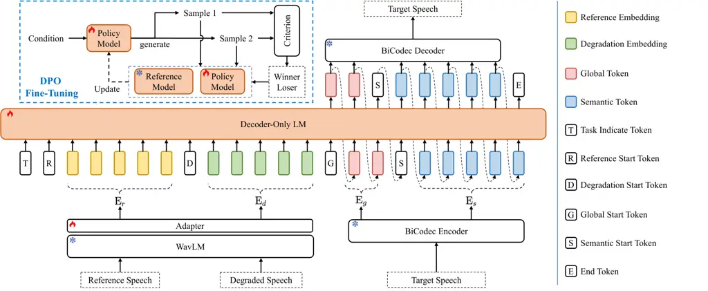

Yan Liu Xue Liang Liu Kong Xue

# UniSE: A Unified Framework for Decoder-Only Autoregressive LM-Based Speech Enhancement

Haoyin    Chengwei    Shaofei    Xiaotao    Yinghao    Yuxiang    Zheng

###### Abstract

Neural audio codecs have largely promoted the application of language
models (LMs) for speech applications. However, the effectiveness of
autoregressive LM-based models in unifying speech enhancement (SE) tasks
remains underexplored. In this work, we propose UniSE, a unified
decoder-only LM-based framework to handle different SE tasks including
speech restoration, target speaker extraction, and speech separation.
Conditioned on input speech features, it autoregressively generates
target discrete tokens, facilitating compatibility between distinct
learning patterns of multiple tasks. To further optimize speech quality,
we introduce a progressive reinforcement learning strategy with multiple
assessment criteria. Experiments on several benchmarks show that UniSE
achieves competitive performance compared to discriminative and
generative baselines, demonstrating the capacity of LMs in unifying SE
tasks. The code and demo are available at:
https://github.com/alibaba/unified-audio/tree/main/QuarkAudio-UniSE.

###### keywords

Speech enhancement, decoder-only autoregressive language models, unified
framework

^(†)^(†)address: ¹ Qwen Business Unit of Alibaba, China  
² Tongyi AI Lab of Alibaba, China ^(†)^(†)email:
yanhaoyin.yhy@alibaba-inc.com, liuchengwei.lcw@alibaba-inc.com

## 1 Introduction

Recently, speech enhancement (SE) has expanded beyond conventional
denoising toward reconstructing clean target speech from degraded
recordings \[1, 2\]. In this context, SE can include many sub-tasks:
speech restoration (SR) that aims to restore speech from the degraded
recordings with various distortions; target speaker extraction (TSE)
that extracts the target speech guided by an assistive clue, e.g.,
reference speech of the target speaker; speech separation (SS) that aims
at separating all existing speakers from the mixture. Deep neural
networks achieve better performance in non-stationary scenarios than
traditional algorithms and thus become the mainstream in this field \[3,
4\].

Language models (LMs) have achieved remarkable success in generating
text \[5\], images \[6\] and audio \[7, 8\]. Some works have explored
applications of LMs to SE by typically predicting the discrete tokens of
clean speech, which are extracted by pre-trained neural audio codecs
(NACs). For instance, GenSE \[9\] is a two-stage approach based on
autoregressive (AR) modeling, where the first stage generates clean
semantic tokens in noisy semantic conditions, and the outputs are
utilized to predict clean acoustic features in the second stage.
In \[10\], a TSE model called LauraTSE extracts continuous features of
mixture and reference speech, serving as prefixes to estimate the target
discrete tokens. Although these works have shown the potential of LMs in
SE, they are confined to single distortion or task, resulting in limited
extensibility to diverse scenarios.

Some studies consider more distortions or focus on the unification of
multiple tasks to expand the universality of SE systems. MaskSR \[11\]
handles additive noise, reverberation, clipping and bandwidth limitation
via masked prediction \[12\] on multi-layer discrete tokens.
LLaSE-G1 \[13\] employs a non-autoregressive (NAR) LM to map noisy
WavLM \[14\] features to the clean discrete tokens, with a dual-channel
input and output architecture to support multiple tasks. These works
involve the paradigm of masked generation or direct mapping, and the
effectiveness of AR modeling in multi-task SE frameworks remains to be
further verified. Considering the flexible prefix formulations of the
decoder-only model, it has potential to act as an elegant solution for
the task unification.

In the context of Large Language Models (LLMs), reinforcement learning
(RL) has been primarily employed to align model behavior with human
preferences and task-specific objectives \[15\]. Some works have
verified the potential of RL in the domain of text-to-speech (TTS). For
instance, the Direct Preference Optimization (DPO) \[16\] framework is
utilized to improve the emotional consistency of synthesized speech
in \[17\]. However, the application of RL in SE remains largely
unexplored. While traditional SE systems rely on supervised learning
with signal-level losses (e.g., SI-SNR), these metrics do not always
correlate well with auditory perception. This gap motivates the
exploration of RL-based alignment in SE: by leveraging perceptual
rewards as feedback, the RL has potential to guide the SE model towards
better perceptual alignment.



Figure 1: Overall architecture of UniSE, where the BiCodec Encoder is
only utilized to generate label tokens during training and excluded
during inference. The snowflake icon means that parameters are
pre-trained and frozen, and the fire icon indicates that parameters are
optimized during training.

In this work, we propose a decoder-only AR LM-based framework called
UniSE to unify multiple sub-tasks of SE, including SR, TSE and SS. Our
contributions are fourfold: 1) We design a decoder-only SE framework,
which utilizes continuous conditional features to generate discrete
tokens of target speech. 2) We propose a task token to distinguish
between different operational modes, unifying multiple tasks by
switching and combination of these modes. 3) We introduce a progressive
reinforcement learning (PRL) strategy to fine-tune our model, where
criteria (i.e., perceptual quality and similarity) are progressively
introduced across different stages to perform DPO optimization. 4) Our
model achieves competitive performance on several benchmarks, revealing
the potential of decoder-only AR LM in the unification of SE sub-tasks.

## 2 METHODOLOGY

Fig. 1 illustrates the UniSE framework, comprising: (1) a pre-trained
WavLM model with a trainable adapter for continuous speech feature
extraction; (2) a discrete speech codec for tokenization and waveform
reconstruction; (3) a decoder-only language model (LM) backbone for
autoregressive (AR) conditional modeling; and (4) a DPO fine-tuning
framework for perceptual quality enhancement.

### 2.1 Conditional Feature Extractor

To extract conditioning features from reference and degraded speech
input, we adopt the pre-trained WavLM¹¹ 1
https://huggingface.co/microsoft/wavlm-base-plus as the feature
extractor. We average the features from all transformer layers in WavLM
to obtain sufficient acoustic and semantic information simultaneously. A
trainable linear adapter maps the output from frozen WavLM into a
representation space amenable to LM AR modeling, yielding features
$`{\rm E}_{r}`$ and $`{\rm E}_{d}`$ for reference and degraded speech,
respectively.

### 2.2 Discrete Token Codec

We utilize BiCodec \[8\] to convert the continuous regression problems
of SE into discrete autoregressive modeling. During training, the
BiCodec Encoder produces a fixed-length global feature $`{\rm E}_{g}`$
(32 tokens, speaker characteristics) and a variable-length semantic
feature $`{\rm E}_{s}`$ (50 tokens/s, speech content), both with
single-layer quantization for easy AR integration. During inference, the
BiCodec decoder reconstructs the original speech by combining
$`{\rm E}_{g}`$ and $`{\rm E}_{s}`$, leveraging this explicit
disentanglement for high-fidelity restoration. which benefits from this
explicit disentanglement to achieve high fidelity.

### 2.3 Unified Multi-Task Framework

The proposed framework adopts the LLaMA architecture \[18\] as the
backbone for AR modeling, aiming to estimate the conditional probability
distribution of target speech discrete representations given optional
reference and degraded speech inputs. To unify SR, TSE and SS tasks
within a single framework, we define three operational modes: SR mode,
TSE mode and reverse TSE (rTSE) mode. Each mode corresponds to a
learnable task-specific token: $`{\rm T_{SR}}`$, $`{\rm T_{TSE}}`$, and
$`{\rm T_{rTSE}}`$. In SR mode, the target speech corresponds to the
clean signal of the degraded input. The input sequence of AR LM is
formatted as \[$`{\rm T_{SR}}`$, $`{\rm D}`$, $`{\rm E}_{d}`$,
$`{\rm G}`$, $`{\rm E}_{g}`$, $`{\rm S}`$, $`{\rm E}_{s}`$\], where
$`{\rm D}`$ denotes the start of degraded speech features, $`{\rm G}`$
the start of global features, and $`{\rm S}`$ the start of semantic
features, respectively. The output sequence is formulated as
$`{\bm{o}}=\left[{\rm E}_{g},{\rm S},{\rm E}_{s},{\rm E}\right]`$, with
$`{\rm E}`$ representing the end-of-sequence token. The parameters
$`\theta`$ of the adapter and decoder-only LM are optimized by
minimizing the negative log-likelihood of the predicted outputs:

```math
\displaystyle\mathcal{L}_{\rm SR}=-\sum_{t=1}^{L}{\rm log}P\left(o_{t}|{\rm T_{SR}},{\rm D},{\rm E}_{d},o_{<t};\theta\right), \tag{1}
```

where $`L`$ indicates the length of output sequence.

For the TSE mode, the target speech corresponds to the timbre-matched
speech component in the degraded input that aligns with the reference
audio. The input sequence is formatted as \[$`{\rm T_{TSE}}`$,
$`{\rm R}`$, $`{\rm E}_{r}`$, $`{\rm D}`$, $`{\rm E}_{d}`$, $`{\rm G}`$,
$`{\rm E}_{g}`$, $`{\rm S}`$, $`{\rm E}_{s}`$\], where $`{\rm R}`$
denotes the start of reference speech features. The associated loss
function is defined as

```math
\displaystyle\mathcal{L}_{\rm TSE}=-\sum_{t=1}^{L}{\rm log}P\left(o_{t}|{\rm T_{TSE}},{\rm R},{\rm E}_{r},{\rm D},{\rm E}_{d},o_{<t};\theta\right). \tag{2}
```

For the rTSE mode, the target speech corresponds to the
timbre-mismatched component in the degraded input when compared with the
reference audio. The input sequence format and loss function
$`\mathcal{L}_{\rm rTSE}`$ keep identical to that of the TSE mode.

### 2.4 Progressive Reinforcement Learning (PRL)

After the training stage of UniSE, we fine-tune it using DPO \[16\]
framework to further improve the perceptual quality of the generated
speech, as illustrated in Fig. 1. The pre-trained UniSE serves as the
reference model and initializes the policy model. During fine-tuning,
the policy model generates two candidate results on-the-fly when given
the condition $`c`$ of reference and degraded speech. After determining
the winner sample $`y_{w}`$ and loser sample $`y_{l}`$ using specific
criterion, the DPO loss is calculated as

```math
\displaystyle\mathcal{L}_{\rm DPO}=-\mathbb{E}\log\sigma\left[\beta\left(\log\frac{\pi_{\theta}(y_{w}|c)}{\pi_{r}(y_{w}|c)}-\log\frac{\pi_{\theta}(y_{l}|c)}{\pi_{r}(y_{l}|c)}\right)\right], \tag{3}
```

where $`\pi_{\theta}`$ and $`\pi_{r}`$ denote the sequence-level
probabilities under the current policy model and reference model,
$`\beta>0`$ is a temperature hyperparameter controlling the strength of
the preference signal, and $`\sigma`$ indicates the sigmoid function.

To better align the model with human subjective perception, we divide
the fine-tuning into two progressive stages. In stage 1 (S1), we adopt
DNSMOS \[19\] as the preference criterion, which predicts three
sub-scores: SIG (signal fidelity), BAK (background noise level), and
OVRL (overall quality). The average of these three scores is used to
determine the winner and loser samples, and the fine-tuning loss is
formulated as

```math
\displaystyle\mathcal{L}_{\rm S1}=\alpha\mathcal{L}_{\rm CE}+\mathcal{L}_{\rm DPO}^{\rm DNSMOS}, \tag{4}
```

where $`\mathcal{L}_{\rm CE}`$ denotes the cross-entropy loss used
during pre-training, $`\alpha\geq 0`$ controls its contribution, and
$`\mathcal{L}_{\rm DPO}^{\rm DNSMOS}`$ is the DPO loss with preference
determined by DNSMOS. In stage 2 (S2), we additionally introduce the
similarity of the WavLM features as the criterion to optimize semantic
and acoustic consistency. Specifically, the WavLM features of candidate
samples and the target speech are computed, and the Euclidean distance
is computed to determine the winner and loser samples, where smaller
distance indicates higher similarity to the ground truth. The
fine-tuning loss in this stage is defined as

```math
\displaystyle\mathcal{L}_{\rm S2}=\alpha\mathcal{L}_{\rm CE}+0.5\mathcal{L}_{\rm DPO}^{\rm DNSMOS}+0.5\mathcal{L}_{\rm DPO}^{\rm WavLM}, \tag{5}
```

where $`\mathcal{L}_{\rm DPO}^{\rm WavLM}`$ is the DPO loss with
preference determined by the WavLM feature distance. Gradually
increasing the complexity of preference signals allows the model to
first establish a stable foundation of perceptual quality before
refining details, thereby avoiding conflicting optimization objectives.

### 2.5 Inference Strategies

To alleviate computational overhead during inference, input speech is
segmented into fixed-length chunks consistent with the training
configuration, as described in MaskSR \[11\]. The SR mode is utilized
for SR task, which restores clean speech from the degraded recording.
When multiple speakers exist in the degraded speech, our model intends
to output the louder speaker. The TSE mode processes the TSE task, which
extracts timbre-matched speech from the mixture regardless of the
relative loudness. While for the SS task, we consider multiple
inferences that involve all three modes. Specifically, for two-speaker
SS (this work only considers the two-speaker case), we first employ the
SR mode to extract the louder speaker. This initial result then serves
as the reference for the TSE mode to separate the first speaker, which
ensures speaker consistency across different segments when relative
loudness varies. Finally, the rTSE mode is applied to extract the
remaining speaker, using the first speaker as a reference.

| Distortion           | Probability      | Hyperparameters                    |
| -------------------- | ---------------- | ---------------------------------- |
| Noise                | 0.8              | SNR $`\in`$ \[-5, 20\]             |
| Reverberation        | 0.3              | \-                                 |
| Clipping             | 0.3              | Min_quantile $`\in`$ \[0.0, 0.1\]  |
|                      |                  | Max_quantile $`\in`$ \[0.9, 1.0\]  |
| Bandwidth Limitation | 0.3              | Bandwidth $`\in`$ {2, 4} kHz       |
| Packet Loss          | 0.3              | Rate $`\in`$ \[0.05, 0.25\]        |
| Interference Speaker | 0.2 for SR       | SIR $`\in`$ \[2, 20\] for SR       |
|                      | 1.0 for TSE/rTSE | SIR $`\in`$ \[-5, 5\] for TSE/rTSE |

Table 1: Distortion categories and simulation configurations, where SNR
denotes signal-to-noise ratio and SIR denotes signal-to-interference
ratio.

## 3 EXPERIMENTS

### 3.1 Experimental Setup

Training Datasets: The clean speech data for training is sourced from
the VoxBox dataset \[8\], an integrated and rigorously cleaned
compilation of multiple public datasets. This set comprises 760 hours of
LibriSpeech \[20\] data, 1200 hours from the MLS_English \[21\] subset,
and 1800 hours of the Emilia_ZH \[22\] subset. The noise corpus
comprises approximately 460 hours of data from the DNS Challenge \[23\],
FSD50K \[24\], WHAM! \[25\], DESED \[26\], DEMAND \[27\], MUSAN \[28\],
DISCO \[29\], MUSDB18-HQ \[30\], and TUT Urban Acoustic Scenes \[31\].
Additionally, we include 60,000 room impulse response (RIR) samples from
SLR28 to simulate reverberation. A data augmentation pipeline simulates
degraded speech, detailed in Table 1. We randomly select operational
modes during training, and distortions are applied based on the given
probability. All audio samples are sampled to 16 kHz.

Implementation Details: The LLaMA-based decoder-only backbone consists
of 12 layers, each with 8 attention heads and a hidden dimension of 512,
resulting in 63M parameters. Our model is trained using AdamW optimizer
with 30 epochs. The learning rate reaches a peak of 1e-3 after 4000
warm-up steps, then decays by a factor of 0.98 per epoch. For
fine-tuning, the factor $`\alpha`$ is set to 0.4 and the model is
updated for 5k steps with a batch size of 32 and a learning rate of
5e-5. During training and inference, the lengths of reference and
degraded speech are clipped/padded to 5 seconds.

|                        |           |            |             |      |      |           |      |      |
| ---------------------- | --------- | ---------- | ----------- | ---- | ---- | --------- | ---- | ---- |
| Model                  | Para. (M) | MACs (G/s) | With Reverb |      |      | No Reverb |      |      |
|                        |           |            | SIG         | BAK  | OVRL | SIG       | BAK  | OVRL |
| Noisy                  | \-        | \-         | 1.76        | 1.50 | 1.39 | 3.39      | 2.62 | 2.48 |
| Discriminative Methods |           |            |             |      |      |           |      |      |
| Conv-TasNet \[3\]      | 5.1       | 5.2        | 2.42        | 2.71 | 2.01 | 3.09      | 3.34 | 3.00 |
| FRCRN \[32\]           | 10.3      | 12.3       | 2.93        | 2.92 | 2.28 | 3.58      | 4.13 | 3.34 |
| TF-GridNet \[33\]      | 2.8       | 49.6       | 3.04        | 3.66 | 2.63 | 3.58      | 4.17 | 3.35 |
| Generative Methods     |           |            |             |      |      |           |      |      |
| SELM \[34\]            | \-        | \-         | 3.16        | 3.58 | 2.70 | 3.51      | 4.10 | 3.26 |
| MaskSR \[11\]          | \-        | \-         | 3.53        | 4.07 | 3.25 | 3.59      | 4.12 | 3.34 |
| AnyEnhance \[35\]      | 363.5     | \-         | 3.50        | 4.04 | 3.20 | 3.64      | 4.18 | 3.42 |
| GenSE \[9\]            | 667.6     | 99.0       | 3.49        | 3.73 | 3.19 | 3.65      | 4.18 | 3.43 |
| LLaSE-G1 \[13\]        | 1895.6    | 63.9       | 3.59        | 4.10 | 3.33 | 3.66      | 4.17 | 3.42 |
| UniSE                  | 263.9     | 42.2       | 3.68        | 4.12 | 3.41 | 3.67      | 4.13 | 3.42 |
| UniSE-SR               | 263.9     | 42.2       | 3.66        | 4.08 | 3.38 | 3.66      | 4.14 | 3.42 |
| UniSE + S1             | 263.9     | 42.2       | 3.77        | 4.21 | 3.55 | 3.73      | 4.19 | 3.51 |
| UniSE + S2             | 263.9     | 42.2       | 3.78        | 4.23 | 3.57 | 3.74      | 4.20 | 3.53 |
| UniSE + PRL            | 263.9     | 42.2       | 3.83        | 4.26 | 3.64 | 3.76      | 4.23 | 3.57 |

Table 2: DNSMOS scores on DNS 2020 Challenge test sets, where “With
Reverb” subset contains reverberation while “No Reverb” subset only
involves noise.

| Team/Model           | Team Rank^(†) | OVRL | NISQA | UTMOS |
| -------------------- | ------------- | ---- | ----- | ----- |
| Bobbsun              | 1             | 2.88 | 3.22  | 2.09  |
| Xiaobin (TF-GridNet) | 2             | 2.92 | 3.24  | 2.16  |
| subatomicseer        | 3             | 2.94 | 3.25  | 2.19  |
| wataru9871           | 13            | 3.10 | 3.74  | 2.53  |
| LLaSE-G1 \[13\]      | -             | 2.80 | 2.93  | 2.09  |
| UniSE                | -             | 3.17 | 3.68  | 2.85  |
| UniSE + PRL          | -             | 3.34 | 3.83  | 2.95  |

- †
  The ranking takes into account both non-intrusive and intrusive
  metrics, where the latter are not friendly to generative models.

Table 3: SR results on URGENT 2025 Challenge blind test set.

|                   |      |      |      |      |       |      |
| ----------------- | ---- | ---- | ---- | ---- | ----- | ---- |
| Model             | Type | SIG  | BAK  | OVRL | NISQA | SIM  |
| Mixture           | \-   | 3.38 | 3.10 | 2.65 | 2.45  | 0.85 |
| Spex+ \[36\]      | D    | 3.38 | 3.77 | 3.00 | 3.03  | 0.96 |
| WeSep \[37\]      | D    | 3.56 | 3.93 | 3.23 | 4.04  | 0.99 |
| TSELM-L \[38\]    | G    | 3.55 | 4.08 | 3.23 | 4.03  | 0.91 |
| AnyEnhance \[35\] | G    | 3.64 | 4.07 | 3.35 | 4.28  | 0.91 |
| LLaSE-G1 \[13\]   | G    | 3.53 | 4.01 | 3.22 | 3.89  | 0.92 |
| LauraTSE \[10\]   | G    | 3.61 | 4.08 | 3.34 | 4.33  | 0.97 |
| UniSE             | G    | 3.62 | 4.06 | 3.33 | 4.01  | 0.95 |
| UniSE-TSE         | G    | 3.62 | 4.07 | 3.33 | 4.00  | 0.95 |
| UniSE + PRL       | G    | 3.70 | 4.14 | 3.45 | 4.10  | 0.95 |
| BiCodec           | \-   | 3.59 | 4.05 | 3.30 | 4.02  | 0.97 |

Table 4: TSE results on Libri2Mix clean test set.

|                    |      |           |      |      |           |      |      |
| ------------------ | ---- | --------- | ---- | ---- | --------- | ---- | ---- |
| Model              | Type | Libri2Mix |      |      | WSJ0-2mix |      |      |
|                    |      | SIG       | BAK  | OVRL | SIG       | BAK  | OVRL |
| Mixture            | \-   | 2.33      | 1.66 | 1.64 | 3.42      | 3.20 | 2.76 |
| Sepformer \[39\]   | D    | 3.33      | 3.88 | 3.02 | 3.43      | 3.96 | 3.14 |
| Mossformer2 \[40\] | D    | 3.44      | 3.94 | 3.11 | 3.50      | 4.05 | 3.23 |
| LLaSE-G1 \[13\]    | G    | 3.48      | 3.83 | 3.11 | 3.52      | 3.92 | 3.19 |
| UniSE              | G    | 3.62      | 4.09 | 3.34 | 3.63      | 4.09 | 3.36 |
| UniSE + PRL        | G    | 3.76      | 4.20 | 3.55 | 3.71      | 4.19 | 3.49 |

Table 5: SS results on Libri2Mix and WSJ0-2mix test sets.

| Method   | With Reverb |      |      | No Reverb |      |      |
| -------- | ----------- | ---- | ---- | --------- | ---- | ---- |
|          | SIG         | BAK  | OVRL | SIG       | BAK  | OVRL |
| UniSE    | 3.68        | 4.12 | 3.41 | 3.67      | 4.13 | 3.42 |
| NAR      | 3.39        | 3.70 | 2.96 | 3.62      | 4.14 | 3.39 |
| Qwen2    | 3.67        | 4.10 | 3.40 | 3.67      | 4.13 | 3.43 |
| X-codec2 | 3.57        | 4.03 | 3.27 | 3.60      | 4.09 | 3.34 |

Table 6: Ablation study on DNS 2020 Challenge test sets.

Figure 2: The OVRL and SIM scores in terms of different $`\alpha`$
values in the TSE task on Libri2Mix clean test set.

Evaluation Configurations: We evaluate our model on several benchmarks,
including test sets from DNS 2020 Challenge \[23\] and URGENT 2025
Challenge \[41\] for SR task, Libri2Mix clean test set for the TSE task,
and Libri2Mix noisy test set with WSJ0-2mix test set for the SS task. We
adopt DNSMOS \[19\], NISQA \[42\] and UTMOS \[43\] to measure the
quality of the generated speech. Following \[10\], the speaker
similarity (SIM) is calculated using WavLM-base²² 2
https://huggingface.co/microsoft/wavlm-base-plus-sv for TSE.

### 3.2 Performance Comparison on Multiple Tasks

Table 2 compares UniSE with advanced baselines on the DNS 2020 Challenge
test set. Generative methods generally surpass discriminative
counterpart, highlighting their potential for improving subjective
listening quality. UniSE achieves state-of-the-art (SOTA) SR
performance, and training exclusively in the SR mode (denoted as
UniSE-SR) shows comparable performance with UniSE. Progressively
introducing criteria outperforms optimization with single stage,
indicating the coarse-to-fine strategy mitigates potential conflicts
between heterogeneous preference signals and can lead to more stable
convergence. Table 3 evaluates our framework against URGENT Challenge
submissions on a blind test set containing multiple distortions. UniSE
achieves competitive performance even under unseen distortions (codec
artifacts, wind noise), demonstrating robust generalization ability.

TSE results on the Libri2Mix clean test set are summarized in Table 4,
showing that UniSE achieves performance comparable to SOTA baselines.
UniSE supports a wider range of tasks than LauraTSE, an AR-based method
with similar architecture and scale. The UniSE-TSE variant trained
exclusively in TSE mode achieves performance comparable to UniSE,
mirroring the relationship between UniSE and UniSE-SR in the SR setting.
This indicates that multi-task learning does not degrade individual task
performance within our framework. Fine-tuning with PRL strategy
consistently enhances perceptual quality, as evidenced by improvements
in DNSMOS and NISQA metrics. Results produced by directly processing
target speech using BiCodec (the bottom row) reveal the performance
limitations of codecs on SE frameworks, demonstrating the necessity of
further improving low-bitrate NACs.

Table 5 compares the SS performance of our model with baselines on
Libri2Mix and WSJ0-2mix test sets. UniSE outperforms other
discriminative and generative models with OVRL scores of 3.34 on
Libri2Mix and 3.36 on WSJ0-2mix. The PRL fine-tuning further improves
the score by 0.21 and 0.13 respectively. This highlights the
effectiveness of our multi-mode inference strategy and PRL fine-tuning.

### 3.3 Ablation Studies

We conduct ablation studies to evaluate the impact of modeling paradigms
and architectures on the SE task. Framing SE task as a mapping from
degraded to target speech,we utilize NAR modeling (“NAR”) for semantic
token prediction. Enhanced speech is then reconstructed from these
tokens and ground-truth global tokens via the BiCodec decoder. However,
the performance degrades notably, highlighting the advantage of AR
modeling in capturing the underlying probability distribution of the
data.

Moreover, replacing the LM backbone with Qwen2 \[5\] yields comparable
results, demonstrating our framework’s flexibility. Conversely,
utilizing X-codec2 \[44\] leads to a clear performance decay, which can
be attributed to its large codebook size that challenges the ability of
LM. We also examine the weighting factor $`\alpha`$ values in (4) during
S1 stage, as illustrated in Fig. 2. When $`\alpha`$ is too low, the
optimization is dominated by the DPO loss, leading to very high OVRL but
a severe degradation in SIM, which reflects a mode collapse. Therefore,
we choose $`\alpha=0.4`$ to balance perceptual quality and speaker
similarity.

## 4 CONCLUSION

In this work, we proposed UniSE, a unified framework for SE that
integrates SR, TSE, and SS tasks. UniSE leverages continuous speech
features as conditions to generate discrete target tokens via AR
modeling. The use of task-specific tokens enables seamless switching and
combination of multiple operational modes within a single model. We
further introduced a PRL fine-tuning strategy for coarse-to-fine
optimization, aligning model generation with human perception. Extensive
results show that our UniSE achieves competitive performance within each
benchmark, verifying the effectiveness of decoder-only AR LM framework
in unifying SE tasks. However, the proposed method faces limitations in
strict streaming due to full-utterance conditioning and inferior
decoding efficiency relative to NAR, posing worthy directions for future
improvement.

## References

- \[1\] H. Liu, Q. Kong, Q. Tian, Y. Zhao, D. Wang, C. Huang, and Y.
  Wang (2021) VoiceFixer: toward general speech restoration with neural
  vocoder. arXiv preprint arXiv:2109.13731. Cited by: §1.
- \[2\] J. Serrà, S. Pascual, J. Pons, R. O. Araz, and D. Scaini (2022)
  Universal speech enhancement with score-based diffusion. arXiv
  preprint arXiv:2206.03065. Cited by: §1.
- \[3\] Y. Luo and N. Mesgarani (2019) Conv-TasNet: surpassing ideal
  time-frequency magnitude masking for speech separation. IEEE/ACM
  Trans. Audio, Speech, Lang. Process. 27 (8), pp. 1256–1266. External
  Links: [Document](https://dx.doi.org/10.1109/TASLP.2019.2915167) Cited
  by: §1, Table 2.
- \[4\] S. Abdulatif, R. Cao, and B. Yang (2024) CMGAN: conformer-based
  metric-gan for monaural speech enhancement. IEEE/ACM Trans. Audio,
  Speech, Lang. Process. 32 (), pp. 2477–2493. External Links:
  [Document](https://dx.doi.org/10.1109/TASLP.2024.3393718) Cited by:
  §1.
- \[5\] Q. Team (2024) Qwen2 technical report. arXiv preprint
  arXiv:2407.10671. Cited by: §1, §3.3.
- \[6\] K. Tian, Y. Jiang, Z. Yuan, B. Peng, and L. Wang (2024) Visual
  autoregressive modeling: scalable image generation via next-scale
  prediction. In Proc. NeurIPS, Vol. 37, pp. 84839–84865. External
  Links:
  [Link](https://proceedings.neurips.cc/paper_files/paper/2024/file/9a24e284b187f662681440ba15c416fb-Paper-Conference.pdf)
  Cited by: §1.
- \[7\] A. Vyas, B. Shi, M. Le, A. Tjandra, Y. Wu, B. Guo, J. Zhang, X.
  Zhang, R. Adkins, W. Ngan, J. Wang, I. Cruz, B. Akula, A. Akinyemi, B.
  Ellis, R. Moritz, Y. Yungster, A. Rakotoarison, L. Tan, C. Summers, C.
  Wood, J. Lane, M. Williamson, and W. Hsu (2023) Audiobox: unified
  audio generation with natural language prompts. arXiv preprint
  arXiv:2312.15821. Cited by: §1.
- \[8\] X. Wang, M. Jiang, Z. Ma, Z. Zhang, S. Liu, L. Li, Z. Liang, Q.
  Zheng, R. Wang, X. Feng, W. Bian, Z. Ye, S. Cheng, R. Yuan, Z.
  Zhao, X. Zhu, J. Pan, L. Xue, P. Zhu, Y. Chen, Z. Li, X. Chen, L.
  Xie, Y. Guo, and W. Xue (2025) Spark-TTS: an efficient llm-based
  text-to-speech model with single-stream decoupled speech tokens. arXiv
  preprint arXiv:2503.01710. Cited by: §1, §2.2, §3.1.
- \[9\] J. Yao, H. Liu, C. CHEN, Y. Hu, E. Chng, and L. Xie (2025)
  GenSE: generative speech enhancement via language models using
  hierarchical modeling. In Proc. ICLR, Cited by: §1, Table 2.
- \[10\] B. Tang, B. Zeng, and M. Li (2025) LauraTSE: target speaker
  extraction using auto-regressive decoder-only language models. arXiv
  preprint arXiv:2504.07402. Cited by: §1, §3.1, Table 4.
- \[11\] X. Li, Q. Wang, and X. Liu (2024) MaskSR: masked language model
  for full-band speech restoration. In Proc. Interspeech, pp. 2275–2279.
  External Links:
  [Document](https://dx.doi.org/10.21437/Interspeech.2024-1584), ISSN
  2958-1796 Cited by: §1, §2.5, Table 2.
- \[12\] H. Chang, H. Zhang, L. Jiang, C. Liu, and W. T. Freeman (2022)
  MaskGIT: masked generative image transformer. In Proc. CVPR, Vol. ,
  pp. 11305–11315. External Links:
  [Document](https://dx.doi.org/10.1109/CVPR52688.2022.01103) Cited by:
  §1.
- \[13\] B. Kang, X. Zhu, Z. Zhang, Z. Ye, M. Liu, Z. Wang, Y. Zhu, G.
  Ma, J. Chen, L. Xiao, C. Weng, W. Xue, and L. Xie (2025) LLaSE-G1:
  incentivizing generalization capability for LLaMA-based speech
  enhancement. arXiv preprint arXiv:2503.00493. Cited by: §1, Table 2,
  Table 3, Table 4, Table 5.
- \[14\] S. Chen, C. Wang, Z. Chen, Y. Wu, S. Liu, Z. Chen, J. Li, N.
  Kanda, T. Yoshioka, X. Xiao, J. Wu, L. Zhou, S. Ren, Y. Qian, Y.
  Qian, J. Wu, M. Zeng, X. Yu, and F. Wei (2022) WavLM: large-scale
  self-supervised pre-training for full stack speech processing. IEEE J.
  Sel. Top. Signal Process. 16 (6), pp. 1505–1518. External Links:
  [Document](https://dx.doi.org/10.1109/JSTSP.2022.3188113) Cited by:
  §1.
- \[15\] Y. Cao, H. Zhao, Y. Cheng, T. Shu, Y. Chen, G. Liu, G.
  Liang, J. Zhao, J. Yan, and Y. Li (2025) Survey on large language
  model-enhanced reinforcement learning: concept, taxonomy, and methods.
  IEEE Trans. Neural Netw. Learn. Syst. 36 (6), pp. 9737–9757. External
  Links: [Document](https://dx.doi.org/10.1109/TNNLS.2024.3497992) Cited
  by: §1.
- \[16\] R. Rafailov, A. Sharma, E. Mitchell, S. Ermon, C. D. Manning,
  and C. Finn (2023) Direct preference optimization: your language model
  is secretly a reward model. In Proc. NeurIPS, NIPS ’23. Cited by: §1,
  §2.4.
- \[17\] X. Gao, C. Zhang, Y. Chen, H. Zhang, and N. F. Chen (2025)
  Emo-DPO: controllable emotional speech synthesis through direct
  preference optimization. In Proc. ICASSP, Vol. , pp. 1–5. External
  Links:
  [Document](https://dx.doi.org/10.1109/ICASSP49660.2025.10888737) Cited
  by: §1.
- \[18\] H. Touvron, T. Lavril, G. Izacard, X. Martinet, M. Lachaux, T.
  Lacroix, B. Rozière, N. Goyal, E. Hambro, F. Azhar, A. Rodriguez, A.
  Joulin, E. Grave, and G. Lample (2023) LLaMA: open and efficient
  foundation language models. arXiv preprint arXiv:2302.13971. Cited by:
  §2.3.
- \[19\] C. K. A. Reddy, V. Gopal, and R. Cutler (2022) DNSMOS P.835: a
  non-intrusive perceptual objective speech quality metric to evaluate
  noise suppressors. In Proc. ICASSP, pp. 886–890. Cited by: §2.4, §3.1.
- \[20\] V. Panayotov, G. Chen, D. Povey, and S. Khudanpur (2015)
  Librispeech: an asr corpus based on public domain audio books. In
  Proc. ICASSP, pp. 5206–5210. External Links:
  [Link](https://ieeexplore.ieee.org/document/7178964) Cited by: §3.1.
- \[21\] V. Pratap, Q. Xu, A. Sriram, G. Synnaeve, and R.
  Collobert (2020) MLS: a large-scale multilingual dataset for speech
  research.. In Proc. Interspeech, pp. 2757–2761. Cited by: §3.1.
- \[22\] H. He, Z. Shang, C. Wang, X. Li, Y. Gu, H. Hua, L. Liu, C.
  Yang, J. Li, P. Shi, Y. Wang, K. Chen, P. Zhang, and Z. Wu (2024)
  Emilia: an extensive, multilingual, and diverse speech dataset for
  large-scale speech generation.. In Proc. SLT, pp. 885–890. Cited by:
  §3.1.
- \[23\] C. K. A. Reddy, V. Gopal, R. Cutler, E. Beyrami, R. Cheng, H.
  Dubey, S. Matusevych, R. Aichner, A. Aazami, S. Braun, P. Rana, S.
  Srinivasan, and J. Gehrke (2020) The interspeech 2020 deep noise
  suppression challenge: datasets, subjective testing framework, and
  challenge results. In Proc. Interspeech, pp. 2492–2496. Cited by:
  §3.1, §3.1.
- \[24\] E. Fonseca, X. Favory, J. Pons, F. Font, and X. Serra (2022)
  FSD50K: an open dataset of human-labeled sound events.. IEEE/ACM
  Trans. Audio, Speech, Lang. Process. 30, pp. 829–852. Cited by: §3.1.
- \[25\] G. Wichern, J. Antognini, M. Flynn, L. R. Zhu, E. McQuinn, D.
  Crow, E. Manilow, and J. L. Roux (2019) WHAM!: extending speech
  separation to noisy environments. In Proc. Interspeech, pp. 1368–1372.
  External Links:
  [Document](https://dx.doi.org/10.21437/Interspeech.2019-2821), ISSN
  2958-1796 Cited by: §3.1.
- \[26\] N. Turpault, R. Serizel, J. Salamon, and A. P. Shah (2019)
  Sound event detection in domestic environments with weakly labeled
  data and soundscape synthesis. In Proc. DCASE, M. I. Mandel, J.
  Salamon, and D. P. W. Ellis (Eds.), pp. 253–257. Cited by: §3.1.
- \[27\] J. Thiemann, N. Ito, and E. Vincent (2013) The diverse
  environments multi-channel acoustic noise database: A database of
  multichannel environmental noise recordings. J. Acoust. Soc. Am. 133,
  pp. 3591–3591. Cited by: §3.1.
- \[28\] D. Snyder, G. Chen, and D. Povey (2015) MUSAN: a music, speech,
  and noise corpus. arXiv preprint arXiv:1510.08484. Cited by: §3.1.
- \[29\] N. Furnon, R. Serizel, S. Essid, and I. Illina (2021) DNN-based
  mask estimation for distributed speech enhancement in spatially
  unconstrained microphone arrays. IEEE/ACM Trans. Audio, Speech, Lang.
  Process. 29, pp. 2310–2323. Cited by: §3.1.
- \[30\] Z. Rafii, A. Liutkus, F. Stöter, S. I. Mimilakis, and R.
  Bittner MUSDB18-HQ - an uncompressed version of MUSDB18. Note:
  \[Online\]Available:
  [https://doi.org/10.5281/zenodo.3338373](https://doi.org/10.5281/zenodo.3338373)
  Cited by: §3.1.
- \[31\] A. Mesaros, T. Heittola, and T. Virtanen (2018) A multi-device
  dataset for urban acoustic scene classification.. In Proc. DCASE,
  pp. 9–13. Cited by: §3.1.
- \[32\] S. Zhao, B. Ma, K. N. Watcharasupat, and W. Gan (2022) FRCRN:
  boosting feature representation using frequency recurrence for
  monaural speech enhancement.. In Proc. ICASSP, pp. 9281–9285. Cited
  by: Table 2.
- \[33\] Z. Wang, S. Cornell, S. Choi, Y. Lee, B. Kim, and S.
  Watanabe (2023) TF-gridnet: integrating full- and sub-band modeling
  for speech separation. IEEE/ACM Trans. Audio, Speech, Lang. Process.
  31 (), pp. 3221–3236. External Links:
  [Document](https://dx.doi.org/10.1109/TASLP.2023.3304482) Cited by:
  Table 2.
- \[34\] Z. Wang, X. Zhu, Z. Zhang, Y. Lv, N. Jiang, G. Zhao, and L.
  Xie (2024) SELM: speech enhancement using discrete tokens and language
  models. In Proc. ICASSP, Vol. , pp. 11561–11565. External Links:
  [Document](https://dx.doi.org/10.1109/ICASSP48485.2024.10447464) Cited
  by: Table 2.
- \[35\] J. Zhang, J. Yang, Z. Fang, Y. Wang, Z. Zhang, Z. Wang, F. Fan,
  and Z. Wu (2025) AnyEnhance: a unified generative model with
  prompt-guidance and self-critic for voice enhancement. arXiv preprint
  arXiv:2501.15417. Cited by: Table 2, Table 4.
- \[36\] M. Ge, C. Xu, L. Wang, E. S. Chng, J. Dang, and H. Li (2020)
  SpEx+: a complete time domain speaker extraction network. In Proc.
  Interspeech, pp. 1406–1410. Cited by: Table 4.
- \[37\] S. Wang, K. Zhang, S. Lin, J. Li, X. Wang, M. Ge, J. Yu, Y.
  Qian, and H. Li (2024) WeSep: a scalable and flexible toolkit towards
  generalizable target speaker extraction. In Proc. Interspeech,
  pp. 4273–4277. Cited by: Table 4.
- \[38\] B. Tang, B. Zeng, and M. Li (2024) TSELM: target speaker
  extraction using discrete tokens and language models. arXiv preprint
  arXiv:2409.07841. Cited by: Table 4.
- \[39\] C. Subakan, M. Ravanelli, S. Cornell, M. Bronzi, and J.
  Zhong (2021) Attention is all you need in speech separation.. In Proc.
  ICASSP, pp. 21–25. Cited by: Table 5.
- \[40\] S. Zhao, Y. Ma, C. Ni, C. Zhang, H. Wang, T. H. Nguyen, K.
  Zhou, J. Q. Yip, D. Ng, and B. Ma (2024) MossFormer2: combining
  Transformer and RNN-free recurrent network for enhanced time-domain
  monaural speech separation.. In Proc. ICASSP, pp. 10356–10360. Cited
  by: Table 5.
- \[41\] K. Saijo, W. Zhang, S. Cornell, R. Scheibler, C. Li, Z. Ni, A.
  Kumar, M. Sach, Y. Fu, W. Wang, T. Fingscheidt, and S. Watanabe (2025)
  Interspeech 2025 URGENT speech enhancement challenge. arXiv preprint
  arXiv:2505.23212. Cited by: §3.1.
- \[42\] G. Mittag, B. Naderi, A. Chehadi, and S. Möller (2021) NISQA: a
  deep CNN-self-attention model for multidimensional speech quality
  prediction with crowdsourced datasets. In Proc. Interspeech,
  pp. 2127–2131. Cited by: §3.1.
- \[43\] T. Saeki, D. Xin, W. Nakata, T. Koriyama, S. Takamichi, and H.
  Saruwatari (2022) UTMOS: utokyo-sarulab system for VoiceMOS challenge 2022. In Proc. Interspeech, pp. 4521–4525. Cited by: §3.1.
- \[44\] Z. Ye, X. Zhu, C. Chan, X. Wang, X. Tan, J. Lei, Y. Peng, H.
  Liu, Y. Jin, Z. Dai, H. Lin, J. Chen, X. Du, L. Xue, Y. Chen, Z.
  Li, L. Xie, Q. Kong, Y. Guo, and W. Xue (2025) Llasa: scaling
  train-time and inference-time compute for llama-based speech
  synthesis. arXiv preprint arXiv:2502.04128. Cited by: §3.3.
