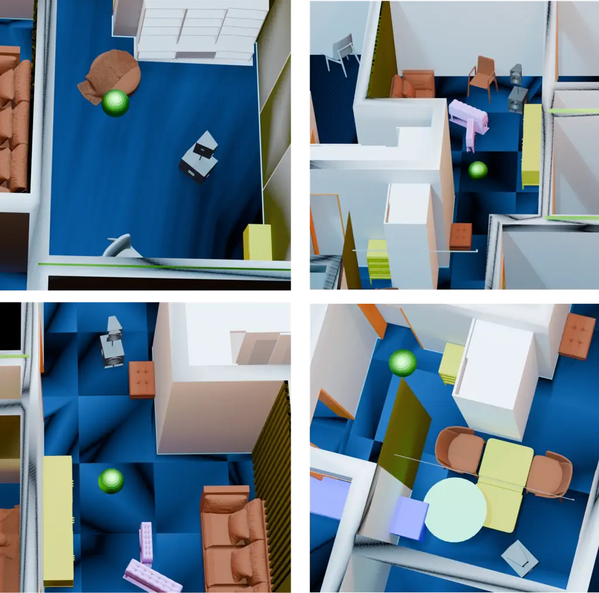
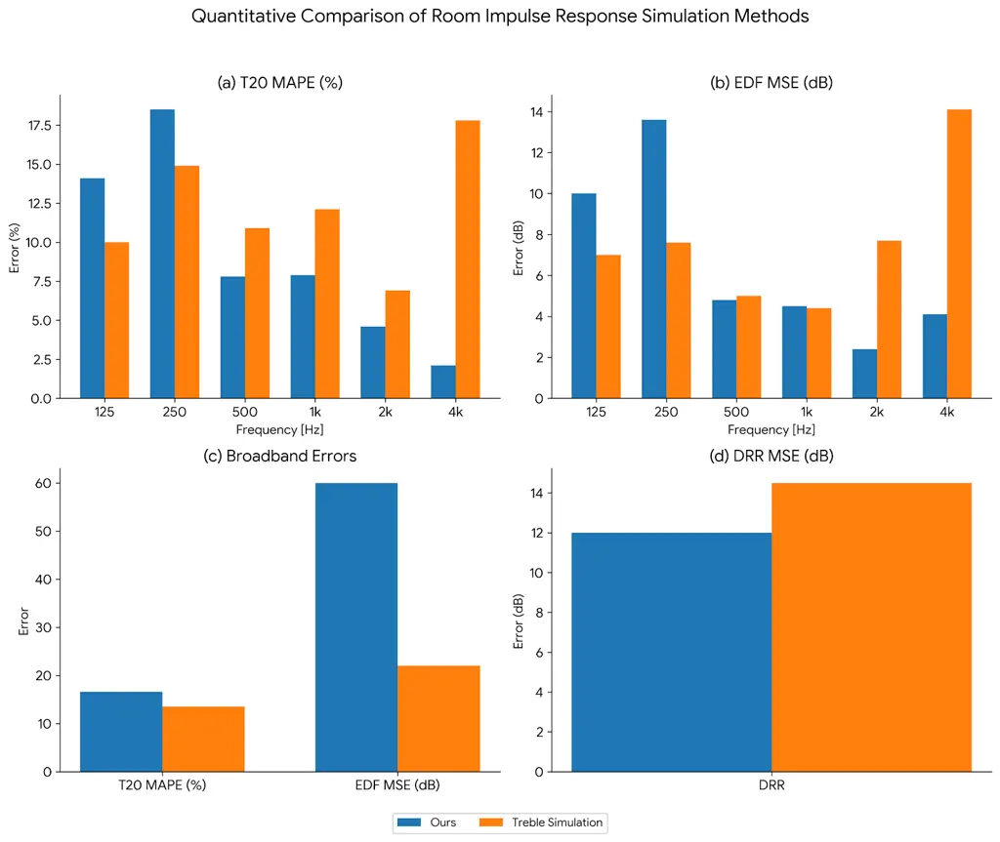
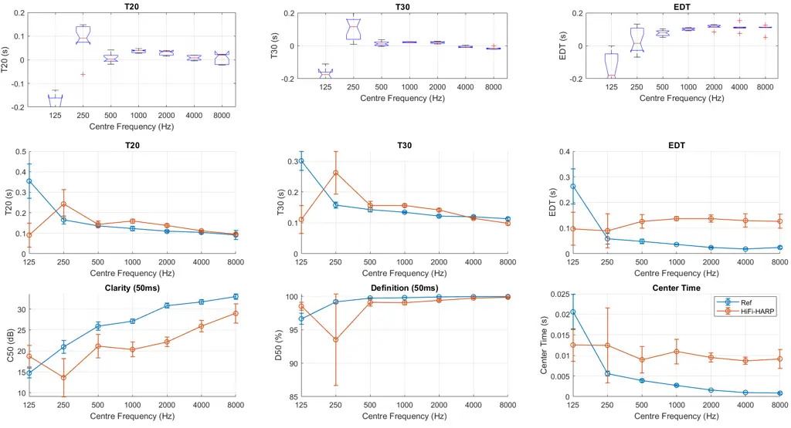
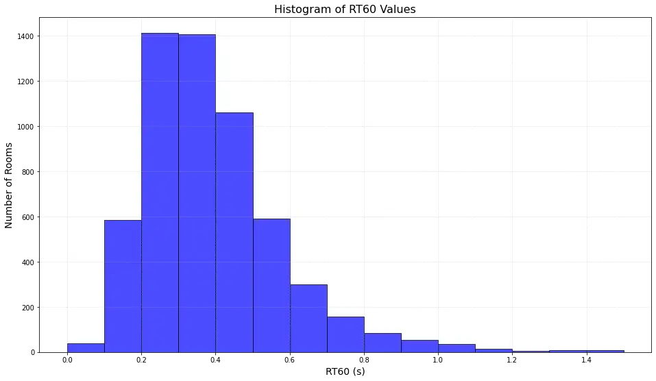

# HiFi-HARP: A High-Fidelity 7th-Order Ambisonic Room Impulse Response DatasetThanks: Samples available at: [https://github.com/whojavumusic/hifi-harp](https://github.com/whojavumusic/hifi-harp)

   Shivam
Saini
and Jürgen Peissig Affiliation: Institut für Kommunikationstechnik  
Leibniz University, Hannover Affiliation: 

###### Abstract

We introduce HiFi-HARP, a large-scale dataset of 7th-order Higher-Order
Ambisonic Room Impulse Responses (HOA-RIRs) consisting of more than
100,000 RIRs generated via a hybrid acoustic simulation in realistic
indoor scenes. HiFi-HARP combines geometrically complex, furnished room
models from the 3D-FRONT repository with a hybrid simulation pipeline:
low-frequency wave-based simulation (finite-difference time-domain) up
to 900 Hz is used, while high frequencies above 900 Hz are simulated
using a ray-tracing approach. The combined raw RIRs are encoded into the
spherical-harmonic domain (AmbiX ACN) for direct auralization. Our
dataset extends prior work by providing 7th-order Ambisonic RIRs that
combine wave-theoretic accuracy with realistic room content. We detail
the generation pipeline (scene and material selection, array design,
hybrid simulation, ambisonic encoding) and provide dataset statistics
(room volumes, RT60 distributions, absorption properties). A comparison
table highlights the novelty of HiFi-HARP relative to existing RIR
collections. Finally, we outline potential benchmarks such as FOA-to-HOA
upsampling, source localization, and dereverberation. We discuss machine
learning use cases (spatial audio rendering, acoustic parameter
estimation) and limitations (e.g., simulation approximations, static
scenes). Overall, HiFi-HARP offers a rich resource for developing
spatial audio and acoustics algorithms in complex environments.

## I Introduction

Higher-Order Ambisonics (HOA) is a powerful framework for spatial audio
in applications like VR/AR, offering high quality reproduction \[1\].
However, the development of advanced HOA-based algorithms such as source
localization and sound field synthesis is hampered by the lack of
large-scale high-fidelity Room Impulse Response (RIR) datasets.

Existing large-scale synthetic datasets have key limitations:
SoundSpaces offers millions of RIRs but is limited to First-Order
Ambisonics (FOA) and purely geometric simulation \[2\]; the
hybrid-acoustic GWA dataset is single-channel only \[3\]; and the
7th-order HARP dataset uses the image-source method in simple shoebox
rooms \[4\]. While measured datasets exist \[5, 6\], they are limited in
scale and variety. This landscape reveals a clear need for a large-scale
HOA dataset that combines high-fidelity hybrid simulation with realistic
room geometries.

## II Related Work

HOA and Ambisonic datasets: Early measured Ambisonic RIR datasets like
OpenAIR \[5\] and TAU-SRIR \[6\] were foundational but limited in scale
or Ambisonic order, typically not exceeding 4th order \[7\]. To address
the issue of scale, the synthetic HARP dataset introduced over 100,000
7th-order RIRs \[4\]. However, HARP’s realism is constrained by two
factors: its use of simple "shoebox" geometries, which lack ecological
validity, and its reliance on the Image Source Method (ISM). While
computationally efficient, ISM cannot model crucial wave phenomena like
diffraction, leading to RIRs that are less accurate in complex,
furnished spaces.

Geometric and hybrid datasets: The SoundSpaces platform is a notable FOA
dataset: it provides approximately 17.6 million RIRs in 1st-order
Ambisonics for 103 large-scale real-world indoor scenes (Matterport3D
\[8\] and Replica \[9\]) using bidirectional path tracing \[2\].
SoundSpaces is widely used for embodied audio-visual research, but is
limited to FOA order and purely geometric simulation. Recently, \[3\]
introduced Geometric-Wave Acoustic dataset (GWA dataset) containing
approximately 2 million synthetic RIRs across 6.8K furnished houses
(semantically labeled 3D meshes). Crucially, GWA uses a hybrid
simulation approach, low-frequency acoustic wave effects (diffraction,
modal resonances) are captured by a time-domain finite-difference
solver, while high frequencies are handled by ray tracing. The two are
calibrated to produce accurate low- and high-frequency responses. This
is the first large-scale dataset to demonstrate the benefits of combined
wave-geometric acoustic modeling.

Importance of High-Order Ambisonics: The choice of Ambisonics order is a
trade-off between perceptual quality and computational cost. It is
well-established that quality improves with order, overcoming the poor
localization, diffuse sources, and timbral coloration inherent in
First-Order Ambisonics \[10\]. While the 3rd/4th order is often
considered a perceptual "sweet spot" offering robust immersion and
localization \[11, 12\], higher orders provide critical refinements for
hifi applications. While some studies suggest 5th order is sufficient
for high-quality headphone playback \[13\], rendering complex sound
fields over loudspeakers may require up to 7th order \[14\].

Our use of 7th-order Ambisonics aims for maximum perceptual fidelity.
This high order raises the spatial aliasing frequency, yielding a more
spectrally stable sound field for critical auralization \[15\], and is
necessary to render truly point-like sources, as source compactness
continues to improve beyond the 3rd-order "sweet spot" \[12\]. The
practical benefits of this approach are empirically validated by our
Direction-of-Arrival estimation experiment in Section IV-B.

Gap and novelty: Existing HOA datasets are limited by low spatial
resolution (FOA-only), small scale, or purely geometric simulation. For
instance, the large-scale GWA dataset \[3\] is single-channel, while the
7th-order HARP dataset \[4\] uses a geometric-only simulation in simple
shoebox rooms. HiFi-HARP fills this gap by providing the first
large-scale collection of 7th-order Ambisonic RIRs generated with
high-fidelity hybrid simulations in realistically furnished
environments.

Fig. 1: Example measurement configurations where green sphere is the
spherical microphone array. The object colors do not accurately describe
the material property and have been randomly assigned for visualisation
purposes.

## III Methodology: Dataset Creation

### III-A 3D-FRONT Scenes and Material Assignment

HiFi-HARP is built upon the 3D-FRONT dataset \[16\], a vast repository
of furnished indoor scenes. This dataset provides 18,968 professionally
designed rooms, offering diverse geometries, furniture arrangements, and
materials suitable for realistic acoustic simulation. Figure 1 shows a
representative 3D-FRONT scene. We utilize a broad subset of these
scenes, encompassing varied room volumes, shapes, and furnishing.

For acoustic simulation, each surface (walls, floors, furniture) is
assigned a frequency-dependent acoustic absorption coefficient.
Following \[3\], we implement a semantic material mapping: textual
labels (e.g., “wooden floor,” “tiled wall”) are matched to measured
absorption spectra via a language-based classifier (SentenceFormer
\[17\]). This approach ensures that materials reflect real-world
acoustic properties, drawing from a lookup table of publicly available
absorption curves consistent with 3D-FRONT semantic labels.

### III-B Microphone Array Design

Our RIR simulations employ distinct microphone configurations for
different frequency bands. For the low-frequency, wave-based simulation,
we utilize a 64-channel spherical microphone array. The virtual
microphones are arranged on the sphere’s surface using a Fliege-Maier
grid \[18\] for near-uniform angular sampling. A sphere radius of 42 cm
was chosen for two reasons: it matches the commercially available
Eigenmike EM64, ensuring practical relevance, and it provides
sufficiently distinct sample points for our time-domain
finite-difference solver, avoiding waveform redundancy and excessive
computational costs associated with smaller arrays.

For high-frequency simulations, we adopt the approach by Zang and Kong
\[19\], built upon the G-Sound library \[20\]. This method efficiently
performs ray-tracing simulations by tracking rays and storing
directional data directly in the spherical harmonic domain, similar to
HARP \[4\], thereby bypassing the need for an explicit microphone array
that would otherwise increase simulation complexity. This enables direct
HOA simulation up to 9th order.

### III-C Hybrid Acoustic Simulation

Acoustic propagation is computed across two frequency bands. For
frequencies up to 900 Hz, a wave-based FDTD solver is employed \[21\].
This solver accurately models wave phenomena like diffraction,
interference, and room modes, using a grid resolution of approximately 2
cm to represent wavelengths down to 900 Hz, with impedance boundary
conditions derived from our material assignments.

For frequencies above 900 Hz, we transition to geometric ray tracing
\[19, 22, 20, 23\], which efficiently handles specular reflections and
scattering. The low-frequency FDTD output is converted to the spherical
harmonic domain and then smoothly merged with the high-frequency
ray-tracing results using a weighted crossover strategy, as detailed in
\[3\]. This approach ensures continuity at the 900 Hz crossover,
yielding a final RIR that combines wave-theoretic accuracy for low
frequencies with geometric realism for high frequencies.

Source signals are modeled as point impulses. For each house model, we
typically simulate 5 sources and 10 receiver combinations, resulting in
50 measurements per room. The receiver (64-mic array center) is fixed at
1.5 m height, with source-receiver distances and orientations sampled to
represent common listening scenarios.

To overcome the immense computational load of simulating 3,200 (64 mics
$`\times`$ 5 sources $`\times`$ 10 receivers) solver runs per room, we
developed a custom pipeline. This pipeline leverages each solver’s
ability to handle multiple receiver positions in a single batch. By
grouping all 64 microphone locations into ten composite simulation jobs,
we effectively reduce the per-room workload to just 10 runs. This
optimization accelerates dataset generation by a factor of
320$`\times`$, making large-scale RIR synthesis tractable.

Fig. 2: Quantitative Comparison of Treble Simulation and proposed
approach. Broadband and octave-band T20 MAPE and EDF MSE, and DRR MSE of
the simulated RIRs compared to the measured RIRs in room as provided in
\[24\]. Note: The differences in results are likely due to the
unavailability of precise material descriptions.

Fig. 3: Comparison of parameters extracted from real measurement done
using Eigenmike EM32 and our approach. Top row demonstrates the boxplot
of errors for the respective measured position.

We validated our simulation against a commercial model (Treble) and our
own lab measurements. When reproducing the GENDA Task 1 Challenge RIRs
\[24\], our results diverged from the reference simulation (Fig. 2). We
attribute this discrepancy to our material estimation, which is based on
semantic labels rather than the empirically measured coefficients used
by Treble. Specifically, our method relies on textual labels (e.g.,
“floor” or “ceiling”), which often fail to capture the true acoustic
properties of the underlying materials. In contrast, the Treble
simulation employs empirically measured absorption and scattering
coefficients, offering greater physical accuracy. Furthermore,
comparisons with lab measurements showed minor low-frequency errors,
likely from geometric simplification (Fig. 3). Future work could improve
fidelity by adopting a multimodal approach for material and geometry
estimation.

Fig. 4: RT60 Distribution of the dataset

## IV Dataset Statistics and Comparison

| Dataset             | Order         | \# RIRs | Scenes / Variation                          | Simulation              |
| ------------------- | ------------- | ------- | ------------------------------------------- | ----------------------- |
| BUT-ReverbDB \[25\] | 0th           | 1300    | 11 real rooms                               | Measured                |
| MESH-RIR \[26\]     | 0th           | 4400    | 1 room, 2D grid                             | Measured                |
| GWA \[3\]           | 0th           | 2 M     | $`\approx 6000`$ realistic interiors        | Hybrid Wave + Ray       |
| dEchorate \[27\]    | Linear Array  | 1800    | variable acoustic conditions                | Measured                |
| AIR \[28\]          | Binaural      | 200+    | 4 rooms                                     | Measured                |
| OpenAIR \[5\]       | 1st           | 50      | 50 extreme real rooms                       | Measured                |
| C4DM \[29\]         | 1st           | 700     | 3 rooms, multiple positions                 | Measured                |
| TAU-SRIR \[6\]      | 1st           | 114     | 9 rooms, multiple positions                 | Measured                |
| SoundSpaces \[2\]   | 1st           | 17.6M   | $`\approx 100`$ realistic interiors         | Geometric (ray tracing) |
| PAN-AR \[30\]       | 2nd           | 21      | 4 real rooms, includes ambient noise/images | Measured HOA            |
| MOTUS \[7\]         | 3rd           | 3320    | 1 room, 830 furniture arrangements          | Measured                |
| ARNI-SRIR \[31\]    | 4th           | –       | 5 variable acoustic conditios, 6-DoF        | Measured                |
| HOMULA-RIR \[32\]   | HO mics + ULA | 25      | 1 seminar room, multiple positions          | Measured                |
| HARP \[4\]          | 7th           | 100K+   | Wide variety of synthetic shoebox rooms     | Image-source (ISM)      |
| HiFi-HARP (ours)    | 7th           | 100K+   | $`\approx 2000`$ realistic interiors        | Hybrid Wave + Ray       |

TABLE I: Comparison of HOA/Ambisonic RIR datasets. Entries indicate
ambisonic order, scale, scene diversity, and simulation method.
HiFi-HARP offers 7th-order HOA with hybrid simulation in complex indoor
scenes.

HiFi-HARP’s rooms span a wide range of acoustic conditions. The 3D-FRONT
scenes produce room volumes from small ($`\approx`$30$`m^{2}`$ bedrooms)
to large ($`\approx`$200$`m^{2}`$ living/dining halls). We measure the
omnidirectional RT60 for each RIR and only synthesize the rooms that
fall under 1.2 seconds, covering most daily scenarios. Our RT60
distribution, shown in Fig. 4, is concentrated in the 0.2–0.8s range and
covers typical indoor scenarios, similar to the distribution in \[4\].
Our material mixture (wood, carpet, glass, etc.) ensures varied
absorption: on average, mid-frequency absorption coefficients range from
0.2 (highly reflective) to 0.9 (highly damped) across rooms.

Comparison with existing datasets: Table I summarizes key features of
HiFi-HARP and other Spatial RIR datasets. Notably, HiFi-HARP and HARP
are the only ones offering 7th-order recordings. SoundSpace provides
orders only up to 1st order, albeit at a much larger scale (17.6M RIRs).
Geometric simulation (ray tracing) is used in SoundSpaces, whereas
HiFi-HARP improves on this by incorporating low-frequency wave effects.
Smaller measured datasets (C4DM/Aalto, TAU, MOTUS, ARNI, HOMULA, PAN-AR)
have at most 4th order and far fewer samples. HARP also includes
approximately 100k RIRs in 7th order, but relies solely on image-source
simulation without wave effects. Our HiFi-HARP complements these by
simulating realistic multi-room scenes and combining wave/geometry for
enhanced fidelity.

Downstream Task Evaluation To demonstrate the practical value of
HiFi-HARP, we evaluated its effectiveness in two representative
downstream tasks. First, we tested its utility as a data augmentation
resource for improving the robustness of a room acoustic parameter
estimator. Second, we investigated how the high Ambisonic order of our
RIRs directly impacts the generalization performance of a data-driven
DOA estimator.

### IV-A Room Acoustic Parameter Estimation

Accurate estimation of parameters like reverberation time ($`T_{60}`$)
is a challenging blind task, benchmarked in challenges like ACE \[33\].
To show our dataset’s value for data augmentation, we trained a model
for $`T_{60}`$ estimation \[34, 35\] under two conditions: 1) using a
baseline training set of only measured BRIRs, and 2) using the same set
augmented with 30,000 BRIRs derived from HiFi-HARP.

Table II shows us augmenting the training data with our synthetic RIRs
significantly improved performance on a real-world test set, boosting
the Pearson correlation ($`\rho`$) from 0.85 to 0.92. This highlights
the dataset’s effectiveness for improving the robustness and accuracy of
acoustic estimation models.

| Training Dataset           | Pearson Corr. ($`\rho`$) ($`\uparrow`$) | MSE ($`\downarrow`$) | Bias ($`\downarrow`$) |
| -------------------------- | --------------------------------------- | -------------------- | --------------------- |
| Measured BRIRs only        | 0.85                                    | 0.018                | 0.01                  |
| Measured BRIRs + HiFi-HARP | 0.92                                    | 0.012                | 0.01                  |

TABLE II: Performance of a $`T_{60}`$ estimation model trained with and
without augmentation from the HiFi-HARP dataset.

### IV-B Direction-of-Arrival Estimation

Next, we investigated if the high spatial fidelity of our RIRs
translates to better performance. We trained four identical 3-layer CNNs
to estimate source azimuth from binaural audio. Each model was trained
on 10,000 samples derived from a different Ambisonic order (1st, 3rd,
5th, and 7th) from our dataset. All models were then tested on an unseen
set of real measured BRIRs \[36\] to assess generalization.

Table III reveals a monotonic improvement in performance as the order of
the ambisonics increases. The model trained on 7th-order-derived BRIRs
achieved the lowest error, demonstrating that the spatial fidelity
captured in our simulations provides a direct and measurable benefit to
the performance of ML models. This validates the importance of
high-order simulations for training robust spatial audio algorithms.

| Training Data   | MSE ($`\downarrow`$) | Pearson Corr. ($`\rho`$) ($`\uparrow`$) |
| --------------- | -------------------- | --------------------------------------- |
| 1st-Order ARIRs | 2.34                 | 0.85                                    |
| 3rd-Order ARIRs | 2.32                 | 0.89                                    |
| 5th-Order ARIRs | 2.26                 | 0.90                                    |
| 7th-Order ARIRs | 1.93                 | 0.90                                    |

TABLE III: DOA estimation performance on a real BRIR test set. Models
were trained on data derived from different Ambisonic orders.

## V Discussion

The creation of HiFi-HARP opens several avenues for research in
data-driven spatial audio and acoustics. Our downstream task evaluations
provide strong empirical evidence for the dataset’s dual utility: the
realism of the furnished scenes makes it a powerful resource for data
augmentation (as seen in $`T_{60}`$ estimation), while the high-order
spatial information directly translates to improved model generalization
for spatially-aware tasks like DOA estimation. This positions the
dataset as a valuable tool for training and benchmarking a new
generation of algorithms in immersive audio rendering for VR/AR,
cross-modal acoustic simulation (e.g., image-to-RIR), and blind acoustic
scene analysis, FOA-to-HOA spatial upsampling, Spatial denoising etc.

Limitations: Despite its fidelity, HiFi-HARP has constraints. As with
\[4\], our use of deterministic simulation omits some real-world
effects: fine details of furniture, the presence of humans in rooms are
not modeled explicitly. Future improvements could involve regressing
acoustic material parameters from 3D model context or images, rather
than assigning them based on object names. Additionally, all rooms and
sources are static; dynamic scenes (moving sources/receivers) are not
included. The 64-channel sphere itself is an approximation of an ideal
continuous array. As mentioned earlier, the size of the spherical array
was kept as 42 cm resulting in spatial aliasing above 900 Hz. Finally,
future work may enrich the dataset with more object types and room
models.

## VI Conclusion

We have presented HiFi-HARP, a novel dataset of high-fidelity 7th-order
Ambisonic RIRs in realistic indoor scenes. By combining 3D-FRONT’s rich
interiors with a hybrid wave-based and geometric simulation and a
64-channel spherical array, HiFi-HARP offers a unique resource for
spatial audio research. We described the dataset pipeline, provided
comparisons to existing datasets, and proposed tasks for leveraging the
data. Moving forward, HiFi-HARP can support machine learning for sound
field capture, acoustic inference, and immersive audio, while also
highlighting the trade-offs of synthetic spatial data. We invite
researchers to use HiFi-HARP to push the frontiers of 3D audio and
acoustics.

## References

- \[1\] S. Bertet, J. Daniel, E. Parizet, and O. Warusfel,
  “Investigation on localisation accuracy for first and higher order
  ambisonics reproduced sound sources,” Acta Acustica united with
  Acustica, vol. 99, no. 4, pp. 642–657, 2013.
- \[2\] C. Chen, U. Jain, C. Schissler, S. V. A. Gari, Z. Al-Halah,
  V. K. Ithapu, P. Robinson, and K. Grauman, “Soundspaces: Audio-visual
  navigaton in 3d environments,” in ECCV, 2020.
- \[3\] Z. Tang, R. Aralikatti, A. J. Ratnarajah, and D. Manocha, “Gwa:
  A large high-quality acoustic dataset for audio processing,” in
  Special Interest Group on Computer Graphics and Interactive Techniques
  Conference Proceedings, SIGGRAPH ’22, p. 1–9, ACM, Aug. 2022.
- \[4\] S. Saini and J. Peissig, “Harp: A large-scale higher-order
  ambisonic room impulse response dataset,” in IEEE International
  Conference on Acoustics, Speech and Signal Processing
  Workshops(ICASSPW), 2025.
- \[5\] D. T. Murphy and S. Shelley, “Openair: An interactive
  auralization web resource and database,” in Audio Engineering Society
  Convention 129, Audio Engineering Society, 2010.
- \[6\] A. Politis, S. Adavanne, and T. Virtanen, “A dataset of
  reverberant spatial sound scenes with moving sources for sound event
  localization and detection,” 2020.
- \[7\] G. Götz, S. J. Schlecht, and V. Pulkki, “A dataset of
  higher-order ambisonic room impulse responses and 3d models measured
  in a room with varying furniture,” in 2021 Immersive and 3D Audio:
  from Architecture to Automotive (I3DA), pp. 1–8, IEEE, 2021.
- \[8\] A. Chang, A. Dai, T. Funkhouser, M. Halber, M. Nießner,
  M. Savva, S. Song, A. Zeng, and Y. Zhang, “Matterport3d: Learning from
  rgb-d data in indoor environments,” 2017.
- \[9\] J. Straub, T. Whelan, L. Ma, Y. Chen, E. Wijmans, S. Green,
  J. J. Engel, R. Mur-Artal, C. Ren, S. Verma, A. Clarkson, M. Yan,
  B. Budge, Y. Yan, X. Pan, J. Yon, Y. Zou, K. Leon, N. Carter,
  J. Briales, T. Gillingham, E. Mueggler, L. Pesqueira, M. Savva,
  D. Batra, H. M. Strasdat, R. D. Nardi, M. Goesele, S. Lovegrove, and
  R. Newcombe, “The replica dataset: A digital replica of indoor
  spaces,” 2019.
- \[10\] Z. Ben-Hur, F. Zotter, S. Schlecht, and B. Rafaely, “Binaural
  reproduction of ambisonic signals via spectral equalization,” IEEE/ACM
  Transactions on Audio, Speech, and Language Processing, vol. 25,
  pp. 1992–2004, Nov 2017.
- \[11\] F. Zotter, M. Frank, and A. Sontacchi, “The virtual t-design
  microphone array for realizing frequency-independent 3d sound
  recording and playback,” in Proceedings of the 134th Audio Engineering
  Society Convention, (Rome, Italy), May 2013.
- \[12\] M. Schoeffler, J. M. Arend, F. Klein, J. Plogsties, and
  B. F. G. Katz, “The effect of the ambisonics order on the perceived
  quality of binaural reproductions of spatial audio,” in Proceedings of
  the 145th Audio Engineering Society Convention, (New York, NY, USA),
  Oct 2018.
- \[13\] I. Engel, C. Henry, S. V. Amengual Garí, P. W. Robinson, and
  L. Picinali, “Perceptual implications of different ambisonics-based
  methods for binaural reverberation,” The Journal of the Acoustical
  Society of America, vol. 149, no. 2, pp. 895–910, 2021.
- \[14\] M. Frank, “How to make ambisonics sound good,” in Forum
  Acusticum,(Krakow), 2014.
- \[15\] J. Daniel, “Further studies of high-order ambisonics and their
  application to surround sound reproduction,” in Proceedings of the
  115th Audio Engineering Society Convention, (New York, NY, USA),
  Oct 2003.
- \[16\] H. Fu, B. Cai, L. Gao, L. Zhang, J. W. C. Li, Z. Xun, C. Sun,
  R. Jia, B. Zhao, and H. Zhang, “3d-front: 3d furnished rooms with
  layouts and semantics,” 2021.
- \[17\] B. Wang and C.-C. J. Kuo, “Sbert-wk: A sentence embedding
  method by dissecting bert-based word models,” IEEE/ACM Transactions on
  Audio, Speech, and Language Processing, vol. 28, pp. 2146–2157, 2020.
- \[18\] J. Fliege, “Integration nodes for the sphere,” 2009.
- \[19\] Y. Zang and Q. Kong, “Gsound-sir: A spatial impulse response
  ray-tracing and high-order ambisonic auralization python
  toolkit,” 2025.
- \[20\] C. Schissler and D. Manocha, “Gsound: Interactive sound
  propagation for games,” in Audio Engineering Society Conference: 41st
  International Conference: Audio for Games, Audio Engineering
  Society, 2011.
- \[21\] B. Hamilton, “Pffdtd software,” 2021.
  https://github.com/bsxfun/pffdtd.
- \[22\] Z. Tang, L. Chen, B. Wu, D. Yu, and D. Manocha, “Improving
  reverberant speech training using diffuse acoustic simulation,” in
  ICASSP 2020 - 2020 IEEE International Conference on Acoustics, Speech
  and Signal Processing (ICASSP), pp. 6969–6973, 2020.
- \[23\] C. Schissler and D. Manocha, “Interactive sound propagation and
  rendering for large multi-source scenes,” ACM Transactions on Graphics
  (TOG), vol. 36, no. 1, p. 2, 2017.
- \[24\] J. Lin, G. Götz, H. S. Llopis, H. Hafsteinsson, S. Guðjónsson,
  D. G. Nielsen, F. Pind, P. Smaragdis, D. Manocha, J. Hershey,
  T. Kristjansson, and M. Kim, “Generative data augmentation challenge:
  Synthesis of room acoustics for speaker distance estimation,” in IEEE
  International Conference on Acoustics, Speech and Signal Processing
  Workshops(ICASSPW), 2025.
- \[25\] I. Szöke, M. Skácel, L. Mošner, J. Paliesek, and J. Černockỳ,
  “Building and evaluation of a real room impulse response dataset,”
  IEEE Journal of Selected Topics in Signal Processing, vol. 13, no. 4,
  pp. 863–876, 2019.
- \[26\] S. Koyama, T. Nishida, K. Kimura, T. Abe, N. Ueno, and
  J. Brunnström, “Meshrir: A dataset of room impulse responses on meshed
  grid points for evaluating sound field analysis and synthesis
  methods,” 2021.
- \[27\] D. Di Carlo, P. Tandeitnik, C. Foy, N. Bertin, A. Deleforge,
  and S. Gannot, “dEchorate: a Calibrated Room Impulse Response Dataset
  for Echo-aware Signal Processing,” EURASIP Journal on Audio, Speech,
  and Music Processing, Nov. 2021.
- \[28\] M. Jeub, M. Schafer, and P. Vary, “A binaural room impulse
  response database for the evaluation of dereverberation algorithms,”
  in 2009 16th International Conference on Digital Signal Processing,
  pp. 1–5, IEEE, 2009.
- \[29\] R. Stewart and M. Sandler, “Database of omnidirectional and
  b-format room impulse responses,” in 2010 IEEE International
  Conference on Acoustics, Speech and Signal Processing,
  pp. 165–168, 2010.
- \[30\] F. Denti, D. Fantini, F. Avanzini, and G. Presti, “Pan-ar: A
  multimodal dataset of higher-order ambisonics room impulse responses,
  ambient noise and spherical pictures,” in Proceedings of the 19th
  International Audio Mostly Conference: Explorations in Sonic Cultures,
  AM ’24, (New York, NY, USA), p. 332–340, Association for Computing
  Machinery, 2024.
- \[31\] T. McKenzie, L. McCormack, and C. Hold, “Dataset of spatial
  room impulse responses in a variable acoustics room for six
  degrees-of-freedom rendering and analysis,” 2021.
- \[32\] F. Miotello, P. Ostan, M. Pezzoli, L. Comanducci,
  A. Bernardini, F. Antonacci, and A. Sarti, “Homula-rir: A room impulse
  response dataset for teleconferencing and spatial audio applications
  acquired through higher-order microphones and uniform linear
  microphone arrays,” in 2024 IEEE International Conference on
  Acoustics, Speech, and Signal Processing Workshops (ICASSPW),
  pp. 795–799, 2024.
- \[33\] J. Eaton, N. D. Gaubitch, A. H. Moore, and P. A. Naylor,
  “Estimation of room acoustic parameters: The ace challenge,” IEEE/ACM
  Transactions on Audio, Speech, and Language Processing, vol. 24,
  no. 10, pp. 1681–1693, 2016.
- \[34\] S. Saini, I. Engel, and J. Peissig, “An end-to-end approach for
  blindly rendering a virtual sound source in an audio augmented reality
  environment,” EURASIP Journal on Audio, Speech, and Music Processing,
  vol. 2024, no. 1, p. 16, 2024.
- \[35\] S. Saini and J. Peissig, “Blind room acoustic parameters
  estimation using mobile audio transformer,” in 2023 IEEE Workshop on
  Applications of Signal Processing to Audio and Acoustics
  (WASPAA), 2023.
- \[36\] L. Treybig, S. Saini, S. Werner, U. Sloma, and J. Peissig,
  “Room acoustic analysis and brir matching based on room acoustic
  measurements,” in Audio Engineering Society Conference: AES 2022
  International Audio for Virtual and Augmented Reality
  Conference, 2022.
