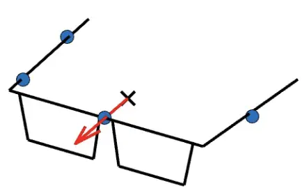

# HyBeam: Hybrid Microphone–Beamforming Array-Agnostic Speech Enhancement for Wearables

Yuval Bar Ilan    Boaz Rafaely    Vladimir Tourbabin

###### Abstract

Speech enhancement is a fundamental challenge in signal processing,
particularly when robustness is required across diverse acoustic
conditions and microphone setups. Deep learning methods have been
successful for speech enhancement, but often assume fixed array
geometries, limiting their use in mobile, embedded, and wearable
devices. Existing array-agnostic approaches typically rely on either raw
microphone signals or beamformer outputs, but both have drawbacks under
changing geometries. We introduce HyBeam, a hybrid framework that uses
raw microphone signals at low frequencies and beamformer signals at
higher frequencies, exploiting their complementary strengths while
remaining highly array-agnostic. Simulations across diverse rooms and
wearable array configurations demonstrate that HyBeam consistently
surpasses microphone-only and beamformer-only baselines in PESQ, STOI,
and SI-SDR. A bandwise analysis shows that the hybrid approach leverages
beamformer directivity at high frequencies and microphone cues at low
frequencies, outperforming either method alone across all bands.

###### Index Terms: 

array-agnostic, speech enhancement, beamforming, wearable arrays, hybrid
models

^(†)^(†)address: ¹School of Electrical and Computer Engineering,  
Ben-Gurion University of the Negev, Beer-Sheva 84105, Israel  
²Reality Labs Research, Meta, Redmond, WA 98052, USA

## 1 Introduction

Speech enhancement (SE) aims to improve perceived quality and
intelligibility in noisy, reverberant, and multi-speaker conditions,
with applications such as teleconferencing, hearing aids, and voice
interfaces \[1\]. Multichannel SE leverages spatial cues from microphone
arrays, typically via classical beamformers (e.g., delay-and-sum or
MVDR) combined with statistical post-filters, but these methods face
limited performance in challenging acoustic scenes \[2, 3\]. Recent
advances in deep learning (DL) have substantially improved SE by
modeling spectral, temporal, and spatial cues in a data-driven manner;
however, most multichannel DL models remain tied to fixed array
geometries (e.g., \[4, 5, 6, 7\]). To overcome this limitation,
array-agnostic SE seeks to generalize across diverse array layouts and
channel counts without retraining \[8, 9\].

Several approaches have been proposed toward array-agnostic multichannel
SE. One line of work processes each microphone stream independently with
parameter sharing, followed by cross-stream aggregation, which
simplifies deployment but underutilizes inter-channel spatial cues
\[10\]. To better capture spatial information,
Transform–Average–Concatenate (TAC) modules were introduced \[11, 12\],
though they require multiple insertions across the network and
significantly increase complexity. Another strategy is multi-geometry
training, where models are exposed to diverse layouts during training
\[13, 10, 14\], which reduces overfitting but demands large datasets and
still does not guarantee generalization to unseen geometries.
Beamformer-based inputs have also been investigated in this context with
the aim of reducing sensitivity to array geometry. For instance, \[15\]
introduced array-geometry-agnostic processing based on beamforming for
wearable head-mounted arrays, but performance was only investigated for
automatic speech recognition rather than speech enhancement. Conversely,
Yang et al. \[16\] studied beamforming-based speech enhancement, yet
without addressing array-agnostic scenarios or robustness to
microphone-position perturbations. Moreover, beamformers may be limited
due to poor low-frequency directivity and high-frequency aliasing.
Overall, existing work still leaves open key questions: (i) although
both microphone signals and beamformer outputs have been used as inputs
to array-agnostic networks, no comprehensive analysis has clarified
which is preferred under various conditions. (ii) In particular, for the
relatively new form factor of microphone arrays embedded in smart
glasses, the most effective strategy to achieve robustness against
microphone-position perturbations has not yet been established.

To address these gaps, we present a comprehensive investigation leading
to a hybrid design tailored for wearable arrays. Specifically, we
combine raw microphone inputs at low frequencies with beamformer outputs
at higher frequencies, leveraging their complementary strengths. This
use of beamforming provides an initial spatial separation, which enables
the use of compact networks suitable for edge devices, while keeping the
framework strictly array-agnostic. The proposed hybrid approach is
evaluated on both seen and unseen array geometries under
microphone-position perturbations. The results demonstrate consistent
improvements in perceptual quality (PESQ), intelligibility (STOI), and
signal fidelity (SI-SDR) over baseline methods, showing that the
proposed framework achieves superior array-agnostic robustness compared
to models trained solely on raw microphones or on beamformers.


(a) Baseline 1


(b) Baseline 2

Figure 1: Baseline models. (a) _Microphone input + microphone
reference:_ $`\mathbf{X}_{\text{in}}(k,i)=\mathbf{X}(k,i)`$;
$`X_{\text{ref}}(k,i)=X^{(\mathrm{frontal})}(k,i)`$.   (b) _Beamformer
input + beamformer reference:_
$`\mathbf{X}_{\text{in}}(k,i)=\mathbf{X}_{b}(k,i)`$;
$`X_{\text{ref}}(k,i)=X_{b}^{(forward)}(k,i))`$.


(a) Hybrid 1


(b) Hybrid 2

Figure 2: Proposed models. (a) _Beamformer input + microphone reference
(Hybrid 1):_ $`\mathbf{X}_{\text{in}}(k,i)=\mathbf{X}_{b}(k,i)`$;
$`X_{\text{ref}}(k,i)=X^{(\mathrm{frontal})}(k,i)`$. (b) _Bandwise
input + beamformer reference (Hybrid 2):_
$`\mathbf{X}_{\text{in}}(k,i)=\mathbf{X}_{\text{hyb}}(k,i);X_{\text{ref}}(k,i)=X_{b}^{(forward)}(k,i)`$.

## 2 Baseline Models

### 2.1 Signal Model, Beamforming, and Masking Network

We consider a clean target speech source signal $`s(t)`$, recorded by a
wearable microphone array with $`L`$ channels in a multiple-speaker,
noisy, and reverberant environment. The signal due to the target speaker
at the $`\ell`$-th microphone, is denoted $`y^{(\ell)}(t)`$, and
includes the effects of propagation delay and reverberation.
Transforming to the short-time Fourier transform (STFT) domain yields
$`Y^{(\ell)}(k,i)`$, with frequency-bin index $`k`$ and time-frame index
$`i`$.

We denote by $`V^{(\ell)}(k,i)`$ the undesired component at microphone
$`\ell`$, which subsumes both interfering speakers and additive
microphone noise. The observed mixture at microphone $`\ell`$ is
therefore

```math
X^{(\ell)}(k,i)=Y^{(\ell)}(k,i)+V^{(\ell)}(k,i). \tag{1}
```

Stacking all channels we obtain

```math
\mathbf{X}(k,i)=\mathbf{Y}(k,i)+\mathbf{V}(k,i)\in\mathbb{C}^{L},
```

where $`\mathbf{Y}(k,i)=[Y^{(1)}(k,i),\ldots,Y^{(L)}(k,i)]^{\top}`$ and
$`\mathbf{X}(k,i)`$ similarly defined. For notational simplicity, we
occasionally drop the explicit indices $`(k,i)`$ and denote by
$`\mathbf{Y}\in\mathbb{C}^{L\times F\times T}`$ the full multichannel
spectrogram, with $`F`$ frequency bins and $`T`$ time frames.

In addition to the microphone signals, we also consider beamformed
signals. Specifically, we employ a delay-and-sum (DAS) beamformer
steered to a direction $`d`$ \[17\], whose output is

```math
X_{b}^{(d)}(k,i)=\mathbf{w}_{d}^{H}(k)\,\mathbf{X}(k,i), \tag{2}
```

where $`\mathbf{w}_{d}(k)`$ are the frequency-dependent DAS weights.
Note that the explicit array geometry is never provided to the network.
This keeps the learning component strictly array-agnostic. The
collection of beamformer outputs across the selected directions is
denoted

```math
\mathbf{X}_{b}(k,i)=\{X_{b}^{(d)}(k,i)\}_{d\in\{\mathrm{1,...,D}\}},
```

where $`D`$ corresponds to the number of beamformers.

The goal of speech enhancement (SE) is to recover the clean target
waveform $`s(t)`$. As backbone we adopt the FT-JNF network \[18\], which
estimates a complex ideal ratio mask (cIRM) $`M(k,i)`$. The network
receives as input $`\mathbf{X}_{\text{in}}(k,i)`$, a set of multichannel
spectrograms, and produces the mask. The enhanced signal is obtained by
applying this mask to a chosen reference channel
$`X_{\text{ref}}(k,i)`$:

```math
\hat{S}(k,i)=M(k,i)\,X_{\text{ref}}(k,i). \tag{3}
```

The time-domain enhanced signal $`\hat{s}(t)`$ is then reconstructed by
applying the inverse STFT to $`\hat{S}(k,i)`$. The network is trained to
minimize the scale-invariant SDR (SI-SDR) loss between the enhanced
waveform $`\hat{s}(t)`$ and the clean target waveform $`s(t)`$.

### 2.2 Baseline Model Parameterization

The baseline models described below, are based on the original FT-JNF
network, but modified by two design choices (cf. Fig. 1:

1.  1.  Network input $`\mathbf{X}_{\text{in}}(k,i)`$: either the set of
        microphone signals $`\mathbf{X}(k,i)`$ or the set of beamformer
        outputs $`\mathbf{X}_{b}(k,i)`$.
2.  2.  Reference signal $`X_{\text{ref}}(k,i)`$: either the frontal
        microphone $`X^{(\text{frontal})}(k,i)`$ with respect to the desired
        speaker position, or the forward-looking beamformer
        $`X_{b}^{(forward)}(k,i)`$.

### 2.3 Baseline 1: Microphones

Baseline 1 is illustrated in Fig. 1(a). The input is the microphone
signals and the reference is the frontal microphone, i.e.
$`\mathbf{X}_{\text{in}}(k,i)=\mathbf{X}(k,i),\quad X_{\text{ref}}(k,i)=X^{(\text{frontal})}(k,i)`$.

### 2.4 Baseline 2: Beamforming

Baseline 2 is illustrated in Fig. 1(b). The input is the beamformer
outputs and the reference is the forward-looking beam, i.e.
$`\mathbf{X}_{\text{in}}(k,i)=\{X_{b}^{(d)}(k,i)\}_{d\in\{\mathrm{1,...,D}\}},\quad X_{\text{ref}}(k,i)=X_{b}^{(forward)}(k,i)`$.
We used four steering directions for the beamformers (front, back, left,
right), with weights computed from the array microphone positions (at
both train and test time).

## 3 Proposed Hybrid Models

The baseline models use either microphone inputs or beamformer outputs
exclusively - representations that have been previously studied as
possible inputs to masking networks. However, it is not clear,
particularly for the wearable array form factor studied here, which
representation is preferable and under what conditions. We therefore
propose hybrid configurations (cf. Fig. 2) that combine both types of
signals in different combinations, complementing the baselines, as
detailed below. The hybrid models are illustrated in Fig. 2.

### 3.1 Proposed Model Parametrization

The proposed hybrid models are distinguished by different design choices
based on the following parameters:

1.  1.  Bandwise hybrid input: Performance analysis presented in Sec. 5.2 of
        the baseline methods reveals that Baseline 1 performs better at low
        frequencies, while Baseline 2 at high frequencies. This motivated a
        hybrid model whose input uses microphone signals at low frequencies
        and beamformer signals at high frequencies. Formally, the hybrid
        input is

    ```math
    \mathbf{X}_{\text{hyb}}(k,i)=\begin{cases}\mathbf{X}(k,i),&k<k_{c},\\[6.0pt]
    \mathbf{X}_{b}(k,i),&k\geq k_{c},\end{cases} \tag{4}
    ```

    where $`\mathbf{X}(k,i)`$ denotes the multichannel microphone STFTs,
    $`\mathbf{X}_{b}(k,i)`$ the set of beamformer outputs, and $`k_{c}`$
    is the frequency bin corresponding to the cutoff frequency
    $`f_{c}`$, selected based on validation performance
    ($`f_{c}=1500`$ Hz).

2.  2.  Hybrid Microphones – Beamforming (channel-wise): While the baseline
        methods employed either microphones or beamforming signals, this
        hybrid design choice mixes both in a single network. In particular,
        we combine a reference microphone signal with beamformer outputs as
        network input. The reference channel involves a trade-off: applying
        the mask to a beamformer output provides spatial selectivity but may
        add artifacts, while applying it to a raw microphone signal avoids
        distortions but lacks spatial filtering.

The hybrid models are as detailed in Fig. 2.

### 3.2 Hybrid 1: Beamforming

Hybrid 1 is illustrated in Fig. 2(a). The input is the beamformer
outputs and the reference is the frontal microphone, i.e.
$`\mathbf{X}_{\text{in}}(k,i)=\mathbf{X}_{b}(k,i),\quad X_{\text{ref}}(k,i)=X^{(\text{frontal})}(k,i)`$.

### 3.3 Hybrid 2: Bandwise + Beamforming

Hybrid 2 is illustrated in Fig. 2(b). The input is the bandwise hybrid
(mics low, beamformers high) and the reference is the forward-looking
beam, i.e.
$`\mathbf{X}_{\text{in}}(k,i)=\mathbf{X}_{\text{hyb}}(k,i),\quad X_{\text{ref}}(k,i)=X_{b}^{(forward)}(k,i)`$.

### 3.4 Hybrid 3: Bandwise + Microphones

Hybrid 3 follows the bandwise design of Hybrid 2 (see Fig. 2(b)); it
differs only in the reference channel, the mask is applied to the
frontal microphone rather than to the forward-looking beam. Formally,
$`\mathbf{X}_{\text{in}}(k,i)=\mathbf{X}_{\text{hyb}}(k,i),\quad X_{\text{ref}}(k,i)=X^{(\text{frontal})}(k,i)`$.

## 4 Experimental setup and methodology



Figure 3: Array 0 (nominal), with microphone marked by the blue dots.
Microphones positions (in mm) (x,y,z) =: $`(-29,\,82,\,-5)`$,
$`(30,\,-1,\,-1)`$, $`(11,\,-77,\,-2)`$, $`(-60,\,-83,\,-5)`$. The
forward-looking axis (positive x-axis) is shown relative to the glasses’
center. The array center is marked by a black “X”, with position
(x,y,z)=(0,0,0).

(a)

(b)

(c)

(d)

Figure 4: Arrays 0a–0f and 1–4 (top view). (a) Small perturbations (5–10
mm) (b) Large perturbations (20–40 mm) (c) and (d) Different geometries.

### 4.1 Room Simulation

We generate simulated room impulse responses (RIRs) using
Pyroomacoustics \[19\], which implements the image source method
(ISM) \[20\]. For each example, the room dimensions are sampled
independently with room length $`L\!\sim\!\mathcal{U}(2.5,5.0)`$ m,
width $`W\!\sim\!\mathcal{U}(3.0,9.0)`$ m, and height
$`H\!\sim\!\mathcal{U}(2.2,3.5)`$ m, and the reverberation time is drawn
from $`T_{60}\!\sim\!\mathcal{U}(0.2,0.5)`$ s.

The wearable array is composed of four microphones, and is assumed to be
mounted on the frame of glasses, as illustrated in Fig. 3. For each
example, the array center, marked ”x” in the figure, is placed at least
$`1`$ m from the walls, at position $`(x,y,z)`$ drawn from
$`x\!\sim\!\mathcal{U}(1,L{-}1)`$ , $`y\sim\!\mathcal{U}(1,W{-}1)`$ and
a fixed height of $`z{=}1.5`$ m. The glasses frame’s rotation about the
vertical axis is drawn uniformly from $`[0,2\pi)`$.

Once the RIRs are defined, we place speech sources in the simulated
room. Each example contains one frontal target talker and five
interferers, all modeled as point sources. The target is located at
$`0^{\circ}`$ azimuth relative to the forward-looking axis of the
glasses (see Fig. 3), at a distance
$`r_{s}\!\sim\!\mathcal{U}(0.3,1.0)`$ m in the horizontal plane (height
$`1.5`$ m). The azimuth range $`20^{\circ}`$–$`340^{\circ}`$ is divided
into five equal sectors, and one interferer is placed at a random
azimuth within each sector. Their distances follow
$`r_{i}\!\sim\!\mathcal{U}(1,8)`$ m. Their heights are sampled from a
normal distribution with mean $`1.6`$ m and standard deviation about of
0.28 m . The signals are sampled at 16 kHz taken from the WSJ0
corpus \[21\].

Microphone signals are then obtained by convolving the source signals
with the corresponding RIRs at each microphone position. We apply the
short-time Fourier transform (STFT) with a Hann window of
$`N_{\text{fft}}{=}512`$ samples and $`50\%`$ overlap (256-sample hop).
Finally, sensor noise is added to yield an input $`\mathrm{SNR}`$ of
$`30`$ dB.

### 4.2 Array Configurations

We consider 11 arrays in total. Array 0 serves as the unperturbed
reference geometry (Fig. 3).

Two sets of perturbations are defined relative to Array 0:

- •
  Small perturbations (5–10 mm): Arrays 0a, 0b, 0c.
- •
  Large perturbations (20–40 mm): Arrays 0d, 0e, 0f.

In addition, Arrays 1–4 represent substantially different geometries,
not derived directly from Array 0. Illustrations are provided in Fig. 4,
where each perturbed array is shown alongside the nominal reference.

### 4.3 Experiments methodology

We define two main experiments, each with its own training, validation,
and test setup. Experiment 1 uses only Array 0 for training and
validation, and evaluates on Array 0 together with its perturbed
variants (0a–0f), thereby isolating robustness to perturbations when
training is restricted to the nominal geometry. Experiment 2 uses
training and validation sets constructed from a diverse subset of eight
arrays, spanning both perturbation groups and alternative geometries.
The test set, in contrast, includes the full collection of arrays
(Arrays 0–4 and 0a–0f), which divides into _seen_ arrays (present in
training/validation) and _unseen_ arrays (excluded from training, and
included arrays 0c, 1, 4). This setup enables a clear evaluation of
array-agnostic generalization. For this experiment, we also report
bandwise SI-SDR results to analyze the frequency-dependent contribution
of microphone and beamformer cues.

### 4.4 Training Details

All models are trained using the Adam optimizer with learning rate
$`1\times 10^{-3}`$ for up to 100 epochs. The objective function is the
scale-invariant SDR (SI-SDR) loss \[22\], and the best checkpoint is
selected based on validation SI-SDR.

### 4.5 Evaluation

Performance is assessed on both seen and unseen geometries to quantify
array-agnostic robustness. Metrics include scale-invariant SDR
(SI-SDR) \[22\], perceptual evaluation of speech quality (PESQ) \[23\],
and short-time objective intelligibility (STOI) \[24\], each computed
against clean speech.

## 5 Results and Discussion

### 5.1 Experiment 1: Nominal array design

Baselines are trained on the reference geometry (Array 0) and evaluated
on three groups: the reference (Array 0), small perturbations
(Arrays 0a–0c), and large perturbations (Arrays 0d–0f) .The results are
presented in Table 1, and show that the microphone-based baseline
(Baseline 1) attains the best STOI, PESQ, and SI-SDR measures for the
reference array and for the small perturbations arrays, indicating that
raw microphone cues remain reliable when geometry deviations are mild.
With larger geometry perturbations, the beamformer-based baseline
(Baseline 2) becomes superior in all three metrics, suggesting that
beamformer inputs are less sensitive to microphone-position shifts in
this regime.

| Model      | Ref  |      |       | Small |      |       | Large |      |       |
| ---------- | ---- | ---- | ----- | ----- | ---- | ----- | ----- | ---- | ----- |
|            | STOI | PESQ | SI    | STOI  | PESQ | SI    | STOI  | PESQ | SI    |
| NOISY      | 0.57 | 1.12 | -11.2 | 0.57  | 1.12 | -10.9 | 0.57  | 1.11 | -11.1 |
| Baseline 1 | 0.82 | 1.56 | 1.1   | 0.82  | 1.52 | 1.1   | 0.60  | 1.19 | -8.2  |
| Baseline 2 | 0.80 | 1.50 | 0.2   | 0.79  | 1.48 | 0.1   | 0.70  | 1.27 | -4.5  |

Table 1: Experiment 1 (Nominal array design): Reference vs. perturbation
groups (best in bold). Groups: Ref = Array 0; Small = {0a–0c}; Large =
{0d–0f}. SI = SI-SDR.

Overall, microphone-only inputs are preferable near the nominal
geometry, whereas beamformer-only inputs are more robust under larger
perturbations. These complementary trends motivate the hybrid models
introduced in Sec. 3.

### 5.2 Experiment 2: Multiple array design

In this experiment, training is conducted using a diverse subset of
arrays sampled from both perturbation groups and the substantially
different geometries. Evaluation covers the full set of arrays
(Arrays 0–4 and 0a–0f), enabling assessment of generalization to unseen
geometries (arrays 0c, 1, 4 in this case).

| Model      | Frequency (kHz) |       |       |       |       |
| ---------- | --------------- | ----- | ----- | ----- | ----- |
|            | 0–0.5           | 0.5–1 | 1–2   | 2–4   | 4–8   |
| NOISY      | -9.2            | -9.3  | -12.5 | -16.9 | -18.0 |
| Baseline 1 | 3.7             | 3.5   | -1.8  | -13.1 | -37.3 |
| Baseline 2 | 2.7             | 3.2   | -1.6  | -10.2 | -25.1 |
| Hybrid 1   | 2.6             | 2.8   | -2.4  | -12.1 | -23.1 |
| Hybrid 2   | 4.0             | 3.8   | -1.5  | -10.3 | -19.1 |
| Hybrid 3   | 4.0             | 3.8   | -2.2  | -12.2 | -29.1 |

Table 2: Experiment 2: Bandwise SI - SDR values in dB (averaged across
all arrays). Hybrid 2 and Hybrid 3 use a cutoff frequency of
$`f_{c}=1.5`$ kHz. Freq. bands for each column are presented in kHz.

Table 2 reports bandwise SI-SDR results averaged across all arrays. The
bandwise SI-SDR is computed by isolating the relevant frequency band in
the STFT domain for both the estimated signal and the clean reference,
transforming each band back to the time domain, and then applying the
SI-SDR measure. At low frequencies ($`\leq 1`$ kHz), the
microphone-based baseline (Baseline 1) achieves better performance than
the beamformer-based baseline (Baseline 2), highlighting the advantage
of direct microphone inputs in this regime. At mid-to-high frequencies
(1–4 kHz), the trend reverses: Baseline 2 outperforms Baseline 1,
indicating that beamformer inputs provide better spatial separation in
this band. At the highest band (4–8 kHz), none of the models improve
upon the noisy input, though Baseline 2 still surpasses Baseline 1 in
line with the mid-frequency results. Since speech energy in this range
is very low, the outcomes have minimal influence on the overall SI-SDR.
The hybrid models (Hybrid 2 and Hybrid 3) exploit the strengths of both
input types across all frequency bands, achieving superior performance
to both baselines at low, mid, and high frequencies alike.

| Model      | Seen |      |        | Unseen |      |        |
| ---------- | ---- | ---- | ------ | ------ | ---- | ------ |
|            | STOI | PESQ | SI-SDR | STOI   | PESQ | SI-SDR |
| NOISY      | 0.57 | 1.12 | -11.1  | 0.58   | 1.12 | -11.0  |
| Baseline 1 | 0.80 | 1.52 | 0.7    | 0.80   | 1.54 | 0.7    |
| Baseline 2 | 0.81 | 1.56 | 0.5    | 0.81   | 1.55 | 0.2    |
| Hybrid 1   | 0.80 | 1.55 | 0.3    | 0.80   | 1.54 | 0.0    |
| Hybrid 2   | 0.82 | 1.63 | 1.0    | 0.82   | 1.65 | 1.1    |
| Hybrid 3   | 0.81 | 1.59 | 0.9    | 0.81   | 1.59 | 1.0    |

Table 3: Experiment 2: Averages by array groups. Seen arrays vs. unseen
arrays. Hybrid 2 and Hybrid 3 use a cutoff frequency of
$`f_{c}=1.5`$ kHz.

Table 3 reports average results separately for arrays seen during
training and for unseen arrays. Performance on the unseen arrays shows
no degradation relative to the seen arrays across STOI, PESQ, and
SI-SDR, indicating that multi-geometry training preserves array-agnostic
behavior. Overall, hybrid models outperform the baselines in PESQ and
SI-SDR for both seen and unseen array groups. Hybrid 2 achieves the best
STOI, PESQ, and SI-SDR across both groups, outperforming all baselines
and the other hybrid models. Importantly, the performance of Hybrid 2
across all arrays is comparable to or better than that of Baseline 1
trained in Experiment 1 on the nominal reference array, demonstrating
that combining the hybrid design with training on diverse arrays enables
array-agnostic generalization without loss in nominal performance.

## 6 Conclusion

We presented HyBeam, a hybrid microphone–beamforming framework for
array-agnostic speech enhancement on wearables. By combining raw
microphones at low frequencies with beamformer outputs at high
frequencies, it exploits complementary spatial cues without exposing
array geometry. Experiments showed that hybrid models outperform
microphone- or beamformer-only baselines. Future work could focus on
exploring optimal beamformers for the task and improving performance in
the high-frequency range (4–8 kHz).

## References

- \[1\] Xugang Hu, Lei Xie, Jiqing Li, Shinji Watanabe, and Dong Yu,
  “Speech enhancement: A survey of approaches and applications,” in
  Proc. IEEE Int. Conf. Acoustics, Speech and Signal Processing
  (ICASSP). IEEE, 2023, pp. 1–5.
- \[2\] Jacob Benesty, Jingdong Chen, and Yiteng Huang, Microphone Array
  Signal Processing, vol. 1 of Springer Topics in Signal Processing,
  Springer, 2008.
- \[3\] Yuzhu Wang, Archontis Politis, and Tuomas Virtanen,
  “Attention-driven multichannel speech enhancement in moving sound
  source scenarios,” in Proc. IEEE Int. Conf. Acoustics, Speech and
  Signal Processing (ICASSP). IEEE, 2024, pp. 11221–11225.
- \[4\] Bahareh Tolooshams, Ritwik Giri, Andrew H. Song, Umut Isik, and
  Arvindh Krishnaswamy, “Channel-attention dense u-net for multichannel
  speech enhancement,” in Proc. IEEE Int. Conf. Acoustics, Speech and
  Signal Processing (ICASSP). IEEE, 2020, pp. 836–840.
- \[5\] Zhuo-Qiang Wang and DeLiang Wang, “Combining spectral and
  spatial features for deep learning based blind speaker separation,”
  IEEE/ACM Transactions on Audio, Speech, and Language Processing, vol.
  26, no. 2, pp. 457–468, 2018.
- \[6\] Zhuo-Qiang Wang, Jonathan Le Roux, and John R. Hershey,
  “Multi-channel deep clustering: Discriminative spectral and spatial
  embeddings for speaker-independent speech separation,” in Proc. IEEE
  Int. Conf. Acoustics, Speech and Signal Processing (ICASSP). IEEE,
  2018, pp. 1–5.
- \[7\] Zhuo-Qiang Wang and DeLiang Wang, “Multi-microphone complex
  spectral mapping for speech dereverberation,” in Proc. IEEE Int. Conf.
  Acoustics, Speech and Signal Processing (ICASSP). IEEE, 2020, pp.
  486–490.
- \[8\] Yicheng Hsu, Yonghan Lee, and Mingsian R. Bai, “Array
  configuration-agnostic personalized speech enhancement using
  long-short-term spatial coherence,” The Journal of the Acoustical
  Society of America, vol. 154, no. 4, pp. 2499–2511, 2023.
- \[9\] Yonghan Lee and Byung-Ha Choi, “DeFTAN-AA: Array geometry
  agnostic multichannel speech enhancement using decomposed feature
  transformation attention network,” in Proceedings of the IEEE
  International Conference on Acoustics, Speech and Signal Processing
  (ICASSP), 2024, pp. 10871–10875.
- \[10\] Hassan Taherian, Yasamin Mostofi, Madhav Godavarti, and Wooil
  Kim, “One model to enhance them all: Array geometry agnostic
  multi-channel personalized speech enhancement,” in Proc. IEEE Int.
  Conf. Acoustics, Speech and Signal Processing (ICASSP). IEEE, 2022,
  pp. 6467–6471.
- \[11\] Yi Luo, Zhuo Chen, Nima Mesgarani, and Takuya Yoshioka,
  “End-to-end microphone permutation and number invariant multi-channel
  speech separation,” in Proc. IEEE Int. Conf. Acoustics, Speech and
  Signal Processing (ICASSP). IEEE, 2020, pp. 6394–6398.
- \[12\] Takuya Yoshioka, Xiaofei Wang, Dongmei Wang, Min Tang, Zirun
  Zhu, Zhuo Chen, and Naoyuki Kanda, “Vararray: Array-geometry-agnostic
  continuous speech separation,” in Proc. IEEE Int. Conf. Acoustics,
  Speech and Signal Processing (ICASSP). IEEE, 2022, pp. 6027–6031.
- \[13\] Yu Zhang, Xiaofei Hao, Zhong-Qiu Wang, Bo Xu, and Dong Yu,
  “Microphone array generalization for multichannel narrowband deep
  speech enhancement,” in Proc. IEEE Int. Conf. Acoustics, Speech and
  Signal Processing (ICASSP). IEEE, 2021, pp. 640–644.
- \[14\] Ashutosh Pandey, Buye Xu, Anurag Kumar, Jacob Donley, Paul
  Calamia, and DeLiang Wang, “Time-domain ad-hoc array speech
  enhancement using a triple-path network,” in Proc. Interspeech. ISCA,
  2022, pp. 729–733.
- \[15\] Ju Lin, Niko Moritz, Yiteng Huang, Ruiming Xie, Ming Sun,
  Christian Fuegen, and Frank Seide, “Agadir: Towards array-geometry
  agnostic directional speech recognition,” in Proc. IEEE Int. Conf.
  Acoustics, Speech and Signal Processing (ICASSP). IEEE, 2024, pp.
  11951–11955.
- \[16\] Yang Yang, Shao-Fu Shih, Hakan Erdogan, Jingdong Liu, John R.
  Hershey, and Michael L. Seltzer, “Guided speech enhancement network,”
  in Proc. IEEE Int. Conf. Acoustics, Speech and Signal Processing
  (ICASSP). IEEE, 2023, pp. 1–5.
- \[17\] Barry D. Van Veen and Kevin M. Buckley, “Beamforming: A
  versatile approach to spatial filtering,” IEEE ASSP Magazine, vol. 5,
  no. 2, pp. 4–24, 1992.
- \[18\] Kristina Tesch and Timo Gerkmann, “Insights into deep
  non-linear filters for improved multi-channel speech enhancement,”
  IEEE/ACM Transactions on Audio, Speech, and Language Processing, vol.
  31, pp. 563–575, 2023.
- \[19\] Robin Scheibler, Eric Bezzam, and Ivan Dokmanić,
  “Pyroomacoustics: A python package for audio room simulation and array
  processing algorithms,” Proc. IEEE Int. Conf. Acoustics, Speech and
  Signal Processing (ICASSP), pp. 351–355, 2018.
- \[20\] J. B. Allen and D. A. Berkley, “Image method for efficiently
  simulating small-room acoustics,” The Journal of the Acoustical
  Society of America, vol. 65, no. 4, pp. 943–950, 1979.
- \[21\] John S. Garofolo, Lori F. Lamel, William M. Fisher, Jonathan G.
  Fiscus, David S. Pallett, and Nancy L. Dahlgren, “Csr-i (wsj0)
  complete ldc93s6a,” Tech. Rep., Linguistic Data Consortium,
  Philadelphia, 1993, Available at
  [https://catalog.ldc.upenn.edu/LDC93S6A](https://catalog.ldc.upenn.edu/LDC93S6A).
- \[22\] Jonathan Le Roux, Scott Wisdom, Hakan Erdogan, and John R.
  Hershey, “Sdr – half-baked or well done?,” in Proc. IEEE International
  Conference on Acoustics, Speech and Signal Processing (ICASSP). 2019,
  pp. 626–630, IEEE.
- \[23\] ITU-T Recommendation P.862, “Perceptual evaluation of speech
  quality (PESQ): An objective method for end-to-end speech quality
  assessment of narrow-band telephone networks and speech codecs,” Tech.
  Rep., International Telecommunication Union, 2001.
- \[24\] C.H. Taal, R.C. Hendriks, R. Heusdens, and J. Jensen, “A
  short-time objective intelligibility measure for time-frequency
  weighted noisy speech,” in Proc. IEEE Int. Conf. Acoustics, Speech and
  Signal Processing (ICASSP), 2010, pp. 4214–4217.
