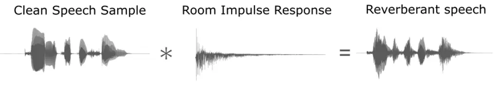
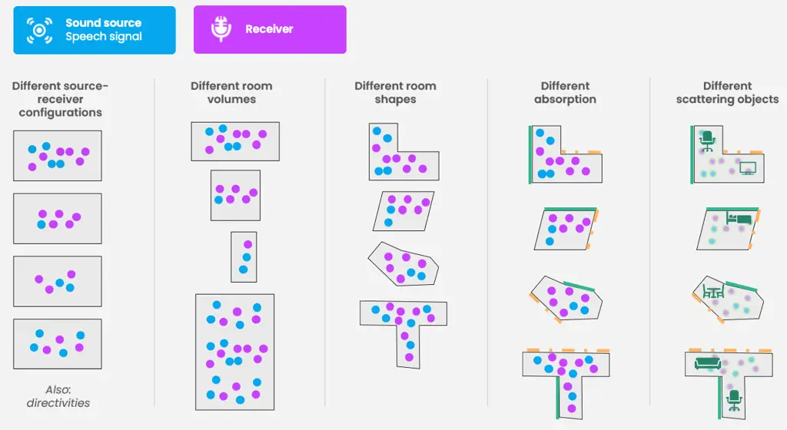
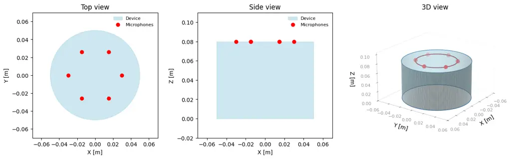

# Treble10: A high-quality dataset for far-field speech recognition, dereverberation, and enhancement

###### Abstract

Accurate far-field speech datasets are critical for tasks such as
automatic speech recognition (ASR), dereverberation, speech enhancement,
and source separation. However, current datasets are limited by the
trade-off between acoustic realism and scalability. Measured corpora
provide faithful physics but are expensive, low-coverage, and rarely
include paired clean and reverberant data. In contrast, most
simulation-based datasets rely on simplified geometrical acoustics, thus
failing to reproduce key physical phenomena like diffraction,
scattering, and interference that govern sound propagation in complex
environments. We introduce Treble10, a large-scale, physically accurate
room-acoustic dataset. Treble10 contains over 3000 broadband room
impulse responses (RIRs) simulated in 10 fully furnished real-world
rooms, using a hybrid simulation paradigm implemented in the Treble SDK
that combines a wave-based and geometrical acoustics solver. The dataset
provides six complementary subsets, spanning mono, 8th-order Ambisonics,
and 6-channel device RIRs, as well as pre-convolved reverberant speech
scenes paired with LibriSpeech utterances. All signals are simulated at
$`32\text{\,}\mathrm{kHz}`$, accurately modelling low-frequency wave
effects and high-frequency reflections. Treble10 bridges the realism gap
between measurement and simulation, enabling reproducible, physically
grounded evaluation and large-scale data augmentation for far-field
speech tasks. The dataset is openly available via the Hugging Face Hub,
and is intended as both a benchmark and a template for next-generation
simulation-driven audio research.

|                                                                                          |
| ---------------------------------------------------------------------------------------- |
| Sarabeth S. Mullins^(1∗), Georg Götz¹, Eric Bezzam², Steven Zheng², Daniel Gert Nielsen¹ |
| ¹Treble Technologies, Reykjavík, Iceland                                                 |
| ²Hugging Face, Paris, France                                                             |
| ^(∗)Correspondence: ssm@treble.tech                                                      |

## 1 Introduction

Accurate room-acoustic data is the foundation for far-field speech
recognition, dereverberation, speech enhancement, or source separation.
Yet, most existing datasets are limited either in scale or realism.
Measured corpora, such as the BUT ReverbDB \[1\] or the CHIME3 challenge
dataset \[2\] capture acoustic conditions of the measured scenes
reliably, but only coarsely cover selected areas of the rooms. For
example, BUT ReverbDB contains around 1400 measured room impulse
responses (RIRs) from 9 rooms, recorded with a sound source and a few
dozen microphones inside spatially constrained areas. Expanding or
replicating these datasets is extremely time-consuming and expensive.
The CHiME datasets offer much larger amounts of noisy, reverberant
speech but usually do not provide the underlying RIRs. The lack of
matching RIR data limits the usability for tasks like dereverberation,
where both original (aka “dry”) and reverberant versions of the same
utterance are required. Additionally, systematic data generation and
controlled ablations are not possible in such cases.

The Treble10 dataset bridges this gap by combining physical accuracy
with the scalability of advanced simulation. Using the Treble SDK’s
hybrid wave-based and geometrical-acoustics engine, we model sound
propagation in 10 realistic, fully furnished rooms. In contrast to other
simulation tools, which typically rely on simplified geometrical
acoustics modelling, our hybrid approach models physical effects such as
scattering, diffraction, interference, and the resulting modal
behaviour. Each room of the Treble10 dataset is densely sampled across
receiver grids at multiple heights, resulting in over 3000 distinct
transfer paths per subset. The dataset includes 6 subsets: mono,
8th-order Ambisonics, and 6-channel device RIRs, along with
corresponding reverberant speech signals from the LibriSpeech \[3\] test
set (test.clean and test.other). All responses are broadband
($`32\text{\,}\mathrm{kHz}`$ sampling rate), accurately modelling both
low-frequency wave behaviour and high-frequency reflections.

The dataset is openly available via the Hugging Face Hub:

- [https://huggingface.co/collections/treble-technologies/treble10](https://huggingface.co/collections/treble-technologies/treble10)

Code examples that demonstrate how to use the dataset can be found in
the respective dataset cards on the Hugging Face Hub.

## 2 Motivation

### 2.1 Near-field vs. far-field algorithm development

Fig. 1: The transformation of a clean into a reverberant audio signal
via convolution with a simulated Room Impulse Response (RIR). The clean
speech (left) is convolved with the RIR (centre). This operation yields
augmented clean speech (right) that incorporates the acoustic
characteristics of that particular room and source-receiver combination.

Which use cases benefit from the Treble10 dataset? Let us explain this
briefly with an example scenario. Consider the difference between
far-field and near-field automatic speech recognition (ASR).

Fig. 2: Disentangling the different degrees of freedom of room-acoustic
datasets.

In near-field ASR, a user speaks directly into a smartphone or headset,
and the captured speech signal is relatively clean. The microphone is
close to the mouth, so the direct sound dominates while reverberation
and background noise are comparatively weak. In these conditions, ASR
models may perform well even with limited room-acoustic diversity in the
training data. However, in far-field ASR, as in smart speakers or
conference-room devices, the microphone may be located several meters
from the talker. The speech signal reaching the microphone is a complex
mixture of direct sound, reverberation, and background noise, making the
recognition task substantially more challenging.

The difference between near-field and far-field conditions is not just a
matter of distance, but also a matter of physics. In far-field setups,
sound interacts heavily with the room: it reflects off walls, diffracts
around furniture, and decays over time. RIRs comprise all of these
effects and encode how sound propagates from the source to the receiver.
By convolving a dry audio signal with an RIR, as illustrated in Fig. 1,
we can simulate reverberant speech for a specific room configuration,
replicating the far-field scenario.

For far-field ASR systems to be robust, they must be trained on data
that accurately represents the complex far-field behaviour \[4\].
Similarly, the performance of far-field ASR systems can only be reliably
determined when evaluating them on data that is accurate enough to model
sound propagation in complex environments.

This example illustrates the need for accurate RIR datasets in far-field
ASR. Other speech-related tasks, such as speech enhancement,
dereverberation and source separation, in real-world conditions benefit
analogously from high-quality training data.

### 2.2 Importance of domain data

Figure 2 shows that room-acoustic data exhibits many degrees of freedom.
To make algorithms perform well in a broad range of realistic
conditions, we want the underlying training data to cover different
source-receiver configurations, different source and receiver
directivities or devices, different room volumes, different room shapes,
different wall absorption properties, and different geometric details
like scattering objects.

However, when developing audio algorithms or training machine learning
models for acoustic tasks, a central question inevitably arises: Where
can we obtain sufficiently large and high-quality room-acoustic datasets
that cover all outlined dataset dimensions? Room-acoustic measurements
capture the physical sound pressure within a space at a specific moment
in time, and therefore, faithfully represent the actual acoustic
conditions of that environment at the measurement time. Unfortunately,
conducting such measurements is both labour-intensive and
time-consuming.

Even with recent advances in automated room-acoustic measurements \[5,
6, 7\], large-scale, measurement-based dataset acquisition that
sufficiently covers the aforementioned dataset dimensions remains
impractical. Such large measurement campaigns would not only require
tremendous amounts of manual labour, but also quickly reach practical
limits regarding scalability. For example, a research team may have
physical access to ten or even a hundred different rooms, but scaling
such a campaign to the order of ten or even a hundred thousand rooms is
infeasible. Setting up device-specific multi-channel datasets further
multiplies the measurement effort, as new measurements have to be
conducted for every device configuration.

### 2.3 How simulations can help

Room-acoustic simulations are a scalable tool for generating large
amounts of synthetic data under controlled, reproducible, and diverse
acoustic conditions. This makes them a powerful alternative to physical
measurements for training and evaluating audio machine learning models.
A wide range of simulation methods exist, from geometrical acoustics
techniques like the image-source method \[8, 9\] and ray tracing \[10,
11\], to more advanced, wave-based approaches that capture the
underlying physics of sound propagation in greater detail \[12, 13,
14\].

Reproducing real-world acoustics with simulations requires accurate
modelling of key acoustic phenomena that shape how sound interacts with
the environment, including:

- •
  Reflection and scattering: how sound waves reflect on surfaces and
  diffuse from rough or textured materials;
- •
  Diffraction: how sound bends around obstacles such as furniture,
  people, or architectural features;
- •
  Absorption: how different materials attenuate sound energy in a
  frequency-dependent manner; and
- •
  Reverberation: the complex temporal decay of reflections that gives
  each room its distinctive acoustic character.
- •
  Sound source and receiver directivity: how strongly a sound source
  radiates in different directions and how sensitive a device or
  microphone is to sounds coming from different directions.

Fig. 3: Sketch of the multi channel device included in the dataset. The
device consists of $`6`$ microphones evenly spaced with a radius of
$`3\text{\,}\mathrm{cm}`$. The coordinates of the microphones can be
found in the metadata for the $`6`$ch split and also in the dataset
card.

However, many existing data augmentation pipelines still rely on
simplified simulation techniques, such as basic image-source models and
ray tracing. Although these approaches can be effective for simple
environments, they often fail to capture the full physical complexity of
real-world acoustics, particularly in spaces with irregular geometries,
frequency-dependent materials, scattering objects, or directive source
and receivers. Consequently, machine learning algorithms trained with
such simplified simulation data exhibit inferior model performance
compared to algorithms trained with more realistic data \[15, 16, 17,
18\].

## 3 The Treble10 dataset

The Treble10 dataset contains high fidelity room-acoustic simulations
from 10 different furnished rooms, as summarized in Table 1. It contains
six subsets:

1.  1.  Treble10-RIR-mono: This subset contains mono RIRs. In each room,
        RIRs are available between 5 sound sources and several receivers.
        The receivers are placed along horizontal receiver grids with
        $`0.5\text{\,}\mathrm{m}`$ resolution at three heights
        ($`0.5\text{\,}\mathrm{m}`$, $`1.0\text{\,}\mathrm{m}`$,
        $`1.5\text{\,}\mathrm{m}`$). The validity of all source and receiver
        positions is checked to ensure that none of them intersects with the
        room geometry or furniture.
2.  2.  Treble10-RIR-HOA8: This subset contains 8th-order Ambisonics RIRs.
        The sound source and receiver positions are identical to the
        RIR-mono subset.
3.  3.  Treble10-RIR-6ch: For this subset, a $`6`$-channel cylindrical
        device (see Fig. 3) is placed at the receiver positions from the
        RIR-mono subset. RIRs are then acquired between the $`5`$ sound
        sources from above and each of the $`6`$ device microphones. In
        other words, there is a $`6`$-channel DeviceRIR for each
        source-receiver combination of the RIR-mono subset. The microphone
        coordinates along with an example of how to use the multichannel
        device can be found in the dataset card¹¹ 1
        [https://huggingface.co/datasets/treble-technologies/Treble10-RIR](https://huggingface.co/datasets/treble-technologies/Treble10-RIR).
4.  4.  Treble10-Speech-mono: Each RIR from the RIR-mono subset is convolved
        with a speech file from the LibriSpeech test set (test.clean and
        test.other).
5.  5.  Treble10-Speech-HOA8: Each Ambisonics RIR from the RIR-HOA8 subset
        is convolved with a speech file from the LibriSpeech test
        set (test.clean and test.other).
6.  6.  Treble10-Speech-6ch: Each DeviceRIR from the RIR-$`6`$ch subset is
        convolved with a speech file from the LibriSpeech test
        set (test.clean and test.other).

All RIRs (mono/HOA/device) were simulated with the Treble SDK²² 2
[https://www.treble.tech/software-development-kit](https://www.treble.tech/software-development-kit),
and more details about the tool can be found in Sec. 4. We use a hybrid
simulation paradigm that combines a numerical wave-based solver
(discontinuous Galerkin method \[13, 14\], DGM) at low- to mid-range
frequencies with geometrical acoustics (GA) simulations \[19\] at high
frequencies. For the Treble10 dataset, the transition frequency between
the wave-based and the GA simulation is set at
$`5\text{\,}\mathrm{kHz}`$. The resulting hybrid RIRs are broadband
signals with a sampling rate of $`32\text{\,}\mathrm{kHz}`$, covering
the entire frequency range of the signal and containing audio content up
to $`16\text{\,}\mathrm{kHz}`$.

[TABLE]

Table 1: Rooms covered by the Treble10 dataset.

A small subset of simulations from the same rooms has previously been
released as part of the Generative Data Augmentation (GenDA) challenge
at ICASSP 2025 \[20\]. However, the Treble10 dataset differs from the
GenDA dataset in three fundamental aspects:

1.  1.  The Treble10 dataset contains broadband RIRs from a hybrid
        simulation paradigm (wave-based below $`5\text{\,}\mathrm{kHz}`$, GA
        above $`5\text{\,}\mathrm{kHz}`$), covering the entire frequency
        range of a $`32\text{\,}\mathrm{kHz}`$ signal. In contrast to the
        GenDA subset, which only contained the wave-based portion, the
        Treble10 dataset therefore more than doubles the usable frequency
        range.
2.  2.  The Treble10 dataset consists of $`6`$ subsets in total. While three
        of those subsets contain RIRs (mono, $`8`$th-order Ambisonics,
        $`6`$-channel device), the other three contain pre-convolved scenes
        in identical channel formats. The GenDA subset was limited to mono
        and 8th-order Ambisonics RIRs, and no pre-convolved scenes were
        provided.
3.  3.  With Treble10, we publish the entire dataset, containing
        approximately $`3100`$ source-receiver configurations. The GenDA
        subset only contained a small fraction of approximately $`60`$
        randomly selected source-receiver configurations.

## 4 Treble Technologies and the Treble SDK

At Treble Technologies, we believe that advancing audio machine learning
requires revisiting the underlying physics of sound propagation. A
physically accurate simulation paradigm is crucial, especially when
modelling the complex behaviour of sound in realistic rooms and with
multi-channel devices. Tools like the Treble SDK bridge the gap between
high scalability and high accuracy when working with room-acoustic
simulations.

The Treble SDK offers a flexible, Python-based framework powered by an
advanced acoustic simulation engine. It enables engineers and
researchers to:

- •
  Simulate complex acoustic environments: Move beyond simple room models
  to capture detailed geometries and devices. Model wave effects that
  are crucial phenomena in real-world sound propagation, such as
  diffraction, scattering, interference, and the resulting modal
  behaviour.
- •
  Generate multi-channel RIRs at scale: Create large datasets of
  physically accurate, high-fidelity RIRs, including precise simulations
  for custom microphone arrays embedded within device structures.
- •
  Control acoustic parameters with precision: Adjust room size, material
  properties, source and receiver positions (including array layouts),
  and object placements to produce diverse and well-controlled acoustic
  conditions.

## REFERENCES

- \[1\] I. Szöke, M. Skácel, L. Mošner, J. Paliesek, and J. H. Černocký,
  “Building and evaluation of a real room impulse response dataset,”
  _IEEE J. Sel. Top. Signal Process._, vol. 13, no. 4, pp.
  863–876, 2019.
- \[2\] J. Barker, R. Marxer, E. Vincent, and S. Watanabe, “The third
  ‘CHiME’ speech separation and recognition challenge: Dataset, task and
  baselines,” in _Proc. IEEE Workshop Autom. Speech Recognitition
  Understanding (ASRU)_, Scottsdale, AZ, USA, 2015, pp. 504–511.
- \[3\] V. Panayotov, G. Chen, D. Povey, and S. Khudanpur, “Librispeech:
  An ASR corpus based on public domain audio books,” in _Proc. IEEE Int.
  Conf. Acoust. Speech Signal Process. (ICASSP)_, South Brisbane, QLD,
  Australia, 2015, pp. 5206–5210.
- \[4\] C. Kim, A. Misra, K. Chin, T. Hughes, A. Narayanan, T. Sainath,
  and M. Bacchiani, “Generation of large-scale simulated utterances in
  virtual rooms to train deep-neural networks for far-field speech
  recognition in Google Home,” in _Proc. Interspeech_, Stockholm,
  Sweden, 2017, pp. 379–383.
- \[5\] G. Götz, A. M. Ornelas, S. J. Schlecht, and V. Pulkki,
  “Autonomous robot twin system for room acoustic measurements,” _J.
  Audio Eng. Soc._, vol. 69, no. 4, pp. 261–272, 2021.
- \[6\] G. Stolz, S. Werner, F. Klein, L. Treybig, A. Bley, and
  C. Martin, “Autonomous robotic platform to measure spatial room
  impulse responses,” in _Proc. DAGA_, Hamburg, Germany, 2023, pp.
  59–61.
- \[7\] G. Götz, I. Ananthabhotla, S. V. Amengual Garí, and P. Calamia,
  “Autonomous room acoustic measurements using rapidly-exploring random
  trees and Gaussian processes,” in _Proc. 10th Conv. European Acoust.
  Assoc. (Forum Acusticum)_, Torino, Italy, 2023.
- \[8\] J. B. Allen and D. A. Berkley, “Image method for efficiently
  simulating small-room acoustics,” _The Journal of the Acoustical
  Society of America_, vol. 65, no. 4, pp. 943–950, 1979.
- \[9\] J. Borish, “Extension of the image model to arbitrary
  polyhedra,” _The Journal of the Acoustical Society of America_,
  vol. 75, no. 6, pp. 1827–1836, 1984.
- \[10\] A. Krokstad, S. Strøm, and S. Sørsdal, “Calculating the
  acoustical room response by the use of a ray tracing technique,” _J.
  Sound Vib._, vol. 8, no. 1, pp. 118–125, 1968.
- \[11\] ——, “Fifteen years’ experience with computerized ray tracing,”
  _Appl. Acoust._, vol. 16, no. 4, pp. 291–312, 1983.
- \[12\] D. Botteldooren, “Finite-difference time-domain simulation of
  low-frequency room acoustic problems,” _J. Acoust. Soc. Am._, vol. 98,
  no. 6, pp. 3302–3308, 1995.
- \[13\] H. Wang, I. Sihar, R. Pagán Muñoz, and M. Hornikx, “Room
  acoustics modelling in the time-domain with the nodal discontinuous
  Galerkin method,” _J. Acoust. Soc. Am._, vol. 145, no. 4, pp.
  2650–2663, 2019.
- \[14\] F. Pind, C.-H. Jeong, A. P. Engsig-Karup, J. S. Hesthaven, and
  J. Strømann-Andersen, “Time-domain room acoustic simulations with
  extended-reacting porous absorbers using the discontinuous Galerkin
  method,” _J. Acoust. Soc. Am._, vol. 148, no. 5, pp. 2851–2863, 2020.
- \[15\] E. Bezzam, R. Scheibler, C. Cadoux, and T. Gisselbrecht, “A
  study on more realistic room simulation for far-field keyword
  spotting,” in _Proc. Asia-Pacific Signal Information Process. Assoc.
  Annual Summit Conf. (APSIPA-ASC)_, Auckland, New Zealand, 2020, pp.
  674–680.
- \[16\] P. Srivastava, A. Deleforge, A. Politis, and E. Vincent, “How
  to (virtually) train your speaker localizer,” in _Proc. Interspeech_,
  Dublin, Ireland, 2023, pp. 1204–1208.
- \[17\] R. Arakawa, M. Parvaix, C. Lai, H. Erdogan, and A. Olwal,
  “Quantifying the effect of simulator-based data augmentation for
  speech recognition on augmented reality glasses,” in _Proc. IEEE Int.
  Conf. Acoust. Speech Signal Process. (ICASSP)_, Seoul, Republic of
  Korea, 2024, pp. 726–730.
- \[18\] E. Gusó, J. Luberadzka, U. Sayin, and X. Serra, “MB-RIRs: a
  synthetic room impulse response dataset with frequency-dependent
  absorption coefficients,” in _Proc. IEEE Workshop Appl. Signal
  Process. Audio Acoust. (WASPAA)_, Tahoe City, CA, USA, 2025.
- \[19\] L. Savioja and U. P. Svensson, “Overview of geometrical room
  acoustic modeling techniques,” _J. Acoust. Soc. Am._, vol. 138, no. 2,
  pp. 708–730, 2015.
- \[20\] J. Lin, G. Götz, H. Sampedro Llopis, H. Hafsteinsson,
  S. Guðjónsson, D. G. Nielsen, F. Pind, P. Smaragdis, D. Manocha,
  J. Hershey, T. Kristjansson, and M. Kim, “Generative data augmentation
  challenge: Synthesis of room acoustics for speaker distance
  estimation,” in _Proc. IEEE Int. Conf. Acoust. Speech Signal Process.
  Workshops (ICASSPW)_, Hyderabad, India, 2025.
