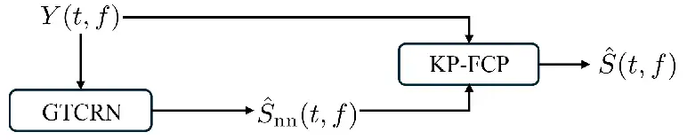
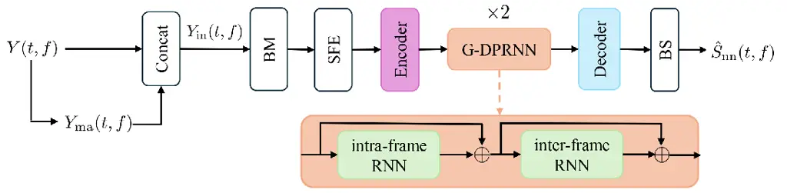
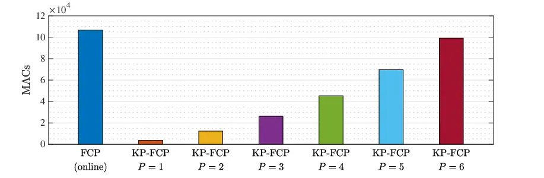
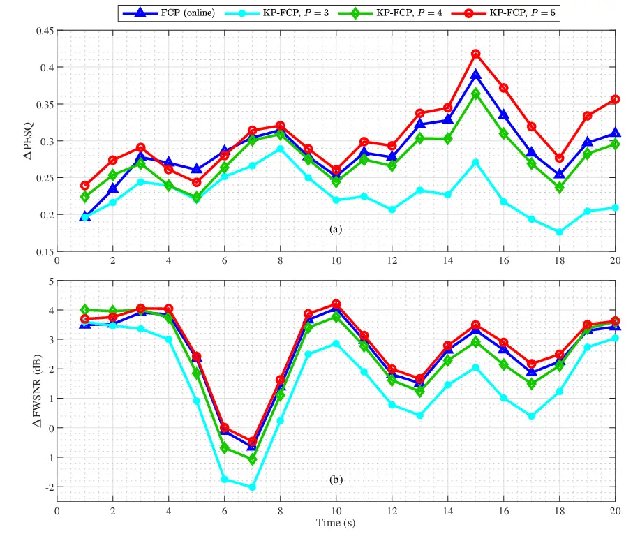

# Forward Convolutive Prediction for Frame Online Monaural Speech Dereverberation Based on Kronecker Product Decomposition

Yujie Zhu¹, Jilu Jin², Xueqin Luo², Wenxing Yang³, Zhong-Qiu Wang⁴,
Gongping Huang¹, Jingdong Chen², and Jacob Benesty⁵

###### Abstract

Dereverberation has long been a crucial research topic in speech
processing, aiming to alleviate the adverse effects of reverberation in
voice communication and speech interaction systems. Among existing
approaches, forward convolutional prediction (FCP) has recently
attracted attention. It typically employs a deep neural network to
predict the direct-path signal and subsequently estimates a linear
prediction filter to suppress residual reverberation. However, a major
drawback of this approach is that the required linear prediction filter
is often excessively long, leading to considerable computational
complexity. To address this, our work proposes a novel FCP method based
on Kronecker product (KP) decomposition, in which the long prediction
filter is modeled as the KP of two much shorter filters. This
decomposition significantly reduces the computational cost. An adaptive
algorithm is then provided to iteratively update these shorter filters
online. Experimental results show that, compared to conventional
methods, our approach achieves competitive dereverberation performance
while substantially reducing computational cost.

###### Index Terms: 

Speech dereverberation, Kronecker product decomposition, blind
deconvolution, deep learning.

^(†)^(†)address: ¹School of Electronic Information, Wuhan University,
Wuhan, Hubei, China ²CIAIC, Northwestern Polytechnical University,
Xi’an, Shaanxi 710072, China ³School of Oriental Pan-Vascular Devices
Innovation College, University of Shanghai for Science and Technology,
Shanghai, 200093, China ⁴Department of Computer Science and Engineering,
Southern University of Science and Technology, Shenzhen, China
⁵INRS-EMT, University of Quebec, Montreal, QC H5A 1K6, Canada

## 1 Introduction

In room acoustic environments, speech signals captured by microphones
generally comprise not only the direct-path component but also
reflections from walls, ceilings, and other surrounding surfaces,
collectively referred to as reverberation \[1, 2\]. Reverberation
severely degrades speech intelligibility, adversely impacting both human
perception and the performance of speech-related technologies \[3, 4,
5\]. Over the past few decades, numerous dereverberation techniques have
been developed to alleviate these adverse effects \[6, 7\]. Among them,
linear prediction-based methods have been intensively studied \[8, 9,
10, 11\]. They typically employ a linear prediction filter to estimate
the late reverberation component, which is subsequently subtracted from
the observed signal to obtain the desired signal. Notably, the weighted
prediction error (WPE) algorithm has emerged as a particularly powerful
approach \[12, 13\]. Its online variant, the adaptive WPE (AWPE) \[14\]
algorithm, has subsequently been developed and demonstrates strong
potential in practice, owing to its robust dereverberation performance
in dynamically changing acoustic environments. However, the high
computational complexity of WPE and AWPE presents a challenge for their
practical deployment. To alleviate this issue, recent studies have
explored linear filtering-based dereverberation methods leveraging the
Kronecker product (KP) decomposition \[15, 16, 17, 18\]. Specifically,
the long global filter to be estimated is expressed as the KP of shorter
filters, which significantly reduces both the number of parameters and
the computational burden.

Another issue is that, under adverse acoustic conditions involving
background noise or interference sources, the performance of
single-channel WPE can degrade significantly. To overcome these
limitations, Wang et *al.* \[19, 20, 21\] introduced the forward
convolutional prediction (FCP) method, a hybrid approach that integrates
deep learning with linear prediction for single-channel speech
dereverberation. Although FCP can provide improved performance compared
to WPE in single-channel dereverberation, it still demands substantial
computational cost due to the high order of the filter.

In this work, we integrate the FCP method into the previously proposed
KP decomposition framework and present a KP decomposition-based
dereverberation approach. The core idea is to represent the original
prediction filter as the KP of two shorter filters, thereby greatly
reducing the cost of overall computational complexity. These two
shortened filters are then iteratively updated according to the
recursive least-squares (RLS) concept. In practice, both the
conventional FCP considered in this paper and the proposed KP-based FCP
are implemented in a frame-wise online manner. Experimental results
demonstrate that the proposed method matches or surpasses FCP in
dereverberation performance, while greatly reducing computational
complexity.

## 2 Signal Model and Problem Formulation

Let us consider a noisy and reverberant environment, the signal received
by a single microphone in the short-time Fourier transform (STFT) domain
can be expressed as \[19\]

```math
\displaystyle Y\left(t,f\right) \displaystyle=X\left(t,f\right)+V\left(t,f\right)
```

```math
\displaystyle=S\left(t,f\right)+\sum^{\ell}_{i=0}H\left(i,f\right)S\left(t-i,f\right)+V\left(t,f\right)
```

```math
\displaystyle=S\left(t,f\right)+S_{\mathrm{r}}\left(t,f\right)+V\left(t,f\right), \tag{1}
```

where $`t`$ and $`f`$ denote the time-frame and frequency-bin indices,
respectively, $`X\left(t,f\right)`$ is the reverberant target speech in
the STFT domain, which can be conceptually divided into two parts: the
direct path $`S\left(t,f\right)`$ and the early reflections plus late
reflections i.e.
$`S_{\mathrm{r}}\left(t,f\right)=\sum^{\ell}_{i=0}H\left(i,f\right)S\left(t-i,f\right)`$,
where $`H\left(i,f\right)`$ is the early and late parts of the room
impulse response (RIR) in the STFT domain, and $`Y\left(t,f\right)`$ and
$`V\left(t,f\right)`$ are the STFT-domain representations of the
observed signal and background additive noise, respectively.

The goal of this work is to estimate the direct-path component
$`S\left(t,f\right)`$ from the noisy reverberant observation
$`Y\left(t,f\right)`$.

## 3 Forward Convolutive Prediction for Speech Dereverberation

This section provides a brief review of the FCP method \[19, 20, 21\].
FCP first employs a deep neural network (DNN) to estimate the
direct-path component, denoted by
$`\hat{S}_{\mathrm{nn}}\left(t,f\right)`$. The residual signal
$`Y\left(t,f\right)-\hat{S}_{\mathrm{nn}}\left(t,f\right)`$ is regarded
as estimated reverberation under the assumption that
$`V\left(t,f\right)`$ is weak. It is then estimated by forwardly
filtering the DNN-estimated direct-path signal
$`\hat{S}_{\mathrm{nn}}\left(t,f\right)`$, where the filter is obtained
by solving the following problem \[19\]:

```math
\displaystyle\operatorname*{argmin}_{\mathbf{g}^{\prime}\left(t,f\right)}\sum_{t}\frac{\left|Y\left(t,f\right)-\hat{S}_{\mathrm{nn}}\left(t,f\right)-\mathbf{g}^{\prime H}\left(t,f\right)\hat{\mathbf{s}}_{\mathrm{nn}}\left(t,f\right)\right|^{2}}{\hat{\lambda}\left(t,f\right)}, \tag{2}
```

where
$`\hat{\mathbf{s}}_{\mathrm{nn}}\left(t,f\right)=\left[\hat{S}_{\mathrm{nn}}(t,f),\hat{S}_{\mathrm{nn}}(t-1,f),\ldots,\hat{S}_{\mathrm{nn}}\right.`$$`(t-K+1,f)]^{T}`$
and $`\hat{\lambda}\left(t,f\right)`$ is a weighting factor that adjusts
the relative significance of different time–frequency (TF) units.

By absorbing $`\hat{S}_{\mathrm{nn}}\left(t,f\right)`$ into
$`\hat{\mathbf{s}}_{\mathrm{nn}}\left(t,f\right)`$, (2) can be
reexpressed as

```math
\displaystyle\operatorname*{argmin}_{\mathbf{g}\left(t,f\right)}\sum_{t}\frac{\left|Y\left(t,f\right)-\mathbf{g}^{H}\left(t,f\right)\hat{\mathbf{s}}\left(t,f\right)\right|^{2}}{\hat{\lambda}\left(t,f\right)}. \tag{3}
```

The dereverberation result is obtained as

```math
\displaystyle\hat{S}\left(t,f\right) \displaystyle=Y\left(t,f\right)-Z\left(t,f\right), \tag{4}
```

where
$`Z\left(t,f\right)=\mathbf{g}^{\prime H}\left(t,f\right)\hat{\mathbf{s}}_{\mathrm{nn}}\left(t,f\right)=\mathbf{g}^{H}\left(t,f\right)\hat{\mathbf{s}}_{\mathrm{nn}}\left(t,f\right)-\hat{S}_{\mathrm{nn}}\left(t,f\right)`$
is estimated reverberation.

Although the FCP method has demonstrated excellent dereverberation
performance, it requires updating a long filter
$`\mathbf{g}^{H}\left(t,f\right)`$ at each frequency band, leading to
high computational complexity and limiting its applicability. Therefore,
in the following sections, we propose a decomposition method based on
the KP, which reduces computational complexity by decomposing the long
filter into two shorter ones.

## 4 Kronecker Product FCP for Speech Dereverberation



Figure 1: Proposed frame-online dereverberation system.

Building on the idea of FCP, our frame-online speech dereverberation
system adopts a two-stage architecture, as illustrated in Fig.1. In the
first stage, a causal DNN, called grouped temporal convolutional
recurrent network (GTCRN) \[22\], operates in an online manner to
estimate the direct-path component of the microphone observation, with
its architecture briefly described in Subsection 4.1. In the second
stage, a linear prediction filter is applied to suppress the
reverberation. Unlike the conventional FCP method, the proposed system
factorizes the linear prediction filter into the KP of two shorter
filters, as detailed in Subsection 4.2, achieving preserving
dereverberation performance with substantially reduced computational
complexity.

### 4.1 Model Architecture



Figure 2: Architecture of the online DNN used to estimate the direct
sound component.

The architecture of the online causal DNN for direct sound component
estimation is shown in Fig. 2. For the observed signal
$`Y\left(t,f\right)`$, it is concatenated with its magnitude spectrum
$`Y_{\mathrm{ma}}\left(t,f\right)`$ to form
$`Y_{\mathrm{in}}\left(t,f\right)`$ as the input. First, a band merging
(BM) module compresses the high-frequency part of
$`Y_{\mathrm{in}}\left(t,f\right)`$. Immediately after, the subband
feature extraction (SFE) module unfolds and reshapes adjacent frequency
bands to enrich inter-frequency relationships. The encoder encodes the
extracted features into a compact time–frequency (T-F) representation,
which is then processed by two grouped dual-path RNN (G-DPRNN) modules
for intra-frame and inter-frame modeling. Since our goal is to build a
causal system, unidirectional gated recurrent units (GRUs) are used in
the G-DPRNN modules for inter-frame modeling, ensuring that the network
does not access information from future frames. Finally, the decoder
together with the band splitting (BS) operation predicts the direct-path
spectral component $`\hat{S}_{\mathrm{nn}}\left(t,f\right)`$. In the
implementation, the network is realized in a streaming frame-online
manner, meaning its outputs are generated frame by frame.

### 4.2 FCP Based on Kronecker Product Decomposition

Exploiting the low-rank property of the linear prediction filter
$`\mathbf{g}\left(t,f\right)`$, we represent it within the KP framework
as in \[23, 17\]:

```math
\displaystyle\mathbf{g}\left(t,f\right)=\sum_{p=1}^{P}\mathbf{g}_{2,p}\left(t,f\right)\otimes\mathbf{g}_{1,p}\left(t,f\right), \tag{5}
```

where $`\otimes`$ denotes the KP operator,
$`\mathbf{g}_{2,p}\left(t,f\right)`$ and
$`\mathbf{g}_{1,p}\left(t,f\right)`$, $`p=1,2,\dots,P`$ are two sets of
short filters with lengths of $`K_{2}`$ and $`K_{1}`$, such that
$`K=K_{2}K_{1}`$ with $`K_{2}\leq K_{1}`$, and $`P`$ denotes the order
of KP decomposition, which generally satisfies
$`P\leq\min\left(K_{1},K_{2}\right)`$ following the singular value
decomposition (SVD) principle.

It can be proved that we have the two relationships given below for the
KP  \[24\]:

```math
\displaystyle\mathbf{g}\left(t,f\right) \displaystyle=\sum_{p=1}^{P}\left[\mathbf{g}_{2,p}\left(t,f\right)\otimes\mathbf{I}_{K_{1}}\right]\mathbf{g}_{1,p}\left(t,f\right)
```

```math
\displaystyle=\sum_{p=1}^{P}\left[\mathbf{I}_{K_{2}}\otimes\mathbf{g}_{1,p}\left(t,f\right)\right]\mathbf{g}_{2,p}\left(t,f\right), \tag{6}
```

where $`\mathbf{I}_{K_{1}}`$ and $`\mathbf{I}_{K_{2}}`$ are the
$`K_{1}\times K_{1}`$ and $`K_{2}\times K_{2}`$ identity matrices.
Expression (6) can be rearranged as

```math
\displaystyle\mathbf{g}(t,f) \displaystyle=\underline{\mathbf{G}}_{2}\left(t,f\right)\underline{\mathbf{g}}_{1}\left(t,f\right)
```

```math
\displaystyle=\underline{\mathbf{G}}_{1}\left(t,f\right)\underline{\mathbf{g}}_{2}\left(t,f\right), \tag{7}
```

where

```math
\displaystyle\underline{\mathbf{g}}_{1}\left(t,f\right) \displaystyle=\left[\mathbf{g}_{1,1}^{T}\left(t,f\right)~\mathbf{g}_{1,2}^{T}\left(t,f\right)~\cdots~\mathbf{g}_{1,P}^{T}\left(t,f\right)\right]^{T}, \tag{8}
```

```math
\displaystyle\underline{\mathbf{g}}_{2}\left(t,f\right) \displaystyle=\left[\mathbf{g}_{2,1}^{T}\left(t,f\right)~\mathbf{g}_{2,2}^{T}\left(t,f\right)~\cdots~\mathbf{g}_{2,P}^{T}\left(t,f\right)\right]^{T} \tag{9}
```

are vectors of length $`PK_{1}`$ and $`PK_{2}`$, respectively,

```math
\displaystyle\underline{\mathbf{G}}_{2}\left(t,f\right) \displaystyle=\left[\mathbf{G}_{2,1}\left(t,f\right)~\mathbf{G}_{2,2}\left(t,f\right)~\cdots~\mathbf{G}_{2,P}\left(t,f\right)\right], \tag{10}
```

```math
\displaystyle\underline{\mathbf{G}}_{1}\left(t,f\right) \displaystyle=\left[\mathbf{G}_{1,1}\left(t,f\right)~\mathbf{G}_{1,2}\left(t,f\right)~\cdots~\mathbf{G}_{1,P}\left(t,f\right)\right], \tag{11}
```

with

```math
\displaystyle\mathbf{G}_{2,p}\left(t,f\right) \displaystyle=\mathbf{g}_{2,p}\left(t,f\right)\otimes\mathbf{I}_{K_{1}}, \tag{12}
```

```math
\displaystyle\mathbf{G}_{1,p}\left(t,f\right) \displaystyle=\mathbf{g}_{1,p}\left(t,f\right)\otimes\mathbf{I}_{K_{2}}. \tag{13}
```

Substituting (7) into (4), the dereverberated signal can be rewritten as

```math
\displaystyle\hat{S}_{1}\left(t,f\right) \displaystyle=\hat{S}_{\mathrm{nn}}\left(t,f\right)+Y\left(t,f\right)-\underline{\mathbf{g}}_{1}^{H}\left(t,f\right)\underline{\hat{\mathbf{s}}}_{2}\left(t,f\right) \tag{14}
```

```math
\displaystyle=\hat{S}_{\mathrm{nn}}\left(t,f\right)+Y\left(t,f\right)-\underline{\mathbf{g}}_{2}^{H}\left(t,f\right)\underline{\hat{\mathbf{s}}}_{1}\left(t,f\right), \tag{15}
```

where

```math
\displaystyle\underline{\hat{\mathbf{s}}}_{2}\left(t,f\right) \displaystyle=\underline{\mathbf{G}}_{2}^{H}\left(t,f\right)\hat{\mathbf{s}}_{\mathrm{nn}}\left(t,f\right), \tag{16}
```

```math
\displaystyle\underline{\hat{\mathbf{s}}}_{1}\left(t,f\right) \displaystyle=\underline{\mathbf{G}}_{1}^{H}\left(t,f\right)\hat{\mathbf{s}}_{\mathrm{nn}}\left(t,f\right) \tag{17}
```

are vectors of length $`PK_{1}`$ and $`PK_{2}`$, respectively.

According to the RLS concept, a cost function can be formulated, and the
two short filters can be iteratively solved following the procedure
in \[17\]. The detailed solution steps are summarized in Algorithm 1. As
a result, the two filters $`\underline{\mathbf{g}}_{1}\left(t,f\right)`$
and $`\underline{\mathbf{g}}_{2}\left(t,f\right)`$ are updated
iteratively. To maintain consistency with the conventional FCP algorithm
\[19\], the proposed method is referred to as the KP-FCP.

1: Initialize $`\underline{\mathbf{g}}_{1}\left(0,0\right)`$,
$`\underline{\mathbf{g}}_{2}\left(0,0\right)`$,
$`\bm{\Phi}_{\underline{\hat{\mathbf{s}}}_{2}}^{-1}\left(0,0\right)`$,
$`\bm{\Phi}_{\underline{\hat{\mathbf{s}}}_{1}}^{-1}\left(0,0\right)`$,
$`\alpha_{1}`$, $`\alpha_{2}`$

2: for $`t=1,2,\dots`$ do

3:    for $`f=1,2,\dots`$ do

4:
    $`\begin{aligned} \lambda\left(t,f\right)=\left|Y\left(t,f\right)\right|^{2}+\sigma\mathrm{max}\left(\left|Y(i,j)\right|\right)^{2},&i=1,2,\cdots,t,\\
&j=1,2,\cdots,f\end{aligned}`$

5:
    $`e_{1}\left(t,f\right)=Y\left(t,f\right)-\underline{\mathbf{g}}_{1}^{H}\left(t-1,f\right)\underline{\hat{\mathbf{s}}}_{2}\left(t,f\right)`$

6:     update
$`\bm{\Phi}_{\underline{\hat{\mathbf{s}}}_{2}}^{-1}\left(t.f\right)`$
and $`\underline{\mathbf{g}}_{1}\left(t,f\right)`$:

7:
    $`\bm{\kappa}_{2}\left(t,f\right)=\frac{\bm{\Phi}_{\underline{\hat{\mathbf{s}}}_{2}}^{-1}\left(t-1,f\right)\underline{\hat{\mathbf{s}}}_{2}\left(t,f\right)}{\alpha_{1}\lambda\left(t,f\right)+\underline{\hat{\mathbf{s}}}_{2}^{H}\left(t,f\right)\bm{\Phi}_{\underline{\hat{\mathbf{s}}}_{2}}^{-1}\left(t-1,f\right)\underline{\hat{\mathbf{s}}}_{2}\left(t,f\right)}`$

8:
    $`\begin{aligned} \bm{\Phi}_{\underline{\hat{\mathbf{s}}}_{2}}^{-1}\left(t,f\right)&=\frac{1}{\alpha_{1}}[\bm{\Phi}_{\underline{\hat{\mathbf{s}}}_{2}}^{-1}\left(t-1,f\right)\\
&~~~~~~~~~~~~~~-\bm{\kappa}_{2}\left(t,f\right)\underline{\hat{\mathbf{s}}}_{2}^{H}\left(t,f\right)\bm{\Phi}_{\underline{\hat{\mathbf{s}}}_{2}}^{-1}\left(t-1,f\right)]\end{aligned}`$

9:
    $`\underline{\mathbf{g}}_{1}\left(t,f\right)=\underline{\mathbf{g}}_{1}\left(t-1,f\right)+\bm{\kappa}_{2}\left(t,f\right)e^{*}_{1}\left(t,f\right)`$

10:
    $`e_{2}\left(t,f\right)=Y\left(t,f\right)-\underline{\mathbf{g}}_{2}^{H}\left(t-1,f\right)\underline{\hat{\mathbf{s}}}_{1}\left(t,f\right)`$

11:     update
$`\bm{\Phi}_{\underline{\hat{\mathbf{s}}}_{1}}^{-1}\left(t,f\right)`$
and $`\underline{\mathbf{g}}_{2}\left(t,f\right)`$:

12:
    $`\bm{\kappa}_{1}\left(t,f\right)=\frac{\bm{\Phi}_{\underline{\hat{\mathbf{s}}}_{1}}^{-1}\left(t-1,f\right)\underline{\hat{\mathbf{s}}}_{1}\left(t,f\right)}{\alpha_{2}\lambda\left(t,f\right)+\underline{\hat{\mathbf{s}}}_{1}^{H}\left(t,f\right)\bm{\Phi}_{\underline{\hat{\mathbf{s}}}_{1}}^{-1}\left(t-1,f\right)\underline{\hat{\mathbf{s}}}_{1}\left(t,f\right)}`$

13:
    $`\begin{aligned} \bm{\Phi}_{\underline{\hat{\mathbf{s}}}_{1}}^{-1}\left(t,f\right)&=\frac{1}{\alpha_{2}}[\bm{\Phi}_{\underline{\hat{\mathbf{s}}}_{1}}^{-1}\left(t-1,f\right)\\
&~~~~~~~~~~~~~~-\bm{\kappa}_{1}\left(t,f\right)\underline{\hat{\mathbf{s}}}_{1}^{H}\left(t,f\right)\bm{\Phi}_{\underline{\hat{\mathbf{s}}}_{1}}^{-1}\left(t-1,f\right)]\end{aligned}`$

14:
    $`\underline{\mathbf{g}}_{2}\left(t,f\right)=\underline{\mathbf{g}}_{2}\left(t-1,f\right)+\bm{\kappa}_{1}\left(t,f\right)e^{*}_{2}\left(t,f\right)`$

15:
    $`\hat{S}\left(t,f\right)=\hat{S}_{\mathrm{nn}}\left(t,f\right)+Y\left(t,f\right)-\underline{\mathbf{g}}_{2}^{H}\left(t,f\right)\underline{\hat{\mathbf{s}}}_{1}\left(t,f\right).`$

16:    end for

17: end for

Algorithm 1 The KP-FCP Algorithm

## 5 Simulations

### 5.1 Training Configuration

The clean speech signals are taken from the VCTK dataset \[25\], whose
training set includes $`34,647`$ utterances. All utterances are
resampled to $`16`$ kHz. To simulate reverberant acoustic environments,
the image method \[26\] are used to artificially generate RIRs. We
consider room sizes ranging from $`5\times 5\times 3`$ m³ to
$`10\times 10\times 4`$ m³, with a microphone placed at the center of
the room at a height between $`1`$ m and $`2`$ m. The distance between
the sound source and the microphone varies from $`0.5`$ m to $`2`$ m.
The reverberation time $`T_{60}`$ is randomly generated between
$`0.3`$ s and $`0.8`$ s. The clean signals are first convolved with the
corresponding simulated impulse responses to generate the microphone
signals. Then, Gaussian white noise with a signal-to-noise ratio (SNR)
between $`20`$ dB and $`30`$ dB is added to obtain the observed
microphone signals. All time-domain signals are transformed into the
STFT domain using a frame size of $`512`$ and an overlap of $`75\%`$.
The AdamW optimizer is used for training, with the initial learning rate
set to $`5\times 10^{-4}`$ and scheduled to decay by a factor of
$`0.98`$ at each epoch.

### 5.2 Algorithm Implementation

The parameters for the FCP and KP-FCP methods are configured as follows:
$`K=81`$, $`K_{1}=9`$, and $`K_{2}=9`$. We initialize the inverse
matrices
$`\bm{\Phi}_{\underline{\hat{\mathbf{s}}}_{2}}\left(t,f\right)`$ and
$`\bm{\Phi}_{\underline{\hat{\mathbf{s}}}_{1}}\left(t,f\right)`$ as
identity matrices. The recursive factors $`\alpha_{1},\alpha_{2}`$ are
set to $`0.95`$, and $`\delta`$ is set to $`0.01`$. To ensure
consistency with the KP-FCP algorithm, we adapt the FCP algorithm into
FCP (online). In particular, the RLS concept is employed to iteratively
optimize the filter in a frame-online manner, and the network for
direct-path signal estimation is replaced with GTCRN. The quality of
speech enhancement is evaluated using the perceptual evaluation of
speech quality (PESQ) and frequency-weighted segmental signal-to-noise
ratio (FWSNR) \[4, 27\]. We show their performance improvement in terms
of gain in PESQ and FWSNR, denoted, respectively, as $`\Delta`$PESQ and
$`\Delta`$FWSNR \[17\].

### 5.3 Computational Complexity Analysis

In the dereverberation system shown in Fig. 1, the computational cost of
GTCRN is about $`2.1`$ K multiply accumulate (MAC) per TF unit, where
MAC refers to the number of multiply-accumulate operations. This cost is
far lower than that of the subsequent FCP-series methods, which can even
be ignored. Therefore, the main computational burden of the system lies
in the subsequent FCP-series methods. Table 1 compares the computational
complexity of the FCP (online) and KP-FCP algorithms. The complexity of
the KP-FCP method is $`\mathcal{O}(P^{2}K^{2}_{2}+P^{2}K^{2}_{1})`$,
whereas the FCP (online) exhibits a higher complexity of
$`\mathcal{O}(K_{2}^{2}K_{1}^{2})`$. Considering that $`P<K_{1}`$, the
computational complexity of KP-FCP can be significantly lower than that
of FCP (online). Figure 3 shows the curves of MACs of two methods as a
function of $`P`$. It can be seen that when $`P<6`$, the computational
complexity of KP-FCP is clearly lower than that of FCP (online).

|              |                                                                    |
| ------------ | ------------------------------------------------------------------ |
| Method       | MACs                                                               |
| FCP (online) | $`16K^{2}+20K+16`$                                                 |
| KP-FCP       | $`16P^{2}(K^{2}_{1}+K^{2}_{2})+8PK_{1}K_{2}+16PK_{1}+20PK_{2}+24`$ |

Table 1: Theoretical computational complexity of the FCP (online) and
KP-FCP methods (note that $`K=K_{1}K_{2}`$).



Figure 3: Computational complexity in terms of MACs of the FCP (online)
and KP-FCP methods with $`K=81`$, $`K_{1}=9`$, and $`K_{2}=9`$.

### 5.4 Simulation Results



Figure 4: Improvement in PESQ, and FWSNR of the FCP (online) and KP-FCP
methods: (a) $`\Delta`$PESQ and (b) $`\Delta`$FWSNR. Experimental
conditions: $`\mathrm{SNR}=25`$ dB, $`T_{60}=400`$ ms, $`K=81`$,
$`K_{1}=9`$ and $`K_{2}=9`$.

We first processed a 20‑second simulated reverberant speech signal in a
$`7\times 7\times 3`$ m³ room ($`T_{60}=400`$ ms), using the FCP
(online) and KP-FCP algorithms. After convolving the clean signal with
the RIR, white noise with an SNR of $`25`$ dB is added. The segmental
performance was computed at one-second intervals, and the resulting
scores were further smoothed using a three-second moving average.
Figure 4 depicts smoothed $`\Delta`$PESQ and $`\Delta`$FWSNR results for
different $`P`$ values. It can be seen that both methods obtain
significant improvement in the PESQ and FWSNR. As $`P`$ increases, the
performance improvement of KP-FCP becomes more significant. While its
performance is marginally less than FCP (online) when $`P=3`$, it
reaches or even exceeds FCP (online) for $`P=4`$ and $`P=5`$.

|                  |                   |            |                   |            |                   |            |
| ---------------- | ----------------- | ---------- | ----------------- | ---------- | ----------------- | ---------- |
|                  | $`T_{60}=400`$ ms |            | $`T_{60}=500`$ ms |            | $`T_{60}=700`$ ms |            |
|                  | PESQ              | FWSNR (dB) | PESQ              | FWSNR (dB) | PESQ              | FWSNR (dB) |
| observed         | 1.411             | 1.661      | 1.344             | 1.003      | 1.258             | -0.075     |
| FCP (online)     | 1.709             | 4.803      | 1.622             | 4.220      | 1.556             | 3.777      |
| KP-FCP ($`P=3`$) | 1.672             | 4.609      | 1.590             | 3.595      | 1.525             | 3.595      |
| KP-FCP ($`P=4`$) | 1.764             | 5.308      | 1.671             | 4.346      | 1.608             | 4.346      |
| KP-FCP ($`P=5`$) | 1.837             | 5.790      | 1.735             | 5.214      | 1.661             | 4.850      |

Table 2: Overall average performance of FCP (online) and KP-FCP methods.

Subsequently, we evaluated these dereverberation methods on the test set
of the VCTK dataset \[25\], including $`872`$ utterances. The
reverberation times were set to three levels: $`400`$ ms, $`500`$ ms,
and $`700`$ ms, with the same RIR settings as in training. Table 2 shows
the overall average performance of the FCP (online) and KP-FCP. As $`P`$
increases, the KP-FCP performance improves. Once $`P`$ reaches a high
value, the performance of KP-FCP can even exceed that of FCP (online),
but with increased computational complexity, necessitating a judicious
choice of $`P`$ to achieve a favorable trade-off between dereverberation
performance and efficiency in practice.

## 6 Conclusions

In this study, we addressed the challenge of balancing dereverberation
performance and computational efficiency in frame-online speech signal
processing. By integrating the FCP framework with the KP decomposition,
we proposed an efficient dereverberation method that models the long
prediction filter as the KP of two shorter filters, substantially
reducing the computational burden while preserving or improving
dereverberation performance. Experimental evaluations under various
reverberant conditions confirmed that the proposed approach achieves a
favorable trade‑off between computational complexity and speech quality.

## References

- \[1\] J. Benesty, J. Chen, and Y. Huang, Microphone Array Signal
  Processing. Berlin, Germany: Springer-Verlag, 2008.
- \[2\] J. Benesty, G. Huang, J. Chen, and N. Pan, Microphone Arrays,
  vol. 22. Berlin, Germany: Springer-Verlag, 2023.
- \[3\] K. Kinoshita, M. Delcroix, T. Yoshioka, T. Nakatani, E. Habets,
  R. Haeb-Umbach, V. Leutnant, A. Sehr, W. Kellermann, R. Maas, et al.,
  “The REVERB challenge: A common evaluation framework for
  dereverberation and recognition of reverberant speech,” in Proc. IEEE
  WASPAA, pp. 1–4, 2013.
- \[4\] K. Kinoshita, M. Delcroix, S. Gannot, E. A. Habets,
  R. Haeb-Umbach, W. Kellermann, V. Leutnant, R. Maas, T. Nakatani,
  B. Raj, et al., “A summary of the REVERB challenge: state-of-the-art
  and remaining challenges in reverberant speech processing research,”
  EURASIP J. Adva. Signal Process., vol. 2016, no. 1, p. 7, 2016.
- \[5\] D. Schmid, G. Enzner, S. Malik, D. Kolossa, and R. Martin,
  “Variational bayesian inference for multichannel dereverberation and
  noise reduction,” IEEE/ACM Trans. Audio, Speech, Lang. Process.,
  vol. 22, no. 8, pp. 1320–1335, 2014.
- \[6\] O. Schwartz, S. Gannot, and E. A. Habets, “An
  expectation-maximization algorithm for multimicrophone speech
  dereverberation and noise reduction with coherence matrix estimation,”
  IEEE/ACM Trans. Audio, Speech, Lang. Process., vol. 24, no. 9,
  pp. 1495–1510, 2016.
- \[7\] I. Kodrasi and S. Doclo, “Joint dereverberation and noise
  reduction based on acoustic multi-channel equalization,” IEEE Trans.
  Audio, Speech, Lang. Process., vol. 24, no. 4, pp. 680–693, 2016.
- \[8\] T. Nakatani and K. Kinoshita, “A unified convolutional
  beamformer for simultaneous denoising and dereverberation,” IEEE
  Signal Process. Lett., vol. 26, no. 6, pp. 903–907, 2019.
- \[9\] N. Kamo, R. Ikeshita, K. Kinoshita, and T. Nakatani, “Importance
  of switch optimization criterion in switching WPE dereverberation,” in
  Proc. IEEE ICASSP, pp. 176–180, 2022.
- \[10\] T. Nakatani, T. Yoshioka, K. Kinoshita, M. Miyoshi, and B.-H.
  Juang, “Blind speech dereverberation with multi-channel linear
  prediction based on short time fourier transform representation,” in
  Proc. IEEE ICASSP, pp. 85–88, 2008.
- \[11\] W. Yang, G. Huang, W. Zhang, J. Chen, and J. Benesty,
  “Dereverberation with differential microphone arrays and the
  weighted-prediction-error method,” in Proc. IWAENC, pp. 376–380, 2018.
- \[12\] T. Nakatani, T. Yoshioka, K. Kinoshita, M. Miyoshi, and B.-H.
  Juang, “Speech dereverberation based on variance-normalized delayed
  linear prediction,” IEEE Trans. Audio, Speech, Lang. Process.,
  vol. 18, no. 7, pp. 1717–1731, 2010.
- \[13\] R. Ikeshita, K. Kinoshita, N. Kamo, and T. Nakatani, “Online
  speech dereverberation using mixture of multichannel linear prediction
  models,” IEEE Signal Process. Lett., vol. 28, pp. 1580–1584, 2021.
- \[14\] T. Yoshioka, H. Tachibana, T. Nakatani, and M. Miyoshi,
  “Adaptive dereverberation of speech signals with speaker-position
  change detection,” in Proc. IEEE ICASSP, pp. 3733–3736, 2009.
- \[15\] W. Yang, G. Huang, J. Chen, J. Benesty, I. Cohen, and
  W. Kellermann, “Robust dereverberation with Kronecker product based
  multichannel linear prediction,” IEEE Signal Process. Lett., vol. 28,
  pp. 101–105, 2021.
- \[16\] W. Yang, G. Huang, A. Brendel, J. Chen, J. Benesty,
  W. Kellermann, and I. Cohen, “A bilinear framework for adaptive speech
  dereverberation combining beamforming and linear prediction,” in Proc.
  IWAENC, pp. 1–5, 2022.
- \[17\] G. Huang, J. Benesty, I. Cohen, and J. Chen, “Kronecker product
  multichannel linear filtering for adaptive weighted prediction
  error-based speech dereverberation,” IEEE/ACM Trans. Audio, Speech,
  Lang. Process., vol. 30, pp. 1277–1289, 2022.
- \[18\] G. Huang, J. Benesty, I. Cohen, E. Winebrand, J. Chen, and
  W. Kellermann, “Switching Kronecker product linear filtering for
  multispeaker adaptive speech dereverberation,” in Proc. IEEE ICASSP,
  pp. 1–5, 2023.
- \[19\] Z.-Q. Wang, G. Wichern, and J. Le Roux, “Convolutive prediction
  for monaural speech dereverberation and noisy-reverberant speaker
  separation,” IEEE/ACM Trans. Audio, Speech, Lang. Process., vol. 29,
  pp. 3476–3490, 2021.
- \[20\] Z.-Q. Wang and S. Watanabe, “UNSSOR: Unsupervised neural speech
  separation by leveraging over-determined training mixtures,” Advances
  in Neural Information Processing Systems, vol. 36,
  pp. 34021–34042, 2023.
- \[21\] Z.-Q. Wang, “USDnet: Unsupervised speech dereverberation via
  neural forward filtering,” IEEE/ACM Transactions on Audio, Speech, and
  Language Processing, 2024.
- \[22\] X. Rong, T. Sun, X. Zhang, Y. Hu, C. Zhu, and J. Lu, “GTCRN: A
  speech enhancement model requiring ultralow computational resources,”
  in Proc. IEEE ICASSP, pp. 971–975, 2024.
- \[23\] C. Paleologu, J. Benesty, and S. Ciochină, “Linear system
  identification based on a Kronecker product decomposition,” IEEE/ACM
  Trans. Audio, Speech, Lang. Process., vol. 26, no. 10,
  pp. 1793–1808, 2018.
- \[24\] D. A. Harville, Matrix Algebra from a Statistician’s
  Perspective. Taylor Francis Group, 1998.
- \[25\] J. Yamagishi, C. Veaux, and K. MacDonald, “CSTR VCTK corpus:
  English multi-speaker corpus for CSTR voice cloning toolkit (version
  0.92).” University of Edinburgh. The Centre for Speech Technology
  Research (CSTR), Edinburgh, U.K., 2019.
- \[26\] J. Allen and D. Berkley, “Image method for efficiently
  simulating small-room acoustics,” J. Acoust. Soc. Am., vol. 65, no. 4,
  pp. 943–950, 1979.
- \[27\] Y. Hu and P. C. Loizou, “Evaluation of objective quality
  measures for speech enhancement,” IEEE Trans. Audio, Speech, Lang.
  Process., vol. 16, no. 1, pp. 229–238, 2007.
