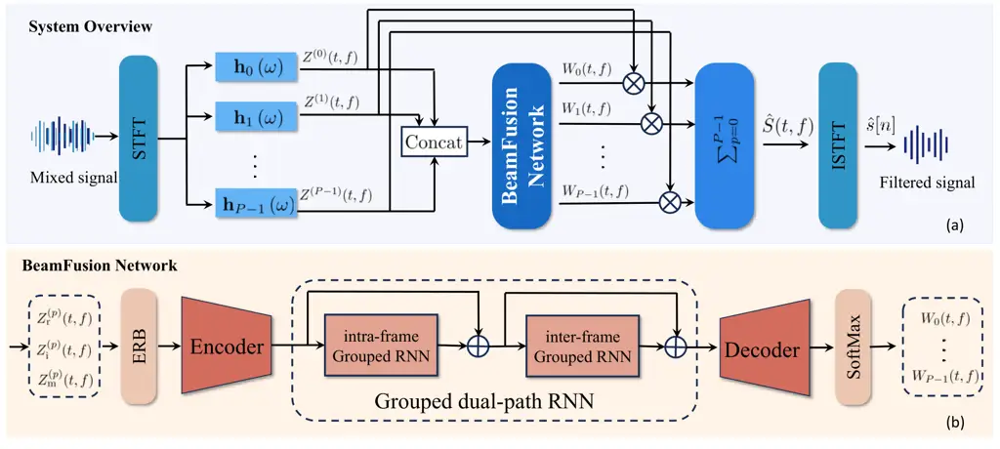

# Online Neural Fusion of Distortionless Differential Beamformers for Robust Speech Enhancement

Yuanhang Qian¹, Kunlong Zhao¹, Jilu Jin², Xueqin Luo², Gongping Huang¹,
Jingdong Chen², and Jacob Benesty³

###### Abstract

Fixed beamforming is widely used in practice since it does not depend on
the estimation of noise statistics and provides relatively stable
performance, yet a single beamformer cannot adapt to varying acoustic
conditions, which limits its interference suppression capability. To
address this, adaptive convex combination (ACC) algorithms have been
introduced, where the outputs of multiple fixed beamformers are linearly
combined to improve robustness. However, ACC often fails in highly
non-stationary scenarios, such as rapidly moving interference, since its
adaptive updates cannot reliably track rapid changes. To overcome this
limitation, we propose a frame-online neural method for multiple beams
fusion, which estimates more efficiently the combination weights.
Compared to conventional ACC, the proposed method adapts more
effectively to dynamic acoustic environments, achieving stronger
interference suppression while maintaining the distortionless
constraint.

###### Index Terms: 

Microphone arrays, differential beamforming, frame-online, beams fusion,
distortionless.

^(†)^(†)address: ¹Electronic Information School of Wuhan University,
430072, Wuhan, China  
²CIAIC, Northwestern Polytechnical University, Xi’an, Shaanxi 710072,
China  
³INRS-EMT, University of Quebec, Montreal, QC H5A 1K6, Canada

## 1 Introduction

In modern audio applications such as human-computer interaction, speech
transcription, and multi-party conferencing, clear and intelligible
speech signals are critical to ensure system performance \[1, 2, 3, 4,
5\]. Consequently, microphone arrays combined with beamforming
algorithms have become a mainstream technology for enhancing signal
quality through spatial filtering \[6, 7, 8\].

Beamforming methods are primarily categorized into two types:
fixed \[8\] and adaptive \[9, 10, 11\]. In fixed beamformers, the
differential microphone array (DMA) beamformer is widely used in
practical systems due to its core advantages of high directivity,
compact structure, and frequency-invariant spatial response \[12, 13\].
However, constrained by its static filtering characteristics, fixed
beamformers exhibit limited adaptability in dynamic acoustic
environments \[14\]. When confronted with moving interference sources or
changing noise scenarios, the preset filters fail to adequately suppress
interference and noise, resulting in reduced speech intelligibility.
Adaptive beamforming updates filter coefficients based on environmental
parameters or signal statistics to ensure robustness in dynamic acoustic
environments \[15, 16, 17, 18\]. However, obtaining reliable noise
statistics in real time is challenging in practice, which limits their
effectiveness in highly dynamic or complex scenarios \[19, 20\]. Jin et
al. proposed the ACC method \[21\], which employs convex combination to
adaptively weight the filter coefficients of multiple fixed
beamformers \[22\], enhancing adaptability to dynamic acoustic scenarios
while ensuring robustness. Nevertheless, the ACC method is still
fundamentally based on adaptive updates, which limits its ability to
cope with rapidly changing acoustic environments and often results in
suboptimal weight estimation.

To overcome the aforementioned technical problems, this paper proposes
an online neural method for multiple beamformers fusion \[23\]. Given a
set of fixed beamformers, each designed to satisfy the distortionless
constraint while imposing null constraints in different interference
directions, the proposed online neural approach learns fusion weights to
optimally combine their outputs. This enables instantaneous adaptation
in highly dynamic acoustic environments, such as those containing single
or multiple rapidly moving interferences. Simulation results confirm
that the proposed method outperforms both individual beamformers and
conventional ACC method in speech enhancement performance. Furthermore,
it successfully preserves the target speech while suppressing
interference and noise, demonstrating superior robustness under
non-stationary conditions.

## 2 signal model and Problem Formulation

Consider a uniform linear array (ULA) consisting of $`M`$ microphones,
where the spacing between adjacent microphones is $`\delta`$ and the
speed of sound is $`c`$. Assuming that a far-field acoustic source
signal impinges on the ULA from the desired azimuth angle
$`\theta_{\mathrm{s}}`$, the phase-delay vector can be expressed as

```math
\displaystyle\mathbf{d}_{\theta_{\mathrm{s}}}\left(\omega\right)=\left[1~~e^{-\jmath\omega\tau_{0}\cos\theta_{\mathrm{s}}}~~\cdots~~e^{-\jmath(M-1)\omega\tau_{0}\cos\theta_{\mathrm{s}}}\right]^{T}, \tag{1}
```

where $`\jmath`$ is the imaginary unit, $`\omega=2{\pi}f`$ is the
angular frequency, $`f`$ is the temporal frequency,
$`\tau_{0}=\delta/c`$ represents the time delay between adjacent
microphones for a signal arriving from the endfire direction of the
array, and the superscript ^(T) denotes the transpose operator.
Therefore, we can obtain the short-time Fourier transform (STFT)
representation of the observed signal from the microphone array as \[24,
5\]

```math
\displaystyle\mathbf{y}\left(w,\ell\right) \displaystyle=\left[\begin{array}[]{cccc}Y_{1}\left(\omega,\ell\right)&Y_{2}\left(\omega,\ell\right)&\cdots&Y_{M}\left(\omega,\ell\right)\end{array}\right]^{T}
```

```math
\displaystyle=X_{\mathrm{s}}\left(w,\ell\right)\mathbf{d}_{\theta_{\mathrm{s}}}\left(\omega\right)+\mathbf{v}\left(w,\ell\right), \tag{3}
```

where $`X_{\mathrm{s}}\left(w,\ell\right)`$ is the desired signal,
$`\mathbf{v}\left(w,\ell\right)`$ is the additive noise and interference
components, which is defined similarly to
$`\mathbf{y}\left(w,\ell\right)`$, and $`\ell`$ indexes the time frame.

Beamforming refers to the process of estimating the desired signal by
applying complex weights to the observed signals form the microphones
and summing the results. This operation can be mathematically expressed
as

```math
\displaystyle\hskip-3.0pt\hat{Z}\left(\omega,\ell\right) \displaystyle=\mathbf{h}^{H}\left(\omega\right)\mathbf{y}\left(\omega,\ell\right)
```

```math
\displaystyle=X_{\mathrm{s}}\left(\omega,\ell\right)\mathbf{h}^{H}\left(\omega\right)\mathbf{d}_{\theta_{\mathrm{s}}}\left(\omega\right)+\mathbf{h}^{H}\left(\omega\right)\mathbf{v}\left(\omega,\ell\right). \tag{4}
```

To ensure that the desired signal remains undistorted, beamformers
typically impose a distortionless constraint in the desired direction
$`\theta_{\mathrm{s}}`$:

```math
\displaystyle\mathbf{h}^{H}\left(\omega\right)\mathbf{d}_{\theta_{\mathrm{s}}}\left(\omega\right)=1. \tag{5}
```



Figure 1: (a) System overview and (b) BeamFusion network architecture.

## 3 Multiple Beamformers Fusion

### 3.1 Method Overview

In practical acoustic environments, multiple types of interference,
including fixed or moving sources, as well as background noise, are
typically present, making it difficult for a single beamformer to
achieve optimal speech enhancement. To address this, ACC algorithms have
been developed. Given a set of fixed beamformer coefficients, ACC
adaptively combines their weights to produce an optimal estimate of the
desired signal.

Define $`P`$ fixed beamformers $`\mathbf{h}_{p}\left(\omega\right)`$,
$`p=0,1,\dots,P-1`$, each steered to the same desired direction
$`\theta_{\mathrm{s}}`$. The collected filters are organized into a
matrix as

```math
\displaystyle\mathbf{H}\left(\omega\right)=\left[\begin{array}[]{cccc}\mathbf{h}_{0}\left(\omega\right)&\mathbf{h}_{1}\left(\omega\right)&\cdots&\mathbf{h}_{P-1}\left(\omega\right)\end{array}\right].
```

The objective of this work is to find an optimal filter by linearly
combining the existing filters, i.e.,

```math
\mathbf{h}_{\mathrm{opt}}\left(\omega,\ell\right)=\mathbf{H}\left(\omega\right)\bm{\alpha}\left(\omega,\ell\right), \tag{7}
```

where

```math
\displaystyle\bm{\alpha}\left(\omega,\ell\right)=\left[\begin{array}[]{cccc}\alpha_{0}\left(\omega,\ell\right)~\alpha_{1}\left(\omega,\ell\right)~\cdots~\alpha_{P-1}\left(\omega,\ell\right)\end{array}\right]^{T}
```

is the combination weight vector, where each element
$`0\leq\alpha_{p}\left(\omega,\ell\right)\leq 1`$ for
$`p=0,1,\ldots,P-1`$.

To ensure that the combined filter
$`\mathbf{h}_{\mathrm{opt}}\left(\omega,\ell\right)`$ satisfies the
distortionless response constraint in the desired direction
$`\theta_{\mathrm{s}}`$, the weight vector
$`\bm{\alpha}\left(\omega,\ell\right)`$ should be restricted:

```math
\displaystyle\mathbf{h}_{\mathrm{opt}}^{H}\left(\omega,\ell\right)\mathbf{d}_{\theta_{\mathrm{s}}}\left(\omega\right) \displaystyle=\sum_{p=0}^{P-1}\alpha_{p}\left(\omega,\ell\right)\mathbf{h}_{p}^{H}\left(\omega\right)\mathbf{d}_{\theta_{\mathrm{s}}}\left(\omega\right)
```

```math
\displaystyle=\sum_{p=0}^{P-1}\alpha_{p}\left(\omega,\ell\right)=1. \tag{9}
```

The final estimated signal can be expressed as

```math
\displaystyle\vskip-6.0pt\hat{{Z}}_{\mathrm{opt}}\left(\omega,\ell\right) \displaystyle=\bm{\alpha}^{T}\left(\omega,\ell\right)\mathbf{H}^{H}\left(\omega\right)\mathbf{y}\left(\omega,\ell\right)
```

```math
\displaystyle=\sum^{P-1}_{p=0}\alpha_{p}(\omega,\ell)\hat{Z}_{p}(\omega,\ell), \tag{10}
```

where $`\hat{Z}_{p}(\omega,\ell)`$ denotes the output of the $`p`$th
fixed beamformer.

In ACC method, the combination weight
$`\bm{\alpha}\left(\omega,\ell\right)`$ is updated using an exponential
gradient \[21, 25\] approach, which relies on the gradient information
of the current frame. While this method can effectively fuses multiple
beamformer outputs, its performance is often suboptimal in highly
non-stationary scenarios, such as multiple speakers or moving
interference sources. In such cases, the gradient estimates may be
delayed or inaccurate, preventing null-constrained beamformers from
effectively aligning with the interference direction and leading to
suboptimal performance. To address this limitation, we propose a neural
approach that predicts optimal combination weights.

### 3.2 Network Framework

The overall data flow is illustrated in Fig. 1. Given multichannel input
signals, we first apply $`P`$ fixed beamformers to capture acoustic
information from different spatial perspectives. The outputs are denoted
as $`z^{(p)}\left[n\right]`$, whose STFT-domain representations are
formulated as $`Z^{(p)}\left(t,f\right)`$, where $`p=0,1,\dots,P-1`$
refers to the $`p`$th beamformer, $`t`$ indexes $`T`$ frames, and $`f`$
indexes $`F`$ frequencies. Then, we extract the real, imaginary, and T-F
magnitude spectrum components of the beamformer outputs as
$`Z_{\mathrm{r}}^{(p)}\left(t,f\right)`$,
$`Z_{\mathrm{i}}^{(p)}\left(t,f\right)`$, and
$`Z_{\mathrm{m}}^{(p)}\left(t,f\right)`$, respectively, where the
network input
$`\mathbf{Z}_{\text{in}}\in\mathbb{R}^{3P\times T\times F}`$ is
constructed by concatenating these three components.

We adopt the network proposed in \[26\] as the backbone of our
framework. To begin, an equivalent rectangular bandwidth (ERB) filter
bank compresses the high-frequency part of $`\mathbf{Z}_{\text{in}}`$,
reducing its frequency dimension from $`F`$ to $`F^{\prime}`$. The
compressed features are then encoded into a high-dimensional T-F
embedding by an encoder. Subsequently, a grouped dual-path RNN (G-DPRNN)
processes the embedding to alternately capture temporal and spectral
dependencies. Specifically, the intra-frame RNN models the correlations
among frequency bins within a single frame, while the inter-frame RNN
characterizes the temporal evolution of each frequency bin across
consecutive frames \[27\]. To ensure causality, this module employs
unidirectional GRUs. The following decoder generates the weight
$`W_{p}\left(t,f\right)`$, which is equivalent to the coefficient
$`\alpha_{p}\left(\omega,\ell\right)`$ defined in (3.1). It is worth
mentioning that a softmax operation is applied to the weights before
output, enforcing the distortionless constraint
$`\sum_{p=0}^{P-1}W_{p}\left(t,f\right)=1`$ in (9). The estimated signal
is obtained by a weighted fusion of the beamformer outputs:

```math
\vskip-3.0pt\hat{S}(t,f)=\sum_{p=0}^{P-1}W_{p}(t,f)\,Z^{(p)}(t,f).\vskip-3.0pt \tag{11}
```

Eventually, the time-domain signal $`\hat{s}[n]`$ is obtained by
applying the inverse STFT to $`\hat{S}(t,f)`$.

In the design of the loss function, the primary constraint is that the
output of the weighted enhanced signal should approximate the original
direct sound component as closely as possible, ensuring the fidelity of
the target speech. Following this guideline, the loss function is
formulated as

```math
\mathcal{L}=\mathbb{E}\left[\left\|\mathbf{X}_{\mathrm{fi}}-\mathbf{X}_{\mathrm{ref}}\right\|_{2}^{2}\right], \tag{12}
```

where $`\mathbf{X}_{\mathrm{fi}}`$ represents the filtered desired
signal, $`\mathbf{X}_{\mathrm{ref}}`$ denotes the reference desired
signal, $`\mathbb{E}[\cdot]`$ is the mathematical expectation, and
$`\left\|\cdot\right\|_{2}`$ is the Euclidean norm. By minimizing this
loss, the network learns adaptive fusion weights that preserve the
integrity of the target speech. For brevity, we refer to the proposed
method as BeamFusion.

## 4 Simulations

### 4.1 Data Preparation

An 8-element ULA with an inter-element spacing of
$`\delta=1~\mathrm{cm}`$ is employed. The array is placed in a
rectangular room of size
$`{8~\mathrm{m}\times 6~\mathrm{m}\times 3~\mathrm{m}}`$, oriented
parallel to the $`x`$-axis, with its center located at coordinates
$`(4,2,1)~\mathrm{m}`$. The target source is fixed at an azimuth of
$`\theta_{\mathrm{s}}=0^{\circ}`$, positioned at $`(6,2,1)~\mathrm{m}`$.
The interfering source is placed at a distance of $`2~\mathrm{m}`$ from
the array center, initially located at an azimuth of $`90^{\circ}`$, and
rotated counterclockwise around the array center by $`10^{\circ}`$ every
second until reaching $`180^{\circ}`$.

Speech signals are selected from the LibriSpeech corpus \[28\] and
segmented into $`10~\mathrm{s}`$ clips, with silence removal applied to
ensure that no segment contained a continuous silent period longer than
$`0.1~\mathrm{s}`$. Room impulse responses (RIRs) are generated using
the image source method \[29, 30\], with reverberation time
$`T_{60}\in\left[200,800\right]~\mathrm{ms}`$. For each simulated
scenario, target and interfering sources are randomly selected from the
prepared clips. Their signals are convolved with the corresponding RIRs,
combined, and subsequently contaminated with Gaussian white noise at a
randomly chosen signal-to-noise ratio (SNR) between
$`20\text{\,}\mathrm{d}\mathrm{B}`$ and
$`40\text{\,}\mathrm{d}\mathrm{B}`$. Following this procedure, a total
of $`10{,}000`$ audio samples are generated for training and $`600`$
samples for testing.

### 4.2 Beamformers Configuration

In this study, seven beamformers are investigated for comparison.

- •
  MWNG beamformer \[31\].
- •
  Four first-order differential beamformers \[32\], denoted as DMA-I,
  DMA-II, DMA-III, and DMA-IV. All of them are steered towards the
  desired direction at $`\theta_{\mathrm{s}}=0^{\circ}`$, with nulls
  placed at $`90^{\circ}`$, $`120^{\circ}`$, $`150^{\circ}`$, and
  $`180^{\circ}`$, respectively.
- •
  The ACC method \[21\], which adaptively fuses the outputs of the above
  beamformers.
- •
  The proposed BeamFusion method, which employs a neural network to
  estimate the fusion weights of the above beamformers.

### 4.3 Model Configuration

In the feature processing stage, the input signals are first transformed
using the STFT, where the fast Fourier transform (FFT) size is set to
$`512`$, the length of window $`512`$, and the overlap $`128`$. We set
the encoder output, decoder input, and G-DPRNN hidden dimension to
$`32`$, while all other parameters remain the same as in \[26\]. The
total number of parameters of the model is $`85`$ k, with a
computational complexity of $`142`$ M Macs.

The model is trained using the Adam optimizer \[33\] with an initial
learning rate of $`1.0\times 10^{-3}`$. Whenever the validation loss did
not decrease for $`5`$ consecutive epochs, the learning rate is reduced
by half, with a minimum allowed learning rate of $`1.0\times 10^{-4}`$.
The batch size is set to $`30`$, and the training process is conducted
for a total of $`50`$ epochs.

During inference, the network performs frame-level online processing,
where fusion weights are predicted from the current and past frames and
the resulting outputs are overlap-added with nearby frames to
reconstruct the final signals.

|            |                            |               |                          |                            |               |                          |
| ---------- | -------------------------- | ------------- | ------------------------ | -------------------------- | ------------- | ------------------------ |
|            | $`T_{60}=300~\mathrm{ms}`$ |               |                          | $`T_{60}=700~\mathrm{ms}`$ |               |                          |
| Method     | $`\triangle`$SNR (dB)      | STOI          | $`\triangle`$SI-SDR (dB) | $`\triangle`$SNR (dB)      | STOI          | $`\triangle`$SI-SDR (dB) |
| Noisy      | $`-`$                      | $`0.58`$      | $`-`$                    | $`-`$                      | $`0.44`$      | $`-`$                    |
| MWNG       | $`0.28`$                   | $`0.62`$      | $`0.22`$                 | $`0.28`$                   | $`0.46`$      | $`0.19`$                 |
| DMA-I      | $`5.31`$                   | $`0.69`$      | $`5.50`$                 | $`6.41`$                   | $`0.56`$      | $`6.83`$                 |
| DMA-II     | $`6.02`$                   | $`0.71`$      | $`6.16`$                 | $`6.04`$                   | $`0.55`$      | $`6.34`$                 |
| DMA-III    | $`4.58`$                   | $`0.69`$      | $`4.68`$                 | $`4.28`$                   | $`0.51`$      | $`4.48`$                 |
| DMA-IV     | $`4.95`$                   | $`0.69`$      | $`5.06`$                 | $`4.68`$                   | $`0.52`$      | $`4.91`$                 |
| ACC        | $`6.56`$                   | $`0.73`$      | $`6.61`$                 | $`7.08`$                   | $`0.58`$      | $`7.30`$                 |
| BeamFusion | $`\bm{10.24}`$             | $`\bm{0.74}`$ | $`\bm{7.13}`$            | $`\bm{12.07}`$             | $`\bm{0.58}`$ | $`\bm{7.58}`$            |

Table 1: Performance comparison under different reverberation conditions
with moving interference.

Figure 2: SIR performance of MWNG, DMAs, ACC, and BeamFusion methods
across different interference angles from $`90^{\circ}`$ to
$`180^{\circ}`$.

## 5 Results and Discussion

In the first experiment, we evaluate the performance of the proposed
BeamFusion method in a moving interference scenario under different
reverberation conditions. The compared methods include the unprocessed
noisy signal, MWNG, DMA-I, DMA-II, DMA-III, DMA-IV, and ACC method. To
assess the robustness of the different approaches, different
reverberation times are considered, corresponding to
$`T_{60}=300~\mathrm{ms}`$ and $`700~\mathrm{ms}`$. The evaluation
metrics include the improvements in signal-to-noise ratio
($`\triangle`$SNR) and scale-invariant signal-to-distortion ratio
($`\triangle`$SI-SDR), as well as the short-time objective
intelligibility \[34\] (STOI). The results are summarized in Table 1.
The ACC method improves $`\triangle`$SNR and speech intelligibility by
adaptively combining multiple beamformers, outperforming any single DMA.
The proposed BeamFusion approach surpasses both ACC and individual DMAs
across all metrics, with particularly significant gains in
$`\triangle`$SNR. Its performance remains consistently superior under
different reverberation conditions, demonstrating the method’s
effectiveness in enhancing the target signal while suppressing
interference.

In addition, we evaluate the distribution of the signal-to-interference
ratio (SIR) metric as a function of the interference angle for signals
processed by BeamFusion and other methods. A total of $`200`$
simulations were conducted with the reverberation time set to
$`T_{60}=240~\mathrm{ms}`$, and the evaluation metrics were averaged.
Since the network structure of BeamFusion is nonlinear, it is difficult
to directly extract the filtered interference signal. Therefore, we
adopt the BSS evaluation method proposed in \[35\] to assess the
performance. This method applies an optimal linear filter to align the
estimate with the reference, then decomposes it into target, distortion,
and interference components. Based on this decomposition, the SIR metric
is calculated to quantify the level of interference suppression.
Figure 2 illustrates the SIR curves of the evaluated methods across
different interference angles. As shown in the figure, BeamFusion
consistently achieves higher SIR values than the other methods for most
interference angles, demonstrating its superior capability in
suppressing interfering sources.

|              |                         |                 |                            |
| ------------ | ----------------------- | --------------- | -------------------------- |
|   Method     |   $`\triangle`$SNR (dB) |   STOI          |   $`\triangle`$SI-SDR (dB) |
|   Noisy      |   $`-`$                 |   $`0.49`$      |   $`-`$                    |
|   MWNG       |   $`0.45`$              |   $`0.55`$      |   $`0.46`$                 |
|   DMA-I      |   $`5.30`$              |   $`0.60`$      |   $`5.40`$                 |
|   DMA-II     |   $`7.01`$              |   $`0.66`$      |   $`7.10`$                 |
|   DMA-III    |   $`5.42`$              |   $`0.62`$      |   $`5.50`$                 |
|   DMA-IV     |   $`5.86`$              |   $`0.63`$      |   $`5.94`$                 |
|   ACC        |   $`7.48`$              |   $`0.67`$      |   $`7.52`$                 |
|   BeamFusion |   $`\bm{12.16}`$        |   $`\bm{0.68}`$ |   $`\bm{7.99}`$            |

Table 2: Performance comparison in multi-interference environment.
Conditions: $`T_{60}=300~\mathrm{ms}`$.

Furthermore, we investigated the noise suppression performance of
BeamFusion under multi-interference conditions. The experimental setup
was identical to the previous configuration, except for the addition of
a fixed interference source randomly located between $`90^{\circ}`$ and
$`270^{\circ}`$ in azimuth, with $`T_{60}=300~\mathrm{ms}`$. Performance
metrics were obtained by averaging results across 200 signals. As shown
in Table 2, the BeamFusion approach outperforms any individual
beamformers as well as the ACC method, demonstrating superior
generalization and robustness in unseen acoustic conditions.

## 6 Conclusions

In this work, we proposed an online neural multiple beamformers fusion
framework that integrates the outputs of multiple fixed beamformers
through learned weights. Unlike conventional ACC methods that rely on
adaptive updates and often provide suboptimal estimates in rapidly
changing environments, the proposed framework is capable of realizing
the optimal fusion strategy while maintaining the distortionless
constraint. Experimental results demonstrate that the proposed framework
consistently outperforms both fixed and ACC-based beamformers, offering
stronger interference suppression and enhanced speech intelligibility,
thereby highlighting its potential for real-time, high-fidelity speech
enhancement.

## References

- \[1\] G. W. Elko, “Microphone array systems for hands-free
  telecommunication,” _Speech Commun._, vol. 20, no. 3, pp. 229–240,
  Nov. 1996.
- \[2\] J. Benesty, G. Huang, J. Chen, and N. Pan, _Microphone
  Arrays_. Berlin, Germany: Springer-Verlag, 2023, vol. 22.
- \[3\] G. Huang, J. R. Jensen, J. Chen, J. Benesty, M. G. Christensen,
  A. Sugiyama, G. Elko, and T. Gaensler, “Advances in microphone array
  processing and multichannel speech enhancement,” in _Proc. IEEE
  ICASSP_, 2025, pp. 1–5.
- \[4\] T. Yoshioka, A. Sehr, M. Delcroix, K. Kinoshita, R. Maas,
  T. Nakatani, and W. Kellermann, “Making machines understand us in
  reverberant rooms: Robustness against reverberation for automatic
  speech recognition,” _IEEE Signal Process. Mag._, vol. 29, no. 6, pp.
  114–126, Nov. 2012.
- \[5\] J. Benesty, J. Chen, and Y. Huang, _Microphone Array Signal
  Processing_. Berlin, Germany: Springer-Verlag, 2008.
- \[6\] M. Brandstein and D. Ward, _Microphone Arrays: Signal Processing
  Techniques and Applications_. Berlin, Germany: Springer-Verlag, 2001.
- \[7\] G. W. Elko and J. Meyer, “Microphone arrays,” in _Springer
  Handbook of Speech Processing_, J. Benesty, M. M. Sondhi, and
  Y. Huang, Eds. Berlin, Germany: Springer-Verlag, 2008, ch. 48, pp.
  1021–1041.
- \[8\] B. D. Van Veen and K. M. Buckley, “Beamforming: A versatile
  approach to spatial filtering,” _IEEE Trans. Acoust., Speech, Signal
  Process._, vol. 5, pp. 4–24, Apr. 1988.
- \[9\] H. Cox, R. Zeskind, and M. Owen, “Robust adaptive beamforming,”
  _IEEE Trans. Acoust., Speech, Signal Process._, vol. 35, pp.
  1365–1376, Oct. 1987.
- \[10\] S. Shahbazpanahi, A. B. Gershman, Z.-Q. Luo, and K. M. Wong,
  “Robust adaptive beamforming for general-rank signal models,” _IEEE
  Trans. Signal Process._, vol. 51, no. 9, pp. 2257–2269, Sep. 2003.
- \[11\] L. Griffiths and C. Jim, “An alternative approach to linearly
  constrained adaptive beamforming,” _IEEE Trans. Antennas and
  Propagation_, vol. 30, no. 1, pp. 27–34, Jan. 1982.
- \[12\] G. W. Elko, “Differential microphone arrays,” in _Audio Signal
  Processing for Next-Generation Multimedia Communication
  Systems_. Springer, 2004, pp. 11–65.
- \[13\] J. Benesty, J. Chen, and C. Pan, _Fundamentals of Differential
  Beamforming_. Berlin, Germany: Springer-Verlag, 2016.
- \[14\] J. Jin, G. Huang, X. Wang, J. Chen, J. Benesty, and I. Cohen,
  “Steering study of linear differential microphone arrays,” _IEEE/ACM
  Trans. Audio, Speech, Lang. Process._, vol. 29, pp. 158–170,
  Nov. 2021.
- \[15\] C. Pan, J. Chen _et al._, “Performance study of the MVDR
  beamformer as a function of the source incidence angle,” _IEEE/ACM
  Trans. Audio, Speech, Lang. Process._, vol. 22, no. 1, pp. 67–79,
  Jan. 2014.
- \[16\] W. Liu, J. Benesty, G. Huang, and J. Chen, “Beamforming in the
  short-time fourier transform domain via dimensionality reduction,”
  _IEEE Trans. Audio, Speech, Lang. Process._, vol. 33, pp. 1730–1742,
  Apr. 2025.
- \[17\] O. L. Frost III, “An algorithm for linearly constrained
  adaptive array processing,” _Proc. IEEE_, vol. 60, pp. 926–935,
  Aug. 1972.
- \[18\] E. A. Habets, J. Benesty, S. Gannot, and I. Cohen, “The MVDR
  beamformer for speech enhancement,” in _Speech Processing in Modern
  Communication_. Springer, 2010, pp. 225–254.
- \[19\] O. Besson and F. Vincent, “Performance analysis of beamformers
  using generalized loading of the covariance matrix in the presence of
  random steering vector errors,” _IEEE Trans. Signal Process._,
  vol. 53, no. 2, pp. 452–459, Feb. 2005.
- \[20\] Y. Gu and A. Leshem, “Robust adaptive beamforming based on
  interference covariance matrix reconstruction and steering vector
  estimation,” _IEEE Trans. Signal Process._, vol. 60, no. 7, pp.
  3881–3885, Jul. 2012.
- \[21\] J. Jin, X. Luo, G. Huang, J. Chen, and J. Benesty, “Beamforming
  through online convex combination of differential beamformers,” in
  _Proc. IEEE ICASSP_, 2024, pp. 8561–8565.
- \[22\] S. Boyd, S. P. Boyd, and L. Vandenberghe, _Convex
  Optimization_. Cambridge university press, 2004.
- \[23\] L. F. Yan, W. Huang, T. D. Abhayapala, J. Feng, and W. B.
  Kleijn, “Neural optimisation of fixed beamformers with flexible
  geometric constraints,” _IEEE Trans. Audio, Speech, Lang. Process._,
  vol. 33, pp. 759–772, Jan. 2025.
- \[24\] H. V. Trees, _Optimum Array Processing: Part IV of Detection,
  Estimation, and Modulation theory_. New York, John Wiley Sons,
  Inc, 2002.
- \[25\] J. Benesty, Y. Huang, and J. Chen, “An exponentiated gradient
  adaptive algorithm for blind identification of sparse simo systems,”
  in _Proc. IEEE ICASSP_, vol. 2. Montreal, Canada: IEEE, May 2004, pp.
  II–829–II–832.
- \[26\] X. Rong, T. Sun, X. Zhang, Y. Hu, C. Zhu, and J. Lu, “GTCRN: A
  speech enhancement model requiring ultralow computational resources,”
  in _Proc. IEEE ICASSP_, 2024, pp. 971–975.
- \[27\] Y. Luo, Z. Chen, and T. Yoshioka, “Dual-path rnn: efficient
  long sequence modeling for time-domain single-channel speech
  separation,” in _Proc. IEEE ICASSP_, 2020, pp. 46–50.
- \[28\] V. Panayotov, G. Chen, D. Povey, and S. Khudanpur,
  “Librispeech: an ASR corpus based on public domain audio books,” in
  _Proc. IEEE ICASSP_, 2015, pp. 5206–5210.
- \[29\] J. Allen and D. Berkley, “Image method for efficiently
  simulating small-room acoustics,” _J. Acoust. Soc. Am._, vol. 65,
  no. 4, pp. 943–950, Apr. 1979.
- \[30\] C. Pan, L. Zhang, Y. Lu, J. Jin, L. Qiu, J. Chen, and
  J. Benesty, “An anchor-point based image-model for room impulse
  response simulation with directional source radiation and sensor
  directivity patterns,” _arXiv preprint arXiv:2308.10543_, 2023.
- \[31\] G. Huang, J. Benesty, and J. Chen, “Fundamental approaches to
  robust differential beamforming with high directivity factors,”
  _IEEE/ACM Trans. Audio, Speech, Lang. Process._, vol. 30, pp.
  3074–3088, Jan. 2022.
- \[32\] J. Benesty and J. Chen, _Study and Design of Differential
  Microphone Arrays_. Berlin, Germany: Springer-Verlag, 2012.
- \[33\] D. P. Kingma and J. Ba, “Adam: a method for stochastic
  optimization,” _arXiv preprint arXiv:1412.6980_, 2014.
- \[34\] C. H. Taal, R. C. Hendriks, R. Heusdens, and J. Jensen, “A
  short-time objective intelligibility measure for time-frequency
  weighted noisy speech,” in _Proc. IEEE ICASSP_, 2010, pp. 4214–4217.
- \[35\] E. Vincent, R. Gribonval, and C. Févotte, “Performance
  measurement in blind audio source separation,” _IEEE/ACM Trans. Audio,
  Speech, Lang. Process._, vol. 14, no. 4, pp. 1462–1469, Aug 2006.
