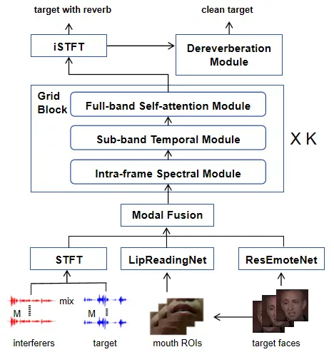
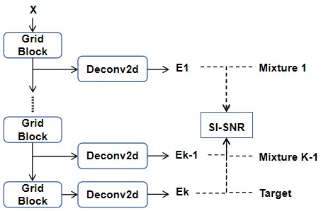
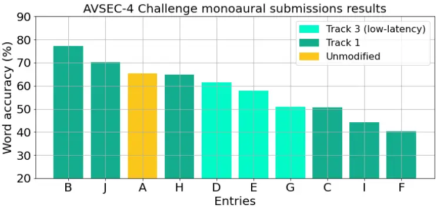
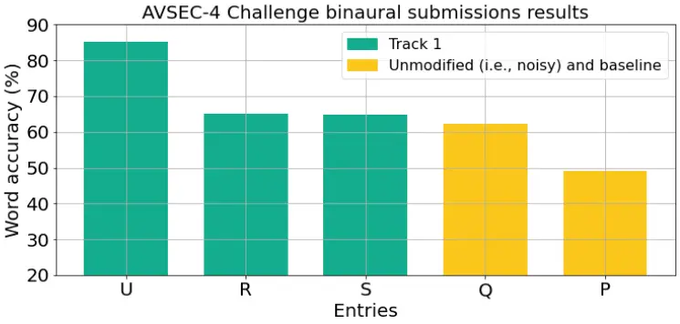

# Audio-Visual Speech Enhancement in Complex Scenarios with Separation and Dereverbration Joint Modeling

Jiarong Du    Zhan Jin    Peijun Yang    Juan Liu ^(†)^(†)thanks:
\*Corrsponding author: liujuan@whu.edu.cn.    Zhuo Li    Xin Liu    Ming
Li ^(†)^(†)thanks: \*Corrsponding author: ming.li369@dukekunshan.edu.cn;

###### Abstract

Audio-visual speech enhancement(AVSE) is a task that uses visual
auxiliary information to extract a target speaker’s speech from mixed
audio. In real-world scenarios, there often exist complex acoustic
environments, accompanied by various interfering sounds and
reverberation. Most previous methods struggle to cope with such complex
conditions, resulting in poor perceptual quality of the extracted
speech. In this paper, we propose an effective AVSE system that performs
well in complex acoustic environments. Specifically, we design a
‘‘separation before dereverberation’’ pipeline that can be extended to
other AVSE networks. The 4th COG-MHEAR Audio-Visual Speech Enhancement
Challenge (AVSEC) aims to explore new approaches to speech processing in
multimodal complex environments. We validated the performance of our
system in AVSEC-4: we achieved excellent results in the three objective
metrics on the competition leaderboard, and ultimately secured first
place in the human subjective listening test. Our demos are available at
¹¹ 1 [https://jarendd.github.io/](https://jarendd.github.io/).

###### Index Terms: 

Audio-Visual Speech Enhancement, Target Speaker Extraction, Robustness

^(†)^(†)address: ¹School of Cyber Science and Engineering, Wuhan
University, Wuhan, China  
²School of Artificial Intelligence, Wuhan University, Wuhan, China  
³School of Computer Science, Wuhan University, Wuhan, China  
⁴Suzhou Municipal Key Laboratory of Multimodal Intelligent Systems,  
Digital Innovation Research Center, Duke Kunshan University, Kunshan,
China  
⁵Hardware Engineering System, OPPO, Beijing, China

## 1 Introduction

As described by the classic cocktail-party effect \[1\], humans can
always focus on the sounds they want to hear in noisy environments.
Blind Source Separation (BSS) methods \[2, 3\] rely on prior information
regarding the number of speakers—a constraint that limits their
applicability in many practical scenarios. In contrast, Target Speaker
Extraction (TSE), with the help of prompt information, can focus on
selecting the desired speech from mixed audio. Previous TSE methods \[4,
5, 6\] often used the target speaker’s recording as registration
information. However, high-quality registration information is difficult
to obtain in advance.

With the development of multimodal technology \[7\], researchers have
gradually shifted their focus from audio-only methods to audio-visual
and multimodal methods. The role of multimodal information, such as
registered speech, directional cues, and lip movements, was explored by
Gu et al. \[8\]. Meanwhile, models designed for lip-reading tasks \[9\]
have demonstrated a remarkable capability to capture the correlation
between lip movements and speech. Building on this foundation, Wu et al.
\[10\] utilized a pre-trained lip-reading model to extract the speaker’s
lip movement features, which were subsequently fused with speech
features within their network. Subsequent work by Pan et al. \[11, 12\]
conducted extensive studies on the fusion methods between visual
features and mixed audio. Additionally, \[13, 14\] were inspired by the
real structure and operational processes of the human brain, and
verified that appropriate data fusion methods can enhance the
performance of multimodal TSE models. Although these models have shown
excellent performance in simulated datasets with the speech mixture
setting, most studies fail to account for complex acoustic conditions in
real-world scenarios—such as reverberation and diverse strong noise
sources. In this case, models trained with data simulated by simple
mixing may degrade the quality of extracted speech; while training
directly with complex data simulated with real Room Impulse Responses
(RIR) may also make the model difficult to generate the clean and
dereverberated speech of the target speaker.

To address the issues, this paper proposes several improvements based on
\[15\], enabling the extracted speech from complex environments to
maintain good perceptual quality. First, to avoid training the model
directly on complex mixed data, we designed a more reasonable dynamic
data mixing method, laying the foundation for subsequent progressive
training. Second, targeting at the increased difficulties of model
learning caused by complex training data, this paper proposes a
two-stage “separation before dereverberation” approach. Specifically,
progressive loss training is incorporated into the separation network in
the first stage to optimize the learning process; for the reverberant
speech obtained after separation, a pre-trained dereverberation model is
employed to predict the clean speech as a post-processing module.
Moreover, after the competition, we adopted a joint training strategy to
further improve the model’s performance. Our system achieved the
excellent performance in the three objective metrics—Perceptual
Evaluation of Speech Quality (PESQ) \[16\], Short-Time Objective
Intelligibility (STOI) \[17\], Scale-Invariant Signal-to-Distortion
Ratio (SISDR) \[18\]—and ranked as the first place in the human
subjective evaluation.

## 2 Methods

### 2.1 Overall Model Architecture

As a well-established blind separation network, TFGridNet \[3\] includes
a separation module, GridBlock, with proven effectiveness. AV-GridNet
\[19\] was the first to integrate video information with TFGridNet for
the AVSE task. Building on this, Jin et al. \[15\] fuse audio and visual
features through a single channel-wise concatenation operation prior to
the GridBlocks, reducing the model complexity while achieving
State-Of-The-Art (SOTA) results in the 3rd AVSEC. Furthermore, according
to research in \[20\], in addition to lip movements, facial expressions
contain rich information that can serve as new auxiliary information to
enhance the performance of AVSE. The overall structure of the network is
therefore shown in Figure 1.



Figure 1: Overall Model Architecture. Lip movement and facial expression
features are extracted by pre-trained lip-reading model \[9\] and
expression estimation model \[21\], respectively. These three types of
features are concatenated along the channel dimension and then fed into
the separation module following the same way as in \[20\]. The
separation module adopts the same structure as that of \[3\].

### 2.2 Separation Before Dereverberation and Progressive Training

Studies in \[22\] show that model training with data from different
reverberation conditions can significantly affect the performance. In
reverberant scenarios, adopting near-field clean speech as the target
increase the training difficulty of the model and reduce the quality of
the extracted speech. Using reverberant target can enhance separation
but introduce reverberation into the output signal. To tackle the
problem, we proposed a two-stage “separation before dereverberation”
approach. This method decouples the speech extraction and
dereverberation processes, enabling the model to ignore reverberation
during the separation stage which use the target speaker’s speech with
reverberation as the target and then perform dereverberation on the
separated signal.

We employed progressive loss training \[23\] in the separation network
of the first stage to make the training process more smooth. During
training, the reverberant target and interfering speech are initially
mixed at a random Signal-to-Distortion Ratio (SDR) within the range of
\[-18, 6\] dB. Based on this initial SNR, we generate K-1 intermediate
targets with a layer-wise increasing SNR. Each intermediate target
serves as the ground truth for the output of the corresponding
GridBlock, with a 5 dB difference between successive targets. And the
final layer directly employs the reverberant target speech as the
training target without any additional mixing. As shown in Figure 2,
after each separation module, we use an independent Deconv2d layer to
calculate the intermediate estimates, and compute the SISDR loss \[18\]
between each intermediate estimate and its corresponding intermediate
target. The total loss function is defined as:

```math
\mathcal{L}_{\text{total}}=\frac{1}{K}\sum_{k=1}^{K}\mathcal{L}^{(k)}
```

where $`K=6`$ denotes the number of GridBlocks, $`\mathcal{L}^{(k)}`$
represents the loss at the k-th layer, and
$`\mathcal{L}_{\text{total}}`$ denotes the total loss of the separation
model. This method enables the model to suppress interfering speech in
shallow network layers and learn the details of the target speech in
deeper layers.



Figure 2: Progressive Training. In this work, K is set to 6.
$`\text{E}_{k}`$ represents the intermediate estimate output by the
$`k`$-th separation module layer. $`\text{Mixture}_{k}`$ denotes the
intermediate target at the $`k`$-th layer. Target refers to the clean
target speaker’s speech with reverberation.

For the extracted speech with reverberation, we use a pre-trained
dereverberation model \[24\] for post-processing to obtain the clean
speech. Richter et al. \[24\] proposed a score-based generative
diffusion model, SGMSE+, which employs a complex-valued Short-Time
Fourier Transform (STFT) representation for speech signals. It designs a
linear Stochastic Differential Equation (SDE)-based forward diffusion
process with a drift term and a score model-based reverse recovery
process. Notably, this model only requires 30 diffusion steps to
generate high-quality speech. In dereverberation tasks, SGMSE+
significantly outperforms baseline methods in relevant metrics,
demonstrating excellent dereverberation performance.

### 2.3 In-depth Study of Separation Before Dereverberation Pipeline

To achieve better dereverberation performance, we chose to use a
relatively advanced dereverberation model \[24\] during the competition.
As it is a generative model, its training and inference speeds are
relatively slow, making it unsuitable for joint training with the
separation model.

Therefore, after the competition, we aimed to extend the post-processing
approach into a joint method. To enable joint training with the
separation model, we selected SkipConvNet \[25\] as the new
dereverberation module. It adopts a relatively simple stacked
convolution structure while achieving favorable performance, making it a
widely used dereverberation network. To investigate the interaction
between the separation and dereverberation modules, we conducted joint
training and defined the new loss function as:

```math
\mathcal{L}_{\text{joint}}=\mathcal{L}_{\text{separate}}+\mathcal{L}_{\text{dereverb}}
```

$`\mathcal{L}_{\text{separate}}`$ represents the progressive loss
mentioned in Section 2.2, while $`\mathcal{L}_{\text{dereverb}}`$
depends specifically on the calculation method of the dereverberation
module used. For example, SkipConvNet \[25\] employs the mean squared
error between the predicted and target speech spectrograms as its loss
function. Training both modules from scratch may lead to performance
degradation due to inconsistent optimization directions. However, using
pretrained weights for both modules may reduce the gain of joint
training. Therefore, we first initialize the model with the weights from
the pretrained dereverberation module, and then perform joint training
of both the separation and dereverberation modules.

## 3 Experiment al RESULTS

### 3.1 Dataset

To promote the performance of models’ robustness in real-world
scenarios, the 4th COG-MHEAR AVSEC ²² 2
[https://challenge.cogmhear.org/](https://challenge.cogmhear.org/)
designed a complex dataset that is closer to real-world environments.
Unlike LRS3 \[26\], and VOXCELEB2 \[27\], the AVSEC-4 dataset includes
reverberation simulated from real rooms, and the total number of
speakers in each audio clip may exceed two. Furthermore, music noise is
added to the data, increasing the complexity of the separation task.

The training set contains 34,524 utterances with a total duration of 113
hours and 17 minutes. The development set includes 3,306 utterances,
totaling 8 hours and 38 minutes. The test set comprises 3,180
utterances, of which 1,500 are used for leaderboard evaluation and the
rest for listening tests. The test set is produced in real conference
room scenarios by controlling the room size and sound propagation
distance, with the SNR ranging from -18 dB to 6.55 dB.

### 3.2 Implementation Details

We dynamically mixed the binaural target signals and interferers at SNR
ranging from -18 dB to 6 dB. The mixed audio segments and corresponding
target speaker videos (sampled at 25 frames per second) were randomly
truncated into 3-second chunks. We used the Adam optimizer with an
initial learning rate of 0.001. The learning rate was halved when the
best validation loss showed no improvement for 3 consecutive epochs, and
training was stopped when there was no improvement for 10 consecutive
epochs. The SISDR loss \[18\] was adopted as the training loss function,
with the batch size fixed at 2.

|               |         |      |      |        |
| ------------- | ------- | ---- | ---- | ------ |
| System        | Channel | PESQ | STOI | SISDR  |
| Noisy         | M       | 1.29 | 0.51 | -25.94 |
| Noisy         | B       | 1.31 | 0.55 | -24.28 |
| Team-OPTIMAL  | M       | 1.37 | 0.48 | -21.44 |
| USTC_Entry1   | M       | 1.35 | 0.52 | -23.96 |
| GU-ENU        | M       | 1.35 | 0.52 | -23.93 |
| Rahma_Team    | M       | 1.30 | 0.55 | -24.72 |
| TeamKCW       | M       | 1.58 | 0.60 | -21.77 |
| SND_VD        | M       | 1.72 | 0.64 | -21.96 |
| R-test1       | B       | 1.64 | 0.66 | -19.26 |
| BioASP        | M       | 1.71 | 0.67 | -20.41 |
| SUSTechAILab  | B       | 1.95 | 0.67 | -18.75 |
| CITISIN       | M       | 2.29 | 0.78 | -17.15 |
| WHU_DKU(ours) | B       | 2.16 | 0.82 | -17.47 |

Table 1: The leaderboard of AVSEC-4. All results evaluated on 1,500
utterances in the test set. M denotes monaural audio, while B denotes
binaural audio.

| System        | PESQ | STOI | SISDR  |
| ------------- | ---- | ---- | ------ |
| Noisy         | 1.08 | 0.55 | -23.93 |
| WHU_DKU(ours) | 1.60 | 0.83 | -17.16 |

Table 2: Evaluation results on the complete test set.

In addition, after the competition, We investigated the impact of
monaural output on system performance and explored a different training
strategy. During the training, the number of epochs for learning rate
reduction and early stopping was adjusted from 3 and 10 to 15 and 30,
respectively. Once the learning rate dropped to a certain level, we
added the STFT loss \[28\] function to the original SISDR loss \[18\]
function. This enables the model to gain spectral benefits, and enhance
the listening quality of the extracted speech.

### 3.3 Results and Discussions

The detailed results are shown in Table 1. As can be seen from the first
row of the table, the objective metrics of the original mixed data
(Noisy) are very low, indicating that the original data is complex and
severely degraded by noise and reverberation. The middle part of the
table corresponds to other participating teams. Our proposed system
(WHU_DKU) achieved competitive performance across all metrics. With a
PESQ of 2.16, we rank second in this indicator, yet our STOI metric
reaches 0.82. We believe the high STOI but relatively lower PESQ stems
from our system’s strong interference suppression. However, this
aggressive suppression can overoptimize noise removal, causing subtle
damage to the natural timbre of the original speech.

In the human-ear subjective evaluation, participants viewed 126 video
clips, 120 samples, and 6 validation questions. The performance of each
system was evaluated by calculating the word intelligibility score,
where a higher score indicates better intelligibility. The final score
was based on the average of all participants’ ratings. The evaluation
results are presented in Figure 3, and our system is represented by
system “U”. Our score was 85.23, the only one that exceeds 80 points,
which demonstrates the effectiveness of our system. Although our system
does not have a significant advantage in the objective metrics, its
leading performance in subjective ratings demonstrates that our method
is beneficial for human auditory perception.





Figure 3: Results of subjective evaluation by human auditory perception.
Our system is represented by “U”.

After the competition, we re-evaluated the system’s performance on the
complete monoaural test set. We employed the second training strategy
mentioned in Section 3.2, and output monaural audio. As shown in Table
2, significant improvements were observed across all three objective
metrics. However, due to its prohibitively long training time, this
strategy was not adopted for subsequent experiments.

| System                   | PESQ | STOI | SISDR  |
| ------------------------ | ---- | ---- | ------ |
| Derev before Sep         | 1.35 | 0.69 | -23.71 |
| Separation only          | 1.42 | 0.78 | -18.22 |
| Sep before Derev         | 1.44 | 0.81 | -18.71 |
| Separation only (joint)  | 1.44 | 0.79 | -18.07 |
| Sep before Derev (joint) | 1.69 | 0.83 | -17.66 |

Table 3: Evaluation results on the complete test set.

Moreover, ablation studies of different training strategies are shown in
Table 3. The approach of ”dereverberation before separation” achieves
the worst performance. The dereverberation operation will change the
characteristics of the original mixed audio, making the subsequent
separation network difficult to perform well. In contrast, “separation
before dereverberation” can effectively combine the strength of the two
tasks, achieving better results. And joint training can further enhance
the quality of the speech. Furthermore, the joint training of the two
modules also have a positive impact on the separation network using
alone, resulting in a certain improvement in the separation results of
the first stage.

## 4 Conclusion

To address the limitations of existing AVSE methods in complex acoustic
environments, this paper introduces an effective AVSE system along with
a corresponding “separation before dereverberation” pipeline. The
proposed approach reduces the learning complexity associated with
processing complex data, improves the quality of the enhanced speech,
and achieves SOTA performance in the AVSEC-4.

## References

- \[1\] Barry Arons, “A review of the cocktail party effect,” Journal of
  the American Voice I/O society, vol. 12, no. 7, pp. 35–50, 1992.
- \[2\] Yi Luo and Nima Mesgarani, “Conv-tasnet: Surpassing ideal
  time–frequency magnitude masking for speech separation,” IEEE/ACM
  transactions on audio, speech, and language processing, vol. 27, no.
  8, pp. 1256–1266, 2019.
- \[3\] Zhong-Qiu Wang, Samuele Cornell, Shukjae Choi, Younglo Lee,
  Byeong-Yeol Kim, and Shinji Watanabe, “Tf-gridnet: Integrating
  full-and sub-band modeling for speech separation,” IEEE/ACM
  Transactions on Audio, Speech, and Language Processing, vol. 31, pp.
  3221–3236, 2023.
- \[4\] Chenglin Xu, Wei Rao, Eng Siong Chng, and Haizhou Li, “Spex:
  Multi-scale time domain speaker extraction network,” IEEE/ACM
  transactions on audio, speech, and language processing, vol. 28, pp.
  1370–1384, 2020.
- \[5\] Meng Ge, Chenglin Xu, Longbiao Wang, Eng Siong Chng, Jianwu
  Dang, and Haizhou Li, “Spex+: A complete time domain speaker
  extraction network,” in Proc. Interspeech, 2020, pp. 1406–1410.
- \[6\] Fengyuan Hao, Xiaodong Li, and Chengshi Zheng, “X-tf-gridnet: A
  time–frequency domain target speaker extraction network with adaptive
  speaker embedding fusion,” Information Fusion, vol. 112, pp.
  102550, 2024.
- \[7\] Daniel Michelsanti, Zheng-Hua Tan, Shi-Xiong Zhang, Yong Xu,
  Meng Yu, Dong Yu, and Jesper Jensen, “An overview of
  deep-learning-based audio-visual speech enhancement and separation,”
  IEEE/ACM Transactions on Audio, Speech, and Language Processing, vol.
  29, pp. 1368–1396, 2021.
- \[8\] Rongzhi Gu, Shi-Xiong Zhang, Yong Xu, Lianwu Chen, Yuexian Zou,
  and Dong Yu, “Multi-modal multi-channel target speech separation,”
  IEEE Journal of Selected Topics in Signal Processing, vol. 14, no. 3,
  pp. 530–541, 2020.
- \[9\] Brais Martinez, Pingchuan Ma, Stavros Petridis, and Maja Pantic,
  “Lipreading using temporal convolutional networks,” in Proc. ICASSP,
  2020, pp. 6319–6323.
- \[10\] Jian Wu, Yong Xu, Shi-Xiong Zhang, Lian-Wu Chen, Meng Yu, Lei
  Xie, and Dong Yu, “Time domain audio visual speech separation,” in
  Proc. ASRU, 2019, pp. 667–673.
- \[11\] Zexu Pan, Ruijie Tao, Chenglin Xu, and Haizhou Li, “Muse:
  Multi-modal target speaker extraction with visual cues,” in Proc.
  ICASSP, 2021, pp. 6678–6682.
- \[12\] Zexu Pan, Meng Ge, and Haizhou Li, “Usev: Universal speaker
  extraction with visual cue,” IEEE/ACM Transactions on Audio, Speech,
  and Language Processing, vol. 30, pp. 3032–3045, 2022.
- \[13\] Kai Li, Fenghua Xie, Hang Chen, Kexin Yuan, and Xiaolin Hu, “An
  audio-visual speech separation model inspired by
  cortico-thalamo-cortical circuits,” IEEE Transactions on Pattern
  Analysis and Machine Intelligence, vol. 46, no. 10, pp.
  6637–6651, 2024.
- \[14\] Kai Li, Runxuan Yang, Fuchun Sun, and Xiaolin Hu, “Iianet: an
  intra-and inter-modality attention network for audio-visual speech
  separation,” in Proc. ICML, 2024, pp. 29181–29200.
- \[15\] Zhan Jin, Bang Zeng, Zhuo Li, Xin Liu, and Ming Li, “A target
  speaker extraction method for the 3rd audio-visual speech enhancement
  challenge,” in Proc. AVSEC 2024, 2024, pp. 16–18.
- \[16\] “Perceptual evaluation of speech quality (pesq)-a new method
  for speech quality assessment of telephone networks and codecs,” in
  Proc. ICASSP, 2001, vol. 2, pp. 749–752.
- \[17\] Cees H Taal, Richard C Hendriks, Richard Heusdens, and Jesper
  Jensen, “A short-time objective intelligibility measure for
  time-frequency weighted noisy speech,” in Proc. ICASSP, 2010, pp.
  4214–4217.
- \[18\] Jonathan Le Roux, Scott Wisdom, Hakan Erdogan, and John R
  Hershey, “Sdr–half-baked or well done?,” in Proc. ICASSP, 2019, pp.
  626–630.
- \[19\] Zexu Pan, Gordon Wichern, Yoshiki Masuyama, François G Germain,
  Sameer Khurana, Chiori Hori, and Jonathan Le Roux, “Scenario-aware
  audio-visual tf-gridnet for target speech extraction,” in Proc. ASRU,
  2023, pp. 1–8.
- \[20\] Zhan Jin, Bang Zeng, Peijun Yang, Jiarong Du, Juan Liu, and
  Ming Li, “Robust audio-visual target speaker extraction with
  emotion-aware multiple enrollment fusion,” arxiv 2509.12583, 2025.
- \[21\] Arnab Kumar Roy, Hemant Kumar Kathania, Adhitiya Sharma,
  Abhishek Dey, and Md. Sarfaraj Alam Ansari, “Resemotenet: Bridging
  accuracy and loss reduction in facial emotion recognition,” IEEE
  Signal Processing Letters, vol. 32, pp. 491–495, 2024.
- \[22\] Zifeng Zhao and Dongchao Yang and Rongzhi Gu and Haoran Zhang
  and Yuexian Zou, “Target Confusion in End-to-end Speaker Extraction:
  Analysis and Approaches,” in Proc. Interspeech, 2022, pp. 5333–5337.
- \[23\] Zhongshu Hou, Tianchi Sun, Yuxiang Hu, Changbao Zhu, Kai Chen,
  and Jing Lu, “Sir-progressive audio-visual tf-gridnet with asr-aware
  selector for target speaker extraction in misp 2023 challenge,” in
  Proc. ICASSPW, 2024, pp. 11–12.
- \[24\] Julius Richter, Simon Welker, Jean-Marie Lemercier, Bunlong
  Lay, and Timo Gerkmann, “Speech enhancement and dereverberation with
  diffusion-based generative models,” IEEE/ACM Transactions on Audio,
  Speech, and Language Processing, vol. 31, pp. 2351–2364, 2023.
- \[25\] Vinay Kothapally, Wei Xia, Shahram Ghorbani, John HL Hansen,
  Wei Xue, and Jing Huang, “Skipconvnet: Skip convolutional neural
  network for speech dereverberation using optimally smoothed spectral
  mapping,” in Proc. Interspeech, 2020, pp. 3935–3939.
- \[26\] Triantafyllos Afouras, Joon Son Chung, and Andrew Zisserman,
  “Lrs3-ted: a large-scale dataset for visual speech recognition,”
  arXiv:1809.00496, 2018.
- \[27\] J Chung, A Nagrani, and A Zisserman, “Voxceleb2: Deep speaker
  recognition,” in Proc. Interspeech, pp. 1086–1090, 2018.
- \[28\] Zexu Pan, Meng Ge, and Haizhou Li, “A hybrid continuity loss to
  reduce over-suppression for time-domain target speaker extraction,” in
  Proc. Interspeech, 2022, pp. 1786–1790.
