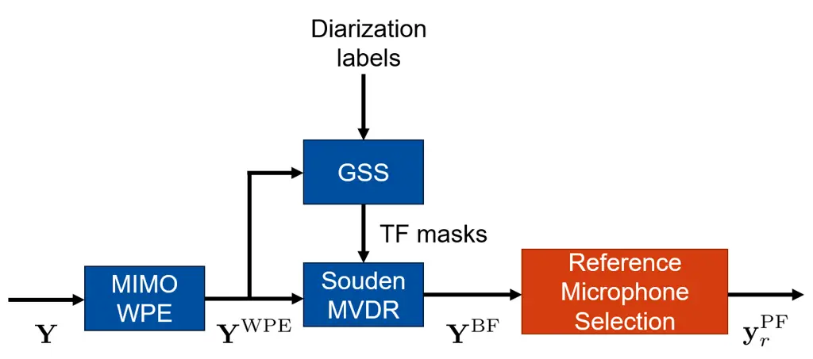

# Reference Microphone Selection for Guided Source Separation based on the Normalized L-p Norm

Anselm Lohmann    Tomohiro Nakatani    Rintaro Ikeshita    Marc Delcroix
   Shoko Araki    Simon Doclo

###### Abstract

Guided Source Separation (GSS) is a popular front-end for distant
automatic speech recognition (ASR) systems using spatially distributed
microphones. When considering spatially distributed microphones, the
choice of reference microphone may have a large influence on the quality
of the output signal and the downstream ASR performance. In GSS-based
speech enhancement, reference microphone selection is typically
performed using the signal-to-noise ratio (SNR), which is optimal for
noise reduction but may neglect differences in early-to-late-reverberant
ratio (ELR) across microphones. In this paper, we propose two reference
microphone selection methods for GSS-based speech enhancement that are
based on the normalized $`\ell_{p}`$-norm, either using only the
normalized $`\ell_{p}`$-norm or combining the normalized
$`\ell_{p}`$-norm and the SNR to account for both differences in SNR and
ELR across microphones. Experimental evaluation using a CHiME-8 distant
ASR system shows that the proposed $`\ell_{p}`$-norm-based methods
outperform the baseline method, reducing the macro-average word error
rate.

###### Index Terms: 

Reference microphone selection, guided source separation, speech
enhancement, normalized $`\ell_{p}`$-norm

^(†)^(†)address: ¹Carl von Ossietzky Universität Oldenburg, Dept. of
Medical Physics and Acoustics, Germany  
²NTT, Inc., Japan  
anselm.lohmann@uni-oldenburg.de

## 1 Introduction

Guided source separation (GSS)-based speech enhancement is a popular
approach \[1\] for enhancing a target speech source in noisy and
reverberant environments, particularly in the context of the CHiME
challenge, which aims at ASR and diarization of multi-talker
conversations recorded by spatially distributed microphones \[2, 3, 4,
5\]. GSS-based speech enhancement (see Fig. 1) first performs
dereverberation using the multiple-input multiple-output (MIMO) weighted
prediction error (WPE) dereverberation method \[6\]. In a second step,
noise reduction is performed using a MIMO minimum variance
distortionless response (MVDR) beamformer \[7\], where the target speech
and noise covariance matrices are estimated with time-frequency masks
computed using GSS \[1\]. In order to output an enhanced target source
signal, the GSS-based approach selects the reference microphone index of
the MIMO beamformer with the highest estimated output signal-to-noise
ratio (SNR) \[8\].

When performing speech enhancement using spatially distributed
microphones, e.g. GSS-based, there may be large differences in the
early-to-late reverberation ratio (ELR) and SNR in each microphone.
Hence, the choice of the reference microphone may have a large influence
on the quality of the output signal and downstream ASR performance \[9,
8, 10, 11, 12\]. While different reference microphone selection methods
have been proposed for noise reduction, e.g. selecting the microphone
with the largest input signal power of the target speech source \[8,
10\], selecting the microphone with the highest output SNR, as in
GSS-based speech enhancement, is considered optimal \[8, 11\]. However,
for WPE dereverberation, it was recently proposed to select the
microphone with the lowest output normalized $`\ell_{p}`$-norm \[12\].
Hence, since GSS-based speech enhancement includes both WPE
dereverberation and noise reduction, selecting the reference microphone
optimal for noise reduction may not result in selecting the microphone
with the highest overall signal quality and ASR performance.



Figure 1: GSS-based speech enhancement

In this paper, we propose reference microphone selection methods based
on the normalized $`\ell_{p}`$-norm for GSS-based speech enhancement.
The normalized $`\ell_{p}`$-norm \[13\] measures the sparsity of a
signal in the time-frequency domain and was shown to typically select a
microphone with a high input ELR in noise-free conditions \[12\]. In
order to account for differences in input ELR between the microphones,
the first proposed reference microphone selection method uses only the
normalized $`\ell_{p}`$-norm of the MIMO beamformer output signals.
However, since this does not take into account differences in output SNR
between microphones, the second proposed reference microphone selection
method combines the normalized $`\ell_{p}`$-norm and SNR of the
beamformer output. Experimental evaluation using signal quality metrics
show that using only the normalized $`\ell_{p}`$-norm significantly
outperforms using only the SNR at high input SNRs, while using both the
normalized $`\ell_{p}`$-norm and SNR consistently outperforms using only
the SNR. Experimental evaluation using a CHiME-8 distant ASR system
\[2\] shows that the proposed $`\ell_{p}`$-norm-based reference
microphone selection methods outperform the baseline method using only
the SNR in terms of word error rate (WER), with the combination of the
normalized $`\ell_{p}`$-norm and SNR yielding the lowest WER.

## 2 GSS-based Speech Enhancement

We consider a scenario where $`K`$ speech sources are recorded in a
reverberant and noisy environment by $`M`$ spatially distributed
microphones, with $`K<M`$. In the short-time Fourier transform (STFT)
domain, let $`f\in\{1,...,F\}`$ be the frequency-bin index and
$`l\in\{1,...,L\}`$ be the time-frame index. The reverberant and noisy
mixture vector in the $`m`$-th microphone
$`\mathbf{y}_{m}(f)=\begin{bmatrix}y_{m}(f,1)&\cdots&y_{m}(f,L)\end{bmatrix}^{T}\in\mathbb{C}^{L}`$,
with $`(.)^{T}`$ denoting the transpose operator, can be written as

```math
\mathbf{y}_{m}(f)=\mathbf{x}^{\text{early}}_{m}(f)+\mathbf{x}^{\text{late}}_{m}(f)+\mathbf{n}_{m}(f), \tag{1}
```

where $`\mathbf{x}^{\text{early}}_{m}\in\mathbb{C}^{L}`$ and
$`\mathbf{x}^{\text{late}}_{m}\in\mathbb{C}^{L}`$ denote the
early-reverberant and late-reverberant target speech signal vectors,
respectively, and $`\mathbf{n}_{m}\in\mathbb{C}^{L}`$ denotes the noise
mixture vector, consisting of background noise and $`K-1`$ reverberant
interfering speech signals. The equation in (2) can be rewritten by
stacking the signal and mixture vectors across microphones, i.e.

```math
\mathbf{Y}(f)=\mathbf{X}^{\text{early}}(f)+\mathbf{X}^{\text{late}}(f)+\mathbf{N}(f), \tag{2}
```

where
$`\mathbf{Y}(f)=\begin{bmatrix}\mathbf{y}_{1}(f)&\cdots&\mathbf{y}_{M}(f)\end{bmatrix}^{T}\in\mathbb{C}^{M\times L}`$
denotes the reverberant and noisy mixture matrix,
$`\mathbf{X}^{\text{early}}(f)\in\mathbb{C}^{M\times L}`$ and
$`\mathbf{X}^{\text{late}}(f)\in\mathbb{C}^{M\times L}`$ denote the
early-reverberant and late-reverberant target speech signal matrices,
respectively, and $`\mathbf{N}(f)\in\mathbb{C}^{M\times L}`$ denotes the
noise mixture matrix. For clarity, the frequency-bin index $`f`$ will be
omitted where possible.

First, GSS-based speech enhancement in Fig. 1 performs dereverberation
using MIMO WPE, i.e. by subtracting an estimate of the late-reverberant
target signal, alongside the late-reverberant intereferer signals, from
the reverberant and noisy mixture. The MIMO WPE output mixture matrix
$`\mathbf{Y}^{\text{WPE}}`$ can be written as

```math
\mathbf{Y}^{\text{WPE}}=\mathbf{Y}-\mathbf{G}^{H}\tilde{\mathbf{Y}}_{\tau}, \tag{3}
```

where $`\mathbf{G}\in\mathbb{C}^{ML_{g}\times M}`$ denotes the MIMO WPE
filter with filter length $`L_{g}`$, $`(.)^{H}`$ denotes the Hermitian
transpose operator and
$`\tilde{\mathbf{Y}}_{\tau}\in\mathbb{C}^{ML_{g}\times L}`$ is a
multi-channel convolution matrix of the delayed reverberant and noisy
mixture with $`\tau`$ the prediction delay \[6\]. The MIMO WPE filter
can be computed by minimizing \[14\]

```math
J_{\ell_{\mathbf{\Phi};p,2}}(\mathbf{Y}^{\text{WPE}})=\|\mathbf{Y}^{\text{WPE}}\|_{\mathbf{\Phi};2,p}^{p}=\sum_{l=1}^{L}\lvert\left(\mathbf{y}^{\text{WPE}}_{1:M}(l)\right)^{H}\mathbf{\Phi}^{-1}\mathbf{y}^{\text{WPE}}_{1:M}(l)\rvert^{\frac{p}{2}}, \tag{4}
```

where $`J_{\ell_{\mathbf{\Phi};p,2}}(\mathbf{Y}^{\text{WPE}})`$ denotes
the mixed norm $`\ell_{\mathbf{\Phi};p,2}`$ of the WPE output mixture
matrix $`\mathbf{Y}^{\text{WPE}}`$ with group matrix
$`\mathbf{\Phi}\in\mathbb{C}^{M\times M}`$ and sparsity-promoting
parameter $`p`$ \[14\] and
$`\mathbf{y}^{\text{WPE}}_{1:M}(l)\in\mathbb{C}^{M}`$ denotes the
$`l`$-th column vector of $`\mathbf{Y}^{\text{WPE}}`$. Typically, the
cost function in (4) is minimized using the iteratively reweighted least
squares algorithm for $`I_{\text{WPE}}`$ iterations \[6\]\[14\].

In a second step, GSS-based speech enhancement performs noise reduction
using the Souden MVDR beamformer \[7\] on the MIMO WPE output mixture
matrix $`\mathbf{Y}^{\text{WPE}}`$. The MIMO beamformer output signal
matrix $`\mathbf{Y}^{\text{BF}}`$ can be written as

```math
\mathbf{Y}^{\text{BF}}=\mathbf{W}^{H}\mathbf{Y}^{\text{WPE}}, \tag{5}
```

with the MIMO beamformer filter
$`\mathbf{W}=\begin{bmatrix}\mathbf{w}_{1}&\cdots&\mathbf{w}_{M}\end{bmatrix}\in\mathbb{C}^{M\times M}`$
computed as

```math
\mathbf{W}=\frac{\hat{\mathbf{R}}_{n}^{-1}\hat{\mathbf{R}}_{x}}{\text{Tr}(\hat{\mathbf{R}}_{n}^{-1}\hat{\mathbf{R}}_{x})} \tag{6}
```

using estimated batch covariance matrices $`\hat{\mathbf{R}}_{n}`$ and
$`\hat{\mathbf{R}}_{x}`$ of the noise mixture and early-reverberant
target speech signal matrices, respectively. The covariance matrices
$`\hat{\mathbf{R}}_{n}`$ and $`\hat{\mathbf{R}}_{x}`$ are computed using
time-frequency masks for the early-reverberant target source signal and
noise mixture, i.e.

```math
\hat{\mathbf{R}}_{n}=\frac{1}{L}\sum_{l=1}^{L}\mu_{n}(l)\mathbf{y}^{\text{WPE}}_{1:M}(l)\left(\mathbf{y}^{\text{WPE}}_{1:M}(l)\right)^{H}, \tag{7}
```

```math
\hat{\mathbf{R}}_{x}=\frac{1}{L}\sum_{l=1}^{L}\mu_{x}(l)\mathbf{y}^{\text{WPE}}_{1:M}(l)\left(\mathbf{y}^{\text{WPE}}_{1:M}(l)\right)^{H}, \tag{8}
```

where $`\mu_{x}(l)\in\mathbb{R}`$ denotes the (early-reverberant) target
signal time-freqency mask and $`\mu_{n}(l)\in\mathbb{R}`$ denotes the
noise mixture time-frequency mask, such that
$`\mu_{x}(l)+\mu_{n}(l)=1`$. The time-frequency masks $`\mu_{x}(l)`$ and
$`\mu_{n}(l)`$ are computed using GSS \[1\] by assuming a complex
angular central Gaussian mixture model (cACGMM) \[15\] for the $`K`$
speech signals and background noise signal, i.e

```math
\mathcal{P}\left(\bar{\mathbf{y}}_{1:M}^{\text{WPE}}(l);\phi_{k},\mathbf{B}_{k}\right)=\sum_{k=1}^{K+1}\frac{\pi^{-M}\phi_{k}(M-1)!}{2\text{det}(\mathbf{B}_{k})\left((\bar{\mathbf{y}}_{1:M}^{\text{WPE}}(l))^{H}\mathbf{B}^{-1}_{k}\bar{\mathbf{y}}_{1:M}^{\text{WPE}}(l)\right)^{M}}, \tag{9}
```

where
$`\mathcal{P}\left(\bar{\mathbf{y}}_{1:M}^{\text{WPE}}(l);\phi_{k},\mathbf{B}_{k}\right)`$
denotes the probability distribution of the normalized WPE output
mixture
$`\bar{\mathbf{y}}_{1:M}^{\text{WPE}}(l)=\frac{\mathbf{y}_{1:M}^{\text{WPE}}(l)}{\lVert\mathbf{y}_{1:M}^{\text{WPE}}(l)\rVert_{2}}`$
given the prior probability of the $`k`$-th, $`k\in\{1,...,K+1\}`$,
speech and background noise signal $`\phi_{k}`$ and the cACGMM
concentration matrix of the $`k`$-th signal
$`\mathbf{B}_{k}\in\mathbb{C}^{M\times M}`$. By maximizing the
log-likelihood function of (9), typically using the
expectation-maximization algorithm for $`I_{\text{GSS}}`$ iterations
\[1\], the time-frequency masks $`\mu_{x}(l)`$ and $`\mu_{n}(l)`$ can be
computed using the posterior probability of the $`K+1`$ signals. When
computing the posterior probability, GSS effectively uses source
activity information provided by diarization labels \[1\].

Finally, a reference microphone index of the MIMO beamformer
$`r\in\{1,...,M\}`$ is selected, such that the output is a single
channel $`\mathbf{y}_{r}^{\text{BF}}`$, after which the blind analytic
postfilter is applied \[1\]\[16\], i.e.

```math
\mathbf{y}_{r}^{\text{PF}}=\frac{\lvert\mathbf{w}^{H}_{r}\hat{\mathbf{R}}^{2}_{n}\mathbf{w}_{r}\rvert^{\frac{1}{2}}}{\mathbf{w}_{r}^{H}\hat{\mathbf{R}}_{n}\mathbf{w}_{r}}\mathbf{y}_{r}^{\text{BF}}. \tag{10}
```

The baseline reference microphone selection method as well as the
proposed normalized $`\ell_{p}`$-norm-based reference microphone methods
will be discussed in Section 3.

## 3 Reference Microphone Selection

Section 3.1 describes the baseline reference microphone selection method
for GSS-based speech enhancement, selecting the beamformer output with
the highest estimated SNR \[1\]. While it may be optimal in terms of
noise reduction, it may not result in the highest overall signal quality
or ASR performance, as it does not take into account differences in ELR
between the microphone signals. Therefore, in Sections 3.2 and 3.3, we
propose reference microphone selection methods based on the normalized
$`\ell_{p}`$-norm of the beamformer output.

### 3.1 Baseline microphone selection using SNR

In \[8, 11\], it has been proposed to perform reference microphone
selection by selecting the MIMO beamformer output with the highest
estimated broadband SNR, i.e.

```math
r_{\text{SNR}}=\argmax_{m}J_{\hat{\text{SNR}}}(\mathbf{y}_{m}^{\text{BF}}), \tag{11}
```

where $`J_{\hat{\text{SNR}}}(\mathbf{y}_{m}^{\text{BF}})`$ denotes the
estimated SNR in the beamformer output. Alternatively, the reference
microphone selection problem in (11) can also be formulated as a
minimizing the noise-to-signal ratio where
$`J_{\hat{\text{NSR}}}(\mathbf{y}_{r}^{\text{BF}})=1/J_{\hat{\text{SNR}}}(\mathbf{y}_{r}^{\text{BF}})`$.
Given the target source and noise covariances matrices
$`\hat{\mathbf{R}}_{x}`$ and $`\hat{\mathbf{R}}_{n}`$ and the filter
$`\mathbf{w}_{m}`$, the estimated broadband SNR of the $`m`$-th
beamformer output can be computed as

```math
J_{\hat{\text{SNR}}}(\mathbf{y}_{m}^{\text{BF}})=\frac{\sum_{f=1}^{F}\mathbf{w}_{m}^{H}(f)\hat{\mathbf{R}}_{x}(f)\mathbf{w}_{m}(f)}{\sum_{f=1}^{F}\mathbf{w}_{m}^{H}(f)\hat{\mathbf{R}}_{n}(f)\mathbf{w}_{m}(f)}. \tag{12}
```

### 3.2 Microphone selection using normalized $`\ell_{p}`$-norm

In \[12\], the reference microphone selection problem for multiple-input
single-output WPE dereverberation was formulated using the
$`\ell_{p}`$-norm cost function of the WPE output signals. However,
since the $`\ell_{p}`$-norm depends on signal power, it was proposed to
use the $`\ell_{p}`$-norm of the power-normalized WPE output signals,
known as the normalized $`\ell_{p}`$-norm \[12\]\[13\], i.e.
$`J_{\ell_{p}/\ell_{2}}(\mathbf{z})=\sum_{f=1}^{F}\frac{\left\|\mathbf{z}(f)\right\|_{p}}{\left\|\mathbf{z}(f)\right\|_{2}}`$.
Instead of applying the normalized $`\ell_{p}`$-norm directly to the WPE
output, in order to mitigate the effect of noise, we propose to perform
reference microphone selection for GSS-based speech enhancement by
selecting the beamformer output with the lowest normalized
$`\ell_{p}`$-norm, i.e.

```math
r_{\ell_{p}/\ell_{2}}=\argmin_{m}J_{\ell_{p}/\ell_{2}}(\mathbf{y}_{m}^{\text{BF}})=\argmin_{m}\sum_{f=1}^{F}\frac{\left\|\mathbf{y}^{\text{BF}}_{m}(f)\right\|_{p_{\epsilon}}}{\left\|\mathbf{y}^{\text{BF}}_{m}(f)\right\|_{2}}, \tag{13}
```

where $`p_{\epsilon}=\text{max}\{p,\epsilon\}`$ is used to avoid
numerical issues for $`p=0`$ with $`\epsilon`$ a small constant. Using
(13), the beamformer output with the sparsest time-frequency
representation is selected, typically corresponding to a microphone with
a high input ELR \[12\]. However, since noise and interfering sources
also degrade sparsity in the time-frequency domain \[17\], this
reference microphone selection method may also inherently favor a
beamformer output where the target source is most prominent.

### 3.3 Microphone selection using SNR and normalized $`\ell_{p}`$-norm

In order to perform reference microphone selection using both the SNR
and the normalized $`\ell_{p}`$-norm of the beamformer output
$`\mathbf{y}_{r}^{\text{BF}}`$, we straightforwardly combine the
estimated noise-to-signal ratio with the normalized $`\ell_{p}`$-norm
after scaling them to the same range, i.e.

```math
r_{\text{comb}}=\argmin_{m}\alpha\tilde{J}_{\ell_{p}/\ell_{2}}(\mathbf{y}_{m}^{\text{BF}})+(1-\alpha)\tilde{J}_{\hat{\text{NSR}}}(\mathbf{y}_{m}^{\text{BF}}), \tag{14}
```

where $`\alpha\in[0,1]`$ is a trade-off parameter and
$`\tilde{J}_{\hat{\text{NSR}}}(\mathbf{y}_{m}^{\text{BF}})`$ and
$`\tilde{J}_{\ell_{p}/\ell_{2}}(\mathbf{y}_{m}^{\text{BF}})`$ denote the
scaled noise-to-signal ratio and normalized $`\ell_{p}`$-norm after
min-max normalization, i.e.

```math
\tilde{J}(\mathbf{y}_{m}^{\text{BF}})=\frac{J(\mathbf{y}_{m}^{\text{BF}})-\min_{m}J(\mathbf{y}_{m}^{\text{BF}})}{\max_{m}J(\mathbf{y}_{m}^{\text{BF}})-\min_{m}J(\mathbf{y}_{m}^{\text{BF}})}. \tag{15}
```

By applying min-max normalization, the values are normalized across
microphones, assigning a value of 0 to the microphone with the lowest
original value and a value of 1 to the microphone with the highest
original value. By scaling the values of the normalized
$`\ell_{p}`$-norm and noise-to-signal ratio in this way, the differences
in their original ranges are removed, ensuring that the trade-off
parameter $`\alpha`$ can effectively balance their respective
contributions. Hence, the proposed method trades off between using only
the SNR and using only the normalized $`\ell_{p}`$-norm, such that a
microphone with both a high input ELR and high output SNR may be
selected, which may lead to a higher overall signal quality and ASR
performance. Note that for $`\alpha=0`$, the proposed method corresponds
to using only the SNR in (11), while for $`\alpha=1`$ the method
corresponds to using only the normalized $`\ell_{p}`$-norm in (13).

## 4 Experimental evaluation

In this section, we evaluate the performance of the proposed reference
microphone selection methods for GSS-based speech enhancement. In
Section 4.1, we briefly describe the parameters used to evaluate the
proposed methods. In Section 4.2, we evaluate the signal quality in the
selected reference microphones for the baseline and proposed methods
using non-intrusive signal quality metrics on simulated data. After
confirming the signal quality improvements over the baseline method, in
Section 4.3, we evaluate the ASR performance of the proposed reference
microphone selection methods by integrating them into a CHiME-8 distant
ASR system. First, we set the value of the trade-off parameter used in
all further experiments for the combined method on the CHiME-8
development data. Then, we compare the performance of the baseline and
the proposed methods on the the CHiME-8 evaluation data.

### 4.1 Implementation parameters

For all experiments, GSS-based speech enhancement was performed with an
STFT framework, MIMO WPE, Souden MVDR beamformer and GSS parameters
identical to \[3\]. The STFT framework used a sampling rate of $`16000`$
Hz with an STFT frame length of $`64`$ ms, a frame shift of $`16`$ ms
and a Hanning window. MIMO WPE was implemented with the
sparsity-promoting parameter $`p=0`$, the group matrix
$`\mathbf{\Phi}=\mathbf{I}`$, the identity matrix, the filter length
$`L_{g}=5`$, the prediction delay $`\tau=2`$ and $`I_{\text{WPE}}=3`$
iterations. As in \[3\], post-masking is applied to the beamformer
output after reference microphone selection. GSS was implemented using
$`I_{\text{GSS}}=5`$ iterations. The small constant for the normalized
$`\ell_{p}`$-norm was set to $`\epsilon=10^{-4}`$.

### 4.2 Signal quality on simulated data

We considered 3 arrays of 4 closely-spaced microphones distributed in a
reverberant room of dimensions
$`7\text{ m}\times 7\text{ m}\times 2.5\text{ m}`$ with a randomly
chosen reverberation time $`T_{60}`$ between 200 and 500 ms. The
positions of a target source and 3 arrays of 4 closely-spaced
microphones were also randomized within this room. A total of 100 unique
reverberant impulse responses were simulated using Pyroomacoustics and
convolved with clean speech from Librispeech to create reverberant
utterances of the target source. For all utterances, background noise
was generated at a specific SNR using noise from the CHiME-6 dataset
\[2\].

We used oracle diarization labels for GSS-based speech enhancement and
set the trade-off parameter $`\alpha=0.5`$ for the combined reference
microphone selection method in Section 3.3.

Due to the inherently large and diverse time-differences of arrival and
differences in signal power when using spatially distributed
microphones, we considered non-intrusive signal metrics \[18\]: DNSMOS
\[19\], NISQA (MOS) \[20\], SCOREQ \[21\], non-intrusive PESQ (NI-PESQ)
\[22\] and non-intrusive STOI (NI-STOI) \[22\]. In addition, signal
statistics in terms of the estimated SNR of the beamformer output
($`\hat{\text{oSNR}}`$) in decibel (dB) and ELR in the noisy and
reverberant microphone signals (iELR) in dB, defined using a cut-off of
30 ms between early and late reverberation, of the selected reference
microphones are included. All reported values have been averaged across
all 100 utterances.

Table 1(a) and Table 1(b) show the signal quality as measured by a wide
range of non-intrusive metrics and select signal statistics using the
baseline and the proposed reference microphone selection methods given
an input SNR of 10 dB and -10 dB, respectively. We will first discuss
the overall performance based on these metrics and then analyze the
differences in signal statistics.

In terms of signal quality, at 10 dB input SNR in Table 1(a), using only
the normalized $`\ell_{p}`$-norm for reference microphone selection
achieves a significant improvement compared to using only the SNR for
reference microphone selection, whereas using both the SNR and
normalized $`\ell_{p}`$-norm achieves a smaller improvement. At -10 dB
input SNR in Table 1(b), using both the normalized $`\ell_{p}`$-norm
achieves an improvement compared to using only the normalized
$`\ell_{p}`$-norm or only the SNR.

In terms of signal statistics, at an input SNR of 10 dB in Table 1(a),
using both the SNR and the normalized $`\ell_{p}`$-norm clearly
trades-off between the estimated output SNR in the beamformer output and
the input ELR in the reference microphone. Meanwhile at an input SNR of
-10 dB in Table 1(b), while the trend in estimated output SNR follows
that in Table 1(a), the trend in ELR is not as clear, as the performance
of the normalized $`\ell_{p}`$-norm is degraded in the presence of
noise.

| Method                       | DNSMOS | NISQA | SCOREQ | NI-PESQ | NI-STOI | $`\hat{\text{oSNR}}`$ | iELR |
| ---------------------------- | ------ | ----- | ------ | ------- | ------- | --------------------- | ---- |
| SNR                          | 2.88   | 3.61  | 2.67   | 2.01    | 0.92    | 24.14                 | 7.79 |
| Normalized $`\ell_{p}`$-norm | 2.94   | 3.69  | 2.84   | 2.25    | 0.94    | 23.74                 | 9.56 |
| Combination ($`\alpha=0.5`$) | 2.92   | 3.67  | 2.76   | 2.14    | 0.93    | 24.04                 | 8.76 |

(a) Input SNR of 10 dB

| Method                       | DNSMOS | NISQA | SCOREQ | NI-PESQ | NI-STOI | $`\hat{\text{oSNR}}`$ | iELR |
| ---------------------------- | ------ | ----- | ------ | ------- | ------- | --------------------- | ---- |
| SNR                          | 2.09   | 1.97  | 1.75   | 1.25    | 0.86    | 19.74                 | 8.90 |
| Normalized $`\ell_{p}`$-norm | 2.09   | 1.98  | 1.75   | 1.25    | 0.86    | 18.82                 | 8.90 |
| Combination ($`\alpha=0.5`$) | 2.11   | 1.99  | 1.76   | 1.25    | 0.87    | 19.39                 | 9.13 |

(b) Input SNR of -10 dB

Table 1: Signal quality measured using non-intrusive metrics and signal
statistics of selected reference microphone signals for (a) 10 dB and
(b) -10 dB input SNR.

### 4.3 CHiME-8 ASR performance

We evaluate the downstream ASR performance of the proposed reference
microphone selection methods by using GSS-based speech enhancement as a
front-end for a CHiME-8 distant ASR system \[2\]. In the CHiME-8 distant
ASR system, GSS-based speech enhancement is applied after reducing the
number of utilized microphones, followed by transcription using ASR
\[2\]\[3\]\[5\]. In addition, a diarization system is also included to
estimate the diarization labels for GSS-based speech enhancement
\[2\]\[3\]\[5\]. The ASR system used is a 0.6B parameter Conformer-based
transducer model \[3\]. The diarization system used is an end-to-end
neural diarization with a vector clustering and multi-channel source
counting-based model \[23\]. We considered both oracle diarization
labels as well as estimated diarization labels \[23\] for GSS. The ASR
performance is measured using the time-constrained minimum-permutation
WER (tcpWER).

The CHiME-8 challenge \[2\] requires evaluating the distant ASR system
on 4 datasets: CHiME-6 (CH6), DiPCo (DiP), NOTSOFAR1 (NSF) and Mixer 6
(Mi6). The CHiME-6 and DiPCo datasets consist of dinner party scenarios
recorded using 6 spatially distributed devices, each containing a linear
array of 4 compact microphones and 5 spatially distributed devices, each
containing a circular array of 7 microphones, respectively. The Mixer 6
dataset consists of one-on-one interview scenarios recorded using 10
spatially distributed devices, each containing a single microphone. The
NOTSOFAR1 dataset used in the CHiME-8 challenge consists of business
meeting-like scenarios recorded using a single microphone array, unlike
its standalone counterpart \[2\]. Therefore, unlike the other three
datasets, it is not recorded using spatially distributed microphones.
Note that currently the NOTSOFAR1 dataset is only available in the
CHiME-8 evaluation data. The macro-average tcpWER is computed as an
average of the tcpWER across all datasets \[2\].

Fig. 2 shows the ASR performance of the CHiME-8 system with the proposed
method using both the SNR and normalized $`\ell_{p}`$-norm on the
CHiME-8 development data for different values of the trade-off parameter
$`\alpha`$ using either oracle diarization labels or estimated
diarization labels for GSS \[23\]. When using GSS with oracle
diarization labels, $`\alpha=0.6`$ achieves the lowest macro-average
tcpWER, with $`\alpha=0.5`$ achieving similar performance, while when
using GSS with estimated diarization labels, $`\alpha=0.5`$ achieves the
lowest macro-average tcpWER. Therefore, we set $`\alpha=0.5`$ for all
remaining experiments.

Table 2(a) and Table 2(b) show the ASR performance of the CHiME-8 system
using the baseline and the proposed reference microphone selection
methods on the CHiME-8 evaluation data using oracle diarization labels
and estimated diarization labels for GSS, respectively. For both oracle
and estimated diarization labels, using only the normalized
$`\ell_{p}`$-norm for reference microphone selection achieves a lower
macro-average tcpWER as well as a lower tcpWER in most datasets compared
to the baseline method using only the SNR. In addition, using both the
normalized $`\ell_{p}`$-norm and the SNR further lowers the
macro-average tcpWER and achieves a consistent improvement over the
baseline method for all datasets using spatially distributed
microphones. Note that reference microphone selection does not improve
the performance for the NOTSOFAR1 dataset as it does not use spatially
distributed microphones. Furthermore, the small improvement seen for the
CHiME-6 dataset could be explained by the fact that its linear
microphone arrays were distributed in multiple rooms. Therefore, it may
be a highly challenging scenario to effectively perform reference
microphone selection. Meanwhile, the DiPCo and Mixer 6 datasets had all
microphones in the same room. The significant improvement in Mixer 6
could be explained by the fact that it used the highest number of
spatially distributed devices.

Figure 2: ASR performance of CHiME-8 system using both the normalized
$`\ell_{p}`$-norm and SNR for reference microphone selection in terms of
macro-average tcpWER (%) using oracle diarization labels and estimated
diarization labels on CHiME-8 development data for different values of
the trade-off parameter $`\alpha`$

| Method                       | CH6  | DiP  | Mi6  | NSF  | Macro-Average |
| ---------------------------- | ---- | ---- | ---- | ---- | ------------- |
| SNR                          | 24.3 | 24.2 | 14.4 | 13.5 | 19.1          |
| Normalized $`\ell_{p}`$-norm | 24.6 | 23.1 | 13.4 | 13.5 | 18.7          |
| Combination ($`\alpha=0.5`$) | 24.2 | 22.9 | 12.9 | 13.5 | 18.4          |

(a) Oracle diarization

| Method                       | CH6  | DiP  | Mi6  | NSF  | Macro-Average |
| ---------------------------- | ---- | ---- | ---- | ---- | ------------- |
| SNR                          | 37.2 | 28.1 | 16.1 | 20.6 | 25.5          |
| Normalized $`\ell_{p}`$-norm | 37.2 | 26.9 | 13.8 | 20.6 | 24.6          |
| Combination ($`\alpha=0.5`$) | 37.0 | 26.7 | 13.3 | 20.6 | 24.4          |

(b) Estimated diarization

Table 2: ASR performance of the CHiME-8 system with baseline and
proposed reference microphone selection methods in terms of tcpWER (%)
on CHiME-8 evaluation data.

## 5 Conclusion

In this paper, we proposed reference microphone selection methods based
on the normalized $`\ell_{p}`$-norm for GSS-based speech enhancement. We
proposed two reference microphone selection methods based on the
normalized $`\ell_{p}`$-norm, using only the normalized
$`\ell_{p}`$-norm or combining it with the SNR in order to account for
both differences in ELR and SNR across microphones. Experimental
evaluating using signal quality metrics showed that our proposed methods
select a reference microphone with a higher signal quality compared to
the baseline method using only the SNR. Experimental evaluation on the
CHiME-8 ASR task showed that the proposed methods achieved a lower
macro-average tcpWER compared to the baseline method, with the combined
method achieving the lowest tcpWER.

## References

- \[1\] C. Boeddecker, J. Heitkaemper, J. Schmalenstroeer, L. Drude,
  J. Heymann, and R. Haeb-Umbach, “Front-end processing for the CHiME-5
  dinner party scenario,” in Proc. 5th International Workshop on Speech
  Processing in Everyday Environments (CHiME 2018), 2018, pp. 35–40.
- \[2\] S. Cornell, T. J. Park, H. Huang, C. Boeddeker, X. Chang,
  M. Maciejewski, M. S. Wiesner, P. Garcia, and S. Watanabe, “The
  CHiME-8 DASR challenge for generalizable and array agnostic distant
  automatic speech recognition and diarization,” in Proc. 8th
  International Workshop on Speech Processing in Everyday Environments
  (CHiME 2024), 2024, pp. 1–6.
- \[3\] T. Park, H. Huang, A. Jukić, K. Dhawan, K. Puvvada, N. Koluguri,
  N. Karpov, A. Laptev, J. Balam, and B. Ginsburg, “The CHiME-7
  challenge: System description and performance of NeMo team’s DASR
  system,” in Proc. 7th International Workshop on Speech Processing in
  Everyday Environments (CHiME 2023), 2023, pp. 57–62.
- \[4\] A. Mitrofanov, T. Prisyach, T. Timofeeva, S. Novoselov,
  M. Korenevsky, Y. Khokhlov, A. Akulov, A. Anikin, R. Khalili,
  I. Lezhenin, A. Melnikov, D. Miroshnichenko, N. Mamaev, I. Odegov,
  O. Rudnitskaya, and A. Romanenko, “Stcon system for the CHiME-8
  challenge,” in Proc. 8th International Workshop on Speech Processing
  in Everyday Environments (CHiME 2024), 2024, pp. 13–17.
- \[5\] N. Kamo, N. Tawara, A. Ando, T. Kano, H. Sato, R. Ikeshita,
  T. Moriya, S. Horiguchi, K. Matsuura, A. Ogawa, A. Plaquet,
  T. Ashihara, T. Ochiai, M. Mimura, M. Delcroix, T. Nakatani, T. Asami,
  and S. Araki, “Microphone array geometry-independent multi-talker
  distant ASR: NTT system for DASR task of the CHiME-8 challenge,”
  Computer Speech & Language, vol. 95, pp. 101820, 2026.
- \[6\] T. Yoshioka and T. Nakatani, “Generalization of multi-channel
  linear prediction methods for blind MIMO impulse response shortening,”
  IEEE Trans. on Audio, Speech, and Language Processing, vol. 20, no.
  10, pp. 2707–2720, 2012.
- \[7\] M. Souden, J. Benesty, and S. Affes, “On optimal
  frequency-domain multichannel linear filtering for noise reduction,”
  IEEE Trans. on Audio, Speech, and Language Processing, vol. 18, no. 2,
  pp. 260–276, 2010.
- \[8\] T. Lawin-Ore and S. Doclo, “Reference microphone selection for
  MWF-based noise reduction using distributed microphone arrays,” in
  Proc. ITG Conference on Speech Communication, 2012, pp. 1–4.
- \[9\] S. Cornell, A. Brutti, M. Matassoni, and S. Squartini, “Learning
  to rank microphones for distant speech recognition,” in Proc.
  Interspeech, 2021, pp. 3855–3859.
- \[10\] S. Araki, N. Ono, K. Kinoshita, and M. Delcroix, “Comparison of
  reference microphone selection algorithms for distributed microphone
  array based speech enhancement in meeting recognition scenarios,” in
  Proc. International Workshop on Acoustic Signal Enhancement (IWAENC),
  2018, pp. 316–320.
- \[11\] J. Zhang, H. Chen, L. Dai, and R. Hendriks, “A study on
  reference microphone selection for multi-microphone speech
  enhancement,” IEEE/ACM Trans. on Audio, Speech, and Language
  Processing, vol. 29, pp. 671–683, 2021.
- \[12\] A. Lohmann, T. van Waterschoot, J. Bitzer, and S. Doclo,
  “Reference microphone selection for the weighted prediction error
  algorithm using the normalized L-P norm,” in Proc. 18th International
  Workshop on Acoustic Signal Enhancement (IWAENC), 2024, pp. 125–129.
- \[13\] N. Hurley and S. Rickard, “Comparing measures of sparsity,” in
  Proc. IEEE Workshop on Machine Learning for Signal Processing, 2008,
  pp. 55–60.
- \[14\] A. Jukić, T. van Waterschoot, T. Gerkmann, and S. Doclo, “Group
  sparsity for MIMO speech dereverberation,” in Proc. IEEE Workshop on
  Applications of Signal Processing to Audio and Acoustics (WASPAA),
  2015, pp. 1–5.
- \[15\] N. Ito, S. Araki, and T. Nakatani, “Complex angular central
  Gaussian mixture model for directional statistics in mask-based
  microphone array signal processing,” in Proc. European Signal
  Processing Conference (EUSIPCO), 2016, pp. 1153–1157.
- \[16\] E. Warsitz and R. Haeb-Umbach, “Blind acoustic beamforming
  based on generalized eigenvalue decomposition,” IEEE Trans. on Audio,
  Speech, and Language Processing, vol. 15, no. 5, pp. 1529–1539, 2007.
- \[17\] P. Bofill and M. Zibulevsky, “Blind separation of more sources
  than mixtures using sparsity of their short-time Fourier transform,”
  in Proc. ICA, 2000, pp. 87–92.
- \[18\] J. Shi, H. Shim, J. Tian, S. Arora, H. Wu, D. Petermann,
  J. Yip, Y. Zhang, W. Zhang, D. Alharthi, Y. Huang, K. Saito, J. Han,
  Y. Zhao, C. Donahue, and S. Watanabe, “VERSA: A versatile evaluation
  toolkit for speech, audio, and music,” in 2025 Annual Conference of
  the North American Chapter of the Association for Computational
  Linguistics – System Demonstration Track, 2025.
- \[19\] C. K. A. Reddy, V. Gopal, and R. Cutler, “DNSMOS P.835: A
  non-intrusive perceptual objective speech quality metric to evaluate
  noise suppressors,” in Proc. IEEE International Conference on
  Acoustics, Speech and Signal Processing (ICASSP), 2022, pp. 886–890.
- \[20\] G. Mittag, B. Naderi, A. Chehadi, and S. Möller, “NISQA: A deep
  CNN-self-attention model for multidimensional speech quality
  prediction with crowdsourced datasets,” in Proc. Interspeech, 2021,
  pp. 2127–2131.
- \[21\] A. Ragano, J. Skoglund, and A. Hines, “SCOREQ: Speech quality
  assessment with contrastive regression,” in Proc. 38th Annual
  Conference on Neural Information Processing Systems (NeurIPS), 2024,
  pp. 105702–105729.
- \[22\] A. Kumar, K. Tan, Z. Ni, P. Manocha, X. Zhang, E. Henderson,
  and B. Xu, “Torchaudio-Squim: Reference-less speech quality and
  intelligibility measures in torchaudio,” in Proc. IEEE International
  Conference on Acoustics, Speech and Signal Processing (ICASSP), 2023,
  pp. 1–5.
- \[23\] N. Tawara, A. Ando, S. Horiguchi, and M. Delcroix,
  “Multi-channel speaker counting for EEND-VC-based speaker diarization
  on multi-domain conversation,” in Proc. IEEE International Conference
  on Acoustics, Speech and Signal Processing (ICASSP), 2025, pp. 1–5.
