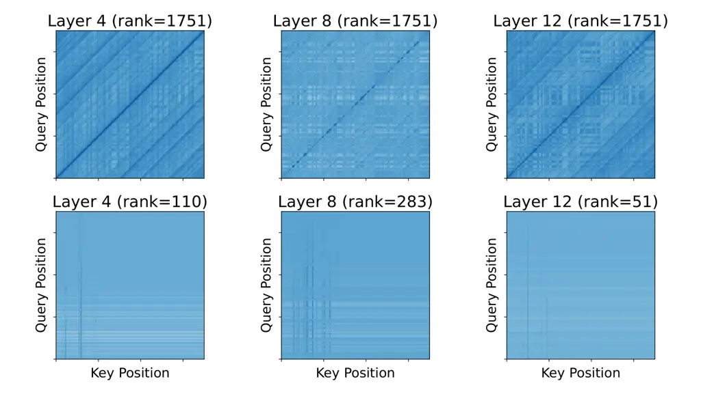
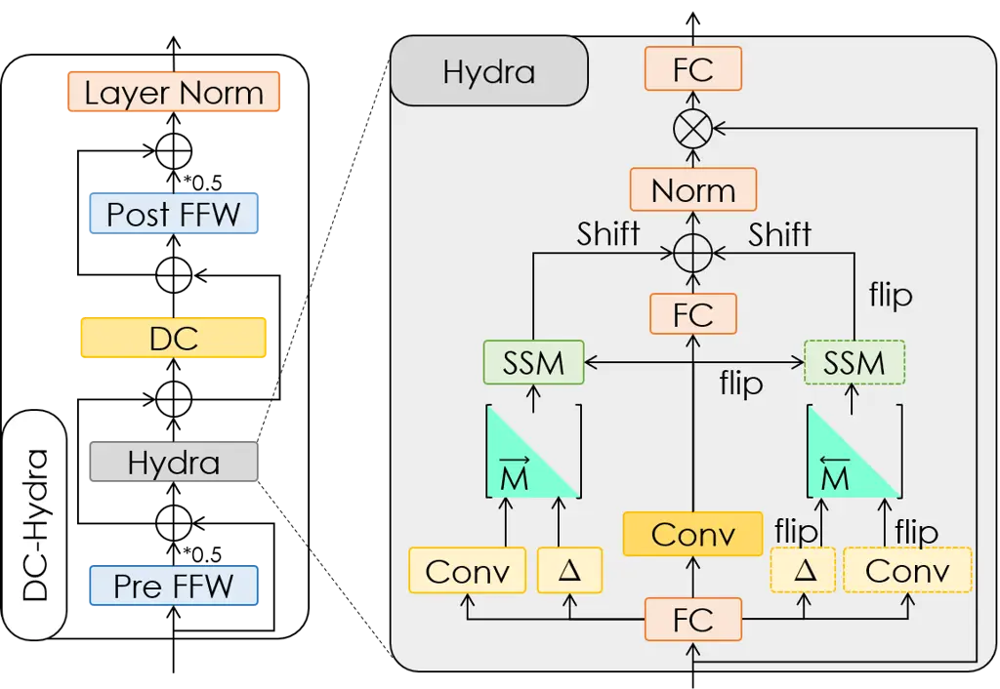

# Improving DF-Conformer using Hydra for high-fidelity generative speech enhancement on discrete codec token

Shogo Seki^(\*)     Shaoxiang Dang^(\*)     Li Li^(\*) ^(†)^(†)thanks:
^(\*)Equal contribution. Work contributed by Shaoxiang during
internship.

###### Abstract

The Dilated FAVOR Conformer (DF-Conformer) is an efficient variant of
the Conformer architecture designed for speech enhancement (SE). It
employs fast attention through positive orthogonal random features
(FAVOR+) to mitigate the quadratic complexity associated with
self-attention, while utilizing dilated convolution to expand the
receptive field. This combination results in impressive performance
across various SE models. In this paper, we propose replacing FAVOR+
with bidirectional selective structured state-space sequence models to
achieve two main objectives: (1) enhancing global sequential modeling by
eliminating the approximations inherent in FAVOR+, and (2) maintaining
linear complexity relative to the sequence length. Specifically, we
utilize Hydra, a bidirectional extension of Mamba, framed within the
structured matrix mixer framework. Experiments conducted using a
generative SE model on discrete codec tokens, known as Genhancer,
demonstrate that the proposed method surpasses the performance of the
DF-Conformer.

###### Index Terms: 

High-fidelity speech enhancement, Genhancer, state-space models (SSMs),
Mamba, Hydra

^(†)^(†)address: AI Lab, CyberAgent, Tokyo, Japan

## 1 Introduction

With the rapid advancements in deep learning, speech enhancement (SE)
has transcended its traditional boundaries, which primarily focused on
isolated tasks such as denoising and dereverberation. The modern broader
objective of SE is to generate a high-fidelity version of noisy input,
potentially recovering significant missing information. By harnessing
the powerful speech generation capabilities of neural vocoders and
neural codecs, SE methods \[1, 2, 3, 4, 5, 6\] can effectively produce
high-fidelity speech from the denoised features of degraded inputs.

Genhancer \[4\] exemplifies this evolution by employing discrete tokens
to achieve remarkable performance and offering significant flexibility
for integration with various modalities and techniques in speech
processing. It generates clean speech as Descript audio codec (DAC)
\[7\] tokens from denoised features, with waveforms reconstructed by a
DAC decoder. At the core of Genhancer’s feature cleaning and token
generation is the dilated FAVOR Conformer (DF-Conformer) \[8\], an
efficient variant of the Conformer \[9\]. The DF-Conformer employs a
macaron-like architecture that incorporates fast attention through
positive orthogonal random features (FAVOR+) \[10\], reducing the
quadratic complexity of self-attention to linear, alongside dilated
convolution (DC) \[11\] to expand the local receptive field. This
efficient combination of global and local modeling makes DF-Conformer
well-suited for scaling in large generative SE (GSE) models such as
Miipher \[1\] and Genhancer. However, advanced analyses of linear
attention mechanisms \[12\], including FAVOR+, have identified potential
performance degradation compared to softmax-based self-attention. This
is particularly evident in aspects such as focus ability, feature
diversity \[13\], injectivity, and local modeling capability \[14\],
primarily because these mechanisms achieve linear complexity by
approximating softmax attention. While FAVOR+ can mitigate approximation
errors by increasing the number of random features, this improvement
comes at the cost of computational efficiency.

On the other hand, structured state space sequence models (SSMs) \[15\],
particularly the selective SSMs known as Mamba \[16, 17\], have emerged
as a compelling alternative to self-attention, offering linear
complexity without the need for approximation. Recent studies have shown
that both SSMs and attention mechanisms can be conceptualized as matrix
mixer sequence models. Softmax attention employs a dense, full-rank
matrix mixer, while linear attentions approximate this using low-rank
matrices and carefully designed kernel functions \[17, 18\]. In
contrast, SSMs achieve linear complexity by utilizing a semiseparable
structured matrix mixer. Building on this concept, Hydra \[18\] extends
the semiseparable matrix to a quasiseparable form, enabling a natural
and superior bidirectional modeling of Mamba.

In this paper, we first experimentally demonstrate that FAVOR+ within
the Genhancer framework suffers from performance limitations due to some
of the aspects mentioned above. We then introduce DC-Hydra to mitigate
the limitation by replacing the approximation model, FAVOR+, with Hydra,
thereby enhancing Genhancer’s performance while maintaining linear
complexity.

## 2 Genhancer

### 2.1 System overview

Figure 1: Overview of Genhancer

Genhancer \[4\] (Fig. 1) utilizes DAC \[7\], a high-fidelity neural
codec comprising an encoder, $`K`$ quantizers, and a decoder, to
reconstruct clean speech. In DAC, continuous features are represented by
$`K`$ indices, each corresponding to a $`M`$-dimensional codeword from
the respective codebook, with each codebook containing $`I`$ codewords.
Given degraded speech $`\mathbf{x}\in\mathbb{R}^{L}`$, Genhancer
reconstructs clean speech $`\hat{\mathbf{y}}\in\mathbb{R}^{L}`$ by
estimating the corresponding clean DAC tokens
$`\mathbf{Z}\in\mathbb{Z}^{K\times T}`$, conditioned on the denoised
features $`\mathbf{C}\in\mathbb{R}^{D\times T}`$. Here, $`L`$, $`T`$,
and $`D`$ denote the sequence length in time domain, the sequence length
in feature domain, and the feature dimension, respectively. The
conditional feature $`\mathbf{C}`$ is primarily derived by denoising
feature embeddings extracted from the input using a latent denoiser
$`\mathcal{LD}(\cdot)`$, given as
$`\tilde{\mathbf{Z}}={\rm Quantizer}\big({\rm Enc}(\mathbf{x})\big),~\mathbf{C}_{\rm token}=\mathcal{LD}_{\theta_{L}}\big({\rm Emb}(\tilde{\mathbf{Z}})\big)`$.
Here, $`\tilde{\mathbf{Z}}\in\mathbb{Z}^{K\times T}`$ represents the
noisy DAC tokens, and $`\rm Emb(\cdot)`$ denotes the dequantization
operation used to retrieve the corresponding codeword from index.
Self-supervised learning (SSL) features can be combined with
$`\mathbf{C}_{\rm token}`$ to obtain richer feature representation as
$`\mathbf{C}=\mathcal{F}_{\theta_{F}}\big(\mathbf{C}_{\rm token},{\rm SSL}(\mathbf{x})\big)`$,
where $`\mathcal{F}(\cdot)`$ denotes a fusion layer, including
interpolation to align the two feature sequences and multiple linear
layers to project the features to $`D`$ dimensions. Clean tokens
$`\mathbf{Z}`$ are then estimated autoregressively in a parallel manner
using a token generator $`\mathcal{G}(\cdot)`$, which takes the
previously estimated feature embeddings and the condition $`\mathbf{C}`$
as inputs, expressed by
$`\mathbf{z}_{k+1}=\mathcal{G}_{\theta_{G}}\Big(\mathbf{z}_{k+1}\Big|\sum_{k^{\prime}=0}^{k}{\rm Emb}(\mathbf{z}_{k^{\prime}}),\mathbf{C}\Big)`$
for $`k=1,\ldots,K,`$ where $`{\rm Emb}(\mathbf{z}_{0})`$ is initialized
with zeros. The clean speech is finally reconstructed using a DAC
decoder as $`\hat{\mathbf{y}}={\rm Dec}(\mathbf{Z})`$. In summary,
$`\Theta=\{\theta_{L},\theta_{F},\theta_{G}\}`$ represents the trainable
parameters in Genhancer.

### 2.2 DF-Conformer

DF-Conformer \[8\] serves as the backbone for the latent denoiser
$`\mathcal{LD}(\cdot)`$ and the token generator $`\mathcal{G}(\cdot)`$.
It is a Conformer \[9\] variant designed to enhance efficiency by
replacing softmax-based self-attention \[19\] with FAVOR+ \[10\] and
standard convolution with dilated convolution (DC).

Softmax attention utilizes queries, keys, and values, represented as
$`\mathbf{Q},\mathbf{K},\mathbf{V}\in\mathbb{R}^{T\times d}`$,
respectively, to transform features using the formula
$`{\rm SA}(\mathbf{Q},\mathbf{K},\mathbf{V})={\rm Softmax}(\mathbf{Q}\mathbf{K}^{\textsf{T}})\mathbf{V}`$.
This operation has a complexity of $`O(T^{2}d)`$, primarily due to the
matrix multiplication involved in the softmax function. FAVOR+ offers an
efficient approximation of this transformation with
$`{\rm FA}(\mathbf{Q},\mathbf{K},\mathbf{V})=\mathbf{D}^{-1}\phi(\mathbf{Q})\big(\phi(\mathbf{K})^{\textsf{T}}\mathbf{V}\big)`$.
The approximation is achieved by employing random feature maps
$`\phi:\mathbb{R}^{d}\rightarrow\mathbb{R}^{r}_{+}`$, where
$`\mathbf{D}`$ is a normalization matrix. With an appropriate number of
features $`r`$, FAVOR+ can accurately approximate the original softmax
attention. By leveraging the approximation and reordering operations,
FAVOR+ reduces the complexity to $`O(Trd)`$, classifying it as a form of
linear attention, which is more scalable for longer sequences.

### 2.3 Analysis of FAVOR+



Figure 2: Examples of attention maps averaged over heads, along with
corresponding ranks in different layers, obtained using softmax
attention (1st row) and FAVOR+ (2nd row). Histogram of $`L2`$ norm
difference between attention vectors for different queries (3rd row).

Recent findings \[13, 14\] indicate that linear attentions, due to their
approximation of softmax attention, can sometimes result in a
performance gap. This gap is partly attributed to how linear attentions
handle certain key properties: (a) Focus ability: The capacity to
precisely highlight or concentrate on specific, relevant parts of the
input. (b) Feature diversity: The ability to combine a wide variety of
useful features from all values. (c) Injectivity: The capacity for the
attention function to be injective, ensuring distinct queries result in
distinct attention maps; otherwise semantic confusion occurs. (d) Local
modeling capability: The ability to pay more attention to the
neighborhoods of each query in shallow layers. It is important to note
that these properties are not isolated but interconnected. For instance,
if the attention function is non-injective, causing different queries to
produce identical attention patterns, it can directly result in reduced
feature diversity.

Our analysis of FAVOR+ in Genhancer reveals insufficient focus ability,
reduced feature diversity, and occurrences of semantic confusion. In the
first and second rows of Figure 2, we visualize the attention maps of
FAVOR+ and softmax attention to intuitively assess focus ability and
compute matrix ranks to quantify feature diversity. FAVOR+ generates
more blurred attention maps with low ranks, whereas softmax attention
produces sharp attention patterns (characterized by several deep
diagonal lines) with full ranks. In the third row, we present histograms
of the $`L2`$ norm differences between attention vectors (each row
vector in the attention map). It is observed that FAVOR+ generates
similar attention vectors for almost all queries, indicating significant
semantic confusion occurs among queries.

## 3 Proposed method: DC-Hydra

SSMs \[15\] achieve linear complexity by compressing information from
previous frames using hidden states and leveraging recurrence. Mamba
\[16\] introduces a selective mechanism that dynamically adjusts
sequence modeling parameters based on input, acting as a gating
mechanism and achieving performance comparable to Transformers \[19\].
Recently, Mamba-2 \[16\] and its bidirectional extension, Hydra \[18\],
have been developed by reformulating SSMs within a matrix mixer sequence
model framework. As a promising alternative for achieving linear
complexity in attentions, we propose replacing FAVOR+ with Hydra to
address previous limitations. Our module, called DC-Hydra, combines
dilated convolution (DC) with Hydra for both local and global modeling.

### 3.1 Matrix mixer sequence models

Let $`\boldsymbol{X}\in\mathbb{R}^{T\times d}`$ be an input sequence.
The term sequence transformation refers to a mapping where the output
sequence $`\boldsymbol{Y}\in\mathbb{R}^{T\times d}`$ can be represented
by
$`\boldsymbol{M}_{\theta}=f_{\mathcal{M}}(\boldsymbol{X},\theta),~\boldsymbol{Y}=\boldsymbol{M}_{\theta}\boldsymbol{X}`$.
Here, $`\boldsymbol{M}\in\mathbb{R}^{T\times T}`$ is a matrix mixer, and
$`f_{\mathcal{M}}`$ denotes a function to generate input-dependent
mixer. $`\mathcal{M}`$ represents the underlying class of mixer matrices
and $`\theta`$ are learnable parameters. In this content, softmax
attention can be interpreted as a dense matrix mixer applied to values
$`\mathbf{V}`$ as the input sequence, where
$`\boldsymbol{M}_{\theta}={\rm Softmax}(\mathbf{Q}\mathbf{K}^{\textsf{T}})`$.
FAVOR+ is interpreted as a low-rank matrix mixer with rank of $`r`$
applied to values $`\mathbf{V}`$ with
$`\boldsymbol{M}_{\theta}=\mathbf{D}^{-1}\phi(\mathbf{Q})\phi(\mathbf{K})^{\textsf{T}}`$.

Within the matrix mixer framework, both Mamba and Mamba-2 can be
expressed as inputs transformed by a semiseparable matrix mixer. Let us
recall the original recurrent formula of Mamba, where $`d`$-dimensional
features are transformed independently.

```math
\displaystyle\boldsymbol{h}_{t}=\boldsymbol{A}_{t}\boldsymbol{h}_{t-1}+\boldsymbol{b}_{t}x_{t},~y_{t}=\boldsymbol{c}_{t}^{\textsf{T}}\boldsymbol{h}_{t}, \tag{1}
```

where $`\boldsymbol{A}_{t}\in\mathbb{R}^{N\times N}`$,
$`\boldsymbol{b}_{t}\in\mathbb{R}^{N}`$ and
$`\boldsymbol{c}_{t}\in\mathbb{R}^{N}`$ are time-varying parameters
discretized using an input-dependent parameterized step size
$`\Delta_{t}`$, and $`N`$ denotes hidden state size. By expanding the
recurrent formula, we can readily derive a matrix multiplication form as

```math
\displaystyle y_{t}=\sum_{s=0}^{t}\boldsymbol{c}_{t}^{\textsf{T}}\boldsymbol{A}_{t:s}^{\times}\boldsymbol{b}_{s}x_{s},~~\boldsymbol{A}_{i:j}^{\times} \displaystyle=\begin{cases}\prod_{k=j+1}^{i}\boldsymbol{A}_{k},&\!i>j,\\[6.0pt]
1,&\!i=j,\\[6.0pt]
\prod_{k=i}^{j-1}\boldsymbol{A}_{k},&\!i<j.\end{cases} \tag{2}
```

The sequence transformation can be represented with a semiseparable
matrix mixer, the $`ij`$-th element of whose is
$`m_{ij}=\boldsymbol{c}^{\textsf{T}}_{i}\boldsymbol{A}_{i}\cdots\boldsymbol{A}_{j+1}\boldsymbol{b}_{j}`$.

### 3.2 Hydra and DC-Hydra backbone



Figure 3: Architecture of DC-Hydra.

To comprehensively explore sequence information, bidirectional variants
of Mamba (Bi-Mamba) have been extensively studied \[20, 21, 22, 23\]. A
straightforward method to achieving bidirectionality involves using two
separate Mamba models to handle forward and backward sequence modeling,
followed by fusing the knowledge from both models via operation such as
addition. Recently, Hydra \[18\] has been proposed as a mathematical
extension of bidirectional Mamba within the matrix mixer framework,
where the matrix mixer is defined as a quasiseparable matrix. The
elements in matrix mixers of addition-based Bi-Mamba and Hydra,
represented as $`\ddot{m}_{ij}`$ and $`\breve{m}_{ij}`$ respectively,
are given as

```math
\displaystyle\hskip-5.0pt\ddot{m}_{ij}=\begin{cases}\overrightarrow{\boldsymbol{c}_{i}^{\textsf{T}}}\overrightarrow{\boldsymbol{A}_{i:j}^{\times}}\overrightarrow{\boldsymbol{b}_{j}},&\!\!\!\!i>j,\\
\overrightarrow{\boldsymbol{c}_{i}^{\textsf{T}}}\overrightarrow{\boldsymbol{b}_{j}}+\overleftarrow{\boldsymbol{c}_{i}^{\textsf{T}}}\overleftarrow{\boldsymbol{b}_{j}},&\!\!\!\!i=j,\\
\overleftarrow{\boldsymbol{c}_{i}^{\textsf{T}}}\overleftarrow{\boldsymbol{A}_{i:j}^{\times}}\overleftarrow{\boldsymbol{b}_{j}},&\!\!\!\!i<j,\end{cases}~~\breve{m}_{ij}=\begin{cases}\overrightarrow{\boldsymbol{c}_{i-1}^{\textsf{T}}}\overrightarrow{\boldsymbol{A}_{i-1:j}^{\times}}\overrightarrow{\boldsymbol{b}_{j}},&\!\!\!i>j,\\
\delta_{i},&\!\!\!i=j,\\
\overleftarrow{\boldsymbol{c}_{i+1}^{\textsf{T}}}\overleftarrow{\boldsymbol{A}_{i+1:j}^{\times}}\overleftarrow{\boldsymbol{b}_{j}},&\!\!\!i<j.\end{cases}
```

The key difference is that, in addition-based Bi-Mamba, diagonal
elements are influenced by shared non-diagonal parameters, whereas Hydra
models them separately, providing stronger representation power.

Fig. 3 shows the architecture of the proposed DC-Hydra backbone and the
implementation details of Hydra. The Hydra and depthwise convolution
with dilation (DW Conv) modules are sandwiched between two feed-forward
(FFW) modules. Residual connections are applied to all modules, and
LayerNorm is applied to the output. The official Hydra implementation¹¹
1
[https://github.com/goombalab/hydra](https://github.com/goombalab/hydra)
using Mamba-2 as the SSM is utilized in the DC-Hydra.

## 4 Experiments

### 4.1 Dataset

Following \[4\], we used public speech, noise, and impulse response data
to train Genhancer models. We used speech samples from LibriTTS-R
\[24\], where each utterance was upsampled to 48 kHz with a distributed
bandwidth extension model \[25\]²² 2
[https://github.com/brentspell/hifi-gan-bwe](https://github.com/brentspell/hifi-gan-bwe)
and resampled at 44.1 kHz to meet the DAC in-out. We used noise data
from the TAU Urban Audio-Visual Scenes 2021 \[26\], DNS
Challenge \[27\], and SFS-Static \[28\] datasets, and impulse response
data from the MIT IR Survey \[29\], EchoThief \[30\], and
OpenSLR28 \[31\]. Degraded speech was generated in an on-the-fly fashion
by convolving an impulse response and superimposing one or two noise
samples with signal-to-noise ratios (SNRs) of \[-10, 20\] dB. We
randomly applied multiple equalizations across five frequency bands and
a bandwidth limitation. For evaluation, we used the DAPS dataset \[32\],
which contains studio-quality, minute-long audio clips from 10 male and
female speakers recorded in twelve real-world environments. Each speaker
read five scripts, resulting in 1200 test samples.

### 4.2 Experimental settings and evaluation metrics

We utilized a distributed 44.1 kHz DAC variant with nine quantizers,
each comprising 1024 codewords, which produces 8-dimensional tokens
($`K=9`$, $`M=8`$, $`I=1024`$) at a frame rate of 86 Hz. For the SSL
feature extractor $`\mathrm{SSL}(\cdot)`$, we used a pre-trained large
WavLM model³³ 3
[https://huggingface.co/microsoft/wavlm-large](https://huggingface.co/microsoft/wavlm-large).
The intermediate layer outputs of the WavLM model were combined using
learnable weights to generate SSL features. The latent denoiser
$`\mathcal{LD}(\cdot)`$ and the token generator $`\mathcal{G}(\cdot)`$
employed DF-Conformer blocks with 256 and 512-channels , consisting of 8
and 12 blocks, respectively. Additionally, the convolution kernels were
dilated by a scale factor of 2 every four blocks.

We investigated the following four module alternatives to attention in
DF-Conformer winthin Genhancer. FAVOR+: The baseline Genhancer model
with 98M parameters. Softmax: Similar to FAVOR+ with 98 million
parameters, but utilizing softmax attentions instead of FAVOR+
attentions. Bi-Mamba: A drop-in replacement using Mamba blocks with
forward and backward SSMs \[20\] (107 M parameters). Hydra: The proposed
Genhancer model, consisting of bidirectional SSM blocks, with 106
million parameters. For FAVOR+ and Softmax, rotary position
embeddings \[33\] were applied to keys and queries at each DF-Conformer
block. All models were trained for 400,000 steps using 8-second input
and minibatches of size 16 on four NVIDIA A100 GPUs, taking
approximately five days. We used the AdamW optimizer with a cosine
learning rate scheduler, including a warmup period. The learning rate
was initially increased linearly from $`1\mathrm{e}{-5}`$ to
$`1\mathrm{e}{-4}`$ over the first 1,000 steps, then decreased back to
$`1\mathrm{e}{-5}`$ following a cosine curve over 300,000 steps. During
inference, the input speech was enhanced by dividing it into 8-second
segments, identical to the training size, and merging these chunks. We
also examined the effects of sequence length differences between
training and inference.

We used a well-known GSE model Miipher \[1\] as a reference. An
open-source model⁴⁴ 4
[https://github.com/Wataru-Nakata/miipher.git](https://github.com/Wataru-Nakata/miipher.git)
with 105 M parameters was trained with the same datasets. We utilized
two non-intrusive SE metrics: DNSMOS \[34\] and UTMOS \[35\] to assess
enhanced speech quality, and speaker similarity (SpkSim) \[36\] to
evaluate speaker consistency. Additionally, we employed character
accuracy (CAcc) using an Open Whisper-style speech model (OWSM) \[37\]
to measure content accuracy.

### 4.3 Results

|               |                    |                   |                    |                        |
| ------------- | ------------------ | ----------------- | ------------------ | ---------------------- |
|               | DNSMOS$`\uparrow`$ | UTMOS$`\uparrow`$ | SpkSim$`\uparrow`$ | CAcc \[%\]$`\uparrow`$ |
| Clean         | 3.39               | 3.83              | N/A                | 91.35                  |
| Noisy         | 2.56               | 1.70              | 0.91               | 90.93                  |
| Miipher \[1\] | 3.33               | 2.77              | 0.73               | 87.82                  |
| Softmax       | 3.46               | 3.53              | 0.83               | 87.88                  |
| FAVOR+        | 3.44               | 3.33              | 0.79               | 88.24                  |
| Bi-Mamba      | 3.44               | 3.27              | 0.81               | 88.04                  |
| Hydra (ours)  | 3.44               | 3.48              | 0.83               | 88.95                  |

Table 1: Mean DNSMOS, UTMOS, and speaker similarity (SpkSim) scores and
character accuracy (CAcc), where bold fonts indicate the best
performance between models.

Figure 4: Character accuracy (CAccs) on different sequence lengths, with
the babble size indicating GPU memory usage in the token generator
$`\mathcal{G}`$.

Table 1 compares Genhancers with various DF-Conformer modules.
Genhancer-based models outperform Miipher, demonstrating superior
performance. The Softmax model, with its quadratic complexity, achieves
the highest scores in DNSMOS, UTMOS, and SpkSim, serving as the upper
bound. Among the remaining methods, Hydra outperforms both FAVOR+ and
Bi-Mamba and even surpasses Softmax in CAcc.

Fig. 4 compares models with varying input lengths. While the SSL feature
extractor primarily drives the computational cost of Genhancer, GPU
memory usage in the token generator $`\mathcal{G}`$ is also included for
comparison. Models handling 24-second inputs perform similarly to those
with 8-second inputs. However, for 96-second inputs, performance
degradation is evident, notably with a significant drop in the Softmax
model. Interestingly, compared to the Softmax model, the baseline FAVOR+
maintains performance well for longer inputs. This may be due to
FAVOR+’s difficulty in approximating softmax attention, as shown in
Fig. 2, contributing minimally to sequential modeling and thus
minimizing the impact of longer sequence lengths. The proposed
Hydra-based Genhancer excels among these models, showcasing Hydra’s
effectiveness in GSE.

## 5 Conclusions

In this paper, we analyzed FAVOR+, a crucial component of DF-Conformer
used in Genhancer. Our analysis revealed that FAVOR+ suffers from low
focus ability, reduced feature diversity, and semantic confusion,
similar to other linear attention mechanisms, leading to performance
limitations. To address this, we proposed DC-Hydra, which replaces
FAVOR+ with a mathematically extended bidirectional Mamba, enhancing the
SE performance of Genhancer while maintaining linear complexity in
sequence modeling. Experimental results confirmed the effectiveness of
DC-Hydra.

## References

- \[1\] Yuma Koizumi, Heiga Zen, Shigeki Karita, Yifan Ding, Kohei
  Yatabe, Nobuyuki Morioka, Yu Zhang, Wei Han, Ankur Bapna, and Michiel
  Bacchiani, “Miipher: A robust speech restoration model integrating
  self-supervised speech and text representations,” in Proc. WASPAA.
  IEEE, 2023, pp. 1–5.
- \[2\] Shigeki Karita, Yuma Koizumi, Heiga Zen, Haruko Ishikawa, Robin
  Scheibler, and Michiel Bacchiani, “Miipher-2: A universal speech
  restoration model for million-hour scale data restoration,” arXiv
  preprint arXiv:2505.04457, 2025.
- \[3\] Wataru Nakata, Yuma Koizumi, Shigeki Karita, Robin Scheibler,
  Haruko Ishikawa, Adriana Guevara-Rukoz, Heiga Zen, and Michiel
  Bacchiani, “Reverbmiipher: Generative speech restoration meets
  reverberation characteristics controllability,” arXiv preprint
  arXiv:2505.05077, 2025.
- \[4\] Haici Yang, Jiaqi Su, Minje Kim, and Zeyu Jin, “Genhancer:
  High-fidelity speech enhancement via generative Mmdeling on discrete
  codec tokens,” in Proc. Interspeech, 2024, pp. 1170–1174.
- \[5\] Heitor R Guimarães, Jiaqi Su, Rithesh Kumar, Tiago H Falk, and
  Zeyu Jin, “Ditse: High-fidelity generative speech enhancement via
  latent diffusion transformers,” arXiv preprint arXiv:2504.09381, 2025.
- \[6\] Ziqian Wang, Xinfa Zhu, Zihan Zhang, YuanJun Lv, Ning Jiang,
  Guoqing Zhao, and Lei Xie, “SELM: Speech enhancement using discrete
  tokens and language models,” in Proc. ICASSP. IEEE, 2024, pp.
  11561–11565.
- \[7\] Rithesh Kumar, Prem Seetharaman, Alejandro Luebs, Ishaan Kumar,
  and Kundan Kumar, “High-fidelity audio compression with improved
  rvqgan,” Adv. NeurIPS, vol. 36, pp. 27980–27993, 2023.
- \[8\] Yuma Koizumi, Shigeki Karita, Scott Wisdom, Hakan Erdogan,
  John R Hershey, Llion Jones, and Michiel Bacchiani, “Df-conformer:
  Integrated architecture of conv-tasnet and conformer using linear
  complexity self-attention for speech enhancement,” in Proc. WASPAA.
  IEEE, 2021, pp. 161–165.
- \[9\] Anmol Gulati, James Qin, Chung-Cheng Chiu, Niki Parmar,
  Yu Zhang, Jiahui Yu, Wei Han, Shibo Wang, Zhengdong Zhang, Yonghui Wu,
  et al., “Conformer: Convolution-augmented transformer for speech
  recognition,” in Proc. Interspeech, 2020, pp. 5036–5040.
- \[10\] Krzysztof Marcin Choromanski, Valerii Likhosherstov, David
  Dohan, Xingyou Song, Andreea Gane, Tamas Sarlos, Peter Hawkins,
  Jared Quincy Davis, Afroz Mohiuddin, Lukasz Kaiser, et al.,
  “Rethinking attention with performers,” in Proc. ICLR, 2021.
- \[11\] Liang-Chieh Chen, Yukun Zhu, George Papandreou, Florian
  Schroff, and Hartwig Adam, “Encoder-decoder with atrous separable
  convolution for semantic image segmentation,” in Proc. ECCV, 2018, pp.
  801–818.
- \[12\] Angelos Katharopoulos, Apoorv Vyas, Nikolaos Pappas, and
  François Fleuret, “Transformers are rnns: Fast autoregressive
  transformers with linear attention,” in Proc. ICML. PMLR, 2020, pp.
  5156–5165.
- \[13\] Dongchen Han, Xuran Pan, Yizeng Han, Shiji Song, and Gao Huang,
  “Flatten transformer: Vision transformer using focused linear
  attention,” in Proc. ICCV, 2023, pp. 5961–5971.
- \[14\] Dongchen Han, Yifan Pu, Zhuofan Xia, Yizeng Han, Xuran Pan, Xiu
  Li, Jiwen Lu, Shiji Song, and Gao Huang, “Bridging the divide:
  Reconsidering softmax and linear attention,” Adv. NeurIPS, vol. 37,
  pp. 79221–79245, 2024.
- \[15\] Albert Gu, Karan Goel, and Christopher Re, “Efficiently
  modeling long sequences with structured state spaces,” in Proc.
  ICLR, 2022.
- \[16\] Albert Gu and Tri Dao, “Mamba: Linear-time sequence modeling
  with selective state spaces,” in Proc. COLM, 2024.
- \[17\] Tri Dao and Albert Gu, “Transformers are ssms: Generalized
  models and efficient algorithms through structured state space
  duality,” in Proc. ICML. 2024, JMLR.org.
- \[18\] Sukjun Hwang, Aakash Lahoti, Ratish Puduppully, Tri Dao, and
  Albert Gu, “Hydra: Bidirectional state space models through
  generalized matrix mixers,” Adv. NeurIPS, vol. 37, pp.
  110876–110908, 2024.
- \[19\] Ashish Vaswani, Noam Shazeer, Niki Parmar, Jakob Uszkoreit,
  Llion Jones, Aidan N Gomez, Lukasz Kaiser, and Illia Polosukhin,
  “Attention is all you need,” Adv. NeurIPS, vol. 30, 2017.
- \[20\] Lianghui Zhu, Bencheng Liao, Qian Zhang, Xinlong Wang, Wenyu
  Liu, and Xinggang Wang, “Vision mamba: Efficient visual representation
  learning with bidirectional state space model,” in Proc. ICML, 2024,
  pp. 62429–62442.
- \[21\] Yair Schiff, Chia-Hsiang Kao, Aaron Gokaslan, Tri Dao, Albert
  Gu, and Volodymyr Kuleshov, “Caduceus: Bi-directional equivariant
  long-range dna sequence modeling,” Proc. PMLR, vol. 235, pp.
  43632, 2024.
- \[22\] Xiangyu Zhang, Qiquan Zhang, Hexin Liu, Tianyi Xiao, Xinyuan
  Qian, Beena Ahmed, Eliathamby Ambikairajah, Haizhou Li, and Julien
  Epps, “Mamba in speech: Towards an alternative to self-attention,”
  IEEE Trans. on Audio, Speech and Language Processing, 2025.
- \[23\] Koichi Miyazaki, Yoshiki Masuyama, and Masato Murata,
  “Exploring the capability of mamba in speech applications,” in Proc.
  Interspeech, 2024, pp. 237–241.
- \[24\] Yuma Koizumi, Heiga Zen, Shigeki Karita, Yifan Ding, Kohei
  Yatabe, Nobuyuki Morioka, Michiel Bacchiani, Yu Zhang, Wei Han, and
  Ankur Bapna, “Libritts-r: A restored multi-speaker text-to-speech
  corpus,” in Proc. Interspeech, 2023, pp. 5496–5500.
- \[25\] Jiaqi Su, Yunyun Wang, Adam Finkelstein, and Zeyu Jin,
  “Bandwidth extension is all you need,” in Proc. ICASSP. IEEE, 2021,
  pp. 696–700.
- \[26\] Shanshan Wang, Annamaria Mesaros, Toni Heittola, and Tuomas
  Virtanen, “A curated dataset of urban scenes for audio-visual scene
  analysis,” in Proc. ICASSP. IEEE, 2021, pp. 626–630.
- \[27\] Harishchandra Dubey, Ashkan Aazami, Vishak Gopal, Babak Naderi,
  Sebastian Braun, Ross Cutler, Alex Ju, Mehdi Zohourian, Min Tang,
  Mehrsa Golestaneh, et al., “Icassp 2023 deep noise suppression
  challenge,” IEEE Open Journal of Signal Processing, vol. 5, pp.
  725–737, 2024.
- \[28\] Ziyang Chen, Xixi Hu, and Andrew Owens, “Structure from
  silence: Learning scene structure from ambient sound,” in Proc. CoRL.
  PMLR, 2022, pp. 760–772.
- \[29\] James Traer and Josh H McDermott, “Statistics of natural
  reverberation enable perceptual separation of sound and space,” Proc.
  PNAS, vol. 113, no. 48, pp. E7856–E7865, 2016.
- \[30\] “ECHOTHIEF Dataset,”
  [http://www.echothief.com/echothief/](http://www.echothief.com/echothief/),
  \[Online; accessed 18-Sep-2025\].
- \[31\] Tom Ko, Vijayaditya Peddinti, Daniel Povey, Michael L Seltzer,
  and Sanjeev Khudanpur, “A study on data augmentation of reverberant
  speech for robust speech recognition,” in Proc. ICASSP. IEEE, 2017,
  pp. 5220–5224.
- \[32\] Gautham J Mysore, “Can we automatically transform speech
  recorded on common consumer devices in real-world environments into
  professional production quality speech?—a dataset, insights, and
  challenges,” IEEE Signal Processing Letters, vol. 22, no. 8, pp.
  1006–1010, 2014.
- \[33\] Jianlin Su, Murtadha Ahmed, Yu Lu, Shengfeng Pan, Wen Bo, and
  Yunfeng Liu, “Roformer: Enhanced transformer with rotary position
  embedding,” Neurocomputing, vol. 568, pp. 127063, 2024.
- \[34\] Chandan KA Reddy, Vishak Gopal, and Ross Cutler, “Dnsmos: A
  non-intrusive perceptual objective speech quality metric to evaluate
  noise suppressors,” in Proc. ICASSP. IEEE, 2021, pp. 6493–6497.
- \[35\] Takaaki Saeki, Detai Xin, Wataru Nakata, Tomoki Koriyama,
  Shinnosuke Takamichi, and Hiroshi Saruwatari, “Utmos: Utokyo-sarulab
  system for voicemos challenge 2022,” in Proc. Interspeech, 2022, vol.
  2022, pp. 4521–4525.
- \[36\] Jee weon Jung, Wangyou Zhang, Jiatong Shi, Zakaria Aldeneh,
  Takuya Higuchi, Alex Gichamba, Barry-John Theobald, Ahmed Hussen
  Abdelaziz, and Shinji Watanabe, “ESPnet-SPK: full pipeline speaker
  embedding toolkit with reproducible recipes, self-supervised
  front-ends, and off-the-shelf models,” in Proc. Interspeech, 2024, pp.
  4278–4282.
- \[37\] Yifan Peng, Jinchuan Tian, William Chen, Siddhant Arora, Brian
  Yan, Yui Sudo, Muhammad Shakeel, Kwanghee Choi, Jiatong Shi, Xuankai
  Chang, et al., “Owsm v3. 1: Better and faster open whisper-style
  speech models based on e-branchformer,” in Proc. Interspeech, 2024,
  pp. 352–356.
