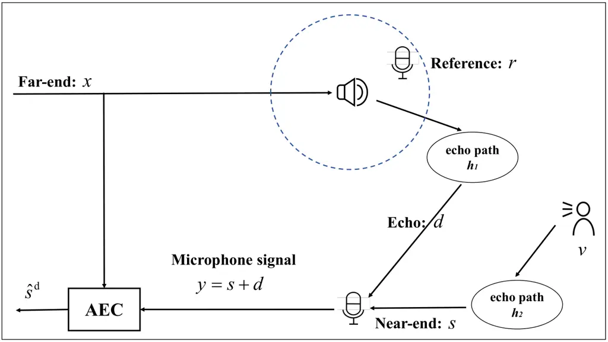
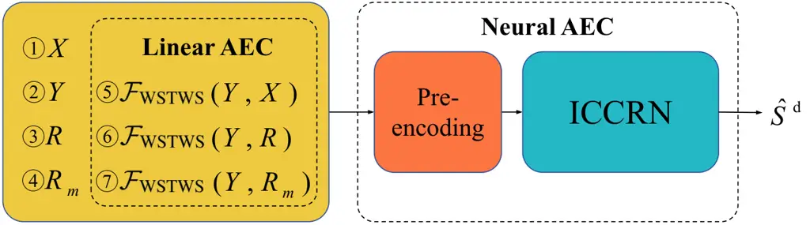

# Why Not Put a Microphone Near the Loudspeaker? A New Paradigm for Acoustic Echo Cancellation

Fei Zhao    Zhong-Qiu Wang ^(†)^(†)thanks: This work was done while Fei
Zhao was a visiting student at SUSTech. Corresponding author: Zhong-Qiu
Wang.

###### Abstract

Acoustic echo cancellation (AEC) remains challenging in real-world
environments due to nonlinear distortions caused by low-cost
loudspeakers and complex room acoustics. To mitigate these issues, we
introduce a dual-microphone configuration, where an auxiliary reference
microphone is placed near the loudspeaker to capture the nonlinearly
distorted far-end signal. Although this reference signal is contaminated
by near-end speech, we propose a preprocessing module based on Wiener
filtering to estimate a compressed time-frequency mask to suppress
near-end components. This purified reference signal enables a more
effective linear AEC stage, whose residual error signal is then fed to a
deep neural network for joint residual echo and noise suppression.
Evaluation results show that our method outperforms baseline approaches
on matched test sets. To evaluate its robustness under strong
nonlinearities, we further test it on a mismatched dataset and observe
that it achieves substantial performance gains. These results
demonstrate its effectiveness in practical scenarios where the nonlinear
distortions are typically unknown.

###### Index Terms: 

acoustic echo cancellation, auxiliary reference microphone, short-time
Wiener filtering

^(†)^(†)address: ¹Inner Mongolia University, China  
²Southern University of Science and Technology, China  
zhaofei@mail.imu.edu.cn, wang.zhongqiu41@gmail.com

## 1 Introduction

Acoustic echo cancellation (AEC) is a critical signal processing task
that aims to remove undesired echo signals caused by acoustic coupling
between loudspeakers and microphones in voice communication systems \[1,
2\]. Traditional AEC methods primarily rely on adaptive filtering \[3,
4, 5\], such as NLMS and PBFDAF, which achieve robust performance across
varying acoustic conditions through online adaptation. However, these
linear models are inherently limited in handling nonlinear distortions
\[6, 7\], especially when low-cost audio hardware introduces harmonic
artifacts or clipping. This limitation leads to persistent residual
echo, degrading user experience in real-world deployments.

To address these limitations, deep learning-based AEC methods have
emerged and can be broadly categorized into three paradigms: 1)
End-to-End Deep Neural Networks (DNN): These models learn a direct
mapping from microphone signals to echo-canceled outputs using strong
deep architectures \[8, 9, 10, 11\]. While achieving state-of-the-art
performance on in-distribution data, they exhibit limited
generalizability to unseen acoustic environments and nonlinear
distortions \[12, 13, 14\]. 2) Cascaded Traditional-Neural Systems: This
hybrid approach first applies conventional adaptive filtering for coarse
echo suppression, followed by DNNs for residual echo removal \[15, 16,
17, 18\]. Although it reduces training complexity and improves overall
performance, the DNN’s generalizability remains a bottleneck. 3)
Neural-Adaptive Hybrid Methods, where DNNs are trained to predict the
parameters for adaptive filters \[19, 20, 21\] (e.g., step sizes,
regularization weights). Such methods inherit the generalization
benefits of traditional AEC but often underperform purely data-driven or
cascaded systems in terms of absolute echo suppression \[20\].



Figure 1: Illustration of AEC aided by using an auxiliary reference
microphone.

Nonlinear distortions in AEC systems typically originate from
loudspeaker and amplifier characteristics, such as hard clipping,
sigmoid-like amplitude responses, and amplifier saturation. These
phenomena introduce harmonic and inter-modulation distortion.
Additionally, excessive mechanical vibrations from high-intensity
signals can induce further nonlinearities due to structural resonance or
driver instability \[22\].

To address the prominent non-linearity challenge in AEC, we propose a
microphone-augmented solution. As shown in Fig. 1, an auxiliary
reference microphone is placed near the loudspeaker in a conventional
AEC system to capture nonlinearly distorted far-end reference signal.
Prior work has explored multi-microphone AEC \[10\], but typically uses
distant compact microphone arrays for spatial filtering. In contrast,
the recorded reference signal contains the non-linearly distorted
far-end signal, and could mitigate the difficulties in AEC caused by
unknown non-linear distortions. However, the reference signal also
contains non-negligible near-end signals, which would interfere with
nonlinearity-focused processing. To suppress the near-end signals, we
employ a two-stage preprocessing pipeline: a short-time Wiener filter is
first applied between the far-end and reference signals to estimate the
far-end components, followed by computing an ideal ratio mask (IRM) to
suppress the near-end components. This yields a purified reference
signal. Subsequently, the far-end signal, original reference signal, and
purified reference signal are jointly processed with the main microphone
signal using Wiener filtering for preliminary echo suppression. Finally,
all signals are fed into the AEC model to predict the near-end direct
signal. Our evaluation results show that this method not only achieves
significant performance gains over baseline systems but also exhibits
superior robustness, particularly under strong, unseen nonlinear
distortions such as clipping and amplifier saturation, confirming its
effectiveness in practical scenarios.

## 2 Problem Formulation

Fig. 1 shows our proposed single-channel AEC system, which features an
auxiliary reference microphone positioned in proximity to the
loudspeaker. This strategic placement allows it to effectively capture
the loudspeaker’s nonlinear output. Assuming weak ambient noise, the
mixture signal captured by the main microphone, $`y`$, is modeled as a
mixture of the acoustic echo signal $`d`$ and near-end speech signal
$`s`$. The physical model in the time domain can be expressed as

```math
\displaystyle y \displaystyle=v*h_{1}+x_{\text{nl}}*h_{2} \tag{1}
```

```math
\displaystyle=s+d \tag{2}
```

```math
\displaystyle=s^{\text{d}}+s^{\text{r}}+d\in{\mathbb{R}}^{N}, \tag{3}
```

where $`*`$ denotes linear convolution and $`N`$ signal length in
samples. The near-end signal $`s`$ arises from convolving the anechoic
near-end source $`v`$ with its propagation room impulse response (RIR)
$`h_{1}`$, and decomposes into two physically interpretable components:
the direct-path component $`s^{\text{d}}`$ (unreflected sound from the
near-end source to the main microphone) and late reverberant component
$`s^{\text{r}}`$ (multiple late reflections of $`v`$ within the room).
The acoustic echo $`d`$, meanwhile, is generated by convolving the
loudspeaker’s nonlinear output $`x_{\text{nl}}`$ (a distorted version of
the far-end signal $`x`$) with the echo-path RIR $`h_{2}`$.

The mixture signal captured by the auxiliary reference microphone,
$`r`$, is a composite of the far-end signal component, $`r^{\text{f}}`$,
and the contaminating near-end signal, $`r^{\text{n}}`$, formulated as:

```math
\displaystyle r \displaystyle=v*h_{3}+x_{\text{nl}}*h_{4} \tag{4}
```

```math
\displaystyle=r^{\text{n}}+r^{\text{f}}, \tag{5}
```

where $`h_{3}`$ and $`h_{4}`$ respectively denote the RIRs from the
loudspeaker and near-end talker to the reference microphone. Crucially,
due to this microphone’s proximity to the loudspeaker, the far-end
component exhibits much larger energy than the near-end component. This
large energy disparity is the key physical property we exploit to
isolate the nonlinear far-end signal for more effective AEC.

## 3 Proposed method

Our proposed system, shown in Fig. 2, operates in the short-time Fourier
transform (STFT) domain. It comprises two stages: a linear AEC stage,
which suppresses the near-end component in the reference signal and
performs signal processing-based linear AEC, and a neural AEC stage
suppresses residual echoes.

### 3.1 Linear AEC Stage

#### 3.1.1 Weighted short-time Wiener solution

For the linear AEC component, we adopt the weighted short-time Wiener
solution (WSTWS) \[23\], an enhancement over the conventional short-time
Wiener solution (STWS) \[24\] by adaptively re-weighting the
contribution of individual time-frequency (T-F) units \[23\]. The linear
AEC result is obtained as

```math
\mathcal{F}_{\text{WSTWS}}(Y,X)=Y(t,f)-\hat{\mathbf{h}}_{1}(t,f)^{\mathrm{H}}\mathbf{X}(t,f), \tag{6}
```

which represents the result of canceling the estimated echo signal from
the near-end mixture signal $`Y`$ based on the far-end signal $`X`$. In
Eq. (6), $`\hat{\mathbf{h}}_{1}(t,f)\in{\mathbb{C}}^{K}`$ denotes a
$`K`$-tap linear filter modeling the echo path, and
$`\mathbf{X}(t,f)=[X(t,f),X(t-1,f),...,X(t-K+1,f)]^{\mathsf{T}}\in{\mathbb{C}}^{K}`$.
In frame-online, real-time AEC, at the current frame $`t`$, WSTWS
estimates the filter by solving the following problem:

```math
\hat{\mathbf{h}}_{1}(t,f)=\underset{\mathbf{h_{1}}(f)}{\operatorname{argmin}}\sum_{t^{\prime}=t-W}^{t}\frac{\left|{Y}(t^{\prime},f)-\mathbf{h}_{1}(f)^{{\mathsf{H}}}\mathbf{X}(t^{\prime},f)\right|^{2}}{{\lambda}(t,f)}, \tag{7}
```

which is computed based on the current and the past $`W`$ frames. The
weighting term $`\lambda`$ is computed as

```math
\lambda(t,f)=\varepsilon\times\max_{t^{\prime}\in[t-W,t]}\left(|Y(t^{\prime},f)|^{2}\right)+|Y(t,f)|^{2}, \tag{8}
```

where $`\varepsilon`$ is a floor value to avoid placing too much weight
on low-energy T-F units.

#### 3.1.2 Reference signal preprocessing

Although the reference signal contains strong energy of the far-end
signal, it still contains a significant amount of near-end signals. To
minimize the interference of the near-end components in the reference
signal, we first leverage WSTWS to estimate the near-end components and
then employ a method similar to real-valued T-F masking \[25\] to
suppress the near-end components. In detail,

```math
\hat{M}=\frac{|R-\mathcal{F}_{\text{WSTWS}}(R,X)|}{|R-\mathcal{F}_{\text{WSTWS}}(R,X)|+|\mathcal{F}_{\text{WSTWS}}(R,X)|}, \tag{9}
```

```math
R_{m}=\hat{M}^{m}\odot R, \tag{10}
```

where $`\mathcal{F}_{\text{WSTWS}}(R,X)`$ is the WSTWS result calculated
based on the reference signal and the far-end signal, $`m\in[0,1]`$ is a
tunable mask compression factor, and $`\odot`$ denotes point-wise
multiplication. Because the far-end component in the reference signal
has dominant energy, Eq. (9) preserves this dominant far-end component.
With $`R_{m}`$, we can compute an additional linear AEC result, denoted
as $`\mathcal{F}_{\text{WSTWS}}(Y,R_{m})`$, besides using the reference
signal $`R`$ to directly compute a linear AEC result (i.e.,
$`\mathcal{F}_{\text{WSTWS}}(Y,R)`$).

### 3.2 Neural AEC Stage



Figure 2: Architecture of proposed AEC system.

Fig. 2 illustrates the overall architecture of the proposed AEC model.
The network takes $`7`$ input signals:

far-end signal $`X`$,

near-end mixture signal $`Y`$, and

reference signal $`R`$ and

its masked version $`R_{m}`$. Additionally, we include the outputs of
WSTWS applied to three signal pairs:

$`\mathcal{F}_{\text{WSTWS}}(Y,X)`$,

$`\mathcal{F}_{\text{WSTWS}}(Y,R)`$, and

$`\mathcal{F}_{\text{WSTWS}}(Y,R_{m})`$, which respectively represent
the linear AEC results between the far-end signal, the reference signal,
the masked reference signal, and the near-end mixture signal. This
multi-input design enables the model to leverage complementary echo
estimates to improve AEC performance.

To harmonize the heterogeneous input representations and align their
temporal dynamics, we apply a dedicated pre-encoding block to the real
and imaginary components of each of the seven input signals. Each
pre-encoding block consists of a causal 2D convolutional layer with a
$`3\times 3`$ kernel, $`2`$ input channels and $`2`$ output channels,
followed by layer normalization \[26\] and PReLU \[27\]. The processed
features are then concatenated along the channel dimension, resulting in
a $`14`$-channel input tensor to the AEC model. The AEC model employs
the ICCRN architecture \[28\]. It is trained to output an estimate of
the near-end speech signal, denoted as $`\hat{S^{d}}`$.

### 3.3 Loss Functions

The loss function combines the two loss functions:

```math
\mathcal{L}_{\text{total}}=\mathcal{L}_{\text{RI+Mag}}+\alpha\times\mathcal{L}_{\text{S-SISNR}}, \tag{11}
```

where $`\alpha`$ is tuned to $`0.01`$. The first loss term,
$`\mathcal{L}_{\text{RI+Mag}}`$, penalizes the complex spectrum as
follows:

```math
\mathcal{L}_{\text{RI+Mag}}=\mathcal{L}_{\mathrm{RI}}+\mathcal{L}_{\text{Mag}}, \tag{12}
```

```math
\mathcal{L}_{\mathrm{RI}}=\sum_{t,f}\Big||S^{\text{d}}(t,f)|^{p}e^{j\angle{S^{\text{d}}(t,f)}}-|\hat{S}^{\text{d}}(t,f)|^{p}e^{j\angle{\hat{S}^{\text{d}}(t,f)}}\Big|^{2}, \tag{13}
```

```math
\mathcal{L}_{\mathrm{Mag}}=\sum_{t,f}\Big||S^{\text{d}}(t,f)|^{p}-|\hat{S}^{\text{d}}(t,f)|^{p}\Big|^{2}, \tag{14}
```

where $`p`$ (tuned to $`0.5`$) is a spectral compression factor
following \[29\]. The second loss term,
$`\mathcal{L}_{\text{S-SISNR}}`$, denotes the stretched scale-invariant
signal-to-noise ratio (S-SISNR) loss \[30\], which is a variant of SISNR
\[31\]. It is a time domain loss function obtained by doubling the
period of SISNR:

```math
\mathcal{L}_{\text{S-SISNR }}=10\log_{10}cot^{2}(\frac{\beta}{2})=10\log_{10}\frac{1+cos(\beta)}{1-cos(\beta)}, \tag{15}
```

where $`cos(\beta)`$ denotes the cosine similarity between the target
speech signal $`s^{d}`$ and predicted speech signal $`\hat{s}^{d}`$.

## 4 Experimental Setup

### 4.1 Datasets

The near-end and far-end signals employed in our experiments are sourced
from the synthetic datasets of the ICASSP $`2023`$ AEC challenge \[16\]
to simulate the near-end and far-end scenarios. The RIRs are generated
by using the image method \[32\]. We simulate different rooms of
dimensions $`l\times w\times h`$, with $`l`$ randomly-sampled from $`4`$
to $`8`$ meters, $`w`$ from $`3`$ to $`7`$ meters, and $`h`$ from $`3`$
to $`5`$ meters. The positions of the sound sources (including the
loudspeaker and the near-end talker) are randomly set within the room.
The auxiliary reference microphones are randomly set within a hollow
sphere with a radius of $`0.05`$ to $`0.2`$ meters, centered at the
loudspeaker position. The main microphones are randomly placed in the
cavity with a length range of $`[l/10,l-1/10]`$, a width range of
$`[w/10,w-w/10]`$, and a height range of $`[1,min(h-1,3)]`$. The
reverberation time (T$`60`$) is randomly sampled from $`0.1`$ to $`0.8`$
seconds to cover a wide range of acoustic conditions. In total,
$`22,000`$ RIRs are generated based on the aforementioned configuration,
and $`20,000`$ of them are allocated for training, $`1,000`$ for
validation, and $`1,000`$ for testing. The generated echo signal is
mixed with near-end speech $`s`$ at a signal-to-echo ratio (SER)
randomly sampled from the range $`[-10,10]`$ dB with a step of $`1`$ dB.
We generate a dataset consisting of $`100,000`$ training, $`5,000`$
validation, and $`1,000`$ test mixtures. All samples are $`6`$-second
long. The sampling rate is $`16`$ kHz.

### 4.2 Nonlinearity Scenarios

This study considers five types of nonlinear settings. The first three
\[33\] are used for training. For testing, we construct two test
conditions: a matched condition, which employs the first three nonlinear
settings, and a mismatched condition, which employs the last two, to
verify the effectiveness of introducing auxiliary reference microphones.

```math
\displaystyle x_{nl}(n) \displaystyle=\frac{ax(n)}{\sqrt{a^{2}+x^{2}(n)}},\text{with}\,a=\frac{5}{b}, \tag{16}
```

```math
\displaystyle x_{nl}(n) \displaystyle=1-e^{-ax(n)},\text{with}\,a=\frac{b}{10}, \tag{17}
```

```math
\displaystyle x_{nl}(n) \displaystyle=2ax(n)+ax^{2}(n)+x^{3}(n),\text{with}\,a=\log\big(\frac{b}{10}\big)+0.1, \tag{18}
```

where $`b\in[2,5]`$. The other two nonlinearities are respectively the
combinations of hard-clipping \[34\] and soft-clipping \[35\] with
sigmoid nonlinearity:

```math
\displaystyle x_{\text{hard}}(n) \displaystyle=\begin{cases}-x_{\text{max}},&x(n)<-x_{\text{max}}\\
x(n),&|x(n)|\leq x_{\text{max}}\\
x_{\text{max}},&x(n)>x_{\text{max}}\end{cases} \tag{19}
```

```math
\displaystyle x_{\text{soft}}(n) \displaystyle=\frac{x(n)x_{\text{max}}}{\sqrt{|x_{\text{max}}|^{\rho}+|x(n)|^{\rho}}}, \tag{20}
```

where the clipping threshold $`x_{\text{max}}`$ is set to $`0.7`$ in
this work. For soft-clipping saturation distortion, $`\rho`$ is set to
$`2`$, denoting the non-adaptive shape parameter.

```math
x_{\text{sigmoid}}(n)=\lambda\left(\frac{1}{1+e^{-\nu\cdot z(n)}}-\frac{1}{2}\right), \tag{21}
```

where $`z(n)=1.5\times x(n)-0.3\times x^{2}(n)`$, the parameter
$`\lambda`$ denotes the sigmoid gain and is set to 2, and $`\nu`$
represents the sigmoid slope and is defined as

```math
\displaystyle\nu=\begin{cases}4,&\text{if }z(k)>0\\
0.5,&\text{if }z(k)\leq 0\end{cases} \tag{22}
```

For the unmatched test set, the same sound source signals as in the
matched test set are used, but with an invisible non-linear setting.

### 4.3 Training Details

For STFT, the window size is $`20`$ ms, hop size $`10`$ ms, and the
Hamming window is used as the analysis window. The model is trained
using the Adam optimizer, starting with an initial learning rate of
$`0.001`$, which is halved if the validation loss does not improve for
$`2`$ epochs. Early stopping is applied if no improvement is observed
for $`8`$ epochs. The number of filter taps in WSTWS is tuned to
$`K=20`$ in default, while in Eq. (9), considering that the loudspeaker
and the reference microphone are spatially close to each other, the
number of filter taps for WSTWS is tuned to $`1`$. in Eq. (8), the
flooring term $`\varepsilon`$ is tuned to $`0.001`$. In Eq. (7), the
window size $`W`$ is tuned to $`200`$ frames. In Eq. (10), the mask
compression factor $`m`$ is tuned $`1/6`$.

### 4.4 Evaluation Setup

We consider three evaluation scenarios, including double talk (DT),
near-end single talk (ST*NE), and far-end single talk (ST_FE). Three
popular evaluation metrics are used, including echo return loss
enhancement (ERLE) \[36\] for measuring echo suppression during far-end
single talk, perceptual evaluation of speech quality (PESQ) \[37\] for
assessing near-end speech quality, and signal-to-distortion ratio (SDR)
\[38\] for quantifying near-end speech fidelity during double talk. The
evaluated models consist of linear AEC methods, ICCRN, and ICCRN*(∗).
Specifically, the linear AEC methods include
$`\mathcal{F}_{\text{WSTWS}}(Y,X)`$,
$`\mathcal{F}_{\text{STWS}}(Y,R_{m})`$, and
$`\mathcal{F}_{\text{WSTWS}}(Y,R_{m})`$, while ICCRN\_(∗) denotes
variants that utilize different input features. In detail,

- •
  ICCRN uses only the far-end signal and the near-end mixture signal as
  inputs to predict the target speech.
- •
  ICCRN$`{}_{\text{r}}`$, which builds on ICCRN, additionally
  incorporates the reference signal into its network input.
- •
  ICCRN$`{}_{\text{rl}}`$, building on ICCRN$`{}_{\text{r}}`$, further
  takes the linear AEC result computed based on the reference signal and
  the near-end mixture signal as input. It should be noted that the
  linear AEC result used here is computed based on STWS. That is,
  $`\mathcal{F}_{\text{STWS}}(Y,R)`$.
- •
  ICCRN$`{}_{\text{rl+fl}}`$, building on ICCRN$`{}_{\text{rl}}`$,
  further incorporates the STWS result of the near-end mixture signal
  and the far-end signal. That is, $`\mathcal{F}_{\text{STWS}}(Y,X)`$.
- •
  ICCRN$`{}_{\text{rl+fl+mrl}}`$, building on
  ICCRN$`{}_{\text{rl+fl}}`$, additionally includes the masked reference
  signal $`R_{m}`$ in Section 3.1.2 and
  $`\mathcal{F}_{\text{STWS}}(Y,R_{m})`$ to the input signal.
- •
  ICCRN$`{}_{\text{rl+fl+mrl+w}}`$, building on
  ICCRN$`{}_{\text{rl+fl+mrl}}`$, replaces all the STWS operations with
  WSTSW. The detailed input signals are listed in Section 3.2.

Notice that ICCRN is considered the baseline of the other models, as
this is currently the popular way to realize neural AEC.

## 5 Evaluation Results

|                                         |          |           |          |           |           |
| --------------------------------------- | -------- | --------- | -------- | --------- | --------- |
| Test scenarios                          | DT       |           | ST_NE    |           | ST_FE     |
| Model                                   | PESQ     | SDR (dB)  | PESQ     | SDR (dB)  | ERLE (dB) |
| Mixture                                 | $`1.56`$ | $`-11.8`$ | $`2.25`$ | $`-36.1`$ | -         |
| $`\mathcal{F}_{\text{WSTWS}}(Y,X)`$     | $`1.85`$ | $`-8.23`$ | -        | -         | $`12.35`$ |
| $`\mathcal{F}_{\text{STWS}}(Y,R_{m})`$  | $`1.76`$ | $`-7.04`$ | -        | -         | $`17.54`$ |
| $`\mathcal{F}_{\text{WSTWS}}(Y,R_{m})`$ | $`1.88`$ | $`-8.04`$ | -        | -         | $`13.42`$ |
| ICCRN                                   | $`2.34`$ | $`4.09`$  | $`2.92`$ | $`5.09`$  | $`73.50`$ |
| ICCRN$`{}_{\text{r}}`$                  | $`2.37`$ | $`4.05`$  | $`2.93`$ | $`5.27`$  | $`74.81`$ |
| ICCRN$`{}_{\text{rl}}`$                 | $`2.49`$ | $`4.71`$  | $`2.96`$ | $`5.06`$  | $`73.38`$ |
| ICCRN$`{}_{\text{rl+fl}}`$              | $`2.52`$ | $`4.68`$  | $`2.93`$ | $`5.25`$  | $`76.10`$ |
| ICCRN$`{}_{\text{rl+fl+mrl}}`$          | $`2.55`$ | $`5.01`$  | $`2.95`$ | $`5.76`$  | $`77.15`$ |
| ICCRN$`{}_{\text{rl+fl+mrl+w}}`$        | 2.59     | 5.14      | 2.97     | 5.86      | 77.82     |

Table 1: AEC results on the matched test set.

|                                         |          |           |          |           |           |
| --------------------------------------- | -------- | --------- | -------- | --------- | --------- |
| Test scenarios                          | DT       |           | ST_NE    |           | ST_FE     |
| Model                                   | PESQ     | SDR (dB)  | PESQ     | SDR (dB)  | ERLE (dB) |
| Mixture                                 | $`1.52`$ | $`-12.0`$ | $`2.28`$ | $`-36.6`$ | -         |
| $`\mathcal{F}_{\text{WSTWS}}(Y,X)`$     | $`1.65`$ | $`-8.99`$ | -        | -         | $`7.71`$  |
| $`\mathcal{F}_{\text{STWS}}(Y,R_{m})`$  | $`1.73`$ | $`-7.11`$ | -        | -         | $`16.83`$ |
| $`\mathcal{F}_{\text{WSTWS}}(Y,R_{m})`$ | $`1.85`$ | $`-8.07`$ | -        | -         | $`13.36`$ |
| ICCRN                                   | $`2.05`$ | $`3.1`$   | $`2.92`$ | $`5.1`$   | $`36.2`$  |
| ICCRN$`{}_{\text{r}}`$                  | $`2.23`$ | $`3.7`$   | $`2.93`$ | $`5.3`$   | 74.0      |
| ICCRN$`{}_{\text{rl}}`$                 | $`2.10`$ | $`3.4`$   | $`2.96`$ | $`5.1`$   | $`37.4`$  |
| ICCRN$`{}_{\text{rl+fl}}`$              | $`2.29`$ | $`4.2`$   | 2.98     | $`5.6`$   | $`65.8`$  |
| ICCRN$`{}_{\text{rl+fl+mrl}}`$          | $`2.38`$ | $`4.3`$   | $`2.93`$ | $`5.6`$   | $`70.0`$  |
| ICCRN$`{}_{\text{rl+fl+mrl+w}}`$        | 2.47     | 4.8       | $`2.97`$ | 5.9       | $`72.7`$  |

Table 2: AEC results on the mismatched test set.

The experimental results on both matched and mismatched test sets
demonstrate the effectiveness of the proposed systems.

In Table 1, we observe ICCRN$`{}_{\text{rl+fl+mrl+w}}`$ achieves the
best performance across all evaluation metrics on the matched test set.
For the DT scenario, it demonstrates a $`10.7\%`$ improvement in PESQ
score ($`2.59`$ vs. $`2.34`$) and a $`24.3\%`$ increase in SDR ($`5.1`$
vs. $`4.1`$ dB) compared to the baseline ICCRN. In the ST_NE condition,
it attains the highest PESQ score of $`2.97`$ and achieves $`5.86`$ dB
SDR, representing a $`15.7\%`$ improvement over ICCRN. For the ST_FE
scenario, it delivers superior echo suppression performance with an ERLE
score of $`77.8`$ dB.

In Table 2, we observe that ICCRN$`{}_{\text{rl+fl+mrl+w}}`$ maintains
strong performance in domain-mismatched conditions, demonstrating
significant improvements over the baseline ICCRN. In the DT scenario, it
achieves a $`20.4\%`$ higher PESQ score ($`2.47`$ vs. $`2.05`$) and a
$`54.8\%`$ enhancement in SDR ($`4.8`$ vs. $`3.1`$ dB), highlighting
superior speech quality and fidelity. For ST*FE scenario, it sustains a
high ERLE score of $`72.7`$ dB, outperforming most variants (except
ICCRN$`{}*{\text{r}}`$ by $`3.9\%`$, which underscores its robust AEC
capability even in mismatched conditions.

Introducing the reference signal (ICCRN$`{}_{\text{r}}`$ vs. ICCRN)
improves ERLE by 37.8 dB (74.0 vs. 36.2 dB) on the mismatched test set,
validating the utility of the nonlinear reference signal provided by the
auxiliary microphone. Comparisons between ICCRN and
ICCRN$`{}_{\text{rl+fl}}`$ demonstrate the effectiveness of the linear
AEC method STWS, which yields significant performance improvements
across both matched and mismatched test conditions. Further comparisons
between ICCRN$`{}_{\text{rl+fl}}`$ and ICCRN$`{}_{\text{rl+fl+mrl}}`$
reveal that linear AEC applied to the purified reference signal also
results in notable performance gains. This improvement is particularly
pronounced in nonlinear scenario evaluations, as evidenced by the
quantitative score differences between
$`\mathcal{F}_{\text{WSTWS}}(Y,X)`$ and
$`\mathcal{F}_{\text{WSTWS}}(Y,R_{m})`$. Finally, comparisons between
ICCRN$`{}_{\text{rl+fl+mrl}}`$ and ICCRN$`{}_{\text{rl+fl+mrl+w}}`$,
alongside those between $`\mathcal{F}_{\text{STWS}}(Y,R_{m})`$ and
$`\mathcal{F}_{\text{WSTWS}}(Y,R_{m})`$, confirm that the WSTWS further
enhances performance. Collectively, these results validate the model’s
strong generalizability and effectiveness in adapting to cross-domain
acoustic environments.

## 6 conclusion

This paper addresses the challenge of nonlinear distortions in AEC,
commonly caused by low-cost loudspeakers and amplifiers. We propose a
novel AEC framework using an auxiliary reference microphone placed near
the loudspeaker to capture nonlinear far-end signals. To suppress
near-end speech contamination in the reference microphone signal, we
propose a short-time Wiener filtering technique followed by real-valued
ratio masking to generate a masked, cleaner reference signal. A weighted
STWS module further enhances preliminary suppression before neural
processing. Evaluation results show that our method significantly
outperforms baselines on both matched and mismatched test sets. It
achieves the best performance across all evaluation metrics in matched
conditions, and even greater gains ($`20.4\%`$ PESQ and $`54.8\%`$ SDR)
under strong, unseen nonlinearities in double talk scenario. The results
demonstrate superior robustness and generalization, validating the
effectiveness of introducing an auxiliary reference microphone to help
AEC and the STWS-based masking strategy.

## References

- \[1\] J. Benesty T. Gänsler et al. (2001) Advances in network and
  acoustic echo cancellation. Cited by: §1.
- \[2\] E. Hänsler and G. Schmidt (2005) Acoustic echo and noise
  control: a practical approach. John Wiley & Sons. Cited by: §1.
- \[3\] J. P. Borrallo and M. G. Otero (1992) On the implementation of a
  partitioned block frequency domain adaptive filter (pbfdaf) for long
  acoustic echo cancellation. Signal Processing 27 (3), pp. 301–315.
  Cited by: §1.
- \[4\] N. Bershad and P. Feintuch (1979) Analysis of the frequency
  domain adaptive filter. Proc. IEEE 67 (12), pp. 1658–1659. Cited by:
  §1.
- \[5\] F. Kuech, E. Mabande, and G. Enzner (2014) State-space
  architecture of the partitioned-block-based acoustic echo controller.
  In Proc. ICASSP, pp. 1295–1299. Cited by: §1.
- \[6\] A. Guérin, G. Faucon, and R. Le Bouquin-Jeannès (2004) Nonlinear
  acoustic echo cancellation based on Volterra filters. IEEE/ACM Trans.
  Audio, Speech, Lang. Process. 11 (6), pp. 672–683. Cited by: §1.
- \[7\] T. S. Wada and B. Juang (2011) Enhancement of residual echo for
  robust acoustic echo cancellation. IEEE Trans. Audio, Speech, Lang.
  Process. 20 (1), pp. 175–189. Cited by: §1.
- \[8\] F. Zhao, J. Liu, and X. Zhang (2024) SDAEC: Signal Decoupling
  for Advancing Acoustic Echo Cancellation. In Proc. Interspeech,
  pp. 172–176. Cited by: §1.
- \[9\] G. Zhang, L. Yu, C. Wang, and J. Wei (2022) Multi-scale temporal
  frequency convolutional network with axial attention for speech
  enhancement. In Proc. ICASSP, pp. 9122–9126. Cited by: §1.
- \[10\] C. Zhang, J. Liu, H. Li, and X. Zhang (2023) Neural
  Multi-Channel and Multi-Microphone Acoustic Echo Cancellation.
  IEEE/ACM Trans. Audio, Speech, Lang. Process., pp. 2181–2192. Cited
  by: §1, §1.
- \[11\] Z. Wang, S. Cornell, S. Choi, et al. (2023) TF-GridNet:
  Integrating Full- and Sub-Band Modeling for Speech Separation.
  IEEE/ACM Trans. Audio, Speech, Lang. Process. 31, pp. 3221–3236. Cited
  by: §1.
- \[12\] N. Howard, A. Park, T. Z. Shabestary, A. Gruenstein, et
  al. (2021) A Neural Acoustic Echo Canceller Optimized Using An
  Automatic Speech Recognizer and Large Scale Synthetic Data. In Proc.
  ICASSP, Vol. , pp. 7128–7132. Cited by: §1.
- \[13\] H. Zhao, N. Li, R. Han, L. Chen, et al. (2022) A Deep
  Hierarchical Fusion Network for Fullband Acoustic Echo Cancellation.
  In Proc. ICASSP, Vol. , pp. 9112–9116. Cited by: §1.
- \[14\] S. Panchapagesan, A. Narayanan, T. Z. Shabestary, S. Shao, et
  al. (2022) A Conformer-based Waveform-domain Neural Acoustic Echo
  Canceller Optimized for ASR Accuracy. pp. 2538–2542. Cited by: §1.
- \[15\] K. Sridhar, R. Cutler, A. Saabas, T. Parnamaa, et al. (2021)
  ICASSP 2021 acoustic echo cancellation challenge: Datasets, testing
  framework, and results. In Proc. ICASSP, pp. 151–155. Cited by: §1.
- \[16\] R. Cutler, A. Saabas, T. Pärnamaa, M. Purin, et al. (2024)
  ICASSP 2023 acoustic echo cancellation challenge. IEEE Open Journal of
  Signal Processing 5, pp. 675–685. Cited by: §1, §4.1.
- \[17\] Z. Chen, X. Xia, S. Sun, Z. Wang, et al. (2023) A progressive
  neural network for acoustic echo cancellation. In Proc. ICASSP,
  pp. 1–2. Cited by: §1.
- \[18\] Z. Wang, Y. Na, Z. Liu, B. Tian, et al. (2021) Weighted
  recursive least square filter and neural network based residual echo
  suppression for the AEC-Challenge. In Proc. ICASSP, pp. 141–145. Cited
  by: §1.
- \[19\] G. Revach, N. Shlezinger, R. J. Van Sloun, and Y. C.
  Eldar (2021) Kalmannet: Data-driven kalman filtering. In Proc. ICASSP,
  pp. 3905–3909. Cited by: §1.
- \[20\] D. Yang, F. Jiang, W. Wu, X. Fang, et al. (2023) Low-complexity
  acoustic echo cancellation with neural Kalman filtering. In Proc.
  ICASSP, pp. 1–5. Cited by: §1.
- \[21\] Y. Zhang, M. Yu, H. Zhang, D. Yu, et al. (2023) Kalmannet: A
  learnable Kalman filter for acoustic echo cancellation. CoRR. Cited
  by: §1.
- \[22\] W. Klippel (2006) Tutorial: Loudspeaker nonlinearities—Causes,
  parameters, symptoms. Journal of the Audio Engineering Society 54
  (10), pp. 907–939. Cited by: §1.
- \[23\] Z. Wang, G. Wichern, and J. Le Roux (2021) Convolutive
  prediction for monaural speech dereverberation and noisy-reverberant
  speaker separation. IEEE/ACM Trans. Audio, Speech, Lang. Process. 29,
  pp. 3476–3490. Cited by: §3.1.1.
- \[24\] F. Zhao and X. Zhang (2025) Attention-Enhanced Short-Time
  Wiener Solution for Acoustic Echo Cancellation. In Proc. ICASSP,
  pp. 1–5. Cited by: §3.1.1.
- \[25\] A. Narayanan and D. Wang (2013) Ideal ratio mask estimation
  using deep neural networks for robust speech recognition. In Proc.
  ICASSP, pp. 7092–7096. Cited by: §3.1.2.
- \[26\] J. L. Ba, J. R. Kiros, and G. E. Hinton (2016) Layer
  normalization. arXiv preprint arXiv:1607.06450. Cited by: §3.2.
- \[27\] K. He, X. Zhang, S. Ren, and J. Sun (2015) Delving deep into
  rectifiers: Surpassing human-level performance on imagenet
  classification. In Proc. ICCV, pp. 1026–1034. Cited by: §3.2.
- \[28\] J. Liu and X. Zhang (2023) ICCRN: Inplace Cepstral
  Convolutional Recurrent Neural Network for Monaural Speech
  Enhancement. In Proc. ICASSP, pp. 1–5. Cited by: §3.2.
- \[29\] A. Li, C. Zheng, R. Peng, and X. Li (2021) On the importance of
  power compression and phase estimation in monaural speech
  dereverberation. JASA Express Letters 1 (1). Cited by: §3.3.
- \[30\] Y. Sun, L. Yang, H. Zhu, and J. Hao (2021) Funnel Deep Complex
  U-Net for Phase-Aware Speech Enhancement. In Proc. Interspeech,
  pp. 161–165. Cited by: §3.3.
- \[31\] Y. Luo and N. Mesgarani (2019) Conv-TasNet: Surpassing Ideal
  Time-Frequency Magnitude Masking for Speech Separation. IEEE/ACM
  Trans. Audio, Speech, Lang. Process. 27 (8), pp. 1256–1266. Cited by:
  §3.3.
- \[32\] J. B. Allen and D. A. Berkley (1979) Image method for
  efficiently simulating small-room acoustics. The Journal of the
  Acoustical Society of America 65 (4), pp. 943–950. Cited by: §4.1.
- \[33\] C. Zhang, J. Liu, and X. Zhang (2022) A Complex Spectral
  Mapping with Inplace Convolution Recurrent Neural Networks For
  Acoustic Echo Cancellation. In Proc. ICASSP, pp. 751–755. Cited by:
  §4.2.
- \[34\] A. Stenger and W. Kellermann (2000) Adaptation of a memoryless
  preprocessor for nonlinear acoustic echo cancelling. Signal
  Processing, pp. 1747–1760. Cited by: §4.2.
- \[35\] B. S. Nollett and D. L. Jones (1997) Nonlinear echo
  cancellation for hands-free speakerphones. Proc. NSIP’97, pp. 8–10.
  Cited by: §4.2.
- \[36\] G. Enzner, H. Buchner, A. Favrot, and F. Kuech (2014) Acoustic
  echo control. In Academic press library in signal processing, Vol. 4,
  pp. 807–877. Cited by: §4.4.
- \[37\] A. W. Rix, J. G. Beerends, M. P. Hollier, and A. P.
  Hekstra (2001) Perceptual evaluation of speech quality (PESQ)-a new
  method for speech quality assessment of telephone networks and codecs.
  In Proc. ICASSP, pp. 749–752. Cited by: §4.4.
- \[38\] E. Vincent, R. Gribonval, and C. Févotte (2006) Performance
  measurement in blind audio source separation. IEEE Trans. Audio,
  Speech, Lang. Process. 14 (4), pp. 1462–1469. Cited by: §4.4.
