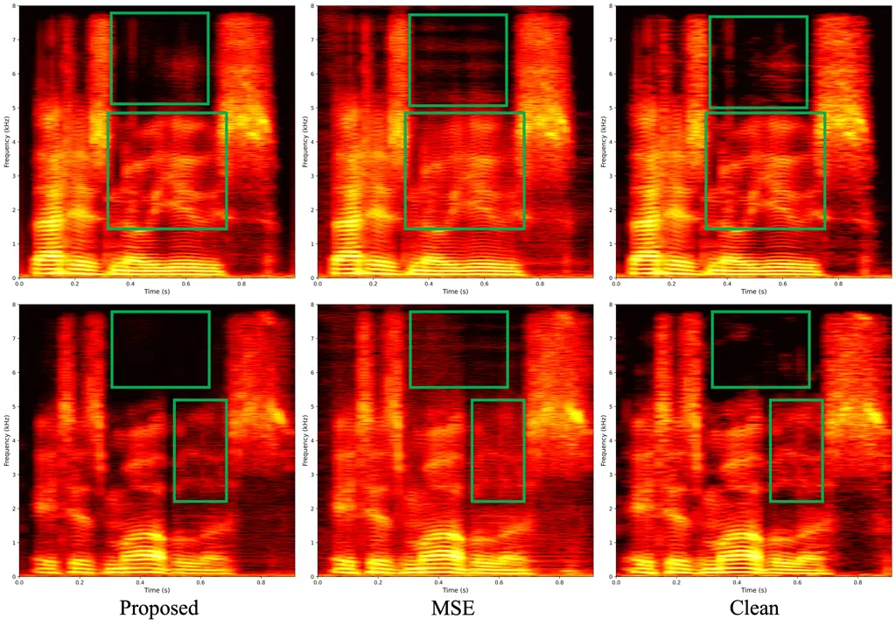

# Loud-loss: A Perceptually Motivated Loss Function for Speech Enhancement Based on Equal-Loudness Contours

Zixuan Li    Xueliang Zhang\sthanksCorresponding author    Changjiang
Zhao    Shuai Gao    Lei Miao    Zhipeng Yan    Ying Sun    Chong Zhu

###### Abstract

The mean squared error (MSE) is a ubiquitous loss function for speech
enhancement, but its problem is that the error cannot reflect the
auditory perception quality. This is because MSE causes models to
over-emphasize low-frequency components which has high energy, leading
to the inadequate modeling of perceptually important high-frequency
information. To overcome this limitation, we propose a
perceptually-weighted loss function grounded in psychoacoustic
principles. Specifically, it leverages equal-loudness contours to assign
frequency-dependent weights to the reconstruction error, thereby
penalizing deviations in a way aligning with human auditory sensitivity.
The proposed loss is model-agnostic and flexible, demonstrating strong
generality. Experiments on the VoiceBank+DEMAND dataset show that
replacing MSE with our loss in a GTCRN model elevates the WB-PESQ score
from 2.17 to 2.93—a significant improvement in perceptual quality.

###### Index Terms: 

speech enhancement, loss function, psychoacoustic, equal-loudness
contours

^(†)^(†)address: ¹College of Computer Science, Inner Mongolia
University, China  
²Lenovo, China  
cslzx@mail.imu.edu.cn, cszxl@imu.edu.cn

## 1 Introduction

Speech enhancement, the process of improving speech quality and
intelligibility by suppressing background noise, is a critical front-end
for numerous downstream applications, including automatic speech
recognition (ASR)\[22, 24\] and hearing aids\[21, 9\]. Recently, deep
learning-based methods have led to significant advances in speech
enhancement, achieving remarkable improvements in both speech quality
and intelligibility. Many of these methods operate in the spectral
domain, training a neural network to estimate a clean speech
representation (e.g., a magnitude spectrum or a complex mask) from a
noisy input \[18, 6, 10, 4\].

These models are typically optimized by minimizing the mean squared
error (MSE) on a given spectral representation. While the MSE loss is
favored for its simplicity and ease of optimization, it is poorly
correlated with human auditory perception, leading to two fundamental
limitations. First, MSE applies a uniform penalty across all frequency
bins. This forces the model to prioritize high-energy, low-frequency
regions, often at the expense of perceptually vital low-energy,
high-frequency components that are critical for speech intelligibility.
Second, minimizing the spectral Euclidean distance, as MSE does, does
not reliably predict or guarantee improvements in perceived speech
quality \[23, 12, 5\].

To mitigate the first limitation in magnitude-focused objectives,
several studies propose applying the loss to a compressed magnitude
spectrum, such as
$`\mathcal{L}(\hat{S},S)=MSE(|\hat{S}|^{\alpha},|S|^{\alpha})`$ for
$`\alpha\in(0,1)`$ \[8, 16\]. This non-linear compression amplifies
low-energy components, encouraging the model to balance its optimization
across the spectrum. However, this approach lacks a clear psychoacoustic
grounding, making the selection of the hyperparameter $`\alpha`$
empirical and highly sensitive.

To address the second limitation, other methods draw inspiration from
perceptual principles. For example, Perceptual Contrast Stretching (PCS)
\[3\] modifies the target magnitude spectrum using a power-law
transformation weighted by a band importance function \[1\]. While this
effectively emphasizes perceptually salient features in the training
target, it introduces an input-target mismatch, forcing the network to
learn a mapping from an original input to a distorted output.

To this end, we propose Loud-loss: a novel, perceptually-motivated loss
function designed to circumvent the aforementioned issues in deep
learning-based speech enhancement. Our approach integrates principles
from the psychoacoustic model of equal-loudness contours\[17\] to derive
perceptual importance weights for each frequency band. The total loss is
then a weighted sum of the spectral errors, compelling the model to
prioritize frequency regions that are most critical to human hearing.
This perceptual prioritization is especially crucial for
capacity-limited models designed for low-resource scenarios. Since
perfect signal reconstruction is often infeasible for such models, our
loss guides them to allocate their finite modeling capacity toward
accurately estimating the most perceptually vital frequency bands.
Unlike prior work, our method is highly interpretable, maintains
input-target consistency, and, as our experiments will show, achieves
superior performance in both perceptual quality and intelligibility. The
code is available at
[https://github.com/zx1292982431/Loud-Loss](https://github.com/zx1292982431/Loud-Loss).

## 2 Method

Figure 1: An overview of the calculation process for the Loud-loss.

As illustrated in Fig. 1, the Loud-loss is computed in four stages.
First, the enhanced and target magnitude spectra are converted to the
log-power domain. Second, these spectra are partitioned into Mel-scaled
sub-bands. Third, a loss is computed for each sub-band. Finally, these
individual losses are weighted based on a psychoacoustic model and
aggregated into a single loss value.

### 2.1 Log-Power Spectrum Representation

The Loud-loss operates in the log-power spectral domain. This choice is
motivated by two key factors. First, it aligns with the logarithmic
nature of human sound intensity perception. Second, it ensures
mathematical consistency with our perceptual importance weights, which
are derived from relative values in the dB domain as described later.
Accordingly, the enhanced magnitude spectrum
$`\hat{M}\in\mathbb{R}^{F\times T}`$ and the target magnitude spectrum
$`M\in\mathbb{R}^{F\times T}`$ are first converted to their log-power
representations, denoted as $`\hat{P}`$ and $`P`$. Here, $`F`$ and $`T`$
represent the number of frequency bins and time frames, respectively.

### 2.2 Mel Scale Band Split

To mimic the non-uniform frequency resolution of the human auditory
system, we partition the spectrum into $`K`$ overlapping sub-bands using
the Mel scale. This process begins by defining $`K+2`$ boundary
frequencies $`\{f_{c}[i]\}_{i=0}^{K+1}`$ that are equally spaced on the
Mel scale. The conversion between frequency in Hertz (Hz) and the Mel
scale is governed by\[13\]:

```math
mel=2595\cdot\log_{10}(1+Hz/700) \tag{1}
```

```math
Hz=700\cdot(10^{mel/2595}-1) \tag{2}
```

These boundary frequencies are then mapped to their corresponding
frequency bin indices $`\{k_{c}[i]\}_{i=0}^{K+1}`$. To create spectrally
smooth sub-bands with a 50% overlap, the $`i`$-th sub-band of a
log-power spectrum $`P`$, denoted
$`P^{i}\in\mathbb{R}^{F_{i}\times T}`$, is formed by grouping the
frequency bins from index $`k_{c}[i]`$ to $`k_{c}[i+2]-1`$. The number
of bins in the $`i`$-th sub-band is $`F_{i}=k_{c}[i+2]-k_{c}[i]`$. This
process is applied to both $`\hat{P}`$ and $`P`$ to obtain the sub-band
pairs $`\hat{P^{i}}`$ and $`P^{i}`$.

### 2.3 Sub-band Loss Computation

For each of the $`K`$ sub-bands, we compute the mean squared error (MSE)
between the enhanced and target log-power spectra. The loss for the
$`i`$-th sub-band, $`\mathcal{L}_{sub}^{i}`$, is defined as:

```math
\mathcal{L}_{sub}^{i}=\frac{1}{F_{i}T}\sum_{f=1}^{F_{i}}\sum_{t=1}^{T}(P^{i}(f,t)-\hat{P}^{i}(f,t))^{2} \tag{3}
```

### 2.4 Perceptual Weighting of Sub-band Losses

Our weighting scheme is designed to penalize errors in perceptually
sensitive frequency regions more heavily. We base our weights on the
40-phon equal-loudness contour \[17\], as this loudness level is
representative of typical conversational speech. This curve shows that
human hearing sensitivity varies with frequency; a lower Sound Pressure
Level (SPL) on this curve corresponds to a lower hearing threshold,
meaning the ear is more sensitive in that region.

Since 1000 Hz is the specific reference frequency used to measure
equal-loudness contours, we define the perceptual weight $`w^{i}`$ for
each sub-band as the inverse of its 40-phon hearing threshold relative
to this reference:

```math
w^{i}=\frac{SPL(1000\text{ Hz})}{SPL(f_{c}[i+1])},\quad i=0,1,\dots,K-1 \tag{4}
```

where $`f_{c}[i+1]`$ is the center frequency of the $`i`$-th sub-band,
and the $`SPL(\cdot)`$ function is implemented via a nearest-neighbor
lookup on the values in Table 1. This formulation assigns a larger
weight to frequency bands where human hearing is more sensitive (i.e.,
those with lower SPL thresholds).

| Freq  | SPL   | Freq | SPL   | Freq | SPL   | Freq  | SPL   |
| ----- | ----- | ---- | ----- | ---- | ----- | ----- | ----- |
| (Hz)  | (dB)  | (Hz) | (dB)  | (Hz) | (dB)  | (Hz)  | (dB)  |
| 20    | 99.85 | 25   | 93.94 | 31.5 | 88.17 | 40    | 82.63 |
| 50    | 77.78 | 63   | 73.08 | 80   | 68.48 | 100   | 64.37 |
| 125   | 60.59 | 160  | 56.70 | 200  | 53.41 | 250   | 50.40 |
| 315   | 47.58 | 400  | 44.98 | 500  | 43.05 | 630   | 41.34 |
| 800   | 40.06 | 1000 | 40.01 | 1250 | 41.82 | 1600  | 42.51 |
| 2000  | 39.23 | 2500 | 36.51 | 3150 | 35.61 | 4000  | 36.65 |
| 5000  | 40.01 | 6300 | 45.83 | 8000 | 51.80 | 10000 | 54.28 |
| 12500 | 51.49 |      |       |      |       |       |       |

Table 1: Frequency vs. SPL for 40-phon contour

The final loss is the sum of these perceptually weighted sub-band
losses:

```math
\mathcal{L}=\sum_{i=0}^{K-1}w^{i}\mathcal{L}_{sub}^{i} \tag{5}
```

## 3 Experiment

### 3.1 Networks

To validate the effectiveness of our proposed Loud-loss, we evaluate it
on two state-of-the-art (SOTA) model architectures from different
computational costs: the low-resource GTCRN \[15\] and the
medium-resource ICCRN \[11\]. Since Loud-loss operates on the magnitude
spectrum, a direct comparison requires adapting all models to a
magnitude-only prediction task. This ensures that any observed
improvements are attributable solely to the loss function’s formulation,
rather than differences in the underlying task (e.g., complex vs.
magnitude estimation). Specifically, we modified the output layer of
each network to estimate only the clean speech magnitude, which is then
combined with the phase of the noisy signal for waveform reconstruction.
Furthermore, the original GTCRN employs an equivalent rectangular
bandwidth (ERB) filter bank to merge features above 2 kHz, which
inherently biases the model to focus on low-frequency components. To
ensure that any observed improvements are attributable solely to our
proposed Loud-loss and not this architectural feature, we removed the
ERB operation from the GTCRN model in all our experiments.

### 3.2 Dataset

All models were trained and evaluated on the widely-used
VoiceBank+DEMAND dataset\[2\] at a 16k sampling rate. The VoiceBank
corpus\[20\] contains recordings from 30 native English speakers, which
are split into a training set (28 speakers) and a testing set (2
speakers). The official training set consists of 11,572 utterances
created by mixing clean speech with 10 different noise types—eight from
the DEMAND\[19\] database and two artificially generated noises.

### 3.3 Implementation Details

All audio is processed using a Short-Time Fourier Transform (STFT) with
a 512-sample (32ms) Hanning window and a 256-sample (16ms) hop.
Following the procedure in Section 2.2, the resulting spectrum is
partitioned into $`K=25`$ Mel-scaled sub-bands, upon which the Loud-loss
is computed. The network input is formed by concatenating the real part,
imaginary part, and magnitude of the noisy spectrogram along the channel
axis. All models are trained using the Adam optimizer\[7\] with an
initial learning rate of 0.001 and a batch size of 4. We apply gradient
clipping with a threshold of 5.0 to prevent exploding gradients. A
learning rate scheduler is employed, which halves the learning rate if
the validation loss fails to decrease for 20 consecutive epochs. Each
model is trained for 200 epochs, and the checkpoint yielding the highest
PESQ\[14\] score on the validation set is saved for testing.

### 3.4 Results

#### 3.4.1 Comparison with the baseline losses

| Exp. ID | Models          | Loss                       | WB-PESQ | NB-PESQ | ESTOI | STOI  | SNR   | SI-SNR |
| ------- | --------------- | -------------------------- | ------- | ------- | ----- | ----- | ----- | ------ |
| \-      | Unprocessed     | \-                         | 1.97    | 2.88    | 0.787 | 0.921 | 8.54  | 8.44   |
| 1       | GTCRN^(†)       | MSE                        | 2.17    | 3.04    | 0.812 | 0.927 | 18.43 | 17.24  |
| 2       | GTCRN^(†) + PCS | MSE                        | 2.48    | 3.20    | 0.807 | 0.924 | 14.20 | 8.67   |
| 3       | GTCRN^(†)       | Loud-loss                  | 2.93    | 3.51    | 0.836 | 0.936 | 16.28 | 14.41  |
| 4       | GTCRN^(‡)       | MSE                        | 2.57    | 3.24    | 0.824 | 0.930 | 19.30 | 17.96  |
| 5       | GTCRN^(‡)       | Loud-loss                  | 2.92    | 3.50    | 0.841 | 0.937 | 18.78 | 17.43  |
| 6       | ICCRN^(†)       | MSE                        | 2.41    | 3.18    | 0.820 | 0.920 | 18.43 | 17.23  |
| 7       | ICCRN^(†)       | Loud-loss                  | 2.84    | 3.46    | 0.841 | 0.935 | 17.81 | 16.53  |
| 8       | GTCRN^(†)       | Loud-loss + SI-SNR         | 2.92    | 3.55    | 0.847 | 0.940 | 20.37 | 18.44  |
| 9       | GTCRN^(†)       | Compressed$`(\alpha=0.3)`$ | 2.85    | 3.47    | 0.844 | 0.940 | 18.27 | 17.01  |
| 10      | GTCRN^(†)       | Compressed$`(\alpha=0.7)`$ | 2.64    | 3.36    | 0.832 | 0.937 | 18.31 | 17.14  |

Table 2: Objective evaluation results on the VoiceBank+DEMAND test set.
We compare the Loud-loss with baseline losses on various model
architectures. Boldface indicates the best score in each column. ^(†)
denotes magnitude mapping-based methods, while ^(‡) denotes
masking-based methods.



Figure 2: Comparison of enhanced speech spectrograms generated using
different loss functions.

Superiority over MSE: As shown in Table 2, the Loud-loss demonstrates
significant advantages over the standard MSE baseline across all tested
architectures. For the mapping-based GTCRN^(†) (Exp. 1 vs. 3), our
method improves WB-PESQ by 0.76 and ESTOI by 0.024. This trend holds for
the masking-based GTCRN^(‡) (Exp. 4 vs. 5) and the ICCRN model (Exp. 6
vs. 7). These substantial gains in perceptual metrics (PESQ) and
intelligibility metrics (ESTOI) underscore the importance of integrating
psychoacoustic principles into the loss function. The MSE loss, by
uniformly weighting all frequency bins, forces the model to prioritize
high-energy, low-frequency regions. This causes the blurring of
higher-order harmonics and the inaccurate estimation of crucial
high-frequency components, an effect visualized in the spectrogram
analysis in Figure 2. It is worth noting that while Loud-loss performs
excellently on perceptual metrics, its scores on the SNR and SI-SNR
metrics are lower than the MSE baseline. This is an expected trade-off.
This trade-off is not a limitation but rather a validation of our
approach. Metrics like SNR and SI-SNR are fundamentally aligned with the
MSE objective—minimizing signal-level energy distance. The lower scores
on these metrics, paired with superior PESQ and ESTOI scores, strongly
indicate that Loud-loss successfully redirects the model’s optimization
focus from raw energy fidelity towards human perceptual fidelity, which
is the central thesis of this work.

Generality and Flexibility: The Loud-loss exhibits strong generality.
First, it is effective for both mapping and masking-based enhancement
frameworks, yielding substantial gains over MSE in both cases. Second,
the loss is model-agnostic, providing consistent improvements when
integrated into the architecturally distinct GTCRN and ICCRN models.

Compatibility with Other Loss Functions: The Loud-loss is also highly
compatible with other losses. To demonstrate this, in Exp. 8, we
combined it with an SI-SNR loss term. This composite loss achieved the
best SI-SNR score of 18.44 (a substantial increase from 14.41 in Exp. 3)
at the cost of only a negligible 0.01 decrease in WB-PESQ. This result
highlights our method’s flexibility, allowing for the creation of
balanced, multi-objective loss functions that can be tailored to
specific application requirements.

Comparison with Advanced Baselines: Our method also outperforms other
advanced training objectives, namely spectral compression (Exp. 9, 10)
and the perceptually-motivated PCS (Exp. 2). Although spectral
compression with an optimal $`\alpha=0.3`$ achieves competitive results
by reducing the spectrum’s dynamic range, our method still attains a
higher WB-PESQ score (2.93 in Exp. 3 vs. 2.85 in Exp. 9). More
importantly, our approach has a distinct advantage in interpretability:
its weights are rigorously derived from a psychoacoustic model, whereas
the optimal compression factor $`\alpha`$ must be found empirically and
is highly sensitive, as shown by the performance drop when $`\alpha`$ is
changed to 0.7. Furthermore, when compared to the perceptually-motivated
PCS method (Exp. 2), which introduces an input-target mismatch, our
method demonstrates comprehensive superiority, outperforming it across
all reported metrics.

#### 3.4.2 Ablation studies

To validate the effectiveness of each design of Loud-loss, we conducted
a series of ablation experiments using the mapping-based GTCRN^(†) as
baseline. The results are presented in Table 3.

|                                |                              |         |
| ------------------------------ | ---------------------------- | ------- |
| Exp. ID                        | Description                  | WB-PESQ |
| 3                              | Baseline (Loud-loss)         | 2.93    |
| Analysis of Sub-band Splitting |                              |         |
| 11                             | w/o Sub-band Overlap         | 2.81    |
| 12                             | Uniform Band Split           | 2.40    |
| 13                             | Per-bin Weighting (no bands) | 2.56    |
| Analysis of Weighting Scheme   |                              |         |
| 14                             | Uniform Weights              | 2.60    |
| 15                             | PCS-based Weights            | 2.70    |
| Analysis of Application Domain |                              |         |
| 16                             | Applied on Magnitude         | 2.05    |
| Analysis of ERB Interaction    |                              |         |
| 17                             | Exp.1 with ERB               | 2.30    |
| 18                             | Exp.3 with ERB               | 2.90    |

Table 3: Ablation study of the Loud-loss on the GTCRN^(†) model.
”Baseline” refers to our full proposed method (Exp. 3).

Our baseline (Exp. 3) employs a Mel-scale band split with 50% overlap.
First, we investigated the impact of this overlap. By removing it (Exp.
11), we observed a minor degradation in PESQ, which may be attributed to
discontinuities at the sub-band edges during optimization. Next, we
replaced the Mel scale with a uniform Hz scale for band splitting (Exp.
12). This change resulted in a substantial drop in WB-PESQ from 2.93 to
2.40, confirming that the perceptually-motivated Mel scale is crucial
for allocating appropriate model capacity to different frequency
regions. Finally, forgoing sub-bands entirely and instead applying
interpolated weights directly to each frequency bin (Exp. 13) also
yielded inferior results, suggesting that the sub-band averaging
mechanism is beneficial.

To validate our proposed psychoacoustic weighting, we compare it against
two alternatives. First, in Exp. 14, we applied a uniform weight to all
sub-bands, making each contribute equally to the total loss. This
approach, which is conceptually equivalent to an MSE loss in the
log-power domain, led to a sharp performance drop, with the WB-PESQ
score falling from 2.93 to 2.60. In Exp. 15, we replaced our
equal-loudness-contour-derived weights with those from the PCS method,
which are based on band importance function\[1\]. It caused a
significant decline in WB-PESQ (2.93 vs. 2.70). These results validate
that our proposed weighting scheme, which is more directly tied to
psychoacoustic models of loudness perception, is more effective at
improving overall perceptual quality.

Applying the loss in the log-power domain is a critical design choice.
We verify its importance in Exp. 16, where we applied our dB-derived
perceptual importance weights directly to losses computed on the linear
magnitude spectrum. This domain mismatch resulted in a severe
performance degradation, with the WB-PESQ score plummeting from 2.93 to
2.05. This result confirms that for the perceptual weighting to be
effective, the spectral features must be represented in a domain
(log-power) that is mathematically consistent with the weights
themselves.

We investigated the interaction between the loss function and the ERB
module, which was removed from our main experiments. In Exp. 17, adding
the ERB module to the GTCRN model trained with MSE (Exp. 1) improved the
WB-PESQ score from 2.17 to 2.30. This shows that for a
capacity-constrained model like GTCRN, using the ERB module to force the
model to focus more on low-frequency components is a beneficial
trade-off. In contrast, Exp. 18 shows that adding the ERB module to our
proposed method causes a slight performance degradation, with WB-PESQ
dropping from 2.93 to 2.90. his finding is particularly significant: it
indicates that our loss function already provides a more effective and
principled allocation of the model’s limited capacity based on rigorous
psychoacoustic principles, rendering the ERB module’s heuristic not only
redundant but slightly detrimental.

## 4 Conclusions

In this paper, we proposed Loud-loss, a novel, perceptually-motivated
loss function for speech enhancement. The Loud-loss integrates
principles from the psychoacoustic model of equal-loudness contours to
derive perceptual importance weights for different frequency sub-bands.
This approach compels the network to prioritize the accuracy of
perceptually critical frequency regions, directly addressing a key
limitation of the standard MSE loss. Experiments demonstrate that
Loud-loss offers significant benefits: it is a versatile and
model-agnostic solution that can be applied to both mapping and
masking-based architectures and can be flexibly combined with other loss
functions. On the GTCRN model, our method significantly boosts
perceptual quality and intelligibility, improving the WB-PESQ score from
2.17 to 2.93 compared to the MSE baseline.

## 5 Acknowledgements

This research was partly supported by the China National Nature Science
Foundation (No. 61876214) and CCF-Lenovo Research Fund (No. 20240203).

## References

- \[1\] American National Standards Institute (1997) S3.5-1997, Methods
  for the Calculation of the Speech Intelligibility Index. Standard
  Technical Report S3.5-1997, American National Standards Institute, New
  York. Cited by: §1, §3.4.2.
- \[2\] C. V. Botinhao, X. Wang, S. Takaki, and J. Yamagishi (2016)
  Investigating rnn-based speech enhancement methods for noise-robust
  text-to-speech. In 9th ISCA speech synthesis workshop, pp. 159–165.
  Cited by: §3.2.
- \[3\] R. Chao, C. Yu, S. Fu, X. Lu, and Y. Tsao (2022) Perceptual
  contrast stretching on target feature for speech enhancement. arXiv
  preprint arXiv:2203.17152. Cited by: §1.
- \[4\] C. Fan, E. Liu, A. Li, J. Tao, J. Zhou, J. Li, C. Zheng, and Z.
  Lv (2025) BSDB-net: band-split dual-branch network with selective
  state spaces mechanism for monaural speech enhancement. In Proceedings
  of the AAAI Conference on Artificial Intelligence, Vol. 39,
  pp. 23850–23858. Cited by: §1.
- \[5\] S. Fu, C. Yu, T. Hsieh, P. Plantinga, M. Ravanelli, X. Lu,
  and Y. Tsao (2021) MetricGAN+: an improved version of metricgan for
  speech enhancement. In Interspeech 2021, pp. 201–205. External Links:
  [Document](https://dx.doi.org/10.21437/Interspeech.2021-599), ISSN
  2958-1796 Cited by: §1.
- \[6\] Y. Hu, Y. Liu, S. Lv, M. Xing, S. Zhang, Y. Fu, J. Wu, B. Zhang,
  and L. Xie (2020) DCCRN: deep complex convolution recurrent network
  for phase-aware speech enhancement. arXiv preprint arXiv:2008.00264.
  Cited by: §1.
- \[7\] D. P. Kingma and J. Ba (2014) Adam: a method for stochastic
  optimization. arXiv preprint arXiv:1412.6980. Cited by: §3.3.
- \[8\] J. Lee, J. Skoglund, T. Shabestary, and H. Kang (2018)
  Phase-sensitive joint learning algorithms for deep learning-based
  speech enhancement. IEEE Signal Processing Letters 25 (8),
  pp. 1276–1280. Cited by: §1.
- \[9\] N. A. Lesica, N. Mehta, J. G. Manjaly, L. Deng, B. S. Wilson,
  and F. Zeng (2021) Harnessing the power of artificial intelligence to
  transform hearing healthcare and research. Nature Machine Intelligence
  3 (10), pp. 840–849. Cited by: §1.
- \[10\] Z. Li, S. He, J. Bai, and X. Zhang (2025) TF-skimnet: speech
  enhancement based on inplace modeling and skipping memory in
  time-frequency domain. In Proc. Interspeech 2025, pp. 5143–5147. Cited
  by: §1.
- \[11\] J. Liu and X. Zhang (2023) Iccrn: inplace cepstral
  convolutional recurrent neural network for monaural speech
  enhancement. In ICASSP 2023-2023 IEEE International Conference on
  Acoustics, Speech and Signal Processing (ICASSP), pp. 1–5. Cited by:
  §3.1.
- \[12\] P. Manocha, A. Finkelstein, R. Zhang, N. J. Bryan, G. J.
  Mysore, and Z. Jin (2020) A differentiable perceptual audio metric
  learned from just noticeable differences. arXiv preprint
  arXiv:2001.04460. Cited by: §1.
- \[13\] D. O’Shaughnessy (1987) Speech communication, human and machine
  addison wesley. Reading MA 40, pp. 150. Cited by: §2.2.
- \[14\] A. W. Rix, J. G. Beerends, M. P. Hollier, and A. P.
  Hekstra (2001) Perceptual evaluation of speech quality (pesq)-a new
  method for speech quality assessment of telephone networks and codecs.
  In 2001 IEEE international conference on acoustics, speech, and signal
  processing. Proceedings (Cat. No. 01CH37221), Vol. 2, pp. 749–752.
  Cited by: §3.3.
- \[15\] X. Rong, T. Sun, X. Zhang, Y. Hu, C. Zhu, and J. Lu (2024)
  GTCRN: a speech enhancement model requiring ultralow computational
  resources. In ICASSP 2024-2024 IEEE International Conference on
  Acoustics, Speech and Signal Processing (ICASSP), pp. 971–975. Cited
  by: §3.1.
- \[16\] S. S. Shetu, S. Chakrabarty, O. Thiergart, and E.
  Mabande (2024) Ultra low complexity deep learning based noise
  suppression. In ICASSP 2024-2024 IEEE International Conference on
  Acoustics, Speech and Signal Processing (ICASSP), pp. 466–470. Cited
  by: §1.
- \[17\] Y. Suzuki and H. Takeshima (2004) Equal-loudness-level contours
  for pure tones. The Journal of the Acoustical Society of America 116
  (2), pp. 918–933. Cited by: §1, §2.4.
- \[18\] K. Tan and D. Wang (2018) A convolutional recurrent neural
  network for real-time speech enhancement.. In Interspeech, Vol. 2018,
  pp. 3229–3233. Cited by: §1.
- \[19\] J. Thiemann, N. Ito, and E. Vincent (2013) The diverse
  environments multi-channel acoustic noise database (demand): a
  database of multichannel environmental noise recordings. In
  Proceedings of Meetings on Acoustics, Vol. 19, pp. 035081. Cited by:
  §3.2.
- \[20\] C. Veaux, J. Yamagishi, and S. King (2013) The voice bank
  corpus: design, collection and data analysis of a large regional
  accent speech database. In 2013 international conference oriental
  COCOSDA held jointly with 2013 conference on Asian spoken language
  research and evaluation (O-COCOSDA/CASLRE), pp. 1–4. Cited by: §3.2.
- \[21\] D. Wang (2017) Deep learning reinvents the hearing aid. IEEE
  spectrum 54 (3), pp. 32–37. Cited by: §1.
- \[22\] F. Weninger, H. Erdogan, S. Watanabe, E. Vincent, J. Le
  Roux, J. R. Hershey, and B. Schuller (2015) Speech enhancement with
  lstm recurrent neural networks and its application to noise-robust
  asr. In International conference on latent variable analysis and
  signal separation, pp. 91–99. Cited by: §1.
- \[23\] Y. Zeng, J. Konan, S. Han, D. Bick, M. Yang, A. Kumar, S.
  Watanabe, and B. Raj (2023) TAPLoss: a temporal acoustic parameter
  loss for speech enhancement. In ICASSP 2023 - 2023 IEEE International
  Conference on Acoustics, Speech and Signal Processing (ICASSP), Vol. ,
  pp. 1–5. External Links:
  [Document](https://dx.doi.org/10.1109/ICASSP49357.2023.10094773) Cited
  by: §1.
- \[24\] X. Zhang, Z. Wang, and D. Wang (2017) A speech enhancement
  algorithm by iterating single-and multi-microphone processing and its
  application to robust asr. In 2017 IEEE International Conference on
  Acoustics, Speech and Signal Processing (ICASSP), pp. 276–280. Cited
  by: §1.
