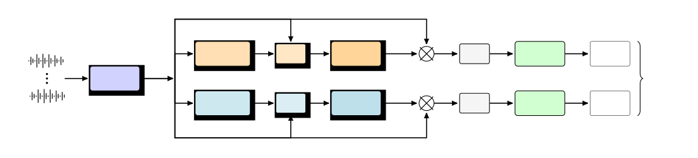
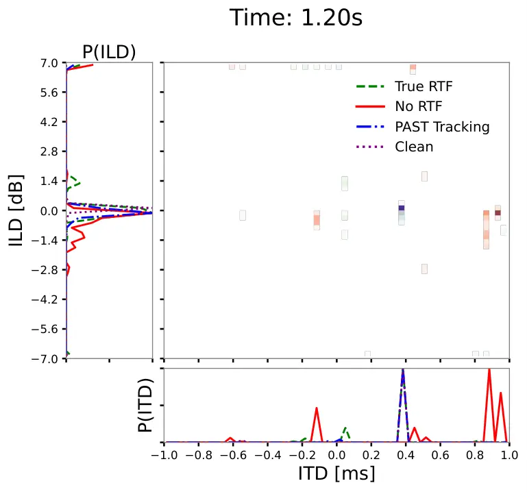
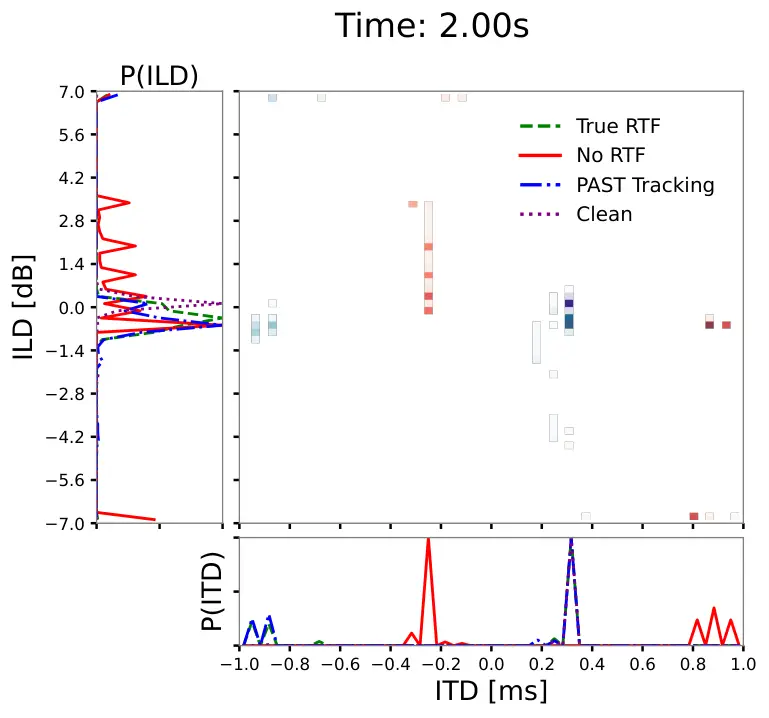
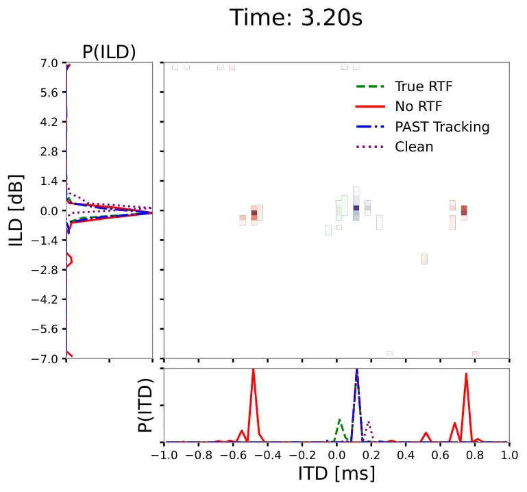
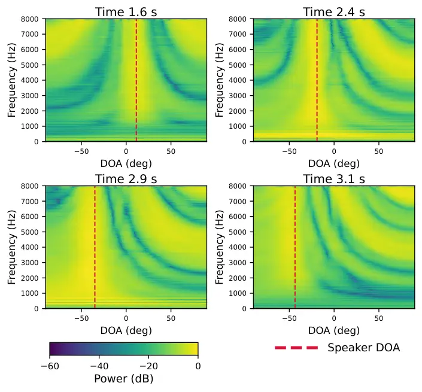
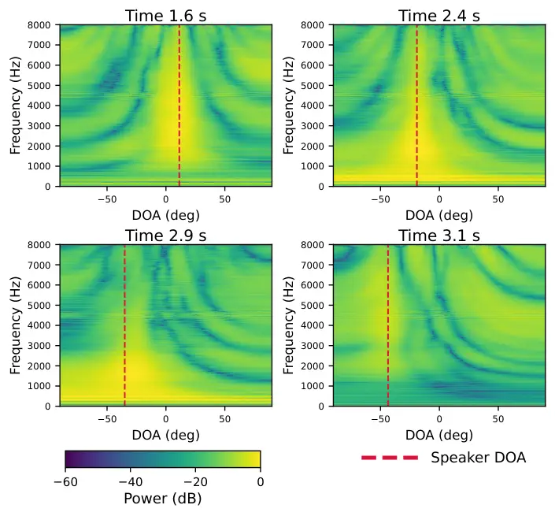

# Interpretable Binaural Deep Beamforming Guided by Time-Varying Relative Transfer Function Thanks: This work was supported by the Israel Science Foundation (ISF) and the German Research Foundation (DFG) through the ISF–DFG Joint Research Program, Grant No. 1280/25.

Ilai Zaidel Affiliation: Bar-Ilan University, Israel  
ilai.zaidel@biu.ac.il; 0009-0005-4578-6742    Sharon Gannot
Affiliation: Bar-Ilan University, Israel  
sharon.gannot@biu.ac.il; 0000-0002-2885-170X

###### Abstract

In this work, we propose a deep beamforming framework for speech
enhancement in dynamic acoustic environments. The framework learns
time-varying beamformer weights from noisy multichannel signals via a
deep neural network, guided by a continuously tracked relative transfer
function (RTF) of a moving target speaker. We analyze the network’s
spatial behavior on an 8-microphone linear array by evaluating
narrowband and wideband beampatterns in three modes: (i) oracle guidance
with true RTFs, (ii) guidance with subspace-tracked RTF estimates, and
(iii) operation without RTF guidance. Results show that RTF guidance
yields smoother, more spatially consistent beampatterns that track the
target direction of arrival (DOA), whereas the unguided model fails to
maintain a clear spatial focus. We further extend the framework to
binaural beamforming for dynamic target-speaker enhancement. The system
is trained using a head-related transfer function (HRTF)-based acoustic
simulation of a moving source, enabling realistic spatial rendering at
the left and right ears. Spatial cue preservation is quantitatively
evaluated in terms of interaural level differences (ILD) and interaural
time differences (ITD), demonstrating the method’s suitability for
hearable applications.

###### Index Terms: 

Speech enhancement, dynamic beamforming, RTF estimation, subspace
tracking, HRTF

## I Introduction

Speech enhancement algorithms aim to improve the perceptual quality and
intelligibility of noisy speech signals in acoustic environments. In
multichannel setups, spatial diversity can be exploited to reduce noise
or to separate the target speaker. In this work, we address only the
noise-reduction task, namely, enhancing a single desired speech signal
contaminated by noise. Classical beamforming approaches, such as the
minimum variance distortionless response (MVDR) beamformer \[1\], have
demonstrated strong performance under static acoustic conditions.
Several studies have shown that employing the relative transfer function
(RTF) as the steering vector in an MVDR beamformer leads to improved
speech quality compared to conventional formulations that rely solely on
the direct-path acoustic propagation \[2, 3\]. However, the
effectiveness of such approaches critically depends on accurate
estimation of the steering vector. In dynamic scenarios, where the
acoustic transfer functions (ATFs) and their corresponding RTFs evolve
over time, reliable tracking of these time-varying RTFs becomes
essential.

Recently, DNN-based beamformers have achieved strong performance by
jointly learning spatial and spectral representations from data \[4,
5\]. By replacing analytically derived weights with trainable networks,
they capture nonlinear mappings and adapt to diverse acoustic
conditions. However, their spatial behavior is often non-interpretable,
motivating methods that explicitly analyze the spatial properties of the
multichannel algorithms and encourage their spatial selectivity \[6, 7,
8\]. The central role of the RTF in classical beamforming motivates its
integration into DNN-based beamformers. Whereas prior work has estimated
RTF-based classical beamformer coefficients \[1, 9, 10\] or used it as a
spatial filter within deep architectures \[11\], our approach feeds the
RTF as an input feature into the network. Recent results in \[12\] for
target speaker extraction (TSE) show that RTF-based spatial guidance
outperforms DOA-based guidance. This likely stems from the RTF’s ability
to capture complex acoustic propagation in reverberant environments more
faithfully \[3\].

Dynamic scenarios are inherently more challenging than static settings,
especially when spatial interpretability is required. In \[13\], a
spatially selective deep filter was introduced that depends only on weak
spatial guidance derived from the target speaker’s initial position.

In binaural speech enhancement, preserving spatial cues is crucial, and
cue preservation is typically assessed via interaural measures such as
ILD/ITD \[14\]. Prior work has shown that deep binaural speech
separation can handle moving speakers while preserving spatial cues
\[15, 16\]. More recently, binaural TSE methods have been proposed that
explicitly leverage HRTFs as spatial cues, enabling accurate cue
preservation in both anechoic and reverberant environments \[17\].

In this paper, we propose guiding a DNN-based beamformer using
time-varying RTF estimates of a moving target speaker, tracked with the
projection approximation subspace tracking (PAST) algorithm \[18\]. This
blind tracking approach has been applied to speech enhancement and
extended to dynamic multichannel settings \[19, 20\], making it a
natural candidate for providing spatial guidance. Building on the
explainable beamforming architecture \[8\], we incorporate the tracked
RTF as an additional input feature and demonstrate improved spatial
performance compared with the same architecture without RTF guidance.
Finally, we extend the framework to a binaural configuration and show
that time-varying RTF guidance also improves spatial cue preservation
(ILD/ITD).

## II Problem Formulation

In the short-time Fourier transform (STFT) domain, the multichannel
mixture signal is modeled as

```math
\mathbf{y}(l,k)=\mathbf{h}(l,k)s(l,k)+\mathbf{n}(l,k), \tag{1}
```

where $`l`$ and $`k`$ denote the time-frame and frequency-bin indices,
respectively. Here, $`s(l,k)`$ represents the target speech component,
$`\mathbf{h}(l,k)`$ contains the acoustic transfer functions (ATFs) from
the source to the microphones, and $`\mathbf{n}(l,k)`$ denotes additive
noise. We consider a dynamic scenario in which the ATFs are
time-varying.

We apply two time-varying spatial filters:

```math
\displaystyle\hat{s}_{\text{L}}(l,k)=\mathbf{w}^{\mathrm{H}}_{\text{L}}(l,k)\mathbf{y}(l,k), \tag{2a}
```

```math
\displaystyle\hat{s}_{\text{R}}(l,k)=\mathbf{w}^{\mathrm{H}}_{\text{R}}(l,k)\mathbf{y}(l,k), \tag{2b}
```

where $`\hat{s}_{\text{L}}(l,k)`$, $`\hat{s}_{\text{R}}(l,k)`$ are the
binaural outputs and
$`\mathbf{w}_{\text{L}}(l,k),\mathbf{w}_{\text{R}}(l,k)`$ are the
DNN-based beamformer weights.

Our goal in this work is twofold: (i) to estimate the clean speech
signal while preserving the target’s spatial cues, and (ii) to achieve
interpretable spatial filtering, characterized in terms of beampatterns.
Both objectives are addressed under dynamic acoustic conditions.

Binaural cue preservation (ILD/ITD) is evaluated in a configuration with
a single microphone per ear. In this case, $`\mathbf{h}(l,k)`$
corresponds to the listener’s binaural HRTFs. The spatial filtering
characteristics are further examined using an 8-microphone array. Since
no HRTFs are incorporated in this simulation, binaural rendering is not
modeled. Therefore, spatial behavior is evaluated purely through
beampattern analysis of (2a). Similar analysis can be applied to (2b).

In both steups, we assume that the reverberation of the target speaker
is negligible due to the close proximity between the speaker and the
listener.

## III Proposed Method

This section details the network architecture, which comprises two
parallel branches: one estimates the left-ear signal and the other the
right-ear signal; together they constitute the binaural output.

The proposed U-Net design follows \[8\]. Two identical U-Nets estimate
the complex filter-and-sum beamformer weights,
$`\mathbf{w}_{\mathrm{L}}(l,k)`$ and $`\mathbf{w}_{\mathrm{R}}(l,k)`$.
Both operate on the same multichannel STFT input $`\mathbf{y}(l,k)`$ but
differ in training targets: the left branch reconstructs a clean
left-ear reference signal, and the right branch a clean right-ear
reference. Each branch is guided by a time-varying RTF estimate,
$`\{\hat{\mathbf{a}}_{\mathrm{L}},\hat{\mathbf{a}}_{\mathrm{R}}\}\in\mathbb{C}^{M\times F\times L}`$,
with $`M`$ microphones, $`F`$ frequency bins, and $`L`$ time frames. The
RTFs are obtained by normalizing the ATF using different reference
microphones, the left-most for $`\hat{\mathbf{a}}_{\mathrm{L}}`$, and
right-most for $`\hat{\mathbf{a}}_{\mathrm{R}}`$.¹¹ 1 In the
two-microphone case, the reference microphones correspond to the left-
and right-ear microphones. The full architecture is shown in Fig. 1. The
various blocks are now detailed.

### III-A U-Net Model with Attention Fusion

We integrate an attention-based fusion frontend prior to the U-Net to
align the RTF with the multichannel noisy input. The U-Net adopts an
encoder-decoder with skip connections, following \[8, 5\] with
task-specific modifications: eight convolutional blocks (batch
normalization, dropout, LeakyReLU) in the encoder and
transposed-convolution blocks in the decoder \[8\]. Attention gates are
integrated into the skip connections to emphasize relevant encoder
features \[8\]. See \[8\] (Fig. 2) for the baseline U-Net model.



Fig. 1: Overview of the proposed dual-branch beamforming network.

### III-B Time-varying RTF estimation

To estimate the time-varying RTF of the speaker, we employed a recursive
estimation procedure based on the projection approximation subspace
tracking (PAST) algorithm \[18\] and the covariance-whitening (CW)
method for RTF estimation \[21\].

#### III-B1 Covariance-Whitening

The CW approach first estimates the noise covariance matrix from
$`L_{n}`$ noise-only frames (assumed to be available):

```math
\hat{\mathbf{\Phi}}_{\mathbf{nn}}(k)=\frac{1}{L_{n}}\sum_{l=0}^{L_{n}-1}\mathbf{y}(l,k)\mathbf{y}^{\mathrm{H}}(l,k). \tag{3}
```

The noisy signal covariance matrix is then estimated as:

```math
\hat{\mathbf{\Phi}}_{\mathbf{yy}}(k)=\frac{1}{L-L_{n}}\sum_{l=L_{n}}^{L-1}\mathbf{y}(l,k)\mathbf{y}^{\mathrm{H}}(l,k). \tag{4}
```

The whitened measurements are obtained via:

```math
\mathbf{y}_{w}(l,k)=\hat{\mathbf{\Phi}}^{-1/2}_{\mathbf{nn}}(k)\,\mathbf{y}(l,k), \tag{5}
```

with $`\hat{\mathbf{\Phi}}^{-1/2}_{\mathbf{nn}}(k)`$ computed from the
eigenvalue decomposition (EVD) of
$`\hat{\mathbf{\Phi}}_{\mathbf{nn}}(k)`$. The correlation matrix of the
whitened signals is given by:

```math
\hat{\mathbf{\Phi}}_{\mathbf{y_{w}y_{w}}}(k)=\hat{\mathbf{\Phi}}^{-1/2}_{\mathbf{nn}}(k)\,\hat{\mathbf{\Phi}}_{\mathbf{yy}}(k)\,\hat{\mathbf{\Phi}}^{-1/2\mathrm{H}}_{\mathbf{nn}}(k). \tag{6}
```

Finally, the CW estimate of the RTF is obtained from the principal
eigenvector of $`\hat{\mathbf{\Phi}}_{\mathbf{y_{w}y_{w}}}(k)`$,
$`\hat{\bm{\psi}}`$:

```math
\hat{\mathbf{a}}_{\,\textrm{CW}}\triangleq\frac{\hat{\mathbf{\Phi}}^{\mathrm{H}/2}_{\mathbf{nn}}(k)\hat{\bm{\psi}}}{\mathbf{e}^{T}_{{\mathrm{ref}}}\hat{\mathbf{\Phi}}^{\mathrm{H}/2}_{\mathbf{nn}}(k)\hat{\bm{\psi}}}, \tag{7}
```

where $`\mathbf{e}_{{\mathrm{ref}}}`$ is the selection vector for the
chosen reference microphone. The application of the EVD requires
$`\mathcal{O}(M^{3})`$ operations per frequency, in addition to the
computational cost of the whitening procedure.

#### III-B2 Projection Approximation Subspace Tracking

1:  Initialize $`\delta(0)`$ and $`\bm{\psi}(0)`$

2:  for each time-frame $`l=1,2,\dots`$ do

3:   $`\alpha(l,k)=\bm{\psi}^{\mathrm{H}}(l-1,k)\,\mathbf{y}_{w}(l,k)`$

4:   $`\delta(l,k)=\beta\,\delta(l-1,k)+|\alpha(l,k)|^{2}`$

5:
  $`\mathbf{e}(l,k)=\mathbf{y}_{w}(l,k)-\bm{\psi}(l-1,k)\,\alpha(l,k)`$

6:
  $`\bm{\psi}(l,k)=\bm{\psi}(l-1,k)+\tfrac{\mathbf{e}(l,k)\,\alpha^{*}(l,k)}{\delta(l,k)}`$

7:  end for

Algorithm 1 PAST Algorithm for Tracking the Principal Eigenvector.
\[18\]

Since the (whitened) signal is non-stationary, a tracking algorithm is
required to estimate the time-varying principal eigenvector
$`\hat{\bm{\psi}}(l,k)`$. The PAST algorithm \[18\] offers an efficient
recursive estimator of the dominant eigenvector of a time-varying
correlation matrix. Unlike batch EVD, it updates the subspace
incrementally as new data arrive, making it well-suited to real-time
causal speech enhancement and beamforming in dynamically evolving
acoustic scenes. The application of the PAST algorithm only requires
$`\mathcal{O}(M)`$ operations per frequency (in addition to the
whitening procedure). A forgetting factor $`\beta\in(0,1)`$ is used to
gradually discard older observations, allowing the algorithm to adapt to
changes in the signal’s statistics. The PAST procedure is summarized in
Algorithm 1.

## IV Experimental Study







Fig. 2: ILD/ITD graphs comparing the three model variants. Graphs
produced by \[22\] (center frequency $`f_{\rm c}=500~\mathrm{Hz}`$).

In this section, we describe the data generation process, the
experimental setup, and the results of the proposed model.

### IV-A 8-channel array data generation

The dataset was generated with the Signal Generator package to simulate
moving speakers.²² 2 https://github.com/ehabets/Signal-Generator Each
sample corresponds to a low-reverberant room with width/length uniformly
drawn in $`[6,9]`$ m and fixed height of $`3`$ m. An $`8`$-microphone
linear array was placed at height $`1.3`$ m and randomly tilted within
$`[-45^{\circ},45^{\circ}]`$ (see Fig. 3 in \[8\] for the array
configuration). Target speech was taken from the LibriSpeech dataset
\[23\] and placed $`1`$–$`1.5`$ m from the array center. The source
moved along a circular trajectory, with its azimuth sweeping linearly
from a random initial angle $`\theta_{0}`$ to
$`\theta_{0}+\Delta\theta`$, where
$`\Delta\theta\sim\mathcal{U}\big(\pm[45^{\circ},150^{\circ}]\big)`$.
Babble noise was simulated by summing $`20`$ simultaneously active
speakers positioned near the room walls; each babbler was filtered using
the room impulse response (RIR) generator \[24\]. Overall, the training
set contains $`20{,}000`$ multichannel recordings of duration $`4.5`$ s.

### IV-B Binaural dynamic speaker with HRTF simulator

To simulate a dynamic target speaker with HRTF-based binaural acoustics,
we modified the Signal Generator to operate in an anechoic binaural
setting using HRTFs stored in the Spatially Oriented Format for
Acoustics (SOFA) \[25\]. The listener is modeled as a fixed head at the
origin, and the binaural signals correspond to the left and right ears
defined by the selected HRTF database; throughout this work, we use the
RIEC HRTF dataset \[26\].

For each utterance, a subject-specific SOFA file is selected, providing
head-related impulse responses (HRIRs) on a discrete azimuth-elevation
grid. The target speaker moves along a circular trajectory at a fixed
radius, with azimuth varying linearly between start and end angles while
elevation remains constant. At each update time (once per STFT frame),
the instantaneous source direction is computed and the nearest HRIR on
the SOFA grid is selected. The binaural signals are generated by
convolving the clean speech with this time-varying, piecewise-constant
HRIR sequence, yielding an efficient dynamic binaural simulation that
preserves spatiotemporal cues in an anechoic environment. This differs
from the original Signal Generator, which filters signals using
time-varying multi-microphone RIRs computed via the image-source method,
including reflections and late reverberation.

### IV-C Binaural reverberant babble noise environment

In addition to the binaural dynamic target speaker, spatially diffused
babble noise is generated using the SofaMyRoom simulator \[27\], which
produces echoic binaural RIRs based on SOFA-formatted HRTFs, including
early reflections and reverberation. For each scene, the same
subject-specific SOFA file is used for both target and babble signals to
ensure consistent head-related spatial cues. The room parameters match
those of the 8-channel case.

### IV-D Loss Function

For each ear, we maximize the SI-SDR between the beamformer output
$`\hat{s}_{c}`$ and the clean reference signal $`s_{\mathrm{ref},c}`$
received at the corresponding reference microphone. Additionally, we
penalize for the residual noise power at the output. The parameters
$`\alpha`$ and $`\lambda`$ are tunable.

```math
\mathcal{L}=\sum_{c\in\{\mathrm{L},\mathrm{R}\}}\left(-\alpha\;\mathrm{SI\text{-}SDR}(\hat{s}_{c},s_{\mathrm{ref},c})+\lambda\mathbb{E}\!\left[\|\mathbf{w}_{c}^{\mathrm{H}}\mathbf{n}\|_{2}^{2}\right]\right). \tag{8}
```

### IV-E Results

This section reports the results for three model configurations: (i)
oracle guidance with true RTFs, (ii) RTF guidance with estimated RTFs
obtained by the PAST algorithm (Alg. 1), and (iii) a baseline without
RTF input. Audio samples are available on our demo page.³³ 3
https://ilaizaidel.github.io/BinDynBeam/

#### IV-E1 SI-SDR Test Results

SI-SDR results are presented in Table I. For the 8-channel case, the
results indicate that incorporating the RTF does not substantially
affect SI-SDR performance. The oracle RTF achieves the best results
among the three configurations, though the improvement over the other
cases remains insignificant. In the binaural case, we observe only a
slight improvement over the no-RTF case.

| Model Configuration  | $`8`$-channel | Binaural |
| -------------------- | ------------- | -------- |
| Input                | $`6.6`$       | $`6.2`$  |
| Proposed, no RTF     | $`11.9`$      | $`9.9`$  |
| Proposed w. PAST RTF | $`11.7`$      | $`10.3`$ |
| Proposed, oracle     | $`12.0`$      | $`10.3`$ |

TABLE I: SI-SDR Test Results ($`\mathrm{dB}`$).

#### IV-E2 Beampattern Analysis

To further examine the proposed beamformer’s spatial behavior, we
analyze its beampattern, investigating both narrowband and wideband
characteristics. The time-varying narrowband beampattern is defined as
$`B(k,\theta,\ell)=\mathbf{w}_{\rm L}^{\rm H}(k,\ell)\,\mathbf{h}(k,\theta),`$
where $`\mathbf{h}(k,\theta)`$ is the steering vector for DOA
$`\theta`$. The corresponding wideband beampower is obtained by a
summation over all frequency bins
$`P(\theta,\ell)=\sum_{k}\left|B(k,\theta,\ell)\right|^{2}`$. As shown
in Figs. 3,4, guiding the beamformer with the PAST-estimated RTF yields
smoother, more spatially coherent beampatterns that tend to follow the
moving speaker’s trajectory. In contrast, the model without RTF guidance
exhibits reduced directionality and less consistent adaptation to the
dynamic scene. This is further illustrated in Fig. 5, which depicts the
evolution of the wideband beampattern produced by the PAST RTF-guided
model. The main lobe of the beampattern tracks the speaker’s
time-varying DOA, indicating that the model adapts to the target’s
motion over time. The static-speaker scenario was compared to the MVDR
beamformer in Figs. 5-6 of \[8\] and will not be discussed here.



Fig. 3: Narrowband time-varying beampattern, at four time snapshots,
using RTFs estimated by PAST.



Fig. 4: Narrowband time-varying beampattern at four time snapshots, with
no RTF guidance.

#### IV-E3 Binaural cue preservation

In this section, we analyze the model’s ability to preserve the binaural
cues of the dynamically enhanced speaker. To this end, we generate the
ILD/ITD curves and compare binaural cue preservation across the three
algorithmic variants with respect to the clean reference signal. Since
the speaker is moving, these cues are inherently time-varying.
Therefore, the binaural parameters are evaluated over short time
segments. Figure 2 presents the ILD/ITD trajectories at three
representative snapshots along the 4.5 s utterance. The cues are
computed within $`200~\mathrm{ms}`$ analysis windows. The results
demonstrate that incorporating time-varying RTF estimates, either
tracked or oracle, substantially improves ITD and ILD accuracy relative
to the baseline model without RTF guidance.

Fig. 5: Time-varying wideband beampattern (dB), shown at four time
snapshots, with PAST RTF.

## V Conclusions

In this paper, we presented an interpretable deep, time-varying
beamforming framework for enhancing a moving target speaker in noisy
multichannel setups, guided by continuously tracked time-varying RTFs.
We evaluated three operating modes: oracle RTF guidance, PAST-based RTF
guidance, and no RTF guidance. While SI-SDR remains largely comparable
across configurations, RTF guidance consistently improves spatial
behavior by yielding smoother, more coherent, and more directional
beampatterns that better track the target DOA. We extended the approach
to binaural dynamic beamforming. To support this, we have modified the
moving-speaker simulator to incorporate HRTF-based acoustics. We have
demonstrated a significantly improved preservation of spatial cues
(ILD/ITD) with RTF guidance.

## References

- \[1\] S. Gannot, E. Vincent, S. Markovich-Golan, and A. Ozerov (2017)
  A consolidated perspective on multimicrophone speech enhancement and
  source separation. IEEE/ACM Trans. Audio, Speech, and Lang. Proc. 25
  (4), pp. 692–730. Cited by: §I, §I.
- \[2\] S. Gannot, D. Burshtein, and E. Weinstein (2001) Signal
  enhancement using beamforming and nonstationarity with applications to
  speech. IEEE Trans. on Signal Proc. 49 (8), pp. 1614–1626. Cited by:
  §I.
- \[3\] O. Shmaryahu and S. Gannot (2022) On the importance of acoustic
  reflections in beamforming. In 2022 Int. Workshop on Acoustic Signal
  Enhancement (IWAENC), Cited by: §I, §I.
- \[4\] Y. Luo, C. Han, N. Mesgarani, E. Ceolini, and S. Liu (2019)
  FaSNet: Low-latency adaptive beamforming for multi-microphone audio
  proc.. In IEEE Automatic Speech Recognition and Understanding Workshop
  (ASRU), pp. 260–267. Cited by: §I.
- \[5\] X. Ren, X. Zhang, L. Chen, X. Zheng, C. Zhang, L. Guo, and B.
  Yu (2021) A causal U-Net based neural beamforming network for
  real-time multi-channel speech enhancement. In Proc. INTERSPEECH,
  pp. 1832–1836. Cited by: §I, §III-A.
- \[6\] A. Briegleb, M. M. Halimeh, and W. Kellermann (2023) Exploiting
  spatial information with the informed complex-valued spatial
  autoencoder for target speaker extraction. In IEEE Int. Conf. on
  Acoust., Speech and Signal Proc. (ICASSP), Cited by: §I.
- \[7\] K. Tesch and T. Gerkmann (2022) Insights into deep non-linear
  filters for improved multi-channel speech enhancement. IEEE/ACM Trans.
  on Audio, Speech, and Language Proc. 31, pp. 563–575. Cited by: §I.
- \[8\] A. Cohen, D. Wong, J. Lee, and S. Gannot (2025) Explainable
  DNN-based beamformer with postfilter. IEEE/ACM Trans. Audio, Speech,
  and Lang. Proc. 33, pp. 3070–3085. External Links:
  [Document](https://dx.doi.org/10.1109/TASLPRO.2025.3581110) Cited by:
  §I, §I, §III-A, §III, §IV-A, §IV-E2.
- \[9\] O. Ronai, Y. Sitton, A. Bar, and R. Talmon (2025) RTF estimation
  using Riemannian geometry for speech enhancement in the presence of
  interferences. In IEEE Int. Conf. on Acoust., Speech and Signal Proc.
  (ICASSP), Cited by: §I.
- \[10\] G. Bologni, R. C. Hendriks, and R. Heusdens (2025) Wideband
  relative transfer function (RTF) estimation exploiting frequency
  correlations. IEEE Trans. on Audio, Speech and Language Proc. 33 (),
  pp. 731–747. Cited by: §I.
- \[11\] C. Lee, C. Yang, Y. M. Saidutta, R. S. Srinivasa, Y. Shen,
  and H. Jin (2025) Better exploiting spatial separability in
  multichannel speech enhancement with an align-and-filter network. In
  IEEE Int. Conf. on Acoust., Speech and Signal Proc. (ICASSP), Cited
  by: §I.
- \[12\] A. Eisenberg, S. Gannot, and S. E. Chazan (2025) End-to-end
  multi-microphone speaker extraction using relative transfer functions.
  arXiv:2502.06285. Cited by: §I.
- \[13\] J. Kienegger and T. Gerkmann (2025) Steering deep non-linear
  spatially selective filters for weakly guided extraction of moving
  speakers in dynamic scenarios. In Interspeech, pp. 2990–2994. Cited
  by: §I.
- \[14\] V. Tokala, E. Grinstein, M. Brookes, S. Doclo, J. Jensen,
  and P. A. Naylor (2024) Binaural speech enhancement using deep complex
  convolutional transformer networks. In IEEE Int. Conf. on Acoust.,
  Speech and Signal Proc. (ICASSP), Vol. , pp. 681–685. External Links:
  [Document](https://dx.doi.org/10.1109/ICASSP48485.2024.10447090) Cited
  by: §I.
- \[15\] C. Han, Y. Luo, and N. Mesgarani (2021) Binaural speech
  separation of moving speakers with preserved spatial cues.. In
  Interspeech, pp. 3505–3509. Cited by: §I.
- \[16\] C. Han and N. Mesgarani (2023) Online binaural speech
  separation of moving speakers with a wavesplit network. In IEEE Int.
  Conf. on Acoust., Speech and Signal Proc. (ICASSP), Cited by: §I.
- \[17\] Y. Ellinson and S. Gannot (2025) Binaural target speaker
  extraction using HRTFs. arXiv:2507.19369. Cited by: §I.
- \[18\] B. Yang (1995) Projection approximation subspace tracking. IEEE
  Trans. on Signal Proc. 43 (1), pp. 95–107. Cited by: §I, §III-B2,
  §III-B, Algorithm 1.
- \[19\] S. Affes and Y. Grenier (1997) A signal subspace tracking
  algorithm for microphone array processing of speech. IEEE Trans. on
  Speech and Audio Proc. 5 (5), pp. 425–437. Cited by: §I.
- \[20\] S. Markovich-Golan, S. Gannot, and I. Cohen (2010) Subspace
  tracking of multiple sources and its application to speakers
  extraction. In IEEE Int. Conf. on Acoust. Speech and Signal Proc.
  (ICASSP), Dallas, Texas, USA, pp. 201–204. Cited by: §I.
- \[21\] S. Markovich-Golan, S. Gannot, and W. Kellermann (2018)
  Performance analysis of the covariance-whitening and the
  covariance-subtraction methods for estimating the relative transfer
  function. In European Signal Proc. Conf. (EUSIPCO), Rome, Italy,
  pp. 2499–2503. Cited by: §III-B.
- \[22\] C. Faller and J. Merimaa (2004) Source localization in complex
  listening situations: selection of binaural cues based on interaural
  coherence. J. Acoust. Soc. Am. 116 (5), pp. 3075–3089. Cited by: Fig.
  2, Fig. 2.
- \[23\] V. Panayotov, G. Chen, D. Povey, and S. Khudanpur (2015)
  Librispeech: an ASR corpus based on public domain audio books. In IEEE
  Int. Conf. on Acoust., Speech, and Signal Proc. (ICASSP),
  pp. 5206–5210. Cited by: §IV-A.
- \[24\] E. A. Habets (2006) Room impulse response generator. Technische
  Universiteit Eindhoven, Tech. Rep 2 (2.4), pp. 1. Cited by: §IV-A.
- \[25\] P. Majdak, F. Brinkmann, J. De Muynke, M. Mihocic, and M.
  Noisternig (2022) Spatially oriented format for acoust. 2.1:
  introduction and recent advances. J. of the Audio Eng. Soc. 70,
  pp. 565–584. Cited by: §IV-B.
- \[26\] Research Institute of Electrical Communication, Tohoku
  University (2013) The RIEC HRTF dataset. External Links:
  [Link](http://www.riec.tohoku.ac.jp/pub/hrtf/index.html) Cited by:
  §IV-B.
- \[27\] R. Barumerli, D. Bianchi, M. Geronazzo, and F. Avanzini (2021)
  SofaMyRoom: a fast and multiplatform” shoebox” room simulator for
  binaural room impulse response dataset generation. arXiv:2106.12992.
  Cited by: §IV-C.
