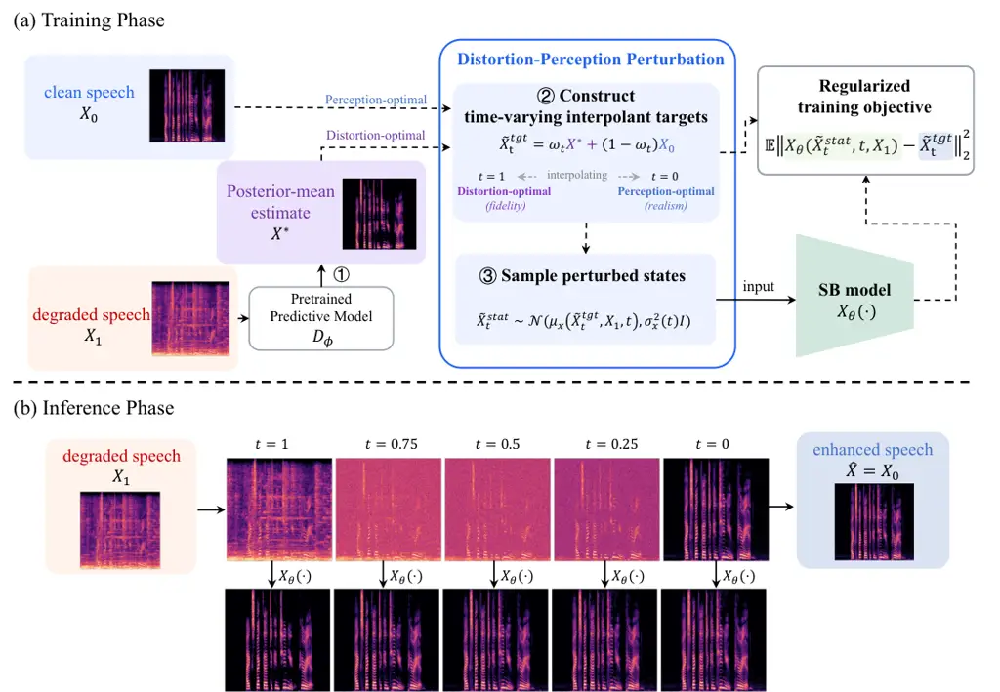
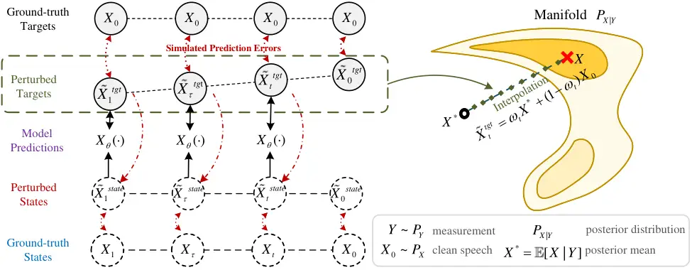
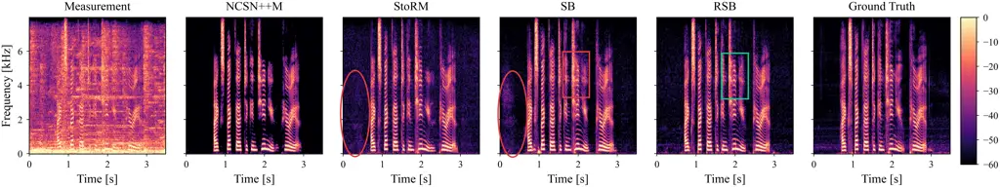

# Regularized Schrödinger Bridge via Distortion-Perception Perturbation for High-Fidelity Speech Enhancement

PubID: pubid: © 2026 IEEE. Personal use of this material is permitted.
Permission from IEEE must be obtained for all other uses, in any current
or future media, including reprinting/republishing this material for
advertising or promotional purposes, creating new collective works, for
resale or redistribution to servers or lists, or reuse of any
copyrighted component of this work in other works.

Qing
Yao [](https://orcid.org/0009-0001-2172-8004)
   Lijian Gao    Qirong
Mao [](https://orcid.org/0000-0002-0616-4431)
   Ming Dong
 [](https://orcid.org/0000-0001-8133-7809)
^(†)^(†)thanks: This work has been accepted for publication in the
IEEE/ACM Transactions on Audio, Speech, and Language Processing. This
work was supported in part by the National Natural Science Foundation of
China (Grant Nos. 62576155, 62506144, and 62176106), the Natural Science
Foundation of Jiangsu Province (Grant No. SH2025108), and the
Postgraduate Research & Practice Innovation Program of Jiangsu Province
(Grant No. KYCX25_4234). (The corresponding authors: Qirong Mao; Ming
Dong) Qing Yao, Lijian Gao and Qirong Mao are with the School of
Computer Science and Communication Engineering, Jiangsu University,
Zhenjiang, Jiangsu 212013, China, also with the Jiangsu Engineering
Research Center of Big Data Ubiquitous Perception and Intelligent
Agriculture Applications, Zhenjiang, Jiangsu 212013, China, and also
with the Provincial Key Laboratory of Computational Intelligence and New
Technologies in Low-Altitude Digital Agriculture, Zhenjiang, Jiangsu
212013, China. (email: \$qyao@stmail.ujs.edu.cn\$; \${ljgao,
mao_qr}@ujs.edu.cn\$) Ming Dong is with the Department of Computer
Science, Wayne State University, Detroit, MI 48202, USA. (email:
\$mdong@wayne.edu\$) Digital Object Identifier:
[10.1109/TASLPRO.2026.3717234](https://doi.org/10.1109/TASLPRO.2026.3717234).

###### Abstract

Speech enhancement (SE) requires high-fidelity reconstruction of clean
speech that preserves linguistic and paralinguistic cues while
maintaining high perceptual quality. Recently, Schrödinger Bridge (SB),
a family of diffusion-based generative models, has advanced SE by
bridging degraded and clean speech distributions in a principled
formulation, enabling higher-quality reconstructions with fewer sampling
steps. However, diffusion-based SE methods still face two challenges:
(1) the fidelity-realism tradeoff, where they often prioritize
perceptual realism encouraged by the learned speech prior, at the
expense of fidelity; and (2) the exposure bias issue, where iterative
multi-step sampling causes early-step prediction errors to accumulate
along the sampling trajectory and degrade enhanced speech quality. In
this paper, we analyze standard SB training and show that it induces a
systematic prediction drift, which biases the multi-step trajectory and
amplifies error accumulation. To address this, we propose Regularized
Schrödinger Bridge (RSB) for high-fidelity SE, a generative approach
that reconciles fidelity and realism while mitigating exposure bias. RSB
regularizes training with a Distortion-Perception Perturbation that
constructs time-varying targets by interpolating between clean speech
and posterior-mean estimates, and trains the network on perturbed
intermediate states to correct toward the ground truth progressively. By
simulating inference-time prediction errors, this perturbation mitigates
the training-inference mismatch and thereby alleviates exposure bias. It
also injects posterior-mean estimates as fidelity-preserving guidance,
thereby improving reconstruction fidelity. Experiments on the WSJ0
corpus and the VoiceBank+DEMAND dataset demonstrate that RSB improves
reconstruction fidelity over strong diffusion-based generative methods,
yielding a favorable fidelity-realism tradeoff and reducing exposure
bias.

###### Index Terms: 

Speech enhancement, Schrödinger bridge, diffusion models,
distortion-perception tradeoff, exposure bias.

## I Introduction

Speech enhancement (SE) is a crucial inverse problem in audio processing
that seeks to recover clean speech from degraded signals corrupted by
noise or reverberation. Fundamentally, perceptual realism and
reconstruction fidelity are two essential criteria for evaluating SE
approaches: realism concerns the perceived naturalness of the enhanced
speech, whereas fidelity reflects reconstruction accuracy. The enhanced
speech should sound natural while faithfully preserving fine-grained
linguistic content and paralinguistic attributes (e.g., timbre or
pitch). These requirements make SE particularly challenging because it
is inherently ill-posed, where multiple valid reconstructions correspond
to the same measurement. The main challenge is to select the desired
estimate from these candidate reconstructions. Consequently, existing
approaches can be broadly categorized into _predictive_ and *generative
methods* \[1\], each representing a distinct family of plausible
solutions in the solution space.

_Predictive_ methods \[2, 3, 4, 5\] typically learn a deterministic
mapping from degraded to target signals via end-to-end supervised
training \[6, 7\]. While such methods are effective in suppressing
background noise and achieving high speech fidelity, they often average
multiple plausible reconstructions, yielding overly smoothed outputs
that lose fine-grained details \[8, 1\]. In contrast, _generative_
methods aim to implicitly or explicitly model the underlying
distribution of clean speech to produce natural and perceptually
plausible estimates on the data manifold, but they may lead to higher
sample-level reconstruction errors and introduce artifacts such as
vocalizations and breathing \[8\]. Recent advancements in
diffusion-based generative modeling \[9, 10, 11, 12, 13\] provide SE
with a strong generative prior and enable high-quality reconstructions
through iterative stochastic sampling, thereby substantially elevating
the state of the art in generative SE \[14, 15, 16, 17\]. Despite
encouraging advances, diffusion-based SE methods still struggle to (1)
balance perceptual realism and reconstruction fidelity, and (2) mitigate
exposure bias in multi-step sampling.

First, diffusion-based SE methods often prioritize distributional
realism for perceptual quality, which can come at the expense of
reconstruction fidelity. This phenomenon is commonly formalized as the
*distortion-perception (DP) tradeoff* \[18, 19, 20, 21, 22\] in
ill-posed inverse problems such as SE. This tradeoff captures the
fundamental tension between two competing objectives, namely
_perception_ and _distortion_. Here, _perception_ measures the
distributional discrepancy between enhanced and clean speech, which
reflects perceptual realism. In contrast, _distortion_ denotes
point-wise reconstruction error relative to the clean speech rather than
perceived speech distortion, and is typically quantified by mean squared
error (MSE), which directly reflects speech fidelity. Theoretically,
since these two objectives cannot be simultaneously optimized \[19,
23\], the optimal tradeoffs lie on the Pareto frontier of the DP plane
(referred to as the DP-optimal frontier), consisting of solutions that
minimize distortion at a given level of perceptual quality. In practice,
diffusion-based SE methods can improve perceptual realism at the cost of
reconstruction fidelity, which increases point-wise distortion and
yields solutions that deviate from the DP-optimal frontier. Recently,
hybrid SE approaches \[24, 1, 25\] integrate predictive and generative
models into a pipeline, in which a diffusion model refines the
predictive estimate. While such designs improve this tradeoff in
practice, unreliable predictive estimates can substantially limit the
final reconstruction quality.

Second, the iterative sampling procedure of these methods at inference
time inevitably introduces the _exposure bias_ problem \[26, 27, 28,
29\]. This issue arises from a systematic mismatch between training and
inference. During training, the network is optimized to learn the
diffusion dynamics while being conditioned on ground-truth intermediate
states. During inference, however, it is conditioned on its own
previously generated samples instead. As a result, even small prediction
errors in the early steps can propagate along the sampling chain and
gradually accumulate, causing the actual sampling trajectory to deviate
markedly from the true trajectory \[26\]. One feasible approach to
mitigate this issue is to expose the model to simulated prediction
errors during training \[26\], thereby reducing the mismatch between
training and inference. By doing so, the network gradually learns to
recover from imperfect inputs with accumulated prediction errors during
inference, leading to improved robustness.

Recently, Schrödinger bridge (SB) \[30, 12\], an extension of
score-based diffusion models, has emerged as a promising generative SE
framework. By adopting optimal transport theory, SB learns the transport
between clean and degraded speech distributions, improving both quality
and sampling efficiency \[31\]. However, relative to predictive methods
that optimize point-wise error, SB still exhibits a noticeable gap in
reconstruction fidelity, as reflected by signal-fidelity metrics such as
SI-SDR \[32\]. In addition, SB remains susceptible to exposure bias, as
substantial error accumulation is observed in our experiments.

In this paper, we conduct a thorough examination of the standard SB
training objective \[31\] in the context of SE. Notably, to learn the
reverse bridge dynamics, a common approach is to train a data-prediction
network (referred to as the SB model throughout this paper) that
directly estimates the clean signal from the intermediate states. Since
multi-step sampling inevitably incurs prediction errors, we analyze the
inference-time behavior of the SB model via these prediction errors and
reveal that the standard objective induces a systematic prediction drift
along the sampling trajectory. Empirically, this drift moves samples
away from the DP-optimal frontier, improving perceptual quality but
increasing distortion. Moreover, because inference iteratively uses the
current model prediction to predict the next state, these errors can
feed back into subsequent inputs, enlarging the training-inference
mismatch. Such drift is not accounted for by the standard SB training.
Therefore, there is a need for a principled regularization that both
optimizes the DP balance and mitigates exposure bias during iterative
sampling.

To address the aforementioned limitations, we propose the _Regularized
Schrödinger Bridge (RSB)_, a generative SE method tailored for
high-fidelity SE, which integrates a regularized training strategy that
balances perceptual quality and reconstruction fidelity in enhanced
speech. Overall, RSB regularizes SB training with our proposed DP
Perturbation. It encourages the SB model to produce predictions that are
highly faithful to the degraded speech at early sampling steps, and then
gradually transitions toward a natural realization of clean speech at
later steps, ultimately yielding estimates with both strong signal
fidelity and high perceptual realism. At the same time, this regularized
training exposes the model to trajectory deviations during training,
mitigating the training-inference mismatch and thereby reducing exposure
bias.

Specifically, unlike prior perturbation-based training methods \[26,
29\], which inject additional Gaussian noise into training inputs to
improve robustness, our DP Perturbation jointly perturbs both the
training inputs and supervision targets to regularize the learned bridge
transport. We start from the original SB training targets (i.e., the
clean speech) and then reformulate them through a time-varying
interpolation between two principled endpoints: (i) the clean speech as
the perception-optimal reference, and (ii) an approximate posterior-mean
estimate as the distortion-optimal reference. By injecting this
posterior-mean estimate into the targets, RSB provides explicit
fidelity-preserving guidance that steers the reverse dynamics toward
low-distortion solutions while staying on the data manifold, thereby
improving reconstruction fidelity without sacrificing realism.
Importantly, we apply the same interpolation to construct perturbed
training inputs that simulate inference-time states with prediction
errors, reducing training-inference mismatch and improving robustness to
error propagation along the sampling trajectory.

Overall, the main contributions of this work are as follows:

- •
  We study the prediction behavior of SB models through inference-time
  prediction errors. We find a systematic prediction drift along the
  sampling trajectory, which connects the DP tradeoff with error
  accumulation from training-inference mismatch and provides the
  motivation for our regularized training design.
- •
  We propose a novel high-fidelity generative SE framework, RSB, which
  regularizes SB training via DP Perturbation. This perturbation jointly
  perturbs training targets and inputs through a time-varying
  interpolation between the clean speech and a posterior-mean estimate,
  thereby steering the sampling trajectory toward high-fidelity yet
  perceptually realistic solutions while alleviating exposure bias by
  reducing training-inference mismatch.
- •
  We validate the efficacy of RSB across challenging SE tasks, including
  denoising and dereverberation. Results show that RSB improves
  reconstruction fidelity over the state-of-the-art diffusion-based
  baselines, while maintaining strong perceptual quality and mitigating
  exposure bias in multi-step sampling.

The rest of the paper is organized as follows. The related work is
summarized in Section II. Section III details our proposed approach.
Section IV describes the experimental setup, and Section V shows the
evaluation results. Finally, the conclusion is drawn in Section VI.

## II Related Work

In this section, we review prior work most relevant to our study and
position our contribution with respect to the DP tradeoff, exposure
bias, and diffusion-based SE methods.

### II-A Distortion-Perception Tradeoff

In ill-posed inverse problems, the DP tradeoff \[18\] is a critical
phenomenon that has captured considerable attention and is fundamental
for evaluating methods that solve these problems. Specifically, these
methods must trade off between _distortion_ and _perception_, where
_distortion_ measures the average reconstruction error of point
estimates (e.g., by MSE) and thus reflects _fidelity_ to the target
data, while _perception_ quantifies the divergence between the learned
and true data distributions (e.g., by the Wasserstein-2 distance) and
therefore reflects the perceptual realism of estimates. In general,
lower distortion corresponds to reduced sampling stochasticity and
higher fidelity, whereas improved perception corresponds to higher
realism. The DP-optimal frontier consists of Pareto-optimal solutions
that achieve the minimum distortion among all reconstructions satisfying
a fixed constraint of perceptual realism. Inspired by the theoretical
analysis of \[18\], in imaging inverse problems such as image
super-resolution and image deblurring, one common practice \[18, 19, 20,
21, 22\] to approach this optimal solution involves first obtaining the
minimum-distortion estimate (typically the minimum MSE estimate) and
then transporting it to the target data distribution.

### II-B Exposure Bias Problem

Exposure bias \[26\] is a notable limitation of diffusion models that
stems from discrepancies between training (conditioned on ground-truth
data) and inference (conditioned on previously generated samples). As a
result, even slight prediction errors can accumulate over dozens or
hundreds of sampling steps, potentially causing the generated samples to
move away from the true data manifold \[26\]. In denoising diffusion
models, several training methods, such as input perturbation \[26\] and
scheduled sampling \[29\], explicitly simulate inference-time prediction
errors, thereby encouraging the network to recover from its own
mistakes. In addition, sampling methods such as output scaling \[28\]
and time-step shifting \[27\] attempt to mitigate exposure bias without
retraining by correcting accumulated prediction errors during the
sampling process. However, these techniques are tailored to Gaussian
noise-to-data diffusion formulations and are not directly applicable to
SB, which models a data-to-data transport process.

### II-C Diffusion-based Speech Enhancement

Among diffusion-based SE methods, CDiffuSE \[15\] is a time-domain
conditional diffusion model that starts from Gaussian noise and guides
the reverse process with the noisy mixture to reconstruct the clean
waveform. SGMSE+ \[17\] proposes a score-based diffusion model in the
complex spectrogram domain, which introduces a Stochastic Differential
Equation (SDE) to describe the diffusion process that transports from
noisy to clean speech. SGMSE+ can generate high-quality reconstructions
using only 30 steps \[17\], but it still suffers from high distortion
and generative artifact issues. To reduce potential artifacts, the
hybrid SE method StoRM \[1\] proposes to cascade a predictive model with
a diffusion model. This initial estimate from a predictive model is fed
to the diffusion model as a guide, effectively reducing the
computational burden and improving sampling quality. Recently, Jukic et
al. \[31\] introduced a tractable SB formulation for SE, delivering
improved perceptual realism while maintaining a moderate computational
cost. Recent studies \[33, 34\] incorporate Generative Adversarial
Networks (GANs) into the SB framework as auxiliary perceptual
supervision, using adversarial training to sharpen realistic spectral
details. However, the DP tradeoff and exposure bias of SB remain open
issues.



Fig. 1: Overview of Regularized Schrödinger Bridge (RSB) for
high-fidelity speech enhancement. (a) Training phase: Given degraded
speech $`X_{1}`$ and clean speech $`X_{0}`$, a distortion-optimal
reference $`X^{*}`$ (i.e., the posterior-mean estimate) is first
obtained using a pretrained predictive model $`D_{\phi}`$. RSB then
constructs time-varying interpolant targets
$`\tilde{X}_{t}^{\mathrm{tgt}}`$ by interpolating between the
distortion-optimal reference $`X^{*}`$ and the clean speech $`X_{0}`$,
and samples the corresponding perturbed intermediate states
$`\tilde{X}_{t}^{\mathrm{state}}`$. The SB model $`X_{\theta}(\cdot)`$
is trained to predict the perturbed targets from the perturbed states
via a regularized objective, encouraging fidelity-preserving predictions
at early stages and perceptually realistic predictions at later stages.
(b) Inference phase: At inference time, RSB performs standard
finite-step sampling, illustrating a smooth transition from
low-distortion to perceptually realistic outputs.

## III Regularized Schrödinger Bridge for High-Fidelity Speech Enhancement

This section presents RSB for high-fidelity SE, which is illustrated in
Fig. 1. We first detail the specific formulation of SB in the context of
SE, and then examine the behavior of the SB model to further analyze the
DP tradeoff and exposure bias issues in SB. Finally, we present DP
Perturbation in detail.

### III-A Preliminaries: Schrödinger Bridge for Speech Enhancement

In this paper, we formulate SE as an inverse problem of recovering clean
speech from measurements. The clean speech $`x`$ is a realization of a
random vector $`X`$ with prior distribution $`p_{X}`$. The measurement
$`y`$ (i.e., noisy or reverberant speech signal) is a realization of a
random vector $`Y`$. Given an observed measurement $`y`$, the goal of SE
is to draw an estimate $`\hat{x}`$ from the posterior distribution
$`p_{\hat{X}\mid Y}(\cdot\mid y)`$ such that $`\hat{x}`$ faithfully
reconstructs the ground-truth $`x`$.

#### III-A1 Formulation of Schrödinger Bridge

SB \[35\] can be formulated as an entropy-regularized optimal transport
problem between two distributions. In this paper, we formulate SB as a
principled generative SE framework to find the optimal transport between
the clean speech distribution $`p_{X}`$ and the measurement distribution
$`p_{Y}`$. To align SB with diffusion-based generative models \[36\], SB
can be equivalently defined by a pair of forward-backward SDEs.

We assume access to training data $`\mathcal{D}=\{(x,y)\}`$ drawn from
the joint distribution $`p_{X,Y}`$, where $`(x,y)`$ denotes a training
pair in the dataset. In the SB formulation, we treat each training pair
$`(x,y)`$ as a coupled boundary condition. Let $`X_{t}`$ be the
intermediate state of the SB process at $`t\in[0,1]`$ with endpoints
$`X_{0}=x`$ and $`X_{1}=y`$, and SB admits the pair of SDEs as follows:

```math
\begin{split}dX_{t}&=[\mathbf{f}+g^{2}(t)\nabla{\log{\Psi_{t}}}]dt+g(t)d\mathbf{W},\\
dX_{t}&=[\mathbf{f}-g^{2}(t)\nabla{\log{\hat{\Psi}_{t}}}]dt+g(t)d\overline{\mathbf{W}},\end{split} \tag{1}
```

where $`\mathbf{f}`$ and $`g`$ denote the drift and diffusion
coefficients, respectively. $`\mathbf{W}`$ and $`\overline{\mathbf{W}}`$
are Wiener processes, and $`\log{\Psi_{t}}`$ and
$`\log{\hat{\Psi}_{t}}`$ are the time-varying potentials whose gradients
relate to the optimal transport path.

Generally, solving SB is intractable. However, closed-form solutions
exist under the assumption of Gaussian boundary conditions \[36, 31\].
Under this assumption, for the given pair of endpoints
$`(X_{0},X_{1})`$, $`\Psi_{t}`$ and $`\hat{\Psi}_{t}`$ admit analytical
forms:

```math
\begin{split}\hat{\Psi}_{t}=\mathcal{N}(\alpha_{t}X_{0},\alpha_{t}^{2}\sigma_{t}^{2}\mathbf{I}),\Psi_{t}=\mathcal{N}(\bar{\alpha}_{t}X_{1},\alpha_{t}^{2}\bar{\sigma}_{t}^{2}\mathbf{I}),\end{split} \tag{2}
```

where $`\alpha_{t}=e^{\int_{0}^{t}f(\tau)d\tau}`$,
$`\sigma_{t}^{2}=\int_{0}^{t}\frac{g^{2}(\tau)}{\alpha_{\tau}^{2}}d\tau`$,
$`\bar{\alpha}_{t}=\frac{\alpha_{t}}{\alpha_{1}}`$, and
$`\bar{\sigma}_{t}^{2}=\sigma_{1}^{2}-\sigma_{t}^{2}`$ are determined by
the choice of $`\mathbf{f}`$ and $`g`$. Notably, two noise schedules are
derived in the tractable SB formulation, termed Variance Preserving (VP)
and Variance Exploding (VE). These schedules are distinct from the
common ones in standard SDEs \[9, 10\].

Therefore, the marginal distribution of the intermediate state $`X_{t}`$
follows a Gaussian form, expressed as

```math
p_{t}(X_{t}|X_{0},X_{1})=\mathcal{N}(\mu_{x}(X_{0},X_{1},t),\sigma_{x}^{2}(t)\mathbf{I}), \tag{3}
```

where we have the mean
$`\mu_{x}(X_{0},X_{1},t)=(\alpha_{t}\bar{\sigma}_{t}^{2}X_{0}+\bar{\alpha}_{t}\sigma_{t}^{2}X_{1})/\sigma_{1}^{2}`$
and the variance
$`\sigma_{x}^{2}(t)={\alpha_{t}^{2}\bar{\sigma}_{t}^{2}\sigma_{t}^{2}}/{\sigma_{1}^{2}}`$.

#### III-A2 Training Objective

Following the tractable SB, models are trained to approximate the score
$`\nabla{\log{\hat{\Psi}_{t}}}`$ to learn the reverse-time SB dynamics.
This score is algebraically related to the clean signal $`X_{0}`$
through the potential $`\hat{\Psi}_{t}`$ in Eq. (2). Therefore, the
widely adopted training objective is the data prediction loss \[31\]
(also called “x-prediction”), which aims to optimize the SB model with
network parameters $`\theta`$ to predict $`X_{0}`$ given intermediate
state $`X_{t}`$ at any $`t`$ as,

```math
\min_{\theta}\mathbb{E}_{X_{t}\sim p_{t},t}[\|X_{\theta}(X_{t},t,X_{1})-X_{0}\|^{2}_{2}], \tag{4}
```

where $`X_{1}`$ serves as a condition of the network.

#### III-A3 Inference and Sampling

During inference, our objective is to recover the clean speech
$`\hat{x}`$ by generating samples from the reverse-time backward SDE
defined in Eq. (1). Specifically, the continuous-time interval $`[0,1]`$
is discretized into $`N`$ steps, denoted by
$`t_{0},t_{1},\ldots,t_{N}`$, where $`t_{0}=1`$ and $`t_{N}=0`$. The
sampling process proceeds iteratively from $`t_{0}`$ to $`t_{N}`$. Given
the previously sampled state $`\tilde{X}_{t_{k}}`$ at step $`t_{k}`$
(with $`k=0,1,\ldots,N-1`$), the next state $`\tilde{X}_{t_{k+1}}`$ at
$`t_{k+1}<t_{k}`$ can be obtained by the derived SDE sampler \[31\] as,

```math
\displaystyle\tilde{X}_{t_{k+1}}={} \displaystyle\frac{\alpha_{t_{k+1}}\sigma^{2}_{t_{k+1}}}{\alpha_{t_{k}}\sigma^{2}_{t_{k}}}\,\tilde{X}_{t_{k}} \tag{5}
```

```math
\displaystyle+\alpha_{t_{k+1}}\left(1-\frac{\sigma^{2}_{t_{k+1}}}{\sigma^{2}_{t_{k}}}\right)X_{\theta}(\tilde{X}_{t_{k}},t_{k},X_{1})
```

```math
\displaystyle+\alpha_{t_{k+1}}\,\sigma_{t_{k+1}}\,\sqrt{1-\frac{\sigma^{2}_{t_{k+1}}}{\sigma^{2}_{t_{k}}}}\,\mathbf{z}
```

where $`\mathbf{z}\sim\mathcal{N}(0,\mathbf{I})`$. Alternatively, the
equivalent Ordinary Differential Equation (ODE) formulation of Eq. (1)
allows for sampling using an ODE sampler \[31\].

After iterative sampling, the final estimated clean speech $`\hat{X}`$,
which represents the solution to SE, is defined as the state reached at
the terminal time $`t_{N}=0`$. Crucially, at the terminal time
$`t_{N}=0`$, we always have $`\alpha_{t_{N}}=1`$ and
$`\sigma_{t_{N}}=0`$. Consequently, both the first and the third terms
in Eq. (5) are eliminated. Then, the final sampled state
$`\tilde{X}_{t_{N}}`$ is precisely the model prediction at the last
sampling step, i.e.,

```math
\hat{X}=\tilde{X}_{t_{N}}=X_{\theta}(\tilde{X}_{t_{N-1}},t_{N-1},X_{1}). \tag{6}
```

### III-B Limitations of Schrödinger Bridge in Speech Enhancement

Based on the aforementioned definition of SB, we further analyze the DP
tradeoff and the exposure bias of SB in SE, and then motivate our DP
Perturbation.

Fig. 2: Prediction errors (a) and evaluation metrics (b) during 50-step
sampling on the WSJ0+WHAM dataset. The sampling process is uniformly
discretized from $`1`$ to $`0`$ over 50 steps. (a): The prediction
errors at each timestep are computed using the mean squared error (MSE),
$`\mathbb{E}\bigl[\lVert X_{\theta}(\cdot)-X_{0}\rVert_{2}^{2}\bigr]`$,
between the model prediction and the ground truth. (b): PESQ measures
perceived speech quality, while SI-SDR measures point-wise distortion.

#### III-B1 Theoretical and Empirical Analysis of Prediction Errors

We begin by theoretically examining the behavior of the SB model during
inference, particularly in the context of the data-prediction training
objective in Eq. (4). The SB model $`X_{\theta}`$ predicts the clean
signal $`X_{0}`$ from an intermediate state $`X_{t}`$ (conditioned on
$`X_{1}`$), and this prediction is algebraically related to the
reverse-time score $`\nabla\log\hat{\Psi}_{t}`$ through Eq. (2).
Therefore, any discrepancy between $`X_{\theta}`$ and the ground-truth
target directly perturbs the reverse-time score and, consequently, the
drift term of the reverse SDE, steering the sampling direction during
multi-step inference.

Specifically, at $`t=1`$, the training objective reduces to a purely
discriminative regression loss that, given $`X_{1}`$, minimizes the MSE
between the model prediction $`X_{\theta}(\cdot)`$ and the clean target
$`X_{0}`$. Consequently, during sampling, due to inevitable prediction
errors, the inference-time prediction $`X_{\theta}(X_{t},X_{1},t)`$
around $`t=1`$ is often biased toward the minimum-MSE solution, namely
the posterior-mean estimate $`X^{*}=\mathbb{E}(X_{0}\mid X_{1})`$, which
is inherently _distortion-oriented_. Finally, as $`t\to 0`$, the states
$`X_{t}`$ approach $`X_{0}`$ and increasingly concentrate near the
clean-speech manifold. In this regime, the stochasticity in $`X_{t}`$ is
dominated by a small residual Gaussian perturbation around $`X_{0}`$, so
$`X_{t}`$ lies in a narrow neighborhood of the manifold. Hence, the
objective mainly enforces local consistency near the data manifold. As a
result, the SB model becomes more effective at removing these small
perturbations while preserving the distributional statistics of clean
speech, which leads to more _perception-oriented_ predictions near the
end of sampling.

For intermediate time $`t\in(0,1)`$, predictions become more
perceptually realistic as $`t`$ decreases, yet this gain in perceptual
quality is often accompanied by increased point-wise distortion and
reduced reconstruction fidelity. Model predictions $`X_{\theta}`$ can
thus evolve smoothly from _distortion-oriented_ to _perception-oriented_
estimates, forming a systematic drift trajectory. This smooth evolution
introduces an error-induced drift into the sampling trajectory,
revealing a practical yet fundamental bias in the sampling direction
during SB inference that is not explicitly considered or optimized by
the original SB training objective.

To empirically confirm our theoretical analysis, we trained an SB model
using the WSJ0+WHAM dataset and examined its 50-step sampling
trajectory. Fig. 2(a) reports the per-step prediction error measured by
MSE
$`\mathbb{E}\!\left[\,\|X_{\theta}(\cdot)-X_{0}\|_{2}^{2}\,\right]`$,
which directly reflects the distortion of the model predictions relative
to the clean target. The error is low at early steps and gradually
accumulates as sampling proceeds, suggesting increasing distortion that
peaks near the end of the trajectory. In Fig. 2 (b), as sampling
progresses, the perceptual quality of the model predictions improves as
indicated by PESQ, while distortion increases as reflected by a
decreasing SI-SDR. This suggests a shift in the model predictions from
pursuing point-estimate accuracy to focusing on perceptual quality.
These empirical trends validate our theoretical finding that the model
prediction $`X_{\theta}`$ evolves from a distortion-oriented estimate at
$`t=1`$ toward a perception-oriented sample as $`t\to 0`$, yielding
improved perception at the cost of higher distortion. The detailed
experimental setup is shown in Sec. IV.

Fig. 3: Illustration of the Distortion-Perception (DP) tradeoff. A lower
perceptual index means better perceptual quality, where lower distortion
means higher fidelity. The optimal solutions lie on the DP-optimal
frontier. $`\blacktriangle`$ and $`\blacksquare`$ respectively represent
the model predictions of SB and RSB at the final step, which is also the
final predicted clean speech.

#### III-B2 DP Tradeoff of SB

Building on the above theoretical and empirical evidence, we observe a
systematic drift in the model predictions $`X_{\theta}(\cdot)`$ as $`t`$
decreases. Since $`X_{\theta}`$ is algebraically related to the
reverse-time score and thus directly determines the reverse drift, this
drift propagates into and biases the multi-step inference dynamics.
Empirically, the resulting predictions form a curve on the DP plane,
which is labeled as “$`X_{\theta}`$ of SB” in Fig. 3. Along this curve,
improvements in perceptual quality are often accompanied by increased
distortion, indicating that the trajectory moves away from the
DP-optimal frontier. As a result, the final solution of SB is also not
DP-optimal. Accordingly, our goal is to move the final solution closer
to the DP-optimal frontier, thereby improving the empirical
realism–fidelity tradeoff.

There are two reasons for this sub-optimality. First, the standard SB
objective is primarily designed to learn the reverse-time dynamics by
matching bridge marginals, rather than to minimize a global
discriminative loss that directly penalizes reconstruction error and
steers the model toward the minimum-distortion estimate for a given
measurement. In other words, such an objective is tradeoff-agnostic and
provides no explicit mechanism to reconcile distortion and perception.
Second, bridge dynamics implied by the exact potentials are approximated
by the SB model, leading to prediction errors. With finite model
capacity, the learned dynamics inevitably deviate from the true
dynamics, and these errors further compound through iterative sampling,
driving the sampling trajectory to drift away and ultimately degrading
the overall evaluation of distortion and perception.

#### III-B3 Exposure Bias Problem of SB

Beyond the DP tradeoff, SB also suffers from exposure bias, i.e., the
mismatch between the model inputs seen during training and those
encountered during multi-step inference. During training, the SB model
is fed the real intermediate states $`X_{t}`$, which are sampled from
the closed-form marginal $`p_{t}(X_{t}\mid X_{0},X_{1})`$, so the
training inputs follow the ground-truth bridge marginals. During
inference, however, each state $`\tilde{X}_{t}`$ is sampled using the
model prediction $`X_{\theta}(\tilde{X}_{\tau},\tau,X_{1})`$ from the
previous step $`t=\tau`$ via Eq. (5). Since the SB model is never
exposed to the states corrupted by prediction errors during training, it
fails to generalize to states encountered during iterative sampling,
which deviate from the training marginals.

Consequently, the inference-time input distribution deviates from the
training distribution due to the inevitable prediction errors. This
mismatch results in a compounding error effect: Each predicted state
deviates from its corresponding ground-truth state, and the resulting
error is fed back into subsequent inputs. These errors propagate through
the reverse-time dynamics, causing the sampling trajectory to drift away
from the ground-truth trajectory. Such error accumulation might
ultimately result in a degradation in both perceptual quality and
reconstruction fidelity. This is empirically confirmed by results shown
in Fig. 2. However, the standard training objective does not account for
this mismatch.

In summary, building on the above analysis, we recognize that the
standard SB objective lacks an explicit mechanism to control the DP
balance in practice, and it does not account for the train–inference
mismatch that leads to error accumulation. On the one hand, the
step-wise evolution of model predictions induces a systematic drift,
causing the inference trajectory to deviate from the DP-optimal frontier
on the DP plane and yielding solutions that are often sub-optimal in
terms of the tradeoff. On the other hand, multi-step inference
repeatedly conditions on the model’s own imperfect predictions, which
progressively enlarges the distribution shift between training and
inference and exacerbates exposure bias.



Fig. 4: Illustration of DP Perturbation with an example of a complex
posterior $`p(X\mid Y)`$. DP Perturbation defines time-varying training
targets $`\tilde{X}^{\mathrm{tgt}}_{t}`$ by interpolating between the
clean target $`X_{0}`$ and the posterior-mean reference $`X^{*}`$, and
uses the same interpolation to construct matched perturbed intermediate
states $`\tilde{X}^{\mathrm{state}}_{t}`$. The posterior-mean reference
provides fidelity-preserving guidance by biasing the early-stage
transport toward $`X^{*}`$, so the trajectory first reaches a proper
distortion level before progressively shifting toward the clean
endpoint. This joint perturbation reduces the training-inference
mismatch, thereby improving multi-step sampling quality.

### III-C Distortion-Perception Perturbation

Motivated by our findings, we propose the Distortion-Perception (DP)
Perturbation, which is illustrated in Fig. 4, to regularize SB training
and address the above two issues.

#### III-C1 Motivation

Recall that, under multi-step inference, the SB model exhibits a
patterned time-dependent drift from distortion-oriented to
perception-oriented estimates in its predictions. At early stages (large
$`t`$), the model favors distortion-oriented estimates and often shifts
toward the posterior-mean estimate $`X^{*}`$. As $`t`$ decreases along
the trajectory, the predictions gradually move toward a clean-speech
sample on the data manifold and aim to recover $`X_{0}`$.

This behavior is problematic because SB sampling proceeds iteratively.
Each estimated clean signal is immediately used to predict the next
intermediate state, which feeds the drift into subsequent inputs and
compounds step-wise errors over the trajectory. Explicitly simulating
such drifts during training exposes the model to its own potential
inference-time errors, enabling it to learn robust dynamics that ensure
a stable transport toward the clean speech manifold.

##### Simulating Prediction Drift via Interpolation

To simulate this inference-time drift during training, we introduce a
time-varying interpolation that captures how the model prediction shifts
from distortion-oriented to perception-oriented behavior along the
trajectory. Inspired by \[19\], under the Wasserstein-2 perception
measure, DP-optimal estimators under different perception constraints
can be obtained along an interpolation path between a distortion-optimal
estimator and a perception-optimal estimator. Each point on the path
corresponds to a DP-optimal sample with respect to a specific perception
level.

Specifically, we align the interpolation endpoint at $`t=1`$ with the
distortion-optimal reference $`X^{*}`$ and the endpoint at $`t=0`$ with
the ground-truth clean signal $`X_{0}`$, so that the simulated drift is
encouraged to follow the DP-optimal interpolation path. Concretely, we
take $`X^{*}=\mathbb{E}[X_{0}\mid X_{1}]`$ as the distortion-optimal
reference, since under the MSE distortion criterion the posterior mean
minimizes the expected reconstruction error and is therefore
distortion-optimal, and approximate it in practice with a predictive
model trained using the MSE loss. This choice is consistent with the
empirical behavior shown in Fig. 2: as sampling proceeds from $`t=1`$ to
$`t=0`$, the perceptual quality of the model prediction progressively
improves, indicating a shift toward higher perceptual realism along the
reverse trajectory. Thus, the time-varying interpolation from $`X^{*}`$
to $`X_{0}`$ provides a dynamic approximation to the DP-optimal
interpolation path from the distortion-optimal to the perception-optimal
reference.

From the perspective of the DP tradeoff, the perturbed targets provide
an explicit fidelity-preserving guide through the distortion-optimal
reference $`X^{*}`$ at early stages, while gradually shifting back to
the clean endpoint as $`t\to 0`$. This time-dependent supervision
encourages the SB model to learn predictions that better balance
fidelity and perceptual quality, and drives the learned reverse-time
dynamics toward the DP-optimal frontier. From the perspective of
exposure bias, training on the perturbed intermediate states exposes the
model to error-affected inputs that arise when predictions are reused to
advance the sampling trajectory. The model is therefore trained to
correct the induced bias, which reduces training–inference mismatch and
limits error accumulation.

##### Relation to Prior Perturbation-Based Methods

Prior perturbation-based training methods \[26, 29\] address the
training-inference mismatch of denoising diffusion models by treating
prediction errors as Gaussian noise and injecting Gaussian perturbations
into intermediate model inputs. These approaches essentially perform
robustness training on inputs to increase tolerance to accumulated
errors, but they do not alter the underlying diffusion dynamics. In
contrast, our DP Perturbation jointly perturbs both the training inputs
and the supervision targets. It not only exposes the SB model to
inference-like prediction drifts, but also reshapes the transport
behavior learned by the SB model. Specifically, DP Perturbation defines
a family of time-varying targets that smoothly interpolates between a
distortion-optimal endpoint and the perception-optimal endpoint, and
pairs each target with matched perturbed intermediate inputs sampled
from the induced bridge marginals. As a result, the SB model is trained
along a time-varying path motivated by the DP-optimal interpolation
principle, while the sampling trajectory is guided to favor the
distortion-optimal endpoint at early steps to reduce reconstruction
error and then progressively shift toward the perception-optimal
endpoint at later steps to recover perceptual realism. By doing so, DP
Perturbation actively regularizes the bridge dynamics, enabling a simple
yet effective training strategy to mitigate exposure bias and improve
the empirical DP tradeoff in a unified manner. This is fundamentally
different from prior approaches that passively inject Gaussian noise for
robustness.

Furthermore, our perturbation connects to *label smoothing
regularization* \[37\]. In our work, $`X^{*}`$ and $`X_{0}`$ can be
interpreted as two regression labels that represent distortion-optimal
and perception-optimal references. DP Perturbation replaces the original
hard label with a time-dependent soft label obtained by smoothly
interpolating between these two endpoints, which yields a controlled
supervision signal. Hence, DP Perturbation can be viewed as a training
regularization.

#### III-C2 Joint Perturbation

Based on previous analysis, we use the clean sample $`X_{0}`$ as the
perception-optimal endpoint and the posterior-mean estimate $`X^{*}`$ as
the distortion-optimal endpoint, defining the interpolation form of our
training targets $`\tilde{X}_{t}^{\mathrm{tgt}}`$ as,

```math
\tilde{X}_{t}^{\mathrm{tgt}}=\omega_{t}X^{*}+(1-\omega_{t})X_{0}, \tag{7}
```

where $`\omega_{t}`$ is a predefined interpolation schedule that
satisfies $`\omega_{0}=0`$ and $`\omega_{1}=1`$. For simplicity, we
adopt $`\omega_{t}=t^{2}`$ and keep it fixed across all noise schedules
and datasets in our experiments. This quadratic schedule grows slowly
for small $`t`$, so that the targets remain close to $`X_{0}`$ as
$`t\to 0`$. The resulting deviation of the perturbed target from the
clean endpoint is
$`\|\tilde{X}_{t}^{\mathrm{tgt}}-X_{0}\|_{2}^{2}=\omega_{t}^{2}\|X^{*}-X_{0}\|_{2}^{2}`$.
This quantity specifies the designed deviation of the supervision target
from the clean endpoint, not the empirical prediction-error curve of
vanilla SB in Fig. 2. As shown in Fig. 4, larger target deviations are
introduced at larger $`t`$ to expose the model to early-stage
distortion-oriented drift, while smaller $`t`$ keeps the supervision
close to the clean endpoint and encourages progressive correction toward
the clean-speech distribution. Additionally, we utilize an auxiliary
predictive task to produce $`X^{*}`$. A predictive model $`D_{\phi}`$ is
trained with the MSE training objective. After training, the prediction
of $`D_{\phi}`$ given $`Y`$ is considered to approximate $`X^{*}`$,
i.e., $`X^{*}\approx D_{\phi}(Y)`$. Notably, $`D_{\phi}`$ is a
training-only auxiliary network to produce the distortion-optimal
reference for DP perturbation.

Following Eq. (3), we can obtain the perturbed intermediate states with
simulated prediction errors as model inputs,

```math
\tilde{X}_{t}^{\mathrm{state}}=\mu_{x}(\tilde{X}_{t}^{\mathrm{tgt}},X_{1},t)+\sigma_{x}(t)\mathbf{z},\quad\mathbf{z}\sim\mathcal{N}(0,\mathbf{I}). \tag{8}
```

#### III-C3 Regularizing Training with Perturbation

To regularize model training, we incorporate our perturbations into the
training objective. Specifically, we replace the ground-truth training
target $`X_{0}`$ and the input state $`X_{t}`$ in Eq. (4) with our
perturbed counterparts, $`\tilde{X}_{t}^{\mathrm{tgt}}`$(Eq. (7)) and
$`\tilde{X}_{t}^{\mathrm{state}}`$(Eq. (8)), respectively. Hence, our
RSB can be formalized with the following regularized training objective,

```math
\min_{\theta}\mathbb{E}_{\tilde{X}_{t}^{\mathrm{state}},t}[\|X_{\theta}(\tilde{X}_{t}^{\mathrm{state}},t,X_{1})-\tilde{X}_{t}^{\mathrm{tgt}}\|^{2}_{2}]. \tag{9}
```

Algorithm 1 details the training process, and RSB adopts the same SDE
sampler (Eq. (5)) as the vanilla SB.

When the regularized objective is optimized, RSB is trained on
intermediate states with simulated inference-time prediction errors,
thereby reducing the training–inference mismatch and mitigating exposure
bias. Furthermore, by applying the same time-varying interpolation to
both the training targets in Eq. (9) and the corresponding input states,
RSB provides structured supervision via DP Perturbation that steers the
predictions toward distortion-optimal estimates at noisy stages and
gradually shifts them back toward the clean endpoint as $`t\to 0`$. This
yields more stable reverse-time dynamics under imperfect intermediate
states, limiting error accumulation throughout multi-step sampling.
Moreover, the resulting predictions are encouraged to steer toward the
DP-optimal frontier, approaching the clean endpoint with high perceptual
quality and minimal distortion, so the terminal sample is less likely to
drift away from the low-distortion region while still matching the
clean-speech manifold. Overall, RSB can produce more faithful and
perceptually plausible reconstructions of clean speech.

0:  dataset $`\mathcal{D}=\{(x,y)\}`$, $`D_{\phi}`$, $`X_{\theta}`$

 Stage 1: Predictive model training

  repeat

   Draw $`(x,y)\sim\mathcal{D}`$

   Update $`\phi`$ by minimizing $`\|D_{\phi}(y)-x\|_{2}^{2}`$

  until $`D_{\phi}`$ converges

 Stage 2: Offline generation of distortion-optimal references

  Initialize $`\mathcal{D}^{*}\leftarrow\emptyset`$

  for each $`(x,y)\in\mathcal{D}`$ do

   $`x^{*}\leftarrow D_{\phi}(y)`$ and store $`(x,y,x^{*})`$ in
$`\mathcal{D}^{*}`$

  end for

 Stage 3: RSB training

  repeat

   Draw $`(x,y,x^{*})\sim\mathcal{D}^{*}`$ and
$`t\sim\mathcal{U}([t_{\epsilon},1])`$

   Obtain perturbed target $`\tilde{x}_{t}^{\mathrm{tgt}}`$ via Eq. (7)

   Sample perturbed state $`\tilde{x}_{t}^{\mathrm{state}}`$ from
Eq. (8)

   Compute $`X_{\theta}(\tilde{x}_{t}^{\mathrm{state}},t,y)`$ and update
$`\theta`$ using Eq. (9)

  until $`X_{\theta}`$ converges

Algorithm 1 Training procedure of RSB

## IV Experimental Setup

In this section, we present datasets, evaluation metrics, listening test
setup, implementation details, as well as predictive and generative SE
methods used for comparison.

### IV-A Datasets

To compare with prior work on a standard benchmark, we report denoising
results on the widely adopted VoiceBank+DEMAND dataset \[38\]. We also
build large-scale synthetic SE datasets based on the Wall Street Journal
(WSJ0) corpus \[39\] for evaluating the performance of denoising and
dereverberation, which provides clean speech at scale and aligned
ground-truth transcripts. All audio recordings are resampled to 16 kHz.
Each dataset is described below in detail.

##### VoiceBank+DEMAND

This is a publicly available benchmark for speech denoising. Each clean
utterance from VoiceBank \[40\] is mixed with one of ten noise
recordings, including eight DEMAND recordings \[41\] and two synthetic
noises. Mixtures are generated at 15, 10, 5, and 0 dB SNR for training
and at 17.5, 12.5, 7.5, and 2.5 dB SNR for testing. The training set
contains 10 802 utterances ($`\approx`$ 9 hours) from 28 speakers, the
validation set 770 utterances, and the test set 824 utterances from 2
unseen speakers.

##### WSJ0+WHAM

We construct this synthetic speech denoising dataset using clean
utterances from the widely used WSJ0 corpus and noise recordings from
the WHAM noise corpus \[42\]. Each clean utterance is mixed with a
randomly selected WHAM noise segment at a signal-to-noise ratio (SNR)
uniformly drawn from -6 dB to 14 dB. The training set uses the si_tr_s
subset of WSJ0, containing 25 550 mixtures ($`\approx`$ 50 h), while the
validation and test sets correspond to si_et_05 and si_dt_05, containing
1 302 and 2 412 mixtures, respectively. Crucially, the ground-truth
transcripts of the test set are preserved to facilitate the performance
evaluation of speech recognition.

##### WSJ0+REVERB

This dataset is created for speech dereverberation with the same data
split as WSJ0+WHAM, following the data-generation setting of
StoRM \[1\]. The degraded speech is generated by convolving the clean
utterances from WSJ0 with synthetic room-impulse responses simulated
using the image-source method. Specifically, the target reverberation
time $`T_{60}`$ is uniformly sampled from $`[0.4,1.0]`$ s, and the room
dimensions (length, width, height) are sampled from
$`[5,15]\times[5,15]\times[2,6]`$ m. The source and microphone positions
are independently sampled with a minimum distance of $`1`$ m from the
room boundaries. The resulting dataset has an average
direct-to-reverberant ratio (DRR) of around $`-9`$ dB and an average
measured $`T_{60}`$ of about $`0.9`$ s. The corresponding anechoic
target is generated from a dry room with the same geometry and a fixed
absorption coefficient of $`0.99`$.

### IV-B Evaluation Metrics

To evaluate the DP tradeoff, we report intrusive metrics and
non-intrusive metrics. Intrusive metrics are reference-based, as they
require clean references when evaluating enhanced speech. Non-intrusive
metrics are reference-free and estimate perceptual quality directly from
enhanced speech without access to clean references.

##### Intrusive Metrics

We first report signal-fidelity metrics, including the Scale-Invariant
Signal-to-Distortion Ratio (SI-SDR) \[32\], Scale-Invariant
Signal-to-Interference Ratio (SI-SIR), and Scale-Invariant
Signal-to-Artifact Ratio (SI-SAR), which measure overall distortion,
interference, and algorithmic artifacts, respectively. These metrics
directly reflect signal fidelity to the clean reference and correspond
to the distortion dimension of the DP tradeoff. We also report intrusive
metrics for perceptual quality and intelligibility, including the
Perceptual Evaluation of Speech Quality (PESQ) \[43\], the composite
objective quality metrics \[44\] (CSIG for signal distortion, CBAK for
background intrusiveness, and COVL for overall quality), and Extended
Short-Time Objective Intelligibility (ESTOI) \[45\]. Although these
metrics are designed to approximate human perception or intelligibility,
their reference-based formulations evaluate perceptual or
intelligibility-related similarity relative to a specific clean
reference and may therefore not fully capture reference-free perceptual
naturalness.

##### Non-Intrusive Metrics

We report DNSMOS P.808 (referred to as DNSMOS) \[46\], UTMOS \[47\], and
the overall score of SIGMOS (referred to as SIGMOS) \[48\]. These
metrics estimate perceptual quality directly from enhanced speech,
providing complementary evidence of speech naturalness. DNSMOS was
trained on ratings collected in the DNS Challenge and is closely tied to
SE conditions involving residual noise and noise-suppression
artifacts \[46\]. In contrast, UTMOS and SIGMOS were trained for MOS
prediction from broader listener rating corpora, and therefore better
reflect human preference \[47, 48\].

Meanwhile, we validate the linguistic preservation of RSB via a
downstream automatic speech recognition (ASR) evaluation. For WSJ0+WHAM
and WSJ0+REVERB, the enhanced utterances produced by each method are
transcribed using *Whisper base.en* \[49\] (an English-only speech
recognition model with approximately 74M parameters). We compute
utterance-level word error rates (WERs) with the Python library jiwer
and report the mean WER over all test utterances.

### IV-C Listening Test Setup

To evaluate the subjective performance of RSB, we conducted a
medium-scale subjective listening test using webMUSHRA \[50\], with 12
participants. Ten samples were selected from the WSJ0+WHAM and
WSJ0+REVERB datasets for perceptual audio quality evaluation. In each
trial of the test, participants were presented with a reference audio
and several audio samples in random order, and asked to assign ratings
between 1 and 100 to measure the perceptual audio quality of each
sample.

| Schedule           | VE                                 | VP                                                                  |
| ------------------ | ---------------------------------- | ------------------------------------------------------------------- |
| $`f(t)`$           | $`0`$                              | $`-\dfrac{1}{2}\big[\beta_{0}+(\beta_{1}-\beta_{0})t\big]`$         |
| $`g^{2}(t)`$       | $`ck^{2t}`$                        | $`c\big[\beta_{0}+(\beta_{1}-\beta_{0})t\big]`$                     |
| $`\alpha_{t}`$     | $`1`$                              | $`e^{-\frac{1}{2}(\beta_{0}t+\frac{\beta_{1}-\beta_{0}}{2}t^{2})}`$ |
| $`\sigma_{t}^{2}`$ | $`\dfrac{c\,(k^{2t}-1)}{2\log k}`$ | $`c(e^{\beta_{0}t+\frac{\beta_{1}-\beta_{0}}{2}t^{2}}-1)`$          |

TABLE I: Noise schedules for both SB and RSB.

### IV-D Implementation Details

#### IV-D1 Data Representation

The complex spectrogram features are extracted using the short-time
Fourier transform (STFT) \[1\]. We use a square-root Hann window with a
window length of 510 and a hop length of 128, and apply a square-root
magnitude warping operation as in \[17\]. During training, the original
utterances are randomly truncated into sequences of 256 STFT frames
($`\approx`$ $`2~s`$) and then normalized by the maximum absolute value
of the corresponding measurement signal.

#### IV-D2 Noise Schedule

Detailed schedules are shown in Table I. Table I reports the concrete VP
and VE schedule instantiations used in our experiments under the
tractable SB parameterization introduced in Eq. (2). Unless stated
otherwise, we use the VE schedule as the default for both SB and RSB,
with $`c=0.40`$ and $`k=2.6`$ following \[31\]. The VP schedule is also
considered in this paper, using $`\beta_{0}=0.01`$, $`\beta_{1}=20`$,
and $`c=0.3`$, following \[31\].

#### IV-D3 Training Details

The SB baseline and RSB are implemented by us following the tractable SB
formulation \[31\]. We adopt NCSN++M as the default architecture for
$`D_{\phi}`$ because using the same NCSN++M architecture for
$`D_{\phi}`$ and the SB model $`X_{\theta}`$ matches their model
capacity and aligns the prediction behavior of $`D_{\phi}`$ with the SB
dynamics. The resulting distortion-optimal references are therefore
better suited to simulating inference-time prediction drift. This
architectural choice also follows the practice adopted in StoRM \[1\].
NCSN++M has approximately 25.2 M parameters \[17, 1\].

The loss in Eq. (9) is computed on the complex spectrogram, and we
additionally include a time-domain reconstruction loss following \[31\].
All models are trained on a single NVIDIA A100 GPU. The minimum time
$`t_{\epsilon}`$ during training is set to $`10^{-4}`$.

During training, the batch size is set to 16, and we use the Adam
optimizer \[51\] with a learning rate of $`10^{-4}`$. In addition, we
train our models for up to 1000 epochs with early stopping based on the
average SI-SDR computed on 50 validation utterances, with a patience of
50 epochs. To stabilize training and improve generalization, we maintain
an exponential moving average (EMA) of the model parameters $`\theta`$
with a decay factor of 0.999, and select the EMA checkpoint that
achieves the best PESQ on the validation set as the final
checkpoint \[31\].

The overall training procedure is shown in Algorithm 1. First,
$`D_{\phi}`$ is trained with the MSE objective. Second, after
$`D_{\phi}`$ has been fully trained, we run it once offline on the
training set to compute the distortion-optimal references $`X^{*}`$
required by DP Perturbation, and save them to disk. Third, the SB model
$`X_{\theta}`$ is trained by loading the cached references directly from
disk. On WSJ0+WHAM and WSJ0+REVERB, training each of $`D_{\phi}`$ and
$`X_{\theta}`$ takes approximately $`40`$ hours. On VoiceBank+DEMAND,
each takes approximately $`10`$ hours due to its smaller training set.
Because $`D_{\phi}`$ is not used at inference and the distortion-optimal
references are cached before RSB training, RSB incurs no additional
online evaluations of $`D_{\phi}`$ during its training iterations. The
source code and audio samples are available online¹¹ 1
[https://yorch233.github.io/RSB/](https://yorch233.github.io/RSB/).

### IV-E Compared Methods

We compare RSB with both advanced predictive and diffusion-based
generative methods. On VoiceBank+DEMAND, we expand the evaluation to
include purely predictive NCSN++M and several advanced predictive SE
methods, including TF-GridNet \[2\], MetricGAN+ \[3\], SEMamba \[4\],
and MP-SENet \[5\]. We select this public and widely adopted benchmark
because most of these methods have reported results and released
pretrained checkpoints on it, enabling a fair and reproducible
comparison on the same test set. NCSN++M is the default architecture of
$`D_{\phi}`$ used to construct $`X^{*}`$ in our framework, and its
reported results represent the performance of this distortion-optimal
reference. We also evaluate diffusion-based generative baselines,
including CDiffuSE \[15\], SGMSE+ \[17\], StoRM \[1\], and SB \[31\]. On
the larger and more challenging WSJ0+WHAM and WSJ0+REVERB datasets, we
retain the original comparison set for an in-depth evaluation of
diffusion-based generative methods across denoising and dereverberation.

The SB baseline and RSB are based on our own implementation, and use the
same SDE sampler described in Eq. (5). For the other methods, on
VoiceBank+DEMAND, we use officially released checkpoints whenever
available. Since TF-GridNet does not provide a directly applicable
checkpoint for this benchmark, we train an efficient publicly available
third-party implementation²² 2
[https://github.com/philgzl/brever](https://github.com/philgzl/brever)
on VoiceBank+DEMAND. On WSJ0+WHAM and WSJ0+REVERB, we retrain the
evaluated baselines using the official code released with the
corresponding papers. For inference, all diffusion-based models use 50
sampling steps. Since SGMSE+ and StoRM employ a predictor-corrector
sampler \[17, 1\], this setting corresponds to 100 network calls for
these two methods. It is also worth noting that StoRM, SB, and RSB all
adopt NCSN++M as the default model architecture.

To determine whether the performance differences between SB and RSB are
statistically significant, we conduct paired $`t`$-tests on
utterance-level metric scores by pairing the outputs of the two methods
for each test utterance. We adopt a significance threshold of
$`p<0.005`$ for all comparisons.

## V Experimental Results and Discussion

### V-A Quantitative Comparison

| Method           | Type | PESQ$`\uparrow`$  | ESTOI$`\uparrow`$ | CSIG$`\uparrow`$       | CBAK$`\uparrow`$       | COVL$`\uparrow`$  | SI-SDR$`\uparrow`$    | SI-SIR$`\uparrow`$    | SI-SAR$`\uparrow`$    |
| ---------------- | ---- | ----------------- | ----------------- | ---------------------- | ---------------------- | ----------------- | --------------------- | --------------------- | --------------------- |
| unprocessed      | –    | 1.97 $`\pm`$ 0.75 | 0.79 $`\pm`$ 0.15 | 3.34 $`\pm`$ 0.87      | 2.44 $`\pm`$ 0.66      | 2.63 $`\pm`$ 0.83 | 8.5 $`\pm`$ 5.6       | 8.5 $`\pm`$ 5.6       | \-                    |
| NCSN++M          | P    | 2.82 $`\pm`$ 0.72 | 0.87 $`\pm`$ 0.10 | 3.69 $`\pm`$ 0.89      | 3.43 $`\pm`$ 0.58      | 3.24 $`\pm`$ 0.83 | 19.6 $`\pm`$ 3.6      | 32.6 $`\pm`$ 7.5      | 20.1 $`\pm`$ 3.6      |
| TF-GridNet \[2\] | P    | 2.86 $`\pm`$ 0.58 | 0.87 $`\pm`$ 0.09 | 4.27 $`\pm`$ 0.54      | 3.49 $`\pm`$ 0.49      | 3.58 $`\pm`$ 0.58 | 19.2 $`\pm`$ 3.6      | 27.8 $`\pm`$ 5.1      | 20.4 $`\pm`$ 3.7      |
| MetricGAN+ \[3\] | P    | 3.13 $`\pm`$ 0.55 | 0.83 $`\pm`$ 0.11 | 4.12 $`\pm`$ 0.68      | 3.16 $`\pm`$ 0.45      | 3.62 $`\pm`$ 0.65 | 8.5 $`\pm`$ 3.8       | 26.6 $`\pm`$ 4.2      | 8.6 $`\pm`$ 3.8       |
| SEMamba \[4\]    | P    | 3.54 $`\pm`$ 0.61 | 0.89 $`\pm`$ 0.08 | 4.70 $`\pm`$ 0.45      | 3.87 $`\pm`$ 0.48      | 4.20 $`\pm`$ 0.59 | 19.7 $`\pm`$ 3.2      | 30.4 $`\pm`$ 5.7      | 20.5 $`\pm`$ 3.3      |
| MP-SENet \[5\]   | P    | 3.61 $`\pm`$ 0.54 | 0.89 $`\pm`$ 0.08 | 4.73 $`\pm`$ 0.39      | 3.89 $`\pm`$ 0.46      | 4.24 $`\pm`$ 0.52 | 19.4 $`\pm`$ 3.5      | 29.4 $`\pm`$ 4.5      | 20.2 $`\pm`$ 3.8      |
| CDiffuSE \[15\]  | G    | 2.52 $`\pm`$ 0.61 | 0.80 $`\pm`$ 0.11 | 3.73 $`\pm`$ 0.64      | 2.93 $`\pm`$ 0.48      | 3.10 $`\pm`$ 0.64 | 13.5 $`\pm`$ 2.4      | 19.2 $`\pm`$ 4.9      | 15.5 $`\pm`$ 1.5      |
| SGMSE+ \[17\]    | G    | 2.92 $`\pm`$ 0.64 | 0.86 $`\pm`$ 0.10 | 4.13 $`\pm`$ 0.67      | 3.38 $`\pm`$ 0.50      | 3.53 $`\pm`$ 0.67 | 17.5 $`\pm`$ 3.2      | 29.3 $`\pm`$ 5.7      | 18.1 $`\pm`$ 3.2      |
| StoRM \[1\]      | G    | 2.93 $`\pm`$ 0.66 | 0.87 $`\pm`$ 0.10 | 4.18 $`\pm`$ 0.66      | 3.47 $`\pm`$ 0.52      | 3.56 $`\pm`$ 0.68 | 18.6 $`\pm`$ 3.4      | 30.9 $`\pm`$ 6.8      | 19.1 $`\pm`$ 3.4      |
| SB \[31\]        | G    | 3.04 $`\pm`$ 0.69 | 0.87 $`\pm`$ 0.09 | 4.06 $`\pm`$ 0.71      | 3.45 $`\pm`$ 0.53      | 3.56 $`\pm`$ 0.72 | 17.8 $`\pm`$ 3.4      | 30.3 $`\pm`$ 7.4      | 18.5 $`\pm`$ 3.3      |
| RSB (ours)       | G    | 3.04 $`\pm`$ 0.67 | 0.87 $`\pm`$ 0.09 | 4.09 $`\pm`$ 0.70^(\*) | 3.50 $`\pm`$ 0.53^(\*) | 3.57 $`\pm`$ 0.70 | 18.8 $`\pm`$ 3.5^(\*) | 31.2 $`\pm`$ 6.6^(\*) | 19.4 $`\pm`$ 3.5^(\*) |

Note: ^(\*) marks the metric scores of RSB, which are significantly
better than those of SB under a paired $`t`$-test ($`p<0.005`$).

TABLE II: Denoising performance on the VoiceBank+DEMAND dataset. Results
are reported as mean $`\pm`$ std. For each metric, the best result
within each method group is highlighted in bold, and the second-best is
underlined.

|                  |      |                    |                   |                    |
| ---------------- | ---- | ------------------ | ----------------- | ------------------ |
| Method           | Type | DNSMOS$`\uparrow`$ | UTMOS$`\uparrow`$ | SIGMOS$`\uparrow`$ |
| unprocessed      | –    | 3.05 $`\pm`$ 0.39  | 2.84 $`\pm`$ 0.61 | 2.56 $`\pm`$ 0.50  |
| NCSN++M          | P    | 3.56 $`\pm`$ 0.30  | 3.42 $`\pm`$ 0.45 | 3.44 $`\pm`$ 0.33  |
| TF-GridNet \[2\] | P    | 3.50 $`\pm`$ 0.29  | 3.48 $`\pm`$ 0.42 | 3.29 $`\pm`$ 0.31  |
| MetricGAN+ \[3\] | P    | 3.37 $`\pm`$ 0.30  | 3.05 $`\pm`$ 0.51 | 3.22 $`\pm`$ 0.37  |
| SEMamba \[4\]    | P    | 3.57 $`\pm`$ 0.29  | 3.52 $`\pm`$ 0.43 | 3.38 $`\pm`$ 0.29  |
| MP-SENet \[5\]   | P    | 3.57 $`\pm`$ 0.28  | 3.52 $`\pm`$ 0.42 | 3.40 $`\pm`$ 0.29  |
| CDiffuSE \[15\]  | G    | 3.13 $`\pm`$ 0.34  | 3.08 $`\pm`$ 0.50 | 2.87 $`\pm`$ 0.40  |
| SGMSE+ \[17\]    | G    | 3.53 $`\pm`$ 0.29  | 3.68 $`\pm`$ 0.41 | 3.39 $`\pm`$ 0.30  |
| StoRM \[1\]      | G    | 3.57 $`\pm`$ 0.32  | 3.54 $`\pm`$ 0.41 | 3.37 $`\pm`$ 0.31  |
| SB \[31\]        | G    | 3.57 $`\pm`$ 0.28  | 3.61 $`\pm`$ 0.42 | 3.51 $`\pm`$ 0.31  |
| RSB (ours)       | G    | 3.56 $`\pm`$ 0.29  | 3.64 $`\pm`$ 0.41 | 3.51 $`\pm`$ 0.32  |

TABLE III: Non-intrusive perceptual quality metric scores on the
VoiceBank+DEMAND dataset. Results are reported as mean $`\pm`$ std. For
each metric, the best result within each method group is highlighted in
bold, and the second-best is underlined.

##### Denoising Performance on VoiceBank+DEMAND

We first evaluate RSB on the widely used VoiceBank+DEMAND benchmark,
comparing it against advanced predictive and diffusion-based SE methods.
Table II reports intrusive metrics for quality, intelligibility, and
signal fidelity, while Table III provides complementary non-intrusive
perceptual quality metrics. In these tables, P and G denote predictive
and generative methods, respectively.

Among the predictive SE methods, MP-SENet achieves the highest PESQ and
composite quality scores and ties SEMamba for the highest ESTOI, while
SEMamba attains the highest SI-SDR and SI-SAR and NCSN++M attains the
highest SI-SIR. These results reflect the strong reference-aligned
reconstruction and high signal fidelity achieved by supervised
discriminative training. MetricGAN+, SEMamba, and MP-SENet further
incorporate metric-oriented optimization guided by PESQ, which can
directly favor performance on this metric \[3, 4, 5\]. However, this
advantage does not consistently extend to the non-intrusive
metrics \[52\]. DNSMOS assigns comparable scores to the strongest
predictive and generative methods, whereas SGMSE+, RSB, and SB achieve
higher UTMOS scores than all predictive baselines, and SB and RSB
achieve the highest SIGMOS scores. This contrast indicates that the
predictive methods provide stronger reference-aligned fidelity but
slightly lower estimated speech naturalness than the strongest
generative methods.

Among the generative approaches, RSB exhibits a more favorable
fidelity-realism balance than both the score-based diffusion SE method
SGMSE+ \[17\] and the hybrid SE method StoRM \[1\]. Its higher SI-SDR,
together with improvements in PESQ and SIGMOS over SGMSE+, indicates
that the gain in reconstruction fidelity is not obtained at the expense
of perceptual speech quality. Similarly, its advantages over StoRM in
SI-SDR, PESQ, UTMOS, and SIGMOS suggest that a strong fidelity-realism
balance can be achieved without relying on an auxiliary predictive model
in a cascaded framework.

Compared with SB, RSB improves SI-SDR by 1.0 dB, SI-SIR by 0.9 dB, and
SI-SAR by 0.9 dB, indicating enhanced speech reconstruction,
interference suppression, and artifact control, respectively. Together
with the gains in CSIG and CBAK, all five improvements are statistically
significant. The CSIG and CBAK results further support improved
estimated speech quality and reduced background-noise intrusiveness. By
contrast, PESQ and ESTOI remain unchanged at the reported precision,
while the non-intrusive metrics remain comparable, showing that the
fidelity improvements are achieved without an evident degradation in
perceptual quality. The SI-SDR gap to SEMamba is consequently reduced
from 1.9 dB for SB to 0.9 dB for RSB. These results provide
statistically supported evidence that the proposed RSB improves the
speech fidelity of the standard SB formulation while preserving its
perceptual quality.

|                               |                        |                        |                        |                        |                        |                    |                       |                        |                       |
| ----------------------------- | ---------------------- | ---------------------- | ---------------------- | ---------------------- | ---------------------- | ------------------ | --------------------- | ---------------------- | --------------------- |
| Method                        | PESQ$`\uparrow`$       | ESTOI$`\uparrow`$      | CSIG$`\uparrow`$       | CBAK$`\uparrow`$       | COVL$`\uparrow`$       | DNSMOS$`\uparrow`$ | SI-SDR$`\uparrow`$    | SI-SIR$`\uparrow`$     | SI-SAR$`\uparrow`$    |
| WSJ0+WHAM (Denoising)         |                        |                        |                        |                        |                        |                    |                       |                        |                       |
| unprocessed                   | 1.32 $`\pm`$ 0.30      | 0.55 $`\pm`$ 0.17      | 2.78 $`\pm`$ 0.67      | 1.91 $`\pm`$ 0.50      | 1.99 $`\pm`$ 0.49      | 2.71 $`\pm`$ 0.30  | 3.9 $`\pm`$ 5.8       | 3.9 $`\pm`$ 5.8        | –                     |
| NCSN++M                       | 2.18 $`\pm`$ 0.62      | 0.78 $`\pm`$ 0.14      | 3.05 $`\pm`$ 0.80      | 2.97 $`\pm`$ 0.56      | 2.58 $`\pm`$ 0.74      | 3.77 $`\pm`$ 0.35  | 14.7 $`\pm`$ 4.2      | 29.5 $`\pm`$ 4.4       | 14.9 $`\pm`$ 4.3      |
| SGMSE+ \[17\]                 | 2.14 $`\pm`$ 0.72      | 0.71 $`\pm`$ 0.17      | 3.71 $`\pm`$ 0.74      | 2.73 $`\pm`$ 0.67      | 2.90 $`\pm`$ 0.75      | 3.44 $`\pm`$ 0.39  | 10.3 $`\pm`$ 5.9      | 21.7 $`\pm`$ 9.1       | 11.1 $`\pm`$ 5.3      |
| StoRM \[1\]                   | 2.53 $`\pm`$ 0.60      | 0.76 $`\pm`$ 0.14      | 4.06 $`\pm`$ 0.60      | 3.11 $`\pm`$ 0.51      | 3.29 $`\pm`$ 0.61      | 3.65 $`\pm`$ 0.38  | 13.4 $`\pm`$ 4.1      | 28.2 $`\pm`$ 4.5       | 13.6 $`\pm`$ 4.1      |
| SB \[31\]                     | 2.54 $`\pm`$ 0.62      | 0.77 $`\pm`$ 0.14      | 3.93 $`\pm`$ 0.62      | 3.12 $`\pm`$ 0.53      | 3.22 $`\pm`$ 0.62      | 3.74 $`\pm`$ 0.39  | 13.2 $`\pm`$ 4.3      | 29.2 $`\pm`$ 4.6       | 13.4 $`\pm`$ 4.4      |
| RSB (ours)                    | 2.61 $`\pm`$ 0.60^(\*) | 0.77 $`\pm`$ 0.14^(\*) | 4.00 $`\pm`$ 0.59^(\*) | 3.18 $`\pm`$ 0.51^(\*) | 3.30 $`\pm`$ 0.60^(\*) | 3.73 $`\pm`$ 0.39  | 13.7 $`\pm`$ 4.1^(\*) | 29.5 $`\pm`$ 4.6^(\*)  | 13.8 $`\pm`$ 4.2^(\*) |
| WSJ0+REVERB (Dereverberation) |                        |                        |                        |                        |                        |                    |                       |                        |                       |
| unprocessed                   | 1.38 $`\pm`$ 0.26      | 0.42 $`\pm`$ 0.13      | 2.93 $`\pm`$ 0.41      | 1.72 $`\pm`$ 0.28      | 2.09 $`\pm`$ 0.35      | 2.88 $`\pm`$ 0.27  | -9.1 $`\pm`$ 6.6      | -9.1 $`\pm`$ 6.6       | –                     |
| NCSN++M                       | 1.96 $`\pm`$ 0.47      | 0.76 $`\pm`$ 0.11      | 3.29 $`\pm`$ 0.53      | 2.55 $`\pm`$ 0.39      | 2.59 $`\pm`$ 0.51      | 3.52 $`\pm`$ 0.37  | 4.8 $`\pm`$ 4.4       | 23.6 $`\pm`$ 9.5       | 5.0 $`\pm`$ 4.4       |
| SGMSE+ \[17\]                 | 2.22 $`\pm`$ 0.52      | 0.71 $`\pm`$ 0.13      | 3.93 $`\pm`$ 0.43      | 2.52 $`\pm`$ 0.44      | 3.06 $`\pm`$ 0.49      | 3.56 $`\pm`$ 0.44  | -3.2 $`\pm`$ 8.7      | 5.7 $`\pm`$ 14.1       | 1.4 $`\pm`$ 4.3       |
| StoRM \[1\]                   | 2.52 $`\pm`$ 0.49      | 0.75 $`\pm`$ 0.12      | 4.19 $`\pm`$ 0.37      | 2.86 $`\pm`$ 0.36      | 3.36 $`\pm`$ 0.44      | 3.63 $`\pm`$ 0.39  | 4.4 $`\pm`$ 4.5       | 25.8 $`\pm`$ 10.1      | 4.6 $`\pm`$ 4.1       |
| SB \[31\]                     | 2.58 $`\pm`$ 0.49      | 0.78 $`\pm`$ 0.11      | 4.18 $`\pm`$ 0.39      | 2.92 $`\pm`$ 0.37      | 3.38 $`\pm`$ 0.45      | 3.71 $`\pm`$ 0.39  | 4.6 $`\pm`$ 4.7       | 25.1 $`\pm`$ 10.4      | 4.7 $`\pm`$ 4.4       |
| RSB (ours)                    | 2.59 $`\pm`$ 0.49      | 0.79 $`\pm`$ 0.11^(\*) | 4.18 $`\pm`$ 0.39      | 2.94 $`\pm`$ 0.38^(\*) | 3.38 $`\pm`$ 0.45      | 3.71 $`\pm`$ 0.39  | 5.2 $`\pm`$ 4.5^(\*)  | 26.0 $`\pm`$ 10.1^(\*) | 5.3 $`\pm`$ 4.3^(\*)  |

Note: ^(\*) marks the metric scores of RSB, which are significantly
better than those of SB under a paired $`t`$-test ($`p<0.005`$).

TABLE IV: Performance Comparison on the WSJ0+WHAM and WSJ0+REVERB
datasets. Results are reported as mean $`\pm`$ std. For each metric, the
best result is highlighted in bold, and the second-best is underlined.

##### Denoising Performance on WSJ0+WHAM

To further evaluate the effectiveness of our proposed method in speech
denoising, we conduct experiments on the WSJ0+WHAM dataset to compare
RSB with predictive NCSN++M and advanced generative methods. As shown in
Table IV, RSB obtains the best or second-best scores across most
perception-oriented metrics and achieves the best distortion performance
among all diffusion-based methods. Although NCSN++M maintains a slight
advantage in DNSMOS and achieves the highest SI-SDR, this comes at the
cost of lower perceptual quality (e.g., a PESQ score 0.43 lower than
that of RSB). StoRM, with its hybrid framework, outperforms SGMSE+, but
performs comparably to SB on WSJ0+WHAM. Notably, compared with SB, RSB
achieves significant performance gains in PESQ, ESTOI, CSIG, CBAK, COVL,
SI-SDR, SI-SIR, and SI-SAR, while DNSMOS remains comparable. The
simultaneous SI-SIR and SI-SAR gains over SB further indicate stronger
suppression of residual interference without increasing enhancement
artifacts.

##### Dereverberation Performance on WSJ0+REVERB

We assess the robustness of RSB in reverberant environments and compare
its dereverberation performance with baselines on the WSJ0+REVERB
dataset in Table IV. RSB achieves the best or second-best scores across
all perceptual quality metrics and the best performance on all
signal-fidelity metrics. Compared with SB, RSB significantly improves
ESTOI, CBAK, SI-SDR, SI-SIR, and SI-SAR, while maintaining comparable
PESQ, CSIG, COVL, and DNSMOS. RSB also numerically surpasses the
predictive NCSN++M baseline on all three signal-fidelity metrics. These
results extend the favorable fidelity-realism balance observed for
additive denoising to a distinct convolutional degradation characterized
by temporally extended room reflections.



(a) WSJ0+WHAM
  
(b) WSJ0+REVERB

Fig. 5: Visualization of unprocessed and enhanced utterances. (a): The
measurement speech from the WSJ0+WHAM dataset is generated with additive
noise at $`\mathrm{SNR}=-5.9`$ dB. (b): The measurement speech from the
WSJ0+REVERB dataset has a measured reverberation time of
$`T_{60}=1.85`$ s.

### V-B Qualitative Comparison

To complement the quantitative results, we present spectrogram
visualizations of two test utterances from WSJ0+WHAM and WSJ0+REVERB in
Fig. 5. This qualitative analysis helps interpret how different methods
shape harmonic structures and residual artifacts. In summary, NCSN++M
produces an overly-suppressed spectrogram with reduced high-frequency
content and less distinct harmonic structures, which may affect speech
clarity and perceived quality. StoRM and SB show noticeable residual
background components, whereas RSB yields a more faithful reconstruction
of harmonic patterns and improves spectral fidelity over SB.

### V-C Ablation Study

| Strategy   | Sampler | PESQ$`\uparrow`$ | CSIG$`\uparrow`$ | CBAK$`\uparrow`$ | COVL$`\uparrow`$ | SI-SDR$`\uparrow`$ |
| ---------- | ------- | ---------------- | ---------------- | ---------------- | ---------------- | ------------------ |
| No         | SDE     | 3.04             | 4.06             | 3.45             | 3.56             | 17.8               |
|            | ODE     | 2.68             | 3.39             | 3.12             | 3.04             | 14.7               |
| Input-only | SDE     | 2.98             | 4.02             | 3.44             | 3.50             | 18.1               |
|            | ODE     | 2.93             | 3.68             | 3.34             | 3.31             | 16.8               |
| Joint      | SDE     | 3.04             | 4.09             | 3.50             | 3.57             | 18.8               |
|            | ODE     | 3.01             | 3.82             | 3.41             | 3.43             | 17.1               |

TABLE V: Denoising Performance on the VoiceBank+DEMAND dataset using
different perturbation strategies. The three strategies are reported
under both SDE and ODE samplers.

We conduct ablation studies on the VoiceBank+DEMAND dataset to examine
the role of joint perturbation in DP Perturbation and validate the
consistent effectiveness of DP Perturbation across various noise
schedules.

##### Perturbation Strategy

We consider three training configurations for comparison. “No” denotes
vanilla SB without perturbation, “Input-only” perturbs only the
intermediate states fed to the SB model, and “Joint” applies the
perturbation consistently to both inputs and targets.

As shown in Table V, considering both samplers, “Joint” achieves the
best overall performance, confirming the advantage of aligning perturbed
inputs with matched perturbed targets. ODE sampling generally leads to
lower scores than SDE sampling, since the deterministic trajectory
removes the stochastic correction in the SDE sampler and becomes more
sensitive to accumulated prediction errors. For “No”, this drop is more
pronounced because the vanilla SB model is not exposed to error-affected
intermediate states during training. “Input-only” alleviates this
degradation by perturbing inputs, but the unchanged clean targets still
introduce a supervision mismatch and slightly degrade
perception-oriented metrics. In contrast, “Joint” consistently improves
almost all metrics, and maintains the best ODE performance among the
three strategies. Overall, this ablation validates the design choice of
joint perturbation as a fundamental component of DP Perturbation, rather
than a standalone robustness technique.

| Schedule | Method | PESQ$`\uparrow`$ | CSIG$`\uparrow`$ | CBAK$`\uparrow`$ | COVL$`\uparrow`$ | SI-SDR$`\uparrow`$ |
| -------- | ------ | ---------------- | ---------------- | ---------------- | ---------------- | ------------------ |
| VE       | SB     | 3.04             | 4.06             | 3.45             | 3.56             | 17.8               |
|          | RSB    | 3.04             | 4.09             | 3.50             | 3.57             | 18.8               |
| VP       | SB     | 2.94             | 4.07             | 3.40             | 3.50             | 17.8               |
|          | RSB    | 2.99             | 4.11             | 3.46             | 3.55             | 18.4               |

TABLE VI: Denoising performance of RSB on the VoiceBank+DEMAND dataset
under VE and VP noise schedules.

##### Noise Schedule

We further investigate the performance of RSB using VE and VP schedules,
and Table VI reports the denoising performance under different
schedules: (1) VE: RSB matches PESQ and improves the remaining metrics.
Although PESQ remains the same as that of SB, RSB improves signal
fidelity, as evidenced by a 1.0 dB increase in SI-SDR, while
simultaneously achieving the highest perceptual scores for CSIG, CBAK,
and COVL. (2) VP: RSB exhibits superior performance compared to its SB
counterpart, achieving an SI-SDR of 18.4 dB, which is a 0.6 dB
improvement over that of SB. The intrusive metrics for perceptual
quality are also consistently higher for RSB.

Overall, RSB delivers robust improvements under both VE and VP
schedules, with particularly pronounced gains in SI-SDR. Notably, the VE
schedule achieves the best overall performance and is hence adopted as
the default.

### V-D Listening Test Results

Beyond the above objective evaluation, subjective evaluation is also
essential to assess perceptual quality. We conduct a MUSHRA listening
test and present the subjective audio quality ratings for predictive
NCSN++M and several generative methods as boxplots in Fig. 6. RSB
achieves the highest subjective score, outperforming the baselines
NCSN++M, SB, and StoRM. In addition to the improved mean, RSB also
exhibits a higher median and a more concentrated interquartile range,
indicating more consistent perceptual quality across utterances and
listeners. Notably, RSB substantially reduces the subjective-quality gap
to the clean reference, indicating that its enhanced outputs are
perceived as more similar to clean recordings.

Fig. 6: Results of the MUSHRA listening test. In the boxplots, the mean
is denoted by
($`\mathop{\raisebox{-0.88263pt}{$\hbox to5.6pt{\vbox to8.4pt{\pgfpicture\makeatletter\hbox{\hskip 0.21527pt\lower-1.44235pt\hbox to0.0pt{\lxSVG@begingroup@{\_scopebegin=1} \lxSVG@begingroup@{stroke=#000000} \lxSVG@begingroup@{fill=#000000} \lxSVG@setlinewidth{\the\pgflinewidth}\lxSVG@begingroup@{stroke-width=0.4pt} \lx@inpgf@ignorespaces\nullfont\hbox to0.0pt{\lxSVG@begingroup@{\_scopebegin=1} {\lx@inpgf@ignorespaces}\lx@inpgf@ignorespaces{\lx@inpgf@ignorespaces}\lx@inpgf@ignorespaces{{\lx@inpgf@ignorespaces}}\lxSVG@setlinewidth{\the\pgflinewidth}\lxSVG@begingroup@{stroke-width=0.43056pt} \lx@inpgf@ignorespaces\lxSVG@roundjoin\lxSVG@begingroup@{stroke-linejoin=round} \lx@inpgf@ignorespaces{}{{}}{}
{}{}
{}{}
{}{}
{}{}
{\lx@inpgf@ignorespaces}\lxSVG@begingroup@{\_scopebegin=1} \lxSVG@begingroup@{fill=#000000} {}\lxSVG@fillstroke\lxSVG@drawpath@unclipped{M 0 3.81 L 3.57 9.32 L 7.15 3.81 L 3.57 -1.7 L 0 3.81 Z}{} \lx@inpgf@ignorespaces
\lxSVG@closescope
\lxSVG@closescope {\lx@inpgf@ignorespaces}{\lx@inpgf@ignorespaces}{\lx@inpgf@ignorespaces}\hss}\lxSVG@discardpath\lxSVG@closescope \hss}}\lxSVG@closescope\endpgfpicture}}$}}`$),
while the median is marked by ($`\boldsymbol{-}`$). The box spans the
interquartile range, spanning from the 25^(th) to the 75^(th)
percentile. The whiskers depict the maximum and minimum values,
excluding any outliers.

### V-E Performance in Downstream ASR Task

Fig. 7: Word Error Rate (WER) comparison on the downstream ASR task. On
each dataset, all utterances are transcribed via Whisper, and the
reported WER is the mean across all utterances.

As RSB is tailored for high-fidelity SE, we further verify its
effectiveness in preserving linguistic content by evaluating downstream
ASR performance. Specifically, for WSJ0+WHAM and WSJ0+REVERB, we
transcribe the enhanced utterances from all methods using the same
Whisper model and report the WER. As illustrated in Fig. 7, on
WSJ0+WHAM, NCSN++M achieves the lowest WER of $`12.3\%`$, which is
consistent with the strong denoising performance of the
distortion-optimal estimate as reflected by the signal-fidelity metrics
in Table IV. RSB obtains the best WER among diffusion-based generative
models at $`14.1\%`$, suggesting that DP Perturbation helps preserve the
fidelity of the final generated speech. On WSJ0+REVERB, RSB achieves the
lowest WER of $`8.9\%`$. This result is consistent with reduced temporal
smearing and residual room effects, while the qualitative visualization
in Fig. 5 further indicates that RSB restores sharp harmonic structures
and clear spectral envelopes. The results on the two datasets indicate
the effectiveness of RSB in preserving linguistic content while
suppressing degradation.

### V-F Evaluating the Distortion-Perception Tradeoff

The DP tradeoff, also referred to as the fidelity-realism tradeoff, is a
fundamental challenge in SE. We evaluate its empirical manifestation
using PESQ as an intrusive measure of perceptual quality and SI-SDR as a
measure of signal fidelity. We conduct two complementary experiments to
investigate the tradeoff. First, we vary the number of sampling steps
and report the resulting DP performance. Second, we compare several
strategies designed to improve the DP tradeoff by injecting the
predictive estimate into the SB framework, including our proposed DP
Perturbation.

Fig. 8: Denoising performance on the WSJ0+WHAM dataset as a function of
the number of sampling steps.

##### Number of Sampling Steps

In Fig. 8, we report the speech denoising performance of SB and RSB
under different numbers of sampling steps on the WSJ0+WHAM dataset. PESQ
rises sharply in early steps and quickly saturates, indicating fast
convergence in perceptual quality, while SI-SDR gradually decreases as
perceptual quality increases, reflecting the tradeoff between fidelity
and realism. Notably, RSB consistently achieves higher PESQ and better
preserves SI-SDR across all steps, with a markedly slower degradation.
This demonstrates that while perceptual quality improves at the expense
of reconstruction accuracy, RSB attains high perceptual quality earlier
while maintaining distortion performance, thereby achieving a more
favorable DP tradeoff than SB.

| Method | PESQ$`\uparrow`$ | CSIG$`\uparrow`$ | CBAK$`\uparrow`$ | COVL$`\uparrow`$ | SI-SDR$`\uparrow`$ |
| ------ | ---------------- | ---------------- | ---------------- | ---------------- | ------------------ |
| M1     | 3.04             | 4.06             | 3.45             | 3.56             | 17.8               |
| M2     | 3.02             | 4.05             | 3.45             | 3.54             | 18.0               |
| M3     | 2.96             | 4.03             | 3.40             | 3.50             | 17.7               |
| M4     | 2.95             | 4.01             | 3.40             | 3.48             | 17.8               |
| M5     | 3.04             | 4.09             | 3.50             | 3.57             | 18.8               |

TABLE VII: Denoising Performance on the VoiceBank+DEMAND dataset using
different DP tradeoff strategies.

##### Tradeoff Strategies

Table VII compares different strategies for improving the DP tradeoff on
the VoiceBank+DEMAND dataset. The vanilla SB (M1) achieves strong
perceptual quality and serves as the baseline for other variants
(M2–M5). M2 uses the predictive estimate as the starting point of SB
sampling, improving distortion performance. M3 utilizes the predictive
estimate as the conditioning of SB, whereas M4 considers it both as the
starting point and conditioning, adopting a strategy similar to that of
StoRM \[1\]. The results show that M3 and M4 underperform M2 in both
distortion and perception quality. This indicates that the predictive
estimate may constrain SB too strongly and limit exploration of
perceptually favorable solutions, leading to suboptimal tradeoffs. In
contrast, our DP Perturbation (M5) achieves the best overall DP
performance, improving speech fidelity while maintaining perceptual
quality.

It is worth noting that, while M2–M4 require the predictive model to
generate the predictive estimates on the fly during inference, RSB only
relies on the predictive model during training and eliminates this
dependency at inference time, offering a simple yet effective framework.

### V-G Effectiveness in Mitigating Exposure Bias

To better understand exposure bias and compare SB and RSB in mitigating
this bias, we analyze the evolution of prediction errors along the
sampling trajectory on the WSJ0+WHAM dataset. As illustrated in
Fig. 2 (a), we plot the per-step prediction error over 50 sampling
steps. The error curve of vanilla SB grows at an accelerating rate as
sampling progresses, underscoring the need to mitigate exposure bias. In
contrast, RSB yields a markedly flatter curve in early steps, indicating
slower error accumulation. The rise in prediction error at later
sampling steps is also consistent with our observation that the model
increasingly prioritizes distributional realism over reconstruction
fidelity. Consequently, RSB achieves lower prediction errors, delivering
lower distortion and higher fidelity. Moreover, in Fig. 2 (b), RSB
achieves better PESQ and SI-SDR scores than SB. This confirms that RSB
not only mitigates exposure bias effectively but also produces
higher-quality solutions.

### V-H Sensitivity to the Choice of $`D_{\phi}`$

| $`D_{\phi}`$ | PESQ$`\uparrow`$ | CSIG$`\uparrow`$ | CBAK$`\uparrow`$ | COVL$`\uparrow`$ | SI-SDR$`\uparrow`$ |
| ------------ | ---------------- | ---------------- | ---------------- | ---------------- | ------------------ |
| -            | 3.04             | 4.06             | 3.45             | 3.56             | 17.8               |
| NCSN++M      | 3.04             | 4.09             | 3.50             | 3.57             | 18.8               |
| MetricGAN+   | 3.02             | 4.04             | 3.46             | 3.53             | 18.2               |
| SEMamba      | 3.08             | 4.10             | 3.52             | 3.60             | 18.4               |
| MP-SENet     | 3.08             | 4.12             | 3.53             | 3.61             | 18.8               |

TABLE VIII: Denoising performance on the VoiceBank+DEMAND dataset with
different choices of $`D_{\phi}`$ for constructing the
distortion-optimal reference $`X^{*}`$. Except for the “–” row, each row
reports the final RSB performance rather than the standalone performance
of $`D_{\phi}`$.

To isolate sensitivity to the choice of $`D_{\phi}`$, we keep the
backbone architecture and training procedure fixed, and vary only the
predictive model used for offline generation of the distortion-optimal
references $`X^{*}`$. The row without $`D_{\phi}`$ reports vanilla SB
and therefore measures the contribution of introducing a predictive
reference. This controlled design evaluates whether $`D_{\phi}`$
supplies useful fidelity-preserving guidance for DP Perturbation.

Table VIII shows that a stronger $`D_{\phi}`$ can benefit the final RSB
performance, although the resulting gain may be limited. NCSN++M raises
SI-SDR from 17.8 to 18.8 dB while preserving PESQ at 3.04 and improving
the composite quality scores. SEMamba and MP-SENet increase PESQ to
3.08. MP-SENet further improves CSIG, CBAK, and COVL while matching the
18.8 dB SI-SDR of NCSN++M, whereas SEMamba reaches 18.4 dB. MetricGAN+
also improves SI-SDR over vanilla SB, from 17.8 to 18.2 dB, but yields a
weaker overall tradeoff than the other reference choices.

These results support the intended role of $`D_{\phi}`$ in producing the
distortion-optimal reference $`X^{*}`$ that provides fidelity-preserving
guidance during RSB training. A stronger $`D_{\phi}`$ can produce a more
reliable reference and thereby improve the final RSB performance. Once
the reference is sufficiently reliable, however, the extent to which
further improvements in $`D_{\phi}`$ translate into better RSB
performance is constrained by the modeling capability of the SB model,
whose learned SB dynamics ultimately determine the quality of enhanced
speech.

## VI Conclusion

In this paper, we identify two practical limitations of SB: the
fidelity-realism tradeoff and exposure bias. To address them, we propose
the Regularized Schrödinger Bridge (RSB), a generative framework for
high-fidelity SE that regularizes SB training with our DP Perturbation.
Extensive experiments demonstrate that RSB improves speech fidelity
while maintaining strong perceptual quality. The listening test and ASR
evaluation validate its practical performance. Furthermore, RSB is
readily applicable to a wide range of inverse problems beyond SE, such
as image denoising and deblurring. Finally, we acknowledge that a
limitation of this work is the lack of an in-depth theoretical analysis
of the form of prediction drift. Such an analysis could further guide
the design of perturbation strategies and the choice of interpolation
schedules. We consider this a meaningful direction for future work.

## References

- \[1\] J. Lemercier, J. Richter, S. Welker, and T. Gerkmann (2023)
  StoRM: a diffusion-based stochastic regeneration model for speech
  enhancement and dereverberation. IEEE/ACM Trans. Audio, Speech, Lang.
  Process. 31, pp. 2724–2737. Cited by: §I, §I, §I, §II-C, §IV-A,
  §IV-D1, §IV-D3, §IV-E, §IV-E, §V-A, §V-F, TABLE II, TABLE III, TABLE
  IV, TABLE IV.
- \[2\] Z. Wang, S. Cornell, S. Choi, Y. Lee, B. Kim, and S.
  Watanabe (2023) TF-GridNet: integrating full- and sub-band modeling
  for speech separation. IEEE/ACM Trans. Audio, Speech, Lang. Process.
  31, pp. 3221–3236. Cited by: §I, §IV-E, TABLE II, TABLE III.
- \[3\] S. Fu, C. Yu, T. Hsieh, P. Plantinga, M. Ravanelli, X. Lu,
  and Y. Tsao (2021) MetricGAN+: an improved version of metricgan for
  speech enhancement. In Proc. INTERSPEECH, pp. 201–205. Cited by: §I,
  §IV-E, §V-A, TABLE II, TABLE III.
- \[4\] R. Chao, W. Cheng, M. L. Quatra, S. M. Siniscalchi, C. H.
  Yang, S. Fu, and Y. Tsao (2024) An investigation of incorporating
  mamba for speech enhancement. In Proc. IEEE Spoken Lang. Technol.
  Workshop, pp. 302–308. Cited by: §I, §IV-E, §V-A, TABLE II, TABLE III.
- \[5\] Y. Lu, Y. Ai, and Z. Ling (2025) Explicit estimation of
  magnitude and phase spectra in parallel for high-quality speech
  enhancement. Neural Networks 189, pp. 107562. External Links:
  [Document](https://dx.doi.org/10.1016/j.neunet.2025.107562) Cited by:
  §I, §IV-E, §V-A, TABLE II, TABLE III.
- \[6\] G. Ongie, A. Jalal, C. A. Metzler, R. Baraniuk, A. G. Dimakis,
  and R. M. Willett (2020) Deep learning techniques for inverse problems
  in imaging. IEEE J. Sel. Areas Inf. Theory 1, pp. 39–56. Cited by: §I.
- \[7\] J. Whang, M. Delbracio, H. Talebi, C. Saharia, A. G. Dimakis,
  and P. Milanfar (2021) Deblurring via stochastic refinement. In Proc.
  IEEE/CVF Conf. Comput. Vis. Pattern Recognit., pp. 16272–16282. Cited
  by: §I.
- \[8\] J. Lemercier, J. Richter, S. Welker, and T. Gerkmann (2023)
  Analysing diffusion-based generative approaches versus discriminative
  approaches for speech restoration. In Proc. IEEE Int. Conf. Acoust.,
  Speech, Signal Process., pp. 1–5. Cited by: §I.
- \[9\] J. Ho, A. Jain, and P. Abbeel (2020) Denoising diffusion
  probabilistic models. In Proc. Adv. Neural Inf. Process. Syst., Vol.
  33, pp. 6840–6851. Cited by: §I, §III-A1.
- \[10\] Y. Song, J. Sohl-Dickstein, D. P. Kingma, A. Kumar, S. Ermon,
  and B. Poole (2021) Score-based generative modeling through stochastic
  differential equations. In Proc. Int. Conf. Learn. Representations,
  Cited by: §I, §III-A1.
- \[11\] L. Zhou, A. Lou, S. Khanna, and S. Ermon (2024) Denoising
  diffusion bridge models. In Proc. Int. Conf. Learn. Representations,
  Cited by: §I.
- \[12\] G. Liu, A. Vahdat, D. Huang, E. A. Theodorou, W. Nie, and A.
  Anandkumar (2023) I2SB: image-to-image Schrödinger bridge. In Proc.
  Int. Conf. Mach. Learn., Vol. 202, pp. 22042–22062. Cited by: §I, §I.
- \[13\] P. Wang, B. Xiao, Q. He, C. K. Glide-Hurst, and M. Dong (2024)
  Score-based image-to-image brownian bridge. In Proc. ACM Int. Conf.
  Multimedia, pp. 10765–10773. Cited by: §I.
- \[14\] Y. Lu, Y. Tsao, and S. Watanabe (2021) A study on speech
  enhancement based on diffusion probabilistic model. In Proc. APSIPA
  ASC, Tokyo, Japan, pp. 659–666. Cited by: §I.
- \[15\] Y. Lu, Z. Wang, S. Watanabe, A. Richard, C. Yu, and Y.
  Tsao (2022) Conditional diffusion probabilistic model for speech
  enhancement. In Proc. IEEE Int. Conf. Acoust., Speech, Signal
  Process., pp. 7402–7406. Cited by: §I, §II-C, §IV-E, TABLE II, TABLE
  III.
- \[16\] S. Welker, J. Richter, and T. Gerkmann (2022) Speech
  enhancement with score-based generative models in the complex STFT
  domain. In Proc. INTERSPEECH, Incheon, Korea, pp. 2928–2932. Cited by:
  §I.
- \[17\] J. Richter, S. Welker, J. Lemercier, B. Lay, and T.
  Gerkmann (2023) Speech enhancement and dereverberation with
  diffusion-based generative models. IEEE/ACM Trans. Audio, Speech,
  Lang. Process. 31, pp. 2351–2364. Cited by: §I, §II-C, §IV-D1, §IV-D3,
  §IV-E, §IV-E, §V-A, TABLE II, TABLE III, TABLE IV, TABLE IV.
- \[18\] Y. Blau and T. Michaeli (2017) The perception-distortion
  tradeoff. In Proc. IEEE/CVF Conf. Comput. Vis. Pattern Recognit.,
  pp. 6228–6237. Cited by: §I, §II-A.
- \[19\] D. Freirich, T. Michaeli, and R. Meir (2021) A theory of the
  distortion-perception tradeoff in wasserstein space. In Proc. Adv.
  Neural Inf. Process. Syst., Vol. 34, pp. 25661–25672. Cited by: §I,
  §II-A, §III-C1.
- \[20\] T. Adrai, G. Ohayon, T. Michaeli, and M. Elad (2023) Deep
  optimal transport: a practical algorithm for photo-realistic image
  restoration. In Proc. Adv. Neural Inf. Process. Syst., Vol. 36,
  pp. 61777–61791. Cited by: §I, §II-A.
- \[21\] C. Zhou, G. Lu, J. Li, X. Chen, Z. Cheng, L. Song, and W.
  Zhang (2025) Controllable distortion-perception tradeoff through
  latent diffusion for neural image compression. In Proc. AAAI Conf.
  Artif. Intell., Vol. 39, pp. 10725–10733. External Links:
  [Document](https://dx.doi.org/10.1609/aaai.v39i10.33165) Cited by: §I,
  §II-A.
- \[22\] G. Ohayon, T. Michaeli, and M. Elad (2025) Posterior-mean
  rectified flow: towards minimum MSE photo-realistic image restoration.
  In Proc. Int. Conf. Learn. Representations, Cited by: §I, §II-A.
- \[23\] M. S. Khan, V. M. Salerno, M. L. Quatra, K. Hung, S. Fu, Y.
  Tsao, and S. M. Siniscalchi (2025) Foundation models for speech
  enhancement leveraging consistency constraints and contrast
  stretching. IEEE Access 13, pp. 175718–175732. Cited by: §I.
- \[24\] Z. Qiu, M. Fu, Y. Yu, L. Yin, F. Sun, and H. Huang (2023)
  SRTNet: time domain speech enhancement via stochastic refinement. In
  Proc. IEEE Int. Conf. Acoust., Speech, Signal Process., pp. 1–5. Cited
  by: §I.
- \[25\] J. Zhang, H. Yan, and X. Li (2025) A composite
  predictive-generative approach to monaural universal speech
  enhancement. IEEE/ACM Trans. Audio, Speech, Lang. Process. 33,
  pp. 2312–2325. Cited by: §I.
- \[26\] M. Ning, E. Sangineto, A. Porrello, S. Calderara, and R.
  Cucchiara (2023) Input perturbation reduces exposure bias in diffusion
  models. In Proc. Int. Conf. Mach. Learn., pp. 26245–26265. Cited by:
  §I, §I, §II-B, §III-C1.
- \[27\] M. Li, T. Qu, R. Yao, W. Sun, and M. Moens (2024) Alleviating
  exposure bias in diffusion models through sampling with shifted time
  steps. In Proc. Int. Conf. Learn. Representations, Cited by: §I,
  §II-B.
- \[28\] M. Ning, M. Li, J. Su, A. A. Salah, and I. Ö. Ertugrul (2024)
  Elucidating the exposure bias in diffusion models. In Proc. Int. Conf.
  Learn. Representations, Cited by: §I, §II-B.
- \[29\] Z. Ren, Y. Zhan, L. Ding, G. Wang, C. Wang, Z. Fan, and D.
  Tao (2024) Multi-step denoising scheduled sampling: towards
  alleviating exposure bias for diffusion models. In Proc. AAAI Conf.
  Artif. Intell., Cited by: §I, §I, §II-B, §III-C1.
- \[30\] T. Q. Chen, G. Liu, and E. A. Theodorou (2022) Likelihood
  training of Schrödinger bridge using forward-backward SDEs theory. In
  Proc. Int. Conf. Learn. Representations, Cited by: §I.
- \[31\] A. Jukić, R. Korostik, J. Balam, and B. Ginsburg (2024)
  Schrödinger bridge for generative speech enhancement. In Proc.
  INTERSPEECH, pp. 1175–1179. External Links:
  [Document](https://dx.doi.org/10.21437/Interspeech.2024-579) Cited by:
  §I, §I, §II-C, §III-A1, §III-A2, §III-A3, §III-A3, §IV-D2, §IV-D3,
  §IV-D3, §IV-D3, §IV-E, TABLE II, TABLE III, TABLE IV, TABLE IV.
- \[32\] J. Le Roux, S. Wisdom, H. Erdogan, and J. R. Hershey (2019) SDR
  – half-baked or well done?. In Proc. IEEE Int. Conf. Acoust., Speech,
  Signal Process., pp. 626–630. Cited by: §I, §IV-B.
- \[33\] Z. Shang, B. Liu, M. Wang, X. Liu, and P. Zhang (2025)
  Lightweight speech enhancement via learnable prior and Schrödinger
  bridge generative adversarial network. J. Acoust. Soc. Am. 158 (6),
  pp. 5008–5019. Cited by: §II-C.
- \[34\] T. Lei, Q. Hu, Z. Lin, A. Li, R. Chen, M. Yu, D. Yu, and J.
  Lu (2026) FNSE-SBGAN: far-field speech enhancement with Schrödinger
  bridge and generative adversarial networks. Appl. Acoust. 242,
  pp. 111050. External Links:
  [Document](https://dx.doi.org/10.1016/j.apacoust.2025.111050) Cited
  by: §II-C.
- \[35\] L. V. Kantorovich (2006) On the translocation of masses. J.
  Math. Sci. 133 (4), pp. 1381–1382. Cited by: §III-A1.
- \[36\] Z. Chen, G. He, K. Zheng, X. Tan, and J. Zhu (2023) Schrödinger
  bridges beat diffusion models on text-to-speech synthesis. Note:
  arXiv:2312.03491 External Links: 2312.03491 Cited by: §III-A1,
  §III-A1.
- \[37\] M. Cheng, P. Chen, S. Liu, S. Chang, C. Hsieh, and P.
  Das (2021) Self-progressing robust training. In Proc. AAAI Conf.
  Artif. Intell., Vol. 35, pp. 7107–7115. Cited by: §III-C1.
- \[38\] C. Valentini-Botinhao, X. Wang, S. Takaki, and J.
  Yamagishi (2016) Investigating RNN-based speech enhancement methods
  for noise-robust text-to-speech. In Proc. ISCA Speech Synth. Workshop,
  pp. 146–152. Cited by: §IV-A.
- \[39\] J. S. Garofolo, D. Graff, M. B. Janet, D. Paul, and D.
  Pallett (1993) CSR-I (WSJ0) Complete.. Note:
  [https://catalog.ldc.upenn.edu/LDC93S6A](https://catalog.ldc.upenn.edu/LDC93S6A)
  Cited by: §IV-A.
- \[40\] C. Veaux, J. Yamagishi, and S. King (2013) The Voice Bank
  corpus: design, collection and data analysis of a large regional
  accent speech database. In Proc. Int. Conf. Oriental COCOSDA Held
  Jointly Conf. Asian Spoken Lang. Res. Eval., pp. 1–4. Cited by: §IV-A.
- \[41\] J. Thiemann, N. Ito, and E. Vincent (2013) The diverse
  environments multi-channel acoustic noise database: a database of
  multichannel environmental noise recordings. J. Acoust. Soc. Am. 133
  (5), pp. 3591–3591. Cited by: §IV-A.
- \[42\] G. Wichern, J. Antognini, M. Flynn, L. R. Zhu, E. McQuinn, D.
  Crow, E. Manilow, and J. L. Roux (2019) WHAM!: extending speech
  separation to noisy environments. In Proc. INTERSPEECH, pp. 1368–1372.
  Cited by: §IV-A.
- \[43\] A. W. Rix, J. G. Beerends, M. P. Hollier, and A. P.
  Hekstra (2001) Perceptual evaluation of speech quality (PESQ)-a new
  method for speech quality assessment of telephone networks and codecs.
  In Proc. IEEE Int. Conf. Acoust., Speech, Signal Process.,
  pp. 749–752. Cited by: §IV-B.
- \[44\] Y. Hu and P. C. Loizou (2008) Evaluation of objective quality
  measures for speech enhancement. IEEE Trans. Audio, Speech, Lang.
  Process. 16 (1), pp. 229–238. External Links:
  [Document](https://dx.doi.org/10.1109/TASL.2007.911054) Cited by:
  §IV-B.
- \[45\] J. Jensen and C. H. Taal (2016) An algorithm for predicting the
  intelligibility of speech masked by modulated noise maskers. IEEE/ACM
  Trans. Audio, Speech, Lang. Process. 24 (11), pp. 2009–2022. External
  Links: [Document](https://dx.doi.org/10.1109/TASLP.2016.2585878) Cited
  by: §IV-B.
- \[46\] C. K. Reddy, V. Gopal, and R. Cutler (2021) DNSMOS: a
  non-intrusive perceptual objective speech quality metric to evaluate
  noise suppressors. In Proc. IEEE Int. Conf. Acoust., Speech, Signal
  Process., pp. 6493–6497. Cited by: §IV-B.
- \[47\] T. Saeki, D. Xin, W. Nakata, T. Koriyama, S. Takamichi, and H.
  Saruwatari (2022) UTMOS: UTokyo-SaruLab system for VoiceMOS challenge 2022. In Proc. INTERSPEECH, pp. 4521–4525. Cited by: §IV-B.
- \[48\] N. Ristea, B. Naderi, A. Saabas, R. Cutler, S. Braun, and S.
  Branets (2025) ICASSP 2024 speech signal improvement challenge. IEEE
  Open J. Signal Process. 6, pp. 238–246. Cited by: §IV-B.
- \[49\] A. Radford, J. W. Kim, T. Xu, G. Brockman, C. McLeavey, and I.
  Sutskever (2023) Robust speech recognition via large-scale weak
  supervision. In Proc. Int. Conf. Mach. Learn., Vol. 202,
  pp. 28492–28518. Cited by: §IV-B.
- \[50\] M. Schoeffler, S. Bartoschek, F. Stöter, M. Roess, S.
  Westphal, B. Edler, and J. Herre (2018) webMUSHRA—a comprehensive
  framework for web-based listening tests. J. Open Res. Softw. 6 (1),
  pp. 8. Cited by: §IV-C.
- \[51\] D. P. Kingma and J. Ba (2015) Adam: a method for stochastic
  optimization. In Proc. Int. Conf. Learn. Representations, Cited by:
  §IV-D3.
- \[52\] J. Richter, D. de Oliveira, and T. Gerkmann (2025)
  Investigating training objectives for generative speech enhancement.
  In Proc. IEEE Int. Conf. Acoust., Speech, Signal Process., pp. 1–5.
  Cited by: §V-A.
