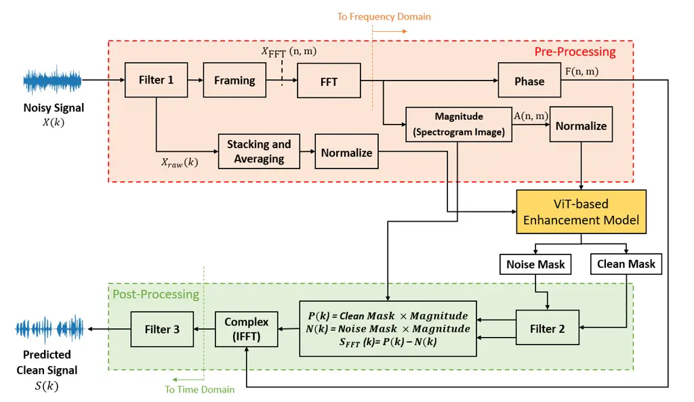
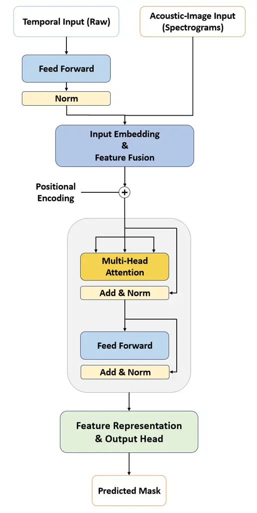
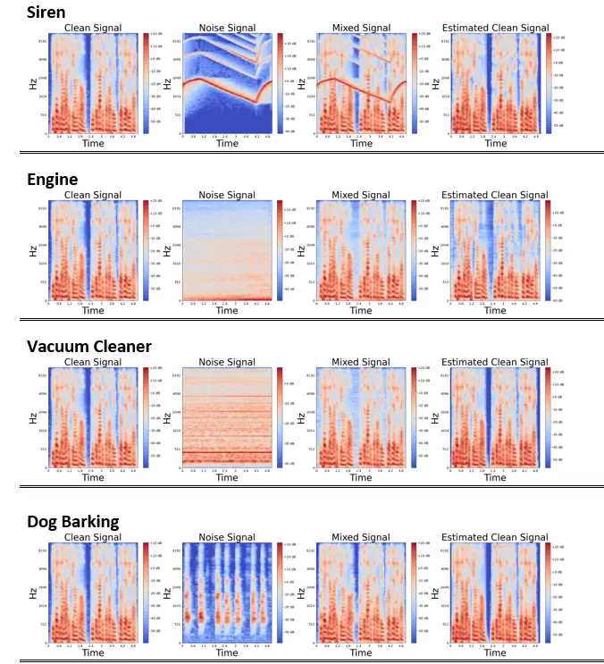
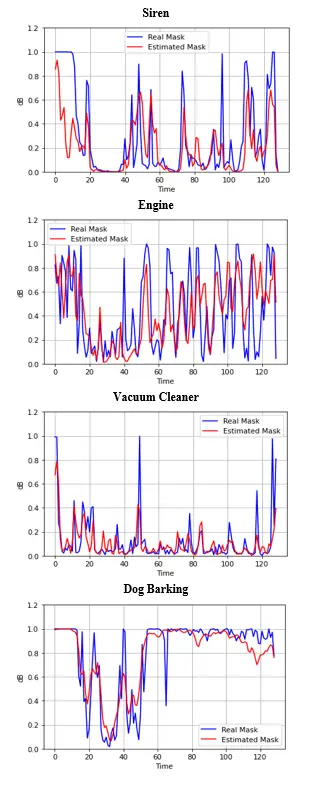

# Real-Time Speech Enhancement via a Hybrid ViT: A Dual-Input Acoustic-Image Feature Fusion

Behnaz Bahmei Affiliation: Mechatronic Systems Engineering
Affiliation: Simon Fraser University Email: <bbahmei@sfu.ca>    Siamak
Arzanpour Affiliation: Mechatronic Systems Engineering
Affiliation: Simon Fraser University Email: <arzanpour@sfu.ca>    Elina
Birmingham Affiliation: Faculty of Education Affiliation: Simon Fraser
University Email: <ebirmingham@sfu.ca>

###### Abstract

Speech quality and intelligibility are significantly degraded in noisy
environments. This paper presents a novel transformer-based learning
framework to address the single-channel noise suppression problem for
real-time applications. Although existing deep learning networks have
shown remarkable improvements in handling stationary noise, their
performance often diminishes in real-world environments characterized by
non-stationary noise (e.g., dog barking, baby crying). The proposed
dual-input acoustic-image feature fusion using a hybrid ViT framework
effectively models both temporal and spectral dependencies in noisy
signals. Designed for real-world audio environments, the proposed
framework is computationally lightweight and suitable for implementation
on embedded devices. To evaluate its effectiveness, four standard and
commonly used quality measurements, namely PESQ, STOI, Seg SNR, and LLR,
are utilized. Experimental results obtained using the Librispeech
dataset as the clean speech source and the UrbanSound8K and Google
Audioset datasets as the noise sources, demonstrate that the proposed
method significantly improves noise reduction, speech intelligibility,
and perceptual quality compared to the noisy input signal, achieving
performance close to the clean reference.

## 1 Introduction

The presence of noise affects the perceptual quality of speech signals
and decreases the performance of speech-related applications such as
automatic speech recognition (ASR)  \[1\], hearing aid devices  \[2\],
and audio/video communications. It can even be distressing for some
individuals, such as those on the autism spectrum disorder (ASD) with
auditory hypersensitivity. Noise suppression or speech enhancement is
widely used as an effective solution for converting a noisy signal to a
high-quality and clean signal. Noise suppression algorithms aimed to
attenuate the ambient noise components from speech signals to make them
more intelligible.

Over the decades, several noise suppression methods and systems have
been proposed in the literature. Traditional methods  \[3, 4, 5, 6, 7,
8\] employed different signal processing analysis methods, such as
signal-to-noise ratio (SNR), Wiener filtering, and spectral subtraction
algorithm on noise structures to overcome this problem. However, they
are not effective for complex, non-stationary, and highly dynamic noises
like sirens and dog barking, sounds that are commonly found in
real-world environments.

In recent years, Deep Learning (DL) methods such as deep neural networks
(DNNs)  \[9, 10\], convolutional neural networks (CNNs)  \[11\], long
short-term memory (LSTM)  \[12\], recurrent neural networks (RNNs)
 \[13, 14\], and deep denoising autoencoders (DDAE)  \[15\] have
achieved remarkable performance in speech enhancement and audio
denoising. These algorithms address the issues in traditional methods by
proposing several single and multi-channel approaches with either
supervised or unsupervised learning models. The superior performance of
DL models, among other data-driven models, is attributed to their
exceptional nonlinear mapping ability, which directly transforms the
noisy signal to the clean one. DL models employ two approaches,
including (i) directly predicting the clean signal  \[16\] and (ii)
predicting a mask for filtering  \[17\]. Despite the success of DL
algorithms in offline speech enhancement, their performance for
real-time audio processing applications and complex noises such as
sirens, dog barking, car horns, and constructional noises is not well
investigated. In some cases, the speech is distorted and not
intelligible, or there are still residual noises in the clean signal.
For adoption in a real-time application, a DL based system needs to
complete several steps, including pre-processing, feature extraction,
prediction, and post-processing in a short timeframe such that its
output is intelligible and without any noticeable delay by the human
listener (typically below 40 ms  \[18\]).

This makes noise suppression for speech enhancement a highly complex
problem, and as a result, achieving satisfactory performance with deep
learning models remains challenging. In recent years, Vision
Transformers (ViT) have become the dominant paradigm in computer vision
due to their superior capability in capturing long-range spatial
dependencies and contextual modeling from image data  \[19\]. Inspired
by this unparalleled success, we seek to perform an architectural power
transfer to the domain of signal denoising. In this work, we introduce a
modified Vision Transformer architecture optimized for extracting rich
features from 2D acoustic representations. Specifically, our model
utilizes both the raw audio signal (to preserve phase information) and
the spectrogram, which serves as a frequency-temporal image. This
dual-data input allows us to effectively segment the spectrogram into
visual tokens and leverage the ViT’s attention mechanism to accurately
extract and model the complex spatiotemporal and frequency-domain
relationships crucial for targeted speech enhancement. This approach
represents a significant step towards adapting machine vision
architectures to solve image-like signal processing challenges.

This paper proposes a novel learning framework based on a Vision
Transformer encoder to address the single-channel noise suppression
problem for real-time applications. The framework processes audio files
comprising a combination of speech and noise captured through a
microphone. By extracting and analyzing features from the noisy signal,
the model constructs a ratio mask to suppress noise and enhance speech
quality. Unlike previous approaches, the proposed method incorporates
both spectral and raw audio features, improving its ability to handle
complex and dynamic noise environments. The framework includes
pre-processing and post-processing steps to ensure high-quality,
intelligible output while maintaining real-time performance with minimal
latency. The framework is tested on challenging noise structures, such
as dog barking, sirens, vacuum cleaners, and engine noise, demonstrating
robust performance in real-world scenarios.

To summarize, the main contributions of this paper are as follows:

1.  1.  An adapted Vision Transformer architecture is proposed and tailored
        for processing 2D acoustic image data (spectrogram).
2.  2.  A robust input pipeline utilizing both the spectrogram image and the
        raw audio signal is proposed to ensure superior noise attenuation
        capabilities across stationary, non-stationary, and highly dynamic
        noise environments.
3.  3.  The system is designed with a lightweight architecture, enabling it
        to run in real-time with minimal computational overhead.

The composition of the paper is as follows. In Section 2, the materials
and methods, including pre-processing, model structure, post-processing
and experimental settings, are discussed. Section 3 presents the results
in detail, and the conclusion and future directions are presented in
Section 4.

## 2 Materials and Methods

In this section, the procedure of the noise suppression algorithm is
explained. First, in the pre-processing part, the features of noisy and
clean signals are extracted as network input and output. Then, the
architecture of the model is explained in detail. Following that, the
process of constructing the clean signal is described in the
post-processing part. Finally, the overall learning framework, the
network training structure, and real-time processing are introduced in
the experimental setup and real-time processing parts, respectively.

### 2.1 Pre-processing

Figure 1 shows the overall block diagram for the entire system,
including the pre-processing, the model, and the post-processing.
According to the diagram, a raw noisy signal is taken as the input, and
a clean signal is produced as the output. The noisy signal is generated
using a combination of a clean signal and a noise signal, which are
assumed to be uncorrelated and can be formulated as,

```math
X(k)=S(k)+G*N(k) \tag{1}
```

where X(k) is the noisy mixture, S(k) is the clean signal, N(k) is the
noise signal, G is the noise gain, and k is the discrete-time index. The
clean signal could be a combination of pleasant sounds such as speech,
home or office background, birds chirping, and so on. The noise gain is
used to create various distributions of noise and clean signals in the
mixture, resulting in different signal-to-noise ratios (SNRs) to
simulate a real-world noisy environment. The aim is to extract the
signal S(k) from the noisy signal X(k).

- •
  Spectral Branch Pre-Processing

The first step of the pre-processing part is Filter 1. This is a
bandpass filter that is considered a passive attenuation gate for
improving the quality or intelligibility of the mixed signal. This
filter allows a frequency range between 40Hz and 4 kHz to pass and cuts
off the other frequencies outside this range. This frequency range is
selected to suppress out-of-range noises that fall outside the human
voice spectrum  \[20\].



Figure 1: The proposed noise suppression architecture.

The next step in Figure 1 is framing, where the filtered mix signal,
X(k), is divided into short-length frames and then a Hanning window with
50% overlap is applied to minimize spectral distortion and maintain
continuity across frames. Afterward, the Short Time Fourier Transform
(STFT) is used to convert the framed signal into the frequency domain.
This transform produces a complex matrix spectrogram (an acoustic image
representation) that is linearly scaled and factored into phase and
magnitude components  \[21\]. $`\hat{X}_{FFT}`$ represents the STFT of
the signal and can be introduced by

```math
\hat{X}_{FFT}(n,m)=\sum_{m=0}^{N-1}x(k+nN)w(k)e^{-j2\pi\frac{mk}{N}} \tag{2}
```

where n, m, N, and w represent the frame index, the discrete-frequency
index, the frame length, and the analysis window function, respectively.
The polar form of the STFT of the noisy speech is represented by

```math
\hat{X}_{FFT}(n,m)=\left|\hat{X}_{FFT}(n,m)\right|e^{j\angle\hat{X}_{FFT}(n,m)}=F(n,m) \tag{3}
```

where F(n,m) is the phase value and A(n,m) is the magnitude value. To
prepare the features of the noisy signal and the targets of clean speech
as the input and output of the model, the logarithm of the magnitude
A(n,m) is calculated. These logarithmic magnitudes represent the log
power spectrogram features of the mix data. It will be normalized to
make the training process faster and fed to the model as the input. The
structure of the model is explained in the following section.

- •
  Raw Audio Branch Pre-Processing

In addition to the spectral features, the proposed framework also
incorporates the raw audio signal as a complementary input. In this
branch, the noisy signal, X(k), is first filtered using Filter 1 to
remove out-of-band frequencies. Then, instead of framing and overlapping
as in the spectral branch, consecutive frames of the raw audio are first
stacked without overlap and then averaged to produce a single
representative feature vector for the segment.

This averaging step reduces the temporal redundancy while preserving the
essential patterns of the raw waveform. The resulting vector, denoted as
$`{X}_{raw}(k)`$ , captures the temporal characteristics of the audio
signal in a compact form. This processed raw audio feature is normalized
and combined with the spectral features in the model input pipeline to
leverage both time-domain and frequency-domain information.

The combined input strategy enables the framework to better adapt to
real-world conditions, where both spectral and temporal cues are crucial
for differentiating speech from complex and dynamic noise sources. The
structure of the transformer-based model that processes these inputs is
explained in the following section.

### 2.2 Model Structure

The noise suppression model is built upon a modified Vision Transformer
(ViT) architecture designed to combine multi-modal features and capture
the complex spatiotemporal and frequency domain patterns in noisy
signals. This dual-input architecture, illustrated in Figure 2, is
composed of two primary branches, the spectrogram branch and the raw
audio branch, which process distinct feature types to extract
complementary information for robust noise suppression.



Figure 2: The model structure.

- •
  Spectrogram Branch

This branch processes normalized magnitude spectrogram features, as
described in the preprocessing section. These features provide the
high-resolution frequency content essential for visual pattern
recognition by the ViT core. The output of this branch is reshaped into
a sequence of visual tokens ready for the transformer block.

- •
  Raw Audio Branch

The raw audio branch processes the waveform features directly, capturing
time-domain information that is not explicitly available in the
frequency domain. This branch is designed to be computationally
lightweight and includes the following steps:

1.  1.  Input Transformation: The processed audio features are normalized
        and transformed into a higher-dimensional dense embedding using a
        fully connected layer.
2.  2.  Normalization and Reshaping: The embedding undergoes batch
        normalization to stabilize optimization and is then reshaped into a
        compatible format for concatenation. This process ensures that the
        temporal features are correctly integrated with the spectral tokens.

The outputs from the spectrogram and raw audio branches are concatenated
(Feature Fusion) and processed through a transformer-based core. Key
components of this core include:

- •
  Multi-Head Attention (MAH): Each MAH layer captures long-range
  dependencies not only between the spectral features (tokens) but also
  between the spectral and the raw audio features. This mechanism helps
  the model focus on relevant information while ignoring irrelevant
  noise components.

- •
  Residual Connections: Standard residual connections are implemented
  alongside layer normalization to maintain efficient information flow
  and prevent gradient degradation across deep layers.

The proposed model employs a lightweight architecture modified to fuse
spectral and raw audio representations through two transformer layers
with four attention heads.

Following the transformer blocks, the learned feature representation
undergoes flattening and is passed through the final Multilayer
Perceptron (MLP) head for regression. This head uses several fully
connected layers with ReLU activations and Dropout to refine features
before the final Output Layer, which produces the predicted mask for
audio reconstruction. The network weights are updated using the ADAM
optimizer, which uses adaptive learning rates for efficient gradient
descent optimization  \[22\].

### 2.3 Dual Mask Prediction

The model predicts two types of masks:

Clean mask $`M_{FFT}(k)`$: This mask is computed using the energy of
clean and noisy signals and is used to extract the clean signal
components. The mask is computed using the following equation,

```math
M_{FFT}(k)=\left(\frac{S^{2}(n,m)}{S^{2}(n,m)+X^{2}(n,m)}\right)^{0.5} \tag{4}
```

where the $`{S^{2}(n,m)}`$ and $`X^{2}(n,m)`$ are the energy of the
clean signal and mixed signals at the $`{n^{th}}`$ frame and
$`{m^{th}}`$ frequency bin, respectively  \[23\].

Noise Mask $`M_{wav}(k)`$: This mask is derived using the energy of
noise and noisy signals to extract the noise components.

```math
M_{wav}(k)=\left(\frac{N^{2}(n,m)}{N^{2}(n,m)+X^{2}(n,m)}\right)^{0.5} \tag{5}
```

The predicted masks are applied to the input noisy signal to reconstruct
both the clean and the noise components, enabling a comprehensive noise
suppression framework.

### 2.4 Post-processing

Post-processing steps, as indicated in Figure 1, include the predicted
mask modification, reconstruction, and tuning of the clean signal in the
time domain. Instead of using the raw output of the model, the two mask
vectors (Clean mask and Noise mask) are passed through filter 2, a
Gaussian smoothing function widely used for denoising in image and audio
processing. The level of smoothing is controlled by the standard
deviation of the Gaussian function. The smoothed masks are then used in
the following steps to create both the clean speech signal and the noise
signal.

For the clean signal, the Clean mask is multiplied by the magnitude of
the mixed signal to obtain the clean magnitude, as described by the
equation:

```math
P(k)=\hat{M}_{FFT}(k)^{\frac{2}{L}}A(k) \tag{6}
```

Similarly, the Noise mask is multiplied by the mixed signal’s magnitude
to extract the noise signal. The noise magnitude is computed as:

```math
N(k)=\hat{M}_{wav}(k)^{\frac{2}{L}}A(k) \tag{7}
```

The final magnitude of the clean signal is the difference between the
clean and noise signals:

```math
S(k)=P(k)-N(k) \tag{8}
```

Up to this point, the magnitude of the clean signal is computed in the
frequency domain. To transform the signal to the time domain, the IFFT
tool (Inverse FFT) is used. During the process, the clean signal is
reconstructed by vectorizing the complex part of the computed magnitude
and the phase of the noisy mixture. This step is completed in the
Complex box in Figure 1, using equations 9 and 10.

In the end, the predicted clean speech is passed through filter 3, which
is a bandpass filter for a final tune to improve the quality of the
predicted signal.

```math
\hat{S(k)}=F(k)+jP(k) \tag{9}
```

```math
Thepredictedcleanspeech=InverseSTFT(\hat{S(k)}) \tag{10}
```

### 2.5 Experimental Setup

In this section, the performance of the proposed architecture is
examined using the Librispeech  \[24\] and Urbansound8K  \[25\], and
GoogleAudioset  \[26\] datasets. 900 utterances from various English
speakers (female and male) are randomly selected from the first dataset
as the clean speech for training and testing purposes. For the
background sounds, various recordings were selected to simulate
different environments such as homes, restaurants, and residential
neighborhoods. In addition, the UrbanSound8K and Google Audioset
datasets, which include both stationary noises (e.g., engine sounds) and
non-stationary noises (e.g., dog barking and sirens), were employed as
the noise dataset. The noise samples are selected such that they include
a clear noise over the entire audio sample. Clean speech and noise
signals are single-channel and down-sampled to 8kHz to adjust the
dataset size for training and also speed up the real-time processing
practice. As mentioned in Section 2.1, the selected noise and clean
signals are added together to build the mixed signal, which is used as
the input to the model. The effect of SNR variation is examined in this
section. In these experiments, the performance of the trained model is
evaluated with four different SNRs, which include 0 dB, 3 dB, 10 dB, and
-3 dB, to simulate the real-world situation. It should be noted that 20%
of the created training set is selected for validation and testing.

### 2.6 Real-time Processing

In order to make the algorithm work in real-time, the frame size is
chosen such that the human auditory system cannot realize the delay
caused by pre-processing, noise suppression, and post-processing. Human
ears can not recognize a 20-40 ms latency, and the proposed framework
can keep the latency in this range to work smoothly in real-time. To
meet this requirement, a frame length of 16 ms was chosen as an optimal
trade-off between temporal and frequency resolution while maintaining
computational efficiency. This duration corresponds to 128 samples at an
8 kHz sampling rate, a power-of-two length that allows fast FFT
computation and minimizes latency without compromising spectral detail.

The overall sound latency of the deployed system was verified using an
external measurement protocol. This involved using two synchronized
microphones: one positioned to capture the input sound and the other to
capture the final filtered output sound. The latency was determined by
comparing the time difference between the waveforms captured by these
two devices. The inference time for the model and processing blocks was
measured directly using code profiling tools.

## 3 Results and Discussion

In this section, the simulation results of the proposed technique are
presented. Several experiments under the same test conditions are
performed to evaluate the behaviour and the performance of the proposed
method under various and complex noisy situations. To evaluate the
efficiency of the proposed algorithm, four standard and most commonly
used speech quality measurements are used, including:

- •
  Perceptual Evaluation Speech Quality (PESQ): is the most common metric
  to evaluate speech quality, calculated by comparing the enhanced and
  clean speech signals. PESQ is calculated as a linear combination of
  average disturbance values and average asymmetrical disturbance values
  between a reference signal and an estimated signal. Although it
  assesses the noise speech quality, some features such as loudness,
  loss, delay, and echo are not expressed in the PESQ score  \[27\]. In
  the PESQ test, the representative values are from -0.5 to 4.5,
  demonstrating the minimum and maximum speech quality.

- •
  Short-Time Objective Intelligibility (STOI): reflects the improvement
  in speech intelligibility and has a strong correlation to subjective
  listening test scores. STOI is based on an intermediate
  intelligibility measure for the short-time Time-Frequency domain and
  uses a simple DFT-based TF-decomposition  \[28\]. STOI score ranges
  from 0 to 1, where a better speech intelligibility results in a higher
  STOI score.

- •
  Segmental Signal to Noise Ratio (Seg SNR): evaluates the overall
  speech quality and the performance of noise reduction. Seg SNR
  computes the segmental signal-to-noise ratio (SNR) in dB by comparing
  a noisy signal with a clean reference signal. The Seg SNR for a speech
  signal is formulated as follows,

  ```math
  SegSNR=mean\left(10\log_{10}\left(\frac{\sum_{n=1}^{N}x^{2}(n)}{\sum_{n=1}^{N}(x(n)-\hat{x}(n))^{2}}\right)\right) \tag{11}
  ```

  where N is the length of the signal frame, x(n) is the clean speech
  signal, and $`\hat{x}(n)`$ is the enhanced speech signal  \[29\].

- •
  The Log-Likelihood Ratio (LLR): represents the quality level of speech
  signals by measuring the difference between the linear prediction of
  the clean reference signal and the degraded signal  \[30\]. LLR score
  ranges from 0 to 2, where higher LLR scores mean better speech
  qualities.

Table 1 presents the experimental results of the average performance
based on PESQ, STOI, Seg SNR, and LLR scores on the selected test
samples. For the test samples, four different unseen audios from each
noise type are selected, which include highly dynamic noises (siren),
non-stationary noises (vacuum cleaner), and stationary noises (engine).
Dog barking is also considered the fourth sample to show the algorithm’s
performance in a difficult situation where the noise has structural
similarity to the speech (from the spectrograms representing clean
speech and dog bark in Figure 3). The signals are mixed with four
different SNRs, i.e., -3 dB, 0 dB, 3 dB, and 10 dB, to include various
noisy conditions. For all these measurements, higher scores indicate
better performances. According to Table 1, the simulation results show
that the proposed method provides high speech intelligibility with
significant speech quality improvements. The results indicate that the
enhanced speech quality is the highest in 10dB and is degraded as it
gets to -3dB. This is due to the noise level amplification. Moreover,
the results demonstrate that the proposed framework has significantly
enhanced speech quality even at higher noise levels of 3dB and 0dB.

|                |       |        |        |         |        |
| -------------- | ----- | ------ | ------ | ------- | ------ |
|                | SNRs  | PESQ   | STOI   | Seg SNR | LLR    |
| Siren          |       |        |        |         |        |
|                | 0 dB  | 2.3564 | 0.8504 | 3.1065  | 1.5719 |
|                | 3 dB  | 2.8372 | 0.8680 | 3.7530  | 1.6983 |
|                | 10 dB | 3.2567 | 0.8980 | 3.9237  | 1.8601 |
|                | -3 dB | 1.9162 | 0.7160 | 1.2519  | 1.2749 |
| Engine         |       |        |        |         |        |
|                | 0 dB  | 2.4095 | 0.9788 | 4.2853  | 1.6011 |
|                | 3 dB  | 2.6525 | 0.9848 | 4.7296  | 1.6791 |
|                | 10 dB | 3.1156 | 0.8163 | 4.8516  | 1.8164 |
|                | -3 dB | 2.0196 | 0.7026 | 2.5174  | 1.3725 |
| Vacuum Cleaner |       |        |        |         |        |
|                | 0 dB  | 2.5080 | 0.8804 | 3.2365  | 1.5697 |
|                | 3 dB  | 2.7352 | 0.8941 | 4.0709  | 1.5738 |
|                | 10 dB | 3.4297 | 0.9116 | 4.8583  | 1.5764 |
|                | -3 dB | 2.1998 | 0.7576 | 1.9869  | 1.4671 |
| Dog Barking    |       |        |        |         |        |
|                | 0 dB  | 2.4782 | 0.8844 | 3.8941  | 1.4813 |
|                | 3 dB  | 2.7153 | 0.8891 | 4.1668  | 1.5095 |
|                | 10 dB | 3.1299 | 0.9164 | 4.8946  | 1.5818 |
|                | -3 dB | 2.0148 | 0.7644 | 1.4928  | 1.3941 |

Table 1: The performance measurements of the proposed method for
different noise structure types.



Figure 3: Spectrogram performance of the proposed method for different
noise structure types.

To visually observe the experimental results, the spectrograms of the
clean speech signal, the noise signal, the mixture of the speech signal
with the noise at an SNR of 0 dB, and the enhanced speech estimated by
our proposed method are presented in Figure 3. In a spectrogram, the
vertical axis indicates the frequency values in Hertz, the horizontal
axis shows time steps, and the color brightness represents amplitude
values. According to Figure 3, it is observed that the proposed method
effectively suppresses the background noise, and the enhanced speech
signal is close to the clean version. In highly dynamic noise structures
such as dog barking and sirens, eliminating the background noise without
any corruption to the speech signal is complicated and difficult. Figure
3 shows that our proposed method is capable of suppressing the highly
dynamic noises, and the resulting filtered speech is close to the clean
speech spectrogram.

To benchmark the proposed noise suppression system against established
speech enhancement techniques, we compared its performance with an LSTM
network  \[31\], a widely recognized real-time baseline in the
literature. Table 2 summarizes the results in terms of PESQ, STOI, and
SI-SDR. The Scale-Invariant Signal-to-Distortion Ratio (SI-SDR) measures
how accurately the enhanced signal preserves the target speech structure
while remaining independent of overall signal scale. Unlike SegSNR,
which evaluates local frame-level signal-to-noise ratios, SI-SDR focuses
on distortion between the reference and estimated signals after optimal
scaling. The proposed system achieved PESQ values ranging from 1.9 to
3.32, STOI between 0.70 and 0.98, and SI-SDR improvements of 6 to 15 dB
across our test samples. These results are comparable to or better than
those of  \[31\] (PESQ 2.23 – 3.04, STOI 0.80 – 0.95, SI-SDR 2 – 16 dB),
despite operating at a lower sampling rate (8 kHz vs. 16 kHz) and being
evaluated on more challenging real-world noises such as sirens, dog
barking, vacuum cleaning, and engine sounds.

| Method            | Dataset                      | Sampling Rate | PESQ      | SI-SDR | STOI      |
| ----------------- | ---------------------------- | ------------- | --------- | ------ | --------- |
| LSTM model \[31\] | WHAMR / DNS Challenge        | 16 kHz        | 2.23–3.04 | 2–16   | 0.80–0.95 |
| Proposed System   | LibriSpeech + GoogleAudioSet | 8 kHz         | 1.9–3.42  | 6–15   | 0.70–0.98 |

Table 2: An objective comparison between the proposed noise suppression
model and  \[31\].

While  \[31\] and related benchmarks are typically trained and tested on
stationary or semi-stationary noises from datasets like DNS Challenge or
WHAMR, our system demonstrates strong performance under highly dynamic,
non-stationary noise conditions. This highlights the robustness and
generalization capability of the proposed model for realistic
environmental applications.



Figure 4: A comparison between the estimated masks by the proposed
method and the real masks.

To further discuss the effectiveness and capability of our method, the
estimated clean mask, which is one of the outputs of the ViT model, is
compared with the computed clean mask in equation 6, which is considered
the real clean mask. Figure 4 shows four randomly selected samples of
the estimated clean masks compared to the real ones computed directly
from the clean reference and the mixed noisy signals. The simulation
results show that the predicted real masks are very close to each other,
which indicates the accuracy and performance of the proposed system.
According to Figure 4, the model can predict the fluctuations in the
ratio masks and generate a clean speech at the end of the process.

The end-to-end latency of the system running on an NVIDIA Jetson Xavier
NX GPU is measured. The total latency per frame was observed to be under
35 ms, which is comfortably within the acceptable human auditory range.
Table 3 shows the measured latency breakdown for a single 16 ms frame:

| Components                | Latency (ms)     |
| ------------------------- | ---------------- |
| Frame Length              | $`\sim`$16       |
| Model Inference           | $`\sim`$7        |
| Pre- and Post-Processing  | $`\sim`$3 to 4   |
| Operating System Overhead | $`\sim`$8        |
| Total End-to-End Latency  | $`\sim`$34 to 35 |

Table 3: Latency breakdown for a single 16 ms frame.

## 4 Conclusion

This paper proposes an innovative solution to address the single-channel
noise suppression problem using a transformer-based learning framework
for real-time applications. The proposed framework receives a noisy
speech signal as an input and extracts its features to feed to a ViT
model. The model is designed and trained to generate two ratio masks to
eliminate the background noise from the noisy signal. Signal processing
techniques are utilized to increase speech quality and integrability
before and after the model. The proposed techniques and model are
applied on the Librispeech dataset for the clean speech sources and the
GoogleAudioset and UrbanSound8K datasets for the noise sources. The
simulation results indicate that the proposed method can remove the
background noise from the speech signal, even in the presence of complex
noisy conditions and difficult noise types. Four speech quality
measurements, including PESQ, STOI, Seg SNR, and LLR, are employed to
evaluate the performance of the proposed method in terms of the noise
reduction level, speech quality, and intelligibility. Moreover, the
spectrograms and the predicted masks are provided to demonstrate the
significant performance of the proposed technique under different
circumstances, from low to high SNRs.

## References

- \[1\] P. Zhang, Y. Huang, C. Yang, and W. Jiang (2014) Estimate the
  noise effect on automatic speech recognition accuracy for mandarin by
  an approach associating articulation index. Applied Acoustics.
  External Links:
  [Document](https://dx.doi.org/10.1016/j.apacoust.2023.109217) Cited
  by: §1.
- \[2\] E. B. Petersen, E. N. MacDonald, and A. J. M. Sørensen (2022)
  The effects of hearing-aid amplification and noise on conversational
  dynamics between normal-hearing and hearing-impaired talkers. Trends
  in Hearing 26. External Links:
  [Document](https://dx.doi.org/10.1177/23312165221103340) Cited by: §1.
- \[3\] M. Berouti, R. Schwartz, and J. Makhoul (1979) Enhancement of
  speech corrupted by acoustic noise. In Proc. IEEE Int. Conf.
  Acoustics, Speech, and Signal Processing (ICASSP), Vol. 4,
  pp. 208–211. Cited by: §1.
- \[4\] A. M. Reddy and B. Raj (2007) Soft mask methods for
  single-channel speaker separation. IEEE Trans. Audio, Speech, and
  Language Processing 15 (6), pp. 1766–1776. External Links:
  [Document](https://dx.doi.org/10.1109/TASL.2007.901310) Cited by: §1.
- \[5\] E. M. Grais and H. Erdogan (2011) Single channel speech music
  separation using nonnegative matrix factorization and spectral masks.
  In Proc. Int. Conf. Digital Signal Processing (DSP), pp. 1–6. External
  Links: [Document](https://dx.doi.org/10.1109/ICDSP.2011.6004924) Cited
  by: §1.
- \[6\] S. Kamath and P. Loizou (2002) A multi-band spectral subtraction
  method for enhancing speech corrupted by colored noise. In Proc. IEEE
  Int. Conf. Acoustics, Speech, and Signal Processing (ICASSP),
  pp. IV–4164. External Links:
  [Document](https://dx.doi.org/10.1109/ICASSP.2002.5745591) Cited by:
  §1.
- \[7\] P. Scalart and J. V. Filho (1996) Speech enhancement based on a
  priori signal to noise estimation. In Proc. IEEE Int. Conf. Acoustics,
  Speech, and Signal Processing (ICASSP), pp. 629–632. External Links:
  [Document](https://dx.doi.org/10.1109/ICASSP.1996.543199) Cited by:
  §1.
- \[8\] S. K. Roy and K. K. Paliwal (2022) Robustness and sensitivity
  metrics-based tuning of the augmented kalman filter for single-channel
  speech enhancement. Applied Acoustics 185, pp. 108355. External Links:
  [Document](https://dx.doi.org/10.1016/j.apacoust.2021.108355) Cited
  by: §1.
- \[9\] Y. Xu, J. Du, L.-R. Dai, and C.-H. Lee (2015) A regression
  approach to speech enhancement based on deep neural networks. IEEE/ACM
  Trans. Audio, Speech, and Language Processing 23 (1), pp. 7–19.
  External Links:
  [Document](https://dx.doi.org/10.1109/TASLP.2014.2364452) Cited by:
  §1.
- \[10\] H. Yu, W. Zhu, and B. Champagne (2020) Speech enhancement using
  a dnn-augmented colored-noise kalman filter. Speech Communication 125,
  pp. 142–151. External Links:
  [Document](https://dx.doi.org/10.1016/j.specom.2020.10.007) Cited by:
  §1.
- \[11\] A. Karthik and J. L. M. Iqbal (2023) An optimized convolutional
  neural network for speech enhancement. Int. J. Speech Technol. 26,
  pp. 1117–1129. External Links:
  [Document](https://dx.doi.org/10.1007/s10772-023-10073-6) Cited by:
  §1.
- \[12\] M. Fernández-Díaz and A. Gallardo-Antolín (2020) An attention
  long short-term memory based system for automatic classification of
  speech intelligibility. Engineering Applications of Artificial
  Intelligence 96, pp. 103976. External Links:
  [Document](https://dx.doi.org/10.1016/j.engappai.2020.103976) Cited
  by: §1.
- \[13\] Y. Hu, Y. Liu, S. Lv, M. Xing, S. Zhang, Y. Fu, J. Wu, B.
  Zhang, and L. Xie (2020) DCCRN: deep complex convolution recurrent
  network for phase-aware speech enhancement. In Proc. Interspeech,
  pp. 2472–2476. External Links:
  [Document](https://dx.doi.org/10.21437/Interspeech.2020-2537) Cited
  by: §1.
- \[14\] Y. Wenhao (2021) Incorporating group update for speech
  enhancement based on convolutional gated recurrent network. Speech
  Communication 132, pp. 32–39. External Links:
  [Document](https://dx.doi.org/10.1016/j.specom.2021.05.003) Cited by:
  §1.
- \[15\] X. Lu, Y. Tsao, S. Matsuda, and C. Hori (2013) Speech
  enhancement based on deep denoising autoencoder. In Proc. Interspeech,
  pp. 436–440. External Links:
  [Link](https://www.isca-archive.org/interspeech_2013/lu13_interspeech.html)
  Cited by: §1.
- \[16\] F. G. Germain, Q. Chen, and V. Koltun (2019) Speech denoising
  with deep feature losses. In Proc. Interspeech, pp. 2723–2727.
  External Links:
  [Document](https://dx.doi.org/10.48550/arXiv.1806.10522) Cited by: §1.
- \[17\] D. S. Williamson and D. Wang (2017) Time-frequency masking in
  the complex domain for speech dereverberation and denoising. IEEE/ACM
  Trans. Audio, Speech, and Language Processing 25 (7), pp. 1492–1501.
  External Links:
  [Document](https://dx.doi.org/10.1109/TASLP.2017.2696307) Cited by:
  §1.
- \[18\] M. A. Stone and B. C. Moore (1999) Tolerable hearing aid
  delays. i. estimation of limits imposed by the auditory path alone
  using simulated hearing losses. Ear and Hearing 20 (3), pp. 182–192.
  External Links:
  [Document](https://dx.doi.org/10.1097/00003446-199906000-00002) Cited
  by: §1.
- \[19\] A. Dosovitskiy, L. Beyer, A. Kolesnikov, D. Weissenborn, X.
  Zhai, T. Unterthiner, M. Dehghani, M. Minderer, G. Heigold, S.
  Gelly, J. Uszkoreit, and N. Houlsby (2021) An image is worth 16x16
  words: transformers for image recognition at scale. In Proc. Int.
  Conf. Learn. Represent. (ICLR), External Links:
  [Link](https://arxiv.org/abs/2010.11929) Cited by: §1.
- \[20\] K. Balasubramaniam and R. Selvaganesh (2020) A noval approach
  in speech enhancement for reducing noise using bandpass filter and
  spectral subtraction. Bonfring Int. J. Res. Commun. Eng. 2, pp. 5–8.
  Cited by: §2.1.
- \[21\] S. S. Kelkar, L. L. Grigsby, and J. Langsner (1983) An
  extension of parseval’s theorem and its use in calculating transient
  energy in the frequency domain. IEEE Trans. Industrial Electronics
  IE-30 (1), pp. 42–45. External Links:
  [Document](https://dx.doi.org/10.1109/TIE.1983.356702) Cited by: §2.1.
- \[22\] D. P. Kingma and J. Ba (2014) Adam: a method for stochastic
  optimization. CoRR abs/1412.6980. External Links:
  [Link](https://arxiv.org/abs/1412.6980) Cited by: §2.2.
- \[23\] U. Rizwan, I. M. Shohidul, Y. Zhongfu, and A. Muhammad (2020)
  Semi-supervised transient noise suppression using omlsa and snmf
  algorithms. Applied Acoustics 170, pp. 107533. External Links:
  [Document](https://dx.doi.org/10.1016/j.apacoust.2020.107533) Cited
  by: §2.3.
- \[24\] V. Panayotov, G. Chen, D. Povey, and S. Khudanpur (2015)
  Librispeech: an asr corpus based on public domain audio books. In
  Proc. IEEE Int. Conf. Acoustics, Speech and Signal Processing
  (ICASSP), pp. 5206–5210. External Links:
  [Document](https://dx.doi.org/10.1109/ICASSP.2015.7178964) Cited by:
  §2.5.
- \[25\] J. Salamon, C. Jacoby, and J. P. Bello (2014) A dataset and
  taxonomy for urban sound research. In Proc. ACM Int. Conf. Multimedia,
  pp. 1041–1044. External Links:
  [Document](https://dx.doi.org/10.1145/2647868.2655045) Cited by: §2.5.
- \[26\] J. F. Gemmeke, D. P. W. Ellis, D. Freedman, A. Jansen, W.
  Lawrence, R. C. Moore, M. Plakal, and M. Ritter (2017) Audio set: an
  ontology and human-labeled dataset for audio events. In Proc. IEEE
  Int. Conf. Acoustics, Speech and Signal Processing (ICASSP),
  pp. 776–780. External Links:
  [Document](https://dx.doi.org/10.1109/ICASSP.2017.7952261) Cited by:
  §2.5.
- \[27\] M. Gogate, K. Dashtipour, A. Adeel, and A. Hussain (2020)
  CochleaNet: a robust language-independent audio-visual model for
  real-time speech enhancement. Information Fusion 63, pp. 273–285.
  External Links:
  [Document](https://dx.doi.org/10.1016/j.inffus.2020.04.001) Cited by:
  1st item.
- \[28\] C. H. Taal, R. C. Hendriks, R. Heusdens, and J. Jensen (2010) A
  short-time objective intelligibility measure for time-frequency
  weighted noisy speech. In Proc. IEEE Int. Conf. Acoustics, Speech, and
  Signal Processing (ICASSP), pp. 4214–4217. External Links:
  [Document](https://dx.doi.org/10.1109/ICASSP.2010.5495701) Cited by:
  1st item.
- \[29\] Q. Huang, C. Bao, X. Wang, and Y. Xiang (2020) Speech
  enhancement method based on multi-band excitation model. Applied
  Acoustics 163, pp. 107236. External Links:
  [Document](https://dx.doi.org/10.1016/j.apacoust.2020.107236) Cited
  by: 1st item.
- \[30\] Y. Hu and P. C. Loizou (2008) Evaluation of objective quality
  measures for speech enhancement. IEEE Trans. Audio, Speech, and
  Language Processing 16 (1), pp. 229–238. External Links:
  [Document](https://dx.doi.org/10.1109/TASL.2007.911054) Cited by: 1st
  item.
- \[31\] N. L. Westhausen and B. T. Meyer (2020) Dual-signal
  transformation lstm network for real-time noise suppression. In Proc.
  Interspeech, External Links:
  [Document](https://dx.doi.org/10.21437/Interspeech.2020-2631) Cited
  by: Table 2, Table 2, §3, §3.
