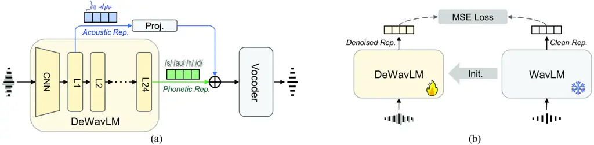
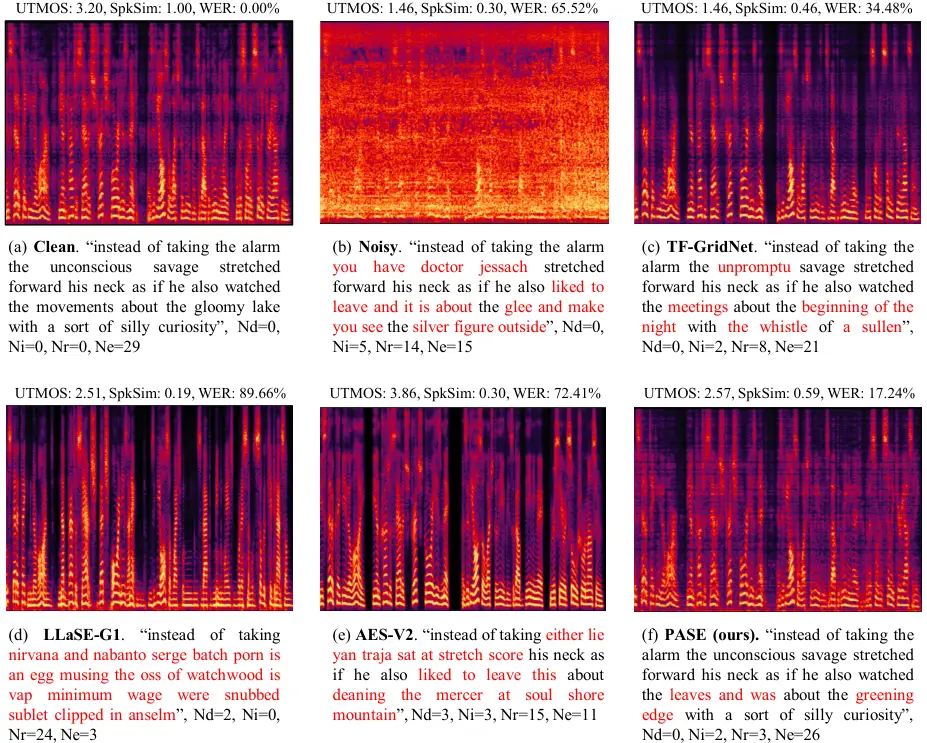
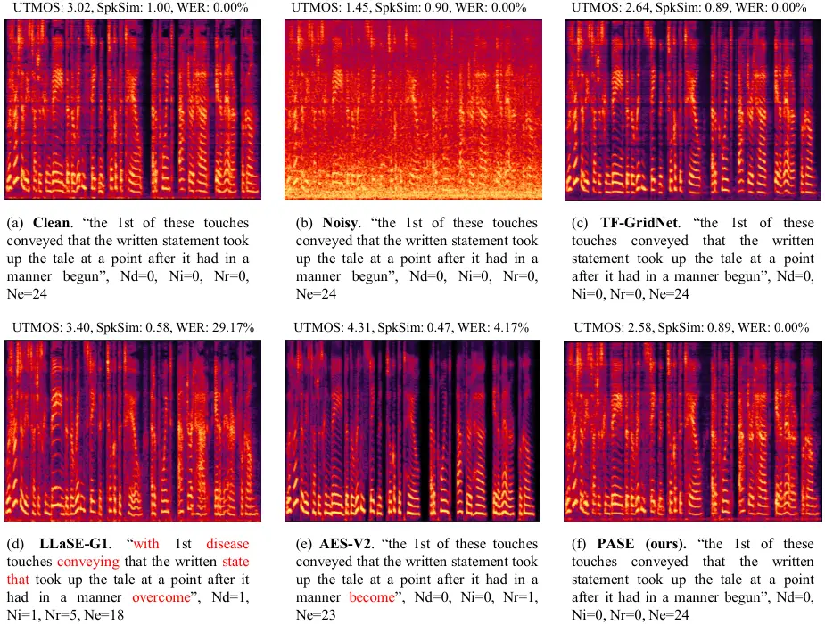
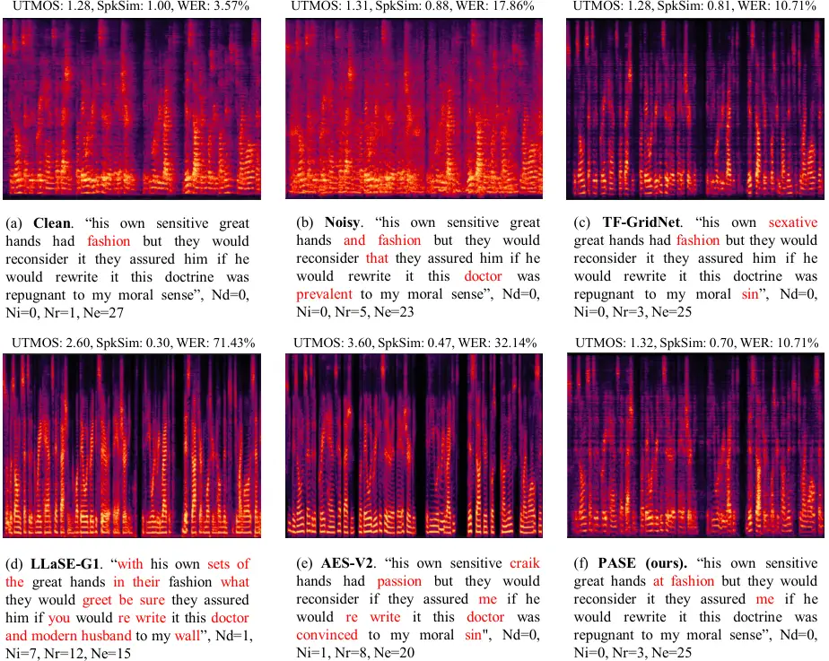

# PASE: Leveraging the Phonological Prior of WavLM for Low-Hallucination Generative Speech Enhancement

Xiaobin Rong    Qinwen Hu    Mansur Yesilbursa    Kamil Wojcicki    Jing
Lu

###### Abstract

Generative models have shown remarkable performance in speech
enhancement (SE), achieving superior perceptual quality over traditional
discriminative approaches. However, existing generative SE approaches
often overlook the risk of hallucination under severe noise, leading to
incorrect spoken content or inconsistent speaker characteristics, which
we term linguistic and acoustic hallucinations, respectively. We argue
that linguistic hallucination stems from models’ failure to constrain
valid phonological structures and it is a more fundamental challenge.
While language models (LMs) are well-suited for capturing the underlying
speech structure through modeling the distribution of discrete tokens,
existing approaches are limited in learning from noise-corrupted
representations, which can lead to contaminated priors and
hallucinations. To overcome these limitations, we propose the
Phonologically Anchored Speech Enhancer (PASE), a generative SE
framework that leverages the robust phonological prior embedded in the
pre-trained WavLM model to mitigate hallucinations. First, we adapt
WavLM into a denoising expert via representation distillation to clean
its final-layer features. Guided by the model’s intrinsic phonological
prior, this process enables robust denoising while minimizing linguistic
hallucinations. To further reduce acoustic hallucinations, we train the
vocoder with a dual-stream representation: the high-level phonetic
representation provides clean linguistic content, while a low-level
acoustic representation retains speaker identity and prosody.
Experimental results demonstrate that PASE not only surpasses
state-of-the-art discriminative models in perceptual quality, but also
significantly outperforms prior generative models with substantially
lower linguistic and acoustic hallucinations.

¹Key Laboratory of Modern Acoustics, Nanjing University

²Collaboration AI, Cisco Systems, Inc.

[xiaobin.rong@smail.nju.edu.cn](mailto:xiaobin.rong@smail.nju.edu.cn),
[lujing@nju.edu.cn](mailto:lujing@nju.edu.cn)

Code —
[https://github.com/cisco-open/pase](https://github.com/cisco-open/pase)

Demo —
[https://xiaobin-rong.github.io/pase˙demo/](https://xiaobin-rong.github.io/pase_demo/)

## 1 Introduction

Speech enhancement (SE) aims to recover clean speech from noisy
mixtures, improving both quality and intelligibility. Deep
learning-based SE methods can be broadly categorized into discriminative
and generative approaches. While the former is effective at noise
reduction, it often struggles to preserve speech naturalness under
challenging conditions (Wang et al. 2025). To overcome this, generative
models have recently emerged as a compelling alternative, demonstrating
strong capabilities in synthesizing speech with superior perceptual
quality (Lu et al. 2022). These models learn the distribution of clean
speech using techniques such as generative adversarial networks (GANs)
(Sun et al. 2025), diffusion models (Lu et al. 2022; Lemercier et al.
2023), flow matching (Wang et al. 2025), and language models (LMs) (Wang
et al. 2024; Yang et al. 2024).

Despite their strengths, however, generative models are prone to
hallucinations, which could result in inconsistencies in linguistic
content or speaker characteristics between the enhanced and original
noisy speech (Saijo et al. 2025). This problem was initially overlooked
as it cannot be effectively detected by commonly used non-intrusive
quality metrics (Pirklbauer et al. 2023a), such as DNSMOS (Reddy et al.
2021; Reddy et al. 2022) and UTMOS (Saeki et al. 2022).

While recent studies (Wang et al. 2025; Yang et al. 2024; Kang et al. 2025) have started to incorporate hallucination-sensitive metrics such
as word error rate (WER) and speaker similarity (SpkSim), these
evaluations are mostly conducted under high signal-to-noise ratio (SNR)
conditions, where models tend to perform reliably. However,
hallucinations become much more severe in low-SNR conditions,
potentially compromising the system’s practicality. For instance, GenSE
(Yao et al. 2025) achieves strong performance on high-SNR test sets;
however, it still reports a WER as high as 28.4% on a more challenging
test set, indicating substantial room for improvement in mitigating
hallucinations under adverse conditions.

In this paper, we aim to mitigate hallucinations in generative speech
enhancement. We begin by categorizing hallucinations into two
disentangled aspects: linguistic and acoustic, based on whether the
distortion affects speech content or speaker characteristics. We argue
that acoustic hallucination, which arises from the loss of fine-grained
details, can be alleviated by supplying acoustic cues. In contrast,
linguistic hallucination, stemming from models’ failure to constrain
valid phonological structures, is the more fundamental challenge. While
existing LM-based approaches are well-suited to capturing speech
structure through token-based language modeling, we contend that they
are fundamentally limited in two ways: (1) they learn phonological
priors from noise-corrupted input representations, which risks leading
to unreliable or contaminated knowledge; and (2) their reliance on a
limited number of discrete tokens inherently discards essential acoustic
information such as pitch and timbre, making them ill-equipped to handle
acoustic hallucinations.

To overcome these limitations, we propose the Phonologically Anchored
Speech Enhancer (PASE), a novel generative framework that circumvents
the pitfalls of LM-based approaches. First, instead of learning a
phonological prior from corrupted inputs, PASE directly leverages the
robust, pre-existing prior embedded in the self-supervised model WavLM
(Chen et al. 2022). Second, PASE operates entirely in the continuous
representation space, avoiding the information loss from discretization
that contributes to acoustic hallucinations. Specifically, we first
adapt WavLM into a denoising expert via representation distillation.
This process is guided by WavLM’s intrinsic phonological prior, enabling
effective denoising while being robust to linguistic hallucinations.
Subsequently, a vocoder is trained to reconstruct the waveform with a
dual-stream representation. Following established layer-wise analyses of
WavLM (Pasad et al. 2023), we use phonetic representations from the
final transformer layer to ensure linguistic integrity, while
conditioning on acoustic representations from the first layer to
preserve speaker characteristics. Our contributions are three-fold:

- •
  A New Conceptualization for Hallucination Analysis: We are, to the
  best of our knowledge, the first in speech enhancement to formally
  categorize hallucinations into linguistic and acoustic types and trace
  them to their distinct root causes, offering a new lens for analyzing
  the fundamental flaws of existing generative SE paradigms.
- •
  A Novel Prior-Leveraging Paradigm: We propose PASE, a framework that
  marks a paradigm shift from learning potentially flawed knowledge to
  directly leveraging robust and pre-existing phonological prior,
  thereby effectively alleviating linguistic hallucinations, while a
  dual-stream, acoustic-conditioned design simultaneously mitigates
  acoustic hallucinations.
- •
  State-of-the-Art Performance: PASE establishes new state-of-the-art
  (SOTA) results through extensive experiments, significantly
  outperforming existing generative and discriminative models in
  reducing both linguistic and acoustic hallucinations, while delivering
  superior perceptual quality with lower computational complexity.

## 2 Related Works

### 2.1 Knowledge Priors in Self-Supervised Speech Models

Self-supervised speech models (S3Ms) learn powerful representations from
large-scale unlabeled data by employing self-supervised learning (SSL)
objectives, such as masked prediction (Hsu et al. 2021; Chen et al. 2022) and auto-regressive prediction (Chung et al. 2019). These
pre-training paradigms force the model to capture the underlying
structure of speech, resulting in a hierarchy of representations where
different layers encode distinct aspects of information (Pasad et al.
2021). A consistent finding is an acoustic-to-linguistic progression:
lower layers capture fine-grained acoustic details and speaker
characteristics, while higher layers encode more abstract linguistic
properties ostensibly related to phonetics, syntax, and even semantics
(Dan Wells and Hao Tang and Korin Richmond 2022; Martin et al. 2023;
Shen et al. 2023; Ashihara et al. 2023).

However, the true nature of this high-level “linguistic” knowledge
requires careful scrutiny. A key consideration is that S3Ms are trained
exclusively on raw audio signals, without access to text or explicit
semantic labels. This foundational premise is strongly supported by
experimental evidence from a recent study (Choi et al. 2024), which
demonstrates that S3M representations are substantially more sensitive
to phonetic similarities than to semantic ones. This observation
reinforces our central thesis: the model’s advanced capabilities do not
stem from a true comprehension of abstract grammar or concepts, but
instead emerge from learning statistical co-occurrence patterns of
speech from vast data. In effect, S3Ms approximate language
understanding by constructing pseudo-linguistic properties in
representations learned from phonetic patterns.

Based on this perspective, we refer to the model’s intrinsic capability
to understand and model speech as the phonological prior—a form of
knowledge fundamentally based on phonetic patterns. This prior spans
both local phonotactic constraints and broader statistical regularities
across longer contexts that approximate lexical and syntactic
structures. To be precise, in our framework, the phonological prior is
the knowledge encoded within the model’s pre-trained weights, while the
pseudo-linguistic properties are the manifest attributes of the
high-level phonetic representations produced by this prior.

### 2.2 Self-Supervised Speech Models for Speech Enhancement

Figure 1: (a) Overall architecture of the proposed PASE framework. (b)
Diagram of denoising representation distillation.

The advent of S3Ms has catalyzed the evolution of speech enhancement
towards generative paradigms capable of delivering superior perceptual
quality. Within this landscape, two major approaches have emerged,
differing fundamentally in how they handle S3M representations.

The first paradigm, which we term continuous representation mapping
(CRM), operates directly in the continuous domain. It typically employs
a vocoder to reconstruct enhanced waveforms from either raw noisy
representations (Irvin et al. 2023) or their denoised counterparts
produced by a mapping network (Sun et al. 2025). However, we posit that
CRM approaches treat these representations as mere sequences of feature
vectors, overlooking the contextual structure that underpins their
pseudo-linguistic properties. While these approaches outperform
traditional spectrogram-based methods (Huang et al. 2022), their gains
likely stem from the inherent strengths of high-level representations
rather than effective modeling of their internal structure.

The second paradigm, termed discrete language modeling (DLM),
discretizes S3M representations into token sequences and then attempts
to explicitly learn a phonological prior by modeling token distributions
autoregressively (Yang et al. 2024; Yao et al. 2025). While correctly
identifying the importance of context, we argue that this approach risks
prior contamination: by learning from corrupted representations, the
model is prone to generating linguistically inconsistent outputs. Some
DLM variants, such as SELM (Wang et al. 2024) and LLaSE-G1 (Kang et al.
2025), adopt a parallel prediction paradigm, framing denoising as a
masked prediction task in order to encourage the model to capture
contextual dependencies when inferring the “masked” (i.e., noisy)
tokens. However, we contend this analogy is flawed. Unlike a true hard
mask that completely obscures information, noise acts more like a soft
mask that merely distorts it. This crucial distinction often allows the
model to reconstruct the output from local cues alone, bypassing the
need to leverage the very contextual knowledge. The above limitations in
current approaches leave the core challenge of leveraging S3M’s
long-range contextual knowledge for robust denoising.

## 3 Methods

### 3.1 Framework Overview

In this section, we introduce PASE, a generative SE framework designed
to deliver high perceptual quality while effectively mitigating
hallucinations. As depicted in Fig. 1 (a), the PASE framework consists
of two key components: (1) Denoising WavLM (DeWavLM), created by
fine-tuning WavLM through a denoising representation distillation (DRD)
strategy, adapting it into a denoising expert that produces enhanced
representations given noisy inputs; (2) A vocoder, which reconstructs
the enhanced waveform from DeWavLM’s dual-stream representations.

This dual-stream design is motivated by the limitations of existing
layer-selection strategies for SE. Weighted sum across all layers often
overemphasizes the first layer (Irvin et al. 2023), limiting access to
high-level phonetic information. Alternatively, empirically selecting a
single intermediate layer (e.g., the 6th) (Yao et al. 2025; Kang et al.
2025), which mixes acoustic and phonetic cues, yielded suboptimal
performance in our preliminary experiments, likely due to insufficient
separation of the two types of information.

In contrast, PASE adopts a principled approach. Drawing from established
layer-wise analyses (Pasad et al. 2023), we select two specialized
representations from the DeWavLM module: (1) Phonetic representation:
The output of the final transformer layer, which is rich in abstract,
context-dependent phonetic content. (2) Acoustic representation: The
output of the first transformer layer, which retains the fine-grained
acoustic details crucial for preserving speaker identity and prosody.

### 3.2 Denoising Representation Distillation

The DRD strategy, as illustrated in Fig. 1 (b), is a feature-level
knowledge distillation scheme. We instantiate two copies of the WavLM
model: a frozen teacher and a trainable student, both initialized from
the pre-trained weights to inherit the phonological prior. The student
model is trained to map a noisy input waveform to a clean representation
by minimizing the mean-squared error (MSE) loss against the target
representation. This target is generated by the teacher model from the
corresponding clean waveform. A comprehensive ablation study (see
Appendix A.1) reveals that using the final layer outputs from both the
student and teacher models yields the best performance. Accordingly, all
subsequent experiments adopt this configuration.

A crucial concern during DRD is the risk of catastrophic forgetting,
where the new denoising objective may overwrite the model’s original
phonological prior. To mitigate this, we explore a joint objective
combining the distillation loss with the original masked prediction loss
(Chen et al. 2022), weighted equally. Surprisingly, our further ablation
studies reveal that the simpler distillation objective is not only
adequate but also yields superior performance.

### 3.3 Acoustic-Conditioned Reconstruction

While DRD excels at producing linguistically accurate representations,
these high-level features often lack the fine-grained acoustic details
necessary for speaker-consistent and high-fidelity waveform synthesis.
To bridge this gap, we employ a dual-stream conditioning mechanism to
guide a neural vocoder, ensuring the synthesized speech is both
intelligible and faithful to the original speaker’s characteristics.

Specifically, we adopt a simple yet effective addition strategy: the
acoustic representation is first passed through a linear projection
layer to align its feature space with that of the phonetic
representation, after which they are aggregated via element-wise
summation. While more complex fusion strategies like concatenation,
cross-attention, and FiLM (Perez et al. 2018) can be utilized, our
further ablation studies confirm that simple addition is sufficient.

For the vocoder backbone, we adopt Vocos (Siuzdak 2023), a cutting-edge
neural vocoder offering a strong trade-off between synthesis quality and
efficiency. We use the improved variant proposed in WavTokenizer (Ji et
al. 2024), which integrates an attention module to enhance contextual
modeling. To improve perceptual quality, we employ adversarial training
using both the multi-period discriminator (MPD) (Kong et al. 2020) and
the multi-band multi-scale STFT discriminator (MBMSD) (Kumar et al.
2023), with their adversarial losses equally weighted. Following Gesper
(Chen et al. 2023), our training objective combines reconstruction,
adversarial, and feature-matching losses with weights of 15, 2, and 1,
respectively.

## 4 Experiments

### 4.1 Experimental Setup

#### Datasets

We construct our training dataset using the large-scale corpora provided
by the Interspeech 2025 URGENT Challenge (URGENT2) (Saijo et al. 2025).
Clean speech is drawn from multiple sources, including the LibriVox
subset of the DNS5 Challenge (Dubey et al. 2024), LibriTTS (Zen et al.
2019), VCTK (Veaux et al. 2013), and Common Voice 19.0 (Ardila et al.
2020), totaling approximately 2,000 hours. Noise data comes from DNS5,
WHAM! (Wichern et al. 2019), FSD50K (Fonseca et al. 2021), and FMA
(Defferrard et al. 2016). Room impulse responses (RIRs) are taken from
openSLR26 and openSLR28 (Ko et al. 2017). Training mixtures are
generated on the fly. For each example, the clean utterance is convolved
with a randomly selected RIR with 50% probability, then mixed with a
randomly chosen noise clip at an SNR uniformly sampled between -5 and 15
dB. The training target is obtained by retaining the first 50 ms of
reflections.

We construct a test set with transcripts by leveraging speech and
metadata from the test-clean split of the LibriTTS corpus, enabling WER
evaluation. The noise data is sourced from the validation portion of the
URGENT2 corpus to prevent any leakage into the training set. In total,
1,000 test samples are generated using the same procedure as in
training. For ablation studies on phonetic representation quality, we
use the dev-clean split of LibriSpeech (Panayotov et al. 2015), which
provides aligned phonetic transcripts. To facilitate more comprehensive
comparisons, we also include the public DNS1 test set (Reddy et al.
2020), which includes two subsets: with-reverb and without-reverb,
depending on whether the clean speech contains reverberation. All audio
samples are resampled to 16 kHz.

#### Baselines

We compare our PASE model with SOTA SE models, including the
discriminative model TF-GridNet (Wang et al. 2023), the diffusion-based
model StoRM (Lemercier et al. 2023), the flow-matching model FlowSE
(Wang et al. 2025), the LM-based model LLaSE-G1 (Kang et al. 2025), and
the commercial model Adobe Enhance Speech V2 (AES-V2)¹¹ 1
[https://podcast.adobe.com/en/enhance](https://podcast.adobe.com/en/enhance).
TF-GridNet is trained from scratch using the official implementation,
while all other models are evaluated using their publicly released
checkpoints. Further details of the baseline systems are provided in
Appendix B.

#### Evaluation Metrics

We adopt multiple evaluation metrics from the URGENT2 Challenge to
comprehensively assess the performance of our proposed PASE model and
the baseline systems. The metrics can be categorized as follows: (1)
Non-intrusive speech enhancement metrics: DNSMOS (Reddy et al. 2022) and
UTMOS (Saeki et al. 2022); (2) Downstream-task-independent metrics:
Levenshtein phoneme similarity (LPS) (Pirklbauer et al. 2023b) and
SpeechBERTScore (SBS) (Saeki et al. 2024); (3) Downstream-task-dependent
metrics: speaker similarity (SpkSim) evaluated using RawNet3 (Jung et
al. 2022), and word error rate (WER) computed with OWSM v3.1 (Peng et
al. 2024). Notably, the third category is particularly effective at
capturing speech hallucinations, offering insights into the preservation
of speaker characteristics and linguistic content. For all metrics
except WER, higher values indicate better performance.

#### Implementation Details

- •
  DeWavLM Configurations: The DeWavLM module is initialized from the
  official WavLM-Large checkpoint²² 2
  [https://github.com/microsoft/unilm/tree/master/wavlm](https://github.com/microsoft/unilm/tree/master/wavlm).
  During DRD, the entire model is fine-tuned. When incorporating the
  masked prediction loss, we generate pseudo labels by clustering the
  9th transformer layer output of the released 2nd-iteration HuBERT-Base
  model³³ 3
  [https://github.com/facebookresearch/fairseq/tree/main/examples/hubert](https://github.com/facebookresearch/fairseq/tree/main/examples/hubert).
- •
  Vocoder Configurations: The Vocos backbone comprises a linear layer
  projecting inputs into a 768-dimensional hidden space, followed by an
  attention module and 12 ConvNeXt blocks (Liu et al. 2022), each with a
  shared intermediate dimension of 2304. The iSTFT uses an FFT size of
  1280 and a hop size of 320.
- •
  Training Details: The DeWavLM model is trained for 100k steps with a
  batch size of 4 and a learning rate of 1e-4, while the vocoder is
  trained for 200k steps with a batch size of 12 and a learning rate of
  2e-4. During vocoder training, DeWavLM is kept frozen. All models are
  optimized using AdamW with a linear warm-up over the first 10% of
  steps, followed by cosine decay. During training, all utterances are
  cropped to 4 seconds. All experiments are conducted on 4 NVIDIA RTX
  4090 GPUs.

### 4.2 Ablation Study

To validate the effectiveness of our key design choices, we first
conduct a series of ablation studies on the simulated LibriTTS test set.
For brevity, we report only DNSMOS (OVRL), UTMOS, SpkSim, and WER here.
Comprehensive evaluation results across all metrics for the ablation
studies are presented in Appendix A.

#### On the Distillation Objective

|    DRD Objective    |    PNMI $`\uparrow`$    |    RFS $`\uparrow`$    |    MRS $`\uparrow`$ |
| ------------------- | ----------------------- | ---------------------- | ------------------- |
|    w/o DRD          |    0.69                 |    1.00                |    0.68             |
|    SSL              |    0.68                 |    0.71                |    0.68             |
|    KD               |    0.69                 |    0.98                |    0.76             |
|    SSL+KD           |    0.70                 |    0.93                |    0.77             |

Table 1: Evaluation of phonological prior preservation. “w/o DRD”
denotes the baseline without fine-tuning. PNMI is calculated on
LibriSpeech dev-clean, while RFS and MRS are measured on clean speech
from our LibriTTS test set.

|               |                     |                    |                     |                        |
| ------------- | ------------------- | ------------------ | ------------------- | ---------------------- |
| DRD Objective | DNSMOS $`\uparrow`$ | UTMOS $`\uparrow`$ | SpkSim $`\uparrow`$ | WER (%) $`\downarrow`$ |
| Noisy         | 1.33                | 1.44               | 0.77                | 14.35                  |
| Clean         | 3.02                | 3.26               | 1.00                | 2.60                   |
| w/o DRD       | 1.55                | 1.39               | 0.46                | 32.33                  |
| SSL           | 2.64                | 1.96               | 0.39                | 15.38                  |
| KD            | 3.26                | 3.42               | 0.57                | 7.62                   |
| SSL+KD        | 3.07                | 2.95               | 0.52                | 8.78                   |

‘

Table 2: Evaluation of denoising performance. “w/o DRD” denotes the
baseline without fine-tuning.

We investigate the impact of the objective function of DRD: (1) KD,
which uses only the MSE loss; (2) SSL, which uses only the masked
prediction loss; (3) SSL+KD, a joint objective that combines both
losses. We assess them on two aspects: prior preservation and denoising
performance. For the former, we evaluate the model’s behavior on clean
speech using three key metrics:

- •
  Phone-Normalized Mutual Information (PNMI): Measures the mutual
  information between predicted phone units and reference phone labels,
  normalized by phone label entropy, as introduced in HuBERT. A higher
  PNMI indicates better phonetic discriminability.
- •
  Representation Fidelity Score (RFS): Cosine similarity between the
  model’s output and the teacher’s output on clean speech. A higher RFS
  indicates better preservation of desired feature properties after
  fine-tuning.
- •
  Masked Reconstruction Score (MRS): Cosine similarity between the
  model’s output on masked input and clean input, calculated over the
  masked regions. A higher MRS reflects a stronger ability to infer
  missing content based on the surrounding context, which is acquired
  through the masked prediction training objective.

Specifically, PNMI is computed using 500 k-means clusters, while MRS is
calculated by applying mask embeddings to the intermediate CNN outputs
at predefined masking indices. For denoising performance, the enhanced
representations produced by the fine-tuned DeWavLM are fed to a
pre-trained vocoder to synthesize the final waveform, on which we then
compute objective enhancement metrics.

The results of our prior preservation analysis, as presented in Table 1,
demonstrate that all fine-tuning objectives retain PNMI scores
comparable to the original model (w/o DRD), indicating that phonetic
discriminability is well preserved. However, applying only the SSL loss
causes a notable drop in RFS, indicating a representation shift: the
learned features deviate from the original manifold toward a new,
incompatible one. While this shifted manifold retains core phonetic
properties (as evidenced by the stable PNMI), we argue it offers no
discernible advantage and risks overfitting to the limited fine-tuning
data, discarding the robustness gained from large-scale pretraining.
Adding the KD loss (SSL+KD) effectively mitigates this shift. Acting as
a regularizer, it draws the representations back toward the original
manifold, restoring RFS to 0.93. Notably, MRS also improves, suggesting
that the KD objective reinforces contextual inference. We hypothesize
that DRD functions as a form of prior refinement: by providing
phonologically grounded supervision, it enables the model to further
hone its contextual reasoning by generalizing to speech in adverse
acoustic conditions. Interestingly, the best performance is achieved by
the KD-only objective, which delivers a near-perfect RFS of 0.98 and a
strong MRS of 0.76. This suggests that teacher guidance alone provides
strong regularization, effectively preventing both knowledge degradation
and catastrophic forgetting, while avoiding SSL’s drawbacks.

The denoising performance results in Table 2 align with our previous
findings. While the SSL objective can partially reduce noise, the
representation shift leads to incompatibility with the pre-trained
vocoder, yielding only modest improvements. The suboptimal performance
of the joint objective further supports this concern. In contrast, the
KD objective achieves a substantial improvement in denoising
performance, highlighting its superiority and effectiveness.

#### On the Origins of the Phonological Prior

In this section, we first establish the critical role of the
phonological prior. We then design a series of experiments to explore a
central question: what gives rise to this prior? Since the pre-training
process involves two key components: large-scale data exposure and a
masked prediction objective, we structure our investigation around these
two factors.

| DeWavLM  | DNSMOS $`\uparrow`$ | UTMOS $`\uparrow`$ | SpkSim $`\uparrow`$ | WER (%) $`\downarrow`$ |
| -------- | ------------------- | ------------------ | ------------------- | ---------------------- |
| Base     | 3.32                | 3.67               | 0.50                | 15.49                  |
| Base+    | 3.30                | 3.55               | 0.49                | 13.34                  |
| Large    | 3.26                | 3.42               | 0.57                | 7.62                   |
| Base-FS  | 3.33                | 3.58               | 0.44                | 36.16                  |
| Large-FS | 3.24                | 3.20               | 0.41                | 38.62                  |

Table 3: Evaluations of denoising performance for different DeWavLM
variants.

The Necessity of a Pre-Existing Prior: We compare two DRD configurations
for the Large-sized model: one initialized from the pre-trained WavLM
(Large in Table 3) and the other from scratch (Large-FS), both
fine-tuned with KD loss. As shown, the randomly initialized model fails
to achieve comparable denoising performance, especially in terms of WER
(38.62% vs. 7.62%). This substantial gap highlights that the knowledge
inherited from pre-training is the most critical factor for mitigating
linguistic hallucinations.

The Role of Data Scale: We now investigate the role of data scale in
shaping the phonological prior. A common assumption is that the prior
derives primarily from exposure to large-scale data. However, as shown
in Table 3, the Base model—initialized from a checkpoint pre-trained on
a relatively modest 960-hour dataset—significantly outperforms its
randomly initialized counterpart (Base-FS), achieving a WER of 15.49%
vs. 36.16%. This suggests that an effective phonological prior can be
established even with limited data, indicating that data scale is not
the fundamental source of the prior. Furthermore, increasing the
pre-training data from 960 hours to 94,000 hours (Base+) yields no
notable improvement. This suggests that for a Base-sized architecture,
simply scaling up data does not proportionally strengthen the prior. In
contrast, increasing model capacity (Large, pre-trained on the same
94k-hour dataset) leads to significant gains, highlighting that the full
benefit of large-scale data requires sufficient model capacity.

In summary, our analysis reveals that data scale is a critical amplifier
but not the foundational source of the phonological prior. A strong
prior can emerge from modest data, but its full power materializes only
through the synergy of high-capacity models and massive, diverse
training data.

|    DeWavLM     |    RFS $`\uparrow`$    |    MRS $`\uparrow`$ |
| -------------- | ---------------------- | ------------------- |
|    Base        |    0.93                |    0.55             |
|    Large       |    0.96                |    0.76             |
|    Base-FS     |    0.84                |    0.32             |
|    Large-FS    |    0.71                |    0.23             |

Table 4: Evaluation of phonological prior richness for different DeWavLM
variants.

The Foundational Role of the Masked Prediction Objective: The evidence
so far points towards the pre-training objective—masked prediction—as
the potential foundational source. We again take advantage of the RFS
and MRS metrics to reveal the crucial relationship between masked
prediction and prior strength. As shown in Table 4, the randomly
initialized models (Base-FS and Large-FS) exhibit relatively high RFS,
indicating the distillation successfully teaches them to mimic the
teacher’s representation properties. However, this mimicry is
superficial: these models show extremely low MRS, demonstrating a
failure to acquire the ability to perform contextual inference.

In contrast, both pre-trained models (Base and Large) achieve
significantly higher RFS and MRS, validating their superior ability to
recover masked information beyond simply mapping representation
properties. Notably, the RFS and MRS gaps between the pre-trained and
randomly initialized versions are much greater for the Large-sized
model. This suggests its embedded pseudo-linguistic properties and
phonological prior are more complex and thus harder to learn from
scratch through simple distillation.

Finally, we observe a strong correlation between a model’s WER in the
denoising task (Table 3) and its MRS in this probing task. This
relationship, along with the above cues, suggests that the phonological
prior is fundamentally sourced from the contextual modeling ability
instilled by the masked prediction objective. Such knowledge cannot be
acquired through mere feature-level mimicry and represents the
indispensable foundation for robust speech restoration.

#### On the Acoustic-Conditioned Schemes

| Method        | DNSMOS $`\uparrow`$ | UTMOS $`\uparrow`$ | SpkSim $`\uparrow`$ | WER (%) $`\downarrow`$ |
| ------------- | ------------------- | ------------------ | ------------------- | ---------------------- |
| w/o condition | 3.26                | 3.42               | 0.57                | 7.62                   |
| Add           | 3.11                | 3.09               | 0.80                | 7.50                   |
| Cat           | 3.12                | 3.09               | 0.80                | 7.49                   |
| CA            | 3.13                | 3.08               | 0.79                | 7.78                   |
| FiLM          | 3.10                | 3.06               | 0.80                | 7.58                   |

Table 5: Evaluation of denoising performance for different
acoustic-conditioned schemes.

In this section, we validate our dual-stream design by analyzing
different acoustic conditioning schemes. As shown in Table 5,
conditioning on acoustic representation causes a moderate drop in UTMOS
(from 3.42 to 3.09) due to residual noise in the shallow-layer features,
but significantly boosts SpkSim from 0.57 to 0.80. This confirms that
injecting low-level acoustic cues is crucial for suppressing acoustic
hallucinations.

Interestingly, the fusion scheme—from simple addition (Add) and
concatenation (Cat) to complex cross-attention (CA) or FiLM—has little
impact on performance. We attribute this to two factors: (1) the
phonetic and acoustic representations are largely orthogonal (see
Appendix C), making addition efficient with minimal information loss;
and (2) the vocoder has sufficient capacity to implicitly model the
interaction between these disentangled features. Given its strong
performance and simplicity, we adopt addition as the default fusion
strategy in PASE.

|             |            |                                      |                   |                  |                  |                    |                  |                  |                     |                        |
| ----------- | ---------- | ------------------------------------ | ----------------- | ---------------- | ---------------- | ------------------ | ---------------- | ---------------- | ------------------- | ---------------------- |
| Model       | Params (M) | MACs (G/s)                           | DNSMOS            |                  |                  | UTMOS $`\uparrow`$ | SBS $`\uparrow`$ | LPS $`\uparrow`$ | SpkSim $`\uparrow`$ | WER (%) $`\downarrow`$ |
|             |            |                                      | OVRL $`\uparrow`$ | SIG $`\uparrow`$ | BAK $`\uparrow`$ |                    |                  |                  |                     |                        |
| Noisy       | \-         | \-                                   | 1.33              | 1.72             | 1.36             | 1.44               | 0.62             | 0.63             | 0.77                | 14.35                  |
| Clean       | \-         | \-                                   | 3.02              | 3.42             | 3.76             | 3.26               | 1.00             | 1.00             | 1.00                | 2.60                   |
| TF-GridNet  | 2.77       | 49.63                                | 3.04              | 3.34             | 3.96             | 2.62               | 0.85             | 0.90             | 0.80                | 9.93                   |
| StoRM       | 55.12      | $`\textrm{317.76}\times\textrm{30}`$ | 3.07              | 3.38             | 3.96             | 2.55               | 0.68             | 0.65             | 0.63                | 45.94                  |
| FlowSE      | 350.63     | $`\textrm{36.79}\times\textrm{32}`$  | 2.38              | 2.91             | 3.22             | 1.74               | 0.71             | 0.70             | 0.57                | 30.13                  |
| LLaSE-G1    | 1895.63    | 63.90                                | 3.16              | 3.51             | 3.88             | 3.17               | 0.74             | 0.71             | 0.42                | 36.58                  |
| AES-V2      | \-         | \-                                   | 3.35              | 3.56             | 4.17             | 4.09               | 0.79             | 0.85             | 0.60                | 21.32                  |
| PASE (ours) | 382.14     | 21.42                                | 3.12              | 3.48             | 3.88             | 3.09               | 0.90             | 0.93             | 0.80                | 7.49                   |

Table 6: Comparison results on the simulated LibriTTS test set.

|             |                |      |      |       |      |      |        |     |             |      |      |       |      |      |        |
| ----------- | -------------- | ---- | ---- | ----- | ---- | ---- | ------ | --- | ----------- | ---- | ---- | ----- | ---- | ---- | ------ |
| Model       | Without Reverb |      |      |       |      |      |        |     | With Reverb |      |      |       |      |      |        |
|             | DNSMOS         |      |      | UTMOS | SBS  | LPS  | SpkSim |     | DNSMOS      |      |      | UTMOS | SBS  | LPS  | SpkSim |
|             | OVRL           | SIG  | BAK  |       |      |      |        |     | OVRL        | SIG  | BAK  |       |      |      |        |
| Noisy       | 2.48           | 3.39 | 2.62 | 2.36  | 0.80 | 0.90 | 0.94   |     | 1.39        | 1.76 | 1.50 | 1.30  | 0.78 | 0.66 | 0.88   |
| Clean       | 3.28           | 3.56 | 4.04 | 4.14  | 1.00 | 1.00 | 1.00   |     | 1.86        | 2.33 | 2.26 | 1.38  | 1.00 | 1.00 | 1.00   |
| TF-GridNet  | 3.35           | 3.58 | 4.17 | 3.86  | 0.92 | 0.97 | 0.94   |     | 2.63        | 3.04 | 3.66 | 1.41  | 0.81 | 0.84 | 0.84   |
| StoRM       | 3.31           | 3.58 | 4.08 | 3.73  | 0.89 | 0.95 | 0.93   |     | 2.63        | 3.03 | 3.82 | 1.48  | 0.47 | 0.27 | 0.32   |
| FlowSE      | 3.27           | 3.52 | 4.10 | 3.09  | 0.85 | 0.91 | 0.82   |     | 2.25        | 2.81 | 3.06 | 1.36  | 0.82 | 0.73 | 0.72   |
| LLaSE-G1    | 3.42           | 3.67 | 4.14 | 3.84  | 0.84 | 0.90 | 0.77   |     | 3.35        | 3.60 | 4.10 | 2.90  | 0.69 | 0.67 | 0.51   |
| AES-V2      | 3.42           | 3.61 | 4.20 | 4.08  | 0.88 | 0.94 | 0.75   |     | 3.40        | 3.59 | 4.20 | 3.71  | 0.70 | 0.79 | 0.67   |
| PASE (ours) | 3.39           | 3.63 | 4.15 | 3.95  | 0.93 | 0.97 | 0.94   |     | 2.75        | 3.22 | 3.61 | 1.61  | 0.82 | 0.85 | 0.82   |

Table 7: Comparison results on the DNS1 test set.

### 4.3 Comparison with Baselines

#### Results on the LibriTTS Test Set

We compare PASE against various SOTA baselines, with results on our
simulated test set summarized in Table 6. The key findings are as
follows: (1) The discriminative TF-GridNet achieves a low WER of 9.93%
and a high SpkSim of 0.80, confirming that discriminative models are
less prone to hallucinations. However, this comes at the cost of
perceptual quality, as evidenced by its significantly lower UTMOS score
of 2.62. (2) The LM-based LLaSE-G1 suffers from severe hallucinations,
with a markedly high WER of 36.58% and a poor SpkSim of 0.42, supporting
our hypothesis that modeling speech structure from corrupted inputs
risks hallucinations. (3) Other generative models, including the
diffusion-based StoRM and the flow-matching-based FlowSE, exhibit
similar hallucination problems despite their significantly higher
computational complexity. (4) The commercial AES-V2 delivers the best
perceptual quality, with the highest UTMOS of 4.09. However, this comes
at the expense of content integrity, evidenced by a high WER of 21.32%,
highlighting the challenge of achieving both perceptual quality and
linguistic accuracy. (5) In contrast, our proposed PASE demonstrates
well-balanced performance across all aspects. It maintains high
perceptual quality while achieving the lowest WER and the highest
SpkSim, LPS, and SBS scores, validating its strong fidelity across
acoustic, phonetic, and semantic dimensions—all with the lowest
computational cost among the compared methods.

#### Results on the DNS1 Test set

For a more comprehensive evaluation, we assess performance on the DNS1
test set, with results shown in Table 7. Since DNS1 lacks transcripts,
we analyze linguistic integrity using SBS and LPS metrics. On the
without-reverb subset, performance trends largely align with the
previous findings, with PASE ranking first or second across nearly all
metrics. However, the gap between PASE and TF-GridNet narrows, likely
due to the higher SNR in DNS1, where speech is largely intelligible and
the benefit of a generative prior is less pronounced. In contrast, our
simulated test set includes extremely low-SNR cases, where a
phonological prior is crucial for recovering missing content and
avoiding hallucinations.

The with-reverb subset presents a more challenging scenario and reveals
some distinctions. Models such as LLaSE-G1 and AES-V2 achieve
significantly higher scores on perceptual quality metrics. However, this
comes at the cost of pronounced degradation in speaker fidelity (SpkSim)
and linguistic integrity (LPS and SBS). These results suggest that their
approaches produce perceptually “clean” yet structurally distorted
speech, leading to severe hallucinations. In contrast, PASE excels
consistently in linguistic integrity, achieving the highest LPS (0.85)
and SBS (0.82), while maintaining a strong SpkSim (0.82). Regarding the
relatively low UTMOS score, we attribute this to two main factors: (1) a
potential mismatch in reverberation intensity between the training data
and the DNS1 test set, and (2) a potential bias of UTMOS towards “dry”
speech, as evidenced by the substantial score drop from clean speech in
the without-reverb to the with-reverb subset. Notably, TF-GridNet also
receives a relatively low UTMOS score. Considering its well-established
dereverberation capability, the comparable UTMOS of PASE should not be
interpreted as an inability to handle reverberation effectively.
Representative audio examples covering both test sets and highlighting
differences in perceptual quality, speaker fidelity, and linguistic
integrity are included in Appendix D.

## 5 Conclusion

In this work, we propose PASE, a novel framework for low-hallucination
generative speech enhancement. We begin by categorizing hallucinations
into linguistic and acoustic types, and introduce corresponding targeted
strategies. To mitigate linguistic hallucination, PASE leverages the
strong phonological prior encoded in a pre-trained WavLM via denoising
representation distillation, which anchors the enhancement process to
the original content and preserves linguistic integrity even under
severe noise and reverberation. To combat acoustic hallucination, a
dual-stream design conditions reconstruction on both phonetic content
and acoustic cues, enabling high-quality synthesis while retaining
speaker characteristics. This dual-pronged approach makes PASE a more
reliable and faithful solution for real-world speech enhancement,
bridging the gap between perceptual quality and content accuracy.

## 6 Acknowledgments

This work was supported by the National Natural Science Foundation of
China (Grant No. 12274221) and the Yangtze River Delta Science and
Technology Innovation Community Joint Research Project (Grant No.
2024CSJGG1103).

## References

- Ardila et al. (2020) R. Ardila, M. Branson, K. Davis, M. Kohler, J.
  Meyer, M. Henretty, R. Morais, L. Saunders, F. Tyers, and G. Weber
  Common Voice: a massively-multilingual speech corpus. In Proceedings
  of the Twelfth Language Resources and Evaluation Conference,
  pp. 4218–4222. Cited by: §4.1.
- Ashihara et al. (2023) T. Ashihara, T. Moriya, K. Matsuura, T.
  Tanaka, Y. Ijima, T. Asami, M. Delcroix, and Y. Honma SpeechGLUE: how
  well can self-supervised speech models capture linguistic knowledge?.
  In Interspeech 2023, pp. 2888–2892. External Links:
  [Document](https://dx.doi.org/10.21437/Interspeech.2023-1823), ISSN
  2958-1796 Cited by: §2.1.
- Chen et al. (2023) J. Chen, Y. Shi, W. Liu, W. Rao, S. He, A. Li, Y.
  Wang, Z. Wu, S. Shang, and C. Zheng Gesper: a unified framework for
  general speech restoration. In ICASSP 2023-2023 IEEE International
  Conference on Acoustics, Speech and Signal Processing (ICASSP),
  pp. 1–2. Cited by: §3.3.
- Chen et al. (2022) S. Chen, C. Wang, Z. Chen, Y. Wu, S. Liu, Z.
  Chen, J. Li, N. Kanda, T. Yoshioka, X. Xiao, et al. WavLM: large-scale
  self-supervised pre-training for full stack speech processing. IEEE
  Journal of Selected Topics in Signal Processing 16 (6), pp. 1505–1518.
  Cited by: §1, §2.1, §3.2.
- Choi et al. (2024) K. Choi, A. Pasad, T. Nakamura, S. Fukayama, K.
  Livescu, and S. Watanabe Self-supervised speech representations are
  more phonetic than semantic. In Interspeech 2024, pp. 4578–4582.
  External Links:
  [Document](https://dx.doi.org/10.21437/Interspeech.2024-1157), ISSN
  2958-1796 Cited by: §2.1.
- Chung et al. (2019) Y. Chung, W. Hsu, H. Tang, and J. Glass An
  unsupervised autoregressive model for speech representation learning.
  In Interspeech 2019, pp. 146–150. External Links:
  [Document](https://dx.doi.org/10.21437/Interspeech.2019-1473), ISSN
  2958-1796 Cited by: §2.1.
- Dan Wells and Hao Tang and Korin Richmond (2022) Dan Wells and Hao
  Tang and Korin Richmond Phonetic Analysis of Self-supervised
  Representations of English Speech. In Interspeech 2022, pp. 3583–3587.
  External Links:
  [Document](https://dx.doi.org/10.21437/Interspeech.2022-10884), ISSN
  2958-1796 Cited by: §2.1.
- Defferrard et al. (2016) M. Defferrard, K. Benzi, P. Vandergheynst,
  and X. Bresson FMA: a dataset for music analysis. arXiv preprint
  arXiv:1612.01840. Cited by: §4.1.
- Dubey et al. (2024) H. Dubey, A. Aazami, V. Gopal, B. Naderi, S.
  Braun, R. Cutler, A. Ju, M. Zohourian, M. Tang, M. Golestaneh, et al.
  ICASSP 2023 deep noise suppression challenge. IEEE Open Journal of
  Signal Processing 5, pp. 725–737. Cited by: §4.1.
- Fonseca et al. (2021) E. Fonseca, X. Favory, J. Pons, F. Font, and X.
  Serra FSD50K: an open dataset of human-labeled sound events. IEEE/ACM
  Transactions on Audio, Speech, and Language Processing 30,
  pp. 829–852. Cited by: §4.1.
- Hsu et al. (2021) W. Hsu, B. Bolte, Y. H. Tsai, K. Lakhotia, R.
  Salakhutdinov, and A. Mohamed HuBERT: self-supervised speech
  representation learning by masked prediction of hidden units. IEEE/ACM
  transactions on audio, speech, and language processing 29,
  pp. 3451–3460. Cited by: §2.1.
- Huang et al. (2022) Z. Huang, S. Watanabe, S. Yang, P. García, and S.
  Khudanpur Investigating self-supervised learning for speech
  enhancement and separation. In ICASSP 2022-2022 IEEE International
  Conference on Acoustics, Speech and Signal Processing (ICASSP),
  pp. 6837–6841. Cited by: §2.2.
- Irvin et al. (2023) B. Irvin, M. Stamenovic, M. Kegler, and L. Yang
  Self-supervised learning for speech enhancement through synthesis. In
  ICASSP 2023-2023 IEEE International Conference on Acoustics, Speech
  and Signal Processing (ICASSP), pp. 1–5. Cited by: §2.2, §3.1.
- Ji et al. (2024) S. Ji, Z. Jiang, W. Wang, Y. Chen, M. Fang, J.
  Zuo, Q. Yang, X. Cheng, Z. Wang, R. Li, et al. WavTokenizer: an
  efficient acoustic discrete codec tokenizer for audio language
  modeling. In The Thirteenth International Conference on Learning
  Representations, Cited by: §3.3.
- Jung et al. (2022) J. Jung, Y. Kim, H. Heo, B. Lee, Y. Kwon, and J. S.
  Chung Pushing the limits of raw waveform speaker recognition. In
  Interspeech 2022, pp. 2228–2232. External Links:
  [Document](https://dx.doi.org/10.21437/Interspeech.2022-126), ISSN
  2958-1796 Cited by: §4.1.
- Kang et al. (2025) B. Kang, X. Zhu, Z. Zhang, Z. Ye, M. Liu, Z.
  Wang, Y. Zhu, G. Ma, J. Chen, L. Xiao, et al. LLaSE-G1: incentivizing
  generalization capability for llama-based speech enhancement. arXiv
  preprint arXiv:2503.00493. Cited by: 4th item, §1, §2.2, §3.1, §4.1.
- Ko et al. (2017) T. Ko, V. Peddinti, D. Povey, M. L. Seltzer, and S.
  Khudanpur A study on data augmentation of reverberant speech for
  robust speech recognition. In 2017 IEEE international conference on
  acoustics, speech and signal processing (ICASSP), pp. 5220–5224. Cited
  by: §4.1.
- Kong et al. (2020) J. Kong, J. Kim, and J. Bae HiFi-GAN: generative
  adversarial networks for efficient and high fidelity speech synthesis.
  Advances in neural information processing systems 33, pp. 17022–17033.
  Cited by: §3.3.
- Kumar et al. (2023) R. Kumar, P. Seetharaman, A. Luebs, I. Kumar,
  and K. Kumar High-fidelity audio compression with improved RVQGAN.
  Advances in Neural Information Processing Systems 36, pp. 27980–27993.
  Cited by: §3.3.
- Lemercier et al. (2023) J. Lemercier, J. Richter, S. Welker, and T.
  Gerkmann StoRM: a diffusion-based stochastic regeneration model for
  speech enhancement and dereverberation. IEEE/ACM Transactions on
  Audio, Speech, and Language Processing 31, pp. 2724–2737. Cited by:
  2nd item, §1, §4.1.
- Liu et al. (2022) Z. Liu, H. Mao, C. Wu, C. Feichtenhofer, T. Darrell,
  and S. Xie A convnet for the 2020s. In Proceedings of the IEEE/CVF
  conference on computer vision and pattern recognition,
  pp. 11976–11986. Cited by: 2nd item.
- Lu et al. (2022) Y. Lu, Z. Wang, S. Watanabe, A. Richard, C. Yu,
  and Y. Tsao Conditional diffusion probabilistic model for speech
  enhancement. In ICASSP 2022-2022 IEEE International Conference on
  Acoustics, Speech and Signal Processing (ICASSP), pp. 7402–7406. Cited
  by: §1.
- Martin et al. (2023) K. Martin, J. Gauthier, C. Breiss, and R. Levy
  Probing self-supervised speech models for phonetic and phonemic
  information: a case study in aspiration. In Interspeech 2023,
  pp. 251–255. External Links:
  [Document](https://dx.doi.org/10.21437/Interspeech.2023-2359), ISSN
  2958-1796 Cited by: §2.1.
- Panayotov et al. (2015) V. Panayotov, G. Chen, D. Povey, and S.
  Khudanpur LibriSpeech: an ASR corpus based on public domain audio
  books. In 2015 IEEE international conference on acoustics, speech and
  signal processing (ICASSP), pp. 5206–5210. Cited by: §4.1.
- Pasad et al. (2021) A. Pasad, J. Chou, and K. Livescu Layer-wise
  analysis of a self-supervised speech representation model. In 2021
  IEEE Automatic Speech Recognition and Understanding Workshop (ASRU),
  pp. 914–921. Cited by: §2.1.
- Pasad et al. (2023) A. Pasad, B. Shi, and K. Livescu Comparative
  layer-wise analysis of self-supervised speech models. In ICASSP
  2023-2023 IEEE International Conference on Acoustics, Speech and
  Signal Processing (ICASSP), pp. 1–5. Cited by: §1, §3.1.
- Peng et al. (2024) Y. Peng, J. Tian, W. Chen, S. Arora, B. Yan, Y.
  Sudo, M. Shakeel, K. Choi, J. Shi, X. Chang, J. Jung, and S. Watanabe
  OWSM v3.1: better and faster open whisper-style speech models based on
  e-branchformer. In Interspeech 2024, pp. 352–356. External Links:
  [Document](https://dx.doi.org/10.21437/Interspeech.2024-1194), ISSN
  2958-1796 Cited by: §4.1.
- Perez et al. (2018) E. Perez, F. Strub, H. De Vries, V. Dumoulin,
  and A. Courville FiLM: visual reasoning with a general conditioning
  layer. In Proceedings of the AAAI conference on artificial
  intelligence, Vol. 32. Cited by: 4th item, §3.3.
- Pirklbauer et al. (2023a) J. Pirklbauer, M. Sach, K. Fluyt, W.
  Tirry, W. Wardah, S. Moeller, and T. Fingscheidt Evaluation metrics
  for generative speech enhancement methods: issues and perspectives. In
  Speech Communication; 15th ITG Conference, pp. 265–269. Cited by: §1.
- Pirklbauer et al. (2023b) J. Pirklbauer, M. Sach, K. Fluyt, W.
  Tirry, W. Wardah, S. Moeller, and T. Fingscheidt Evaluation metrics
  for generative speech enhancement methods: issues and perspectives. In
  Speech Communication; 15th ITG Conference, pp. 265–269. Cited by:
  §4.1.
- Reddy et al. (2021) C. K. A. Reddy, V. Gopal, and R. Cutler DNSMOS: A
  non-intrusive perceptual objective speech quality metric to evaluate
  noise suppressors. In IEEE International Conference on Acoustics,
  Speech and Signal Processing, ICASSP 2021, Toronto, ON, Canada, June
  6-11, 2021, pp. 6493–6497. External Links:
  [Document](https://dx.doi.org/10.1109/ICASSP39728.2021.9414878) Cited
  by: §1.
- Reddy et al. (2022) C. K. A. Reddy, V. Gopal, and R. Cutler DNSMOS
  P.835: A non-intrusive perceptual objective speech quality metric to
  evaluate noise suppressors. In IEEE International Conference on
  Acoustics, Speech and Signal Processing, ICASSP 2022, Virtual and
  Singapore, 23-27 May 2022, pp. 886–890. External Links:
  [Document](https://dx.doi.org/10.1109/ICASSP43922.2022.9746108) Cited
  by: §1, §4.1.
- Reddy et al. (2020) C. K.A. Reddy, V. Gopal, R. Cutler, E. Beyrami, R.
  Cheng, H. Dubey, S. Matusevych, R. Aichner, A. Aazami, S. Braun, P.
  Rana, S. Srinivasan, and J. Gehrke The interspeech 2020 deep noise
  suppression challenge: datasets, subjective testing framework, and
  challenge results. In Interspeech 2020, pp. 2492–2496. External Links:
  [Document](https://dx.doi.org/10.21437/Interspeech.2020-3038), ISSN
  2958-1796 Cited by: §4.1.
- Saeki et al. (2024) T. Saeki, S. Maiti, S. Takamichi, S. Watanabe,
  and H. Saruwatari SpeechBERTScore: reference-aware automatic
  evaluation of speech generation leveraging nlp evaluation metrics. In
  Interspeech 2024, pp. 4943–4947. External Links:
  [Document](https://dx.doi.org/10.21437/Interspeech.2024-1508), ISSN
  2958-1796 Cited by: §4.1.
- Saeki et al. (2022) T. Saeki, D. Xin, W. Nakata, T. Koriyama, S.
  Takamichi, and H. Saruwatari UTMOS: utokyo-sarulab system for voicemos
  challenge 2022. In Interspeech 2022, pp. 4521–4525. Cited by: §1,
  §4.1.
- Saijo et al. (2025) K. Saijo, W. Zhang, S. Cornell, R. Scheibler, C.
  Li, Z. Ni, A. Kumar, M. Sach, Y. Fu, W. Wang, et al. Interspeech 2025
  URGENT speech enhancement challenge. arXiv preprint arXiv:2505.23212.
  Cited by: §1, §4.1.
- Shen et al. (2023) G. Shen, A. Alishahi, A. Bisazza, and G. Chrupała
  Wave to syntax: probing spoken language models for syntax. In
  Interspeech 2023, pp. 1259–1263. External Links:
  [Document](https://dx.doi.org/10.21437/Interspeech.2023-679), ISSN
  2958-1796 Cited by: §2.1.
- Siuzdak (2023) H. Siuzdak Vocos: closing the gap between time-domain
  and fourier-based neural vocoders for high-quality audio synthesis.
  arXiv preprint arXiv:2306.00814. Cited by: §3.3.
- Sun et al. (2025) X. Sun, H. Dinkel, Y. Niu, L. Wang, J. Zhang, and J.
  Luan Efficient speech enhancement via embeddings from pre-trained
  generative audioencoders. arXiv preprint arXiv:2506.11514. Cited by:
  §1, §2.2.
- Vaswani et al. (2017) A. Vaswani, N. Shazeer, N. Parmar, J.
  Uszkoreit, L. Jones, A. N. Gomez, Ł. Kaiser, and I. Polosukhin
  Attention is all you need. Advances in neural information processing
  systems 30. Cited by: 3rd item.
- Veaux et al. (2013) C. Veaux, J. Yamagishi, and S. King The Voice Bank
  corpus: design, collection and data analysis of a large regional
  accent speech database. In 2013 international conference oriental
  COCOSDA held jointly with 2013 conference on Asian spoken language
  research and evaluation (O-COCOSDA/CASLRE), pp. 1–4. Cited by: §4.1.
- Wang et al. (2023) Z. Wang, S. Cornell, S. Choi, Y. Lee, B. Kim,
  and S. Watanabe TF-GridNet: integrating full-and sub-band modeling for
  speech separation. IEEE/ACM Transactions on Audio, Speech, and
  Language Processing 31, pp. 3221–3236. Cited by: 1st item, §4.1.
- Wang et al. (2025) Z. Wang, Z. Liu, X. Zhu, Y. Zhu, M. Liu, J.
  Chen, L. Xiao, C. Weng, and L. Xie FlowSE: efficient and high-quality
  speech enhancement via flow matching. arXiv preprint arXiv:2505.19476.
  Cited by: 3rd item, §1, §1, §4.1.
- Wang et al. (2024) Z. Wang, X. Zhu, Z. Zhang, Y. Lv, N. Jiang, G.
  Zhao, and L. Xie SELM: speech enhancement using discrete tokens and
  language models. In ICASSP 2024-2024 IEEE International Conference on
  Acoustics, Speech and Signal Processing (ICASSP), pp. 11561–11565.
  Cited by: §1, §2.2.
- Wichern et al. (2019) G. Wichern, J. Antognini, M. Flynn, L. R.
  Zhu, E. McQuinn, D. Crow, E. Manilow, and J. L. Roux WHAM!: extending
  speech separation to noisy environments. In Interspeech 2019,
  pp. 1368–1372. External Links:
  [Document](https://dx.doi.org/10.21437/Interspeech.2019-2821), ISSN
  2958-1796 Cited by: §4.1.
- Yang et al. (2024) H. Yang, J. Su, M. Kim, and Z. Jin Genhancer:
  high-fidelity speech enhancement via generative modeling on discrete
  codec tokens. In Interspeech 2024, pp. 1170–1174. External Links:
  [Document](https://dx.doi.org/10.21437/Interspeech.2024-590), ISSN
  2958-1796 Cited by: §1, §1, §2.2.
- Yao et al. (2025) J. Yao, H. Liu, C. Chen, Y. Hu, E. Chng, and L. Xie
  GenSE: generative speech enhancement via language models using
  hierarchical modeling. arXiv preprint arXiv:2502.02942. Cited by: §1,
  §2.2, §3.1.
- Zen et al. (2019) H. Zen, V. Dang, R. Clark, Y. Zhang, R. J. Weiss, Y.
  Jia, Z. Chen, and Y. Wu LibriTTS: a corpus derived from LibriSpeech
  for text-to-speech. In Interspeech 2019, pp. 1526–1530. External
  Links: [Document](https://dx.doi.org/10.21437/Interspeech.2019-2441),
  ISSN 2958-1796 Cited by: §4.1.

## Appendix A Full Results of Ablation Experiments

### A.1 On the Distillation Layers

|               |               |                   |                  |                  |                    |                  |                  |                     |                        |
| ------------- | ------------- | ----------------- | ---------------- | ---------------- | ------------------ | ---------------- | ---------------- | ------------------- | ---------------------- |
| Student Layer | Teacher Layer | DNSMOS            |                  |                  | UTMOS $`\uparrow`$ | SBS $`\uparrow`$ | LPS $`\uparrow`$ | SpkSim $`\uparrow`$ | WER (%) $`\downarrow`$ |
|               |               | OVRL $`\uparrow`$ | SIG $`\uparrow`$ | BAK $`\uparrow`$ |                    |                  |                  |                     |                        |
| L24           | L6            | 3.24              | 3.56             | 3.99             | 3.24               | 0.79             | 0.86             | 0.74                | 16.96                  |
| L24           | L12           | 3.23              | 3.54             | 4.00             | 3.29               | 0.86             | 0.89             | 0.67                | 14.62                  |
| L24           | L24           | 3.26              | 3.57             | 4.03             | 3.42               | 0.88             | 0.93             | 0.57                | 7.62                   |
| L6            | L6            | 3.23              | 3.56             | 3.98             | 3.18               | 0.83             | 0.84             | 0.74                | 17.40                  |
| L12           | L12           | 3.24              | 3.55             | 4.00             | 3.30               | 0.86             | 0.88             | 0.68                | 14.87                  |

Table 8: Evaluation of denoising performance for different
configurations of student output layers and teacher target layers.

We investigate the optimal distillation layers for denoising
representation distillation (DRD) by analyzing both the student and
teacher output layers. To disentangle their interaction, we design two
experimental settings: (1) heterogeneous-layer distillation, where a
24-layer student is fixed and the teacher layer is varied, allowing us
to assess how different target representations affect training; (2)
homogeneous-layer distillation, where the student learns from the
teacher layer at the same depth, isolating the impact of representation
mismatch caused by cross-layer supervision. To evaluate denoising
performance, the enhanced representations produced by the student are
fed to a vocoder trained specifically on the corresponding teacher
layer, ensuring alignment between representation and synthesis.

The results in Table 8 highlight two key findings. First, in the
heterogeneous setup (top three rows), performance in linguistic accuracy
(reflected by SBS, LPS, and WER) improves consistently with teacher
depth. This confirms that deeper teacher layers, which encode richer
phonetic information, provide more effective supervision for
linguistically faithful denoising. While SpkSim tends to decline with
increasing layer depth, we focus solely on linguistic integrity in this
analysis, as speaker similarity is addressed separately during the
acoustic-conditioned reconstruction stage.

However, the heterogeneous setup introduces a potential confounder:
representation mismatch. To isolate this effect, we compare results
across both setups. Notably, the L24$`\rightarrow`$L6 (heterogeneous)
configuration shows only marginal improvements interms of WER over the
L6$`\rightarrow`$L6 (homogeneous) one, despite the student’s
substantially higher capacity. This suggests that the representational
gap between student and teacher leads to ineffective supervision,
resulting in a performance bottleneck. Based on the above analysis, our
final PASE model adopts the L24$`\rightarrow`$L24 strategy to fully
leverage both the student’s model capacity and the teacher’s phonetic
richness.

### A.2 On the Distillation Objective

|               |                   |                  |                  |                    |                  |                  |                     |                        |
| ------------- | ----------------- | ---------------- | ---------------- | ------------------ | ---------------- | ---------------- | ------------------- | ---------------------- |
| DRD Objective | DNSMOS            |                  |                  | UTMOS $`\uparrow`$ | SBS $`\uparrow`$ | LPS $`\uparrow`$ | SpkSim $`\uparrow`$ | WER (%) $`\downarrow`$ |
|               | OVRL $`\uparrow`$ | SIG $`\uparrow`$ | BAK $`\uparrow`$ |                    |                  |                  |                     |                        |
| Noisy         | 1.33              | 1.72             | 1.36             | 1.44               | 0.62             | 0.63             | 0.77                | 14.35                  |
| Clean         | 3.02              | 3.42             | 3.76             | 3.26               | 1.00             | 1.00             | 1.00                | 2.60                   |
| w/o DRD       | 1.55              | 2.15             | 1.62             | 1.39               | 0.60             | 0.44             | 0.46                | 32.33                  |
| SSL           | 2.64              | 3.31             | 3.16             | 1.96               | 0.75             | 0.84             | 0.39                | 15.38                  |
| KD            | 3.26              | 3.57             | 4.03             | 3.42               | 0.88             | 0.93             | 0.57                | 7.62                   |
| SSL+KD        | 3.07              | 3.42             | 3.95             | 2.95               | 0.86             | 0.92             | 0.52                | 8.78                   |

Table 9: Evaluation of denoising performance for different DRD
objectives. “w/o DRD” denotes the baseline without fine-tuning.

As the ablation experiments and analysis of the distillation objective
are already covered in the main paper, we provide the full metric
results here, as presented in Table 9. These results consistently
reinforce our previous findings.

### A.3 On the Origins of the Phonological Prior

|          |                   |                  |                  |                    |                  |                  |                     |                        |
| -------- | ----------------- | ---------------- | ---------------- | ------------------ | ---------------- | ---------------- | ------------------- | ---------------------- |
| DeWavLM  | DNSMOS            |                  |                  | UTMOS $`\uparrow`$ | SBS $`\uparrow`$ | LPS $`\uparrow`$ | SpkSim $`\uparrow`$ | WER (%) $`\downarrow`$ |
|          | OVRL $`\uparrow`$ | SIG $`\uparrow`$ | BAK $`\uparrow`$ |                    |                  |                  |                     |                        |
| Base     | 3.32              | 3.62             | 4.04             | 3.67               | 0.84             | 0.88             | 0.50                | 15.49                  |
| Base+    | 3.30              | 3.60             | 4.03             | 3.55               | 0.85             | 0.90             | 0.49                | 13.34                  |
| Large    | 3.26              | 3.57             | 4.03             | 3.42               | 0.88             | 0.93             | 0.57                | 7.62                   |
| Base-FS  | 3.33              | 3.62             | 4.05             | 3.58               | 0.76             | 0.73             | 0.44                | 36.16                  |
| Large-FS | 3.24              | 3.54             | 4.01             | 3.20               | 0.74             | 0.71             | 0.41                | 38.62                  |

Table 10: Evaluation of denoising performance for different DeWavLM
variants. “FS” denotes the baseline initialized from scratch.

As the ablation experiments and analysis on the origins of the
phonological prior have already been presented in the main paper, we
report the full metric results here in Table 10. These results also
provide consistent support for our previous findings.

### A.4 On the Acoustic-Conditioned Schemes

| Method        | DNSMOS            |                  |                  | UTMOS $`\uparrow`$ | SBS $`\uparrow`$ | LPS $`\uparrow`$ | SpkSim $`\uparrow`$ | WER (%) $`\downarrow`$ |
| ------------- | ----------------- | ---------------- | ---------------- | ------------------ | ---------------- | ---------------- | ------------------- | ---------------------- |
|               | OVRL $`\uparrow`$ | SIG $`\uparrow`$ | BAK $`\uparrow`$ |                    |                  |                  |                     |                        |
| w/o condition | 3.26              | 3.57             | 4.03             | 3.42               | 0.88             | 0.93             | 0.57                | 7.62                   |
| Add           | 3.11              | 3.48             | 3.86             | 3.09               | 0.90             | 0.93             | 0.80                | 7.50                   |
| Cat           | 3.12              | 3.48             | 3.89             | 3.09               | 0.90             | 0.93             | 0.80                | 7.49                   |
| CA            | 3.13              | 3.50             | 3.87             | 3.08               | 0.89             | 0.93             | 0.79                | 7.78                   |
| FiLM          | 3.10              | 3.47             | 3.85             | 3.06               | 0.90             | 0.93             | 0.80                | 7.58                   |

Table 11: Evaluation of denoising performance under different
acoustic-conditioned schemes. “Add”, “Cat”, and “CA” refer to addition,
concatenation, and cross-attention, respectively.

The details of the four investigated schemes are as follows:

- •
  Addition: The acoustic representation is first linearly projected to
  align the feature space with the phonetic representation, after which
  the two are fused via element-wise summation.
- •
  Concatenation: The acoustic representation is also projected first by
  a linear layer, and then the two representations are concatenated
  along the feature dimension.
- •
  Cross-attention: A transformer decoder (Vaswani et al. 2017) block is
  utilized to fuse the two information streams, where the acoustic
  representation serves as the query and the phonetic one acts as the
  key and value. The number of attention heads is set to 8.
- •
  FiLM: A FiLM (Perez et al. 2018) module is employed to modulate the
  phonetic representation by affine transformations, whose scaling and
  bias parameters are obtained by two separate linear layers.

The full metric results, consistent with those reported in the main
paper, are presented in Table 11.

## Appendix B Baselines

The details of the baseline systems are as follows:

- •
  TF-GridNet (Wang et al. 2023): A cutting-edge discriminative model
  that integrates full- and sub-band modeling in the time-frequency
  domain. We retrain the model using the official implementation⁴⁴ 4
  [https://github.com/espnet/espnet/blob/master/espnet2/enh/separator/tfgridnetv3˙separator.py](https://github.com/espnet/espnet/blob/master/espnet2/enh/separator/tfgridnetv3_separator.py).
  The model consists of 5 blocks with an embedding dimension of 48.
  Within each TF-GridNet block, both the time and frequency BLSTMs use
  100 hidden units per direction. The unfolding operations use a kernel
  size of 4 and a stride of 1. The self-attention module employs 8
  attention heads, with the number of output channels set to 4.
- •
  StoRM (Lemercier et al. 2023): A diffusion-based model that leverages
  a stochastic regeneration strategy, where a predictive model guides
  the diffusion process to mitigate artifacts such as vocalizations and
  breathing noises. We directly utilize the officially released
  checkpoints⁵⁵ 5
  [https://github.com/sp-uhh/storm](https://github.com/sp-uhh/storm) for
  evaluation on our test sets, with the number of reverse steps set to 30.
- •
  FlowSE (Wang et al. 2025): A flow-matching-based model that learns a
  direct transformation from noisy to clean speech. For a fair
  comparison, we employ the officially released checkpoint⁶⁶ 6
  [https://github.com/Honee-W/FlowSE](https://github.com/Honee-W/FlowSE),
  utilizing the text-free variant with its default 32 sampling steps. It
  is important to note, as indicated by the authors, that this
  checkpoint was trained on a smaller dataset than that reported in
  their paper, which may impact its performance.
- •
  LLaSE-G1 (Kang et al. 2025): An LM-based model that leverages
  continuous acoustic representations as inputs to enhance acoustic
  consistency and generates speech tokens through parallel prediction.
  We use the official code and checkpoints⁷⁷ 7
  [https://github.com/Kevin-naticl/LLaSE-G1](https://github.com/Kevin-naticl/LLaSE-G1)
  for evaluation.
- •
  Adobe Enhance Speech V2: A cutting-edge commercial model designed to
  improve the clarity and quality of audio recordings. Inference is
  performed via its official online API⁸⁸ 8
  [https://podcast.adobe.com/en/enhance](https://podcast.adobe.com/en/enhance)
  with the default enhancement strength. To facilitate processing, all
  test utterances are concatenated into several long audio files prior
  to inference. The enhanced outputs are then segmented back into
  individual utterances based on their original durations. Since AES-V2
  generates 48-kHz outputs, we downsample them to 16 kHz to ensure a
  fair comparison.

## Appendix C Orthogonality Analysis of WavLM Representations

Figure 2: Orthogonality analysis for different layers of WavLM
representations.

To investigate the orthogonality of representations across different
layers of WavLM, we compute the average cosine similarity between
outputs from selected transformer layers on the simulated LibriTTS test
set. Specifically, we compare layers 1, 6, 12, and 18 against the final
layer (layer 24). As shown in Fig. 2, cosine similarity steadily
increases with layer depth. Notably, the similarity between layer 1 and
layer 24 is nearly zero, with a mean of 0.060 and a standard deviation
of 0.0086—corresponding to an angle of approximately
$`\textrm{86}^{\circ}`$. This suggests that the representations from
layer 1 and layer 24 are almost orthogonal in the embedding space,
underscoring the effectiveness of our additive acoustic-conditioned
scheme.

Figure 3: An audio example demonstrating PASE’s superiority in
maintaining linguistic accuracy.

Figure 4: An audio example demonstrating PASE’s superiority in
preserving speaker characteristics.

Figure 5: An audio example demonstrating how severe reverberation can
lead to anomalously low UTMOS scores, even when the perceived audio
quality remains high.

## Appendix D Audio Examples Visualization

We present three groups of audio examples, each comprising six
utterances: clean speech, noisy speech, and enhanced outputs from
TF-GridNet, LLaSE-G1, AES-V2, and our proposed PASE. We omit comparisons
with FlowSE and StoRM here, as their performance is relatively poor. The
first two groups, drawn from the LibriTTS simulated test set, highlight
PASE’s superiority in preserving linguistic integrity and speaker
characteristics, respectively. The third group, from the with-reverb
DNS1 test set, illustrates how dereverberation can lead to abnormally
low UTMOS scores, despite high perceptual quality. For each utterance,
we display its UTMOS, SpkSim, and WER scores above the spectrogram,
along with the ASR transcript below. The ASR output is accompanied by
word-level error statistics: deletions (Nd), insertions (Ni),
replacements (Nr), and equal words (Ne). Notably, as DNS1 does not
provide reference transcripts, we manually annotated this sample.

As shown in Fig. 3, when the input is heavily corrupted by noise, the
discriminative TF-GridNet yields perceptually degraded outputs with only
moderate linguistic accuracy. Generative models like LLaSE-G1 and AES-V2
suffer from even more severe hallucinations, reflected in low SpkSim and
high WER. In contrast, PASE achieves the best WER and SpkSim, while also
maintaining a relatively high UTMOS—highlighting its effectiveness in
suppressing hallucinations and preserving overall quality.

Fig. 4 illustrates that when the noisy input exhibits a moderately high
SNR, all models—except LLaSE-G1—are capable of producing semantically
accurate enhanced outputs. Notably, while the generative model AES-V2
achieves a high UTMOS, its comparatively low SpkSim suggests a limited
ability to preserve speaker characteristics. In contrast, PASE attains a
more moderate UTMOS—still indicative of satisfactory perceptual
quality—while maintaining a high SpkSim of 0.89, demonstrating a
well-balanced trade-off between speech quality and speaker fidelity.

In Fig. 5, we present a noisy speech sample with strong reverberation.
While LLaSE-G1 and AES-V2 generate “dry” and perceptually clean outputs,
they still exhibit both acoustic and linguistic hallucinations, as
evidenced by their low SpkSim and poor WER scores. In contrast, our PASE
effectively removes the reverberation; however, the dereverberation
process appears to induce an abnormally low UTMOS score, despite the
high perceptual quality. Nevertheless, PASE consistently maintains high
SpkSim and low WER, demonstrating its robustness under severe
reverberant conditions.
