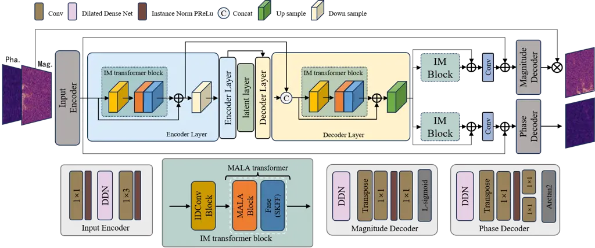
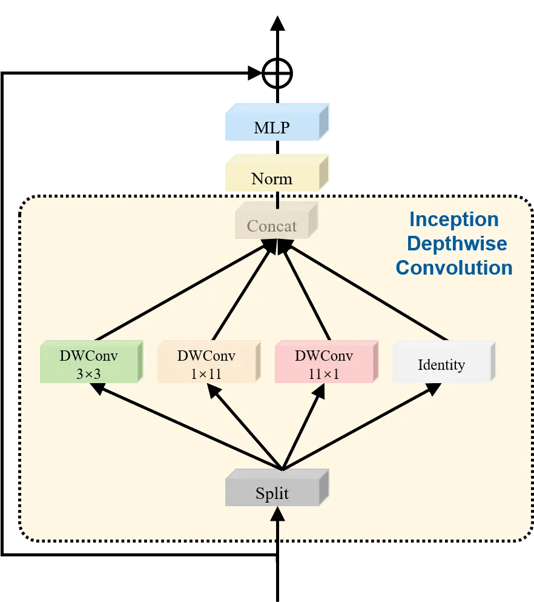

Tang Qin^(∗) Li College of Electronics and Information Engineering,
Shenzhen UniversityShenzhen, China Information Center, Shenzhen
UniversityShenzhen, China

# IMSE: Efficient U-Net-based Speech Enhancement using Inception Depthwise Convolution and Amplitude-Aware Linear AttentionThanks: This work was supported by the Research on Key Technologies of Data Security for Urban Gas Industrial IoT Systems Based on National Commercial Cryptography (Grant No. KJZD20230923114906013).

Xinxin    Bin    Yufang Affiliation:  Affiliation: 

###### Abstract

Achieving a balance between lightweight design and high performance
remains a significant challenge for speech enhancement (SE) tasks on
resource-constrained devices. Existing state-of-the-art methods, such as
MUSE, have established a strong baseline with only 0.51M parameters by
introducing a Multi-path Enhanced Taylor (MET) transformer and
Deformable Embedding (DE). However, MUSE suffers from structural
redundancy due to its approximate-then-compensate attention mechanism
and computationally expensive deformable offsets. We propose IMSE to
resolve these bottlenecks via: 1) Amplitude-Aware Linear Attention
(MALA), which fundamentally rectifies magnitude loss in linear
attention, eliminating the need for auxiliary compensation branches; and 2) Inception Depthwise Convolution (IDConv), which efficiently captures
the anisotropic features of spectrograms (e.g., harmonic strips) using
decomposed static kernels instead of heavy dynamic deformations.
Extensive experiments on the VoiceBank+DEMAND dataset demonstrate that
IMSE significantly reduces the parameter count by 16.8% (from 0.513M to
0.427M) while achieving superior performance compared to the MUSE
baseline. Specifically, it achieves a PESQ score of 3.399, setting a new
state-of-the-art benchmark for ultra-lightweight speech enhancement
models.

###### keywords

Speech Enhancement, U-Net, Linear Attention, Inception Convolution, Deep
Learning, Lightweight Network

^(†)^(†)email: 2510043011@mails.szu.edu.cn, qinbin@szu.edu.cn,
2510043056@mails.szu.edu.cn^(†)^(†) \* Corresponding author.

## 1 Introduction

Speech enhancement (SE) algorithms, a core technology in the speech
signal processing field, aim to recover clean speech from
noise-corrupted signals, thereby improving speech quality and
intelligibility. This technology has wide-ranging applications in mobile
communications, hearing aid design, and automatic speech recognition
(ASR) front-ends. In recent years, with the rapid development of deep
learning, deep neural network (DNN)-based SE methods \[1, 2, 3, 4\] have
achieved performance significantly superior to traditional signal
processing methods in suppressing non-stationary noise and
reverberation.

Currently, mainstream SE models typically adopt Encoder-Decoder or
Two-Stage architectures, utilizing time-frequency (T-F) domain masking
or complex spectral mapping for enhancement. To capture long-range
contextual dependencies, the Transformer \[5, 6\] and its variants have
been widely introduced into SE tasks. However, the standard
self-attention mechanism has a computational complexity of $`O(N^{2})`$
(quadratic to the sequence length $`N`$), which is prohibitive for
processing long speech sequences at high sampling rates. Furthermore, to
achieve SOTA performance, existing models often stack a large number of
layers and channels, leading to a surge in model parameters and
computation, making real-time deployment on edge devices difficult.

To address these issues, Zizhen Lin et al. recently proposed MUSE \[7\],
a lightweight U-Net-based model (0.51M parameters). MUSE’s success is
attributed to two key designs: first, the use of Deformable Embedding
(DE) to adapt to the irregular shapes of spectrogram patterns; second,
the proposal of the Multi-path Enhanced Taylor (MET) transformer, which
uses Taylor expansion to reduce attention complexity to linear and
compensates for information loss with an additional convolutional
branch.

Although MUSE achieves an impressive balance, we argue that its core
components still have room for optimization:

1.  1.  Complexity of the MET module: MET employs Taylor Self-Attention
        (T-MSA) \[8\] as its core. However, Qihang Fan et al. \[9\] pointed
        out that standard linear attention formulas lose the amplitude
        information of the Query vector during normalization, leading to
        overly smooth and non-selective attention distributions. To
        compensate for this, MUSE must introduce a complex CSA branch, which
        adds structural redundancy.
2.  2.  Computational Overhead of the DE module: Although the Deformable
        Star-shaped Dilated Convolution (DSDCN) \[8\] in the DE module can
        flexibly adapt to spectrogram features, its offset generation and
        bilinear interpolation operations require additional computational
        resources during inference.

In light of this, this paper proposes IMSE¹¹ 1 Our open-source code is
available at:
[https://github.com/XinXinTang123/IMSE](https://github.com/XinXinTang123/IMSE),
aiming to further compress the model and maximize parameter efficiency
by introducing more advanced algorithms. Our main contributions are as
follows:

- •
  We introduce Amplitude-Aware Linear Attention (MALA) \[9\] to replace
  the MET module. MALA, through a novel normalization strategy,
  reintroduces the Query’s amplitude information, enabling linear
  attention to produce sharp and accurate distributions similar to
  Softmax attention. This maintains strong global modeling capabilities
  even after removing the compensation branch.
- •
  We employ Inception Depthwise Convolution (IDConv) \[10\] to replace
  the DSDCN in the DE module. IDConv decomposes large-kernel
  convolutions into multiple parallel small-kernel and strip
  convolutions, maintaining a large receptive field and enhancing
  anisotropic feature extraction while reducing parameters and
  computational complexity.
- •
  Experimental results on the VoiceBank+DEMAND dataset show that IMSE,
  with only 0.427M parameters, achieves a SOTA trade-off between
  performance and efficiency, surpassing the original MUSE model in
  terms of parameter efficiency while maintaining superior speech
  quality.

## 2 Related Work

### 2.1 Efficient Speech Enhancement Networks

Early deep SE methods relied mainly on CNNs and RNNs. To handle long
sequences, TSTNN \[11\] proposed a two-stage Transformer architecture.
To reduce computation, MP-SENet \[12\] adopted a strategy of processing
magnitude and phase in parallel. MUSE \[7\] further combined the U-Net
architecture with a linear Transformer, exploring an ultra-lightweight
design under 1M parameters. Our work continues this line of research,
focusing on discovering more efficient fundamental algorithms.

### 2.2 Linear Attention Mechanisms

The quadratic complexity of the standard Transformer is its main
bottleneck in long-sequence tasks. Linear attention reduces the
$`O(N^{2})`$ complexity to $`O(N)`$ using the kernel trick. Common
approaches include using $`\phi(x)=\text{elu}(x)+1`$ or ReLU as the
kernel function. However, these methods often overlook the amplitude
information loss caused by the non-linear activation. MALA, recently
proposed by Qihang Fan et al. \[9\], deeply analyzes this
”amplitude-ignoring” phenomenon and proposes a magnitude-preserving
computation paradigm, significantly boosting linear attention
performance. IMSE leverages this latest advancement to streamline the
network structure.

### 2.3 Large-Kernel Convolution and Decomposition

To expand the receptive field of CNNs, researchers have proposed
large-kernel convolutions (e.g., $`7\times 7`$ or larger). However,
these have high parameter and computational costs. InceptionNeXt \[10\]
proposed an Inception-based decomposition strategy, splitting a
large-kernel depthwise convolution into multiple branches, such as
$`K\times K`$, $`1\times K`$, and $`K\times 1`$. This design not only
reduces computational cost but its strip convolution kernels are highly
suitable for capturing features along the time axis (duration) and
frequency axis (harmonic structures) in spectrograms, aligning well with
the physical properties of speech signals.

## 3 Proposed Method

The overall architecture of IMSE is shown in Fig. 1. It retains the
four-level U-Net backbone of MUSE, processing complex-valued features
from the STFT. This section focuses on the two core modules we replaced:
Inception Depthwise Convolution Embedding (IDConv) and Amplitude-Aware
Linear Attention (MALA).

### 3.1 Amplitude-Aware Linear Attention (MALA)

The MET module approximates Softmax via Taylor expansion but sacrifices
the Query’s magnitude information, resulting in over-smoothed attention.
Consequently, MUSE requires a redundant branch to compensate. We instead
adopt MALA, which mathematically rectifies this flaw by reintroducing
magnitude via a division-based normalization. This restores the
sharpness of Softmax attention at $`O(N)`$ complexity without structural
redundancy.

To address this, we replace MET with Amplitude-Aware Linear Attention
(MALA) \[9\]. The core idea of MALA is to reintroduce the amplitude
information of the query $`Q`$ into linear attention, allowing it to
mimic Softmax properties while maintaining $`O(N)`$ linear complexity.

MALA abandons traditional addition-based normalization (like Softmax)
and instead adopts a division-based normalization method. It first maps
$`Q`$ and $`K`$ through a non-linear kernel $`\phi(\cdot)`$ (e.g.,
$`\phi(x)=\text{elu}(x)+1`$) to ensure non-negative attention scores.

For the $`i`$-th query $`Q_{i}`$, MALA introduces a scaling factor
$`\beta`$ and an offset term $`\gamma`$. The attention score is defined
as:

```math
\text{Attn}(Q_{i},K_{j})=\beta\phi(Q_{i})\phi(K_{j})^{T}-\gamma \tag{1}
```

where $`\beta`$ and $`\gamma`$ are dynamically calculated based on the
magnitude of $`Q_{i}`$, defined as:

```math
\displaystyle\beta \displaystyle=1+\frac{1}{\phi(Q_{i})\sum_{m=1}^{N}\phi(K_{m})^{T}} \tag{2}
```

```math
\displaystyle\gamma \displaystyle=\frac{{\phi(Q_{i})\sum_{m=1}^{N}\phi(K_{m})^{T}}}{N} \tag{3}
```

Note that the denominator $`\phi(Q_{i})\sum_{m=1}^{N}\phi(K_{m})^{T}`$
is a scalar that captures the interaction between $`Q_{i}`$’s magnitude
and all $`K`$.

Applying the attention scores to the values $`V`$, the complete
computation of MALA is as follows:

```math
\displaystyle Y_{i} \displaystyle=\sum_{j=1}^{N}\text{Attn}(Q_{i},K_{j})V_{j} \tag{4}
```

```math
\displaystyle=\sum_{j=1}^{N}(\beta\phi(Q_{i})\phi(K_{j})^{T}-\gamma)V_{j} \tag{5}
```

```math
\displaystyle=\beta\phi(Q_{i})\left(\sum_{j=1}^{N}\phi(K_{j})^{T}V_{j}\right)-\gamma\left(\sum_{j=1}^{N}V_{j}\right) \tag{6}
```

Through this design, MALA successfully integrates the magnitude
information of $`Q_{i}`$ into the calculation of $`\beta`$ and
$`\gamma`$. As shown in the original paper, when the magnitude
$`\phi(Q_{i})`$ increases, $`\beta`$ and $`\gamma`$ adjust accordingly,
making the attention distribution more concentrated and ”sharp,”
consistent with the behavior of Softmax attention.

Finally, the computation in Eq. (6) utilizes the associative property of
linear attention (i.e., $`Q(K^{T}V)`$), pre-calculating
$`\sum_{j=1}^{N}\phi(K_{j})^{T}V_{j}`$ and $`\sum_{j=1}^{N}V_{j}`$ as
context vectors. This allows MALA to efficiently simulate the
magnitude-aware properties of Softmax attention at $`O(N)`$ linear
complexity, thereby precisely capturing global context in the speech
signal.



Figure 1: The overall architecture of IMSE.



Figure 2: Details of IDConv modules. The figure shows how IDConv splits
features for processing.

### 3.2 Inception Depthwise Convolution Embedding (IDConv)

Speech spectrograms exhibit strong anisotropy—continuous temporal
formants appear as horizontal strips, while wideband noise appears as
vertical strips. Unlike MUSE’s DSDCN which expends resources learning
dynamic shapes, IDConv explicitly targets these physics-driven patterns
using decomposed strip convolutions ($`1\times K,K\times 1`$). This
captures acoustic textures with a static, lightweight structure,
avoiding the latency of bilinear interpolation.

Inspired by InceptionNeXt \[10\], we introduce IDConv as the feature
embedding layer. IDConv splits the input channels into four groups,
processed through different paths:

- •
  Branch 1 (Identity): An identity mapping to preserve original features
  and aid gradient propagation.
- •
  Branch 2 (Square Kernel): Uses a $`3\times 3`$ depthwise convolution
  (DW) to capture local time-frequency details.
- •
  Branch 3 (Horizontal Band): Uses a $`1\times 11`$ depthwise (strip)
  convolution, specializing in capturing long-term dependencies along
  the time axis, such as speech duration features.
- •
  Branch 4 (Vertical Band): Uses an $`11\times 1`$ depthwise (strip)
  convolution, specializing in capturing structures along the frequency
  axis, such as harmonic correlations.

Formally, let the input feature be $`X`$. We split it along the channel
dimension into $`X_{1},X_{2},X_{3},X_{4}`$. The output $`Y`$ is
expressed as:

```math
Y=\text{Concat}(X_{1},\text{DW}_{3\times 3}(X_{2}),\text{DW}_{1\times 11}(X_{3}),\text{DW}_{11\times 1}(X_{4})) \tag{7}
```

This decomposition strategy not only mimics the ability of deformable
convolution to adapt to the elongated, ”crescent-like” shapes of speech
features in spectrograms \[7\], but is also based entirely on static
convolutions, greatly optimizing memory access and inference speed.
Unlike square kernels used in visual tasks, speech spectrograms exhibit
distinct anisotropic patterns (e.g., harmonic structures along the
frequency axis and temporal continuity along the time axis). Our IDConv
is specifically adapted to capture these acoustic characteristics using
strip convolutions.

## 4 Experiments

### 4.1 Datasets and Experimental Setup

We evaluate IMSE on the widely-used VoiceBank+DEMAND dataset \[3\].

- •
  Dataset: The training set contains 11,572 noisy utterances from 28
  speakers, mixed with 10 noise types (at SNRs of 0, 5, 10, 15 dB). The
  test set contains 824 utterances from 2 unseen speakers (at SNRs of
  2.5, 7.5, 12.5, 17.5 dB).
- •
  Preprocessing: All audio is downsampled to 16kHz. STFT uses a 32ms
  frame length (510 points) and a 16ms frame shift (256 points).
- •
  Training Details: We use the AdamW optimizer for 100 epochs with an
  initial learning rate of $`5\times 10^{-4}`$. To ensure an
  ultra-lightweight model, we set the model’s base channel count to 16.

### 4.2 Evaluation Metrics

We use five standard objective metrics to evaluate the quality of the
enhanced speech:

- •
  PESQ: Perceptual Evaluation of Speech Quality (Range: -0.5 to 4.5).
- •
  CSIG: Mean Opinion Score (MOS) prediction of signal distortion (Range:
  1 to 5).
- •
  CBAK: MOS prediction of background noise interference (Range: 1 to 5).
- •
  COVL: MOS prediction of overall quality (Range: 1 to 5).
- •
  STOI: Short-Time Objective Intelligibility (Range: 0 to 1).

| Method                 | Year | Params (M) | PESQ  | CSIG | CBAK | COVL | STOI |
| ---------------------- | ---- | ---------- | ----- | ---- | ---- | ---- | ---- |
| Noisy                  | -    | -          | 1.97  | 3.35 | 2.44 | 2.63 | 0.91 |
| SEGAN \[13\]           | 2017 | 43.2       | 2.16  | 3.48 | 2.94 | 2.80 | 0.92 |
| DEMUCS \[14\]          | 2019 | 33.53      | 3.07  | 4.31 | 3.40 | 3.63 | 0.95 |
| SE-Conformer \[15\]    | 2021 | -          | 3.13  | 4.45 | 3.55 | 3.82 | 0.95 |
| MetricGAN+ \[16\]      | 2021 | -          | 3.15  | 4.14 | 3.16 | 3.64 | -    |
| TSTNN \[11\]           | 2021 | 0.92       | 2.96  | 4.33 | 3.53 | 3.67 | 0.95 |
| DB-AIAT \[17\]         | 2022 | 2.81       | 3.31  | 4.61 | 3.75 | 3.96 | -    |
| DPT-FSNet \[18\]       | 2022 | 0.88       | 3.33  | 4.58 | 3.72 | 4.00 | 0.96 |
| PHASEN \[19\]          | 2020 | 20.9       | 2.99  | 4.18 | 3.45 | 3.50 | 0.95 |
| MetricGAN-OKDv2 \[20\] | 2023 | 0.82       | 3.12  | 4.27 | 3.16 | 3.71 | 0.95 |
| MANNER \[21\]          | 2022 | 24.07      | 3.21  | 4.53 | 3.65 | 3.91 | 0.95 |
| MANNER-S-5.3GF \[22\]  | 2022 | 0.90       | 3.06  | 4.42 | 3.58 | 3.77 | 0.95 |
| MUSE (Baseline) \[7\]  | 2024 | 0.513      | 3.370 | 4.63 | 3.80 | 4.10 | 0.95 |
| IMSE (Ours)            | 2025 | 0.427      | 3.399 | 4.67 | 3.83 | 4.14 | 0.95 |

Table 1: Quantitative comparison with other SOTA methods on the
VoiceBank+DEMAND dataset. ”-” indicates the metric was not reported in
the original paper. Bold indicates the best result.

### 4.3 Comparison with State-of-the-Art Methods

Table 1 presents the comparison of IMSE with other advanced SE methods.
We select classic models like SEGAN, TSTNN, and our baseline, MUSE, for
comparison.

As shown in Table 1, IMSE achieves a PESQ score of 3.399 with only
0.427M parameters.

1.  1.  Comparison with baseline MUSE: IMSE not only reduces the parameter
        count by 16.8% (0.427M vs. 0.513M) but also improves the speech
        quality across all metrics. Notably, PESQ increases from 3.370 to
        3.399, and CSIG/COVL see significant gains (4.67 vs 4.63, 4.14 vs
        4.10). This demonstrates that our lightweight design extracts
        features more effectively than the redundant structures in MUSE.
2.  2.  Comparison with other lightweight models: Compared to TSTNN (0.92M)
        and DPT-FSNet (0.88M), IMSE achieves significantly better
        performance (e.g., PESQ 3.373 vs. 2.96) with roughly half the
        parameters.

### 4.4 Ablation Study

To verify the effectiveness of our two core components (MALA and
IDConv), we conducted a detailed ablation study under the same
experimental settings. The results are shown in Table 2.

- •
  Effectiveness of MALA: When we replaced MET in MUSE with MALA (Row 2),
  the parameter count dropped significantly to 0.438M (a 14.6% reduction
  from 0.513M). Surprisingly, performance did not degrade but slightly
  improved on PESQ (3.372). This confirms that MALA, by rectifying the
  ’amplitude-ignoring’ issue, maintains strong modeling power while
  removing the redundant compensation branch.
- •
  Effectiveness of IDConv: When we only replaced the DSDCN module in DE
  with IDConv (Row 3), parameters decreased slightly (0.501M), but PESQ
  improved significantly to 3.392. This suggests that multi-scale
  convolutional decomposition captures spectrogram texture features more
  effectively than deformable convolution alone.
- •
  Combined Effect: IMSE (Row 4) integrates both MALA and IDConv.
  Remarkably, this combination achieves the highest performance across
  all metrics, with a PESQ of 3.399, surpassing both the baseline and
  the single-module variants (e.g., 3.392 for IDConv-only).

  This result reveals a strong synergistic effect: MALA captures global
  amplitude-aware dependencies, while IDConv meticulously extracts
  anisotropic local spectral features. The combination allows the model
  to achieve peak performance with the lowest parameter count (0.427M),
  proving that efficiency and high-quality reconstruction can be
  achieved simultaneously without compromise.

| Model Configuration       | Params (M) | PESQ  | CSIG | CBAK | COVL |
| ------------------------- | ---------- | ----- | ---- | ---- | ---- |
| 1. MUSE (Base)            | 0.513      | 3.370 | 4.63 | 3.80 | 4.10 |
| 2. + MALA (replaces MET)  | 0.438      | 3.372 | 4.61 | 3.80 | 4.09 |
| 3. + IDConv (replaces DE) | 0.501      | 3.392 | 4.65 | 3.82 | 4.13 |
| 4. IMSE (Ours)            | 0.427      | 3.399 | 4.67 | 3.83 | 4.14 |

Table 2: Ablation study on component contributions. Validating the
impact of MALA and IDConv on model parameters and performance.

## 5 Conclusion

This paper proposed IMSE, an ultra-lightweight speech enhancement
network. Targeting the efficiency bottlenecks in the existing SOTA model
MUSE, we utilized Inception Depthwise Convolution (IDConv) to
efficiently capture multi-scale spectrogram features and Amplitude-Aware
Linear Attention (MALA) to resolve the flaws of traditional linear
attention. Experimental results strongly demonstrate that IMSE achieves
an optimal balance between lightweight design and high performance. It
achieves a PESQ score of 3.399 with an extremely low parameter count of
0.427M, establishing a new benchmark for efficiency. Future work will
focus on deploying this model on actual low-power chips and exploring
its application in real-time speech communication.

## References

- \[1\] A. E. Bulut and K. Koishida, “Low-latency single channel speech
  enhancement using u-net convolutional neural networks,” in _ICASSP
  2020-2020 IEEE International Conference on Acoustics, Speech and
  Signal Processing (ICASSP)_. IEEE, 2020, pp. 6214–6218.
- \[2\] D. N. Tran and K. Koishida, “Single-channel speech enhancement
  by subspace affinity minimization.” in _INTERSPEECH_, 2020, pp.
  2447–2451.
- \[3\] C. V. Botinhao, X. Wang, S. Takaki, and J. Yamagishi,
  “Investigating rnn-based speech enhancement methods for noise-robust
  text-to-speech,” in _9th ISCA speech synthesis workshop_, 2016, pp.
  159–165.
- \[4\] E. Moliner and V. Välimäki, “A two-stage u-net for high-fidelity
  denoising of historical recordings,” in _ICASSP 2022-2022 IEEE
  International Conference on Acoustics, Speech and Signal Processing
  (ICASSP)_. IEEE, 2022, pp. 841–845.
- \[5\] H. Neil and W. Dirk, “Transformers for image recognition at
  scale,” _Online: https://ai. googleblog.
  com/2020/12/transformers-for-image-recognitionat. html_, 2020.
- \[6\] A. Vaswani, N. Shazeer, N. Parmar, J. Uszkoreit, L. Jones, A. N.
  Gomez, Ł. Kaiser, and I. Polosukhin, “Attention is all you need,”
  _Advances in neural information processing systems_, vol. 30, 2017.
- \[7\] Z. Lin, X. Chen, and J. Wang, “Muse: Flexible voiceprint
  receptive fields and multi-path fusion enhanced taylor transformer for
  u-net-based speech enhancement,” _arXiv preprint
  arXiv:2406.04589_, 2024.
- \[8\] Y. Qiu, K. Zhang, C. Wang, W. Luo, H. Li, and Z. Jin,
  “Mb-taylorformer: Multi-branch efficient transformer expanded by
  taylor formula for image dehazing,” in _Proceedings of the IEEE/CVF
  international conference on computer vision_, 2023, pp. 12 802–12 813.
- \[9\] Q. Fan, H. Huang, Y. Ai, and R. He, “Rectifying magnitude
  neglect in linear attention,” in _Proceedings of the IEEE/CVF
  International Conference on Computer Vision_, 2025, pp. 21 505–21 514.
- \[10\] W. Yu, P. Zhou, S. Yan, and X. Wang, “Inceptionnext: When
  inception meets convnext,” in _Proceedings of the IEEE/cvf conference
  on computer vision and pattern recognition_, 2024, pp. 5672–5683.
- \[11\] K. Wang, B. He, and W.-P. Zhu, “Tstnn: Two-stage transformer
  based neural network for speech enhancement in the time domain,” in
  _ICASSP 2021-2021 IEEE international Conference on acoustics, speech
  and signal processing (ICASSP)_. IEEE, 2021, pp. 7098–7102.
- \[12\] Y.-X. Lu, Y. Ai, and Z.-H. Ling, “Mp-senet: A speech
  enhancement model with parallel denoising of magnitude and phase
  spectra,” _arXiv preprint arXiv:2305.13686_, 2023.
- \[13\] S. Pascual, A. Bonafonte, and J. Serra, “Segan: Speech
  enhancement generative adversarial network,” _arXiv preprint
  arXiv:1703.09452_, 2017.
- \[14\] A. Défossez, N. Usunier, L. Bottou, and F. Bach, “Demucs: Deep
  extractor for music sources with extra unlabeled data remixed,” _arXiv
  preprint arXiv:1909.01174_, 2019.
- \[15\] E. Kim and H. Seo, “Se-conformer: Time-domain speech
  enhancement using conformer.” in _Interspeech_, 2021, pp. 2736–2740.
- \[16\] S.-W. Fu, C. Yu, T.-A. Hsieh, P. Plantinga, M. Ravanelli,
  X. Lu, and Y. Tsao, “Metricgan+: An improved version of metricgan for
  speech enhancement,” _arXiv preprint arXiv:2104.03538_, 2021.
- \[17\] G. Yu, A. Li, C. Zheng, Y. Guo, Y. Wang, and H. Wang,
  “Dual-branch attention-in-attention transformer for single-channel
  speech enhancement,” in _ICASSP 2022-2022 IEEE International
  Conference on Acoustics, Speech and Signal Processing (ICASSP)_. IEEE,
  2022, pp. 7847–7851.
- \[18\] F. Dang, H. Chen, and P. Zhang, “Dpt-fsnet: Dual-path
  transformer based full-band and sub-band fusion network for speech
  enhancement,” in _ICASSP 2022-2022 IEEE International Conference on
  Acoustics, Speech and Signal Processing (ICASSP)_. IEEE, 2022, pp.
  6857–6861.
- \[19\] D. Yin, C. Luo, Z. Xiong, and W. Zeng, “Phasen: A
  phase-and-harmonics-aware speech enhancement network,” in _Proceedings
  of the AAAI conference on artificial intelligence_, vol. 34, no. 05,
  2020, pp. 9458–9465.
- \[20\] W. Shin, B. H. Lee, J. S. Kim, H. J. Park, and S. W. Han,
  “Metricgan-okd: multi-metric optimization of metricgan via online
  knowledge distillation for speech enhancement,” in _International
  Conference on Machine Learning_. PMLR, 2023, pp. 31 521–31 538.
- \[21\] H. J. Park, B. H. Kang, W. Shin, J. S. Kim, and S. W. Han,
  “Manner: Multi-view attention network for noise erasure,” in _ICASSP
  2022-2022 IEEE International Conference on Acoustics, Speech and
  Signal Processing (ICASSP)_. IEEE, 2022, pp. 7842–7846.
- \[22\] W. Shin, H. J. Park, J. S. Kim, B. H. Lee, and S. W. Han,
  “Multi-view attention transfer for efficient speech enhancement,”
  _arXiv preprint arXiv:2208.10367_, 2022.
