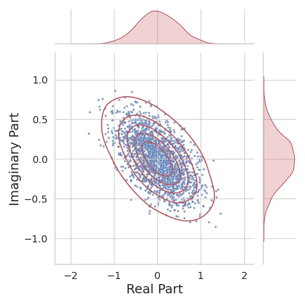
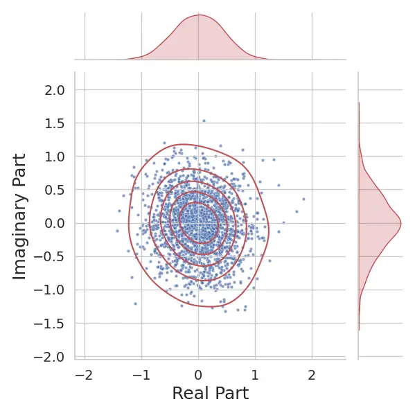
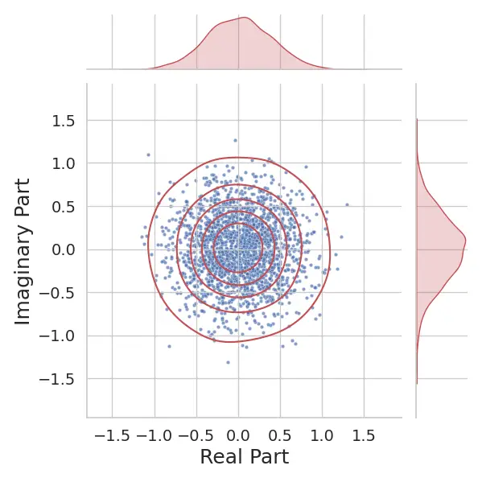

# Is phase really needed for weakly-supervised dereverberation ?

Marius RODRIGUES^(\*)    Louis BAHRMAN^(\*)    Roland BADEAU^(\*)   
Gaël RICHARD^(\*) ^(†)^(†)thanks: With support from the European Union
(ERC, HI-Audio - Hybrid and Interpretable Deep neural audio machines,
101052978). Views and opinions expressed are however those of the
author(s) only and do not necessarily reflect those of the European
Union or the European Research Council. Neither the European Union nor
the granting authority can be held responsible for them.

###### Abstract

In unsupervised or weakly-supervised approaches for speech
dereverberation, the target clean (dry) signals are considered to be
unknown during training. In that context, evaluating to what extent
information can be retrieved from the sole knowledge of reverberant
(wet) speech becomes critical. This work investigates the role of the
reverberant (wet) phase in the time–frequency domain. Based on
Statistical Wave Field Theory, we show that late reverberation perturbs
phase components with white, uniformly distributed noise, except at low
frequencies. Consequently, the wet phase carries limited useful
information and is not essential for weakly supervised dereverberation.
To validate this finding, we train dereverberation models under a recent
weak supervision framework and demonstrate that performance can be
significantly improved by excluding the reverberant phase from the loss
function.

###### Index Terms: 

Speech dereveberation, reverberation modeling, phase retrieval,
unsupervised learning

^(†)^(†)address: ^(∗)LTCI, Télécom Paris, Institut Polytechnique de
Paris

## 1 Introduction

Acoustic waves propagating in enclosed environments are subject to
_reverberation_, a phenomenon arising from the repeated and decaying
reflections of sound waves against room boundaries. In room acoustics,
reverberation is commonly decomposed into three components: the _direct
path_, _early reflections_, and _late reverberation_. Various models
have been proposed to characterize reverberation \[1\], ranging from
physics-based approaches \[2\], \[3\], \[4\], to perception-oriented
frameworks \[5\], \[6\], or hybrid methods combining both perspectives
\[7\]. More recently, the _Statistical Wave Field Theory_ has introduced
a physics-based statistical formulation of late reverberation by
analyzing the wave equation in the asymptotic regime of long times and
high frequencies \[4\], offering a principled framework particularly
suited to the present study that focuses on late reverberation.

On the other hand, dereverberation refers to the process of recovering a
clean (dry) speech signal from its reverberant counterpart, and can be
viewed as the inverse problem of reverberation. This task is of critical
importance in several applications, including automatic speech
recognition, hearing aids and teleconferencing systems where
reverberation often degrades both intelligibility and performance.

As the degradation model is generally not known in practice, this
ill-posed problem has been recently solved by modeling either the
source-receiver system explicitly \[8\], \[9\], \[10\] or only the
source in implicit data-driven approaches \[11\], \[12\], \[13\].

In generic speech enhancement, it has been demonstrated that integrating
the phase spectrum into the enhancement process can improve the
resulting quality \[14\], \[15\]. For that reason, current
state-of-the-art machine learning approaches for speech enhancement such
as TF-GridNet \[16\] or FullSubNet \[12\] include the phase in their
training objective. However, these approaches rely on full supervision
and require access to the dry phase during training \[16\], \[11\],
\[17\]. In scenarios of weak or self supervision, phase reconstruction
is expected to be more challenging, since the algorithm can only rely on
the knowledge of reverberant signals, in which phase has been corrupted.
Some recent approaches seem to circumvent this problem by discarding
reverberant phase information \[12\], reuse the reverberant phase as dry
phase \[13\], or using phase retrieval as a refining post-processing
step \[18\], \[19\], \[20\], \[21\]. Indeed, it was demonstrated that
keeping the distorted phase may be the best option \[22\], under a
circularity assumption of measured signals.

In this paper, we demonstrate that this assumption physically holds for
reverberation distortion. More precisely, we quantify to what extent
reverberation degrades the phase of the dry signal, and how unsupervised
dereverberation approaches should be adapted to these constraints. Our
main result is that, in theory and in practice, reverberant signals,
under reasonable acoustic conditions, hold almost no information about
the dry phase. The contribution of this paper is then twofold:

- •
  We establish, based on the _Statistical Wave Field Theory_, that phase
  perturbations induced by late reverberation are statistically uniform
  and white in the time–frequency domain. This finding arises from the
  physics of wave propagation and is not restricted to any specific
  signal-processing-based reverberation model.
- •
  We experimentally demonstrate the benefit of incorporating
  phase-invariance into model training when access to clean reference
  signals is limited. This analysis is conducted within the weakly
  supervised framework introduced in \[13\], which provides a
  representative case study for validating our claim.

These results suggest that weakly or self-supervised models may achieve
significant gains simply by ignoring reverberant phase information. For
reproducibility purposes and to help future research, detailed
mathematical proofs, code, pretrained models and audio examples are made
publicly available¹¹ 1 https://mariusrod.github.io/PhaseInv-WSSD/ (code
will be openly distributed upon acceptance).

## 2 Statistical modeling

From a signal processing point of view, the reverberation phenomenon can
be considered as a filtering operation. Denoting as $`s`$ the original
dry signal, and $`h`$ the so-called Room Impulse Response (RIR), the
resulting reverberant signal is the convolution of $`s`$ with $`h`$:

```math
y=s\star h. \tag{1}
```

From a physical point of view, reverberation is the diffuse mixing of a
sound wave with its echoes after many reflections against the room’s
walls. Recently introduced, the _Statistical Wave Field Theory_ proposes
a probabilistic approach to solving the wave equation \[4\]. Its results
generalize those from \[3\], allowing to derive the first and second
moments of any RIR in long times and at high frequencies.

The broadly used simplified Polack model expresses the late RIR as an
exponentially decaying Gaussian white noise:

```math
h(t)=\sqrt{B}\varepsilon(t)e^{-\frac{\alpha}{2}t}, \tag{2}
```

where $`\varepsilon(t)\sim\mathcal{N}(0,1)`$, $`B`$ is the late
reverberation magnitude, and $`\alpha`$ is the decaying rate, related to
the so-called reverberation time $`RT_{60}`$ through
$`\alpha=\frac{6\ln(10)}{RT_{60}}`$. While this model is perceptually
accurate, observations show that the parameters $`\alpha`$ and $`B`$ are
actually frequency-dependent. One of the key results of the Statistical
Wave Field Theory confirms that fact and establish the
physically-accurate _generalized_ Polack model. With formal words, a
Polack RIR $`h`$ with frequency-dependent parameters $`\alpha(f)`$ and
$`B(f)`$ can be described as follows:

- •
  $`h`$ is Gaussian and centered
- •
  and its autocovariance
  $`\gamma_{h}(t,\tau):={\mathbb{E}}[h(t+\frac{\tau}{2})h(t-\frac{\tau}{2})]`$
  is given by:

  ```math
  \gamma_{h}(t,\tau)={\mathds{1}}_{{\mathbb{R}}^{+}}(t)\int B(f)e^{-\alpha(f)t+2i\pi f\tau}\text{d}f. \tag{3}
  ```

Note here that $`B(f)`$ and $`\alpha(f)`$ are necessarily symmetric to
ensure $`h`$ is real. Another interesting property is that any scalar
product $`\langle h,\varphi\rangle:=\int h\varphi`$ is also Gaussian,
with variance

```math
\sigma^{2}(\varphi)=\iint\varphi\left(t+\frac{\tau}{2}\right)\varphi\left(t-\frac{\tau}{2}\right)\gamma_{h}(t,\tau)\text{d}\tau\text{d}t. \tag{4}
```

In a more general way, the covariance between two scalar products is
given by:

```math
\text{Cov}(\langle h,\varphi\rangle,\langle h,\psi\rangle)=\iint\varphi\left(t+\frac{\tau}{2}\right)\psi\left(t-\frac{\tau}{2}\right)\gamma_{h}(t,\tau)\text{d}\tau\text{d}t. \tag{5}
```

## 3 Phase in reverberant signals



(a) $`f=10~Hz`$



(b) $`f=100~Hz`$



(c) $`f=1000~Hz`$

Figure 1: Distribution of the Fourier coefficients of a synthetic RIR in
the complex plane, at 3 different frequencies. To parametrize the RIR,
$`\alpha(f)`$ and $`B(f)`$ are autoregressive (AR) profiles of order 8
whose poles are randomly chosen in the unit disk. Here, their means over
$`f`$ are respectively $`\bar{\alpha}\simeq 0.0113s^{-1}`$
(corresponding to a reverberation time of approximately $`82~ms`$) and
$`\bar{B}\simeq 0.0029`$

In this section, we present the main result of our paper: late
reverberation introduces a uniform phase perturbation in the reverberant
signal.

### 3.1 Asymptotical phase distribution in the Fourier space

###### Proposition 1.

In formal words, if we consider the RIR $`h`$ to be randomly sampled
according to the generalized Polack model, as in Section 2, with
parameters $`\alpha(f)`$ and $`B(f)`$, and $`H`$ its Fourier transform,
then, asymptotically when $`f\to+\infty`$,

```math
H(f)\sim{\cal N}_{\mathbb{C}}\left(0,\frac{B(f)}{\alpha(f)}\right). \tag{6}
```

The proposition can be proven by expressing the Fourier transform of
$`h`$ along the real and imaginary axes. Denoting
$`c_{f}(t)=\cos(2\pi ft)`$ and $`s_{f}(t)=\sin(2\pi ft)`$, we get:

```math
\displaystyle H(f) \displaystyle:=\int h(t)e^{-2i\pi ft}\text{d}t \tag{7}
```

```math
\displaystyle=\langle h,c_{f}\rangle-i\langle h,s_{f}\rangle. \tag{8}
```

Following the Statistical Wave Field Theory, $`H(f)`$ can be viewed as a
bi-dimensional centered Gaussian random variable whose covariance matrix
$`\Sigma(f):=\begin{pmatrix}\sigma^{2}_{+}(f)&C(f)\\
C(f)&\sigma_{-}^{2}(f)\end{pmatrix}`$ can be computed thanks to the
variance and covariance expressions from Section 2. With help of
integration by parts and linearization formulas, one can end up with:

```math
\displaystyle\sigma_{\pm}^{2}(f) \displaystyle=\frac{B(f)}{2\alpha(f)}\pm\frac{B(0)}{2\alpha(0)\left[1+\left(\frac{4\pi f}{\alpha(0)}\right)^{2}\right]} \tag{9}
```

```math
\displaystyle=\frac{B(f)}{2\alpha(f)}\pm O\left(\frac{B(0)\alpha(0)}{f^{2}}\right), \tag{10}
```

and

```math
\displaystyle C(f)=\text{Cov}(\langle h,c_{f}\rangle,\langle h,s_{f}\rangle) \displaystyle=\frac{2\pi fB(0)}{\alpha(0)^{2}\left[1+\left(\frac{4\pi f}{\alpha(0)}\right)^{2}\right]} \tag{11}
```

```math
\displaystyle=O\left(\frac{B(0)}{f}\right). \tag{12}
```

Hence, for $`f\to+\infty`$,

- •
  $`\sigma_{+}^{2}(f)\simeq\sigma_{-}^{2}(f)\simeq\frac{B(f)}{2\alpha(f)},`$
- •
  $`C(f)\simeq 0,`$

which ends the proof.

Denoting $`\angle z`$ the argument of a complex number $`z`$, a direct
consequence of Proposition 1 is that, asymptotically
$`\angle H(f)\sim\text{Unif}([0,2\pi])`$. As the reverberant signal is
$`y=h\star s`$, if $`Y`$ and $`S`$ are the Fourier transforms of $`y`$
and $`s`$,

```math
\angle Y(f)=(\angle H(f)+\angle S(f))~\text{mod}~2\pi, \tag{13}
```

which yields $`\angle Y(f)|\angle S(f)\sim\text{Unif}([0,2\pi])`$ for
$`f\to+\infty`$.

### 3.2 Visualization on synthetic data

As the previous result is asymptotic, one could argue that the
phenomenon occurs only at high frequencies. However, it should be noted
from the previous demonstration that the convergence rates of the
variances $`\sigma_{\pm}^{2}(f)`$ are quadratic. Figure 1 shows the
statistical distribution of $`H`$ at specific frequencies $`f`$
($`10,100`$ and $`1000~Hz`$). To sample the RIRs under parameters
$`\alpha`$ and $`B`$, we modulated a centered Gaussian white noise
$`\varepsilon`$ on separated frequency bands $`[f_{i},f_{i+1}]`$:

```math
h[t]=\sum_{i=1}^{N}\sqrt{B(f_{i})}(\varepsilon\star\varphi_{i})[t]e^{-\frac{\alpha(f_{i})}{2}t}, \tag{14}
```

where $`\{\varphi_{i}\}_{i}`$ is a Butterworth filter bank on the
frequency subdivision $`0<f_{1}<...<f_{N-1}<\frac{F_{s}}{2}`$, $`F_{s}`$
being the sampling frequency. We observe that the probability
distribution of $`H(f)`$ starts to be isotropic around $`100~Hz`$ for a
mean $`RT_{60}`$ as low as $`82~ms`$. Longer reverberation times would
lead to even faster convergence, with isotropy appearing at frequencies
to the order of $`10~Hz`$.

### 3.3 Extension to the time-frequency domain

Taking inspiration from the proof presented in Section 3.1, an
expression can be computed for the autocorrelation of the RIR in the
Fourier space:

```math
{\mathbb{E}}\left[H\left(f+\frac{\xi}{2}\right)H^{*}\left(f-\frac{\xi}{2}\right)\right]=\frac{B(f)}{\alpha(f)}\cdot\frac{1-i\frac{2\pi\xi}{\alpha(f)}}{1+\left(\frac{2\pi\xi}{\alpha(f)}\right)^{2}}. \tag{15}
```

Note that, with a similar convergence rate as before, when
$`\xi\to+\infty`$, the correlation between frequency bins goes to $`0`$.
Similarly as before, reasonable values for $`\alpha`$ imply that a given
frequency coefficient $`H(f)`$ is only correlated to its neighbors
within a thin frequency band. Outside of this interval, the Fourier
coefficients can be considered as independent. In practice, signals are
analyzed in the spectro-temporal domain with a frequency bandwidth that
is at the order of or greater than $`10~Hz`$. A similar remark should
apply along the time axis, as long as the window size is large enough.
In the end, if $`\angle H`$ appears to be very close to a white uniform
noise, this is even more the case for time-frequency representations
such as the Short-Time Fourier Transform (STFT).

All-in-all, these theoretical results suggest that the reverberant’s
phase mostly carries unrelevant noise. An important remark to consider
along this claim is that our results are derived from the study of a
physics-based statistical description of late reverberation. Hence it is
more than just a modeling bottleneck, and should apply to real-life
RIRs. In consequence, as long as no access is guaranteed neither on the
original dry signal nor the exact phase perturbation, the reverberant’s
phase information should be used with caution or not at all.

## 4 Experiments and discussion

| Model             | $`f_{i}(z)`$ | SRMR $`\uparrow`$ | SISDR $`\uparrow`$ | WB-PESQ $`\uparrow`$ | ESTOI $`\uparrow`$ |
| ----------------- | ------------ | ----------------- | ------------------ | -------------------- | ------------------ | ---------------- | ------------------ | ---------------- | ---------------- |
| FSN               | $`z`$        | 3.859 ± 1.76      | -16.719 ± 1.07e+02 | 1.291 ± 1.82e-02     | 0.572 ± 5.80e-03   |
|                   | $`\log(1+    | z                 | )\frac{z}{         | z                    | }`$                | 3.246 ± 1.85     | -17.663 ± 7.94e+01 | 1.248 ± 1.51e-02 | 0.553 ± 5.94e-03 |
|                   | $`           | z                 | `$                 | 6.024 ± 3.00         | -16.252 ± 1.12e+02 | 1.381 ± 2.63e-02 | 0.642 ± 4.33e-03   |
|                   | $`\log(1+    | z                 | )`$                | 6.563 ± 3.88         | -16.541 ± 9.78e+01 | 1.405 ± 3.08e-02 | 0.647 ± 4.41e-03   |
| PI-FSN            | $`\log(1+    | z                 | )`$                | 6.604 ± 3.20         | -2.111 ± 2.95      | 1.428 ± 3.56e-02 | 0.645 ± 4.25e-03   |
| Input Reverberant |              | 4.357 ± 2.49      | -16.539 ± 1.05e+02 | 1.323 ± 2.38e-02     | 0.584 ± 5.77e-03   |

Table 1: Evaluation of the dereverberation models FSN and PI-FSN after
training by weak-supervision, under several configurations of the loss.
The equivalent evaluation of a model returning its input is given at the
last row. For every metric, the higher the better, the best result is in
bold form and second best is underlined.

This section aims to show how the previously presented
reverberation-induced uniform phase perturbation can influence the
training of dereverberation models.

### 4.1 Global settings

In our experiments, we chose to challenge the weakly-supervised speech
dereverberation method recently introduced in \[13\]. The global
pipeline of this method can be compared to the strategy of an
auto-encoder. In place of the encoder, a neural network computes an
estimation $`\hat{s}`$ of the dry signal, given the reverberant signal
$`y=s\star h`$. In place of the decoder, a RIR synthesizer is given the
reverberation parameters $`\alpha`$ and $`B`$ to produce a secondary RIR
$`\hat{h}`$ that, when convolved to $`\hat{s}`$, produces an estimate
$`\hat{y}`$ of the input reverberant signal. The dereverberation model
is then trained by optimizing a reconstruction loss
$`\mathcal{L}(y,\hat{y})`$. Hence, it has no access to dry phase
information during training, and can be considered a weakly-supervised
approach in that regard. For our purposes, we chose the following
settings:

- •
  Models: the dereverberator is chosen to be _FullSubNet_ (FSN) \[12\],
  an LSTM-based speech enhancement model used to test the above weakly
  supervised strategy in the original paper \[13\]. Its ability to
  combine full-band and sub-band spectro-temporal features makes it a
  good candidate to be paired with reverberation-informed training
  strategies. The original FSN takes as input the STFT magnitude of the
  reverberant signal and computes an estimation of the ideal _complex
  Ratio Mask_ (cRM) for retrieving the dry signal. For our purposes, we
  will also consider a phase-invariant version of FullSubNet (PI-FSN),
  by discarding the complex masking for a real positive one that
  conserves the original phase. For the models’ hyperparameter
  configuration, we simply follow the one from \[13\].
- •
  RIR synthesizer: as in \[13\], an RIR is drawn using 2, and depends on
  the decay rate $`\alpha`$ and magnitude $`B`$, which are supposedly
  known at training.
- •
  Losses: since the main purpose of this study is to demonstrate the
  effect of phase in model training, the considered losses are of the
  form:

  ```math
  \mathcal{L}(\mathcal{Y},\hat{\mathcal{Y}})={\mathbb{E}}[\|f_{i}(\mathcal{Y})-f_{i}(\hat{\mathcal{Y}})\|^{2}], \tag{16}
  ```

  where $`\mathcal{Y}`$, $`\hat{\mathcal{Y}}`$ are the STFTs of $`y`$
  and $`\hat{y}`$, and $`f_{i}`$ is one of the following post-processing
  functions:
  - $`\circ`$
    $`f_{1}(z)=z`$ (phase is kept + no compression)
  - $`\circ`$
    $`f_{2}(z)=\log(1+|z|)\frac{z}{|z|}`$ (phase is kept +
    log-compress.)
  - $`\circ`$
    $`f_{3}(z)=|z|`$ (phase discarded + no compression)
  - $`\circ`$
    $`f_{4}(z)=\log(1+|z|)`$ (phase discarded + log-compress.)

### 4.2 Training and testing data

The dataset used for our experiments is EARS-Reverb \[23\], a collection
of more than 100 hours of English speech recordings with various
intonations, intentions, and voicing styles. To this database is joint a
dereverberation benchmark gathering several sets of real-life RIRs
\[24\]\[25\]\[26\]\[27\]\[28\], totaling more than 2000 recordings.
Reverberant samples are obtained by randomly selecting dry/RIR pairs
$`(s_{i},h_{i})`$ and then convolving $`y_{i}=s_{i}\star h_{i}`$.
$`15\%`$ of the dataset is kept apart for testing and $`8\%`$ for
validation during training. The validation and test sets are built with
RIRs from separated sets of the EARS-Reverb benchmark to ensure the used
room acoustics are totally new to the model.

### 4.3 Evaluation and results

The performances of the trained models are evaluated using the
Scale-Invariant Signal to Distortion Ratio (SISDR) for the global
estimation error \[29\], the Speech to Reverberant Modulation energy
Ratio (SRMR) for reverberation-like distortion \[30\], the Wide-Band
Perceptual Estimation of Speech Quality (WB-PESQ) \[31\], and the
Extended Short-Time Objective Intelligibility (ESTOI)\[32\]. The results
are presented in Table 1. All configurations of the loss function were
tested with a simple FSN, while only the best configuration obtained for
FSN (compression + phase invariance) was tested with PI-FSN.

First, looking at FSN’s performances, the positive effect of introducing
phase invariance in the loss is very clear. In every metric and
regardless of the use of compression, best results are obtained when the
information of phase is discarded. The difference is particularly
significant in SRMR, indicating that a phase invariance loss is
specifically helpful for dereverberation tasks. On the other hand,
compression plays a rather little role, but seems to slightly help when
combined with phase-invariance. Finally, the reader might pay a close
attention to the score in SISDR for FSN, since its values are of the
same order than the one of the input reverberant signal. Indeed, this
version of FullSubNet is designed to estimate the ideal cRM, meaning
that it might try to estimate the phase while it actually cannot. On the
contrary, introducing phase invariance to the model’s estimation
(PI-FSN) yields a strong boost in SISDR, while keeping similar results
in other metrics. All in all, those results are aligned with our main
claim: the wet phase is so corrupted by late reverberation that it does
not hold much useful information. Additionally, our results point to the
fact that using the reverberant signal’s phase might even deteriorate
the model’s performances.

## 5 Conclusion

In this work, we explored the effects of using the phase information in
weak or self-supervised learning strategies for dereverberation. Using
results from the Statistical Wave Field Theory, we mathematically proved
that the reverberation-induced phase perturbation is similar to a
uniform white noise, which, to the best of our knowledge, has never been
done before. Consequently, we experimentally observed in the context of
weak supervision that models could significantly benefit from the
introduction of phase invariance. Future works could extend this study
to other weak or self-supervision scenarios, or design new approaches
with our results in mind. For example, we could stack a phase-invariant
dereverberator, estimating the dry spectrogram magnitude, with a phase
retrieval model. While the dereverberator could be trained with weak
supervision, the phase estimator could be pretrained on a much larger
dataset.

## References

- \[1\] Vesa Välimäki, Julian Parker, Lauri Savioja, Julius O. Smith,
  and Jonathan Abel, “More than 50 years of artificial reverberation,”
  Journal of the audio engineering society, , no. K-1, January 2016.
- \[2\] Georgios I Koutsouris, Jonas Brunskog, Cheol-Ho Jeong, and Finn
  Jacobsen, “Combination of acoustical radiosity and the image source
  method,” J. Acoust. Soc. Am., vol. 133, no. 6, pp. 3963–3974, 2013.
- \[3\] Jean-Dominique Polack, La transmission de l’energie sonore dans
  les salles (in french), Ph.D. thesis, Université du Maine, 1988.
- \[4\] Roland Badeau, “Statistical wave field theory,” J. Acoust. Soc.
  Am., vol. 156, no. 1, pp. 573–599, July 2024.
- \[5\] Manfred R Schroeder and Ben Logan, “”colorless” artificial
  reverberation,” IRE Transactions on Audio, vol. AU-9, no. 6, pp.
  209–214, 1961.
- \[6\] Jean-Marc Jot and Antoine Chaigne, “Digital delay networks for
  designing artificial reverberators,” Journal of the audio engineering
  society, , no. 3030, February 1991.
- \[7\] Hequn Bai, Gaël Richard, and Laurent Daudet, “Late reverberation
  synthesis: From radiance transfer to feedback delay networks,” IEEE
  Trans. Audio, Speech, Lang. Process., vol. 23, no. 12, pp.
  2260–2271, 2015.
- \[8\] Achille Aknin and Roland Badeau, “Stochastic reverberation model
  with a frequency dependent attenuation,” in Proc. WASPAA. IEEE, 2021,
  pp. 351–355.
- \[9\] Louis Lalay, Mathieu Fontaine, and Roland Badeau, “Modèle
  physique variationnel pour l’estimation de réponses impulsionnelles de
  salles (in french),” in 30ème Colloque sur le traitement du signal et
  des images, Strasbourg, August 25 - August 29 2025, number 2025-1533,
  pp. p. 393–396, GRETSI - Groupe de Recherche en Traitement du Signal
  et des Images.
- \[10\] Arthur Belhomme, Roland Badeau, Yves Grenier, and Eric Humbert,
  “Amplitude and phase dereverberation of harmonic signals,” in Proc.
  WASPAA, 2017, pp. 294–298.
- \[11\] Kohei Saijo, Gordon Wichern, François G. Germain, Zexu Pan, and
  Jonathan Le Roux, “TF-locoformer: Transformer with local modeling by
  convolution for speech separation and enhancement,” in Proc. IWAENC,
  2024, pp. 205–209.
- \[12\] Xiang Hao, Xiangdong Su, Radu Horaud, and Xiaofei Li,
  “Fullsubnet: A full-band and sub-band fusion model for real-time
  single-channel speech enhancement,” in Proc. ICASSP. June 2021, IEEE.
- \[13\] Louis Bahrman, Mathieu Fontaine, and Gaël Richard, “A hybrid
  model for weakly-supervised speech dereverberation,” in Proc. ICASSP.
  IEEE, 2025, pp. 1–5.
- \[14\] Kuldip Paliwal, Kamil Wójcicki, and Benjamin Shannon, “The
  importance of phase in speech enhancement,” Speech Communication, vol.
  53, no. 4, pp. 465–494, 2011.
- \[15\] Timo Gerkmann, Martin Krawczyk-Becker, and Jonathan Le Roux,
  “Phase processing for single-channel speech enhancement: History and
  recent advances,” IEEE Signal Process. Mag., vol. 32, no. 2, pp.
  55–66, 2015.
- \[16\] Zhong-Qiu Wang, Samuele Cornell, Shukjae Choi, Younglo Lee,
  Byeong-Yeol Kim, and Shinji Watanabe, “TF-GRIDNET: Making
  time-frequency domain models great again for monaural speaker
  separation,” in Proc. ICASSP. IEEE, 2023, pp. 1–5.
- \[17\] Ayal Schwartz, Sharon Gannot, and Shlomo E. Chazan, “Magnitude
  or phase? A two-stage algorithm for single-microphone speech
  dereverberation,” in Proc. IWAENC, 2024, pp. 454–458.
- \[18\] Daniel W. Griffin and Jae Lim, “Signal estimation from modified
  short-time Fourier transform,” IEEE Trans. Acoust., Speech, Signal
  Process., vol. 32, no. 2, pp. 236–243, 1984.
- \[19\] RJ Skerry-Ryan, Daisy Stanton, Yonghui Wu, Ron Weiss, Navdeep
  Jaitly, Zongheng Yang, Ying Xiao, Zhifeng Chen, Samy Bengio, Quoc Le,
  Yannis Agiomyrgiannakis, Rob Clark, and Rif Saurous, “Tacotron:
  Towards end-to-end speech synthesis,” in Proc. Interspeech, August
  2017, pp. 4006–4010.
- \[20\] Andong Li, Wenzhe Liu, Chengshi Zheng, Cunhang Fan, and
  Xiaodong Li, “Two heads are better than one: A two-stage complex
  spectral mapping approach for monaural speech enhancement,” IEEE
  Trans. Audio, Speech, Lang. Process., vol. 29, pp. 1829–1843, 2021.
- \[21\] Yan Zhao, Zhong-Qiu Wang, and DeLiang Wang, “Two-stage deep
  learning for noisy-reverberant speech enhancement,” IEEE Trans. Audio,
  Speech, Lang. Process., vol. 27, no. 1, pp. 53–62, 2019.
- \[22\] Yariv Ephraim and David Malah, “Speech enhancement using a
  minimum-mean square error short-time spectral amplitude estimator,”
  IEEE Trans. Acoust., Speech, Signal Process., vol. 32, no. 6, pp.
  1109–1121, 1984.
- \[23\] Julius Richter, Yi-Chiao Wu, Steven Krenn, Simon Welker,
  Bunlong Lay, Shinjii Watanabe, Alexander Richard, and Timo Gerkmann,
  “EARS: An anechoic fullband speech dataset benchmarked for speech
  enhancement and dereverberation,” in Proc. Interspeech, 2024, pp.
  4873–4877.
- \[24\] Karolina Prawda, Sebastian Schlecht, and Vesa Välimäki, “Robust
  selection of clean swept-sine measurements in non-stationary noise,”
  J. Acoust. Soc. Am., vol. 151, pp. 2117–2126, March 2022.
- \[25\] James Eaton, Nikolay D. Gaubitch, Alastair H. Moore, and
  Patrick A. Naylor, “Estimation of room acoustic parameters: The ACE
  challenge,” IEEE Trans. Audio, Speech, Lang. Process., vol. 24, no.
  10, pp. 1681–1693, 2016.
- \[26\] Marco Jeub, Magnus Schafer, and Peter Vary, “A binaural room
  impulse response database for the evaluation of dereverberation
  algorithms,” in 2009 16th International Conference on Digital Signal
  Processing, 2009, pp. 1–5.
- \[27\] Daniel Fejgin, Wiebke Middelberg, and Simon Doclo, “Brudex
  database: Binaural room impulse responses with uniformly distributed
  external microphones,” in Speech Communication; 15th ITG Conference,
  2023, pp. 126–130.
- \[28\] Diego Di Carlo, Pinchas Tandeitnik, Cedric Foy, Nancy Bertin,
  Antoine Deleforge, and Sharon Gannot, “dEchorate: a calibrated room
  impulse response dataset for echo-aware signal processing,” EURASIP J.
  on Audio, Speech, and Music Proc., vol. 2021, no. 1, pp. 39, 2021.
- \[29\] Jonathan Le Roux, Scott Wisdom, Hakan Erdogan, and John R
  Hershey, “SDR–half-baked or well done?,” in Proc. ICASSP. IEEE, 2019,
  pp. 626–630.
- \[30\] Tiago H Falk, Chenxi Zheng, and Wai-Yip Chan, “A non-intrusive
  quality and intelligibility measure of reverberant and dereverberated
  speech,” IEEE Trans. Audio, Speech, Lang. Process., vol. 18, no. 7,
  pp. 1766–1774, 2010.
- \[31\] ITUT Rec, “Wideband extension to recommendation p. 862 for the
  assessment of wideband telephone networks and speech codecs,” ITU-T
  recommendation P, vol. 862, 2005.
- \[32\] Jesper Jensen and Cees H Taal, “An algorithm for predicting the
  intelligibility of speech masked by modulated noise maskers,” IEEE
  Trans. Audio, Speech, Lang. Process., vol. 24, no. 11, pp.
  2009–2022, 2016.
