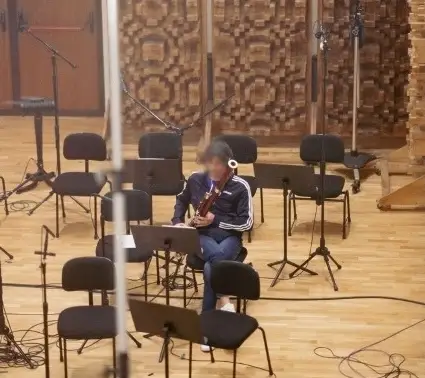
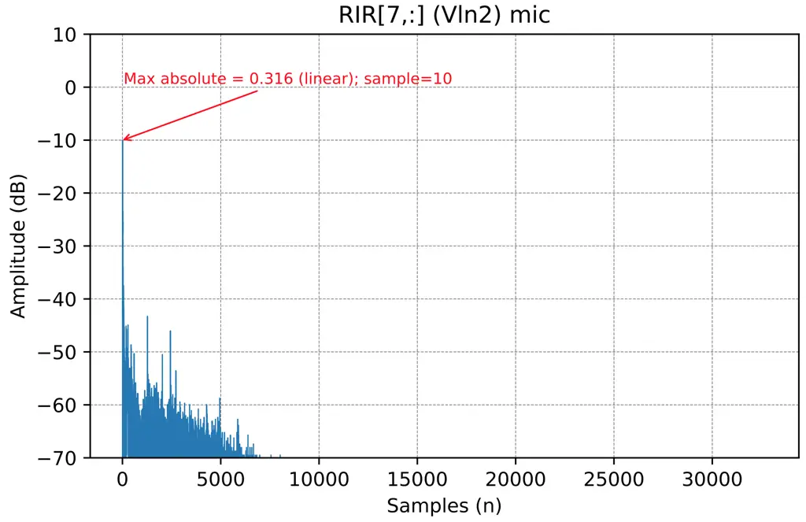
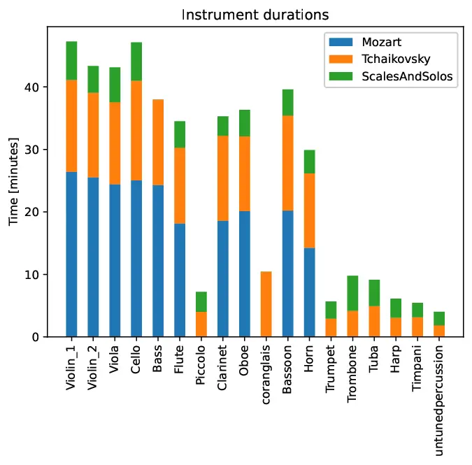
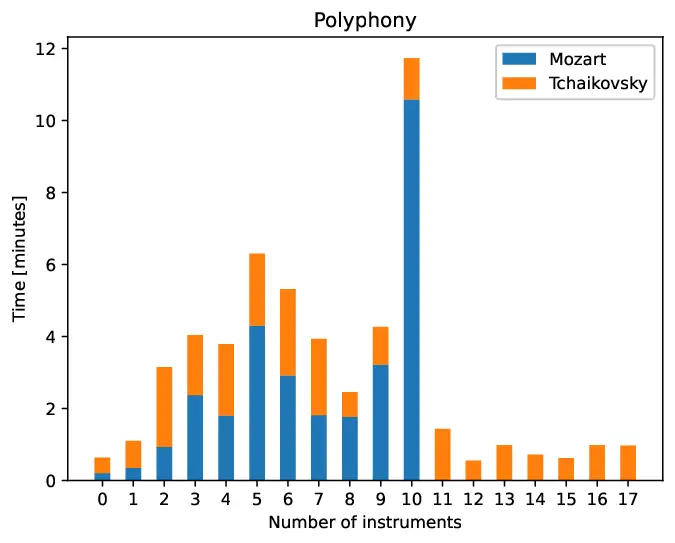
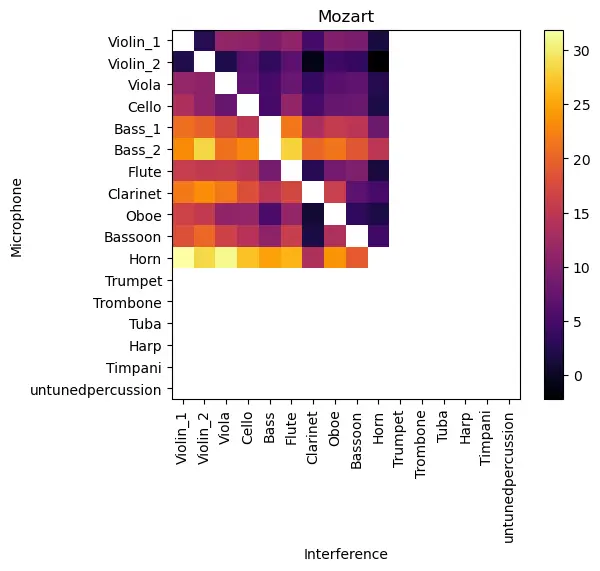
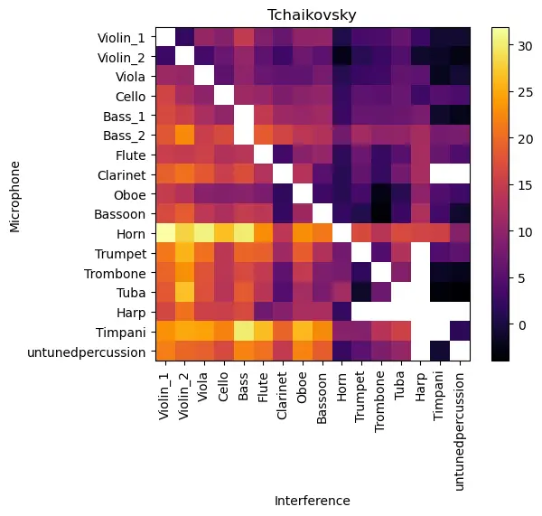
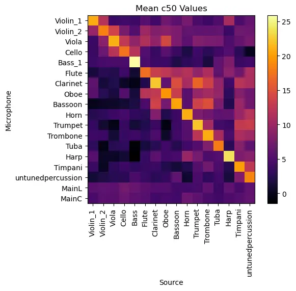

# The Spheres Dataset: Multitrack Orchestral Recordings for Music Source Separation and Information Retrieval

Jaime García-Martínez    David Diaz-Guerra    John Anderson   
Ricardo Falcón-Pérez    Pablo Cabañas-Molero    Tuomas Virtanen   
Julio J. Carabias-Orti    and Pedro Vera-Candeas ^(†)^(†)thanks: J.
García-Martínez, P. Cabañas-Molero, J. J. Carabias-Orti, and P.
Vera-Candeas are with the Universidad de Jaén, Spain (e-mail: {jagarcim,
pcabanas, carabias, pvera}@ujaen.es).^(†)^(†)thanks: John Anderson is
with Odratek BV, Netherlands (e-mail: john@odratek.com).^(†)^(†)thanks:
D. Díaz-Guerra, R. Falcón-Pérez, and T. Virtanen are with Tampere
University, Finland (e-mail: {david.diaz-guerra, ricardo.falconperez,
tuomas.virtanen}@tuni.fi).^(†)^(†)thanks: Manuscript received April 19,
2005; revised August 26, 2015.

###### Abstract

This paper introduces The Spheres dataset, multitrack orchestral
recordings designed to advance machine learning research in music source
separation and related MIR tasks within the classical music domain. The
dataset is composed of over one hour recordings of musical pieces
performed by the Colibrì Ensemble at The Spheres recording studio,
capturing two canonical works—Tchaikovsky’s Romeo and Juliet and
Mozart’s Symphony No. 40—along with chromatic scales and solo excerpts
for each instrument. The recording setup employed 23 microphones,
including close spot, main, and ambient microphones, enabling the
creation of realistic stereo mixes with controlled bleeding and
providing isolated stems for supervised training of source separation
models. In addition, room impulse responses were estimated for each
instrument position, offering valuable acoustic characterization of the
recording space. We present the dataset structure, acoustic analysis,
and different experiments for orchestral family separation and
microphone debleeding. Results highlight both the potential and the
challenges of source separation in complex orchestral scenarios,
underscoring the dataset’s value for benchmarking and for exploring new
approaches to separation, localization, dereverberation, and immersive
rendering of classical music.

###### Index Terms: 

Music source separation, orchestral recordings, dataset, multitrack
audio, microphone bleeding, debleeding, room impulse responses (RIRs),
classical music, machine learning, immersive audio.

## I Introduction

Recent advancements in music source separation (MSS) using artificial
intelligence have been driven by the research community and the
availability of benchmark challenges \[1, 2, 3\]. In professional music
production, instruments and vocals are typically recorded on individual
tracks, which are later combined during mixing. Although this process is
often approximated as a simple sum of the isolated tracks, the final
master undergoes complex, non-linear processing during mastering, making
the resulting mix more than just an additive combination. Despite this
simplification, assuming a linear mix remains effective in practice and
does not significantly hinder model performance. MSS systems, therefore,
aim to take a mixed audio signal as input and estimate the original
constituent tracks, also known as stems; for a comprehensive discussion
on mixture model types and the specific complexities of the classical
music domain, see \[4\].

In the last years, machine learning methods—particularly those driven by
data—have become a central focus in music source separation research
\[5\]. Among these, deep neural networks have shown great promise,
leading to notable improvements in separation accuracy. Supervised
training of these models generally relies on datasets that contain
isolated source tracks, which serve as ground truth references to guide
learning. However, acquiring such data poses a major challenge due to
copyright restrictions, and access to full multi-track recordings
remains limited, as they are seldom released by artists. Despite these
barriers, the research community has made considerable progress by
curating and releasing multi-track datasets \[1, 6, 7, 8, 9\], which
have fueled advancements in separating sources across genres like pop
and vocal music. Of particular relevance is the MUSDB18 dataset \[1,
2\], which serves as the foundation for standardized challenges where
algorithms are benchmarked under consistent conditions to separate stems
such as vocals, drums, bass, and accompaniment. These efforts have led
to the emergence of cutting-edge models that have significantly pushed
the boundaries of what is possible in source separation \[3, 10, 11, 12,
13, 14, 15, 16, 17\].

However, music source separation in the orchestral domain has received
significantly less attention compared to popular music and the several
approaches that have been presented \[18, 19, 20\] suffer challenges
such as: (i) Limited availability of datasets suitable for training deep
learning models. (ii) Classical ensembles typically feature a greater
number of instruments. (iii) Certain instruments within an ensemble
possess similar timbral characteristics, making them more difficult to
differentiate (e.g., violin and viola). (iv) Recordings are commonly
captured with all musicians performing together in the same space,
introducing room acoustics into the audio signals.

Training supervised source separation models requires clean, isolated
source tracks to serve as ground truth during learning. However,
acquiring such recordings for orchestral or ensemble music presents
substantial challenges. Unlike popular music, where individual
performers can be recorded separately using a metronome or backing
track, classical ensembles are typically recorded as a group in a single
take to preserve natural synchronization and enable joint musical
expression. This practice, rooted in the inherently collective nature of
rehearsals and performances, leads to recordings that contain
significant bleed from other instruments even when each instrument is
close miked. Moreover, the large number of instruments involved in
orchestral settings makes isolated, instrument-by-instrument recording
both logistically complex and musically unnatural. In fact, several
limited databases of real-world recordings have been developed for
classical ensembles (see \[21\] for a detailed overview). Small-ensemble
efforts include the TRIOS dataset \[22\], which provides bleed-free
separated tracks for chamber music trios, and the Bach10 dataset \[23\],
which offers bleed-free signals of four-part chorales recorded with
musicians in isolation. The URMP dataset \[24\] features 44 pieces for
small ensembles (2 to 5 instruments) created from individually recorded
but temporally aligned performances. Similarly, the ChoraleBricks
dataset \[25\] provides a modular framework of ten four-part chorales,
where various wind instruments were recorded in isolation to allow for
the flexible synthesis of ensembles with different instrumentations. For
larger orchestral material, the Aalto Anechoic Orchestra dataset \[26\]
provides approximately 10 minutes of anechoic recordings of individual
instruments. More recently, the Operation Beethoven project \[27\]
released around 10 minutes of bleed-free isolated recordings of
orchestral sections, captured in a concert hall to preserve natural
reverberation.

Unfortunately, the scarcity of suitable training material has
significantly constrained progress in supervised source separation
research for classical music. To mitigate this, current systems rely on
data augmentation or are trained on synthesized audio and subsequently
evaluated on real recordings.

For data augmentation, several approaches have been proposed for
classical-music MSS \[28, 29, 20\], but none targets separation of all
sections in a full orchestra. Alternatively, \[30\] assumes that the
score is available and uses multiple synthetic renditions of the piece
to train the MSS system. Recently, \[31\] presented a score-informed MSS
model that uses only score information to generate separation masks,
demonstrating its ability to generalize from synthetic to real data. The
work in \[32\] introduces a novel approach that leverages the
hierarchical relationships between musical instruments to achieve more
flexible and context-aware MSS, improving performance with limited
training data.

Regarding the synthetic, Sarkar et al. \[33\] developed a bleed-free
synthesized dataset called EnsembleSet and used it to train a duet
source separation model based on a dual-path transformer architecture.
For evaluation, they extracted duet segments from real recordings in the
URMP dataset \[24\]. A recent study introduced SynthSOD \[21\], a
synthesized dataset that offers a more balanced representation of
instruments compared to Ensembleset. To evaluate the effectiveness of
this new dataset, García-Martínez et al. trained four separate X-UMX
models \[34\], each dedicated to one of the following instrument
families: (i) strings, (ii) woodwinds, (iii) brass, and (iv) percussion.
Evaluation on the URMP dataset resulted in generally low
Source-to-Distortion Ratio (SDR) scores, indicating limited separation
performance. These outcomes highlight that MSS involving multiple
sources and based on real, recorded ensembles continues to be a
difficult and largely unsolved problem in the context of classical
music. Recent initiatives have begun to address some of these
challenges. For example, within the Cadenza project¹¹ 1
https://cadenzachallenge.org/, a dedicated task has been developed to
rebalance classical music to enhance music perception for individuals
with hearing loss. Although the repertoire is limited to small ensembles
of woodwind instruments \[35\], this represents, to the best of our
knowledge, the first challenge specifically focused on classical music
in this context, further highlighting the growing attention this domain
is beginning to receive.

In this paper, we present The Spheres dataset, the first publicly
available²² 2 https://doi.org/10.5281/zenodo.17347681 multitrack
orchestral resource capturing classical music through a comprehensive
set of microphone signals, including ambient, main and close spot
microphones. This dataset was developed within the framework of the
REPERTORIUM project³³ 3 https://repertorium.eu/ and is specifically
designed to support the development of machine learning methods for
source separation and related MIR tasks in the classical music domain.
The dataset comprises over one hour of music recordings performed by the
Colibrì Ensemble⁴⁴ 4 https://www.colibriensemble.it/ (Chamber Orchestra
of Pescara, Italy) recorded at The Spheres recording studio⁵⁵ 5
https://www.the-spheres.com/, a venue selected for its optimal
acoustical conditions and professional infrastructure. Unlike previous
datasets, in The Spheres each instrument/part was recorded in isolation
(one at a time) while all microphones captured the performance, yielding
leakage-free stems per instrument and microphone position. Realistic
ensemble mixes with controlled bleed are then obtained by summing the
isolated contributions across parts and microphones. This design
captures realistic orchestral performances with individual instrument
spot microphones while preserving the natural acoustics and ensemble
coordination inherent to classical music. By combining full ensemble
mixtures derived from isolated stems with spatial calibration signals,
The Spheres dataset opens new avenues for research in supervised
separation, source localization, dereverberation, and immersive audio
rendering for classical music.

In addition, we present different MSS experiments. First, we evaluate
monaural family separation (strings, woodwinds, brass, percussion) from
the stereo mixture. Second, we address a production-oriented
task—debleeding of section spot microphones—by training lightweight
single-branch models that enhance a target section from its own spot
channel while suppressing orchestral leakage. These experiments expose
both the promise and the difficulty of orchestral MSS: measurable
interference reduction is achievable, yet generalization across
repertoire and setups remains challenging. We release all materials and
scripts so that future works can compare methods under consistent
conditions, explore multichannel and score-informed models, and exploit
the included RIRs and solo material to bridge synthetic–to–real gaps
when targeting complex orchestral signals.

## II Recording the dataset

This section describes the process of creating The Spheres dataset,
including the musical repertoire performed, the recording sessions, and
the microphone setup employed. These details provide the basis for
understanding the structure and properties of the released material.

### II-A Music material

The recordings include two pieces of music, as well as solo material of
each instrument to allow potential training data generation. The first
piece of music, Romeo and Juliet (overture-fantasia), TH 42, is an
overture by Pyotr Ilyich Tchaikovsky, whose final version was completed
in 1880. The duration of the overture is 22 min 38 s. The overture is
scored for an orchestra comprising piccolo, 2 flutes, 2 oboes, English
horn, 2 clarinets (in A), 2 bassoons, 4 horns (in F), 2 trumpets (in E),
3 trombones, tuba, 3 timpani, cymbals, bass drum, harp, violins I,
violins II, violas, cellos, and double basses.

The second piece of music is Symphony No. 40 in G minor, K. 550 (revised
version with clarinets) written by Wolfgang Amadeus Mozart in 1788. The
total duration is 30 min 16 s. The symphony is scored for flute, 2
oboes, 2 clarinets, 2 bassoons, 2 horns, and strings. The work is in
four movements, in the usual arrangement for a classical-style symphony
(fast movement, slow movement, minuet, fast movement) — Molto Allegro,
Andante, Minuetto. Allegretto – Trio, Finale.

The above pieces of music were selected because of their wide
appreciation in the Western culture, as well as because the copyright of
the compositions has expired, allowing their royalty-free use.

In addition, each section of instruments played a full chromatic scale
across the instrument’s natural range with different dynamics
(quiet/loud) and playing techniques (legato, pizzicato, staccato, etc).
An individual instance of each instrument played by the section leader
also played solo scales with different dynamics, as well as free choice
solo content.

### II-B Recording setup

Fig. 1: A photo of the studio used for the recordings. Each musician was
allocated a seat in the studio, which placement was following the
typical placements when playing orchestral music.

The music was recorded in the Main Room of The Spheres Recording Studio,
whose size is 15 x 9 x 8 meters. The high-quality acoustic design of the
room includes diffusors, wedge bass traps, sound-absorbent dropped
ceiling, and floating walls. See Section IV for acoustic measurements of
the room. Figure 1 presents an overview of the recording room and the
recording setup.



Fig. 2: A photograph illustrating a session of recording one bassoon
line.

|                  |                 |                  |
| ---------------- | --------------- | ---------------- |
| Instrument class | Symphony No. 40 | Romeo and Juliet |
| Bass             | 1               | 1                |
| Bass drum        |                 | 1                |
| Bassoon          | 2               | 2                |
| Cello            | 1               | 2                |
| Clarinet         | 2               | 2                |
| Cymbals          |                 | 1                |
| English horn     |                 | 1                |
| Flute            | 1               | 2                |
| Harp             |                 | 1                |
| Horn             | 2               | 4                |
| Oboe             | 2               | 2                |
| Piccolo          |                 | 1                |
| Timpani          |                 | 1                |
| Trombone         |                 | 3                |
| Trumpet          |                 | 2                |
| Tuba             |                 | 1                |
| Viola            | 1               | 2                |
| Violin 1         | 1               | 2                |
| Violin 2         | 1               | 2                |

TABLE I: The number of separately recorded lines per each instrument
class for the two pieces of recorded music.

Each part of each instrument was played in isolation, to enable
capturing instrument-specific tracks. To achieve this, a separate
recording session was organized for each instrument at a time (i.e.,
separate recording session for each part of violin 1, violin 2, viola,
each line of horns, etc.). The number of separately recorded lines per
each instrument class for the two pieces of recorded music is given in
Table I. The musicians wore headphones and listened to reference tracks,
so that the separately recorded parts were synchronous in time. As the
reference tracks, the recordings of New York Philharmonic \[36\] and
Boston Symphony Orchestra \[37\] conducted by Leonard Bernstein were
used. A conductor was conducting musicians at each recording session, to
create a more natural scenario. Figure 2 illustrates an example of the
bassoon recording session. The locations of musicians in the recording
room followed their typical placement in orchestras, as visualised in
Figure 3. The seats of musicians were kept fixed between the recording
sessions.

Fig. 3: The approximate placement of instruments and microphones
(indicated by M#) in the recording room. Each rounded square indicates
the seat of a musician.

The recordings were captured using 23 microphones, which included two
ambient microphones, three main microphones, and 18 close microphones
for individual instruments. All the microphones were used to capture all
the instruments, to allow capturing realistic acoustic propagation from
each instrument to all the microphones. The list of microphones is given
in Table II. The placement of microphones is illustrated in Figure 3.
Microphone \#6 is a close spot microphone that was moved to be close to
each instrument when recording the part of that instrument; the goal of
this microphone was to capture a drier sound than the instrument/section
microphones and could be used, for example, as source signals in
acoustic simulations of different rooms. The recordings were done in two
stages, with some differences in the microphones used in them. The
instruments recorded in Session 1 included 6 violins, 4 violas, 3
cellos, and 2 basses, and Session 2 included the rest of the instruments
or sections. The piccolo player shared the seat with one of the flute
players, and the English horn player shared the seat with one of the
oboe players.

All the microphones were connected to DAD AX32 AD-converter to allow
synchronous capture. The recording setup, including the seats and
microphones, were reinstalled between the two stages. The locations were
kept similar between the sessions, but because of the installation
procedure there were small deviations in the locations.

|     |                         |                               |
| --- | ----------------------- | ----------------------------- |
| ID  | Location                | Microphone (session 1 / 2)    |
| M1  | Amb L                   | Earthworks QTC1 / Schoeps MK2 |
| M2  | Amb R                   | Earthworks QTC1 / Schoeps MK2 |
| M3  | Mains L                 | DPA 4006                      |
| M4  | Mains R                 | DPA 4006                      |
| M5  | Mains C                 | DPA 4006                      |
| M6  | Close spot              | Schoeps MK4                   |
| M7  | Violin 1 section        | Schoeps MK4                   |
| M8  | Violin 2 section        | Schoeps MK4                   |
| M9  | Viola section           | Schoeps MK4                   |
| M10 | Cello section           | Schoeps MK4                   |
| M11 | Double bass 1           | Schoeps MK4                   |
| M12 | Double bass 2           | Schoeps MK4                   |
| M13 | Flute / piccolo section | Schoeps MK4 / DPA 4011        |
| M14 | Oboes                   | Schoeps MK4 / DPA 4011        |
| M15 | Clarinets               | Schoeps MK4 / DPA 4011        |
| M16 | Bassoons section        | Schoeps MK4 / DPA 4011        |
| M17 | Horn section            | Schoeps MK4 / Schoeps V4      |
| M18 | Trumpets section        | Schoeps MK4 / Schoeps V4      |
| M19 | Trombones section       | Schoeps MK4 / Schoeps V4      |
| M20 | Tuba                    | Schoeps MK4 / Schoeps V4      |
| M21 | Timpani                 | Schoeps MK4 / 4015            |
| M22 | Bass drum and cymbals   | Schoeps MK4 / Schoeps MK21    |
| M23 | Harp                    | Schoeps MK4                   |

TABLE II: The channel ID of each instrument and microphones used to
record them.

Apart from the raw recordings from each microphone described above, the
dataset includes a Stereo Mix created by a professional audio engineer.
This mix was produced by combining signals from the main and spot
microphones (Mains L and R channels) to create a realistic balance that
simulates typical classical music production. The main mixture refers to
the linear sum of the individually recorded stems, preserving natural
instrument bleed between spot and main microphones. In contrast, the
Stereo Mix includes additional post-processing, such as artificial
reverberation and limiting, resulting in a polished, production-ready
stereo recording suitable for listening or evaluation.

Several stems, defined as the contribution of each individually recorded
instrument and its corresponding parts to the main mixture, were also
produced to allow various kinds of source separation experiments based
on the main mixture. The sum of all the stem signals equals the main
mixture. The stem signals can be summed in various ways to be used in
source separation experiments. For example, summing all the lines of
each instrument class will create instrument-specific reference signals,
and summing all the lines of each section (strings, woodwinds, brass,
and percussion), will create section-specific reference signals.

Dedicated measurements to capture the acoustic characteristics of the
recording space were performed. Specifically, exponential sine sweeps
(ESSs) \[38\] were fed to the recording environment using a Neumann
KH120 II studio monitor placed at the position of the first chair of
each section, with its height adjusted to match the typical playing
height of the corresponding instrument and oriented facing the main
microphone array. In addition, hand claps were recorded from the same
positions as the ESS. The resulting signals were recorded by all
microphones in the setup and used to estimate room impulse responses
(RIRs) for multiple source–receiver pairs, providing a detailed
characterization of the hall’s spatial acoustics.

To estimate the RIRs from the recorded ESS signals, an inverse filter
was derived from the reference sweep signal so that its convolution with
it approximates a delayed Dirac delta. Convolving each recorded
microphone signal with this inverse filter recovers the RIR, while
non-linear artifacts appear at earlier times and can be removed through
time-windowing. Due to corruption of the reference sweep signal, a
modified inverse filter was computed in the frequency domain; full
details of this procedure are provided in Appendix A.

After the recording sessions, several failures were observed in the
recordings, resulting in missing the double bass signals in the main
right microphone, the timpani, bass drum, and cymbals signals in the
clarinet microphone, and the flute signal in the close-spot microphone.
The published dataset contains files for those signals, but they are
completely silent.

## III File structure of the dataset

In order to facilitate code reusability and cross-dataset comparisons,
we have organized The Spheres dataset following the same structure as
EnsembleSet \[33\] and SynthSOD \[21\]. Each music piece is stored in a
dedicated folder containing subfolders for every microphone (including
the stereo mix), with each subfolder holding an audio file for each
signal of each single instrument. One important difference from the
previously mentioned datasets is that The Spheres may contain more than
one file for some instruments, corresponding to separately recorded
lines (see Table I). Another difference is that the audio files in The
Spheres are sampled at $`48\text{\,}\mathrm{k}\mathrm{H}\mathrm{z}`$,
instead of $`44.1\text{\,}\mathrm{k}\mathrm{H}\mathrm{z}`$.

By summing all audio files within a folder, the signal corresponding to
that microphone (or the stereo mix) can be reconstructed as if all
instruments had been performed simultaneously. This approach is not
applicable to the close spot microphone which, as described in
Section II-B, was repositioned during the recordings; thus, summing its
signals is not meaningful. The dataset also contains scales and solos
for each instrument as a third type of music piece, although combining
these signals results in a noisy, non-musical outcome and they have
differing durations.

We provide some metadata files similar to the ones included in the
SynthSOD dataset \[21\], containing basic information about the
instruments present in each piece. In addition, we also publish an
independent version including only the stereo mix, so that users
interested solely in these signals do not need to download the full
multichannel version of the dataset.

To complement the multi-channel recordings, we provide estimated RIRs
for each instrument position. The estimated RIRs are stored as NumPy
binary files (“.npy”), each containing a two-dimensional array of shape
$`[M,N]`$, where $`M`$ is the number of microphones in the recording
setup and $`N`$ is the number of samples. The filename encodes the
source position of the excitation signal. For example, source_Vln_1.npy
contains the RIRs measured when the source was located at the Violin 1
position. The microphone channel order is consistent across all .npy
files.

To facilitate exploration of the dataset, each .npy file is accompanied
by a .pdf document containing plots visualizing the corresponding RIRs
across all microphones (see Figure 4). These plots display the RIRs
amplitude in decibels (dB) as a function of sample index. Each plot is
annotated with the microphone index and name.



Fig. 4: Estimated RIR for the Violin 2 microphone with the source
located at the Violin 2 position. The plot shows the RIR in dB as a
function of sample index, including annotations for the microphone index
(7) and name (Vln2).

In addition, we provide the original recordings from all microphones of
the claps and sweeps at each instrument position, enabling researchers
to perform their own RIR estimations if desired.

## IV Analysis and properties of the dataset

In this section, we provide a quantitative analysis of The Spheres
dataset in order to characterize its musical content and recording
conditions. We first examine the distribution of instrument activity and
polyphony levels across the two orchestral pieces, highlighting
differences in instrumentation and texture. Next, we evaluate the signal
quality of the recordings by reporting signal-to-distortion ratios (SDR)
and quantifying the amount of bleeding between microphones, with a
particular focus on section microphones. Finally, we analyze the
acoustics of the recording space using the captured RIRs, from which
reverberation time and clarity metrics are derived. Together, these
analyses provide a comprehensive view of the dataset’s properties and
the challenges it poses for music source separation and related tasks.

### IV-A Instrument times and polyphony



Fig. 5: Time played by every instrument in The Spheres dataset.



Fig. 6: Time of every polyphony level in The Spheres dataset.

Figure 5 shows the time played by each instrument in the dataset. While
the Mozart piece provides over 20 minutes of audio for all string and
woodwind sections, it lacks piccolo, English horn, percussion, and brass
instruments (with the exception of the horn). In contrast, the
Tchaikovsky piece has a shorter duration but offers a wider variety of
instrumentation.

In Figure 6, we can see the time of each polyphony level in the dataset.
During around one third of its duration, the Mozart piece has all its
instruments playing at the same time, whereas the polyphony levels in
the Tchaikovsky piece are more evenly distributed, with the different
instruments appearing and disappearing during the piece, and there is
not a single moment when all the instruments are playing at the same
time.

In order to compute both statics, the signals of every instrument at the
main left microphone were split into 1-second non-overlapping frames,
and instruments were considered to be active in those frames whose
energy were above a $`-30\text{\,}\mathrm{d}\mathrm{B}`$ threshold with
respect to its more energetic frame. This is the same criteria that was
used to exclude de silent frames from the evaluation of the experiments
presented in section V.

### IV-B Signal-to-distortion ratio and bleeding in the mixtures

|             |                      |                          |            |            |            |            |            |           |
| ----------- | -------------------- | ------------------------ | ---------- | ---------- | ---------- | ---------- | ---------- | --------- |
| Piece       | Source               | SDR \[dB\] at microphone |            |            |            |            |            |           |
|             |                      | Stereo Mix               | Main L     | Main C     | Main R     | Amb L      | Amb R      | Section   |
| Mozart      | Violin I             | $`-12.50`$               | $`-10.64`$ | $`-11.21`$ | $`-10.27`$ | $`-7.60`$  | $`-8.87`$  | $`-2.44`$ |
|             | Violin II            | $`-14.90`$               | $`-11.31`$ | $`-11.55`$ | $`-11.51`$ | $`-15.25`$ | $`-16.35`$ | $`-7.01`$ |
|             | Viola                | $`-10.50`$               | $`-12.26`$ | $`-11.41`$ | $`-11.53`$ | $`-9.77`$  | $`-8.99`$  | $`-2.81`$ |
|             | Cello                | $`-8.33`$                | $`-10.35`$ | $`-10.52`$ | $`-8.79`$  | $`-8.07`$  | $`-7.13`$  | $`-2.45`$ |
|             | Bass                 | $`-2.12`$                | $`-9.02`$  | $`-9.99`$  |            | $`-7.40`$  | $`-5.90`$  | $`5.70`$  |
|             | Flute and piccolo    | $`-21.66`$               | $`-14.37`$ | $`-14.35`$ | $`-13.84`$ | $`-15.56`$ | $`-15.89`$ | $`-1.75`$ |
|             | Clarinet             | $`-9.78`$                | $`-6.73`$  | $`-6.03`$  | $`-5.73`$  | $`-10.25`$ | $`-10.86`$ | $`2.76`$  |
|             | Oboe and cor anglais | $`-19.73`$               | $`-11.82`$ | $`-11.58`$ | $`-10.87`$ | $`-14.32`$ | $`-14.20`$ | $`-3.76`$ |
|             | Bassoon              | $`-12.70`$               | $`-10.34`$ | $`-10.92`$ | $`-9.78`$  | $`-12.59`$ | $`-14.34`$ | $`-0.19`$ |
|             | Horn                 | $`-9.01`$                | $`-3.53`$  | $`-2.96`$  | $`-2.60`$  | $`-5.25`$  | $`-6.23`$  | $`11.86`$ |
| Tchaikovsky | Violin I             | $`-13.59`$               | $`-11.88`$ | $`-12.82`$ | $`-12.57`$ | $`-9.03`$  | $`-10.12`$ | $`-4.64`$ |
|             | Violin II            | $`-12.63`$               | $`-12.05`$ | $`-13.12`$ | $`-13.39`$ | $`-16.16`$ | $`-16.57`$ | $`-8.21`$ |
|             | Viola                | $`-13.41`$               | $`-13.67`$ | $`-13.50`$ | $`-13.70`$ | $`-10.87`$ | $`-10.25`$ | $`-5.61`$ |
|             | Cello                | $`-8.11`$                | $`-10.06`$ | $`-9.77`$  | $`-8.80`$  | $`-6.38`$  | $`-5.76`$  | $`-1.99`$ |
|             | Bass                 | $`-8.09`$                | $`-15.47`$ | $`-16.51`$ | $`-10.66`$ | $`-13.33`$ | $`-12.37`$ | $`-0.68`$ |
|             | Flute and piccolo    | $`-18.43`$               | $`-11.49`$ | $`-12.13`$ | $`-11.96`$ | $`-13.95`$ | $`-13.93`$ | $`-2.54`$ |
|             | Clarinet             | $`-9.73`$                | $`-10.07`$ | $`-3.82`$  | $`-9.41`$  | $`-12.80`$ | $`-11.56`$ | $`-1.25`$ |
|             | Oboe and cor anglais | $`-14.68`$               | $`-10.71`$ | $`-10.95`$ | $`-10.97`$ | $`-13.34`$ | $`-12.52`$ | $`-4.54`$ |
|             | Bassoon              | $`-9.82`$                | $`-11.39`$ | $`-12.13`$ | $`-11.36`$ | $`-13.49`$ | $`-14.95`$ | $`-0.93`$ |
|             | Horn                 | $`-5.13`$                | $`-4.06`$  | $`-3.82`$  | $`-3.52`$  | $`-5.30`$  | $`-4.91`$  | $`9.64`$  |
|             | Trumpet              | $`-13.35`$               | $`-8.72`$  | $`-8.00`$  | $`-8.46`$  | $`-10.17`$ | $`-10.82`$ | $`-1.84`$ |
|             | Trombone             | $`-13.05`$               | $`-9.91`$  | $`-9.02`$  | $`-10.87`$ | $`-11.25`$ | $`-12.25`$ | $`-5.90`$ |
|             | Tuba                 | $`-13.18`$               | $`-11.02`$ | $`-11.29`$ | $`-8.80`$  | $`-11.37`$ | $`-14.10`$ | $`-3.96`$ |
|             | Harp                 | $`-12.50`$               | $`-7.65`$  | $`-7.68`$  | $`-13.35`$ | $`-9.10`$  | $`-11.48`$ | $`-0.84`$ |
|             | Timpani              | $`-7.02`$                | $`-11.75`$ | $`-11.95`$ | $`-8.93`$  | $`-8.10`$  | $`-8.92`$  | $`-1.43`$ |
|             | Untuned percussion   | $`-5.43`$                | $`-9.25`$  | $`-8.77`$  | $`-8.93`$  | $`-6.37`$  | $`-5.81`$  | $`-4.28`$ |

TABLE III: Signal-to-distortion ratio (SDR) of every instrument in the
Stereo Mix, the main and amb microphones, and in their section close
microphone.





Fig. 7: Signal-to-interference ratio \[dB\] for the main
instrument/section of every section microphone against the each
interference source.

In Table III we can see the SDR of every instrument/section in the
stereo mix, the main and amb microphones, and in their section close
mic. It should be noted that, since there are no artifacts or
distortions in the original mix, the SDR here is equivalent to the
signal-to-interferences ratio (SIR). As done with the evaluation of the
experiments presented in section V, the SDR of every instrument was
computed first in 1-second non-overlapping frames and then aggregated by
computing the median of those frames in which the instrument was active.
The value of the SDR of the Bass in the Main R microphone is missing
since its signal was not captured due to a failure during the recordings
(see section II-B).

From these results, it is clear how challenging the task of
instrument/section separation from the stereo mixture or the main
microphones of a symphonic orchestra is, with most sources having SDRs
around $`-10\text{\,}\mathrm{d}\mathrm{B}`$. As we could expect, the
best SDRs for every instrument/section are obtained in their dedicated
microphone; however, those still contain a huge amount of bleeding from
the other instruments of the orchestra and most of them still have a
negative SDR.

In order to have a better knowledge about the bleeding in the section
microphones, we have computed, for each of them, the ratio between the
energy of their target instrument/section and every interference source,
and represented it as a matrix for every music piece of the dataset in
Figure 7. Results indicate that section microphones with superior SDR
generally exhibit a better ratio against all interferences; however,
some notable one-to-one interactions are also observable.

For example, we can see how the viola section creates a higher bleeding
in the violin II microphone than in violin I, which makes sense
considering how they were placed in the room (see Figure 3). White cells
correspond to cases where computing this ratio did not make sense (i.e.,
when the interference and the target of the microphone is the same or
they do not overlap in time) or cases that could not be computed because
of failures during the recording (i.e., the interference of the timpani
and the untuned percussion on the clarinet microphone, whose signals
were not recorded).

### IV-C Acoustic Analysis

To understand the acoustics of the room we analyzed the RIRs that were
captured as mentioned in section II-B. While the recording procedure
does not fully follow the standard (in particular, the use of non
omnidirectional loudspeakers), it provides some useful information about
the acoustics of the space. Here we focus on two acoustic parameters
computed from the impulse responses. First, we show the clarity index
C50, which is defined as the ratio of energy arriving in the first 50
milliseconds of the impulse to the energy arriving later. This reflects
the balance between early sound and late reverberation, and it is highly
correlated with closeness to the source, speech intelligibility and
perceived ease of listening. Next, we compute the reverberation time
using T30, which represents the time it would take for sound energy to
decay by 60 dB. To avoid the influence of the noise floor, this is
estimated by extrapolating the decay between the $`-5`$ and $`-35`$ dB
levels. All acoustic parameters are computed according to the standard
\[39\]. For reverberation time metrics, we notice some two noticeable
patterns. First, there are some double slope decays, in mid to high
frequencies, in most positions. This is subtle but present, and most
likely due to the very high ceilings the uneven distribution of acoustic
treatment (mostly concentrated at ground level). Secondly, there is a
small but noticeable variance of acoustic parameters across the space.

Figure 8 shows the C50 of all the source/receiver pairs. As could be
expected, the matrix presents a strong diagonal, since the section
microphones are closer to their corresponding section and steered
towards them. Out of the diagonal, we can also observe several high
values that correlate with the lower SIR values in Figure 7 since, as
can be seen in Figure 3, usually correspond to interfering instruments
that are behind the target instrument of the microphone, and therefore
have a strong direct propagation path that reaches the microphone from
its direction of maximum directivity. In Figure 9, we can see how the
T30 also presents some small variations and, while some of these can be
explained due to noisy estimates of the decay rates, the rest is
explained due to the non-uniformity of the room.



Fig. 8: Distribution of C50

Fig. 9: Swarmplot of T30 values for each receiver (microphone position).
Solid and dashed lines indicate the median and the 25th and 75th
percentiles, respectively.

## V Source Separation Experiments

In order to analyze some of the possibilities of the dataset and better
understand its properties, we present a couple of experiments where we
use our dataset to train X-UMX-like models for sound source separation.
In both cases, we use the Tchaikovsky piece of the dataset to train the
models, since it contains more different instruments, and the Mozart
piece to evaluate the results.

Since only one music piece does not contain enough diversity in terms of
overlapping notes and instruments to train a separation model that
generalizes to other pieces, we created cacophonic mixtures by taking
random segments of every instrument and mixing them instead of only
taking synchronized segments. This probably makes the separation problem
simpler since it breaks the temporal coherence between the different
instruments and their harmonic relationships, but it has been shown to
improve the generalization of MSS models when data is scarce \[40\].

As model architecture, we chose X-UMX \[34\] due to its simplicity and
baseline vocation, having been used as baseline of the ISMIR 2021 Music
Demixing (MDX) Challenge \[2\] and the work presenting the SynthSOD
dataset \[21\]. This model uses the magnitude spectrogram of the input
mixture to predict a real-valued spectral mask that is applied to the
original spectrogram to generate the separated stems. The original UMX
model \[41\] consisted of an independent branch for each stem with an
encoder (composed of a linear layer with batch normalization and
hyperbolic tangent activation), 3 BLSTM layers, and a decoder (composed
of two linear layers with batch normalization and ReLU activation in the
first one). The X-UMX architecture adds a bridging operation between the
encoder and the recurrent layers and between the recurrent layers and
the decoder, where the latent representations of every branch are
averaged so they can share information between them. We trained the
models using the combination loss presented with the X-UMX architecture
and with the hyperparameters of the original Asteroid implementation
\[42\].

In addition to X-UMX, we conducted experiments using DTTnet \[17\].
DTTNet is a lightweight architecture that operates in the STFT domain.
It integrates Dual-Path processing with a Time–Frequency Convolutional
Time-Distributed Fully Connected U-Net (TFC-TDF U-Net) backbone.
Notably, it achieves competitive separation performance on MUSDB18 with
substantially fewer parameters than several recent approaches. For
training, we used the same hyperparameters reported by the authors for
the separation of the stem labeled as ”other” in the MUSDB18 dataset and
optimized the model using waveform L1 loss.

Both experiments were evaluated using the fourth version of the museval
library \[43\]. This library computes the metrics in one-second frames
and then averages them using a median operation. For the computation of
the SDR, it does not allow any kind of linear distortion on the ground
truths (so it is equivalent to a classical SNR \[44\]) but, for the
computation of the signal-to-interferences ratio (SIR) and
signals-to-artifacts ratio (SAR), it allows linear distortions modeled
with time-invariant filters with 512 taps \[45\]. We aggregated the
metrics for every track by taking the median value of its frames but,
since the definition of the ratios diverges when the reference signal
approaches to zero, we excluded the frames where the energy of the
reference signal was $`30\text{\,}\mathrm{d}\mathrm{B}`$ below the most
energetic frame of that source in that track.

We note that SDR-based metrics do not always correlate well with
perceptual quality, as discussed in \[46\]. While higher SDR values
generally corresponded to audible interference reduction in our
experiments, especially in the debleeding task, some perceptually
relevant artifacts were not captured by these measures. Therefore the
results should be interpreted as indicators of interference suppression
rather than perceived audio quality. A dedicated perceptual evaluation
is out of the scope of this paper.

In this section, we present two different experiments: one in which we
train a MSS model to separate the orchestra families from the stereo mix
and one where we train independent models to remove the bleeding from
every instrument microphone.

The code for replicating all the experiments presented in this paper is
openly available in our official repository⁶⁶ 6
https://github.com/repertorium/TheSpheresDataset-Experiments.

### V-A Family separation

|                      |            |           |                           |            |           |           |          |                |
| -------------------- | ---------- | --------- | ------------------------- | ---------- | --------- | --------- | -------- | -------------- |
| Eval dataset         | Source     | Original  | Training dataset          |            |           |           |          |                |
|                      |            |           | Tchaikovsky (The Spheres) |            |           |           | SynthSOD | Synth.+Tchaik. |
|                      |            | SDR       | SDR                       | SIR        | SAR       | ISR       | SDR      | SDR            |
|                      |            | \[dB\]    | \[dB\]                    | \[dB\]     | \[dB\]    | \[dB\]    | \[dB\]   | \[dB\]         |
| Mozart (The Spheres) | Strings    | $`4.48`$  | $`9.44`$                  | $`11.93`$  | $`12.08`$ | $`18.24`$ | $`6.84`$ | $`9.11`$       |
|                      | Woodwinds  | $`-6.32`$ | $`3.72`$                  | $`9.91`$   | $`3.44`$  | $`7.48`$  | $`1.79`$ | $`3.64`$       |
|                      | Brass      | $`-9.18`$ | $`0.78`$                  | $`4.43`$   | $`1.01`$  | $`7.19`$  | $`0.03`$ | $`0.76`$       |
| Operation Beethoven  | Strings    | $`2.09`$  | $`2.78`$                  | $`5.57`$   | $`1.42`$  | $`3.77`$  | $`1.34`$ | $`0.89`$       |
|                      | Woodwinds  | $`-7.70`$ | $`0.25`$                  | $`-6.40`$  | $`0.12`$  | $`2.10`$  | $`1.06`$ | $`0.04`$       |
|                      | Brass      | $`-9.54`$ | $`-2.92`$                 | $`-15.83`$ | $`0.43`$  | $`6.69`$  | $`0.13`$ | $`-3.94`$      |
|                      | Percussion | $`-2.74`$ | $`2.58`$                  | $`20.64`$  | $`0.16`$  | $`-5.35`$ | $`0.02`$ | $`2.66`$       |

TABLE IV: Signal-to-distortion ratio (SDR), signal-to-interferences
ratio (SIR), signals-to-artifacts ratio (SAR), and Source
Image-to-Spatial distortion Ratio (ISR) for every orchestra family in
the original Mozart piece of The Spheres dataset and the Operation
Beethoven track and the results obtained by a X-UMX separation model
trained on the Tchaikovsky piece of The Spheres dataset, SynthSOD, and
SynthSOD plus finetuning in the Tchaikovsky piece of The Spheres
dataset.

Due to the high difficulty of separating every instrument of the
orchestra from a stereo mix, we designed an easier experiment where the
instruments were grouped according to their orchestra family (strings,
woodwinds, brass, and percussion) and trained an X-UMX model with 4
branches to separate them.

Table IV shows the original SDR, SIR, and SAR, in the stereo mix of the
Mozart piece of The Spheres and the recording from the Operation
Beethoven dataset and the results obtained with the X-UMX model trained
on the Tchaikovsky piece of The Spheres. The SIR of the separated stems
shows important improvements in terms of source separation for all the
families in the Mozart piece, although the weaker the family was in the
original mixture, the higher are the artifacts generated by the model
(it should be noted that the Mozart piece does not contain any
percussion instruments and only the horn from the brass family).
However, we can see that the model does not generalize to other datasets
such as Operation Beethoven, where Woodwinds and Brass show a clear
degradation in SIR, and all instrument families exhibit a high level of
artifacts. Several differences exist between both datasets, such as the
room, the instrument and microphone positions, and the instruments and
microphones used; further research would be needed to analyze the
importance of these factors in the generalization of MSS models.
Nevertheless, we can conclude that generalizing to different recording
environments is a much more challenging task than generalizing to
different pieces recorded under the same conditions.

Additionally, we also trained a X-UMX model for family separation on the
SynthSOD dataset, which we resampled at
$`48\text{\,}\mathrm{k}\mathrm{H}\mathrm{z}`$ to match the sampling rate
of The Spheres, and tried to finetune it using the Tchaikovsky piece of
The Spheres. In Table IV we can see how the model trained using
synthetic material does not generalize well to real recordings. In the
case of the finetuned model, it does not seem to obtain any benefits
from the pretraining on SynthSOD, and it obtains equivalent results to
the model trained solely on the Tchaikovsky piece. Despite pretraining
and finetuning strategies can potentially be useful for MSS \[47\], more
sophisticated approaches need to be developed for cases of higher
polyphony and acoustic complexity.

### V-B Microphone debleeding

|             |           |                 |           |           |           |                  |            |            |            |
| ----------- | --------- | --------------- | --------- | --------- | --------- | ---------------- | ---------- | ---------- | ---------- |
| Source      | Original  | Separated X-UMX |           |           |           | Separated DTTnet |            |            |            |
|             | SDR       | SDR             | SIR       | SAR       | ISR       | SDR              | SIR        | SAR        | ISR        |
|             | \[dB\]    | \[dB\]          | \[dB\]    | \[dB\]    | \[dB\]    | \[dB\]           | \[dB\]     | \[dB\]     | \[dB\]     |
| Violin I    | $`-2.44`$ | $`2.40`$        | $`10.68`$ | $`1.38`$  | $`-0.47`$ | $`3.547`$        | $`5.263`$  | $`5.575`$  | $`14.901`$ |
| Violin I+II | $`1.40`$  | $`7.61`$        | $`14.18`$ | $`8.20`$  | $`15.04`$ | $`7.900`$        | $`16.322`$ | $`8.222`$  | $`12.991`$ |
| Violin II   | $`-7.01`$ | $`0.96`$        | $`7.99`$  | $`-1.01`$ | $`2.81`$  | $`0.209`$        | $`7.811`$  | $`0.012`$  | $`2.598`$  |
| Violin II+I | $`-4.27`$ | $`4.14`$        | $`11.13`$ | $`3.39`$  | $`8.18`$  | $`4.484`$        | $`9.679`$  | $`4.674`$  | $`10.674`$ |
| Viola       | $`-2.81`$ | $`4.31`$        | $`11.72`$ | $`3.63`$  | $`7.88`$  | $`3.483`$        | $`11.867`$ | $`2.945`$  | $`9.024`$  |
| Cello       | $`-2.45`$ | $`4.26`$        | $`10.69`$ | $`4.17`$  | $`9.14`$  | $`3.451`$        | $`10.184`$ | $`3.338`$  | $`8.519`$  |
| Bass I+II   | $`5.70`$  | $`10.06`$       | $`18.83`$ | $`10.96`$ | $`14.95`$ | $`11.251`$       | $`17.813`$ | $`13.165`$ | $`17.152`$ |
| Bass II+I   | $`11.34`$ | $`16.09`$       | $`23.18`$ | $`17.29`$ | $`22.42`$ | $`15.611`$       | $`23.768`$ | $`17.982`$ | $`20.749`$ |
| Flute       | $`-1.75`$ | $`11.54`$       | $`20.54`$ | $`11.28`$ | $`19.77`$ | $`11.241`$       | $`21.941`$ | $`11.581`$ | $`16.117`$ |
| Clarinet    | $`2.76`$  | $`6.80`$        | $`17.43`$ | $`6.33`$  | $`9.55`$  | $`5.970`$        | $`19.296`$ | $`5.067`$  | $`8.926`$  |
| Oboe        | $`-3.76`$ | $`4.74`$        | $`9.89`$  | $`5.41`$  | $`12.46`$ | $`4.973`$        | $`11.199`$ | $`4.893`$  | $`11.483`$ |
| Bassoon     | $`-0.19`$ | $`7.08`$        | $`16.12`$ | $`6.64`$  | $`10.62`$ | $`7.997`$        | $`17.510`$ | $`7.437`$  | $`12.856`$ |
| Horn        | $`11.86`$ | $`14.60`$       | $`21.50`$ | $`16.13`$ | $`20.29`$ | $`13.701`$       | $`24.563`$ | $`13.878`$ | $`15.015`$ |

TABLE V: Signal-to-distortion ratio (SDR), signal-to-interferences ratio
(SIR), signal-to-artifacts ratio (SAR), and Source Image-to-Spatial
distortion Ratio (ISR) of the close microphones of the Mozart piece (The
Spheres) and the results obtained by X-UMX and DTTnet debleeding models
trained on the Tchaikovsky piece.

An easier but quite interesting application of MSS for classical music
production is debleeding the close microphone signals. Orchestras are
typically recorded using microphones close to every instrument section
apart from the main stereo microphone, and those signals are used in the
final stereo mix to increase the presence of some instruments that might
be too weak in the stereo microphone. However, the signals of these
close microphones contain a high level of bleeding from all the other
instruments of the orchestra, making the work of the mixing engineer
nontrivial. Therefore, having models capable of removing this bleeding
and ensuring that the signal of the close microphones contain only the
sound of its corresponding instrument would be of great interest to the
music-recording industry. Unlike previous resources, The Spheres dataset
provides close-microphone recordings for each instrument alongside the
simultaneous leakage, or bleeding, present in every other microphone’s
signal.

We trained individual one-branch X-UMX and DTTnet models for every
instrument/section microphone using the Tchaikovsky piece of The
Spheres. As input, we took the mix of the signals from all the
instruments at the corresponding microphone and, as target output, we
took the signal of the instrument that was intended to be recorded by
that microphone, so we can see the debleeding problem as an enhancement
task. More advanced architectures could be used to include the signals
from the other microphones as inputs of the model so it has a reference
of the bleeding that it needs to remove, but we decided to keep the
model as simple as possible since this is a preliminary experiment and
the goal is to showcase some of the applications and properties of the
dataset.

As shown in Table V, all models successfully improved the SDR of the
target instruments. Notably, the models achieved substantial
interference reduction, with SIR gains ranging from $`5`$ dB to
$`24.6`$ dB, while maintaining reasonable SAR levels (generally above
$`3`$ dB, with the exception of the violins). Debleeding the microphones
of the violin I and violin II sections is especially difficult, since
they contain the bleeding from the other violin section that has the
same timbral properties. To facilitate this case, we also trained a
model to remove all the bleeding from the violin I microphone except the
one coming from the violin II section (Violin I+II in Table V) and vice
versa (Violin II+I); note that this is the only approach possible for
the Bass I and II microphones, since we do not have the isolated
recordings of every bass and they played the same melody.

Since The Spheres is the first public dataset to include close
microphone signals, we could not evaluate our debleeding models trained
on the Tchaikovsky piece against an external dataset, as was possible
for the family-separation experiments with the Operation Beethoven
recording. Nevertheless, we had access to raw material from private
professional sessions by the studio’s owner (Odradek Records) which,
although lacking isolated tracks for objective evaluation, allowed us to
subjectively confirm the same generalization issues discussed in
Section V-A. As for the family separation, models trained with the
Tchaikovsky piece of The Spheres dataset seem to be able to obtain good
results in other music pieces recorded under the same conditions, but
fail to generalize to different recording environments.

### V-C Discussion

One important conclusion can be drawn from the previous experiments:
training separation models with signals from a single recording setup
does not guarantee generalization to other setups and, therefore, models
should not be trained and tested in the same setup if there is not a
justified use case that makes feasible the recording of the training
data in the same conditions where the models will be used. In the
previous experiments, we trained our models in the Tchaikovsky piece of
The Spheres and then evaluated them in the Mozart one since our main
goal was the study of the properties of the dataset, but we discourage
researchers from doing this in further research works.

We believe that the main interest of this dataset is in the evaluation
of the models trained with different datasets, not in using it for
training. The Spheres is the first dataset that includes microphones
close to every instrument section following the same arrangement that is
used in real orchestra recordings, opening the door to the evaluation of
debleeding models, which is a problem that has barely been studied but
has a big importance for the music recording industry.

From the presented results, we can conclude that the generalization to
unseen recording environments is more challenging than the
generalization to unseen repertoire. The models trained on the
Tchaikovsky piece were able to obtain moderate or good results in the
Mozart piece despite the low amount of training material (which was
augmented using cacophonic remixes), but failed when applied on
completely different recordings. This suggests that, for the development
of future datasets, if they want to be useful for training, they should
focus more on the diversity of the recording conditions than in the
absolute duration of the dataset or in the number of music pieces.

An interesting approach that has not been studied in this paper is the
use of the signals from the scales and solos included in The Spheres to
finetune models trained with larger synthetic datasets such as SynthSOD
\[21\]. Having the references of every instrument for a full music piece
(as the Tchaikovsky piece included in The Spheres) with the same
recording setup in which the model is going to be used is not a
realistic assumption for most real-world applications, but recording
some small extracts from every instrument section (as the scales and
solos included in The Spheres) might be possible during the rehearsals
of the orchestra where the separation system is going to be used.
However, more sophisticated pretraining and finetuning techniques should
be developed for this.

## VI Conclusion

In this paper, we present The Spheres dataset, the first publicly
available multitrack orchestral recordings capturing classical music
through a comprehensive set of microphone signals, including both main
and close spot microphones. Unlike previous datasets, this collection
provides recordings as isolated stems for each instrument section from
all microphone positions, accurately reflecting the conditions of real
orchestral productions and offering isolated signals for research
purposes.

The dataset openly publishes two complete canonical works—Tchaikovsky’s
Romeo and Juliet and Mozart’s Symphony No. 40—as well as solo scales
with different dynamics and playing techniques. In addition, Room
Impulse Responses (RIRs) were measured for every instrument position and
are released alongside the dataset, providing a detailed
characterization of the recording space. We have also provided analyses
of the data, including polyphony levels, instrument activity times, and
acoustic properties derived from the RIRs, which illustrate both the
diversity and complexity of the material. Furthermore, we performed
experiments on instrument-family separation from the main stereo
microphones and on microphone debleeding at the spot level. While the
analyzed models improved separation in several cases, they also
confirmed the difficulty of orchestral source separation and showcase
the need for further research on MSS methods that can generalize to
different recording conditions.

Overall, The Spheres dataset represents a significant step forward for
Music Source Separation (MSS) in the classical domain. By offering real,
professionally recorded multitrack material with aligned main, ambient,
and spot microphones, it provides the community with a unique benchmark
for evaluating separation, dereverberation, localization, and immersive
rendering approaches. We expect this dataset to become a valuable
resource for future research, helping to bridge the gap between
synthetic data training and real-world orchestral applications.

## Appendix A

This appendix provides the mathematical background for estimating RIRs
using the exponential sine sweep (ESS) technique and details a modified
procedure developed to address corruption in the reference sweep signal.

Estimating the RIR with ESS involves exciting the system with a test
signal defined as:

```math
x(t)=sin\left(\frac{2\pi f_{1}T}{ln\left(\frac{f_{2}}{f_{1}}\right)}\left[e^{\frac{t}{T}ln\left(\frac{f_{2}}{f_{1}}\right)}-1\right]\right) \tag{1}
```

where $`f_{1}`$ and $`f_{2}`$ are the starting and stopping sweep
frequencies measured in Hz, $`T`$ is the sweep duration in seconds and
$`ln\left(\frac{f_{2}}{f_{1}}\right)`$ is known as the sweep rate. These
parameters define the ESS design.

An inverse filter $`x_{inv}(t)`$ is designed so that its convolution
with $`x(t)`$ approximates a delayed Dirac delta:

```math
x(t)*x_{inv}(t)\approx\delta(t-t_{0}) \tag{2}
```

where $`*`$ denotes linear convolution, $`\delta(t)`$ is the Dirac delta
function, and $`t_{0}`$ is a time delay. The closed-form expression of
the inverse filter is:

```math
x_{inv}(t)=x(T-t)e^{-\frac{t}{T}ln\left(\frac{f_{2}}{f_{1}}\right)} \tag{3}
```

The inverse filter described in Eq. 3 is computed by time reversing the
original ESS, $`x(t)`$, delaying the result to obtain a casual signal
and apply an amplitude modulation with a 6 dB/octave gain \[48\].

By convolving each recorded microphone signal $`y(t)`$ with this inverse
filter $`x_{inv}(t)`$, the RIR can be extracted:

```math
r(t)=y(t)*x_{inv}(t)=h(t-t_{0})+\eta(t) \tag{4}
```

where $`h(t)`$ is the delayed linear RIR, and $`\eta(t)`$ contains
higher-order distortion products that appear earlier in time and can be
separated via time-windowing.

In our measurements, the reference ESS signal was corrupted from
improper time-stretching and downsampling, which introduced spectral
distortion and phase misalignment relative to the designed ESS
parameters. Consequently, the original analytical inverse could not be
used and a data-driven inverse filter was required. To address this, we
computed an equivalent inverse filter in the frequency domain. Let
$`x[n]`$ be the discrete, corrupted ESS signal and $`\delta[n-n_{0}]`$ a
delayed discrete delta function. The inverse filter was computed as:

```math
x_{inv}[n]=\Re\left\{\mathcal{DFT}^{-1}\left\{\frac{\mathcal{DFT}\{\delta[n-n_{0}]\}}{\mathcal{DFT}\{x[n]\}}\right\}\right\} \tag{5}
```

where $`\Re`$ indicates real part, $`\mathcal{DFT}`$ and
$`\mathcal{DFT}^{-1}`$ denote the DFT and IDFT operators respectively.

To validate that the inverse filter computed in the frequency domain
preserves the key convolution property in Eq. 2, we compared it against
the theoretical inverse filter derived from known ESS parameters. The
reference sweep design parameters (see 1) are $`f_{1}=1`$ Hz,
$`f_{2}=48000`$ Hz, $`T=1`$ s, with a sampling rate of $`96000`$ Hz.
Figure 10 shows both inverse filters and their corresponding convolution
results with the reference sweep.

Fig. 10: Comparison between the theoretical and proposed inverse
filters. Top-left: Theoretical inverse filter derived from known ESS
parameters. Top-right: Linear convolution of the reference sweep with
the theoretical inverse filter, showing the expected delayed impulse.
Bottom-left: Inverse filter computed in the frequency domain as
described in eq. 5. Bottom-right: Convolution result using the proposed
inverse filter, demonstrating preservation of the delayed impulse
property in eq. 2.

Fig. 11: Frequency-domain validation of the proposed inverse filter. The
plots show the Bode-style magnitude (top) and phase (bottom) responses
of: the reference ESS (blue), the theoretical inverse filter (orange),
the proposed frequency-domain inverse filter (green), and the
convolution results for both inverse filters (red and purple). The
magnitude response is flat across the entire frequency range, confirming
accurate compensation of the sweep spectrum. Minor phase differences are
observed but are consistent between the two, demonstrating that the
proposed inverse filter preserves the desired convolution property.

Figure 12 shows the computed inverse filter for the corrupted sweep used
in the actual room measurements. Since the sweep’s design parameters are
unknown, the theoretical inverse filter cannot be obtained for direct
comparison. Nevertheless, the convolution result (left) exhibits a
sharp, delayed impulse, and the magnitude response of the convolution
(green, top-right) is generally flat, confirming that the proposed
approach remains effective. Minor ripple in the magnitude response
indicates some expected coloration in the estimated RIR. The phase
response (bottom-right) closely resembles those presented in Figure 11,
reinforcing the validity of the frequency-domain inverse filter for
practical use.

Fig. 12: Inverse filter computation and validation for the corrupted ESS
used in the actual measurements. Left: Result of the linear convolution
between the corrupted reference sweep and its computed inverse filter,
showing the expected delayed impulse. Top-right: Magnitude responses of
the corrupted sweep (blue), the computed inverse filter (orange), and
their convolution result (green). The green trace is generally flat but
exhibits some frequency-dependent ripple, which may introduce slight
coloration into the estimated RIR. Bottom-right: Corresponding phase
responses.

## Acknowledgment

This work was supported by “REPERTORIUM” Project under Grant Agreement 101095065. Horizon Europe. Cluster II. Culture, Creativity and Inclusive
Society. Call HORIZON-CL2-2022-HERITAGE-01-02.  
The authors wish to acknowledge CSC—IT Center for Science, Finland, for
computational resources.  
The authors thank the Colibrì Ensemble musicians for their participation
and for granting consent for the use and open distribution of their
recordings for research purposes.

## References

- \[1\] Z. Rafii, A. Liutkus, F.-R. Stöter, S. I. Mimilakis, and
  R. Bittner, “MUSDB18-HQ - an uncompressed version of musdb18,”
  Dec. 2019. \[Online\]. Available:
  https://doi.org/10.5281/zenodo.3338373
- \[2\] Y. Mitsufuji, G. Fabbro, S. Uhlich, F.-R. Stöter, A. Défossez,
  M. Kim, W. Choi, C.-Y. Yu, and K.-W. Cheuk, “Music demixing challenge
  2021,” _Frontiers in Signal Processing_, vol. 1, p. 808395, 2022.
- \[3\] G. Fabbro, S. Uhlich, C.-H. Lai, W. Choi, M. Martínez-Ramírez,
  W. Liao, I. Gadelha, G. Ramos, E. Hsu, H. Rodrigues, F.-R. Stöter,
  A. Défossez, Y. Luo, J. Yu, D. Chakraborty, S. Mohanty, R. Solovyev,
  A. Stempkovskiy, T. Habruseva, N. Goswami, T. Harada, M. Kim,
  J. Hyung Lee, Y. Dong, X. Zhang, J. Liu, and Y. Mitsufuji, “The sound
  demixing challenge 2023 – music demixing track,” _Transactions of the
  International Society for Music Information Retrieval_, vol. 7,
  no. 1, p. 63–84, 2024.
- \[4\] J. J. Burred, “From sparse models to timbre learning: New
  methods for musical source separation,” Ph.D. dissertation, Technische
  Universität Berlin, Berlin, Germany, 2009.
- \[5\] E. Cano, D. FitzGerald, A. Liutkus, M. D. Plumbley, and F.-R.
  Stöter, “Musical source separation: An introduction,” _IEEE Signal
  Processing Magazine_, vol. 36, no. 1, pp. 31–40, 2019.
- \[6\] M. Vinyes, “MTG MASS database. \[Online\].”  
  http://www.mtg.upf.edu/static/mass/resources, 2008.
- \[7\] R. M. Bittner, J. Wilkins, H. Yip, and J. P. Bello, “Medleydb
  2.0: New data and a system for sustainable data collection,” _ISMIR
  Late Breaking and Demo Papers_, vol. 36, 2016.
- \[8\] E. Manilow, G. Wichern, P. Seetharaman, and J. Le Roux, “Cutting
  music source separation some Slakh: A dataset to study the impact of
  training data quality and quantity,” in _Proc. IEEE Workshop on
  Applications of Signal Processing to Audio and Acoustics
  (WASPAA)_. IEEE, 2019.
- \[9\] Y. Özer, S. J. Schwär, V. Arifi-Müller, J. Lawrence, E. Sen, and
  M. Müller, “Piano concerto dataset (pcd): A multitrack dataset of
  piano concertos,” _Transactions of the International Society for Music
  Information Retrieval_, vol. 6, no. 1, pp. 75–88, 2023.
- \[10\] A. Défossez, N. Usunier, L. Bottou, and F. Bach, “Music source
  separation in the waveform domain,” _arXiv preprint
  arXiv:1911.13254_, 2019.
- \[11\] R. Hennequin, A. Khlif, F. Voituret, and M. Moussallam,
  “Spleeter: a fast and efficient music source separation tool with
  pre-trained models,” _Journal of Open Source Software_, vol. 5,
  no. 50, p. 2154, 2020.
- \[12\] A. Défossez, “Hybrid spectrogram and waveform source
  separation,” in _Proceedings of the ISMIR 2021 Workshop on Music
  Source Separation_, 2021.
- \[13\] S. Rouard, F. Massa, and A. Défossez, “Hybrid transformers for
  music source separation,” in _ICASSP 2023 - 2023 IEEE International
  Conference on Acoustics, Speech and Signal Processing (ICASSP)_, 2023,
  pp. 1–5.
- \[14\] Y. Luo and J. Yu, “Music source separation with band-split
  rnn,” _IEEE/ACM Transactions on Audio, Speech, and Language
  Processing_, vol. 31, pp. 1893–1901, 2023.
- \[15\] W. Tong, J. Zhu, J. Chen, S. Kang, T. Jiang, Y. Li, Z. Wu, and
  H. Meng, “Scnet: Sparse compression network for music source
  separation,” in _ICASSP 2024 - 2024 IEEE International Conference on
  Acoustics, Speech and Signal Processing (ICASSP)_, 2024, pp.
  1276–1280.
- \[16\] W.-T. Lu, J.-C. Wang, Q. Kong, and Y.-N. Hung, “Music source
  separation with band-split rope transformer,” in _ICASSP 2024 - 2024
  IEEE International Conference on Acoustics, Speech and Signal
  Processing (ICASSP)_, 2024, pp. 481–485.
- \[17\] J. Chen, S. Vekkot, and P. Shukla, “Music source separation
  based on a lightweight deep learning framework (dttnet: Dual-path
  tfc-tdf unet),” in _ICASSP 2024 - 2024 IEEE International Conference
  on Acoustics, Speech and Signal Processing (ICASSP)_, 2024, pp.
  656–660.
- \[18\] M. Miron, J. Janer, and E. Gómez, “Monaural score-informed
  source separation for classical music using convolutional neural
  networks,” in _Proceedings of the 18th International Society for Music
  Information Retrieval Conference (ISMIR)_, 2017, pp. 55–62.
- \[19\] O. Slizovskaia, G. Haro, and E. Gómez, “Conditioned source
  separation for musical instrument performances,” _IEEE/ACM
  Transactions on Audio, Speech, and Language Processing_, vol. 29, pp.
  2083–2095, 2021.
- \[20\] Y. Özer and M. Müller, “Source separation of piano concertos
  using musically motivated augmentation techniques,” _IEEE/ACM
  Transactions on Audio, Speech, and Language Processing_, vol. 32, pp.
  1214–1225, 2024.
- \[21\] J. Garcia-Martinez, D. Diaz-Guerra, A. Politis, T. Virtanen,
  J. J. Carabias-Orti, and P. Vera-Candeas, “Synthsod: Developing an
  heterogeneous dataset for orchestra music source separation,” _IEEE
  Open Journal of Signal Processing_, vol. 6, pp. 129–137, 2025.
- \[22\] J. Fritsch, “The trios dataset,” Jul. 2022. \[Online\].
  Available: https://doi.org/10.5281/zenodo.6797837
- \[23\] Z. Duan and B. Pardo, “Soundprism: an online system for
  score-informed source separation of music audio,” _IEEE Journal of
  Selected Topics in Signal Process._, vol. 5, no. 6, pp.
  1205–1215, 2011.
- \[24\] B. Li, X. Liu, K. Dinesh, Z. Duan, and G. Sharma, “Creating a
  multitrack classical music performance dataset for multimodal music
  analysis: Challenges, insights, and applications,” _IEEE Transactions
  on Multimedia_, vol. 21, no. 2, pp. 522–535, 2019.
- \[25\] S. Balke, A. Berndt, and M. Müller, “ChoraleBricks: A modular
  multitrack dataset for wind music research,” _Transaction of the
  International Society for Music Information Retrieval (TISMIR)_,
  vol. 8, no. 1, pp. 39–54, 2025.
- \[26\] J. Pätynen, V. Pulkki, and T. Lokki, “Anechoic recording system
  for symphony orchestra,” _Acta Acustica united with Acustica_,
  vol. 94, pp. 856–865, 11 2008.
- \[27\] U. Kaiser, I. Mestemacher, and M. Vieregg, “Kollektion:
  Operation beethoven. beethovens 4. sinfonie in einzelstimmen!”
  _\[Online\]. Available:
  https://openmusic.academy/docs/4HAB9wcKyiXNGNsmkEFRXD/operation-beethoven-kooperation-der-open-music-academy-mit-der-hofkapelle-muenchen_, 2023.
- \[28\] C.-Y. Chiu, W.-Y. Hsiao, Y.-C. Yeh, Y.-H. Yang, and A. W.-Y.
  Su, “Mixing-specific data augmentation techniques for improved blind
  violin/piano source separation,” in _2020 IEEE 22nd International
  Workshop on Multimedia Signal Processing (MMSP)_. IEEE, 2020, pp. 1–6.
- \[29\] H. Kim, J. Park, T. Kwon, D. Jeong, and J. Nam, “A study of
  audio mixing methods for piano transcription in violin-piano
  ensembles,” in _ICASSP 2023 - 2023 IEEE International Conference on
  Acoustics, Speech and Signal Processing (ICASSP)_, 2023, pp. 1–5.
- \[30\] M. Miron, J. Janer Mestres, and E. Gómez Gutiérrez, “Generating
  data to train convolutional neural networks for classical music source
  separation,” in _Proceedings of the 14th Sound and Music Computing
  Conference_, 2017, pp. p. 227–33.
- \[31\] E. Tunturi, D. Diaz-Guerra, A. Politis, and T. Virtanen,
  “Score-informed music source separation: Improving synthetic-to-real
  generalization in classical music,” 2025. \[Online\]. Available:
  https://arxiv.org/abs/2503.07352
- \[32\] E. Manilow, G. Wichern, and J. L. Roux, “Hierarchical musical
  instrument separation,” in _Proceedings of the 21st International
  Conference on Music Information Retrieval, ISMIR 2020_, 2020, pp.
  376–383.
- \[33\] S. Sarkar, E. Benetos, and M. Sandler, “Ensembleset: a new high
  quality synthesised dataset for chamber ensemble separation,” in
  _Proc. of the 23rd International Society for Music Information
  Retrieval Conference (ISMIR). Bengaluru, India, ISMIR_, 2022, pp.
  625–632.
- \[34\] R. Sawata, S. Uhlich, S. Takahashi, and Y. Mitsufuji, “All for
  one and one for all: Improving music separation by bridging networks,”
  in _ICASSP 2021 - 2021 IEEE International Conference on Acoustics,
  Speech and Signal Processing (ICASSP)_, 2021, pp. 51–55.
- \[35\] G. Roa Dabike, T. J. Cox, A. J. Miller, B. M. Fazenda,
  S. Graetzer, R. R. Vos, M. A. Akeroyd, J. Firth, W. M. Whitmer,
  S. Bannister, A. Greasley, and J. P. Barker, “The cadenza woodwind
  dataset: Synthesised quartets for music information retrieval and
  machine learning,” _Data in Brief_, vol. 57, p. 111199, 2024.
  \[Online\]. Available:
  https://www.sciencedirect.com/science/article/pii/S2352340924011612
- \[36\] Lennyforever. Tchaikovsky, Romeo and Juliet, Leonard Bernstein,
  New York Philharmonic. \[Online\]. Available:
  https://www.youtube.com/watch?v=BSbzyTNVB1Q
- \[37\] R. Bridgland. Mozart Symphony No 40 in G minor KV550 Leonard
  Bernstein. \[Online\]. Available:
  https://www.youtube.com/watch?v=p8bZ7vm4_6M
- \[38\] farina angelo, “Advancements in impulse response measurements
  by sine sweeps,” _journal of the audio engineering society_, no. 7121,
  may 2007.
- \[39\] I. 3382-1:2009, “Acoustics – measurement of room acoustic
  parameters – part 1: Performance spaces,” International Organization
  for Standardization, Geneva, Switzerland, Standard ISO
  3382-1:2009, 2009.
- \[40\] C.-B. Jeon, G. Wichern, F. G. Germain, and J. Le Roux, “Why
  does music source separation benefit from cacophony?” in _2024 IEEE
  International Conference on Acoustics, Speech, and Signal Processing
  Workshops (ICASSPW)_. IEEE, 2024, pp. 873–877.
- \[41\] F.-R. Stöter, S. Uhlich, A. Liutkus, and Y. Mitsufuji,
  “Open-unmix-a reference implementation for music source separation,”
  _Journal of Open Source Software_, vol. 4, no. 41, p. 1667, 2019.
- \[42\] M. Pariente, S. Cornell, J. Cosentino, S. Sivasankaran,
  E. Tzinis, J. Heitkaemper, M. Olvera, F.-R. Stöter, M. Hu, J. M.
  Martín-Doñas, D. Ditter, A. Frank, A. Deleforge, and E. Vincent,
  “Asteroid: the PyTorch-based audio source separation toolkit for
  researchers,” in _Interspeech 2020_, Shanghai, China, 2020.
- \[43\] F.-R. Stöter and A. Liutkus, “museval 0.3.0,” Aug. 2019.
  \[Online\]. Available: https://doi.org/10.5281/zenodo.3376621
- \[44\] J. Le Roux, S. Wisdom, H. Erdogan, and J. R. Hershey,
  “Sdr–half-baked or well done?” in _ICASSP 2019-2019 IEEE International
  Conference on Acoustics, Speech and Signal Processing (ICASSP)_. IEEE,
  2019, pp. 626–630.
- \[45\] E. Vincent, R. Gribonval, and C. Févotte, “Performance
  measurement in blind audio source separation,” _IEEE transactions on
  audio, speech, and language processing_, vol. 14, no. 4, pp.
  1462–1469, 2006.
- \[46\] M. Torcoli, T. Kastner, and J. Herre, “Objective measures of
  perceptual audio quality reviewed: An evaluation of their application
  domain dependence,” _IEEE/ACM Transactions on Audio, Speech, and
  Language Processing_, vol. 29, pp. 1530–1541, 2021.
- \[47\] S. Sarkar, L. Thorpe, E. Benetos, and M. Sandler, “Leveraging
  synthetic data for improving chamber ensemble separation,” in _2023
  IEEE Workshop on Applications of Signal Processing to Audio and
  Acoustics (WASPAA)_, 2023, pp. 1–5.
- \[48\] B. Delvaux and D. M. Howard, “Using an exponential sine sweep
  to measure 3d printed vocal tract resonances,” in _The 21st
  International COngress on Sound and Vibration_, 2014. \[Online\].
  Available: https://api.semanticscholar.org/CorpusID:55646202
