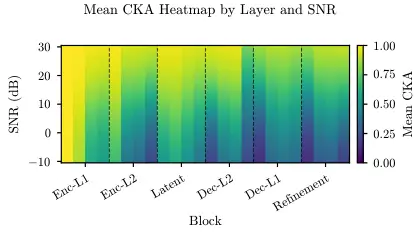
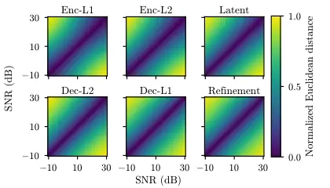
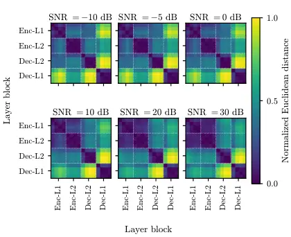

# Probing Layer-Wise Robustness and Sensitivity of Speech Enhancement Models Under Noise and Reverberation

Yair Amar    Amir
Ivry [](https://orcid.org/0000-0002-9043-7040)
   Israel
Cohen [](https://orcid.org/0000-0002-2556-3972)
^(†)^(†)thanks: This research was supported by the Israel Science
Foundation (Grant No.˜1449/23) and the Pazy Research
Foundation.^(†)^(†)thanks: The authors are with the Andrew and Erna
Viterbi Faculty of Electrical and Computer Engineering, Technion –
Israel Institute of Technology, Haifa, Israel (e-mail:
yairamr@gmail.com; amirivry@gmail.com;
icohen@ee.technion.ac.il).^(†)^(†)thanks: This work has been submitted
to the IEEE for possible publication. Copyright may be transferred
without notice, after which this version may no longer be accessible.

###### Abstract

Speech enhancement (SE) models advance rapidly, yet how input
degradation affects their internal representations remains
underexplored. We introduce a probing framework to characterize how
internal representations in SE models behave under controlled input
degradation. We probe three SE models across controlled levels of
signal-to-noise ratio (SNR) and reverberation, quantified by $`C_{50}`$,
measuring layer-wise similarity to clean references with Centered Kernel
Alignment (CKA) and summarizing each layer by a linear fit against
degradation level: the intercept measures robustness, whereas the slope
measures sensitivity. All three models are sharply non-uniform across
depth, but they organize that non-uniformity differently. MUSE and
MP-SENet grow more sensitive with depth, the sharpest transitions
falling at MUSE’s skip-connection junctions, where encoder information
is reintegrated; Demucs inverts the trend. A randomly initialized model
shows a near-flat profile, with slopes one to two orders of magnitude
smaller, and the profile forms during fine-tuning, indicating that it is
induced by the enhancement objective rather than a particular model
design. Because CKA saturates at the clean reference, intercept and
slope are partly coupled; we derive the identity relating them and
report a _saturation spread_ statistic that indicates when their
relationship is informative. Together, these results characterize where
SE models are most sensitive to degradation. An exploratory analysis of
whether residual variation tracks output-level quality, after
controlling for SNR, shows that the speaker, rather than the utterance,
must be treated as the sampling unit. Code and precomputed analysis
artifacts for the main sweeps are publicly available.

###### Index Terms: 

Centered kernel alignment, deep learning, diffusion maps,
interpretability, probing, representational similarity, speech
enhancement.

## I Introduction

Speech enhancement (SE) is a core component of many audio and
communication systems, from hearing aids \[1\] and smart speakers to
telecommunications front-ends such as acoustic echo cancellation \[2\]
and automatic speech recognition pipelines \[3, 4\]. Modern
deep-learning-based SE models achieve strong output-level scores on
metrics such as PESQ (Perceptual Evaluation of Speech Quality) \[5\] and
STOI (Short-Time Objective Intelligibility) \[6\]. Yet, they are largely
treated as black boxes: practitioners select and deploy models based on
aggregate performance numbers without insight into how internal
representations respond to varying input conditions. Understanding which
layers preserve stable representations and which are most sensitive to
degradation would complement output-level evaluation with a mechanistic
account of how these models process degraded speech.

Probing methodology, introduced as linear classifier probes attached to
the intermediate layers of image classification models \[7\], has proven
effective for revealing internal organization in other domains. In
natural language processing, layer-wise probes applied to BERT \[8\]
showed that successive transformer layers recapitulate a classical NLP
pipeline, progressing from surface-level features to syntactic and
semantic representations \[9, 10, 11\]. In computer vision,
deconvolution-based visualization \[12\] and transfer experiments \[13\]
showed that early convolutional layers learn general features while
deeper layers specialize in the training task, a pattern also captured
quantitatively by representational similarity measures such as Singular
Vector Canonical Correlation Analysis (SVCCA) \[14\] and Centered Kernel
Alignment (CKA) \[15\].

This paradigm has been extended to audio. Layer-wise analyses of
self-supervised speech foundation models, including wav2vec 2.0 \[16\],
HuBERT \[17\], and WavLM \[18\], have revealed a layer-wise hierarchy in
which early layers capture acoustic features and middle-to-deep layers
encode more linguistic information \[19, 20, 21, 22\]. Layer choice has
also been studied for enhancement directly: Tal et al. \[23\]
conditioned a Demucs enhancement model on features drawn from individual
HuBERT layers and found that the learned layer weights concentrate on
the lower layers rather than on the mid-depth layers that score highest
on phonetic probes, indicating that the layers most useful for
enhancement are not those most useful for phonetic classification.
However, these analyses target self-supervised models, whether evaluated
on downstream classification tasks or used as a frozen feature source,
leaving the internal representations of supervised SE models
under-examined.

Santos and Falk \[24\] compared residual and highway connections in SE
models, characterizing residual connections as analogous to spectral
subtraction and highway connections as combining spectral masking and
subtraction, with visualizations of intermediate spectral-domain
outputs. Mimilakis et al. \[25\] proposed a neural couplings algorithm
to approximate and examine the learned filtering operators in denoising
autoencoders for singing voice separation, characterizing the structure
of inter-frequency interactions. Heitkaemper et al. \[26\] dissected
Conv-TasNet by gradually replacing components of a frequency-domain
baseline with time-domain counterparts to identify the functional
contribution of each module to separation quality. Sivasankaran
et al. \[27\] applied DeepSHAP feature attribution to identify which
time-frequency regions most influence the enhancement output. While each
of these studies contributes to understanding SE model internals, none
examines how layer-wise representations change systematically with input
degradation severity.

We address this gap by probing the SE model MUSE \[28\] under controlled
degradation conditions, spanning additive noise with signal-to-noise
ratio (SNR) from $`-10`$ to $`30`$ dB and reverberation with clarity
index $`C_{50}`$ \[29\] from $`-5`$ to $`25`$ dB. We employ Centered
Kernel Alignment (CKA) \[15\] to measure layer-wise representational
similarity to clean references, and complement it with diffusion maps
\[30, 31\], a manifold learning technique that has been shown to reveal
local intrinsic structure in audio representations \[32, 33, 34\].

Our findings reveal a systematic robustness-sensitivity tradeoff across
depth: encoder layers maintain noise-invariant representations, whereas
decoder layers are highly sensitive. Skip-connection boundaries mark the
sharpest transitions. A similar trend emerges under reverberation and in
MP-SENet \[35\] and Demucs \[36\], two structurally distinct
architectures, on both degradation axes, suggesting that the tradeoff is
induced by the enhancement objective rather than by a particular model
design. A randomly initialized MUSE, probed identically, produces a
near-flat profile, and the profile forms during fine-tuning, which
supports that reading directly. A diffusion-map view of the same
representations shows the same depth asymmetry. We also examine the
relationship between internal representations and output-level quality
improvement, finding that the sampling unit for this question is the
speaker rather than the utterance; that analysis is exploratory and
describes the four speakers available to us.

The main contributions of this work are:

1.  1.  A degradation-controlled CKA probing method for summarizing
        robustness and degradation sensitivity across SE model layers,
        together with a statistic that says when its two-parameter summary
        is informative.
2.  2.  Evidence for a layer-wise, depth-organized robustness-sensitivity
        profile in MUSE under controlled degradation.
3.  3.  Evidence that this pattern generalizes across additive noise,
        reverberation, and two additional SE architectures, MP-SENet and
        Demucs, and that it is induced by training rather than by
        architecture.
4.  4.  An exploratory analysis of how layer-wise CKA relates to
        output-quality improvement, across three objective metrics.

Code and precomputed analysis artifacts for the main sweeps are publicly
available for reproduction.

The remainder of this paper is organized as follows. Section II
describes the degradation model, the probed architectures and
experimental setup, and the analysis tools. Section III presents results
under noise, the connection to perceptual quality, generalization to
reverberation and across architectures, training-induced controls
including dereverberation fine-tuning, and a geometric view from
diffusion maps. Section IV discusses the findings in the context of
classical spectral enhancement and their implications. Section V
concludes the paper.

## II Materials and Methods

In this section, we describe the degradation axes, probed architectures,
experimental setup, and analysis tools below.

### II-A Degradation Model

We probe representations along two independent axes of input
degradation: additive noise and reverberation, each swept from
perceptually challenging to near-clean conditions.

For additive noise, the degraded signal at discrete-time sample $`n`$
is:

```math
y(n)=x(n)+v(n) \tag{1}
```

where $`x(n)`$ is the clean utterance and $`v(n)`$ is a noise signal
scaled to a target SNR. The SNR is swept in integer values from $`-10`$
to $`30`$ dB. The corresponding clean utterances serve as the reference.

For reverberation, the degraded signal is:

```math
y(n)=\left(x*h\right)(n)=\sum_{k}h(k)\,x(n-k) \tag{2}
```

where $`*`$ denotes convolution over time and $`h(n)`$ is a room impulse
response (RIR). Reverberation severity is characterized by $`C_{50}`$,
the logarithmic early-to-late energy ratio at the 50 ms boundary \[29\],
which correlates with perceptual quality and with speech recognition
performance under reverberation more strongly than reverberation time
and other standard room acoustic parameters \[37\]. For brevity, we drop
the time-sample index $`n`$ in the remainder of the paper.

### II-B Models and Activation Extraction

MUSE \[28\] is a transformer-convolutional SE model that follows a U-Net
paradigm \[38\], was trained on VoiceBank-DEMAND \[39\], and is
organized into six hierarchical transformer blocks (Fig. 1); activations
are extracted from the first LayerNorm of each of its layers, yielding
24 probed layers in the magnitude pathway, the focus of this analysis.
Throughout, we label the six blocks Enc-L1, Enc-L2, Latent, Dec-L2,
Dec-L1, and Refinement, where the L-index denotes resolution level, so
that the decoder traverses Dec-L2 before Dec-L1, and index the four
layers of a block from $`0`$ to $`3`$, writing, for example, Dec-L1.3
for the last layer of the final decoder block.

Fig. 1: MUSE magnitude-pathway architecture probed in this work. A
convolutional front end feeds six hierarchical transformer blocks across
four stages—encoder, latent, decoder, and refinement—with four
transformer layers per block, yielding 24 probed layers in total. Skip
connections link encoder and decoder blocks at matched resolutions.

At each probed layer $`\ell`$, the per-utterance activation tensor
$`\mathbf{A}^{(\ell)}\in\mathbb{R}^{C\times T\times F}`$, where $`C`$,
$`T`$, and $`F`$ are the number of channels, time frames, and frequency
bins, respectively, is reduced to a representation matrix
$`\mathbf{H}^{(\ell)}\in\mathbb{R}^{C\times F}`$ by averaging over the
time axis:

```math
\mathbf{H}^{(\ell)}=\frac{1}{T}\sum_{t=1}^{T}\mathbf{A}^{(\ell)}_{t}. \tag{3}
```

Activations are extracted at each of the 24 transformer layers, yielding
a single $`C\times F`$ matrix per utterance per layer. This
time-averaging yields an utterance-length-invariant representation.

Additional probed architectures. Two further models are probed under the
same procedure, and are described with their results in Section III-D.
For MP-SENet \[35\] we probe 8 layers: the first LayerNorm of each time-
and frequency-transformer sub-block; its representation matrix is
$`[C,F]`$, as in MUSE. For Demucs \[36\] we probe 11 layers: the output
of each encoder block, decoder block, and the recurrent bottleneck; its
representation matrix is $`[T,C]`$, time frames $`\times`$ channels. The
sample axis of the similarity measure below is channels for the two
spectral-domain models and time frames for Demucs.

Dereverberation fine-tuning. Because the pretrained MUSE checkpoint was
trained on non-reverberant speech, we fine-tuned it on convolutive
mixtures to obtain the reverb-competent model probed under reverberation
in Section II-C. Fine-tuning used 11,572 training utterances convolved
on-the-fly with approximately 758 RIR-Mega training RIRs after reserving
the validation set, with all parameters unfrozen and the original
training loss retained. Optimization used AdamW ($`\beta_{1}=0.8`$,
$`\beta_{2}=0.99`$) with a learning rate of $`10^{-4}`$, per-epoch
exponential decay ($`\gamma=0.99`$), and a batch size of 28, on a
50-epoch schedule.

The checkpoint saved at epoch 48 attained the highest held-out PESQ
improvement among the evaluated checkpoints and is the one probed; its
dereverberation scores are reported alongside those of the other two
architectures in Section III-F. The released code includes the full
training configuration.

MP-SENet and Demucs were fine-tuned for dereverberation on the same
convolutive mixtures, with all parameters unfrozen and each model’s
original training loss retained. MP-SENet used AdamW with the same
settings as above, a learning rate of $`10^{-4}`$, an effective batch
size of 28 via gradient accumulation, and a 50-epoch schedule; we probe
the epoch-50 checkpoint. Demucs used the same optimizer, decay and batch
size at a learning rate of $`3\times 10^{-4}`$ on a 60-epoch schedule,
together with a second run at $`10^{-4}`$ on a 50-epoch schedule
matching the MP-SENet settings.

### II-C Experimental Setup

Clean utterances are drawn from the VoiceBank corpus, specifically the
824 utterances that constitute the VoiceBank-DEMAND test set
(16 kHz) \[39, 40\], held out from the training data of the probed
checkpoints. Rather than relying on the pre-mixed test set, we
regenerate all mixtures by pairing each utterance with each DEMAND noise
recording at the target integer SNRs, enabling evaluation under
controlled degradation levels. The per-layer CKA at each of the 41 SNR
levels is averaged over all $`824\times 18=14{,}832`$ mixtures.

The VoiceBank-DEMAND test split includes only two speakers, so to apply
speaker-level inference from Section III-B, we increase speaker
diversity by adding two other speakers from the VoiceBank-DEMAND
training set. Together, the two sweeps provide the four speakers
analyzed in Section III-B; every other quantity reported in this paper
is obtained from the sweep based on the VoiceBank-DEMAND test set
described above.

For the reverberation experiments, since probing for dereverberation
requires models that were trained for the task, we fine-tuned all three
models for dereverberation, using the RIR-Mega dataset \[41\] and clean
utterances drawn from the training set of VoiceBank-DEMAND; the
fine-tuning schedules for all three architectures are given in
Section II-B. These fine-tuned checkpoints are then probed with
reverberant speech, based on the clean utterances of the
VoiceBank-DEMAND test set, paired with RIRs from the AIR (Aachen Impulse
Response) dataset \[42, 43\], spanning six room types and a total of 88
RIRs. To sweep $`C_{50}`$ (Section II-A) in a controlled manner, each
RIR $`h`$ is partitioned into an early component $`h_{e}`$ (first 50 ms)
and a late tail $`h_{l}`$ (beyond 50 ms). The late tail is then rescaled
by a gain factor $`g`$ such that the modified RIR

```math
h^{\prime}=h_{e}+g\cdot h_{l} \tag{4}
```

targets the desired $`C_{50}`$. This procedure preserves the original
RIR’s early-reflection structure while adjusting only the
late-reverberation energy. Thirteen target $`C_{50}`$ levels, linearly
spaced from $`-5`$ to $`25`$ dB, are evaluated per RIR, and the
regression analyses in Section III-C are indexed by these nominal target
levels. For each utterance, five RIRs are sampled at random from the
pool and convolved at each target $`C_{50}`$. Across the full probing
set, all 88 AIR RIRs are represented. Reference activations are computed
using the same RIR with $`g`$ set such that $`C_{50}=50`$ dB, thereby
preserving early reflections, which have been shown to benefit speech
perception \[44\], while effectively removing late reverberation from
the reference condition.

### II-D Analysis Tools

#### II-D1 Centered Kernel Alignment

CKA is a scalar measure of representational similarity between two
matrices of activations that share one dimension. We use the linear
variant \[15\], which is invariant to orthogonal transformations of the
feature basis and to isotropic scaling. Representational-similarity
measures of this family, including linear CKA and CCA-based variants
such as SVCCA and PWCCA, are widely used to analyze how representations
evolve across the layers of deep speech and language models \[19, 22\].
Formally, for two matrices $`\mathbf{X}\in\mathbb{R}^{n\times p}`$ and
$`\mathbf{Y}\in\mathbb{R}^{n\times q}`$ with $`n`$ aligned samples, the
linear gram matrices $`\mathbf{K}=\mathbf{X}\mathbf{X}^{\top}`$ and
$`\mathbf{L}=\mathbf{Y}\mathbf{Y}^{\top}`$ are centered with
$`\mathbf{J}_{n}=\mathbf{I}_{n}-\tfrac{1}{n}\mathbf{1}\mathbf{1}^{\top}`$,
and linear CKA is defined as:

```math
\mathrm{CKA}(\mathbf{X},\mathbf{Y})\;=\;\frac{\langle\mathbf{J}_{n}\mathbf{K}\mathbf{J}_{n},\;\mathbf{J}_{n}\mathbf{L}\mathbf{J}_{n}\rangle_{F}}{\|\mathbf{J}_{n}\mathbf{K}\mathbf{J}_{n}\|_{F}\cdot\|\mathbf{J}_{n}\mathbf{L}\mathbf{J}_{n}\|_{F}}\;\in\;[0,1]. \tag{5}
```

Identical representations yield $`\mathrm{CKA}=1`$ and uncorrelated ones
yield $`\mathrm{CKA}=0`$. In our work, at each probed layer $`\ell`$ we
instantiate Eq. 5 with $`\mathbf{X}=\mathbf{H}^{(\ell)}_{x}`$, the
representation matrix (Eq. 3) of an utterance under the clean reference
$`x`$, and $`\mathbf{Y}=\mathbf{H}^{(\ell)}_{y}`$, the representation
matrix of the same utterance under the degraded input $`y`$ at
degradation level $`s`$. Both lie in $`\mathbb{R}^{C\times F}`$, so
$`n=C`$ and channels play the role of aligned samples while frequency
bins play the role of features; for Demucs, whose representation matrix
is $`[T,C]`$, time frames play that role instead (Section II-B). The
per-layer and degradation CKA score, denoted $`\mathrm{CKA}(\ell,s)`$,
is then defined as the mean of
$`\mathrm{CKA}(\mathbf{H}^{(\ell)}_{x},\mathbf{H}^{(\ell)}_{y})`$ over
all mixtures at degradation level $`s`$.

The linear estimator of Eq. 5 is biased at finite sample size. To check
that the depth profile is not an artifact of that bias, we recomputed it
with the unbiased HSIC estimator of Song et al. \[45\], in the form used
for CKA-based network comparison by Nguyen, Raghu and Kornblith \[46\].
This ablation was run on its own reduced grid, 150 utterances $`\times`$
9 SNR levels $`\times`$ 2 DEMAND noises, with non-pooled activations
re-extracted for the purpose; on that grid the unbiased estimator
reproduces the biased one nearly exactly, at a per-layer slope
correlation of $`0.98`$ and with an identical peak layer.

#### II-D2 Linearization of CKA Profiles

Each probed layer thus produces a $`\mathrm{CKA}(\ell,s)`$ curve over
the swept degradation levels $`s`$. To summarize these curves compactly
and compare them across layers and degradation types, we fit a
first-order linear model per layer:

```math
\widehat{\mathrm{CKA}}(\ell,s)=\alpha_{\ell}+\beta_{\ell}\cdot s, \tag{6}
```

where $`s`$ denotes degradation level in dB (SNR or $`C_{50}`$). The
slope $`\beta_{\ell}`$ quantifies how rapidly the representation at
layer $`\ell`$ changes with degradation level and serves as a measure of
_sensitivity_. The intercept $`\alpha_{\ell}`$, which corresponds to
$`\mathrm{CKA}`$ at $`s=0\,\text{dB}`$, captures representational
similarity under adverse conditions and serves as a measure of
_robustness_. The pair $`(\alpha_{\ell},\beta_{\ell})`$ thus provides a
compact two-parameter profile for each layer, enabling direct comparison
across degradation types and architectures.

Throughout, $`R^{2}`$ refers to the per-layer fit of Eq. 6 to the _mean_
degradation-level curve, the quantity plotted in every profile figure
below. Its adequacy varies across models, so we quote it where relevant
rather than in aggregate. Confidence intervals on $`\alpha_{\ell}`$ and
$`\beta_{\ell}`$ are obtained by non-parametric bootstrap of the mean
degradation-level curve, resampling hierarchically over the probing
material (1,000 resamples, 2.5/97.5 percentiles)

#### II-D3 Quality-Association Analysis

For each utterance and output metric $`M`$, we compute the improvement,
namely:

```math
\displaystyle\Delta M=M(\hat{x},x)-M(y,x) \tag{7}
```

where, following the notation of Section II-A, $`x`$ is the clean
utterance and $`y`$ is the degraded input (Eq. 1), and $`\hat{x}`$
denotes the SE model’s enhanced output, an estimate of $`x`$. We use
PESQ \[5\], STOI \[6\] and SI-SDR \[47\]. Since both CKA and
$`\Delta M`$ are strongly driven by SNR, we control for this confound
via within-group centering. For each layer $`\ell`$ and SNR level $`s`$,
we subtract the group mean from both quantities before computing
correlations. This corresponds to residualizing both variables with
respect to the categorical SNR factor \[48\]:

```math
\displaystyle\mathrm{CKA}^{c}_{\ell_{i}} \displaystyle=\mathrm{CKA}_{\ell_{i}}-\mathbb{E}[\mathrm{CKA}\mid\ell_{i},s_{i}] \tag{8}
```

```math
\displaystyle\Delta M^{c} \displaystyle=\Delta M-\mathbb{E}[\Delta M\mid s_{i}] \tag{9}
```

We estimate the conditional expectations with sample means within each
group, and compute per-layer Pearson correlations on the centered
quantities. This approach removes any mean-level SNR effect without
imposing a parametric form (e.g., linear dependence). CKA is centered
per $`(\ell,s)`$, while $`\Delta M`$ is centered per $`s`$ only.

#### II-D4 Saturation Spread

The two parameters of Eq. 6 are not independent summaries of a layer,
and any reading of their relationship has to account for that. CKA is
bounded above, and each layer’s curve is anchored near its
clean-reference value at the mild end of the sweep. Write
$`c^{\mathrm{high}}_{\ell}`$ for the measured mean CKA at the mildest
level of the sweep, and $`s^{\mathrm{high}}`$ for that level’s
coordinate: $`30`$ dB for SNR and $`25`$ dB for $`C_{50}`$. Since
$`\alpha_{\ell}`$ is the value of the fit at $`s=0`$ dB, perfectly
linear curves would satisfy
$`\beta_{\ell}=(c^{\mathrm{high}}_{\ell}-\alpha_{\ell})/s^{\mathrm{high}}`$
exactly. The across-layer correlation between intercept and slope would
then be

```math
r(\alpha,\beta)=\frac{r_{c}f-1}{\sqrt{f^{2}-2r_{c}f+1}},\qquad f=\frac{\mathrm{sd}(c^{\mathrm{high}})}{\mathrm{sd}(\alpha)}, \tag{10}
```

with $`r_{c}=r(\alpha,c^{\mathrm{high}})`$, the across-layer Pearson
correlation between the intercept and the clean-end value. The ratio
$`f`$, which we call the _saturation spread_, measures how widely the
layers differ in where they saturate: it is the spread of clean-end
values across layers, taken relative to the spread of the intercepts.
Layers that all saturate to the same value give $`f\approx 0`$; layers
whose clean ends differ give a larger $`f`$. Here $`c^{\mathrm{high}}`$
enters only as a diagnostic input to $`f`$ and is not itself reported as
a summary of a layer. As $`f\rightarrow 0`$, the case in which every
layer saturates to the same clean-end value, Eq. 10 forces
$`r(\alpha,\beta)\rightarrow-1`$ whatever the data contain.

The consequence is not that the tradeoff is an artifact but that its
evidential weight varies across measurements and can be read off. When
$`f`$ is small, a strong negative correlation follows largely from
Eq. 10; when $`f`$ is large, the two parameters vary separately across
layers, and a negative correlation is an empirical finding about the
network. We therefore report $`f`$ alongside every correlation
(Table I), together with the variance share of the leading singular
component of the layer-mean-centered $`\text{layer}\times\text{level}`$
CKA matrix, which measures the same thing from the data side: sweeps in
which all layers saturate together are effectively one-dimensional
across layers. Each row of Table I is recomputed independently on that
model’s per-layer mean degradation-level curve, at 824-utterance scale.

#### II-D5 Diffusion Maps

We employ diffusion maps to complement CKA. Diffusion maps account for
an entire set of representations at once, e.g., across all degradation
values for a given block, and extract their joint intrinsic structure in
a geometrically interpretable way.

For each layer $`\ell`$ and degradation level $`s`$, the centroid
representation is computed by averaging over all $`N_{s}`$ utterances at
that level:

```math
\bar{\mathbf{H}}^{(\ell)}_{s}=\frac{1}{N_{s}}\sum_{i=1}^{N_{s}}\mathbf{H}^{(\ell)}_{s,i}\;\in\;\mathbb{R}^{C\times F}. \tag{11}
```

where $`\mathbf{H}^{(\ell)}_{s,i}`$ is the representation matrix (Eq. 3)
of the $`i`$-th utterance under degradation level $`s`$. Each centroid
is vectorized to $`\mathbb{R}^{C\cdot F}`$, yielding a set of $`S`$
points (one per degradation level).

Given $`S`$ points in a fixed high-dimensional space, diffusion maps
constructs a Gaussian affinity matrix
$`\mathbf{W}\in\mathbb{R}^{S\times S}`$ with adaptive bandwidth,
normalizes it into a row-stochastic transition matrix $`\mathbf{P}`$,
and embeds the points via the leading eigenvectors and eigenvalues of
$`\mathbf{P}`$, raised to the diffusion time $`t`$, into a
low-dimensional, embedded space \[30\]. We use $`t=0.5`$ for the
per-layer views and $`t=5`$ for the across-layer view. The key property
of diffusion maps is that for every two points, their Euclidean distance
in the embedded space approximates their diffusion distance in the
original space. The diffusion distance between two points integrates
over all paths connecting them, weighted by transition probabilities
between points in the set, rather than measuring direct pairwise
proximity alone. Diffusion distance thereby measures proximity according
to the local intrinsic structure of the high-dimensional point
cloud \[31\].

We apply diffusion maps twice independently. First, we fix a probed
block and embed its centroids across all SNR levels, producing pairwise
diffusion distances between degradation conditions within that block. In
the second step, we fix a degradation level and embed the centroids
across all probed layers, producing pairwise distances between layers at
a given SNR.

## III Results

We present the analysis in five stages. First, we establish the core
depth-organized profile under additive noise using CKA and linear
regression. Second, we relate it to output-level quality. Third, we test
whether it generalizes across degradation types and across
architectures, reporting the saturation spread alongside each
correlation. Fourth, we show that it is induced by training rather than
by architecture, and that adapting a trained model to a new degradation
type preserves it. Finally, we view the same representations
geometrically using diffusion maps.

### III-A The Robustness-Sensitivity Tradeoff Under Noise

We next examined how the similarity between clean and noisy MUSE
activations varies with network depth and input SNR, over the full sweep
of Section II-C. Figure 2 reports layer-wise CKA across the SNR sweep,
averaged over utterances and noise types. The resulting pattern is
highly depth-dependent.



Fig. 2: Layer-wise CKA between clean and noisy MUSE activations across
the SNR sweep. Horizontal axis: the 24 probed layers, grouped by block
(encoder, latent, decoder, refinement); vertical axis: input SNR from
$`-10`$ to $`30`$ dB; cell color: CKA averaged over utterances and noise
types. Early encoder layers form a near-uniform high-similarity band
across all SNRs, while later layers develop a clear gradient along the
SNR axis.

The first encoder layers maintain high similarity to their
clean-reference activations across the full SNR range, appearing as a
near-uniform high-CKA band. In deeper layers, CKA varies more strongly
with SNR, producing a clear gradient along the SNR axis. The latent
block shows an intermediate pattern, whereas the decoder and refinement
layers exhibit the largest SNR-dependent changes. These results show
that sensitivity to the degradation condition increases with depth,
while early encoder representations remain comparatively stable under
noise.

Linearization of the CKA-SNR relationship via Eq. 6 for each layer
reveals finer patterns within each block (Fig. 3). First, sensitivity
increases monotonically with depth within each encoder block but resets
at block boundaries. In the decoder and refinement blocks, the
within-block trend reverses: the first layer of each block exhibits the
highest sensitivity. Sensitivity then decreases with depth through the
decoder blocks, but not through the refinement block, whose first and
last layers exhibit equal sensitivity. We therefore restricted the
decreasing claim to the decoder blocks. Second, the intercept mirrors
this pattern inversely, falling from $`\alpha_{\ell}=0.99`$ at the first
encoder layer to $`0.25`$ at the first refinement layer. Third, layers
at decoder skip-connection boundaries produce local slope maxima and
exhibit the highest sensitivity values in the network. The fits are
strong throughout for MUSE under additive noise, $`R^{2}\geq 0.96`$.

Fig. 3: Per-layer robustness-sensitivity profile of MUSE under additive
noise. Top: slope $`\beta_{\ell}`$ (sensitivity); bottom: intercept
$`\alpha_{\ell}`$ (robustness, CKA at $`0`$ dB), both from the per-layer
linear fit of CKA vs. SNR (Eq. 6). Shaded bands are $`95\%`$ bootstrap
CIs, resampling hierarchically over noise types and utterances (1,000
replicates); alternating bands mark the six blocks.

The profile is not driven by the choice of probing noise. The eighteen
DEMAND recordings are divided by their role in VoiceBank-DEMAND into the
five that constitute its test split, the out-of-distribution set for the
pretrained MUSE, the eight that constitute its training split, and the
five that enter neither. Fitting the profile independently on the first
two of these subsets, over the same 824 utterances and the same 41 SNR
levels, gives per-layer slopes that agree at $`r=0.9812`$ and
$`\rho=0.9757`$ across the 24 probed layers, both placing the maximum at
the same layer, Dec-L2.0. Mean $`\beta_{\ell}`$ is $`0.0145`$ on the
held-out five against $`0.0136`$ on the training eight, but this
difference does not track familiarity: the five environments that enter
neither split, and are therefore as unseen by the pretrained model as
the held-out five, sit at $`0.0135`$.

### III-B Connection to Perceptual Quality

We examine whether these internal representational trends carry
information on perceptual quality, using the improvement $`\Delta M`$
and the within-SNR centering of Section II-D3. We take the speaker as
the sampling unit. At the deepest first-decoder layer, an
utterance-cluster bootstrap gives an interval of width $`0.041`$, while
resampling speakers gives one of $`0.505`$ at the same layer, twelve
times wider and spanning zero. Four speakers cannot carry
population-level inference, so we report per-speaker values, their sign
agreement, and their spread (Fig. 5).

$`\Delta`$SI-SDR shows the most consistent association: it is positive
in all four speakers at all 24 probed layers, spanning $`0.17`$ to
$`0.60`$ at Dec-L1.3 ($`r=0.40`$, $`[0.12,0.68]`$). $`\Delta`$STOI is
negative in all four speakers at most of the layers, over the encoder,
the latent block, and the early decoder, but not at Dec-L2.3, Dec-L1.1,
or Dec-L1.3, where a single speaker reverses the sign; the band covers
zero there and at Dec-L1.2. We therefore do not describe it as
consistently negative across depth.

For $`\Delta`$PESQ, the choice of sampling unit changes the conclusion,
and Fig. 4 should be read accordingly. At the utterance level, the
figure shows small positive correlations across the encoder and latent
blocks, largest at the first encoder layer, and an increasingly negative
lobe through the first decoder block. The underlying per-layer values
are exact, but the reading drawn from them is not: with the speaker as
the sampling unit the four speakers do not agree in sign anywhere in
that lobe (deepest Dec-L2 layer: signs split three to one, mean
$`r=-0.21`$, spread $`[-0.46,+0.05]`$), whereas in the early encoder and
latent blocks all four are positive (first encoder layer: mean
$`r=+0.29`$, spread $`[+0.20,+0.38]`$). We draw no architectural
conclusion from the decoder-side sign, which two speakers cannot
resolve.

Fig. 4: Per-layer Pearson correlation between CKA and PESQ improvement
$`\Delta\mathrm{PESQ}`$ after within-group centering on SNR (Eq. 9),
computed over utterances. Correlations are mildly positive across the
encoder and latent blocks, largest at the first encoder layer, turn
increasingly negative through Dec-L2, and saturate through Dec-L1 and
refinement. The per-layer values are exact, but the utterance is not the
correct sampling unit for them: with the speaker as the unit, only the
early positive association is shared by all four speakers; in the
decoder lobe their signs split (Section III-B).

Fig. 5: The quality association in MUSE with the speaker as the sampling
unit, over four speakers. Black: the speaker mean; grey band: its
$`95\%`$ $`t`$-interval, describing spread rather than testing; coloured
dots: speakers; red columns: layers whose band covers zero. (a) For
$`\Delta`$SI-SDR, all four are positive at every layer. (b) For
$`\Delta`$STOI all four are negative except at Dec-L2.3, Dec-L1.1 and
Dec-L1.3.

### III-C Generalization Across Degradation Types

To determine whether the tradeoff established in Section III-A is
specific to additive noise or reflects a more general response to input
degradation, we repeated the regression analysis under controlled
reverberation, sweeping $`C_{50}`$ over a pool of 88 RIRs spanning six
rooms, with each architecture probed at its dereverberation fine-tune
(Section II-C). Figure 6 reports the resulting MUSE profile, in the
layout of the noise-axis figure; the corresponding per-layer statistics
for MP-SENet and Demucs are shown in Fig. 7 and Table I. As in the noise
setting, early encoder layers remain close to their reference
representations across the full $`C_{50}`$ range. Deeper layers,
particularly in the decoder and refinement blocks, exhibit increasing
sensitivity to degradation. The same depth-dependent progression of
slopes (sensitivity) emerges, with intercepts following the inverse
pattern. The largest slopes again concentrate at skip-connection
boundaries, though under reverberation the network maximum falls at the
encoder skip source rather than at a decoder junction.

Sensitivity increases with depth in both spectral-domain models on both
axes, most strongly for MP-SENet under noise,
$`\rho(\text{depth},\beta)=+0.833`$, where the deepest
frequency-transformer sublayer is the most sensitive layer of the
network; the per-layer fits are tabulated in the released analysis
artifacts. Demucs, discussed in Section III-D, distributes its
sensitivity differently but is equally stage-structured.

What a model does under noise largely anticipates what it does under
reverberation. Correlating each architecture’s noise-axis profile with
its reverberation-axis profile across that architecture’s own layers,
MUSE agrees on both parameters, a rank correlation of $`+0.837`$
$`[+0.582,+0.942]`$ for sensitivity and $`+0.864`$ $`[+0.664,+0.957]`$
for robustness, with no single layer carrying the result, and MP-SENet
preserves its robustness ordering, $`+0.833`$ $`[+0.300,+1.000]`$.
Demucs is organized around its bottleneck rather than depth, and the
bottleneck carries across: the LSTM is the most robust layer under both
degradations, first of eleven on each axis, with intervals disjoint from
the runner-up.

Fig. 6: Per-layer robustness-sensitivity profile of MUSE under
reverberation, on 824 utterances $`\times`$ 13 nominal target $`C_{50}`$
levels ($`-5`$ to $`25`$ dB) over the AIR pool of 88 RIRs spanning six
rooms. Top: slope $`\beta_{\ell}`$ (sensitivity); bottom: intercept
$`\alpha_{\ell}`$ (robustness, CKA at $`0`$ dB), both from the per-layer
linear fit of Eq. 6. Shaded bands are $`95\%`$ bootstrap CIs
(Section II-D2); alternating bands mark the six blocks. The layout
matches Fig. 3.

### III-D Generalization Across Architectures

To determine whether the tradeoff reflects a property of the enhancement
objective or a particular architectural choice, we applied the same
probing procedure to two additional architectures that differ
substantially from MUSE in design:

- •
  MP-SENet \[35\] is a frequency-domain model that processes magnitude
  and phase spectra in parallel via alternating time- and
  frequency-transformer blocks. We use the authors’ released DNS
  checkpoint.
- •
  Demucs \[36\] is a time-domain convolutional-recurrent model with a
  symmetric encoder-decoder structure connected by a unidirectional LSTM
  bottleneck. We use the DNS64 checkpoint. Its 11 probed layers and
  $`[T,C]`$ representation matrix are those of Section II-B.

The probed layer count differs across models since we probe at
structural boundaries, and the architectures expose different numbers of
them: normalization points within transformer blocks for MUSE and
MP-SENet, and block outputs together with the recurrent bottleneck for
Demucs, which has no comparable internal boundary. The exact module
paths are listed in the released artifacts. We do not compute CKA
between architectures; instead, we probe each model independently and
compare the resulting $`(\alpha_{\ell},\beta_{\ell})`$ profiles.

Both architectures are as strongly non-uniform across depth as MUSE, but
they organize that non-uniformity differently from it and from each
other. Figure 7 summarizes those profiles, and Table I reports the
across-layer correlation between the per-layer intercepts and slopes for
each of the six cases, over that model’s $`n_{\ell}`$ probed layers, by
Pearson and by Spearman \[49\] alike, each alongside the saturation
spread $`f`$ and the leading-component share PC1 of Section II-D4 that
scope it.

Fig. 7: Robustness-sensitivity tradeoff across three SE architectures
and both degradation axes. Each point represents one probed layer,
plotted by its CKA-degradation intercept $`\alpha_{\ell}`$ (robustness,
horizontal axis) against its slope $`\beta_{\ell}`$ (sensitivity,
vertical axis), with fits independently obtained for MUSE, MP-SENet, and
Demucs; dashed lines are per-model least-squares fits. The correlation
is negative in all six cases; Table I reports each with the saturation
spread that scopes it.

| Model    | Axis       | $`n_{\ell}`$ | $`r(\alpha,\beta)`$ | $`\rho(\alpha,\beta)`$ | $`f`$     | PC1 (%)   |
| -------- | ---------- | ------------ | ------------------- | ---------------------- | --------- | --------- |
| MUSE     | SNR        | 24           | $`-0.950`$          | $`-0.891`$             | $`0.275`$ | $`97.54`$ |
| MUSE     | $`C_{50}`$ | 24           | $`-0.993`$          | $`-0.996`$             | $`0.037`$ | $`96.52`$ |
| MP-SENet | SNR        | 8            | $`-0.988`$          | $`-0.929`$             | $`0.137`$ | $`98.48`$ |
| MP-SENet | $`C_{50}`$ | 8            | $`-0.999`$          | $`-0.905`$             | $`0.025`$ | $`99.23`$ |
| Demucs   | SNR        | 11           | $`-0.877`$          | $`-0.782`$             | $`0.956`$ | $`76.32`$ |
| Demucs   | $`C_{50}`$ | 11           | $`-0.918`$          | $`-0.927`$             | $`0.167`$ | $`83.58`$ |

TABLE I: Robustness-Sensitivity Tradeoff and its Scope, per Architecture
and Degradation Axis. Symbols are defined in Section II-D4. SNR Rows are
the Pretrained Checkpoints and $`C_{50}`$ Rows are the Dereverberation
Fine-Tunes (Section II-C).

By Eq. 10 the sign of $`r(\alpha,\beta)`$ turns on the product
$`r_{c}f`$ alone, and is negative whenever $`r_{c}f<1`$. Since
$`r_{c}=r(\alpha,c^{\mathrm{high}})`$ is a correlation and cannot exceed
$`1`$, a non-negative $`r(\alpha,\beta)`$ would require $`f>1`$, which
no row reaches: across layers $`r_{c}`$ is $`+0.823`$, $`+0.853`$ and
$`-0.327`$ for MUSE, MP-SENet and Demucs under noise and $`+0.860`$,
$`+0.918`$ and $`+0.584`$ under reverberation, so $`r_{c}f`$ nowhere
exceeds $`0.227`$. A negative sign in all six cases is therefore not
independent evidence, and we do not present it as one; it is a
constrained descriptive summary of the per-layer profiles, and the
profiles carry the result. Magnitude is less constrained. At a given
$`f`$ the identity permits $`|r(\alpha,\beta)|`$ as small as
$`\sqrt{1-f^{2}}`$, reached at $`r_{c}=f`$. Demucs under noise is the
loosest row, at $`f=0.956`$ and the lowest leading-component share of
any row; its clean end varies across depth, so $`\alpha_{\ell}`$ and
$`\beta_{\ell}`$ are separable there, and against a permitted floor of
$`0.294`$ the measurement is $`0.877`$. That floor is exact only for a
perfectly linear CKA curve, whose fitted line passes through the
clean-end value; the five more saturated rows bend enough to fall below
it, by $`0.001`$ to $`0.068`$.

The recurrent bottleneck is Demucs’s most robust probed layer. The three
architectures are all strongly non-uniform across depth. Still, they
distribute sensitivity differently: MUSE and MP-SENet grow more
sensitive with depth, whereas Demucs grows less sensitive, a monotone
decrease ($`\rho(\text{depth},\beta)=-0.727`$ on the noise axis) that
takes the form of an hourglass rather than a gradual falloff, with the
encoder stack and the deep decoder both strongly condition-dependent and
a single highly robust point between them. That point is the LSTM
bottleneck, and at 824-utterance scale it is the network maximum of
$`\alpha_{\ell}`$ on both degradation axes. Under reverberation it
reaches $`\alpha_{\ell}=0.8986`$ against $`0.7444`$ for the runner-up
encoder block, a gap of $`+0.154`$ $`[+0.151,+0.158]`$; it is the
arg-max of $`\alpha_{\ell}`$ in $`1{,}000`$ of $`1{,}000`$ utterance
bootstrap resamples, and the arg-min of $`\beta_{\ell}`$ in $`1{,}000`$
of $`1{,}000`$. It replicates on the noise axis, reaching
$`\alpha_{\ell}=0.821`$ versus $`0.741`$ for the runner-up decoder
block. In the tradeoff coordinates of Fig. 7a, it is the extreme
robustness-dominant point of the Demucs cloud, in sharp contrast with
the encoder blocks.

Demucs is also the model on which the linear summary is weakest, with a
minimum $`R^{2}`$ of $`0.441`$ at decoder.3 under noise. That minimum
reflects the shape of the curve rather than a failure of the summary:
decoder.3’s CKA-SNR curve spans only $`0.094`$ CKA over the whole
$`40`$ dB sweep, so a low $`R^{2}`$ reflects a nearly flat curve fitted
by a nearly flat line. Dropping the worst-fitting layers would not be
defensible, because an $`R^{2}`$ cut would preferentially delete the
flat, robust layers and inflate the very depth trend the analysis
measures, and no layer is accordingly excluded.

### III-E Origin of the Profile in Training

A remaining possibility is that the profile is a property of the MUSE
architecture itself, of its U-Net skip topology and time-pooling, rather
than an effect of the enhancement objective. To separate the two, we
apply the identical probing pipeline to an untrained MUSE, instantiated
from the same configuration but with randomly initialized weights and no
checkpoint loaded, over three random seeds. The control runs on the
noise axis, over the same sweep as the main analysis.

Without training, the profile does not appear (Fig. 8). Averaged over
utterances, noise types, and seeds, CKA stays near unity at every layer
and degradation level, with a minimum of $`0.9802`$. The per-layer
sensitivity slopes are correspondingly small: per-seed maxima of
$`0.00028`$, $`0.00105`$ and $`0.00045`$ against the trained model’s
peak $`\beta_{\ell}`$ of $`0.02261`$, one to two orders of magnitude
larger; even the largest untrained value is a factor of $`21.5`$ lower.
Random weights are not free of depth structure, and once both sides are
ordered by depth that structure runs in the same direction as the
trained model’s: two of the three seeds give a positive rank correlation
between depth and slope and the third none
($`\rho(\text{depth},\beta)=+0.43`$, $`+0.86`$ and $`-0.07`$; the first
two reach the $`5\%`$ level, the third does not). The trained model is
distinguished by effect size rather than sign, along with skip-junction
peaks that have no counterpart in the untrained network. Training
therefore induces this organization, and it is not an artifact of the
architecture or skip-connection concatenation.

Fig. 8: Random-initialization control. The identical probing pipeline
applied to an untrained MUSE over three random seeds produces no
comparable profile: CKA stays near unity at every layer and level, and
the per-layer slopes are one to two orders of magnitude below the
trained model’s.

The reverb-competent checkpoint of Section II-C is the endpoint of a
50-epoch run. The artifacts include CKA sweeps at ten intermediate
checkpoints, at epochs $`1`$, $`3`$, $`5`$, $`7`$, $`9`$, $`10`$,
$`12`$, $`24`$, $`36`$ and $`48`$, each over the 824-utterance sweep of
Section II-C at the same 41 SNR levels and five DEMAND environments, so
refitting Eq. 6 per layer at each lets us watch the profile form. On the
noise axis, the characteristic organization is present at the first
probed checkpoint and only sharpens: the $`\beta_{\ell}`$ profile’s
correlation with the final epoch-48 profile rises from $`r=0.76`$ at
epoch 1 to $`r\geq 0.99`$ by epoch 36. The pretrained checkpoint already
correlates with the final profile at $`r=0.76`$ on $`\beta_{\ell}`$ and
$`r=0.73`$ on $`\alpha_{\ell}`$. The change fine-tuning induces is
concentrated in exactly the stages the profile labels as sensitive:
between the pretrained and epoch-48 checkpoints, the mean absolute
change in $`\beta_{\ell}`$ is $`3\times`$ larger, and in
$`\alpha_{\ell}`$ $`5.8\times`$ larger, in the decoder and refinement
blocks than in the first encoder block. We report this analysis only on
the noise axis.

### III-F Effect of Dereverberation Fine-Tuning

The emergence analysis tracks one model along one fine-tuning run. To
determine whether adapting a trained model to a new degradation type
reorganizes where it is condition-dependent, we fine-tuned MP-SENet and
Demucs for dereverberation on RIR-Mega \[41\] convolutive mixtures under
the schedules of Section II-C, and re-probed them together with the MUSE
dereverberation fine-tuning described there. For Demucs we report two
checkpoints: one at epoch 57 with learning rate $`3\times 10^{-4}`$, and
one at epoch 45 with learning rate $`10^{-4}`$, matched to the MP-SENet
schedule. MP-SENet and Demucs both learn the task: on a held-out set of
$`4{,}120`$ mixtures—824 utterances $`\times`$ five RIR draws from a
pool of 202 held-out RIR-Mega impulse responses—dereverberation
fine-tuning raises PESQ from $`1.658`$ on the reverberant input to
$`3.361`$ for MP-SENet and $`2.441`$ for Demucs, the
learning-rate-matched run reaching $`2.339`$, with STOI and SI-SDR
improving in step: MP-SENet gains $`19.6`$ dB of SI-SDR and Demucs
$`13.9`$ dB. The corresponding pretrained checkpoints reach PESQ
$`1.69`$ and $`1.73`$ on the same set, gain under $`1`$ dB of SI-SDR
over the reverberant input, and fall below it on STOI, indicating that
dereverberation competence is acquired during fine-tuning rather than
inherited from the denoising checkpoints. The MUSE fine-tune of
Section II-C was evaluated on a different held-out set of the same size,
824 utterances $`\times`$ five distinct RIR-Mega impulse responses of
mean $`C_{50}`$ $`12.0`$ dB, independent of the AIR probing RIRs, on
which it reaches PESQ $`=3.02`$ and STOI $`=0.944`$ \[5, 6\] against
PESQ $`=2.17`$ and STOI $`=0.834`$ for the denoising checkpoint. That
set is less adverse than the 202-RIR split used for the other two
architectures, so absolute values are not comparable across the two
evaluations, and each architecture is read against its own pretrained
arm. MP-SENet is substantially stronger on every metric, while the two
Demucs runs are close, so the difference between these two schedules
does not explain the gap. The impulse responses used here are held out
from RIR-Mega, the corpus these models were fine-tuned on; the
reverberation _probing_ of Section III-C instead uses the AIR six-room
pool, a separate database serving a separate purpose, so the two are not
larger and smaller versions of one collection.

For each architecture, we re-probed the pretrained and dereverberation
fine-tuned checkpoints, using the epoch-57 run for Demucs under
reverberation, over the same pool of 88 RIRs and the same 13 target
levels, and the depth organization unchanged. The per-layer
$`\beta_{\ell}`$ profile before and after fine-tuning correlates at
$`r=0.91`$ for MUSE, $`0.81`$ for MP-SENet and $`0.98`$ for Demucs, and
the intercept profiles at $`0.85`$, $`0.84`$ and $`0.90`$; mean absolute
changes are $`0.0020`$, $`0.0029`$ and $`0.0015`$ in $`\beta_{\ell}`$,
against slopes reaching $`0.02`$. Adapting a denoising model to a new
degradation type shifts the profile magnitude more than its shape.

### III-G A Geometric View

CKA regression quantifies how each layer’s representations differ from
clean references as a scalar function of degradation level. To
complement it, we apply diffusion maps (Section II-D5). We carry out
this analysis for MUSE along the noise axis. Each centroid of Eq. 11
averages the 824 utterances of Section II-C and is then averaged over
five held-out DEMAND environments, giving one point per SNR level and
$`S=41`$ points per block. The Gaussian affinity of Section II-D5 takes
the median pairwise squared distance as its bandwidth, and a $`99\%`$
cumulative eigenvalue-energy cutoff sets the embedding dimension.

#### III-G1 Diffusion Distances Across SNR

Figure 9 shows pairwise diffusion distances between the centroid
representations across SNR levels for each probed block. Representations
are ordered consistently by SNR: distances from the 30 dB reference
increase monotonically as SNR decreases, with absolute Spearman
$`|\rho|=1.00`$ across all six probed blocks, so the ordering recovered
by CKA is not specific to that scalar metric.



Fig. 9: Pairwise diffusion distances between MUSE centroid
representations across the SNR sweep of Section III-G, one matrix per
probed block. Row $`i`$, column $`j`$: diffusion distance between
centroids at SNR $`s_{i}`$ and $`s_{j}`$; both axes ordered by SNR.
Distances from the $`30`$ dB reference grow monotonically as SNR
decreases in every block. Encoder blocks show gradual gradients; decoder
blocks transition more sharply and reach larger off-diagonal distances
at low SNR.

Magnitude is the more informative quantity here, and it is not implied
by the ordering: a sweep can be perfectly ordered in every block while
every block travels the same distance. Encoder blocks show gradual
distance gradients, while decoder blocks transition more sharply and
reach larger pairwise distances at low SNR. The same asymmetry appears
as geometric displacement: within every block the centroids arrange
along a monotonic arc in the first two diffusion coordinates, and the
mean arc length is $`3.03\times`$ larger for decoder than for encoder
blocks ($`0.193`$ against $`0.064`$), consistent with their larger
sensitivity slopes $`\beta_{\ell}`$ on this model and axis.

#### III-G2 Diffusion Distances Across Layers

Switching axes, we fix the SNR and compute pairwise Euclidean distances
between diffusion-map centroids across the probed encoder and decoder
layers, producing one distance matrix per SNR level (Fig. 10). At low
SNR, encoder layers cluster tightly among themselves, while decoder
layers form a separate cluster, with the largest distances occurring
between the two groups. As SNR increases, these inter-group distances
shrink monotonically, and the matrices become nearly uniform, consistent
with the network approaching the clean-aligned configuration. Layers
with the largest sensitivity slopes $`\beta_{\ell}`$ are the same ones
that move the most across the SNR panels, while layers with the largest
robustness intercepts $`\alpha_{\ell}`$ remain in roughly the same
neighborhood. Taken together, the scalar regression and the geometric
analysis recover the same depth-dependent partitioning. Both are
computed from the same activations, so this is a consistency check
across similarity measures rather than independent evidence; it
indicates that the partitioning does not depend on the choice of CKA.



Fig. 10: Pairwise Euclidean distances between diffusion-map centroids of
16 probed MUSE layers across the encoder and decoder blocks (Enc-L1,
Enc-L2, Dec-L2, Dec-L1), one matrix per SNR. Layers are ordered by
depth. At low SNR, the encoder and decoder layers form two tight
clusters with the largest distance between them; as SNR increases, the
inter-group gap shrinks monotonically. Layers with the largest slopes
$`\beta_{\ell}`$ move the most across panels; those with the largest
intercepts $`\alpha_{\ell}`$ stay put.

## IV Discussion

The robustness-sensitivity profile provides a compact way to interpret
how speech enhancement models distribute their computation across depth.
Read together, the two quantities turn layer-wise CKA curves into an
architectural diagnostic: high robustness and low sensitivity indicate
representation-preserving stages, whereas lower robustness and higher
sensitivity indicate stages that perform condition-dependent
transformation.

Using this profile, MUSE separates into functional regions: the encoder
is robustness-dominant, the latent block is intermediate, and the
decoder and refinement blocks carry most of the degradation-dependent
variation. The strongest local sensitivity appears near decoder
skip-connection boundaries, suggesting that reintegrating encoder
information is a key site where clean-aligned structure is transformed
into an enhancement-specific representation.

This division of labor connects naturally to classical spectral
enhancement, where the transformation applied to the input depends on
local degradation. Under the standard Gaussian-additive-noise model, the
Wiener suppression gain $`G(\xi)=\xi/(1+\xi)`$, where $`\xi`$ is the a
priori SNR at a time-frequency bin \[50, 51\], serves as a baseline for
spectral enhancement. As $`\xi\to\infty`$ (clean input), the gain
saturates at $`1`$ and becomes locally insensitive to the input
condition; as $`\xi\to 0`$, the gain approaches $`0`$ and changes more
sharply with $`\xi`$. Optimal suppression is therefore inherently
condition-dependent, with the strongest dependence under adverse SNR.
The robustness-sensitivity profile suggests that the decoder and
skip-connection junctions are the architectural regions where this
condition-dependent processing is most concentrated, while successive
decoder layers appear to refine the transformation with diminishing
marginal sensitivity. Demucs offers a complementary reading: its
recurrent bottleneck, the one place where information is carried across
time through a fixed-width state, is also the one place least reshaped
by the input condition, on both degradation axes.

The scope condition of Section II-D4 extends beyond the present models.
Any probe that measures similarity to a clean reference while sweeping
severity produces curves anchored near their clean-end values at the
mild end, so any two-parameter summary of such curves will show a
negative intercept-slope relationship whose strength depends on how
uniformly the layers saturate. Reporting the saturation spread alongside
the correlation requires a single additional number and turns the
objection into a measurable quantity: it fixes both the sign the
identity forces and the smallest $`|r|`$ it permits. The evidence for
the tradeoff is therefore the depth-organized profile itself. This
profile is invariant to any reordering of the layers and is not
constrained by the saturation identity.

The CKA-quality analysis bounds this interpretation. After within-SNR
centering, the residual correlations are modest and, more importantly,
governed by a sampling unit that the standard test material barely
supplies: two speakers per sweep. With the speaker as the unit, the four
agree in sign on the SI-SDR and STOI associations, while they do not
share the decoder-side PESQ lobe reported with apparent precision at
utterance level. The robustness-sensitivity profile thus explains where
the model changes with degradation severity, but it should not be read
as a direct predictor of utterance-level quality improvement. This point
extends beyond the present setting: severity-swept probing of quality
associations on a two-speaker test set is pseudo-replicated, and
utterance-level intervals for it overstate precision by roughly an order
of magnitude.

Under reverberation, both inter-block and intra-block trends closely
mirror those observed under additive noise in MUSE, and each
architecture’s own stage structure likewise carries over from noise to
reverberation. The diffusion-map analysis yields the same partitioning
from pairwise distances alone on MUSE and the noise axis, so depth
organization is not a property of the CKA scalar. Transformer,
convolutional-recurrent, and hybrid designs are all distinctly
stage-structured; however, they position their sensitive stages
differently. Section III-D elaborates on the accompanying
intercept-slope sign, while depth-organized profiles carry the evidence.
Three results indicate that the organization is a product of training
toward the enhancement objective rather than of architecture: a randomly
initialized MUSE, probed identically, produces a near-flat profile, so
the skip-junction maxima in particular are not artifacts of
concatenation; intermediate checkpoints show the profile present at the
first probed checkpoint and sharpening thereafter; and the change
fine-tuning induces concentrates in exactly the stages the profile
labels sensitive, the mean absolute change in $`\beta_{\ell}`$ being
$`3\times`$ larger and in $`\alpha_{\ell}`$ $`5.8\times`$ larger in the
decoder and refinement blocks than in the first encoder block. Adapting
a trained model to a new degradation type does not reorganize the
profile either: the dereverberation fine-tunes of Section III-F learn
the task, and re-probing them under reverberation leaves the profile
largely unchanged.

Several limitations qualify this interpretation. CKA measures
representational similarity, not the exact computation performed by each
layer, and profiles are comparable only within a fixed sample-axis
convention, since that convention determines which invariance is
measured. The present experiments cover controlled single-degradation
axes rather than the full diversity of real acoustic environments, and
three architectures are a small sample of the design space. These
limitations bound the scope of the claim: the comparison to spectral
enhancement provides one interpretation of why sensitivity may
concentrate in later condition-dependent stages, while broader
validation across training corpora, degradation mixtures, more speakers,
and generative enhancement models remains an important next step.

## V Conclusions

We presented a probing study of speech enhancement models combining
controlled degradation, CKA-based regression, and diffusion-based
geometric analysis. Applied to MUSE, the robustness-sensitivity profile
reveals a consistent depth-dependent organization: encoder layers remain
comparatively stable across degradation conditions, whereas decoder and
refinement layers carry most of the degradation-dependent variation,
with pronounced sensitivity at the first layer of each decoder block,
where encoder information is reintegrated through a skip connection.

A negative robustness-sensitivity relationship persists under
reverberation and appears in MP-SENet and Demucs on both degradation
axes. However, the three architectures place their sensitive stages
differently: Demucs inverts the depth trend and concentrates robustness
in its recurrent bottleneck, the layer least reshaped by the input
condition on either axis. What generalizes is the stage-structured
organization itself, not its MUSE-specific layout. Because CKA saturates
at the clean reference, that relationship is partly definitional, and we
quantify how much with a saturation-spread statistic reported alongside
every correlation; the tradeoff is most testable, and holds, in the one
measurement whose layers do not saturate uniformly.

A randomly initialized model shows no such profile; the organization is
present at the first fine-tuning checkpoint and sharpens thereafter, and
the changes fine-tuning induces concentrate in exactly the stages the
profile marks as sensitive, indicating that it is induced by the
enhancement objective rather than by a particular topology. Fine-tuning
a trained model for dereverberation leaves the profile largely in place
(Section III-F).

The centered CKA-quality analysis must treat the speaker as the sampling
unit; however, the standard test material provides only two speakers per
sweep, and it is exploratory, and the decoder-side PESQ association does
not survive the change of unit. The profile should therefore be
interpreted as a condition-level diagnostic rather than a direct
utterance-level predictor of quality. Future work should test whether
this organization persists across larger training corpora, mixed
acoustic degradations, and generative enhancement models, and whether a
test set with enough speakers can resolve the quality association that
the present one cannot. Together, these results complement output-level
evaluation by exposing how enhancement models distribute
representation-preserving and condition-dependent processing across
depth.

## Data Availability

Code and reproducibility materials are available at
[https://github.com/YairAmar/SE-Probe](https://github.com/YairAmar/SE-Probe),
and model checkpoints are available at
[https://huggingface.co/yairamr/SE-Probe-models](https://huggingface.co/yairamr/SE-Probe-models).
The dataset repository
[https://huggingface.co/datasets/yairamr/SE-Probe-data](https://huggingface.co/datasets/yairamr/SE-Probe-data)
carries the raw per-utterance CKA artifacts for the noise and
reverberation sweeps, the per-layer fit tables, the diffusion-map
artifacts, and the dereverberation fine-tuning artifacts.

## References

- \[1\] T. Green, G. Hilkhuysen, M. Huckvale, S. Rosen, M. Brookes, A.
  Moore, P. Naylor, L. Lightburn, and W. Xue (2022) Speech recognition
  with a hearing-aid processing scheme combining beamforming with
  mask-informed speech enhancement. Trends Hear. 26. Note: Art. no.
  23312165211068629 External Links:
  [Document](https://dx.doi.org/10.1177/23312165211068629) Cited by: §I.
- \[2\] A. Ivry, I. Cohen, and B. Berdugo (2022) Objective metrics to
  evaluate residual-echo suppression during double-talk in the
  stereophonic case. In Proc. Interspeech, pp. 5348–5352. External
  Links: [Document](https://dx.doi.org/10.21437/Interspeech.2022-673)
  Cited by: §I.
- \[3\] P. C. Loizou (2013) Speech enhancement: theory and practice. 2
  edition, CRC Press, Boca Raton, FL, USA. External Links:
  [Document](https://dx.doi.org/10.1201/b14529) Cited by: §I.
- \[4\] P. Vary and R. Martin (2006) Digital speech transmission:
  enhancement, coding and error concealment. John Wiley & Sons,
  Chichester, U.K.. External Links:
  [Document](https://dx.doi.org/10.1002/0470031743) Cited by: §I.
- \[5\] A. W. Rix, J. G. Beerends, M. P. Hollier, and A. P.
  Hekstra (2001) Perceptual evaluation of speech quality (PESQ)-a new
  method for speech quality assessment of telephone networks and codecs.
  In Proc. IEEE Int. Conf. Acoust., Speech, Signal Process. (ICASSP),
  Vol. 2, pp. 749–752. External Links:
  [Document](https://dx.doi.org/10.1109/ICASSP.2001.941023) Cited by:
  §I, §II-D3, §III-F.
- \[6\] C. H. Taal, R. C. Hendriks, R. Heusdens, and J. Jensen (2011) An
  algorithm for intelligibility prediction of time-frequency weighted
  noisy speech. IEEE Trans. Audio, Speech, Language Process. 19 (7),
  pp. 2125–2136. External Links:
  [Document](https://dx.doi.org/10.1109/TASL.2011.2114881) Cited by: §I,
  §II-D3, §III-F.
- \[7\] G. Alain and Y. Bengio (2017) Understanding intermediate layers
  using linear classifier probes. In Proc. Int. Conf. Learn. Represent.
  (ICLR) Workshop, External Links:
  [Link](https://arxiv.org/abs/1610.01644) Cited by: §I.
- \[8\] J. Devlin, M. Chang, K. Lee, and K. Toutanova (2019) BERT:
  pre-training of deep bidirectional transformers for language
  understanding. In Proc. Conf. North Amer. Chapter Assoc. Comput.
  Linguistics: Hum. Lang. Technol. (NAACL-HLT), pp. 4171–4186. External
  Links: [Document](https://dx.doi.org/10.18653/v1/N19-1423) Cited by:
  §I.
- \[9\] I. Tenney, D. Das, and E. Pavlick (2019) BERT rediscovers the
  classical NLP pipeline. In Proc. 57th Annu. Meeting Assoc. Comput.
  Linguistics (ACL), pp. 4593–4601. External Links:
  [Document](https://dx.doi.org/10.18653/v1/P19-1452) Cited by: §I.
- \[10\] Y. Belinkov and J. Glass (2019) Analysis methods in neural
  language processing: a survey. Trans. Assoc. Comput. Linguistics 7,
  pp. 49–72. External Links:
  [Document](https://dx.doi.org/10.1162/tacl%5Fa%5F00254) Cited by: §I.
- \[11\] Y. Belinkov (2022) Probing classifiers: promises, shortcomings,
  and advances. Comput. Linguistics 48 (1), pp. 207–219. External Links:
  [Document](https://dx.doi.org/10.1162/coli%5Fa%5F00422) Cited by: §I.
- \[12\] M. D. Zeiler and R. Fergus (2014) Visualizing and understanding
  convolutional networks. In Proc. Eur. Conf. Comput. Vis. (ECCV),
  pp. 818–833. External Links:
  [Document](https://dx.doi.org/10.1007/978-3-319-10590-1%5F53) Cited
  by: §I.
- \[13\] J. Yosinski, J. Clune, Y. Bengio, and H. Lipson (2014) How
  transferable are features in deep neural networks?. In Proc. Adv.
  Neural Inf. Process. Syst. (NeurIPS), Vol. 27, pp. 3320–3328. Cited
  by: §I.
- \[14\] M. Raghu, J. Gilmer, J. Yosinski, and J. Sohl-Dickstein (2017)
  SVCCA: singular vector canonical correlation analysis for deep
  learning dynamics and interpretability. In Proc. Adv. Neural Inf.
  Process. Syst. (NeurIPS), Vol. 30, pp. 6076–6085. Cited by: §I.
- \[15\] S. Kornblith, M. Norouzi, H. Lee, and G. Hinton (2019)
  Similarity of neural network representations revisited. In Proc. Int.
  Conf. Mach. Learn. (ICML), pp. 3519–3529. Cited by: §I, §I, §II-D1.
- \[16\] A. Baevski, Y. Zhou, A. Mohamed, and M. Auli (2020) wav2vec
  2.0: a framework for self-supervised learning of speech
  representations. In Proc. Adv. Neural Inf. Process. Syst. (NeurIPS),
  Vol. 33, pp. 12449–12460. Cited by: §I.
- \[17\] W. Hsu, B. Bolte, Y. H. Tsai, K. Lakhotia, R. Salakhutdinov,
  and A. Mohamed (2021) HuBERT: self-supervised speech representation
  learning by masked prediction of hidden units. IEEE/ACM Trans. Audio,
  Speech, Language Process. 29, pp. 3451–3460. External Links:
  [Document](https://dx.doi.org/10.1109/TASLP.2021.3122291) Cited by:
  §I.
- \[18\] S. Chen, C. Wang, Z. Chen, Y. Wu, S. Liu, Z. Chen, J. Li, N.
  Kanda, T. Yoshioka, X. Xiao, J. Wu, L. Zhou, S. Ren, Y. Qian, Y.
  Qian, J. Wu, M. Zeng, X. Yu, and F. Wei (2022) WavLM: large-scale
  self-supervised pre-training for full stack speech processing. IEEE J.
  Sel. Topics Signal Process. 16 (6), pp. 1505–1518. External Links:
  [Document](https://dx.doi.org/10.1109/JSTSP.2022.3188113) Cited by:
  §I.
- \[19\] A. Pasad, J. Chou, and K. Livescu (2021) Layer-wise analysis of
  a self-supervised speech representation model. In Proc. IEEE Autom.
  Speech Recognit. Understanding Workshop (ASRU), pp. 914–921. External
  Links: [Document](https://dx.doi.org/10.1109/ASRU51503.2021.9688093)
  Cited by: §I, §II-D1.
- \[20\] A. Pasad, B. Shi, and K. Livescu (2023) Comparative layer-wise
  analysis of self-supervised speech models. In Proc. IEEE Int. Conf.
  Acoust., Speech, Signal Process. (ICASSP), pp. 1–5. External Links:
  [Document](https://dx.doi.org/10.1109/ICASSP49357.2023.10096149) Cited
  by: §I.
- \[21\] A. Pasad, C. Chien, S. Settle, and K. Livescu (2024) What do
  self-supervised speech models know about words?. Trans. Assoc. Comput.
  Linguistics 12, pp. 372–391. External Links:
  [Document](https://dx.doi.org/10.1162/tacl%5Fa%5F00656) Cited by: §I.
- \[22\] Y. Chung, Y. Belinkov, and J. Glass (2021) Similarity analysis
  of self-supervised speech representations. In Proc. IEEE Int. Conf.
  Acoust., Speech, Signal Process. (ICASSP), pp. 3040–3044. External
  Links: [Document](https://dx.doi.org/10.1109/ICASSP39728.2021.9414321)
  Cited by: §I, §II-D1.
- \[23\] O. Tal, M. Mandel, F. Kreuk, and Y. Adi (2022) A systematic
  comparison of phonetic aware techniques for speech enhancement. In
  Proc. Interspeech, pp. 1193–1197. External Links:
  [Document](https://dx.doi.org/10.21437/Interspeech.2022-695) Cited by:
  §I.
- \[24\] J. F. Santos and T. H. Falk (2018) Investigating the effect of
  residual and highway connections in speech enhancement models. In
  Proc. NeurIPS Workshop Interpretability Robustness Audio, Speech,
  Lang. (IRASL), External Links:
  [Link](https://openreview.net/forum?id=rkzeXBDos7) Cited by: §I.
- \[25\] S. I. Mimilakis, K. Drossos, E. Cano, and G. Schuller (2020)
  Examining the mapping functions of denoising autoencoders in singing
  voice separation. IEEE/ACM Trans. Audio, Speech, Language Process. 28,
  pp. 266–278. External Links:
  [Document](https://dx.doi.org/10.1109/TASLP.2019.2952013) Cited by:
  §I.
- \[26\] J. Heitkaemper, D. Jakobeit, C. Böddeker, L. Drude, and R.
  Haeb-Umbach (2020) Demystifying TasNet: a dissecting approach. In
  Proc. IEEE Int. Conf. Acoust., Speech, Signal Process. (ICASSP),
  pp. 6359–6363. External Links:
  [Document](https://dx.doi.org/10.1109/ICASSP40776.2020.9052981) Cited
  by: §I.
- \[27\] S. Sivasankaran, E. Vincent, and D. Fohr (2021) Explaining deep
  learning models for speech enhancement. In Proc. Interspeech,
  pp. 696–700. External Links:
  [Document](https://dx.doi.org/10.21437/Interspeech.2021-1764) Cited
  by: §I.
- \[28\] Z. Lin, X. Chen, and J. Wang (2024) MUSE: flexible voiceprint
  receptive fields and multi-path fusion enhanced Taylor transformer for
  U-Net-based speech enhancement. In Proc. Interspeech, pp. 672–676.
  External Links:
  [Document](https://dx.doi.org/10.21437/Interspeech.2024-1017) Cited
  by: §I, §II-B.
- \[29\] International Organization for Standardization (2009) Acoustics
  – Measurement of room acoustic parameters – Part 1: Performance
  spaces. Geneva, Switzerland. Note: ISO Standard 3382-1:2009 Cited by:
  §I, §II-A.
- \[30\] R. R. Coifman and S. Lafon (2006) Diffusion maps. Appl. Comput.
  Harmon. Anal. 21 (1), pp. 5–30. External Links:
  [Document](https://dx.doi.org/10.1016/j.acha.2006.04.006) Cited by:
  §I, §II-D5.
- \[31\] B. Nadler, S. Lafon, R. R. Coifman, and I. G. Kevrekidis (2006)
  Diffusion maps, spectral clustering and reaction coordinates of
  dynamical systems. Appl. Comput. Harmon. Anal. 21 (1), pp. 113–127.
  External Links:
  [Document](https://dx.doi.org/10.1016/j.acha.2005.07.004) Cited by:
  §I, §II-D5.
- \[32\] A. Ivry, B. Berdugo, and I. Cohen (2019) Voice activity
  detection for transient noisy environment based on diffusion nets.
  IEEE J. Sel. Topics Signal Process. 13 (2), pp. 254–264. External
  Links: [Document](https://dx.doi.org/10.1109/JSTSP.2019.2909472) Cited
  by: §I.
- \[33\] A. Ivry, I. Cohen, and B. Berdugo (2020) Evaluation of
  deep-learning-based voice activity detectors and room impulse response
  models in reverberant environments. In Proc. IEEE Int. Conf. Acoust.,
  Speech, Signal Process. (ICASSP), pp. 406–410. External Links:
  [Document](https://dx.doi.org/10.1109/ICASSP40776.2020.9054610) Cited
  by: §I.
- \[34\] A. Ivry, S. Cornell, and S. Watanabe (2026) MAPSS:
  manifold-based assessment of perceptual source separation. In Proc.
  Int. Conf. Learn. Represent. (ICLR), External Links:
  [Link](https://openreview.net/forum?id=uZ5KmXsJsB) Cited by: §I.
- \[35\] Y. Lu, Y. Ai, and Z. Ling (2023) MP-SENet: a speech enhancement
  model with parallel denoising of magnitude and phase spectra. In Proc.
  Interspeech, pp. 3834–3838. External Links:
  [Document](https://dx.doi.org/10.21437/Interspeech.2023-1441) Cited
  by: §I, §II-B, 1st item.
- \[36\] A. Défossez, G. Synnaeve, and Y. Adi (2020) Real time speech
  enhancement in the waveform domain. In Proc. Interspeech,
  pp. 3291–3295. External Links:
  [Document](https://dx.doi.org/10.21437/Interspeech.2020-2409) Cited
  by: §I, §II-B, 2nd item.
- \[37\] P. Peso Parada, D. Sharma, J. Lainez, D. Barreda, T. van
  Waterschoot, and P. A. Naylor (2016) A single-channel non-intrusive
  C50 estimator correlated with speech recognition performance. IEEE/ACM
  Trans. Audio, Speech, Language Process. 24 (4), pp. 719–732. External
  Links: [Document](https://dx.doi.org/10.1109/TASLP.2016.2521486) Cited
  by: §II-A.
- \[38\] O. Ronneberger, P. Fischer, and T. Brox (2015) U-Net:
  convolutional networks for biomedical image segmentation. In Proc.
  Int. Conf. Med. Image Comput. Comput.-Assist. Intervent. (MICCAI),
  pp. 234–241. External Links:
  [Document](https://dx.doi.org/10.1007/978-3-319-24574-4%5F28) Cited
  by: §II-B.
- \[39\] C. Valentini-Botinhao, X. Wang, S. Takaki, and J.
  Yamagishi (2016) Investigating RNN-based speech enhancement methods
  for noise-robust text-to-speech. In Proc. 9th ISCA Speech Synth.
  Workshop (SSW), pp. 146–152. External Links:
  [Document](https://dx.doi.org/10.21437/SSW.2016-24) Cited by: §II-B,
  §II-C.
- \[40\] J. Thiemann, N. Ito, and E. Vincent (2013) The diverse
  environments multi-channel acoustic noise database (DEMAND): a
  database of multichannel environmental noise recordings. Proc. Mtgs.
  Acoust. 19 (1). Note: Art. no. 035081 External Links:
  [Document](https://dx.doi.org/10.1121/1.4799597) Cited by: §II-C.
- \[41\] M. Goswami (2025) RIR-Mega: a large-scale simulated room
  impulse response dataset for machine learning and room acoustics
  modeling. Note: arXiv:2510.18917 External Links:
  [Link](https://arxiv.org/abs/2510.18917) Cited by: §II-C, §III-F.
- \[42\] M. Jeub, M. Schaefer, and P. Vary (2009) A binaural room
  impulse response database for the evaluation of dereverberation
  algorithms. In Proc. 16th Int. Conf. Digit. Signal Process. (DSP),
  pp. 1–5. External Links:
  [Document](https://dx.doi.org/10.1109/ICDSP.2009.5201259) Cited by:
  §II-C.
- \[43\] M. Jeub, M. Schaefer, H. Krueger, C. M. Nelke, C. Beaugeant,
  and P. Vary (2010) Do we need dereverberation for hand-held
  telephony?. In Proc. Int. Congr. Acoust. (ICA), Cited by: §II-C.
- \[44\] N. Roman and J. Woodruff (2013) Speech intelligibility in
  reverberation with ideal binary masking: effects of early reflections
  and signal-to-noise ratio threshold. J. Acoust. Soc. Am. 133 (3),
  pp. 1707–1717. External Links:
  [Document](https://dx.doi.org/10.1121/1.4789895) Cited by: §II-C.
- \[45\] L. Song, A. Smola, A. Gretton, J. Bedo, and K. Borgwardt (2012)
  Feature selection via dependence maximization. J. Mach. Learn. Res.
  13 (47), pp. 1393–1434. Cited by: §II-D1.
- \[46\] T. Nguyen, M. Raghu, and S. Kornblith (2021) Do wide and deep
  networks learn the same things? Uncovering how neural network
  representations vary with width and depth. In Proc. Int. Conf. Learn.
  Represent. (ICLR), External Links:
  [Link](https://openreview.net/forum?id=KJNcAkY8tY4) Cited by: §II-D1.
- \[47\] J. Le Roux, S. Wisdom, H. Erdogan, and J. R. Hershey (2019) SDR
  – half-baked or well done?. In Proc. IEEE Int. Conf. Acoust., Speech,
  Signal Process. (ICASSP), pp. 626–630. External Links:
  [Document](https://dx.doi.org/10.1109/ICASSP.2019.8683855) Cited by:
  §II-D3.
- \[48\] M. H. Kutner, C. J. Nachtsheim, J. Neter, and W. Li (2005)
  Applied linear statistical models. 5 edition, McGraw-Hill Irwin,
  Boston, MA, USA. Cited by: §II-D3.
- \[49\] C. Spearman (1904) The proof and measurement of association
  between two things. Am. J. Psychol. 15 (1), pp. 72–101. External
  Links: [Document](https://dx.doi.org/10.2307/1412159) Cited by:
  §III-D.
- \[50\] P. Scalart and J. Vieira Filho (1996) Speech enhancement based
  on a priori signal to noise estimation. In Proc. IEEE Int. Conf.
  Acoust., Speech, Signal Process. (ICASSP), Vol. 2, pp. 629–632.
  External Links:
  [Document](https://dx.doi.org/10.1109/ICASSP.1996.543199) Cited by:
  §IV.
- \[51\] Y. Ephraim and D. Malah (1984) Speech enhancement using a
  minimum-mean square error short-time spectral amplitude estimator.
  IEEE Trans. Acoust., Speech, Signal Process. 32 (6), pp. 1109–1121.
  External Links:
  [Document](https://dx.doi.org/10.1109/TASSP.1984.1164453) Cited by:
  §IV.
