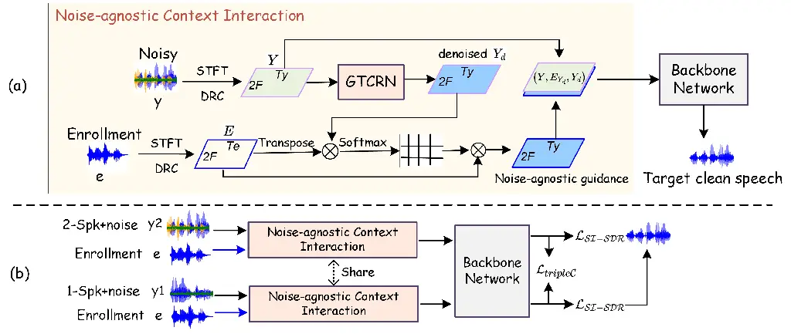
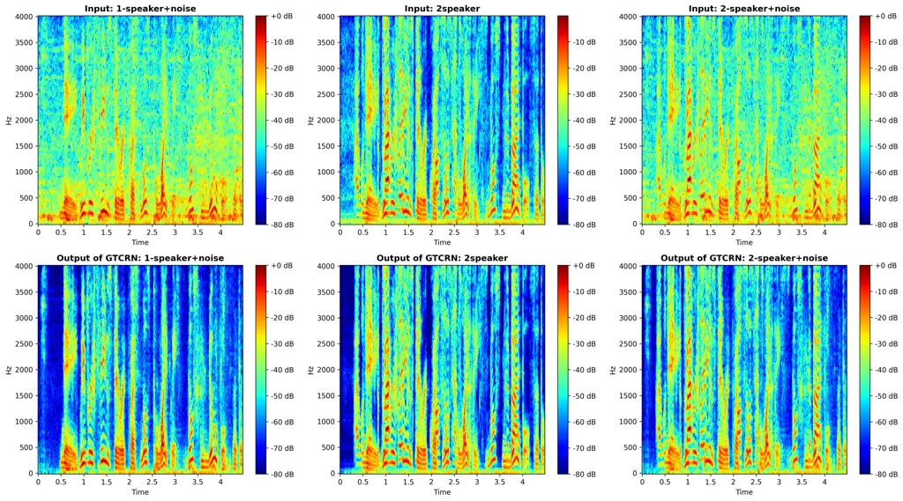

# TripleC Learning and Lightweight Speech Enhancement for Multi-Condition Target Speech Extraction

Ziling Huang    Junnan Wu    Lichun Fan    Zhenbo Luo    Jian Luan   
Haixin Guan    Yanhua Long\sthanksYanhua Long is the corresponding
author. This work was sponsored by Natural Science Foundation of
Shanghai (Grant No.25ZR1401277).  
^(†) Work done during internship at MiLM Plus, Xiaomi Inc

###### Abstract

In our recent work, we proposed Lightweight Speech Enhancement Guided
Target Speech Extraction (LGTSE) and demonstrated its effectiveness in
multi-speaker-plus-noise scenarios. However, real-world applications
often involve more diverse and complex conditions, such as
one-speaker-plus-noise or two-speaker-without-noise. To address this
challenge, we extend LGTSE with a Cross-Condition Consistency learning
strategy, termed TripleC Learning. This strategy is first validated
under multi-speaker-plus-noise condition and then evaluated for its
generalization across diverse scenarios. Moreover, building upon the
lightweight front-end denoiser in LGTSE can flexibly process both noisy
and clean mixtures and show strong generalization to unseen conditions,
we integrate TripleC learning with a further proposed parallel universal
training scheme that organizes batches containing multiple scenarios for
the same target speaker. By enforcing consistent extraction across
different conditions, easier cases can assist harder ones, thereby fully
exploiting diverse training data and fostering a robust universal model.
Experimental results on the Libri2Mix three-condition tasks demonstrate
that the proposed LGTSE with TripleC learning achieves superior
performance over condition-specific models, highlighting its strong
potential for universal deployment in real-world speech applications.

###### Index Terms: 

Target Speech Extraction, Lightweight Speech Enhancement, TripleC
Learning, Universal TSE

^(†)^(†)address: ¹Shanghai Normal University, Shanghai, China  
²MiLM Plus, Xiaomi Inc., Beijing, China  
³Unisound AI Technology Co., Ltd. Beijing, China

## 1 Introduction

Target speech extraction (TSE) aims to extract the speech of a desired
speaker from mixtures of interferers and background noise using an
enrollment utterance, with applications in automatic speech recognition,
hearing aids and speech communication. However, most existing approaches
are designed and evaluated under a single condition, such as two-speaker
mixtures or one-speaker-plus-noise, which limits their practicality.
However, real-world applications often involve diverse and complex
conditions, including one-speaker-plus-noise, two-speaker-without-noise
and noisy multi-speaker scenarios. This discrepancy highlights the need
for a universal TSE that can robustly generalize across multi-diverse
conditions.

Recent studies on enrollment-guided TSE can be grouped into three
categories: 1) speaker embedding/encoder-based approaches \[1, 2, 3,
4\], 2) embedding/encoder-free methods \[5, 6, 7, 8, 9\], and 3) hybrid
techniques that combine the two \[10\]. However, research on universal
TSE that generalizes across diverse conditions remains limited,
especially for embedding-free models. For example, \[11\] proposed
USEF-TSE, showing that embedding-free frameworks can integrate with
different separation backbones. \[12\] introduced UPN, which unifies
personalized and non-personalized TSE within a single model but relies
on speaker embeddings. Similarly, \[13\] developed USEF- PNet, enabling
both personalized and non-personalized TSE, while being an
embedding-free framework. AnyEnhance \[14\], UniAudio \[15\] and Metis
\[16\] also offer unified frameworks supporting TSE and other speech
tasks. However, most of these studies only provide single-condition TSE
performance, and they have not been evaluated under multiple interfering
conditions, leaving their robustness unverified and highlighting the
need for systematic studies on multi-condition TSE.

To the best of our knowledge, multi-condition TSE was first brought to
significant attention in the community during the ICASSP 2021 DNS
Challenge \[17\], called personalized speech enhancement (PSE), and
further explored in ICASSP 2022 \[18\] and 2023 \[19\]. In these
challenges, models were typically trained on data from all three
conditions, but evaluation used mainly overall metrics, without
analyzing each system across individual conditions. For example,
top-ranking systems \[20, 21\] were evaluated using overall performance
without examining condition-specific performance. Later studies \[22,
23\] conducted condition-wise evaluations, showing that training on all
conditions and adding innovations slightly improved overall performance,
simpler scenarios were already well-handled, while the main limitation
came from the challenging two-speaker-plus-noise condition, which still
needs targeted improvement. Notably, most of these efforts focused on
embedding/encoder-based models; in contrast, embedding/encoder-free TSE
has seen few attempts to build a universal model handling multi-diverse
conditions.

Building upon these observations, this work makes the following
contributions: 1) We extend our recently proposed LGTSE \[24\] by
introducing a cross-condition consistency learning strategy, termed
TripleC Learning, which is initially validated on
multi-speaker-plus-noise mixtures and then generalized to
multi-condition TSE tasks, showing consistent improvements in extraction
performance; 2) We build a universal embedding-free TSE model for
multiple conditions: a lightweight GTCRN-based \[25\] denoiser in LGTSE
flexibly handles both noisy and clean mixtures, and a parallel universal
training strategy is proposed that organizes multiple conditions for the
same target speaker within each batch, enabling effective integration
with TripleC Learning; 3) Experimental results on the Libri2Mix
three-condition dataset demonstrate that the proposed universal model
consistently outperforms condition-specific baselines, highlighting its
robustness and practical potential for real-world deployment.



Figure 1: Illustration of the proposed framework: (a) LGTSE
architecture. (b) TripleC training scheme.

## 2 Proposed Methods

### 2.1 Revisit LGTSE

Fig.1(a) shows our recently proposed LGTSE \[24\], which is a
lightweight speech enhancement-guided target speech extraction model. It
consists of a front-end Noise-agnostic Context Interaction module and a
back-end backbone. The model takes two inputs: noisy mixtures and
enrollment speech, and outputs the extracted target clean speech. Both
inputs are first transformed into complex time-frequency representations
via short-time Fourier transform, with the enrollment
$`\mathbf{E}\in\mathbb{R}^{2F\times T_{e}}`$ and the noisy speech
$`\mathbf{Y}\in\mathbb{R}^{2F\times T_{y}}`$, where $`2F`$ denotes the
concatenated real and imaginary parts along the frequency axis, and
$`T_{e}`$ and $`T_{y}`$ represent the number of frames of the enrollment
and noisy speech, respectively. Dynamic range compression \[26\] with
compression factor $`\beta=0.5`$ is applied to the magnitude spectrum:

```math
\mathbf{E}=|\mathbf{E}|^{\beta}e^{j\theta_{E}},\quad\mathbf{Y}=|\mathbf{Y}|^{\beta}e^{j\theta_{Y}}.\vskip-2.84544pt \tag{1}
```

The noisy input $`\mathbf{Y}`$ is then denoised by the GTCRN \[25\]
front-end to obtain $`\mathbf{Y}_{d}`$, which is used for noise-agnostic
context interaction:

```math
\displaystyle\mathbf{Y}_{d} \displaystyle=\mathrm{GTCRN}(\mathbf{Y}), \tag{2}
```

```math
\displaystyle\mathbf{E}_{Y_{d}} \displaystyle=\mathbf{E}\times\mathrm{softmax}\left(\mathbf{E}^{\mathrm{T}}\times\mathbf{Y}_{d}\right).
```

The motivation is that directly using the noisy input would produce
guidance contaminated by noise, which can degrade the target speech
extraction performance. In \[24\], LGTSE showed competitive performance
in multi-speaker noisy scenarios. Here, we further enhance the model and
extend its generalization to diverse conditions.

### 2.2 Cross-condition Consistency (TripleC) Learning

Fig. 1(b) illustrates the training scheme of our proposed
Cross-condition Consistency (TripleC) Learning. To improve performance
in multi-speaker-plus-noise conditions, we leverage the fact that
single-speaker-plus-noise mixtures are easier for the model to extract,
thus providing more reliable guidance. We therefore enforce consistency
between outputs of the same target speaker with different conditional
interfering and noise.

Specifically, let $`y_{1}`$ denote a single-speaker-plus-noise mixture
and $`y_{2}`$ a two-speaker-plus-noise mixture, both paired with the
same enrollment speech $`e`$, and let $`s`$ be the clean target speech.
During training, the two input pairs $`(y_{1},e)`$ and $`(y_{2},e)`$ are
fed in parallel. Each pair is processed by the noise-agnostic context
interaction module and then passed into the backbone network. For
brevity, we denote this end-to-end LGTSE mapping as $`f(\cdot)`$, and
the corresponding extracted signals are

```math
\hat{s}_{i}=f(y_{i},e),\quad i\in\{1,2\}, \tag{3}
```

where $`\hat{s}_{1}`$ and $`\hat{s}_{2}`$ are the estimated target
speech signals from the two conditions, both aiming to approximate
$`s`$. Thus, the overall training objective combines consistency and
supervision losses is defined as:

```math
\displaystyle\mathcal{L}_{\text{TripleC}} \displaystyle=w\cdot\frac{1}{T}\sum_{t=1}^{T}\big|\hat{s}_{1}[t]-\hat{s}_{2}[t]\big|, \tag{4}
```

```math
\displaystyle\mathcal{L}_{\text{SI-SDR}} \displaystyle=-\sum_{i=1}^{2}\text{SI-SDR}(\hat{s}_{i},s), \tag{5}
```

```math
\displaystyle\mathcal{L}_{\text{total}} \displaystyle=\mathcal{L}_{\text{SI-SDR}}+\mathcal{L}_{\text{TripleC}}, \tag{6}
```

where $`T`$ is the number of sampling points and $`w=50`$. Here,
$`\mathcal{L}_{\text{TripleC}}`$ enforces consistency between outputs
under different conditions, while $`\mathcal{L}_{\text{SI-SDR}}`$
ensures both estimates match the clean target $`s`$. This joint
optimization allows the model to exploit easier single-speaker mixtures
to guide extraction in harder multi-speaker-plus-noise conditions,
improving robustness and consistency.



Figure 2: Illustration of GTCRN denoising performance. Top row: input
mixtures under three conditions (single-speaker+noise, two-speaker
clean, two-speaker+noise); bottom row: corresponding enhanced outputs.

### 2.3 TripleC-parallel Universal Training

To extend TripleC Learning into a universal framework, we propose a
parallel universal training scheme where each batch contains three types
of mixtures sharing the same target speech and enrollment speech $`e`$:
single-speaker-plus-noise, two-speaker-plus-noise, and two-speaker.
These inputs are processed in parallel by the model, with each condition
producing its own extracted output.

The training objective combines two components. First, all outputs are
supervised by their clean target speech using SI-SDR loss, ensuring
accurate extraction across conditions. Second, the TripleC loss is
applied only to the noisy conditions (single-speaker-plus-noise and
two-speaker-plus-noise), aligning their outputs to let the easier case
guide the harder one.

This parallel setup allows the model to see all conditions
simultaneously and to learn a shared representation that generalizes
across them. The GTCRN front-end plays a crucial role: it naturally
performs effective denoising when noise is present, while behaving
almost as an identity mapping on clean mixtures (see Fig. 2). This
property enables seamless universal training without any additional
adjustment, laying a solid foundation for robust performance in diverse
real-world scenarios.

## 3 Experiments and Results

### 3.1 Datasets

All our experiments are conducted on the publicly available Libri2Mix
dataset \[27\], which covers three PSE conditions: 1) 1-speaker+noise
(mix_single): a mixture containing only the target speaker and
background noise; 2) 2-speaker (mix_clean): a mixture with a target
speaker and one interfering speaker without additional noise; 3)
2-speaker+noise (mix_both): a mixture with a target speaker, one
interfering speaker, and background noise. For clarity, we adopt the
terms ‘1-speaker+noise’, ‘2-speaker’, and ‘2-speaker+noise’ instead of
the original mix\_\* names in Libri2Mix. In each condition, the training
set contains 13,900 utterances from 251 speakers, while the development
and test sets each contain 3,000 utterances from 40 speakers. All
mixtures are simulated in the ‘min’ mode. Note that only the first
speaker is taken as the target speaker, and all mixtures are resampled
to 8 kHz, unless otherwise specified.

|        |                                   |                        |                 |      |       |           |      |       |                 |      |       |
| ------ | --------------------------------- | ---------------------- | --------------- | ---- | ----- | --------- | ---- | ----- | --------------- | ---- | ----- |
| ID     | Training Data                     | Method                 | 1-speaker+noise |      |       | 2-speaker |      |       | 2-speaker+noise |      |       |
|        |                                   |                        | SI-SDR          | PESQ | STOI  | SI-SDR    | PESQ | STOI  | SI-SDR          | PESQ | STOI  |
| -      | -                                 | unprocessed            | 3.27            | 1.75 | 79.51 | -0.03     | 1.60 | 71.38 | -2.03           | 1.43 | 64.65 |
| E0     | Condition-wise                    | SEF-PNet\[6\]          | 14.50           | 3.05 | 92.47 | 13.00     | 3.05 | 89.71 | 7.43            | 2.14 | 80.31 |
| E1     | Condition-wise                    | LGTSE\[24\]            | 14.50           | 3.07 | 92.48 | 13.18     | 3.06 | 90.02 | 7.88            | 2.21 | 81.27 |
| E2     | 2-spk+noise + 1-spk+noise         | LGTSE+tripleC          | 14.25           | 3.03 | 92.03 | 11.87     | 2.81 | 88.44 | 8.41            | 2.32 | 82.41 |
| E3     | 2-spk+noise + 1-spk+noise + 2-spk | LGTSE+tripleC-parallel | 14.28           | 3.03 | 92.15 | 13.33     | 3.07 | 90.19 | 8.58            | 2.33 | 82.61 |
| G0^(‡) |                                   | LGTSE+shuffled         | 14.42           | 2.28 | 92.91 | 15.01     | 2.57 | 92.53 | 9.70            | 1.72 | 85.52 |
| G1^(‡) |                                   | LGTSE+tripleC-parallel | 14.51           | 2.30 | 93.10 | 15.23     | 2.64 | 92.95 | 10.12           | 1.77 | 85.96 |
| G2^(‡) | Condition-wise                    | DB-BSRNN\[28\]         | \-              | \-   | \-    | 13.84     | 2.53 | \-    | \-              | 1.77 | \-    |
| G3^(∗) | Condition-wise                    | NCSN++\[29\]           | \-              | \-   | \-    | 13.80     | 2.24 | \-    | 9.70            | 1.55 | \-    |

- ^(‡/∗)
  Results at 16 kHz on Libri2Mix-100 (^(‡)) and Libri2Mix-360 (\*), with
  two speakers alternating as the target speaker.

Table 1: Performance comparison between our methods (E0–E4) and existing
approaches (G0–G2). All metrics are the higher the better.

### 3.2 Models

GTCRN \[25\], which has achieved state-of-the-art performance on speech
enhancement tasks, has only 50K parameters and 0.03G MACs. SEF-PNet
\[6\], used as one competitive embedding-free TSE baseline, has 6.08M
parameters and 8.50G MACs. LGTSE \[24\], which combines GTCRN and
SEF-PNet, has 6.13M parameters and 8.53G MACs. As proposed in \[24\],
the LGTSE baseline is trained using a pre-training+finetuning two-stage
training strategy: first, both the GTCRN front-end and backbone networks
are pre-trained individually, then the whole LGTSE is fine-tuned to
joint optimize the final system. In all the enhanced LGTSE+\*
experiments, the proposed TripleC and parallel universal training are
all performed on both the pre-training and finetuning stages. Full
architecture details are provided in \[24\].

### 3.3 Configurations

We perform STFT using a 32 ms Hanning window with an 8 ms shift. The
model is trained with Adam (initial LR = 0.0005), decayed by 0.98 every
two epochs for the first 100 epochs and by 0.9 for the last 20 epochs.
Gradient clipping is applied to limit the maximum L2-norm to 1. For
evaluation, we report SI-SDR (dB)\[30\], PESQ\[31\], and STOI (%)\[32\].

### 3.4 Results

#### 3.4.1 Overall Results

Table 1 presents the overall results of condition-wise and
multi-condition scenarios (E0-E3). Condition-wise results refer to
training and evaluating each condition separately. Compared with
SEF-PNet (E0), LGTSE (E1) achieves similar results in the
1-speaker+noise case but shows clear gains under speaker interference.
In the 2-speaker task, LGTSE improves SI-SDR and STOI, and in the more
challenging 2-speaker+noise scenario, the gains are larger across all
metrics. This confirms that the proposed noise-agnostic enrollment
guidance in LGTSE provides more accurate cues in robust multi-condition
TSE.

In E2, applying TripleC boosts the 2-speaker+noise performance over E1
significantly. The 1-speaker+noise condition shows a slight decrease,
likely because the model sacrifices some performance on easier
conditions to better align outputs for more challenging
multi-speaker+noise mixtures, achieving overall improvement. In
contrast, the 2-speaker condition shows a noticeable performance drop,
as the model has not seen clean speech without noise during training.

Extending TripleC to all conditions in E3 yields slight gains across
scenarios. Parallel universal training encourages the model to process
single-speaker+noise, multi-speaker clean, and multi-speaker+noise in
the same feature space. This shared learning enhances the model’s
ability to discriminate the target speaker, leading to minor
improvements even for the multi-speaker clean condition, which is not
directly constrained by TripleC. Comparing E3 with E0 and E1, an
embedding-free single model achieves universal performance across
conditions, and parallel training with TripleC is generalizable. Except
for a slight drop in 1-speaker+noise, all other conditions outperform
models trained condition-wise independently, demonstrating the
effectiveness of the unified training scheme.

#### 3.4.2 Comparison with Existing Approaches

System G0–G3 in Table 1 presents the performance comparison with recent
existing methods. For a fair comparison, all our models are trained on
Libri2Mix-100 at 16kHz, with two speakers alternating as the target. G0
is taken as a standard baseline, where training data from the three
conditions are randomly shuffled and fed into the model for training. G1
corresponds to our proposed model. It can be seen that applying the
TripleC plus parallel universal learning strategy leads to consistent
improvements across all conditions, demonstrating the effectiveness of
our approach.

Comparing G1 with other condition-wise trained state-of-the-art models
(G2 and G3), LGTSE+TripleC-parallel achieves the highest performance.
Specifically, under the 2-speaker condition, it achieves
SI-SDR/PESQ/STOI = 15.23/2.64/92.95, and under the 2-speaker+noise
condition, SI-SDR/PESQ/STOI = 10.12/1.77/85.96, surpassing the DB-BSRNN
model. Moreover, our model even outperforms NCSN++, which is trained on
Libri2Mix-360 with more than twice the amount of data. These results
verify the effectiveness of a universal, multi-condition, embedding-free
TSE model and highlight its potential for practical deployment in
diverse acoustic scenarios.

#### 3.4.3 Effects of GTCRN in Multi-condition Tasks

Fig. 2 illustrates the denoising capability of our pre-trained LGTSE
front-end, GTCRN. Although trained only on multi-speaker noisy mixtures,
it generalizes well to unseen single-speaker noisy and multi-speaker
clean conditions. The first row shows the input mixtures:
single-speaker+noise, two-speaker clean, and two-speaker+noise. The
second row shows the corresponding GTCRN outputs. GTCRN effectively
denoises single-speaker noisy inputs and preserves two-speaker clean
inputs, removing any slight underlying noise. Performance on two-speaker
noisy mixtures is also strong. These results demonstrate that GTCRN
provides a robust foundation for a universal TSE model capable of
handling both noisy and clean scenarios, enabling an embedding-free TSE
system suitable for real-world multi-condition applications.

## 4 Conclusion

In this work, we built upon our previous LGTSE model and proposed
TripleC Learning, a cross-condition consistency strategy to improve
performance on multi-speaker-plus-noise mixtures. We first validated its
effectiveness, and further, by adopting a parallel model training
scheme, we developed a universal embedding-free TSE model capable of
handling multiple conditions. The effectiveness of our extraction method
was verified on the Libri2Mix three-condition datasets. Future work
includes more generalization experiments, optimizing the model for
low-latency, real-time deployment in practical applications.

## References

- \[1\] J. Yu, H. Chen, Y. Luo, R. Gu, and C. Weng, “High fidelity
  speech enhancement with band-split RNN,” in Proc. Interspeech, 2023,
  pp. 2483--2487.
- \[2\] K. Liu, Z. Du, X. Wan, and H. Zhou, “X-SEPFORMER: End-to-end
  speaker extraction network with explicit optimization on speaker
  confusion,” in Proc. ICASSP, 2023, pp. 1–5.
- \[3\] J. Han, Y. Long, et al., “DPCCN: Densely-connected pyramid
  complex convolutional network for robust speech separation and
  extraction,” in Proc. ICASSP, 2022, pp. 7292–7296.
- \[4\] Z. You, Z. Zhou, L. Li, and D. Wang, “An investigation on
  speaker augmentation for end-to-end speaker extraction,” arXiv
  preprint arXiv:2505.21805, 2025.
- \[5\] B. Zeng, H. Suo, Y. Wan, and M. Li, “SEF-Net: Speaker embedding
  free target speaker extraction network,” in Proc. Interspeech, 2023,
  pp. 3452–3456.
- \[6\] Z. Huang, H. Guan, H. Wei, and Y. Long, “SEF-PNet: Speaker
  encoder-free personalized speech enhancement with local and global
  contexts aggregation,” in Proc. ICASSP, 2025, pp. 1–5.
- \[7\] X. Yang, C. Bao, J. Zhou, and X. Chen, “Target speaker
  extraction by directly exploiting contextual information in the
  time-frequency domain,” in Proc. Interspeech, 2024, pp. 10476–10480.
- \[8\] Y. Hu, H. Xu, Z. Guo, H. Huang, and L. He, “SMMA-Net: An audio
  clue-based target speaker extraction network with spectrogram matching
  and mutual attention,” in Proc. ICASSP, 2024, pp. 1496–1500.
- \[9\] T. Pärnamaa and A. Saabas, “Personalized speech enhancement
  without a separate speaker embedding model,” in Proc. Interspeech,
  2024, pp. 4863–4867.
- \[10\] K. Zhang, J. Li, S. Wang, Y. Wei, Y. Wang, Y. Wang, and H. Li,
  “Multi-level speaker representation for target speaker extraction,” in
  Proc. ICASSP, 2025, pp. 1–5.
- \[11\] B. Zeng and M. Li, “USEF-TSE: Universal speaker embedding free
  target speaker extraction,” IEEE Transactions on Audio, Speech, and
  Language Processing, 2025.
- \[12\] Z. Wang, R. Giri, D. Shah, J.-M. Valin, M. M. Goodwin, and
  P. Smaragdis, “A framework for unified real-time personalized and
  non-personalized speech enhancement,” in Proc. ICASSP. IEEE, 2023, pp.
  1–5.
- \[13\] Z. Huang, H. Guan, and Y. Long, “Unified architecture and
  unsupervised speech disentanglement for speaker embedding-free
  enrollment in personalized speech enhancement,” arXiv preprint
  arXiv:2505.12288, 2025.
- \[14\] J. Zhang, J. Yang, Z. Fang, Y. Wang, Z. Zhang, Z. Wang, F. Fan,
  and Z. Wu, “AnyEnhance: A unified generative model with
  prompt-guidance and self-critic for voice enhancement,” arXiv preprint
  arXiv:2501.15417, 2025.
- \[15\] D. Yang, J. Tian, X. Tan, R. Huang, S. Liu, H. Guo, X. Chang,
  J. Shi, J. Bian, Z. Zhao, et al., “UniAudio: Towards universal audio
  generation with large language models,” in Proc.ICML, 2024.
- \[16\] Y. Wang, J. Zheng, J. Zhang, X. Zhang, H. Liao, and Z. Wu,
  “Metis: A foundation speech generation model with masked generative
  pre-training,” arXiv preprint arXiv:2502.03128, 2025.
- \[17\] C. K. A. Reddy, H. Dubey, V. Gopal, R. Cutler, S. Braun,
  H. Gamper, R. Aichner, and S. Srinivasan, “ICASSP 2021 deep noise
  suppression challenge,” in Proc. ICASSP, 2021, pp. 6623–6627.
- \[18\] H. Dubey et al., “ICASSP 2022 deep noise suppression
  challenge,” in Proc. ICASSP. IEEE, 2022, pp. 9271–9275.
- \[19\] H. Dubey, A. Aazami, V. Gopal, B. Naderi, S. Braun, R. Cutler,
  A. Ju, M. Zohourian, M. Tang, M. Golestaneh, et al., “ICASSP 2023 deep
  noise suppression challenge,” IEEE Open Journal of Signal Processing,
  vol. 5, pp. 725–737, 2024.
- \[20\] Y. Ju, W. Rao, X. Yan, Y. Fu, et al., “TEA-PSE:
  Tencent-ethereal-audio-lab personalized speech enhancement system for
  ICASSP 2022 DNS challenge,” in Proc. ICASSP, 2022, pp. 9291–9295.
- \[21\] X. Yan, Y. Yang, Z. Guo, L. Peng, and L. Xie, “The NPU-Elevoc
  personalized speech enhancement system for ICASSP 2023 DNS Challenge,”
  in Proc. ICASSP, 2023, pp. 1–2.
- \[22\] Y. Ju, S. Zhang, W. Rao, et al., “TEA-PSE 2.0: Sub-band network
  for real-time personalized speech enhancement,” in Proc. SLT, 2023,
  pp. 472–479.
- \[23\] X. Ge, J. Han, H. Guan, and Y. Long, “Dynamic acoustic
  compensation and adaptive focal training for personalized speech
  enhancement,” Applied Acoustics, vol. 216, pp. 109803, 2024.
- \[24\] Z. Huang, J. Wu, L. Fan, Z. Luo, J. Luan, H. Guan, and Y. Long,
  “Lightweight speech enhancement guided target speech extraction in
  noisy multi-speaker scenarios,” arXiv preprint arXiv:2508.19583, 2025.
- \[25\] X. Rong, T. Sun, X. Zhang, Y. Hu, C. Zhu, and J. Lu, “GTCRN: A
  speech enhancement model requiring ultralow computational resources,”
  in Proc. ICASSP, 2024, pp. 971–975.
- \[26\] A. Li, C. Zheng, R. Peng, and X. Li, “On the importance of
  power compression and phase estimation in monaural speech
  dereverberation,” JASA Express Letters, p. 014802, 2021.
- \[27\] J. Cosentino, M. Pariente, S. Cornell, A. Deleforge, and
  E. Vincent, “LibriMix: An open-source dataset for generalizable speech
  separation,” arXiv preprint arXiv:2005.11262, 2020.
- \[28\] J. Wang, S. Wang, J. Li, K. Zhang, Y. Qian, and H. Li,
  “Enhancing speaker extraction through rectifying target confusion,” in
  Proc. SLT, 2024, pp. 349–356.
- \[29\] L. Zhang, Y. Qian, L. Yu, H. Wang, H. Yang, S. Liu, L. Zhou,
  and Y. Qian, “DDTSE: Discriminative diffusion model for target speech
  extraction,” in Proc. SLT, 2024, pp. 294–301.
- \[30\] J. Le Roux, S. Wisdom, H. Erdogan, and J. R. Hershey,
  “SDR–half-baked or well done?,” in Proc. ICASSP, 2019, pp. 626–630.
- \[31\] M. Wang, C. Boeddeker, R. Dantas, A. Seelan, et al., “PESQ
  (perceptual evaluation of speech quality) wrapper for python users,”
  Zenodo, 2022.
- \[32\] C. H. Taal, R. C. Hendriks, J. Heusdens, and R. Jensen, “A
  short-time objective intelligibility measure for time-frequency
  weighted noisy speech,” in Proc. ICASSP, 2010, pp. 4214–4217.
