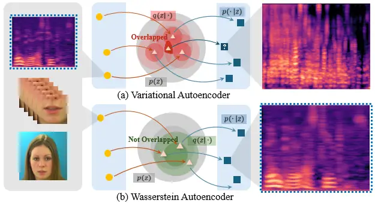
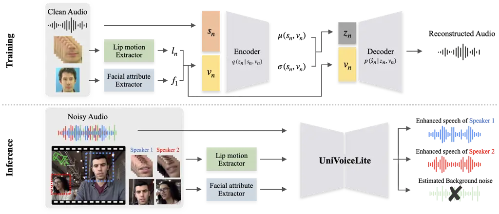
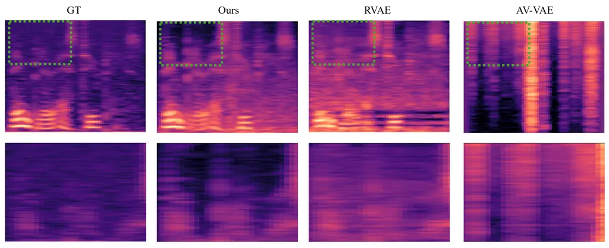
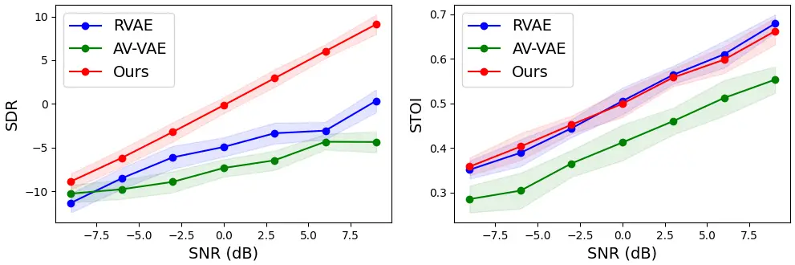
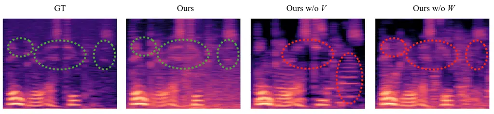

# Lightweight Wasserstein Audio-Visual Model for Unified Speech Enhancement and Separation

###### Abstract

Speech Enhancement (SE) and Speech Separation (SS) have traditionally
been treated as distinct tasks in speech processing. However, real-world
audio often involves both background noise and overlapping speakers,
motivating the need for a unified solution. While recent approaches have
attempted to integrate SE and SS within multi-stage architectures, these
approaches typically involve complex, parameter-heavy models and rely on
supervised training, limiting scalability and generalization. In this
work, we propose UniVoiceLite, a lightweight and unsupervised
audio-visual framework that unifies SE and SS within a single model.
UniVoiceLite leverages lip motion and facial identity cues to guide
speech extraction and employs Wasserstein distance regularization to
stabilize the latent space without requiring paired noisy-clean data.
Experimental results demonstrate that UniVoiceLite achieves strong
performance in both noisy and multi-speaker scenarios, combining
efficiency with robust generalization. The source code is available at
https://github.com/jisoo-o/UniVoiceLite.

###### Index Terms: 

Audio-visual speech separation, Speech enhancement, Unsupervised
learning, Lightweight model.

## I Introduction

Speech processing has witnessed remarkable advancements in recent years
\[1, 2\], driven by the growing demand for robust speech enhancement
(SE) and speech separation (SS) in various applications such as
telecommunication, hearing aids, and automatic speech recognition. SE
aims to extract a target speaker’s voice from noisy environments,
improving intelligibility and perceptual quality, while SS focuses on
disentangling overlapping voices in a mixture to enable individual
speaker identification and transcription \[3, 4\]. However, real-world
environments rarely contain isolated sounds; instead, they often involve
a mixture of background noise and multiple speakers. This has led to
growing interest in unified frameworks that can jointly handle both
tasks.



Fig. 1: Advantages of the Proposed WAE for Integrated Speech Enhancement
and Separation Tasks. (a) Traditional VAE exhibits significant overlap
in the latent space due to many-to-one mapping, leading to blurry and
less precise reconstructions. (b) The proposed WAE reduces this overlap
and produces reconstructions that more accurately resemble the clean
input (highlighted with blue dashed boxes), making it well-suited for
integrated speech enhancement and separation tasks.

To address this issue, recent studies have proposed multi-stage
architectures that incorporate denoising modules into the separation
pipeline. For instance, MUSE \[5\] integrates a denoising front-end with
a target speaker extraction module, enabling joint enhancement and
separation within a single system. While effective, such unified
approaches often rely on complex, parameter-heavy architectures and
require supervised training with noisy-clean speech pairs. These
constraints raise concerns regarding computational efficiency,
scalability, and the ability to generalize to unseen conditions.

To ovecome the aforementioned challenges, we propose UniVoiceLite, a
simple yet effective unsupervised audio-visual framework that unifies SE
and SS within a lightweight model architecture. Our method eliminates
the need for paired noisy-clean data and, more importantly, directly
models clean speech distributions to achieve robust generalization
across diverse acoustic environments, while remaining
speaker-independent. Table I highlights the uniqueness of our model
design by comparing existing approaches in terms of three key aspects:
unified handling of SE and SS, unsupervised learning, and lightweight
architecture (fewer than 3 million parameters).

Advantages 1. UniVoiceLite is designed to be both visually guided and
lightweight. By incorporating lip motion and facial identity features as
visual priors, the model improves speech intelligibility and target
speaker discrimination, especially in noisy and overlapping conditions.
Unlike conventional architectures that rely on large convolutional
backbones or multi-stage pipelines, UniVoiceLite uses shallow linear
layers for each modality (audio, lip, identity), followed by a shared
latent space and a unified decoder. This compact design enables the
model to operate effectively with only 2.3M parameters, significantly
fewer than existing audio-visual separation models such as
VisualVoice \[6\] (77.75M), making UniVoiceLite suitable for deployment
in resource-constrained settings.

Advantages 2. Existing speech enhancement methods based on Variational
Autoencoder (VAE) \[7\] often suffer from posterior collapse, a
phenomenon where latent variables collapse to the prior distribution,
leading to degraded speech quality \[8, 9, 10\]. This issue arises due
to the strong regularization imposed by the Kullback-Leibler (KL)
divergence, which constrains the model’s ability to learn meaningful
speech structures. In order to alleviate this, we leverage the
Wasserstein Autoencoder (WAE) \[11\], which replaces the KL
regularization with the Wasserstein distance, leading to a more stable
and structured latent space. As a result, our model effectively
mitigates posterior collapse and generates cleaner, higher-quality
speech, as shown in Fig.1.



Fig. 2: Illustration of the Proposed UniVoiceLite Pipeline. During
training, the model takes visual features $`v_{n}`$, including lip
motion and facial attributes, along with clean speech features
$`{s}_{n}`$ as inputs to the encoder, which maps them to a latent space.
The decoder then reconstructs the speech signal using the visual prior
$`v_{n}`$. During inference, the model processes noisy audio and
speaker-specific visual information from multiple speakers. UniVoiceLite
then separates the speech components, generating enhanced speech for
each speaker while effectively filtering out background noise.

The main contributions can be summarized as follows.

- •
  We propose UniVoiceLite, a lightweight, unsupervised framework that
  unifies speech enhancement and speech separation, leveraging visual
  information for improved speech processing.
- •
  We incorporate the Wasserstein distance to regularize the latent
  space, ensuring a more stable and structured representation, enhancing
  the quality of the learned representations.
- •
  We show the effectiveness of our approach through extensive
  experiments in noisy, multi-talker environments, achieving competitive
  improvements in speech intelligibility and clarity, both
  quantitatively and qualitatively.

## II Related Works

Audio Features. In single-microphone speech processing, magnitude
spectrograms are widely adopted due to their effectiveness in capturing
the energy distribution across frequency and time. However, they
inherently discard phase information, which is critical for
natural-sounding speech reconstruction. To overcome this, several
studies have explored richer spectral representations. These approaches
include incorporating phase information \[12, 13\] from complex-valued
Fourier Transform coefficients, using the real and imaginary components
of the complex spectrogram \[14, 15, 16\], or even employing the raw
waveform directly as input features \[17\] for speech enhancement. These
alternative representations preserve signal details that the magnitude
spectrogram alone may overlook, improving performance in speech
processing. More recently, self-supervised learning on audio such as
wav2vec 2.0 \[18\] has also been explored for speech enhancement and
recognition, suggesting a shift toward learning more abstract and robust
representations from raw audio.

| Method              | Unified Model | Unsupervised | Lightweight |
| ------------------- | ------------- | ------------ | ----------- |
| MUSE \[5\]          | O             | ×            | ×           |
| RVAE \[19\]         | ×             | O            | O           |
| AV-VAE \[8\]        | ×             | ×            | O           |
| MP-SENet \[20\]     | ×             | ×            | O           |
| CMGAN \[21\]        | ×             | ×            | O           |
| HiFi-GAN \[22\]     | ×             | ×            | O           |
| MossFormer2 \[23\]  | O             | ×            | ×           |
| VisualVoice \[6\]   | O             | ×            | ×           |
| UniVoiceLite (Ours) | O             | O            | O           |

TABLE I: Comparison of model design novelty. UniVoiceLite is the only
method that is unified, unsupervised, and lightweight.

Visual Features. Visual information such as lip motion and facial
attributes have been shown to significantly improve speech enhancement
and separation in noisy environments, where audio-only methods struggle.
Visual information is invariant to acoustic noise and complements audio
when signals are corrupted or overlapping. Several audio-visual
models \[14, 24, 6\] demonstrate the effectiveness of leveraging lip
movements to localize and enhance the target speaker. Static identity
embeddings, such as those from facial recognition models \[25, 26\],
also serve as priors to guide speech extraction in multi-speaker
settings \[27\]. For instance, AV-HuBERT \[28\] learns multimodal
representations using lip region features combined with contrastive and
clustering objectives, which has shown strong performance in speech
tasks under weak supervision. Furthermore, temporal modeling using
transformers \[29\] or LSTMs \[30\] allows the system to capture both
dynamic articulations and speaker consistency across time.

Variational Autoencoder. In recent speech enhancement approaches, VAEs
\[7\] have gained attention for their ability to perform unsupervised
learning, eliminating the need for labeled clean speech data. In
addition, VAEs learn the latent space of speech signals, facilitating
effective noise separation and improving reconstruction performance.
AV-VAE \[8\] utilized a VAE to combine visual and auditory information
for speech reconstruction, achieving better performance than
single-modality approaches. Meanwhile, Similarly, \[19\] employed a
Recurrent VAE to effectively model temporal dependencies, resulting in
more robust speech reconstruction.

In contrast to these models, our approach leverages the WAE to mitigate
posterior collapse, ensuring a more structured latent space.
Additionally, by integrating visual features, our model enhances speech
clarity and robustness across diverse acoustic environments.

Wasserstein Autoencoder. WAE \[11\] improved upon VAEs \[7\] by
addressing posterior collapse and reducing latent space overlap, both of
which can degrade speech reconstruction. Unlike VAEs, which impose a KL
divergence constraint, WAE regularizes the latent space using the
Wasserstein distance, enforcing a more structured and meaningful latent
representation while preventing latent space collapse.

By incorporating WAE into UniVoiceLite, we ensure a more stable latent
representation, reducing artifacts and improving speech intelligibility.
As illustrated in Fig.1, WAE effectively mitigates the many-to-one
mapping issue observed in VAEs, leading to clearer and more natural
speech reconstruction.

Unified Speech Enhancement and Separation. Traditional SE and SS tasks
have typically been addressed with separate models \[2\]. However,
real-world applications often demand the simultaneous handling of both.
To meet this need, recent models \[5, 6\] attempted to integrate
enhancement and separation into a single framework. These models,
however, typically rely on supervised training with large paired
datasets and complex architectures involving multiple encoder-decoder
stacks or multi-stage refinement modules. For example, the method
proposed in \[5\] introduced a denoising module prior to a target
speaker extractor, while the approach in \[6\] combined lip motion and
audio encoders with a fusion network. Despite their performance, such
models are computationally expensive and require strong supervision.

In contrast, our model offers a unified solution that is lightweight,
unsupervised, and effective across both SE and SS tasks.

## III Unified Wasserstein Auto-Encoder

The input speech feature
$`\mathbb{s}_{n}=\left(\left|s^{0}_{n}\right|^{2},\left|s^{1}_{n}\right|^{2},\ldots,\left|s_{n}^{F-1}\right|^{2}\right)`$
is defined as the power spectrum of the complex-valued STFT coefficients
$`s^{f}_{n}`$, where $`n`$ and $`f`$ denote the time frame and frequency
bin, respectively. This representation captures the time-frequency
structure of speech signals essential for modeling both content and
noise characteristics.

Each audio frame $`\mathbb{s}_{n}`$ is paired with a synchronized visual
input $`\mathbb{v}_{n}=(l_{n},f_{1})`$, where $`l_{n}`$ represents
dynamic lip motion features extracted from video frames around time
$`n`$, and $`f_{1}`$ denotes static facial identity features obtained
from the first frame. These visual cues provide complementary
information useful for separating and enhancing speech under challenging
acoustic conditions.

The dataset comprises a sequence of paired audio-visual frames
$`(\mathbb{s}_{n},\mathbb{v}_{n})`$, serving as the input for our
unsupervised learning framework. Unlike conventional supervised
approaches that require paired clean and noisy speech, our method
leverages only clean speech and aligned visual inputs, enabling scalable
training without reliance on curated ground-truth references.

In this section, we propose UniVoiceLite, a unified and lightweight
audio-visual Wasserstein auto-encoder that jointly performs speech
enhancement and separation by integrating visual guidance into both
latent representation learning and speech reconstruction. The model
encodes speech-relevant information into a latent variable
$`\mathbb{z}_{n}`$, which is regularized via a visually conditioned
prior. This structure prevents posterior collapse and promotes robust
speech generation across both single- and multi-speaker scenarios.

|               | SDR$`\uparrow`$ | STOI$`\uparrow`$ | DNSMOS-s$`\uparrow`$ | DNSMOS-o$`\uparrow`$ | SDR$`\uparrow`$ | STOI$`\uparrow`$ | DNSMOS-s$`\uparrow`$ | DNSMOS-o$`\uparrow`$ |
| ------------- | --------------- | ---------------- | -------------------- | -------------------- | --------------- | ---------------- | -------------------- | -------------------- |
| Noise         | Station         |                  |                      |                      | Kitchen         |                  |                      |                      |
| RVAE 2020     | -7.28±5.11      | 0.53±0.12        | 1.18±0.01            | 1.08±0.01            | -1.21±2.79      | 0.64±0.12        | 1.62±0.38            | 1.22±0.12            |
| AV-VAE 2021   | 0.48±2.13       | 0.30±0.03        | 1.64±0.14            | 1.39±0.07            | -2.01±2.81      | 0.29±0.01        | 1.84±0.26            | 1.51±0.17            |
| MP-SENet 2023 | -14.54±0.72     | 0.15±0.02        | 3.37±0.14            | 3.10±0.17            | -14.63±0.06     | 0.18±0.01        | 3.45±0.03            | 3.18±0.04            |
| CMGAN 2022    | -13.73±0.23     | 0.15±0.02        | 3.20±0.14            | 2.90±0.17            | -14.30±0.07     | 0.18±0.01        | 3.23±0.17            | 2.90±0.19            |
| HiFi-GAN 2020 | 0.55±6.95       | 0.60±0.14        | 2.51±1.17            | 1.76±0.64            | 0.13±7.25       | 0.61±0.15        | 3.13±0.06            | 2.13±0.30            |
| Ours          | 2.11±6.47       | 0.67±0.12        | 2.40±1.06            | 1.53±0.42            | 3.10±6.03       | 0.69±0.13        | 3.05±0.06            | 1.78±0.14            |
| Noise         | Metro           |                  |                      |                      | Cafeteria       |                  |                      |                      |
| RVAE 2020     | -3.40±1.65      | 0.65±0.11        | 1.59±0.23            | 1.33±0.12            | -7.81±5.94      | 0.49±0.12        | 1.16±0.04            | 1.07±0.02            |
| AV-VAE 2021   | -1.72±2.99      | 0.25±0.05        | 1.71±0.08            | 1.44±0.03            | 0.16±1.78       | 0.31±0.05        | 1.75±0.12            | 1.45±0.05            |
| MP-SENet 2023 | -13.91±0.27     | 0.16±0.02        | 3.46±0.08            | 3.19±0.09            | -14.60±0.17     | 0.18±0.04        | 3.32±0.28            | 3.03±0.34            |
| CMGAN 2022    | -13.79±0.30     | 0.19±0.01        | 3.20±0.11            | 2.90±0.11            | -14.22±0.12     | 0.17±0.01        | 3.06±0.51            | 2.75±0.55            |
| HiFi-GAN 2020 | 0.19±7.19       | 0.55±0.16        | 2.11±0.92            | 1.51±0.49            | 0.09±7.27       | 0.45±0.16        | 2.11±0.92            | 1.51±0.49            |
| Ours          | 1.01±6.89       | 0.74±0.12        | 2.55±0.30            | 1.68±0.24            | 1.17±6.64       | 0.52±0.15        | 1.85±0.96            | 1.32±0.33            |

TABLE II: Speech Enhancement (SE) Comparison Using SDR, STOI, DNSMOS-s,
and DNSMOS-o metrics. The best and second best results were highlighted.



Fig. 3: Speech Enhancement (SE) Comparison Using Mel-Spectrogram. Top:
Spectrograms of ground truth, ours, RVAE, and AV-VAE. Bottom: Zoomed-in
highlighted regions.

Latent Space Representation. To model the underlying structure of clean
speech, we introduce a latent variable $`\mathbb{z}_{n}`$ that captures
speech-relevant information conditioned on both audio and visual inputs.
Given the paired features $`(\mathbb{s}_{n},\mathbb{v}_{n})`$, the
encoder approximates the posterior distribution as:

```math
\vskip-5.69054ptq(\mathbb{z}_{n}\mid\mathbb{s}_{n},\mathbb{v}_{n};\psi)=\mathcal{N}\left(\boldsymbol{\mu}_{n},\operatorname{diag}(\boldsymbol{\sigma}_{n}^{2})\right), \tag{1}
```

where $`\boldsymbol{\mu}_{n}`$ and $`\boldsymbol{\sigma}_{n}`$ are the
mean and standard deviation predicted by the encoder network,
parameterized by $`\psi`$.

During training, we apply the reparameterization trick to sample
$`\mathbb{z}_{n}`$ as:

```math
\vskip-8.53581pt\mathbb{z}_{n}=\boldsymbol{\mu}_{n}+\boldsymbol{\sigma}_{n}\odot\boldsymbol{\epsilon},\quad\boldsymbol{\epsilon}\sim\mathcal{N}(\mathbf{0},\mathbf{I}), \tag{2}
```

which enables backpropagation via the sampling operation.

To regularize the latent space, we define a visually conditioned prior
distribution:

```math
\vskip-2.84526ptp(\mathbb{z}_{n}\mid\mathbb{v}_{n};\gamma)=\mathcal{N}\left(\boldsymbol{\mu}_{n}^{\text{prior}},\operatorname{diag}(\boldsymbol{\sigma}_{n}^{\text{prior}})\right), \tag{3}
```

where $`\boldsymbol{\mu}_{n}^{\text{prior}}`$ and
$`\boldsymbol{\sigma}_{n}^{\text{prior}}`$ are the mean and standard
deviation vectors predicted from the visual input $`\mathbb{v}_{n}`$ via
a neural network parameterized by $`\gamma`$.

Optimization Objective. The model optimizes a loss function that
maintains a balance between accurate speech reconstruction and effective
regularization of the latent space:

```math
\displaystyle\mathcal{L}(\mathbb{s},\mathbb{v};\theta,\psi) \displaystyle=\underbrace{\mathbb{E}_{q(\mathbb{z}|\mathbb{s},\mathbb{v};\psi)}[\ln p(\mathbb{s}|\mathbb{z},\mathbb{v};\theta)]}_{\text{Reconstruction term}}
```

```math
\displaystyle\quad+\lambda\cdot\underbrace{\mathcal{W}(q(\mathbb{z}|\mathbb{s},\mathbb{v};\psi)\parallel p(\mathbb{z}|\mathbb{v};\gamma))}_{\text{Regularization term}}, \tag{4}
```

where the hyperparameter $`\lambda`$ controls the trade-off between two
objectives.

The reconstruction term encourages the decoder (parameterized by
$`\theta`$) to generate clean speech $`\mathbb{s}`$ that closely matches
the ground truth, by maximizing the log-likelihood conditioned on the
latent variable $`\mathbb{z}`$ and visual features $`\mathbb{v}`$.

The regularization term enforce consistency in the latent space by
minimizing the Wasserstein distance $`\mathcal{W}(\cdot\parallel\cdot)`$
between the posterior distribution
$`q(\mathbb{z}|\mathbb{s},\mathbb{v};\psi)`$ and the prior distribution
$`p(\mathbb{z}|\mathbb{v};\gamma)`$, parameterized by $`\psi`$ and
$`\gamma`$, respectively. Compared to KL divergence, the Wasserstein
distance provides more stable gradients and encourages a smoother and
more structured latent space. The overall training pipeline is
illustrated in Fig.2.

Speech Reconstruction. The decoder reconstructs the STFT coefficients of
the speech signal by conditioning on both the latent representation and
the visual information:

```math
s^{F}_{n}|(\mathbb{z}_{n},\mathbb{v}_{n})\sim\mathcal{N}_{C}\left(0,\sigma_{F}^{2}(\mathbb{z}_{n},\mathbb{v}_{n})\right), \tag{5}
```

where $`\mathcal{N}_{C}(0,\sigma_{f}^{2})`$ denotes a univariate
complex-valued Gaussian distribution, and the variance
$`\sigma_{F}^{2}(\mathbb{z}_{n},\mathbb{v}_{n})`$ captures the structure
of STFT coefficients based on the latent variable $`\mathbb{z}_{n}`$ and
the visual features $`\mathbb{v}_{n}`$. Unlike supervised methods that
require access to clean reference signals, our approach learns to
reconstruct clean speech in a fully unsupervised manner.

This design makes the model inherently more robust and adaptable to
real-world conditions where clean ground truth is unavailable.
Crucially, the visual modality guides the latent representation toward
speech-relevant features, helping the model effectively reduce noise and
recover intelligible even under severe acoustic degradation.

### III-A Audio-Visual Speech Enhancement Tasks

Given the latent representation $`\mathbb{z}_{n}`$, the decoder
reconstructs the clean speech signal by conditioning on both
$`\mathbb{z}_{n}`$ and the corresponding visual features
$`\mathbb{v}_{n}`$. the generative process is defined as:

```math
p\left(\mathbb{\hat{s}}_{n}\mid\mathbb{z_{n}},\mathbb{v_{n}};\theta\right), \tag{6}
```

where $`\mathbb{\hat{s}}_{n}`$ denotes the reconstructed audio signal,
and $`\theta`$ represents the parameters of the decoder network.

This formulation enables the model to generate speech that closely
approximates the original clean signal, while effectively leveraging
visual information to guide the reconstruction. The visual modality
provides complementary information that helps disambiguate speech
content, particularly in acoustically challenging scenarios. By jointly
utilizing both audio and visual inputs, the model improves the
intelligibility and perceptual quality of the enhanced speech output.

### III-B Audio-Visual Speech Separation Tasks

UniVoiceLite performs speech separation by utilizing speaker-specific
visual features to isolate each speaker’s voice from a mixed audio
signal. Given the mixture $`\mathbb{s}_{n}^{\text{mix}}`$ containing
multiple speakers, the encoder estimates a latent representation,
$`\mathbb{z}_{n}^{(k)}`$ for each speaker $`k`$, by conditioning on
their visual features:

```math
q\left(\mathbb{z}_{n}^{(k)}|\mathbb{s}_{n}^{\text{mix}},\mathbb{v}_{n}^{(k)};\psi\right), \tag{7}
```

where $`\mathbb{s}_{n}^{mix}`$ denotes the visual features corresponding
to speaker $`k`$. The decoder then reconstructs the clean speech for
each individual speaker:

```math
p\left(\mathbb{\hat{s}}_{n}^{(k)}|\mathbb{z}_{n}^{(k)},\mathbb{v}_{n}^{(k)};\theta\right), \tag{8}
```

where $`\mathbb{\hat{s}}_{n}^{(k)}`$ represents the reconstructed speech
of speaker $`k`$. This process ensures that only the target speaker’s
voice is preserved, while suppressing interfering speakers and
background noise. By leveraging visual information as a speaker-specific
prior, the model achieves effective separation without requiring
explicit speaker identity labels.

To further refine the separation quality, UniVoiceLite adopts a
post-processing step based on Monte Carlo Expectation Maximization
(MCEM)\[31\], following the approach of AV-VAE\[8\]. MCEM iteratively
estimates gain and noise parameters, enabling probabilistically optimal
reconstruction of the clean speech. In particular, Wiener filtering is
employed within this framework to suppress residual interference,
enhancing the clarity and fidelity of the separated audio.

|        | PESQ$`\uparrow`$ | SDR$`\uparrow`$ | STOI$`\uparrow`$ | DNSMOS-s$`\uparrow`$ | DNSMOS-o$`\uparrow`$ |
| ------ | ---------------- | --------------- | ---------------- | -------------------- | -------------------- |
| RVAE   | 1.20 ± 0.15      | -5.28 ± 4.94    | 0.53 ± 0.14      | 2.47±0.38            | 1.87±0.43            |
| AV-VAE | 1.23 ± 0.07      | -3.64 ± 1.72    | 0.53 ± 0.05      | 1.53±0.13            | 1.36±0.09            |
| Ours   | 1.27 ± 0.08      | 1.46 ± 6.16     | 0.60 ± 0.13      | 2.25±0.85            | 1.76±0.50            |

TABLE III: Speech Separation (SS) Comparison with Generative Methods in
2 Speakers Scenarios Using PESQ, SDR, STOI, DNSMOS-s, and DNSMOS-o
metrics.

|          | \# Params | SDR $`\uparrow`$ | STOI $`\uparrow`$ |
| -------- | --------- | ---------------- | ----------------- |
| MP-SENet | 2.05M     | -14.65±0.45      | 0.16±0.03         |
| CMGAN    | 1.83M     | -14.51±0.51      | 0.16±0.04         |
| HiFi-GAN | –         | -0.01±7.30       | 0.60±0.17         |
| Ours     | 2.3M      | 1.46 ± 6.16      | 0.60 ± 0.13       |

TABLE IV: Speech Separation (SS) Comparison with State-of-the-art SE
methods in 2 Speakers Scenarios Using SDR, STOI metrics.

## IV Experiments

### IV-A Experiment Details

Dataset. We conducted experiments using the GRID corpus dataset \[32\],
which includes $`34`$ speakers each speaking $`1,000`$ structured
sentences. Our unsupervised model was trained solely on the clean audio
without using any paired noisy-clean data. Visual input was extracted as
an $`88\times 88`$ mouth region utilizing Dlib \[33\] and encoded via
the noise-augmented AV-HuBERT \[28\].

Evaluation. We simulated two realistic conditions. In the SE setting, we
added DEMAND \[34\] noise (station, kitchen, metro, cafeteria) to clean
utterances (from GRID test set) at SNR levels of -9, 0, and 9 dB. In the
SS setting, we randomly selected two or three speakers from the test
set, designating one as the target speaker. The remaining speaker(s)
were treated as interfering sources and mixed at different SNR levels
(-9, 0 ,9 dB) with the target’s speech, following common practice in
audio-visual separation benchmarks \[12, 14\]. Speaker 21 was excluded
due to missing video, and corrupted data were removed. While trained on
GRID, which is a lab-recorded dataset, our setup evaluates
generalization to real-world noise and multi-speaker interference. We
reported SDR for signal fidelity, STOI for intelligibility, and
DNSMOS-SIG/OVR \[35\] for no-reference perceptual quality. Since our
setup reflects real-world conditions, all baseline results were
re-evaluated under identical settings for fair comparison.

|                | \# Params   | SDR $`\uparrow`$ | STOI $`\uparrow`$ |
| -------------- | ----------- | ---------------- | ----------------- |
| MossFormer2    | $`\sim`$55M | -14.33±0.36      | 0.22±0.04         |
| VisualVoice    | $`\sim`$77M | -16.29±0.51      | 0.04±0.03         |
| AV-MossFormer2 | –           | -17.04±0.79      | 0.22±0.02         |
| AV-ConvTasNet  | $`\sim`$13M | -13.99±2.36      | 0.16±0.03         |
| Ours           | 2.3M        | 1.46 ± 6.16      | 0.60 ± 0.13       |

TABLE V: Speech Separation (SS) Comparison with State-of-the-art SS
methods in 2 Speakers Scenarios using SDR, STOI metrics.



Fig. 4: Speech Separation (SS) Comparison in 3 Speakers Scenario Using
SDR, STOI Metrics.



Fig. 5: Ablation Study (Mel-Spectrogram Comparison). Removing $`V`$
(visual features) leads to noticeable distortions, while the absence of
$`W`$ (Wasserstein distance) results in blurred and less structured
reconstructions.

Architecture and Implementation. UniVoiceLite adopted an audio-visual
Wasserstein autoencoder architecture, where the encoder separately
encoded log-magnitude spectrograms and visual features (lip motion and
facial attributes) before fusing them to estimate the posterior latent
distribution. A visual-conditioned prior was used to predict the latent
prior distribution. The decoder reconstructed speech from both posterior
and prior samples, guided by a Wasserstein-style loss that combines
reconstruction accuracy and latent distribution alignment. The model
utilized Tanh for audio activations and ReLU for visual branches.
Training was performed using the Adam optimizer with a batch size of
$`512`$, a learning rate of $`1e\text{-}4`$, and early stopping based on
validation loss. The trade-off weight $`\lambda`$ for the regularization
term was set to $`0.1`$.

### IV-B Experimental Results

We compared UniVoiceLite with two unsupervised SE models \[19, 8\],
three state-of-the-art SE models \[20, 21, 22\], and recent SS models,
including the audio-only MossFormer2 \[23\] and audio-visual SS
methods \[36, 6, 37\].

Evaluation of Speech Enhancement (SE) Tasks. In noisy conditions,
UniVoiceLite achieved the highest SDR and STOI across all noise types
(Table II), despite not being specifically tailored for speech
enhancement. While its DNSMOS scores were slightly lower than those of
dedicated SE models \[20, 21, 22\], these models performed poorly on
separation tasks (Table IV), underscoring UniVoiceLite’s broader
applicability. Fig.3 presents qualitative results via mel-spectrogram
comparisons, where our model better restores spectral detail.

Evaluation of Speech Separation (SS) Tasks. In multi-speaker settings,
UniVoiceLite consistently outperformed all baselines in SDR and STOI
(Table III). Although its DNSMOS scores were marginally lower, this
metric reflects general perceptual quality and does not explicitly
evaluate target speaker preservation. The superior SDR/STOI results
demonstrate UniVoiceLite’s effectiveness in extracting the target
speaker and suppressing interference. Table IV highlights the limited
separation ability of SE-focused models, while Table V shows that
UniVoiceLite surpasses both audio-only and audio-visual SS baselines.
Fig.4 further illustrates UniVoiceLite’s robustness in challenging
three-speaker scenarios across various SNR levels, where separation
becomes significantly more difficult.

Although some baselines report higher scores in their original papers,
our reproduced results are comparatively lower due to a unified and more
realistic evaluation setup. Instead of relying on curated benchmarks, we
synthesized noisy mixtures using the GRID and DEMAND datasets. As shown
in Fig.3, the ground truth contains considerable noise, highlighting the
difficulty and real-world relevance of our test setting.

Evaluation of Model Efficiency. As summarized in Table V, UniVoiceLite
achieves strong performance with only 2.37M parameters, significantly
fewer than recent audio-visual speech separation models such as
VisualVoice \[6\] and AV-ConvTasNet \[37\]. Despite its lightweight
design, our model outperforms all baselines in both SDR and STOI. This
efficiency is primarily due to three factors: using shallow fully
connected layers instead of heavy modules, adopting a low-dimensional
latent space, and relying on frozen visual features without end-to-end
training.

|            | SDR$`\uparrow`$ | STOI$`\uparrow`$ | DNSMOS-s$`\uparrow`$ | DNSMOS-o$`\uparrow`$ |
| ---------- | --------------- | ---------------- | -------------------- | -------------------- |
| Ours w/o W | -5.80           | 0.28             | 1.69                 | 1.43                 |
| Ours w/o V | 10.51           | 0.85             | 2.98                 | 1.93                 |
| Ours       | 17.82           | 0.87             | 3.11                 | 2.70                 |

TABLE VI: Ablation Study (Importance of Visual Features and Wasserstein
Distance). $`V`$ and $`W`$ are visual features and Wasserstein distance,
respectively.

Ablation Study. Table VI evaluates the contribution of key components in
our model. Removing visual features leads to a significant degradation
in DNSMOS, confirming the importance of lip motion and facial cues as
effective visual priors for preserving perceptual clarity. Additionally,
replacing the Wasserstein loss with KL divergence results in noticeable
drops in SDR and STOI, validating its importance in maintaining a
well-structured latent space and avoiding posterior collapse. These
findings are further illustrated in Fig.5, which visualizes the impact
of each component, demonstrating that both visual guidance and
Wasserstein regularization are essential for high-quality reconstruction
and separation.

## V Conclusion

We proposed a lightweight and unsupervised audio-visual Wasserstein
autoencoder (UniVoiceLite) that unifies speech enhancement and
separation within a single framework. By leveraging visual features and
Wasserstein regularization, UniVoiceLite effectively models real-world
speech and improves speech intelligibility and stability in noisy,
multi-talker environments. Without relying on paired noisy-clean data,
the model generalizes well across diverse environments while maintaining
speaker independence, offering an efficient and scalable solution for
real-world speech processing.

## Acknowledgment

This work was supported by the Institute of Information & Communications
Technology Planning & Evaluation (IITP) grant funded by the Korea
government (MSIT) (RS-2024-00456709 and RS-2021-II211341, Artificial
Intelligence Graduate School Program (Chung-Ang University)).

## References

- \[1\] Y. Xu, J. Du, L. Dai, and C. Lee (2014) A regression approach to
  speech enhancement based on deep neural networks. IEEE/ACM
  transactions on audio, speech, and language processing 23 (1),
  pp. 7–19. Cited by: §I.
- \[2\] D. Wang and J. Chen (2018) Supervised speech separation based on
  deep learning: an overview. IEEE/ACM transactions on audio, speech,
  and language processing 26 (10), pp. 1702–1726. Cited by: §I, §II.
- \[3\] H. Erdogan, J. R. Hershey, S. Watanabe, and J. Le Roux (2015)
  Phase-sensitive and recognition-boosted speech separation using deep
  recurrent neural networks. In ICASSP, Cited by: §I.
- \[4\] J. R. Hershey, Z. Chen, J. Le Roux, and S. Watanabe (2016) Deep
  clustering: discriminative embeddings for segmentation and separation.
  In ICASSP, Cited by: §I.
- \[5\] K. Saijo, W. Zhang, Z. Wang, S. Watanabe, T. Kobayashi, and T.
  Ogawa (2023) A single speech enhancement model unifying
  dereverberation, denoising, speaker counting, separation, and
  extraction. In ASRU, pp. 1–6. Cited by: §I, TABLE I, §II.
- \[6\] A. Gabbay, A. Shamir, and S. Peleg (2018) Visual speech
  enhancement. In Interspeech, Cited by: §I, TABLE I, §II, §II, §IV-B,
  §IV-B.
- \[7\] D. P. Kingma and M. Welling (2014) Auto-encoding variational
  bayes. In ICLR, Cited by: §I, §II, §II.
- \[8\] M. Sadeghi, S. Leglaive, X. Alameda-Pineda, L. Girin, and R.
  Horaud (2020) Audio-visual speech enhancement using conditional
  variational auto-encoders. IEEE/ACM Transactions on Audio, Speech, and
  Language Processing 28, pp. 1788–1800. Cited by: §I, TABLE I, §II,
  §III-B, §IV-B.
- \[9\] S. Leglaive, L. Girin, and R. Horaud (2018) A variance modeling
  framework based on variational autoencoders for speech enhancement. In
  MLSP, Cited by: §I.
- \[10\] H. Fang, G. Carbajal, S. Wermter, and T. Gerkmann (2021)
  Variational autoencoder for speech enhancement with a noise-aware
  encoder. In ICASSP, Cited by: §I.
- \[11\] I. Tolstikhin, O. Bousquet, S. Gelly, and B. Schölkopf (2018)
  Wasserstein auto-encoders. In ICLR, Cited by: §I, §II.
- \[12\] T. Afouras, J. S. Chung, and A. Zisserman (2018) The
  conversation: deep audio-visual speech enhancement. In Interspeech,
  Cited by: §II, §IV-A.
- \[13\] T. Afouras, J. S. Chung, and A. Zisserman (2019) My lips are
  concealed: audio-visual speech enhancement through obstructions. In
  Interspeech, Cited by: §II.
- \[14\] A. Ephrat, I. Mosseri, O. Lang, T. Dekel, K. Wilson, A.
  Hassidim, W. T. Freeman, and M. Rubinstein (2018) Looking to listen at
  the cocktail party: a speaker-independent audio-visual model for
  speech separation. In SIGGRAPH, Cited by: §II, §II, §IV-A.
- \[15\] E. Ideli (2019) Audio-visual speech processing using deep
  learning techniques. Cited by: §II.
- \[16\] B. Inan12, M. Cernak, H. Grabner23, H. P. Tukuljac, R. C. Pena,
  and B. Ricaud (2019) Evaluating audiovisual source separation in the
  context of video conferencing. In Interspeech, Cited by: §II.
- \[17\] E. Ideli, B. Sharpe, I. V. Bajić, and R. G. Vaughan (2019)
  Visually assisted time-domain speech enhancement. In GlobalSIP, Cited
  by: §II.
- \[18\] A. Baevski, Y. Zhou, A. Mohamed, and M. Auli (2020) Wav2vec
  2.0: a framework for self-supervised learning of speech
  representations. In NIPS, pp. 12449–12460. Cited by: §II.
- \[19\] S. Leglaive, X. Alameda-Pineda, L. Girin, and R. Horaud (2020)
  A recurrent variational autoencoder for speech enhancement. In ICASSP,
  Cited by: TABLE I, §II, §IV-B.
- \[20\] Y. Lu, Y. Ai, and Z. Ling (2021) MP-senet: a speech enhancement
  model with parallel denoising of magnitude and phase spectra. In
  Interspeech, Cited by: TABLE I, §IV-B, §IV-B.
- \[21\] R. Cao, S. Abdulatif, and B. Yang (2022) CMGAN: conformer-based
  metric gan for speech enhancement. In Interspeech, Cited by: TABLE I,
  §IV-B, §IV-B.
- \[22\] J. Kong, J. Kim, and J. Bae (2020) Hifi-gan: generative
  adversarial networks for efficient and high fidelity speech synthesis.
  In NIPS, pp. 17022–17033. Cited by: TABLE I, §IV-B, §IV-B.
- \[23\] S. Zhao, Y. Ma, C. Ni, C. Zhang, H. Wang, T. H. Nguyen, K.
  Zhou, J. Q. Yip, D. Ng, and B. Ma (2024) Mossformer2: combining
  transformer and rnn-free recurrent network for enhanced time-domain
  monaural speech separation. In ICASSP, pp. 10356–10360. Cited by:
  TABLE I, §IV-B.
- \[24\] T. Afouras, J. S. Chung, A. Senior, O. Vinyals, and A.
  Zisserman (2018) Deep audio-visual speech recognition. IEEE
  transactions on pattern analysis and machine intelligence 44 (12),
  pp. 8717–8727. Cited by: §II.
- \[25\] O. Parkhi, A. Vedaldi, and A. Zisserman (2015) Deep face
  recognition. In BMVC, Cited by: §II.
- \[26\] F. Schroff, D. Kalenichenko, and J. Philbin (2015) Facenet: a
  unified embedding for face recognition and clustering. In CVPR,
  pp. 815–823. Cited by: §II.
- \[27\] T. Afouras, A. Owens, J. S. Chung, and A. Zisserman (2020)
  Self-supervised learning of audio-visual objects from video. In ECCV,
  Cited by: §II.
- \[28\] B. Shi, W. Hsu, K. Lakhotia, and A. Mohamed (2022) Learning
  audio-visual speech representation by masked multimodal cluster
  prediction. In Interspeech, Cited by: §II, §IV-A.
- \[29\] V. A. Kalkhorani, A. Kumar, K. Tan, B. Xu, and D. Wang (2023)
  Time-domain transformer-based audiovisual speaker separation. In
  Interspeech, Cited by: §II.
- \[30\] A. Jain, J. S. Sanjotra, H. Choudhary, K. Agrawal, R. Shah, R.
  Jha, M. Sajid, A. Hussain, and M. Tanveer (2024) LSTMSE-net: long
  short term speech enhancement network for audio-visual speech
  enhancement. In AVSEC, Cited by: §II.
- \[31\] G. C. Wei and M. A. Tanner (1990) A monte carlo implementation
  of the em algorithm and the poor man’s data augmentation algorithms.
  Journal of the American statistical Association 85 (411), pp. 699–704.
  Cited by: §III-B.
- \[32\] M. Cooke, J. Barker, S. Cunningham, and X. Shao (2006) An
  audio-visual corpus for speech perception and automatic speech
  recognition. The Journal of the Acoustical Society of America 120 (5),
  pp. 2421–2424. Cited by: §IV-A.
- \[33\] D. E. King (2009) Dlib-ml: a machine learning toolkit. The
  Journal of Machine Learning Research 10, pp. 1755–1758. Cited by:
  §IV-A.
- \[34\] J. Thiemann, N. Ito, and E. Vincent (2013) The diverse
  environments multi-channel acoustic noise database (demand): a
  database of multichannel environmental noise recordings. In POMA,
  Cited by: §IV-A.
- \[35\] C. K. Reddy, V. Gopal, and R. Cutler (2021) DNSMOS: a
  non-intrusive perceptual objective speech quality metric to evaluate
  noise suppressors. In ICASSP, Cited by: §IV-A.
- \[36\] (2024) ClearerVoice-studio. Note:
  https://github.com/modelscope/ClearerVoice-StudioAccessed: 2025-05-05
  Cited by: §IV-B.
- \[37\] J. Wu, Y. Xu, S. Zhang, L. Chen, M. Yu, L. Xie, and D.
  Yu (2019) Time domain audio visual speech separation. In ASRU,
  pp. 667–673. Cited by: §IV-B, §IV-B.
