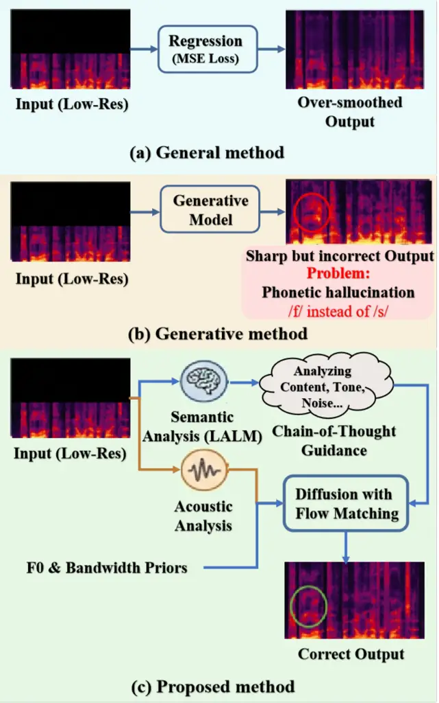
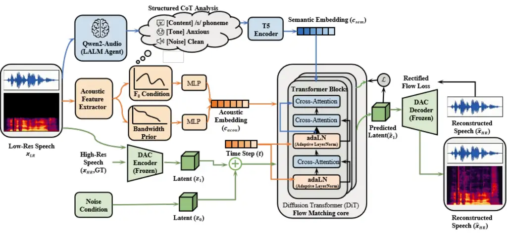
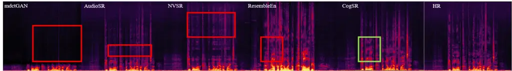

# CogSR: Semantic-Aware Speech Super-Resolution via Chain-of-Thought Guided Flow Matching

Jiajun Yuan¹, Xiaochen Wang¹, Yuhang Xiao¹, Yulin Wu², Chenhao Hu³ and
Xueyang Lv³ Affiliation: ¹National Engineering Research Center for
Multimedia Software, School of Computer Science, Wuhan University,
Wuhan, China Affiliation: ²School of Artificial Intelligence, Jianghan
University, Wuhan, China Affiliation: ³Xiaomi Corporation, Beijing,
China Affiliation: E-mails: yjj2002@whu.edu.cn

###### Abstract

Applying speech super-resolution (SR) to recordings with severely low
sampling rates is a critical challenge in digital archiving and
investigative audio recovery. In these scenarios, the input lacks
essential acoustic cues. Consequently, existing generative models often
fail; without sufficient context, they hallucinate phonetic content,
guessing words based on probability rather than meaning. To address
this, we propose CogSR, a framework designed specifically for
high-precision, offline restoration. Our approach shifts the focus from
simple signal mapping to cognitive reconstruction. By integrating a
Large Audio-Language Model, we employ Chain-of-Thought reasoning to act
as a semantic anchor, while explicit acoustic priors ensure the
speaker’s identity remains consistent. This guides a Rectified Flow
backbone to synthesize high-frequency details that are not only
realistic but linguistically accurate. Evaluations show that CogSR
effectively eliminates ambiguity in severe degradation regimes, making
it a robust solution for restoring high-value legacy and surveillance
audio.

###### Index Terms: 

Speech Super-Resolution, Chain-of-Thought, Flow Matching, Semantic
Consistency, Acoustic Priors

## I Introduction

Speech super-resolution (SR) aims to recover high-fidelity audio from
low-resolution recordings, thereby bridging the gap between legacy media
and modern listening standards. By doing so, it plays an indispensable
role in a wide range of applications, including digital archiving,
digital media restoration, and audio post-production. In particular,
restoring historical archives and legacy media is of paramount
importance; these recordings often hold irreplaceable cultural and
personal value but are often plagued by severe quality degradation \[1,
2\].



Fig. 1: Visual comparison of different speech restoration paradigms
under severe degradation.

Historically, speech super-resolution was predominantly treated as a
deterministic regression task, where deep neural networks were trained
to minimize reconstruction errors such as Mean Squared Error (MSE).
Though these methods excel at recovering the spectral envelope, they
inevitably produce over-smoothed, muffled textures—and crucially, fail
to reconstruct the fine-grained high-frequency details that are
essential for perceptual realism \[3\]. To address this shortcoming, the
field has since shifted toward a new paradigm: generative modeling.
Methods leveraging Generative Adversarial Networks (GANs), and more
recently those based on Diffusion Probabilistic Models (DPMs), have
shown great promise here. Unlike point-wise estimation, these generative
frameworks model the data distribution directly, enabling them to
synthesize rich, realistic spectral details that significantly elevate
the perceptual quality of restored speech \[4\].

However, a fundamental limitation arises when these generative systems
are applied to low sampling rate scenarios. In such regimes, critical
cues required for phoneme distinction are entirely lost. Existing
models, which typically rely on low-level features or simple text
prompts, lack the capacity to infer missing semantic content accurately.
Consequently, they act as blind guessers, hallucinating
plausible-sounding but semantically incorrect high-frequency content
based on statistical priors. As illustrated in Fig. 1, this leads to
phonetic hallucinations and prosodic inconsistencies, which are
unacceptable for content-sensitive applications.

To address this challenge, we propose that robust speech restoration
must shift from traditional signal mapping to cognitive
reconstruction—meaning the restoration process must be centered on a
deep semantic understanding of the spoken content. Guided by recent
advances in Large Audio-Language Models, we further introduce a
mechanism where the model explicitly reasons about the underlying
attributes of the speech signal before generating output, and this
thought directly informs the design of the framework proposed in this
paper.

Building on this, we present CogSR, a semantically aware speech
super-resolution framework via latent flow matching, whose core
innovation lies in its Chain-of-Thought (CoT) guidance mechanism. Unlike
conventional static captions, we employ Qwen2-Audio \[5\] as a cognitive
agent, which decomposes the input into three structured dimensions
(linguistic content, paralinguistic emotion, and environmental context)
following a structured cognitive protocol. These analytical results are
then encoded by T5-base to serve as robust semantic anchors, effectively
bridging the gap between high-level semantic understanding and low-level
signal generation, and fundamentally preventing the model from
hallucinating incorrect phonemes. Meanwhile, to ensure the synthesized
high frequencies align with the speaker’s original voice, we
additionally incorporate parametric fundamental frequency and bandwidth
constraints.

Technically, CogSR is built on a Diffusion Transformer backbone, trained
using a Rectified Flow objective \[6\]. This formulation enables the
construction of straight-line probability paths, significantly enhancing
training stability and generation quality. By deeply integrating
cognitive reasoning with generative flow matching, our system ultimately
achieves synergistic optimization of semantic accuracy and signal
fidelity, effectively resolving the core challenges previously faced by
speech super-resolution methods.

The main contributions of this paper are summarized as follows:

- •
  Chain-of-Thought Semantic Guidance: We propose a novel conditioning
  mechanism where a Large Audio-Language Model acts as a reasoning agent
  to analyze deep semantics and speech properties. This structured
  analysis acts as a semantic anchor, effectively mitigating linguistic
  hallucinations in low sampling rate scenarios.
- •
  Speech-Specific Priors: We introduce an explicit guidance module that
  conditions the generative process on fundamental frequency ($`F_{0}`$)
  and bandwidth priors. This design enforces constraints specific to
  human vocal production, ensuring the preservation of speaker identity
  and natural prosody, which are often neglected by general audio
  models.
- •
  Unified Latent Flow Framework: We present a cohesive system
  architecture that integrates cognitive reasoning with Rectified Flow
  Matching in a compressed latent space. Extensive evaluations
  demonstrate that this framework achieves state-of-the-art performance
  in terms of speech intelligibility and perceptual quality compared to
  existing baselines.

## II Related Work

### II-A Speech Super-Resolution and Restoration

Speech super-resolution (SR) has evolved from signal processing-based
estimation to deep learning-driven restoration. Early neural-based
methods, for instance, framed SR as a regression task: they optimized
$`L_{1}`$ or MSE losses to map low-resolution (LR) spectral features to
their high-resolution (HR) counterparts \[7, 3\]. While these
discriminative models excel at recovering the spectral envelope, they
tend to produce overly smoothed speech textures—ultimately leading to
muffled perceptual quality \[2\].

To boost the realism of synthesized speech, researchers turned to
generative models, starting with Generative Adversarial Networks (GANs).
Approaches like mdctGAN \[8\] and HiFISR \[9\], for example, use
adversarial training to reconstruct fine-grained spectral details.
Separately, another line of work focused on neural vocoder-based
methods: models such as NVSR \[10\] and VoiceFixer \[2\] leverage
pre-trained vocoders to resynthesize high-fidelity waveforms from
predicted mel-spectrograms. Yet for all their improvements in signal
fidelity, these generative models share a critical limitation: In low
sampling rate scenarios where key phonemic cues are missing, they lack
the high-level semantic guidance needed to resolve ambiguous phonemes,
often resulting in linguistic hallucinations and incorrect lexical
content \[11\].

### II-B Flow Matching for Generative Speech Modeling

Diffusion Probabilistic Models (DPMs) have shown remarkable capabilities
in speech synthesis and enhancement, but a key barrier to their
practical deployment is the high computational cost of iterative
sampling. Flow Matching (FM) \[6\] and Rectified Flow \[12\] has emerged
as a more efficient alternative, which models deterministic
straight-line trajectories between noise and data distributions. This
paradigm enables high-fidelity speech generation with far fewer sampling
steps.

In the speech domain, Flow Matching has been successfully applied to
text-to-speech synthesis, including VoiceFlow \[13\], Matcha-TTS \[14\]
and speech enhancement \[15\]. These works demonstrate FM’s ability to
effectively capture the complex conditional distributions of speech
signals, such as prosody and timbre. However, applying Flow Matching to
restoration tasks especially under severe degradation, where semantic
guidance remains an under-explored area. Unlike TTS models that generate
speech from scratch, restoration models must strike a balance between
fidelity to the original signal and hallucination-free reconstruction of
missing high-frequency content: a challenge standard flow matching
frameworks fail to explicitly address. Although CogSR leverages a Large
Audio-Language Model (LALM) for Chain-of-Thought cues, this reasoning is
executed offline and cached per utterance, so the online restoration
path remains dominated by the lightweight 32-step Rectified Flow
sampler. Consequently, our design preserves the sampling-efficiency
advantages of flow matching while retaining the semantic fidelity
delivered by LALM guidance.



Fig. 2: Overview of the proposed CogSR architecture.

### II-C Large Audio-Language Models for Speech Reasoning

The convergence of Large Language Models (LLMs) and audio processing has
led to the development of Large Audio-Language Models (LALMs) capable of
interpreting and reasoning about spoken content. Prominent
architectures, such as Qwen-Audio \[16\] and Qwen2-Audio \[5\], process
audio inputs to address diverse comprehension tasks.

Recent research has further extended Chain-of-Thought (CoT) reasoning to
the audio domain. Frameworks like CoT-ST \[17\] and Thinking-with-Sound
\[18\] employ LALMs to generate intermediate reasoning steps, analyzing
paralinguistic cues—including emotion, gender, and acoustic
environment—prior to determining the final output. In these settings,
the LALM functions as a cognitive agent that decomposes complex speech
signals into structured semantic attributes. However, the use of such
reasoning chains to guide low-level generative processes remains
underexplored. While studies such as SCOUT \[19\] utilize CoT primarily
for comprehension or high-level reasoning, the potential of CoT to serve
as a semantic anchor for mitigating hallucinations in signal restoration
tasks has yet to be fully investigated.

## III Methodology

In this section, we present the proposed CogSR framework. The overall
architecture, depicted in Fig. 2, operates within the compressed latent
space of a pre-trained neural audio codec to reduce computational
complexity while capturing high-level acoustic structures. CogSR is
built upon a Diffusion Transformer (DiT) backbone trained with a
Rectified Flow objective. To address the ill-posed nature of bandwidth
extension, particularly in low sampling rate scenarios, we introduce a
dual-stream guidance mechanism: (1) Cognitive Semantic Anchoring via
structured Chain-of-Thought (CoT) reasoning from a Large Audio-Language
Model (LALM), and (2) Multi-Factor Acoustic Guidance utilizing explicit
bandwidth and pitch priors to enforce physical constraints.

### III-A Preliminary: Latent Rectified Flow Matching

Generative models for speech restoration aim to learn a mapping from a
simple prior distribution to the complex data distribution of
high-fidelity speech. While Denoising Diffusion Probabilistic Models
(DDPMs) have achieved promising results, they are often bottlenecked by
the need for expensive iterative sampling. Flow Matching (FM) \[6\]
overcomes this limitation with a more general and efficient framework,
regressing a velocity field $`v_{t}(x)`$ that transports a probability
density path from a source $`p_{0}`$ to a target $`p_{1}`$.

Specifically, we employ Rectified Flow (RF) \[12\], a streamlined
instance of FM that enforces straight-line trajectories to facilitate
fast and stable sampling. Our implementation operates within the latent
space of a frozen Descript Audio Codec (DAC) \[20\]. By leveraging DAC’s
highly compressed yet perceptually lossless representation, we avoid the
phase reconstruction challenges and high dimensionality inherent in
traditional spectrogram-based approaches. This design shifts the
modeling focus toward semantic and acoustic structure rather than
low-level waveform details, thereby enhancing both training efficiency
and generation fidelity.

Formally, let $`x_{1}`$ denote the high-resolution speech latent
extracted by the DAC encoder, and $`x_{0}\sim\mathcal{N}(0,I)`$ the
source noise. We define a linear interpolation path
$`x_{t}=tx_{1}+(1-t)x_{0}`$, implying a constant target velocity field
$`u_{t}=x_{1}-x_{0}`$. Accordingly, the DiT backbone
$`v_{\theta}(x_{t},t,c)`$ is trained to predict this velocity by
minimizing the mean squared error:

```math
\mathcal{L}_{RF}(\theta)=\mathbb{E}_{t,x_{0},x_{1}}\left[\|v_{\theta}(x_{t},t,c)-(x_{1}-x_{0})\|^{2}\right] \tag{1}
```

where $`t\sim\mathcal{U}(0,1)`$. Such a formulation simplifies the
optimization landscape, enabling high-quality generation with fewer
steps using standard ODE solvers.

To ensure the model captures the specific restoration task without bias
from unrelated domains, we train the DiT backbone from scratch. To
preserve the robust representational capabilities of the pre-trained
components, we freeze the DAC encoder/decoder, T5 text encoder, and
Qwen2-Audio reasoning agent throughout training. Optimization is thus
restricted to the DiT parameters and lightweight projection layers,
effectively guiding the mapping from degraded latents to high-fidelity
speech while anchoring on the frozen semantic and acoustic guidance.

### III-B Cognitive Semantic Anchoring via CoT

A critical vulnerability of existing generative SR models in low
sampling rate regimes is linguistic hallucination, the generation of
intelligible but incorrect phonemes when acoustic cues are ambiguous. To
mitigate this, we introduce Cognitive Semantic Anchoring, leveraging the
reasoning capabilities of LALMs to ensure semantic consistency.

We employ Qwen2-Audio \[5\] as a cognitive reasoner.It is worth noting
that essential linguistic semantics are predominantly preserved in the
low-frequency band (e.g., $`<1`$ kHz). Furthermore, Qwen2-Audio exhibits
remarkable robustness to such bandwidth limitations, enabling accurate
content inference even from severely degraded signals. Unlike SAGA-SR
\[21\], which conditions on static captions, CogSR obtains proactive CoT
rationales that justify the perceived timbre, affect, and noise context
before generation. To obtain these richer cues, rather than generating a
simple caption we instruct the model to perform a structured
Chain-of-Thought (CoT) analysis that explicitly decomposes the input
audio into distinct semantic dimensions:

1.  1.  Paralinguistic Inference: Analyzing speaker attributes such as
        gender, emotion and environmental context like background noise
        type, crucial for reconstructing appropriate timbre and ambience.
2.  2.  Linguistic Content: Transcribing the spoken content to provide
        strong phonetic constraints.
3.  3.  Perceived Quality Assessment: Providing a high-level description of
        the overall audio clarity and perceived degradation types such as
        ”muffled speech,” ”noisy background”, acting as a global style
        indicator.

To instantiate this, we employ a specific prompt template that forces
the model to output these attributes sequentially. A typical CoT output
$`T_{CoT}`$ fed into the text encoder looks like: “\[Gender\]: Male;
\[Emotion\]: Anxious; \[Noise\]: Street traffic; \[Content\]: Help is on
the way; \[Quality\]: Low bandwidth, muffled.” This structured format
ensures that the semantic embedding $`c_{sem}`$ captures orthogonal
acoustic dimensions explicitly.

The resulting structured description $`T_{CoT}`$ is encoded by a frozen
T5 encoder into semantic embeddings $`c_{sem}`$. These embeddings are
injected into the DiT via cross-attention layers, acting as semantic
anchors that constrain the generative process to align with the
linguistic and paralinguistic context of the input, effectively
suppressing hallucinations.



Fig. 3: Comparison of restoration paradigms under severe degradation.

### III-C Multi-Factor Acoustic Guidance

Although semantic guidance maintains content consistency, it lacks the
precision required for spectral reconstruction, particularly regarding
speaker identity and prosody. To address this, we introduce a
Multi-Factor Acoustic Guidance module rooted in explicit physical
priors.

We specifically model the effective signal bandwidth to define the
cutoff frequency of the low-resolution input. By projecting this scalar
into a high-dimensional embedding $`c_{bw}`$ via Fourier feature
mapping, we provide a robust cue that prevents passband artifacts and
preserves spectral continuity.

Furthermore, to mitigate metallic artifacts caused by harmonic
misalignment, we incorporate prosodic features. Distributional $`F_{0}`$
characteristics are extracted via a robust pitch tracker (e.g.,
Parselmouth \[22\]) and encoded into continuous embeddings
$`c_{pitch}`$. These features impose structural constraints, aligning
generated harmonics with the speaker’s fundamental frequency.

These conditioning signals are integrated into the DiT architecture
according to their distinct modalities. While the sequence-level
semantic embedding $`c_{sem}`$ is injected via cross-attention, the
acoustic priors ($`c_{bw}`$ and $`c_{pitch}`$) employ a dual-path
mechanism. They are first projected into global embeddings and added to
the time-step embedding to modulate the global trajectory;
simultaneously, they are mapped to tokens and concatenated with
$`c_{sem}`$ for cross-attention. This strategy enforces parametric
adherence to bandwidth and identity constraints without suppressing
local variations, ensuring the generated speech is both semantically
accurate and acoustically authentic.

## IV Experimental Setup

### IV-A Datasets and Data Preparation

We trained CogSR on a combination of high-quality speech datasets: VCTK
\[23\] and HiFi-TTS \[24\]. All audio data was resampled and unified at
44.1 kHz, totaling approximately 244 hours. The corpus was partitioned
into training ($`90\%`$), validation ($`5\%`$), and testing ($`5\%`$)
splits, ensuring speaker independence across subsets.

During training, we employed dynamic data augmentation to simulate
real-world degradations. High-resolution (HR) audio was low-pass
filtered with random cutoff frequencies sampled uniformly from
$`[2\text{ kHz},16\text{ kHz}]`$ to simulate varying bandwidth
limitations. Subsequently, to ensure robustness, the audio was corrupted
by additive real-world environmental noise—rather than synthetic
Gaussian noise—with signal-to-noise ratios (SNR) sampled randomly
between $`5\text{ dB}`$ and $`15\text{ dB}`$.

For standardized evaluation, we defined a challenging benchmark
featuring a fixed 4 kHz sampling rate combined with 5 dB SNR noise.

### IV-B Implementation Details

CogSR leverages the compressed latent space of the pre-trained DAC
(44.1kHz, 8kbps) \[20\], with both the encoder and decoder kept frozen
throughout experiments. During both training and inference, the
Qwen2-Audio agent processes low-resolution (LR) inputs. This design
compels the model to infer semantics directly from degraded signals,
thereby bolstering robustness in real-world scenarios where
high-resolution ground truth is unavailable.

Training used a global batch size of 128 on an NVIDIA A100. We optimized
the RF objective using AdamW. For inference, we use the Euler ODE solver
with 32 steps.

### IV-C Baselines and Metrics

We compare CogSR against a diverse set of state-of-the-art baselines
representing different generative paradigms. For GAN-based approaches,
we include mdctGAN \[8\], which operates on MDCT spectra, and NVSR
\[10\], which leverages a pre-trained neural vocoder for high-fidelity
resynthesis. In the diffusion domain, we compare with AudioSR \[1\], a
latent diffusion model designed for universal audio super-resolution. We
also include Resemble Enhance \[25\] as a representative flow
matching-based speech enhancement model. Additionally, we report the
performance of direct DAC Reconstruction \[20\] to serve as the
theoretical upper bound for our latent-based framework.

Performance is assessed using a multi-dimensional metric suite focusing
on semantic, spectral, and speaker fidelity. Word Error Rate (WER) is
computed using the Whisper-large-v3 model \[26\] on noisy test
utterances (5 dB SNR) to evaluate semantic intelligibility and
robustness against hallucinations. Log-Spectral Distance (LSD) measures
the physical spectral accuracy between the restored and ground truth
signals, defined as:

```math
\text{LSD}=\frac{1}{T}\sum_{t=1}^{T}\sqrt{\frac{1}{F}\sum_{f=1}^{F}\left(\log_{10}\frac{S(t,f)^{2}}{\bar{S}(t,f)^{2}}\right)^{2}} \tag{2}
```

where $`S`$ and $`\bar{S}`$ denote the amplitude spectra of the ground
truth and generated speech, and $`T,F`$ represent time frames and
frequency bins. Finally, Speaker Similarity (SIM) is calculated as the
cosine similarity between embeddings extracted by WavLM-SV \[27\],
quantifying the preservation of the original speaker’s timbre and
prosody.

## V Results and Analysis

### V-A Quantitative Comparison

Table I summarizes the quantitative performance on the VCTK test set
across 4 kHz and 2 kHz sampling rates. Note that WER is assessed under
noisy conditions (5 dB SNR) to gauge robustness, whereas LSD and SIM are
calculated in clean environments to evaluate restoration fidelity.

Word Error Rate. Regarding intelligibility, CogSR achieves a WER of
4.20% given 4 kHz inputs, surpassing baselines such as AudioSR (12.15%)
and NVSR (13.56%) by a substantial margin while approaching the DAC
topline (3.07%). This robustness persists even in the extreme 2 kHz
scenario: CogSR maintains a viable WER of 23.12%, whereas the
performance of baseline models collapses.

Log-Spectral Distance. In terms of spectral reconstruction, CogSR
records an LSD of 0.91 (4 kHz). This result is competitive with leading
systems and demonstrates significantly closer alignment to the topline
(0.45) compared to alternative generative approaches.

Speaker Similarity. Driven by explicit $`F_{0}`$ and bandwidth priors,
CogSR attains the highest speaker similarity (0.99) in the 4 kHz
condition. This effectively matches the topline (1.00) and exceeds
standard denoising or enhancement baselines, underscoring the capacity
of structured acoustic guidance to preserve original timbre and prosody
where unconstrained methods fail.

In our experiments, we observed that our system generates approximately
1 second of audio per 1.0 second of processing time on a single NVIDIA
A40, making it highly cost-effective for quality restoration. The total
memory footprint during inference is approximately 24GB, with the frozen
LALM occupying 20GB.

|                         |                           |                      |                    |                           |                      |                    |                            |
| ----------------------- | ------------------------- | -------------------- | ------------------ | ------------------------- | -------------------- | ------------------ | -------------------------- |
|                         | 2 kHz input sampling rate |                      |                    | 4 kHz input sampling rate |                      |                    | Parameters                 |
| Method                  | WER ($`\downarrow`$)      | LSD ($`\downarrow`$) | SIM ($`\uparrow`$) | WER ($`\downarrow`$)      | LSD ($`\downarrow`$) | SIM ($`\uparrow`$) |                            |
| DAC Rec                 | 3.07%                     | 0.63                 | 0.88               | 3.07%                     | 0.45                 | 1.00               | \-                         |
| Qwen2-Audio \[5\]       | 1.00%                     | \-                   | \-                 | 1.00%                     | \-                   | \-                 | 7B                         |
| mdctGAN \[8\]           | 43.34%                    | 1.70                 | 0.47               | 37.5%                     | 0.92                 | 0.74               | 101.0M                     |
| NVSR \[10\]             | 59.53%                    | 1.04                 | 0.68               | 13.56%                    | 0.91                 | 0.80               | 99.0M                      |
| AudioSR(Speech) \[1\]   | 35.69%                    | 1.05                 | 0.61               | 12.15%                    | 1.26                 | 0.82               |  400M                      |
| Resemble Enhance \[25\] | 31.91%                    | 1.21                 | 0.74               | 4.85%                     | 0.95                 | 0.97               | \-                         |
| CogSR (Ours)            | 23.12%                    | 1.01                 | 0.87               | 4.20%                     | 0.91                 | 0.99               | 7.3B^(\*) (145M Trainable) |

^(\*)Most parameters are from the frozen Qwen2-Audio and T5 models.

TABLE I: Objective evaluation on VCTK test set at 2 kHz and 4 kHz input
sampling rates. WER is measured under 5 dB SNR noise.

### V-B Subjective Evaluation

To assess perceptual fidelity in the 4 kHz-to-44.1 kHz bandwidth
extension task, we conducted a Mean Opinion Score (MOS) study evaluating
Overall Quality (MOS-Q) and Intelligibility (MOS-I) on a 5-point scale.
As detailed in Table II, CogSR outperforms all competing methods.
Significantly, it achieves parity with the hidden Ground Truth in
intelligibility (4.60) and closely rivals the reference in overall
quality (4.20 vs. 4.25). These results validate the critical role of
semantic guidance in synthesizing speech that is both accurate and
perceptually natural.

|                         |                                   |                                   |
| ----------------------- | --------------------------------- | --------------------------------- |
| Method                  | MOS-Q (CI) $`\uparrow`$           | MOS-I (CI) $`\uparrow`$           |
| AudioSR \[1\]           | $`3.75\pm 0.06`$                  | $`4.30\pm 0.06`$                  |
| NVSR \[10\]             | $`4.00\pm 0.06`$                  | $`4.50\pm 0.06`$                  |
| Resemble Enhance \[25\] | $`4.05\pm 0.07`$                  | $`4.50\pm 0.07`$                  |
| CogSR (Ours)            | $`\textbf{4.20}\pm\textbf{0.06}`$ | $`\textbf{4.60}\pm\textbf{0.06}`$ |
| Ground Truth            | $`4.25\pm 0.06`$                  | $`4.60\pm 0.06`$                  |

TABLE II: MOS test results for speech super-resolution (4 kHz $`\to`$
44.1 kHz).

### V-C Qualitative Analysis

We provide a visual comparison of spectrograms in Fig. 3. The 4 kHz
sampling rate input, resampled to 44.1 kHz, lacks all high-frequency
content. The GAN-based mdctGAN produces an over-smoothed spectrum,
missing fine-grained textures. The blind generative model Resemble
Enhance hallucinates incorrect formants (highlighted in red box),
changing the phoneme. In contrast, our CogSR, guided by semantic CoT,
accurately reconstructs the high-frequency fricative structure (green
box) consistent with the ground truth, while maintaining a natural
harmonic structure thanks to acoustic priors.

### V-D Ablation Study

We conducted an ablation study on the 4 kHz sampling rate test set
(Table III).

1.  1.  w/o CoT: Replacing the structured CoT with ordinary text or complete
        omission. This confirms that explicit, structured semantic reasoning
        is crucial for accurate phoneme restoration when acoustic cues are
        ambiguous.
2.  2.  w/o Acoustic Priors: Removing explicit $`F_{0}`$ and bandwidth
        embeddings results in a strong degradation in Speaker Similarity and
        slightly worse spectral fidelity . This indicates that while
        semantic guidance fixes content, acoustic priors are essential for
        preserving speaker identity and stable harmonics.

|                              |                    |                    |                  |
| ---------------------------- | ------------------ | ------------------ | ---------------- |
| Variant                      | WER $`\downarrow`$ | LSD $`\downarrow`$ | SIM $`\uparrow`$ |
| CogSR (Full)                 | 4.20%              | 0.91               | 0.99             |
|    w/o CoT                   | 15.1%              | 1.04               | 0.87             |
|    w/o CoT (Transcript Only) | 5.10%              | 0.94               | 0.92             |
|    w/o Acoustic Priors       | 8.5%               | 0.95               | 0.74             |

TABLE III: Ablation study for 4 kHz sampling rate speech SR.

## VI Conclusion

We present CogSR, a generative framework that synergizes the stability
of Flow Matching with the cognitive capabilities of Large Audio-Language
Models. By utilizing structured Chain-of-Thought reasoning as a semantic
anchor alongside explicit multi-factor acoustic priors, our approach
effectively bridges the gap between high-level understanding and
low-level signal reconstruction. This design proves critical for
restoring speech in severely bandwidth-limited environments, where
traditional methods typically fail. Extensive experiments confirm that
CogSR establishes a new state-of-the-art in both objective metrics and
subjective perceptual fidelity.

## References

- \[1\] H. Liu, K. Chen, Q. Tian, W. Wang, and M. D. Plumbley (2023)
  AudioSR: versatile audio super-resolution at scale. In Proc. ICASSP,
  Cited by: §I, §IV-C, TABLE I, TABLE II.
- \[2\] H. Liu, Q. Kong, Q. Tian, Y. Zhao, D. Wang, C. Huang, and Y.
  Wang (2022) VoiceFixer: a unified framework for high-fidelity speech
  restoration. In Proc. Interspeech, Cited by: §I, §II-A, §II-A.
- \[3\] Y. Wang, Z. Zhao, W. Liu, and J. Kuang (2015) Speech bandwidth
  extension based on deep neural networks. In Proc. Interspeech, Cited
  by: §I, §II-A.
- \[4\] Z. Evans, J. Parker, C. Carr, Z. Zukowski, J. Taylor, and J.
  Pons (2024) Stable Audio: fast timing-conditioned latent audio
  diffusion. arXiv preprint arXiv:2402.04825. Cited by: §I.
- \[5\] Y. Chu et al. (2024) Qwen2-audio technical report. arXiv
  preprint arXiv:2407.10759. Cited by: §I, §II-C, §III-B, TABLE I.
- \[6\] Y. Lipman, R. T. Chen, H. Ben-Hamu, M. Patterson, and A.
  Panchenko (2023) Flow matching for generative modeling. ICLR. Cited
  by: §I, §II-B, §III-A.
- \[7\] K. Li and C. Lee (2015) DNN-based speech bandwidth extension
  using excitation signal. In Proc. ICASSP, Cited by: §II-A.
- \[8\] C. Shuai, C. Shi, L. Gan, and H. Liu (2023) mdctGAN: taming
  transformer-based gan for speech super-resolution with modified DCT
  spectra. In Proc. Interspeech, Cited by: §II-A, §IV-C, TABLE I.
- \[9\] S. Zhao, K. Zhou, Z. Pan, Y. Ma, C. Zhang, and B. Ma (2025)
  HiFi-SR: a unified generative transformer-convolutional adversarial
  network for high-fidelity speech super-resolution. arXiv preprint
  arXiv:2501.10045. Cited by: §II-A.
- \[10\] H. Liu and W. Choi (2023) Neural vocoder is all you need for
  speech super-resolution. In Proc. ICASSP, Cited by: §II-A, §IV-C,
  TABLE I, TABLE II.
- \[11\] M. Atwany et al. (2025) Hallucination benchmark for speech
  foundation models. arXiv preprint arXiv:2510.16567. Cited by: §II-A.
- \[12\] X. Liu, C. Gong, and Q. Liu (2023) Flow Straight and Fast:
  learning to generate and transfer data with rectified flow. ICLR.
  Cited by: §II-B, §III-A.
- \[13\] Y. Guo, Y. Zhang, and L. Xie (2024) VoiceFlow: efficient
  text-to-speech with rectified flow matching. In Proc. ICASSP, Cited
  by: §II-B.
- \[14\] S. Mehta, R. Tu, J. Beskow, É. Székely, and G. E. Henter (2024)
  Matcha-TTS: a fast tts architecture with conditional flow matching. In
  Proc. ICASSP, Cited by: §II-B.
- \[15\] Y. Wang et al. (2025) FlowSE: efficient and high-quality speech
  enhancement via flow matching. In Proc. Interspeech, Cited by: §II-B.
- \[16\] Y. Chu, J. Jin, W. Dai, D. Qian, X. Qian, S. Zheng, H. Guo, R.
  Zhou, X. Wu, L. He, et al. (2023) Qwen-Audio: advancing universal
  audio understanding via unified large-scale audio-language models.
  arXiv preprint arXiv:2311.07919. Cited by: §II-C.
- \[17\] Y. Du, Z. Ma, Y. Yang, K. Deng, X. Chen, B. Yang, Y. Xiang, M.
  Liu, and B. Qin (2024) CoT-ST: enhancing LLM-based speech translation
  with multimodal chain-of-thought. External Links: 2409.19510,
  [Link](https://arxiv.org/abs/2409.19510) Cited by: §II-C.
- \[18\] Z. Xiong, Y. Cai, Z. Li, J. Yuan, and Y. Wang (2025) Thinking
  with Sound: audio chain-of-thought enables multimodal reasoning in
  large audio-language models. arXiv preprint arXiv:2509.21749. Cited
  by: §II-C.
- \[19\] G. Li, W. Jiang, M. Chen, Y. Li, H. Yu, S. Dong, T. Ren, M.
  Tang, and C. Yuan (2025) SCOUT: teaching pre-trained language models
  to enhance reasoning via flow chain-of-thought. External Links:
  2505.24181, [Link](https://arxiv.org/abs/2505.24181) Cited by: §II-C.
- \[20\] R. Kumar, P. Seetharaman, A. Luebs, I. Tan, and K. Kumar (2024)
  High-fidelity audio compression with improved RVQGAN. In Proc.
  NeurIPS, Cited by: §III-A, §IV-B, §IV-C.
- \[21\] J. Im and J. Nam (2025) SAGA-SR: semantically and acoustically
  guided audio super-resolution. arXiv preprint arXiv:2509.24924. Cited
  by: §III-B.
- \[22\] Y. Jadoul, B. Thompson, and B. de Boer (2018) Parselmouth, a
  Python interface to Praat. Journal of Phonetics 71. Cited by: §III-C.
- \[23\] J. Yamagishi, C. Veaux, and K. MacDonald (2019) CSTR VCTK
  corpus: English multi-speaker corpus for CSTR voice cloning toolkit
  (version 0.92). University of Edinburgh. The Centre for Speech
  Technology Research (CSTR). Cited by: §IV-A.
- \[24\] E. Bakhturina, V. Lavrukhin, B. Ginsburg, and Y. Zhang (2021)
  HiFi-TTS: a multispeaker English dataset. arXiv preprint
  arXiv:2104.01497. Cited by: §IV-A.
- \[25\] Resemble AI (2024) Resemble enhance. Note: GitHub repository
  External Links:
  [Link](https://github.com/resemble-ai/resemble-enhance) Cited by:
  §IV-C, TABLE I, TABLE II.
- \[26\] A. Radford, J. W. Kim, T. Xu, G. Brockman, C. McLeavey, and I.
  Sutskever (2023) Robust speech recognition via large-scale weak
  supervision. In Proc. ICML, Cited by: §IV-C.
- \[27\] S. Chen, C. Wang, Z. Chen, Y. Wu, S. Liu, Z. Chen, J. Li, N.
  Kanda, T. Yoshioka, X. Xiao, et al. (2022) WavLM: large-scale
  self-supervised pre-training for full stack speech processing. In
  Proc. ICASSP, Cited by: §IV-C.
