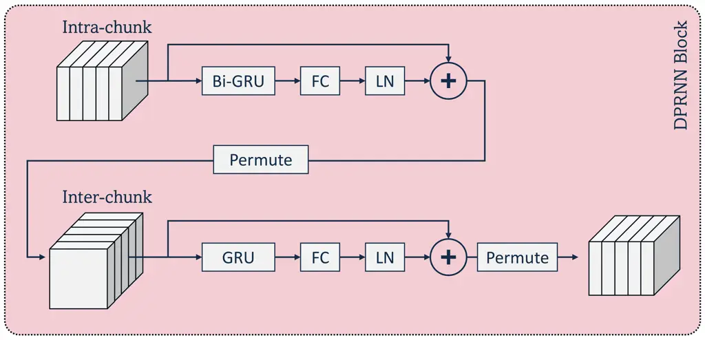
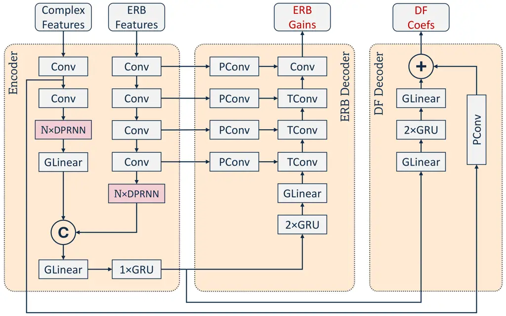
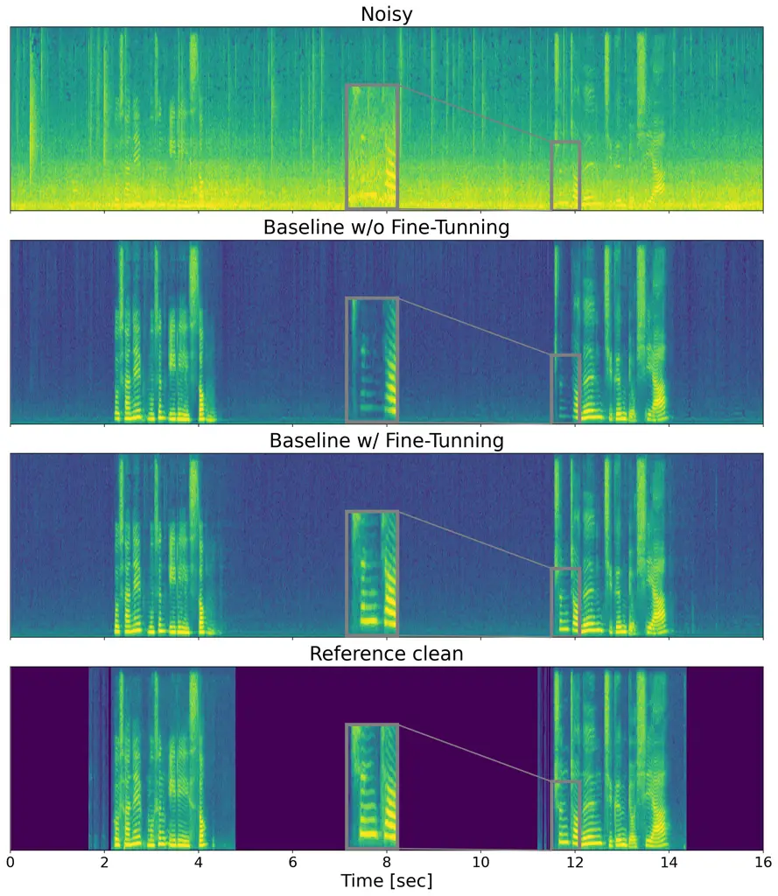
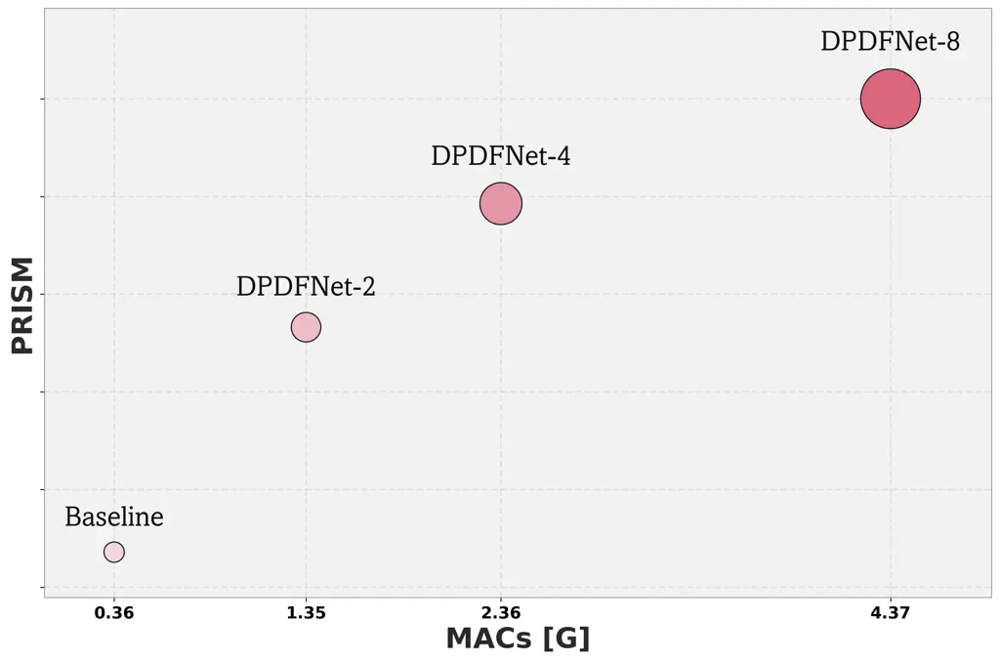
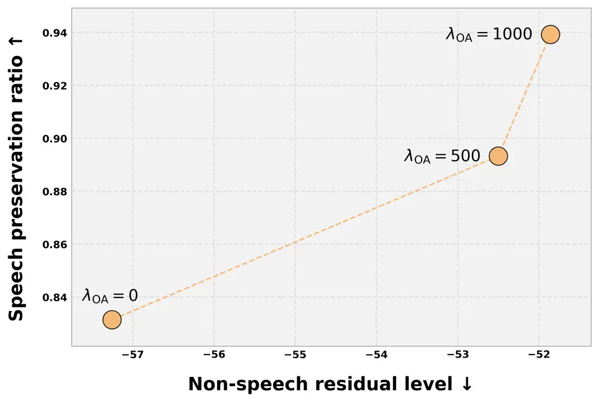
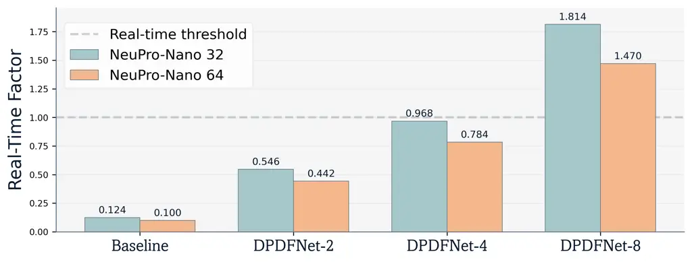

# DPDFNet: Boosting DeepFilterNet2 via Dual-Path RNN

Journal: Speech Communication

Daniel Rika Email: <Daniel.Rika@ceva-ip.com> Address: Ceva Technologies,
Ltd, 7 Hapnina Street, Ra’anana 4321545, Israel Corresponding
author: Corresponding author. Note: D. Rika and N. Sapir contributed
equally to this work.    Nino Sapir Email: <Nino.Sapir@ceva-ip.com>
Address: Ceva Technologies, Ltd, 7 Hapnina Street, Ra’anana 4321545,
Israel Note: D. Rika and N. Sapir contributed equally to this work.   
Ido Gus Email: <Ido.Gus@ceva-ip.com> Address: Ceva Technologies, Ltd, 7
Hapnina Street, Ra’anana 4321545, Israel

###### Abstract

We present DPDFNet, a causal single-channel speech enhancement model
that extends DeepFilterNet2 architecture with dual-path blocks in the
encoder, strengthening long-range temporal and cross-band modeling while
preserving the original enhancement framework. In addition, we
demonstrate that adding a loss component to mitigate over-attenuation in
the enhanced speech, combined with a fine-tuning phase tailored for
“always-on” applications, leads to substantial improvements in overall
model performance. We evaluate DPDFNet on the standard VoiceBank+DEMAND
and DNS4 blind test benchmarks, where it shows consistent gains over
DeepFilterNet2 and strong overall performance against other causal
open-source models. In addition, we introduce a supplementary
multilingual low-SNR evaluation set comprising long recordings in 12
languages across everyday noise scenarios, on which DPDFNet delivers
superior performance to other causal open-source models, including some
that are substantially larger and more computationally demanding. We
also propose an holistic metric named PRISM, a composite,
scale-normalized aggregate of intrusive and non-intrusive metrics, which
demonstrates clear scalability with the number of dual-path blocks. We
further demonstrate on-device feasibility by deploying DPDFNet on
Ceva-NeuPro™-Nano edge NPUs. Results indicate that DPDFNet-4, our
second-largest model, achieves real-time performance on NPN32 and runs
even faster on NPN64, confirming that state-of-the-art quality can be
sustained within strict embedded power and latency constraints.

###### Keywords: 

Speech enhancement, Noise reduction, Dual-Path RNN, Real-time systems,
Embedded systems

## 1 Introduction

Single-channel speech enhancement (SE) aims to recover clear, natural
speech from a noisy recording when only one microphone is available, a
common setting in telephony, conferencing, mobile devices, and assistive
products. Unlike multi-microphone arrays, the single-channel case has no
spatial cues from additional microphones and must rely on time and
frequency information, which makes reliable operation at low SNRs
especially hard. For interactive use, models must run _causally_ with
low delay to avoid conversational lag and audio-video drift, and they
should remain stable across changes in noise, rooms, and languages.
While large, non-causal systems can excel offline, there is a growing
need for methods that deliver high perceived quality when run in a
streaming setting.

Early real-time speech enhancement often combined traditional signal
processing with compact neural networks. Valin (Valin, 2018) proposed
RNNoise, which predicts critical-band gains from features such as
Bark-frequency cepstral coefficients and pitch correlations, then
applies a frequency-domain pitch filter. This hybrid design achieves
very low latency and embedded-class efficiency, and it outperforms
minimum mean-square spectral estimators in perceptual quality. Research
then advanced sequence modeling for streaming noise suppression.
Westhausen and Meyer (Westhausen and Zeghidour, 2020) introduced DTLN
with two cascaded cores. One core operates in the frequency-domain and
the other uses a learned time-domain representation. Both rely on LSTM
layers with instant layer normalization, enabling stable
frame-synchronous processing with fewer than one million parameters and
benefiting from both magnitude and phase cues. Braun and Tashev proposed
NSNet2 (Braun et al., 2021), a recurrent model that estimates spectral
suppression gains from log power spectral features. Its level-invariant
loss normalization and broad augmentation over SNR, spectral shape, and
signal level yield a robust real-time baseline. Another line of work
moved to the waveform domain. Defossez et al. (Défossez et al., 2020)
proposed DEMUCS, an encoder-decoder with U-Net-style skip connections
and a recurrent bottleneck that operates directly on raw audio. Training
uses a mix of waveform loss and multi-resolution spectral losses with
strong augmentation. This approach improves naturalness and
intelligibility under real-time constraints. Kong et al. proposed
CleanUNet (Kong et al., 2022) as a refinement of this design. It
strengthens the bottleneck with stacked masked self-attention and
combines waveform and spectral objectives, including a high-band loss
that improves the handling of silence and high-frequency detail.
Although relatively large, CleanUNet maintains low latency and delivers
consistent quality. Work in the time-frequency domain focused on
stronger cross-band modeling while preserving local structure. Hao et
al. (Hao et al., 2021) proposed FullSubNet, which encodes long-range
context with a full-band LSTM. The frame-wise embedding is concatenated
with local frequency neighborhoods and passed to a shared sub-band LSTM
that predicts a complex ideal ratio mask (Williamson et al., 2016)
(cIRM) with tanh compression. This design links global spectral trends
with local stationarity cues. Dual-path recurrent models were optimized
to balance efficiency and streaming performance. Le et al. (Le et al., 2021) proposed DPCRN, an encoder-decoder with causal two-dimensional
convolutions and skip connections. A dual-path module models spectral
structure within each frame and temporal dynamics across frames, under
causal constraints. Rong et al. proposed GTCRN (Rong et al., 2024) as a
direct follow-up. It uses grouped temporal convolutions and grouped
dual-path recurrent units, merges high-frequency bands through an
equivalent rectangular bandwidth (ERB) filter bank, and applies temporal
recurrent attention. The result keeps the parameter count in the tens of
thousands while remaining competitive with heavier systems. Most
recently, Pei et al. proposed aTENNuate (Pei et al., 2025), a deep state
space autoencoder for streaming enhancement on raw audio. The model
stacks causal state space blocks with skip connections and light
resampling. It targets online operation with steady latency and compact
size, and it trains with objectives in both time and frequency domains.
Overall, the field has made a substantial progress from
classical-plus-RNN hybrids to highly capable pure end-to-end deep
neural-network models, for higher intelligibility and naturalness under
challenging real-time constraints.

Although a wide array of methods developed in the recent years,
including the aforementioned ones, we based our work over _Schröter et
al._ (Schröter et al., 2022)’s DeepFilterNet2 architecture: a compact
two-stage architecture that offers a strong balance of efficiency and
quality for streaming SE. This architecture provides a favorable
trade-off between computational complexity and enhancement quality,
enabling real-time, low-latency deployment. We chose DeepFilterNet2 as
the basis of the proposed model because DPDFNet modifies that backbone
directly, preserving its streaming enhancement framework while
augmenting the encoder with causal dual-path recurrent blocks.
DeepFilterNet3 Schröter et al. (2023) is closely related and may be
viewed as a later variant within the same design line, but the
architectural intervention proposed here is most naturally described as
an extension of DeepFilterNet2. Motivated by both technical
considerations and community interest in advanced speech enhancement, we
believe that enhancing the current DeepFilterNet2 architecture will
contribute much to the field.

Accordingly, we integrate causal dual-path modules into the
DeepFilterNet2 encoder, resulting in DPDFNet. The main contribution of
this work is a principled extension of the DeepFilterNet2 framework in
which causal DPRNN blocks are introduced into its two encoder branches
to enrich the convolutional representations with broader temporal and
cross-frequency context before fusion, while preserving the original
streaming enhancement architecture. In addition, we add an
over-attenuation loss, used alongside the original multi-resolution loss
(Schröter et al., 2022), to mitigate rare cases where the model
over-suppresses the target speech, and propose a fine-tuning stage to
expose the models to longer-range dependencies. Finally, besides
evaluation on the standard VoiceBank+DEMAND and DNS4 blind test
benchmarks, we curate a supplementary evaluation set focused on low-SNR
conditions with realistic noise types (car, pub, office, etc.) and
multilingual coverage spanning 12 languages from the Speech-MASSIVE test
set (Lee et al., 2024).

The remainder of the paper is organized as follows. Section 2 defines
the single-channel denoising problem, reviews the DeepFilterNet2
architecture, introduces the causal dual-path RNN block, and describes
its integration into the proposed DPDFNet model. Section 3 details the
training framework, including the datasets, augmentation strategy,
supplementary evaluation set, and loss functions. Section 4 presents the
experimental setup and results, including the fine-tuning procedure, the
PRISM aggregate metric, OA-loss sensitivity analysis, benchmark
comparisons, architectural ablations, and deployment evaluation on
Ceva-NeuPro™-Nano. Section 5 concludes the work.



(a)



(b)

Figure 1: Overview of the proposed DPDFNet architecture. (a) single
DPRNN block; (b) DeepFilterNet2 scheme integrated with DPRNN blocks.

## 2 Methods

### 2.1 Denoising Framework

We consider a noisy speech signal modeled as

```math
x=s*r+n, \tag{1}
```

where $`s`$ denotes the clean speech signal, $`r`$ is the room impulse
response (RIR) characterizing the acoustic environment, and $`n`$
represents additive background noise. This formulation captures both the
reverberation introduced by the environment and the presence of noise.

Following the original DeepFilterNet2 framework, we apply the Short-Time
Fourier Transform (STFT) to the time-domain signal $`x`$ to obtain its
time-frequency representation $`X`$. This representation is then used to
derive two primary input features: _complex features_ and _ERB
features_.

The complex features consist of the lower $`96`$ frequency bins of
$`X`$, corresponding to frequencies up to $`4800~\text{Hz}`$. This range
is chosen because it encompasses the majority of the periodic components
of speech. We denote these features as $`X_{\mathrm{df}}`$. In the
original DeepFilterNet2, deep-filters (DF) were applied only to these
frequency bins.

To obtain the ERB features, the power spectrogram $`|X|^{2}`$ is passed
through a bank of $`32`$ ERB filters. This compresses the spectral
information in a way that approximates the human auditory system’s
perception of frequency and energy. The resulting perceptual
representation is denoted as $`X_{\mathrm{erb}}`$.

The denoising framework consists of two sequential stages: _masking_ and
_reconstruction_.

In the masking stage, the model predicts ERB gains
$`G_{\mathrm{erb}}(k,b)`$, where $`k`$ denotes the time frame and $`b`$
denotes the ERB bin index. These gains are applied to the noisy
spectrogram as follows:

```math
\displaystyle G(k,f) \displaystyle=\mathrm{inter}\!\left(G_{\mathrm{erb}}(k,b)\right), \tag{2}
```

```math
\displaystyle Y_{G}(k,f) \displaystyle=X(k,f)\cdot G(k,f),
```

where $`G(k,f)`$ is the full-band mask obtained via inverse
interpolation of the ERB filter banks (practically, using the transposed
ERB filter bank matrix), and $`Y_{G}(k,f)`$ is the masked spectrogram.

In the reconstruction stage, the model predicts complex DF coefficients
$`C(k,i,f_{\mathrm{df}})`$, which are applied to the periodic part of
the masked spectrogram up to $`4800`$ Hz:

```math
Y(k,f)=\sum_{i=0}^{N}C(k,i,f)\cdot Y_{G}(k-i+\ell,f), \tag{3}
```

where $`N`$ is the DF order, $`\ell`$ is the _look-ahead_ ($`N=5`$ and
$`\ell=2`$ in our case), and the dot product is performed in the complex
domain.

### 2.2 DeepFilterNet2 Architecture

To predict the ERB gains $`G_{\mathrm{erb}}(k,b)`$ and the DF
coefficients $`C(k,i,f_{\mathrm{df}})`$, the DeepFilterNet2 architecture
first uses an Encoder that extracts and fuses information from both ERB
features and complex features into a unified latent representation,
denoted by:

```math
\mathcal{E}=\mathcal{F}_{\mathrm{enc}}\left(X_{\mathrm{erb}},X_{\mathrm{df}}\right) \tag{4}
```

This embedding $`\mathcal{E}`$ then passes through the ERB Decoder
$`\mathcal{F}_{\mathrm{erb\_dec}}`$ and the DF Decoder
$`\mathcal{F}_{\mathrm{df\_dec}}`$ to predict the ERB gains and DF
coefficients, respectively.

More specifically, the Encoder consists of two separate branches, each
composed of several convolutional blocks. Each convolutional block
comprises a separable convolutional layer with 64 channels and a kernel
size of $`(1,3)`$ (time, frequency), followed by batch normalization and
a ReLU activation function. To combine the extracted ERB and complex
features, both feature representations are flattened, concatenated, and
subsequently processed through grouped linear (GLinear) and GRU layers.

The ERB decoder contains two GRU layers, followed by several transposed
convolutional blocks, to predict the ERB gains. Each transposed
convolutional block comprises a separable transposed convolutional
layer, batch normalization, and a ReLU activation, except for the final
block, which uses a Sigmoid activation to predict the mask. To establish
a U-Net-style architecture, convolutional blocks from the ERB encoder
branch are connected to corresponding transposed convolutional blocks in
the decoder through skip connections.

The DF decoder consists of two GRU layers, preceded by a GLinear layer
and followed by another GLinear layer. Using the output from this
structure combined with a skip connection from the encoder, the decoder
predicts the complex DF coefficients.

### 2.3 Dual-Path RNN Block

Dual-Path Recurrent Neural Networks, introduced by Luo et al.(Luo et
al., 2020), address long-context modeling through two alternating
recurrent stages that operate along complementary axes of the data: an
intra stage that aggregates information within each time frame and an
inter stage that propagates information across time.

Let the input be a tensor
$`X\in\mathbb{R}^{B\times T\times F\times D}`$, where $`B`$ denotes
batch size, $`T`$ the number of time frames, $`F`$ the number of
frequency bins, and $`D`$ the feature dimension.

Intra stage. To capture spectral dependencies within a time frame,
reshape

```math
X\mapsto X_{\text{intra}}\in\mathbb{R}^{B\cdot T\times F\times D}
```

and apply a bidirectional RNN along the $`F`$ axis, one sequence per
time frame. The recurrent states are initialized to zero independently
for each frame-specific sequence. The output is then reshaped back to
$`\mathbb{R}^{B\times T\times F\times D}`$.

Inter stage. To model temporal evolution at each frequency bin, permute
and reshape

```math
X\mapsto X_{\text{inter}}\in\mathbb{R}^{B\cdot F\times T\times D}
```

and apply a unidirectional RNN along the $`T`$ axis, one sequence per
frequency bin. A single parameter set is shared across all frequencies,
while the recurrent states remain distinct. In the causal setting, the
hidden states of this inter-stage RNN are initialized to zero. Hence, at
the first time frame, the output depends only on the current frame and
the zero initial state, while at subsequent frames it depends only on
the current and preceding frames, with no access to future context. The
result is finally reshaped to
$`\mathbb{R}^{B\times T\times F\times D}`$.

This dual-path strategy was adopted by DPCRN (Le et al., 2021), which
replaces the GRU bottleneck in a U-Net-style encoder-decoder with DPRNN
blocks and reports strong performance. In addition, DPCRN appends a
position-wise fully connected (FC) layer and Layer Normalization (LN)
(Ba et al., 2016) after each DPRNN stage, both intra and inter, in order
to refine features and stabilize training. Figure 1a depicts the scheme
of the proposed DPRNN block.

### 2.4 DPDFNet

As outlined in Section 2.2, DeepFilterNet2 comprises three core
components: a shared encoder and two decoders. The encoder takes two
complementary feature branches, the ERB features and the Complex
features. The ERB branch captures perceptually motivated spectral
information, whereas the Complex branch emphasizes periodic structure up
to $`4800`$ Hz, which helps restore the naturalness of human speech.

Before fusion, each branch is processed in parallel by its own stack of
convolutional blocks that extract local patterns from the corresponding
input. While these convolutions are effective for local time-frequency
feature extraction, they remain limited in their ability to model
broader temporal dependencies and interactions across frequency bands.
The resulting representations are then merged in a combined layer. To
complement this local processing, we insert $`N`$ DPRNN blocks
immediately after the convolutional stacks in each branch. The number of
channels in these convolutions is set to the feature dimension $`D`$.
This placement allows each branch to be enriched with more holistic
contextual information before fusion, providing richer interactions
across time and frequency bins while preserving the original
DeepFilterNet2 backbone. The complete DPDFNet architecture is shown in
Figure 1b.

## 3 Training Framework

### 3.1 Datasets and Augmentations

Many recent SE models, including our baseline DeepFilterNet2, have been
trained on the widely adopted Deep Noise Suppression 4 (DNS4) Challenge
(Dubey et al., 2022) dataset. This full-band (48 kHz) dataset provides
760 hours of clean speech recordings in six languages from 3,230 unique
speakers, along with 181 hours of noise comprising 62,000 clips across
150 noise classes. It also includes 248 real and 60,000 synthetic RIRs
for generating reverberant signals. Although DNS4 remains a widely
adopted dataset for training SE models, the clean speech portion is not
entirely free of residual noise, which may constrain the achievable
performance of trained models. In contrast, a variety of high-quality,
open-source wideband (16 kHz) datasets exist for both clean speech and
noise, offering valuable resources for more effective model training.
Furthermore, since the DeepFilterNet2 architecture can be adapted to
full-band operation via a lightweight postprocessing step with
negligible impact on performance, utilizing these larger and
higher-quality wideband datasets presents a particularly compelling
direction for training. Therefore, we downsampled the DNS4 dataset to
wideband and enriched it with 4,000 hours of English read speech from
the Multilingual LibriSpeech (MLS) corpus (Pratap et al., 2020), a
large-scale dataset derived from LibriVox released by Facebook. This
addition improves both quality and speaker diversity compared to DNS4
alone. To further ensure the cleanest possible speech signals, all audio
was processed through the DPCRN (Le et al., 2021) model. Furthermore, we
incorporated noise clips from the MUSAN (Snyder et al., 2015) and FSD50K
(Fonseca et al., 2022) datasets to further diversify the noise
conditions. To improve model generalization, a set of online data
augmentations is applied during training. Random second-order filtering
is used to expose the model to natural spectral colorations, improving
robustness across devices and recording environments. Gain perturbations
are introduced to prevent overfitting to specific loudness levels and to
ensure invariance to overall volume. In addition, reverberation with
early reflection targets is applied, enabling the model to suppress late
reverberation while preserving the direct path and early reflections
that are beneficial for speech intelligibility.

### 3.2 New Evaluation Set

To evaluate and compare different SE models, we report results on the
two standard benchmarks most commonly used in single-channel speech
enhancement: (1) the VoiceBank+DEMAND test set (Valentini-Botinhao et
al., 2016) and (2) the DNS4 blind test set (Dubey et al., 2022). In
addition, we introduce a complementary multilingual low-SNR evaluation
set as a supplementary stress test.

While VoiceBank+DEMAND and DNS4 are well-established and enable direct
comparison with prior work, they do not fully cover several conditions
relevant to always-on causal SE, such as longer recordings, extended
speech-free background-noise segments, lower SNRs, and broader language
diversity. Our supplementary set is intended to probe these aspects
rather than replace the standard benchmarks.

Accordingly, we developed a supplementary evaluation set designed to
better approximate these more challenging real-world scenarios.
Specifically, we incorporated nine noisy environments that reflect
common day-to-day situations: airport, car, office, pub, rain,
restaurant, street, subway, and train. Given the inherently high noise
levels in these settings, we selected low SNR values of 0, 5, and 10 dB.
To assess cross-linguistic generalization, we used clean speech samples
from 12 languages included in the Speech-MASSIVE test set: Arabic,
Dutch, French, German, Hungarian, Korean, Polish, Portuguese, Russian,
Spanish, Turkish, and Vietnamese. Each clip is approximately 2.5 minutes
in duration and features a unique combination of environmental noise,
SNR level, and language. Within a single clip, multiple speakers may
occur, and speech-free intervals of up to 15 seconds are included to
enhance realism. In total, the constructed dataset comprises 324 clips,
amounting to roughly 13.5 hours of challenging evaluation material.

### 3.3 Loss Functions

We adopt the Multi-Resolution loss from (Schröter et al., 2022). The
enhanced signal $`y`$ is analyzed with several STFTs, specifically with
window sizes $`i\in\{5,10,20,40\}`$ ms, to form the following loss:

```math
\mathcal{L}_{\mathrm{MR}}=\sum_{i}\Big\|\widetilde{Y}_{i}-\widetilde{S}_{i}\Big\|_{2}^{2}+\Big\|\widehat{Y}_{i}-\widehat{S}_{i}\Big\|_{2}^{2} \tag{5}
```

where the magnitude and phase are represented as

```math
\displaystyle\widetilde{Y}_{i} \displaystyle=|Y_{i}|^{c},\quad\widetilde{S}_{i}=|S_{i}|^{c} \tag{6}
```

```math
\displaystyle\widehat{Y}_{i} \displaystyle=\widetilde{Y}_{i}e^{j\phi_{Y_{i}}},\quad\widehat{S}_{i}=\widetilde{S}_{i}e^{j\phi_{S_{i}}} \tag{7}
```

For each resolution $`i`$, let

```math
Y_{i}=\mathrm{STFT}_{i}\{y\},\qquad S_{i}=\mathrm{STFT}_{i}\{s\},
```

denote the complex spectrograms of the enhanced and clean signals,
respectively, with phases $`\phi_{Y_{i}}`$ and $`\phi_{S_{i}}`$. The
magnitude compression exponent set to $`c=0.3`$ follow the original
DeepFilterNet2 training (Schröter et al., 2022).

During our experiments, we observed that the models suffered to
over-attenuation (OA). To address this, we added a loss which penalizes
enhanced bins with relatively low energy comparing to the clean target.
For each resolution $`i`$, define a freq-bin binary mask as follows:

```math
\mathbf{M}_{i}(k,f)=\mathbbm{1}\!\left\{\lvert\mathbf{S}_{i}\rvert(k,f)>\lvert\mathbf{Y}_{i}\rvert(k,f)\right\} \tag{8}
```

which then applied on the same Multi-Resolution loss:

```math
\mathcal{L}_{\mathrm{OA}}=\sum_{i}\Big\|(\widetilde{Y}_{i}-\widetilde{S}_{i})\odot M_{i}\Big\|_{2}^{2}+\Big\|(\widehat{Y}_{i}-\widehat{S}_{i})\odot M_{i}\Big\|_{2}^{2} \tag{9}
```

The total objective combines the both of the lost functions:

```math
\mathcal{L}\;=\;\lambda_{\mathrm{MR}}\mathcal{L}_{\mathrm{MR}}+\lambda_{\mathrm{OA}}\mathcal{L}_{\mathrm{OA}}. \tag{10}
```

where $`\lambda_{\mathrm{MR}}=\lambda_{\mathrm{OA}}=500`$.

A detailed sensitivity analysis of the OA loss, demonstrating its
influence on the model’s behavior, is presented in Section 4.4.
Additionally, Table 1 highlights its importance to the model’s overall
performance.

## 4 Experimental Results

|                                                                                |        |       |      |      |        |        |      |      |       |       |      |      |      |      |       |
| ------------------------------------------------------------------------------ | ------ | ----- | ---- | ---- | ------ | ------ | ---- | ---- | ----- | ----- | ---- | ---- | ---- | ---- | ----- |
| Model                                                                          | Params | MACs  | PESQ | STOI | SI-SNR | DNSMOS |      |      |       | NISQA |      |      |      |      | PRISM |
|                                                                                | \[M\]  | \[G\] |      |      |        | SIG    | BAK  | OVL  | P.808 | MOS   | NOI  | DIS  | COL  | LOUD |       |
| Noisy                                                                          | –      | –     | 1.32 | 83.2 | 0.38   | 2.03   | 1.66 | 1.56 | 2.53  | 2.00  | 1.69 | 3.40 | 2.68 | 2.68 | 0.04  |
| DTLN                                                                           | 0.99   | 0.12  | 2.14 | 88.7 | 10.83  | 2.51   | 3.50 | 2.15 | 2.85  | 2.13  | 2.51 | 2.79 | 2.39 | 2.85 | 0.46  |
| GTCRN                                                                          | 0.023  | 0.039 | 2.21 | 87.2 | 9.11   | 2.56   | 3.76 | 2.25 | 3.00  | 2.53  | 3.27 | 3.17 | 2.80 | 3.01 | 0.49  |
| RNNoise                                                                        | 0.087  | 0.04  | 2.36 | 88.5 | 8.97   | 2.81   | 3.94 | 2.51 | 3.01  | 1.88  | 3.68 | 2.20 | 2.19 | 3.14 | 0.52  |
| NSNet2                                                                         | 2.60   | 0.26  | 2.35 | 86.8 | 8.63   | 2.68   | 3.82 | 2.36 | 2.92  | 2.63  | 3.39 | 3.25 | 2.76 | 3.30 | 0.52  |
| FullSubNet                                                                     | 5.60   | 30.00 | 2.36 | 89.6 | 10.63  | 2.91   | 3.39 | 2.43 | 3.06  | 2.76  | 2.78 | 3.83 | 3.41 | 3.29 | 0.63  |
| DPCRN                                                                          | 0.53   | 1.10  | 2.76 | 90.7 | 11.93  | 2.74   | 3.79 | 2.40 | 3.03  | 2.92  | 3.11 | 3.61 | 3.23 | 3.40 | 0.69  |
| aTENNuate                                                                      | 0.80   | 0.33  | 2.80 | 88.9 | 9.65   | 3.05   | 4.03 | 2.74 | 2.94  | 3.01  | 3.35 | 3.90 | 2.97 | 3.92 | 0.70  |
| DEMUCS                                                                         | 33.53  | 7.70  | 2.57 | 91.5 | 12.36  | 3.00   | 3.95 | 2.69 | 3.09  | 2.52  | 3.56 | 2.70 | 2.94 | 3.79 | 0.72  |
| DeepFilterNet2                                                                 | 2.31   | 0.36  | 2.59 | 91.2 | 11.95  | 2.93   | 3.87 | 2.58 | 3.19  | 3.24  | 3.74 | 3.62 | 3.47 | 3.60 | 0.75  |
| CleanUNet                                                                      | 46.07  | 15.44 | 2.82 | 93.0 | 12.50  | 3.08   | 4.00 | 2.77 | 3.15  | 2.83  | 3.65 | 2.96 | 3.03 | 3.71 | 0.79  |
| DeepFilterNet3                                                                 | 2.14   | 0.35  | 2.76 | 90.5 | 12.10  | 3.03   | 4.01 | 2.72 | 3.22  | 3.84  | 4.12 | 3.99 | 3.75 | 3.85 | 0.82  |
| $`\text{Baseline}^{*}`$                                                        | 2.31   | 0.36  | 2.85 | 89.2 | 10.25  | 2.94   | 4.00 | 2.65 | 3.17  | 3.95  | 4.37 | 4.17 | 3.87 | 4.02 | 0.79  |
| +OA Loss                                                                       | 2.31   | 0.36  | 2.92 | 90.2 | 11.21  | 3.19   | 4.09 | 2.89 | 3.28  | 3.80  | 4.28 | 4.07 | 3.79 | 4.00 | 0.85  |
|     +Fine-Tuning                                                               | 2.31   | 0.36  | 3.04 | 91.6 | 13.27  | 3.14   | 4.07 | 2.83 | 3.21  | 3.96  | 4.31 | 4.17 | 3.83 | 4.05 | 0.91  |
| DPDFNet-2                                                                      | 2.49   | 1.35  | 3.14 | 92.6 | 13.72  | 3.16   | 4.08 | 2.85 | 3.26  | 4.06  | 4.36 | 4.23 | 3.92 | 4.10 | 0.95  |
| DPDFNet-4                                                                      | 2.84   | 2.36  | 3.18 | 93.0 | 14.11  | 3.17   | 4.08 | 2.87 | 3.28  | 4.15  | 4.40 | 4.30 | 3.96 | 4.14 | 0.98  |
| DPDFNet-8                                                                      | 3.54   | 4.37  | 3.20 | 93.4 | 14.47  | 3.19   | 4.09 | 2.89 | 3.28  | 4.21  | 4.43 | 4.34 | 4.00 | 4.18 | 1.00  |
| ^(∗)This is the baseline without OA loss and the additional fine-tuning phase. |        |       |      |      |        |        |      |      |       |       |      |      |      |      |       |

Table 1: Intrusive, non-intrusive and PRISM scores on our new
multilingual low-SNR evaluation set for open-source causal models and
our DPDFNet-$`\{k\}`$ variants ($`k`$ = number of DPRNN blocks). The
baseline uses the DeepFilterNet2 architecture within our training
framework.

|                |      |      |        |        |      |      |       |       |      |      |      |      |       |
| -------------- | ---- | ---- | ------ | ------ | ---- | ---- | ----- | ----- | ---- | ---- | ---- | ---- | ----- |
| Model          | PESQ | STOI | SI-SNR | DNSMOS |      |      |       | NISQA |      |      |      |      | PRISM |
|                |      |      |        | SIG    | BAK  | OVL  | P.808 | MOS   | NOI  | DIS  | COL  | LOUD |       |
| Noisy          | 2.11 | 97.2 | 19.89  | 3.35   | 3.13 | 2.70 | 3.05  | 3.05  | 2.21 | 3.92 | 3.42 | 3.61 | 0.23  |
| NSNet2         | 2.27 | 95.9 | 15.38  | 3.19   | 3.81 | 2.84 | 3.29  | 3.87  | 3.75 | 4.09 | 3.59 | 4.00 | 0.25  |
| RNNoise        | 2.22 | 96.7 | 13.84  | 3.29   | 3.86 | 2.95 | 3.39  | 3.45  | 3.85 | 3.63 | 3.36 | 3.94 | 0.27  |
| DTLN           | 2.38 | 98.0 | 20.73  | 3.28   | 3.74 | 2.89 | 3.24  | 3.39  | 3.00 | 3.97 | 3.39 | 3.87 | 0.44  |
| DPCRN          | 2.37 | 97.8 | 20.88  | 3.25   | 3.71 | 2.84 | 3.36  | 4.05  | 3.67 | 4.25 | 3.88 | 4.17 | 0.52  |
| GTCRN          | 2.60 | 97.5 | 21.41  | 3.24   | 3.88 | 2.91 | 3.42  | 4.14  | 3.92 | 4.30 | 3.92 | 4.22 | 0.59  |
| FullSubNet     | 2.31 | 98.4 | 17.69  | 3.31   | 3.92 | 3.00 | 3.40  | 4.40  | 4.22 | 4.42 | 4.11 | 4.34 | 0.60  |
| aTENNuate      | 3.06 | 97.9 | 18.33  | 3.41   | 4.06 | 3.14 | 3.38  | 4.00  | 3.91 | 4.18 | 3.63 | 4.11 | 0.69  |
| CleanUNet      | 2.59 | 98.7 | 18.16  | 3.42   | 4.07 | 3.16 | 3.48  | 4.18  | 4.11 | 4.21 | 3.84 | 4.21 | 0.69  |
| DEMUCS         | 2.89 | 98.8 | 19.42  | 3.46   | 4.01 | 3.16 | 3.40  | 3.99  | 3.80 | 4.11 | 3.80 | 4.13 | 0.74  |
| DeepFilterNet3 | 2.80 | 98.2 | 21.22  | 3.44   | 4.10 | 3.19 | 3.58  | 4.60  | 4.36 | 4.60 | 4.18 | 4.44 | 0.84  |
| DeepFilterNet2 | 2.75 | 98.2 | 21.67  | 3.43   | 4.12 | 3.19 | 3.58  | 4.68  | 4.46 | 4.65 | 4.22 | 4.47 | 0.85  |
| Baseline       | 2.62 | 98.4 | 22.91  | 3.41   | 4.10 | 3.17 | 3.55  | 4.67  | 4.48 | 4.63 | 4.22 | 4.44 | 0.84  |
| DPDFNet-2      | 2.68 | 98.6 | 23.56  | 3.43   | 4.14 | 3.21 | 3.60  | 4.73  | 4.51 | 4.68 | 4.26 | 4.48 | 0.90  |
| DPDFNet-4      | 2.66 | 98.8 | 23.87  | 3.43   | 4.14 | 3.21 | 3.60  | 4.78  | 4.54 | 4.72 | 4.29 | 4.51 | 0.91  |
| DPDFNet-8      | 2.71 | 98.8 | 24.07  | 3.44   | 4.14 | 3.22 | 3.61  | 4.78  | 4.54 | 4.72 | 4.30 | 4.51 | 0.93  |

Table 2: Objective results on the standard VoiceBank+DEMAND test set for
all compared models, including intrusive, non-intrusive, and PRISM
metrics.

|                |        |      |      |       |       |      |      |      |      |       |
| -------------- | ------ | ---- | ---- | ----- | ----- | ---- | ---- | ---- | ---- | ----- |
| Model          | DNSMOS |      |      |       | NISQA |      |      |      |      | PRISM |
|                | SIG    | BAK  | OVL  | P.808 | MOS   | NOI  | DIS  | COL  | LOUD |       |
| Noisy          | 3.23   | 2.41 | 2.26 | 3.03  | 2.09  | 2.12 | 3.40 | 2.71 | 2.72 | 0.12  |
| DTLN           | 3.10   | 3.61 | 2.67 | 3.35  | 2.64  | 3.05 | 3.31 | 2.71 | 3.22 | 0.40  |
| RNNoise        | 3.20   | 3.94 | 2.89 | 3.52  | 2.46  | 3.66 | 2.89 | 2.57 | 3.21 | 0.48  |
| NSNet2         | 3.08   | 3.78 | 2.72 | 3.46  | 2.88  | 3.42 | 3.48 | 2.89 | 3.36 | 0.51  |
| GTCRN          | 3.15   | 3.85 | 2.81 | 3.61  | 3.04  | 3.59 | 3.50 | 3.02 | 3.47 | 0.62  |
| DEMUCS         | 3.29   | 4.03 | 3.01 | 3.59  | 2.71  | 3.60 | 3.03 | 2.83 | 3.35 | 0.62  |
| aTENNuate      | 3.28   | 3.99 | 2.98 | 3.41  | 2.89  | 3.34 | 3.71 | 2.88 | 3.37 | 0.65  |
| DPCRN          | 3.21   | 3.79 | 2.84 | 3.56  | 3.13  | 3.39 | 3.75 | 3.17 | 3.49 | 0.67  |
| CleanUNet      | 3.38   | 4.04 | 3.09 | 3.69  | 3.09  | 3.76 | 3.33 | 3.06 | 3.49 | 0.78  |
| FullSubNet     | 3.33   | 3.73 | 2.90 | 3.62  | 3.27  | 3.55 | 3.89 | 3.41 | 3.64 | 0.80  |
| DeepFilterNet3 | 3.28   | 3.94 | 2.96 | 3.71  | 3.60  | 4.01 | 3.97 | 3.51 | 3.77 | 0.90  |
| DeepFilterNet2 | 3.32   | 3.99 | 3.02 | 3.73  | 3.61  | 4.02 | 3.99 | 3.54 | 3.75 | 0.93  |
| Baseline       | 3.37   | 4.05 | 3.09 | 3.76  | 3.50  | 4.02 | 3.86 | 3.42 | 3.74 | 0.94  |
| DPDFNet-2      | 3.39   | 4.06 | 3.11 | 3.78  | 3.52  | 4.03 | 3.88 | 3.46 | 3.77 | 0.96  |
| DPDFNet-4      | 3.39   | 4.05 | 3.10 | 3.79  | 3.54  | 4.04 | 3.90 | 3.48 | 3.78 | 0.97  |
| DPDFNet-8      | 3.40   | 4.06 | 3.12 | 3.80  | 3.53  | 4.07 | 3.88 | 3.48 | 3.79 | 0.98  |

Table 3: Objective results on the standard DNS4 blind test set for all
compared models, using non-intrusive DNSMOS, NISQA, and PRISM metrics.

### 4.1 Implementation Details

We evaluate model performance using a combination of established
intrusive and non-intrusive evaluation metrics. The intrusive metrics
include PESQ (Rix et al., 2001), STOI (Taal et al., 2011), and SI-SNR
(Le Roux et al., 2019), which rely on comparisons between the enhanced
signal and a clean, time-aligned reference. For the VoiceBank+DEMAND
test set, we observed low-frequency contamination in the provided clean
reference signals below 70 Hz. Therefore, when computing the intrusive
metrics on this benchmark, we applied a 70 Hz high-pass filter to the
signals used for metric evaluation in order to avoid bias from this
reference mismatch. The non-intrusive metrics consist of DNSMOS P.835
(SIG, BAK, and OVRL (Reddy et al., 2022)), P.808 MOS (Reddy et al.,
2021), and NISQA v2.0 (Mittag et al., 2021), which evaluates Overall
Quality, Noisiness, Coloration, Discontinuity, and Loudness. Audio files
were resampled to 16 kHz prior to processing. Training examples were
created by segmenting clean speech into 3 sec chunks and mixing them
with noise at SNRs randomly sampled from -5 dB to 40 dB. For STFT
parameters, we followed the original DeepFilterNet2 setup, employing a
window length of 20 ms, a hop size of 10 ms, and a Vorbis window
function. We trained the models for 1.6M iterations with a batch size of
32, employing the AdamW (Loshchilov and Hutter, 2019) optimizer. The
learning rate was decayed according to a cosine-annealing schedule, with
a pick value of 1e-3.

Among the open-source, we select only those that meet two key criteria:
(1) they are causal models suitable for streaming use, and (2) their
weights are publicly available, allowing us to run the official versions
on our evaluation set. Consequently, all models mentioned in Section 1
are included in our evaluations. For the models introduced in this work,
we begin with a Baseline model that starts from the same architecture as
DeepFilterNet2 (Schröter et al., 2022), retrained within our framework
for methodological consistency. We then present three variants of our
proposed DPDFNet architecture: DPDFNet-2, DPDFNet-4, and DPDFNet-8. The
suffix $`k\in{2,4,8}`$ indicates the number of DPRNN blocks in the
dual-path stack, scaling the model’s capacity from small ($`k=2`$), to
medium ($`k=4`$), and large ($`k=8`$).



Figure 2: Fine-tuning improves speech recovery after long period of
non-speech interval, producing spectrograms closer to the clean
reference.

### 4.2 Fine-Tuning

After training the models for 1.6M iterations - covering 42,667 hours of
speech - we obtained high-quality speech enhancement systems. However,
when deployed in an “always-on” streaming setting, we observed
instability, including truncation of the initial speech segment
following extended silence (3-4 s) and occasional leakage of background
noise after such intervals. We hypothesize that these issues arise
because stateful components were not sufficiently exposed to state
transitions during training, as the models were primarily trained on
short, isolated segments.

To address this, we performed an additional fine-tuning stage with batch
size of 1, continuous input segments of 30-40 sec, and 5,000 iterations
at a fixed learning rate of 1e-5. This procedure encourages the model to
better handle long-term temporal dependencies and transitions between
speech and non-speech regions encountered in real-time operation.

Following this fine-tuning, all our proposed models exhibited markedly
improved stability during continuous inference. A quantitative
comparison, with and without this fine-tuning, on our evaluation set is
provided in Table 1. A representative qualitative example is shown in
Fig. 2, where the benefit of the fine-tuning stage is most evident
around the transition from extended non-speech segment to speech.

### 4.3 Performance Relative Integrated Scaled Metric

While the individual metrics mentioned in Section 4.1 already able to
demonstrate the strength of a SE model, they each emphasize different
aspects of enhancement quality. Intrusive measures reward reconstruction
fidelity but may undervalue perceptual improvements, whereas
non-intrusive predictors better reflect subjective listening impressions
but can sometimes favor aggressive noise suppression. As such, viewing
each metric in isolation can obscure the holistic trade-off between
speech preservation, noise removal, and overall perceptual quality.

To address this limitation, we introduce the Performance Relative
Integrated Scaled Metric (PRISM). PRISM employs a hierarchical scoring
framework that integrates both intrusive and non-intrusive objective
metrics into a single normalized score. Similar to URGENT Zhang et al.
(2024), it hierarchically aggregates heterogeneous metrics to reduce
ambiguity across multiple evaluation criteria; however, as described
below in Section 4.3, PRISM uses min-max normalization rather than
rank-based normalization, thereby preserving the relative magnitude of
performance gaps between models.

At the first stage, each metric group Intrusive, DNSMOS P.808 & P.835,
and NISQA is individually normalized using min-max normalization across
all models, mapping the lowest-performing result to 0 and the highest
to 1. The normalized metrics are then averaged within each group,
forming three composite scores: one for intrusive, one for DNSMOS, and
one for NISQA. The DNSMOS and NISQA composites are subsequently combined
to represent the non-intrusive category.

Finally, the overall PRISM score is obtained by taking the mean of the
intrusive and non-intrusive composite scores into a unified measure of
model performance. This hierarchical design provides a more
interpretable and balanced aggregation of quality metrics, capturing
both signal-based and perceptual performance aspects on a consistent,
unified scale.

Now that we have a unified metric through PRISM, we can more clearly
examine the trade-offs between model quality and efficiency. Figure 3
plots PRISM against model complexity (MACs) and bubble size (#Params).
The results reveal a consistent pattern: as the number of DPRNN blocks
increases from 0 (i.e., Baseline) to 8, the PRISM score rises
monotonically, indicating that quality improvements scale reliably with
depth. Meanwhile, computational cost and model size grow only
moderately. This offers deployment flexibility: smaller variants are
preferable when efficiency is critical, while deeper ones can be chosen
when maximizing enhancement quality is the priority.



Figure 3: Impact of dual-path block depth in DPDFNet on PRISM
performance, showing a direct performance gain with depth, alongside
changes in complexity (X-axis) and footprint (bubble size).

### 4.4 OA-Loss Sensitivity Analysis

To better understand the effect of the OA-loss weight, described in
Section 3.3, we perform a dedicated sensitivity analysis using
$`\lambda_{\mathrm{OA}}\in\{0,500,1000\}`$ over the supplementary
evaluation set proposed in Section 3.2. This analysis is intended to
isolate the trade-off controlled by the OA loss: preserving speech
energy while suppressing residual non-speech content. Since standard
aggregate enhancement metrics do not explicitly separate these two
effects, we define two diagnostic frame-level measures.

Let $`r_{c}(t)`$ and $`r_{e}(t)`$ denote the short-time RMS values of
the clean and enhanced signals at frame $`t`$, respectively.
Specifically, let $`\mathcal{S}`$ denote the set of frames labeled as
speech, and let $`\bar{\mathcal{S}}`$ denote the set of frames labeled
as non-speech.

#### Speech preservation ratio

The first metric measures how much clean-speech energy is preserved by
the enhancement model in speech-active regions. We define the speech
preservation ratio as

```math
\mathrm{SPR}=\frac{\sum_{t\in\mathcal{S}}r_{e}(t)}{\sum_{t\in\mathcal{S}}r_{c}(t)} \tag{11}
```

Thus, values below 1 indicate attenuation of parts of the speech signal,
while values above 1 indicate amplification of parts of the speech
signal.

#### Non-speech residual level

We define the Non-speech residual level as

```math
\mathrm{NSRL}_{\mathrm{dB}}=20\log_{10}\left(\frac{\frac{1}{|\bar{\mathcal{S}}|}\sum_{t\in\bar{\mathcal{S}}}r_{e}(t)}{\frac{1}{|\mathcal{S}|}\sum_{t\in\mathcal{S}}r_{c}(t)}\right) \tag{12}
```

Lower values indicate less residual level in non-speech regions relative
to the clean speech level, corresponding to stronger suppression of
non-speech content.

Figure 4 shows the trade-off induced by the OA-loss weight. With
$`\lambda_{\mathrm{OA}}=0`$, the model obtains the lowest non-speech
residual level, but also the lowest speech preservation ratio,
indicating that speech components are more strongly attenuated together
with the non-speech content. Increasing the weight to
$`\lambda_{\mathrm{OA}}=1000`$ improves speech preservation, but also
increases the residual level in non-speech regions. The selected value,
$`\lambda_{\mathrm{OA}}=500`$, provides a balanced operating point.



Figure 4: OA-loss sensitivity analysis over the supplementary evaluation
set for $`\lambda_{\mathrm{OA}}\in\{0,500,1000\}`$. The vertical axis
reports the speech preservation ratio, where higher is better. The
horizontal axis reports the non-speech residual level, where lower is
better.

### 4.5 Results

We first turn to our supplementary multilingual low-SNR evaluation set.
Table 1 reports both intrusive and non-intrusive metrics, including
reconstruction fidelity measures (PESQ, STOI, SI-SNR) and perceptual
quality predictors (DNSMOS P.835 SIG/BAK/OVRL, P.808 MOS, and NISQA).
This complementary stress test enables us to assess not only how
accurately speech is restored relative to the clean reference, but also
how the enhanced signals are expected to be perceived under longer,
lower-SNR, and more diverse acoustic conditions.

Several clear trends emerge. The Baseline model - without the OA loss
and fine-tuning phase - shows performance comparable to DeepFilterNet2
and DeepFilterNet3. However, once these two training components are
added, the resulting Baseline variant surpasses both, indicating that
they play an important role in achieving strong enhancement quality.

Turning to our proposed DPDFNet architectures, all variants consistently
outperform the Baseline models. Moreover, performance scales positively
with the number of blocks (i.e., $`k\in\{2,4,8\}`$), with DPDFNet-8
achieving the strongest overall results. Compared with strong causal
baselines such as DPCRN, and even with substantially larger
waveform-domain models such as DEMUCS and CleanUNet, the DPDFNet family
remains highly competitive while requiring fewer parameters and lower
computational cost.

We then report objective results on the two standard benchmarks used in
prior work. Table 2 presents the VoiceBank+DEMAND results, including
intrusive, non-intrusive, and PRISM metrics. Across this benchmark, the
DPDFNet variants consistently improve over the Baseline and
DeepFilterNet2/3 models, with DPDFNet-8 achieving the strongest overall
aggregate performance according to PRISM (0.93). These results show that
the proposed dual-path extension improves both signal-level
reconstruction and perceptual quality on a widely used standard
benchmark.

Table 3 reports the DNS4 blind test-set results. Here as well, DPDFNet
improves over DeepFilterNet2/3 and the Baseline in overall perceptual
quality, with DPDFNet-8 again achieving the best aggregate PRISM score
(0.98). While some competing methods remain slightly stronger on
individual submetrics, the overall trend on DNS4 supports the same
conclusion as on VoiceBank+DEMAND: adding causal dual-path modeling to
DeepFilterNet2 yields a more effective enhancement model overall.

These results show that DPDFNet provides a favorable quality-efficiency
tradeoff across both the supplementary evaluation set and standard
benchmarks.

### 4.6 Architectural Ablation

To isolate the contribution of the dual-path modules in the two encoder
branches, we performed a branch-wise ablation on DPDFNet-2. Starting
from the same Baseline architecture, we evaluated two intermediate
variants in which the DPRNN stack was inserted only in the Complex
branch or only in the ERB branch, while keeping the rest of the model
unchanged. The results, reported in Table 4, show that both
single-branch variants improve over the Baseline, confirming that
contextual modeling is beneficial in both branches. The gains are larger
when the DPRNN is applied only in the Complex branch, indicating that
this pathway benefits particularly strongly from the added temporal and
cross-band modeling. However, the full DPDFNet-2 model, which applies
DPRNN blocks to both branches before fusion, achieves the strongest
overall performance, supporting the complementary role of the two
branches and the proposed dual-branch design.

|                                                            |          |          |              |               |
| ---------------------------------------------------------- | -------- | -------- | ------------ | ------------- |
|  | Baseline | ERB only | Complex only | Both branches |
| PESQ                                                       | 3.04     | 3.04     | 3.12         | 3.14          |
| STOI                                                       | 91.6     | 91.7     | 92.5         | 92.6          |
| SI-SNR                                                     | 13.27    | 13.43    | 13.74        | 13.72         |
| DNSMOS SIG                                                 | 3.14     | 3.13     | 3.14         | 3.16          |
| DNSMOS BAK                                                 | 4.07     | 4.06     | 4.07         | 4.08          |
| DNSMOS OVL                                                 | 2.83     | 2.82     | 2.83         | 2.85          |
| P.808 MOS                                                  | 3.21     | 3.24     | 3.25         | 3.26          |
| NISQA MOS                                                  | 3.96     | 4.02     | 4.05         | 4.06          |
| NISQA NOI                                                  | 4.31     | 4.34     | 4.35         | 4.36          |
| NISQA DIS                                                  | 4.17     | 4.21     | 4.22         | 4.23          |
| NISQA COL                                                  | 3.83     | 3.86     | 3.89         | 3.92          |
| NISQA LOUD                                                 | 4.05     | 4.09     | 4.10         | 4.10          |
| PRISM                                                      | 0.06     | 0.26     | 0.78         | 0.99          |

Table 4: Branch-wise ablation of DPRNN insertion on the supplementary
multilingual low-SNR evaluation set. “Complex only” and “ERB only”
denote variants in which the DPRNN stack is inserted only in the
corresponding encoder branch, while “Both branches” denotes the full
DPDFNet-2 model. Higher is better for all reported metrics.



Figure 5: Real-time factor of our proposed models on NPN32 and NPN64 for
the target deployment configuration (int8 weights and int16
activations).

### 4.7 Deployment DPDFNet on NeuPro-Nano

Ceva-NeuPro™-Nano¹¹ 1
[https://www.ceva-ip.com/product/ceva-neupro-nano/](https://www.ceva-ip.com/product/ceva-neupro-nano/)
(NPN) is a programmable edge NPU IP optimized for embedded deep-learning
under stringent power and area constraints. It integrates control, DSP,
and neural execution within a single core, removing the need for an
external host processor. The architecture supports two configurations
(NPN32 and NPN64), integer precisions from 4 to 32 bits, and includes
advanced features such as native transformer operators, sparsity
acceleration, fast re-quantization, and Ceva’s NetSqueeze™ technology
for on-the-fly weight compression to minimize memory traffic.

Meeting real-time (RT) constraints is a key challenge when deploying SE
models on hardware with limited memory and computational resources. Many
prior works reported RT factors measured on high-performance processors
such as the Intel i7. While useful as a baseline, these results do not
reflect the conditions of actual edge devices, such as earbuds or
smartwatches, where strict power limitations must be considered. To
bridge this gap, we evaluate our models directly on edge-oriented cores,
NPN32 and NPN64. The results show that while the largest model,
DPDFNet-8, falls short of real-time performance, DPDFNet-4 successfully
achieves it on NPN32 with an RT factor of $`0.97`$. Furthermore, NPN64
delivers a performance improvement, consistently lowering RT factors
across all model variants.

These runtime measurements correspond to the target integer deployment
configuration used for NeuPro-Nano, consisting of int8 weights and int16
activations. In our deployment flow, this configuration is achieved
through quantization-aware training (QAT), rather than by applying naive
post-training precision reduction. As the deployment-specific models and
toolchain are not included in the public research artifacts, we do not
provide a separate public quantization-accuracy study in this paper.
Instead, this subsection aims to establish the hardware feasibility and
real-time throughput of the proposed approach on edge NPUs under the
intended deployment regime. A detailed comparison of both cores is
presented in Figure 5.

## 5 Conclusions

This work introduced DPDFNet, an extension of DeepFilterNet2 that
augments the encoder with causal dual-path recurrent blocks to
strengthen long-range temporal and cross-band modeling under streaming
constraints. We evaluated the proposed models on the standard
VoiceBank+DEMAND and DNS4 blind benchmarks, and additionally introduced
a supplementary multilingual low-SNR evaluation set covering diverse
everyday acoustic scenes. We also proposed PRISM, a scale-normalized
composite metric that integrates intrusive and non-intrusive measures.

On the standard VoiceBank+DEMAND and DNS4 blind benchmarks, DPDFNet
variants improve over the DeepFilterNet baselines and achieve the
strongest overall aggregate performance as measured by PRISM. On our
supplementary multilingual low-SNR evaluation set, DPDFNet variants
consistently outperform strong causal open-source baselines, including
models with substantially higher parameter counts and computational
demands. Performance improves monotonically with the depth of the
dual-path stack, indicating that the added modeling capacity translates
into perceptual gains across both standard and supplementary
evaluations.

Finally, we validated embedded feasibility on Ceva-NeuPro™-Nano edge
NPUs: DPDFNet-4 achieves real-time performance on NPN32 and demonstrates
even higher throughput on NPN64. These results indicate that
high-quality, causal single-channel enhancement can be delivered within
stringent power and latency budgets typical of on-device applications.

## Data availability

Data and artifacts supporting the findings of this study are available
at: (1) GitHub repository:
[https://github.com/ceva-ip/DPDFNet](https://github.com/ceva-ip/DPDFNet).
(2) Hugging Face models:
[https://huggingface.co/Ceva-IP/DPDFNet](https://huggingface.co/Ceva-IP/DPDFNet).
(3) Evaluation set and model outputs:
[https://huggingface.co/datasets/Ceva-IP/DPDFNet_EvalSet](https://huggingface.co/datasets/Ceva-IP/DPDFNet_EvalSet).
(4) Live demo:
[https://huggingface.co/spaces/Ceva-IP/DPDFNetDemo](https://huggingface.co/spaces/Ceva-IP/DPDFNetDemo).

## References

- Ba et al. (2016) J. L. Ba, J. R. Kiros, and G. E. Hinton Layer
  normalization. External Links: 1607.06450,
  [Link](https://arxiv.org/abs/1607.06450) Cited by: §2.3.
- Braun et al. (2021) S. Braun, H. Gamper, C. K A Reddy, and I. Tashev
  Towards efficient models for real-time deep noise suppression. In 2021
  IEEE International Conference on Acoustics, Speech and Signal
  Processing (ICASSP), External Links:
  [Link](https://www.microsoft.com/en-us/research/publication/towards-efficient-models-for-real-time-deep-noise-suppression/)
  Cited by: §1.
- Défossez et al. (2020) A. Défossez, G. Synnaeve, and Y. Adi Real Time
  Speech Enhancement in the Waveform Domain. In Interspeech 2020,
  pp. 3291–3295. External Links:
  [Document](https://dx.doi.org/10.21437/Interspeech.2020-2409), ISSN
  2958-1796 Cited by: §1.
- Dubey et al. (2022) H. Dubey, V. Gopal, R. Cutler, A. Aazami, S.
  Matusevych, S. Braun, S. E. Eskimez, M. Thakker, T. Yoshioka, H.
  Gamper, and R. Aichner ICASSP 2022 deep noise suppression challenge.
  In ICASSP, External Links:
  [Link](https://www.microsoft.com/en-us/research/publication/icassp-2022-deep-noise-suppression-challenge/)
  Cited by: §3.1, §3.2.
- Fonseca et al. (2022) E. Fonseca, X. Favory, J. Pons, F. Font, and X.
  Serra FSD50K: an open dataset of human-labeled sound events. IEEE/ACM
  Transactions on Audio, Speech, and Language Processing 30 (),
  pp. 829–852. External Links:
  [Document](https://dx.doi.org/10.1109/TASLP.2021.3133208) Cited by:
  §3.1.
- Hao et al. (2021) X. Hao, X. Su, R. Horaud, and X. Li Fullsubnet: a
  full-band and sub-band fusion model for real-time single-channel
  speech enhancement. In ICASSP 2021 - 2021 IEEE International
  Conference on Acoustics, Speech and Signal Processing (ICASSP),
  External Links:
  [Link](http://dx.doi.org/10.1109/ICASSP39728.2021.9414177),
  [Document](https://dx.doi.org/10.1109/icassp39728.2021.9414177) Cited
  by: §1.
- Kong et al. (2022) Z. Kong, W. Ping, A. Dantrey, and B. Catanzaro
  Speech denoising in the waveform domain with self-attention. In ICASSP
  2022 - 2022 IEEE International Conference on Acoustics, Speech and
  Signal Processing (ICASSP), Vol. , pp. 7867–7871. External Links:
  [Document](https://dx.doi.org/10.1109/ICASSP43922.2022.9746169) Cited
  by: §1.
- Le Roux et al. (2019) J. Le Roux, S. Wisdom, H. Erdogan, and J. R.
  Hershey SDR – half-baked or well done?. In Proc. IEEE ICASSP,
  pp. 626–630. External Links:
  [Link](https://www.jonathanleroux.org/pdf/LeRoux2019ICASSP05sdr.pdf)
  Cited by: §4.1.
- Le et al. (2021) X. Le, H. Chen, K. Chen, and J. Lu DPCRN: dual-path
  convolution recurrent network for single channel speech enhancement.
  In Proc. Interspeech, pp. 2811–2815. External Links:
  [Document](https://dx.doi.org/10.21437/Interspeech.2021-296),
  [Link](https://www.isca-speech.org/archive/interspeech_2021/le21b_interspeech.html)
  Cited by: §1, §2.3, §3.1.
- Lee et al. (2024) B. Lee, I. Calapodescu, M. Gaido, M. Negri, and L.
  Besacier Speech-MASSIVE: A Multilingual Speech Dataset for SLU and
  Beyond. In Proc. Interspeech 2024, Cited by: §1.
- Loshchilov and Hutter (2019) I. Loshchilov and F. Hutter Decoupled
  weight decay regularization. In International Conference on Learning
  Representations, External Links:
  [Link](https://openreview.net/forum?id=Bkg6RiCqY7) Cited by: §4.1.
- Luo et al. (2020) Y. Luo, Z. Chen, and T. Yoshioka Dual-path rnn:
  efficient long sequence modeling for time-domain single-channel speech
  separation. External Links: 1910.06379,
  [Link](https://arxiv.org/abs/1910.06379) Cited by: §2.3.
- Mittag et al. (2021) G. Mittag, B. Naderi, A. Chehadi, and S. Möller
  NISQA: a deep cnn-self-attention model for multidimensional speech
  quality prediction with crowdsourced datasets. In Interspeech 2021,
  External Links:
  [Link](http://dx.doi.org/10.21437/Interspeech.2021-299),
  [Document](https://dx.doi.org/10.21437/interspeech.2021-299) Cited by:
  §4.1.
- Pei et al. (2025) Y. R. Pei, R. Shrivastava, and F. Sidharth Optimized
  Real-time Speech Enhancement with Deep SSMs on Raw Audio. In
  Interspeech 2025, pp. 51–55. External Links:
  [Document](https://dx.doi.org/10.21437/Interspeech.2025-19), ISSN
  2958-1796 Cited by: §1.
- Pratap et al. (2020) V. Pratap, Q. Xu, A. Sriram, G. Synnaeve, and R.
  Collobert MLS: a large-scale multilingual dataset for speech research.
  In Interspeech 2020, External Links:
  [Link](http://dx.doi.org/10.21437/Interspeech.2020-2826),
  [Document](https://dx.doi.org/10.21437/interspeech.2020-2826) Cited
  by: §3.1.
- Reddy et al. (2021) C. K. Reddy, V. Gopal, and R. Cutler Dnsmos: a
  non-intrusive perceptual objective speech quality metric to evaluate
  noise suppressors. In ICASSP 2021 IEEE International Conference on
  Acoustics, Speech and Signal Processing (ICASSP), pp. 6493–6497. Cited
  by: §4.1.
- Reddy et al. (2022) C. K. Reddy, V. Gopal, and R. Cutler DNSMOS p.835:
  a non-intrusive perceptual objective speech quality metric to evaluate
  noise suppressors. In ICASSP 2022 IEEE International Conference on
  Acoustics, Speech and Signal Processing (ICASSP), Cited by: §4.1.
- Rix et al. (2001) A. W. Rix, J. G. Beerends, M. P. Hollier, and A. P.
  Hekstra Perceptual evaluation of speech quality (pesq) – a new method
  for speech quality assessment of telephone networks and codecs. In
  Proc. IEEE ICASSP, pp. 749–752. Cited by: §4.1.
- Rong et al. (2024) X. Rong, T. Sun, X. Zhang, Y. Hu, C. Zhu, and J. Lu
  GTCRN: a speech enhancement model requiring ultralow computational
  resources. In ICASSP 2024 - 2024 IEEE International Conference on
  Acoustics, Speech and Signal Processing (ICASSP), pp. 971–975.
  External Links:
  [Document](https://dx.doi.org/10.1109/ICASSP48485.2024.10448310) Cited
  by: §1.
- Schröter et al. (2022) H. Schröter, A. N. Escalante-B, T. Rosenkranz,
  and A. Maier DeepFilterNet2: Towards Real-Time Speech Enhancement on
  Embedded Devices for Full-Band Audio. In International Workshop on
  Acoustic Signal Enhancement (IWAENC 2022), Vol. 17. External Links:
  [Document](https://dx.doi.org/10.1109/iwaenc53105.2022.9914782),
  [Link](https://github.com/Rikorose/DeepFilterNet) Cited by: §1, §1,
  §3.3, §3.3, §4.1.
- Schröter et al. (2023) H. Schröter, T. Rosenkranz, A. N. Escalante-B.,
  and A. Maier DeepFilterNet: perceptually motivated real-time speech
  enhancement. External Links: 2305.08227,
  [Link](https://arxiv.org/abs/2305.08227) Cited by: §1.
- Snyder et al. (2015) D. Snyder, G. Chen, and D. Povey MUSAN: a music,
  speech, and noise corpus. External Links: 1510.08484,
  [Link](https://arxiv.org/abs/1510.08484) Cited by: §3.1.
- Taal et al. (2011) C. H. Taal, R. C. Hendriks, R. Heusdens, and J.
  Jensen An algorithm for intelligibility prediction of time–frequency
  weighted noisy speech. IEEE Transactions on Audio, Speech, and
  Language Processing 19 (7), pp. 2125–2136. External Links:
  [Link](https://sps.ewi.tudelft.nl/pubs/Taal2011_1.pdf) Cited by: §4.1.
- Valentini-Botinhao et al. (2016) C. Valentini-Botinhao, X. Wang, S.
  Takaki, and J. Yamagishi Investigating rnn-based speech enhancement
  methods for noise-robust text-to-speech. In 9th ISCA Workshop on
  Speech Synthesis Workshop (SSW 9), pp. 146–152. External Links:
  [Document](https://dx.doi.org/10.21437/SSW.2016-24) Cited by: §3.2.
- Valin (2018) J. Valin A hybrid dsp/deep learning approach to real-time
  full-band speech enhancement. External Links: 1709.08243,
  [Link](https://arxiv.org/abs/1709.08243) Cited by: §1.
- Westhausen and Zeghidour (2020) N. Westhausen and N. Zeghidour
  Dual-signal transformation lstm network for real-time noise
  suppression. In Proc. Interspeech, pp. 2472–2476. External Links:
  [Link](https://www.isca-speech.org/archive/interspeech_2020/westhausen20_interspeech.html)
  Cited by: §1.
- Williamson et al. (2016) D. S. Williamson, Y. Wang, and D. Wang
  Complex ratio masking for monaural speech separation. IEEE/ACM
  Transactions on Audio, Speech, and Language Processing 24 (3),
  pp. 483–492. External Links:
  [Document](https://dx.doi.org/10.1109/TASLP.2015.2512042) Cited by:
  §1.
- Zhang et al. (2024) W. Zhang, R. Scheibler, K. Saijo, S. Cornell, C.
  Li, Z. Ni, J. Pirklbauer, M. Sach, S. Watanabe, T. Fingscheidt, and Y.
  Qian URGENT Challenge: Universality, Robustness, and Generalizability
  For Speech Enhancement. In Interspeech 2024, pp. 4868–4872. External
  Links: [Document](https://dx.doi.org/10.21437/Interspeech.2024-1239),
  ISSN 2958-1796 Cited by: §4.3.
