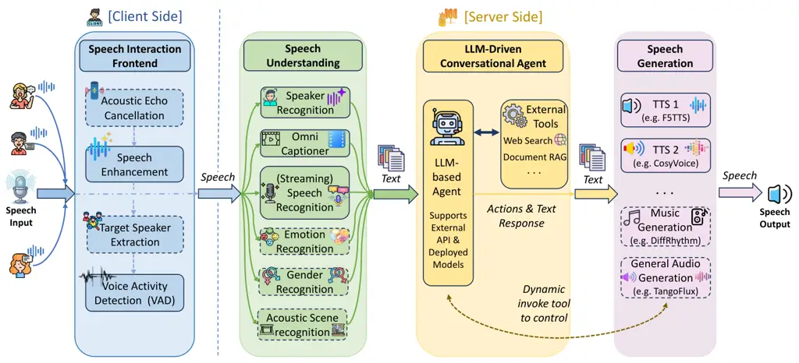

\contribution

{xcc_zach, chenxie95}@sjtu.edu.cn  
^(\*)Corresponding author.
\metadata\[Code\][https://github.com/xcc-zach/xtalk](https://github.com/xcc-zach/xtalk)
\metadata\[Demo\][https://xtalk.sjtuxlance.com](https://xtalk.sjtuxlance.com)

# X-Talk: On the Underestimated Potential of Modular Speech-to-Speech Dialogue System

Zhanxun Liu^(1,2,3), Yifan Duan^(1,2), Mengmeng Wang⁴, Pengchao
Feng^(1,2), Haotian Zhang¹, Xiaoyu Xing¹, Yijia Shan¹, Haina Zhu¹,
Yuhang Dai ⁵, Chaochao Lu³, Xipeng Qiu^(2,6), Lei Xie⁵, Lan Wang⁷, Nan
Yan⁷, Zilong Zheng⁴, Ziyang Ma¹, Kai Yu¹, Xie Chen^(1,2,\*) Affiliation:
¹MoE Key Lab of Artificial Intelligence, X-LANCE Lab, Shanghai Jiao Tong
University Affiliation: ²Shanghai Innovation Institute Affiliation:
³Shanghai AI Laboratory Affiliation: ⁴State Key Laboratory of General
Artificial Intelligence, BIGAI Affiliation: ⁵Audio, Speech and Language
Processing Group, Northwestern Polytechnical University Affiliation:
⁶Fudan University Affiliation: ⁷Shenzhen Institutes of Advanced
Technology, Chinese Academy of Sciences

August 24, 2026

###### Abstract

We present X-Talk, an open-source framework that champions a decoupled,
modular design for LLM-driven speech-to-speech (S2S) systems. While the
dominant trend favors end-to-end (E2E) modeling to optimize information
flow, these "omni-models" often struggle to balance the competing
objectives of complex speech tasks within a single network. X-Talk
challenges this paradigm by demonstrating that a systematically
optimized cascaded pipeline can achieve sub-second latency without
sacrificing modular flexibility. Our framework seamlessly integrates
specialized front-end components (e.g., VAD, speech enhancement) and
diverse understanding models (e.g., ASR, emotion, and environmental
sound analysis) with LLM capabilities like retrieval-augmented
generation (RAG) and tool use. By revitalizing the cascaded approach,
X-Talk highlights the underestimated potential of modular S2S systems
and provides a robust foundation for future research and applications.

Figure 1: The data flow in the X-Talk framework, featuring four core
functional modules of the speech-to-speech dialogue system: Speech
Interaction Frontend, Speech Understanding, LLM-Driven Conversational
Agent, and Speech Generation. The modules enclosed in solid lines denote
currently integrated components, while those represented by dashed boxes
indicate ongoing developments.

## 1 Introduction

Speech-to-Speech (S2S) dialogue systems aim to facilitate fluent and
effective human–computer interaction (HCI) through natural spoken
language. These systems can be broadly categorized into two distinct
architectural paradigms: 1) cascade systems and 2) end-to-end systems.
Conventional cascaded systems utilize a pipeline composed of automatic
speech recognition (ASR), natural language understanding (NLU), and
speech-to-text (TTS) synthesis modules, which are widely employed in
AI-assisted applications (Google, 2025; Apple, 2025; Amazon, 2025).
Recently, driven by advances in multi-modal large language models
(MLLMs) (Zhang et al., 2024), there has been a significant surge of
interest in end-to-end approaches within the research and industrial
communities. Nevertheless, despite claims that end-to-end systems offer
low-latency responses (Xie and Wu, 2024; Défossez et al., 2024), the
ability to capture paralinguistic cues from user utterances (Wang et
al., 2024; Xue et al., 2024), and the capacity to generate empathetic
responses (Wang et al., 2025; Chen et al., 2025c), they face significant
practical challenges. These include prohibitive training costs (Zeng et
al., 2024; Défossez et al., 2024), a tendency toward intelligence
degradation (Chen et al., 2025d), and inherent unreliability (Ma et al.,
2025a; Yang et al., 2025b), which often renders them unsuitable for
deployment in real-world user environments. In this work, we revisit the
cascaded dialogue system paradigm, aiming to challenge the prevailing
perception that cascaded models are outdated. We demonstrate that
through meticulous architectural design and the integration of advanced
speech models, cascaded systems can achieve performance on par with, or
even exceeding, that of end-to-end approaches.

To operationalize this vision, a highly modularized framework is
designed to overcome the inherent limitations of current monolithic
models. Specifically, as illustrated in Figure 1, we systematically
decompose the speech-to-speech dialogue process into 4 Core Functional
Modules:

- (1)
  Speech Interaction Frontend: This module processes noisy speech inputs
  through a set of preprocessing components, including speech
  enhancement, voice activity detection (VAD), and target speaker
  extraction, which are designed to be lightweight and operate in a
  streaming manner. In this work, the frontend models are deployed on
  the client side to minimize end-to-end latency.
- (2)
  Speech Understanding: This module aims to analyze and extract both
  linguistic and paralinguistic information embedded in speech. It
  incorporates components such as speech recognition, speaker
  identification, gender and emotion recognition, and acoustic scene
  recognition. In addition, detailed audio captioning models can be
  employed to achieve a more comprehensive understanding of the speech
  signal and to convert relevant information into textual
  representations.
- (3)
  LLM-Driven Conversational Agent: This module consumes textual inputs
  produced by the ASR system and other upstream components of the speech
  understanding module, and performs high-level dialogue reasoning and
  response generation. Large Language Models (LLMs) serve as the core
  engine, augmented with auxiliary components such as a web searcher, a
  local database retriever, and a reasoning (thinking) module to handle
  complex queries and to integrate information from multiple
  heterogeneous sources.
- (4)
  Speech Generation: This module is responsible for generating relevant
  and natural audio responses based on the outputs of the LLM. Various
  speech, audio, and music generation models can be employed as
  generation agents. Under this design, multiple speech generation
  models can be coordinated and organized as a chorus, enabling flexible
  and expressive audio output.

This modular decomposition enables fine-grained control, targeted
optimization, and seamless integration of linguistic, paralinguistic,
and environmental signals, laying the foundation for a highly capable,
interpretable, and reliable dialogue system.

Then, we propose the Event-driven Architecture to orchestrate the entire
cascaded system in a novel and principled manner. Specifically, inputs
and outputs of all modules are uniformly encoded as structured events
and propagated along a central event bus. This design not only enhances
modularity and interoperability but also facilitates asynchronous and
dynamic coordination among components. Furthermore, to reduce system
response latency and improve the naturalness of interaction, we refine
the turn-taking logic in the VAD module and redesign relevant modules to
operate in a streaming fashion. We also introduce a buffered statement
mechanism, which generates buffered response content ahead of the tool
call to mask the latency introduced by external tool calls.

We make and integrate the above design into X-Talk, an open-source
spoken dialogue system framework tailored for real-world deployment.
X-Talk not only enables low-latency, paralinguistic-aware, full-duplex
spoken interaction but also offers high modularity: individual
components can be independently maintained, retrained, or optimized, and
new modules can be seamlessly integrated without retraining the overall
pipeline. This architecture thus achieves a compelling balance between
high performance and fine-grained controllability, making it well-suited
for practical, scalable, and evolving conversational AI applications.

In summary, X-Talk provides the following features that distinguish it
from other models or frameworks:

- •
  A low-latency, full-duplex dialogue system that significantly reduces
  interaction delay by optimizing audio stream processing and response
  scheduling mechanisms, enabling more natural and fluid human–computer
  interaction.
- •
  A modular, event-driven architecture that coordinates heterogeneous
  functional components. This design not only ensures flexible
  integration and maintainability but also unlocks the latent
  paralinguistic understanding capabilities inherent in cascaded spoken
  dialogue systems.
- •
  A fully open-source framework, featuring strong engineering merits
  with complete model controllability, a lightweight asynchronous server
  implementation, and native support for high-concurrency deployment,
  collectively enabling robust and scalable real-world productization.

## 2 Related Work

### Cascaded S2S Dialogue System

Cascaded spoken dialogue systems have been a central paradigm in
human–computer interaction. Early systems, such as the Let’s Go Public
spoken dialog system (Raux et al., 2005), demonstrated the feasibility
of robust deployment in real-world scenarios. Recent integration of LLMs
has substantially enhanced cascaded architectures (Chen et al., 2025b;
Arora et al., 2025; Xiaoxia et al., 2024). Nevertheless, most
contemporary cascaded dialogue systems still follow a rigid three-stage
pipeline: automatic speech recognition (ASR), LLM-based language
understanding and generation, and text-to-speech synthesis (TTS). This
modular design limits the exploitation of paralinguistic cues (e.g.,
intonation, emphasis, emotional prosody), which are essential for
natural and context-aware interaction (Schuller et al., 2011).
Furthermore, many open-source and commercial frameworks, such as TEN
(TheTEN.AI Team, 2025), Voicechat2 (Leonard and Tuluk, 2024),
Vocal-Agent (Tarun, 2025), Bolna (Bolna.Team, 2025) RealtimeVoiceChat
(Beigel and et al., 2025), LiveKit Agent (LiveKit.Team, 2025), Pipecat
(Team, 2025) depend on cloud-based APIs for core components, raising
privacy and security concerns.

### End-to-End S2S Dialogue System

End-to-end spoken dialogue systems aim to unify speech perception,
language understanding, dialogue management, and speech generation
within a single neural architecture. Recent advances, exemplified by
Moshi (Défossez et al., 2024), Mini-Omni (Xie and Wu, 2024), GLM-4-Voice
(Zeng et al., 2024), GPT-4o (Hurst et al., 2024), SLAM-Omni (Chen et
al., 2025d), Kimi Audio (Ding et al., 2025), MIMO-Audio (Xiaomi, 2025),
Moss-Speech (Zhao et al., 2025), SALMONN-omni (Yu et al., 2025),
Qwen2.5-Omni (Xu et al., 2025a) and Qwen3-Omni (Xu et al., 2025b) ,
highlight the growing maturity of this paradigm. Current systems largely
focus on mitigating performance loss when transitioning from text-based
to spoken modalities. Despite their architectural elegance, they still
underexploit paralinguistic cues (Chen et al., 2025a), which are vital
for natural interaction. Moreover, the integration of advanced
capabilities such as retrieval-augmented generation (RAG) and
tool/function calling in fully differentiable speech-grounded dialogue
remains at a preliminary stage (Chen et al., 2025e; Feng et al., 2025).
While such functionalities are well-established in text-based LLMs,
adapting them to end-to-end speech systems raises challenges in latency
from web searching and reliability.

## 3 Design of X-Talk

Figure 2: The system architecture in X-Talk. The entire system is built
around a centralized event bus with a hierarchical design. All layers
communicate asynchronously through an event publish-subscribe mechanism,
enabling efficient management of complex conversational state and data
flow.

### 3.1 Overall Architecture of X-Talk

The architecture of X-Talk follows a modular, stage-wise functional
pipeline, transitioning from raw acoustic signals through frontend
interaction, speech understanding, and LLM-driven reasoning and
integration, to final speech generation. As illustrated in Figure 2,
this architecture is realized through a layered, event-driven, and
loosely-coupled architecture. The system is anchored by a centralized
event bus, where each layer communicates asynchronously via a
publish-subscribe mechanism, enabling efficient management of complex
conversational states and data flow. This design is specifically
engineered to address the core challenges of real-time speech-to-speech
dialogue systems: achieving sub-second latency, orchestrating multiple
components, and ensuring the flexible integration of backend models and
services.

##### Frontend Layer

This layer acts as the user-facing interface, directly handling frontend
interaction. It provides the conversational UI, performs client-side
Voice Activity Detection (VAD), audio denoise and enhancement, and
displays real-time latency metrics to the user. It packages audio
streams, VAD markers, and context for transmission to the backend.

##### Event Center Layer

This layer serves as the system’s communication hub, unifying event
routing and protocol translation. It comprises three components: 1) the
Input Gateway converts frontend streams into typed events; 2) the Output
Gateway delivers processed events back to the frontend; and 3) the Event
Bus provides the asynchronous messaging fabric, routing events between
all components. Together, they decouple all other layers, handling
protocol adaptation, event distribution, and lifecycle isolation—forming
the extensible backbone of the architecture.

##### Managers Layer

This layer orchestrates the core conversational workflow through
specialized, capability-specific managers. Each manager is dedicated to
a particular component and operates by subscribing to relevant events,
executing its logic, and publishing new events to drive the dialogue
forward.

##### Agents Layer

This layer serves as the system’s task-planning and execution engine,
integrating structured inputs from upstream models and historical
context to form a coherent speech understanding. The agent then
orchestrates tool use, including web search, local retrieval, audio
control, to collect needed data or perform actions. Finally, it
synthesizes the retrieved or processed information into a context-aware,
coherent natural language response.

##### Models Layer

This layer provides a unified, interface-driven abstraction for core
speech-to-speech dialogue system capabilities: speech understanding, LLM
agent, and speech generation. It defines stable, modular contracts for
each capability, enabling compliant implementations to be seamlessly
integrated, swapped, or scaled without impacting other system
components.

### 3.2 Design Details in X-Talk

#### 3.2.1 Speech Interaction Frontend

In real-world deployments, background noise can easily influence the
speech input stream, which may lead to unstable turn-taking and
influence backend interactions. Meanwhile, a good interaction experience
requires the system to respond to user’s speech and barge-in with low
latency. X-Talk addresses these requirements by deploying a streaming
speech enhancement model and a VAD module directly on the client side.
Specifically, X-Talk employs FastEnhancer (Ahn et al., 2025) to perform
streaming denoising on raw audio inputs. This enhanced signal is then
fed into Silero VAD (Team, 2024) to analyze speech frames in real time,
significantly reducing false triggers in acoustically complex
environments. Upon detecting human speech, the client immediately pauses
local playback and dispatches an event to the server. This client-side
execution minimizes the round-trip latency for interruptions, allowing
users to naturally interrupt the system while it is speaking.

#### 3.2.2 Speech Understanding

Conventional cascaded systems often rely solely on ASR to transcribe
speech to text, thereby discarding rich paralinguistic cues such as
emotional state and acoustic context. This information loss limits the
system’s depth of understanding. To mitigate this, X-Talk integrates a
multi-dimensional understanding pipeline that extracts linguistic,
paralinguistic, and environmental information.

##### Speech Recognition

X-Talk supports multiple ASR backends, including Zipformer (Yao et al.,
2023), SenseVoice (An et al., 2024), and Paraformer (Gao et al., 2022),
covering both streaming and offline scenarios. To balance between
transcription accuracy and real-time requirements, we implement a
pseudo-streaming mechanism for offline models. We maintain a cumulative
buffer and an incremental buffer. For each new audio chunk, the system
performs recognition on the cumulative buffer and appends the result to
a stable prefix. We use a sliding-window cache to monitor the stability
of the generated text; once the prefix remains unchanged for a
predefined window size, it is finalized, and the corresponding audio is
flushed from the buffer. This approach delivers a streaming-like user
experience while leveraging the superior accuracy of offline models.

##### Acoustic Context Awareness

To perceive the user’s environment, we integrate Omni-Captioner (Ma et
al., 2025b), a powerful audio analysis model that generates detailed
descriptions of audio scenes. We maintain a 15-second rolling audio
buffer and invoke the captioner at fixed intervals. An optional
LLM-based caption-rewriter module is employed to condense verbose
outputs into precise, context-rich summaries. These captions are
dynamically injected into the LLM’s system prompt, enabling the agent to
generate responses that are contextually aligned with the user’s
physical surroundings.

##### Speaker Recognition

Identity awareness is facilitated through a speaker recognition module
based on the Pyannote framework using WeSpeaker ResNet34 (Wang et al.,
2023; Bredin, 2023). During the initial interaction, the system
registers the user’s voiceprint. In subsequent turns, the module
extracts embeddings from the input stream and performs real-time
matching against a registered database. We utilize an Exponential Moving
Average (EMA) update strategy to adapt the stored embeddings over time,
ensuring robustness against intra-speaker variability. The identified
speaker ID is passed to the LLM, enabling personalized multi-user
interaction.

#### 3.2.3 LLM-Driven Conversational Agent

While LLMs excel at reasoning, they are inherently limited by their
training knowledge cutoff and lack of system state dynamic control.
X-Talk leverages LangChain¹¹ 1
[https://github.com/langchain-ai/langchain](https://github.com/langchain-ai/langchain)
to equip the LLM with a specialized toolset, transforming it into an
autonomous agent capable of real-time information retrieval and system
state management.

##### Web Search

To provide users with up-to-date and factually accurate information, we
have implemented a Web Search tool that enables the LLM to access
external data in real time. The tool executes queries via the Serper
API²² 2 [https://serper.dev/](https://serper.dev/) and processes the
retrieved content into a structured format. To prevent the model from
ingesting irrelevant or erroneous information, we plan to employ a
tiered semantic filtering strategy based on word embeddings generated by
Qwen2.5-0.5B-Instruct (Yang et al., 2024). For results with high
coverage, we directly use their snippets. For results with middle
coverage, we further fetch the full content of the linked page and
provide it to the LLM. For results with low coverage, we discard them
entirely. The LLM proactively invokes this tool whenever it identifies a
need for contemporary data or external verification.

##### Local Search

To enhance personalized user experiences, X-Talk supports RAG through a
local knowledge base. Users can upload heterogeneous file formats to
construct session-independent vector databases. Specifically, X-Talk
uses Qwen3-Embedding-0.6B as the embedding model and uses the Chroma
vector database for the storage and management of document vectors
(Zhang et al., 2025). These tools allow the LLM to perform precise,
real-time retrieval of user-specific documents, ensuring that responses
are grounded in the user’s personal data or specialized domain
knowledge.

##### Timbre Switching

A key feature of X-Talk is its ability to autonomously adapt its vocal
persona based on user requirements. We have equipped the LLM with a
Timbre Switching tool, leveraging its advanced natural language
understanding to identify explicit or implicit user preferences for
specific voices. Upon invocation, the system dynamically maps the
desired timbre to corresponding reference audio and updates the TTS
engine’s configuration on-the-fly, achieving seamless transitions
between diverse vocal identities.

##### Emotion Switching

To foster authentic human-machine interaction, the system should be able
to adjust its emotional prosody based on the semantic content expressed
by the user. We implement a flexible emotion switching strategy that
accommodates different TTS architectures. For models without native
emotion control, such as IndexTTS (Deng et al., 2025), the system
switches between pre-defined emotional reference audio prompt within the
same voice profile. For models supporting native emotion control, such
as IndexTTS (Deng et al., 2025), the LLM directly modifies the emotion
vectors. The implementation of emotion switching is decoupled from the
system’s core logic and handled independently by each TTS class,
providing a flexible and extensible foundation for integrating
additional TTS models in the future.

##### Adaptive Thinking

Enabling thinking within real-time spoken dialogue systems poses
significant challenges regarding latency and coherence. Unlike recent
end-to-end approaches that attempt simultaneous "thinking" and "talking"
through a unified modeling (Chiang et al., 2025; Xie et al., 2025),
which often suffer from limited controllability and reliability, X-Talk
treats thinking as an explicit, event-driven state. In X-talk, we design
thinking as an explicit event handled by a dedicated Thinking module.
When the dialogue system requires deliberation, it can invoke this event
on demand, offering high flexibility and controllability without
introducing additional latency to normal interactions.

#### 3.2.4 Speech Generation

The Speech Generation module is designed as a collaborative “chorus” of
diverse synthesis models such as speech synthesis and music generation.
Currently, X-Talk integrates high-fidelity TTS models such as CosyVoice
(Du et al., 2024) and IndexTTS (Deng et al., 2025; Zhou et al., 2025),
and integration of other models is underway. To maximize inference
throughput, we employ vLLM (Kwon et al., 2023) for model deployment. By
treating the TTS engine as a controllable tool, the LLM can adjust
prosody and emotional expression on-the-fly, achieving a level of
expressiveness that rivals end-to-end systems while maintaining the
precision from the cascaded designs.

## 4 Modularity and Extensibility

### 4.1 Supported Models

Table 1 presents the models integrated in X-Talk, which are organized
into four functional modules covering the full speech interaction
pipeline. These components manage the full spectrum of spoken dialogue,
from low-level signal processing to high-level cognitive reasoning and
expressive synthesis. The system also incorporates a mix of
state-of-the-art open-source models and industry-leading proprietary
APIs, demonstrating the framework’s broad compatibility.

Component Model Deployment Speech Interaction Frontend Enhancement
FastEnhancer Local VAD Silero VAD Local Speech Understanding ASR
Paraformer Local SenseVoice Local Qwen3-ASR-Flash API Environment
Qwen3-Omni-Captioner Local Speaker Wespeaker-Resnet34 Local
Paralinguistics Qwen3-Omni-Captioner Local emotion2vec Local LLM Dialog
models All models compatible with OpenAI endpoint Local/API Embeddings
All models compatible with OpenAI endpoint Local/API Speech Generation
TTS IndexTTS 1.5 Local IndexTTS 2 Local CosyVoice-3-Flash API GPT-SoVITS
Local ElevenLabs TTS API Edge TTS API

Table 1: Models Integrated in X-Talk, covering four functional modules
for the speech-to-speech dialogue pipeline.

### 4.2 Model-Agnostic Design

X-Talk is built on a model-agnostic philosophy, ensuring that the core
architecture remains invariant to changes in specific model
implementations, execution granularities, or internal state
representations. This is achieved through three key architectural
pillars:

##### Interface Protocols and Data Normalization

Capability protocols are defined as the sole interaction boundary
between the managers layer and models layer, specifying data formats and
modality conventions without assuming any internal model architecture or
execution granularity. For example, ASR components may consume
normalized audio streams (e.g., mono PCM), while TTS components emit
audio in standardized formats, enabling interchangeable use of
heterogeneous implementations. Optional metadata, such as suggested
chunk sizes, may be exposed to facilitate efficient buffering; however,
such hints remain advisory and do not constrain model behavior,
preserving a stable and model-agnostic interface.

##### State Isolation through Pipeline Abstraction

Processing pipelines are implemented as lightweight abstractions whose
primary role is to isolate session-specific mutable runtime states
rather than encode model-specific execution logic. Immutable model
parameters are shared across pipelines, while all mutable states-such as
streaming buffers, and intermediate queues-are instantiated on a
per-session basis. This separation ensures that concurrent sessions can
safely reuse the same underlying model weights without interference,
regardless of how individual models represent or manage their internal
states.

##### Event-Driven Coordination with Priority Routing

Component interaction is coordinated through a centralized, event-driven
control layer that routes semantic control signals (e.g., start, pause,
stop, flush) based on session context and configurable priorities.
Importantly, the managers layer makes no assumptions about timing,
segmentation, or decoding granularity. Instead, pacing is determined
entirely by individual components—such as chunk-level emission from ASR,
token-level streaming from LLMs, or synthesis cadence from TTS—and
outputs are forwarded as they become available. This design enables
consistent coordination across heterogeneous execution models without
hard-coded scheduling logic.

### 4.3 Integration of New Functionalities

X-Talk offers great scalability and enables easy integration of new
functionalities. Here we introduce two extension approaches: the first
involves directly implementing the target functionality with the option
to encapsulate it as a tool for the LLM to invoke; the second involves
integrating new categories of models into the system to handle more
complex or specialized task requirements. Together, these approaches
enable individual models or services to be substituted, upgraded, or
omitted without modifying the overall orchestration logic.

##### New Functionalities and New Tools

We first introduce the approach of directly inserting new
functionalities. For functionalities that can be naturally integrated
into the existing architecture, we can simply find out their appropriate
system layer (such as a specific manager or model implementation) and
then implement and integrate them at the corresponding location. During
this process, new types of events can be defined as needed, and the
event subscription relationships and behaviors of each manager can be
adjusted. For more complex functionalities, first develop them as
classes or modules. Then initialize and invoke them within the relevant
manager. Additionally, the functionality can be encapsulated as a tool
callable by the LLM. Simply add a new tool implementation under the
agent, inherit the constraints from the interface, and define input
fields, output structures, and other parameters. Subsequently, add the
tool to the agent’s available list to enable its invocation.

##### New Model Category

X-Talk offers great extensibility, which allows new categories of models
to be easily introduced to implement additional functionality.
Specifically, the following steps can be taken to integrate new
categories of models. First, we need to define a new abstract base class
for this model category within the interfaces layer and specify its
inputs, outputs, and fundamental methods. After that, concrete model
classes can be implemented based on this base class. Next, mount the
model instance onto the Pipeline. Ensure that it acts as a context
dependency that can be passed and supports copy operations. Following
this, we need to implement a dedicated Manager (e.g., TTS_Manager) to
subscribe to relevant events on the Event Bus. This manager will invoke
the model to execute business logic and publish new events via EventBus.
In addition, additional event types can be registered as needed during
this process. Finally, we need to register the Manager within the
service’s initialization list. This ensures that it starts with the
session and is integrated into the unified lifecycle management and
resource release system.

## 5 Interaction Latency

### 5.1 Asynchronous Parallel

X-Talk adopts an event-driven architecture to achieve strict end-to-end
latency control. A centralized event bus asynchronously coordinates
processing signals, enabling different functional modules to operate
independently. The system is engineered to minimize the critical path of
the forward processing chain, which consists of ASR, LLM inference, TTS,
and other modules. Other modules, such as audio caption, speaker
identification, and retrieval-based callbacks, are executed through
parallel, non-blocking channels. This design prevents operations in one
processing path from delaying those in another, ensuring that the
response latency of the system is bounded and predictable.

### 5.2 Experiments

##### Implement Details

We evaluate the end-to-end latency of X-Talk across different
combinations of ASR, LLM, and TTS models, with input speech ranging from
5 seconds to 1 minute. For each component, we evaluate multiple models,
including Paraformer, SenseVoice for ASR (Gao et al., 2022; An et al.,
2024), Qwen3-Next-80B-A3B-Instruct, Qwen3-30B-A3B, Qwen3-8B for LLM
(Yang et al., 2025a), and IndexTTS 1.5, IndexTTS 2, CosyVoice for TTS
(Deng et al., 2025; Zhou et al., 2025; Du et al., 2024). All experiments
are conducted on a deployment with four NVIDIA RTX 4090 GPUs. We deploy
SenseVoice using sherpa-onnx³³ 3
[https://github.com/k2-fsa/sherpa-onnx](https://github.com/k2-fsa/sherpa-onnx)
and evaluate the end-to-end latency under both its original
non-streaming synthesis and our pseudo-streaming implementation. All
local LLMs are deployed using vLLM (Kwon et al., 2023). We set the
sampling temperature of the model to 0.1 to reduce randomness.
Meanwhile, we set the temperatures of the Thinker and Rewriter to 0.7 to
encourage broader exploration. For Qwen3-30B-A3B and Qwen3-8B, we use
their quantized variants. We access Qwen3-Next-80B-A3B-Instruct and
CosyVoice-v3-flash via their official APIs. For IndexTTS 1.5 and
IndexTTS 2, we deploy them using vLLM⁴⁴ 4
[https://github.com/Ksuriuri/index-tts-vllm](https://github.com/Ksuriuri/index-tts-vllm).
For each configuration under different speech input, we measure the
latency three times and use the average value as the final result.
Notably, the frontend VAD uses a 500 ms end-of-utterance silence
threshold to determine the speech endpoint, and this fixed delay is not
included in latency calculation there.

##### Results

In Table 2, we demonstrate the end-to-end latency of X-Talk under
different combinations of ASR, LLM, and TTS models. X-Talk’s default
configuration uses SenseVoice(Streaming), Qwen3-30B, and IndexTTS 1.5.
Our system latency is primarily composed of three components: ASR
full-text recognition latency, LLM first-sentence generation latency,
and TTS first-sentence synthesis latency. When using Paraformer and our
pseudo-streaming method with SenseVoice, the ASR full-text recognition
latency becomes extremely low and is largely insensitive to the input
audio length. As a result, the overall latency is mainly dominated by
the LLM’s delay to generate the first sentence and the TTS’s delay to
synthesize the first sentence. In this setting, the observed differences
in latency are primarily driven by variations in the length of the
model’s first sentence, as well as the inference speed of the LLM and
TTS models. Therefore, when we switch the model to Qwen3-80B, IndexTTS2,
and CosyVoice, the latency increases. Notably, for Qwen-8B, we observe
that it tends to invoke tools more proactively before producing a
response when presented with different speech inputs (e.g., switching
emotion), which in turn increases the overall latency. In contrast, when
SenseVoice is used in offline mode for speech recognition, its latency
becomes sensitive to the input duration, as reflected in our results.

|                       |                |                |              |      |      |      |      |      |      |      |
| --------------------- | -------------- | -------------- | ------------ | ---- | ---- | ---- | ---- | ---- | ---- | ---- |
| ASR (streamable)      | LLM            | TTS            | Latency (ms) |      |      |      |      |      |      |      |
|                       |                |                | 5s           |      | 10s  |      | 30s  |      | 60s  |      |
|                       |                |                | CN           | EN   | CN   | EN   | CN   | EN   | CN   | EN   |
| SenseVoice(streaming) | Qwen3-30B      | IndexTTS 1.5   | 284          | 272  | 346  | 406  | 420  | 610  | 449  | 376  |
| Paraformer(streaming) | Qwen3-30B      | IndexTTS 1.5   | 264          | 367  | 399  | 488  | 379  | 412  | 393  | 382  |
| SenseVoice(offline)   | Qwen3-30B      | IndexTTS 1.5   | 635          | 617  | 1015 | 1054 | 2175 | 2326 | 3798 | 3671 |
| SenseVoice(streaming) | Qwen3-8B       | IndexTTS 1.5   | 808          | 339  | 948  | 625  | 1039 | 1111 | 1075 | 1068 |
| SenseVoice(streaming) | Qwen3-80B(API) | IndexTTS 1.5   | 881          | 1436 | 994  | 1216 | 1052 | 1124 | 1136 | 1374 |
| SenseVoice(streaming) | Qwen3-30B      | IndexTTS 2     | 1515         | 1264 | 1448 | 1568 | 1764 | 2131 | 1832 | 1810 |
| SenseVoice(streaming) | Qwen3-30B      | CosyVoice(API) | 652          | 587  | 912  | 1029 | 763  | 842  | 856  | 1019 |

Table 2: X-Talk’s latency test across different combinations of models
with different input speech length. CN/EN indicates Chinese/English
speech inputs. CosyVoice refers to CosyVoice-v3-flash. For each
configuration, latency is measured three times and the final value is
the rounded average. The first row is the baseline configuration in
X-Talk, while each of the other configurations has one model varied.

### 5.3 Sub-Second Streaming

X-Talk achieves sub-second response latency by implementing a
comprehensive streaming mechanism across all system components. To
minimize time-to-first-token (TTFT) and time-to-first-audio (TTFA),
X-Talk enforces streaming behavior across model boundaries.
Native-streaming ASR models emit partial hypotheses incrementally. For
non-streaming ASR engines, we employ cumulative full-context
re-inference, in which the growing audio buffer is repeatedly
reprocessed and newly generated transcripts replace prior outputs,
exposing a pseudo-streaming interface while preserving contextual
stability.

LLM responses are emitted at token-level granularity and forwarded
immediately. For TTS models without native input streaming capability,
long utterances are segmented into short clauses. These segments are
synthesized independently and played back sequentially, transforming
batch-oriented synthesis into a low-latency, stream-like audio pipeline.

### 5.4 Perceived Responsiveness

To reduce user-perceived latency, X-Talk introduces a VAD-driven
preemption loop that pauses ongoing client TTS playing immediately upon
detecting user speech, followed by lightweight semantic verification.
When a true barge-in is confirmed, active synthesis and inference
modules are terminated; otherwise, suspended client TTS playing resume
seamlessly, providing instant user feedback.

During tool-call latency, X-Talk injects short phatic utterances (e.g.,
"Let me check this for you…") that are rendered in real time. This
strategy masks backend delays and maintains the subjective impression of
continuous system activity.

### 5.5 False Interruption Tolerance through Rules

To further reduce false interruptions, X-Talk has implemented a series
of rules on the backend for validation. First, the system performs an
audio duration check. Specifically, X-Talk sets a default minimum audio
length threshold of 0.5 seconds, and any audio shorter than this
threshold is classified as a false interruption. Second, the system
filters based on the ASR transcription result. If the output of ASR is
an empty string or contains only a single letter or digit, it is
considered a false interruption. Additionally, X-Talk maintains a list
of filler words. If the transcription result only contains words from
the fillered words list, it will be considered invalid. When the backend
identifies a false interruption, it notifies the frontend to resume
audio playback. Through this mechanism to detect false interruptions,
X-Talk achieves more natural interaction.

## 6 Cross-Platform Deployment

### 6.1 Parallel Services and Concurrent Control

X-Talk adopts an event-driven architecture. Events are published via an
event bus to all subscribed handlers and executed concurrently. This
architecture supports decoupling and parallel execution of core
components. Event prioritization can be used to determine the processing
order. Additionally, X-Talk implements multiple concurrently running
service managers. For example, the TTS-Manager synthesizes speech within
an independent consumer task and streams speech chunks to the output
gateway without blocking LLM generation or ASR processing. This design
ensures low latency and high resource utilization on the server side.
Furthermore, X-Talk implements session isolation and concurrency
control. The ServiceManager creates a dedicated Service instance for
each WebSocket connection, which ensures sessions remain isolated and do
not interfere with others. Furthermore, SessionLimiter can be used to
restrict the number of concurrent sessions to reduce the load on the
server.

### 6.2 Communication via WebSocket

X-Talk uses WebSocket as the communication protocol between the frontend
and the backend. WebSocket has excellent compatibility across various
deployment environments and is supported by different modern browsers
and application frameworks on desktop and mobile platforms. Moreover,
WebSocket is well-suited for resource-constrained scenarios such as
deploying lightweight clients on robots. Based on WebSocket, our backend
can provide a unified service for clients of different types without
requiring specific adaptations for various platforms. Additionally,
compared to WebRTC, WebSocket has superior performance in network
traversal. And it operates over TCP connections and ensures stable
communication quality.

## 7 Future Work

In future work, we will continue to expand and enhance the capabilities
of X-Talk to achieve more natural and immersive interactions and provide
a greater user experience. For example, in the Speech Interaction
Frontend, we will further introduce models such as acoustic echo
cancellation to improve the X-Talk’s stability. And we will also
introduce more types of generative models to achieve more flexible and
expressive audio output.

X-Talk has shown great interactive capabilities and can be adapted to a
variety of real-world application scenarios in the future. In the
example from our code, the system can serve as an auxiliary role for
psychological counseling, guiding users through psychological assessment
questionnaires and providing a gentle interactive experience. In the
future, we will continue to explore the potential applications of X-Talk
in various real-world scenarios. Besides that, we plan to further
improve X-Talk’s interactive experience by training models that are
better suited to its applications. For example, we aim to develop
context-aware ASR models that integrate dialogue history and other
contextual signals to reduce recognition error rates.

## 8 Conclusion

In this paper, we highlight the untapped potential of modularized spoken
dialogue systems, demonstrating that such architectures can
simultaneously achieve low latency and paralinguistic-aware interaction,
capabilities often regarded as the primary strengths of end-to-end
“omni” models. We present X-Talk, a highly optimized cascaded dialogue
system that delivers superior performance in terms of latency, barge-in,
complex audio understanding, and information retrieval—areas that remain
challenging for most existing open-source end-to-end systems. Moreover,
X-Talk is inherently extensible, enabling seamless integration of new
modules and stronger models as they emerge, thereby lowering the barrier
for community contribution and continuous evolution. We believe that
X-Talk provides a practical and scalable foundation for advancing
LLM-driven speech-to-speech applications.

## Acknowledgment

We express sincere gratitude towards Fangjun Kuang, one of contributors
towards sherpa-onnx, for helping us getting speech recognition batch
inference work properly.

## References

- Ahn et al. (2025) S. Ahn, J. Han, B. J. Woo, and N. S. Kim
  FastEnhancer: Speed-Optimized Streaming Neural Speech Enhancement.
  arXiv preprint arXiv:2509.21867. Cited by: §3.2.1.
- Amazon (2025) Amazon Alexa. External Links:
  [Link](https://www.amazon.com/) Cited by: §1.
- An et al. (2024) K. An, Q. Chen, C. Deng, Z. Du, et al. FunaudioLLM:
  voice understanding and generation foundation models for natural
  interaction between humans and LLMs. arXiv preprint arXiv:2407.04051.
  Cited by: §3.2.2, §5.2.
- Apple (2025) Apple Siri. External Links:
  [Link](https://www.apple.com/siri/) Cited by: §1.
- Arora et al. (2025) S. Arora, Y. Peng, J. Shi, J. Tian, et al.
  ESPnet-SDS: unified toolkit and demo for spoken dialogue systems.
  arXiv preprint arXiv:2503.08533. Cited by: §2.
- Beigel and et al. (2025) K. Beigel and et al. Real-Time AI Voice Chat.
  External Links: [Link](https://github.com/KoljaB/RealtimeVoiceChat)
  Cited by: §2.
- Bolna.Team (2025) Bolna.Team End-to-end open-source voice agents
  platform: quickly build voice firsts conversational assistants through
  a json. External Links: [Link](https://github.com/bolna-ai/bolna)
  Cited by: §2.
- Bredin (2023) H. Bredin Pyannote. audio 2.1 speaker diarization
  pipeline: principle, benchmark, and recipe. In Proc. INTERSPEECH,
  Cited by: §3.2.2.
- Chen et al. (2025a) J. Chen, Z. Guo, J. Chun, P. Wang, A. Perrault,
  and M. Elsner Do audio LLMs really listen, or just transcribe?
  measuring lexical vs. acoustic emotion cues reliance. arXiv preprint
  arXiv:2510.10444. Cited by: §2.
- Chen et al. (2025b) J. Chen, Y. Hu, J. Li, K. Li, et al. Fireredchat:
  a pluggable, full-duplex voice interaction system with cascaded and
  semi-cascaded implementations. arXiv preprint arXiv:2509.06502. Cited
  by: §2.
- Chen et al. (2025c) K. Chen, Y. Gou, R. Huang, Z. Liu, D. Tan, J.
  Xu, C. Wang, Y. Zhu, Y. Zeng, K. Yang, et al. Emova: empowering
  language models to see, hear and speak with vivid emotions. In
  Proceedings of the Computer Vision and Pattern Recognition Conference,
  pp. 5455–5466. Cited by: §1.
- Chen et al. (2025d) W. Chen, Z. Ma, R. Yan, Y. Liang, et al.
  SLAM-Omni: timbre-controllable voice interaction system with
  single-stage training. In Findings of ACL, Cited by: §1, §2.
- Chen et al. (2025e) Y. Chen, S. Ji, H. Wang, Z. Wang, et al. WavRAG:
  audio-integrated retrieval augmented generation for spoken dialogue
  models. Proc. ACL. Cited by: §2.
- Chiang et al. (2025) C. Chiang, X. Wang, L. Li, C. Lin, et al. STITCH:
  simultaneous thinking and talking with chunked reasoning for spoken
  language models. arXiv preprint arXiv:2507.15375. Cited by: §3.2.3.
- Défossez et al. (2024) A. Défossez, L. Mazaré, M. Orsini, A. Royer, P.
  Pérez, et al. Moshi: a speech-text foundation model for real-time
  dialogue. arXiv preprint arXiv:2410.00037. Cited by: §1, §2.
- Deng et al. (2025) W. Deng, S. Zhou, J. Shu, J. Wang, and L. Wang
  Indextts: an industrial-level controllable and efficient zero-shot
  text-to-speech system. arXiv preprint arXiv:2502.05512. Cited by:
  §3.2.3, §3.2.4, §5.2.
- Ding et al. (2025) D. Ding, Z. Ju, Y. Leng, S. Liu, T. Liu, et al.
  Kimi-audio technical report. arXiv preprint arXiv:2504.18425. Cited
  by: §2.
- Du et al. (2024) Z. Du, Y. Wang, Q. Chen, X. Shi, X. Lv, et al.
  Cosyvoice 2: scalable streaming speech synthesis with large language
  models. arXiv preprint arXiv:2412.10117. Cited by: §3.2.4, §5.2.
- Feng et al. (2025) P. Feng, Z. Ma, W. Chen, Y. Li, et al. Enhancing
  Speech-to-Speech Dialogue Modeling with End-to-End Retrieval-Augmented
  Generation. In Findings of EMNLP, Cited by: §2.
- Gao et al. (2022) Z. Gao, S. Zhang, I. McLoughlin, and Z. Yan
  Paraformer: Fast and Accurate Parallel Transformer for
  Non-autoregressive End-to-End Speech Recognition. In Interspeech 2022,
  Cited by: §3.2.2, §5.2.
- Google (2025) Google Google assistant. External Links:
  [Link](https://assistant.google.com/) Cited by: §1.
- Hurst et al. (2024) A. Hurst, A. Lerer, A. P. Goucher, A. Perelman, A.
  Ramesh, et al. Gpt-4o system card. arXiv preprint arXiv:2410.21276.
  Cited by: §2.
- Kwon et al. (2023) W. Kwon, Z. Li, S. Zhuang, Y. Sheng, L. Zheng, et
  al. Efficient Memory Management for Large Language Model Serving with
  PagedAttention. In Proceedings of the ACM SIGOPS 29th Symposium on
  Operating Systems Principles, Cited by: §3.2.4, §5.2.
- Leonard and Tuluk (2024) L. Leonard and U. E. Tuluk Voicechat2: a
  fast, fully local ai voice chat using websockets. External Links:
  [Link](https://github.com/lhl/voicechat2) Cited by: §2.
- LiveKit.Team (2025) LiveKit.Team LiveKit Agent: a powerful framework
  for building realtime voice ai agents. External Links:
  [Link](https://github.com/livekit/agents) Cited by: §2.
- Ma et al. (2025a) Z. Ma, X. Li, Y. Song, W. Chen, C. Du, J. Wu, Y.
  Chen, Z. Chen, Y. Wang, Y. Wang, et al. Towards reliable large audio
  language model. Proc. ACL. Cited by: §1.
- Ma et al. (2025b) Z. Ma, R. Xu, Z. Xing, Y. Chu, Y. Wang, et al.
  Omni-captioner: data pipeline, models, and benchmark for omni detailed
  perception. arXiv preprint arXiv:2510.12720. Cited by: §3.2.2.
- Raux et al. (2005) A. Raux, B. Langner, D. Bohus, A. W. Black, and M.
  Eskenazi Let’s go public! taking a spoken dialog system to the real
  world. In Proceedings of Interspeech, pp. 885–888. External Links:
  [Document](https://dx.doi.org/10.21437/Interspeech.2005-399) Cited by:
  §2.
- Schuller et al. (2011) B. Schuller, S. Steidl, A. Batliner, F. Schiel,
  and J. Krajewski The INTERSPEECH 2011 speaker state challenge. In
  Proceedings of Interspeech, pp. 3201–3204. External Links:
  [Document](https://dx.doi.org/10.21437/Interspeech.2011-801) Cited by:
  §2.
- Tarun (2025) Tarun Real-time cascading speech-to-speech chatbot.
  External Links: [Link](https://github.com/bolna-ai/bolna) Cited by:
  §2.
- Team (2025) P. Team Pipecat: Real-Time Voice & Multimodal AI Agents.
  External Links: [Link](https://github.com/pipecat-ai/pipecat) Cited
  by: §2.
- Team (2024) S. Team Silero VAD: pre-trained enterprise-grade Voice
  Activity Detector (VAD), Number Detector and Language Classifier.
  GitHub. Note:
  [https://github.com/snakers4/silero-vad](https://github.com/snakers4/silero-vad)
  Cited by: §3.2.1.
- TheTEN.AI Team (2025) TheTEN.AI Team TEN framework. External Links:
  [Link](https://theten.ai/) Cited by: §2.
- Wang et al. (2024) C. Wang, M. Liao, Z. Huang, J. Wu, C. Zong, and J.
  Zhang BLSP-emo: towards empathetic large speech-language models. In
  Proceedings of the 2024 Conference on Empirical Methods in Natural
  Language Processing, pp. 19186–19199. Cited by: §1.
- Wang et al. (2025) C. Wang, T. Peng, W. Yang, Y. Bai, G. Wang, J.
  Lin, L. Jia, L. Wu, J. Wang, C. Zong, et al. Opens2s: advancing fully
  open-source end-to-end empathetic large speech language model. In
  Proceedings of the 2025 Conference on Empirical Methods in Natural
  Language Processing: System Demonstrations, pp. 906–917. Cited by: §1.
- Wang et al. (2023) H. Wang, C. Liang, S. Wang, Z. Chen, et al.
  Wespeaker: a research and production oriented speaker embedding
  learning toolkit. In ICASSP 2023, IEEE International Conference on
  Acoustics, Speech and Signal Processing (ICASSP), Cited by: §3.2.2.
- Xiaomi (2025) L. Xiaomi MiMo-audio: audio language models are few-shot
  learners. External Links:
  [Link](https://github.com/XiaomiMiMo/MiMo-Audio) Cited by: §2.
- Xiaoxia et al. (2024) Xiaoxia laride et al. Xiaozhi-esp32: an
  mcp-based chatbot. External Links:
  [Link](https://github.com/78/xiaozhi-esp32) Cited by: §2.
- Xie et al. (2025) Z. Xie, Z. Ma, Z. Liu, K. Pang, et al.
  Mini-omni-reasoner: token-level thinking-in-speaking in large speech
  models. arXiv preprint arXiv:2508.15827. Cited by: §3.2.3.
- Xie and Wu (2024) Z. Xie and C. Wu Mini-omni: language models can
  hear, talk while thinking in streaming. arXiv preprint
  arXiv:2408.16725. Cited by: §1, §2.
- Xu et al. (2025a) J. Xu, Z. Guo, J. He, H. Hu, T. He, S. Bai, K.
  Chen, J. Wang, Y. Fan, K. Dang, et al. Qwen2. 5-omni technical report.
  arXiv preprint arXiv:2503.20215. Cited by: §2.
- Xu et al. (2025b) J. Xu, Z. Guo, H. Hu, Y. Chu, X. Wang, et al.
  Qwen3-omni technical report. arXiv preprint arXiv:2509.17765. Cited
  by: §2.
- Xue et al. (2024) H. Xue, Y. Liang, B. Mu, S. Zhang, M. Chen, Q. Chen,
  and L. Xie E-chat: emotion-sensitive spoken dialogue system with large
  language models. In 2024 IEEE 14th International Symposium on Chinese
  Spoken Language Processing (ISCSLP), pp. 586–590. Cited by: §1.
- Yang et al. (2025a) A. Yang, A. Li, B. Yang, B. Zhang, et al. Qwen3
  technical report. arXiv preprint arXiv:2505.09388. Cited by: §5.2.
- Yang et al. (2024) A. Yang, B. Yang, B. Zhang, B. Hui, et al. Qwen2.5
  technical report. arXiv preprint arXiv:2412.15115. Cited by: §3.2.3.
- Yang et al. (2025b) Y. Yang, X. Zhang, Z. Han, S. Wang, J. Zhuang, Z.
  Jin, J. Shao, G. Sun, and C. Zhang Speech-audio compositional attacks
  on multimodal llms and their mitigation with salmonn-guard. arXiv
  preprint arXiv:2511.10222. Cited by: §1.
- Yao et al. (2023) Z. Yao, L. Guo, X. Yang, W. Kang, F. Kuang, et al.
  Zipformer: a faster and better encoder for automatic speech
  recognition. arXiv preprint arXiv:2310.11230. Cited by: §3.2.2.
- Yu et al. (2025) W. Yu, S. Wang, X. Yang, X. Chen, X. Tian, et al.
  SALMONN-omni: A Standalone Speech LLM without Codec Injection for
  Full-duplex Conversation. arXiv preprint arXiv:2505.17060. Cited by:
  §2.
- Zeng et al. (2024) A. Zeng, Z. Du, M. Liu, K. Wang, S. Jiang, et al.
  Glm-4-voice: towards intelligent and human-like end-to-end spoken
  chatbot. arXiv preprint arXiv:2412.02612. Cited by: §1, §2.
- Zhang et al. (2024) D. Zhang, Y. Yu, J. Dong, C. Li, D. Su, et al.
  MM-LLMs: recent advances in MultiModal large language models. In
  Findings of ACL, External Links:
  [Link](https://aclanthology.org/2024.findings-acl.738/) Cited by: §1.
- Zhang et al. (2025) Y. Zhang, M. Li, D. Long, X. Zhang, et al. Qwen3
  embedding: advancing text embedding and reranking through foundation
  models. arXiv preprint arXiv:2506.05176. Cited by: §3.2.3.
- Zhao et al. (2025) X. Zhao, Z. Xu, Q. Cheng, Z. Fei, L. Jin, et al.
  MOSS-Speech: Towards True Speech-to-Speech Models Without Text
  Guidance. arXiv preprint arXiv:2510.00499. Cited by: §2.
- Zhou et al. (2025) S. Zhou, Y. Zhou, Y. He, X. Zhou, J. Wang, et al.
  IndexTTS2: a breakthrough in emotionally expressive and
  duration-controlled auto-regressive zero-shot text-to-speech. arXiv
  preprint arXiv:2506.21619. Cited by: §3.2.4, §5.2.
