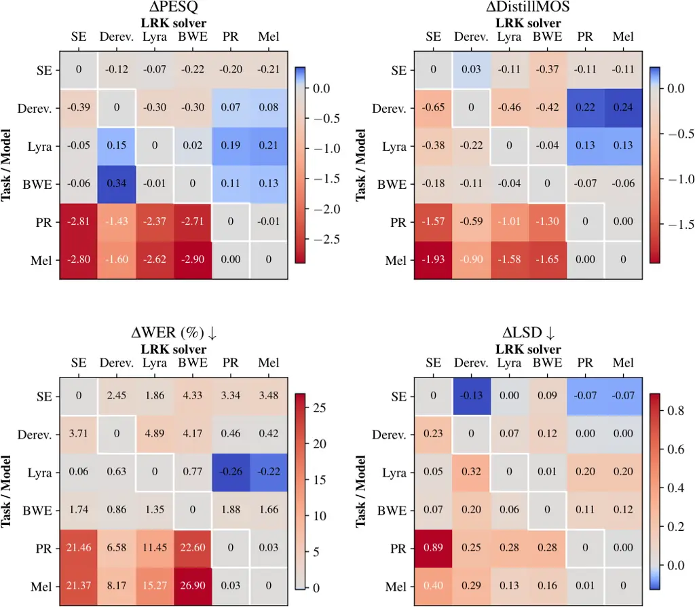

\subcaptionsetup

\[table\]position=top

SGM  
score-based generative model

SNR  
signal-to-noise ratio

STFT  
short-time Fourier transform

PR  
phase retrieval

iSTFT  
inverse short-time Fourier transform

SDE  
stochastic differential equation

ODE  
ordinary differential equation

PESQ  
Perceptual Evaluation of Speech Quality

SE  
speech enhancement

T-F  
time-frequency

RIR  
room impulse response

SNR  
signal-to-noise ratio

BWE  
bandwidth extension

LSTM  
long short-term memory

POLQA  
Perceptual Objective Listening Quality Analysis

SDR  
signal-to-distortion ratio

LSD  
log-spectral distance

SI-SDR  
scale invariant signal-to-distortion ratio

ESTOI  
Extended Short-Term Objective Intelligibility

DRR  
direct-to-reverberant ratio

NFE  
number of function evaluations

RTF  
real-time factor

MOS  
mean opinion scores

EMA  
exponential moving average

ViSQOL  
Virtual Speech Quality Objective Listener

RK  
Runge-Kutta

SVD  
singular value decomposition

DNN  
deep neural network

MSE  
mean squared error

SE  
speech enhancement

BWE  
bandwidth extension

FM  
flow matching

CFM  
conditional flow matching

JFM  
joint flow matching

WER  
word error rate

FLOP  
floating-point operation

API  
application programming interface

VB-DMD  
VoiceBank-DEMAND

EWv2  
EARS-WHAM v2

LRK  
Learned Runge-Kutta

DB  
Diffusion Buffer

SFM  
Stream.FM

# Real-Time Streamable Generative Speech Restoration with Flow Matching

Simon
Welker [](https://orcid.org/0000-0002-6349-8462)
   Bunlong
Lay [](https://orcid.org/0000-0002-0847-7896)
   Maris
Hillemann [](https://orcid.org/0009-0007-5701-8411)
   Tal
Peer [](https://orcid.org/0000-0002-8974-9127)
   Timo
Gerkmann [](https://orcid.org/0000-0002-8678-4699)
^(†)^(†)thanks: All authors are with the Signal Processing Group, Dept.
of Informatics, Universität Hamburg, 22527 Hamburg, Germany (e-mail:
firstname.lastname@uni-hamburg.de).

###### Abstract

Diffusion-based generative models have greatly impacted the speech
processing field in recent years, exhibiting high speech naturalness and
spawning a new research direction. Their application in real-time
communication is, however, still lagging behind due to their
computation-heavy nature involving multiple calls of large DNNs.

Here, we present Stream.FM, a frame-causal flow-based generative model
with an algorithmic latency of 32 milliseconds (ms) and a total latency
of 48 ms, paving the way for generative speech processing in real-time
communication. We propose a buffered streaming inference scheme and an
optimized DNN architecture, show how learned few-step numerical solvers
can boost output quality at a fixed compute budget, explore model weight
compression to find favorable points along a compute/quality tradeoff,
and contribute a model variant with 24 ms total latency for the speech
enhancement task.

Our work looks beyond theoretical latencies, showing that high-quality
streaming generative speech processing can be realized on consumer GPUs
available today. Stream.FM can solve a variety of speech processing
tasks in a streaming fashion: se, dereverberation, codec post-filtering,
bandwidth extension, STFT phase retrieval, and Mel vocoding. As we
verify through comprehensive evaluations and a MUSHRA listening test,
Stream.FM establishes a state-of-the-art for generative streaming speech
restoration, exhibits only a reasonable reduction in quality compared to
a non-streaming variant, and outperforms our recent work (Diffusion
Buffer) on generative streaming se while operating at a lower latency.

###### Index Terms: 

speech enhancement, speech restoration, diffusion models, generative
models, flow matching, real-time

## I Introduction

Real-time speech processing refers to a type of speech processing that
can be performed in an online fashion, where a model produces new parts
of the processed output signal as soon as possible after new parts of
the input signal arrive. Most applications allow for a fixed latency
$`\ell`$, e.g., few tens of milliseconds (ms) for voice-over-IP (VoIP)
communication. Compared to offline speech processing methods, this fixed
latency also requires the system to have a fixed amount of lookahead,
i.e., a limited future context. Depending on the task, this may result
in a performance degradation compared to an offline method which has
potentially all future context available.

While the task of neural se (se) has traditionally been considered a
predictive task, works from recent years, in particular SGMSE+ \[1\],
have shown that treating se as a generative task instead can have
several advantages, particularly in perceived speech quality and model
generalization. More broadly, non-additive speech restoration tasks such
as bwe (bwe), dereverberation or stft (stft) pr (pr) are naturally
well-suited for generative methods, in particular when a significant
amount of information is missing from the input signal and must be
_regenerated_ given only the remaining information \[2, 3\]. Prior work
\[2\] empirically supports this idea, showing clear advantages of modern
generative methods over predictive methods for such problems. Other
tasks which have been successfully tackled with diffusion-based
generative methods include neural codec post-filtering \[4, 5\], Mel
vocoding \[6\], and binaural speech synthesis \[7\].

However, a key downside to such generative methods is that they are
computationally intensive due to the involved numerical solvers
evaluating a large dnn (dnn) multiple times. This seems to preclude the
use of these methods for many real-time scenarios \[8\]. However, we
show here that real-time and multi-step inference are not necessarily at
odds with each other and can be realized on available consumer hardware,
given that one uses appropriately buffered inference schemes and
matching network architectures.

While many prior works describe their methods as _real-time_ \[7, 9,
10\], this is often either (a) not supported through timings on real
hardware, making it unclear whether a streaming implementation is
realistically attainable, or (b) measured based on the rtf (rtf)
estimated using offline processing, i.e., using an input utterance
duration longer than a single frame, and dividing by the processing time
the model takes for the full utterance. This neglects that, in offline
processing, the inference process can make full use of parallelism
across the time dimension of the input signal, as well as CUDA kernels
which are typically optimized to process single large tensors as quickly
as possible rather than many smaller tensors one-by-one. Such reported
offline rtf may therefore severely underestimate the actual rtf for
streaming inference, making it unclear which methods are practically
real-time capable in a streaming setting.

With this work, we aim to close this gap and make modern generative
streaming-capable methods available to the research community. We
propose Stream.FM, a real-time capable streaming generative model based
on flow matching \[11\] that can solve various speech restoration
problems with a total latency below 50 ms, bringing the high-quality
capabilities of diffusion-based generative models to real-time speech
processing. We extend our previous conference publication on real-time
streaming Mel vocoding \[6\], which (1) proposes a frame-wise causal DNN
and iterative inference scheme for real-time flow matching inference,
also used in this work, (2) realizes streaming inference with a total
latency of 48 ms on consumer hardware, and (3) outperforms established
non-causal baselines including HiFi-GAN \[12\].

We expand upon our previous conference publication \[6\] in the
following ways: (4) we demonstrate wide applicability of our model for
general speech restoration with five additional restoration tasks beyond
Mel vocoding: speech enhancement, dereverberation, bandwidth extension,
codec post-filtering, and STFT phase retrieval; (5) we newly propose and
investigate the use of learned Runge-Kutta ode (ode) solvers for flow
matching to boost output quality under a fixed computational budget; (6)
we provide a comprehensive comparison of attainable streaming latencies
of our model and baselines on consumer hardware; (7) for se, we design a
joint predictive-generative model inspired by StoRM \[13\]; (8) we
explore the use of model weight compression \[14\] towards a flexible
and favorable choice along the computation/quality tradeoff.

A full-band variant of the models detailed here, which jointly performs
se and bwe, has been accepted as a Show-and-Tell demo at ICASSP 2026
\[15\]. Code¹¹ 1
[https://github.com/sp-uhh/streamfm](https://github.com/sp-uhh/streamfm),
published after acceptance. and audio examples are available online²² 2
[https://sp-uhh.github.io/streamfm_examples](https://sp-uhh.github.io/streamfm_examples).

### I-A Related work

In 2020, Défossez et al. \[16\] proposed a predictive waveform-domain
model for causal real-time se, which we refer to as _DEMUCS_ here. The
recent work aTENNuate \[17\] is a predictive state-space model for
real-time se. DEMUCS and aTTENuate operate at a similar, slightly larger
algorithmic latency than Stream.FM, but no streaming implementation of
aTTENuate has been published. Dmitrieva and Kaledin \[18\] recently
proposed HiFi-Stream for streaming se, which uses a block-wise inference
scheme at the cost of possible block-edge discontinuities and a higher
latency. MambAttention \[19\] is a recently proposed model for
generalizable speech enhancement, based on a combination of modern
state-space models and attention layers, but is not targeted towards
streaming inference and uses a non-causal configuration.

Richter et al. \[20\] first proposed the use of causal dnn for
diffusion-based se and achieved convincing results, but did not target
real-time capability on real hardware, and used heavy down- and
upsampling along time which leads to large latencies \[21, 22\].

Lay et al. \[8\] proposed the db (db), which realizes a real-time
streaming se diffusion model on consumer hardware. db couples the
diffusion time $`\tau`$ to physical time $`t`$ in a fixed-size frame
buffer. The buffer is progressively denoised frame-by-frame using one
dnn call each time, and each time the oldest—then fully denoised—frame
in the buffer is output. This realizes a fixed algorithmic latency equal
to the total buffer duration, which studies indicate should not be
reduced below 180 ms \[22\].

Liang et al. \[7\] describe a similar approach to streaming fm (fm) as
detailed here, but only investigate monaural-to-binaural speech upmixing
whereas we treat six different speech tasks. The authors determine rtf
on a 0.683-second snippet which may underestimate streaming rtf
significantly, see Section V-F. To ensure reproducibility and enable
future developments, we provide a more extensive description of the
buffered multi-step inference scheme, see Section III-A, as well as a
public code repository.

AnyEnhance \[23\] is a generative speech restoration model using
mask-based generative modeling of discrete speech tokens, and addresses
various restoration tasks including denoising, dereverberation and
bandwidth extension with a single model at a sampling rate of 44.1 kHz.
While \[23\] shows impressive performance, it uses proprietary noise and
RIR data which hinders reproducibility, and only a significantly smaller
and less powerful model variant³³ 3
[https://github.com/viewfinder-annn/AnyEnhance-v1](https://github.com/viewfinder-annn/AnyEnhance-v1)
has been published with code and checkpoints as part of a challenge
\[24\]. AnyEnhance performs enhancement in a highly compressed token
space, rather than an uncompressed continuous space like our method.
This can aid efficiency, but may also degrade the signal-level
similarity to the clean target speech.

A concurrent work \[9\] investigates streaming fm models for speech
restoration, similarly using a U-Net architecture without time-wise
downsampling as proposed here. The authors report an algorithmic latency
of 20 ms, but do not provide real-hardware timings, making it unclear
whether a streaming model can be practically realized.

Note that all models described above are (a) not streaming-capable with
low latency and/or (b) have only been demonstrated for speech
enhancement – i.e., background noise removal – and not for general
speech restoration tasks. This shows that a gap exists in the literature
regarding streaming-capable models for general speech restoration, which
we aim to close with this work.

## II Background

In this section, we will detail the necessary background and notation
for this work. We will denote time-domain sequences as lowercase
$`s,y\in\mathbb{R}^{n}`$ and their stft frame sequences as uppercase
$`S,Y\in\mathbb{C}^{T\times F}`$ with $`T`$ frames, each having $`F`$
frequencies. $`s,S`$ refer to clean audio and $`y,Y`$ refer to corrupted
audio, $`\hat{S}`$ indicates an estimate of $`S`$, and
$`\hat{s}:=\iSTFT(\hat{S})`$. We use the indexing notation $`Y[t]`$ to
indicate the $`t`$-th frame of $`Y`$, and the slicing notation
$`Y[t_{0}:t_{1}]`$ to indicate the range of frames in $`Y`$ from
$`t_{0}`$ to $`t_{1}`$ (inclusive).

### II-A Diffusion- and flow-based speech processing

Diffusion-based speech enhancement was originally introduced in \[25,
26\] and first achieved state-of-the-art quality with SGMSE+ \[1\]. Song
et al. \[27\] originally proposed to define _diffusion models_ for
generative modeling via time-continuous _forward sde_ that model a
continuous mapping from data to noise. Each forward sde has a
corresponding reverse sde resulting directly from mathematical theory
\[27\], which can be used to map from tractable noise samples to newly
generated data. The reverse sde involves the _score function_
$`\nabla_{x}\log(p(x))`$ of the data distribution $`p(x)`$, which is
intractable in general but can be learned by a neural network called a
_score model_ \[27\].

For speech enhancement, SGMSE \[26\] and SGMSE+ \[1\] propose specific
modified sde, modeling speech corruption by interpolating between clean
speech $`s`$ and corrupted speech $`y`$ and incrementally adding
Gaussian white noise. To produce enhanced speech, one draws a Gaussian
white noise sample, adds it to the corrupted speech, and then
numerically solves the reverse sde starting from this point. We refer
the reader to \[1\] for the full detailed description of the training
and inference.

Later works introduce fm (fm) \[11\], which is closely related to
diffusion models but takes a perspective based on ode rather than sde.
The idea is to learn a model to transport samples from a tractable
distribution $`q_{0}(X_{0})`$, e.g., a multivariate Gaussian, to an
intractable data distribution $`q_{1}(X_{1})=p_{\rm{data}}`$ by solving
the ode

```math
\frac{\mathrm{d}}{\mathrm{d}\tau}\phi(\tau,X)=u(\tau,\phi(\tau,X))\,,\quad\phi(0,X)=X_{0} \tag{1}
```

starting from a random sample $`X_{0}\sim q_{0}`$.
$`\phi:[0,1]\times\mathbb{R}^{n}\to\mathbb{R}^{n}`$ is called the _flow_
with the associated _time-dependent vector field_
$`u:[0,1]\times\mathbb{R}^{n}\to\mathbb{R}^{n}`$, generating a
_probability density path_ $`p_{\tau}:\mathbb{R}^{n}\to\mathbb{R}_{+}`$,
i.e., a probability density function that depends on an artificial time
coordinate $`\tau\in[0,1]`$ with $`p_{0}=q_{0}`$ and $`p_{1}=q_{1}`$.
One can learn a neural network $`v_{\theta}`$ called a _flow model_ to
approximate $`u(\tau,\cdot)`$ with the _conditional flow matching_ loss
\[11, Eq. 9\]:

```math
\mathcal{L}_{\mathrm{CFM}}=\mathbb{E}_{X,\tau,(X_{\tau}|X)}\left[\left\lVert v_{\theta}(\tau,X_{\tau})-u(\tau,X_{\tau}|X)\right\rVert_{2}^{2}\right] \tag{2}
```

where $`\tau\sim\mathcal{U}(0,1),X\sim q_{1}`$ is clean data sampled
from a training corpus,
$`\mathbb{E}_{a}[b(a)]=\int_{-\infty}^{\infty}b(a)p(a)\mathrm{d}a`$
denotes the expectation of $`b(a)`$ with respect to the distribution
$`p(a)`$ of $`a`$, and $`\theta`$ denotes the set of dnn parameters.
Note that, during training, the expectation is approximated by an
empirical average over the training data. The objective Eq. 2, where
$`u`$ is _conditional_ on the clean $`X`$, has the same gradients as an
intractable objective where $`u`$ is unconditional \[11, Eq. 5\], and
results in the correct probability path $`p_{\tau}(X_{\tau})`$ and flow
field $`u(\tau,X_{\tau})`$ \[11, Sec. 3.1, 3.2\]. FlowDec \[5\] showed
that, similar to SGMSE \[26, 1\], fm can be modified to interpolate
between the distributions of clean and corrupted data, enabling the use
of fm for generative signal enhancement. Concretely, we choose the
following path, which linearly interpolates from a clean sample $`S`$ to
a corrupted sample $`Y`$ and adds increasing amounts of Gaussian noise:

```math
p_{\tau}(X_{\tau}|S,Y):=\mathcal{N}(X_{\tau};(1-\tau)Y+\tau S,\Sigma_{\tau}) \tag{3}
```

where $`\Sigma_{\tau}=((1-\tau)\Sigma_{y}+\tau\Sigma_{\text{min}})^{2}`$
and $`\Sigma_{y},\Sigma_{\text{min}}`$ denote covariance matrices which
we assume to be scalar or diagonal. We denote a scalar covariance by
$`\sigma_{y}^{2}`$, i.e., $`\Sigma_{y}=\sigma_{y}^{2}I`$ with the
identity matrix $`I`$. The flow model $`v_{\theta}`$ can be trained via
the _joint flow matching_ loss \[5\]:

```math
\begin{split}\mathcal{L}_{\mathrm{JFM}}=\mathbb{E}_{\tau,(S,Y),(X_{\tau}|S,Y)}\big[\big\lVert v_{\theta}(\tau,X_{\tau},Y)-(X_{1}-X_{0})\big\rVert_{2}^{2}\big]\end{split} \tag{4}
```

where $`(S,Y)`$ are paired data of clean and corrupted audio sampled
from a training corpus. Note that we let each set of $`X_{1},X_{0}`$ and
$`X_{\tau}`$ share a single Gaussian noise sample
$`\varepsilon\sim\mathcal{N}(0,I)`$, as a simple form of training
variance reduction through minibatch coupling \[28\]. While \[5\] did
not use $`\Sigma_{\text{min}}`$, we reintroduce it here similar to
\[11\] as we found this to slightly increase training stability.

The trained network $`v_{\theta}`$ can then be plugged into the flow ode
Eq. 1 in place of $`u`$, and this neural ode can be solved numerically
starting from a sample $`X_{0}\sim p_{0}`$ to perform signal
enhancement. This typically requires multiple calls of the network
$`v_{\theta}`$, where the number of calls is referred to as nfe (nfe).

### II-B Latency definitions

We define the algorithmic latency $`\ell_{\text{alg}}`$ as the
attainable latency on infinitely fast hardware, and the overall latency
of a system as
$`\ell_{\text{tot}}=\ell_{\text{alg}}+\ell_{\text{proc}}`$, where
$`\ell_{\text{proc}}`$ is the processing time per frame. For a
frame-causal stft-based method with causal (right-hand) window alignment
such as Stream.FM, the algorithmic latency $`\ell_{\text{alg}}`$ is the
synthesis window length $`W_{\text{syn}}`$ minus one sample divided by
the sampling rate $`f_{s}`$, i.e.,
$`\ell_{\text{alg}}=\frac{W_{\text{syn}}-1}{f_{s}}`$ \[29, 30\]. In
typical frame-by-frame processing implementations,
$`\ell_{\text{proc}}`$ is effectively given exactly via the synthesis
frame hop $`H_{\text{syn}}`$, due to the synthesis side waiting for each
synthesis frame hop to be complete before producing audio samples. This
allows the processing model up to
$`\ell_{\text{proc}}\leq\frac{H_{\text{syn}}}{f_{s}}`$ of processing
time. We use the same configurations for analysis and synthesis here,
hence the analysis window $`W_{\text{ana}}=W_{\text{syn}}`$ and hop
$`H_{\text{ana}}=H_{\text{syn}}`$, so
$`\ell_{\text{tot}}=\frac{W_{\text{ana}}-1+H_{\text{ana}}}{f_{s}}`$ for
our models. We report both $`\ell_{\text{alg}}`$ and
$`\ell_{\text{tot}}`$ for all methods, but note that to attain
$`\ell_{\text{tot}}`$ on concrete hardware the streaming rtf must be
reliably below 1, see Section V-F.

Fig. 1: Inference for one new frame (orange) in a simplified
frame-causal DNN. While the output frame has a receptive field size
(yellow) of 9 in the input, only 3 frames must be evaluated in each
layer since all required past results (green) can be stored in a buffer
$`\mathbf{B}`$.

### II-C Explicit Runge-Kutta ODE solvers

To solve ode such as Eq. 1 numerically, a simple method is the Euler
method \[31\]. It starts from $`X_{0}`$ and $`\tau=0`$, discretizes the
time interval $`\tau\in[0,1]`$ into uniformly spaced points, and
iterates the following equation for $`N`$ iterations until $`\tau=1`$
using $`\Delta\tau=\frac{1}{N}`$:

```math
X_{\tau+\Delta\tau}:=X_{\tau}+\Delta\tau\cdot u(\tau,X_{\tau})\approx X_{\tau}+\Delta\tau\cdot v_{\theta}(\tau,X_{\tau})\,, \tag{5}
```

where we inserted the learned flow model $`v_{\theta}`$ for $`u`$ in the
approximate equality. The Euler solver thus requires $`\text{NFE}=N`$
calls of the dnn $`v_{\theta}`$, but has a relatively large
approximation error for a given nfe budget compared to more flexible
solvers \[31\]. For high-quality real-time inference, we want our
solvers to have a fixed small nfe and attain high quality under this
budget. To this end, we use explicit Runge-Kutta solvers \[31\], which
can be parameterized by a set of coefficients
$`\mathbf{A}\in\mathbb{R}^{r\times r},\mathbf{b}\in\mathbb{R}^{r},\mathbf{c}\in\mathbb{R}^{r}`$
\[32\] where $`r`$ is the nfe per step, and $`\mathbf{A}`$ is a strictly
lower triangular matrix so the solver is explicit \[31\]. While these
coefficients are usually predefined, in Section III-E, we propose to
learn task-optimized $`(\mathbf{A},\mathbf{b},\mathbf{c})`$ from data.
The iterated equation of such a solver is:

```math
\displaystyle G_{1} \displaystyle:=v_{\theta}(\tau,X_{\tau}) \tag{6}
```

```math
\displaystyle G_{i>1} \displaystyle:=v_{\theta}\left(\tau+c_{i}\Delta\tau,\ X_{\tau}+\Delta\tau\textstyle\sum_{j=1}^{i-1}a_{ij}G_{j}\right)\,, \tag{7}
```

```math
\displaystyle X_{\tau+\Delta\tau} \displaystyle:=X_{\tau}+\Delta\tau\left(\textstyle\sum_{i=1}^{q}b_{i}G_{i}\right) \tag{8}
```

where $`a_{ij}=\mathbf{A}[i,j]`$. We set $`N=1`$ and $`\Delta\tau=1`$ so
that a single evaluation of Eqs. 6, 7 and 8 is performed, stepping
directly to $`\tau=1`$. This guarantees $`\text{NFE}=r`$, with each
$`G_{i}`$ contributing one evaluation of $`v_{\theta}`$.

## III Methods

### III-A Multi-step streaming diffusion

When we use a dnn in an inference setting for diffusion- or flow-based
signal enhancement, processing a noisy frame sequence $`Y`$ into a clean
estimate $`\hat{S}`$, we use ode or sde solvers. For fm, ode solvers are
used. Within these solvers, we call the learned dnn, $`v_{\theta}`$,
$`N`$ times in sequence, starting from a noisy sequence
$`Y_{0}=Y+\varepsilon`$ with some independent noise sample
$`\varepsilon`$. We assume here that $`v_{\theta}`$ has a finite
receptive field of size $`R`$ and is frame-causal, i.e., there exists no
$`t`$ such that the frame $`\hat{S}[t]`$ depends on any input frame
$`Y[t+n],~n>0`$. For ease of illustration, we use the equidistant Euler
solver Eq. 5 for ODEs with $`N`$ steps in the following and assume the
model $`v_{\theta}`$ was trained with the jfm (jfm) objective Eq. 4.
This inference process generates intermediate partially-denoised
sequences $`Y_{1},Y_{2},\ldots,Y_{N-1}\in\mathbb{R}^{T\times F}`$ and
finally the fully denoised sequence $`Y_{N}`$, which each depend on
their respective prior sequence as:

```math
\displaystyle Y_{1}[t] \displaystyle=Y_{0}[t]+\Delta\tau\cdot v_{\theta}(0,Y_{0}[t-R:t]), \tag{9}
```

```math
\displaystyle Y_{2}[t] \displaystyle=Y_{1}[t]+\Delta\tau\cdot v_{\theta}(\Delta\tau,Y_{1}[t-R:t]),\quad\ldots, \tag{10}
```

```math
\displaystyle Y_{N}[t] \displaystyle=Y_{N-1}[t]+\Delta\tau\cdot v_{\theta}((N-1)\Delta\tau,Y_{N-1}[t-R:t]), \tag{11}
```

where the first parameter $`\tau\in[0,1]`$ to $`v_{\theta}(\tau,\cdot)`$
is the continuous diffusion time and $`\Delta\tau=\frac{1}{N}`$ is the
discretized diffusion timestep. After completing this process, $`Y_{N}`$
is fully denoised and we can treat it as the clean sequence estimate
$`\hat{S}:=Y_{N}`$. Since $`Y_{0}`$ is just the addition of $`Y`$ and
Gaussian noise $`\varepsilon`$, recursively collapsed, this implies the
following effective dependency of $`\hat{S}`$ on $`Y`$:

```math
\hat{S}[t]=V_{\theta}(Y[t-N\cdot R:t]), \tag{12}
```

where $`V_{\theta}`$ represents the evaluation of the whole procedure in
Eqs. 9, 10 and 11. Given this, it may seem that real-time streaming
diffusion inference with a large DNN $`v_{\theta}`$ is not viable: to
generate a single output frame $`\hat{S}[t]`$ we must run the entire
diffusion process backwards, doing so we must process all $`NR`$ frames,
and we cannot exploit time-wise parallelism for efficiency since frames
come in one-by-one.

One approach to circumvent this is the Diffusion Buffer \[8\], see
Section I-A. In a follow-up preprint \[22\], the authors show that with
a different training loss and direct-prediction inference, frames can be
output earlier to reduce latency. However, this approximates the reverse
process that the dnn was trained for, with the approximation quality
decreasing as one decreases the latency. This results in significant
quality degradations when targeting the same algorithmic latency as our
method, see Table II ($`d=0`$), suggesting the need for a different
approach in low-latency settings.

### III-B Efficient real-time streaming diffusion inference

We provide a scheme that can perform streaming frame-wise inference
while incurring no algorithmic latency and avoiding any redundant
computations. For this purpose, we assume that $`v_{\theta}`$ has a
specific form, namely that of a causal convolutional neural network
containing $`L`$ stacked causal convolution layers $`\mathcal{C}_{l}`$
each with stride 1, dilation $`d_{l}`$, and a kernel
$`K_{l}\in\mathbb{R}^{c_{o,l}\times c_{i,l}\times k_{l}}`$ of size
$`k_{l}`$ with input channels $`c_{i,l}`$ and output channels
$`c_{o,l}`$. The dnn may also contain any operations that are point-wise
in time, e.g., nonlinearities and specific types of normalization
layers. Each such layer has receptive field size
$`R_{l}=(k_{l}-1)d_{l}+1`$, and the overall receptive field size of
$`v_{\theta}`$ is $`R=1+\sum_{l=1}^{L}R_{l}-1`$. The first key
observation here is that a causal convolution of kernel size $`k`$ and
dilation $`d`$ depends on its input sequence only at $`k`$ time points
in $`Y[t-(k-1)d:t]`$, and immediately when its inputs are available, its
output is fixed. Even when stacking multiple convolutions, the past
outputs of $`\mathcal{C}_{l-1}`$ never need to be recomputed. This lets
us perform local caching throughout the DNN, where every layer
$`\mathcal{C}_{l}`$ keeps an internal rolling buffer
$`B_{l}\in\mathbb{R}^{c_{i,l}\times(R_{l}-1)}`$ which contains only
$`R_{l}-1`$ past input frames, with $`R_{l}-1\ll R`$.

When we receive a new input frame $`Y[t]`$ to the DNN after previously
having seen the input frames $`Y[0],\ldots,Y[t-1]`$, we only need to
evaluate each layer’s convolution kernel $`K_{l}`$ at the single latest
time index $`t`$ on the buffer $`B_{l}`$ concatenated with the newest
frame, producing a single output frame $`\tilde{Y}_{l}`$ per layer, see
Fig. 1:

```math
\displaystyle\tilde{Y}_{1}[t] \displaystyle=\varphi_{1}(K_{1}\star Y[\underbrace{t-R_{1}:t-1}_{=B_{1}},t]), \tag{13}
```

```math
\displaystyle\tilde{Y}_{2}[t] \displaystyle=\varphi_{2}(K_{2}\star\tilde{Y}_{1}[\underbrace{t-R_{2}:t-1}_{=B_{2}},t]),\quad\ldots, \tag{14}
```

```math
\displaystyle\tilde{Y}_{L}[t] \displaystyle=\varphi_{L}(K_{L}\star\tilde{Y}_{L-1}[\underbrace{t-R_{L}:t-1}_{=B_{L}},t]), \tag{15}
```

where $`\star`$ is the (possibly dilated) convolution evaluated only for
a single output frame, yielding an output in
$`\mathbb{R}^{c_{o,l}\times 1}`$, and each $`\varphi_{l}`$ represents
arbitrary extra operations between convolutions assumed to be point-wise
in time. We can then set $`\tilde{Y}_{L}[t]`$ as the output frame of
this single DNN call. Note that all $`k_{l},d_{l}`$ can be chosen
arbitrarily and independently without affecting the efficiency of this
scheme. This idea has also been explored for real-time video processing
\[21\]. The authors note that strided convolutions incur a delay to
their respective downstream module and hence incur algorithmic latency,
so we avoid their use here and set all time-wise convolution strides to

1.

The second key observation is that this scheme can be straightforwardly
extended to diffusion/flow model inference with multiple DNN calls by
tracking $`N`$ independent collections of cache buffers, one for each
DNN call, resulting in $`(N\cdot L)`$ cache buffers in total. We denote
this collection of buffers as $`\mathbf{B}`$ where
$`\mathbf{B}_{n,l}\in\mathbb{R}^{(R_{l}-1)\times F}`$, $`n=1,\ldots,N`$
and $`l=1,\ldots,L`$. Starting from the initial value $`Y_{0}[t]`$, we
can then process the following sequences $`\tilde{Y}_{n,l}`$ for each
$`n`$-th model call and $`l`$-th layer:

```math
\displaystyle\left.\begin{aligned} \tilde{Y}_{1,1}[t]&=\varphi_{1}(K_{1}\star[\mathbf{B}_{1,1},Y_{0}[t]]),\quad\ldots,\\
Y_{1}[t]:=\tilde{Y}_{1,L}[t]&=\varphi_{L}(K_{L}\star[\mathbf{B}_{1,L},\tilde{Y}_{1,L-1}[t]]),\\
\end{aligned}\right\}\text{ Call 1 }
```

```math
\displaystyle\left.\begin{aligned} \tilde{Y}_{2,1}[t]&=\varphi_{1}(K_{1}\star[\mathbf{B}_{2,1},Y_{1}[t]]),\quad\ldots,\\
Y_{2}[t]:=\tilde{Y}_{2,L}[t]&=\varphi_{L}(K_{L}\star[\mathbf{B}_{2,L},\tilde{Y}_{2,L-1}[t]]),\end{aligned}\right\}\text{ Call 2 }
```

```math
\displaystyle Y_{N}[t]:=\tilde{Y}_{N,L}[t]=\varphi_{L}(K_{L}\star[\mathbf{B}_{N,L},\tilde{Y}_{N,L-1}[t]]),\hskip 25.00003pt
```

where $`[\cdot,\cdot]`$ denotes concatenation along the time dimension.
For notational simplicity, we conceptually include the ODE solver step,
see Eqs. 9, 10 and 11, in each $`\varphi_{L}`$. After each operation,
the respective buffer $`\mathbf{B}_{n,l}`$ is shifted to drop the oldest
frame and the new frame is inserted on the right, see Fig. 1. The
buffers are all initialized with zeros, matching the training if all
convolution layers use zero-padding.

This scheme now performs the same computations as an offline
implementation, only spread across physical time. Importantly, it yields
exactly the same result—up to tiny numerical floating-point errors—as
feeding the entire sequence to the causal model at once in an offline,
batch-wise fashion. This fact enables the use of standard batched
training and the subsequent approximation-free use of the trained
weights for streaming inference, in contrast to, e.g., the Diffusion
Buffer when outputting frames early for lower latency \[22\].

We note that this scheme can also be used with sde with one minor
modification. For sde solvers, a new noise sample $`\varepsilon_{n}`$ is
drawn at every solver step $`n=1,\ldots,N`$. By redefining
$`Y_{n}[t]:=\tilde{Y}_{n,L}[t]+\tilde{\sigma}_{n}\varepsilon_{n}[t]`$,
where $`\tilde{\sigma}_{n}`$ is the level of noise added according to
the sde solver and diffusion schedule, and treating this as another
point-wise operation in time, no other changes to the inference are
required.

### III-C DNN architecture

We design a custom frame-causal CNN without strided convolutions, as a
modified variant of the NCSN++ architecture \[27\]. NCSN++ is a
non-causal 2D U-Net architecture with multiple residual blocks per
level, a progressive down/upsampling path, as well as non-causal
attention layers. For a detailed description and illustration of the
specific NCSN++ configuration we build upon, we refer the reader to
SGMSE+ \[1\]. As in \[1\], our DNN receives the audio signal as a
complex-valued STFT (a 2D time-frequency signal), with the real and
imaginary parts mapped to two real-valued dnn input/output channels. We
perform the following modifications and simplifications:

1.  1.  We perform down- and upsampling only along frequency, never along
        time. To increase time context, we replace time-strided with
        time-dilated causal convolutions (dilation of 2).
2.  2.  We keep the FIR filters for anti-aliased down- and upsampling \[27\]
        along frequency, but remove the FIR filtering along time.
3.  3.  We remove all attention layers. It is in principle possible to
        include causal attention layers while staying streaming-capable by
        using causal attention with a fixed-size window for constant runtime
        and memory complexity, but for simplicity, our main models do not
        use attention. We briefly investigate adding such a layer in our
        ablation study, see Section V-I.
4.  4.  We replace the original GroupNorm \[33\] with a custom sub-band
        grouped BatchNorm (_SGBatchNorm_), inspired by \[34\]. SGBatchNorm
        performs joint grouping along channels and frequencies and
        normalizes each group. We use four frequency groups, and the channel
        grouping of NCSN++ \[27\]. Prior work \[20\] used time-cumulative
        group normalization, which determines statistics frame-by-frame as a
        time-varying IIR filter. In contrast, SGBatchNorm determines
        running-average batch statistics during training which are frozen
        and thus time-invariant during inference.
5.  5.  In contrast to \[20\], we keep the progressive input down/upsampling
        paths \[27\], by simply using causal convolutions and the
        SGBatchNorm described above.
6.  6.  We remove an extra residual block on each level on the upward path,
        which was used to process a skip connection from the _input_ of each
        corresponding block on the downward path. We only keep the skip
        connection from the _output_ of the corresponding downward block.
7.  7.  To fuse skip connections, we always employ addition, while NCSN++
        \[27\] used addition on the downward and channel concatenation on
        the upward path. Our proposed addition significantly reduces the
        number of features on the upward path.
8.  8.  We do not use an exponential moving average (EMA) of the weights,
        since we found our models to perform well without it.

All modifications described above are implemented in the DNN
architecture we make available in our public codebase. Further details
on engineering-level optimizations of our models towards real-time
inference can be found in Section S.VIII of the supplementary material.

### III-D Predictive-generative speech enhancement

Inspired by Lemercier et al. \[13\], for our se task we use a joint
predictive-generative approach, where an _initial predictor_ network
$`D_{\eta}`$ with parameters $`\eta`$ is first trained to map $`Y`$ to
an initial estimate $`Z:=D_{\phi}(y)`$, and $`Z`$ is then used instead
of $`Y`$ for defining and training the generative model. For
$`D_{\eta}`$, we use the same dnn architecture as for the fm model, but
remove all diffusion time conditioning layers. To train $`D_{\eta}`$, we
use the following loss:

```math
\displaystyle\mathcal{L}_{\text{pred}}(z,s) \displaystyle:=\frac{1}{2}\lVert z-s\rVert_{1}+\frac{1}{2}\mathcal{L}_{\text{MR-STFT}}(z,s), \tag{16}
```

```math
\displaystyle\mathcal{L}_{\text{MR-STFT}}(z,s) \displaystyle:=\sum_{w=1}^{N_{w}}\big\lVert\ |\STFT_{w}(z)|-|\STFT_{w}(s)|\ \big\rVert_{1}, \tag{17}
```

where $`z:=\iSTFT(Z)`$ and $`\mathcal{L}_{\text{MR-STFT}}`$ is a
multi-resolution magnitude stft $`L_{1}`$ loss similar to \[35\], using
a set of $`\STFT_{w}`$ with different windows $`w`$ with $`N_{w}`$
window configurations. We use $`N_{w}=4`$ Hann windows with
$`W_{\text{ana}}\in\{256,512,768,1024\}`$ and 50% overlap.

### III-E Custom learned low-NFE ODE solvers

Given a fixed budget of DNN evaluations per frame (nfe), we develop
specialized lrk (lrk) ODE solvers (see Section II-C) to optimize the
achievable quality without model retraining or finetuning, at virtually
no increase of computations during inference. Conceptually, our proposal
is related to \[36\] from numerical literature, but differs in the
following ways: we use loss functions specific to speech processing
instead of a simple mse (mse); we set $`\Delta\tau=1`$ to guarantee a
fixed low nfe; since intermediate results are not valid clean speech
estimates, we only calculate the loss on the single endpoint
$`\hat{x}_{1}=\hat{s}`$; our integrated function $`v_{\theta}`$ is
high-dimensional and given by a neural network, rather than a simple
function from low-dimensional numerical ode problems. We train the
scheme’s parameters $`\{\mathbf{A},\mathbf{b},\mathbf{c}\}`$, given a
pretrained flow matching model $`v_{\theta}`$ with frozen weights
$`\theta`$, by solving the ODE (1) with the current rk (rk) scheme and
treating the final output as the clean speech estimate via
$`\hat{s}:=\iSTFT(X_{1})`$. To optimize
$`\{\mathbf{A},\mathbf{b},\mathbf{c}\}`$, we backpropagate through the
whole solved ODE path and multiple dnn calls to determine the gradients,
using the following loss:

```math
\displaystyle\mathcal{L}_{\text{RK}}:=-\text{SBS}(\hat{s},s)+0.001\cdot\text{MR-LS-MSE}(\hat{s},s) \tag{18}
```

where SBS refers to SpeechBERTScore \[37\] and MR-LS-MSE refers to a
multi-resolution log-magnitude STFT mse loss similar to \[35\]. The
motivation for using negative SpeechBERTScore \[37\] is to reduce
phonetic hallucinations that generative methods can suffer from \[20,
38\], and the motivation for MR-LS-MSE is to increase fine
high-frequency detail, which fm models tend to lose in low-nfe settings
\[5\]. For this loss, we use window sizes
$`W_{\text{ana}}\in\{320,512,640\}`$ and 75% overlap. We further
consider a loss oriented towards signal fidelity, replacing the
SpeechBERTScore term with a differentiable⁴⁴ 4
[https://github.com/audiolabs/torch-pesq](https://github.com/audiolabs/torch-pesq)
PESQ loss \[39\]:

```math
\displaystyle\mathcal{L}_{\text{RK,PESQ}}:=\mathcal{L}_{\mathrm{torchPESQ}}(\hat{s},s)+0.001\cdot\text{MR-LS-MSE}(\hat{s},s) \tag{19}
```

We ensure by construction of the optimized parameters that
$`\sum_{j}a_{ij}=c_{i},\sum_{i}b_{i}=1`$, and $`0.05\leq b_{i}\leq 1`$
for all $`1\leq i,j\leq r`$ to ensure that all model calls contribute to
the final estimate. The constraint $`\sum_{i}b_{i}=1`$ guarantees the
consistency of our schemes, as well as convergence with order of (at
least) 1 \[40\]. The region of absolute stability of each lrk scheme can
be found in Fig. S5 of the supplementary material. Our lrk schemes do
not guarantee a convergence order larger than 1 since the learning-based
procedure of determining the coefficients makes it unlikely that they
will satisfy the required algebraic conditions \[31, Eq. (2.21)\] for
order-2 and above, which we argue is acceptable since our solvers do not
need to be general-purpose. We find that they nonetheless transfer
reasonably well, see Section V-G. We clip $`c_{i}\leq 0.85`$ to avoid
evaluating the fm model close to $`\tau\approx 1`$ where the training
target (4) is unstable, and put a quadratic penalty loss on each
$`a_{ij}`$ outside the range $`[-2,2]`$. We train
$`\{\mathbf{A},\mathbf{b},\mathbf{c}\}`$ with the Adam optimizer at a
learning rate of $`10^{-3}`$, a batch size of 10, and 2-second audio
snippets, for 25,000 steps on our training dataset. For the 4 nfe
available under our runtime budget in the se task, we initialize
$`\{\mathbf{A},\mathbf{b},\mathbf{c}\}`$ from Kutta’s four-stage 3/8
scheme \[31\]. For all other tasks, we have five nfe available due to
the lack of a predictive DNN, and we use one Ralston-2 step followed by
one Ralston-3 step \[41\] for initialization. We list the rk parameters
learned for each task in Section S.IX-B of the supplementary material.

### III-F Model compression through weight decoupling

We make use of DNN compression methods to reduce the computational costs
of each network call. Using this, we aim to improve the quality given a
fixed computational budget, or to decrease the number of computations at
some reasonable decrease in output quality. There are various methods to
this end including weight pruning, quantization, or model distillation,
but here we specifically follow the decoupling approach of Guo et al.
\[14\] to approximate the large 2D convolution weight tensors
$`\mathbf{W}\in\mathbb{R}^{n_{o}\times n_{i}\times k_{h}\times k_{w}}`$
with output/input channels $`n_{o}`$, $`n_{i}`$ and kernel size
$`k_{h}\times k_{w}`$, since such convolutions incur most of the
computational effort in our networks.

The authors first show that a 2D convolution can be losslessly
decomposed into one depthwise and one pointwise convolution without
increasing the algorithmic complexity. They further show a direct
connection between these two layers and the svd (svd) of the weights for
each input channel,
$`\mathbf{W}_{:,i}\in\mathbb{R}^{n_{o}\times k_{h}\times k_{w}}`$,
reshaped to a matrix
$`\widetilde{\mathbf{W}_{:,i}}\in\mathbb{R}^{n_{o}\times(k_{h}k_{w})}=USV^{\top}`$.
$`U`$ and $`SV^{\top}`$ are determined via the svd and map directly to
the weight tensors for the depthwise and the pointwise convolution,
respectively. This leads to a svd-based compression of pretrained
convolution layers, by truncating the SVD to rank
$`J\leq K=\min(n_{o},k_{h}k_{w})`$ where $`J=K`$ indicates no
compression. The truncated matrices also map directly to the weights of
smaller depthwise and pointwise convolution layers.

We apply this weight compression to all $`3\times 3`$ Conv2d layers with
$`n_{o}\geq 9`$ in our network. As also proposed in \[14\] we then
fine-tune the compressed models for 25,000 training steps. We deviate
slightly from the authors’ representation, choosing $`U\sqrt{S}`$ for
the depthwise and $`\sqrt{S}V^{\top}`$ for the pointwise weights to
spread the singular values across the two layers and improve fine-tuning
stability.

## IV Experiments

### IV-A Speech restoration tasks

We provide here a description of the six speech restoration tasks we
investigate. See Table I for the full list of corruption and feature
representation operators we use in practice.

| Task | Problem              | Corruption model                                               |
| ---- | -------------------- | -------------------------------------------------------------- | ---------------------- | -------------- | ----------- | ----- |
| 1    | Speech Enhancement   | $`Y=\STFT\{x+n\}`$                                             |
| 2    | Dereverberation      | $`Y=\STFT\{x*h\}`$                                             |
| 3    | Codec Post-Filtering | $`Y=\STFT\{\text{Dec}(\text{Enc}(x))\}`$                       |
| 4    | Bandwidth Extension  | $`Y=\STFT\{(x\downarrow\!\downarrow f)\uparrow\!\uparrow f\}`$ |
| 5    | STFT Phase Retrieval | $`Y=\big                                                       | \STFT\{x\}\big         | +0j`$          |
| 6    | Mel Vocoding         | $`Y=\big                                                       | M^{\dagger}\left(M\big | \STFT\{x\}\big | \right)\big | +0j`$ |

TABLE I: Corruption and feature representation operators for our speech
restoration tasks. $`*`$ indicates convolution,
$`(\cdot\downarrow\!\downarrow f)`$ and $`(\cdot\uparrow\!\uparrow f)`$
indicate down/upsampling by a factor $`f`$, respectively, Dec/Enc refer
to the encoder/decoder of an audio codec, and $`M`$ is a per-frame
STFT$`\to`$Mel matrix with $`M^{\dagger}`$ as its Moore-Penrose
pseudoinverse. $`+0j`$ indicates embedding of real numbers into the
complex plane.

#### IV-A1 Speech Enhancement

For our se (se) task, the signal corruption model is $`y=s+n`$, where
$`s`$ is the clean audio and $`n`$ is some uncorrelated background
noise. As the dataset, we use ewv2⁵⁵ 5 see
[https://github.com/sp-uhh/ears_benchmark](https://github.com/sp-uhh/ears_benchmark)
for the v2 release. (ewv2) \[42\], downsampled to 16 kHz. We also use
the ewv2 (ewv2) clean utterances as the dataset for all following tasks
except dereverberation.

#### IV-A2 Dereverberation

We investigate speech dereverberation using the EARS-Reverb v2 dataset
\[42\]. The signal corruption model is $`y=s*h`$, where $`*`$ indicates
time-domain convolution and $`h\in\mathbb{R}^{l_{h}}`$ is a sampled rir
(rir).

#### IV-A3 Codec Post-Filtering

Inspired by ScoreDec \[4\] and FlowDec \[5\], we investigate the use of
Stream.FM as a post-filter for a low-bitrate speech codec. FlowDec \[5\]
introduces fm-based generative post-filtering, proposing a
non-adversarially trained variant of the neural codec DAC \[43\]. Since
DAC is non-causal and computationally expensive, we use the Lyra V2
codec⁶⁶ 6
[https://github.com/google/lyra](https://github.com/google/lyra)
instead, which is built for streaming speech coding on consumer devices.
Lyra V2 produces one frame every 20 ms at our chosen bitrate of 3.2
kbit/s. To align the codec frames with our model, we change the stft
parameters to use 40 ms windows and 20 ms hops.

#### IV-A4 Bandwidth Extension

We train a model to perform bwe from speech downsampled to sampling
frequencies of 8 kHz and 4 kHz, leading to a frequency cutoff at 4 kHz
and 2 kHz, respectively. To generate $`y`$, we downsample each $`s`$
randomly to either 8 or 4 kHz.

#### IV-A5 STFT Phase Retrieval

Peer et al. have shown with DiffPhase \[3\] that SGMSE+ \[1\] can be
modified to solve an stft pr task, resulting in very high reconstruction
quality. We extend this idea to our streaming setting, using only 50%
stft overlap instead of the 75% overlap used in DiffPhase. We compare
our method against the non-causal DiffPhase \[3\], which we reconfigure
with $`W_{\text{syn}}=510,H_{\text{syn}}=255`$ for exactly 50% overlap.
We use these stft parameters for compatibility with the DiffPhase code
and DNN. We retrain DiffPhase using the same data, batchsize, and number
of optimizer steps as for our method. We further compare against a
family of streaming stft pr algorithms proposed by Peer et al. \[44\].

#### IV-A6 Mel Vocoding

As we show in \[6\], the ideas of DiffPhase \[3\] can be extended to
streaming Mel vocoding through a small change in the corruption model.
Instead of treating the phaseless STFT magnitudes $`|X|`$ as the
corrupted signal \[3\], we additionally subject them to a lossy Mel
compression as follows:

```math
X_{\text{mel}}[t]=\big|M^{\dagger}\left(M\big|X[t]\big|\right)\big|+0j \tag{20}
```

where $`M\in\mathbb{R}^{F_{\text{mel}}\times F_{\text{STFT}}}`$ is the
Mel matrix mapping STFT frames to Mel frames, $`M^{\dagger}`$ is its
Moore-Penrose pseudoinverse, and $`X[t]`$ denotes the single magnitude
spectrogram frame at frame index $`t`$. We follow the Mel configuration
of HiFi-GAN \[12\] in the 16 kHz variant from SpeechBrain \[45\], but to
reduce the latency, we use 32 ms windows instead of 64 ms while keeping
the 16 ms hop length.

### IV-B Data and data representation

We use the EARS dataset \[42\] as the basis of all our problem variants
and model trainings, resampled to a sampling frequency of
$`f_{s}=`$ 16 kHz. In evaluations for se, we also use the vbdmd (vbdmd)
\[46\] dataset, also resampled to 16 kHz. Unless otherwise noted, we use
an stft with a 512-point periodic $`\sqrt{\text{Hann}}`$-window (32 ms),
a 256-point hop length (16 ms, 50% overlap), and magnitude compression
with exponent $`\alpha=0.5`$ as in \[26, 1\]. Different from these
works, we use an orthonormal STFT and do not apply an additional
scaling. Since a 512-point window leads to 257 frequency bins, for ease
of dnn processing, we discard the Nyquist band to retrieve frames with
256 frequency bins, and pad it back with zeros before applying the
inverse stft.

For se, similar to \[20\], during training we peak-normalize $`s`$ and
$`y`$ independently and apply a random negative gain between -12 and
0 dB to $`y`$, so that the model learns to perform automatic gain
control. For all other tasks, we normalize $`s`$ and $`y`$ jointly based
on the peak magnitude of $`y`$, assuming that a roughly constant
input-output level relationship is available in these tasks. As the fm
process hyperparameter $`\Sigma_{y}`$ (3), we empirically set scalar
$`\sigma_{y}=0.05`$ for se, $`\sigma_{y}=0.25`$ for stft pr and Mel
vocoding, and $`\sigma_{y}=0.35`$ for dereverberation and codec
post-filtering. For bwe, we follow \[5\] and determine a heuristic
per-frequency-band diagonal covariance matrix $`\Sigma_{y}`$ to avoid
adding noise in the preserved low-frequency bands and to allow easier
regeneration of the low-energy high-frequency bands. We set
$`\sigma_{\min}=0.001`$ for all tasks except bwe where
$`\Sigma_{\min}=0.001\cdot\Sigma_{y}`$.

### IV-C DNN configuration and training

For Stream.FM, we parameterize our architecture described in
Section III-C with two residual blocks per level and four U-Net levels
with \[128, 256, 256, 256\] channels, respectively, leading to 27.9 M
parameters when used as an fm backbone dnn. For the initial predictor
network $`D_{\phi}`$ in the se task, we remove all time-conditioning
layers and reduce the complex input channels from two to one, resulting
in 24.6 M parameters. For the non-causal fm baseline models, we use the
original NCSN++ architecture \[27\], here also parameterized with four
U-Net levels in the same channel configuration and also two residual
blocks per level (38.7 M parameters).

For each task, we train a flow model $`v_{\theta}`$ using Eq. 4 for
150,000 steps on two NVIDIA RTX A6000 GPUs, using 2-second random
snippets with a batch size of 12 per GPU. We use the SOAP optimizer
\[47\] which was recently found to perform well for diffusion model
training \[48\].We use a cosine annealing learning rate schedule with a
maximum learning rate of $`\lambda=5\times 10^{-4}`$ and linear warmup
for the first 1,000 steps, clamping the scheduled $`\lambda`$ to a
minimum value of $`10^{-6}`$. We use gradient clipping with a maximum
norm of $`\lVert\nabla\rVert_{\mathrm{max}}=3`$ for all tasks except for
se with $`\lVert\nabla\rVert_{\mathrm{max}}=1`$ and codec post-filtering
with $`\lVert\nabla\rVert_{\mathrm{max}}=5`$, based on empirical
gradient norm inspection.

To train the se model, we first train the initial predictor $`D_{\phi}`$
for 150,000 steps using Eq. 16 with the SOAP optimizer \[47\] at a
constant learning rate of $`\lambda=3\times 10^{-3}`$. We then freeze
the initial predictor during fm model training. For se, we also train a
lower-latency joint predictive-generative Stream.FM model, reconfiguring
the stft with 16 ms frames and 8 ms hops for a total latency of only
24 ms, keeping all other settings the same.

### IV-D Evaluation

#### IV-D1 Baseline methods

As streaming-capable baseline methods for se, we use DEMUCS \[16\],
DeepFilterNet3 \[49\], HiFi-Stream \[18\], CleanUMamba \[50\], Diffusion
Buffer \[22\], and a SEMamba \[51\] variant modified for streaming and
trained \[22\] on ewv2 \[42\]. We further include the aTENNuate \[17\]
method for which no streaming model variant has been published, hence we
only evaluate its offline variant. As offline-only baselines, we use the
non-causal FM model described in Section IV-C, SBVE \[52, 53\],
MambAttention \[19\], and AnyEnhance \[23, 24\]. We use the official
streaming implementations for DEMUCS⁷⁷ 7
[https://github.com/facebookresearch/denoiser](https://github.com/facebookresearch/denoiser),
master64 checkpoint., HiFi-Stream⁸⁸ 8
[https://github.com/KVDmitrieva/source_sep_hifi](https://github.com/KVDmitrieva/source_sep_hifi),
hifi_fms checkpoint., DeepFilterNet3⁹⁹ 9
[https://github.com/Rikorose/DeepFilterNet](https://github.com/Rikorose/DeepFilterNet),
DeepFilterNet3 checkpoint., and CleanUMamba¹⁰¹⁰ 10
[https://github.com/lab-emi/CleanUMamba](https://github.com/lab-emi/CleanUMamba),
E8_pruned-5M checkpoint., and the official Python package for
aTENNuate¹¹¹¹ 11
[https://pypi.org/project/attenuate/](https://pypi.org/project/attenuate/).
For SBVE, we use the checkpoint¹²¹² 12
[https://github.com/sp-uhh/sgmse](https://github.com/sp-uhh/sgmse)
trained on 16 kHz EARS-WHAM \[42\] and vbdmd \[46\].

As baselines for other tasks, we use: AnyEnhance \[23, 24\] for
dereverberation, bwe and codec artifact removal; for dereverberation, a
48 kHz SGMSE+ model \[42\] trained on EARS-Reverb v1; for stft pr,
DiffPhase \[3\]; for Mel vocoding, HiFi-GAN \[12\] with the 16 kHz
SpeechBrain checkpoint \[45\].

#### IV-D2 Latency determination

Theoretical derivations of latencies can be misleading in complex
systems. We thus determine $`\ell_{\text{alg}}`$ in an end-to-end
fashion: At every single index in a 2-second example input waveform, we
set the value (only at this index) to IEEE 754 NaN (not a number), and
let each model produce an enhanced output waveform. NaNs are infectious,
i.e., any operation involving a NaN produces a NaN output, a fact we use
to detect dependencies of every output sample on each input sample. We
sweep across all input indices and determine the maximum index
difference between the affected input index and the first index for
which the output is also NaN, giving us $`\ell_{\text{alg}}`$. We report
$`\ell_{\text{alg}}=\infty`$ if we find that the latency grows
arbitrarily large with the input waveform length.

#### IV-D3 Metric evaluation

As intrusive metrics, we report wideband PESQ \[54\], ESTOI \[55\],
SI-SDR \[56\] and lsd (lsd)¹³¹³ 13 as in
[https://github.com/haoheliu/ssr_eval](https://github.com/haoheliu/ssr_eval),
32 ms Hann window, 75% overlap. \[57\]. We further report the wer (wer)
using the QuartzNet15x5Base-En model \[58\] from the NeMo toolkit \[59\]
as the speech recognition backend, using the model’s transcripts of the
clean audios as the reference. As non-intrusive metrics, we report NISQA
\[60\], WVMOS \[61\], and DistillMOS \[62\] which we refer to as _DiMOS_
for brevity. We evaluate all model outputs at 16 kHz, downsampling to 16
kHz as necessary, e.g., for AnyEnhance \[23\].

#### IV-D4 Listening experiments

We conduct two MUSHRA-like listening experiments \[63\], one for se and
one for bwe, each with 12 participants who gave informed consent. We
asked participants to rate the overall quality (0–100) of 8 randomly
sampled utterances, as reconstructed by each method. For se, we compare
predictive-generative ourmethod (ourmethod) against non-streaming fm,
both with 4 Euler steps, Diffusion Buffer \[22\] at $`d\in\{0,9\}`$, and
DEMUCS \[16\]. For bwe, we compare ourmethod against non-streaming fm,
both with 5 Euler steps, against ourmethod with a learned RK5 solver. We
use the noisy/downsampled utterance as the low anchor for se/bwe,
respectively.

#### IV-D5 Runtime performance evaluation

We perform all model runtime evaluations using a single laptop with an
_NVIDIA RTX 4080 Laptop_ GPU. We measure the number of flop using the
PyTorch torch.utils.flop_counter module, and the wall clock timings
using torch.cuda.Event.

## V Results and discussion

(a) Speech enhancement

(b) Bandwidth extension

Fig. 2: Violin plots of the scores listeners assigned to examples from
each method in the listening experiments for (a) speech enhancement and
(b) bandwidth extension. _SFM_ is Stream.FM, _FM_ is the flow matching
baseline, and _DB_ is the Diffusion Buffer \[22\]. Note that FM has
$`\ell_{\text{alg}}=\infty`$ and DB with $`d=9`$ has
$`\ell_{\text{alg}}\approx 180`$ ms.

|                                  |     |      |       |        |       |       |       |                   |                   |                       |                       |        |
| -------------------------------- | --- | ---- | ----- | ------ | ----- | ----- | ----- | ----------------- | ----------------- | --------------------- | --------------------- | ------ |
| Method                           | NFE | PESQ | ESTOI | SI-SDR | DiMOS | WVMOS | NISQA | WER$`\downarrow`$ | LSD$`\downarrow`$ | $`\ell_{\text{alg}}`$ | $`\ell_{\text{tot}}`$ | Params |
| Noisy                            | \-  | 1.24 | 0.64  | 5.4    | 2.58  | 1.20  | 1.95  | 32.8%             | 2.24              | \-                    | \-                    |        |
| Stream.FM (32 ms)                |     |      |       |        |       |       |       |                   |                   |                       |                       |        |
| SFM Euler1                       | 1+1 | 2.18 | 0.84  | 15.2   | 3.91  | 2.65  | 4.43  | 19.5%             | 1.39              | 32                    | 48                    | 52.5M  |
| SFM Euler4                       | 1+4 | 2.09 | 0.83  | 14.3   | 3.88  | 2.72  | 4.50  | 21.8%             | 1.29              | 32                    | 48                    | 52.5M  |
| SFM Midpoint2                    | 1+4 | 2.02 | 0.82  | 13.3   | 3.66  | 2.72  | 4.28  | 23.6%             | 1.38              | 32                    | 48                    | 52.5M  |
| SFM LRK4 (18)                    | 1+4 | 2.24 | 0.82  | 14.0   | 3.81  | 3.00  | 4.06  | 20.2%             | 1.42              | 32                    | 48                    | 52.5M  |
| SFM LRK4 (19)                    | 1+4 | 2.30 | 0.83  | 14.1   | 3.70  | 2.79  | 4.04  | 20.1%             | 1.36              | 32                    | 48                    | 52.5M  |
| Initial Predictor $`D_{\phi}`$   | 1   | 2.11 | 0.79  | 13.5   | 3.64  | 2.60  | 3.56  | 25.4%             | 1.42              | 32                    | 48                    | 24.6M  |
| Streaming Baselines              |     |      |       |        |       |       |       |                   |                   |                       |                       |        |
| Diffusion Buffer $`d=0`$ \[22\]  | 1   | 1.75 | 0.74  | 10.9   | 2.75  | 2.17  | 2.45  | 27.3%             | 1.45              | 32                    | 48                    | 22.2M  |
| Diffusion Buffer $`d=9`$ \[22\]  | 1   | 2.09 | 0.81  | 15.0   | 3.66  | 2.56  | 3.81  | 21.7%             | 1.57              | 176                   | 192                   | 22.2M  |
| SEMamba (causal) \[51, 22\]      | 1   | 2.61 | 0.82  | 8.8    | 3.75  | 2.65  | 3.25  | 18.6%             | 1.16              | 25                    | 31                    | 1.24M  |
| DeepFilterNet3^(∗) \[49\]        | 1   | 1.76 | 0.70  | 8.8    | 3.29  | 2.81  | 3.37  | 37.0%             | 2.46              | 40                    | 50                    | 2.14M  |
| DEMUCS^(∗) \[16\]                | 1   | 1.95 | 0.79  | 13.0   | 3.46  | 3.00  | 2.61  | 27.1%             | 1.55              | 41                    | 57                    | 33.5M  |
| CleanUMamba^(∗) \[50\]           | 1   | 1.98 | 0.79  | 13.5   | 3.49  | 2.84  | 2.72  | 27.5%             | 1.08              | 48                    | 64                    | 4.9M   |
| HiFi-Stream^(∗) \[18\]           | 1   | 1.21 | 0.37  | -3.8   | 1.94  | 1.49  | 1.50  | 69.7%             | 1.57              | 256                   | 384                   | 1.6M   |
| Lower-Latency Stream.FM (16 ms)  |     |      |       |        |       |       |       |                   |                   |                       |                       |        |
| SFM 16ms Euler1                  | 1+1 | 2.07 | 0.83  | 14.8   | 3.72  | 2.59  | 4.43  | 20.5%             | 1.42              | 16                    | 24                    | 52.5M  |
| SFM 16ms Euler4                  | 1+4 | 2.00 | 0.81  | 14.3   | 3.64  | 2.63  | 4.44  | 22.7%             | 1.28              | 16                    | 24                    | 52.5M  |
| SFM 16ms LRK4 (19)               | 1+4 | 2.16 | 0.81  | 13.7   | 3.47  | 2.73  | 3.94  | 21.3%             | 1.28              | 16                    | 24                    | 52.5M  |
| Non-Streaming Methods            |     |      |       |        |       |       |       |                   |                   |                       |                       |        |
| FM Euler1                        | 1+1 | 2.36 | 0.86  | 16.8   | 4.20  | 2.73  | 4.37  | 16.4%             | 1.53              | $`\infty`$            | $`\infty`$            | 73.7M  |
| FM Euler4                        | 1+4 | 2.41 | 0.86  | 16.1   | 4.34  | 2.82  | 4.50  | 18.4%             | 1.31              | $`\infty`$            | $`\infty`$            | 73.7M  |
| SBVE \[52, 53\]                  | 60  | 2.15 | 0.84  | 12.9   | 4.39  | 3.14  | 4.18  | 18.4%             | 1.60              | $`\infty`$            | $`\infty`$            | 65.6M  |
| AnyEnhance^(∗) (44.1 kHz) \[23\] | 1   | 1.80 | 0.72  | 6.0    | 4.02  | 2.63  | 3.81  | 30.7%             | 1.41              | $`\infty`$            | $`\infty`$            | 45.7M  |
| MambAttention^(∗) \[19\]         | 1   | 2.06 | 0.73  | 7.4    | 3.62  | 2.71  | 3.24  | 31.3%             | 1.17              | $`\infty`$            | $`\infty`$            | 2.33M  |
| aTENNuate^(∗) \[17\]             | 1   | 1.86 | 0.72  | 9.0    | 2.95  | 2.86  | 2.37  | 33.1%             | 1.42              | $`\infty`$            | $`\infty`$            | 0.8M   |

TABLE II: Mean metrics for speech enhancement on ewv2 (16 kHz) \[42\].
Our main model (SFM) is evaluated using different ODE solvers (_Euler1_,
_Euler4_, etc.) with the number indicating the number of solver steps,
and compared against several streaming and non-streaming baselines.
“LRK4” refers to a four-stage learned Runge-Kutta solver, see
Section III-E. In the NFE column, _1+n_ indicates a single call for the
initial predictor and $`n`$ calls for the flow model. Methods marked
with ^(∗) use author-provided model checkpoints trained on different
data. Best within a group bold, second best underlined, worse than input
in red. $`\ell_{\text{alg}}`$ and $`\ell_{\text{tot}}`$ in milliseconds.

|                       |      |       |        |       |                       |
| --------------------- | ---- | ----- | ------ | ----- | --------------------- |
| Method                | PESQ | ESTOI | SI-SDR | DiMOS | $`\ell_{\text{alg}}`$ |
| Noisy                 | 1.97 | 0.79  | 8.4    | 2.58  | -                     |
| SFM Euler4            | 2.72 | 0.85  | 13.4   | 3.88  | 32                    |
| SFM LRK4 (18)         | 2.69 | 0.84  | 13.3   | 3.81  | 32                    |
| SFM LRK4 (19)         | 2.72 | 0.84  | 13.0   | 3.70  | 32                    |
| DB $`d=0`$ \[22\]     | 2.42 | 0.81  | 13.1   | 2.75  | 32                    |
| DB $`d=9`$ \[22\]     | 2.45 | 0.84  | 14.5   | 3.66  | 176                   |
| SEMamba \[51, 22\]    | 3.18 | 0.79  | 5.8    | 3.52  | 31                    |
| DeepFilterNet3 \[49\] | 2.71 | 0.84  | 17.3   | 3.34  | 40                    |
| DEMUCS \[16\]         | 2.60 | 0.85  | 15.1   | 3.46  | 41                    |
| CleanUMamba \[50\]    | 2.64 | 0.85  | 16.4   | 3.47  | 48                    |
| HiFi-Stream \[18\]    | 2.48 | 0.83  | 14.1   | 3.35  | 256                   |
| FM Euler4             | 2.86 | 0.86  | 14.1   | 4.34  | $`\infty`$            |
| SBVE \[52, 53\]       | 3.06 | 0.89  | 19.2   | 3.90  | $`\infty`$            |
| AnyEnhance \[24, 23\] | 2.72 | 0.81  | 10.8   | 3.84  | $`\infty`$            |
| aTENNuate \[17\]      | 2.97 | 0.84  | 16.2   | 2.95  | $`\infty`$            |

TABLE III: vbdmd speech enhancement benchmark (16 kHz) \[46\]. “DB”
refers to the Diffusion Buffer \[22\]. DB, SFM, FM, and Causal SEMamba
were trained on ewv2. All models configured as in Table II.
$`\ell_{\text{alg}}`$ in milliseconds.

### V-A Speech enhancement

We show the metric results for the se task in Table II. We find that all
ourmethod variants attain the best or second-best values among
streaming-capable methods in almost all metrics and exhibit particularly
strong improvements in non-intrusive DistillMOS, WVMOS and NISQA. We
also list the metrics for the outputs of the initial predictor
$`D_{\phi}`$, which demonstrate that the subsequent flow matching stage
with the LRK4 (19) solver clearly improves all metrics. When the db (db)
baseline \[22\] is configured to use the same low algorithmic latency
($`d=0`$) as ourmethod, where db uses only a single diffusion step per
frame, ourmethod with four Euler steps shows strong advantages over db.
ourmethod also performs similar to or better than the higher-latency db
variant $`(d=9)`$ with 10 diffusion steps, the main model proposed in
\[22\].

Causal SEMamba \[51, 22\] achieves the best PESQ and WER values but
falls short on SI-SDR and non-intrusive metrics, suggesting excellent
denoising ability but suboptimal speech quality. CleanUMamba \[50\],
while not trained on ewv2, shows the best overall LSD value and decent
performance in most other metrics except NISQA. HiFi-Stream \[18\] and
aTTENuate \[17\] do not achieve clear improvements over the noisy
mixtures and in particular worsen the wer. This may indicate an
overfitting to their respective training datasets, which can be seen as
reasonable under their small dnn parameter budgets. The non-causal
generative method AnyEnhance \[64\] has good non-intrusive metric values
but falls short on all intrusive metrics, which may be related to
performing enhancement in a compressed token space. SBVE \[52, 53\],
also a non-causal generative method, shows good quality overall but is
mostly outperformed by our non-causal FM model, and uses an expensive 60
NFE. In Fig. S7 of the supplementary material, we further provide a
detailed metric evaluation figure split per input SNR, which reveals
that all methods exhibit relatively stable behavior over the full input
SNR range.

Comparing different ODE solvers for Stream.FM, we see that a single
Euler step (_Euler1_) shows excellent performance in this task, but 4
Euler steps (_Euler4_) slightly improve most non-intrusive metrics and
lsd, at some decrease in intrusive metric scores. The lrk solver
(_LRK4_) with loss (18) strongly improves PESQ, WVMOS and WER over
Euler4, but does not yield a metric improvement across the board. Using
the PESQ-based loss (19) instead to train the solver improves PESQ, WER,
and LSD, though at the cost of some decrease in non-intrusive metrics.
The non-streaming fm baseline outperforms ourmethod, but the quality
degradation of the streaming models is expected due to the small
look-ahead, and is on acceptable levels. Our $`\ell_{\text{alg}}=16`$ ms
lower-latency ourmethod variant shows relatively minor quality reduction
compared to the main ourmethod model, proving the viability of our
method for se in even lower-latency settings
($`\ell_{\text{tot}}\approx 24`$ ms).

In Table III, we show metrics on the classic vbdmd benchmark \[46\].
ourmethod exhibits the generalization capabilities expected of
diffusion-based se models \[1\] and attains the best ESTOI and
DistillMOS among streaming methods. ourmethod is second-best in PESQ,
outperformed only by causal SEMamba \[51\] which however degrades SI-SDR
below the noisy input and does not improve ESTOI. Both lrk solver
variants, which were trained on ewv2 data, exhibit reasonable
cross-dataset transfer and perform similarly to Euler4.

In the listening experiment results, depicted in Fig. 2a, ourmethod is
clearly preferred over all low-latency baselines and has similar median
ratings as the higher-latency db (db) method
($`d=9,\ \ell_{\text{alg}}\approx 180`$ ms), with a slightly higher
upward and downward spread of scores. The non-streaming fm baseline
receives an excellent median score around 90. DEMUCS \[16\] is not rated
well in comparison, possibly indicating a failure to generalize to
different data.

### V-B Dereverberation

|                                      |     |      |       |        |       |       |       |                   |                   |                       |                       |        |
| ------------------------------------ | --- | ---- | ----- | ------ | ----- | ----- | ----- | ----------------- | ----------------- | --------------------- | --------------------- | ------ |
| Method                               | NFE | PESQ | ESTOI | SI-SDR | DiMOS | WVMOS | NISQA | WER$`\downarrow`$ | LSD$`\downarrow`$ | $`\ell_{\text{alg}}`$ | $`\ell_{\text{tot}}`$ | Params |
| Reverberant                          | -   | 1.32 | 0.58  | -16.6  | 3.02  | 2.02  | 2.11  | 20.1%             | 1.21              | -                     | -                     | -      |
| SFM Euler1                           | 1   | 1.63 | 0.73  | -14.2  | 3.29  | 2.17  | 3.03  | 23.6%             | 1.49              | 32                    | 48                    | 27.9M  |
| SFM Euler5                           | 5   | 2.01 | 0.79  | -13.3  | 3.76  | 2.49  | 3.59  | 16.8%             | 1.12              | 32                    | 48                    | 27.9M  |
| SFM Midpoint2                        | 4   | 1.94 | 0.78  | -14.3  | 3.70  | 2.35  | 3.62  | 17.3%             | 0.98              | 32                    | 48                    | 27.9M  |
| SFM LRK5 (18)                        | 5   | 1.91 | 0.78  | -13.5  | 3.49  | 2.44  | 3.29  | 16.6%             | 1.01              | 32                    | 48                    | 27.9M  |
| SFM LRK5 (19)                        | 5   | 2.05 | 0.79  | -13.5  | 3.68  | 2.48  | 3.67  | 15.9%             | 1.05              | 32                    | 48                    | 27.9M  |
| FM Euler5                            | 5   | 2.31 | 0.85  | -11.7  | 3.77  | 2.43  | 3.47  | 11.4%             | 1.01              | $`\infty`$            | $`\infty`$            | 38.7M  |
| SGMSE+ (48 kHz) \[42\]               | 60  | 1.95 | 0.77  | -15.5  | 3.47  | 2.37  | 3.53  | 15.2%             | 1.11              | $`\infty`$            | $`\infty`$            | 64.7M  |
| AnyEnhance^(∗) (44.1 kHz) \[24, 23\] | 1   | 1.53 | 0.65  | -17.1  | 3.15  | 2.10  | 2.84  | 27.1%             | 1.46              | $`\infty`$            | $`\infty`$            | 45.7M  |

(a) Dereverberation task (EARS-Reverb v2 test set). SGMSE+ \[1\] was
evaluated with the official checkpoint trained on EARS-Reverb_v1 \[42\]
in 48 kHz, and AnyEnhance \[23\] uses the official checkpoint with
inputs resampled to 44.1 kHz. Both baselines were evaluated using
outputs resampled to 16 kHz.

|                                    |     |      |       |        |       |       |       |                   |                   |                       |                       |        |
| ---------------------------------- | --- | ---- | ----- | ------ | ----- | ----- | ----- | ----------------- | ----------------- | --------------------- | --------------------- | ------ |
| Method                             | NFE | PESQ | ESTOI | SI-SDR | DiMOS | WVMOS | NISQA | WER$`\downarrow`$ | LSD$`\downarrow`$ | $`\ell_{\text{alg}}`$ | $`\ell_{\text{tot}}`$ | Params |
| Decoded                            | -   | 2.00 | 0.76  | 1.6    | 3.08  | 2.60  | 2.68  | 13.6%             | 1.01              | -                     | -                     | -      |
| SFM Euler1                         | 1   | 1.80 | 0.63  | 4.9    | 2.18  | 1.81  | 2.45  | 44.3%             | 5.84              | 40                    | 60                    | 27.9M  |
| SFM Euler5                         | 5   | 2.55 | 0.80  | 3.1    | 4.00  | 2.93  | 3.96  | 16.3%             | 1.49              | 40                    | 60                    | 27.9M  |
| SFM Midpoint2                      | 4   | 2.38 | 0.79  | 1.9    | 4.09  | 2.80  | 4.11  | 16.0%             | 1.25              | 40                    | 60                    | 27.9M  |
| SFM LRK5 (18)                      | 5   | 2.27 | 0.77  | 1.8    | 3.94  | 2.71  | 3.90  | 16.3%             | 1.09              | 40                    | 60                    | 27.9M  |
| SFM LRK5 (19)                      | 5   | 2.58 | 0.80  | 3.9    | 3.83  | 2.97  | 3.74  | 17.0%             | 1.68              | 40                    | 60                    | 27.9M  |
| FM Euler5                          | 5   | 2.56 | 0.80  | 3.0    | 4.14  | 2.92  | 3.97  | 16.1%             | 1.41              | $`\infty`$            | $`\infty`$            | 38.7M  |
| AnyEnhance^(∗) (16 kHz) \[23, 24\] | 1   | 1.90 | 0.74  | 0.5    | 3.76  | 2.62  | 3.53  | 18.4%             | 1.26              | $`\infty`$            | $`\infty`$            | 45.7M  |

(b) Lyra V2 codec post-filtering task on ewv2 test set clean utterances.

|                                      |     |      |       |        |       |       |       |                   |                   |                       |                       |        |
| ------------------------------------ | --- | ---- | ----- | ------ | ----- | ----- | ----- | ----------------- | ----------------- | --------------------- | --------------------- | ------ |
| Method                               | NFE | PESQ | ESTOI | SI-SDR | DiMOS | WVMOS | NISQA | WER$`\downarrow`$ | LSD$`\downarrow`$ | $`\ell_{\text{alg}}`$ | $`\ell_{\text{tot}}`$ | Params |
| Bandlimited                          | -   | 3.51 | 0.84  | 15.9   | 3.09  | 2.21  | 2.93  | 19.4%             | 2.24              | -                     | -                     | -      |
| SFM Euler1                           | 1   | 3.22 | 0.92  | 16.8   | 3.43  | 2.41  | 3.32  | 15.3%             | 1.95              | 32                    | 48                    | 27.9M  |
| SFM Euler5                           | 5   | 3.37 | 0.94  | 16.5   | 4.07  | 2.96  | 3.76  | 12.3%             | 1.26              | 32                    | 48                    | 27.9M  |
| SFM Midpoint2                        | 4   | 3.10 | 0.94  | 16.0   | 4.18  | 3.01  | 3.97  | 12.0%             | 1.10              | 32                    | 48                    | 27.9M  |
| SFM LRK5 (18)                        | 5   | 3.02 | 0.94  | 15.3   | 4.19  | 3.02  | 3.99  | 10.5%             | 1.00              | 32                    | 48                    | 27.9M  |
| SFM LRK5 (19)                        | 5   | 3.71 | 0.94  | 16.8   | 3.89  | 2.81  | 3.46  | 11.5%             | 1.45              | 32                    | 48                    | 27.9M  |
| FM Euler5                            | 5   | 3.52 | 0.94  | 16.3   | 4.28  | 3.00  | 3.77  | 11.8%             | 1.29              | $`\infty`$            | $`\infty`$            | 38.7M  |
| AnyEnhance^(∗) (44.1 kHz) \[24, 23\] | 1   | 2.49 | 0.85  | 6.9    | 4.33  | 3.19  | 4.13  | 18.1%             | 1.37              | $`\infty`$            | $`\infty`$            | 45.7M  |

(c) Bandwidth extension task ($`\{2,4\}`$ kHz $`\to 8`$ kHz of frequency
content) on ewv2 test set clean utterances.

TABLE IV: Metric evaluations for the restoration tasks of
dereverberation, codec post-filtering, and bandwidth extension. Best
within a group bold, second best underlined, worse than input in red.
$`\ell_{\text{alg}}`$ and $`\ell_{\text{tot}}`$ in milliseconds.

For dereverberation, the results are shown in Table IVa. ourmethod
achieves a consistent improvement over the reverberant audio for all
solvers except Euler1, showing that inference with $`N>1`$ is useful in
this non-additive restoration problem. While the lrk solver trained with
(18) does not yield a clear improvement, the lrk solver with a
PESQ-based loss (19) leads to the best results in PESQ, NISQA, and WER,
and otherwise performs similarly to Euler5. The non-causal fm baseline
shows a clear advantage, particularly in PESQ and WER, which we argue is
expectable since future information is useful to estimate rir
characteristics and suppress reverberation, see also our ablation study
in Section V-I. The non-causal FM baseline outperforms both AnyEnhance
\[23\] and SGMSE+ \[1, 42\] in all metrics except NISQA, where it is
close to SGMSE+ (difference of 0.06), and SFM (Euler5) also performs
slightly better than SGMSE+ while spending 12$`\times`$ fewer NFE and
being streaming-capable. Note that these two baselines were provided
with full-band speech. This may be considered a more difficult task, but
the full-band inputs may also contain additional helpful information for
faithfully reconstructing the low-frequency bands, and we discard all
additionally estimated high-frequency information for evaluation.

### V-C Codec post-filtering

For codec post-filtering, we list the results in Table IVb. ourmethod
can greatly improve both intrusive and non-intrusive metrics over the
plain Lyra V2 decoder, at the cost of a small increase in wer. The
learned Runge-Kutta scheme fails to yield an improvement here except in
lsd. We conjecture that the loss (18) is suboptimal here since the Lyra
decoder outputs already have good phoneme and frequency envelope
preservation. Using the PESQ-based loss (19) instead improves intrusive
metrics (PESQ, ESTOI, SI-SDR) and WVMOS slightly over Euler5, but
clearly degrades all other metrics. We suspect that this task is
especially difficult to optimize further due to the complicated
ambiguities induced by the heavy compression of the Lyra V2 codec.
Notably, the non-streaming fm baseline shows only marginal quality
improvements over ourmethod at five Euler steps here, which may be
related to the streaming nature of the Lyra V2 codec itself. AnyEnhance
\[23\], which was also trained for codec artifact removal but only for
MP3-encoded speech, degrades all intrusive metrics and WER below the
decoded audio, but improves all non-intrusive metrics and, from informal
listening, does somewhat improve the perceived audio quality.

### V-D Bandwidth extension

We list the bandwidth extension metrics in Table IVc. The Euler1 solver
is now clearly the worst option, with a significant gap in non-intrusive
metrics and WER compared to higher-nfe solvers. The AnyEnhance baseline
\[23\] attains very good non-intrusive metric results, but clearly falls
short of both our SFM and our FM model in all intrusive metrics (PESQ,
ESTOI, SI-SDR, LSD) and WER. Its SI-SDR value of 6.9 is particularly
low, which may be related to AnyEnhance performing enhancement in a
compressed token space. Notably, the learned RK5 solver performs best,
with a clear improvement in all metrics except PESQ and SI-SDR. LRK5
based on (18) also clearly improves WER, suggesting that it reconstructs
the semantic content better. This confirms the usefulness of our
proposal in this highly ambiguous restoration problem. The improvements
from this learned solver are also supported by the listening experiment
Fig. 2b, where it receives the highest scores. Note that PESQ may be
misleading here, as the bandlimited audios receive the best PESQ scores,
except for LRK5 with the PESQ-based loss (19). While this LRK5 variant
achieves the best PESQ (3.71), it is worse than Euler5 in all
non-intrusive metrics and LSD. This is reflected in the outputs of this
solver lacking high-frequency detail, see our audio example website.
Thus, the solver learned with the PESQ-based objective does not
adequately solve the desired bandwidth extension task.

### V-E STFT phase retrieval / Mel vocoding

For stft pr and Mel vocoding, see Tables Va and Vb, which are both
highly ill-posed non-linear inverse problems, the behaviors of the
solvers are similar as for bwe, but the differences are more pronounced.
Euler1 produces unusable estimates here, with worse metrics even than
naive zero-phase estimates. The learned solvers show a clear advantage,
particularly in WER and LSD. On stft pr, both Stream.FM and the
non-causal FM baseline perform better than the non-causal DiffPhase
\[3\], except in wer and lsd, while using fewer parameters and 6 times
fewer nfe. On Mel vocoding, our streaming models outperform HiFi-GAN on
all metrics except LSD, see also our conference publication \[6\].
Overall, Stream.FM shows excellent performance in these two tasks, with
PESQ ($`>4.1`$) and ESTOI ($`\geq 0.96`$) values approaching the
optimum.

|                 |     |      |       |        |       |       |       |                   |                   |                       |                       |        |
| --------------- | --- | ---- | ----- | ------ | ----- | ----- | ----- | ----------------- | ----------------- | --------------------- | --------------------- | ------ |
| Method          | NFE | PESQ | ESTOI | SI-SDR | DiMOS | WVMOS | NISQA | WER$`\downarrow`$ | LSD$`\downarrow`$ | $`\ell_{\text{alg}}`$ | $`\ell_{\text{tot}}`$ | Params |
| Zero-phase      | -   | 1.31 | 0.68  | -34.6  | 1.73  | 1.86  | 1.42  | 14.9%             | 1.19              | -                     | -                     | -      |
| RTISI \[66\]    | 50  | 3.08 | 0.90  | -28.3  | 3.28  | 2.76  | 3.03  | 5.2%              | 0.71              | 32                    | 48                    | 0      |
| RTISI-DM \[44\] | 50  | 3.35 | 0.91  | -27.0  | 3.86  | 2.83  | 3.56  | 4.9%              | 0.73              | 32                    | 48                    | 1      |
| SFM Euler1      | 1   | 1.58 | 0.58  | 1.7    | 1.90  | 1.70  | 2.05  | 61.8%             | 6.72              | 32                    | 48                    | 27.9M  |
| SFM Euler5      | 5   | 4.24 | 0.97  | -1.7   | 4.30  | 3.26  | 4.13  | 3.7%              | 0.76              | 32                    | 48                    | 27.9M  |
| SFM Midpoint2   | 4   | 4.05 | 0.96  | -2.5   | 4.30  | 3.15  | 4.15  | 3.7%              | 0.68              | 32                    | 48                    | 27.9M  |
| SFM LRK5 (18)   | 5   | 4.22 | 0.97  | -2.3   | 4.40  | 3.27  | 4.11  | 3.0%              | 0.61              | 32                    | 48                    | 27.9M  |
| FM Euler5       | 5   | 4.38 | 0.98  | -1.2   | 4.37  | 3.25  | 4.10  | 2.9%              | 0.65              | $`\infty`$            | $`\infty`$            | 38.7M  |
| DiffPhase \[3\] | 30  | 4.04 | 0.97  | -25.3  | 4.29  | 3.19  | 3.96  | 2.6%              | 0.53              | $`\infty`$            | $`\infty`$            | 65.6M  |

(a) STFT phase retrieval task with 50% overlap, and no lookahead for all
methods except non-causal FM.

|                                   |     |      |       |        |       |       |       |                   |                   |                       |                       |        |
| --------------------------------- | --- | ---- | ----- | ------ | ----- | ----- | ----- | ----------------- | ----------------- | --------------------- | --------------------- | ------ |
| Method                            | NFE | PESQ | ESTOI | SI-SDR | DiMOS | WVMOS | NISQA | WER$`\downarrow`$ | LSD$`\downarrow`$ | $`\ell_{\text{alg}}`$ | $`\ell_{\text{tot}}`$ | Params |
| $`M^{\dagger}`$ + Zero-phase      | -   | 1.28 | 0.63  | -38.9  | 1.43  | 1.07  | 1.21  | 35.1%             | 2.22              | -                     | -                     | -      |
| $`M^{\dagger}`$ + RTISI-DM \[44\] | 50  | 2.97 | 0.88  | -29.7  | 2.51  | 1.92  | 2.58  | 5.8%              | 0.82              | 32                    | 48                    | 1      |
| SFM Euler1                        | 1   | 1.35 | 0.36  | -5.6   | 1.18  | 1.23  | 1.35  | 86.7%             | 7.82              | 32                    | 48                    | 27.9M  |
| SFM Euler5                        | 5   | 4.10 | 0.96  | -10.1  | 4.31  | 3.11  | 4.14  | 4.7%              | 1.01              | 32                    | 48                    | 27.9M  |
| SFM Midpoint2                     | 4   | 3.92 | 0.94  | -10.2  | 4.28  | 2.99  | 4.17  | 4.5%              | 0.89              | 32                    | 48                    | 27.9M  |
| SFM LRK5 (18)                     | 5   | 4.14 | 0.96  | -10.4  | 4.34  | 3.15  | 4.15  | 3.6%              | 0.80              | 32                    | 48                    | 27.9M  |
| FM Euler5                         | 5   | 4.34 | 0.97  | -9.9   | 4.35  | 3.05  | 4.15  | 4.3%              | 1.04              | $`\infty`$            | $`\infty`$            | 38.7M  |
| HiFi-GAN \[12\]                   | 1   | 2.99 | 0.90  | -29.9  | 4.21  | 3.02  | 3.91  | 5.4%              | 0.77              | 236                   | 252                   | 13.9M  |

(b) Mel vocoding task. _HiFi-GAN_ refers to the 16 kHz model trained on
LibriTTS data \[67\], available in SpeechBrain \[45\]. We refer the
reader to our prior work \[6\] for a more in-depth evaluation on this
task.

TABLE V: Metric evaluation for STFT phase retrieval and Mel vocoding on
ewv2 test set clean utterances. RTISI-DM refers to \[44\] using the
Difference Map algorithm \[65\] with hyperparameter $`\beta=1.75`$,
which we grid-searched as the optimum for 50 iterations. RTISI has no
parameters. DiffPhase \[3\] uses matched training, see Section IV-A5.
For RTISI and RTISI-DM, _NFE_ refers to the number of algorithm
iterations. Best within a group bold, second best underlined, worse than
input in red. $`\ell_{\text{alg}}`$ and $`\ell_{\text{tot}}`$ in
milliseconds.

### V-F Computations, runtimes, and memory

| Method                  | GFLOPs/sec.      | Streaming RTF    | Offline RTF      |
| ----------------------- | ---------------- | ---------------- | ---------------- |
| Stream.FM               | $`N\cdot 282.0`$ | $`N\cdot 0.174`$ | $`N\cdot 0.021`$ |
| Diffusion Buffer \[22\] | 3529.8           | 0.475            | 0.007            |
| Causal SEMamba \[51\]   | 42.5             | 0.867            | 0.016            |
| DeepFilterNet3 \[49\]   | 0.3              | 0.321            | 0.008            |
| DEMUCS \[16\]           | 10.2             | 0.221            | 0.004            |
| CleanUMamba \[50\]      | _n/a_            | 0.278            | 0.004            |
| HiFi-Stream \[18\]      | 6.7              | 0.098            | 0.012            |

TABLE VI: FLOP and RTF measurements on an RTX 4080 Laptop GPU. $`N`$ is
the number of dnn calls per frame. FLOPs are per-frame, multiplied with
the number of frames per second, streaming RTF is relative to each
model’s per-frame runtime budget (frame shift), and offline RTF is
determined for 1-second inputs. Model variants as in Table II.

In Table VI we list, for our model and various streaming-capable
baselines: (1) the determined GFLOPs per second, (2) the streaming rtf,
defined as $`\frac{t_{\mathrm{proc,fr}}}{H_{\text{syn}}/f_{s}}`$ for
each single frame where $`f_{s}`$ is the sampling frequency and
$`t_{\mathrm{proc,fr}}`$ is the processing time per frame \[16\], and
(3) the offline RTF $`\frac{t_{\mathrm{proc}}}{1\,\text{sec}}`$, where
$`t_{\mathrm{proc}}`$ is the time taken to process one 1-second
utterance in a single model call. We can see that offline rtf
consistently and severely underestimates the streaming rtf, and that
FLOPs have no simple relation to streaming rtf, e.g., the Diffusion
Buffer \[22\] attains smaller streaming and offline RTFs than Stream.FM
for 5 nfe but spends substantially more FLOPs. For CleanUMamba \[50\],
no FLOPs measurement is available due to an incompatibility with the
utilized FLOP counting method, see Section IV-D5, and we instead refer
the reader to the GMACs values reported in the paper \[50\].

On a modern CPU (AMD Ryzen 7 9800X3D), we measure the streaming RTF of
Stream.FM as $`N\times 0.883`$, which still permits real-time streaming
with $`N=1`$ DNN evaluation and no initial predictor DNN, but precludes
the use of any more than one model call, motivating the future search
for more efficient DNN architectures.

Note that multiplying each model’s streaming RTF by its frame shift
yields the effective processing latency $`\ell_{\text{proc}}`$, and
adding this to the algorithmic latency $`\ell_{\text{alg}}`$ provides a
lower bound for each model’s total latency $`\ell_{\text{tot}}`$, _on
this concrete hardware_. However, as long as the streaming RTF is below
1, simply using $`\ell_{\text{tot}}=W_{\text{syn}}+H_{\text{syn}}`$ is
closer to typical frame-by-frame implementations, see Section II-B.

Regarding memory usage in a real-time streaming setting, we analyze a
streaming implementation of our se model. We measure the total used GPU
memory as $`583+(45\cdot N)`$ MiB. We further measure the memory used
only by the tensors caching past activations, see Section III-B, as 15
MiB per solver step (plus 15 MiB for the initial predictor). These
values permit deployment on any modern consumer PC, and potentially also
some embedded devices.

### V-G Learned Runge-Kutta solvers

Fig. 3: Model error and curvature of the learned models in each task.
Left: Normalized model error compared to the constant ground-truth
velocity $`u`$ at each $`\tau`$, and learned Runge-Kutta solver
time-points $`\mathbf{c}`$ learned with (18) for each task. Right:
geometric curvature $`\kappa`$ \[68\] accumulated up until each
indicated $`\tau`$. A fully straight velocity field would have zero
curvature $`\kappa`$ even under (constant) model error.

| NFE | PESQ  | SI-SDR | DiMOS | WVMOS | NISQA | WER$`\downarrow`$ | LSD$`\downarrow`$ |
| --- | ----- | ------ | ----- | ----- | ----- | ----------------- | ----------------- |
| 5   | -0.35 | -1.20  | 0.12  | 0.06  | 0.23  | -1.8%             | -0.26             |
| 4   | -0.34 | -0.81  | 0.23  | 0.11  | 0.30  | -1.8%             | -0.32             |
| 3   | -0.47 | -1.20  | 0.35  | 0.16  | 0.44  | -2.3%             | -0.41             |
| 2   | -0.20 | -0.20  | 0.25  | 0.11  | 0.30  | -0.2%             | -0.30             |

TABLE VII: Changes in metrics for bandwidth extension by using an lrk
solver trained with loss (18) instead of the Euler solver, compared at
equal NFE. Improved values by lrk in green, worsened values in red,
biggest improvement / smallest degradation in bold.

In our previous evaluations, we have seen that the lrk solvers can boost
output quality both in objective metrics and in a listening test, but to
which degree depends on the task and the loss used to train the solver.
The lrk solvers are especially effective for bwe, stft phase retrieval,
and Mel vocoding, but do not yield such strong improvements for se,
dereverberation, and Lyra codec artifact removal. As a possible
explanation for this inconsistent improvement, we propose that it is
related to the curvature of the learned velocity field $`v_{\theta}`$
along the flow time $`\tau`$. To support this, we show an empirical
estimation of the model error and the geometric curvature $`\kappa`$
\[68\] in Fig. 3, which we determined from 100 trajectories calculated
with $`N=50`$ Euler steps with each trained model for each task, on
samples from each respective training dataset, see Section S.X of the
supplementary material. We plot the _accumulated_ curvature $`\kappa`$,
i.e., $`\int_{0}^{\tau}\kappa(t)\mathrm{d}t`$, to show both local
changes in curvature and an informative overall curvature at $`\tau=1`$.
We also plot the evaluation time-points $`\mathbf{c}`$ from the lrk
solver learned for each task using (18). We can clearly see that the se
task has much lower curvature than all other tasks, reflecting the
linear additive corruption model and explaining why even a single Euler
step yields very good results here. The tasks then increase in total
curvature in the following order: dereverberation, codec artifact
removal, Mel vocoding and stft phase retrieval, and bwe. Dereverberation
and codec artifact removal have lower curvature and may have less
inherent ambiguity than for instance bwe, and they profit more from
using the signal-fidelity oriented PESQ-based loss (19) to train the lrk
solver, see Tables IVa and IVb.

For the LRK4 results on se, shown in Tables II and III, we used a single
set of lrk solver parameters trained on ewv2 with our main ourmethod
model for SE. From these tables, we can see that these parameters
generalize reasonably well to other models (16 ms ourmethod variants)
and datasets (vbdmd benchmark). Regarding cross-task evaluation, a
complete evaluation, conducted by running inference for every task and
model with every task-mismatched set of solver parameters, can be found
in Section S.IX-I of the supplementary material. The results suggest
that (1) the lrk solvers for se, dereverberation, codec artifact removal
and bwe transfer reasonably well to other tasks within this group, (2)
the aforementioned solvers do not transfer well to pr and Mel vocoding,
and (3) most interestingly, the solvers for pr and Mel vocoding
conversely seem to be most universally applicable.

Another interesting question is how helpful lrk solvers are in settings
with even lower nfe. To investigate this, we train one solver for each
$`N\in\{2,3,4,5\}`$ for bandwidth extension, and compare each against
the Euler solver at the same respective nfe. Note here that $`N=1`$
yields the plain Euler scheme with no learnable parameters. We show the
results in Table VII, where we find that the biggest improvement over
Euler occurs at $`N=3`$, though also at the cost of the largest decrease
in PESQ.

Finally, regarding the time needed to training a lrk scheme, we find
that this scales linearly with $`N`$, taking $`2.3N`$ hours for 25,000
on an NVIDIA RTX A6000. This yields around 11.5 hours for a 5-stage lrk
solver, substantially less than the time taken to train the flow model
DNN (62 hours) on the same GPU.

### V-H Model weight compression for Mel vocoding

In Fig. 4, we analyze the model weight compression ideas introduced in
Section III-F, using the Mel vocoding task as an example with the Euler
solver at different nfe. We can see that more compressed models (smaller
ranks $`T<K`$) reduce all metrics when keeping NFE = 5 constant, and
linearly decrease GFLOPs per frame, both as expected. However, when
increasing the NFE to the respective maximum possible number for each
compressed model on our hardware, we find that $`T=6`$ at NFE = 7 is
better across all metrics than the uncompressed $`T=K=9`$ at NFE = 5,
while also slightly decreasing the GFLOPs per frame. This suggests that
slight model compression may be preferable over no compression if it
allows to increase the NFE, confirming the usefulness of our proposal.

Fig. 4: Metrics of compressed Stream.FM models for Mel vocoding using
kernel ranks $`J\in\{2,4,6,9\}`$ where $`J=9`$ is uncompressed, using
the Euler solver. We compare the maximum NFE for each $`J`$ under our
runtime budget against constant $`\text{NFE}=5`$ and a high-NFE variant
$`K=9,\ \text{NFE}=25`$. Reported GFLOPs are per-frame.

### V-I Model architecture ablations

|                                   |                    |      |       |                   |     |
| --------------------------------- | ------------------ | ---- | ----- | ----------------- | --- |
| Change                            | $`\Delta`$GFLOPs   | PESQ | DiMOS | WER$`\downarrow`$ | C   |
| FM                                | -68.9              | 2.31 | 3.77  | 11.4%             | ✖  |
| Stream.FM                         | 0.0                | 2.01 | 3.76  | 16.8%             | ✔  |
| +Bottleneck attn.                 | +5.2$`N`$          | 2.33 | 3.90  | 13.0%             | ✖  |
| +Causal win. bottl. attn.         | $`\leq`$ +5.2$`N`$ | 2.04 | 3.79  | 16.6%             | ✔  |
| +Concat. fusion                   | +62.9$`N`$         | 2.00 | 3.76  | 17.5%             | ✔  |
| +Cum. GroupNorm                   | +0.0               | 2.06 | 3.76  | 16.9%             | ✔  |
| 2$`\rightarrow`$1 residual blocks | -85.6$`N`$         | 1.81 | 3.58  | 20.7%             | ✔  |

TABLE VIII: DNN architecture ablation (EARS-Reverb v2). C indicates
frame-causality. GFLOPs per second. Better/worse than SFM. Causal
attention is unoptimized, hence true $`\Delta`$GFLOPs is lower.

As guidance for future work, we conduct ablation studies for some of our
architectural choices in Section III-C, modifying only one component of
the dnn at a time. We choose dereverberation as the task, motivated by
the assumption that it especially profits from effective modeling of
intricate long-range and phase relationships. We investigate the
addition of non-causal bottleneck attention, the addition of causal
windowed bottleneck attention with 64 past frames (1.024 seconds), using
channel-concatenation instead of addition for skip connections, using a
cumulative GroupNorm as in \[20\] instead of our SGBatchNorm, and using
one instead of two residual blocks per layer. We use the Euler solver
with 5 steps for a consistent comparison, and also list the non-causal
FM model for comparison.

We show the resulting PESQ, DistillMOS, and WER values in Table VIII,
along with the change in GFLOPs per second from each modification. We
see that adding non-causal bottleneck attention strongly boosts the
output quality, and is even slightly better in PESQ and DistillMOS than
the non-causal FM model, which also uses bottleneck attention but on
time-downsampled features. However, using causal windowed bottleneck
attention instead to get a streaming-capable variant provides only a
very minor quality increase. This supports our earlier claim that future
information is very helpful in the dereverberation task, and justifies
our choice of removing attention for simplicity and efficiency in our
streaming-oriented setting. Using channel concatenation for skip
connections does not yield any improvement while requiring $`62.9N`$
more GFLOPs per second, justifying our simpler choice of addition. Using
a cumulative GroupNorm as in \[20\] instead of our SGBatchNorm slightly
increases PESQ, but makes no clear overall positive or negative
difference. We argue that in dynamic real-world acoustic environments
(e.g., moving between rooms), a time-invariant norm such as ours is
likely still preferable. Using one residual block instead of two clearly
decreases all three metrics, supporting our use of two residual blocks.

## VI Conclusion

In this work, we have presented Stream.FM, a streaming generative method
for general speech restoration tasks which can run in real-time on a
consumer GPU. We detailed our architecture, inference scheme, and other
optimizations needed to achieve this real-time capability, showed
state-of-the-art performance for generative streaming methods through
metrics and listening experiments, and proposed novel ideas to optimize
quality or compute in a low-nfe setting. Our contributions and public
codebase aim at closing the gap between generative and predictive speech
restoration models in real-time settings, and at supporting the research
community towards further developments in this field.

## VII Acknowledgements

We acknowledge funding by the German Federal Ministry of Research,
Technology and Space (BMFTR) under grant agreement No. 16IS24072B
(COMFORT); by the Deutsche Forschungsgemeinschaft (DFG, German Research
Foundation) – 498394658; and by the Federal Ministry for Economic
Affairs and Climate Action (Bundesministerium für Wirtschaft und
Klimaschutz), Zentrales Innovationsprogramm Mittelstand (ZIM), Germany,
within the project FKZ KK5528802VW4.

## References

- \[1\] J. Richter, S. Welker, J. Lemercier, B. Lay, and T.
  Gerkmann (2023) Speech enhancement and dereverberation with
  diffusion-based generative models. IEEE Trans. on Audio, Speech, and
  Lang. Proc. (TASLP) 31, pp. 2351–2364. External Links:
  [Document](https://dx.doi.org/10.1109/TASLP.2023.3285241) Cited by:
  §I, §II-A, §II-A, §II-A, §III-C, §IV-A5, §IV-B, §V-A, §V-B, IVa, IVa.
- \[2\] J. Lemercier, J. Richter, S. Welker, and T. Gerkmann (2023)
  Analysing diffusion-based generative approaches versus discriminative
  approaches for speech restoration. In IEEE Int. Conf. on Acoustics,
  Speech and Signal Proc. (ICASSP), Vol. . External Links:
  [Document](https://dx.doi.org/10.1109/ICASSP49357.2023.10095258) Cited
  by: §I.
- \[3\] T. Peer, S. Welker, and T. Gerkmann (2023) DiffPhase: generative
  diffusion-based STFT phase retrieval. In IEEE Int. Conf. on Acoustics,
  Speech and Signal Proc. (ICASSP), Cited by: §I, §IV-A5, §IV-A6,
  §IV-D1, §V-E, TABLE V, TABLE V, Va.
- \[4\] Y. Wu, D. Marković, S. Krenn, I. D. Gebru, and A. Richard (2024)
  ScoreDec: a phase-preserving high-fidelity audio codec with a
  generalized score-based diffusion post-filter. In IEEE Int. Conf. on
  Acoustics, Speech and Signal Proc. (ICASSP), Cited by: §I, §IV-A3.
- \[5\] S. Welker, M. Le, R. T. Q. Chen, W. Hsu, T. Gerkmann, A.
  Richard, and Y. Wu (2025) FlowDec: a flow-based full-band general
  audio codec with high perceptual quality. In Int. Conf. on Learning
  Repres. (ICLR), Cited by: §I, §II-A, §II-A, §II-A, §III-E, §IV-A3,
  §IV-B.
- \[6\] S. Welker, T. Peer, and T. Gerkmann (2026) Real-time streaming
  Mel vocoding with generative flow matching. In IEEE Int. Conf. on
  Acoustics, Speech and Signal Proc. (ICASSP), Cited by: §I, §I, §I,
  §IV-A6, §V-E, Vb, Vb.
- \[7\] S. Liang, D. Markovic, I. D. Gebru, S. Krenn, T. Keebler, J.
  Sandakly, F. Yu, S. Hassel, C. Xu, and A. Richard (2025) BinauralFlow:
  a causal and streamable approach for high-quality binaural speech
  synthesis with flow matching models. In Int. Conf. on Machine Learning
  (ICML), Cited by: §I-A, §I, §I.
- \[8\] B. Lay, R. Makarov, and T. Gerkmann (2025) Diffusion buffer:
  online diffusion-based speech enhancement with sub-second latency.
  Interspeech. Cited by: §I-A, §I, §III-A.
- \[9\] T. Hsieh and S. Braun (2025) Towards real-time generative speech
  restoration with flow-matching. arXiv preprint arXiv:2510.16997. Cited
  by: §I-A, §I.
- \[10\] S. Lu, H. Huang, J. Yao, K. Wang, Q. Hong, and L. Li (2025) A
  Two-Stage Hierarchical Deep Filtering Framework for Real-Time Speech
  Enhancement. In Interspeech, External Links:
  [Document](https://dx.doi.org/10.21437/Interspeech.2025-242), ISSN
  2958-1796 Cited by: §I.
- \[11\] Y. Lipman, R. T. Chen, H. Ben-Hamu, M. Nickel, and M. Le (2023)
  Flow matching for generative modeling. In Int. Conf. on Learning
  Repres. (ICLR), Cited by: §I, §II-A, §II-A, §II-A, §II-A.
- \[12\] J. Kong, J. Kim, and J. Bae (2020) HiFi-GAN: generative
  adversarial networks for efficient and high fidelity speech synthesis.
  Advances in Neural Inf. Proc. Systems (NeurIPS). Cited by: §I, §IV-A6,
  §IV-D1, Vb.
- \[13\] J. Lemercier, J. Richter, S. Welker, and T. Gerkmann (2023)
  StoRM: a diffusion-based stochastic regeneration model for speech
  enhancement and dereverberation. IEEE Trans. on Audio, Speech, and
  Lang. Proc. (TASLP) 31, pp. 2724–2737. Cited by: §I, §III-D.
- \[14\] J. Guo, Y. Li, W. Lin, Y. Chen, and J. Li (2018) Network
  decoupling: from regular to depthwise separable convolutions. In
  British Machine Vision Conference, Cited by: §I, §III-F, §III-F.
- \[15\] S. Welker, B. Lay, M. Hillemann, T. Peer, and T.
  Gerkmann (2026) Flow matching for real-time joint speech enhancement
  and bandwidth extension. In Show-and-Tell Demo at Proc. IEEE Int.
  Conf. Acoust. Speech Signal Process. (ICASSP), Note: (accepted) Cited
  by: §I.
- \[16\] A. Défossez, G. Synnaeve, and Y. Adi (2020) Real time speech
  enhancement in the waveform domain. In Interspeech, Cited by: §I-A,
  §IV-D1, §IV-D4, §V-A, §V-F, TABLE II, TABLE III, TABLE VI.
- \[17\] Y. R. Pei, R. Shrivastava, and F. Sidharth (2025) Optimized
  Real-time Speech Enhancement with Deep SSMs on Raw Audio. In
  Interspeech, Cited by: §I-A, §IV-D1, §V-A, TABLE II, TABLE III.
- \[18\] E. Dmitrieva and M. Kaledin (2025) HiFi-Stream: streaming
  speech enhancement with generative adversarial networks. IEEE Signal
  Proc. Lett. (SPL) 32, pp. 3595–3599. Cited by: §I-A, §IV-D1, §V-A,
  TABLE II, TABLE III, TABLE VI.
- \[19\] N. L. Kühne, J. Jensen, J. Østergaard, and Z. Tan (2026)
  MambAttention: Mamba with multi-head attention for generalizable
  single-channel speech enhancement. IEEE Trans. on Audio, Speech, and
  Lang. Proc. (TASLP) 34, pp. 820–833. Cited by: §I-A, §IV-D1, TABLE II.
- \[20\] J. Richter, S. Welker, J. Lemercier, B. Lay, T. Peer, and T.
  Gerkmann (2024) Causal diffusion models for generalized speech
  enhancement. IEEE Open J. Signal Proc.. Cited by: §I-A, item 4,
  item 5, §III-E, §IV-B, §V-I, §V-I.
- \[21\] L. Hedegaard and A. Iosifidis (2022) Continual inference: a
  library for efficient online inference with deep neural networks in
  PyTorch. In ECCV Workshops, Cited by: §I-A, §III-B, §S.VIII-A.
- \[22\] B. Lay, R. Makarov, S. Welker, M. Hillemann, and T.
  Gerkmann (2025) Diffusion buffer for online generative speech
  enhancement. arXiv preprint arXiv:2510.18744. Cited by: §I-A, §I-A,
  §III-A, §III-B, §IV-D1, §IV-D4, Fig. 2, Fig. 2, §V-A, §V-A, §V-F,
  TABLE II, TABLE II, TABLE II, TABLE III, TABLE III, TABLE III, TABLE
  III, TABLE III, TABLE VI.
- \[23\] J. Zhang, J. Yang, Z. Fang, Y. Wang, Z. Zhang, Z. Wang, F. Fan,
  and Z. Wu (2025) AnyEnhance: a unified generative model with
  prompt-guidance and self-critic for voice enhancement. IEEE Trans. on
  Audio, Speech, and Lang. Proc. (TASLP). Cited by: §I-A, §IV-D1,
  §IV-D1, §IV-D3, §V-B, §V-C, §V-D, TABLE II, TABLE III, IVa, IVa, IVa,
  IVb, IVc.
- \[24\] J. Zhang, M. Zhu, X. Xu, H. Bu, Z. Ling, and Z. Wu (2025) The
  CCF AATC 2025 speech restoration challenge: a retrospective. arXiv
  preprint arXiv:2509.12974. Cited by: §I-A, §IV-D1, §IV-D1, TABLE III,
  IVa, IVb, IVc.
- \[25\] Y. Lu, Z. Wang, S. Watanabe, A. Richard, C. Yu, and Y.
  Tsao (2022) Conditional diffusion probabilistic model for speech
  enhancement. In IEEE Int. Conf. on Acoustics, Speech and Signal Proc.
  (ICASSP), Cited by: §II-A.
- \[26\] S. Welker, J. Richter, and T. Gerkmann (2022) Speech
  enhancement with score-based generative models in the complex STFT
  domain. In Interspeech, External Links:
  [Document](https://dx.doi.org/10.21437/Interspeech.2022-10653), ISSN
  2958-1796 Cited by: §II-A, §II-A, §II-A, §IV-B.
- \[27\] Y. Song, J. Sohl-Dickstein, D. P. Kingma, A. Kumar, S. Ermon,
  and B. Poole (2021) Score-based generative modeling through stochastic
  differential equations. In Int. Conf. on Learning Repres. (ICLR),
  Cited by: §II-A, item 2, item 4, item 5, item 7, §III-C, §IV-C.
- \[28\] A. Pooladian, H. Ben-Hamu, C. Domingo-Enrich, B. Amos, Y.
  Lipman, and R. T. Q. Chen (2023) Multisample flow matching:
  straightening flows with minibatch couplings. In Int. Conf. on Machine
  Learning (ICML), Cited by: §II-A.
- \[29\] S. U. Wood and J. Rouat (2019) Unsupervised low latency speech
  enhancement with RT-GCC-NMF. IEEE J. Sel. Top. Signal Proc. (JSTSP) 13
  (2), pp. 332–346. Cited by: §II-B.
- \[30\] Z. Wang, G. Wichern, S. Watanabe, and J. Le Roux (2023)
  STFT-domain neural speech enhancement with very low algorithmic
  latency. IEEE Trans. on Audio, Speech, and Lang. Proc. (TASLP) 31 (),
  pp. 397–410. Cited by: §II-B.
- \[31\] E. Hairer, S. P. Norsett, and G. Wanner (1993) Solving ordinary
  differential equations I. 2 edition, Springer Series in Computational
  Mathematics, Springer. Cited by: §II-C, §II-C, §III-E, §S.IX-A.
- \[32\] J. C. Butcher (1964) On Runge-Kutta processes of high order.
  Journal of the Australian Mathematical Society 4 (2), pp. 179–194.
  External Links:
  [Document](https://dx.doi.org/10.1017/S1446788700023387) Cited by:
  §II-C.
- \[33\] Y. Wu and K. He (2018) Group normalization. In Eur. Conf.
  Comput. Vis., Cited by: item 4.
- \[34\] S. Chang, H. Park, J. Cho, H. Park, S. Yun, and K. Hwang (2021)
  Subspectral normalization for neural audio data processing. In IEEE
  Int. Conf. on Acoustics, Speech and Signal Proc. (ICASSP), Cited by:
  item 4.
- \[35\] R. Yamamoto, E. Song, and J. Kim (2020) Parallel WaveGAN: a
  fast waveform generation model based on generative adversarial
  networks with multi-resolution spectrogram. In IEEE Int. Conf. on
  Acoustics, Speech and Signal Proc. (ICASSP), Cited by: §III-D, §III-E.
- \[36\] Y. Guo, F. Dietrich, T. Bertalan, D. T. Doncevic, M.
  Dahmen, I. G. Kevrekidis, and Q. Li (2022) Personalized algorithm
  generation: a case study in learning ODE integrators. SIAM Journal on
  Scientific Computing 44 (4), pp. A1911–A1933. External Links:
  [Document](https://dx.doi.org/10.1137/21M1418629) Cited by: §III-E.
- \[37\] T. Saeki, S. Maiti, S. Takamichi, S. Watanabe, and H.
  Saruwatari (2024) SpeechBERTScore: reference-aware automatic
  evaluation of speech generation leveraging NLP evaluation metrics. In
  Interspeech, Cited by: §III-E.
- \[38\] D. de Oliveira, T. Peer, J. Rochdi, and T. Gerkmann (2026) Are
  these even words? quantifying the gibberishness of generative speech
  models. In IEEE Int. Conf. on Acoustics, Speech and Signal Proc.
  (ICASSP), Note: (accepted) Cited by: §III-E.
- \[39\] J. M. Martin-Donas, A. M. Gomez, J. A. Gonzalez, and A. M.
  Peinado (2018) A deep learning loss function based on the perceptual
  evaluation of the speech quality. IEEE Signal Proc. Lett. (SPL) 25
  (11), pp. 1680–1684. Cited by: §III-E.
- \[40\] J.C. Butcher (2016) Numerical methods for ordinary differential
  equations. 3 edition, Wiley & Sons Ltd.. External Links: ISBN
  978-1-119-12150-3 Cited by: §III-E, Fig. S5, Fig. S5, §S.IX-A,
  §S.IX-A.
- \[41\] A. Ralston (1962) Runge-kutta methods with minimum error
  bounds. Mathematics of computation 16 (80), pp. 431–437. Cited by:
  §III-E.
- \[42\] J. Richter, Y. Wu, S. Krenn, S. Welker, B. Lay, S. Watanabe, A.
  Richard, and T. Gerkmann (2024) EARS: an anechoic fullband speech
  dataset benchmarked for speech enhancement and dereverberation. In
  Interspeech, External Links:
  [Document](https://dx.doi.org/10.21437/Interspeech.2024-153) Cited by:
  §IV-A1, §IV-A2, §IV-B, §IV-D1, §IV-D1, §V-B, TABLE II, TABLE II, IVa,
  IVa, IVa.
- \[43\] R. Kumar, P. Seetharaman, A. Luebs, I. Kumar, and K.
  Kumar (2023) High-fidelity audio compression with improved RVQGAN. In
  Advances in Neural Inf. Proc. Systems (NeurIPS), Cited by: §IV-A3.
- \[44\] T. Peer, S. Welker, J. Kolhoff, and T. Gerkmann (2024) A
  flexible online framework for projection-based STFT phase retrieval.
  In IEEE Int. Conf. on Acoustics, Speech and Signal Proc. (ICASSP),
  Cited by: §IV-A5, TABLE V, TABLE V, Va, Vb.
- \[45\] M. Ravanelli, T. Parcollet, A. Moumen, S. de Langen, C.
  Subakan, P. Plantinga, Y. Wang, P. Mousavi, L. D. Libera, A.
  Ploujnikov, et al. (2024) Open-source conversational AI with
  SpeechBrain 1.0. J. of Machine Learning Research 25 (333). Cited by:
  §IV-A6, §IV-D1, Vb, Vb.
- \[46\] C. Valentini-Botinhao, X. Wang, S. Takaki, and J.
  Yamagishi (2016) Investigating RNN-based speech enhancement methods
  for noise-robust text-to-speech. In 9th ISCA Workshop on Speech
  Synthesis Workshop (SSW 9), Cited by: §IV-B, §IV-D1, §V-A, TABLE III,
  TABLE III.
- \[47\] N. Vyas, D. Morwani, R. Zhao, I. Shapira, D. Brandfonbrener, L.
  Janson, and S. M. Kakade (2025) SOAP: improving and stabilizing
  shampoo using adam for language modeling. In Int. Conf. on Learning
  Repres. (ICLR), Cited by: §IV-C, §IV-C.
- \[48\] F. Schaipp (2025) Optimization benchmark for diffusion models
  on dynamical systems. In EurIPS Workshop on Principles of Generative
  Modeling, Cited by: §IV-C.
- \[49\] H. Schröter, T. Rosenkranz, A. N. Escalante-B., and A.
  Maier (2023) DeepFilterNet: perceptually motivated real-time speech
  enhancement. In Interspeech, Cited by: §IV-D1, TABLE II, TABLE III,
  TABLE VI.
- \[50\] S. Groot, Q. Chen, J. C. van Gemert, and C. Gao (2025)
  CleanUMamba: a compact mamba network for speech denoising using
  channel pruning. In IEEE International Symposium on Circuits and
  Systems (ISCAS), External Links:
  [Document](https://dx.doi.org/10.1109/ISCAS56072.2025.11043389) Cited
  by: §IV-D1, §V-A, §V-F, TABLE II, TABLE III, TABLE VI.
- \[51\] R. Chao, W. Cheng, M. L. Quatra, S. M. Siniscalchi, C. H.
  Yang, S. Fu, and Y. Tsao (2024) An investigation of incorporating
  Mamba for speech enhancement. In 2024 IEEE Spoken Language Technology
  Workshop (SLT), pp. 302–308. Cited by: §IV-D1, §V-A, §V-A, TABLE II,
  TABLE III, TABLE VI.
- \[52\] A. Jukić, R. Korostik, J. Balam, and B. Ginsburg (2024)
  Schrödinger bridge for generative speech enhancement. In Interspeech,
  pp. 1175–1179. External Links:
  [Document](https://dx.doi.org/10.21437/Interspeech.2024-579), ISSN
  2958-1796 Cited by: §IV-D1, §V-A, TABLE II, TABLE III.
- \[53\] J. Richter, D. de Oliveira, and T. Gerkmann (2025)
  Investigating training objectives for generative speech enhancement.
  In IEEE Int. Conf. on Acoustics, Speech and Signal Proc. (ICASSP),
  Cited by: §IV-D1, §V-A, TABLE II, TABLE III.
- \[54\] A.W. Rix, J.G. Beerends, M.P. Hollier, and A.P. Hekstra (2001)
  Perceptual evaluation of speech quality (PESQ)-a new method for speech
  quality assessment of telephone networks and codecs. In IEEE Int.
  Conf. on Acoustics, Speech and Signal Proc. (ICASSP), Cited by:
  §IV-D3.
- \[55\] J. Jensen and C. H. Taal (2016) An algorithm for predicting the
  intelligibility of speech masked by modulated noise maskers. IEEE
  Trans. on Audio, Speech, and Lang. Proc. (TASLP) 24 (11),
  pp. 2009–2022. External Links:
  [Document](https://dx.doi.org/10.1109/TASLP.2016.2585878) Cited by:
  §IV-D3.
- \[56\] J. Le Roux, S. Wisdom, H. Erdogan, and J. R. Hershey (2019)
  SDR - half-baked or well done?. In IEEE Int. Conf. on Acoustics,
  Speech and Signal Proc. (ICASSP), External Links:
  [Document](https://dx.doi.org/10.1109/ICASSP.2019.8683855) Cited by:
  §IV-D3.
- \[57\] H. Liu, W. Choi, X. Liu, Q. Kong, Q. Tian, and D. Wang (2022)
  Neural vocoder is all you need for speech super-resolution. In
  Interspeech, Cited by: §IV-D3.
- \[58\] S. Kriman, S. Beliaev, B. Ginsburg, J. Huang, O. Kuchaiev, V.
  Lavrukhin, R. Leary, J. Li, and Y. Zhang (2020) QuartzNet: deep
  automatic speech recognition with 1D time-channel separable
  convolutions. In IEEE Int. Conf. on Acoustics, Speech and Signal Proc.
  (ICASSP), Vol. . External Links:
  [Document](https://dx.doi.org/10.1109/ICASSP40776.2020.9053889) Cited
  by: §IV-D3.
- \[59\] O. Kuchaiev, J. Li, H. Nguyen, O. Hrinchuk, R. Leary, B.
  Ginsburg, S. Kriman, S. Beliaev, V. Lavrukhin, J. Cook, et al. (2019)
  NeMo: a toolkit for building AI applications using neural modules.
  arXiv preprint arXiv:1909.09577. Cited by: §IV-D3.
- \[60\] G. Mittag, B. Naderi, A. Chehadi, and S. Möller (2021) NISQA: a
  deep CNN-self-attention model for multidimensional speech quality
  prediction with crowdsourced datasets. In Interspeech, External Links:
  [Document](https://dx.doi.org/10.21437/Interspeech.2021-299), ISSN
  2958-1796 Cited by: §IV-D3.
- \[61\] P. Andreev, A. Alanov, O. Ivanov, and D. Vetrov (2023) HiFi++:
  a unified framework for bandwidth extension and speech enhancement. In
  IEEE Int. Conf. on Acoustics, Speech and Signal Proc. (ICASSP), Vol. .
  External Links:
  [Document](https://dx.doi.org/10.1109/ICASSP49357.2023.10097255) Cited
  by: §IV-D3.
- \[62\] B. Stahl and H. Gamper (2025) Distillation and pruning for
  scalable self-supervised representation-based speech quality
  assessment. In IEEE Int. Conf. on Acoustics, Speech and Signal Proc.
  (ICASSP), Cited by: §IV-D3.
- \[63\] ITU-R Rec. BS.1534-3 (2014) Method for the subjective
  assessment of intermediate quality level of audio systems. Int.
  Telecom. Union (ITU). Cited by: §IV-D4.
- \[64\] S. Ahn, J. Han, B. J. Woo, and N. S. Kim (2026) FastEnhancer:
  speed-optimized streaming neural speech enhancement. In IEEE Int.
  Conf. on Acoustics, Speech and Signal Proc. (ICASSP), Cited by: §V-A.
- \[65\] V. Elser (2003) Phase retrieval by iterated projections. J.
  Opt. Soc. Am. A 20 (1), pp. 40. Cited by: TABLE V, TABLE V.
- \[66\] G. T. Beauregard, X. Zhu, and L. Wyse (2005) An efficient
  algorithm for real-time spectrogram inversion. In Int. Conf. on
  Digital Audio Effects, Cited by: Va.
- \[67\] H. Zen, V. Dang, R. Clark, Y. Zhang, R. J. Weiss, Y. Jia, Z.
  Chen, and Y. Wu (2019) LibriTTS: a corpus derived from LibriSpeech for
  text-to-speech. In Interspeech, External Links:
  [Document](https://dx.doi.org/10.21437/Interspeech.2019-2441), ISSN
  2958-1796 Cited by: Vb, Vb.
- \[68\] J. H. Hubbard and B. B. Hubbard (1998) Vector calculus, linear
  algebra and differential forms. Pearson. External Links: ISBN
  978-0136574460 Cited by: §S.X, Fig. 3, Fig. 3, §V-G.
- \[69\] R. J. LeVeque (2007) Finite difference methods for ordinary and
  partial differential equations: steady-state and time-dependent
  problems. SIAM. Cited by: §S.IX-A.

|                                                                                |                                                                                                                                                                                                                                                                                                                                                                                                                                                                                                  |
| ------------------------------------------------------------------------------ | ------------------------------------------------------------------------------------------------------------------------------------------------------------------------------------------------------------------------------------------------------------------------------------------------------------------------------------------------------------------------------------------------------------------------------------------------------------------------------------------------ |
| ![[Uncaptioned image]](arxiv-2512-19442v3--7a54771f24cc.figures/figure-1.webp) | Simon Welker received a B.Sc. in Computing in Science (2019) and M.Sc. in Bioinformatics (2021) from University of Hamburg, Germany. He is currently a PhD student in the labs of Prof. Timo Gerkmann (Signal Processing, University of Hamburg) and Prof. Henry N. Chapman (Center for Free-Electron Laser Science, DESY, Hamburg), researching machine learning techniques for solving inverse problems that arise in speech processing and X-ray imaging. He received the VDE ITG award 2024. |

|                                                                                |                                                                                                                                                                                                                                                                                                                                                                                                                                                                                            |
| ------------------------------------------------------------------------------ | ------------------------------------------------------------------------------------------------------------------------------------------------------------------------------------------------------------------------------------------------------------------------------------------------------------------------------------------------------------------------------------------------------------------------------------------------------------------------------------------ |
| ![[Uncaptioned image]](arxiv-2512-19442v3--7a54771f24cc.figures/figure-2.webp) | Bunlong Lay obtained a B.Sc. and M.Sc. in Mathematics in 2015 and 2017 from the University of Bonn, Germany. He subsequently joined the research institute Fraunhofer FKIE in Wachtberg Germany from 2018 until 2021, where he focused on research in the field of radar signal processing. In 2021 he started his Ph.D. at the University of Hamburg. Currently researching Diffusion-based models for Speech Enhancement for real-time applications. He received the VDE ITG award 2024. |

|                                                                                |                                                                                                                                                                                                                                                                          |
| ------------------------------------------------------------------------------ | ------------------------------------------------------------------------------------------------------------------------------------------------------------------------------------------------------------------------------------------------------------------------ |
| ![[Uncaptioned image]](arxiv-2512-19442v3--7a54771f24cc.figures/figure-3.webp) | Maris Hillemann obtained a B.Sc. in Computer Science in 2024 from the University of Hamburg, Germany. He is currently a master’s student in Computer Science at the University of Hamburg and a student assistant in the Signal Processing group of Prof. Timo Gerkmann. |

|                                                                                |                                                                                                                                                                                                                                                                                                                                                                                              |
| ------------------------------------------------------------------------------ | -------------------------------------------------------------------------------------------------------------------------------------------------------------------------------------------------------------------------------------------------------------------------------------------------------------------------------------------------------------------------------------------- |
| ![[Uncaptioned image]](arxiv-2512-19442v3--7a54771f24cc.figures/figure-4.webp) | Tal Peer received the B.Sc. degree in General Engineering Science (2016) and the M.Sc. degree in Electrical Engineering (2019) from the Hamburg University of Technology. He is currently pursuing a PhD with the Signal Processing group at the University of Hamburg. His research interests include phase-aware speech enhancement and phase retrieval for speech and audio applications. |

|                                                                                |                                                                                                                                                                                                                                                                                                                                                                                                                                                                                                                                                                                                                                                                                                                                                                                                                                                                                  |
| ------------------------------------------------------------------------------ | -------------------------------------------------------------------------------------------------------------------------------------------------------------------------------------------------------------------------------------------------------------------------------------------------------------------------------------------------------------------------------------------------------------------------------------------------------------------------------------------------------------------------------------------------------------------------------------------------------------------------------------------------------------------------------------------------------------------------------------------------------------------------------------------------------------------------------------------------------------------------------- |
| ![[Uncaptioned image]](arxiv-2512-19442v3--7a54771f24cc.figures/figure-5.webp) | Timo Gerkmann (S’08–M’10–SM’15) is a professor for Signal Processing at the Universität Hamburg, Germany. He has previously held positions at Technicolor Research & Innovation in Germany, the University of Oldenburg in Germany, KTH Royal Institute of Technology in Sweden, Ruhr-Universität Bochum in Germany, and Siemens Corporate Research in Princeton, NJ, USA. His main research interests are on statistical signal processing and machine learning for speech and audio applied to communication devices, hearing instruments, audio-visual media, and human-machine interfaces. Timo Gerkmann served as member of the IEEE Signal Processing Society Technical Committee on Audio and Acoustic Signal Processing and is currently a Senior Area Editor of the IEEE/ACM Transactions on Audio, Speech and Language Processing. He received the VDE ITG award 2022. |

## Supplementary Material

## S.VIII Model implementation and optimization

In this supplementary material, we list additional technical details for
our Stream.FM models, which are not necessary for the method itself but
are useful to implement real-time capable streaming inference.

### S.VIII-A Functional frame-wise inference API

To implement our frame-wise inference scheme, we implement our model
using PyTorch and PyTorch Lightning. We design an api (api) similar to
the one proposed for CINs \[21\]. The official CINs implementation
stores tracked states on each layer, making every layer stateful. This
is problematic for our purposes, since we want to use only a single dnn
instance $`v_{\theta}`$ with shared weights, but multiple state
collections (one for each diffusion solver step).

Our api hence aims to make the layers themselves stateless, so they do
not track their own state. It is based on two functions, init_state()
and forward_step(x, state), which each stateful streaming layer and the
overall model must implement. init_state() creates and returns a data
structure containing all tracked state variables (e.g., buffers) of each
module as well as their respective nested modules. forward_step(frame,
state) receives a single new frame as well as the previous state, and
returns an output frame along with an updated state data structure.
Higher-level modules then receive, pass along, and update their own
state as well as the state for any nested modules.

We note that, unlike pure functional programming api, our api does not
necessarily construct a new state object for each call, but may instead
modify an existing state in-place. We made this choice for better
compatibility with torch.compile and CUDA graphs, but leave further
optimization to future work.

### S.VIII-B Minimizing overhead

In initial experiments with our models for real-time streaming
inference, we found that the processing time per frame quickly exceeded
our 16 ms budget even for low nfe values such as 3. After careful
inspection of profiler traces, we found that the processing was
dominated by CPU-GPU overhead. To reduce this overhead as much as
possible, we first tried using model compilation via torch.compile to
merge CUDA kernels, which reduced the overhead to some extent but not
enough to allow real-time inference. We then modified our code to use
CUDA Graphs as implemented in PyTorch. By capturing the entire solver
computation including the sequence of $`N`$ DNN calls in a single CUDA
Graph and then replaying this CUDA Graph for every frame, we are able to
realize up to 5 DNN calls per frame within the 16 ms time budget.

## S.IX Further details on learned Runge-Kutta solvers

We provide further details on our proposed lrk solvers in the following.

### S.IX-A Numerical properties of our learned RK solvers

Due to the constraints we impose on the learned rk coefficients, namely
$`\sum_{j}a_{ij}=c_{i},\sum_{i}b_{i}=1`$ as described in the main paper,
all our lrk methods are first-order consistent and have order of
convergence of at least 1, by construction. Furthermore, as (consistent)
Runge-Kutta schemes, they are (consistent) one-step methods and thus
automatically have the property of zero-stability \[69\].

Through inspection of the learned coefficients, we find that higher
convergence orders than 1 are not attained. This is expected, as such
conditions require very specific algebraic relationships between the
coefficients \[31\] that are extremely unlikely to be found by any
learning-based method of determining the coefficients. This is, however,
also acceptable since the solvers are intended to run at our fixed nfe
budget and therefore at a fixed step $`\Delta t`$ (particularly in our
case $`\Delta t=1`$), and are not intended to be general-purpose
solvers.

We note here that, unlike the more general usage of rk ode solvers which
are called multiple times in sequence with some choice of step size
$`\Delta\tau`$, our solvers are trained with $`\Delta\tau=1`$ for the
fixed time horizon $`\tau\in[0,1]`$, and are intended to be called only
once for each frame in order to guarantee a fixed nfe within our
streaming constraints. Furthermore, the ode induced by the learned flow
matching velocity model $`v_{\theta}`$ is extremely high-dimensional and
generally non-linear. This means that solver stability properties, which
are based on the analysis of a low-dimensional linear test ode and
usually relate to long-term stability of repeated solver calls over
unbounded time intervals \[40\], are less relevant for our single-call
solvers than in a classical numerical setting.

Nonetheless, in line with classic literature on numerical ode solvers
\[40\], we can analyze and plot the _region of absolute stability_ of
each of our schemes, which can help characterize the solvers and may
hold insights to be explored in future works. To this end, we introduce
the stability function for Runge-Kutta schemes as in \[40\]:

```math
R(z):=1+z\mathbf{b}^{\top}(I-z\mathbf{A})^{-1}\mathbf{1} \tag{21}
```

where $`\mathbf{A},\mathbf{b}`$ are taken from the coefficients of the
lrk scheme and $`\mathbf{1}`$ indicates the vector $`[1,\ldots,1]`$. The
region of absolute stability is then the region of the complex plane
where the condition $`|R(z)|<1`$ holds. We plot these regions in Fig. S5
for all lrk schemes learned with the SpeechBERTScore-based loss. The
particularly large regions of absolute stability of the lrk solvers for
the STFT phase retrieval and Mel vocoding tasks is interesting, and may
relate to their high reliability across tasks which we find in
Section S.IX-I. We reserve deeper investigations of possible relations
for future work.

### S.IX-B Learned coefficients for learned RK solvers

In this section, we list the parameters
$`\{\mathbf{A},\mathbf{b},\mathbf{c}\}`$ of the learned Runge-Kutta ode
solver schemes, see Section III.E in the main paper, for each of the six
tasks investigated in the main paper and for every solver learned with
the SpeechBERTScore-based loss, Eq. (19) in the main manuscript. Note
that values are rounded to three decimal points for clarity, and that
the learned values at full precision always ensure the conditions we
impose as described in the main paper (up to numerical floating-point
error), e.g., $`\sum_{i}b_{i}=1`$.

### S.IX-C Speech enhancement

```math
\displaystyle\mathbf{A} \displaystyle=\begin{bmatrix}0&0&0&0\\
0.458&0&0&0\\
-0.847&1.623&0&0\\
2.029&-1.707&0.528&0\end{bmatrix} \tag{22}
```

```math
\displaystyle\mathbf{b} \displaystyle=\begin{bmatrix}0.339,&0.444,&0.102,&0.114\end{bmatrix}
```

```math
\displaystyle\mathbf{c} \displaystyle=\begin{bmatrix}0,&0.458,&0.776,&0.850\end{bmatrix}
```

### S.IX-D Dereverberation

```math
\displaystyle\mathbf{A} \displaystyle=\begin{bmatrix}0&0&0&0&0\\
0.152&0&0&0&0\\
-0.065&0.312&0&0&0\\
0.088&0.296&0.152&0&0\\
0.565&0.856&1.425&-1.997&0\end{bmatrix} \tag{23}
```

```math
\displaystyle\mathbf{b} \displaystyle=\begin{bmatrix}0.079,&0.223,&0.423,&0.184,&0.091\end{bmatrix}
```

```math
\displaystyle\mathbf{c} \displaystyle=\begin{bmatrix}0,&0.152,&0.247,&0.536,&0.850\end{bmatrix}
```

### S.IX-E Codec post-filtering

```math
\displaystyle\mathbf{A} \displaystyle=\begin{bmatrix}0&0&0&0&0\\
0.298&0&0&0&0\\
0.049&0.375&0&0&0\\
-0.245&1.030&-0.219&0&0\\
0.672&-0.168&-0.276&0.622&0\end{bmatrix} \tag{24}
```

```math
\displaystyle\mathbf{b} \displaystyle=\begin{bmatrix}0.089,&0.211,&0.307,&0.100,&0.292\end{bmatrix}
```

```math
\displaystyle\mathbf{c} \displaystyle=\begin{bmatrix}0,&0.298,&0.424,&0.566,&0.850\end{bmatrix}
```

### S.IX-F Bandwidth extension

```math
\displaystyle\mathbf{A} \displaystyle=\begin{bmatrix}0&0&0&0&0\\
0.112&0&0&0&0\\
-0.244&0.535&0&0&0\\
-1.093&1.840&-0.217&0&0\\
-1.587&1.783&0.236&0.419&0\end{bmatrix} \tag{25}
```

```math
\displaystyle\mathbf{b} \displaystyle=\begin{bmatrix}0.085,&0.211,&0.262,&0.097,&0.344\end{bmatrix}
```

```math
\displaystyle\mathbf{c} \displaystyle=\begin{bmatrix}0,&0.112,&0.291,&0.529,&0.850\end{bmatrix}
```

### S.IX-G STFT phase retrieval

```math
\displaystyle\mathbf{A} \displaystyle=\begin{bmatrix}0&0&0&0&0\\
0.271&0&0&0&0\\
0.216&0.198&0&0&0\\
-0.029&0.147&0.454&0&0\\
0.072&0.208&0.326&0.244&0\end{bmatrix} \tag{26}
```

```math
\displaystyle\mathbf{b} \displaystyle=\begin{bmatrix}0.128,&0.209,&0.307,&0.130,&0.227\end{bmatrix}
```

```math
\displaystyle\mathbf{c} \displaystyle=\begin{bmatrix}0,&0.271,&0.413,&0.572,&0.850\end{bmatrix}
```

### S.IX-H Mel vocoding

```math
\displaystyle\mathbf{A} \displaystyle=\begin{bmatrix}0&0&0&0&0\\
0.251&0&0&0&0\\
0.104&0.286&0&0&0\\
-0.005&0.200&0.379&0&0\\
0.091&0.181&0.344&0.234&0\end{bmatrix} \tag{27}
```

```math
\displaystyle\mathbf{b} \displaystyle=\begin{bmatrix}0.134,&0.208,&0.307,&0.122,&0.229\end{bmatrix}
```

```math
\displaystyle\mathbf{c} \displaystyle=\begin{bmatrix}0,&0.251,&0.390,&0.574,&0.850\end{bmatrix}
```

Fig. S5: Regions of absolute stability for each lrk (lrk) solver listed
in Section S.IX-B, determined from the coefficients
$`\mathbf{A},\mathbf{b}`$ as in \[40\], see Eq. 21. For comparison, we
also plot four and five Euler steps – each treated as one Runge-Kutta
scheme – and the original fourth-order Runge-Kutta 3/8 scheme.

### S.IX-I Mismatched cross-task evaluation of learned RK solvers

In Fig. S6, we show the results of an experiment where “mismatched”
learned Runge-Kutta (LRK) solvers are used together with a model trained
for a different task. Concretely, for each task we take the main trained
Stream.FM model for this task from the main paper along with the
corresponding test dataset, and then run inference with this model using
each of the LRK solver parameters listed in Section S.IX-B that were not
trained for this task. This forms the Cartesian product

```math
\left\{(t_{i},s_{j})\ |\ t_{i}\in T\wedge s_{j}=(\mathbf{A}^{j},\mathbf{b}^{j},\mathbf{c}^{j})\in S\wedge i\neq j\right\}
```

where $`T`$ is the set of all original (task, model, dataset) pairs and
$`S`$ is the set of corresponding learned RK solvers listed in
Section S.IX-B. For each such mismatched combination, we then calculate
the empirical mean difference (improvement / degradation) compared to
the matched pairing $`(t_{i},s_{i})`$, and plot the results in Fig. S6.

Repeating the statement made on this evaluation in the main paper,
“these results suggest that (1) the LRK solvers for se, dereverberation,
codec artifact removal and bwe transfer reasonably well to other tasks
within this group, (2) the aforementioned solvers do not transfer well
to the pr and Mel vocoding tasks, and (3) most curiously, the solvers
learned for pr and Mel vocoding seem to be most universally applicable,
even sometimes improving some metrics compared to solvers matched with
their target tasks”. Additionally, we note here the observations that:
(4) the SE solver seems least widely applicable, and conversely the SE
task seems to generally suffer most from using solvers trained for other
tasks. This may have to do with the uniquely low velocity field
curvature of the SE task compared to all other tasks, see the main
paper; (5) the Lyra model seems to work better with the PR or Mel
solvers than with the solver trained for this very task, though for a
small increase in LSD. This further supports our observed difficulty of
training an LRK solver for this specific task.



Fig. S6: Cross-task evaluation of the different learned Runge-Kutta
solvers, shown as differences $`\Delta`$ compared to the matched
task-solver pairing. The rows indicate the task and the corresponding
pretrained model, and the columns indicate that we used the Runge-Kutta
solver with the coefficients originally fitted for the listed task, see
Section S.IX-B. Red indicates a worsening of the respective metric,
whereas blue indicates an improvement. For WER and LSD, lower is better,
hence the color-maps are flipped. Note that the solver for SE has only 4
stages, while all other solvers use 5 stages.

## S.X Trajectory curvature determination

In the main manuscript, we used the geometric curvature $`\kappa`$
\[68\] as a quantity to investigate a possible relationship between (a)
the curvature of the solution trajectories associated with each specific
speech restoration task and (b) the quality gains observed from the lrk
(lrk) solvers over the plain Euler solver. We provide the details on how
we determined the quantity $`\kappa`$ from sampled solution trajectories
in the following, as they would exceed the scope of the main paper. The
goal is to approximate the continuous notion of curvature $`\kappa`$ at
time $`\tau`$ in our discretized setting,

```math
\kappa(\tau)=\left\lVert\frac{\mathrm{d}\mathbf{T}(\tau)}{\mathrm{d}s}\right\rVert \tag{28}
```

where $`\mathbf{T}(\tau)=\frac{v_{t}}{\lVert v_{t}\rVert}`$ denotes the
unit tangent vector along the trajectory curve $`x_{\tau}`$ at time
$`\tau`$, and $`s`$ is the arc length along the curve for which it holds
that $`\frac{\mathrm{d}s}{\mathrm{d}\tau}=\lVert v_{\tau}\rVert`$. Using
the chain rule for a parameterization in terms of $`\tau`$, we have

```math
\frac{\mathrm{d}\mathbf{T}}{\mathrm{d}s}=\frac{\mathrm{d}\mathbf{T}/\mathrm{d}\tau}{\mathrm{d}s/\mathrm{d}\tau}=\frac{\mathbf{T}^{\prime}(\tau)}{\lVert v_{\tau}\rVert} \tag{29}
```

where the ^(′) indicates differentiation with respect to $`\tau`$.
Therefore

```math
\kappa(\tau)=\frac{\lVert\mathbf{T}^{\prime}(\tau)\rVert}{\lVert v_{\tau}\rVert}, \tag{30}
```

and we can determine $`\mathbf{T}^{\prime}`$ using the quotient rule as

```math
\displaystyle\mathbf{T}^{\prime}(\tau) \displaystyle=\frac{\mathrm{d}}{\mathrm{d}\tau}\frac{v_{\tau}}{\lVert v_{\tau}\rVert}=\frac{v_{\tau}^{\prime}\lVert v_{\tau}\rVert-v_{\tau}\left(\frac{\mathrm{d}}{\mathrm{d}\tau}\lVert v_{\tau}\rVert\right)}{\lVert v_{\tau}\rVert^{2}} \tag{31}
```

```math
\displaystyle=\frac{v_{\tau}^{\prime}\lVert v_{\tau}\rVert-v_{\tau}\frac{\langle v_{\tau}^{\prime},v_{\tau}\rangle}{\lVert v_{t}\rVert}}{\lVert v_{\tau}\rVert^{2}}=\frac{a_{\tau}-\frac{\langle a_{\tau},v_{\tau}\rangle}{\lVert v_{t}\rVert^{2}}v_{\tau}}{\lVert v_{\tau}\rVert}
```

```math
\displaystyle=\frac{a_{\tau,\perp}}{\lVert v_{\tau}\rVert}
```

where $`v_{\tau}`$ is the velocity along the curve, $`a_{\tau}`$ is the
acceleration, and

```math
a_{\tau,\perp}:=a_{\tau}-\frac{\langle a_{\tau},v_{\tau}\rangle}{\lVert v_{t}\rVert^{2}}v_{\tau} \tag{32}
```

is the component of $`a_{\tau}`$ perpendicular to $`v_{\tau}`$ as given
by a Gram-Schmidt orthogonalization. This is intuitively sensible: The
part of the acceleration that points in the same direction as the
already present velocity will not induce any curvature, and should
therefore be subtracted. With (30), (31) now provides an expression for
$`\kappa`$ purely in terms of accelerations $`a_{\tau}`$ and velocities
$`v_{\tau}`$ along the trajectory, which is viable to calculate in our
setting.

To calculate an approximate $`\kappa`$ in our discretized setting, we
use the learned flow models $`v_{\theta}`$ for each task and the Euler
solver at high NFE ($`N=50`$) to generate 100 solution trajectories with
low approximation error, using 100 randomly sampled utterance pairs
$`(X,Y)`$ from each task’s corresponding training dataset. Our choice
$`N=50`$ means we use a Euler solver step size of
$`\Delta\tau=1/N=1/50=0.02`$. We then have a sequence of points
$`X_{\tau}`$ and associated velocities
$`V_{\tau}=v_{\theta}(\cdot,\tau)`$ along each generated trajectory.
From this, we estimate the local acceleration as a first-order forward
finite difference $`A_{t}=\frac{V_{\tau+1}-V_{\tau}}{\Delta\tau}`$.

After calculating $`\kappa`$ for every trajectory and every task, we
aggregate it into a _accumulated_ curvature along each trajectory,
$`\int_{0}^{\tau}\kappa(t)dt`$. This quantity provides both a local
picture – the increase in curvature visible at each $`\tau`$ – and a
global picture – the overall curvature along the entire path so far, in
each task. A single scalar that quantifies the total curvature can then
be found at the accumulated curvature at $`\tau=1`$. Since the curvature
and accumulated curvature differ between every trajectory, in order to
provide a straightforward curvature comparison between tasks, we
calculate the empirical population median of the accumulated curvatures
at every $`\tau`$ over all 100 samples in each task, and plot the median
accumulated curvatures over $`\tau`$.

## S.XI SNR-split metric evaluation on EARS-WHAM v2

See Fig. S7 for a metric evaluation on the EARS-WHAM v2 test set which
is split into four input SNR bins. For each SNR bin, we plot the
improvement/degradation relative to the noisy inputs in four metrics
(PESQ , SI-SDR, DistillMOS, wer) for the most relevant se models listed
in the main paper. We find a very consistent behavior of all methods
across the different SNR regions, with their relative ranks within each
bin mostly preserved for each metric.

Fig. S7: Speech enhancement task on the EARS-WHAM v2 test set: Metric
improvements over the noisy inputs per input SNR bin, plotting the
change $`\Delta`$ in PESQ, SI-SDR, DistillMOS, and WER for each listed
method. We split the SNR (in dB) into four bins: \[-2.5, 0\], \[0, 6\],
\[6, 12\], and \[12, 17.5\]. Small gray bars indicate the 95% confidence
interval.
