# Single Channel Blind Dereverberation of Speech Signals

Dhruv Nigam

August 24, 2026

Submitted in partial fulfillment of the requirements  
of the degree of  
Master of Technology

in

Communication and Signal Processing

by  
Dhruv Nigam

(Roll no. 11D070032)

Supervisor:  
Prof. V.Rajbabu

![[Uncaptioned
image]](arxiv-2512-23322v1--4e8107f96175.figures/figure-1.webp)

Department of Electrical Engineering

Indian Institute of Technology Bombay

July 2016

Dhruv Nigam/ Prof. V.Rajbabu (Supervisor): “Single Channel Blind
Dereverberation of Speech Signals”, M.Tech Dissertation, Department of
Electrical Engineering, Indian Institute of Technology Bombay, July 2016.

 

Abstract

Dereverberation of recorded speech signals is one of the most pertinent
problems in speech processing. In the present work, the objective is to
understand and implement dereverberation techniques that aim at
enhancing the magnitude spectrogram of reverberant speech signals to
remove the reverberant effects introduced. An approach to estimate clean
speech spectrogram from the reverberant speech spectrogram is proposed.
This is achieved through non-negative matrix factor deconvolution(NMFD).
Further, this approach is extended using the NMF representation for
speech magnitude spectrograms. To exploit temporal dependencies, a
convolutive NMF based representation and a frame stacked model are
incorporated into the NMFD framework for speech. A novel approach for
dereverberation by applying NMFD to the activation matrix of the
reverberated magnitude spectrogram is also proposed . Finally, a
comparative analysis of the performance of the listed techniques, using
sentence recordings from the TIMIT database and recorded room impulse
responses from the Reverb 2014 challenge are presented based on two key
objective measures - PESQ and Cepstral Distortion.  
Although, we were qualitatively able to verify the claims made in
literature regarding these techniques, exact results could not be
matched. The novel approach, as it is suggested, provides improvement in
quantitative metrics, but is not consistent

###### Contents

1.  1 Introduction
    1.  1.1 Reverberation model
    2.  1.2 Automatic speech recognition and reverberation
2.  2 NMF in speech processing
    1.  2.1 Illustration of NMF for audio
    2.  2.2 Convolutive NMF
3.  3 Dereverberation using NMF
    1.  3.1 Non negative matrix factor deconvolution (NMFD)
    2.  3.2 Activation Deconvolution
    3.  3.3 NMFD using NMF model for speech
    4.  3.4 Exploiting temporal dependencies of speech
        1.  3.4.1 Frame stacking
        2.  3.4.2 Convolutive NMF
4.  4 Experiments and Results
    1.  4.1 Dereverberation using NMFD
    2.  4.2 Activation Deconvolution
    3.  4.3 NMFD using NMF model for speech
    4.  4.4 Frame stacked model
    5.  4.5 NMFD and the Convolutive NMF model
    6.  4.6 Discussion
5.  5 Conclusions and Future Work
    1.  5.1 Conclusions
    2.  5.2 Future work
6.  References

###### List of Figures

1.  1.1The reason for reverberation. Along with the source signal,
    several of its reflections from nearby surfaces are also recorded by
    the microphone
2.  1.2An example of a typical time domain room impulse response. The
    strength of the reflections decays with time
3.  1.3Schematic of an ASR system. All algorithms discussed here are
    applicable to the Pre-processing stage
4.  1.4Magnitude spectrogram of a speech signal without any
    reverberation
5.  1.5Magnitude spectrogram of the speech signal with reverberation.
6.  2.1Spectrogram of Mary. Key STFT parameters - Sampling frequency : ⁢
    16000 k H z . Window : hanning window of length 1024 samples.
    Overlap : 756 samples. FFT size 1024
7.  2.2Reconstructed Spectrogram of Mary. Key STFT parameters - Sampling
    frequency : ⁢ 16000 k H z . Window : hanning window of length 1024
    samples. Overlap : 756 samples. Size of fft: 1024
8.  2.3The activation vectors corresponding to each basis vector
9.  2.4Basis vectors. A total of 5 basis vectors were used. A zoomed
    version is shown to show the differences in frequencies
10. 2.5Spectrogram of Machali. Key STFT parameters - Sampling frequency
    : ⁢ 16000 k H z . Window : Hanning window of length 1024 samples.
    Overlap : 756 samples. Size of fft: 1024
11. 2.6Reconcstructed Spectrogram of Machali. Key STFT parameters -,
    Sampling frequency : ⁢ 16000 k H z . Window : Hanning window of
    length 1024 samples. Overlap : 756 samples. Size of fft: 1024 . R =
    8 basis vectors were used to factorize the audio. Notice the almost
    identical magnitude spectrogram to that of the original signal
    spectrogram
12. 2.7Activation vectors for Machali
13. 2.8Basis Vectors for machali
14. 2.9Spectrogram of M. Key STFT parameters - Sampling frequency : ⁢
    16000 k H z . Window : hanning window of length 1024 samples.
    Overlap : 756 samples. Size of fft: 1024
15. 2.10Reconstructed Spectrogram of Machali. Key STFT parameters - R :
    8, T = 8.Sampling frequency : ⁢ 16000 k H z . Window : hanning window
    of length 1024 samples. Overlap : 756 samples. Size of fft: 1024
16. 2.11Activations for Machali
17. 2.12Basis patterns for Machali
18. 3.1 Spectrogram for a reverberated speech signal. Key parameters -
    Sampling frequency : ⁢ 16000 k H z . Window : hanning window of
    length 1024 samples. Overlap : 512 samples. Size of fft: 1024
19. 3.2Spectrogram after the activations were processed. Notice the
    reduction of the spectrogram smearing from Figure . Key parameters -
    Sampling frequency : ⁢ 16000 k H z . Window : hanning window of
    length 1024 samples. Overlap : 512 samples. Size of fft: 1024
20. 3.3Activations in clean speech
21. 3.4Activations in reverberant environment
22. 4.1Clean speech Spectrogram
23. 4.2Reverberated Spectrogram
24. 4.3Dereverberated Spectrogram
25. 4.4Recovered H filter. the filter length was chosen to be 11 frames.
    The sum of each of the rows of this H matrix is 1. The X axis
    represents the frame numbers, where each frame is temporally
    equivalent to 32ms.
26. 4.5Varying the filter length for different T60. Higher T60 values
    had a higher performance for longer lengths of the H filter
27. 4.6Results for the Activation deconvolution technique. The
    improvements in PESQ and CD scores for different levels of
    reverberation are shown. Note that a negative value indicates that
    the output is worse than the reverberant input for the particular
    measure
28. 4.7Number of basis on performance
29. 4.8Number of basis on performance. Both figure 4.7 and 4.8
    unequivocally suggest that more basis vectors in the NMF
    decomposition will provide better results for dereverberation.
    However, the marginal increase in performance after a certain number
    of basis is minimal
30. 4.9Output spectrogram for NMFD with NMF model
31. 4.10Output for NMFD with NMF model
32. 4.11Output for NMFD with NMF model
33. 4.12PESQ score versus number of bases(x-axis) and length of
    bases(plot lines).Figures 4.12 and 4.13 show the improvement in
    performance with increasing number of basis vectors, across
    different basis lengths. A basis length of 16ms, which is equivalent
    to one frame, implies a regular NMF. All other multiples of 16ms
    correspond to convolutive basis vectors. Each plot line corresponds
    to a fixed length of the convolutive basis
34. 4.13CD scores. Figures 4.12 and 4.13 show the improvement in
    performance with increasing number of basis vectors, across
    different basis lengths. A basis length of 16ms, which is equivalent
    to one frame, implies a regular NMF. All other multiples of 16ms
    correspond to convolutive basis vectors. Each plot line corresponds
    to a fixed length of the convolutive basis

## Chapter 1  Introduction

Speech processing and recognition have entered an exciting phase with
voice-recognition application becoming ubiquitous across platforms. A
prerequisite to capture any speech from the surroundings is the
microphone. For many applications like video conferencing, and
interactive home devices, the distance of the microphone from the
speaker can be a few meters. Further processing or use of these speech
signals, recorded from a distance is a challenge for two reasons. First,
since the strength of the speech signal attenuates with distance, the
background noise is more prominent in the recorded audio, than it would
be for a close distance recording and proves obtrusive in recognition.
Also, the speech signal may be reflected from multiple surfaces in the
surroundings and cause an echo like effect in the recorded signal. This
latter phenomenon is called Reverberation. Although, the human brain
handles the effects of reverberation quite well, it severely distorts
automatic speech recognizers’ capability to understand speech.

### 1.1 Reverberation model

Reverberation happens when an audio signal, after emanating from the
source, undergoes multiple reflections from the surfaces in room. These
reflections persist even when the source is switched off. The amount and
nature of reverberation introduced in the speech signal depend on the
surroundings in which the recording is done, as well as the relative
positions of the microphone and the speaker. The degree of reverberation
introduced by a particular enclosure or surrounding can be measured by
the reverberation time (RT), also known as the T60. The Reverberation
time is the time it takes for the signal strength to fall 60 db at the
microphone, after the source is switched off. It is a characteristic
property of the enclosure or environment where the source signal is
recorded. Figure 1.1 is an illustration of the mechanism of the process
that leads to reverberation. In signal processing, the phenomenon of
reverberation can be modeled as convolution of the source signal,
$`s(t)`$ with a filter, $`h(t)`$.

```math
\displaystyle y(t)=s(t)*h(t) \tag{1.1}
```

Where $`h(t)`$ is the impulse response of the environment in which the
source signal, $`s(t)`$ was generated and it depends on the relative
positions of the microphone and the source and also the surroundings in
which the signal is recorded.

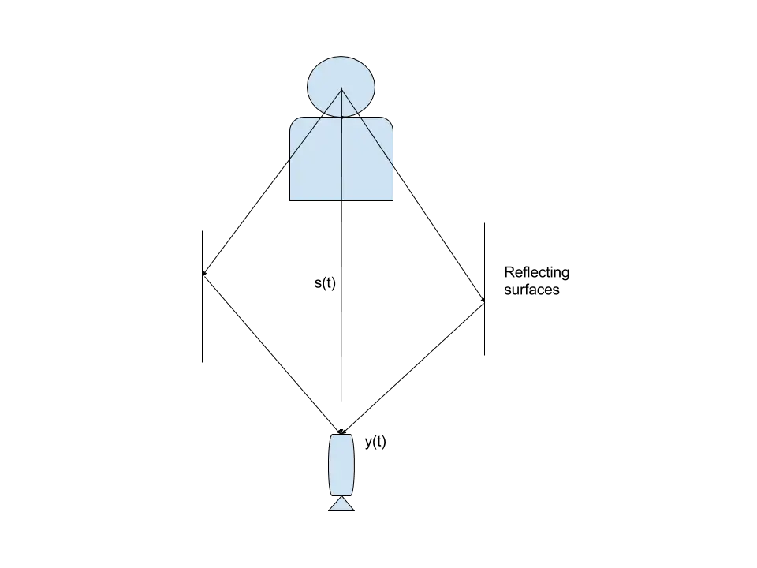

Figure 1.1: The reason for reverberation. Along with the source signal,
several of its reflections from nearby surfaces are also recorded by the
microphone

An example of a room impulse response is shown in Figure 1.2. Each peak
in the figure corresponds to a reflection arriving at the microphone
after the original signal has arrived. Clearly there are a series of
prominent reflections, temporally close to the direct signal(which
arrived at time t=0), followed by weaker reflections which persist, at
time up to 1000ms after the direct signal has died down. The
reverberation time for typical office or home environments ranges from
200ms to 1000ms.

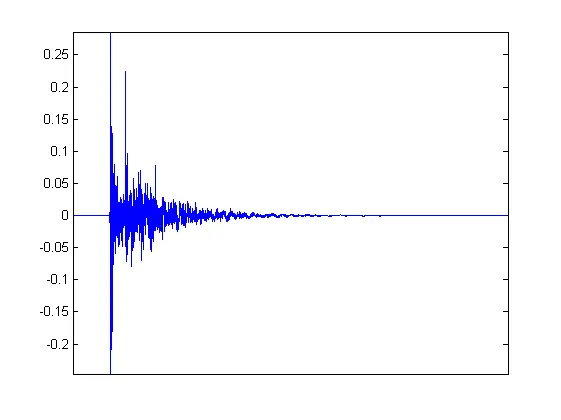

Figure 1.2: An example of a typical time domain room impulse response.
The strength of the reflections decays with time

### 1.2 Automatic speech recognition and reverberation

The aim of this section is to give an overview of an automatic
recognition system. It will also describe the broad categories of
dereverberation techniques. Figure 1.3 shows the schematic of a typical
automatic speech recognizer. The goal of the recognition process is to
transcribe speech correctly into text. This whole process can be divided
into two stages - the front end and the back end.

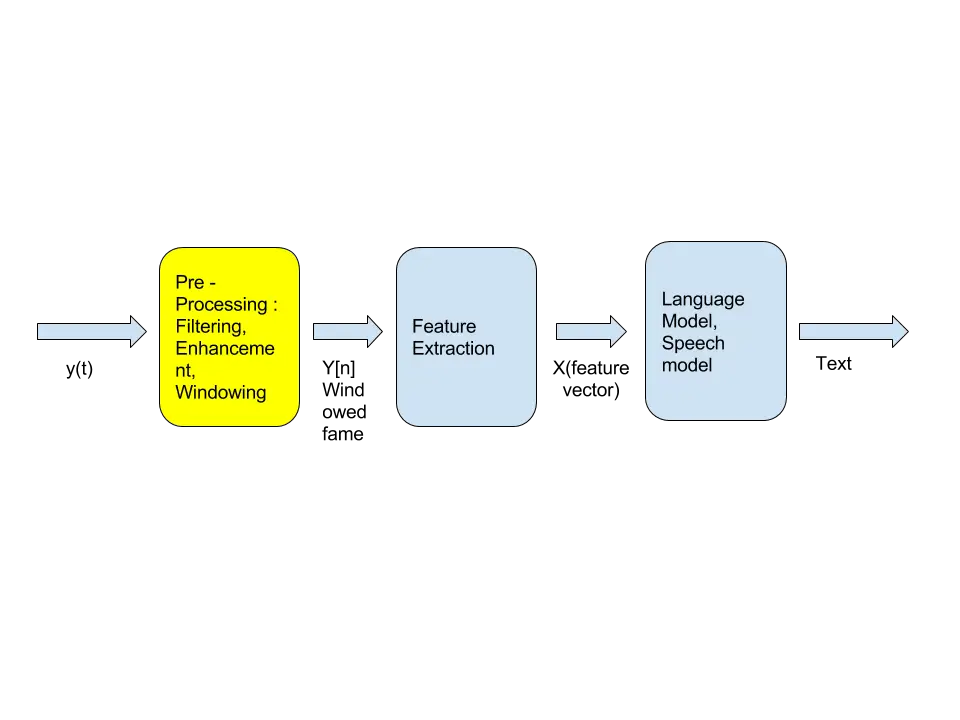

Figure 1.3: Schematic of an ASR system. All algorithms discussed here
are applicable to the Pre-processing stage

At the front end, necessary pre-processing is done to extract useful
information for further processing and making the speech signal more
compact by discarding irrelevant information and noise. The
pre-processing stage attempts to make the incoming speech as independent
of the room acoustics and the speaker, as possible for easy recognition.
The common steps carried out at this stage are sampling, windowing,
denoising and speech enhancement.

The next critical step is feature extraction from the windowed and
enhanced speech. Some information in the speech signal is not relevant
to the recognition process. Thus, relevant features have to be extracted
from the windowed signal. Furthermore, selecting a few features also
reduces the dimensionality of the input data reducing computation time.
Some prominent features such as the Mel-Cepstral features and wavelet
domain features are used in almost all modern ASR applications. These
features are extracted from windowed time frames of upto 40ms because of
the quasi-stationary nature of speech in that time frame. That is, each
segment of speech that is , say for instance, 30ms long is used to
extract one feature vector.

After the incoming speech has been converted into a feature vector
$`X`$, the ASR system has to estimate the sequence of words $`w`$, that
would have given rise to $`X`$. It is here that acoustic and language
models for speech are deployed. An acoustic model can, given a feature
vector, predict the sound or phoneme that was uttered by the speaker and
the language model provides the understanding of the language i.e. a
probability distribution over sequences of words. Mathematically, after
the the signal $`y(t)`$ has been converted into a feature vector
$`x_{n\in T}`$, where $`T`$ is the temporal the ASR system arrives at
the correct transcription by solving the equation

```math
\displaystyle w^{*}=argmax_{w}p((X_{n})_{n\in T})p(w) \tag{1.2}
```

Here, p(w) gives the likelihood of observing $`w`$ in the present
sequence of words and comes from the language model.
$`p((X_{n})_{n\in T})`$, on the other hand quantifies the likelihood
that $`X`$ would be observed, if $`w`$ was indeed spoken. This comes
from the acoustic model.

As mentioned earlier, the performance of the system depends on the
quality of the features extracted. Typically, features are extracted
from windowed segment of speech of length of 10-40ms because of
quasi-stationary nature of speech in that duration. On the other hand,
reverberation, as we have seen, can have deteriorating effects on the
quality of speech, and thus the features extracted for upto 1000ms. This
means that the impact of reverberation can last several frames. This
poses a unique challenge and cannot be addressed like ordinary noise
which is not correlated beyond a few ms.

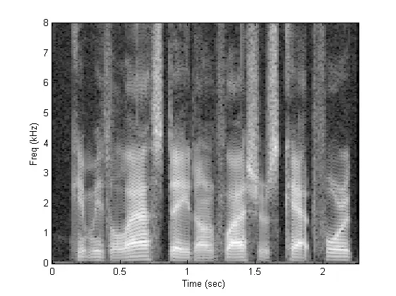

Figure 1.4: Magnitude spectrogram of a speech signal without any
reverberation

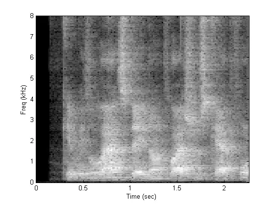

Figure 1.5: Magnitude spectrogram of the speech signal with
reverberation.

Figure1.4 and 1.5 show the effect of reverberation on the magnitude
spectrogram of a speech signal due to reverberation. Clearly, there is a
‘smearing’ effect, apparent in the magnitude domain as well as the
feature domain. The reverberation caused by a single segment of speech
can distort features for several subsequent frames, depending on the
Reverberation Time. This distortion of features causes the ASR to
function sub-optimally. Techniques to tackle noise cannot be directly
deployed to tackle this since reverberation distortion is non-stationary
as well as correlated with the real speech signal.

The ways to tackle reverberation can be separated into two broad
approaches - front end and back end approaches. Front end approaches aim
at cleaning the reverberation away from the feature vectors which can
then be fed into the back-end of the speech recognition system, which
works as it does for clean speech. Back-end techniques on the other hand
aim at changing the acoustic model or change the decoding scheme for the
feature vectors to account for reverberation.

Here, the focus is only going to be on front end based approaches.
Further, although the choice of features to be extracted is a critical
component of the recognition process, that line of investigation is not
explored here. Since majority of the features are derived from the
magnitude-spectrum of the speech signal (eg. MFCC coefficients), only
those techniques which propose to enhance and remove the effects of
reverberation the magnitude spectrum have been explored. The phase
information will be discarded in all the following investigations from
the spectrogram. This has an added advantage of making the processing
independent of speaker movement since slight movements will only change
the phase of the spectrogram.

Also, it will be hereon assumed that only a single microphone is used
for the recording, and no prior information about the speaker, the
surroundings or the microphone is known. Thus the exact problem that is
going to be addressed is Single Channel Blind Dereverberation.

However, much work has been done on modeling speech. There are a few
universal properties that apply to all speech signals. We will put these
properties to use to model clean speech better and thus improve
dereverberation performance for some algorithms. Although, the room
impulse response in much more difficult to model, a few simplifying
assumptions will be made.

The next chapter, Chapter 2 will conceptually describe Non-Negative
matrix factorization(NMF) and its application to speech processing.
Chapter 3 discusses popular dereverberation techniques and how NMF
factorization of speech magnitude spectrograms can improve the
efficiency of these algorithms.

## Chapter 2  NMF in speech processing

Non-Negative matrix decomposition or factorization is an algorithm where
the objective is to approximate the given non-negative data matrix
$`V\in\mathbb{R}^{\geq 0,M\times N}`$ as a product of two non-negative
matrices. the basis vector matrix, $`W\in\mathbb{R}^{\geq 0,M\times R}`$
and the activation matrix $`H\in\mathbb{R}^{\geq 0,N\times R}`$.The
parameter $`R`$ specifies the rank of the decomposition and depends on
the complexity of the matrix $`V`$ that is being decomposed. NMF has
been widely used in audio processing where it is applied on the
magnitude spectrogram. The Magnitude spectrogram is inherently
non-negative, and thus lends itself well to the NMF algorithm. Since the
problem of NMF does not have an analytical solution, a numerical
approximation is generally used. Specifically, an objective function is
chosen that quantifies the approximation error and using the gradient
descent algorithm, minimum error is achieved. Thus, the NMF problem can
be modeled as a constrained optimization problem, where the objective is
to minimize the error of reconstruction of the original data matrix
$`V`$. In this chapter, the Kullback-Leiber divergence has been used to
measure the error since it has a special significance for speech
spectrograms. It is defined as -

```math
\displaystyle D=\left\|V\odot ln\left(\frac{V}{W.H}\right)-V+W.H\right\| \tag{2.1}
```

$`\left\|\cdot\right\|_{F}`$ in the Forbenious norm, $`V`$ is the data
matrix being factorized and $`W`$ and $`H`$ are the factors. This error
has to minimized subject to the non-negativity constraints to achieve an
accurate approximation. Thus, this is a contrained optimization problem.
In \[1\] a multiplicativs update rules for $`W`$ and $`H`$ matrices that
assures convergence to minimum error. They as given as

```math
\displaystyle H=H\odot\frac{W^{T}\cdot\frac{V}{W\cdot H}}{W^{T}\cdot 1} \tag{2.2}
```

```math
\displaystyle W=W\odot\frac{\frac{V}{W\cdot H}\cdot H^{T}}{1\cdot H^{T}} \tag{2.3}
```

$`\odot`$ is the Hamdard product, all divisions are element wise and
$`1`$ is a $`M\times N`$ matrix with all elements set to 1.

The steps to calculating the Non-Negative matrix factorization of a
given data matrix, $`V`$ are given as -

- •
  Randomly initialize the $`W\in\mathbb{R}^{\geq 0,M\times R}`$ and
  $`H\in\mathbb{R}^{\geq 0,N\times R}`$ with non negative values and
  with an appropriate value for the rank of the decomposition $`R`$
- •
  Apply multiplicative updates to the matrices as in Equations 2.2 and
  2.3 and calculate error at every iteration.
- •
  Stop after the error is lesser than a present threshold. Since the
  error converges to a finite positive value which will be unknown
  before the decomposition, and a relatively small tolerance level might
  not let the algorithm terminate, it is advisable to use the number of
  iterations as a parameter to set the endpoint for the algorithm.

### 2.1 Illustration of NMF for audio

In Figure 2.1, shows the spectogram of an instrumental piece of music,
played on a piano, with 4 distinct notes, some played multiple times.
The duration of the audio is 4.7 seconds and has been sampled at
$`16kHz`$. NMF was applied on ,$`V`$, the magnitude spectrogram of the
audio signal, shown in Figure 2.1. Figure 2.2 shows the spectrogram of
$`\hat{V}\approx W.H`$. The number of basis vectors ($`R`$) was chosen
to be 5 and NMF was allowed 100 iterations.

Visually, it seems apparent that NMF has done a good job of representing
the spectrogram with a limited number of basis. The reconstructed audio
has no perceptible artifacts \[2\]. This is to be expected because the
data has a simple structure in terms of the temporal patterns in the
spectrogram. The structure is due to the fact that non-percussion
instruments like the piano have a finite number of notes and each note
has a unique fundamental frequency and predefined harmonics.These
qualities do not extend to speech signals. This makes it difficult for
the conventional NMF approach to do well in the speech scenario.

The two matrices, $`W`$ and $`H`$ have special significace when NMF is
applied to the magnitude spectrogram. $`W`$ is the matrix whose columns
are the basis set for $`\hat{V}`$. $`H`$ is a stack of set of row $`R`$
row vectors that constitute the weights corresponding to each basis
vector across the time axis of the magnitude spectrogram. $`W`$ is
called the basis vector matrix and $`H`$ is called the activation
matrix, since it determines where on the time axis of the manitude
spectrogram, a particular basis vector is ’activated’.

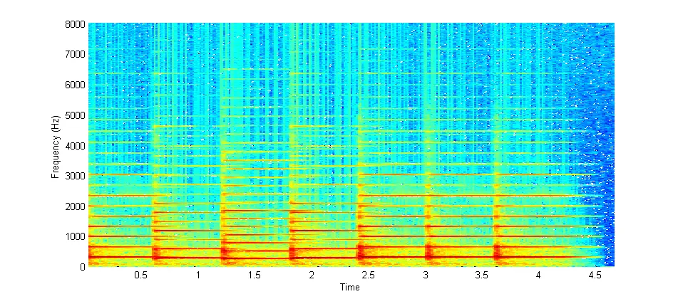

Figure 2.1: Spectrogram of _Mary_. Key STFT parameters - Sampling
frequency : $`16000kHz`$. Window : hanning window of length 1024
samples. Overlap : 756 samples. FFT size 1024

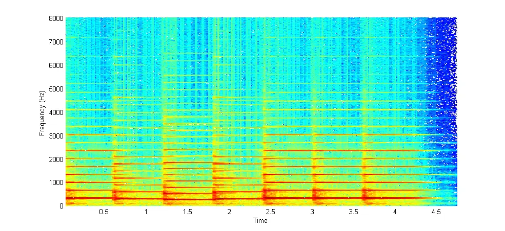

Figure 2.2: Reconstructed Spectrogram of _Mary_. Key STFT parameters -
Sampling frequency : $`16000kHz`$. Window : hanning window of length
1024 samples. Overlap : 756 samples. Size of fft: 1024

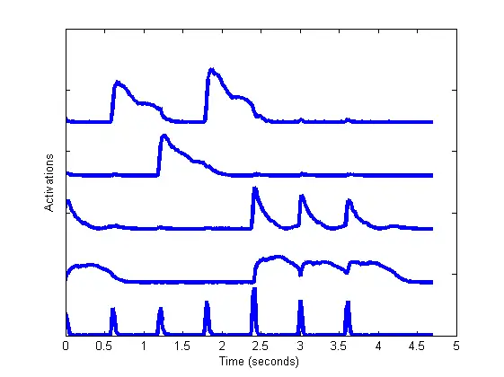

Figure 2.3: The activation vectors corresponding to each basis vector

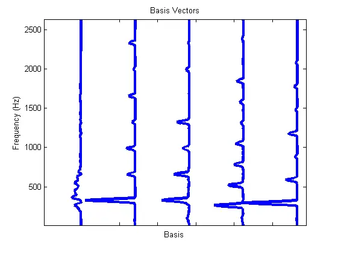

Figure 2.4: Basis vectors. A total of 5 basis vectors were used. A
zoomed version is shown to show the differences in frequencies

Figure 2.3 and 2.4 show the activation times for each basis vector and
the the basis vectors respectively. The activation vectors for the basis
vectors from left to right are shown from bottom to top. It should be
noted that the basis vectors are in fact magnitude spectra.

Refering to Figure 2.3 and 2.4, and analysing the activation times, we
find that we can map them to the pattern of playing of a specific note
at particular time instants. For example, the rightmost basis vector in
the Figure 2.4 (corresponding to the topmost activation vector in Figure
2.3) gets activated at two time instants which are actually
approximately the times of playing of a single specific note in the
audio. It can also be seen that no other basis vector is getting
activated during the period of activation of this basis vector. It
follows that this basis vector has captured the expression of this note
in the spectrogram. This is made clear when the audio reconstruction of
the spectrogram achieved by setting all other activations to zero is
heard \[2\].  
Not all basis vectors though capture single notes this cleanly. Looking
at the activations, it is also evident that the basis vectors
corresponding to two activations (3rd and 4th from the top) get
activated together whenever a particular note is played. To get the full
expression of this note, we need both these basis vectors.  
Also, the basis vector corresponding the the bottom most activation
vector does not represent any single note, but is activated at the times
of change of note. It can be inferred that this basis vector represents
the complex part of the spectra when a note is just struck and the power
is spread throughout the spectrum, just like in a percussion instrument.

### 2.2 Convolutive NMF

Figures 2.5-2.6 correspond to an audio sample, _Machali_\[2\]. It is an
audio which is a speech recording of the sentence, _”Machali jal ki hai
rani, jeevan uska hai paani”_, in Hindi. It is 4.7 seconds long and is
sampled at 16kHz. The figures represent the magnitude spectrogram of the
original audio, the reconstructed spectrogram via NMF using $`R=8`$, the
activation matrix and the basis vectors, in that order. Although the
duration of the audio is the same as _Mary_, to achieve the same
accuracy, we need 8 basis vectors to represent the magnitude spectra.
This is intuitive since speech signals have complex spectrogram patterns
and thus have a higher rank than that of an instrumental piece, like
_Mary_.

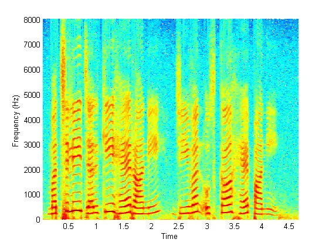

Figure 2.5: Spectrogram of _Machali_. Key STFT parameters - Sampling
frequency : $`16000kHz`$. Window : Hanning window of length 1024
samples. Overlap : 756 samples. Size of fft: 1024

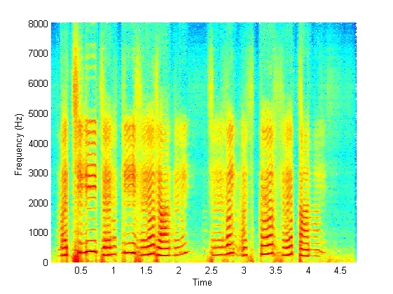

Figure 2.6: Reconcstructed Spectrogram of _Machali_. Key STFT parameters
-, Sampling frequency : $`16000kHz`$. Window : Hanning window of length
1024 samples. Overlap : 756 samples. Size of fft: 1024 . R = 8 basis
vectors were used to factorize the audio. Notice the almost identical
magnitude spectrogram to that of the original signal spectrogram

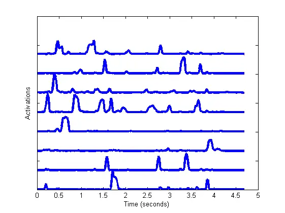

Figure 2.7: Activation vectors for Machali

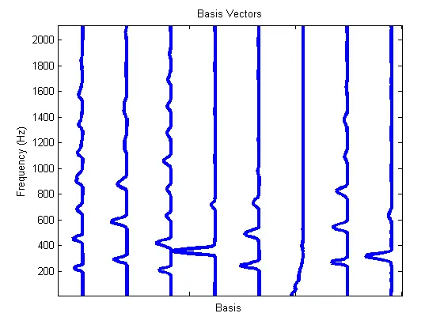

Figure 2.8: Basis Vectors for machali

When reconstructing the speech audio using NMF, although the error,
$`D`$(KL divergence) is approximately equal, the audio reconstruction
quality has several artifacts which is apparent on listening to the
reconstructed audio\[2\].  
Also, by looking at the basis vectors and activations, it is not
possible to do an an intuitive analysis of the structure of the audio,
as was done in the case of pure instrumental sounds in _Mary_, partly
because the activation patterns are much more complex and at many time
instants, multiple basis vectors are activated. The basis vectors also
themselves do not reveal much about the speech spectrogram , and there
is no apparent pattern in the activations that would indicate temporal
patterns in the speech signal. This calls for an extension to the
conventional NMF by introducing a convolutive NMF model\[3\]\[4\]. Here,
instead of each basis vector being a single spectrum, it is a series of
consecutive spectra. The $`W`$ matrix, instead of being a 2-D matrix is
a tensor of rank 3 of dimension $`M\times R\times T`$. The
reconstruction in terms of W and H is now given as -

```math
\displaystyle V\approx\sum_{0}^{T-1}W^{T}\stackrel{{\scriptstyle t\rightarrow}}{{H}} \tag{2.4}
```

The $`t\rightarrow`$ is the shift operator which represents shifting of
the columns to the right by t steps. The updated multiplicative updates
are as given in \[3\]. T represents the length of each basis _pattern_
(instead of basis _vector_). By adding a temporal dimension to the basis
vectors, they have been more expressive in terms of representing
patterns in the spectrogram and help capture trends in the temporal
dimension which were obscured in the activation vectors in the
conventional NMF approach.

This convolutive version of the NMF was applied on the same audio,
_Machali_, and the results are shown in Figures 2.9-2.12 . They
represent the spectrogram of the original audio, the reconstructed
spectrogram, the activation matrix and the basis vectors respectively.
All the parameters remained the same (Refer Figure 2.10) and the value
of $`T`$ i.e. the length of each basis pattern was chosen to be 8
samples in the spectrogram domain, which, given the STFT parameters,
translates to almost 0.17 seconds in the time domain. Although such a
basis length is not entirely reasonable since speech is stationary only
upto time segments of around 40ms, the choice is deliberately made for
demonstration purposes.


Figure 2.9: Spectrogram of _M_. Key STFT parameters - Sampling frequency
: $`16000kHz`$. Window : hanning window of length 1024 samples. Overlap
: 756 samples. Size of fft: 1024

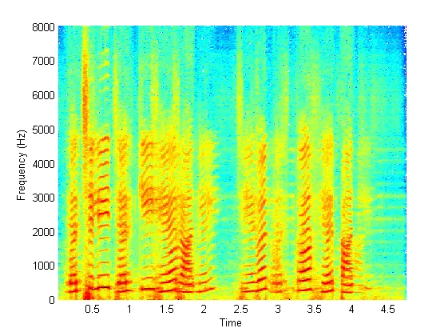

Figure 2.10: Reconstructed Spectrogram of _Machali_. Key STFT
parameters - R : 8, T = 8.Sampling frequency : $`16000kHz`$. Window :
hanning window of length 1024 samples. Overlap : 756 samples. Size of
fft: 1024

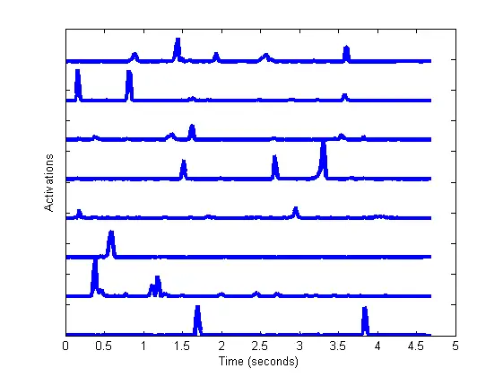

Figure 2.11: Activations for Machali

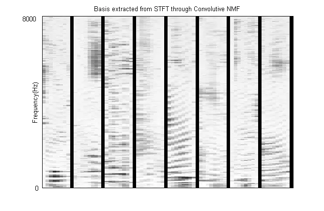

Figure 2.12: Basis patterns for Machali

The basis extracted using convolutive NMF are shown in Figure 2.12. It
is evident that the basis patterns say a lot more about the audio than
their counterparts in in conventional NMF. Some of the bases look like
spectrograms of speech phones in that they represent the harmonics with
various pitch inflections. An audio reconstruction confirms that some
basis patterns do represent specific speech phones\[2\] Also, since the
activation matrix is much more sparse in this case, when compared to
that of the conventional NMF (Figure 2.7). This enables us to pinpoint
the exact contribution of each basis to the spectrogram. The convolutive
model has more effectively captured the structure of speech and has
provided a much more revealing set of basis objects. The performance of
this technique relies heavily on the choice of the two key parameters -
the number of basis($`R`$) and the time-length of each basis($`T`$). Not
much work has been done regarding the choice of these parameters for a
given signal. While it is intuitive that having more basis will always
increase the accuracy of reconstruction, it also increases the time
complexity of the decomposition and the marginal gain in accuracy may
not be worth the complexity after a certain point. Although the
convolutivs NMF model does not do as well as NMF as far as
reconstruction error is concerned, it has been employed in source
separation \[3\] and dereverberation \[5\]. Thus, this representation
for speech can be helpful in a few applications. The next chapter will
describe a popular approach for dereverberation through factorizing the
magnitude spectrogram.

## Chapter 3  Dereverberation using NMF

In the time domain, reverberation is modeled simply as the convolution
between the source signal and the room impulse response.

```math
\displaystyle y(t)=s(t)*h(t) \tag{3.1}
```

Here, $`s(t)`$ is the original speech signal, $`h(t)`$ is the impulse
response of the room, henceforth mentioned as the RIR(Room Impulse
Response) and $`y(t)`$ is the observed speech signal. It is assumed that
the room impulse response $`h(t)`$ does not change with time. This
implies that the system modeled is a linear time-invariant (LTI) system.
In the time domain, inverse filtering techniques have been developed to
recover clean speech from reverberant speech through application of an
adequate adaptive filter. The objective is to calculate $`h(t)`$, the
room impulse response and apply its inverse filter to $`y(t)`$ to obtain
$`s(t)`$. One major issue with time domain filtering is its lack of
robustness against speaker movements, which cause a change in the phase
of the signal, changing the RIR, i.e. $`h(t)`$. This is why, we have
chosen the magnitude spectrogram domain to model and remove reverberant
effects from speech. That is, given a spectrogram corresponding to a
speechs signal which is recorded in a reverberant environment, the
objective will be to counter the effects of reverberation and estimate
the magnitude of the clean speech signal. As discussed in Chapter 1,
there is an evident smearing effect in the spectral feature domain
because of reverberation. This is exactly the intuition for the class of
techniques that are discussed henceforth.

### 3.1 Non negative matrix factor deconvolution (NMFD)

Consider a signal $`y(t)`$ which is a recorded version of a source
signal $`s(t)`$ in a reverberant environment. $`Y`$ is the magnitude
spectrogram, obtained by taking the short time fourier transform (STFT)
of $`y(t)`$. Given $`Y`$, the task is to estimate $`X`$, which is the
magnitude spectrogram of the clean speech signal. A basic model for the
relating these two magnitude spectrograms is \[6\] \[7\]-

```math
\displaystyle Y_{k}[n]\approx Y_{k}[n]^{\prime}=\sum_{\tau=0}^{\tau=L-1}X_{k}[n-\tau]*H_{k}[\tau] \tag{3.2}
```

Here, $`Y_{k}`$ is the $`kth`$ frequency sub-band of $`Y`$, similarly,
$`X_{k}`$ is the $`kth`$ frequency sub-band of $`X`$ and $`H_{k}`$ is a
sub-band filter, of length $`L`$ which models the smearing of the clean
spectrum sub-band. It is $`H_{k}`$ and $`X_{k}`$ that have to be
estimated from the given $`Y_{k}`$, under reasonable constraints.
Although in much of the literature, $`H`$, is said to be the STFT of the
room impulse response $`h[n]`$, there is little evidence in literature
that it has any obvious relation to the actual room impulse response .
For now though, it will be called the RIR and its relationship with the
actual room impulse response will be discussed later. $`\hat{Y}`$, which
is the approximation of the magnitude spectrogram of reverberant speech,
$`Y`$, can have an infinite number of decompositions, $`X`$ and $`H`$
which satisfy the above equation. Not all of the solutions though, will
give us an estimate of the clean speech magnitude spectrogram and the
RIR respectively. Thus, constraints have to be used to narrow the
solutions to get more meaningful results. More specifically, we need to
ensure that $`X`$ resembles a speech spectrogram and $`H`$, a room
impulse response spectrogram.

It has been established that speech magnitude spectrograms are sparse
across speakers and utterances. This property has been used in \[6\]
\[7\]\[8\] to arrive at a cost function that gives a quantitative
measure of the distance from a desirable solution. The cost function is
defined as-

```math
\displaystyle f(X,H)=\sum_{k,t}(Y_{k}[t]-Y^{\prime}_{k}[t])^{2}+2\lambda\sum_{k,t}|X_{k}[t]| \tag{3.3}
```

The first term signifies the squared sum of the distances of the
coefficients of $`Y`$ and $`Y^{\prime}`$ and the second term enforces
sparsity of the clean speech spectrogram.Fpr the underlying assumptions
and derivation for this cost function, see \[6\]. Clearly, a closed-form
solution to the above equation is not possible for (3.3) This problem
that is similar to the problem of Non-negative Matrix Decomposition(NMF)
discussed in Chapter 2, where a similar cost function was used. To
minimize the cost function, we used the gradient descent algorithm to
arrive at iterative multiplicative updates which converged to a
solution. Similarly, for the cost function in (3.3), multiplicative
updates can be derived for $`X`$ and $`H`$ as well. With the sparsity
constraint on $`X`$, the iterative multiplicatssive updates for the
dereverberation problem are given in \[6\] as

```math
\displaystyle X_{k}[\tau]=\hat{X}_{k}[\tau]\frac{\sum_{t}\hat{H_{k}}[t-\tau]Y_{k}[t]}{\sum_{t}\hat{H_{k}}[t-\tau]\hat{Y^{\prime}_{k}}[t]+\lambda} \tag{3.4}
```

```math
\displaystyle H_{k}[\tau]=\hat{H}_{k}[\tau]\frac{\sum_{t}\hat{X_{k}}[t-\tau]Y_{k}[t]}{\sum_{t}\hat{X_{k}}[t-\tau]\hat{Y^{\prime}_{k}}[t]} \tag{3.5}
```

Here, $`\hat{H}`$, $`\hat{Y}`$ and $`\hat{X}`$ are the estimates from
the previous iteration. These updates are based on the gradient descent
algorithm that converges to a local minimum. No specific property for H
is exploited, to avoid scale ambiguity, the sum of the coefficients of
each sub-band is scaled down to sum to one i.e.
$`\sum_{t}H_{k}[t]=1\ \ \forall k`$. This constraint is not imposed in
the updates. Rather after each iteration, each row of H is normalized to
account for this constraint. For speech, the only property that has been
used to enforce a constraint on $`X`$, is its sparsity in the magnitude
spectrogram domain. In the next few sections, we modify the above
approach to incorporate specific properties.

### 3.2 Activation Deconvolution

The technique of non-negative matrix factorization efficiently separates
the temporal and the spectral features of the magnitude spectrogram of
the speech signals in the activation matrix and the basis vectors
respectively. Reverberation can be modeled as a largely temporal
phenomenon where delayed and attenuated versions of the signal corrupt
the recorded signal. Our hypothesis is that since reverberation is a
temporal phenomenon, its effects will be localized to the temporal part
of the non-negative factors, which is the activation matrix

Figures 3.3 and 3.4 are the activation patterns for two speech
signals.Figure 3.3 shows the activation pattern that was obtained by
applying NMF on a sentence recording from the TIMIT database. Figure 3.4
on the other hand shows activation patterns for the same audio signal,
with reverberation added. There is a strong correlation between the
activation patterns. We hypothesis that an activation vector for the
clean speech spectrogram, $`A_{i}`$, corresponding to a basis vector
$`i`$ undergoes the following transformation when reverberation is added
to the clean speech signal.

```math
\displaystyle A_{i}^{reverb}(t)=A_{i}(t)*h(\tau) \tag{3.6}
```

Therefore, given the reverberant signal, we can obtain the activation
vectors $`A_{i}^{reverb}`$ . Then using the Non-Negative factor
deconvolution technique, presented in the previous section, $`A_{i}`$
can be isolated. Notice how this equation is similar to Equation 3.2.
Thus, we use the same updates in Equations 3.4 and 3.5 to estimate the
clean speech activation vector $`A_{i}(t)`$ from the reverberant
activation vectors $`A_{i}^{reverb}`$. A spectrogram is then
reconstructed using these activations. Figure 3.1 shows the spectrogram
of a speech signal from the TIMIT database with added reverberation.
Figure 3.2 shows the spectrogram obtained after the activations were
processed using the above mentioned algorithm. It can be clearly seen
that the smearing of the spectrogram has been visibly reduced.

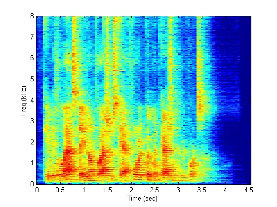

Figure 3.1: Spectrogram for a reverberated speech signal. Key
parameters - Sampling frequency : $`16000kHz`$. Window : hanning window
of length 1024 samples. Overlap : 512 samples. Size of fft: 1024

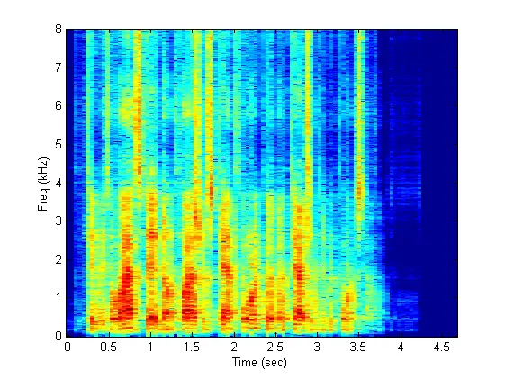

Figure 3.2: Spectrogram after the activations were processed. Notice the
reduction of the spectrogram smearing from Figure 3.1 . Key parameters -
Sampling frequency : $`16000kHz`$. Window : hanning window of length
1024 samples. Overlap : 512 samples. Size of fft: 1024

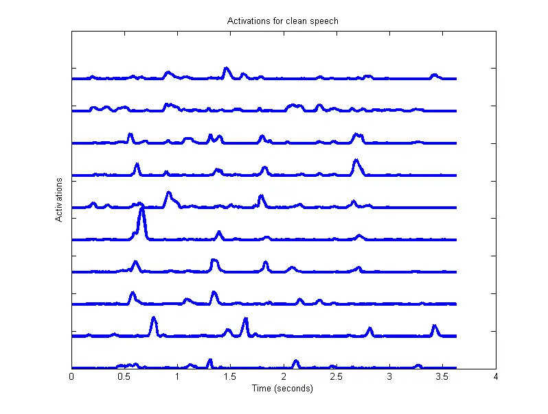

Figure 3.3: Activations in clean speech

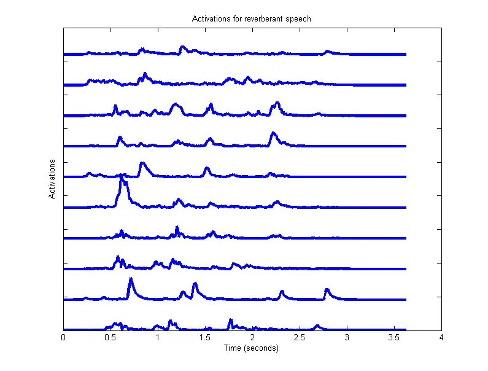

Figure 3.4: Activations in reverberant environment

### 3.3 NMFD using NMF model for speech

The imposition of constraints in NMFD ensures that the solution
converges to a clean speech spectrogram. A better model for speech or
RIR($`X`$ and $`H`$ respectively) will ensure convergence to a better
solution. In section 3.1, we have only exploited that speech is sparse
in the magnitude spectrogram domain. NMF has been shown to be an
efficient way to represent speech by decomposing it into factors with
significantly less dimensions. It is based on the assumption that speech
spectrograms are low rank. NMF tries to find an encapsulating basis
vector set to represent the whole spectrogram. This representation has
been shown to work in separation \[3\] and dereverberation \[5\] very
well. We now incorporate this representation into the Non-Negative
factor deconvolution model discussed in the previous section as
suggested in \[7\].

Given input magnitude spectrogram, $`Y`$, of a time domain reverberated
signal, $`y(t)`$ we can use NMF to decompose into a basis matrix $`W`$
and an activation matrix $`X`$ such that $`S=W*X`$ and $`Y\approx S`$.
Now, we will introduce a cost function, as given in \[7\], which
quantifies the distance of the current estimate from the desired
solution. This cost function is based on the Kullback-Leiber(KL)
divergence, which has been shown to be better suited to speech
applications than the sum squared error used in \[6\]. The cost function
using KL divergence, without including the NMF representation for speech
is given by -

```math
\displaystyle f(Y,S,H)=\sum_{k,t}KL(Y(k,t)\ |\ \sum_{\tau=0}^{L}H(k,\tau)S(k,t-\tau))+\lambda\sum_{k,t}S(k,t) \tag{3.7}
```

$`L`$ is the length of the RIR in the spectrogram domain. $`\lambda`$ is
the sparsity parameter. Now, NMF models $`S`$ as a combination of two
matrices, $`W`$ and $`X`$. The modified cost function, incorporating
this relationship is -

```math
\displaystyle f(Y,W,X,H)=\sum_{k,t}KL(Y(k,t)|\sum_{\tau=0}^{L}H(k,\tau)\sum_{r=1}^{R}W(k,r)X(r,t-\tau))+\lambda\sum_{r,t}X(r,t) \tag{3.8}
```

For this modified cost function, the multiplicative updates for the
gradient descent algorithm are given in \[7\].

```math
\displaystyle H(k,\tau)=\hat{H}(k,\tau)\frac{\sum_{t}Y(k,t)\hat{S}(k,t-\tau)/\hat{Y^{\prime}}(k,t)}{\sum_{t}\hat{S}(k,t-\tau)} \tag{3.9}
```

```math
\displaystyle W(k,r)=\hat{W}(k,r)\frac{\sum_{t,\tau}Y(k,t)H(k,\tau)\hat{X}(r,t-\tau)/\hat{Y^{\prime}}(k,t)}{\sum_{t,\tau}H(k,\tau)\hat{X}(r,t-\tau)} \tag{3.10}
```

```math
\displaystyle X(r,t)=\hat{X}(r,t)\frac{\sum_{t,\tau}Y(k,t+\tau)H(k,\tau)W(k,r)/\hat{Y^{\prime}}(k,t+\tau)}{\sum_{k,\tau}H(k,\tau)W(k,r)+\lambda} \tag{3.11}
```

Here, $`Y^{\prime}[k,t]=\sum_{\tau}H[k,t]*S[k,t-\tau]`$ and $`S=W*X`$.
Also, $`\hat{Y^{\prime}},\hat{X},\hat{S}\ and\ \hat{H}`$ correspond to
the values of $`Y,X,S\ and\ H`$ from the previous iteration
respectively. After an appropriate number of iterations, an estimate for
the clean speech spectrogram is given as $`S=W*X`$. Including the NMF
representation into the NMFD approach improves the quality of the clean
speech spectrogram, $`S`$ \[7\]. This has been shown in literature and
will be demonstrated experimentally in Chapter 4. In the next section,
we incorporate another fundamental property of speech, namely, temporal
continuity.

### 3.4 Exploiting temporal dependencies of speech

In section 3.2 and 3.3, two properties of speech have been incorporated
into the dereverberation model, the sparsity of magnitude
spectrogramdomain and the low rank nature of the magnitude spectrogram
(through NMF decomposition). Temporal continuity is another property of
speech that can possibly be exploited to model the speech signal better.
In this section, two techniques will be discussed which model the
temporal dynamics of speech and can be implemented in a similar fashion
to the previous techniques with modifications to the update rules.

#### 3.4.1 Frame stacking

A frame stacked approach proposed in \[7\] is taken to exploit the fact
that the magnitude spectrograms is temporally dependent. A sliding
window of length $`T_{stack}`$ is passed through the time axis of $`Y`$
and each resultant frame is stacked to form a vector of dimension
$`K\times T_{stack}`$. These vectors are then put together to form a
higher dimensional matrix, $`\tilde{Y}`$. Now, $`\tilde{Y}`$ is
decomposed using NMF and the algorithm follows the same as in the
previous section. $`W`$ will now be a $`KT_{stack}\times R`$ matrix. The
multiplicative updates for $`W`$ and $`X`$ remain the same as in (3.10)
and (3.11), and the modified updates for $`H`$ as given in \[7\] are -

```math
\displaystyle H(k,\tau)=\hat{H}(k,\tau)\frac{\sum_{l=1}^{T_{stack}}\sum_{t}\tilde{Y}(f_{l},t)S(f_{l},t-\tau)/\hat{Y^{\prime}}(f_{l},t)}{\sum_{l=1}^{T_{stack}}\sum_{t}S(f_{l},t-\tau)} \tag{3.12}
```

Here, $`f_{l}=k+l(K-1)`$ . This update is essentially taking an average
over all the stacked up spectrograms for an estimate of $`H`$. After
convergence, the clean speech magnitude spectrogram is estimated as
$`S=G*Y`$ where G is the gain function given by -

```math
\displaystyle G(k,t)=\frac{\sum_{l=1}^{T_{stack}}\sum_{r}W_{final}(k_{l},r)X_{final}(r,t)}{\sum_{l=1}^{T_{stack}}\sum_{t}H_{stack}(f_{l},\tau)W_{final}(k_{l},r)X_{final}(r,t-\tau)} \tag{3.13}
```

The subscript final denotes that the values used are after all updates
have been done and the algorithm has converged. $`H_{stack}`$ is the RIR
matrix. The results and relative performance for this technique is
discussed in Chapter 4. As per our experiments, it does not improve the
performance of the algorithm discussed in the previous section. In the
next section, we introduce another technique through which the temporal
continuity of speech can be exploited.

#### 3.4.2 Convolutive NMF

Another way to exploit the continuous nature of speech signals is by
using the convolutive Non-negative matrix factorization . This technique
was discussed in Section 2.3 and is used to extend the the expressive
power of the basis vectors which constitute $`W`$ by adding to them a
temporal dimension. It has already been used in source separation and
enhancement applications. \[5\] uses the Convolutive model for
dereverberation, but relies on learning the basis offline. To include
this model for speech in the dereverberation algorithm, the modified
update equations are given as -

```math
\displaystyle X(r,t)=\hat{X}(r,t)\frac{\sum_{\alpha=1}^{T_{base}}\sum_{k,\tau}Y(k,t+\tau)H(k,\tau)W(k,r,\alpha)/\hat{Y^{\prime}}(k,t+\tau)}{\sum_{k,\tau}H(k,\tau)W(k,r)+\lambda} \tag{3.14}
```

The update equations for $`W`$ and $`H`$ remain the same. Here,
$`T_{base}`$ is the time length of the exemplars which comprise $`W`$.
These updates were adopted from \[5\] where they have been used to
achieve dereverberation is a supervised manner.

In this chapter, we have discussed four techniques to handle
reverberation in the magnitude spectrogram domain. Non-Negative Factor
deconvolution(NMFD) forms the core of all these techniques. Activation
matrix deconvolution is essentially NMFD applied on the activation
matrix instead of the speech spectrogram. Further, NMF representation
for speech is included in the NMFD technique. Then, to exploit the
temporal dependencies of speech, the frame stacked model and the
convolutive NMF representation were included. All these techniques are
implemented in very similar ways. Each of them has an associated cost
function which is to be minimized to get non-negative matrix factors
with desirable properties. Using the updates suggested by \[1\], each of
these cost functions are minimized using multiplicative iterative
updates.

In the next chapter the implementation details are presented and
performances of these techniques are compared based on two objective
measures - Perceptual evaluation of speech quality (PESQ) and Cepstral
Distortion(CD).

## Chapter 4  Experiments and Results

This chapter discusses the experiments done to evaluate the techniques
described in the previous chapter. The speech samples used were taken
from the TIMIT database \[9\]. 40 different sentences were chosen from
the database for this purpose. These were each sampled at 16kHz. To add
reverberation to these clean speech signals, room impulse responses
provided by the REVERB 2014 challenge were used. In particular 3 room
impulse responses from 3 rooms each with reverberation times (t60)
0.25s, 0.5s and 0.7s were used. Although these responses were recorded
using multiple channels, only one channel per room impulse response was
used here since these techniques apply to single channel
dereverberation. Reverberant speech signals we generated by convolving
clean speech signals with these room impulse responses. MATLAB was used
to implement all the techniques. The code for the NMFD algorithm
discussed in Section 3.1 was otained from \[8\]. All other techniques
have been implemented by us. For converting time domain signals into
magnitude spectrograms, a sliding square root hann window \[7\] length
64ms was used with an overlap of 16ms between frames.

All the techniques will be quantitatively compared on their performances
in dereverberating speech recordings. The techniques are applied to the
magnitude spectrogram of the reverberant speech input to obtain a clean
magnitude spectrogram. This spectrogram, using the phase information of
the input signal is then converted to the time domain. To quantify the
performance, the following key objective measures are used -

1.  1.  Perceptual evaluation of speech quality (PESQ)  
        PESQ is a widely used measure to judge the quality of speech as
        heard by humans. It uses the clean speech as a reference to score
        the output speech on its quality. A higher score indicates better
        quality of speech. The performance of a dereverberation technique is
        good if the PESQ score of the output is more than that of the input.
2.  2.  Cepstral distortion(CD)  
        Mel-cepstral coefficients are perhaps the most frequently used
        features for speech recognition. A distortion in the cepstral
        coefficients can thus significantly decrease performance in
        recognition. Therefore, an important measure of how much a speech
        signal has been affected by reverberation is the amount of
        distortion introduced in the cepstral coefficients. A quantitative
        measure of this is the Cepstral distortion.

### 4.1 Dereverberation using NMFD

For this technique, discussed in Section 3.1, the multiplicative updates
according to (3.4) and (3.5) were carried out for 20 iterations.
$`\lambda`$ , the sparsity parameter was fixed to be
$`\sum_{k,t}Y\times 10^{-8}`$ as suggested in \[6\]. However
experimentally, we found that having a sparsity constraint did not help
in improving algorithm performance. Initially, the clean speech
estimate, $`X`$ was set to be equal to $`Y`$ and $`H`$ was initialized
as a linearly decaying filter. The length of the filter, was fixed at
$`L=11`$ frames in the spectrogram, i.e. a time domain span of 352ms.
The average improvements in the PESQ scores and the CD scores are shown
in Figures 4.10 and 4.11. Figures 4.2, 4.3 and 4.4 shows the spectrogram
of the reverberant speech, the output clean speech and the output
filter, $`H`$. In the output spectrogram, smearing of the features is
reduced, specially in the sparser regions.


Figure 4.1: Clean speech Spectrogram


Figure 4.2: Reverberated Spectrogram

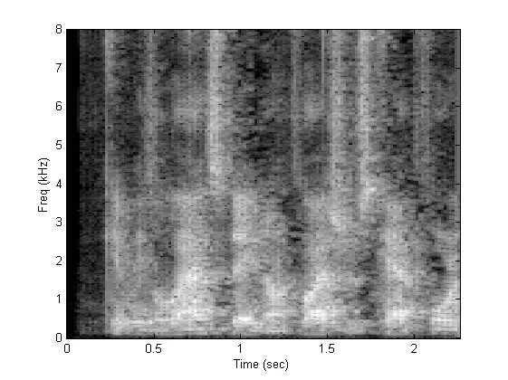

Figure 4.3: Dereverberated Spectrogram

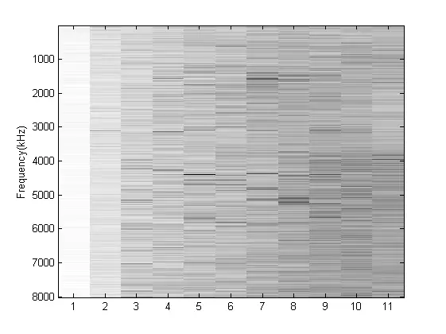

Figure 4.4: Recovered H filter. the filter length was chosen to be 11
frames. The sum of each of the rows of this H matrix is 1. The X axis
represents the frame numbers, where each frame is temporally equivalent
to 32ms.

The recovered H filter, in Figure 4.4, is displayed using a decibel
scale to make it seem more uniform. The initial values of the sub-band
filters are much larger than the later values by an order of magnitude.
To observe the variation of the performance of the algorithm with
varying lengths for the filter, H for each RIR, the length of the filter
was varied from 128ms to 640ms. The results are shown in Figure 4.5

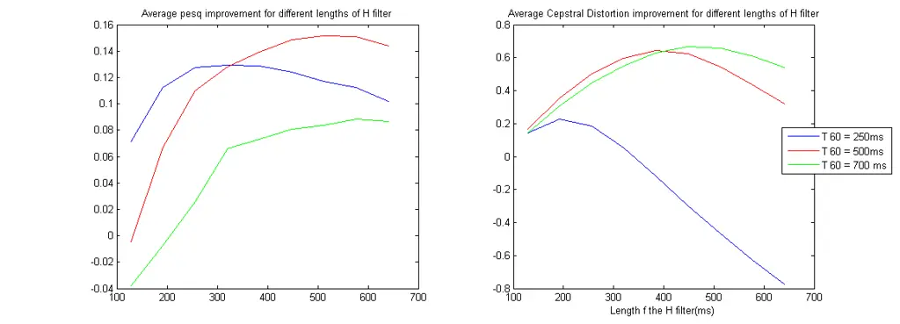

Figure 4.5: Varying the filter length for different T60. Higher T60
values had a higher performance for longer lengths of the H filter

It is clear from the results in Figure 4.5, that the length of the
filter H, has some correlation to the degree of reverberation in the
recorded speech signals. For a higher T 60, the PESQ and Cepstral
Distortion are best for greater lengths of $`H`$ when the T 60 is higher
and for lower lengths of $`H`$ for lower T 60 values. This makes
intuitive sense since a larger T 60 value implies that the effect of
reverberation on a frame affects frames further in the magnitude
spectrogram than it would if the T60 was lower.

### 4.2 Activation Deconvolution

The activation deconvolution technique was applied over the same 40
sentences from TIMIT database using the same updates used in (3.4) and
(3.5) for NMFD. The number of basis chosen was $`R=20`$ and the length
of the filter h(t) in Equation 3.6 was chosen to be $`L=11`$ frames,
which translates to 352ms. The output speech was measured for
improvement in PESQ, Cepstral Distortion and SRMR scores. The mean
results are shown in Figure 4.6.  
It can be seen that the cepstral distortion scores have improved for
T60s 500ms and 700ms. PESQ score has only increased for T60 500ms. There
are audible artifacts in the output sound as well. We infer that the
effectof reverberation on the activation vectors has not been modelled
appropriately through this approach. A better model for this is needed.

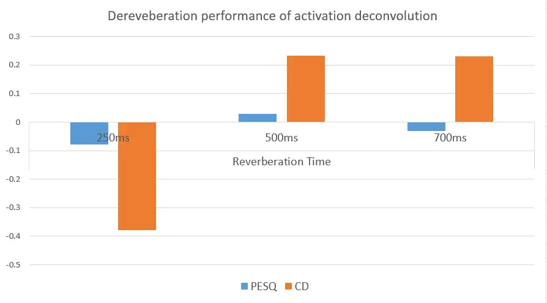

Figure 4.6: Results for the Activation deconvolution technique. The
improvements in PESQ and CD scores for different levels of reverberation
are shown. Note that a negative value indicates that the output is worse
than the reverberant input for the particular measure

### 4.3 NMFD using NMF model for speech

Including the NMF model for speech, the updates given by (3.8), (3.9)
and (3.10), were carried out for 20 iterations. The number of basis
vectors used to represent the speech signals, $`R`$, used was 10. Having
more number for basis vectors gave very marginal increase in performance
while adding to the computation time. This is clear from the increase in
the mean PESQ and CD performance improvement across the 40 senteneces
from TIMIT, shown in Figures 4.7 and 4.8. The sparsity parameter,
$`\lambda`$ was the same as in the previous section. The result for this
algorithm are shown in Figure 4.9, for one sentence from the TIMIT
database.

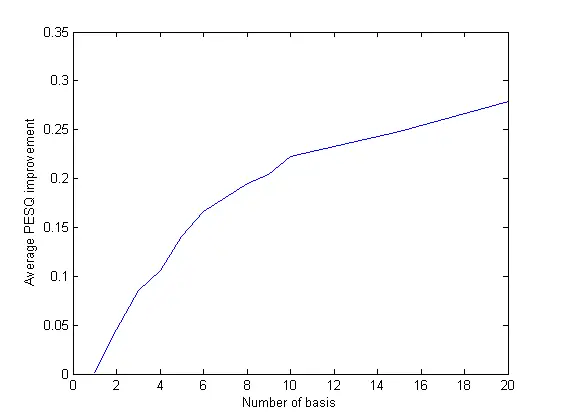

Figure 4.7: Number of basis on performance

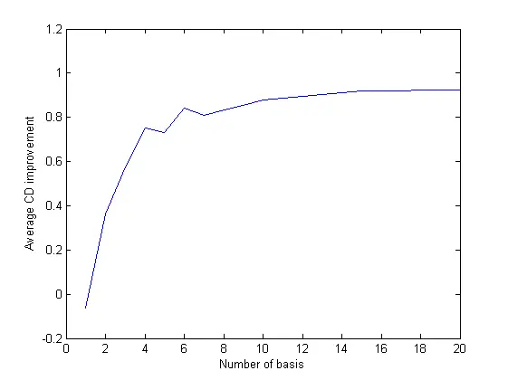

Figure 4.8: Number of basis on performance. Both figure 4.7 and 4.8
unequivocally suggest that more basis vectors in the NMF decomposition
will provide better results for dereverberation. However, the marginal
increase in performance after a certain number of basis is minimal

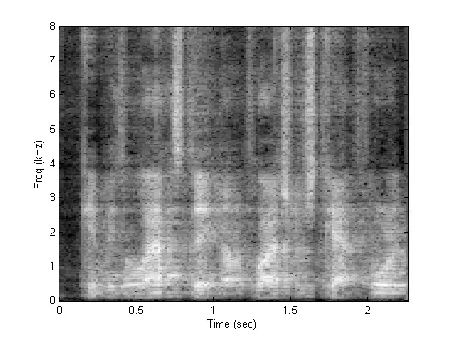

Figure 4.9: Output spectrogram for NMFD with NMF model

A comparative analysis is done, and the results reproduced in Figures
4.10 and 4.11 to show the improvements gained in the PESQ scores and
Cepstral Distortion Scores by introducing the NMF model for speech. It
can be seen that significant improvement in PESQ scores was observed.
The improvement in the Cepstral distortion scores was not significant.

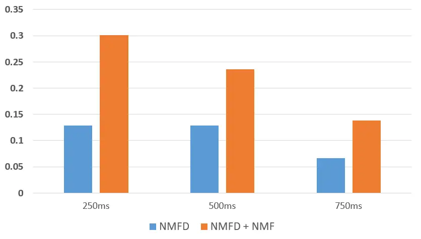

Figure 4.10: Output for NMFD with NMF model

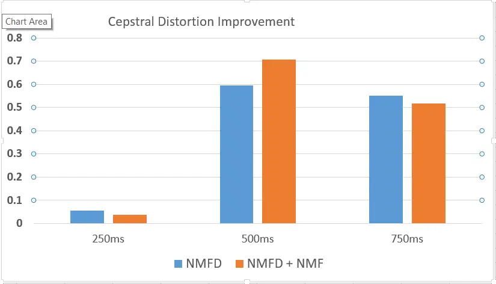

Figure 4.11: Output for NMFD with NMF model

### 4.4 Frame stacked model

The frame stacked model discussed in Section 3.4.1, aims to exploit the
temporal continuity of speech through stacking the magnitude domain
spectrogram in a sequential manner. The updates for this model are as
given in (3.12). The temporal context to use for stacking, quantified by
the variable, $`T_{stack}`$ . These updates are given 20 iteration to
converge and then, the gain function, $`G`$ is calculated using (3.13)
is calculated.

The results for the stacked model were not found to be promising. In
fact, performance gets worse even if $`T_{stack}=2`$. It does not
outperform the simple NMF model for any of the reverberant scenarios, as
far as improving the PESQ and the Cepstral Distortion scores are
concerned. This agrees with the results in literature where this model
has not been able to outperform the simple NMF model for speech.

### 4.5 NMFD and the Convolutive NMF model

This section discusses the results of NMFD with the Convolutive NMF
model used for speech. The modified updates for this approach are given
in (3.14). This approach has not yet been presented in any literature to
the best of our knowledge, although \[5\] has used the convolutive NMF
model as part of a supervised approach. The updates are derived on
similar lines as the stacked model. Again, of major importance is the
temporal context used. The length of the convolutive basis,
$`T_{base}`$, has a major influence on the algorithms performance.

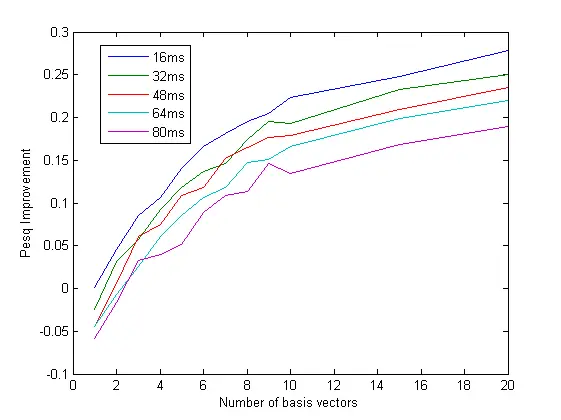

Figure 4.12: PESQ score versus number of bases(x-axis) and length of
bases(plot lines).Figures 4.12 and 4.13 show the improvement in
performance with increasing number of basis vectors, across different
basis lengths. A basis length of 16ms, which is equivalent to one frame,
implies a regular NMF. All other multiples of 16ms correspond to
convolutive basis vectors. Each plot line corresponds to a fixed length
of the convolutive basis

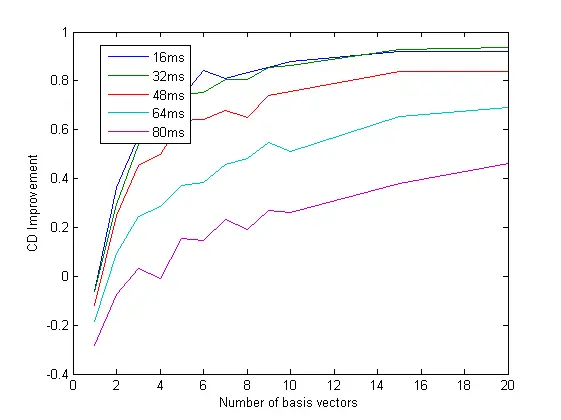

Figure 4.13: CD scores. Figures 4.12 and 4.13 show the improvement in
performance with increasing number of basis vectors, across different
basis lengths. A basis length of 16ms, which is equivalent to one frame,
implies a regular NMF. All other multiples of 16ms correspond to
convolutive basis vectors. Each plot line corresponds to a fixed length
of the convolutive basis

It is clear from Figures 4.12 and 4.13 that increasing the length of the
basis, $`T_{base}`$ has a detrimental impact on the performance of the
algorithm, both in terms of PESQ scores as well as Cepstral Distortion
scores but more number of bases is beneficial in both measures. Each
plot line, corresponding to a longer basis vector is lower than that of
one with a shorter one. It can be concluded that Convolutive NMF
representation of speech does not help in increasing dereverberation
performance.

### 4.6 Discussion

As per the measures, it is clear that NMFD, with an NMF representation
of speech is the best among all techniques for dereverberation. Our
hypothesis as to why it is so is that by applying the sparsity
constraint on the activations, rather than on the whole spectrogram, as
in NMFD, it has provided a better model for speech magnitude
spectrograms. Also, activation deconvolution, although does not do as
well as NMFD provided an alternative approach to tackle dereverberation
in the magnitude spectrogram domain. The approach, as it is now, also
introduces artifacts in the output speech. As far as exploiting the
temporal dynamics of speech is concerned, neither the frame stacked
model, nor the convolutive model improve the performance of the
algorithm as far as the objective measures are concerned. The
qualitative results obtained in this chapter corroborate with the
existing literature \[7\] although the exact improvements in objective
measures obtained are still not as high. This might be due to different
datasets used or difference in implementation details. The summary of
all the results is given in Table 4.1 and 4.2

|                             |          |          |          |
| --------------------------- | -------- | -------- | -------- |
|                             | T60      |          |          |
| Technique                   | 250ms    | 500ms    | 750ms    |
| NMFD                        | 0.1291   | 0.1283   | 0.0662   |
| NMFD + NMF                  | 0.301259 | 0.235671 | 0.138228 |
| Stacked model (T_stack = 3) | 0.135805 | 0.192561 | 0.094765 |

Table 4.1: Summary of the PESQ improvement by discussed techniques

|                             |        |        |        |
| --------------------------- | ------ | ------ | ------ |
|                             | T60    |        |        |
| Technique                   | 250ms  | 500ms  | 750ms  |
| NMFD                        | 0.0552 | 0.5963 | 0.5516 |
| NMFD + NMF                  | 0.0381 | 0.7068 | 0.5180 |
| Stacked model (T_stack = 3) | 0.0312 | 0.4021 | 0.4974 |

Table 4.2: Summary of the PESQ improvement by discussed techniques

## Chapter 5  Conclusions and Future Work

### 5.1 Conclusions

In this work, NMF based approaches to dereverberation has been studied
and tested. An attempt has been made to survey and reproduce results
found in literature and tweak the parameters to gain a better
understanding of why certain techniques work better. First, the NMFD
approach, which models reverberation using sub-band filtering works well
for dereverberation. The filter, $`H`$ captures the relation between the
source magnitude spectrogram and its reverberated version for each
frequency sub-band. Also, it is clear that better model for speech or
the room impulse response will definitely help in dereverberation. This
is verified by the fact that a better representation for speech, the NMF
representation improves the performance of NMFD. Convolutive NMF model
for speech, although intuitively is a good model for speech, does not
improve performance of the dereverberation algorithm. In general, for
unsupervised approaches to dereverberation or separation, the
convolutive model does not outperform the regular NMF model. It can be
concluded that having a more detailed set of basis is only beneficial to
capture more information about about the speech and thus is only useful
where a supervised approach, using a dictionary of basis is used.
Additionally, different models for the obtained sub-band filter H have
been adopted by different authors, but a general consensus on what the
room impulse response or H should look like is lacking in literature.
Its relation with the magnitude spectrogram of the time domain room
impulse response is also unclear and is a possible area to explore.

### 5.2 Future work

First, speech recognition rates for the listed approach using a standard
recognition system need to be obtained. Since the results obtained do
not match quantitative figures quoted in literature and it is difficult
to reproduce the experiments exactly, word error rate improvement can
provide a benchmark as to where these techniques stand in comparison to
state of the art dereverberation techniques. Models for $`H`$, the set
of sub-band envelops, should be explored to understand and improve the
assumptions made about it. Activation deconvolution technique that was
developed does not work as well as techniques in literature, but it does
provide an alternative approach to dereverberation. The effects of
reverberation on the NMF activation matrix need to be understood and
modeled for this approach to work better.

.

## References

- \[1\] Daniel D Lee and H Sebastian Seung. Algorithms for non-negative
  matrix factorization. In _Advances in neural information processing
  systems_, pages 556–562, 2001.
- \[2\] Audio files. \[online\] Web Download. Philadelphia: Linguistic
  Data Consortium, 1993.
- \[3\] Paris Samgardis. Convolutive speech bases and their application
  to supervised speech separation. _IEEE Trnasactions on Ausio, Specch
  and Language Processing_, 2007.
- \[4\] Paul D O’grady and Barak A Pearlmutter. Convolutive non-negative
  matrix factorisation with a sparseness constraint. In _Machine
  Learning for Signal Processing, 2006. Proceedings of the 2006 16th
  IEEE Signal Processing Society Workshop on_, pages 427–432.
  IEEE, 2006.
- \[5\] Deepak Baby and Hugo Van hamme. Supervised speech
  dereverberation in noisy environments using exemplar-based sparse
  representations. In _Accoustics, Speech and Signal Processing, 2016
  IEEE International Conference on_. IEEE, 2016.
- \[6\] Hirokazu Kameoka, Tomohiro Nakatani, and Takuya Yoshioka. Robust
  speech dereverberation based on non-negativity and sparse nature of
  speech spectrograms. In _Acoustics, Speech and Signal
  Processing, 2009. ICASSP 2009. IEEE International Conference on_,
  pages 45–48. IEEE, 2009.
- \[7\] Nasser Mohammadiha and Simon Doclo. Speech dereverberation using
  non-negative convolutive transfer function and spectro-temporal
  modeling. _IEEE/ACM Transactions on Audio, Speech, and Language
  Processing_, 24(2):276–289, 2016.
- \[8\] Kshitiz Kumar, Rita Singh, Bhiksha Raj, and Richard Stern.
  Gammatone sub-band magnitude-domain dereverberation for asr. In
  _Acoustics, Speech and Signal Processing (ICASSP), 2011 IEEE
  International Conference on_, pages 4604–4607. IEEE, 2011.
- \[9\] Timit acoustic-phonetic continuous speech corpus ldc93s1. URL
  [https://www.dropbox.com/sh/zoxj9xy7435t4wp/AAAPKT0_fC4sdoGmRGdeX_sza?dl=0](https://www.dropbox.com/sh/zoxj9xy7435t4wp/AAAPKT0_fC4sdoGmRGdeX_sza?dl=0).
  \[online\]
  [https://www.dropbox.com/sh/zoxj9xy7435t4wp/AAAPKT0_fC4sdoGmRGdeX_sza?dl=0](https://www.dropbox.com/sh/zoxj9xy7435t4wp/AAAPKT0_fC4sdoGmRGdeX_sza?dl=0).

Acknowledgements

I would first like to thank the staff, faculty and students of the
Electrical Engineering department of IIT Bombay. They have been
extremely generous with me. Being a part of my department, I got to meet
some of the most hardworking, honest and warm-hearted people I know.
Some of that has seeped in I hope.  
Specifically, I’d like to thank Prof. V.Rajbabu for tolerating my
terrible work ethic and being patient with me. I can only imagine how
hard it must be to have someone like me working for you. Thank you sir.

I would like to thank my friends for not letting me take life seriously
and always being around for (mostly)pointless conversations.  
Finally, I’d like to thank my mother and brother, the two most important
people in my life. I am hugely indebted to them for whatever little I
have achieved.

Signature: ………………………………..

Dhruv Nigam  
11D070032

Date: 05 July 2016
