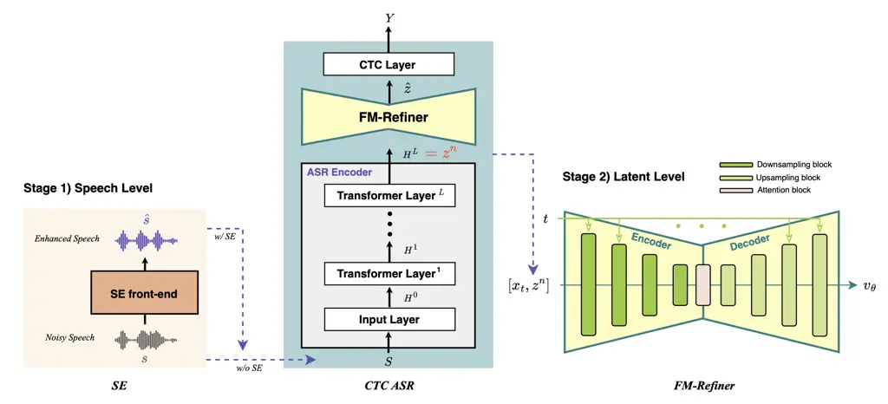

# Latent-Level Enhancement with Flow Matching for Robust Automatic Speech Recognition

Da-Hee Yang    Joon-Hyuk Chang ^(†)^(†)thanks: D. -H. Yang, and J. -H.
Chang (corresponding author) are with the School of Electronics, Hanyang
University, Seoul, 04763, Korea (e-mail: jchang@hanyang.ac.kr).

###### Abstract

Noise-robust automatic speech recognition (ASR) has been commonly
addressed by applying speech enhancement (SE) at the waveform level
before recognition. However, speech-level enhancement does not always
translate into consistent recognition improvements due to residual
distortions and mismatches with the latent space of the ASR encoder. In
this letter, we introduce a complementary strategy termed latent-level
enhancement, where distorted representations are refined during ASR
inference. Specifically, we propose a plug-and-play Flow Matching
Refinement module (FM-Refiner) that operates on the output latents of a
pretrained CTC-based ASR encoder. Trained to map imperfect
latents—either directly from noisy inputs or from enhanced-but-imperfect
speech—toward their clean counterparts, the FM-Refiner is applied only
at inference, without fine-tuning ASR parameters. Experiments show that
FM-Refiner consistently reduces word error rate, both when directly
applied to noisy inputs and when combined with conventional SE
front-ends. These results demonstrate that latent-level refinement via
flow matching provides a lightweight and effective complement to
existing SE approaches for robust ASR.

###### Index Terms: 

Noise robust ASR, latent-level enhancement, flow matching, refinement
module

## I Introduction

Robust automatic speech recognition (ASR) under noisy conditions remains
a longstanding challenge \[1, 2, 3, 4, 5, 6, 7, 8, 9, 10\]. A widely
adopted solution is to apply a speech enhancement (SE) front-end, which
processes the noisy waveform before recognition \[3, 5\]. This strategy
is attractive because SE models can be developed independently of the
ASR system. However, improved speech quality at the waveform level does
not necessarily yield consistent recognition gains. Residual
distortions, enhancement artifacts, and mismatches between enhanced
speech and the latent space of the ASR encoder often limit reductions in
word error rate (WER), leaving a fundamental bottleneck in noise-robust
ASR\[11, 12, 13\].

In this letter, we propose a complementary solution that addresses
distortion directly at the latent-level of the ASR model. We introduce
the Flow Matching Refinement module (FM-Refiner), a generative
refinement model that operates on the output representations of a
pretrained CTC-based ASR encoder \[14, 15, 16\]. The FM-Refiner learns
to transform imperfect latents, which may arise from raw noisy inputs or
from enhanced speech that still carries residual artifacts, toward
distributions characteristic of clean latents. Unlike conventional
denoising networks, it leverages flow matching to learn an explicit
transport mapping between distorted and clean latent distributions of
the ASR encoder. Importantly, this refinement is applied in a
plug-and-play manner during inference, without retraining or fine-tuning
ASR parameters.

This design offers three advantages. First, it directly improves the
representations that matter most for recognition, reducing the mismatch
that waveform-level SE alone cannot resolve. Second, it complements
existing SE front-ends, enabling a two-stage strategy of waveform
enhancement followed by latent refinement. Third, by leveraging flow
matching \[17\] to learn a deterministic transport mapping, the
FM-Refiner provides stable refinement without requiring stochastic
sampling \[18, 19, 20, 21\].

We evaluate the proposed approach across multiple noise conditions and
SE front-ends \[22, 23, 24\]. Experimental results show that the
FM-Refiner consistently reduces WER, whether applied directly on noisy
inputs or in combination with SE models. These findings highlight
latent-level refinement as a lightweight and effective complement to
speech-level enhancement for noise-robust ASR, underscoring the novelty
of integrating generative refinement directly into ASR pipelines.

The main contributions of this work are three-fold: (i) we formulate
latent-level enhancement for robust ASR, (ii) we design a plug-and-play
FM-Refiner that maps imperfect latents toward clean latents without
retraining the ASR, and (iii) we provide empirical evidence that latent
refinement consistently improves recognition across diverse SE models
and noise conditions.



Fig. 1: Overview of the proposed two-stage framework. In Stage 1, noisy
speech $`s`$ is optionally enhanced by an SE front-end, producing an
enhanced speech for the pretrained CTC-based ASR encoder. In Stage 2,
the encoder output latents $`z^{n}`$ are refined by the FM-Refiner,
which produces improved representations $`\hat{z}`$ for the CTC layer.
All modules (SE, ASR, FM-Refiner) are pretrained separately, and the
figure illustrates the decoding process where the FM-Refiner is applied
in a plug-and-play manner. The FM-Refiner is implemented with a U-Net
architecture trained via flow matching.

## II Modeling Approach

### II-A Framework Overview

Fig. 1 illustrates the overall framework of the proposed method. In a
conventional pipeline for noise-robust ASR, an SE front-end is applied
to suppress noise at the waveform level, and the resulting enhanced
speech is then passed into a pretrained ASR model. In this work, we
assume that the ASR model remains fixed without task-specific
retraining, as retraining with new noise conditions or domain-specific
data is often impractical. While SE can improve perceptual speech
quality, residual artifacts and mismatches with the ASR encoder feature
space often persist, which limits recognition performance.

To address this limitation, we introduce an additional refinement stage
that operates at the latent-level of the ASR. Specifically, after the SE
front-end produces an enhanced waveform, the signal is passed through
the pretrained ASR encoder. Its output latent representation,
$`\boldsymbol{H}^{L}`$, is then refined by the FM-Refiner. The
FM-Refiner is pretrained separately to map noisy or enhanced latents
toward clean latents, and can be inserted in a plug-and-play manner,
without requiring any fine-tuning of the ASR model. The refined latents,
$`\hat{z}`$, are finally fed into the CTC layer to produce text outputs.
This architecture integrates speech-level and latent-level processing:
SE mitigates noise in the waveform domain, and FM-Refiner further
corrects residual mismatches in the latent space of the ASR. By
combining the two stages, the framework produces CTC inputs that are
better aligned with the classifier’s learned decision space.

### II-B CTC-based ASR Architecture

The ASR model employed in this work is based on the connectionist
temporal classification (CTC) framework \[14\]. The CTC-based ASR system
is designed to predict a target transcription sequence
$`\boldsymbol{Y}`$ from an input speech sequence $`\boldsymbol{S}`$ of
length $`T`$, without requiring explicit frame-level alignment between
inputs and outputs. The encoder of the ASR model consists of 12
transformer layers, each composed of multi-head self-attention,
feed-forward networks, residual connections, and layer normalization
\[25\]. Given the acoustic feature sequence
$`\boldsymbol{S}`$($`\hat{\boldsymbol{S}}`$) extracted from the
noisy(enhanced) waveform, the encoder maps it into a higher-level latent
representation:

```math
\displaystyle\boldsymbol{H}^{0} \displaystyle=\textrm{InputLayer}(\boldsymbol{S}\ (\hat{\boldsymbol{S}})), \tag{1}
```

```math
\displaystyle\boldsymbol{H}^{l} \displaystyle=\textrm{TransformerLayer}^{l}(\boldsymbol{H}^{l-1}),\quad(1\leq l\leq L)
```

where $`\boldsymbol{H}^{l}`$ denotes the output representation of the
$`l`$-th transformer layer. The final latent representation
$`\boldsymbol{H}^{12}`$, where $`L=12`$, is fed into a linear projection
layer followed by a softmax to compute the frame-wise posterior
distribution over subword units. The CTC loss is defined as the negative
log-likelihood of the target sequence $`\boldsymbol{Y}`$ given the input
sequence $`\boldsymbol{S}`$, marginalized over all possible alignment
paths $`B(\boldsymbol{Y},\boldsymbol{S})`$, where each alignment
$`\hat{\boldsymbol{y}}`$ has length $`N`$:

```math
P_{CTC}(\boldsymbol{Y}|\boldsymbol{S})=\sum_{\hat{\boldsymbol{y}}\in B(\boldsymbol{Y},\boldsymbol{S})}\prod_{n=1}^{N}P(\hat{\boldsymbol{y}}_{n}|\boldsymbol{S}), \tag{2}
```

```math
\mathcal{L}_{CTC}=-\ln P_{CTC}(\boldsymbol{Y}|\boldsymbol{S}). \tag{3}
```

This formulation allows the ASR system to learn from encoder outputs
without requiring explicit frame-to-label alignments, making the latent
space directly compatible with the proposed FM-Refiner.

### II-C FM-Refiner

#### II-C1 Flow Matching Preliminary

Flow matching (FM) \[17\] is a generative modeling framework that learns
a continuous transformation between a prior distribution and a target
data distribution by estimating the underlying vector field that governs
the evolution of intermediate samples. Formally, let
$`x_{0}\sim q_{0}(x)`$ denote a sample from an initial distribution and
$`x_{1}\sim q_{1}(x)`$ denote a target sample from the data
distribution. FM defines a time-dependent mapping $`f(x_{0},t)=x_{t}`$,
where $`t\in[0,1]`$ represents the continuous interpolation between
$`x_{0}`$ and $`x_{1}`$. The dynamics of this mapping follow an ordinary
differential equation (ODE):

```math
\frac{df}{dt}=\frac{dx_{t}}{dt}=u_{t}, \tag{4}
```

where $`u_{t}`$ is the vector field describing the instantaneous
direction of transport from $`x_{0}`$ to $`x_{1}`$ at time $`t`$.

In practice, the exact $`u_{t}`$ is unknown and is instead approximated
by a neural network $`v_{\theta}(x_{t},t)`$. The FM objective trains
$`v_{\theta}`$ to minimize the discrepancy between the true and
predicted vector fields:

```math
\mathcal{L}_{\text{FM}}=\mathbb{E}_{x_{0},x_{1},t}\left[\|v_{\theta}(x_{t},t)-u_{t}\|_{2}^{2}\right]. \tag{5}
```

To make the training objective tractable, an affine probability path
between $`x_{0}`$ and $`x_{1}`$ is introduced. A common choice is the
optimal transport (OT) path, which interpolates the two endpoints
linearly with a noise-controlling factor $`\sigma_{\min}`$:

```math
f(x_{0},t)=tx_{1}+\left(1-(1-\sigma_{\min})t\right)x_{0}. \tag{6}
```

The corresponding vector field is then given by

```math
u_{t}=x_{1}-(1-\sigma_{\min})x_{0}, \tag{7}
```

which is independent of $`t`$ and therefore enables efficient and stable
learning.

Once trained, the FM model generates samples by integrating the learned
vector field $`v_{\theta}`$ over time using an ODE solver. Given an
initial sample $`x_{0}\sim q_{0}(x)`$, the solver iteratively updates
$`x_{t}`$ according to

```math
x_{t+\Delta t}=x_{t}+\Delta t\cdot v_{\theta}(x_{t},t), \tag{8}
```

where $`\Delta t=1/N`$ and $`N`$ is the number of sampling steps.

#### II-C2 FM-Refiner for ASR Latent Representation

Building upon this foundation, we introduce the FM-Refiner, a refinement
module that leverages flow matching to enhance ASR latent
representations. The key idea is to align imperfect ASR latents with
their clean counterparts through the vector field estimated by FM
network, thereby improving recognition robustness under noisy
conditions.

Specifically, given a noisy input utterance $`\mathbf{s}`$, we first
obtain its latent representation using a pretrained ASR encoder. Let
$`\mathbf{z}^{n}`$ and $`\mathbf{z}^{c}`$ denote the noisy and clean ASR
latents, respectively. During training, $`\mathbf{z}^{n}`$ serves as the
starting distribution $`x_{0}`$, while $`\mathbf{z}^{c}`$ provides the
target $`x_{1}`$. Intermediate states $`x_{t}`$ are then constructed
along the OT path between $`\mathbf{z}^{n}`$ and $`\mathbf{z}^{c}`$, and
the FM-Refiner is trained to predict the corresponding vector field.

The FM-Refiner adopts a multi-resolution U-Net backbone \[26\] tailored
for sequential latent features. At each time step, the diffused latent
$`x_{t}`$ is concatenated with the noisy latent $`\mathbf{z}^{n}`$ and
fed into the encoder as shown in Fig 1. The encoder progressively
reduces the sequence resolution via residual convolutional blocks with
group normalization and SiLU activation \[27\], while the decoder
reconstructs the resolution using upsampling layers and skip connections
to retain fine-grained detail. A global attention bottleneck is
incorporated to capture contextual dependencies across the sequence. In
addition, time step information $`t`$ is embedded via positional
embeddings and injected into each residual block, enabling the network
to modulate its feature transformations over the probability path.

The training objective follows the conditional flow matching loss:

```math
\mathcal{L}_{\text{FM-Refiner}}=\mathbb{E}_{\mathbf{z}^{n},\mathbf{z}^{c},t}\left\|v_{\theta}(x_{t},\mathbf{z}^{n},t)-\left(\mathbf{z}^{c}-(1-\sigma_{\min})\mathbf{z}^{n}\right)\right\|_{2}^{2}. \tag{9}
```

Here, the conditioning on $`\mathbf{z}^{n}`$ ensures that the refinement
process remains anchored to the input signal, preventing over-smoothing
or loss of speaker-specific information.

At inference, only the noisy latent $`\mathbf{z}^{n}`$ is available. The
FM-Refiner initializes from $`\mathbf{z}^{n}`$ and iteratively
integrates the learned vector field to generate the refined latent
$`\hat{\mathbf{z}}`$, which is then passed to the CTC layer. This
refinement process effectively bridges the gap between noisy and clean
representations, leading to improved word recognition accuracy across a
wide range of noise conditions. When an SE front-end is applied, the
noisy latent $`\mathbf{z}^{n}`$ is replaced with the enhanced latent
representation, which then serves as the initialization for the
refinement process.

## III Experimental Setup

### III-A Datasets

The ASR model was trained on the Wall Street Journal (WSJ) corpus \[28\]
using standard data augmentation techniques, without fine-tuning on
noisy speech. To train the SE front-ends, paired clean and noisy
utterances were generated by mixing WSJ training and validation
utterances with randomly selected CHiME-4 noise at SNRs uniformly
sampled from -5 to 10 dB. The CHiME-4 dataset includes recordings from
street, café, bus, and pedestrian environments, providing diverse and
realistic noise conditions \[29\]. For evaluation, WSJ test utterances
were mixed with CHiME-4 noise at SNRs from $`\{-5,-2,0,2,5,10\}`$ dB.
WER was measured under two conditions: (i) direct decoding of noisy
speech and (ii) decoding of enhanced speech after passing through the SE
front-end.

I Method ASR performance SE performance WER($`\downarrow`$)
DNSMOS($`\uparrow`$) -5 dB -2 dB 0 dB 2 dB 5 dB 10 dB Avg. \[-5, 10\] dB
Unprocessed 85.6 79.7 73.4 63.9 51.7 39.3 65.60 2.74 w/ FM-Refiner 80.9
73.5 65.9 56.4 45.6 35.2 59.58 - SE front-ends Conv-TasNet 54.2 44.8
39.7 35.1 31.0 27.7 38.75 3.73 w/ FM-Refiner 50.2 40.9 36.9 33.0 28.8
26.8 36.10 - DEMUCS 60.9 49.2 43.7 38.0 31.7 27.2 41.78 3.73 w/
FM-Refiner 55.9 46.3 42.3 35.8 30.2 26.7 39.53 - SGMSE+ 56.2 45.9 40.8
36.1 31.3 27.0 39.55 3.98 w/ FM-Refiner 54.2 43.7 39.1 34.4 29.9 26.5
37.97 -

TABLE I: Experimental results of unprocessed input and various SE
front-ends, with and without the proposed FM-Refiner. The FM-Refiner
consistently improves WER (lower is better) across all conditions. SE
performance is reported for reference and is not directly related to the
proposed method.

### III-B Model Configuration

- •
  CTC-based ASR  
  We employed a CTC-based ASR model built with the ESPnet toolkit \[30,
  31\]. The input features were 80-dimensional log Mel-filterbank
  coefficients with a 25 ms window size and 10 ms frame shift. The
  encoder consisted of 12 Transformer layers, each equipped with 4
  attention heads and a hidden dimension of 256. The position-wise
  feed-forward networks had an inner dimension of 2048. A CTC layer
  followed the encoder to predict the posterior distributions over the
  output label set. The model was trained for 100 epochs with a batch
  size of 32. The Adam optimizer \[32\] was used, along with SpecAugment
  for data augmentation and checkpoint averaging to stabilize the final
  model parameters.
- •
  FM-Refiner  
  We employed a U-Net backbone to implement the proposed FM-Refiner. The
  network consists of four downsampling layers and four upsampling
  layers, where the ASR encoder outputs serve as the input latent
  representations. Specifically, the ASR encoder produces time-sequence
  features with a hidden dimension of 256, which are progressively
  refined through the flow matching process. The model was trained using
  Adam optimizer with a batch size of 16 for 200 epochs on a single
  NVIDIA A100 GPU. During inference, the FM-Refiner was executed with
  three sampling steps. Detailed architectural parameters beyond the
  number of layers follow the implementation provided in the official
  code¹¹ 1 https://github.com/sp-uhh/sgmse.git.

### III-C SE front-end models

To demonstrate the generality of the proposed FM-Refiner, we employed
several SE front-end models, including both discriminative and
generative approaches. This setup allows us to evaluate the
effectiveness of latent-level refinement across a wide range of
enhancement techniques, ensuring that the proposed method is not tied to
a specific SE architecture or objective.

- •
  Conv-TasNet \[22\]: A time-domain discriminative SE model based on
  stacked temporal convolution networks that predicts a time-varying
  mask for the input waveform and applies it to produce an enhanced
  waveform.
- •
  DEMUCS \[23\]: A waveform-based discriminative SE model built on a
  U-Net architecture. It maps noisy waveforms to clean waveforms through
  an encoder-decoder structure.
- •
  SGMSE+ \[24\]: A generative SE model that operates in the spectrogram
  domain. It uses a noise-conditional score network to model the clean
  speech distribution, enabling sample refinement through iterative
  denoising.

## IV Experimental Results

Table I presents the WER performance of various SE models under
different signal-to-noise ratio (SNR) conditions, both with and without
the proposed FM-Refiner. Several key observations can be drawn from
these results. First, even when applied directly to noisy speech without
any SE front-end, the FM-Refiner substantially improved ASR accuracy
across all SNR levels, ranging from the highly adverse condition of -5
dB to the relatively clean 10 dB environment. This indicates that the
pretrained FM-Refiner can refine ASR latent representations in a
plug-and-play manner without retraining the ASR encoder.

Second, when combined with conventional SE front-ends such as
Conv-TasNet, DEMUCS, and SGMSE+, the FM-Refiner consistently reduced
WER, demonstrating its effectiveness as a complementary refinement
stage. Notably, the performance gains were observed uniformly across all
tested conditions, suggesting that the FM-Refiner is robust to different
SE architectures and noise severities. This consistency highlights the
flexibility of the proposed approach in integrating with existing SE
pipelines.

An interesting observation arises when comparing different SE
front-ends. We evaluated SE quality using DNSMOS \[33\], a perceptual
metric that reflects the perceived naturalness of speech. As shown in
Table I, the generative model SGMSE+ achieved the highest DNSMOS score,
indicating more natural-sounding enhanced speech. However, in terms of
downstream ASR, its WER performance lagged behind the discriminative
model Conv-TasNet. This discrepancy highlights that perceptual or
signal-level improvements do not necessarily yield better ASR accuracy,
showing that waveform-level enhancement alone is insufficient. In
contrast, the FM-Refiner directly refines the ASR latent space, bridging
the gap between noisy and clean representations and yielding
improvements that align more closely with recognition objectives.

Overall, the results demonstrated that FM-Refiner offers a systematic
and effective solution for refining ASR latent representations. Its
consistent improvements across both unprocessed and SE-processed inputs
validated the necessity of latent-level enhancement in complementing
traditional SE methods.

## V Conclusion

We proposed FM-Refiner, a latent-level refinement framework designed to
enhance the robustness of CTC-based ASR under noisy conditions. By
applying a flow matching module to ASR encoder outputs, FM-Refiner
progressively transformed noisy latents into cleaner counterparts,
serving as a lightweight and effective refinement step. Experiments with
multiple SE front-ends showed consistent improvements in word
recognition accuracy across diverse noise levels, highlighting its
flexibility and applicability. These results indicate that incorporating
probabilistic refinement into ASR latents offers a novel way to bridge
the gap between noisy and clean representations.

## References

- \[1\] H. Xu, Z. Tan, P. Dalsgaard, and B. Lindberg (2008) Robust
  speech recognition by nonlocal means denoising processing. IEEE signal
  processing letters 15, pp. 701–704. Cited by: §I.
- \[2\] J. Li, L. Deng, Y. Gong, and R. Haeb-Umbach (2014) An overview
  of noise-robust automatic speech recognition. IEEE/ACM Transactions on
  Audio, Speech, and Language Processing 22 (4), pp. 745–777. Cited by:
  §I.
- \[3\] F. Weninger, H. Erdogan, S. Watanabe, E. Vincent, J. Le
  Roux, J. R. Hershey, and B. Schuller (2015) Speech enhancement with
  LSTM recurrent neural networks and its application to noise-robust
  ASR. In Proc. International Conference on Latent Variable Analysis and
  Signal Separation (LCA/ICA), pp. 91–99. Cited by: §I.
- \[4\] K. Nathwani, E. Vincent, and I. Illina (2018) DNN uncertainty
  propagation using gmm-derived uncertainty features for noise robust
  asr. IEEE Signal Processing Letters 25 (3), pp. 338–342. Cited by: §I.
- \[5\] Z. Wang, P. Wang, and D. Wang (2020) Complex spectral mapping
  for single-and multi-channel speech enhancement and robust ASR.
  IEEE/ACM Transactions on Audio, Speech, and Language Processing 28,
  pp. 1778–1787. Cited by: §I.
- \[6\] C. Fan, J. Yi, J. Tao, Z. Tian, B. Liu, and Z. Wen (2020) Gated
  recurrent fusion with joint training framework for robust end-to-end
  speech recognition. IEEE/ACM Transactions on Audio, Speech, and
  Language Processing 29, pp. 198–209. Cited by: §I.
- \[7\] Y. Hu, N. Hou, C. Chen, and E. S. Chng (2022) Interactive
  feature fusion for end-to-end noise-robust speech recognition. In
  Proc. IEEE International Conference on Acoustics, Speech and Signal
  Processing (ICASSP), pp. 6292–6296. Cited by: §I.
- \[8\] D. Yang and J. Chang (2022) FiLM conditioning with enhanced
  feature to the transformer-based end-to-end noisy speech recognition..
  In Proc. INTERSPEECH, pp. 4098–4102. Cited by: §I.
- \[9\] K. Kinoshita, T. Ochiai, M. Delcroix, and T. Nakatani (2020)
  Improving noise robust automatic speech recognition with
  single-channel time-domain enhancement network. In Proc. IEEE
  International Conference on Acoustics, Speech and Signal Processing
  (ICASSP), pp. 7009–7013. Cited by: §I.
- \[10\] D. Yang and J. Chang (2023) Attention-based latent features for
  jointly trained end-to-end automatic speech recognition with modified
  speech enhancement. Journal of King Saud University-Computer and
  Information Sciences 35 (3), pp. 202–210. Cited by: §I.
- \[11\] P. Wang, K. Tan, and D. Wang (2019) Bridging the gap between
  monaural speech enhancement and recognition with
  distortion-independent acoustic modeling. IEEE/ACM Transactions on
  Audio, Speech, and Language Processing 28, pp. 39–48. Cited by: §I.
- \[12\] M. Fujimoto and H. Kawai (2019) One-pass single-channel noisy
  speech recognition using a combination of noisy and enhanced
  features.. In Proc. INTERSPEECH, pp. 486–490. Cited by: §I.
- \[13\] K. Iwamoto, T. Ochiai, M. Delcroix, R. Ikeshita, H. Sato, S.
  Araki, and S. Katagiri (2022) How bad are artifacts?: analyzing the
  impact of speech enhancement errors on asr. arXiv preprint
  arXiv:2201.06685. Cited by: §I.
- \[14\] A. Graves and N. Jaitly (2014) Towards end-to-end speech
  recognition with recurrent neural networks. In Proc. International
  Conference on Machine Learning (ICML), pp. 1764–1772. Cited by: §I,
  §II-B.
- \[15\] D. Amodei, S. Ananthanarayanan, R. Anubhai, J. Bai, E.
  Battenberg, C. Case, J. Casper, B. Catanzaro, Q. Cheng, G. Chen, et
  al. (2016) Deep speech 2: end-to-end speech recognition in english and
  mandarin. In Proc. International Conference on Machine Learning
  (ICML), pp. 173–182. Cited by: §I.
- \[16\] C. Chiu, T. N. Sainath, Y. Wu, R. Prabhavalkar, P. Nguyen, Z.
  Chen, A. Kannan, R. J. Weiss, K. Rao, E. Gonina, et al. (2018)
  State-of-the-art speech recognition with sequence-to-sequence models.
  In Proc. IEEE International Conference on Acoustics, Speech and Signal
  Processing (ICASSP), pp. 4774–4778. Cited by: §I.
- \[17\] Y. Lipman, R. T. Q. Chen, H. Ben-Hamu, M. Nickel, and M.
  Le (2023) Flow matching for generative modeling. In Proc.
  International Conference on Learning Representations (ICLR), Cited by:
  §I, §II-C1.
- \[18\] Y. Song, J. Sohl-Dickstein, D. P. Kingma, A. Kumar, S. Ermon,
  and B. Poole (2021) Score-based generative modeling through stochastic
  differential equations. In Proc. International Conference on Learning
  Representations (ICLR), Cited by: §I.
- \[19\] D. Yang and J. Chang (2025) Flow-plc: towards efficient packet
  loss concealment with flow matching. IEEE Signal Processing Letters.
  Cited by: §I.
- \[20\] Y. Yuan, X. Liu, H. Liu, M. D. Plumbley, and W. Wang (2025)
  Flowsep: language-queried sound separation with rectified flow
  matching. In Proc. IEEE International Conference on Acoustics, Speech
  and Signal Processing (ICASSP), pp. 1–5. Cited by: §I.
- \[21\] D. Yang, J. Lee, and J. Chang (2025) Tokenized generative
  speech enhancement with language model and flow matching. IEEE Signal
  Processing Letters. Cited by: §I.
- \[22\] Y. Luo and N. Mesgarani (2019) Conv-TasNet: surpassing ideal
  time–frequency magnitude masking for speech separation. IEEE/ACM
  Transactions on Audio, Speech, and Language Processing 27 (8),
  pp. 1256–1266. Cited by: §I, 1st item.
- \[23\] A. Defossez, G. Synnaeve, and Y. Adi (2020) Real time speech
  enhancement in the waveform domain. In Proc. INTERSPEECH,
  pp. 3291–3295. Cited by: §I, 2nd item.
- \[24\] J. Richter, S. Welker, J. Lemercier, B. Lay, and T.
  Gerkmann (2023) Speech enhancement and dereverberation with
  diffusion-based generative models. IEEE/ACM Transactions on Audio,
  Speech, and Language Processing 31 (), pp. 2351–2364. Cited by: §I,
  3rd item.
- \[25\] A. Vaswani, N. Shazeer, N. Parmar, J. Uszkoreit, L.
  Jones, A. N. Gomez, Ł. Kaiser, and I. Polosukhin (2017) Attention is
  all you need. In Proc. Advances in Neural Information Processing
  Systems (NeurIPS), Vol. 30. Cited by: §II-B.
- \[26\] Y. Song, J. Sohl-Dickstein, D. P. Kingma, A. Kumar, S. Ermon,
  and B. Poole (2021) Score-based generative modeling through stochastic
  differential equations. In Proc. International Conference on Learning
  Representations (ICLR), Cited by: §II-C2.
- \[27\] S. Elfwing, E. Uchibe, and K. Doya (2018) Sigmoid-weighted
  linear units for neural network function approximation in
  reinforcement learning. Neural networks 107, pp. 3–11. Cited by:
  §II-C2.
- \[28\] L. D. Consortium et al. (1994) CSR-II (WSJ1) complete.
  Linguistic Data Consortium, Philadelphia, vol. LDC94S13A. Cited by:
  §III-A.
- \[29\] J. P. Barker, R. Marxer, E. Vincent, and S. Watanabe (2017) The
  CHiME challenges: robust speech recognition in everyday environments.
  In New era for robust speech recognition: Exploiting deep learning,
  pp. 327–344. Cited by: §III-A.
- \[30\] S. Watanabe et al. (2018) Espnet: end-to-end speech processing
  toolkit. In Proc. INTERSPEECH, Cited by: 1st item.
- \[31\] (cited March 21 2018.) End-to-end speech processing toolkit.
  https://github.com/espnet/espnet. Cited by: 1st item.
- \[32\] D. P. Kingma and J. Ba (2015) Adam: a method for stochastic
  optimization. In Proc. International Conference on Learning
  Representations (ICLR), Cited by: 1st item.
- \[33\] C. K. Reddy, V. Gopal, and R. Cutler (2021) DNSMOS: a
  non-intrusive perceptual objective speech quality metric to evaluate
  noise suppressors. In Proc. IEEE International Conference on
  Acoustics, Speech and Signal Processing (ICASSP), pp. 6493–6497. Cited
  by: §IV.
