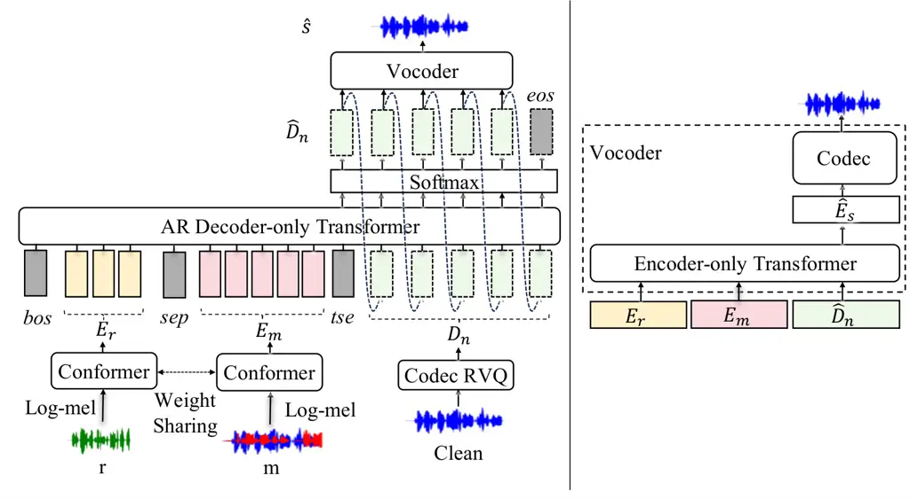
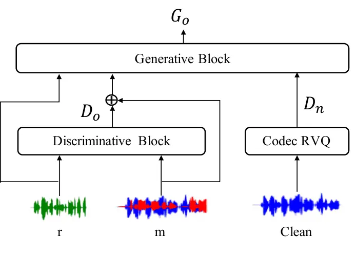
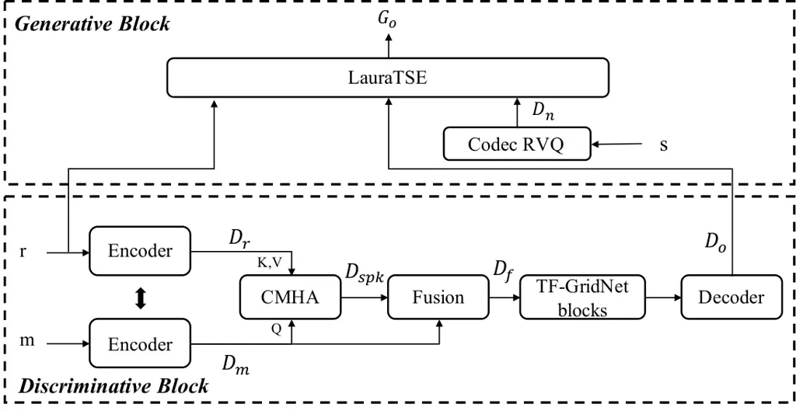

# Discriminative–Generative Target Speaker Extraction with Decoder-Only Language Models

Bang Zeng    Student Member    IEEE    Beilong Tang    Wang Xiang   
Ming Li¹    Senior Member    IEEE ^(†)^(†)thanks: Bang˜Zeng, Wang Xiang
and Ming˜Li are with the School of Computer Science, Wuhan University,
Wuhan 430072, China, and also with Suzhou Municipal Key Laboratory of
Multimodal Intelligent Systems, Digital Innovation Research Center, Duke
Kunshan University, Kunshan 215316, China. Beilong Tang is with the
North Carolina State University (e-mail: bangzeng@whu.edu.cn;
btang5@ncsu.edu; 2025102110031@whu.edu.cn;
ming.li369@dukekunshan.edu.cn).^(†)^(†)thanks: ¹ Corresponding author.

###### Abstract

Target speaker extraction (TSE) aims to recover the speech of a desired
speaker from a mixture given a short enrollment utterance, while speech
enhancement (SE) focuses on improving speech quality under noisy
conditions. Most existing TSE and SE systems are based on discriminative
modeling and have shown strong interference suppression ability, but
they often remain limited in perceptual quality and naturalness. To
address this issue, we first introduce LauraTSE, a generative TSE model
built on an autoregressive decoder-only language model. Although
generative modeling is promising for quality enhancement, purely
generative TSE may suffer from hallucination, content drift, and limited
controllability in complex acoustic conditions. We therefore propose a
discriminative–generative two-stage framework, where a discriminative
front-end first produces target-related representations with strong
interference suppression, and a generative back-end then reconstructs
high-quality speech in the neural audio codec representation space. This
design combines the controllability of discriminative extraction with
the reconstruction capability of generative modeling. We further
investigate several collaboration strategies for the two-stage
framework, including front-end freezing, joint fine-tuning, SI-SDR
regularization, and autoregressive/non-autoregressive inference.
Experimental results on both TSE and SE benchmarks show that the
proposed framework achieves a better balance among perceptual quality,
intelligibility, and speaker consistency than purely discriminative or
purely generative baselines.

###### Index Terms: 

Target speaker extraction, Auto-regressive decoder-only language model,
Discriminative–generative, Speech quality, Intelligibility.

## I Introduction

Humans can selectively attend to a target speech stream in complex
acoustic environments, a phenomenon commonly referred to as the cocktail
party effect \[1, 2\]. Inspired by this ability, speech separation has
been extensively studied for decades. Early approaches, such as
non-negative matrix factorization (NMF)  \[3\] and computational
auditory scene analysis (CASA) \[4\], mainly relied on spectro-temporal
masking and often degraded under acoustically challenging conditions.
With the development of deep learning, neural speech separation methods,
including deep clustering \[5\], deep attractor networks (DANet)\[6\],
and permutation invariant training (PIT)\[7\], substantially improved
separation performance. Time-domain models such as TasNet \[8\] and its
variants further advanced waveform reconstruction quality by avoiding
explicit phase estimation. More recent architectures in both the time
and time-frequency domains have continued to improve separation
accuracy. However, most conventional speech separation systems \[9, 10,
11, 12, 13, 14, 15, 16, 17, 18\] aim to recover all speakers in a
mixture and often assume that the number of sources is known in advance,
which limits their practicality in real-world scenarios.

In contrast, target speaker extraction (TSE) \[19, 20, 21, 22, 23, 24,
25, 26, 27, 28\] focuses on extracting only the desired speaker from a
mixture with the help of an enrollment utterance. This formulation is
especially attractive in realistic applications, where the number of
interfering speakers may be unknown and only one target speaker is of
interest. A typical TSE system follows an encoder–separator–decoder
architecture in either the time domain or the time-frequency domain.
Most existing TSE methods rely on a speaker embedding extractor to
derive a compact representation from the enrollment speech and then use
this representation to guide target extraction. However, speaker
embedding extractors are usually optimized for speaker recognition
rather than TSE. As a result, they may discard fine-grained acoustic
details that are useful for accurate target reconstruction. To mitigate
this mismatch, speaker-embedding-free TSE methods \[29, 30, 31, 32\]
have been proposed to exploit reference speech representations more
directly.

Despite these advances, most existing TSE methods still adopt a
discriminative paradigm that directly learns a deterministic mapping
from the mixture and enrollment speech to the target signal. Such models
are generally effective at suppressing interferers and preserving target
controllability. However, they are typically optimized with signal-level
objectives that do not always align well with human auditory perception,
and they may struggle to recover fine-grained details that are missing
or distorted during extraction \[33\]. As a result, discriminative TSE
systems often remain limited in perceptual naturalness and
reconstruction fidelity, especially under challenging acoustic
conditions.

Generative models offer a different perspective by modeling speech
distributions rather than a single deterministic solution. In principle,
this allows them to better reconstruct plausible speech details and
improve perceptual quality \[34, 35, 36, 37\]. Recent studies have
explored several generative paradigms for TSE, including diffusion
models \[34\], variational autoencoders (VAEs) \[38\], and
language-model-based approaches \[36, 39\]. These works provide
encouraging evidence that generative modeling can benefit TSE.
Nevertheless, autoregressive decoder-only language models remain
underexplored in this task. Although SpeechX \[40\] demonstrates the
potential of decoder-only language models in multi-task speech
processing, it does not directly answer a key question for TSE: can a
compact decoder-only language model provide sufficient modeling capacity
for high-quality target speaker extraction in a task-specific setting?

To investigate this question, we previously introduced LauraTSE \[41\],
a generative TSE model based on an autoregressive decoder-only language
model. LauraTSE predicts coarse codec representations of the target
speech conditioned on continuous representations of the mixture and
enrollment speech, and then refines them with an encoder-only module to
recover fine-grained acoustic details. Although LauraTSE improves
perceptual quality, purely generative TSE still faces important
limitations. In particular, generative reconstruction may suffer from
hallucination, content drift, and reduced controllability when the
conditioning information is imperfect or insufficient. These limitations
raise concerns about the robustness and reliability of purely generative
TSE systems in complex acoustic scenarios.

Motivated by these observations, this paper proposes a
discriminative–generative two-stage framework for TSE. The key idea is
to decompose the task into two complementary stages. A discriminative
front-end first performs target-oriented extraction and interference
suppression, producing structured intermediate representations that
retain strong target relevance. A generative back-end then reconstructs
high-quality target speech from these intermediate representations in
the neural audio codec space. In this way, the front-end reduces the
burden of coarse target localization, while the back-end focuses on
detail reconstruction and perceptual refinement. The resulting framework
aims to improve perceptual quality without sacrificing intelligibility
and speaker consistency.

This work substantially extends our preliminary LauraTSE study \[41\].
Beyond the original purely generative model, we introduce a hybrid
discriminative–generative framework for both target speaker extraction
(TSE) and speech enhancement (SE), and instantiate it as USEF-Laura-TSE
by combining USEF-TFGridNet \[32\] with LauraTSE, and as BSRNN-Laura-SE
by integrating BSRNN \[42\] with the same generative back-end. We
further provide a systematic analysis of front-end freezing versus joint
fine-tuning, SI-SDR regularization, and
autoregressive/non-autoregressive inference. These analyses reveal how
discriminative controllability and generative flexibility interact in
TSE and SE, and how different training and inference strategies affect
the trade-off among perceptual quality, intelligibility, and speaker
consistency.

The main contributions of this article are summarized as follows:

- •
  We develop LauraTSE, a generative TSE model based on an autoregressive
  decoder-only language model. LauraTSE bridges continuous acoustic
  conditioning and neural audio codec representations, enabling
  task-specific generative modeling for TSE without relying on explicit
  speaker embeddings.
- •
  We propose a discriminative–generative two-stage framework for both
  target speaker extraction and speech enhancement, instantiated as
  USEF-Laura-TSE and BSRNN-Laura-SE, respectively. In the proposed
  framework, a discriminative front-end first produces target-aligned
  and interference-suppressed intermediate representations, which are
  then refined by a generative back-end to enhance perceptual quality.
- •
  We present a systematic study of collaboration strategies between the
  two stages. Specifically, we analyze front-end freezing versus joint
  fine-tuning, SI-SDR regularization, and
  autoregressive/non-autoregressive inference, showing how these design
  choices affect the trade-off among perceptual quality,
  intelligibility, and speaker consistency.

## II Related Works

### II-A Discriminative Approaches for Target Speaker Extraction

Discriminative TSE methods have achieved substantial progress in recent
years and can be broadly divided into time-domain and
time-frequency-domain approaches. Early TSE systems mainly estimated
speaker-dependent masks on short-time Fourier transform (STFT) features.
Time-domain methods later gained attention because they avoid explicit
phase reconstruction and often yield better waveform quality.
Representative models such as TasNet \[8\] and Conv-TasNet \[11\] employ
convolutional encoder–decoder structures to learn waveform-level
representations. More advanced architectures, including DPRNN \[9\],
SepFormer \[15\], and transformer-based models \[14\], further enhance
extraction performance by explicitly modeling long-range temporal
dependencies and global contextual information. For the TSE task, target
speaker information is typically incorporated through speaker embeddings
extracted from reference speech, which are used to guide the extraction
process \[19, 20\]. In such embedding-based frameworks, speaker
encoders \[43, 44, 45, 46\] are integrated with separation networks via
feature concatenation, conditioning, or attention mechanisms, and
various architectural designs have been proposed to improve robustness
in feature extraction and cross-stream fusion.

More recently, speaker-embedding-free TSE approaches \[47, 48, 29, 30,
31\] have been introduced to avoid the limitations of fixed-dimensional
speaker embeddings. Instead of compressing the enrollment utterance into
a single speaker vector, these methods directly exploit frame-level
acoustic features and model the interaction between the enrollment and
mixture streams using attention-based mechanisms. By preserving richer
temporal and spectral details, such approaches can better alleviate the
information loss and representation mismatch often caused by
conventional speaker embeddings \[49, 50\].

Despite their strong target controllability and interference suppression
abilities, most discriminative TSE systems are still trained with
deterministic signal reconstruction objectives. This limits their
ability to model the uncertainty and multimodality of speech signals and
often makes it difficult to restore fine-grained acoustic details and
naturalness. These limitations motivate the introduction of generative
modeling into TSE.

### II-B Generative Approaches for Target Speaker Extraction

Generative TSE methods can be roughly categorized into continuous and
discrete modeling paradigms. Continuous generative models, such as
diffusion models \[51, 52, 53, 54, 55, 56\] and variational autoencoders
(VAEs) \[38\], directly model the distribution of target speech and
typically provide strong reconstruction fidelity. However, their
computational cost and inference latency often limit their practicality,
especially in real-time or resource-constrained scenarios.

Recent work has increasingly explored discrete-representation-based
generative methods built on neural audio codecs and large language
models (LLMs) \[57, 58, 59\]. In these systems, speech is first
converted into discrete codec tokens, then generated conditionally with
a language model, and finally reconstructed into waveforms by a codec
decoder. Benefiting from strong sequence modeling capability,
language-model-based methods have shown promise in speech enhancement,
separation, and target speaker extraction. Among these architectures,
decoder-only language models are particularly appealing because of their
autoregressive formulation and flexibility for speech generation
tasks \[60, 40, 61\].

Nevertheless, purely generative TSE also faces important challenges.
Discrete token prediction can suffer from error accumulation,
hallucination, and reduced stability, while large model sizes increase
computational costs. More importantly, when the conditioning input does
not sufficiently preserve target-related structure, purely generative
reconstruction may fail to maintain semantic fidelity and speaker
consistency. These observations motivate a hybrid design in which a
discriminative front-end performs robust target-oriented extraction, and
a generative back-end focuses on perceptual refinement. The present work
follows this direction.

## III Discriminative–Generative Target Speaker Extraction

In this section, we first introduce LauraTSE in detail. We then present
the proposed discriminative–generative two-stage framework, followed by
a comprehensive description of its architecture and design principles.
Finally, to validate the effectiveness of the two-stage framework, we
construct a complete system, USEF-Laura-TSE, that employs
USEF-TFGridNet \[32\] as the discriminative front-end and LauraTSE as
the generative back-end.

### III-A LauraTSE

In this study, we propose LauraTSE, a target-speaker extraction method
based on an auto-regressive (AR) decoder-only language model built on
the LauraGPT \[61\] backbone. LauraTSE takes the log-mel spectrogram
features of both the target speaker’s enrollment speech and the mixed
speech as inputs, and employs the residual vector quantization (RVQ)
layers of a neural audio codec to discretize audio representations,
enabling high-quality modeling and reconstruction of the target
speaker’s speech. The overall architecture of LauraTSE is illustrated in
Fig 1. LauraTSE consists of two key components. The first is an AR
decoder-only language model that predicts the discrete representations
of the target speech corresponding to the first several codec encoding
layers. The second is a one-step encoder-only language model that
jointly exploits information from the mixed and enrollment speech to
directly predict the summed embeddings of all codec layers, thereby
compensating for the limitations of auto-regressive modeling in modeling
long-range temporal dependencies and mitigating error accumulation. In
the following, we provide a detailed description of LauraTSE’s
architecture and design.



Fig. 1: The diagram of LauraTSE network. ‘m’ and ‘r’ denote the mixed
speech and reference speech, respectively. We use two weight sharing
conformer to process the mixed and reference speech separately.

#### III-A1 Encoder

The first stage of LauraTSE is the encoding stage. Following LauraGPT’s
processing strategy for speech enhancement, we first compute log-mel
spectrogram features for both the enrollment speech and the mixed
speech, denoted as $`\textbf{M}_{\text{m}}`$ and
$`\textbf{M}_{\text{r}}`$. These two feature streams are then fed into a
parameter-sharing Conformer \[62\] encoder, producing continuous
representations for the reference speech and the mixed speech:

```math
\textbf{E}_{\text{m}}=\text{C}(\textbf{M}_{\text{m}}) \tag{1}
```

```math
\textbf{E}_{\text{r}}=\text{C}(\textbf{M}_{\text{r}}) \tag{2}
```

where $`\textbf{E}_{\text{m}}`$ $`\in`$
$`\mathbb{R}^{\text{N}\times\text{L}_{m}}`$ and
$`\textbf{E}_{\text{r}}`$ $`\in`$
$`\mathbb{R}^{\text{N}\times\text{L}_{r}}`$ represent the encoded
outputs of the $`\textbf{M}_{\text{m}}`$ and $`\textbf{M}_{\text{r}}`$,
respectively. $`\text{C}(\cdot)`$ denotes the conformer block. N is the
feature dimension. $`\text{L}_{\text{{m}}}`$ and
$`\text{L}_{\text{{r}}}`$ are the number of time steps.

This encoding stage serves as a feature adapter within the overall
framework. Rather than directly performing target speaker extraction,
its primary objective is to map raw acoustic features into a continuous
representation space that is more suitable for subsequent modeling by
the auto-regressive decoder-only language model, thereby providing
high-quality and structured inputs for generative modeling. It is worth
noting that, unlike SpeechX\[40\], which uses discrete representations
produced by a neural audio codec as inputs to the AR model, this work,
like LauraGPT \[61\], preserves task-driven continuous feature
representations. This design choice avoids potential information loss
introduced by discretization, particularly for fine-grained
speaker-related acoustic characteristics.

#### III-A2 Auto-Regressive Decoder-Only Language Model

The auto-regressive decoder-only language model is designed to learn and
predict the joint probability distribution of the coarse-grained
discrete representations of the target speech, conditioned on the
enrollment speech and the mixed speech. Specifically, the model
factorizes the joint distribution of the target speech representations
according to the chain rule of probability as follows:

```math
\textbf{P}_{\theta}(\hat{\textbf{D}}_{\text{n}}\mid\textbf{E}_{\text{m}},\textbf{E}_{\text{r}})=\prod_{\text{i}\leq\text{T}}{\textbf{P}_{\theta}(\hat{\textbf{D}}_{\text{n}}^{(i)}\mid\hat{\textbf{D}}_{\text{n}}^{(1:i-1)},\textbf{E}_{\text{m}},\textbf{E}_{\text{r}})} \tag{3}
```

where $`T`$ denotes the length of the output signal, and $`\theta`$
denotes the model parameters, and $`\hat{\textbf{D}}_{n}`$ denotes the
generated discrete representation of the target speech.

During training, the input sequence to the AR decoder-only language
model is organized as
$`[\text{bos},\ \textbf{E}_{\text{r}},\ \text{sep},\ \textbf{E}_{\text{m}},\ \text{tse},\ \textbf{D}_{\text{n}}]`$,
where bos is a learnable beginning-of-sequence token, sep separates the
enrollment and mixed speech embeddings, tse marks the boundary between
conditional inputs and target outputs, and $`\textbf{D}_{\text{n}}`$
denotes the sum of embeddings from the first n residual vector
quantization (RVQ) layers of the target speech. The AR model is trained
to predict the discrete representations of the first n RVQ layers. After
generating hidden states, n parallel linear layers estimate token
distributions for each RVQ layer, and a cross-entropy loss is applied
between the predicted and ground-truth token distributions. The
predicted tokens are then mapped to continuous embeddings using the
codec decoder’s embedding tables and summed across layers to form a
coarse-grained representation $`\hat{\textbf{D}}_{\text{n}}`$. During
inference, the model generates $`\hat{\textbf{D}}_{\text{n}}`$
auto-regressively, frame by frame.

#### III-A3 Vocoder

The objective of the vocoder module is to reconstruct a high-fidelity
time-domain waveform of the target speaker by fully leveraging
information from the mixed speech and the enrollment speech, based on
the coarse-grained representations generated by the auto-regressive
model. To this end, we design a vocoder consisting of an encoder-only
language model and a frozen, pre-trained neural audio codec decoder. The
encoder-only language model is built upon self-attention mechanisms,
enabling effective modeling of long-range temporal dependencies and
capturing fine-grained acoustic structures and speech details. Unlike
SpeechX \[40\], which predicts RVQ codes layer-wise, our design adopts a
one-step encoder-only language model that directly predicts the summed
embeddings across all RVQ layers of the target speech. This formulation
substantially simplifies the modeling process while improving both
training and inference efficiency.

Specifically, the input to the encoder-only language model is the
concatenated feature sequence
$`[\textbf{E}_{\text{r}},\textbf{E}_{\text{m}},\hat{\textbf{D}}_{\text{n}}]`$:

```math
[\,\cdot,\,\cdot,\,\hat{\textbf{E}}_{\text{s}}]=\text{EL}([\textbf{E}_{\text{r}},\textbf{E}_{\text{m}},\hat{\textbf{D}}_{\text{n}}]) \tag{4}
```

where $`\textbf{E}_{\text{r}}`$ and $`\textbf{E}_{\text{m}}`$ denote the
continuous embeddings of the enrollment speech and the mixed speech,
respectively, and $`\hat{\textbf{D}}_{\text{n}}`$ represents the
embedding corresponding to the coarse-grained target speech
representation generated by the first-stage AR decoder-only language
model. $`\text{EL}(\cdot)`$ denotes the encoder-only language model. The
encoder-only model processes this sequence and outputs
$`[\,\cdot,\,\cdot,\,\hat{\textbf{E}}_{\text{s}}]`$, where
$`\hat{\textbf{E}}_{\text{s}}`$ denotes the predicted fine-grained
acoustic embedding of the target speaker. During training, the predicted
embedding $`\hat{\textbf{E}}_{\text{s}}`$ is supervised against the
ground-truth target speech embedding $`\textbf{E}_{\text{s}}`$, obtained
from the neural audio codec as the sum of embeddings across all RVQ
layers. Both L1 and L2 losses are jointly employed to optimize
reconstruction accuracy and training stability. Finally, the frozen
codec decoder converts the predicted embedding
$`\hat{\textbf{E}}_{\text{s}}`$ into the time-domain waveform of the
target speaker’s speech. It is worth emphasizing that the AR
decoder-only language model and the encoder-only language model are
jointly trained end-to-end.

### III-B Architecture

To leverage the advantages of both discriminative and generative
approaches simultaneously, this work proposes a two-stage
discriminative–generative framework for target speaker extraction. As
illustrated in Fig. 2, the framework consists of two collaborative
modules: a discriminative module and a generative module. The
discriminative module explicitly extracts target-speaker–related speech
components or intermediate acoustic representations from the mixed
speech, providing high-quality and low-interference conditional inputs
for the subsequent generative module. The generative module then
performs generative reconstruction based on the outputs of the
discriminative module, further enhancing the perceptual quality of the
target speech.

In the discriminative module, the discriminative block takes the
reference speech r and the mixed speech m as inputs, and extracts
target-related information by suppressing interference from non-target
speakers. This module outputs a coarse target representation
$`\textbf{D}_{\text{o}}`$, which can be interpreted as an estimated
target speech signal or an intermediate acoustic representation:

```math
\textbf{D}_{\text{o}}=\mathcal{D}(\textbf{m},\textbf{r}) \tag{5}
```

where $`\mathcal{D}(\cdot)`$ denotes the discriminative extraction
function.

In parallel, the ground-truth clean target speech is encoded by a neural
audio codec with RVQ, producing a coarse discrete representation
$`\textbf{D}_{\text{n}}`$:

```math
\textbf{D}_{\text{n}}=\mathcal{Q}(\textbf{s}) \tag{6}
```

where s denotes the clean target speech and $`\mathcal{Q}(\cdot)`$
represents the codec encoder.

In the generative module, the generative block takes the discriminative
output $`\textbf{D}_{\text{o}}`$ as a conditional input and leverages
generative modeling to reconstruct a refined target speech
representation. The final output $`\textbf{G}_{\text{o}}`$ is generated
as:

```math
\textbf{G}_{\text{o}}=\mathcal{G}(\textbf{r},\textbf{D}_{\text{o}},\textbf{D}_{\text{n}}) \tag{7}
```

where $`\mathcal{G}(\cdot)`$ denotes the generative reconstruction
function. At inference time, only $`\textbf{D}_{\text{o}}`$ is required,
and the generative block produces the enhanced target speech output
$`\textbf{G}_{\text{o}}`$.

Through this two-stage design, the discriminative block provides a
low-interference and well-aligned target representation. In contrast,
the generative block further refines speech details and improves
perceptual quality via distribution-level modeling.



Fig. 2: The diagram of discriminative-generative target speaker
extraction framework. ‘m’ and ‘r’ denote the mixed speech and reference
speech, respectively.

### III-C Two-Stage Models to Target Speaker Extraction Tasks

We construct a two-stage discriminative–generative target speaker
extraction network, termed USEF-Laura-TSE, that employs
USEF-TFGridNet \[32\] as the discriminative front-end and LauraTSE as
the generative back-end. The overall architecture of USEF-Laura-TSE is
illustrated in Fig 3.

#### III-C1 Discriminative Block (USEF-TFGridNet)

Given the reference speech r and the mixed speech m, both signals are
first transformed into the time–frequency (T–F) domain using the
short-time Fourier transform (STFT), followed by 2-D convolutional
encoders:

```math
\textbf{{D}}_{\text{m}}=\text{Enc}(\textbf{m}) \tag{8}
```

```math
\textbf{{D}}_{\text{r}}=\text{Enc}(\textbf{r}) \tag{9}
```

where $`\mathrm{Enc}(\cdot)`$ denotes the shared encoder composed of
STFT and 2-D convolution layers.

$`\textbf{D}_{\text{m}}`$ and $`\textbf{D}_{\text{r}}`$ are fed into the
CMHA module, where a cross multi-head attention mechanism is applied to
extract frame-level features of the target speaker:

```math
\textbf{D}_{\text{spk}}=\text{CMHA}(\text{q}=\textbf{D}_{\text{m}};\text{k},\text{v}=\textbf{D}_{\text{r}}) \tag{10}
```

where $`\textbf{E}_{\text{m}}`$ and $`\textbf{E}_{\text{r}}`$ represent
the encoder outputs of the mixed speech and reference speech,
respectively. The Cross Multi-Head Attention operation is denoted as
$`\text{CMHA}(\cdot)`$, and $`\textbf{E}_{\text{spk}}`$ is the output of
the CMHA module. The CMHA module in USEF-TFGridNet \[32\] uses mixed
speech encoding as the query. This approach produces a frame-level
feature with the same length as $`\textbf{D}_{\text{m}}`$, allowing the
mixed and reference speech lengths to differ in the
USEF-TFGridNet \[32\].

The extracted speaker-aware representation $`\textbf{D}_{\text{spk}}`$
is then fused by direct concatenation with the mixed-speech features:

```math
\textbf{D}_{\text{f}}=\text{Concat}(\textbf{D}_{\text{m}},\textbf{D}_{\text{spk}}) \tag{11}
```

The fused features are processed by a stack of TF-GridNet blocks to
model global T–F dependencies. Finally, a decoder composed of 2-D
transposed convolutions and inverse STFT (iSTFT) reconstructs the
discriminative output $`\textbf{D}_{\text{o}}`$.

#### III-C2 Generative Block (LauraTSE)

The output of the discriminative block $`\textbf{D}_{\text{o}}`$ is fed
into the generative block as a conditional input. During training, the
clean target speech s is encoded by a neural audio codec with RVQ to
obtain a coarse discrete representation $`\textbf{D}_{\text{n}}`$.
LauraTSE learns to model the conditional distribution of the target
speech and generates the final output $`\textbf{G}_{\text{o}}`$. The
detailed procedure of LauraTSE is described in Section III-A



Fig. 3: The diagram of USEF-Laura-TSE. ‘m’ and ‘r’ denote the mixed
speech and reference speech, respectively.

### III-D Two-Stage Models to Speech Enhancement Tasks

To further validate the effectiveness of the proposed two-stage
framework, we additionally construct a two-stage model for the speech
enhancement task, termed BSRNN-Laura-SE. The discriminative front-end of
BSRNN-Laura-SE adopts BSRNN \[42\], while the generative back-end adopts
the same generative architecture as LauraTSE. Its overall architecture
is identical to that of USEF-Laura-TSE, except that the enrollment
utterance is not required as input. For the neural audio codec, we
consider two configurations: FunCodec \[60\] for 16-kHz audio and
FlowDec \[63\] for 48-kHz audio.

## IV Experimental Setup

### IV-A Datasets

#### IV-A1 USEF-Laura-TSE

The main experiments in this work are conducted using the 460-hour clean
speech subset of the LibriSpeech \[64\] corpus, referred to as
LibriSpeech-460h.Training mixtures are generated online by randomly
selecting and mixing clean utterances during training. The
target-to-interference ratio is randomly sampled from 0 to 5 dB to
simulate realistic TSE conditions. For validation, the clean development
set of Libri2Mix \[65\] is used. During both training and evaluation,
the enrollment speech is randomly cropped to 5 s to improve robustness
to enrollment-duration variations. During testing, the clean test set of
Libri2Mix is used, and an enrollment utterance is randomly selected for
each target speaker to better reflect practical target-speaker
extraction scenarios.

LauraTSE is first pre-trained on LibriSpeech-460h to learn robust speech
and speaker representations from large-scale clean speech data, and is
then fine-tuned on the Libri2Mix clean training set to adapt to mixture
conditions. For the LauraTSE ablation studies, however, the model is
trained only on the Libri2Mix clean training set to ensure controlled
and fair comparisons.

#### IV-A2 BSRNN-Laura-SE

For BSRNN-Laura-SE, we train the model using the official training data
provided by the URGENT Challenge \[66\]. For evaluation, we use the
official URGENT Challenge validation dataset.

### IV-B Network Configuration

#### IV-B1 LauraTSE

For LauraTSE, we adopt LauraGPT \[61\] as the backbone of the AR
decoder-only language model and employ FunCodec \[60\] as the neural
audio codec. The decoder-only model predicts the first n=2 codec layers,
yielding a coarse target representation.

For acoustic conditioning, both the enrollment speech and the mixture
speech are converted into log-Mel features using a 512-sample analysis
window and a 256-sample frame shift. These features are processed by a
shared Conformer encoder with six layers, eight attention heads, and a
hidden dimension of 512 to obtain continuous acoustic representations.
The autoregressive decoder-only Transformer contains 10 Transformer
blocks, each with eight attention heads and a hidden dimension of 512.
Conditioned on the encoded enrollment and mixture representations, it
predicts the discrete codec representations of the first n RVQ layers in
a frame-by-frame autoregressive manner.

To reconstruct high-fidelity waveforms, we employ an encoder-only
Transformer as a refinement module. This module contains six Transformer
layers with eight attention heads and a hidden dimension of 512. It
jointly exploits the mixture representation, the enrollment
representation, and the autoregressively predicted codec representation
to estimate the full RVQ embedding of the target speech for waveform
reconstruction.

#### IV-B2 USEF-Laura-TSE

USEF-Laura-TSE employs USEF-TFGridNet \[32\] as the discriminative
front-end. as the discriminative front-end. In the encoder, the input
speech is transformed into the time-frequency domain using STFT and then
processed by 2-D convolutional layers. The encoder output channels are
set to 128. The cross-attention module uses a single-layer structure
with four attention heads and a feed-forward hidden dimension of 512. In
both the full-band and sub-band branches, BLSTM layers with 256 hidden
units are used for sequence modeling. A cross-frame self-attention
module with one attention layer, four heads, and a 512-dimensional
feed-forward network is then applied to model global time-frequency
dependencies.

The number of TF-GridNet blocks is set to 2 and 6 for USEF-TFGridNet-S
and USEF-TFGridNet-L, respectively. In the decoder, 2-D transposed
convolutions are used to project the encoded features back to the
complex spectrum, which is then converted to the waveform domain. The
discriminative output is finally fed to LauraTSE as the conditional
input of the generative back-end.

#### IV-B3 BSRNN-Laura-SE

The BSRNN-Laura-SE model adopts BSRNN \[42\] as the front-end, with
parameter settings kept consistent with the baseline model used in the
URGENT Challenge \[66\]. The back-end employs the same generative
architecture as LauraTSE, and its parameter settings are also kept
identical.

### IV-C Training Details

We adopt a stage-wise training strategy for the proposed
discriminative–generative framework. The discriminative front-end is
first trained independently on Libri2Mix to obtain stable
target-oriented extraction behavior. After this pre-training stage, we
consider three collaboration strategies when training the full
framework.

First, the discriminative front-end can be frozen while only the
generative back-end is optimized. This setting preserves the standalone
behavior of the front-end and isolates the contribution of the back-end.
Second, the front-end can be unfrozen and jointly optimized with the
back-end, allowing the two modules to adapt to each other during
end-to-end training. Third, an additional SI-SDR loss \[67\] can be
imposed on the output of the discriminative front-end to regularize its
reconstruction behavior during joint optimization.

The SI-SDR loss is defined as follows:

```math
\begin{cases}\textbf{s}_{\text{T}}=\frac{<\hat{\textbf{s}},\textbf{s}>\textbf{s}}{||\textbf{s}||^{2}}\\
\textbf{s}_{\text{E}}=\hat{\textbf{s}}-\textbf{s}_{\text{T}}\\
\text{SI-SDR}=-10\lg{\frac{||\textbf{s}_{\text{T}}||^{2}}{||\textbf{s}_{\text{E}}||^{2}}}\end{cases} \tag{12}
```

where $`\hat{\textbf{s}}`$ $`\in`$ $`\mathbb{R}^{1\times\text{T}}`$
represents the estimated target speaker speech, while s $`\in`$
$`\mathbb{R}^{1\times\text{T}}`$ represents the clean source speech. In
training, we minimize the negative SI-SDR.

The generative back-end is trained from scratch and does not rely on
pre-trained weights. The overall LauraTSE model contains about 77M
parameters, among which about 36M belong to the decoder-only
Transformer. We use the Adam optimizer \[68\] with an initial learning
rate of $`1\times 10^{-3}`$. A 10k-step warm-up schedule is applied for
stabilization. When the validation performance does not improve for
three consecutive epochs, the learning rate is halved. All models are
trained for 100 epochs.

|                        |                    |                     |                            |
| ---------------------- | ------------------ | ------------------- | -------------------------- |
| Model                  | NISQA $`\uparrow`$ | dWER $`\downarrow`$ | WeSpeaker Sim $`\uparrow`$ |
| Decoder-Encoder-joint  | 4.241              | 0.241               | 0.847                      |
| Decoder-Encoder-split  | 4.253              | 0.232               | 0.858                      |
| Target-$`n`$ ($`n=2`$) | 3.644              | 0.301               | 0.740                      |
| No-Encoder             | 3.807              | 0.579               | 0.709                      |

TABLE I: Evaluation results for different Decoder-Encoder
configurations. Decoder-Encoder-joint and Decoder-Encoder-split refer to
the two integration strategies. Target-$`n`$ denotes the reconstructed
target clean audio using only the first $`n`$ layers of the codec.
No-Encoder uses summation of only the first $`n`$ layers of the
decoder-only LM output to generate speech without the encoder.

|             |           |           |           |                   |                     |                 |
| ----------- | --------- | --------- | --------- | ----------------- | ------------------- | --------------- |
| Model       | Input     |           |           | NISQA$`\uparrow`$ | dWER $`\downarrow`$ | WeSpeaker       |
|             | $`E_{r}`$ | $`E_{m}`$ | $`D_{n}`$ |                   |                     | Sim$`\uparrow`$ |
| Encoder-All | ✓         | ✓         | ✓         | 4.241             | 0.241               | 0.847           |
| Encoder-Mix | ✗         | ✓         | ✓         | 4.173             | 0.239               | 0.842           |
| Encoder-Ref | ✓         | ✗         | ✓         | 4.187             | 0.480               | 0.763           |

TABLE II: Input composition results for the encoder-only LM.

### IV-D Evaluation Metrics

#### IV-D1 USEF-Laura-TSE

Because codec-based waveform generation may introduce temporal and phase
deviations relative to the clean reference, conventional intrusive
measures may not fully reflect the perceptual quality of generative
outputs. Therefore, for USEF-Laura-TSE, intrusive metrics such as
PESQ \[69\] and STOI \[70\] are not adopted. Instead, we primarily
employ the following evaluation metrics that are more suitable for
generative speech modeling, most of which are non-intrusive.

DNSMOS \[71\] is used as a non-intrusive quality metric and provides
SIG, BAK, and OVRL scores ranging from 1 to 5. NISQA \[72\] is another
non-intrusive perceptual metric that predicts an overall quality score
from 1 to 5. SpeechBERT \[73\] is used to measure semantic similarity
between the generated speech and the target speech in a self-supervised
representation space, where HuBERT-base \[74\] is used for feature
extraction. Differential Word Error Rate (dWER) \[75\] is used as an
intelligibility-oriented metric and is computed with the Whisper-base
ASR model \[76\]. Finally, speaker similarity is evaluated by cosine
similarity in a speaker-embedding space using both WavLM-base¹¹ 1
[https://huggingface.co/microsoft/wavlm-base-plus-sv](https://huggingface.co/microsoft/wavlm-base-plus-sv)
and the ResNet_221LM and the ResNet 221LM model from WeSpeaker \[77\].

#### IV-D2 BSRNN-Laura-SE

For BSRNN-Laura-SE, we use the evaluation toolkit and metrics adopted in
the URGENT Challenge \[66\], including DNSMOS \[71\], NISQA \[72\],
ScoreQ \[72\], PESQ \[69\], STOI \[70\], speaker similarity (SpkSIM),
and Character accuracy (cAcc = 1 - CER).

Fig. 4: dWER versus training data scale across models. Annotations
”(-X)” denote relative dWER reduction (percentage points) compared to
the preceding smaller dataset.

## V Results and Discussions

This section presents the experimental results of the proposed framework
on LibriMix. We first analyze LauraTSE to understand the strengths and
limitations of the decoder-only generative paradigm for TSE, and then
evaluate USEF-Laura-TSE to examine how a discriminative front-end
affects perceptual quality, intelligibility, and speaker consistency.

|                |                     |       |       |                    |                         |                     |                        |                            |
| -------------- | ------------------- | ----- | ----- | ------------------ | ----------------------- | ------------------- | ---------------------- | -------------------------- |
| Model          | DNSMOS $`\uparrow`$ |       |       | NISQA $`\uparrow`$ | SpeechBERT $`\uparrow`$ | dWER $`\downarrow`$ | WavLM Sim $`\uparrow`$ | Wespeaker Sim $`\uparrow`$ |
|                | SIG                 | BAK   | OVL   |                    |                         |                     |                        |                            |
| Base ($`n`$-2) | 3.626               | 4.102 | 3.360 | 4.241              | 0.880                   | 0.241               | 0.965                  | 0.847                      |
| $`n`$-1        | 3.604               | 4.100 | 3.339 | 4.201              | 0.861                   | 0.266               | 0.958                  | 0.830                      |
| $`n`$-3        | 3.618               | 4.095 | 3.350 | 4.270              | 0.880                   | 0.235               | 0.967                  | 0.853                      |
| Ref output     | 3.588               | 4.071 | 3.318 | 4.182              | 0.859                   | 0.237               | 0.962                  | 0.851                      |
| Discrete IO    | 3.562               | 4.035 | 3.268 | 3.940              | 0.810                   | 0.421               | 0.952                  | 0.835                      |
| WavLM input    | 3.507               | 3.951 | 3.137 | 3.220              | 0.792                   | 0.447               | 0.860                  | 0.633                      |

TABLE III: Ablation studies of LauraTSE. n- denotes the output layer
number of the decoder-only LM. The Ref output formats the output of the
decoder-only LM to contain both the clean and reference speech. Discrete
IO uses discrete codec embeddings rather than continuous features as the
input features. For WavLM input, the WavLM \[78\] embeddings are
utilized as the input features.

### V-A Ablation Results of LauraTSE

#### V-A1 Data Scalability of LauraTSE

To examine the scalability of LauraTSE with respect to training data
size, we compare it with two representative discriminative TSE systems,
SpEx+ \[23\] and USEF-TSE (USEF-TFGridNet-L) \[32\]. SpEx+ and USEF-TSE
contain about 11M and 16M parameters, respectively, whereas LauraTSE
contains about 77M parameters. We train LauraTSE on three datasets with
increasing scale: Libri2Mix-212h, LibriSpeech-460h-dm, and
LibriSpeech-960h-dm.

As shown in Fig. 4, LauraTSE benefits substantially from increased
training data. In particular, the dWER decreases from 24.1% to 15.9% and
then to 15.1% as the training data expand from Libri2Mix-212h to
LibriSpeech-460h-dm and LibriSpeech-960h-dm, respectively. This trend is
more pronounced than that of SpEx+, whereas USEF-TSE remains
comparatively stable across different training scales. These results
suggest that LauraTSE can exploit additional training data more
effectively, likely because the generative model benefits from richer
data diversity during distribution learning.

At the same time, the gain from 460 h to 960 h becomes relatively
limited. This may be due to the increased difficulty of the
train-other-500 portion of LibriSpeech-960h, as well as the finite
modeling capacity of the current LauraTSE configuration. More
importantly, although LauraTSE scales favorably with data, it does not
consistently surpass strong discriminative baselines in semantic
fidelity. This observation highlights that data scaling alone is not
sufficient to resolve the reliability challenges of purely generative
TSE.

#### V-A2 Effect of the Encoder-Only Refinement Module

We next investigate the role of the encoder-only language model in
LauraTSE. Since the autoregressive decoder-only model predicts only
coarse codec representations, the encoder-only module is introduced to
refine these outputs into higher-resolution continuous acoustic
embeddings for waveform reconstruction.

We first compare joint training and split training, as shown in Table I.
In the joint setting, the decoder-only and encoder-only modules are
optimized end-to-end using the Straight-Through Estimator(STE) \[79\].
In the split setting, the encoder-only module is trained separately
using fixed outputs from the decoder-only model. The split training
strategy yields slightly better performance overall, suggesting that
strict end-to-end coupling between the two modules is not essential
under the current configuration.

We further analyze the input composition of the encoder-only module.
Table II compares three settings: Encoder-All, which uses the enrollment
representation, the mixture representation, and the predicted codec
representation; Encoder-Mix, which removes the enrollment
representation; and Encoder-Ref, which removes the mixture
representation. Encoder-Mix performs comparably to Encoder-All, whereas
Encoder-Ref shows a clear degradation, particularly in dWER and speaker
similarity. These results indicate that mixture-side information is
critical in the refinement stage. They also suggest that the
encoder-only module functions as more than a post-processing vocoder, as
it still depends on task-relevant conditioning for target
reconstruction.

#### V-A3 Analysis of the Decoder-Only Language Model

Table III summarizes the ablation results under different decoder-only
input-output configurations. First, varying the number of predicted RVQ
layers from one to three leads to only minor differences. This suggests
that predicting a small number of coarse codec layers is sufficient for
the decoder-only model, while the remaining detail can be recovered by
the refinement module.

Second, the Ref output setting, in which the model generates both the
enrollment and enhanced segments, performs comparably to the baseline.
This result suggests that strict output-length alignment is not critical
in the current framework.

Third, replacing continuous acoustic inputs with discrete codec inputs
leads to a consistent performance drop (Discrete IO), and
WavLM-based \[78\] input features further degrade semantic fidelity and
speaker similarity. These findings indicate that continuous acoustic
conditioning better preserves target-related fine-grained information
than discretized or more abstract representations in this task.

### V-B Ablation Results of USEF-Laura-TSE

We next analyze USEF-Laura-TSE on Libri2Mix from three perspectives: the
effect of the discriminative front-end, the role of SI-SDR
regularization, and the trade-off between autoregressive and
non-autoregressive inference.

#### V-B1 Impact of the Discriminative Front-End

We first examine whether introducing a discriminative front-end improves
the overall performance of the generative model. Table IV compares the
purely discriminative model USEF-TFGridNet-S, the purely generative
model LauraTSE, and the proposed two-stage model USEF-Laura-TSE-S under
different training strategies.

|                  |          |        |               |                     |       |       |                    |                    |                     |                    |                        |
| ---------------- | -------- | ------ | ------------- | ------------------- | ----- | ----- | ------------------ | ------------------ | ------------------- | ------------------ | ---------------------- |
| Model            | Category | Frozen | Training Data | DNSMOS $`\uparrow`$ |       |       | NISQA $`\uparrow`$ | SBERT $`\uparrow`$ | dWER $`\downarrow`$ | WavLM $`\uparrow`$ | Wespeaker $`\uparrow`$ |
|                  |          |        |               | SIG                 | BAK   | OVRL  |                    |                    |                     |                    |                        |
| USEF-TFGridNet-S | D        | \-     | 1             | 3.308               | 3.745 | 2.926 | 3.349              | 0.807              | 0.228               | 0.961              | 0.912                  |
| LauraTSE         | G        | -      | 1             | 3.629               | 4.102 | 3.360 | 4.241              | 0.879              | 0.241               | 0.965              | 0.847                  |
|                  |          |        | 2             | 3.609               | 4.084 | 3.336 | 4.333              | 0.908              | 0.159               | 0.974              | 0.876                  |
| USEF-Laura-TSE-S | D-G      | ✓      | 1             | 3.606               | 4.100 | 3.344 | 4.304              | 0.869              | 0.266               | 0.963              | 0.851                  |
|                  |          | ✗      | 1             | 3.609               | 4.086 | 3.341 | 4.350              | 0.910              | 0.153               | 0.973              | 0.879                  |
|                  |          | ✗      | 2             | 3.592               | 4.061 | 3.313 | 4.453              | 0.925              | 0.120               | 0.978              | 0.895                  |

TABLE IV: Results of the discriminative–generative models on the
Libri2Mix clean test set. In the “Category” column, “D” denotes a
discriminative model, “G” denotes a generative model, and “D–G” denotes
a discriminative–generative model. In the “Training Data” column, “1”
indicates training on LibriMix, while “2” denotes training with online
mixing on LibriSpeech followed by fine-tuning on Libri2Mix. “SBERT”
denotes SpeechBERT score.

Compared with LauraTSE, USEF-Laura-TSE-S with joint training achieves
improved or comparable performance across multiple metrics. In
particular, under the larger-data setting, the dWER is reduced from
0.159 to 0.120, while SpeechBERT and both speaker-similarity metrics are
also improved. These results suggest that the discriminative front-end
provides more structured and less interference-corrupted intermediate
representations, thereby reducing the burden of coarse target alignment
for the generative back-end.

We also compare frozen and unfrozen front-end training. Although the
frozen setting still improves over the purely generative model in some
perceptual metrics, it performs noticeably worse than the jointly
trained version in semantic-related metrics such as SpeechBERT and dWER.
This indicates that end-to-end optimization is beneficial because it
allows the front-end and back-end to adapt to each other.

Compared with the standalone discriminative baseline, the two-stage
system consistently improves perceptual quality while retaining strong
semantic fidelity and speaker consistency. This supports the main
motivation of the proposed framework: the discriminative front-end
contributes target controllability and interference suppression, while
the generative back-end improves perceptual reconstruction quality.

|                  |               |              |     |        |       |       |       |       |       |       |           |
| ---------------- | ------------- | ------------ | --- | ------ | ----- | ----- | ----- | ----- | ----- | ----- | --------- |
| Model            | Training Data | SI-SDR Loss? | O   | DNSMOS |       |       | NISQA | SBERT | dWER  | WavLM | Wespeaker |
|                  |               |              |     | SIG    | BAK   | OVRL  |       |       |       |       |           |
| USEF-TFGridNet-L | 1             | \-           | D   | 3.514  | 4.041 | 3.249 | 4.370 | 0.909 | 0.104 | 0.982 | 0.953     |
| USEF-TFGridNet-L | 2             | \-           | D   | 3.555  | 4.051 | 3.272 | 4.319 | 0.935 | 0.075 | 0.988 | 0.968     |
| LauraTSE         | 2             | \-           | G   | 3.609  | 4.066 | 3.336 | 4.333 | 0.908 | 0.159 | 0.974 | 0.876     |
| USEF-Laura-TSE-S | 2             | No           | D   | 1.187  | 1.144 | 1.100 | 1.014 | 0.451 | 0.693 | 0.672 | 0.642     |
|                  | 2             | No           | G   | 3.592  | 4.061 | 3.313 | 4.453 | 0.925 | 0.120 | 0.978 | 0.895     |
|                  | 2             | Yes          | D   | 3.422  | 3.661 | 2.979 | 3.172 | 0.884 | 0.113 | 0.977 | 0.937     |
|                  | 2             | Yes          | G   | 3.603  | 4.080 | 3.329 | 4.416 | 0.915 | 0.154 | 0.975 | 0.880     |
| USEF-Laura-TSE-L | 2             | Yes          | D   | 3.528  | 3.955 | 3.202 | 3.648 | 0.933 | 0.076 | 0.987 | 0.950     |
|                  | 2             | Yes          | G   | 3.592  | 4.075 | 3.319 | 4.450 | 0.934 | 0.117 | 0.982 | 0.902     |

TABLE V: Results on the Libri2Mix clean test set for the
discriminative–generative models with an additional SI-SDR loss. In the
“O” column, “D” denotes the output of the discriminative model, and “G”
denotes the output of the generative model. In the “Training Data”
column, “1” indicates training on LibriMix, and “2” denotes training
with online mixing on LibriSpeech followed by fine-tuning on Libri2Mix.
“SBERT” denotes the SpeechBERT score.

#### V-B2 Effect of SI-SDR Regularization on the Two-Stage Framework

We next investigate the effect of SI-SDR regularization by introducing
an auxiliary SI-SDR loss on the discriminative front-end. We compare
standalone discriminative and generative models as well as different
configurations of the proposed two-stage framework under the Training
Data = 2 setting.

From Table V, the purely discriminative model (USEF-TFGridNet-L)
achieves strong performance in semantic and speaker-related metrics,
including low dWER and high speaker similarity scores, while the
generative model (LauraTSE) shows better perceptual quality but higher
dWER.

For the proposed two-stage model without SI-SDR loss, joint training
leads to a clear separation between the roles of the two modules. The
discriminative output shows degraded perceptual quality compared with
the pre-trained model, while the generative output improves over
LauraTSE in dWER and speaker similarity metrics. This indicates that the
discriminative front-end shifts its focus toward producing
representations more suitable for the generative back-end.

When SI-SDR regularization is applied, the discriminative output becomes
more stable in semantic-related metrics, with reduced dWER and improved
speaker similarity compared with the pre-trained discriminative model.
However, this is accompanied by a slight degradation in perceptual
quality. For the generative output, SI-SDR regularization leads to minor
changes in perceptual metrics and a moderate increase in dWER compared
with the non-regularized setting.

A similar trend is observed for the larger front-end configuration
(USEF-Laura-TSE-L). SI-SDR regularization improves the semantic
consistency of the discriminative output, while slightly limiting the
improvement of the generative output.

Overall, the results show that SI-SDR regularization improves the
stability of the discriminative front-end in terms of semantic-related
metrics, but introduces a trade-off in perceptual quality and reduces
the flexibility of the generative back-end. This suggests that the
strength of the SI-SDR constraint should be carefully balanced in the
two-stage framework.

|                                     |                |              |     |     |        |       |       |       |       |       |       |           |
| ----------------------------------- | -------------- | ------------ | --- | --- | ------ | ----- | ----- | ----- | ----- | ----- | ----- | --------- |
| Model                               | Inference Mode | SI-SDR Loss? | O   | R   | DNSMOS |       |       | NISQA | SBERT | dWER  | WavLM | Wespeaker |
|                                     |                |              |     |     | SIG    | BAK   | OVRL  |       |       |       |       |           |
| USEF-Laura-TSE-S                    | AR             | No           | D   | \-  | 1.187  | 1.144 | 1.100 | 1.014 | 0.451 | 0.693 | 0.672 | 0.642     |
|                                     |                | No           | G   | \-  | 3.592  | 4.061 | 3.313 | 4.453 | 0.925 | 0.120 | 0.978 | 0.895     |
|                                     | NAR            | No           | G   | 0.0 | 2.647  | 2.061 | 1.905 | 1.864 | 0.473 | 1.024 | 0.796 | 0.661     |
|                                     |                | No           | G   | 0.5 | 2.452  | 1.768 | 1.724 | 1.635 | 0.454 | 1.069 | 0.782 | 0.647     |
|                                     |                | No           | G   | 1.0 | 1.844  | 1.353 | 1.404 | 1.362 | 0.424 | 1.105 | 0.752 | 0.637     |
| USEF-Laura-TSE-S                    | AR             | Yes          | D   | \-  | 3.422  | 3.661 | 2.979 | 3.172 | 0.884 | 0.113 | 0.977 | 0.934     |
|                                     |                | Yes          | G   | \-  | 3.603  | 4.080 | 3.329 | 4.416 | 0.915 | 0.154 | 0.975 | 0.880     |
|                                     | NAR            | Yes          | G   | 0.0 | 3.590  | 4.027 | 3.291 | 4.217 | 0.910 | 0.149 | 0.975 | 0.881     |
|                                     |                | Yes          | G   | 0.5 | 3.578  | 3.991 | 3.263 | 4.099 | 0.907 | 0.148 | 0.975 | 0.882     |
|                                     |                | Yes          | G   | 1.0 | 3.568  | 3.944 | 3.232 | 3.960 | 0.906 | 0.133 | 0.975 | 0.883     |
| USEF-TFGridNet-L + LauraTSE (split) | AR             | \-           | D   | \-  | 3.555  | 4.051 | 3.272 | 4.319 | 0.935 | 0.075 | 0.988 | 0.968     |
|                                     |                | \-           | G   | \-  | 3.609  | 4.084 | 3.336 | 4.333 | 0.908 | 0.159 | 0.974 | 0.876     |
|                                     | NAR            | \-           | G   | 0.0 | 3.587  | 4.089 | 3.322 | 4.512 | 0.881 | 0.216 | 0.969 | 0.866     |
|                                     |                | \-           | G   | 0.5 | 3.604  | 4.101 | 3.343 | 4.553 | 0.898 | 0.166 | 0.972 | 0.872     |
|                                     |                | \-           | G   | 1.0 | 3.619  | 4.114 | 3.363 | 4.583 | 0.913 | 0.120 | 0.974 | 0.878     |
| USEF-Laura-TSE-L                    | AR             | Yes          | D   | \-  | 3.528  | 3.955 | 3.202 | 3.648 | 0.933 | 0.076 | 0.987 | 0.950     |
|                                     |                | Yes          | G   | \-  | 3.592  | 4.075 | 3.319 | 4.450 | 0.934 | 0.117 | 0.982 | 0.902     |
|                                     | NAR            | Yes          | G   | 0.0 | 3.580  | 4.048 | 3.294 | 4.346 | 0.927 | 0.115 | 0.981 | 0.901     |
|                                     |                | Yes          | G   | 0.5 | 3.574  | 4.035 | 3.283 | 4.316 | 0.927 | 0.112 | 0.981 | 0.902     |
|                                     |                | Yes          | G   | 1.0 | 3.570  | 4.022 | 3.272 | 4.302 | 0.929 | 0.099 | 0.982 | 0.903     |

TABLE VI: Results on the Libri2Mix clean test set for USEF-Laura-TSE
under auto-regressive (AR) and non-auto-regressive (NAR) inference. In
the “Inference Mode” column, “AR” indicates autoregressive inference and
“NAR” indicates non-autoregressive inference. “R” denotes the injection
ratio of the discriminative outputs. “SBERT” denotes the SpeechBERT
score.

|                         |          |                     |       |       |                    |                    |                     |                    |                        |
| ----------------------- | -------- | ------------------- | ----- | ----- | ------------------ | ------------------ | ------------------- | ------------------ | ---------------------- |
| Model                   | Category | DNSMOS $`\uparrow`$ |       |       | NISQA $`\uparrow`$ | SBERT $`\uparrow`$ | dWER $`\downarrow`$ | WavLM $`\uparrow`$ | Wespeaker $`\uparrow`$ |
|                         |          | SIG                 | BAK   | OVL   |                    |                    |                     |                    |                        |
| Mixture                 | \-       | 3.383               | 3.098 | 2.653 | 2.453              | 0.572              | 0.792               | 0.847              | 0.759                  |
| Spex+ \[23\]            | D        | 3.472               | 4.027 | 3.186 | 3.349              | 0.878              | 0.148               | 0.973              | 0.935                  |
| WeSep \[80\]            | D        | 3.486               | 3.838 | 3.118 | 3.892              | 0.895              | 0.123               | 0.980              | 0.945                  |
| USEF-TFGridNet-L \[32\] | D        | 3.555               | 4.051 | 3.272 | 4.319              | 0.935              | 0.0747              | 0.988              | 0.968                  |
| TSELM-L \[39\]          | G        | 3.489               | 4.041 | 3.212 | 3.961              | 0.793              | 0.297               | 0.887              | 0.627                  |
| AnyEnhance \[36\]       | G        | 3.638               | 4.066 | 3.353 | 4.277              | 0.735              | \-                  | 0.914              | \-                     |
| LauraTSE                | G        | 3.609               | 4.084 | 3.336 | 4.333              | 0.908              | 0.159               | 0.974              | 0.876                  |
| USEF-Laura-TSE-L        | D-G      | 3.592               | 4.075 | 3.319 | 4.450              | 0.934              | 0.117               | 0.982              | 0.902                  |

TABLE VII: Results on Libri2Mix clean. In the ”Category” column, ”G”
refers to generative models, while ”D” refers to discriminative models.

#### V-B3 Auto-Regressive and Non-Auto-Regressive Inference Strategies

Under identical training conditions, the proposed
discriminative–generative framework supports both auto-regressive (AR)
and non-auto-regressive (NAR) inference. In the AR setting, the
decoder-only model generates target speech representations sequentially.
In contrast, NAR inference leverages the outputs of the discriminative
front-end as auxiliary guidance, controlled by an injection ratio R,
where R=0 corresponds to pure generative decoding and R=1 fully relies
on the discriminative output.

Table VI reports results under different configurations. Overall, AR
inference achieves the best perceptual quality for both USEF-LauraTSE-S
and USEF-LauraTSE-L, as reflected by higher DNSMOS and NISQA scores.
However, AR inference also yields higher dWER compared with NAR
settings, indicating weaker semantic stability.

For NAR inference, increasing the injection ratio R consistently leads
to a reduction in dWER while slightly degrading perceptual metrics such
as DNSMOS and NISQA. For example, in USEF-LauraTSE-S with SI-SDR loss,
dWER decreases from 0.154 to 0.133 as R increases from 0 to 1, while
DNSMOS-OVRL and NISQA show a moderate decrease. A similar trend is
observed for USEF-LauraTSE-L, where higher R improves dWER (0.112 to
0.099) but slightly reduces perceptual quality.

The cascaded baseline (USEF-TFGridNet-L + LauraTSE, split training)
achieves the highest perceptual scores (DNSMOS-OVRL and NISQA) among all
configurations. However, it performs worse in dWER compared with the
jointly trained USEF-LauraTSE models, indicating inferior semantic
consistency despite better perceptual quality.

Overall, the results indicate a trade-off between perceptual quality and
semantic stability. AR inference favors perceptual quality, while NAR
inference improves intelligibility and semantic consistency by
incorporating discriminative guidance through the injection ratio R.

[TABLE]

TABLE VIII: The results on validation set of Urgent Challenge for
BSRNN-Laura-SE.

|                       |          |      |       |        |      |       |         |       |
| --------------------- | -------- | ---- | ----- | ------ | ---- | ----- | ------- | ----- |
| Model                 | Codec    | OVEL | NISQA | SCOREQ | PESQ | ESTOI | SPK_SIM | cAcc  |
| BSRNN                 | \-       | 3.13 | 3.48  | 3.32   | 2.57 | 0.85  | 0.78    | 0.875 |
| BSRNN-FLOW            | \-       | 3.19 | 3.83  | 3.35   | 2.15 | 0.81  | 0.74    | 0.809 |
| subatomicseer         | \-       | 3.17 | 3.72  | 3.56   | 2.68 | 0.85  | 0.80    | 0.880 |
| GHW                   | \-       | 3.20 | 4.08  | 3.77   | 2.74 | 0.85  | 0.79    | 0.854 |
| baird                 | \-       | 3.13 | 3.57  | 3.43   | 2.61 | 0.85  | 0.79    | 0.877 |
| BSRNN-Laura-SE(split) | FunCodec | 3.36 | 3.90  | 3.99   | 1.98 | 0.78  | 0.67    | 0.847 |

TABLE IX: The results of BSRNN-Laura-SE and other SE models on the
validation set of the Urgent Challenge.

### V-C Comparison With Previous TSE Models

Table VII summarizes the overall experimental results on the Libri2Mix
dataset. The proposed discriminative–generative model USEF-Laura-TSE-L
achieves a more balanced performance across perceptual quality, semantic
fidelity, and speaker consistency. Compared with the purely generative
LauraTSE, USEF-Laura-TSE-L significantly improves semantic consistency
and speaker similarity, with dWER reduced from 0.159 to 0.117, and
speaker similarity increased from 0.974/0.876 to 0.982/0.902
(WavLM/WeSpeaker), while maintaining comparable DNSMOS-OVRL and
achieving the best NISQA score (4.450) among all systems. This indicates
that a stronger discriminative front-end (USEF-TFGridNet-L) provides
more reliable and structured intermediate representations, which
effectively guide the generative back-end toward improved content
stability without sacrificing perceptual quality.

Compared with the strong discriminative baseline
USEF-TFGridNet-L \[32\], which attains the best dWER and speaker
similarity, USEF-Laura-TSE-L substantially improves perceptual quality
(DNSMOS-OVRL and NISQA), demonstrating that the
discriminative–generative framework effectively bridges the gap between
discriminative robustness and generative naturalness. Moreover, despite
being trained on only 460 hours of data, USEF-Laura-TSE-L achieves
performance comparable to or better than large-scale generative systems
such as AnyEnhance \[36\], highlighting the data efficiency and
effectiveness of task-oriented discriminative–generative modeling for
target speaker extraction.

Overall, these results confirm that combining a strong discriminative
front-end with a generative AR decoder-only back-end yields a robust and
well-balanced solution, validating the effectiveness of the proposed
discriminative–generative two-stage paradigm.

### V-D Ablation study of BSRNN-Laura-SE

Table VIII reports the validation results of BSRNN-Laura-SE on the
URGENT Challenge. The results show that the proposed
discriminative–generative two-stage framework can be extended from
target speaker extraction to speech enhancement. In the split setting
with FunCodec, the model achieves the best OVEL, NISQA, and SCOREQ
scores under AR inference, while NAR inference with R=1.0 obtains the
best PESQ, ESTOI, SPK_SIM, and cAcc. This trend is consistent with the
observations in USEF-Laura-TSE: AR inference tends to benefit overall
perceptual quality, whereas NAR inference with more front-end
predictions provides more stable reconstruction and improves
intelligibility- and content-related metrics.

The split training strategy performs better than the jointly trained
BSRNN-Laura-SE in most metrics. This may indicate that, for speech
enhancement, fixing a pre-trained BSRNN front-end provides a more stable
input distribution for the generative back-end. This differs from
USEF-Laura-TSE, where SI-SDR regularization helps stabilize the TSE
front-end. A possible reason is that SE does not involve target-speaker
selection, and the BSRNN front-end can already produce a reasonable
enhanced estimate. Thus, an SI-SNR constraint alone may not be
sufficient for effective joint optimization of waveform fidelity,
spectral structure, and perceptual quality.

FunCodec achieves better results than FlowDec in most metrics, although
FlowDec operates at 48 kHz. This may be related to both the evaluation
protocol and the SE task itself. The adopted metrics mainly reflect
intelligibility, perceptual quality, and distortion in speech-relevant
frequency bands, while the benefit of high-frequency modeling may not be
fully captured. In addition, high-frequency details in noisy conditions
are harder to predict reliably and may introduce artifacts. These
results suggest that the two-stage framework can be applied to both TSE
and SE, with broadly similar AR/NAR inference trends across the two
tasks.

### V-E Comparison study of BSRNN-Laura-SE

Table IX compares BSRNN-Laura-SE with the top-ranked systems on the
URGENT Challenge validation set. BSRNN-Laura-SE achieves the best OVEL
and SCOREQ scores among all compared systems, indicating competitive
overall perceptual quality and speech quality estimation performance. It
also obtains the second-best NISQA score, slightly lower than GHW. These
results suggest that the proposed two-stage discriminative–generative
framework is effective for improving perceptual quality in the SE task.

However, BSRNN-Laura-SE does not achieve the best results on PESQ,
ESTOI, SPK_SIM, and cAcc. In particular, compared with the top systems,
its ESTOI and SPK_SIM are lower, suggesting that there is still room for
improvement in intelligibility preservation and speaker similarity. This
may be related to the generative back-end, which tends to improve
perceptual quality but may introduce reconstruction deviations that are
not always favored by intrusive or similarity-based metrics. Overall,
the comparison shows that BSRNN-Laura-SE is competitive with the
top-ranked systems, especially in perceptual quality-related metrics,
while further optimization is needed for intelligibility and speaker
consistency.

## VI Conclusion

This paper first proposes LauraTSE, a generative target speaker
extraction (TSE) method based on an auto-regressive decoder-only
language model. By leveraging continuous acoustic features and a neural
audio codec, LauraTSE enables end-to-end generative TSE without relying
on explicit speaker embeddings. Experimental results demonstrate
competitive performance in speech quality, speaker similarity, and
semantic consistency, while data-scaling experiments indicate its
potential scalability compared with conventional discriminative models.
Further analysis shows that coarse auto-regressive generation alone is
insufficient for fine-grained acoustic reconstruction, motivating the
introduction of an encoder-only LM to refine acoustic details. Building
on LauraTSE, this work further presents a discriminative–generative
framework, where a USEF-TFGridNet-based front-end provides structured
target-related representations to guide generative reconstruction. The
results show that this design improves speaker consistency and
intelligibility over the purely generative model, suggesting the
complementary roles of discriminative and generative modeling in TSE.
Additional studies on SI-SDR-constrained training and non-autoregressive
inference further demonstrate a controllable trade-off between
perceptual quality and semantic robustness. Finally, preliminary results
on speech enhancement with BSRNN-Laura-SE suggest that the proposed
two-stage paradigm can also be extended beyond TSE, achieving
competitive performance on perceptual quality-related metrics in the
URGENT Challenge validation set.

## References

- \[1\] E. C. Cherry (1953) Some experiments on the recognition of
  speech, with one and with two ears. Journal of the Acoustical Society
  of America 25, pp. 975–979. Cited by: §I.
- \[2\] A. W. Bronkhorst (2000) The cocktail party phenomenon: a review
  of research on speech intelligibility in multiple-talker conditions.
  Acta acustica united with acustica 86 (1), pp. 117–128. Cited by: §I.
- \[3\] M. N. Schmidt and R. K. Olsson (2006) Single-channel speech
  separation using sparse non-negative matrix factorization.. In Proc.
  of Interspeech, Vol. 2, pp. 2–5. Cited by: §I.
- \[4\] R. Lyon (1983) A computational model of binaural localization
  and separation. In Proc. of ICASSP, Vol. 8, pp. 1148–1151. Cited by:
  §I.
- \[5\] J. R. Hershey, Z. Chen, J. Le Roux, and S. Watanabe (2016) Deep
  clustering: discriminative embeddings for segmentation and separation.
  In Proc. of ICASSP, pp. 31–35. Cited by: §I.
- \[6\] Z. Chen, Y. Luo, and N. Mesgarani (2017) Deep attractor network
  for single-microphone speaker separation. In Proc. of ICASSP,
  pp. 246–250. Cited by: §I.
- \[7\] D. Yu, M. Kolbæk, Z. Tan, and J. Jensen (2017) Permutation
  invariant training of deep models for speaker-independent multi-talker
  speech separation. In Proc. of ICASSP, pp. 241–245. Cited by: §I.
- \[8\] Y. Luo and N. Mesgarani (2018) Tasnet: time-domain audio
  separation network for real-time, single-channel speech separation. In
  Proc. of ICASSP, pp. 696–700. Cited by: §I, §II-A.
- \[9\] Y. Luo, Z. Chen, and T. Yoshioka (2020) Dual-path rnn: efficient
  long sequence modeling for time-domain single-channel speech
  separation. In Proc. of ICASSP, pp. 46–50. Cited by: §I, §II-A.
- \[10\] E. Tzinis, Z. Wang, and P. Smaragdis (2020) Sudo rm-rf:
  efficient networks for universal audio source separation. In Proc. of
  MLSP, pp. 1–6. Cited by: §I.
- \[11\] Y. Luo and N. Mesgarani (2019) Conv-tasnet: surpassing ideal
  time–frequency magnitude masking for speech separation. IEEE/ACM
  transactions on audio, speech, and language processing 27 (8),
  pp. 1256–1266. Cited by: §I, §II-A.
- \[12\] N. Zeghidour and D. Grangier (2021) Wavesplit: end-to-end
  speech separation by speaker clustering. IEEE/ACM Transactions on
  Audio, Speech, and Language Processing 29, pp. 2840–2849. Cited by:
  §I.
- \[13\] C. Li, Y. Luo, C. Han, J. Li, T. Yoshioka, T. Zhou, M.
  Delcroix, K. Kinoshita, C. Boeddeker, Y. Qian, et al. (2021) Dual-path
  rnn for long recording speech separation. In Proc. of SLT,
  pp. 865–872. Cited by: §I.
- \[14\] J. Chen, Q. Mao, and D. Liu (2020) Dual-path transformer
  network: direct context-aware modeling for end-to-end monaural speech
  separation. In Proc. of Interspeech, pp. 2642–2646. External Links:
  [Document](https://dx.doi.org/10.21437/Interspeech.2020-2205), ISSN
  2958-1796 Cited by: §I, §II-A.
- \[15\] C. Subakan, M. Ravanelli, S. Cornell, M. Bronzi, and J.
  Zhong (2021) Attention is all you need in speech separation. In Proc.
  of ICASSP, pp. 21–25. Cited by: §I, §II-A.
- \[16\] K. Li, R. Yang, and X. Hu (2023) An efficient encoder-decoder
  architecture with top-down attention for speech separation. In Proc.
  of ICLR, Cited by: §I.
- \[17\] S. Zhao and B. Ma (2023) Mossformer: pushing the performance
  limit of monaural speech separation using gated single-head
  transformer with convolution-augmented joint self-attentions. In Proc.
  of ICASSP, pp. 1–5. Cited by: §I.
- \[18\] S. Zhao, Y. Ma, C. Ni, C. Zhang, H. Wang, T. H. Nguyen, K.
  Zhou, J. Q. Yip, D. Ng, and B. Ma (2024) Mossformer2: combining
  transformer and rnn-free recurrent network for enhanced time-domain
  monaural speech separation. In Proc. of ICASSP, pp. 10356–10360. Cited
  by: §I.
- \[19\] Q. Wang, H. Muckenhirn, K. Wilson, P. Sridhar, Z. Wu, J. R.
  Hershey, R. A. Saurous, R. J. Weiss, Y. Jia, and I. L. Moreno (2019)
  VoiceFilter: Targeted Voice Separation by Speaker-Conditioned
  Spectrogram Masking. In Proc. of Interspeech, pp. 2728–2732. External
  Links: [Document](https://dx.doi.org/10.21437/Interspeech.2019-1101),
  ISSN 2958-1796 Cited by: §I, §II-A.
- \[20\] K. Žmolíková, M. Delcroix, K. Kinoshita, T. Ochiai, T.
  Nakatani, L. Burget, and J. Černockỳ (2019) Speakerbeam: speaker aware
  neural network for target speaker extraction in speech mixtures. IEEE
  Journal of Selected Topics in Signal Processing 13 (4), pp. 800–814.
  Cited by: §I, §II-A.
- \[21\] Y. Hao, J. Xu, J. Shi, P. Zhang, L. Qin, and B. Xu (2020) A
  unified framework for low-latency speaker extraction in cocktail party
  environments.. In Proc. of Interspeech, pp. 1431–1435. Cited by: §I.
- \[22\] T. Li, Q. Lin, Y. Bao, and M. Li (2020) Atss-Net: Target
  Speaker Separation via Attention-Based Neural Network. In Proc. of
  Interspeech, pp. 1411–1415. External Links:
  [Document](https://dx.doi.org/10.21437/Interspeech.2020-1436) Cited
  by: §I.
- \[23\] M. Ge, C. Xu, L. Wang, E. S. Chng, J. Dang, and H. Li (2020)
  Spex+: a complete time domain speaker extraction network. In Proc. of
  Interspeech, pp. 1406–1410. Cited by: §I, §V-A1, TABLE VII.
- \[24\] W. Wang, C. Xu, M. Ge, and H. Li (2021) Neural speaker
  extraction with speaker-speech cross-attention network.. In Proc. of
  Interspeech, pp. 3535–3539. Cited by: §I.
- \[25\] M. Ge, C. Xu, L. Wang, E. S. Chng, J. Dang, and H. Li (2021)
  Multi-stage speaker extraction with utterance and frame-level
  reference signals. In Proc. of ICASSP, pp. 6109–6113. Cited by: §I.
- \[26\] K. Liu, Z. Du, X. Wan, and H. Zhou (2023) X-sepformer:
  end-to-end speaker extraction network with explicit optimization on
  speaker confusion. In Proc. of ICASSP, pp. 1–5. Cited by: §I.
- \[27\] F. Hao, X. Li, and C. Zheng (2024) X-tf-gridnet: a
  time–frequency domain target speaker extraction network with adaptive
  speaker embedding fusion. Information Fusion 112, pp. 102550. Cited
  by: §I.
- \[28\] M. Elminshawi, W. Mack, S. R. Chetupalli, S. Chakrabarty,
  and E. A. Habets (2024) New insights on the role of auxiliary
  information in target speaker extraction. Frontiers in Signal
  Processing 4, pp. 1440401. Cited by: §I.
- \[29\] B. Zeng, H. Suo, Y. Wan, and M. Li (2023) SEF-net: speaker
  embedding free target speaker extraction network. In Proc. of
  Interspeech, pp. 3452–3456. Cited by: §I, §II-A.
- \[30\] Y. Hu, H. Xu, Z. Guo, H. Huang, and L. He (2024) SMMA-net: an
  audio clue-based target speaker extraction network with spectrogram
  matching and mutual attention. In Proc. of ICASSP, pp. 1496–1500.
  Cited by: §I, §II-A.
- \[31\] X. Yang, C. Bao, J. Zhou, and X. Chen (2024) Target speaker
  extraction by directly exploiting contextual information in the
  time-frequency domain. In Proc. of ICASSP, pp. 10476–10480. Cited by:
  §I, §II-A.
- \[32\] B. Zeng and M. Li (2025) USEF-tse: universal speaker embedding
  free target speaker extraction. IEEE Transactions on Audio, Speech and
  Language Processing 33 (), pp. 2110–2124. Cited by: §I, §I, §III-C1,
  §III-C, §III, §IV-B2, §V-A1, §V-C, TABLE VII.
- \[33\] P. Wang K. Tan et al. (2019) Bridging the gap between monaural
  speech enhancement and recognition with distortion-independent
  acoustic modeling. IEEE/ACM Transactions on Audio, Speech, and
  Language Processing 28, pp. 39–48. Cited by: §I.
- \[34\] N. Kamo, M. Delcroix, and T. Nakatani (2023) Target speech
  extraction with conditional diffusion model. In Proc. of Interspeech,
  pp. 176–180. External Links:
  [Document](https://dx.doi.org/10.21437/Interspeech.2023-1234), ISSN
  2958-1796 Cited by: §I.
- \[35\] H. Erdogan, S. Wisdom, X. Chang, Z. Borsos, M. Tagliasacchi, N.
  Zeghidour, and J. R. Hershey (2023) TokenSplit: using discrete speech
  representations for direct, refined, and transcript-conditioned speech
  separation and recognition. In Proc. of Interspeech, pp. 3462–3466.
  External Links:
  [Document](https://dx.doi.org/10.21437/Interspeech.2023-2069), ISSN
  2958-1796 Cited by: §I.
- \[36\] J. Zhang, J. Yang, Z. Fang, Y. Wang, Z. Zhang, Z. Wang, F. Fan,
  and Z. Wu (2025) AnyEnhance: a unified generative model with
  prompt-guidance and self-critic for voice enhancement. IEEE
  Transactions on Audio, Speech and Language Processing 33 (),
  pp. 3085–3098. Cited by: §I, §V-C, TABLE VII.
- \[37\] B. Kang, X. Zhu, Z. Zhang, Z. Ye, M. Liu, Z. Wang, Y. Zhu, G.
  Ma, J. Chen, L. Xiao, C. Weng, W. Xue, and L. Xie (2025) LLaSE-g1:
  incentivizing generalization capability for LLaMA-based speech
  enhancement. In Proc. of the ACL, pp. 13292–13305. Cited by: §I.
- \[38\] R. Wang, L. Li, and T. Toda (2024) Dual-channel target speaker
  extraction based on conditional variational autoencoder and
  directional information. IEEE/ACM Transactions on Audio, Speech, and
  Language Processing 32 (), pp. 1968–1979. External Links:
  [Document](https://dx.doi.org/10.1109/TASLP.2024.3376154) Cited by:
  §I, §II-B.
- \[39\] B. Tang, B. Zeng, and M. Li (2026) TSELM: target speaker
  extraction using discrete tokens and language models. In Proc. of the
  NCMMSC, pp. 459–469. Cited by: §I, TABLE VII.
- \[40\] X. Wang, M. Thakker, Z. Chen, N. Kanda, S. E. Eskimez, S.
  Chen, M. Tang, S. Liu, J. Li, and T. Yoshioka (2024) Speechx: neural
  codec language model as a versatile speech transformer. IEEE/ACM
  Transactions on Audio, Speech, and Language Processing 32,
  pp. 3355–3364. Cited by: §I, §II-B, §III-A1, §III-A3.
- \[41\] B. Tang, B. Zeng, and M. Li (2025) LauraTSE: target speaker
  extraction using auto-regressive decoder-only language models. In
  Proc. of ASRU, Cited by: §I, §I.
- \[42\] J. Yu and Y. Luo (2023) Efficient monaural speech enhancement
  with universal sample rate band-split rnn. In Proc. of ICASSP, Vol. ,
  pp. 1–5. External Links:
  [Document](https://dx.doi.org/10.1109/ICASSP49357.2023.10096020) Cited
  by: §I, §III-D, §IV-B3.
- \[43\] K. He, X. Zhang, S. Ren, and J. Sun (2016) Deep residual
  learning for image recognition. In Proc. of ICPR, pp. 770–778. Cited
  by: §II-A.
- \[44\] J. S. Chung, J. Huh, S. Mun, M. Lee, H. S. Heo, S. Choe, C.
  Ham, S. Jung, B. Lee, and I. Han (2020) In defence of metric learning
  for speaker recognition. In Proc. of Interspeech, pp. 2977–2981. Cited
  by: §II-A.
- \[45\] L. Wan, Q. Wang, A. Papir, and I. L. Moreno (2018) Generalized
  end-to-end loss for speaker verification. In Proc. of ICASSP,
  pp. 4879–4883. Cited by: §II-A.
- \[46\] J. Deng, J. Guo, N. Xue, and S. Zafeiriou (2019) Arcface:
  additive angular margin loss for deep face recognition. In Proc. of
  ICPR, pp. 4690–4699. Cited by: §II-A.
- \[47\] X. Xiao, Z. Chen, T. Yoshioka, H. Erdogan, C. Liu, D.
  Dimitriadis, J. Droppo, and Y. Gong (2019) Single-channel speech
  extraction using speaker inventory and attention network. In Proc. of
  ICASSP, pp. 86–90. Cited by: §II-A.
- \[48\] L. Yang, W. Liu, L. Tan, J. Yang, and H. Moon (2023) Target
  speaker extraction with ultra-short reference speech by ve-ve
  framework. In Proc. of ICASSP, pp. 1–5. Cited by: §II-A.
- \[49\] D. Snyder, D. Garcia-Romero, G. Sell, D. Povey, and S.
  Khudanpur (2018) X-vectors: robust dnn embeddings for speaker
  recognition. In Proc. of ICASSP, pp. 5329–5333. Cited by: §II-A.
- \[50\] A. Li, G. Yu, Z. Xu, C. Fan, X. Li, and C. Zheng (2024) TaBE:
  decoupling spatial and spectral processing with taylor’s unfolding
  method in the beamspace domain for multi-channel speech enhancement.
  Information Fusion 101, pp. 101976. Cited by: §II-A.
- \[51\] R. Scheibler, Y. Ji, S. Chung, J. Byun, S. Choe, and M.
  Choi (2023) Diffusion-based generative speech source separation. In
  Proc. of ICASSP, pp. 1–5. Cited by: §II-B.
- \[52\] J. Richter, S. Welker, J. Lemercier, B. Lay, and T.
  Gerkmann (2023) Speech enhancement and dereverberation with
  diffusion-based generative models. IEEE/ACM Transactions on Audio,
  Speech, and Language Processing 31, pp. 2351–2364. Cited by: §II-B.
- \[53\] Y. Lu, Z. Wang, S. Watanabe, A. Richard, C. Yu, and Y.
  Tsao (2022) Conditional diffusion probabilistic model for speech
  enhancement. In Proc. of ICASSP, pp. 7402–7406. Cited by: §II-B.
- \[54\] J. Lemercier, J. Richter, S. Welker, and T. Gerkmann (2023)
  Storm: a diffusion-based stochastic regeneration model for speech
  enhancement and dereverberation. IEEE/ACM Transactions on Audio,
  Speech, and Language Processing 31, pp. 2724–2737. Cited by: §II-B.
- \[55\] N. Kamo, M. Delcroix, and T. Nakatani (2023) Target speech
  extraction with conditional diffusion model. In Proc. of Interspeech,
  pp. 176–180. External Links:
  [Document](https://dx.doi.org/10.21437/Interspeech.2023-1234), ISSN
  2958-1796 Cited by: §II-B.
- \[56\] L. Zhang, Y. Qian, L. Yu, H. Wang, H. Yang, S. Liu, L. Zhou,
  and Y. Qian (2024) DDTSE: discriminative diffusion model for target
  speech extraction. In Proc. of SLT, pp. 294–301. Cited by: §II-B.
- \[57\] J. Devlin, M. Chang, K. Lee, and K. Toutanova (2019) Bert:
  pre-training of deep bidirectional transformers for language
  understanding. In Proc. of ACL, pp. 4171–4186. Cited by: §II-B.
- \[58\] T. Brown, B. Mann, N. Ryder, M. Subbiah, J. D. Kaplan, P.
  Dhariwal, A. Neelakantan, P. Shyam, G. Sastry, A. Askell, et
  al. (2020) Language models are few-shot learners. Advances in neural
  information processing systems 33, pp. 1877–1901. Cited by: §II-B.
- \[59\] C. Raffel, N. Shazeer, A. Roberts, K. Lee, S. Narang, M.
  Matena, Y. Zhou, W. Li, and P. J. Liu (2020) Exploring the limits of
  transfer learning with a unified text-to-text transformer. Journal of
  machine learning research 21 (140), pp. 1–67. Cited by: §II-B.
- \[60\] Z. Du, S. Zhang, K. Hu, and S. Zheng (2024) Funcodec: a
  fundamental, reproducible and integrable open-source toolkit for
  neural speech codec. In Proc. of ICASSP, pp. 591–595. Cited by: §II-B,
  §III-D, §IV-B1.
- \[61\] Z. Du, J. Wang, Q. Chen, Y. Chu, Z. Gao, Z. Li, K. Hu, X.
  Zhou, J. Xu, Z. Ma, et al. (2023) Lauragpt: listen, attend,
  understand, and regenerate audio with gpt. arXiv preprint
  arXiv:2310.04673. Cited by: §II-B, §III-A1, §III-A, §IV-B1.
- \[62\] A. Gulati, J. Qin, C. Chiu, N. Parmar, Y. Zhang, J. Yu, W.
  Han, S. Wang, Z. Zhang, Y. Wu, and R. Pang (2020) Conformer:
  convolution-augmented transformer for speech recognition. In Proc. of
  Interspeech, pp. 5036–5040. External Links:
  [Document](https://dx.doi.org/10.21437/Interspeech.2020-3015), ISSN
  2958-1796 Cited by: §III-A1.
- \[63\] S. Welker, M. Le, R. T. Q. Chen, W. Hsu, T. Gerkmann, A.
  Richard, and Y. Wu (2025) FlowDec: a flow-based full-band general
  audio codec with high perceptual quality. In Proc. of ICLR, Cited by:
  §III-D.
- \[64\] V. Panayotov, G. Chen, D. Povey, and S. Khudanpur (2015)
  Librispeech: an asr corpus based on public domain audio books. In
  Proc. of ICASSP, pp. 5206–5210. Cited by: §IV-A1.
- \[65\] J. Cosentino, M. Pariente, S. Cornell, A. Deleforge, and E.
  Vincent (2020) Librimix: an open-source dataset for generalizable
  speech separation. arXiv preprint arXiv:2005.11262. Cited by: §IV-A1.
- \[66\] K. Saijo, W. Zhang, S. Cornell, R. Scheibler, C. Li, Z. Ni, A.
  Kumar, M. Sach, Y. Fu, W. Wang, T. Fingscheidt, and S. Watanabe (2025)
  Interspeech 2025 URGENT Speech Enhancement Challenge. In Proc. of
  Tnterspeech, pp. 858–862. External Links:
  [Document](https://dx.doi.org/10.21437/Interspeech.2025-1363), ISSN
  2958-1796 Cited by: §IV-A2, §IV-B3, §IV-D2.
- \[67\] J. Le Roux, S. Wisdom, H. Erdogan, and J. R. Hershey (2019)
  SDR–half-baked or well done?. In Proc. of ICASSP, pp. 626–630. Cited
  by: §IV-C.
- \[68\] D. Kingma and J. Ba (2015) Adam: a method for stochastic
  optimization. In Proc. of ICLR, San Diega, CA, USA. Cited by: §IV-C.
- \[69\] A. W. Rix, J. G. Beerends, M. P. Hollier, and A. P.
  Hekstra (2001) Perceptual evaluation of speech quality (pesq)-a new
  method for speech quality assessment of telephone networks and codecs.
  In Proc. of ICASSP, Vol. 2, pp. 749–752. Cited by: §IV-D1, §IV-D2.
- \[70\] C. H. Taal, R. C. Hendriks, R. Heusdens, and J. Jensen (2010) A
  short-time objective intelligibility measure for time-frequency
  weighted noisy speech. In Proc. of ICASSP, pp. 4214–4217. Cited by:
  §IV-D1, §IV-D2.
- \[71\] C. K. Reddy, V. Gopal, and R. Cutler (2022) DNSMOS p. 835: a
  non-intrusive perceptual objective speech quality metric to evaluate
  noise suppressors. In Proc. of ICASSP, pp. 886–890. Cited by: §IV-D1,
  §IV-D2.
- \[72\] G. Mittag, B. Naderi, A. Chehadi, and S. Möller (2021) NISQA: a
  deep cnn-self-attention model for multidimensional speech quality
  prediction with crowdsourced datasets. In Proc. of Interspeech,
  pp. 2127–2131. External Links:
  [Document](https://dx.doi.org/10.21437/Interspeech.2021-299), ISSN
  2958-1796 Cited by: §IV-D1, §IV-D2.
- \[73\] T. Saeki, S. Maiti, S. Takamichi, S. Watanabe, and H.
  Saruwatari (2024) SpeechBERTScore: reference-aware automatic
  evaluation of speech generation leveraging nlp evaluation metrics. In
  Proc. of Interspeech, pp. 4943–4947. External Links:
  [Document](https://dx.doi.org/10.21437/Interspeech.2024-1508), ISSN
  2958-1796 Cited by: §IV-D1.
- \[74\] W. Hsu, B. Bolte, Y. H. Tsai, K. Lakhotia, R. Salakhutdinov,
  and A. Mohamed (2021) Hubert: self-supervised speech representation
  learning by masked prediction of hidden units. IEEE/ACM transactions
  on audio, speech, and language processing 29, pp. 3451–3460. Cited by:
  §IV-D1.
- \[75\] Z. Wang, H. Erdogan, S. Wisdom, K. Wilson, D. Raj, S.
  Watanabe, Z. Chen, and J. R. Hershey (2021) Sequential multi-frame
  neural beamforming for speech separation and enhancement. In Proc. of
  SLT, pp. 905–911. Cited by: §IV-D1.
- \[76\] A. Radford, J. W. Kim, T. Xu, G. Brockman, C. McLeavey, and I.
  Sutskever (2023) Robust speech recognition via large-scale weak
  supervision. In Proc. of ICML, pp. 28492–28518. Cited by: §IV-D1.
- \[77\] H. Wang, C. Liang, S. Wang, Z. Chen, B. Zhang, X. Xiang, Y.
  Deng, and Y. Qian (2023) Wespeaker: a research and production oriented
  speaker embedding learning toolkit. In Proc. of ICASSP, pp. 1–5. Cited
  by: §IV-D1.
- \[78\] S. Chen, C. Wang, Z. Chen, Y. Wu, S. Liu, Z. Chen, J. Li, N.
  Kanda, T. Yoshioka, X. Xiao, J. Wu, L. Zhou, S. Ren, Y. Qian, Y.
  Qian, J. Wu, M. Zeng, X. Yu, and F. Wei (2022) WavLM: large-scale
  self-supervised pre-training for full stack speech processing. IEEE
  Journal of Selected Topics in Signal Processing 16 (6), pp. 1505–1518.
  External Links:
  [Document](https://dx.doi.org/10.1109/JSTSP.2022.3188113) Cited by:
  §V-A3, TABLE III.
- \[79\] Y. Bengio, N. Léonard, and A. C. Courville (2013) Estimating or
  propagating gradients through stochastic neurons for conditional
  computation. CoRR abs/1308.3432. External Links: 1308.3432 Cited by:
  §V-A2.
- \[80\] S. Wang, K. Zhang, S. Lin, J. Li, X. Wang, M. Ge, J. Yu, Y.
  Qian, and H. Li (2024) WeSep: a scalable and flexible toolkit towards
  generalizable target speaker extraction. In Proc. of Interspeech,
  pp. 4273–4277. External Links:
  [Document](https://dx.doi.org/10.21437/Interspeech.2024-1840), ISSN
  2958-1796 Cited by: TABLE VII.
