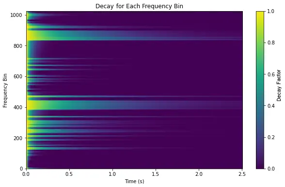
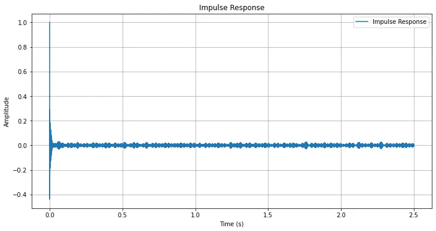
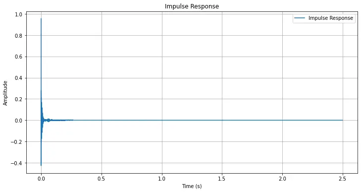

# Dereverberation Filter by Deconvolution with Frequency Bin Specific Faded Impulse Response

Stefan Ciba
Affiliation: [https://www.researchgate.net/profile/Stefan-Ciba](https://www.researchgate.net/profile/Stefan-Ciba)

###### Abstract

This work introduces a robust single-channel inverse filter for
dereverberation of non-ideal recordings, validated on real audio. The
developed method focuses on the calculation and modification of a
discrete impulse response in order to filter the characteristics from a
known digital single channel recording setup and room characteristics
such as early reflections and reverberations. The aim is a dryer and
clearer signal reconstruction, which ideally would be the direct-path
signal. The time domain impulse response is calculated from the cepstral
domain and faded by means of frequency bin specific exponential decay in
the spectrum. The decay rates are obtained by using the blind estimates
of reverberation time ratio between recorded output and test signals for
each frequency bin. The modified impulse response does filter a recorded
audio-signal by deconvolution. The blind estimation is well known and
stands out for its robustness to noise and non-idealities. Application
of the blind estimates for impulse response modification, in order to
filter characteristics by deconvolution, offer advantages in scenarios,
where adjustment for frequency bin specific reverberation and other
characteristics is crucial, such as in audio production, acoustic
simulation, or virtual reality applications. This filter accounts for
not optimal recording conditions and can be applied as one of the first
steps in processing of a single audio channel. Some real-time
applications can benefit from this method, but some might need to have
real-time or spatial adaption, when the impulse response changes during
the record and manual recalibration process would not be an option.
Estimation of a direct path signal is key to many applications.

   

|     |
| --- |
|     |

*K*eywords dereverberation $`\cdot`$ spectral impulse response
modification $`\cdot`$ inverse filtering method

## 1 Introduction

The field of digital audio signal processing has undergone significant
development since the advent of digital techniques in the 1960s and
1970s, which enabled to manipulate sound with unprecedented precision
and flexibility \[1, 2\].

Modeling and modification of the acoustic characteristics of room and
recording setups, based on convolution with impulse response, is a key
technique in digital audio processing. The Linear Time Invariant (LTI)
system approach consisting of convolution of a audio signal with a
measured or synthesized impulse response, makes it possible to e.g.
simulate reverberation, filter out early reflections, and compensate for
coloration introduced by the recording chain \[2, 3\].

Traditional methods for reverberation and dereverberation often rely on
parametric models or sparse representations of the impulse response \[3,
4\]. However, convolution with a sparse, spectrally modified impulse
response, that explicitly incorporates the $`T60`$ through exponential
decay function offers a direct and flexible approach for single-channel
dereverberation. This method enables targeted suppression of early
reflections, reverberation, and undesired recording characteristics,
based on established signal processing principles. This approach differs
from closely related state of the art work such as "Speech
Dereverberation in the Time-Frequency Domain" \[5\], "Approximation of
Real Impulse Response Using IIR Structures" \[6\] and "Representation
and Identification of Systems in the Discrete-Time Wavelet Transform
Domain" \[7\].

## 2 Signal processing

### 2.1 Periodic sine sweep for system identification

To characterize a system, a periodic linear sine sweep (chirp) can be
used as the test signal \[8\]. The frequency of the positive chirp
increases linearly from $`f_{0}`$ to $`f_{1}`$ within a duration $`T`$:

```math
\acute{x}(t)=\sin\left(2\pi\left[f_{0}t+\frac{f_{1}-f_{0}}{2T}t^{2}\right]\right),\quad t\in[0,T]. \tag{1}
```

The signals are being sampled with the sample rate $`f_{s}=48`$ kHz and
thus contain $`N=Tf_{s}`$ samples, counting $`n=0,1,2,...N-1`$. By
indexing with $`t_{n}=\frac{n\bmod N}{f_{s}}`$ the expression for the
positive chirp becomes discrete and periodic:

```math
\acute{x}_{n}=\sin\left(2\pi\left(f_{0}t_{n}+\frac{f_{1}-f_{0}}{2T}t_{n}^{2}\right)\right). \tag{2}
```

The chirp vector can be further extended for $`P`$ periods by array
tiling:

```math
x_{n}=\bigoplus_{p=0}^{P-1}\acute{x}_{n-pN}. \tag{3}
```

### 2.2 impulse response estimation

Given discrete time series $`x_{n}`$ and its recorded signal $`y_{n}`$
with $`N`$ samples, their relation can be described by a discrete LTI
system with $`y_{n}=x_{n}*h_{n}`$ \[9\]. Therein the impulse response
$`h_{n}`$ describes the signal chain, that can include unpleasant room
characteristics that cause e.g. early reflections, reverberation,
resonance and add non-linearity of the sensor and the loudspeaker.  
The impulse response can be decorrelated by deconvolution from the
related signals for system identification:

```math
h_{n}=y_{n}*x_{n}^{-1}. \tag{4}
```

The deconvolution method of choice is the frame-wise subtraction of the
test signal and the recorded signal in cepstral domain, followed by back
transformation into time domain. The impulse responses are subsequently
combined and normalized to get one time domain representation.  
The discrete time signals are split into $`N_{\text{frames}}`$ frames
with a frame length of $`N_{\text{DFT}}=5\cdot f_{s}`$, so the DFT size
was chosen in relation to the sample rate $`f_{s}`$, for the impulse
response to have a time duration that respects usual reverberation and
delay time. For each frame index $`\eta=0,1,2,...,N_{\text{frames}}-1`$
the frame boundaries are shifted over the signal with hop length
$`N_{hop}=\frac{N_{\text{DFT}}}{2}`$, which makes up a overlap of
$`o=50\%`$. The frequency bins are counted by index
$`\mu=0,1,2,...,N_{\text{DFT}-1}`$. In the same manner, the discrete
time step is respected by the index $`\nu`$, to count the samples in a
frame. Subbands can be expressed as angular frequency
$`\Omega=\frac{2\pi}{N_{\text{DFT}}}`$ times index $`\mu`$. DFT spectra
are processed frame by frame with rectangular window
$`\omega^{\text{(rect)}}_{\nu}`$.  
The complex windowed short-time spectrum is:

```math
\underline{Y}_{\mu,\eta}=\sum_{\nu=0}^{N_{\text{DFT}}-1}y_{\eta N_{hop}-\nu}\cdot\omega^{\text{(rect)}}_{\nu}e^{-j\Omega\nu}. \tag{5}
```

The original signal short time spectrum is $`\underline{X}_{\mu,\eta}`$.
The recorded short time spectrum is $`\underline{Y}_{\mu,\eta}`$. They
are regularized by
$`|\underline{X}_{\mu,\eta}|_{\varepsilon}=\max(|\underline{X}_{\mu,\eta}|,\varepsilon)`$
for numerical stability.

The real Cepstrum is obtained by transformation as follows:

```math
C^{(x)}_{\mu,\eta}=\Re\left\{\frac{1}{N_{\text{DFT}}}\sum_{\mu=0}^{N_{\text{DFT}}-1}\ln|\underline{X}_{\mu,\eta}|_{\varepsilon}e^{j\Omega\mu}\right\}. \tag{6}
```

In cepstral domain the deconvolutions are accomplished by subtractions,
in order to obtain the impulse responses:

```math
C^{(h)}_{\mu,\eta}=C^{(y)}_{\mu,\eta}-C^{(x)}_{\mu,\eta}. \tag{7}
```

The impulse responses transform back into the time domain vise versa.
Although the imaginary part should be zero, only the real part is used,
to prevent numerical errors:

```math
h_{\nu,\eta}=\Re\left\{\frac{1}{N_{\text{DFT}}}\sum_{\mu=0}^{N_{\text{DFT}}-1}\overbrace{e^{\left(\sum_{\mu=0}^{N_{\text{DFT}}-1}C^{(h)}_{\mu,\eta}e^{-j\Omega\mu}\right)}}^{H_{\mu,\eta}}e^{j\Omega\mu}\right\}. \tag{8}
```

The impulse responses accumulate by averaging:

```math
\overline{h}_{\nu}=\frac{1}{N_{\text{frames}}}\sum_{\eta=0}^{N_{\text{frames}}-1}h_{\nu,\eta}. \tag{9}
```

To ensure the impulse response has a consistent scale, with maximum
absolute value $`1`$, it is normalized:

```math
h_{\nu}=\frac{\overline{h}_{\nu}}{\max_{\nu}|\overline{h}_{\nu}|}. \tag{10}
```

These steps yield a single, normalized impulse response, that is
suitable as a good overall representation.

### 2.3 Spectral impulse response modification

The time domain impulse response, e.g. from equation (10), is
transformed by STFT, to fade frequency bins based on blind $`T60`$
estimate.

#### 2.3.1 Blind estimation of $`T60`$ reverberation times for each bin

The ISO 3382 standard \[10\] formally defines $`T60`$ as the time
required for spatial sound energy to decay by 60 dB. This work uniquely
uses blind estimate of $`T60`$, despite the impulse response is known,
to shape the impulse response for each frequency bin, targeting specific
acoustic and system artifacts for deconvolution filter, which is an
approach not yet found in literature. Furthermore the $`T60`$
reverberation time is a quantity that is traditionally used for
measurement, characterizing and shaping room acoustics usually as a
global or band-averaged parameter  \[11\]. Ratnam et al. propose an
Maximum Likelihood (ML) algorithm for a blind single-channel $`T60`$
estimate\[12\]. To do the frequency bin specific modifications on the
impulse response, the necessary array of decay is obtained by the
following procedure.  
The Power Spectral Density (PSD) for a discrete signal $`x_{n}`$ is its
STFT magnitude squared:

```math
S_{\mu,\eta}=|\underline{X}_{\mu,\eta}|^{2}. \tag{11}
```

The energy for each frequency bin is:

```math
E_{\mu,\eta}=\frac{\sum_{\eta^{\prime}=\eta}^{N_{\text{frames}}-1}S_{\mu,\eta^{\prime}}}{\sum_{\mu^{\prime}=0}^{N_{\text{DFT}}-1}S_{\mu,\eta^{\prime}}}. \tag{12}
```

The $`T60`$ time for each frequency bin is defined as the time it takes
for the cumulative energy to fall below a threshold (e.g., 0.001,
corresponding to -60 dB of magnitude):

```math
\eta^{\text{(T60)}}_{\mu}=\min\left\{\eta:E_{\mu,\eta}<0.001\right\}. \tag{13}
```

The overlap factor is:

```math
o=1-\frac{N_{hop}}{N_{\text{DFT}}}, \tag{14}
```

the $`T60`$ estimate in seconds for every frequency bin is:

```math
T60_{\mu}=\frac{o\cdot\eta^{\text{(T60)}}_{\mu}}{f_{s}}. \tag{15}
```

#### 2.3.2 Application of the decay function

The ratio $`\rho`$ between the $`T60`$’s of the original test signal
$`x_{n}`$ and its recorded signal $`y_{n}`$, weights the exponential
decay for every frequency bin:
$`\rho^{\text{(T60's)}}_{\mu}=\frac{T60_{\mu}(y_{n})}{T60_{\mu}(x_{n})}`$.

With the frame wise time duration
$`\tau=\eta\cdot\frac{N_{hop}}{f_{s}}`$, the exponential decay function
is:

```math
D_{\mu,\eta}=e^{\left(-\frac{\tau}{\rho^{\text{(T60's)}}_{\mu}}\right)}. \tag{16}
```

The frame wise decay modified impulse response is:

```math
h^{\prime}_{\nu,\eta}=\frac{1}{N_{\text{DFT}}}\sum_{\mu=0}^{N_{\text{DFT}}-1}\underline{H}_{\mu,\eta}\cdot D_{\mu,\eta}\text{ }e^{-j\Omega\mu}. \tag{17}
```

The synthesis window (Hann) is applied by
$`\omega^{\text{(hann)}}_{\nu}`$ \[2\] and furthermore the overlap has
to be handled, done by Constant Overlap Add Method (COLA):

```math
h^{\prime}_{n}=\sum_{\begin{subarray}{c}\eta\\
0\leq n-\eta N_{hop}<N_{\text{DFT}}\end{subarray}}{\omega^{\text{(hann)}}_{n-\eta N_{hop}}\cdot h^{\prime}_{n-\eta N_{hop},\eta}}. \tag{18}
```

### 2.4 Filterbank application

Additional overall exponential decay $`dk`$ can be applied to the
modified impulse response
$`h^{\prime\prime}_{n}=h^{\prime}_{n}\cdot e^{-dk\cdot n}`$ to avoid
echoes. Finally, the modified impulse response is applied as spectral
filter bank $`\underline{H}^{\prime\prime}_{\mu,\eta}`$ for any recorded
signal spectrum $`\underline{Z}_{\mu,\eta}`$ by deconvolution:

```math
\underline{Z}^{\prime\prime}_{\mu,\eta}=\frac{\underline{Z}_{\mu,\eta}}{\underline{H}^{\prime\prime}_{\mu,\eta}}. \tag{19}
```

Hann-windowing applies for STFT and iSTFT. The COLA method applies for
iSTFT, respectively. The frame size was set to number of samples of the
impulse response and gain was normalized by strictly preventing clipping
if necessary to get the desired filtered signal
$`\hat{z}^{\prime\prime}_{n}=z^{\prime\prime}_{n}/max(|z^{\prime\prime}_{n}|)`$.

## 3 Test setup

A sine-sweep and a speech audio was recorded by integrated microphone
from a Convertible Workstation ([HP ZBook Studio x360 G5
(6TW61EA#ABD)](https://web.archive.org/web/20201031164451/https://h20195.www2.hp.com/v2/GetDocument.aspx?docname=c05939925)),
on a desk, located in a pitched roof area corner of a living room, that
has about 1 Ar. The sine-sweep sound was played back from the internal
loudspeakers of the Convertible Workstation. The integrated noise
reduction was turned off. The goal was to improve the speech sound
quality with the aim of having dry and clear sound when speaker sits in
front of the Convertible Workstation. A Futher assumption was, that
degraded speech intelligibility could get better.

In the same manner the sine-sweep and a drum-set groove have been
recorded from the same location. The sine-sweep was played back on a
[Alesis Active M1 MKII
(8N)](https://ia601909.us.archive.org/31/items/manualsbase-id-372739/372739.pdf)
near-field monitor beside the drum-set. The goal was to have dry and
clear studio-like raw recording quality despite poor
recording-conditions.

## 4 Objectives

Several objective measures prove the applicability of the Method. Some
Measures are used to compare the system impulse response with the
filtered impulse response, and some are used to compare a filtered with
a unfiltered signal.

A Logarithmic Signal-Power Attenuation (LPA) was calculated to indicate
the efficiency of the filter by taking the original signal $`z_{n}`$ and
the filtered audio signal $`z^{\prime\prime}_{n}`$ into account:

```math
LPA=10log_{10}\left(\frac{\overline{(z^{\prime\prime}_{n}-\overline{z^{\prime\prime}_{n}})^{2}}}{\overline{(z_{n}-\overline{z_{n}})^{2}}}\right). \tag{20}
```

The Short-Time Objective Intelligibility Measure (STOI) measures the
speech intelligibility \[13\]. It is only applicable to speech audio.
The Perceptual Evaluation of Speech Quality (PESQ) is an algorithm that
models human auditory perception, capturing effects like distortion,
background noise, clipping, and delay. It measures Mean Opinion Score,
Listening Quality Objective (MOS-LQO), which is basically the clarity of
an audio channel, which is also necessary for non-speech audio channels.
Higher MOS-LQO indicate better quality of the audio channel. It is
widely used in telecom, VoIP, and audio processing to measure speech
enhancement or degradation \[14\].

Zwicker’s time-varying Loudness model estimates how intense or loud a
sound is perceived by human listeners \[15\].

Sharpness from DIN 45692 standard (Zwicker’s model) quantifies how
piercing or shrill sound feels, based on how present the frequencies
above 3kHz are \[16\].

Roughness measures how harsh or "fluttery" a sound feels, linked to
rapid, audible amplitude fluctuations in the range most noticeable to
human ears (20–300Hz modulation) \[17\].

The Definition Ratio, D50, is the ratio of early to total energy within
50 ms \[18\]. It was used to indicate how present reverberations and
late reflexions are in the impulse response.

The Algorithms to measure perceptive sound quality can be used from the
Modular Sound Quality Index Toolbox
[(MoSQITo)](https://github.com/Eomys/MoSQITo) \[19\] \[20\],
[PESQ](https://github.com/ludlows/python-pesq.git) \[21\] and the
[STOI](https://github.com/mpariente/pystoi) \[22\], respectively.
Further measures have been evaluated by proprietary software, namely the
Cubase 5.0.1 build 147 ([Steinberg Media Technologies
GmbH](https://o.steinberg.net/index.php?id=1782&L=1)) \[23\].

The measures to compare the unfiltered and filtered signals can be found
in the Results section table 1.

## 5 Results

The filter has several well defined effects, which appear in the
objective results table 1. Because reverberations are filtered from the
signal, the signal amplitude and power decreases. The LPA measure shows
that effect in one figure and gives it a name. The most significant
estimated pitch of the audio increases, which is due to filtered room
characteristic that allowed deeper frequencies to fade slowly. The
filter decreases the $`T60`$ as expected, at least for those frequencies
that showed reverberation. Loudness, which can be unpleasant, decreases,
but sharpness increases, as result of the filter. Roughness is almost
untouched by the filter, a slight decrease can be observed. The D50
shows, that reflections after 50ms disappeared.

|                      |                                  |                                                 |                             |                                            |
| -------------------- | -------------------------------- | ----------------------------------------------- | --------------------------- | ------------------------------------------ |
|                      | Drum Record degraded ($`z_{n}`$) | Drum Record filtered ($`z^{\prime\prime}_{n}`$) | Speech degraded ($`z_{n}`$) | Speech filtered ($`z^{\prime\prime}_{n}`$) |
| min sample value^(∗) | -1                               | -0.919                                          | -0.045                      | -0.045                                     |
| max sample value^(∗) | +1                               | +0.948                                          | 0.046                       | 0.043                                      |
| peak amplitude^(∗)   | 0dB                              | -0.46dB                                         | -26.75dB                    | -27.43dB                                   |
| DC offset^(∗)        | \-$`\infty`$dB                   | \-$`\infty`$dB                                  | -85.30dB                    | -86.44dB                                   |
| Estimated Pitch^(∗)  | 2248.0Hz / C#6                   | 9649.6Hz / D8                                   | 1445.2Hz / F#5              | 1530.5Hz / G5                              |
| Min RMS Power^(∗)    | \-$`\infty`$dB                   | \-$`\infty`$dB                                  | -61.03dB                    | -63.28dB                                   |
| Max RMS Power^(∗)    | -1.84dB                          | -12.54dB                                        | -32.82dB                    | -32.61dB                                   |
| Average^(∗)          | -14.38dB                         | -28.84dB                                        | -41.34dB                    | -41.27dB                                   |
| LPA                  | -16.29dB                         |                                                 | $`7.63\cdot 10^{-5}`$dB     |                                            |
| $`T60`$              | 5.475ms                          | 0.186ms                                         | 0.1816ms                    | 0ms                                        |
| STOI                 | N/A                              | N/A                                             | 0.9978                      | 0.9978                                     |
| $`\Delta`$ STOI      | N/A                              |                                                 | 0                           |                                            |
| MOS-LQO              | 4.4202                           | 4.5314                                          | 4.6308                      | 4.6337                                     |
| $`\Delta`$ MOS-LQO   | $`0.1112`$                       |                                                 | $`2.9\cdot 10^{-3}`$        |                                            |
| Loudness             | 0.90320                          | 0.30145                                         | 0.14764                     | 0.14393                                    |
| Roughness            | 0.23022                          | 0.22169                                         | 0.21995                     | 0.21946                                    |
| Sharpness            | 3.26095                          | 3.95266                                         | 3.09846                     | 3.16039                                    |
| D50                  | $`42.9\%`$                       | $`100.0\%`$                                     | $`71.7\%`$                  | $`100.0\%`$                                |

Table 1: Objective measures. Statistics with asterisk (name^(∗)) derived
from Cubase 5.0.1 build 147.

The original and the modified impulse response of the speech audio
recording setup are shown in numerical plot 2. Slow fading, early
reflections and some unwanted behavior, that account for late
reflections, can be seen in the original unmodified impulse response.
The filter decreases the unwanted behaviors selectively for the
frequency bins based on the $`T60`$ decay matrix in numerical plot 1.
Because the impulse response from the speech record was different from
the drum record, filter results differ a lot. The STOI measure stays
untouched by the filter: No speech enhancement and no speech degradation
due to filtering: No noise was added or subtracted to the speech sample
due to filtering. Unexpectedly, but for obvious reason, the $`T60`$
decreased to zero after filtering in the speech audio.



Figure 1: The $`T60`$ decay matrix.



(a) Original.



(b) Modified.

Figure 2: Impulse response.

## 6 Conclusion

The filter is designed aggressively on purpose and filters out
reverberation and produces a dry and clear sound with a minimum of room
and recording setup characteristic, allowing the direct path signal to
be dominant. However, as the filter does exactly what it should, the
output might need further processing for more pleasant sound
characteristic, but is obviously a excellent start for further audio
processing.

## 7 Supplements

The Python-code of the studied method and audio samples are to be found
at GitHub:
[https://github.com/fanci90/Digital-Deconvolution-Audio-Filter-repo.git](https://github.com/fanci90/Digital-Deconvolution-Audio-Filter-repo.git).

## Acknowledgments

The author gratefully acknowledges Simon Ciba, M.A., known for e.g.
"WhisPER – A New Tool for Performing Listening Tests", from the Audio
Communication Group, TU Berlin, for his careful review of this work and
his valuable comments.

## References

- \[1\] A. V. Oppenheim, R. W. Schafer, _Discrete-Time Signal
  Processing_, Prentice Hall, 1989.  
  ISBN: 0-13-216292-X
- \[2\] Julius O. Smith III, _Spectral Audio Signal Processing_, W3K
  Publishing, 2011.  
  Available online:
  [https://ccrma.stanford.edu/~jos/sasp/](https://ccrma.stanford.edu/~jos/sasp/).
- \[3\] J. A. Moorer, About this reverberation business, _Computer Music
  Journal_, vol. 3, no. 2, pp. 13–28, 1979. doi:10.2307/3680287.
- \[4\] E. A. P. Habets, Single- and multi-microphone speech
  dereverberation using spectral enhancement, Ph.D. dissertation,
  Technische Universität Eindhoven, The Netherlands, 2007.  
  [https://research.tue.nl/files/1972985/200710970.pdf](https://research.tue.nl/files/1972985/200710970.pdf).
- \[5\] A. Oyzerman, I. Cohen, Speech Dereverberation in the
  Time-Frequency Domain, M.Sc. Thesis, Technion, 2012.  
  [https://israelcohen.com/wp-content/uploads/2018/05/AnnaOyzerman_MSc_2012.pdf](https://israelcohen.com/wp-content/uploads/2018/05/AnnaOyzerman_MSc_2012.pdf).
- \[6\] A. Primavera et al., Approximation of Real impulse response
  Using IIR Structures, Proc. EUSIPCO, 2011.  
  [https://www.eurasip.org/Proceedings/Eusipco/Eusipco2011/papers/1569422051.pdf](https://www.eurasip.org/Proceedings/Eusipco/Eusipco2011/papers/1569422051.pdf).
- \[7\] I. Cohen, Representation and Identification of Systems in the
  Discrete-Time Wavelet Transform Domain, IEEE Trans. Signal Processing, 2007.  
  [https://israelcohen.com/wp-content/uploads/2018/05/ASM2007.pdf](https://israelcohen.com/wp-content/uploads/2018/05/ASM2007.pdf).
- \[8\] A. Farina, Simultaneous measurement of impulse response and
  distortion with a swept-sine technique, _AES Convention 108_, 2000.  
  [https://www.aes.org/e-lib/browse.cfm?elib=10211](https://www.aes.org/e-lib/browse.cfm?elib=10211).
- \[9\] N. Fliege, _Systemtheorie_. B. G. Teubner Stuttgart 1991
  (Informationstechnik).  
  ISBN: 3-519-06140-6
- \[10\] ISO 3382-1:2009, _Acoustics – Measurement of room acoustic
  parameters – Part 1: Performance spaces_.  
  [https://www.iso.org/standard/40979.html](https://www.iso.org/standard/40979.html)
  (Standard available for purchase, but methods widely referenced in
  open literature).
- \[11\] H. Kuttruff, _Room Acoustics_ (6th ed.), CRC Press, 2016. (Open
  access chapters available)  
  ISBN: 978-1498740436
- \[12\] R. Ratnam et al., _Blind Estimation of Reverberation Time_, J.
  Acoust. Soc. Am., 114(5), pp. 2877-2892, 2003.  
  [https://www.ee.columbia.edu/~dpwe/papers/Ratnam03-reverb.pdf](https://www.ee.columbia.edu/~dpwe/papers/Ratnam03-reverb.pdf)
- \[13\] Taal, Cees H. and Hendriks, Richard C. and Heusdens, Richard
  and Jensen, Jesper, _A short-time objective intelligibility measure
  for time-frequency weighted noisy speech_, 2010 IEEE International
  Conference on Acoustics, Speech and Signal Processing. Pages
  4214-4217, DOI: 10.1109/ICASSP.2010.5495701.
- \[14\] (ITU), I. T. U.: Rec. p.862: Perceptual evaluation of speech
  quality(pesq): An objective method for end-to-end speech quality
  assessment of narrow-band telephone networks and speechcodecs. 2001.
- \[15\] ISO 532-2:2017(E), Acoustics — Methods for calculating loudness
  — Part 2: Moore-Glasberg method, International Organization for
  Standardization, Geneva, 2017.  
  [https://cdn.standards.iteh.ai/samples/63078/a42f5c5bd7014d5f99cc3a7d4fa0c0c9/ISO-532-2-2017.pdf](https://cdn.standards.iteh.ai/samples/63078/a42f5c5bd7014d5f99cc3a7d4fa0c0c9/ISO-532-2-2017.pdf).
- \[16\] HEAD Acoustics, Psychoacoustic Analyses I: Loudness and
  Sharpness Calculation, Application Note, 201x.  
  [https://cdn.head-acoustics.com/fileadmin/data/global/Application-Notes/SVP/Psychoacoustic-Analyses-I_e.pdf](https://cdn.head-acoustics.com/fileadmin/data/global/Application-Notes/SVP/Psychoacoustic-Analyses-I_e.pdf).
- \[17\] H. Fastl, Psychoacoustic Basis of Sound Quality Evaluation,
  Technical University of Munich, 2006.  
  [https://mediatum.ub.tum.de/doc/1138486/729841.pdf](https://mediatum.ub.tum.de/doc/1138486/729841.pdf).
- \[18\] T. Houtgast and H. J. M. Steeneken, A review of the MTF concept
  in room acoustics and its use for estimating speech intelligibility,
  Journal of the Acoustical Society of America, vol. 77, no. 3,
  pp. 1069–1077, 1985.
- \[19\] Green Forge Coop. MOSQITO (Version 1.1.1).  
  [https://doi.org/10.5281/zenodo.10629475](https://doi.org/10.5281/zenodo.10629475)
- \[20\] Eomys Engineering, Modular Sound Quality Index Toolbox
  (MoSQITo), 2025.  
  [https://github.com/Eomys/MoSQITo](https://github.com/Eomys/MoSQITo)
- \[21\] C. Ludlow, python-pesq: Perceptual Evaluation of Speech Quality
  (PESQ), 2025.  
  [https://github.com/ludlows/python-pesq.git](https://github.com/ludlows/python-pesq.git)
- \[22\] M. Pariente, pystoi: Short-Time Objective Intelligibility
  (STOI), 2025.  
  [https://github.com/mpariente/pystoi](https://github.com/mpariente/pystoi)
- \[23\] Steinberg Media Technologies GmbH, Cubase 5.0.1 build 147
  \[Computer Software\], 2009.  
  [https://o.steinberg.net/index.php?id=1782&L=1](https://o.steinberg.net/index.php?id=1782&L=1)
