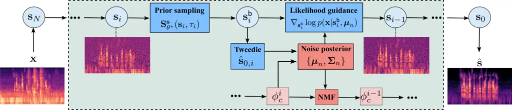
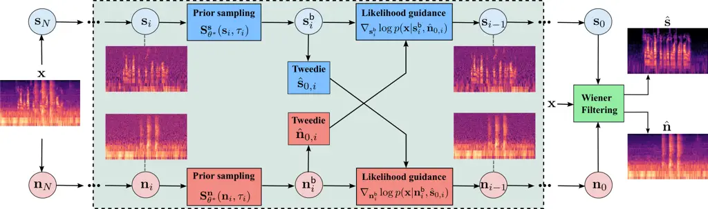

# Diffusion-based Frameworks for Unsupervised Speech Enhancement Thanks: J.-E. Ayilo, M. Sadeghi, and R. Serizel are with the Multispeech team, Université de Lorraine, CNRS, Inria, Loria, Nancy, France.Thanks: X. Alameda-Pineda is with the RobotLearn team, Université Grenoble Alpes, Inria, Grenoble, France.Thanks: This work was supported by the French National Research Agency (ANR) under the project REAVISE (ANR-22-CE23-0026-01).

Jean-Eudes Ayilo    Mostafa Sadeghi    Romain Serizel    Xavier
Alameda-Pineda

###### Abstract

This paper addresses _unsupervised_ diffusion-based single-channel
speech enhancement (SE). Prior work in this direction combines a
score-based diffusion model trained on clean speech with a Gaussian
noise model whose covariance is structured by non-negative matrix
factorization (NMF). This combination is used within an iterative
expectation–maximization (EM) scheme, in which a diffusion-based
posterior-sampling E-step estimates the clean speech. We first revisit
this framework and propose to explicitly model both speech and acoustic
noise as latent variables, jointly sampling them in the E-step instead
of sampling speech alone as in previous approaches. We then introduce a
new semi-supervised SE framework that replaces the NMF noise prior with
a diffusion-based noise model, learned jointly with the speech prior in
a single conditional score model. Within this framework, we derive two
variants: one that implicitly accounts for noise and one that explicitly
treats noise as a latent variable. Experiments on WSJ0--QUT and
VoiceBank--DEMAND show that explicit noise modeling systematically
improves SE performance for both NMF-based and diffusion-based noise
priors. Under matched conditions, the diffusion-based noise model
attains the best overall quality and intelligibility among unsupervised
methods, while under mismatched conditions the proposed NMF-based
explicit-noise framework is more robust and suffers less degradation
than several supervised baselines. Code, demo, and supplementary
materials are publicly available.¹¹ 1
[https://github.com/jeaneudesAyilo/enudiffuse](https://github.com/jeaneudesAyilo/enudiffuse)

###### Index Terms: 

Unsupervised speech enhancement, diffusion models, posterior sampling,
non-negative matrix factorization.

## I Introduction

Speech enhancement (SE) is a widely studied speech restoration task that
aims to recover an underlying clean speech signal from a noisy
recording. With the rise of deep neural networks (DNNs) and the
development of diverse architectures and learning paradigms, substantial
progress has been achieved in SE \[49\], in both supervised and
unsupervised settings. Supervised methods require clean–noisy speech
training pairs, whereas unsupervised methods rely on clean speech only,
noisy speech only, or unpaired clean and noisy speech data, but never on
clean–noisy speech pairs. These broad families of SE methods can be
further refined by distinguishing between generative and non-generative
training, leading to four categories: supervised non-generative \[26,
51, 19, 49\], supervised generative \[31, 25, 23, 57, 39\], unsupervised
non-generative \[1, 15, 52, 44, 53\], and unsupervised generative \[54,
14, 3, 5, 30, 2, 38\]. The main motivation for unsupervised methods is
to improve the generalization of trained DNNs to unseen (mismatched)
conditions, without requiring large and diverse paired datasets, which
are often impractical to collect in real-world scenarios. Nevertheless,
under matched conditions, they typically exhibit a performance gap
compared to their supervised counterparts  \[5\].

Generative SE methods explicitly or implicitly model the prior
distribution of speech and/or noise, and have recently gained renewed
interest with the advent of diffusion models \[24\]. Indeed, the high
quality of images, videos, and audio generated by diffusion models
demonstrates their ability to act as powerful data priors. This has
encouraged research on diffusion-based SE in both supervised and
unsupervised settings. The particular case of unsupervised
diffusion-based SE, which is the focus of this paper, offers the
possibility of using diffusion models as strong priors over audio data
(for both speech and noise), without relying on paired datasets.

An early line of work on this topic is that of Berné et al. \[30\],
followed by \[2, 38\], where a score-based diffusion model trained on a
clean-speech corpus is used as a generative prior for speech, while the
acoustic noise prior is modeled as a Gaussian distribution with a NMF
(NMF)-structured covariance. To perform SE, an iterative
Expectation–Maximization (EM) procedure is implemented, where the E-step
applies diffusion posterior sampling to estimate the clean speech, and
the M-step updates the noise parameters. Such a methodology provides a
task-agnostic pre-trained prior, which could be reused for different
restoration tasks without retraining \[24\]. This approach is not
limited to speech processing. In image restoration, for example, a
diffusion model is trained on a clean image dataset and leveraged at
inference together with optimized parametric operators modeling the
degradation affecting the images \[10\]. For blind image deblurring,
Chung et al. \[7\] train two diffusion models, one serving as a
clean-image prior and the other as a deblurring-kernel prior.

In the audio processing domain, similar ideas of using parallel
diffusion models over both speech and acoustic noise have been proposed
\[56, 28\]. Yemini et al. \[56\] perform audio-visual speech separation
in the presence of noise by training a diffusion model as a clean speech
prior conditioned on lips video, and another diffusion model as an
acoustic noise prior. In the context of music source separation, Mariani
et al. \[28\] train separate diffusion models for each independent
source, and accordingly perform diffusion posterior sampling at
inference to estimate the sources.

In the unsupervised diffusion-based SE works \[30, 2, 38\], the sampled
clean speech and the estimated noise parameters during inference must
jointly reconstruct the observed noisy speech to ensure data consistency
in the likelihood. Noticeably, while the clean speech is sampled from
its posterior distribution during the E-step, the noise is not
explicitly sampled from a posterior distribution. Instead, only the NMF
parameters defining the noise covariance are estimated during the
M-step. This avoids the need to handle the joint speech–noise posterior,
but it also means that the noise signal itself is never explicitly
reconstructed during inference. We argue that optimizing the noise
parameters in the M-step, without explicitly reconstructing the noisy
observation as the sum of the estimated clean speech and acoustic noise,
may lead either to poor data consistency or to well-verified data
consistency but poor speech estimates due to inaccurate acoustic noise
modeling. Besides, we hypothesize that modeling the acoustic noise with
a more powerful model than NMF might improve SE.

In light of these findings, we propose new unsupervised diffusion-based
SE frameworks that further reduce the performance gap with supervised
approaches. Our contributions are threefold. Firstly, we present a
comprehensive and unified description of previous work on unsupervised
diffusion-based SE before introducing our new approaches, which build
upon this unified formulation. Secondly, we go beyond \[2\], which
models the acoustic noise as a Gaussian distribution with a covariance
structured by NMF, and propose to explicitly sample the acoustic noise
from its posterior distribution. This entails treating the acoustic
noise, similarly to the speech signal, as a latent variable within the
observed noisy speech. The main technical difficulty is that this leads
to an intractable joint posterior over speech and noise. We address this
by deriving a practical approximate EM inference scheme, in which the
E-step uses Gibbs sampling to alternate between diffusion-based
posterior sampling of speech and an explicit posterior update of noise,
while the M-step updates the NMF parameters. Thirdly, we propose to use
a pre-trained diffusion-based prior model for noise, analogous to the
approach used for speech, instead of the NMF-based model. Specifically,
we present two algorithmic variants: one that does not treat the
acoustic noise as a latent variable, and another that does, performing
alternating diffusion-based posterior sampling to estimate both the
clean speech and the acoustic noise. Contrary to \[7, 56, 28\], which
use separate diffusion models for the independent components of the
mixture, our diffusion-based priors for speech and noise are trained
jointly, thus reducing the number of models that must be trained.
Moreover, the likelihood approximation technique used in the posterior
inference of our approach is much simpler and lighter.

Experiments on the WSJ0-QUT \[21\] and VoiceBank-DEMAND \[6\] datasets
demonstrate that modeling noise as a latent variable, whose prior is
either a Gaussian with an NMF-based covariance structure or a
diffusion-based prior, improves the SE performance. Under mismatched
conditions, the framework with an NMF-based noise covariance and
explicit latent noise modeling outperforms its diffusion-based
counterparts and exhibits less performance degradation than supervised
baselines when evaluated on unseen data.

We structure the remainder of the paper as follows. In Sections II
and III, we review the fundamentals of score-based diffusion models
(training and prior sampling), as well as unsupervised SE methods \[30,
2, 38\] that combine diffusion models with NMF. Section IV introduces
our approach, which explicitly considers acoustic noise as a latent
variable and performs SE using diffusion models with NMF. Section V
presents our framework that uses diffusion-based prior models for both
speech and noise data. The experimental setup and results are provided
in Section VI. Finally, we conclude in Section VII.

## II Audio generative modeling with diffusion

In this section, we review the score-based generative diffusion model,
which forms the basis for both the previously proposed unsupervised SE
methods and the new approaches introduced in this work. We model audio
in the complex-valued STFT (STFT) domain. For simplicity, a 2D STFT
array with $`F`$ frequency bins and $`L`$ time frames is represented by
a flattened 1D vector $`\mathbf{a}\in\mathbb{C}^{FL}`$. We use
$`\mathbf{a}`$ to denote a generic audio signal (either speech or
background noise), so that all equations apply to both cases. When
needed, we write $`\mathbf{s}`$ and $`\mathbf{n}`$ specifically for
speech and noise, respectively.

### II-A Diffusion modeling framework

Given a training set of audio data, the goal of a score-based diffusion
model is to approximate the underlying data distribution
$`p_{\text{data}}(\mathbf{a})`$. This line of work builds on score
matching, which seeks to approximate the (generally intractable) score
function $`\nabla_{\mathbf{a}}\log p(\mathbf{a})`$ so that new samples
can be generated using this estimated score. In particular, denoising
score matching \[48\] learns a neural network $`\mathbf{S}_{\theta}`$ to
predict the gradient of the log-density of data that have been corrupted
by additive Gaussian noise. \[40\] generalizes this idea by introducing
multiple noise scales, and \[42\] further extends it by defining a
continuous-time corruption process via a SDE (SDE) that gradually
transforms data samples into Gaussian noise. This continuous-time
corruption process is defined by the forward SDE:

```math
\textrm{d}\mathbf{a}_{t}=\mathbf{f}(\mathbf{a}_{t})\textrm{d}t+g(t)\textrm{d}\mathbf{w}, \tag{1}
```

where $`\mathbf{w}`$ denotes a standard Wiener process, $`\mathbf{f}`$
is the drift coefficient, and $`g(t)`$ is the diffusion coefficient
controlling the noise scale. We set
$`\mathbf{f}(\mathbf{a}_{t})=-\gamma\mathbf{a}_{t}`$, where $`\gamma`$
is a constant parameter.

The perturbation kernel associated with this SDE allows us to sample
$`\mathbf{a}_{t}`$ directly from a clean sample $`\mathbf{a}`$:

```math
p_{0t}(\mathbf{a}_{t}|\mathbf{a})=\mathcal{N}_{\mathbb{C}}(\delta_{t}\mathbf{a},\sigma(t)^{2}\mathbf{I}), \tag{2}
```

where $`\delta_{t}=\exp(-\gamma t)`$ and $`\sigma(t)^{2}`$ is derived
from the SDE.

To learn the score function, a neural network
$`\mathbf{S}_{\theta}(\mathbf{a}_{t},t)`$ is trained using the following
objective:

```math
\theta^{*}=\operatornamewithlimits{argmin}_{\theta}\mathbb{E}_{t,\mathbf{a},\bm{\zeta}}\Big[\|\sigma(t)\mathbf{S}_{\theta}(\mathbf{a}_{t},t)+\bm{\zeta}\|_{2}^{2}\Big], \tag{3}
```

where $`\bm{\zeta}\sim\mathcal{N}_{\mathbb{C}}(\bm{0},\mathbf{I})`$ is
the complex-valued zero-mean Gaussian noise used to corrupt the input
data. Once trained, the score network can be used to generate new data
samples via the reverse SDE, which under mild regularity assumptions, is
given by \[42\]:

```math
\textrm{d}\mathbf{a}_{t}=\big[\mathbf{f}(\mathbf{a}_{t})-g(t)^{2}\nabla_{\mathbf{a}_{t}}\log p_{t}(\mathbf{a}_{t})\big]\textrm{d}t+g(t)\textrm{d}\overline{\mathbf{w}}, \tag{4}
```

where $`\overline{\mathbf{w}}`$ is a standard Wiener process running
backward in time, and $`\textrm{d}t`$ is a negative time increment.

This reverse SDE progressively transforms a Gaussian noise sample into a
clean data sample. Since the score
$`\nabla_{\mathbf{a}_{t}}\log p_{t}(\mathbf{a}_{t})`$ is unknown, it is
approximated by the learned score network $`\mathbf{S}_{\theta}`$.
Sampling is then performed by numerically solving the reverse SDE. In
our work, we adopt the PC (PC) sampler from \[42, 36\], which is
described in the next section.

### II-B Diffusion prior sampling formulation

The predictor step of the PC sampler uses the Euler–Maruyama method to
numerically integrate the reverse SDE (4) in discrete time. This yields
a finite sequence of latent variables $`\{\mathbf{a}_{i}\}_{i=0}^{N}`$
forming a Markov chain
$`\mathbf{a}_{0}\rightarrow\mathbf{a}_{1}\rightarrow\ldots\rightarrow\mathbf{a}_{N}`$,
whose joint distribution factorizes as

```math
p(\mathbf{a}_{0},\ldots,\mathbf{a}_{N})=p(\mathbf{a}_{N})\prod_{i=1}^{N}p(\mathbf{a}_{i-1}\mid\mathbf{a}_{i}). \tag{5}
```

Discretizing (4) and inserting the score model leads to:

```math
{\mathbf{a}}_{{i-1}}={\mathbf{a}}_{i}-\mathbf{f}_{i}\Delta{\tau}+g_{\tau_{i}}^{2}\mathbf{S}_{\theta^{*}}(\mathbf{a}_{i},\tau_{i})\Delta{\tau}+g_{\tau_{i}}\sqrt{\Delta{\tau}}\bm{\zeta} \tag{6}
```

with $`\mathbf{a}_{N}\sim\mathcal{N}_{\mathbb{C}}(\bm{0},{\bf I})`$.
Here, $`\{\tau_{1},\ldots,\tau_{N}\}=\{i.T/N\}_{i=1}^{N}`$ is an equally
spaced sequence of time steps in $`[0,T]`$ with a discretization width
of $`\Delta{\tau}=T/N`$,
$`\bm{\zeta}\sim\mathcal{N}_{\mathbb{C}}(\bm{0},{\bf I})`$, and
$`\mathbf{f}_{i}=-\gamma\mathbf{a}_{i}`$. Applying a similar
discretization to the forward SDE in (1), we obtain the perturbation
kernel:

```math
p(\mathbf{a}_{i}|\mathbf{a}_{0})=\mathcal{N}_{\mathbb{C}}(\delta_{i}\mathbf{a}_{0},\sigma_{\tau_{i}}^{2}\mathbf{I}),\quad i\geq 1,\quad\delta_{i}=\exp(-\gamma\tau_{i}). \tag{7}
```

The predictor step given by (6) can be refined by first applying a
corrector step to its input $`\mathbf{a}_{i}`$. Following \[42\], we use
Langevin Markov Chain Monte Carlo (MCMC) sampling as the corrector. This
consists of updating $`\mathbf{a}_{i}`$ via a gradient-ascent step on
the log-density, augmented with Gaussian noise, so as to move towards
regions of higher probability, where the gradient term is the estimated
score function. Overall, the prior sampling is then characterized by the
following backward transition distribution:

```math
p(\mathbf{a}_{{i-1}}|\mathbf{a}_{i})=\mathcal{N}_{\mathbb{C}}\Big(\bm{\mu}^{\mathsf{back}}(\mathbf{a}_{i}),\bm{\Sigma}^{\mathsf{back}}_{i}\Big), \tag{8}
```

with

```math
\left\{\mathopen{}\begin{array}[]{l}\bm{\mu}^{\mathsf{back}}(\mathbf{a}_{i})=\mathbf{h}({\mathbf{a}}_{i})-\mathbf{f}_{i}\Delta{\tau}+g_{\tau_{i}}^{2}\mathbf{S}_{\theta^{*}}(\mathbf{h}({\mathbf{a}}_{i}),\tau_{i})\Delta{\tau}\\[5.69054pt]
\bm{\Sigma}^{\mathsf{back}}_{i}=g_{\tau_{i}}^{2}\Delta{\tau}{\bf I}.\end{array}\right. \tag{9}
```

where $`\mathbf{h}({\mathbf{a}}_{i})`$ is the result of one-step
Langevin MCMC:

```math
\mathbf{h}({\mathbf{a}}_{i})=\mathbf{a}_{i}+\epsilon_{\tau_{i}}{\mathbf{S}_{\theta^{*}}(\mathbf{a}_{i},\tau_{i})}+\sqrt{2\epsilon_{\tau_{i}}}\bm{\zeta},\quad\bm{\zeta}\sim\mathcal{N}_{\mathbb{C}}(\mathbf{0},\mathbf{I}). \tag{10}
```

Note that $`\epsilon_{\tau_{i}}=(\sigma_{\tau_{i}}\cdot r)^{2}`$ denotes
the Langevin step size ($`r>0`$) \[41\]. Starting from Gaussian noise,
i.e., $`\mathbf{a}_{N}\sim\mathcal{N}_{\mathbb{C}}(\bm{0},{\bf I})`$,
the above conditional sampling procedure is iterated to ultimately
generate an audio signal $`\mathbf{a}_{0}`$ from the learned
distribution.

### II-C Tweedie’s formula

Numerous works use Tweedie’s formula \[12\] to solve inverse problems
with diffusion models. Tweedie’s formula provides an expression for the
posterior mean of the intractable distribution
$`p(\mathbf{a}_{0}|\mathbf{a}_{i})`$. Given the Gaussian conditional
density $`p(\mathbf{a}_{i}|\mathbf{a}_{0})`$ in (7), the posterior mean
$`\mathbb{E}_{p_{i0}(\mathbf{a}_{0}|\mathbf{a}_{i})}[\mathbf{a}_{0}]`$
can be approximated as

```math
\hat{\mathbf{a}}_{0,i}=\mathbb{E}_{p_{i0}(\mathbf{a}_{0}|\mathbf{a}_{i})}[\mathbf{a}_{0}]\approx\frac{\mathbf{a}_{i}+\sigma_{\tau_{i}}^{2}\mathbf{S}_{\theta^{*}}(\mathbf{a}_{i},\tau_{i})}{\delta_{i}}. \tag{11}
```

This expectation corresponds to a Gaussian denoising operation applied
to the perturbed signal $`\mathbf{a}_{i}`$, yielding an estimate of
$`\mathbf{a}_{0}`$ at every reverse iteration.

## III Prior work: Diffusion-based speech and NMF-based noise priors with implicit noise modeling

### III-A Problem formulation

To perform SE, we assume the additive mixture model

```math
\mathbf{x}=\mathbf{s}+\mathbf{n}, \tag{12}
```

where $`\mathbf{x}`$, $`\mathbf{s}`$, and $`\mathbf{n}`$ denote the STFT
arrays of noisy speech, clean speech, and background noise,
respectively. The additive noise is modeled as
$`\mathbf{n}\sim\mathcal{N}_{\mathbb{C}}(\bm{0},\mbox{{diag}}(\mathbf{v}_{\phi}))`$,
where $`\mathbf{v}_{\phi}=\text{vec}(\mathbf{W}\mathbf{H})`$,
$`\mathbf{W}`$ and $`\mathbf{H}`$ are low-rank, non-negative matrices,
and $`\text{vec}(\cdot)`$ denotes the vectorization operator.
Concretely, $`\mathbf{W}`$ contains spectral templates, and
$`\mathbf{H}`$ encodes their time-varying activations \[47\]. The
product $`\mathbf{W}\mathbf{H}`$ is intended to approximate the true
noise spectrogram. This assumption follows the Gaussian Composite Model
used in NMF-based audio source modeling, where complex STFT coefficients
are modeled as independent proper complex Gaussian variables with
variances given by the source power spectrogram \[13, 47\]. Here, this
model is used only for background noise.

In the unsupervised SE setting considered in prior work, the goal is to
estimate the clean speech $`\mathbf{s}`$ together with the noise
parameters $`\phi=\{\mathbf{W},\mathbf{H}\}`$. This amounts to
maximizing the observed-data log-likelihood given by:

```math
\mathcal{L}(\phi;\mathbf{x})=\log p_{\phi}(\mathbf{x})=\log\int p_{\phi}(\mathbf{x},\mathbf{s})\textrm{d}\mathbf{s}, \tag{13}
```

which is intractable to compute. Instead, an EM procedure is followed by
iteratively optimizing the following expected complete-data
log-likelihood over $`\phi`$:

```math
\mathcal{Q}(\phi;\phi_{c})=\mathbb{E}_{p_{\phi_{c}}(\mathbf{s}|\mathbf{x})}[\log p_{\phi}(\mathbf{x},\mathbf{s})], \tag{14}
```

where $`\phi_{c}`$ denotes the current estimate of $`\phi`$. In the
E-step, the intractable expectation is approximated via Monte Carlo, by
drawing samples from the posterior
$`p_{\phi_{c}}(\mathbf{s}|\mathbf{x})`$ given the current parameter
estimate $`\phi_{c}`$. More precisely, we have:

```math
\widehat{\mathcal{Q}}(\phi;\phi_{c})=\frac{1}{B}\sum_{b=1}^{B}\log p_{\phi}(\mathbf{x},\mathbf{s}^{b}), \tag{15}
```

where $`\mathbf{s}^{b}\sim p_{\phi_{c}}(\mathbf{s}|\mathbf{x})`$ and
$`B`$ is the number of posterior samples. The M-step corresponds to the
optimization problem below:

```math
\displaystyle{\phi^{*}} \displaystyle\approx\underset{{\phi}\geq 0}{\textrm{argmax}}\,[\widehat{\mathcal{Q}}(\phi;\phi_{c})] \tag{16}
```

```math
\displaystyle=\underset{{\phi}\geq 0}{\textrm{argmax}}\frac{1}{B}\sum_{b=1}^{B}\sum_{j}\frac{(\mathbf{x}-\mathbf{s}^{b})^{H}_{j}(\mathbf{x}-\mathbf{s}^{b})_{j}}{\mathbf{v}_{\phi,j}}+\log\mathbf{v}_{\phi,j}, \tag{17}
```

which is solved using the multiplicative update rules \[13\]. In the
above formula, the subscript $`j`$ denotes the $`j`$^(th) entries of the
associated variables, and $`H`$ is the conjugate transpose.

Recall that the goal of SE is to recover an accurate estimate of the
clean speech signal. In the EM framework, this objective is achieved by
sampling from the posterior in the E-step. The more accurate the speech
prior and the noise parameters $`\phi`$ are, the more reliable the
posterior samples of $`\mathbf{s}`$ become. What remains is to clarify
how to sample from this posterior using the diffusion model. Depending
on the chosen construction, this leads to different E-step algorithms.



Fig. 1: Schematic diagram of the DiffUSEEN algorithm.

As discussed in Section II-B, unconditional sampling from the
clean-speech distribution is performed by estimating the score function
$`\nabla_{\mathbf{s}_{i}}\log p_{i}(\mathbf{s}_{i})`$ and integrating
the reverse SDE (6). In a similar spirit, a common way to sample from
the posterior $`p_{\phi_{c}}(\mathbf{s}|\mathbf{x})`$, given the current
noise parameter $`\phi_{c}`$ obtained at the previous M-step, is to
approximate the posterior score. By Bayes’ rule,
$`p_{\phi_{c}}(\mathbf{s}|\mathbf{x})\propto p_{\phi_{c}}(\mathbf{x}|\mathbf{s})\,p(\mathbf{s})`$,
so the corresponding score decomposes as a sum of a likelihood term and
the prior score:

```math
\nabla_{\mathbf{s}_{i}}\log p_{\phi_{c}}(\mathbf{s}_{i}|\mathbf{x})=\nabla_{\mathbf{s}_{i}}\log p_{\phi_{c}}(\mathbf{x}|\mathbf{s}_{i})+\nabla_{\mathbf{s}_{i}}\log p_{i}(\mathbf{s}_{i}). \tag{18}
```

Replacing the second term with the learned score model, the associated
reverse SDE used to sample from the posterior at the current EM
iteration can then be written as:

```math
\begin{split}{\mathbf{s}}_{{i-1}}={\mathbf{s}}_{i}-\mathbf{f}_{i}\Delta{\tau}+g_{\tau_{i}}^{2}[\nabla_{\mathbf{s}_{i}}\log p_{\phi_{c}}(\mathbf{x}|\mathbf{s}_{i})+\mathbf{S}^{\mathbf{s}}_{\theta^{*}}(\mathbf{s}_{i},\tau_{i})]\Delta{\tau}\\
+g_{\tau_{i}}\sqrt{\Delta{\tau}}\bm{\zeta}.\end{split} \tag{19}
```

Regarding the likelihood term
$`p_{\phi_{c}}(\mathbf{x}|\mathbf{s}_{i})`$, marginalizing over
$`\mathbf{s}`$ gives

```math
p_{\phi_{c}}(\mathbf{x}|\mathbf{s}_{i})=\int p_{\phi_{c}}(\mathbf{x}|\mathbf{s})\,p(\mathbf{s}|\mathbf{s}_{i})\,\mathrm{d}\mathbf{s}, \tag{20}
```

which is intractable due to $`p(\mathbf{s}|\mathbf{s}_{i})`$. A large
body of work has proposed approximations of this likelihood in the
context of inverse problems with diffusion models \[10\]. In the
following subsections, we briefly review how \[30, 2, 38\] approximate
$`p_{\phi_{c}}(\mathbf{x}|\mathbf{s}_{i})`$ and perform the posterior
sampling required in the E-step.

### III-B UDiffSE

To simplify the likelihood computation at inference, a non-informative
prior assumption was proposed by \[29\], which leads to
$`p(\mathbf{s}|\mathbf{s}_{i})\propto p(\mathbf{s}_{i}|\mathbf{s})p(\mathbf{s})\propto p(\mathbf{s}_{i}|\mathbf{s})`$.
UDiffSE \[30\] leverages this assumption, which combined with (7) leads
to:

```math
p(\mathbf{s}|\mathbf{s}_{i})\approx\tilde{p}(\mathbf{s}|\mathbf{s}_{i})=\mathcal{N}_{\mathbb{C}}\Bigl(\frac{\mathbf{s}_{i}}{{\delta}_{i}},\frac{\sigma_{\tau_{i}}^{2}}{{\delta}_{i}^{2}}\mathbf{I}\Bigr). \tag{21}
```

This results in an approximate likelihood, referred to as the
noise-perturbed pseudo-likelihood, defined as:

```math
\tilde{p}_{\phi_{c}}(\mathbf{x}|\mathbf{s}_{i})=\mathcal{N}_{\mathbb{C}}\Big(\frac{\mathbf{s}_{i}}{{\delta}_{i}},\mathbf{J}_{i,\phi_{c}}\Big), \tag{22}
```

where
$`\mathbf{J}_{i,\phi_{c}}=\frac{\sigma_{\tau_{i}}^{2}}{{\delta}_{i}^{2}}\mathbf{I}+\mbox{{diag}}(\mathbf{v}_{\phi_{c}})`$.
Therefore, we have

```math
\nabla_{\mathbf{s}_{i}}{\log\,}\tilde{p}_{\phi_{c}}(\mathbf{x}|\mathbf{s}_{i})=\dfrac{1}{{\delta_{i}}}\,\mathbf{J}^{-1}_{i,\phi_{c}}\,\Bigl(\mathbf{x}-\dfrac{{\mathbf{s}}_{i}}{\delta_{i}}\Bigr). \tag{23}
```

Note that $`\mathbf{J}`$ is a diagonal matrix and that all its diagonal
entries are non-zero, so it can be accurately inverted.

A scaling factor $`\lambda_{i}`$ is introduced to balance the
contributions of the prior score and the likelihood score in the
posterior sampling step formulated below:

```math
\begin{split}{\mathbf{s}}_{{i-1}}={\mathbf{s}}_{i}-\mathbf{f}_{i}\Delta{\tau}+g_{\tau_{i}}^{2}\Big[\lambda_{i}\nabla_{\mathbf{s}_{i}}\log\tilde{p}_{\phi_{c}}(\mathbf{x}|\mathbf{s}_{i})+\\
\mathbf{S}^{\mathbf{s}}_{\theta^{*}}(\mathbf{s}_{i},\tau_{i})\Big]\Delta{\tau}+g_{\tau_{i}}\sqrt{\Delta{\tau}}\bm{\zeta}.\end{split} \tag{24}
```

At each E-step, the reverse SDE iterations in (24) are performed,
starting from Gaussian noise. The resulting samples are then used in the
M-step to update the parameter $`\phi`$, and the EM steps are repeated
until convergence (typically within five iterations) \[30\].

### III-C UDiffSE+

To reduce the inference time of UDiffSE, \[2\] propose interleaving the
M-step with the reverse iterations in (24), and using Tweedie’s
formula (11) to obtain the clean-speech estimate required to update
$`\phi`$. In this way, the noise parameters are updated progressively
during the reverse pass, rather than only after it is complete, which
reduces the overall number of reverse passes to a single round.

### III-D DEPSE-IL and DEPSE-TL

Instead of explicitly incorporating the likelihood gradient term
$`\nabla_{\mathbf{s}_{i}}\log p_{\phi_{c}}(\mathbf{x}|\mathbf{s}_{i})`$
to guide the generation of clean speech from noisy observations, \[38\]
propose to model directly the transition distribution

```math
p_{\phi_{c}}(\mathbf{s}_{i-1}|\mathbf{s}_{i},\mathbf{x})\propto p_{\phi_{c}}(\mathbf{x}|\mathbf{s}_{i-1})\,p(\mathbf{s}_{i-1}|\mathbf{s}_{i}),
```

where $`p(\mathbf{s}_{i-1}|\mathbf{s}_{i})`$ is the prior transition
used in (8). This approach, called DEPSE-IL, removes the need for the
scaling factor $`\lambda_{i}`$, but still requires an approximation of
the likelihood term.

In addition, \[38\] introduce an alternative strategy, DEPSE-TL, which
applies the forward diffusion process to the noisy speech (using the
discretized form of (2) applied to $`\mathbf{x}`$). This yields a
modified transition distribution

```math
p_{\phi_{c}}(\mathbf{s}_{i-1}|\mathbf{s}_{i},\mathbf{x}_{i-1})\propto p_{\phi_{c}}(\mathbf{x}_{i-1}|\mathbf{s}_{i-1})\,p(\mathbf{s}_{i-1}|\mathbf{s}_{i}),
```

for which the likelihood term
$`p_{\phi_{c}}(\mathbf{x}_{i-1}|\mathbf{s}_{i-1})`$ is fully tractable.

## IV Diffusion-based speech and NMF-based noise priors with explicit noise modeling

In the previous sections, we reviewed unsupervised SE methods that rely
on a diffusion-based speech prior and NMF-based noise modeling, where
only the speech $`\mathbf{s}`$ is treated as a latent variable. The
noise $`\mathbf{n}`$ affects inference only through its NMF-structured
covariance in the likelihood term $`p(\mathbf{x}|\mathbf{s})`$. This
simplifies inference, but the noise signal itself is neither
reconstructed nor sampled from its posterior distribution. As a result,
mixture consistency is enforced only implicitly through an NMF-weighted
likelihood term, which may be poorly conditioned when the NMF noise
model is inaccurate.

To address this limitation, we introduce DiffUSEEN (Diffusion-based
Unsupervised Speech Enhancement with Explicit Noise Modeling),
illustrated in Fig. 1. The key idea is to treat both $`\mathbf{s}`$ and
$`\mathbf{n}`$ as latent variables and to make this formulation
tractable through an approximate EM procedure: the E-step alternates
between diffusion-based posterior sampling of speech and an explicit
posterior update of noise, while the M-step updates the NMF parameters.
This enables explicit speech–noise reconstruction and better enforces
the mixture constraint
$`\mathbf{x}\approx\hat{\mathbf{s}}+\hat{\mathbf{n}}`$. This formulation
also prepares the ground for Section V, where we replace NMF-based noise
modeling with a learned diffusion prior.

In the proposed approach, we explicitly model the noise $`\mathbf{n}`$
as a latent variable with prior
$`\mathbf{n}\sim\mathcal{N}_{\mathbb{C}}(\bm{0},\mbox{{diag}}(\mathbf{v}_{\phi}))`$,
parameterized by NMF as before. We further introduce a small Gaussian
residual term, which yields a tractable likelihood and turns the hard
mixture constraint into a soft consistency term. Specifically, we
assume:

```math
\mathbf{x}=\mathbf{s}+\mathbf{n}+\mathbf{r}, \tag{25}
```

where
$`\mathbf{r}\sim\mathcal{N}_{\mathbb{C}}(\bm{0},\sigma_{r}^{2}\mathbf{I})`$,
and $`\sigma_{r}^{2}`$ is a known, small constant.

The noise parameters $`\phi`$ are estimated by maximizing the
observed-data log-likelihood $`\log p_{\phi}(\mathbf{x})`$, similarly to
(13), which, however, leads to an intractable expression. To address
this, we follow the EM procedure and instead optimize the expected
complete-data log-likelihood over $`\phi`$:

```math
\mathcal{Q}(\phi;\phi_{c})=\mathbb{E}_{p_{\phi_{c}}(\mathbf{s},\mathbf{n}|\mathbf{x})}[\log p_{\phi}(\mathbf{x},\mathbf{s},\mathbf{n})], \tag{26}
```

where $`\phi_{c}`$ denotes the current estimate of $`\phi`$.

To approximate the expectation in (26) via Monte Carlo, we sample from
the joint posterior $`p_{\phi_{c}}(\mathbf{s},\mathbf{n}|\mathbf{x})`$.
We do so using Gibbs sampling, decomposing the joint draw into two
conditional updates: first, we sample $`\mathbf{s}`$ from
$`p(\mathbf{s}|\mathbf{x},\mathbf{n})`$ given the current estimate of
$`\mathbf{n}`$; then, we sample $`\mathbf{n}`$ from
$`p_{\phi_{c}}(\mathbf{n}|\mathbf{x},\mathbf{s})`$ using the newly
updated $`\mathbf{s}`$. Mathematically,

```math
\displaystyle\mathbf{s} \displaystyle\sim p(\mathbf{s}|\mathbf{x},\mathbf{n}), \tag{27a}
```

```math
\displaystyle\mathbf{n} \displaystyle\sim p_{\phi_{c}}(\mathbf{n}|\mathbf{x},\mathbf{s}). \tag{27b}
```

In practice, the exact speech conditional distribution is intractable
and is approximated through diffusion-based posterior sampling, whereas
the noise conditional admits a tractable Gaussian form under the
likelihood approximation introduced below.

#### IV-1 E-step for sampling $`\mathbf{s}`$

To sample $`\mathbf{s}`$ in (27a), we follow the procedure of
UDiffSE+ \[2\] by replacing
$`\nabla_{\mathbf{s}_{i}}\log p_{i}(\mathbf{s}_{i})`$ in (6) with the
following posterior-based score term:

```math
\nabla_{\mathbf{s}_{i}}\log p(\mathbf{s}_{i}|\mathbf{x},\mathbf{n})=\nabla_{\mathbf{s}_{i}}\log p(\mathbf{x}|\mathbf{s}_{i},\mathbf{n})+\nabla_{\mathbf{s}_{i}}\log p_{i}(\mathbf{s}_{i}). \tag{28}
```

We also need to approximate the intractable likelihood
$`p(\mathbf{x}|\mathbf{s}_{i},\mathbf{n})`$:

```math
\displaystyle p(\mathbf{x}|\mathbf{s}_{i},\mathbf{n}) \displaystyle=\int p(\mathbf{x},\mathbf{s}_{0}|\mathbf{s}_{i},\mathbf{n})\textrm{d}\mathbf{s}_{0}
```

```math
\displaystyle=\int p(\mathbf{x}|\mathbf{s}_{0},\mathbf{n})\,p(\mathbf{s}_{0}|\mathbf{s}_{i})\,\textrm{d}\mathbf{s}_{0}. \tag{29}
```

Here,
$`p(\mathbf{x}|\mathbf{s}_{0},\mathbf{n})=\mathcal{N}_{\mathbb{C}}(\mathbf{s}_{0}+\mathbf{n},\sigma_{r}^{2}\mathbf{I})`$.
Assuming an uninformative prior $`p(\mathbf{s}_{0})`$ and using (7), we
obtain the following Gaussian approximation, which makes the likelihood
tractable but may introduce approximation bias:

```math
\tilde{p}(\mathbf{x}|\mathbf{s}_{i},\mathbf{n})=\mathcal{N}_{\mathbb{C}}\Big(\frac{\mathbf{s}_{i}}{{\delta}_{i}}+\mathbf{n},\sigma_{x}^{2}\mathbf{I}\Big), \tag{30}
```

where
$`\sigma_{x}^{2}={\sigma^{2}_{\tau_{i}}}/{{\delta}_{i}^{2}}+\sigma_{r}^{2}`$.
Compared to (22), the covariance matrix here is diagonal, and the
mixture consistency is explicitly taken into account. The likelihood
score term in (28) is then approximated as:

```math
\nabla_{\mathbf{s}_{i}}\log\tilde{p}(\mathbf{x}|\mathbf{s}_{i},\mathbf{n})=\frac{1}{{\delta}_{i}\sigma_{x}^{2}}\Big(\mathbf{x}-\Big(\frac{\mathbf{s}_{i}}{{\delta}_{i}}+\mathbf{n}\Big)\Big). \tag{31}
```

Finally, the clean speech samples are drawn using the reverse SDE:

```math
\begin{split}{\mathbf{s}}_{{i-1}}={\mathbf{s}}_{i}-\mathbf{f}_{i}\Delta{\tau}+g_{\tau_{i}}^{2}\Big[\lambda_{i}\nabla_{\mathbf{s}_{i}}\log\tilde{p}(\mathbf{x}|\mathbf{s}_{i},\mathbf{n})+\\
\mathbf{S}^{\mathbf{s}}_{\theta^{*}}(\mathbf{s}_{i},\tau_{i})\Big]\Delta{\tau}+g_{\tau_{i}}\sqrt{\Delta{\tau}}\bm{\zeta}.\end{split} \tag{32}
```

In practice, $`\lambda_{i}`$ is set using a scheduler function.
Moreover, the reverse SDE (32) is numerically solved by first running a
prior sampling step, as done in (8)-(10), followed by a data-consistency
update (via the posterior score), to take into account $`\mathbf{x}`$.

#### IV-2 E-step for sampling $`\mathbf{n}`$

To sample $`\mathbf{n}`$, we need to compute the posterior in (27b)
within the reverse diffusion steps, that is

```math
p_{\phi_{c}}(\mathbf{n}|\mathbf{x},\mathbf{s}_{i})\propto p(\mathbf{x}|\mathbf{s}_{i},\mathbf{n})\,p_{\phi_{c}}(\mathbf{n}). \tag{33}
```

We approximate the intractable likelihood term using (30), which yields
the following Gaussian approximation to the noise posterior

```math
p_{\phi_{c}}(\mathbf{n}|\mathbf{x},\mathbf{s}_{i})\approx\mathcal{N}_{\mathbb{C}}(\bm{\mu}_{n},\bm{\Sigma}_{n}), \tag{34}
```

where

```math
\displaystyle\bm{\mu}_{n} \displaystyle=\frac{\mathbf{v}_{\phi_{c}}}{\sigma_{x}^{2}+\mathbf{v}_{\phi_{c}}}{(\mathbf{x}-\frac{\mathbf{s}_{i}}{{\delta}_{i}})}, \tag{35a}
```

```math
\displaystyle\bm{\Sigma}_{n} \displaystyle=\frac{\sigma_{x}^{2}\mathbf{v}_{\phi_{c}}}{\sigma_{x}^{2}+\mathbf{v}_{\phi_{c}}}, \tag{35b}
```

Here, divisions and multiplications are to be interpreted element-wise.
When computing (35a), we replace $`\mathbf{s}_{i}/\delta_{i}`$ with the
Tweedie-based speech estimate $`\hat{\mathbf{s}}_{0,i}`$ given in (11),
as it performs much better in our experiments. The posterior mean
$`\bm{\mu}_{n}`$ is used as the current estimate of $`\mathbf{n}`$ in
(32).

#### IV-3 M-step

As stated earlier, the M-step maximizes (26) with respect to $`\phi`$,
which can be rewritten as

```math
\max_{\phi}\ \mathbb{E}_{p_{\phi_{c}}(\mathbf{s},\mathbf{n}|\mathbf{x})}[\log p_{\phi}(\mathbf{n})]. \tag{36}
```

By factorizing
$`p_{\phi_{c}}(\mathbf{s},\mathbf{n}|\mathbf{x})=p_{\phi_{c}}(\mathbf{n}|\mathbf{x},\mathbf{s})\,p(\mathbf{s}|\mathbf{x})`$
and noting that $`p(\mathbf{s}|\mathbf{x})`$ does not depend on
$`\phi`$, this simplifies to

```math
\max_{\phi}\ \mathbb{E}_{p_{\phi_{c}}(\mathbf{n}|\mathbf{x},\mathbf{s})}[\log p_{\phi}(\mathbf{n})]. \tag{37}
```

Substituting the prior distribution of $`\mathbf{n}`$, the above problem
becomes

```math
\min_{\phi}\ \mathbb{E}_{p_{\phi_{c}}(\mathbf{n}|\mathbf{x},\mathbf{s})}\Big[\sum_{j}\frac{|n_{j}|^{2}}{v_{\phi,j}}+\log v_{\phi,j}\Big], \tag{38}
```

which, by incorporating the noise posterior (34), results in

```math
\min_{\phi}\ \sum_{{j}}\frac{|{\mu}_{n,j}|^{2}+\Sigma_{n,j}}{v_{\phi,j}}+\log v_{\phi,j}, \tag{39}
```

where the subscript $`j`$ denotes the $`j`$^(th) entry of the associated
variables. This is a standard NMF problem with the Itakura-Saito (IS)
divergence loss, which can be solved using the same multiplicative
update rules as in the previous algorithms. The overall algorithm
iterates over all the steps discussed above and is summarized in Alg. 1.



Fig. 2: Schematic diagram of the ParaDiffUSE algorithm.

1:
$`\mathbf{x},N,\lambda,\sigma_{r}^{2},\phi_{c}^{N}=\{\mathbf{W}_{0},\mathbf{H}_{0}\}`$

2:
$`{\mathbf{s}}_{N}\sim\mathcal{N}_{\mathbb{C}}(\mathbf{x},\sigma^{2}_{\tau_{N}}\mathbf{I}),\Delta\tau\leftarrow\frac{1}{N}`$

3: for $`i=N,\ldots,1`$ do

4:    $`\tau_{i}\leftarrow i\Delta`$,
$`\lambda_{i}\leftarrow\textsc{scheduler}_{\lambda}(i)`$

5:    Compute
$`\{\bm{\mu}^{\mathsf{back}}(\mathbf{s}_{i}),\bm{\Sigma}^{\mathsf{back}}_{i}\}`$
using (9) $`\triangleright`$ (Predictor-Corrector)

6:
   $`{\mathbf{s}}^{\mathsf{b}}_{i}\leftarrow\bm{\mu}^{\mathsf{back}}(\mathbf{s}_{i})+\sqrt{\bm{\Sigma}^{\mathsf{back}}_{i}}\bm{\zeta},\hskip 8.50012pt\bm{\zeta}\sim\mathcal{N}_{\mathbb{C}}(\mathbf{0},\mathbf{I})`$

7:
   $`{\hat{\mathbf{s}}}_{0,i}=\delta_{i}^{-1}\Big({\mathbf{s}}^{\mathsf{b}}_{i}+\sigma^{2}_{\tau_{i}}\mathbf{S}_{\theta^{*}}^{\mathbf{s}}({\mathbf{s}}^{\mathsf{b}}_{i},\tau_{i})\Big)`$
$`\triangleright`$ Estimate of $`\mathbf{s}_{0}`$

8:    Compute $`\{\bm{\mu}_{n},\bm{\Sigma}_{n}\}`$ via (35) with
$`\mathbf{s}={{\hat{\mathbf{s}}}_{0,i}}`$ $`\triangleright`$ Noise
posterior

9:
   $`\mathbf{s}_{i-1}\leftarrow{\mathbf{s}}^{\mathsf{b}}_{i}+{\lambda_{i}}{g_{i}^{2}}\,\nabla_{\mathbf{s}_{i}}\log\tilde{p}_{\phi_{c}^{i}}\!\left(\mathbf{x}\mid{\mathbf{s}}^{\mathsf{b}}_{i},\bm{\mu}_{n}\right)\,\Delta{\tau}`$

10:
   $`\phi_{c}^{i-1}=\textsc{NMF}(|\bm{\mu}_{n}|^{2}+\bm{\Sigma}_{n})`$
$`\triangleright`$ Parameters update

11: end for

12: Output: $`\hat{\mathbf{s}}={\mathbf{s}}_{0}`$

Algorithm 1 DiffUSEEN

## V Diffusion-based speech and noise priors

In the previous methods, noise was modeled by imposing an NMF structure
on its covariance. Despite the success of this strategy, we hypothesize
that performance can be improved with a more expressive noise model.
Therefore, we propose to model the noise prior distribution with a
diffusion model, as is done for clean speech. Furthermore, instead of
learning two separate score models for speech and noise, we train a
_joint_ score model conditioned on a label $`\kappa`$ indicating whether
the input is speech ($`\kappa=1`$) or noise ($`\kappa=0`$).

In this framework, SE is addressed purely through diffusion-based
posterior sampling. Since no noise-related parameter is optimized at
inference, there is no M-step, in contrast to the previous EM-based
approaches; only a posterior sampling procedure is required. We refer to
this framework as ParaDiffUSE (Parallel Diffusion Model for Unsupervised
Speech Enhancement), depicted in Fig. 2. It can be seen as a
semi-supervised method rather than a fully unsupervised one, as it uses
noise data in addition to clean speech data. Within ParaDiffUSE, we
propose two variants: ParaDiffUSE-IN, which implicitly accounts for
noise in the posterior sampling, and ParaDiffUSE-EN, which explicitly
samples from the posterior noise distribution. In both cases, we assume
access to a pre-trained joint speech–noise score model, denoted
$`\mathbf{S}_{\psi}(\mathbf{s}_{t},t,\kappa)`$. For brevity, we write
$`\mathbf{S}_{\psi}^{\mathbf{s}}(\mathbf{s}_{t},t)=\mathbf{S}_{\psi}(\mathbf{s}_{t},t,1)`$
and
$`\mathbf{S}_{\psi}^{\mathbf{n}}(\mathbf{n}_{t},t)=\mathbf{S}_{\psi}(\mathbf{n}_{t},t,0)`$.

Compared to \[56\], which uses separate models for speech and acoustic
noise, our joint model can naturally be extended to multiple labels,
$`\{\text{speech},\text{noise}_{1},\text{noise}_{2},\ldots\}`$, which is
useful when the noise type is known or can be estimated beforehand. A
separate-model approach would then require training and maintaining
several distinct noise models, which may be impractical. Unlike
supervised methods, ParaDiffUSE-type models do not require paired
clean–noisy data, since separate speech and noise corpora are
sufficient. This avoids relying on predefined mixtures and allows the
noise branch to be fine-tuned on target-domain noise without
constructing new noisy data.

1: $`\mathbf{x},N,\lambda`$

2:
$`{\mathbf{s}}_{N}\sim\mathcal{N}_{\mathbb{C}}(\mathbf{x},\sigma^{2}_{\tau_{N}}\mathbf{I}),\Delta\tau\leftarrow\frac{1}{N}`$

3: for $`i=N,\ldots,1`$ do

4:    $`\tau_{i}\leftarrow i\Delta`$,
$`\lambda_{i}\leftarrow\textsc{scheduler}_{\lambda}(i)`$

5:    Compute
$`\{\bm{\mu}^{\mathsf{back}}(\mathbf{s}_{i}),\bm{\Sigma}^{\mathsf{back}}_{i}\}`$
using (9) $`\triangleright`$ (Predictor-Corrector)

6:
   $`{\mathbf{s}}^{\mathsf{back}}_{i}\leftarrow\bm{\mu}^{\mathsf{back}}(\mathbf{s}_{i})+\sqrt{\bm{\Sigma}^{\mathsf{back}}_{i}}\bm{\zeta},\hskip 8.50012pt\bm{\zeta}\sim\mathcal{N}_{\mathbb{C}}(\mathbf{0},\mathbf{I})`$

7:
   $`{\mathbf{n}_{i}\leftarrow\mathbf{x}-{\delta}_{i}^{-1}({\mathbf{s}}^{\mathsf{back}}_{i}-\sigma_{\tau_{i}}\bm{\zeta}),\hskip 8.50012pt\bm{\zeta}\sim\mathcal{N}_{\mathbb{C}}(\mathbf{0},\mathbf{I})}`$

8:
   $`\nabla_{\mathbf{s}^{\mathsf{back}}_{i}}\log\tilde{p}(\mathbf{x}|\mathbf{s}^{\mathsf{back}}_{i})\leftarrow-\delta_{i}^{-1}\mathbf{S}_{\psi^{*}}^{\mathbf{n}}(\mathbf{n}_{i},\tau_{i})`$

9:
   $`\mathbf{s}_{i-1}\leftarrow{\mathbf{s}}^{\mathsf{back}}_{i}+{\lambda_{i}}{g_{i}^{2}}{\nabla_{\mathbf{s}^{\mathsf{back}}_{i}}\log\tilde{p}(\mathbf{x}|\mathbf{s}^{\mathsf{back}}_{i})}\Delta{\tau}`$
$`\triangleright`$ $`\mathbf{x}`$-consistency

10: end for

11: Output: $`\hat{\mathbf{s}}={\mathbf{s}}_{0}`$

Algorithm 2 ParaDiffUSE-IN

### V-A Implicit noise modeling: ParaDiffUSE-IN

We first adopt an implicit noise-modeling framework, as in the previous
methods \[30, 2, 38\], with the key difference that the noise prior is
now modeled by a diffusion process instead of NMF. Using the observation
model in (12), our goal is to recover the clean speech signal via
posterior sampling, leveraging the pre-trained (joint) speech and noise
diffusion model. To this end, we follow the UDiffSE+ framework, in which
the likelihood is written as

```math
\displaystyle p(\mathbf{x}|\mathbf{s}_{i})=\int p(\mathbf{x},\mathbf{s}|\mathbf{s}_{i})\,\textrm{d}\mathbf{s} \displaystyle=\int p(\mathbf{x}|\mathbf{s})\,p(\mathbf{s}|\mathbf{s}_{i})\,\textrm{d}\mathbf{s}
```

```math
\displaystyle=\int p_{n}(\mathbf{x}-\mathbf{s})\,p(\mathbf{s}|\mathbf{s}_{i})\,\textrm{d}\mathbf{s}. \tag{40}
```

The intractable conditional distribution
$`p(\mathbf{s}|\mathbf{s}_{i})`$ is approximated as in (21). By
performing the change of variable

```math
\mathbf{s}=\frac{\mathbf{s}_{i}}{\delta_{i}}+\frac{\sigma_{\tau_{i}}}{\delta_{i}}\mathbf{z},\quad\mathbf{z}\sim\mathcal{N}_{\mathbb{C}}(\mathbf{0},\mathbf{I}),
```

we can rewrite (40) as

```math
p(\mathbf{x}|\mathbf{s}_{i})\approx\tilde{p}(\mathbf{x}|\mathbf{s}_{i})=\mathbb{E}_{\mathbf{z}\sim\mathcal{N}_{\mathbb{C}}(\mathbf{0},\mathbf{I})}\Big[p_{n}\!\Big(\mathbf{x}-\frac{\mathbf{s}_{i}}{\delta_{i}}-\frac{\sigma_{\tau_{i}}}{\delta_{i}}\mathbf{z}\Big)\Big]. \tag{41}
```

Approximating this expectation with a single Monte Carlo sample yields

```math
\tilde{p}(\mathbf{x}|\mathbf{s}_{i})\approx p_{n}\!\Big(\mathbf{x}-\frac{\mathbf{s}_{i}}{\delta_{i}}-\frac{\sigma_{\tau_{i}}}{\delta_{i}}\mathbf{z}\Big),\quad\mathbf{z}\sim\mathcal{N}_{\mathbb{C}}(\mathbf{0},\mathbf{I}). \tag{42}
```

The approximate likelihood score is obtained via the chain rule as

```math
\displaystyle\nabla_{\mathbf{s}_{i}}\log\tilde{p}(\mathbf{x}|\mathbf{s}_{i}) \displaystyle\approx-\frac{1}{\delta_{i}}\left.\nabla_{\mathbf{n}_{i}}\log p_{n}(\mathbf{n}_{i})\right|_{\mathbf{n}_{i}=\mathbf{x}-\frac{\mathbf{s}_{i}}{\delta_{i}}-\frac{\sigma_{\tau_{i}}}{\delta_{i}}\mathbf{z}}
```

```math
\displaystyle\approx-\frac{1}{\delta_{i}}\left.\mathbf{S}_{\psi^{*}}^{\mathbf{n}}(\mathbf{n}_{i},\tau_{i})\right|_{\mathbf{n}_{i}=\mathbf{x}-\frac{\mathbf{s}_{i}}{\delta_{i}}-\frac{\sigma_{\tau_{i}}}{\delta_{i}}\mathbf{z}}
```

```math
\displaystyle=-\frac{1}{\delta_{i}}\,\mathbf{S}_{\psi^{*}}^{\mathbf{n}}\!\Big(\mathbf{x}-\frac{\mathbf{s}_{i}}{\delta_{i}}-\frac{\sigma_{\tau_{i}}}{\delta_{i}}\mathbf{z},\tau_{i}\Big). \tag{43}
```

The clean speech is then sampled iteratively by applying

```math
\displaystyle\mathbf{s}_{i-1} \displaystyle=\mathbf{s}_{i}-\mathbf{f}_{i}\Delta{\tau}
```

```math
\displaystyle\quad+g_{\tau_{i}}^{2}\Big[-\frac{\lambda_{i}}{\delta_{i}}\,\mathbf{S}_{\psi^{*}}^{\mathbf{n}}\!\Big(\mathbf{x}-\frac{\mathbf{s}_{i}}{\delta_{i}}-\frac{\sigma_{\tau_{i}}}{\delta_{i}}\mathbf{z},\tau_{i}\Big)+{\mathbf{S}_{\psi^{*}}^{\mathbf{s}}}(\mathbf{s}_{i},\tau_{i})\Big]\Delta{\tau}
```

```math
\displaystyle\quad+g_{\tau_{i}}\sqrt{\Delta{\tau}}\,\bm{\zeta}. \tag{44}
```

where $`\bm{\zeta}`$ denotes standard complex Gaussian noise. The
overall ParaDiffUSE-IN algorithm is summarized in Alg. 2.

### V-B Explicit noise modeling: ParaDiffUSE-EN

In this section, we follow an approach similar to DiffUSEEN by
explicitly modeling the noise as a latent variable. We adopt the
observation model in (25) and formulate SE as a joint posterior sampling
problem, i.e.,
$`(\mathbf{s},\mathbf{n})\sim p(\mathbf{s},\mathbf{n}|\mathbf{x})`$. To
this end, we proceed as in the E-step of DiffUSEEN and use Gibbs
sampling to draw from the joint posterior. Specifically, given a noise
estimate $`\mathbf{n}^{*}`$, we sample the clean speech from

```math
p(\mathbf{s}|\mathbf{x},\mathbf{n}^{*})\propto p(\mathbf{x}|\mathbf{s},\mathbf{n}^{*})\,p(\mathbf{s}),
```

and, given a speech estimate $`\mathbf{s}^{*}`$, we sample the noise
from

```math
p(\mathbf{n}|\mathbf{x},\mathbf{s}^{*})\propto p(\mathbf{x}|\mathbf{s}^{*},\mathbf{n})\,p(\mathbf{n}).
```

Within the reverse iterations, we approximate the posterior scores as
follows:

```math
\nabla_{\mathbf{s}_{i}}\log p_{i}(\mathbf{s}_{i}|\mathbf{x},\hat{\mathbf{n}}_{0,i})=\nabla_{\mathbf{s}_{i}}\log p(\mathbf{x}|\mathbf{s}_{i},\hat{\mathbf{n}}_{0,i})+\nabla_{\mathbf{s}_{i}}\log p_{i}(\mathbf{s}_{i}),
```

when sampling $`\mathbf{s}`$, and similarly:

```math
\nabla_{\mathbf{n}_{i}}\log p_{i}(\mathbf{n}_{i}|\mathbf{x},\hat{\mathbf{s}}_{0,i})=\nabla_{\mathbf{n}_{i}}\log p(\mathbf{x}|\hat{\mathbf{s}}_{0,i},\mathbf{n}_{i})+\nabla_{\mathbf{n}_{i}}\log p_{i}(\mathbf{n}_{i}),
```

when sampling $`\mathbf{n}`$. Here, $`\mathbf{n}^{*}`$ and
$`\mathbf{s}^{*}`$ are replaced by the Tweedie estimates
$`\hat{\mathbf{n}}_{0,i}`$ and $`\hat{\mathbf{s}}_{0,i}`$, respectively.

To simplify the likelihood terms
$`p(\mathbf{x}|\mathbf{s}_{i},\hat{\mathbf{n}}_{0,i})`$ and
$`p(\mathbf{x}|\hat{\mathbf{s}}_{0,i},\mathbf{n}_{i})`$, we employ the
uninformative prior assumption. Specifically, we derive:

```math
\displaystyle p\left(\mathbf{x}|\mathbf{s}_{i},\hat{\mathbf{n}}_{0,i}\right) \displaystyle=\int p\left(\mathbf{x},\mathbf{s}|\mathbf{s}_{i},\hat{\mathbf{n}}_{0,i}\right)\,\mathrm{d}\mathbf{s}, \tag{45}
```

```math
\displaystyle=\int p(\mathbf{x}|\mathbf{s},\hat{\mathbf{n}}_{0,i})\,p\left(\mathbf{s}|\mathbf{s}_{i}\right)\,\mathrm{d}\mathbf{s}. \tag{46}
```

Using
$`p(\mathbf{x}|\mathbf{s},\hat{\mathbf{n}}_{0,i})=\mathcal{N}_{\mathbb{C}}(\mathbf{s}+\hat{\mathbf{n}}_{0,i},\sigma_{r}^{2}\mathbf{I})`$
together with (21), we perform the following approximation

```math
p(\mathbf{x}|\mathbf{s}_{i},\hat{\mathbf{n}}_{0,i})\approx\tilde{p}(\mathbf{x}|\mathbf{s}_{i},\hat{\mathbf{n}}_{0,i})=\mathcal{N}_{\mathbb{C}}\left(\frac{\mathbf{s}_{i}}{\delta_{i}}+\hat{\mathbf{n}}_{0,i},\Big(\frac{\sigma_{\tau_{i}}^{2}}{\delta_{i}^{2}}+\sigma_{r}^{2}\Big)\mathbf{I}\right). \tag{47}
```

The corresponding likelihood score is given by:

```math
\nabla_{\mathbf{s}_{i}}{\log\,}\tilde{p}\left(\mathbf{x}|\mathbf{s}_{i},\hat{\mathbf{n}}_{0,i}\right)=\frac{1}{\delta_{i}}\Big[\frac{\sigma^{2}_{\tau_{i}}}{\delta_{i}^{2}}+\sigma_{r}^{2}\Big]^{-1}\Big(\mathbf{x}-\frac{\mathbf{s}_{i}}{\delta_{i}}-\hat{\mathbf{n}}_{0,i}\Big). \tag{48}
```

An analogous derivation applies to
$`p(\mathbf{x}|\hat{\mathbf{s}}_{0,i},\mathbf{n}_{i})`$, yielding:

```math
\tilde{p}(\mathbf{x}|\hat{\mathbf{s}}_{0,i},\mathbf{n}_{i})=\mathcal{N}_{\mathbb{C}}\left(\frac{\mathbf{n}_{i}}{\delta_{i}}+\hat{\mathbf{s}}_{0,i},\Big(\frac{\sigma_{\tau_{i}}^{2}}{\delta_{i}^{2}}+\sigma_{r}^{2}\Big)\mathbf{I}\right), \tag{49}
```

with its score:

```math
\nabla_{\mathbf{n}_{i}}{\log\,}\tilde{p}\left(\mathbf{x}|\hat{\mathbf{s}}_{0,i},\mathbf{n}_{i}\right)=\frac{1}{\delta_{i}}\Big[\frac{\sigma^{2}_{\tau_{i}}}{\delta_{i}^{2}}+\sigma_{r}^{2}\Big]^{-1}\Big(\mathbf{x}-\frac{\mathbf{n}_{i}}{\delta_{i}}-\hat{\mathbf{s}}_{0,i}\Big). \tag{50}
```

Finally, the clean speech and noise are iteratively sampled using the
following updates:

```math
\begin{split}{\mathbf{s}}_{{i-1}}={\mathbf{s}}_{i}-\mathbf{f}_{i}\Delta{\tau}+g_{\tau_{i}}^{2}\Big[\lambda_{i}\nabla_{\mathbf{s}_{i}}\log\tilde{p}(\mathbf{x}|\mathbf{s}_{i},\hat{\mathbf{n}}_{0,i})\\
+\,\mathbf{S}^{\mathbf{s}}_{\psi^{*}}(\mathbf{s}_{i},\tau_{i})\Big]\Delta{\tau}+g_{\tau_{i}}\sqrt{\Delta{\tau}}\bm{\zeta},\end{split} \tag{51}
```

and

```math
\begin{split}{\mathbf{n}}_{{i-1}}={\mathbf{n}}_{i}-\mathbf{f}_{i}\Delta{\tau}+g_{\tau_{i}}^{2}\Big[\lambda_{i}\nabla_{\mathbf{n}_{i}}\log\tilde{p}(\mathbf{x}|\mathbf{n}_{i},\hat{\mathbf{s}}_{0,i})\\
+\,\mathbf{S}_{\psi^{*}}^{\mathbf{n}}(\mathbf{n}_{i},\tau_{i})\Big]\Delta{\tau}+g_{\tau_{i}}\sqrt{\Delta{\tau}}\bm{\zeta}.\end{split} \tag{52}
```

At the end of the sampling, we apply Wiener filtering as a
post-processing step to improve the SE performance and reinforce
consistency with the observed mixture. Algorithm 3 summarizes the full
procedure. Note that, although the uninformative prior used here for
likelihood approximation is not accurate, it enables faster inference.
In contrast, the approach used in concurrent works \[7, 56\] requires
differentiating the score model with respect to the sampling variable to
obtain the likelihood gradient \[8\], which adds a non-negligible
computational overhead at inference time.

Table I summarizes the differences between the diffusion-based
algorithms discussed in Sections III, IV, and V.

1: $`\mathbf{x},N,\lambda,\sigma_{r}^{2}`$

2:
$`{\mathbf{s}}_{N}\sim\mathcal{N}_{\mathbb{C}}(\mathbf{x},\mathbf{I}),{\mathbf{n}}_{N}\sim\mathcal{N}_{\mathbb{C}}(\mathbf{x}-\mathbf{s}_{N},\mathbf{I}),\Delta\tau\leftarrow\frac{1}{N}`$

3: for $`i=N,\ldots,1`$ do

4:   $`\tau_{i}\leftarrow i\Delta`$,
$`\lambda_{i}\leftarrow\textsc{scheduler}_{\lambda}(i)`$

5:   for $`\mathbf{a}\in\{\mathbf{s},\mathbf{n}`$ } do

6:    Compute
$`\{\bm{\mu}^{\mathsf{back}}(\mathbf{a}_{i}),\bm{\Sigma}^{\mathsf{back}}_{i}\}`$
using (9) with $`\mathbf{h}({\mathbf{a}}_{i})=\mathbf{a}_{i}`$

7:
   $`{\mathbf{a}}^{\mathsf{back}}_{i}\leftarrow\bm{\mu}^{\mathsf{back}}(\mathbf{a}_{i})+\sqrt{\bm{\Sigma}^{\mathsf{back}}_{i}}\bm{\zeta}^{a}_{p},\quad\bm{\zeta}^{a}_{p}\sim\mathcal{N}_{\mathbb{C}}(\mathbf{0},\mathbf{I})`$

8:
   $`\hat{\mathbf{a}}_{0,i}\leftarrow\delta_{i}^{-1}\Big({\mathbf{a}}^{\mathsf{back}}_{i}+\sigma^{2}_{\tau_{i}}\mathbf{S}_{\psi^{*}}^{\mathbf{a}}({\mathbf{a}}^{\mathsf{back}}_{i},\tau_{i})\Big)`$

9:   end for

10:
  $`c_{i}\leftarrow\dfrac{1}{{\delta}_{i}}\Big[(\dfrac{{\sigma^{2}_{\tau_{i}}}}{{{\delta}^{2}_{i}}}+\sigma_{r}^{2})\mathbf{I}\Big]^{-1}`$

11:
  $`\nabla_{{\mathbf{s}}_{i}}\log{p}(\mathbf{x}|{\mathbf{s}}^{\mathsf{back}}_{i},\hat{\mathbf{n}}_{0,i})\leftarrow c_{i}\Big(\mathbf{x}-({\delta_{i}^{-1}}{{\mathbf{s}^{\mathsf{back}}_{i}}}+\hat{\mathbf{n}}_{0,i})\Big)`$

12:
  $`\nabla_{{\mathbf{n}}_{\tau}}\log{p}(\mathbf{x}|\hat{\mathbf{s}}_{0,i},{\mathbf{n}}^{\mathsf{back}}_{i})\leftarrow c_{i}\Big(\mathbf{x}-({\delta_{i}^{-1}}{{\mathbf{n}^{\mathsf{back}}_{i}}}+\hat{\mathbf{s}}_{0,i})\Big)`$

13:
  $`\mathbf{s}_{i-1}\leftarrow{\mathbf{s}}^{\mathsf{back}}_{i}+{\lambda_{i}}{g_{i}^{2}}{\nabla_{\mathbf{s}_{i}}\log\tilde{p}(\mathbf{x}|\mathbf{s}^{\mathsf{back}}_{i},\hat{\mathbf{n}}_{0,i})}\Delta{\tau}`$

14:
  $`\mathbf{n}_{i-1}\leftarrow{\mathbf{n}}^{\mathsf{back}}_{i}+{\lambda_{i}}{g_{i}^{2}}{\nabla_{\mathbf{n}_{i}}\log\tilde{p}(\mathbf{x}|\hat{\mathbf{s}}_{0,i},\mathbf{n}^{\mathsf{back}}_{i})}\Delta{\tau}`$

15: end for

16: Wiener filtering:

17:
$`{\mathbf{a}_{0}}\leftarrow\frac{|\mathbf{a}_{0}|}{\sqrt{|\mathbf{s}_{0}|^{\odot 2}+|\mathbf{n}_{0}|^{\odot 2}}}|\mathbf{x}|\,\mathrm{e}^{i\angle(\mathbf{a}_{0})}`$, 
$`\forall\mathbf{a}\in\{\mathbf{s},\mathbf{n}\}`$

18: return
$`\hat{\mathbf{s}}={\mathbf{s}}_{0},\hat{\mathbf{n}}={\mathbf{n}}_{0}`$

Algorithm 3 ParaDiffUSE-EN

|                           | Noise modeling with diffusion | Explicit noise modeling | No likelihood approx. | No $`\lambda`$ hyperparam. | Tweedie for faster inference |
| ------------------------- | ----------------------------- | ----------------------- | --------------------- | -------------------------- | ---------------------------- |
| UDiffSE \[30\]            | ✗                             | ✗                       | ✗                     | ✗                          | ✗                            |
| UDiffSE+ \[2\]            | ✗                             | ✗                       | ✗                     | ✗                          | ✓                            |
| DEPSE-IL \[38\]           | ✗                             | ✗                       | ✗                     | ✓                          | ✓                            |
| DEPSE-TL \[38\]           | ✗                             | ✗                       | ✓                     | ✓                          | ✓                            |
| DiffUSEEN (proposed)      | ✗                             | ✓                       | ✗                     | ✗                          | ✓                            |
| ParaDiffUSE-IN (proposed) | ✓                             | ✗                       | ✗                     | ✗                          | ✓                            |
| ParaDiffUSE-EN (proposed) | ✓                             | ✓                       | ✗                     | ✗                          | ✓                            |

TABLE I: Comparison of diffusion-based frameworks for unsupervised
speech enhancement.

## VI Experiments and results

### VI-A Experimental settings

Baselines. The proposed algorithms (DiffUSEEN, ParaDiffUSE-IN,
ParaDiffUSE-EN) are compared against the previous unsupervised
diffusion-based SE algorithms reviewed in Section III, namely
UDiffSE \[30\], UDiffSE+ \[2\], DEPSE-IL, and DEPSE-TL \[38\]. We also
include the recurrent variational autoencoder (RVAE) for SE presented
in \[21, 5\] as an unsupervised VAE-based generative baseline. In
addition, we consider one representative model from each of the other
groups of SE methods discussed in Section I. For the unsupervised
non-generative group, we select RemixIT \[44\], a teacher–student-based
model. For the supervised generative group, we use SGMSE+ \[36\].
Conv-TasNet \[26\] represents the supervised non-generative group. It
should be noted that our objective is robustness under domain mismatch
rather than achieving state-of-the-art (SOTA) results, so the models
used here are not necessarily SOTA.

Dataset. As in the previous works \[5, 38\], we use the Wall Street
Journal corpus (WSJ0) \[16\] and the Voice Bank corpus (VB) \[46\] for
the training of the algorithms requiring generative speech prior. When
training the diffusion-based noise prior for ParaDiffUSE, the QUT-Noise
dataset \[11\] or the DEMAND dataset \[43\] is used. The training noises
of QUT are collected in kitchen, street, car, and cafeteria, while for
the test, they are from living room, cafeteria, car, and street.
Regarding the DEMAND dataset, the training noises are from office
meeting room, cafeteria, restaurant, subway station, car, metro, busy
traffic, and additional synthetically created speech-shaped and babble
noises. The test noises are recorded in living room, office space, bus,
cafeteria, and public square. For methods requiring noisy speech in the
training process, we use the synthetically created noisy speech of
WSJ0-QUT \[21\] or VB-DMD \[6\] datasets, which are, respectively,
created by mixing the training set of WSJ0 (25 hours) with QUT-Noise
\[11\] or the VB corpus with the DEMAND dataset \[43\]. The
corresponding test set of WSJ0-QUT (1.48 hours) and the VB-DMD test set
(0.58 hour) are used to evaluate the proposed algorithms and the
baselines in matched and mismatched settings. In both training and test
sets of WSJ0-QUT, the SNRs are {-5, 0, 5} dB. The training SNRs in
VB-DMD are {0, 5, 10, 15} dB and those of the test are {2.5, 7.5, 12.5,
17.5} dB. In VB-DMD, noise signals are added to the speech segment that
are effectively active according to the ITU-T P.56 method \[17\], while
in WSJ0-QUT, active speech segments are detected following the ITU-R
BS.1770-4 method \[33\] and SNR is computed using loudness K-weighted
relative to full scale (LKFS). This latter weighting leads to lower SNR
values, compared to the sum of the squared signal coefficients method
\[21\].

Evaluation metrics. We evaluate the SE performance using standard
instrumental evaluation metrics: scale-invariant signal-to-distortion
ratio (SI-SDR) in dB \[20\], the extended short-time objective
intelligibility (ESTOI) measure \[18\] (\[0, 1\]), and the perceptual
evaluation of speech quality (PESQ) score \[37\] (\[-0.5, 4.5\]).
Additionally we use the DNS-MOS P.808²² 2
[https://github.com/microsoft/DNS-Challenge/blob/DNSMOS/dnsmos_local.py](https://github.com/microsoft/DNS-Challenge/blob/591184a9fcb2cbdec02520fed81a32bbbf9d73ff/DNSMOS/dnsmos_local.py)
overall quality score \[34\], a non-intrusive objective metric ranging
from 1 to 5 \[35\].

Model architecture. The neural network used for the unsupervised
diffusion-based algorithms, as well as for SGMSE+, is a lightweight
variant of the Noise Conditional Score Network (NCSN++) \[36\], with 5.2
million parameters. To condition the score model on the label (either
speech or noise) in the ParaDiffUSE algorithms, we use the FiLM fusion
\[32\] to inject both the diffusion timestep and label embeddings into
the residual blocks of the network. This yields a single joint model
with 5.9 million parameters, instead of two separate models with 5.2
million parameters each. For the RVAE baseline \[5\], we adopt a
non-causal architecture based on bidirectional LSTMs. For RemixIT, we
adopt the setup provided in the UDASE challenge baseline³³ 3
[https://github.com/UDASE-CHiME2023/baseline](https://github.com/UDASE-CHiME2023/baseline)
\[22\]. The teacher model is a pretrained Sudo rm -rf checkpoint \[45\],
trained in a non-generative supervised fashion on Libri1Mix, and the
student shares the same architecture. All neural networks are trained
from scratch.

Hyperparameters setting. All signals are sampled at 16 kHz. For all
diffusion-based frameworks, the STFT and SDE hyperparameters follow
those of SGMSE+ \[36\]. Specifically, we use a Hann window of size 510
with a hop length of 128 for STFT computation, and discretize the
reverse SDE into $`N=30`$ steps. The remaining baselines use their
default hyperparameters. When the number of training epochs is not
specified in the original code, we train for 200 epochs. For RemixIT,
the teacher model is updated every 30 epochs \[58\]. The RVAE model uses
a latent space of dimension 16.

Regarding $`\lambda_{i}`$, which balances the prior score and the
gradient of the noisy-speech log-likelihood, we use a constant value
across diffusion steps for UDiffSE, UDiffSE+, DiffUSEEN, and
ParaDiffUSE-IN. Concretely, we set $`\lambda_{i}`$ to 1.5
(following \[30\]), 1.5 (following \[2\]), 1.75, and 1, respectively.
The values for DiffUSEEN and ParaDiffUSE-IN are selected based on a grid
search over the validation set. For ParaDiffUSE-EN, we found that
setting $`\lambda_{i}`$ proportional to the standard deviation of the
perturbation kernel (7) associated with the forward SDE yields better
enhancement. Specifically, we define
$`\lambda_{i}=\lambda\times\sigma_{\tau_{i}}`$ with $`\lambda=5.75`$.
For the manually added Gaussian noise $`\mathbf{r}`$ in DiffUSEEN and
ParaDiffUSE-EN, we set $`\sigma_{r}=5\times 10^{-4}`$ after
grid-searching. The NMF rank is set to 4 for all diffusion-based
frameworks using NMF, following \[30\].

### VI-B Results

Table II presents the average metrics for the different algorithms under
matched and mismatched conditions. We boldface and underline the values
that represent statistically significant improvements ($`p<0.05`$),
either as the best or second-best scores, based on paired Welch’s
t-tests for related samples.

1. Impact of explicit noise modeling in unsupervised methods

We investigate the effect of modeling noise explicitly as a latent
variable at inference time for the unsupervised diffusion-based methods,
comparing both diffusion-based, i.e., ParaDiffUSE-EN, and NMF-based
noise prior models, i.e., DiffUSEEN.

Diffusion-based speech and noise priors. Modeling the noise with
diffusion without explicitly representing it as a latent variable, as in
ParaDiffUSE-IN, leads to notably poorer performance compared to
ParaDiffUSE-EN. We observe that ParaDiffUSE-IN consistently lags behind
all other diffusion-based SE frameworks across SI-SDR, PESQ, ESTOI, and
DNS-MOS metrics in all configurations, except in the matched condition
of VB-DMD. This underperformance may also be partially attributed to the
approximations made in the score-likelihood computation. Further
investigation is needed to better understand the limitations of
ParaDiffUSE-IN.

Diffusion-based noise prior and NMF-based noise prior. Comparing
DiffUSEEN to the other diffusion-based methods that do not require
acoustic noise data during training (in contrast to ParaDiffUSE-IN and
ParaDiffUSE-EN), we observe that it achieves the best performance in
terms of SI-SDR, PESQ, and ESTOI across all conditions and on both
datasets. Its overall enhancement quality, as measured by DNS-MOS, is
also among the best in this category. This is noteworthy, as DiffUSEEN
attains these results with fewer inference iterations than UDiffSE.

|            |                    |        |      |        |        |        |      |       |         |        |        |        |      |       |         |
| ---------- | ------------------ | ------ | ---- | ------ | ------ | ------ | ---- | ----- | ------- | ------ | ------ | ------ | ---- | ----- | ------- |
| WSJ0-QUT   |                    |        |      |        |        |        |      |       |         | VB-DMD |        |        |      |       |         |
|            | Method             | Unsup. | Gen. | SI-SDR | SI-SIR | SI-SAR | PESQ | ESTOI | DNS-MOS | SI-SDR | SI-SIR | SI-SAR | PESQ | ESTOI | DNS-MOS |
| Matched    | Input              | –      | –    | -2.60  | -2.60  | 46.66  | 1.83 | 0.50  | 2.69    | 8.45   | 8.45   | 47.51  | 3.02 | 0.79  | 3.07    |
|            | SGMSE+ \[36\]      | ✗      | ✓    | 8.53   | 24.65  | 8.72   | 2.61 | 0.76  | 3.63    | 17.16  | 28.89  | 17.65  | 3.51 | 0.85  | 3.51    |
|            | Conv-TasNet \[26\] | ✗      | ✗    | 12.63  | 29.88  | 12.75  | 2.86 | 0.83  | 3.57    | 19.26  | 32.36  | 19.80  | 3.40 | 0.85  | 3.31    |
|            | RemixIT \[44\]     | ✓      | ✗    | 4.14   | 22.45  | 4.32   | 2.21 | 0.68  | 3.06    | 1.58   | 9.22   | 3.32   | 2.13 | 0.64  | 2.90    |
|            | RVAE \[5\]         | ✓      | ✓    | 6.22   | 14.18  | 7.70   | 2.33 | 0.64  | 3.25    | 17.03  | 27.63  | 17.85  | 3.18 | 0.81  | 3.29    |
|            | UDiffSE \[30\]     | ✓      | ✓    | 4.35   | 9.63   | 6.24   | 2.20 | 0.61  | 3.06    | 13.62  | 20.08  | 15.43  | 3.34 | 0.82  | 3.31    |
|            | UDiffSE+ \[2\]     | ✓      | ✓    | 3.24   | 12.14  | 4.23   | 2.21 | 0.58  | 3.19    | 10.40  | 22.45  | 11.04  | 3.30 | 0.77  | 3.27    |
|            | DEPSE-IL \[38\]    | ✓      | ✓    | 3.25   | 9.63   | 4.85   | 2.20 | 0.59  | 3.11    | 10.48  | 19.70  | 11.54  | 3.35 | 0.78  | 3.26    |
|            | DEPSE-TL \[38\]    | ✓      | ✓    | 3.53   | 5.72   | 8.05   | 2.17 | 0.61  | 3.04    | 13.84  | 16.36  | 18.36  | 3.41 | 0.82  | 3.31    |
|            | DiffUSEEN          | ✓      | ✓    | 5.37   | 9.69   | 7.97   | 2.33 | 0.67  | 3.16    | 14.32  | 17.40  | 18.56  | 3.43 | 0.83  | 3.33    |
|            | ParaDiffUSE-IN     | ✓      | ✓    | 2.02   | 4.86   | 6.42   | 2.16 | 0.56  | 3.24    | 13.55  | 20.72  | 15.38  | 3.41 | 0.80  | 3.33    |
|            | ParaDiffUSE-EN     | ✓      | ✓    | 8.49   | 21.54  | 8.90   | 2.61 | 0.73  | 3.44    | 17.85  | 29.65  | 18.41  | 3.40 | 0.84  | 3.42    |
| Mismatched | SGMSE+ \[36\]      | ✗      | ✓    | 3.02   | 12.79  | 3.86   | 2.08 | 0.61  | 3.59    | 10.06  | 12.43  | 17.13  | 3.29 | 0.82  | 3.30    |
|            | Conv-TasNet \[26\] | ✗      | ✗    | 5.83   | 17.07  | 6.36   | 2.21 | 0.63  | 3.07    | 11.13  | 15.22  | 15.90  | 3.28 | 0.83  | 3.27    |
|            | RemixIT \[44\]     | ✓      | ✗    | 3.35   | 19.88  | 3.62   | 2.13 | 0.65  | 2.94    | 1.17   | 7.04   | 3.38   | 2.10 | 0.63  | 2.86    |
|            | RVAE \[5\]         | ✓      | ✓    | 4.98   | 11.66  | 6.75   | 2.17 | 0.59  | 3.10    | 12.77  | 37.64  | 12.85  | 3.11 | 0.76  | 3.28    |
|            | UDiffSE \[30\]     | ✓      | ✓    | 1.66   | 8.51   | 3.14   | 2.10 | 0.56  | 3.07    | 14.08  | 21.66  | 15.35  | 3.31 | 0.81  | 3.29    |
|            | UDiffSE+ \[2\]     | ✓      | ✓    | 0.06   | 8.72   | 1.21   | 2.05 | 0.52  | 3.13    | 10.87  | 28.27  | 11.02  | 3.30 | 0.77  | 3.26    |
|            | DEPSE-IL \[38\]    | ✓      | ✓    | 0.24   | 6.63   | 1.91   | 2.06 | 0.53  | 3.05    | 11.14  | 24.32  | 11.53  | 3.33 | 0.78  | 3.23    |
|            | DEPSE-TL \[38\]    | ✓      | ✓    | 2.66   | 5.96   | 6.07   | 2.16 | 0.59  | 3.05    | 13.85  | 17.15  | 17.43  | 3.34 | 0.81  | 3.28    |
|            | DiffUSEEN          | ✓      | ✓    | 4.59   | 11.79  | 6.15   | 2.31 | 0.64  | 3.23    | 14.61  | 19.06  | 17.28  | 3.35 | 0.82  | 3.30    |
|            | ParaDiffUSE-IN     | ✓      | ✓    | -0.39  | 3.18   | 2.78   | 1.98 | 0.50  | 3.17    | 8.52   | 10.04  | 15.79  | 3.26 | 0.77  | 3.26    |
|            | ParaDiffUSE-EN     | ✓      | ✓    | 3.65   | 11.34  | 4.93   | 2.17 | 0.60  | 3.27    | 10.71  | 12.82  | 17.65  | 3.34 | 0.83  | 3.35    |

TABLE II: Average results on WSJ0–QUT (left block) and VB–DMD (right
block) under matched and mismatched training conditions (overall best,
second best). “Unsup.” indicates if the SE framework is unsupervised,
“Gen.” indicates if the method is generative. The upper left panel
indicates that the models are trained and evaluated on WSJ0-QUT (matched
WSJ0-QUT), the upper right panel indicates that the models are trained
and evaluated on VB-DMD (matched VB-DMD). The lower left panel indicates
that the models are trained on VB-DMD and evaluated on WSJ0-QUT
(mismatched WSJ0-QUT), and the lower right panel indicates that the
models are trained on WSJ0-QUT and evaluated on VB-DMD (mismatched
VB-DMD).

Another clear pattern emerges when comparing DiffUSEEN with UDiffSE+.
Both algorithms use a diffusion model as the speech prior and a Gaussian
distribution with an NMF-based covariance to model the noise. The key
difference is that, in the proposed DiffUSEEN algorithm, the noise
component of the noisy speech is treated as a latent variable, whereas
this is not the case in UDiffSE+. DiffUSEEN substantially reduces
artifacts, as indicated by the SI-SAR scores (for instance, in the
mismatched condition on the WSJ0-QUT test set, we obtain 1.21 dB for
UDiffSE+ vs. 6.15 dB for DiffUSEEN, while in the matched condition on
the VB-DMD test set, we obtain 11.02 dB for UDiffSE+ vs. 17.28 dB for
DiffUSEEN). This means that, although DiffUSEEN’s SI-SIR may degrade,
the higher SI-SAR maintains a favorable balance with SI-SIR, leading to
an overall improvement in SI-SDR. We conjecture that, compared to
UDiffSE+, explicitly modeling noise as a latent variable in DiffUSEEN
allows us to better capture the interaction between speech and noise.
Even though NMF may not perfectly model the acoustic noise in either
algorithm, this explicit noise representation helps avoid treating parts
of the speech signal as noise (i.e., it removes less energy where speech
is present), thereby reducing distortion, as reflected in the improved
SI-SAR scores. We conclude that the proposed methodology in DiffUSEEN,
namely EM inference with alternating sampling of speech and noise in the
E-step, improves enhancement performance compared to UDiffSE+, where EM
inference is performed with only clean-speech sampling in the E-step.

Diffusion-based vs. NMF-based noise prior. In the matched scenario,
learning the noise prior with a diffusion model and explicitly modeling
the noise as a latent variable, as in ParaDiffUSE-EN, consistently
outperforms DiffUSEEN. Both SI-SIR and SI-SAR of ParaDiffUSE-EN are
improved compared to DiffUSEEN and the other unsupervised methods, and
the same holds for the remaining metrics. For example, in the matched
condition on WSJ0-QUT, ParaDiffUSE-EN achieves SI-SIR and SI-SAR scores
of 21.54 dB and 8.90 dB, respectively, whereas DiffUSEEN attains 9.69 dB
and 7.97 dB, and UDiffSE+ 12.14 dB and 4.23 dB. Thus, in the matched
scenario, ParaDiffUSE-EN is able to more effectively remove noise while
introducing fewer artifacts than the unsupervised baselines, which is
also reflected in its high DNS-MOS score, indicating good overall
quality. This supports the hypothesis that, at least in the matched
setting and when noise is explicitly modeled as a latent variable,
(pre-trained) diffusion-based noise priors are preferable to (untrained)
NMF-based ones.

However, in the mismatched case, DiffUSEEN often outperforms
ParaDiffUSE-EN. The comparison suggests that shifts in speech and noise
distributions at test time more severely affect the model that relies on
data-driven priors for both speech and noise. Consequently,
ParaDiffUSE-EN exhibits weaker noise-removal performance in the
mismatched scenario, as also reflected by its pronounced SI-SIR drop
compared to DiffUSEEN. Since ParaDiffUSE-EN and DiffUSEEN mainly differ
in how they model noise (the former uses a noise model pre-trained on
noise data and kept frozen at inference, while the latter relies on NMF
parameters learned during inference), we hypothesize that this
inference-time adaptation provides greater robustness to DiffUSEEN under
the considered mismatched conditions. Attempts to fine-tune the
ParaDiffUSE-EN noise model during inference on each noisy utterance were
inconclusive and are therefore not reported here.

Fig. 3: Violin plots showing the DNS-MOS, PESQ and SI-SDR distributions
for the matched and mismatched conditions on the VB-DMD test set, with
dashed and dotted lines indicating the median and quartiles,
respectively.

2. Comparing matched & mismatched conditions

As expected, the supervised methods SGMSE+ and Conv-TasNet achieve the
highest performance in matched conditions, except for SI-SDR, SI-SIR,
and SI-SAR on VB-DMD, where ParaDiffUSE-EN competes with SGMSE+
(17.85 dB vs. 17.16 dB, 29.65 dB vs. 28.89 dB, and 18.41 dB vs.
17.65 dB, respectively). RemixIT shows low performance on VB-DMD in both
matched and mismatched settings. We also note that RVAE often
outperforms DiffUSEEN in SI-SDR, SI-SIR, and SI-SAR (mainly under
matched conditions), whereas DiffUSEEN performs better on quality and
intelligibility metrics (PESQ, ESTOI, DNS-MOS). Furthermore, DiffUSEEN
remains more robust (less performance degradation) in the mismatched
conditions, especially on VB-DMD.

On average, training and testing on different corpora results in a
significant performance drop for methods that use noise data during
training. Our best baseline in the matched condition, the supervised
non-generative method Conv-TasNet, is non-negligibly affected by
distribution shift, although it remains among the best-performing
frameworks for some metrics. For mismatched WSJ0-QUT, its SI-SDR drops
by 53.84% (12.63 $`\rightarrow`$ 5.83), and for mismatched VB-DMD by
42.21% (19.26 $`\rightarrow`$ 11.13). This degradation is also more or
less visible on the other metrics. In particular for PESQ, there is a
drop of 22.72% (2.86  $`\rightarrow`$  2.21) for mismatched WSJ0-QUT and
3.52% (3.40  $`\rightarrow`$  3.28) for mismatched VB-DMD.
ParaDiffUSE-EN is similarly affected by such shifts, particularly when
training on VB-DMD and evaluating on WSJ0-QUT (i.e. mismatched
WSJ0-QUT). Specifically, in the mismatched WSJ0-QUT scenario, the SI-SDR
of ParaDiffUSE-EN drops by 57% (8.49 $`\rightarrow`$ 3.65), and the PESQ
drops by 20.27% (2.61 $`\rightarrow`$ 2.17), whereas the SI-SDR and PESQ
of DiffUSEEN decreases respectively by only 14.52%
(5.37 $`\rightarrow`$ 4.59) and 0.85%(2.33 $`\rightarrow`$ 2.31). In the
mismatched VB-DMD scenario, ParaDiffUSE-EN exhibits a 40% drop in SI-SDR
(17.85 $`\rightarrow`$ 10.71), while DiffUSEEN even slightly improves,
with a 2.13% increase (14.51 $`\rightarrow`$ 14.82). Regarding PESQ,
ESTOI and DNS-MOS metrics, the declines in mismatched VB-DMD scenario
are less striking.

To further highlight the impact of the mismatched data, we show in
Fig. 3 violin plots of DNS-MOS, PESQ and SI-SDR distributions for
different methods on the VB-DMD test set in both matched and mismatched
conditions. Similar matched and mismatched distributions for a given
method indicate robustness to distribution shift in unseen test
conditions and, thus, greater generalization capacity (at least on the
datasets used here). For DNS-MOS, most methods show similar distribution
shapes in matched and mismatched scenarios on the VB-DMD test set,
suggesting limited perceptual differences according to this
non-intrusive metric. However, methods trained with both speech and
noise data, such as the ParaDiffUSE variants, RemixIT to a lesser
degree, and SGMSE+, show discrepancies between the quartiles of the
matched and mismatched distributions. SGMSE+ exhibits larger dispersion
in the mismatched scenario, while RemixIT obtains lower DNS-MOS values
than the other methods in both scenarios.

For the PESQ distributions, as for DNS-MOS, the distribution shape
changes only moderately between matched and mismatched scenarios for
most algorithms. However, SGMSE+, Conv-TasNet, DEPSE-TL, DiffUSEEN, and
ParaDiffUSE-IN show downward shifts in the quartiles under mismatch.
This may indicate that PESQ, being intrusive, is more sensitive to
mismatch than DNS-MOS, although the perceptual differences on the VB-DMD
test set remain limited. A similar plot for the WSJ0-QUT test set,
leading to the same conclusion, is reported in Section D of the
supplementary material.

In terms of SI-SDR, all algorithms are affected by mismatch, although to
different extents. The unsupervised methods UDiffSE, UDiffSE+, DEPSE-IL,
DEPSE-TL, and DiffUSEEN appear less affected than ParaDiffUSE-EN and
Conv-TasNet. Overall, diffusion-based unsupervised methods that rely on
a speech prior, rather than being trained to optimize a
reconstruction-fidelity criterion, still show some robustness under
mismatch for SI-SDR. This may be due to their independence from noise
data during training, together with the explicit noisy-speech
consistency enforced through the likelihood term. In contrast, methods
trained on noise data may be more sensitive to insufficiently diverse
training noise conditions. However, SI-SDR degradation under mismatch
does not necessarily imply a strong perceptual difference, and
subjective evaluation would be needed to validate this point.

|                     |                |             |                    |                   |                   |
| ------------------- | -------------- | ----------- | ------------------ | ----------------- | ----------------- |
|                     | Method         | Fine-tuning | SI-SDR             | PESQ              | ESTOI             |
| Mismatched WSJ0-QUT | Input          | –           | -2.60 $`\pm`$ 0.16 | 1.83 $`\pm`$ 0.02 | 0.50 $`\pm`$ 0.01 |
|                     | DiffUSEEN      | ✗           | 4.59 $`\pm`$ 0.22  | 2.31 $`\pm`$ 0.02 | 0.64 $`\pm`$ 0.01 |
|                     | ParaDiffUSE-IN | ✗           | -0.39 $`\pm`$ 0.27 | 1.98 $`\pm`$ 0.02 | 0.50 $`\pm`$ 0.01 |
|                     |                | ✓           | 1.72 $`\pm`$ 0.27  | 2.05 $`\pm`$ 0.02 | 0.52 $`\pm`$ 0.01 |
|                     | ParaDiffUSE-EN | ✗           | 3.65 $`\pm`$ 0.29  | 2.17 $`\pm`$ 0.03 | 0.60 $`\pm`$ 0.01 |
|                     |                | ✓           | 5.61 $`\pm`$ 0.20  | 2.22 $`\pm`$ 0.02 | 0.62 $`\pm`$ 0.01 |
| Mismatched VB-DMD   | Input          | –           | 8.45 $`\pm`$ 0.20  | 3.02 $`\pm`$ 0.02 | 0.79 $`\pm`$ 0.01 |
|                     | DiffUSEEN      | ✗           | 14.61 $`\pm`$ 0.14 | 3.35 $`\pm`$ 0.02 | 0.82 $`\pm`$ 0.00 |
|                     | ParaDiffUSE-IN | ✗           | 8.52 $`\pm`$ 0.18  | 3.26 $`\pm`$ 0.01 | 0.77 $`\pm`$ 0.00 |
|                     |                | ✓           | 12.41 ± 0.09       | 3.35 ± 0.01       | 0.79 ± 0.00       |
|                     | ParaDiffUSE-EN | ✗           | 10.71 $`\pm`$ 0.19 | 3.34 $`\pm`$ 0.02 | 0.83 $`\pm`$ 0.00 |
|                     |                | ✓           | 14.96 ± 0.09       | 3.26 ± 0.02       | 0.81 ± 0.00       |

TABLE III: Impact of noise-dataset fine-tuning on ParaDiffUSE. Average
results on WSJ0-QUT and VB-DMD under mismatched training conditions. For
mismatched WSJ0-QUT, the joint diffusion model without fine-tuning is
trained on VB-DMD (DiffUSEEN uses only the VB dataset), and fine-tuning
is performed on VB-QUT. For mismatched VB-DMD, the joint diffusion model
without fine-tuning is trained on WSJ0-QUT (DiffUSEEN uses only the WSJ0
dataset), and fine-tuning is performed on WSJ0-DMD. The highest average
within each pair (without fine-tuning vs. with fine-tuning) is shown in
bold.

3. Investigating ParaDiffUSE improvement by fine-tuning

We investigate how to improve the semi-supervised ParaDiffUSE variants
under mismatched noise conditions, with the goal of performing at least
on par with the unsupervised DiffUSEEN method. To this end, we fine-tune
the checkpoint of the joint diffusion model trained on WSJ0-QUT using
WSJ0-DMD, and the checkpoint trained on VB-DMD using VB-QUT. As shown in
Table III, fine-tuning while keeping the speech dataset unchanged and
adapting the noise dataset to match the mismatched evaluation test set
improves the performance of both ParaDiffUSE-EN and ParaDiffUSE-IN
across all metrics compared to the non-fine-tuned models. On mismatched
VB-DMD, this improvement allows ParaDiffUSE-EN to perform on par with
DiffUSEEN across all metrics. However, on mismatched WSJ0-QUT, although
fine-tuning improves the SI-SDR of ParaDiffUSE-EN beyond that of
DiffUSEEN (5.61 vs. 4.59), it does not make the PESQ and ESTOI scores of
ParaDiffUSE-EN and ParaDiffUSE-IN outperform, or match, those of
DiffUSEEN. Future work to improve ParaDiffUSE could focus on
diffusion-based test-time adaptation \[4, 9\]. In addition, Section B of
the supplementary material investigates how speech and noise mismatches
individually affect ParaDiffUSE-EN performance, in order to identify
which mismatch is more detrimental.

| Methods            | \# Params (M) | NFE                   | \# EM | RTF ($`N=30,\,d=5`$) $`\downarrow`$ |
| ------------------ | ------------- | --------------------- | ----- | ----------------------------------- |
| SGMSE+ \[36\]      | 5.21          | $`2\times N`$         | -     | 1.62 $`\pm`$0.02                    |
| Conv-TasNet \[26\] | 4.94          | $`1`$                 | -     | 0.02 $`\pm`$0.01                    |
| RemixIT \[44\]     | 2.95          | $`1`$                 | -     | 0.01 $`\pm`$0.00                    |
| RVAE \[5\]         | 1.02          | 300                   | 300   | 37.63 $`\pm`$0.04                   |
| UDiffSE \[30\]     | 5.20          | $`2\times N\times d`$ | $`d`$ | 32.49 $`\pm`$0.24                   |
| UDiffSE+ \[2\]     | 5.20          | $`2\times N`$         | $`N`$ | 6.48 $`\pm`$0.05                    |
| DEPSE-IL \[38\]    | 5.20          | $`2\times N`$         | $`N`$ | 6.30 $`\pm`$0.05                    |
| DEPSE-TL \[38\]    | 5.20          | $`2\times N`$         | $`N`$ | 6.31 $`\pm`$0.05                    |
| DiffUSEEN          | 5.20          | $`2\times N`$         | $`N`$ | 6.46 $`\pm`$0.05                    |
| ParaDiffUSE-IN     | 5.94          | $`3\times N`$         | $`N`$ | 9.82 $`\pm`$0.07                    |
| ParaDiffUSE-EN     | 5.94          | $`4\times N`$         | $`N`$ | 13.22 $`\pm`$0.10                   |

TABLE IV: Average Real Time Factor (RTF) in second
(average$`\pm`$standard error).

4. Performance–speed trade-off

Fig. 4: SE performance on the VB-DMD test set in matched conditions and
inference speed as a function of the number of reverse diffusion steps
$`N`$.

Table IV reports, for each SE method, the number of neural-network
parameters, the number of function evaluations (NFE), the number of EM
iterations when applicable, and the average real-time factor (RTF),
i.e., the time required to process 1 s of audio. For the unsupervised
and semi-supervised diffusion-based algorithms, the RTF is reported with
$`N=30`$ reverse diffusion iterations.

The non-iterative methods, Conv-TasNet and RemixIT, are the fastest,
processing 1 s of noisy speech in at most 20 ms thanks to a single
forward pass through a lightweight network. For diffusion-based methods,
including SGMSE+, the Predictor-Corrector sampler requires two
score-network evaluations per reverse iteration, one for the Corrector
step (10) and one for the Predictor step (9). Thus, the NFE of SGMSE+ is
$`2\times N`$. In UDiffSE, each EM E-step runs the full reverse
diffusion chain, and Tweedie’s formula is not used to shorten inference.
Its NFE is therefore $`2\times N\times d`$, where $`d`$ is the number of
EM iterations. With $`N=30`$ and $`d=5`$, as in \[30\], this results in
an RTF slightly above half a minute per second of audio.

From UDiffSE+ onward, inference is accelerated by combining each E-step
with a single reverse iteration and Tweedie’s formula, followed by the
M-step. This leads to $`N`$ EM iterations and an NFE of $`2\times N`$.
With their respective specificities, DEPSE-IL, DEPSE-TL, and DiffUSEEN
follow the same scheme. Consequently, although these methods have a
similar model size and number of reverse steps as SGMSE+, they are about
four times slower because they perform an M-step after each reverse
iteration. Notably, DiffUSEEN has almost the same RTF as UDiffSE+ (6.46
vs. 6.48), while achieving better SE performance.

The ParaDiffUSE methods do not include an M-step to fit the noise
component, but instead rely entirely on diffusion-based posterior
sampling. In ParaDiffUSE-IN, clean speech is sampled using a
Predictor-Corrector step, while the noise score is evaluated only once
to compute the likelihood gradient, as shown in line 8 of Algorithm 2.
This gives an NFE of $`3\times N`$. In contrast, ParaDiffUSE-EN samples
both speech and noise using Predictor-Corrector steps, yielding an NFE
of $`4\times N`$. As a result, ParaDiffUSE-EN is slower than
ParaDiffUSE-IN and the other unsupervised diffusion-based methods,
except UDiffSE.

Finally, RVAE \[5\] has a relatively high RTF because inference uses a
large number of Variational EM iterations, set to 300 in the original
configuration. Its NFE depends on the number of epochs used in the
Variational E-step with the fine-tuned encoder, here one epoch, and on
the length of the STFT sequence processed, here the full noisy STFT
spectrogram following the original paper.

Figure 4 assesses the trade-off between SE performance and inference
speed, measured by the average RTF over the test set, for different
numbers of reverse diffusion iterations. Most algorithms reach their
best performance after 20 or 30 iterations, depending on the metric,
after which performance tends to decrease. Although this may seem
counter-intuitive, similar behavior has been reported for
diffusion-based methods \[55\] and in related iterative problems such as
spectrogram inversion \[27, 50\]. For $`N>30`$, the PESQ and ESTOI of
DiffUSEEN and DEPSE-TL remain nearly constant, while the SI-SDR of
DiffUSEEN first decreases and then increases, and that of DEPSE-TL
continues to increase at the cost of higher processing time. Section C
of the supplementary material shows a similar trend under mismatch, with
the particularity that, on mismatched WSJ0-QUT, the SI-SDR of DiffUSEEN
remains slightly higher than that of DEPSE-TL. As expected, the RTF
grows almost linearly with the number of reverse iterations, and methods
with larger NFE have higher RTF. The RTFs of UDiffSE+, DEPSE-TL,
DEPSE-IL, and DiffUSEEN increase at a similar rate, as they have the
same NFE.

Fig. 5: Effect of noise-estimation setting (Estimated / Oracle / Pure
Oracle) for UDiffSE+, DiffUSEEN, and ParaDiffUSE-EN on WSJ0–QUT.

|                  |               |                    |                   |                   |
| ---------------- | ------------- | ------------------ | ----------------- | ----------------- |
| Conditions       | Wiener Filter | SI-SDR             | PESQ              | ESTOI             |
| Input (WSJ0-QUT) | –             | -2.60 $`\pm`$ 0.16 | 1.83 $`\pm`$ 0.02 | 0.50 $`\pm`$ 0.01 |
| Matched          | ✗             | 7.46 $`\pm`$ 0.16  | 2.59 $`\pm`$ 0.02 | 0.72 $`\pm`$ 0.01 |
|                  | ✓             | 8.49 $`\pm`$ 0.19  | 2.61 $`\pm`$ 0.02 | 0.73 $`\pm`$ 0.01 |
| Mismatched       | ✗             | 2.86 $`\pm`$ 1.21  | 2.16 $`\pm`$ 0.12 | 0.57 $`\pm`$ 0.04 |
|                  | ✓             | 3.65 $`\pm`$ 0.29  | 2.17 $`\pm`$ 0.03 | 0.60 $`\pm`$ 0.01 |
| Input (VB-DMD)   | –             | 8.45 $`\pm`$ 0.20  | 3.02 $`\pm`$ 0.02 | 0.79 $`\pm`$ 0.01 |
| Matched          | ✗             | 15.42 $`\pm`$ 0.09 | 3.29 $`\pm`$ 0.01 | 0.79 $`\pm`$ 0.00 |
|                  | ✓             | 17.85 $`\pm`$ 0.11 | 3.40 $`\pm`$ 0.02 | 0.84 $`\pm`$ 0.00 |
| Mismatched       | ✗             | 10.10 $`\pm`$ 0.17 | 3.24 $`\pm`$ 0.01 | 0.77 $`\pm`$ 0.00 |
|                  | ✓             | 10.71 $`\pm`$ 0.19 | 3.34 $`\pm`$ 0.02 | 0.83 $`\pm`$ 0.00 |

TABLE V: Impact of Wiener filtering on ParaDiffUSE-EN. Average results
on WSJ0–QUT and VB–DMD under matched and mismatched training conditions.
Values are mean $`\pm`$ standard error. Highest averages are bolded.

5. Ablation studies

Wiener filter post-processing. We perform an ablation study to evaluate
the impact of the Wiener filter on the output of the ParaDiffUSE-EN
algorithm (no improvement was observed when applying it to DiffUSEEN).
The results in Table V show that this post-processing step consistently
improves performance across test conditions. On WSJ0-QUT, adding the
Wiener filter yields SI-SDR gains of about 1.0 dB in the matched case
(7.46 $`\rightarrow`$ 8.49 dB) and 0.8 dB in the mismatched case
(2.86 $`\rightarrow`$ 3.65 dB), along with small but systematic
increases in PESQ and ESTOI.

On VB-DMD, the effect is even more pronounced in the matched setting,
where the Wiener filter brings a 2.43 dB SI-SDR improvement
(15.42 $`\rightarrow`$ 17.85 dB), a PESQ increase of 0.11
(3.29 $`\rightarrow`$ 3.40), and an ESTOI gain of 0.05
(0.79 $`\rightarrow`$ 0.84). In the mismatched setting, the gains remain
consistent. Overall, these results indicate that the Wiener filter
systematically refines the ParaDiffUSE-EN estimates, with particularly
strong benefits in matched conditions and clear, though more moderate,
improvements under distribution shift.

Estimated vs. oracle noise. In Figure 5, we analyze how accurately the
methods recover clean speech under different noise-estimation settings
on WSJ0-QUT. On the x-axis, Estimated denotes the realistic case where
no ground-truth noise is provided and the algorithm relies on its own
noise estimate. Oracle (applicable only to NMF-based methods)
corresponds to providing the optimal NMF parameters $`\mathbf{W}`$ and
$`\mathbf{H}`$ computed from the ground-truth noise spectrogram.⁴⁴ 4 We
use sklearn.decomposition.NMF with a rank of 4. Pure Oracle means that
no noise parameter estimation is performed and the ground-truth noise
STFT is directly supplied to the method; this setting represents an
upper bound when noise is perfectly known. Note that, in the mismatched
condition, the SI-SDR bar for UDiffSE+ is barely visible in the
Estimated case because its value is very small (0.06 dB). As already
observed in Table II, in the matched case ParaDiffUSE-EN outperforms
DiffUSEEN, but this is no longer true under mismatched conditions
(potentially due to different scale factors, $`\lambda_{i}`$). Across
test scenarios, as the noise estimate improves, DiffUSEEN tends to
produce a better enhanced speech signal and eventually surpasses
ParaDiffUSE-EN. One may expect that a more expressive parametric noise
model than NMF could further improve results in the Estimated setting.

|                |                |                   |                    |                   |                   |
| -------------- | -------------- | ----------------- | ------------------ | ----------------- | ----------------- |
|                | Method         | Joint             | SI-SDR             | PESQ              | ESTOI             |
| Matched        | Input          | –                 | -2.60 $`\pm`$ 0.16 | 1.83 $`\pm`$ 0.02 | 0.50 $`\pm`$ 0.01 |
| ParaDiffUSE-IN | ✗              | 4.15 $`\pm`$ 0.21 | 2.31 $`\pm`$ 0.02  | 0.60 $`\pm`$ 0.01 |                   |
|                | ✓              | 2.02 $`\pm`$ 0.24 | 2.16 $`\pm`$ 0.02  | 0.56 $`\pm`$ 0.01 |                   |
| ParaDiffUSE-EN | ✗              | 9.19 $`\pm`$ 0.16 | 2.68 $`\pm`$ 0.02  | 0.76 $`\pm`$ 0.01 |                   |
|                | ✓              | 8.49 $`\pm`$ 0.19 | 2.61 $`\pm`$ 0.02  | 0.73 $`\pm`$ 0.01 |                   |
| Mismatched     | ParaDiffUSE-IN | ✗                 | 0.41 $`\pm`$ 0.29  | 2.09 $`\pm`$ 0.02 | 0.52 $`\pm`$ 0.01 |
|                |                | ✓                 | -0.39 $`\pm`$ 0.27 | 1.98 $`\pm`$ 0.02 | 0.50 $`\pm`$ 0.01 |
|                | ParaDiffUSE-EN | ✗                 | 3.62 $`\pm`$ 0.29  | 2.28 $`\pm`$ 0.02 | 0.60 $`\pm`$ 0.01 |
|                |                | ✓                 | 3.65 $`\pm`$ 0.29  | 2.17 $`\pm`$ 0.03 | 0.60 $`\pm`$ 0.01 |

TABLE VI: Impact of joint versus separate diffusion modeling. Average
results on WSJ0–QUT under matched and mismatched training conditions,
using either separate diffusion models for speech and noise or a joint
(shared) diffusion model. Values are mean $`\pm`$ standard error.
Highest averages within each pair (separate vs. joint) are bolded.

Joint vs. separate noise and speech diffusion models. Table VI presents
an ablation study comparing joint (shared) versus separate speech and
noise diffusion models for ParaDiffUSE-based algorithms. On WSJ0-QUT,
slightly better scores are obtained when training separate diffusion
models, particularly when comparing ParaDiffUSE-IN-sep to
ParaDiffUSE-IN, and a similar trend is observed on VB-DMD. However, this
comes at the cost of training two networks (2 $`\times`$ 5.2M
parameters), whereas a single joint model (5.9M parameters) shares
parameters between speech and noise and keeps the model size comparable
to our other approaches that do not use a diffusion prior for the noise.
Overall, the joint model offers a better trade-off between performance
and model complexity.

## VII Conclusion

We have proposed new diffusion-based frameworks for unsupervised and
semi-supervised single-channel SE that explicitly model acoustic noise
as a latent variable in the noisy mixture, contrary to prior work where
noise is implicitly integrated out at inference. This explicit noise
modeling allows for a better mixture consistency and more efficient
likelihood guidance. More specifically, we introduced DiffUSEEN, which
jointly samples speech and noise while keeping an NMF-parameterized
Gaussian prior for the noise, and ParaDiffUSE-EN, which learns a
conditional diffusion model that serves as a shared prior for both
speech and noise. We also proposed ParaDiffUSE-IN, a variant that,
unlike ParaDiffUSE-EN, implicitly accounts for noise during posterior
sampling.

Experiments on WSJ0–QUT and VB-DMD show that explicit noise sampling
consistently improves unsupervised diffusion-based SE, regardless of
whether the noise prior is NMF-based or diffusion-based. In matched
conditions, ParaDiffUSE-EN achieves the best overall quality and
intelligibility scores among unsupervised and and semi-supervised
methods, and is competitive with supervised baselines. Under mismatched
conditions, DiffUSEEN is more robust: it exhibits smaller performance
drops than its diffusion-based counterpart and than several supervised
reference systems, while remaining fully unsupervised with respect to
noise data. Ablation studies confirm that Wiener post-filtering
systematically refines ParaDiffUSE-EN outputs and that a joint
speech–noise diffusion model offers a favorable trade-off between
performance and parameter count compared to separate models.

Future work includes designing more expressive, yet efficient, noise
priors; reducing the computational cost of posterior sampling to
approach real-time operation; developing effective diffusion-based
test-time adaptations for ParaDiffUSE for robustness in mismatched
conditions; and extending the proposed frameworks to multi-channel,
audio-visual, and other speech restoration scenarios.

## VIII Acknowledgment

Experiments presented in this paper were carried out using the Grid’5000
testbed, supported by a scientific interest group hosted by Inria and
including CNRS, RENATER and several Universities as well as other
organizations (see [https://www.grid5000.fr](https://www.grid5000.fr)).

## References

- \[1\] N. Alamdari, A. Azarang, and N. Kehtarnavaz (2021) Improving
  deep speech denoising by noisy2noisy signal mapping. Applied Acoustics
  172, pp. 107631. Cited by: §I.
- \[2\] J. Ayilo, M. Sadeghi, R. Serizel, and X. Alameda-Pineda (2025)
  Diffusion-based unsupervised audio-visual speech enhancement. In IEEE
  International Conference on Acoustics, Speech and Signal Processing
  (ICASSP), Cited by: §I, §I, §I, §I, §I, §III-A, §III-C, §IV-1, §V-A,
  TABLE I, §VI-A, §VI-A, TABLE II, TABLE II, TABLE IV.
- \[3\] Y. Bando, M. Mimura, K. Itoyama, K. Yoshii, and T.
  Kawahara (2018) Statistical speech enhancement based on probabilistic
  integration of variational autoencoder and non-negative matrix
  factorization. In 2018 IEEE International Conference on Acoustics,
  Speech and Signal Processing (ICASSP), pp. 716–720. Cited by: §I.
- \[4\] R. Barbano, A. Denker, H. Chung, T. H. Roh, S. Arridge, P.
  Maass, B. Jin, and J. C. Ye (2025) Steerable conditional diffusion for
  out-of-distribution adaptation in medical image reconstruction. IEEE
  Transactions on Medical Imaging 44 (5), pp. 2093–2104. Cited by:
  §VI-B.
- \[5\] X. Bie, S. Leglaive, X. Alameda-Pineda, and L. Girin (2022)
  Unsupervised speech enhancement using dynamical variational
  autoencoders. IEEE/ACM Transactions on Audio, Speech, and Language
  Processing 30, pp. 2993–3007. Cited by: §I, §VI-A, §VI-A, §VI-A,
  §VI-B, TABLE II, TABLE II, TABLE IV.
- \[6\] C. V. Botinhao, X. Wang, S. Takaki, and J. Yamagishi (2016)
  Investigating RNN-based speech enhancement methods for noise-robust
  text-to-speech. In 9th ISCA speech synthesis workshop, pp. 159–165.
  Cited by: §I, §VI-A.
- \[7\] H. Chung, J. Kim, S. Kim, and J. C. Ye (2023) Parallel diffusion
  models of operator and image for blind inverse problems. In
  Proceedings of the IEEE/CVF Conference on Computer Vision and Pattern
  Recognition (CVPR), pp. 6059–6069. Cited by: §I, §I, §V-B.
- \[8\] H. Chung, J. Kim, M. T. Mccann, M. L. Klasky, and J. C.
  Ye (2023) Diffusion posterior sampling for general noisy inverse
  problems. In The Eleventh International Conference on Learning
  Representations, Cited by: §V-B.
- \[9\] H. Chung and J. C. Ye (2024) Deep diffusion image prior for
  efficient ood adaptation in 3d inverse problems. In European
  Conference on Computer Vision, pp. 432–455. Cited by: §VI-B.
- \[10\] G. Daras, H. Chung, C. Lai, Y. Mitsufuji, J. C. Ye, P.
  Milanfar, A. G. Dimakis, and M. Delbracio (2024) A survey on diffusion
  models for inverse problems. arXiv preprint arXiv:2410.00083. Cited
  by: §I, §III-A.
- \[11\] D. Dean, A. Kanagasundaram, H. Ghaemmaghami, M. H. Rahman,
  and S. Sridharan (2015) The QUT-NOISE-SRE protocol for the evaluation
  of noisy speaker recognition. In Proceedings of Interspeech,
  pp. 3456–3460. Cited by: §VI-A.
- \[12\] B. Efron (2011) Tweedie’s formula and selection bias. Journal
  of the American Statistical Association 106 (496), pp. 1602–1614.
  Cited by: §II-C.
- \[13\] C. Févotte, N. Bertin, and J. Durrieu (2009) Nonnegative matrix
  factorization with the itakura-saito divergence: with application to
  music analysis. Neural computation 21 (3), pp. 793–830. Cited by:
  §III-A, §III-A.
- \[14\] S. Fu, C. Yu, K. Hung, M. Ravanelli, and Y. Tsao (2022)
  MetricGAN-U: unsupervised speech enhancement/dereverberation based
  only on noisy/reverberated speech. In IEEE International Conference on
  Acoustics, Speech and Signal Processing (ICASSP), pp. 7412–7416. Cited
  by: §I.
- \[15\] T. Fujimura and T. Toda (2023) Analysis of noisy-target
  training for DNN-based speech enhancement. In IEEE International
  Conference on Acoustics, Speech and Signal Processing (ICASSP), Vol. ,
  pp. 1–5. External Links:
  [Document](https://dx.doi.org/10.1109/ICASSP49357.2023.10096481) Cited
  by: §I.
- \[16\] J. Garofolo, D. Graff, D. Paul, and D. Pallett (1993) CSR-I
  (WSJ0) complete LDC93S6B. Web Download. Philadelphia: Linguistic Data
  Consortium 83. Cited by: §VI-A.
- \[17\] P. ITU-T (1993) Objective measurement of active speech level.
  ITU-T Recommendation. Cited by: §VI-A.
- \[18\] J. Jensen and C. H. Taal (2016) An algorithm for predicting the
  intelligibility of speech masked by modulated noise maskers. IEEE/ACM
  Transactions on Audio, Speech, and Language Processing 24 (11),
  pp. 2009–2022. Cited by: §VI-A.
- \[19\] V. A. Kalkhorani and D. Wang (2024) TF-CrossNet: leveraging
  global, cross-band, narrow-band, and positional encoding for single-
  and multi-channel speaker separation. IEEE/ACM Transactions on Audio,
  Speech, and Language Processing 32 (), pp. 4999–5009. External Links:
  [Document](https://dx.doi.org/10.1109/TASLP.2024.3492803) Cited by:
  §I.
- \[20\] J. Le Roux, S. Wisdom, H. Erdogan, and J. R. Hershey (2019)
  SDR–half-baked or well done?. In IEEE International Conference on
  Acoustics, Speech and Signal Processing (ICASSP), Cited by: §VI-A.
- \[21\] S. Leglaive, X. Alameda-Pineda, L. Girin, and R. Horaud (2020)
  A recurrent variational autoencoder for speech enhancement. In IEEE
  International Conference on Acoustics, Speech and Signal Processing
  (ICASSP), Cited by: §I, §VI-A, §VI-A.
- \[22\] S. Leglaive, M. Fraticelli, H. ElGhazaly, L. Borne, M.
  Sadeghi, S. Wisdom, M. Pariente, J. R. Hershey, D. Pressnitzer,
  and J. P. Barker (2025) Objective and subjective evaluation of speech
  enhancement methods in the udase task of the 7th chime challenge.
  Computer Speech and Language 89, pp. 101685. External Links: ISSN
  0885-2308,
  [Document](https://dx.doi.org/https%3A//doi.org/10.1016/j.csl.2024.101685),
  [Link](https://www.sciencedirect.com/science/article/pii/S0885230824000688)
  Cited by: §VI-A.
- \[23\] J. Lemercier, J. Richter, S. Welker, and T. Gerkmann (2023)
  StoRM: a diffusion-based stochastic regeneration model for speech
  enhancement and dereverberation. IEEE/ACM Transactions on Audio,
  Speech, and Language Processing 31 (), pp. 2724–2737. External Links:
  [Document](https://dx.doi.org/10.1109/TASLP.2023.3294692) Cited by:
  §I.
- \[24\] J. Lemercier, J. Richter, S. Welker, E. Moliner, V. Välimäki,
  and T. Gerkmann (2025) Diffusion models for audio restoration: a
  review. IEEE Signal Processing Magazine 41 (6), pp. 72–84. Cited by:
  §I, §I.
- \[25\] Y. Lu, Z. Wang, S. Watanabe, A. Richard, C. Yu, and Y.
  Tsao (2022) Conditional diffusion probabilistic model for speech
  enhancement. In IEEE International Conference on Acoustics, Speech and
  Signal Processing (ICASSP), pp. 7402–7406. Cited by: §I.
- \[26\] Y. Luo and N. Mesgarani (2019) Conv-TasNet: surpassing ideal
  time–frequency magnitude masking for speech separation. IEEE/ACM
  transactions on audio, speech, and language processing 27 (8),
  pp. 1256–1266. Cited by: §I, §VI-A, TABLE II, TABLE II, TABLE IV.
- \[27\] P. Magron and T. Virtanen (2023) Spectrogram inversion for
  audio source separation via consistency, mixing, and magnitude
  constraints. In 2023 31st European Signal Processing Conference
  (EUSIPCO), pp. 36–40. Cited by: §VI-B.
- \[28\] G. Mariani, I. Tallini, E. Postolache, M. Mancusi, L. Cosmo,
  and E. Rodolà (2024) Multi-source diffusion models for simultaneous
  music generation and separation. In The Twelfth International
  Conference on Learning Representations, External Links:
  [Link](https://openreview.net/forum?id=h922Qhkmx1) Cited by: §I, §I.
- \[29\] X. Meng and Y. Kabashima (2024) Diffusion model based posterior
  sampling for noisy linear inverse problems. In The 16th Asian
  Conference on Machine Learning (Conference Track), External Links:
  [Link](https://openreview.net/forum?id=A07d0PMRqc) Cited by: §III-B.
- \[30\] B. Nortier, M. Sadeghi, and R. Serizel (2024) Unsupervised
  speech enhancement with diffusion-based generative models. In IEEE
  International Conference on Acoustics, Speech and Signal Processing
  (ICASSP), Cited by: §I, §I, §I, §I, §III-A, §III-B, §III-B, §V-A,
  TABLE I, §VI-A, §VI-A, §VI-B, TABLE II, TABLE II, TABLE IV.
- \[31\] S. Pascual, A. Bonafonte, and J. Serrà (2017) SEGAN: speech
  enhancement generative adversarial network. In Proc. Interspeech 2017,
  pp. 3642–3646. Cited by: §I.
- \[32\] E. Perez, F. Strub, H. De Vries, V. Dumoulin, and A.
  Courville (2018) FiLM: visual reasoning with a general conditioning
  layer. In Proceedings of the AAAI conference on artificial
  intelligence, Vol. 32. Cited by: §VI-A.
- \[33\] Recommendation ITU-R BS.1770-4 (2015) Algorithms to measure
  audio programme loudness and true-peak audio level. International
  Telecommunication Union (ITU). External Links:
  [Link](https://www.itu.int/rec/R-REC-BS.1770-4-201510-S/en) Cited by:
  §VI-A.
- \[34\] C. K. Reddy, V. Gopal, and R. Cutler (2021) DNSMOS: a
  non-intrusive perceptual objective speech quality metric to evaluate
  noise suppressors. In ICASSP 2021-2021 IEEE International Conference
  on Acoustics, Speech and Signal Processing (ICASSP), pp. 6493–6497.
  Cited by: §VI-A.
- \[35\] C. K. Reddy, V. Gopal, and R. Cutler (2022) DNSMOS P. 835: A
  non-intrusive perceptual objective speech quality metric to evaluate
  noise suppressors. In IEEE International Conference on Acoustics,
  Speech and Signal Processing (ICASSP), pp. 886–890. Cited by: §VI-A.
- \[36\] J. Richter, S. Welker, J. Lemercier, B. Lay, and T.
  Gerkmann (2023) Speech enhancement and dereverberation with
  diffusion-based generative models. IEEE/ACM Transactions on Audio,
  Speech, and Language Processing. Cited by: §II-A, §VI-A, §VI-A, §VI-A,
  TABLE II, TABLE II, TABLE IV.
- \[37\] A. W. Rix, J. G. Beerends, M. P. Hollier, and A. P.
  Hekstra (2001) Perceptual evaluation of speech quality (PESQ)-a new
  method for speech quality assessment of telephone networks and codecs.
  In IEEE international conference on acoustics, speech, and signal
  processing. Proceedings (ICASSP), Vol. 2, pp. 749–752. Cited by:
  §VI-A.
- \[38\] M. Sadeghi, J. Ayilo, R. Serizel, and X. Alameda-Pineda (2025)
  Posterior transition modeling for unsupervised diffusion-based speech
  enhancement. IEEE Signal Processing Letters. Cited by: §I, §I, §I, §I,
  §III-A, §III-D, §III-D, §V-A, TABLE I, TABLE I, §VI-A, §VI-A, TABLE
  II, TABLE II, TABLE II, TABLE II, TABLE IV, TABLE IV.
- \[39\] S. S. Shetu, E. A. Habets, and A. Brendel (2025) GAN-based
  speech enhancement for low snr using latent feature conditioning. In
  ICASSP 2025-2025 IEEE International Conference on Acoustics, Speech
  and Signal Processing (ICASSP), pp. 1–5. Cited by: §I.
- \[40\] Y. Song and S. Ermon (2019) Generative modeling by estimating
  gradients of the data distribution. In Advances in Neural Information
  Processing Systems, pp. 11895–11907. Cited by: §II-A.
- \[41\] Y. Song, L. Shen, L. Xing, and S. Ermon (2022) Solving inverse
  problems in medical imaging with score-based generative models. In
  International Conference on Learning Representations, External Links:
  [Link](https://openreview.net/forum?id=vaRCHVj0uGI) Cited by: §II-B.
- \[42\] Y. Song, J. Sohl-Dickstein, D. P. Kingma, A. Kumar, S. Ermon,
  and B. Poole (2021) Score-based generative modeling through stochastic
  differential equations. In International Conference on Learning
  Representations (ICLR), Cited by: §II-A, §II-A, §II-A, §II-B.
- \[43\] J. Thiemann, N. Ito, and E. Vincent (2013) The diverse
  environments multi-channel acoustic noise database (DEMAND): a
  database of multichannel environmental noise recordings. In
  Proceedings of Meetings on Acoustics, Vol. 19. Cited by: §VI-A.
- \[44\] E. Tzinis, Y. Adi, V. K. Ithapu, B. Xu, P. Smaragdis, and A.
  Kumar (2022) RemixIT: continual self-training of speech enhancement
  models via bootstrapped remixing. IEEE Journal of Selected Topics in
  Signal Processing 16 (6), pp. 1329–1341. Cited by: §I, §VI-A, TABLE
  II, TABLE II, TABLE IV.
- \[45\] E. Tzinis, Z. Wang, and P. Smaragdis (2020) Sudo rm-rf:
  efficient networks for universal audio source separation. In 2020 IEEE
  30th International Workshop on Machine Learning for Signal Processing
  (MLSP), pp. 1–6. Cited by: §VI-A.
- \[46\] C. Veaux, J. Yamagishi, and S. King (2013) The voice bank
  corpus: design, collection and data analysis of a large regional
  accent speech database. In 2013 international conference oriental
  COCOSDA held jointly with 2013 conference on Asian spoken language
  research and evaluation (O-COCOSDA/CASLRE), pp. 1–4. Cited by: §VI-A.
- \[47\] E. Vincent, T. Virtanen, and S. Gannot (2018) Audio source
  separation and speech enhancement. John Wiley & Sons. Cited by:
  §III-A.
- \[48\] P. Vincent (2011) A connection between score matching and
  denoising autoencoders. Neural computation 23 (7), pp. 1661–1674.
  Cited by: §II-A.
- \[49\] D. Wang and J. Chen (2018) Supervised speech separation based
  on deep learning: an overview. IEEE/ACM Transactions on Audio, Speech,
  and Language Processing 26 (10), pp. 1702–1726. Cited by: §I.
- \[50\] D. Wang, H. Kameoka, and K. Shinoda (2019) A modified algorithm
  for multiple input spectrogram inversion. In Proc. Interspeech 2019,
  pp. 4569–4573. Cited by: §VI-B.
- \[51\] Z. Wang, S. Cornell, S. Choi, Y. Lee, B. Kim, and S.
  Watanabe (2023) TF-GridNet: making time-frequency domain models great
  again for monaural speaker separation. In IEEE international
  conference on acoustics, speech and signal processing (ICASSP),
  pp. 1–5. Cited by: §I.
- \[52\] S. Wisdom, E. Tzinis, H. Erdogan, R. Weiss, K. Wilson, and J.
  Hershey (2020) Unsupervised sound separation using mixture invariant
  training. Advances in neural information processing systems 33,
  pp. 3846–3857. Cited by: §I.
- \[53\] J. Wu, Q. Li, G. Yang, L. Li, L. Senhadji, and H. Shu (2023)
  Self-supervised speech denoising using only noisy audio signals.
  Speech Communication 149, pp. 63–73. Cited by: §I.
- \[54\] Y. Xiang and C. Bao (2020) A parallel-data-free speech
  enhancement method using multi-objective learning cycle-consistent
  generative adversarial network. IEEE/ACM Transactions on Audio,
  Speech, and Language Processing 28, pp. 1826–1838. Cited by: §I.
- \[55\] S. Yamaguchi and T. Fukuda (2023) On the limitation of
  diffusion models for synthesizing training datasets. In
  SyntheticData4ML 2023, External Links:
  [Link](https://openreview.net/forum?id=HVrDgZa5hh) Cited by: §VI-B.
- \[56\] Y. Yemini, R. Ben-Ari, S. Gannot, and E. Fetaya (2026)
  Diffusion-based unsupervised audio-visual speech separation in noisy
  environments with noise prior. In ICASSP 2026 - 2026 IEEE
  International Conference on Acoustics, Speech and Signal Processing
  (ICASSP), pp. 22707–22711. External Links:
  [Document](https://dx.doi.org/10.1109/ICASSP55912.2026.11464305) Cited
  by: §I, §I, §V-B, §V.
- \[57\] J. Zhang, H. Yan, and X. Li (2025) A composite
  predictive-generative approach to monaural universal speech
  enhancement. IEEE Transactions on Audio, Speech and Language
  Processing. Cited by: §I.
- \[58\] K. Zmolikova, M. S. Pedersen, and J. Jensen (2024) Masked
  spectrogram prediction for unsupervised domain adaptation in speech
  enhancement. IEEE Open Journal of Signal Processing 5 (), pp. 274–283.
  External Links:
  [Document](https://dx.doi.org/10.1109/OJSP.2023.3343343) Cited by:
  §VI-A.
