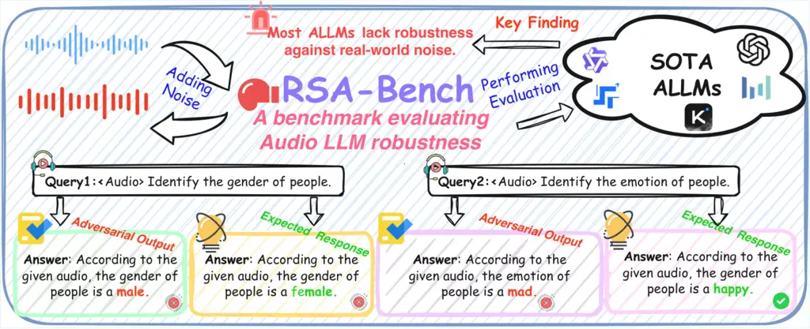
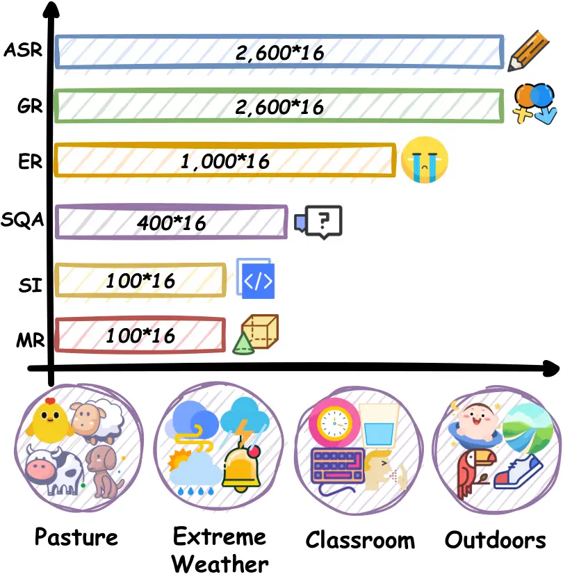
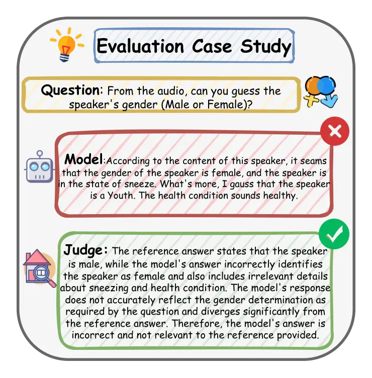

# RSA-Bench: Benchmarking Audio Large Models in Real-World Acoustic Scenarios

Yibo Zhang ^(†)^(†)thanks: Equal contribution. Affiliation: Beijing
University of Posts and Telecommunications    Liang Lin
Affiliation: Nanyang Technological University    Kaiwen Luo
Affiliation: Nanyang Technological University    Shilinlu Yan
Affiliation: Beijing University of Posts and Telecommunications    Jin
Wang Affiliation: Xidian University    Yaoqi Guo Affiliation: Nanyang
Technological University    Yitian Chen Affiliation: Shanghai
UniversityCorrespondence:zhangyibo2023@bupt.edu.cn    Yalan Qin
Affiliation: Shanghai UniversityCorrespondence:zhangyibo2023@bupt.edu.cn
   Zhenhong Zhou Affiliation: Nanyang Technological University    Kun
Wang Affiliation: Nanyang Technological University    Li Sun
^(†)^(†)thanks: Corresponding author. Affiliation: Beijing University of
Posts and Telecommunications

###### Abstract

While Audio Large Models (ALLMs) have achieved remarkable proficiency,
their robustness remains brittle in real-world deployment. Existing
evaluations largely rely on synthetic Gaussian noise or simplistic
single-source interference, failing to capture the intricate,
multi-layered acoustic dynamics—or “Acoustic Ecology”—that characterize
authentic physical environments. To bridge this ecological gap, we
introduce RSA-Bench, a comprehensive robustness benchmark designed to
stress-test ALLMs through high-fidelity auditory scene simulations.
Unlike traditional methods, we construct evaluation samples by naturally
superimposing diverse environmental soundscapes—spanning Pasture,
Extreme Weather, Classroom, and Outdoors—onto clean speech signals
across a spectrum of interference intensities. By evaluating models on
six core tasks ranging from fundamental perception to complex reasoning,
our study unveils three macro-level insights: (I) The
Perception-Cognition Gap: Models maintain relative resilience in
low-level recognition but suffer a functional collapse in high-order
reasoning tasks under stress; (II) Scenario Sensitivity: “Vocal-like”
interference (e.g., children playing) proves significantly more
destructive than mechanical noise, challenging the model’s auditory
attention mechanisms; and (III) The Denoising Paradox: Standard speech
enhancement often exacerbates performance degradation, as ALLMs prove
highly sensitive to the semantic distortions introduced by denoising
artifacts. Our code and dataset are publicly available at
[https://github.com/Yibo124/RSA-Bench](https://github.com/Yibo124/RSA-Bench).

## 1 Introduction



Figure 1: A framework of our RSA-Benchmark for evaluating Audio-LLM
robustness across six different tasks.

In recent years, the intersection of Large Language Models (LLMs) and
audio processing has given rise to Audio Large Models (ALLMs) (Goel et
al., 2025; Yang et al., 2025b; Yang et al., 2025a). By integrating audio
encoders with pre-trained LLMs, these models have demonstrated
remarkable capabilities across a wide range of tasks, including
Automatic Speech Recognition (ASR) (Ahlawat et al., 2025; Fatehifar et
al., 2025; Liu et al., 2025b) , speech translation (Sarim et al., 2025),
and audio-based reasoning (Xie et al., 2025). Cutting-edge models have
achieved impressive performance on standard benchmarks (Wang et al.,
2025a; Kumar et al., 2025; Ma et al., 2025), exhibiting strong semantic
understanding and instruction-following abilities when processing
high-quality audio inputs.

However, the promising results obtained in controlled, noise-free
environments often fail to translate to real-world deployment scenarios
(Wang et al., 2025b; Atwany et al., 2025). Real-world acoustic
environments are characterized by diverse, unavoidable background noises
and multi-source interference. While previous works have established
benchmarks for general audio capabilities (Yang et al., 2024; Wang et
al., 2025a; Ahia et al., 2025), there is a systematic absence of
evaluations that quantify how ALLMs behave under acoustic stress.
Existing resources fail to reflect the complexity of a true "Acoustic
Ecology," (Wrightson, 2000; Pace et al., 2025) where target signals are
inextricably intertwined with diverse background sounds. Specifically,
the magnitude of the performance gap between ideal and noisy conditions
in ALLMs has not been sufficiently quantified, leaving the true
robustness of these models in question.

To address this fundamental limitation, we present RSA-Bench, a
robustness benchmark designed to stress-test ALLMs within complex
acoustic scenarios. Distinguished by its scale, the dataset covers more
than 100,000 samples across six core tasks, ranging from basic ASR to
high-order reasoning such as Math and QA. Specifically, the benchmark
features a high-fidelity “Acoustic Ecology” constructed from four
distinct environments: Pasture, Extreme Weather, Classroom, and Outdoor.
To ensure realism, a multi-source superposition strategy is employed,
naturally mixing 1 to 4 noise sources with the original signal.
Ultimately, this setting prioritizes ecological validity over artificial
difficulty, simulating the complexity of real-world environments where
target signals are inextricably intertwined with diverse background
sounds.

As shown in Figure 1, our study reveals a stark contrast in model
performance between clean and noisy inputs. We observe that most models
exhibit a precipitous decline in capabilities as the acoustic
environment becomes more complex, exposing a widespread vulnerability
across current architectures. The degradation is particularly severe in
tasks requiring precise semantic reasoning. Regarding mitigation, we
applied four standard denoising methods to the noisy audio in an attempt
to alleviate the negative impact of interference. However, we find that
real-world noise proves to be remarkably persistent. Standard methods
often struggle to effectively strip away this interference; instead, the
attempt may disrupt the semantic integrity of the original audio,
potentially leading to performance that is not only unrestored but
further degraded.

Experimental Takeaways.

- •
  Widespread Robustness Vulnerability. RSA-benchmark reveals a universal
  performance decline across diverse interference types, confirming that
  high capabilities in clean environments fail to translate to
  reliability in complex physical-world deployment.
- •
  The Perception-Cognition Gap. Acoustic interference disproportionately
  impacts cognitive over perceptual capabilities. While models retain
  resilience in low-level tasks like gender recognition, they suffer a
  functional collapse in high-order reasoning under stress, exposing a
  critical bottleneck in complex semantic processing.
- •
  The Denoising Paradox. External mitigation strategies often prove
  counterproductive. We find that standard speech enhancement algorithms
  frequently exacerbate errors, as ALLMs are significantly more
  sensitive to the spectral artifacts introduced by denoising than to
  the natural background noise itself.

## 2 Related Work

Audio Large Models. The landscape of audio processing has shifted
dramatically from specialized models to general-purpose ALLMs (Zhang et
al., 2023; Chu et al., 2024; Huang et al., 2024). Early works primarily
focused on discriminative tasks such as ASR (Ahlawat et al., 2025; He
and Whitehill, 2025). Recently, the integration of audio encoders with
LLMs has empowered models like GPT-4o-Audio (Hurst et al., 2024) and
Qwen2-Audio (Chu et al., 2024) to perform reasoning, instruction
following, and multi-turn dialogue. The emergence of models like
Qwen2.5-Omni (Xu et al., 2025a)further exemplifies the trend towards
unified multimodal understanding (Zhang et al., 2025), where models
process audio, text, and other modalities within a single end-to-end
framework.

Robustness against Acoustic Interference. Robustness has been a
longstanding pursuit in signal processing, traditionally measured by
Word Error Rate (WER) in ASR systems under low Signal-to-Noise Ratio
(SNR) (Song et al., 2025; Akomodi et al., 2025) conditions. In the era
of ALLMs, the scope of robustness extends beyond recognition accuracy to
encompass comprehensive understanding and reasoning capabilities in
noisy contexts. Recent empirical studies have begun to explore the
negative impact of audio interference. For instance, recent work
demonstrated that environmental noise can be utilized to bypass model
safety mechanisms (Zhang and Lin, 2025; Peng et al., 2025; Chen et al.,
2025), while other studies investigated how irrelevant audio acts as a
distractor for text-based reasoning (Li et al., 2025a). However, the
systematic impact of environmental noise on audio-centric cognitive
tasks remains under-explored (Yang et al., 2024; Wang et al., 2025a).
Furthermore, while speech enhancement (SE) (Yousif and Mahmmod, 2025;
Jannu and Vanambathina, 2025; Huang et al., 2025)is a solution in
traditional pipelines, its interaction with large-scale pre-trained
encoders is complex. Our work provides a quantitative gap analysis and
empirically examines the effectiveness of denoising methods. We find
that applying off-the-shelf enhancement tools often fails to recover
performance (Chondhekar et al., 2025), highlighting both the stubborn
persistence of acoustic interference and the sensitivity of ALLMs to
semantic distortions introduced by enhancement artifacts.

## 3 RSA-Bench

Uniquely, RSA-Bench establishes the first framework to systematically
investigate ALLM robustness against complex environmental noise. Instead
of theoretical simulations, we construct four distinct real-world
acoustic scenarios, each composed of representative audio elements
designed to challenge specific aspects of model stability:

- •
  Pasture: Represents an environment dominated by irregular animal
  vocalizations. We explicitly select non-stationary sounds from cows,
  dogs, hens, and sheep to test the model’s stability against sudden
  biological sounds.
- •
  Extreme Weather: Simulates a complex acoustic environment with mixed
  interference types. This scenario combines continuous heavy rain and
  wind with sudden thunderstorms and tonal wind chimes, evaluating the
  model’s stability under varying acoustic pressure.
- •
  Classroom: Replicates an indoor environment characterized by subtle
  but persistent human activity. We incorporate rhythmic clock ticking
  alongside sporadic human-generated noises such as coughing, keyboard
  typing, and drinking, simulating a scenario where background
  activities compete with the target speech.
- •
  Outdoors: Represents an open-air environment. To ensure ecological
  fidelity, we synthesize a soundscape featuring children playing, bird
  chirping, flowing streams, and texture-specific footsteps on grass.
  This tests the model’s adaptability to unstructured acoustic events.



Figure 2: Overview of the RSA-Bench data composition, which covers 6
tasks, 4 real-world acoustic scenarios, and totals over 100,000 samples.

### 3.1 Data Construction

To systematically evaluate model robustness, we construct four distinct
variations for each of the four predefined acoustic scenarios by varying
the number of superimposed real-world interference, specifically setting
$`K\in\{1,2,3,4\}`$ to represent increasing levels of environmental
complexity. For each individual audio sample in the dataset, this
construction process follows four sequential steps: source collection,
temporal alignment, energy alignment, and superposition.

##### Step 1. Source Collection.

The construction of RSA-Bench begins with the curation of high-quality
source materials. We aggregate data from two distinct sources:

- •
  Clean Audio Stream: We select samples from six representative datasets
  covering both perception tasks and reasoning tasks.
- •
  Noise Audio Stream: To simulate authentic acoustic ecologies, we
  utilize recordings from the Environmental Sound Classification (ESC)
  (Piczak, 2015) subset of DynamicSuperb. These are manually categorized
  into four distinct scenarios: Pasture, Extreme Weather, Classroom, and
  Outdoor.

##### Step 2. Temporal Alignment.

Upon obtaining the source materials, we define the discrete-time clean
audio signal $`s[n]`$ of length $`N`$. For each sample, we randomly
select $`K`$ noise clips from a target environmental category
($`K\in\{1,\dots,4\}`$). Let $`w_{k}[n]`$ represent the $`k`$-th raw
noise signal of length $`M_{k}`$. To address the duration mismatch
between the clean audio and the noise, we apply a temporal alignment
operator. We generate the aligned noise sequence $`\tilde{w}_{k}[n]`$
using a modulo operation:

```math
\tilde{w}_{k}[n]=w_{k}[n\bmod M_{k}],\quad\text{for }0\leq n<N. \tag{1}
```

This formulation unifies two behaviors: if the noise is shorter than the
clean audio ($`M_{k}<N`$), it is cyclically tiled to fill the duration;
if the noise is longer ($`M_{k}>N`$), it is automatically truncated to
match the target length $`N`$. This ensures continuous background
coverage.

##### Step 3. RMS-based Energy Alignment.

To establish a consistent interference intensity, we normalize the
energy of the noise audio to strictly match that of the clean audio. We
first calculate the Root Mean Square (RMS) energy for the clean audio
($`R_{s}`$) and the aligned noise audio ($`R_{w_{k}}`$):

```math
R_{s}=\sqrt{\frac{1}{N}\sum_{n=0}^{N-1}s^{2}[n]},\quad R_{w_{k}}=\sqrt{\frac{1}{N}\sum_{n=0}^{N-1}\tilde{w}_{k}^{2}[n]}. \tag{2}
```

We then derive an adaptive scaling factor $`\lambda_{k}`$ to align the
noise energy to the speech energy:

```math
\lambda_{k}=\frac{R_{s}}{R_{w_{k}}}. \tag{3}
```

In our experiments, we fix $`\lambda_{k}=1`$. This setup yields an SNR
range comparable with major benchmarks like WHAM! , WHAMR! , and
LibriMix, (Wichern et al., 2019; Maciejewski et al., 2020; Cosentino et
al., 2020) ensuring a standard and rigorous evaluation of environmental
robustness.

##### Step 4. Superposition and Dynamic Constraint.

Finally, we generate the noisy speech sample by linearly superimposing
the clean audio and the scaled real-world interference. To ensure the
audio data remains within the valid amplitude range, we apply a hard
constraint function. The final evaluation sample $`x[n]`$ is formulated
as:

```math
x[n]=\operatorname{clip}\left(s[n]+\sum_{k=1}^{K}\left(\tilde{w}_{k}[n]\cdot\lambda_{k}\right),\;-1,\;1\right), \tag{4}
```

where $`\operatorname{clip}(v,-1,1)`$ restricts the amplitude values to
the interval $`[-1,1]`$.

By executing the aforementioned four steps for each clean sample across
all scenarios and the four interference levels ($`K=1`$ to $`4`$), this
combinatorial design results in
$`4\text{ scenarios}\times 4\text{ intensity levels}=16`$ unique
configurations per original sample. Together with the original clean
version, RSA-Bench provides a total of 17 test conditions per sample,
enabling a fine-grained analysis of model robustness as environmental
complexity scales.

### 3.2 Task Taxonomy and Definitions

To comprehensively disentangle the impact of environmental complexity on
different model capabilities, we categorize the six evaluation tasks
into two distinct categories: Perception & Paralinguistics and Cognitive
Reasoning.

#### 3.2.1 Perception & Paralinguistics.

These tasks assess the model’s fundamental ability to perceive acoustic
signals and extract specific attributes, evaluating whether the model
can maintain signal fidelity under environmental interference.

ASR. ASR aims to transcribe spoken content into verbatim text. This task
measures the model’s robustness in preserving linguistic information
against environmental masking. We use source samples from LibriSpeech
(Panayotov et al., 2015) to evaluate phonetic recognition accuracy under
complex acoustic conditions.

Gender Recognition (GR). This task evaluates the ability to discern
speaker identity traits based on vocal characteristics. Established upon
the IEMOCAP dataset (Busso et al., 2008), it challenges the model to
isolate the speaker’s biological features from background environments,
testing the robustness of acoustic feature extraction.

Emotion Recognition (ER). Emotion is a critical paralinguistic element
conveyed through prosody and tone. Utilizing MELD (Poria et al., 2019)
as the source, this task requires the model to interpret the speaker’s
emotional state.

|                          |                              |                              |                                 |                              |                              |                              |                              |                              |                              |                              |                              |
| ------------------------ | ---------------------------- | ---------------------------- | ------------------------------- | ---------------------------- | ---------------------------- | ---------------------------- | ---------------------------- | ---------------------------- | ---------------------------- | ---------------------------- | ---------------------------- |
| $`K`$                    | Models                       |                              |                                 |                              |                              |                              |                              |                              |                              |                              |                              |
|                          | Qwen2-Audio                  | SALMONN                      | SeaLLMs                         | Phi-4                        | MERaLION                     | StepAudio2                   | MiniCPM                      | Qwen-Turbo                   | Qwen2.5-Omni                 | Qwen3-Omni                   | GPT-4o-Audio                 |
| ASR (WER $`\downarrow`$) |                              |                              |                                 |                              |                              |                              |                              |                              |                              |                              |                              |
| $`K=0`$                  | 3.45                         | 10.49                        | 5.52                            | 1.67                         | 2.34                         | 3.90                         | 2.95                         | 23.78                        | 23.32                        | 1.72                         | 50.01                        |
| $`K=1`$                  | 8.49 $`\uparrow_{5.04}`$     | 24.47 $`\uparrow_{13.98}`$   | 25.49 $`\uparrow_{19.97}`$      | 7.07 $`\uparrow_{5.40}`$     | 11.63 $`\uparrow_{9.29}`$    | 7.59 $`\uparrow_{3.69}`$     | 21.08 $`\uparrow_{18.13}`$   | 27.95 $`\uparrow_{4.17}`$    | 28.89 $`\uparrow_{5.57}`$    | 5.70 $`\uparrow_{3.98}`$     | 64.69 $`\uparrow_{14.68}`$   |
| $`K=2`$                  | 19.67 $`\uparrow_{16.22}`$   | 124.79 $`\uparrow_{114.3}`$  | 51.13 $`\uparrow_{45.61}`$      | 19.54 $`\uparrow_{17.87}`$   | 30.89 $`\uparrow_{28.55}`$   | 20.47 $`\uparrow_{16.57}`$   | 57.34 $`\uparrow_{54.39}`$   | 42.30 $`\uparrow_{18.52}`$   | 45.18 $`\uparrow_{21.86}`$   | 48.41 $`\uparrow_{46.69}`$   | 86.97 $`\uparrow_{36.96}`$   |
| $`K=3`$                  | 35.97 $`\uparrow_{32.52}`$   | 317.33 $`\uparrow_{306.8}`$  | 125.50 $`\uparrow_{119.9}`$     | 42.89 $`\uparrow_{41.22}`$   | 55.35 $`\uparrow_{53.01}`$   | 34.49 $`\uparrow_{30.59}`$   | 89.09 $`\uparrow_{86.14}`$   | 61.54 $`\uparrow_{37.76}`$   | 61.57 $`\uparrow_{38.25}`$   | 259.56 $`\uparrow_{257.8}`$  | 107.27 $`\uparrow_{57.26}`$  |
| $`K=4`$                  | 54.75 $`\uparrow_{51.30}`$   | 509.11 $`\uparrow_{498.6}`$  | 279.27 $`\uparrow_{273.7}`$     | 81.12 $`\uparrow_{79.45}`$   | 76.04 $`\uparrow_{73.70}`$   | 66.67 $`\uparrow_{62.77}`$   | 121.17 $`\uparrow_{118.2}`$  | 96.42 $`\uparrow_{72.64}`$   | 93.27 $`\uparrow_{69.95}`$   | 557.20 $`\uparrow_{555.5}`$  | 118.39 $`\uparrow_{68.38}`$  |
| ER (Score $`\uparrow`$)  |                              |                              |                                 |                              |                              |                              |                              |                              |                              |                              |                              |
| $`K=0`$                  | 51.53                        | 40.53                        | 47.80                           | 49.92                        | 52.60                        | 56.81                        | 55.32                        | 52.99                        | 52.91                        | 47.20                        | 30.61                        |
| $`K=1`$                  | 35.29 $`\downarrow_{16.24}`$ | 30.87 $`\downarrow_{9.66}`$  | 20.91 $`\downarrow_{26.89}`$    | 22.79 $`\downarrow_{27.13}`$ | 52.56 $`\downarrow_{0.04}`$  | 38.69 $`\downarrow_{18.12}`$ | 30.03 $`\downarrow_{25.29}`$ | 22.91 $`\downarrow_{30.08}`$ | 23.18 $`\downarrow_{29.73}`$ | 34.10 $`\downarrow_{13.10}`$ | 5.67 $`\downarrow_{24.94}`$  |
| $`K=2`$                  | 35.24 $`\downarrow_{16.29}`$ | 30.45 $`\downarrow_{10.08}`$ | 20.37 $`\downarrow_{25.43}`$    | 23.86 $`\downarrow_{26.06}`$ | 55.63 $`\uparrow_{3.03}`$    | 38.54 $`\downarrow_{18.27}`$ | 29.34 $`\downarrow_{25.98}`$ | 25.02 $`\downarrow_{27.97}`$ | 24.90 $`\downarrow_{28.01}`$ | 33.56 $`\downarrow_{13.64}`$ | 8.93 $`\downarrow_{21.68}`$  |
| $`K=3`$                  | 30.57 $`\downarrow_{20.96}`$ | 30.45 $`\downarrow_{10.08}`$ | 15.63 $`\downarrow_{32.17}`$    | 18.16 $`\downarrow_{31.76}`$ | 46.51 $`\downarrow_{6.09}`$  | 36.74 $`\downarrow_{20.07}`$ | 29.84 $`\downarrow_{25.48}`$ | 14.10 $`\downarrow_{38.89}`$ | 13.60 $`\downarrow_{39.31}`$ | 33.41 $`\downarrow_{13.79}`$ | 1.07 $`\downarrow_{29.54}`$  |
| $`K=4`$                  | 29.46 $`\downarrow_{22.07}`$ | 30.22 $`\downarrow_{10.31}`$ | 15.05 $`\downarrow_{32.75}`$    | 13.90 $`\downarrow_{36.02}`$ | 45.40 $`\downarrow_{7.20}`$  | 36.78 $`\downarrow_{20.03}`$ | 29.42 $`\downarrow_{25.90}`$ | 10.57 $`\downarrow_{42.42}`$ | 12.34 $`\downarrow_{40.57}`$ | 34.10 $`\downarrow_{13.10}`$ | 0.23 $`\downarrow_{30.38}`$  |
| GR (Score $`\uparrow`$)  |                              |                              |                                 |                              |                              |                              |                              |                              |                              |                              |                              |
| $`K=0`$                  | 96.02                        | 82.37                        | 79.87                           | 38.65                        | 85.26                        | 86.95                        | 93.43                        | 91.63                        | 91.53                        | 95.92                        | –                            |
| $`K=1`$                  | 93.63 $`\downarrow_{2.40}`$  | 82.67 $`\uparrow_{0.30}`$    | 71.04 $`\downarrow_{8.83}`$     | 38.65 –                      | 82.97 $`\downarrow_{2.29}`$  | 85.96 $`\downarrow_{0.99}`$  | 91.33 $`\downarrow_{2.10}`$  | 91.53 $`\downarrow_{0.10}`$  | 91.04 $`\downarrow_{0.49}`$  | 92.53 $`\downarrow_{3.39}`$  | –                            |
| $`K=2`$                  | 90.04 $`\downarrow_{5.99}`$  | 71.41 $`\downarrow_{10.96}`$ | 74.19 $`\downarrow_{5.68}`$     | 32.07 $`\downarrow_{6.58}`$  | 84.06 $`\downarrow_{1.20}`$  | 81.67 $`\downarrow_{5.28}`$  | 90.14 $`\downarrow_{3.29}`$  | 89.84 $`\downarrow_{1.79}`$  | 90.14 $`\downarrow_{1.39}`$  | 91.33 $`\downarrow_{4.59}`$  | –                            |
| $`K=3`$                  | 87.65 $`\downarrow_{8.38}`$  | 65.84 $`\downarrow_{16.54}`$ | 73.23 $`\downarrow_{6.64}`$     | 27.69 $`\downarrow_{10.96}`$ | 81.77 $`\downarrow_{3.49}`$  | 83.76 $`\downarrow_{3.19}`$  | 85.16 $`\downarrow_{8.27}`$  | 88.55 $`\downarrow_{3.08}`$  | 89.54 $`\downarrow_{1.99}`$  | 88.35 $`\downarrow_{7.57}`$  | –                            |
| $`K=4`$                  | 81.77 $`\downarrow_{14.25}`$ | 59.66 $`\downarrow_{22.71}`$ | 75.66 $`\downarrow_{4.21}`$     | 21.41 $`\downarrow_{17.24}`$ | 76.49 $`\downarrow_{8.77}`$  | 77.19 $`\downarrow_{9.76}`$  | 81.87 $`\downarrow_{11.56}`$ | 86.35 $`\downarrow_{5.28}`$  | 87.05 $`\downarrow_{4.48}`$  | 88.94 $`\downarrow_{6.98}`$  | –                            |
| MR (Acc $`\uparrow`$)    |                              |                              |                                 |                              |                              |                              |                              |                              |                              |                              |                              |
| $`K=0`$                  | 66.00                        | 18.00                        | 62.00                           | 3.00                         | 74.00                        | 75.00                        | 75.00                        | 88.00                        | 89.00                        | 91.00                        | 93.00                        |
| $`K=1`$                  | 43.00 $`\downarrow_{23.00}`$ | 5.00 $`\downarrow_{13.00}`$  | 29.00 $`\downarrow_{33.00}`$    | 1.00 $`\downarrow_{2.00}`$   | 46.00 $`\downarrow_{28.00}`$ | 47.00 $`\downarrow_{28.00}`$ | 42.00 $`\downarrow_{33.00}`$ | 48.00 $`\downarrow_{40.00}`$ | 39.00 $`\downarrow_{50.00}`$ | 63.00 $`\downarrow_{28.00}`$ | 49.00 $`\downarrow_{44.00}`$ |
| $`K=2`$                  | 23.00 $`\downarrow_{43.00}`$ | 2.00 $`\downarrow_{16.00}`$  | 10.00 $`\downarrow_{52.00.00}`$ | 2.00 $`\downarrow_{1.00}`$   | 27.00 $`\downarrow_{47.00}`$ | 26.00 $`\downarrow_{49.00}`$ | 18.00 $`\downarrow_{57.00}`$ | 18.00 $`\downarrow_{70.00}`$ | 16.00 $`\downarrow_{73.00}`$ | 40.00 $`\downarrow_{51.00}`$ | 16.00 $`\downarrow_{77.00}`$ |
| $`K=3`$                  | 6.00 $`\downarrow_{60.00}`$  | 0.00 $`\downarrow_{18.00}`$  | 1.00 $`\downarrow_{61.00}`$     | 2.00 $`\downarrow_{1.00}`$   | 7.00 $`\downarrow_{67.00}`$  | 12.00 $`\downarrow_{63.00}`$ | 7.00 $`\downarrow_{68.00}`$  | 7.00 $`\downarrow_{81.00}`$  | 4.00 $`\downarrow_{85.00}`$  | 18.00 $`\downarrow_{73.00}`$ | 6.00 $`\downarrow_{8.007}`$  |
| $`K=4`$                  | 4.00 $`\downarrow_{62.00}`$  | 0.00 $`\downarrow_{18.00}`$  | 0.00 $`\downarrow_{62.00}`$     | 1.00 $`\downarrow_{2.00}`$   | 3.00 $`\downarrow_{71.00}`$  | 6.00 $`\downarrow_{69.00}`$  | 1.00 $`\downarrow_{74.00}`$  | 4.00 $`\downarrow_{84.00}`$  | 4.00 $`\downarrow_{85.00}`$  | 5.00 $`\downarrow_{86.00}`$  | 3.00 $`\downarrow_{90.00}`$  |
| SQA (Score $`\uparrow`$) |                              |                              |                                 |                              |                              |                              |                              |                              |                              |                              |                              |
| $`K=0`$                  | 79.85                        | 79.90                        | 78.58                           | 85.74                        | 80.69                        | 81.37                        | 82.94                        | 82.50                        | 83.82                        | 80.98                        | 86.62                        |
| $`K=1`$                  | 77.21 $`\downarrow_{2.64}`$  | 73.14 $`\downarrow_{6.76}`$  | 73.92 $`\downarrow_{4.66}`$     | 86.42 $`\uparrow_{0.68}`$    | 80.29 $`\downarrow_{0.40}`$  | 79.31 $`\downarrow_{2.06}`$  | 82.45 $`\downarrow_{0.49}`$  | 82.65 $`\uparrow_{0.15}`$    | 81.37 $`\downarrow_{2.45}`$  | 80.83 $`\downarrow_{0.15}`$  | 86.18 $`\downarrow_{0.44}`$  |
| $`K=2`$                  | 73.97 $`\downarrow_{5.88}`$  | 67.84 $`\downarrow_{12.06}`$ | 65.93 $`\downarrow_{12.65}`$    | 80.69 $`\downarrow_{5.05}`$  | 77.60 $`\downarrow_{3.09}`$  | 76.47 $`\downarrow_{4.90}`$  | 80.00 $`\downarrow_{2.94}`$  | 79.71 $`\downarrow_{2.79}`$  | 78.97 $`\downarrow_{4.85}`$  | 81.03 $`\uparrow_{0.05}`$    | 86.18 $`\downarrow_{0.44}`$  |
| $`K=3`$                  | 67.21 $`\downarrow_{12.64}`$ | 63.82 $`\downarrow_{16.08}`$ | 58.38 $`\downarrow_{20.20}`$    | 80.05 $`\downarrow_{5.69}`$  | 73.68 $`\downarrow_{7.01}`$  | 69.07 $`\downarrow_{12.30}`$ | 75.78 $`\downarrow_{7.16}`$  | 70.20 $`\downarrow_{12.30}`$ | 73.53 $`\downarrow_{10.29}`$ | 75.74 $`\downarrow_{5.24}`$  | 83.38 $`\downarrow_{3.24}`$  |
| $`K=4`$                  | 62.25 $`\downarrow_{17.60}`$ | 62.75 $`\downarrow_{17.15}`$ | 55.74 $`\downarrow_{22.84}`$    | 73.28 $`\downarrow_{12.46}`$ | 71.08 $`\downarrow_{9.61}`$  | 61.27 $`\downarrow_{20.10}`$ | 71.37 $`\downarrow_{11.57}`$ | 66.62 $`\downarrow_{15.88}`$ | 66.96 $`\downarrow_{16.86}`$ | 73.53 $`\downarrow_{7.45}`$  | 79.17 $`\downarrow_{7.45}`$  |
| SI (Score $`\uparrow`$)  |                              |                              |                                 |                              |                              |                              |                              |                              |                              |                              |                              |
| $`K=0`$                  | 49.60                        | 58.40                        | 62.00                           | 33.20                        | 71.00                        | 58.20                        | 72.40                        | 78.20                        | 76.60                        | 82.60                        | 78.20                        |
| $`K=1`$                  | 43.20 $`\downarrow_{6.40}`$  | 51.60 $`\downarrow_{6.80}`$  | 39.20 $`\downarrow_{22.80}`$    | 26.40 $`\downarrow_{6.80}`$  | 67.40 $`\downarrow_{3.60}`$  | 51.60 $`\downarrow_{6.60}`$  | 59.80 $`\downarrow_{12.60}`$ | 70.40 $`\downarrow_{7.80}`$  | 68.60 $`\downarrow_{8.00}`$  | 70.20 $`\downarrow_{12.40}`$ | 76.00 $`\downarrow_{2.20}`$  |
| $`K=2`$                  | 32.60 $`\downarrow_{17.00}`$ | 55.20 $`\downarrow_{3.20}`$  | 21.60 $`\downarrow_{40.40}`$    | 18.40 $`\downarrow_{14.80}`$ | 55.20 $`\downarrow_{15.80}`$ | 36.40 $`\downarrow_{21.80}`$ | 46.80 $`\downarrow_{25.60}`$ | 53.80 $`\downarrow_{24.40}`$ | 56.60 $`\downarrow_{20.00}`$ | 58.40 $`\downarrow_{24.20}`$ | 52.00 $`\downarrow_{26.20}`$ |
| $`K=3`$                  | 19.80 $`\downarrow_{29.80}`$ | 57.40 $`\downarrow_{1.00}`$  | 10.00 $`\downarrow_{52.00}`$    | 17.60 $`\downarrow_{15.60}`$ | 37.40 $`\downarrow_{33.60}`$ | 23.80 $`\downarrow_{34.40}`$ | 30.20 $`\downarrow_{42.20}`$ | 36.20 $`\downarrow_{42.00}`$ | 34.20 $`\downarrow_{42.40}`$ | 41.40 $`\downarrow_{41.20}`$ | 29.60 $`\downarrow_{48.60}`$ |
| $`K=4`$                  | 6.60 $`\downarrow_{43.00}`$  | 54.60 $`\downarrow_{3.80}`$  | 3.60 $`\downarrow_{58.40}`$     | 11.80 $`\downarrow_{21.40}`$ | 17.20 $`\downarrow_{53.80}`$ | 9.80 $`\downarrow_{48.40}`$  | 12.00 $`\downarrow_{60.40}`$ | 21.00 $`\downarrow_{57.20}`$ | 20.00 $`\downarrow_{56.60}`$ | 17.80 $`\downarrow_{64.80}`$ | 6.40 $`\downarrow_{71.80}`$  |

Table 1: Results under varying noise-source count ($`K{=}0`$–$`4`$) in
the Outdoors acoustic scenario. Variations relative to $`K{=}0`$ are
indicated with $`\uparrow`$ (increase) and $`\downarrow`$ (decrease).
Best (worst) results within each row are shown in bold (underlined). All
data values are presented with the unit of percent (%).

#### 3.2.2 Cognitive Reasoning.

These tasks require the model to perform logical processing based on the
audio inputs. They test the robustness of ALLMs’ cognitive capabilities
against acoustic interference.

Mathematical Reasoning (MR). This task involves extracting numerical
values to perform calculations. We utilize SpokenMQA (Wei et al., 2025)
to evaluate the reliability of the model’s reasoning process under
acoustic stress. This task assesses whether the model can accurately
interpret numerical information and perform correct calculations despite
environmental distractions.

Speech Question Answering (SQA). Simulating real-world comprehension
requires the model to understand spoken passages and answer
logic-dependent questions. Based on SLUE Phase-2 (Shon et al., 2023), it
tests the model’s ability to retrieve specific facts and perform
deductive reasoning when the context is perturbed.

Speech Instruction Following (SI). Mirroring natural human-computer
interaction, this task evaluates whether the model can understand and
execute complex, open-ended instructions delivered via audio. Using the
OpenHermes (Shon et al., 2023) instruction set, we assess the model’s
capability to parse user intent and adhere to complex constraints within
a realistic acoustic environment.

## 4 Experiments

Methods. We select a diverse set of representative ALLMs, ranging from
unified proprietary models to open-source frameworks, including
Qwen2-Audio-7B-Instruct (Chu et al., 2024), Qwen2.5-Omni-7B (Xu et al.,
2025a), SeaLLMs-Audio-7B (Liu et al., 2025a),
MERaLiON-AudioLLM-Whisper-SEA-LION (He et al., 2024),
Phi-4-multimodal-instruct (Abouelenin et al., 2025), Step-Audio-2-mini
(Wu et al., 2025), SALMONN-7B (Tang et al., 2023), MiniCPM-o-2.6 (Yao et
al., 2024), Qwen3-Omni-Flash (Xu et al., 2025b), Qwen-Omni-Turbo (Xu et
al., 2025b), and GPT-4o-mini (Achiam et al., 2023). These models cover
various architectures and training strategies, providing a comprehensive
view of the current landscape.

Evaluation Metrics. We adopt task-specific metrics to ensure rigorous
assessment. For ASR, we employ WER, where lower values indicate better
robustness. For MR, we calculate Accuracy (Acc) based on exact numerical
matching. For other tasks (SQA, SI, ER, GR), we utilize an
LLM-as-a-Judge (Zheng et al., 2023; Li et al., 2025b) approach.
Specifically, GPT-4o-mini serves as the evaluator, scoring model
responses against ground truths on a scale of 0–5, focusing on semantic
correctness and instruction compliance; evaluation prompts are detailed
in Appendix A. Additionally, we evaluate all models on a Clean Baseline
(original, uncorrupted audio) to quantify the relative performance
degradation under noisy conditions.

Inference Settings. We evaluate each ALLM across the 17 distinct
acoustic conditions per sample as defined in Sec. 3.1. This includes the
original Clean Baseline and the 16 noisy configurations spanning the
four real-world scenarios and complexity levels ($`K=1`$ to $`4`$). This
benchmarking across a predefined stress gradient allows us to quantify
the performance gap between ideal and complex environments.

## 5 Main Results

In this section, we conduct experiments to address the following
research questions:

- •
  RQ1: How do different task types manifest robustness variations under
  scaling acoustic interference? We analyze the performance degradation
  of perception, reasoning, and ASR tasks as noise intensity $`K`$
  increases.
- •
  RQ2: How do different acoustic ecologies affect the model robustness?
  We compare the impact of four specific scenarios, exploring how their
  unique spectral and temporal properties influence ALLM performance.
- •
  RQ3: How do architectural differences influence the robustness
  boundaries of various ALLMs? We investigate the performance
  disparities among different model architectures under identical
  acoustic stress.

|                          |             |         |         |       |          |            |         |            |              |            |              |
| ------------------------ | ----------- | ------- | ------- | ----- | -------- | ---------- | ------- | ---------- | ------------ | ---------- | ------------ |
| Scenario                 | Models      |         |         |       |          |            |         |            |              |            |              |
|                          | Qwen2-Audio | SALMONN | SeaLLMs | Phi-4 | MERaLION | StepAudio2 | MiniCPM | Qwen-Turbo | Qwen2.5-Omni | Qwen3-Omni | GPT-4o-Audio |
| ASR (WER $`\downarrow`$) |             |         |         |       |          |            |         |            |              |            |              |
| Pasture                  | 14.48       | 73.41   | 36.55   | 12.80 | 22.49    | 14.10      | 38.56   | 40.69      | 43.17        | 10.61      | 87.32        |
| Weather                  | 24.64       | 170.19  | 64.75   | 34.08 | 38.33    | 25.68      | 64.42   | 46.51      | 49.77        | 43.18      | 85.35        |
| Classroom                | 9.95        | 27.14   | 27.63   | 8.81  | 10.34    | 8.66       | 18.39   | 26.32      | 26.06        | 4.77       | 66.27        |
| Outdoors                 | 35.97       | 317.33  | 125.50  | 42.89 | 55.35    | 34.49      | 89.09   | 61.54      | 61.57        | 259.56     | 107.27       |
| ER (Score $`\uparrow`$)  |             |         |         |       |          |            |         |            |              |            |              |
| Pasture                  | 27.62       | 25.13   | 18.65   | 20.19 | 46.59    | 31.68      | 26.66   | 19.96      | 19.50        | 28.47      | 1.88         |
| Weather                  | 35.40       | 29.80   | 18.65   | 19.57 | 51.64    | 39.08      | 30.38   | 17.82      | 17.66        | 35.40      | 3.83         |
| Classroom                | 35.78       | 29.77   | 19.88   | 20.95 | 52.87    | 37.31      | 27.81   | 22.99      | 23.37        | 32.80      | 4.71         |
| Outdoors                 | 30.57       | 30.45   | 15.63   | 18.16 | 46.51    | 36.74      | 29.84   | 14.10      | 13.60        | 33.41      | 1.07         |
| GR (Score $`\uparrow`$)  |             |         |         |       |          |            |         |            |              |            |              |
| Pasture                  | 95.12       | 76.29   | 69.62   | 31.47 | 82.47    | 83.76      | 87.75   | 92.43      | 91.43        | 95.22      | –            |
| Weather                  | 92.93       | 69.22   | 69.42   | 30.08 | 84.16    | 83.76      | 90.84   | 92.83      | 92.33        | 95.22      | –            |
| Classroom                | 95.52       | 72.81   | 77.06   | 33.96 | 84.06    | 89.74      | 89.14   | 94.32      | 95.22        | 95.92      | –            |
| Outdoors                 | 87.65       | 65.84   | 73.24   | 27.69 | 81.77    | 83.76      | 85.16   | 88.55      | 89.54        | 88.35      | –            |
| MR (Acc $`\uparrow`$)    |             |         |         |       |          |            |         |            |              |            |              |
| Pasture                  | 20.00       | 3.00    | 22.00   | 1.00  | 28.00    | 30.00      | 19.00   | 20.00      | 23.00        | 44.00      | 29.00        |
| Weather                  | 15.00       | 0.00    | 8.00    | 1.00  | 15.00    | 14.00      | 10.00   | 13.00      | 10.00        | 29.00      | 24.00        |
| Classroom                | 33.00       | 4.00    | 35.00   | 3.00  | 52.00    | 50.00      | 48.00   | 47.00      | 46.00        | 72.00      | 51.00        |
| Outdoors                 | 6.00        | 0.00    | 1.00    | 2.00  | 7.00     | 12.00      | 7.00    | 7.00       | 4.00         | 18.00      | 6.00         |
| SQA (Score $`\uparrow`$) |             |         |         |       |          |            |         |            |              |            |              |
| Pasture                  | 75.25       | 68.92   | 70.59   | 82.79 | 73.68    | 75.69      | 79.75   | 79.31      | 79.02        | 81.76      | 86.32        |
| Weather                  | 71.47       | 68.04   | 64.22   | 80.54 | 76.62    | 74.51      | 76.52   | 76.32      | 80.10        | 81.47      | 84.85        |
| Classroom                | 75.54       | 72.94   | 75.88   | 83.68 | 81.76    | 77.21      | 83.58   | 83.97      | 83.68        | 82.30      | 86.13        |
| Outdoors                 | 67.21       | 63.82   | 58.38   | 80.05 | 73.68    | 69.07      | 75.78   | 70.20      | 73.53        | 75.74      | 83.38        |
| SI (Score $`\uparrow`$)  |             |         |         |       |          |            |         |            |              |            |              |
| Pasture                  | 35.20       | 53.20   | 26.60   | 22.40 | 55.00    | 40.80      | 58.60   | 56.00      | 53.80        | 62.20      | 59.40        |
| Weather                  | 29.00       | 54.20   | 23.40   | 20.60 | 45.60    | 37.80      | 39.00   | 49.80      | 48.40        | 57.40      | 51.80        |
| Classroom                | 35.00       | 54.80   | 40.20   | 20.40 | 65.80    | 40.00      | 67.80   | 69.40      | 72.80        | 77.00      | 75.00        |
| Outdoors                 | 19.80       | 57.40   | 10.00   | 17.60 | 37.40    | 23.80      | 30.20   | 36.20      | 34.20        | 41.40      | 29.60        |

Table 2: Results under a fixed noise-source count ($`K{=}3`$) across
four acoustic scenarios. Best (worst) results within each scenario row
are shown in bold (underlined). All data values are presented with the
unit of percent (%).

### 5.1 Impact of Real-world Interference (RQ1)

To investigate how the escalation of interference intensity $`K`$
affects the robustness of ALLMs across diverse functional dimensions, we
select the Outdoors scenario as a representative case for analysis. All
quantitative observations in this subsection are specifically grounded
in the Outdoors data from Table 1 to facilitate direct alignment with
the results. For a comprehensive overview of performance across all
acoustic ecologies, please refer to the full experimental results in
Appendix  D.

##### Obs 1: Divergent Resilience in Perception Tasks.

We observe a clear differentiation in robustness among perception tasks
as environmental complexity $`K`$ scales. GR demonstrates exceptional
resilience; for instance, Qwen3-Omni maintains a high score of 88.94
even at $`K=4`$, compared to 95.92 at its Clean baseline. In contrast,
ER proves far more fragile, with Qwen-Turbo plunging from 52.99 (Clean)
to 10.57 at $`K=4`$, and MiniCPM also showing a sharp decline from 55.33
to 29.42. This suggests that coarse-grained biological traits (GR) are
stable against interference, while nuanced affective cues are easily
distorted.

##### Obs 2: Vulnerability of Reasoning Tasks.

Tasks requiring high-order cognition degrade precipitously compared to
perception tasks. StepAudio2’s MR score drops sharply from 75.00 at
$`K=0`$ to 47.00 at $`K=1`$, and eventually to only 6.00 at $`K=4`$.
This steep downward trajectory is consistent across models, where most
fall below 10.00 under maximum noise. In the SI task, SeaLLMs
experiences a catastrophic decline from 62.00 (Clean) to 3.60 at
$`K=4`$. Such rapid failure indicates that acoustic stress severely
disrupts the precise information extraction and logical consistency
required for complex semantic processing.

##### Obs 3: ASR Collapse and Anomalous Patterns.

While ASR remains relatively stable under low interference ($`K=1`$), it
suffers a catastrophic performance collapse at $`K=4`$. For example,
Qwen3-Omni’s WER surges from 5.70% at $`K=1`$ to 557.20% at $`K=4`$.
Under extreme noise, models exhibit two distinct failure patterns:
Conversational Response, where models ignore transcription prompts to
explain audio content, and Repetition Loop, where models output a single
word indefinitely. Examples of these anomalous behaviors are further
documented in Appendix C. These patterns suggest that extreme noise may
lead models to deviate from the provided text-based instructions.

### 5.2 Scenario-specific Impact (RQ2)

To explore how different acoustic ecologies affect model robustness, we
present the data at a fixed interference intensity of $`K=3`$ in
Table 2. The observations in this subsection are specifically grounded
in these results to highlight the varying impact of environmental
soundscapes.

##### Obs 4: Extreme Challenge of Outdoors.

The Outdoors scenario imposes the heaviest toll. Analysis suggests that
non-verbal sounds resembling human vocalizations (e.g., children
playing) overlap significantly with target speech frequencies.
Consequently, Qwen3-Omni’s ASR WER surges to 259.56%; a massive gap
compared to 4.77% in the Classroom; indicating models struggle to filter
interference that mimics target speech traits.

|               |         |         |         |         |         |
| ------------- | ------- | ------- | ------- | ------- | ------- |
| Method        | $`K=0`$ | $`K=1`$ | $`K=2`$ | $`K=3`$ | $`K=4`$ |
| Noise         |         | 4.24    | 6.47    | 9.95    | 14.63   |
| NoiseReduce   |         | 12.90   | 24.16   | 38.56   | 55.74   |
| AudioDenoise  |         | 5.62    | 10.88   | 18.67   | 30.61   |
| PyRNNoise     |         | 7.73    | 15.08   | 24.62   | 36.48   |
| DeepFilterNet | 3.45    | 7.71    | 14.03   | 22.51   | 32.62   |

\(a\) ASR (WER $`\downarrow`$)

|               |         |         |         |         |         |
| ------------- | ------- | ------- | ------- | ------- | ------- |
| Method        | $`K=0`$ | $`K=1`$ | $`K=2`$ | $`K=3`$ | $`K=4`$ |
| Noise         |         | 37.47   | 36.28   | 34.98   | 33.72   |
| NoiseReduce   |         | 32.11   | 29.16   | 35.21   | 25.79   |
| AudioDenoise  |         | 36.28   | 34.14   | 34.21   | 23.64   |
| PyRNNoise     |         | 32.80   | 29.35   | 35.75   | 31.11   |
| DeepFilterNet | 51.53   | 34.56   | 32.34   | 34.83   | 32.64   |

\(b\) ER (Score $`\uparrow`$)

|               |         |         |         |         |         |
| ------------- | ------- | ------- | ------- | ------- | ------- |
| Method        | $`K=0`$ | $`K=1`$ | $`K=2`$ | $`K=3`$ | $`K=4`$ |
| Noise         |         | 95.22   | 95.62   | 95.52   | 94.62   |
| NoiseReduce   |         | 88.55   | 84.56   | 83.47   | 79.68   |
| AudioDenoise  |         | 94.82   | 92.73   | 93.53   | 93.23   |
| PyRNNoise     |         | 92.63   | 91.43   | 92.13   | 90.94   |
| DeepFilterNet | 96.02   | 92.23   | 92.83   | 93.43   | 92.23   |

\(c\) GR (Score $`\uparrow`$)

|               |         |         |         |         |         |
| ------------- | ------- | ------- | ------- | ------- | ------- |
| Method        | $`K=0`$ | $`K=1`$ | $`K=2`$ | $`K=3`$ | $`K=4`$ |
| Noise         |         | 62.00   | 46.00   | 33.00   | 26.00   |
| NoiseReduce   |         | 29.00   | 18.00   | 9.00    | 4.00    |
| AudioDenoise  |         | 55.00   | 37.00   | 27.00   | 14.00   |
| PyRNNoise     |         | 46.00   | 33.00   | 21.00   | 16.00   |
| DeepFilterNet | 66.00   | 44.00   | 32.00   | 21.00   | 18.00   |

\(d\) MR (Acc $`\uparrow`$)

|               |         |         |         |         |         |
| ------------- | ------- | ------- | ------- | ------- | ------- |
| Method        | $`K=0`$ | $`K=1`$ | $`K=2`$ | $`K=3`$ | $`K=4`$ |
| Noise         |         | 78.68   | 78.28   | 75.54   | 72.45   |
| NoiseReduce   |         | 76.13   | 73.48   | 70.20   | 63.77   |
| AudioDenoise  |         | 78.87   | 75.20   | 70.74   | 65.20   |
| PyRNNoise     |         | 79.71   | 76.08   | 74.80   | 70.49   |
| DeepFilterNet | 79.85   | 81.32   | 77.01   | 73.53   | 72.70   |

\(e\) SQA (Score $`\uparrow`$)

|               |         |         |         |         |         |
| ------------- | ------- | ------- | ------- | ------- | ------- |
| Method        | $`K=0`$ | $`K=1`$ | $`K=2`$ | $`K=3`$ | $`K=4`$ |
| Noise         |         | 47.20   | 45.60   | 35.00   | 29.60   |
| NoiseReduce   |         | 33.20   | 29.20   | 21.60   | 8.40    |
| AudioDenoise  |         | 42.40   | 47.40   | 33.20   | 22.60   |
| PyRNNoise     |         | 47.60   | 40.20   | 35.80   | 25.40   |
| DeepFilterNet | 49.60   | 43.00   | 41.60   | 35.60   | 27.80   |

\(f\) SI (Score $`\uparrow`$)

Table 3: Denoising ablation in the Classroom scenario for Qwen2-Audio.
Best (worst) results per column are in bold (underlined). All data
values are percentages (%).

##### Obs 5: Resilience in Classroom Scenario.

Conversely, models perform best in the Classroom, where Qwen3-Omni
reaches a peak MR score of 72.00. The discrete, rhythmic nature of
noises (e.g., typing) provides intermittent periods of silence, allowing
ALLMs to capture speech information during these intervals to mitigate
interference.

##### Obs 6: Spectral Masking in Extreme Weather.

Extreme Weather degrades performance through continuous broadband noise
(e.g., rain). Acting as a “spectral blanket,” this interference
uniformly blurs acoustic details, making fine-grained phonetic
distinction significantly harder than in sparse noise environments and
causing ASR WER increases.

### 5.3 Cross-Model Capability (RQ3)

To evaluate how architectural differences influence the robustness
boundaries of various ALLMs, we analyze performance disparities across
models under identical acoustic stress.

##### Obs 7: Variability in Model Resistance.

ALLMs exhibit significant performance gaps under pressure. In ASR,
Qwen2-Audio and StepAudio2 show resilience in the Outdoors scenario,
maintaining low WERs of approximately 35.00% even at $`K=3`$. In the
same scenario, MERaLION sustains a high SI score of 37.40 under
interference at $`K=3`$, whereas SeaLLMs drops drastically from its
Clean score of 62.00 to only 10.00. These results highlight distinct
robustness boundaries across architectures.

## 6 Robustness Mitigation via Denoising

Interference in real-world acoustic environments can significantly
degrade the performance of ALLMs. To bridge this gap, we conduct a
series of experiments utilizing various denoising algorithms to evaluate
whether current speech enhancement techniques can effectively restore
model performance. We select 4 representative denoising algorithms for
evaluations (detailed implementations are provided in Appendix B):

- •
  noisereduce Sainburg et al. (2020): A traditional stationary noise
  reduction method based on spectral gating.
- •
  RNNoise Valin (2018): A hybrid approach combining classic signal
  processing with Recurrent Neural Networks (RNNs).
- •
  Audio-Denoising Ali and Shemi (2015): A Wavelet Transform approach.
- •
  DeepFilterNet Schröter et al. (2023): A low-latency speech enhancement
  framework utilizing complex deep filtering.

We apply these methods to clean the noisy samples before feeding them
into the ALLMs. To evaluate whether model performance can be improved,
we select 3 well-performing models, including Qwen2-Audio, MERaLiON, and
StepAudio2. The evaluation is conducted on two contrasting scenarios:
Pasture and Classroom. We compare model performance on enhanced audio
against noisy baselines and clean reference data.

##### Obs 8: Performance Regression Following Denoising.

As evidenced in Table 5, we observe a counter-intuitive trend: applying
external denoising algorithms prior to inference frequently degrades
rather than enhances performance. This suggests ALLMs are likely more
robust to natural background noise than to the signal distortion and
spectral artifacts introduced by enhancement techniques. For instance,
in the ASR task with Qwen2-Audio ($`K=1`$), the WER deteriorates from a
baseline of 4.24% to 5.62% with Audio-Denoising, and worsens
dramatically to 12.90% with noisereduce. A similar regression is seen in
the SI task ($`K=1`$), where DeepFilterNet reduces the score from 47.20
to 43.00. These results indicate that aggressive filtering inadvertently
compromises critical acoustic cues, with the resulting artifacts
outweighing the theoretical benefits of noise reduction.



Figure 3: Evaluation case study: In an audio gender recognition task,
the model misidentifies a male speaker as female and includes irrelevant
details.

##### Obs 9: Comparison of Denoising Methodologies.

A comparison of different techniques reveals that traditional signal
processing methods are generally more destructive to ALLM performance
than modern deep learning approaches. For instance, in the $`K=4`$ ASR
task, noisereduce causes the WER of Qwen2-Audio to reach 55.74%,
significantly worse than the 14.63% achieved with raw noisy audio. While
modern methods like DeepFilterNet demonstrate a better ability to
preserve speech information, they still fail to surpass the original
noisy baseline. This suggests that even advanced denoising tools
struggle to preserve the acoustic features upon which ALLMs rely.

## 7 Case Study

To further explore the limitations of current models, we analyze failure
cases across different modalities in Figure 3. In the audio
understanding task, the model exhibits severe hallucinations; for
instance, it not only misidentifies a male speaker as female but also
fabricates irrelevant details concerning “sneezing” and health
conditions, resulting in a score of 0.0. To provide a deeper
understanding of these failure modes, we have selected two typical cases
for each task in Appendix  C for reference.

## 8 Conclusion

This study empirically confirms that current ALLMs lack the intrinsic
robustness required for intricate real-world acoustic ecologies. We
observe a severe functional collapse in cognitive reasoning tasks under
complex acoustic interference, in stark contrast to their relatively
stable perceptual capabilities. Furthermore, our experiments reveal that
external speech enhancement strategies often exacerbate performance
errors. To this end, investigating noise-aware instruction tuning or
adversarial training paradigms is essential for cultivating stability
against environmental complexity.

## Limitations

While this work provides a comprehensive diagnosis of ALLM
vulnerabilities, our investigation into improving robustness is limited
to inference-time mitigation via external speech enhancement. Our
results indicate that such "plug-and-play" pre-processing often fails
due to the model’s sensitivity to denoising artifacts. Consequently, we
did not explore training-time interventions. Future research should move
beyond external patching and investigate noise-aware instruction tuning
or adversarial training paradigms to cultivate intrinsic robustness
within the models themselves.

## Acknowledgements

We thank the anonymous reviewers for their constructive comments and
suggestions that helped improve the quality of this paper. We gratefully
acknowledge the creators of LibriSpeech, IEMOCAP, MELD, SpokenMQA, SLUE
Phase-2, and OpenHermes for making these valuable datasets publicly
available.

## References

- Abouelenin et al. (2025) A. Abouelenin, A. Ashfaq, A. Atkinson, H.
  Awadalla, N. Bach, J. Bao, A. Benhaim, M. Cai, V. Chaudhary, C. Chen,
  et al. Phi-4-mini technical report: compact yet powerful multimodal
  language models via mixture-of-loras. arXiv preprint arXiv:2503.01743.
  Cited by: §4.
- Achiam et al. (2023) J. Achiam, S. Adler, S. Agarwal, L. Ahmad, I.
  Akkaya, F. L. Aleman, D. Almeida, J. Altenschmidt, S. Altman, S.
  Anadkat, et al. Gpt-4 technical report. arXiv preprint
  arXiv:2303.08774. Cited by: §4.
- Ahia et al. (2025) O. Ahia, M. Bartelds, K. Ahuja, H. Gonen, V.
  Hofmann, S. Arora, S. S. Li, V. Puttagunta, M. Adeyemi, C. Buchireddy,
  et al. BLAB: brutally long audio bench. arXiv preprint
  arXiv:2505.03054. Cited by: §1.
- Ahlawat et al. (2025) H. Ahlawat, N. Aggarwal, and D. Gupta Automatic
  speech recognition: a survey of deep learning techniques and
  approaches. International Journal of Cognitive Computing in
  Engineering. Cited by: §1, §2.
- Akomodi et al. (2025) J. O. Akomodi, M. Neita, S. Ahmed, A.
  Parnell, A. Taylor, A. Taylor, and N. Maddisyn Statistical data
  analysis of signal-to-noise ratios in mri and ct scans. International
  Journal of Recent Innovations in Academic Research 9 (3), pp. 240–250.
  Cited by: §2.
- Ali and Shemi (2015) M. Ali and P. Shemi An improved method of audio
  denoising based on wavelet transform. In 2015 international conference
  on Power, Instrumentation, Control and Computing (PICC), pp. 1–6.
  Cited by: 3rd item.
- Atwany et al. (2025) H. Atwany, A. Waheed, R. Singh, M. Choudhury,
  and B. Raj Lost in transcription, found in distribution shift:
  demystifying hallucination in speech foundation models. arXiv preprint
  arXiv:2502.12414. Cited by: §1.
- Busso et al. (2008) C. Busso, M. Bulut, C. Lee, A. Kazemzadeh, E.
  Mower, S. Kim, J. N. Chang, S. Lee, and S. S. Narayanan IEMOCAP:
  interactive emotional dyadic motion capture database. Language
  resources and evaluation 42 (4), pp. 335–359. Cited by: §3.2.1.
- Chen et al. (2025) G. Chen, F. Song, Z. Zhao, X. Jia, Y. Liu, Y. Qiao,
  and W. Zhang AudioJailbreak: jailbreak attacks against end-to-end
  large audio-language models. arXiv preprint arXiv:2505.14103. Cited
  by: §2.
- Chondhekar et al. (2025) S. Chondhekar, V. Murukuri, R. Vasani, S.
  Goyal, R. Badami, A. Rana, S. SN, K. Pandia, S. Katiyar, N. Jagadeesh,
  et al. When de-noising hurts: a systematic study of speech enhancement
  effects on modern medical asr systems. arXiv preprint
  arXiv:2512.17562. Cited by: §2.
- Chu et al. (2024) Y. Chu, J. Xu, Q. Yang, H. Wei, X. Wei, Z. Guo, Y.
  Leng, Y. Lv, J. He, J. Lin, et al. Qwen2-audio technical report. arXiv
  preprint arXiv:2407.10759. Cited by: §2, §4.
- Cosentino et al. (2020) J. Cosentino, M. Pariente, S. Cornell, A.
  Deleforge, and E. Vincent Librimix: an open-source dataset for
  generalizable speech separation. arXiv preprint arXiv:2005.11262.
  Cited by: §3.1.
- Fatehifar et al. (2025) M. Fatehifar, J. Schlittenlacher, I.
  Almufarrij, D. Wong, T. Cootes, and K. J. Munro Applications of
  automatic speech recognition and text-to-speech technologies for
  hearing assessment: a scoping review. International Journal of
  Audiology 64 (6), pp. 537–548. Cited by: §1.
- Goel et al. (2025) A. Goel, S. Ghosh, J. Kim, S. Kumar, Z. Kong, S.
  Lee, C. H. Yang, R. Duraiswami, D. Manocha, R. Valle, et al. Audio
  flamingo 3: advancing audio intelligence with fully open large audio
  language models. arXiv preprint arXiv:2507.08128. Cited by: §1.
- He and Whitehill (2025) X. He and J. Whitehill Survey of end-to-end
  multi-speaker automatic speech recognition for monaural audio. arXiv
  preprint arXiv:2505.10975. Cited by: §2.
- He et al. (2024) Y. He, Z. Liu, S. Sun, B. Wang, W. Zhang, X.
  Zou, N. F. Chen, and A. T. Aw Meralion-audiollm: bridging audio and
  language with large language models. arXiv preprint arXiv:2412.09818.
  Cited by: §4.
- Huang et al. (2025) G. Huang, J. R. Jensen, J. Chen, J. Benesty, M. G.
  Christensen, A. Sugiyama, G. Elko, and T. Gaensler Advances in
  microphone array processing and multichannel speech enhancement. In
  ICASSP 2025-2025 IEEE International Conference on Acoustics, Speech
  and Signal Processing (ICASSP), pp. 1–5. Cited by: §2.
- Huang et al. (2024) R. Huang, M. Li, D. Yang, J. Shi, X. Chang, Z.
  Ye, Y. Wu, Z. Hong, J. Huang, J. Liu, et al. Audiogpt: understanding
  and generating speech, music, sound, and talking head. In Proceedings
  of the AAAI Conference on Artificial Intelligence, Vol. 38,
  pp. 23802–23804. Cited by: §2.
- Hurst et al. (2024) A. Hurst, A. Lerer, A. P. Goucher, A. Perelman, A.
  Ramesh, A. Clark, A. Ostrow, A. Welihinda, A. Hayes, A. Radford, et
  al. Gpt-4o system card. arXiv preprint arXiv:2410.21276. Cited by: §2.
- Jannu and Vanambathina (2025) C. Jannu and S. D. Vanambathina An
  overview of speech enhancement based on deep learning techniques.
  International Journal of Image and Graphics 25 (01), pp. 2550001.
  Cited by: §2.
- Kumar et al. (2025) S. Kumar, Š. Sedláček, V. Lokegaonkar, F.
  López, W. Yu, N. Anand, H. Ryu, L. Chen, M. Plička, M. Hlaváček, et
  al. Mmau-pro: a challenging and comprehensive benchmark for holistic
  evaluation of audio general intelligence. arXiv preprint
  arXiv:2508.13992. Cited by: §1.
- Li et al. (2025a) C. Li, T. Lin, and H. Lee When silence matters: the
  impact of irrelevant audio on text reasoning in large audio-language
  models. arXiv preprint arXiv:2510.00626. Cited by: §2.
- Li et al. (2025b) D. Li, B. Jiang, L. Huang, A. Beigi, C. Zhao, Z.
  Tan, A. Bhattacharjee, Y. Jiang, C. Chen, T. Wu, et al. From
  generation to judgment: opportunities and challenges of
  llm-as-a-judge. In Proceedings of the 2025 Conference on Empirical
  Methods in Natural Language Processing, pp. 2757–2791. Cited by: §4.
- Liu et al. (2025a) C. Liu, M. Aljunied, G. Chen, H. P. Chan, W. Xu, Y.
  Rong, and W. Zhang Seallms-audio: large audio-language models for
  southeast asia. arXiv preprint arXiv:2511.01670. Cited by: §4.
- Liu et al. (2025b) Y. Liu, F. binti Ab Rahman, and F. binti Mohamad
  Zain A systematic literature review of research on automatic speech
  recognition in efl pronunciation. Cogent Education 12 (1),
  pp. 2466288. Cited by: §1.
- Ma et al. (2025) Z. Ma, Y. Ma, Y. Zhu, C. Yang, Y. Chao, R. Xu, W.
  Chen, Y. Chen, Z. Chen, J. Cong, et al. MMAR: a challenging benchmark
  for deep reasoning in speech, audio, music, and their mix. arXiv
  preprint arXiv:2505.13032. Cited by: §1.
- Maciejewski et al. (2020) M. Maciejewski, G. Wichern, E. McQuinn,
  and J. Le Roux WHAMR!: noisy and reverberant single-channel speech
  separation. In ICASSP 2020-2020 IEEE International Conference on
  Acoustics, Speech and Signal Processing (ICASSP), pp. 696–700. Cited
  by: §3.1.
- Pace et al. (2025) D. S. Pace, G. Pedrazzi, I. D’amario, A.
  Troccoli, G. Giacomini, M. S. Labriola, G. Pavan, D. Ventura, E.
  Casoli, G. Ardizzone, et al. The acoustic ecology of coastal dolphins
  by assessing the structural variability of sounds and the influence of
  contextual factors. Integrative Zoology 20 (4), pp. 686–699. Cited by:
  §1.
- Panayotov et al. (2015) V. Panayotov, G. Chen, D. Povey, and S.
  Khudanpur Librispeech: an asr corpus based on public domain audio
  books. In 2015 IEEE international conference on acoustics, speech and
  signal processing (ICASSP), pp. 5206–5210. Cited by: §3.2.1.
- Peng et al. (2025) Z. Peng, Y. Liu, Z. Sun, M. Li, Z. Luo, J.
  Zheng, W. Dong, X. He, X. Wang, Y. Xue, et al. JALMBench: benchmarking
  jailbreak vulnerabilities in audio language models. arXiv preprint
  arXiv:2505.17568. Cited by: §2.
- Piczak (2015) K. J. Piczak ESC: dataset for environmental sound
  classification. In Proceedings of the 23rd ACM international
  conference on Multimedia, pp. 1015–1018. Cited by: 2nd item.
- Poria et al. (2019) S. Poria, D. Hazarika, N. Majumder, G. Naik, E.
  Cambria, and R. Mihalcea Meld: a multimodal multi-party dataset for
  emotion recognition in conversations. In Proceedings of the 57th
  annual meeting of the association for computational linguistics,
  pp. 527–536. Cited by: §3.2.1.
- Sainburg et al. (2020) T. Sainburg, M. Thielk, and T. Q. Gentner
  Finding, visualizing, and quantifying latent structure across diverse
  animal vocal repertoires. PLoS computational biology 16 (10),
  pp. e1008228. Cited by: 1st item.
- Sarim et al. (2025) M. Sarim, S. Shakeel, L. Javed, M. Nadeem, et al.
  Direct speech to speech translation: a review. arXiv preprint
  arXiv:2503.04799. Cited by: §1.
- Schröter et al. (2023) H. Schröter, T. Rosenkranz, A. N. Escalante-B,
  and A. Maier Deepfilternet: perceptually motivated real-time speech
  enhancement. arXiv preprint arXiv:2305.08227. Cited by: 4th item.
- Shon et al. (2023) S. Shon, S. Arora, C. Lin, A. Pasad, F. Wu, R.
  Sharma, W. Wu, H. Lee, K. Livescu, and S. Watanabe SLUE phase-2: a
  benchmark suite of diverse spoken language understanding tasks. In
  Proceedings of the 61st Annual Meeting of the Association for
  Computational Linguistics (Volume 1: Long Papers), pp. 8906–8937.
  Cited by: §3.2.2, §3.2.2.
- Song et al. (2025) J. Song, X. Shi, J. H. Wu, T. Zheng, and Z. Song
  Nonlinear multi-order coupled stochastic resonance modeling under
  extremely low signal-to-noise ratios. Mechanical Systems and Signal
  Processing 224, pp. 112208. Cited by: §2.
- Tang et al. (2023) C. Tang, W. Yu, G. Sun, X. Chen, T. Tan, W. Li, L.
  Lu, Z. Ma, and C. Zhang Salmonn: towards generic hearing abilities for
  large language models. arXiv preprint arXiv:2310.13289. Cited by: §4.
- Valin (2018) J. Valin A hybrid dsp/deep learning approach to real-time
  full-band speech enhancement. In 2018 IEEE 20th international workshop
  on multimedia signal processing (MMSP), pp. 1–5. Cited by: 2nd item.
- Wang et al. (2025a) B. Wang, X. Zou, G. Lin, S. Sun, Z. Liu, W.
  Zhang, Z. Liu, A. Aw, and N. Chen Audiobench: a universal benchmark
  for audio large language models. In Proceedings of the 2025 Conference
  of the Nations of the Americas Chapter of the Association for
  Computational Linguistics: Human Language Technologies (Volume 1: Long
  Papers), pp. 4297–4316. Cited by: §1, §1, §2.
- Wang et al. (2025b) W. Wang, S. Zhao, and Y. Qian Advancing
  non-intrusive suppression on enhancement distortion for noise robust
  asr. In ICASSP 2025-2025 IEEE International Conference on Acoustics,
  Speech and Signal Processing (ICASSP), pp. 1–5. Cited by: §1.
- Wei et al. (2025) C. Wei, B. Wang, J. Kim, and N. F. Chen Towards
  spoken mathematical reasoning: benchmarking speech-based models over
  multi-faceted math problems. arXiv preprint arXiv:2505.15000. Cited
  by: §3.2.2.
- Wichern et al. (2019) G. Wichern, J. Antognini, M. Flynn, L. R.
  Zhu, E. McQuinn, D. Crow, E. Manilow, and J. L. Roux Wham!: extending
  speech separation to noisy environments. arXiv preprint
  arXiv:1907.01160. Cited by: §3.1.
- Wrightson (2000) K. Wrightson An introduction to acoustic ecology.
  Soundscape: The journal of acoustic ecology 1 (1), pp. 10–13. Cited
  by: §1.
- Wu et al. (2025) B. Wu, C. Yan, C. Hu, C. Yi, C. Feng, F. Tian, F.
  Shen, G. Yu, H. Zhang, J. Li, et al. Step-audio 2 technical report.
  arXiv preprint arXiv:2507.16632. Cited by: §4.
- Xie et al. (2025) Z. Xie, M. Lin, Z. Liu, P. Wu, S. Yan, and C. Miao
  Audio-reasoner: improving reasoning capability in large audio language
  models. arXiv preprint arXiv:2503.02318. Cited by: §1.
- Xu et al. (2025a) J. Xu, Z. Guo, J. He, H. Hu, T. He, S. Bai, K.
  Chen, J. Wang, Y. Fan, K. Dang, et al. Qwen2. 5-omni technical report.
  arXiv preprint arXiv:2503.20215. Cited by: §2, §4.
- Xu et al. (2025b) J. Xu, Z. Guo, H. Hu, Y. Chu, X. Wang, J. He, Y.
  Wang, X. Shi, T. He, X. Zhu, Y. Lv, Y. Wang, D. Guo, H. Wang, L.
  Ma, P. Zhang, X. Zhang, H. Hao, Z. Guo, B. Yang, B. Zhang, Z. Ma, X.
  Wei, S. Bai, K. Chen, X. Liu, P. Wang, M. Yang, D. Liu, X. Ren, B.
  Zheng, R. Men, F. Zhou, B. Yu, J. Yang, L. Yu, J. Zhou, and J. Lin
  Qwen3-omni technical report. arXiv preprint arXiv:2509.17765. Cited
  by: §4.
- Yang et al. (2025a) C. Yang, N. S. Ho, and H. Lee Towards holistic
  evaluation of large audio-language models: a comprehensive survey.
  arXiv preprint arXiv:2505.15957. Cited by: §1.
- Yang et al. (2025b) H. Yang, L. Qu, E. Shareghi, and G. Haffari Audio
  is the achilles’ heel: red teaming audio large multimodal models. In
  Proceedings of the 2025 Conference of the Nations of the Americas
  Chapter of the Association for Computational Linguistics: Human
  Language Technologies (Volume 1: Long Papers), pp. 9292–9306. Cited
  by: §1.
- Yang et al. (2024) Q. Yang, J. Xu, W. Liu, Y. Chu, Z. Jiang, X.
  Zhou, Y. Leng, Y. Lv, Z. Zhao, C. Zhou, et al. Air-bench: benchmarking
  large audio-language models via generative comprehension. arXiv
  preprint arXiv:2402.07729. Cited by: §1, §2.
- Yao et al. (2024) Y. Yao, T. Yu, A. Zhang, C. Wang, J. Cui, H. Zhu, T.
  Cai, H. Li, W. Zhao, Z. He, et al. Minicpm-v: a gpt-4v level mllm on
  your phone. arXiv preprint arXiv:2408.01800. Cited by: §4.
- Yousif and Mahmmod (2025) S. T. Yousif and B. M. Mahmmod Speech
  enhancement algorithms: a systematic literature review. Algorithms 18
  (5), pp. 272. Cited by: §2.
- Zhang et al. (2023) D. Zhang, S. Li, X. Zhang, J. Zhan, P. Wang, Y.
  Zhou, and X. Qiu Speechgpt: empowering large language models with
  intrinsic cross-modal conversational abilities. arXiv preprint
  arXiv:2305.11000. Cited by: §2.
- Zhang et al. (2025) H. Zhang, C. Liu, J. Zheng, Z. Chen, C. Ding,
  and X. Di DeepAudio-v1: towards multi-modal multi-stage end-to-end
  video to speech and audio generation. arXiv preprint arXiv:2503.22265.
  Cited by: §2.
- Zhang and Lin (2025) Y. Zhang and L. Lin Enj: optimizing noise with
  genetic algorithms to jailbreak lsms. arXiv preprint arXiv:2509.11128.
  Cited by: §2.
- Zheng et al. (2023) L. Zheng, W. Chiang, Y. Sheng, S. Zhuang, Z.
  Wu, Y. Zhuang, Z. Lin, Z. Li, D. Li, E. Xing, et al. Judging
  llm-as-a-judge with mt-bench and chatbot arena. Advances in neural
  information processing systems 36, pp. 46595–46623. Cited by: §4.


Reference:

Model Prediction:

  \[Evaluation Output\]


Figure 4: Uniform Evaluation Prompt for the LLM-as-a-Judge framework
used in RSA-Bench.

## Appendix A LLM-as-a-Judge Evaluation Prompt

To ensure a standardized and rigorous evaluation of model-generated
responses, we employ a uniform prompt template for the LLM-as-a-Judge
framework as illustrated in Figure 4. This template provides the
evaluator with a comprehensive system instruction that defines the
evaluation task, a granular scoring rubric ranging from 0 to 5, and a
specified output format requiring both a qualitative explanation and a
quantitative rating. The input data section of the prompt is dynamically
populated with the original user question, any relevant audio-derived
content, the ground-truth reference answer, and the model’s prediction,
enabling the judge to assess the alignment between the model’s response
and the reference answer with high precision and critical attention to
detail.

## Appendix B Details of Speech Enhancement Algorithms

To investigate potential mitigation strategies against acoustic
robustness degradation, we employed four distinct speech enhancement
baselines. These methods range from traditional signal processing to
state-of-the-art deep learning architectures, allowing us to evaluate
the impact of different denoising paradigms on ALLM perception.

Noisereduce. This algorithm represents a traditional baseline based on
stationary spectral gating. It operates by computing the Short-Time
Fourier Transform of the noisy signal $`Y(t,f)`$ and applying a
frequency-domain mask $`\mathcal{M}(t,f)`$. Formally, the binary mask
generation and the subsequent signal reconstruction are defined as:

```math
\displaystyle\mathcal{M}(t,f) \displaystyle=\mathds{1}\left(|Y(t,f)|>\mu_{N}(f)+\lambda\sigma_{N}(f)\right) \tag{5}
```

```math
\displaystyle\hat{X}(t,f) \displaystyle=Y(t,f)\cdot\mathcal{M}(t,f) \tag{6}
```

where $`\mathds{1}(\cdot)`$ is the indicator function, $`\mu_{N}`$ and
$`\sigma_{N}`$ denote the mean and standard deviation of the
pre-calculated noise profile, and $`\lambda`$ serves as a sensitivity
threshold. While effective for constant background noise, this
hard-thresholding approach is non-learnable and prone to introducing
spectral artifacts.

RNNoise. Designed for real-time VoIP, RNNoise utilizes a hybrid
architecture that combines classic signal processing with Recurrent
Neural Networks. Instead of generating raw waveforms, the model predicts
gain adjustments for distinct frequency bands. This method prioritizes
human perceptual intelligibility, which may not strictly align with the
feature extraction requirements of ALLMs.

Audio-Denoising. This method adopts a generative, fully convolutional
approach based on a 1D U-Net architecture. Leveraging an encoder-decoder
structure with skip connections, it performs end-to-end regression
directly on the time-domain waveform. This represents a pure deep
learning approach aimed at mapping noisy inputs to clean signals without
relying on traditional DSP constraints.

DeepFilterNet. As a state-of-the-art low-complexity framework,
DeepFilterNet leverages complex-valued deep filtering techniques. It
models spectral envelopes using Deep Neural Networks within the
Equivalent Rectangular Bandwidth domain. This advanced architecture
allows for superior handling of non-stationary noise, serving as a
high-fidelity benchmark to test whether sophisticated reconstruction can
preserve the semantic cues required by ALLMs.

## Appendix C Case Study

To comprehensively evaluate the robustness of ALLMs in handling
real-world acoustic challenges, we propose RSA-Bench. This specialized
benchmark is designed to test the perceptual and reasoning capabilities
of current models within complex acoustic environments. RSA-Bench is
structured around six core tasks, and specific task case studies are
presented as follows:


Model Prediction:

WER: 2.29 (228.57%)  
Note: A WER \> 1.0 indicates the prediction contains significantly more
errors than the total length of the reference.  
We observe that the model triggers a conversational response by
attempting to explain the semantic meaning of the audio, which
demonstrates a failure to adhere to the provided instruction. This
behavior leads to a massive number of word insertions, resulting in a
WER that significantly exceeds 1.0.


Model Prediction:

WER: 1.71 (171.42%)  
Note:We observe that the model exhibits a persistent repetition of a
single word instead of completing the transcription. This represents a
common error pattern in ASR tasks.


Model Prediction:

Score: 0.0  
Judge Response:


Model Prediction:

Score: 0.0  
Judge Response:


Model Prediction:

Score: 5.0  
Judge Response:

Note: The bird sound effect in this case was an artificially
superimposed real-world background interference. The model’s response
indicates that ALLMs tend to assign emotional connotations to specific
environmental noises (e.g., interpreting bird chirps as "whimsical").
While the judgment happened to be correct here, it vividly illustrates
how real-world interference can bias the model’s extraction and
interpretation of affective cues.


Model Prediction:

Score: 0.0  
Judge Response:


Model Prediction:

Score: 0.0


Model Prediction:

Score: 0.0


Model Prediction:

Score: 1.0  
Judge Response:


Model Prediction:

Score: 0.0  
Judge Response:


Model Prediction:

Score: 1.0  
Judge Response:


Model Prediction:

Score: 2.0  
Judge Response:


## Appendix D Detailed Experimental Results

In this section, we provide the complete quantitative results for all
experiments conducted in this study. This includes the comprehensive
performance of all evaluated ALLMs across six tasks and four acoustic
ecologies, as well as the detailed ablation results for various
denoising mitigation strategies.

|                        |         |         |         |         |         |         |         |         |         |         |
| ---------------------- | ------- | ------- | ------- | ------- | ------- | ------- | ------- | ------- | ------- | ------- |
| Scene: Pasture         |         |         |         |         |         |         |         |         |         |         |
| Model                  | ASR     |         |         |         |         | MR      |         |         |         |         |
|                        | $`K=0`$ | $`K=1`$ | $`K=2`$ | $`K=3`$ | $`K=4`$ | $`K=0`$ | $`K=1`$ | $`K=2`$ | $`K=3`$ | $`K=4`$ |
| Qwen2-Audio            | 3.45    | 4.67    | 8.08    | 14.48   | 24.80   | 66.00   | 58.00   | 39.00   | 20.00   | 10.00   |
| SALMONN                | 10.49   | 16.16   | 28.38   | 73.41   | 161.12  | 18.00   | 8.00    | 5.00    | 3.00    | 0.00    |
| SeaLLMs                | 5.52    | 19.05   | 15.78   | 36.55   | 65.47   | 62.00   | 52.00   | 31.00   | 22.00   | 9.00    |
| Phi-4                  | 1.67    | 2.65    | 5.35    | 12.80   | 25.97   | 3.00    | 5.00    | 1.00    | 1.00    | 0.00    |
| MERaLION               | 2.34    | 5.32    | 12.74   | 22.49   | 38.13   | 74.00   | 67.00   | 48.00   | 28.00   | 15.00   |
| StepAudio2             | 3.90    | 5.27    | 7.81    | 14.10   | 25.94   | 75.00   | 66.00   | 48.00   | 30.00   | 14.00   |
| MiniCPM                | 2.95    | 7.18    | 18.64   | 38.56   | 68.03   | 75.00   | 65.00   | 38.00   | 19.00   | 7.00    |
| Qwen-Turbo             | 23.78   | 25.10   | 30.47   | 40.69   | 55.09   | 88.00   | 66.00   | 33.00   | 20.00   | 14.00   |
| Qwen2.5-Omni           | 23.32   | 25.71   | 30.09   | 43.17   | 56.07   | 89.00   | 58.00   | 37.00   | 23.00   | 14.00   |
| Qwen3-Omni             | 1.72    | 2.25    | 5.12    | 10.61   | 21.96   | 91.00   | 86.00   | 64.00   | 44.00   | 25.00   |
| GPT-4o-Audio           | 50.01   | 60.46   | 72.85   | 87.32   | 100.04  | 93.00   | 74.00   | 50.00   | 29.00   | 15.00   |
| Model                  | ER      |         |         |         |         | SQA     |         |         |         |         |
|                        | $`K=0`$ | $`K=1`$ | $`K=2`$ | $`K=3`$ | $`K=4`$ | $`K=0`$ | $`K=1`$ | $`K=2`$ | $`K=3`$ | $`K=4`$ |
| Qwen2-Audio            | 51.53   | 35.25   | 31.61   | 27.62   | 26.25   | 79.85   | 78.63   | 76.03   | 75.25   | 73.38   |
| SALMONN                | 40.53   | 27.61   | 25.63   | 25.13   | 25.13   | 79.90   | 75.69   | 70.39   | 68.92   | 65.34   |
| SeaLLMs                | 47.80   | 21.64   | 21.11   | 18.65   | 17.16   | 78.58   | 76.86   | 75.05   | 70.59   | 65.44   |
| Phi-4                  | 49.92   | 24.29   | 23.06   | 20.19   | 18.23   | 85.74   | 84.36   | 83.97   | 82.79   | 81.08   |
| MERaLION               | 52.60   | 53.90   | 52.26   | 46.59   | 43.25   | 80.69   | 81.27   | 81.23   | 73.68   | 78.92   |
| StepAudio2             | 56.81   | 38.00   | 35.05   | 31.68   | 30.07   | 81.37   | 80.54   | 77.01   | 75.69   | 72.94   |
| MiniCPM                | 55.32   | 28.35   | 27.81   | 26.66   | 26.24   | 82.94   | 83.87   | 82.35   | 79.75   | 76.96   |
| Qwen-Turbo             | 52.99   | 23.68   | 23.56   | 19.96   | 15.63   | 82.50   | 84.17   | 83.33   | 79.31   | 75.00   |
| Qwen2.5-Omni           | 52.91   | 24.10   | 24.06   | 19.50   | 18.47   | 83.82   | 84.90   | 82.16   | 79.02   | 75.88   |
| Qwen3-Omni             | 47.20   | 32.03   | 29.81   | 28.47   | 26.55   | 80.98   | 81.52   | 82.50   | 81.76   | 80.10   |
| GPT-4o-Audio           | 30.61   | 5.90    | 5.17    | 1.88    | 0.92    | 86.62   | 85.83   | 86.37   | 86.32   | 85.98   |
| Model                  | GR      |         |         |         |         | SI      |         |         |         |         |
|                        | $`K=0`$ | $`K=1`$ | $`K=2`$ | $`K=3`$ | $`K=4`$ | $`K=0`$ | $`K=1`$ | $`K=2`$ | $`K=3`$ | $`K=4`$ |
| Qwen2-Audio            | 96.02   | 94.52   | 94.82   | 95.12   | 94.12   | 49.60   | 46.60   | 45.80   | 35.20   | 30.40   |
| SALMONN                | 82.37   | 84.86   | 81.87   | 76.29   | 76.29   | 58.40   | 53.00   | 55.00   | 53.20   | 56.00   |
| SeaLLMs                | 79.87   | 72.73   | 76.01   | 69.62   | 72.62   | 62.00   | 41.40   | 37.60   | 26.60   | 20.20   |
| Phi-4                  | 38.65   | 43.13   | 36.35   | 31.47   | 24.20   | 33.20   | 17.40   | 20.00   | 22.40   | 18.00   |
| MERaLION               | 85.26   | 84.36   | 83.86   | 82.47   | 78.98   | 71.00   | 68.80   | 62.40   | 55.00   | 42.60   |
| StepAudio2             | 86.95   | 88.45   | 83.37   | 83.76   | 77.19   | 58.20   | 50.80   | 44.80   | 40.80   | 35.20   |
| MiniCPM                | 93.43   | 90.04   | 90.24   | 87.75   | 84.66   | 72.40   | 71.80   | 66.20   | 58.60   | 41.00   |
| Qwen-Turbo             | 91.63   | 93.92   | 92.13   | 92.43   | 91.14   | 78.20   | 69.00   | 66.80   | 56.00   | 43.00   |
| Qwen2.5-Omni           | 91.53   | 92.03   | 92.83   | 91.43   | 90.34   | 76.60   | 71.20   | 67.80   | 53.80   | 45.20   |
| Qwen3-Omni             | 95.92   | 96.31   | 95.52   | 95.22   | 93.43   | 82.60   | 69.80   | 69.20   | 62.20   | 46.60   |
| GPT-4o-Audio           | –       | –       | –       | –       | –       | 78.20   | 79.20   | 68.60   | 59.40   | 38.20   |
| Scene: Extreme Weather |         |         |         |         |         |         |         |         |         |         |
| Model                  | ASR     |         |         |         |         | MR      |         |         |         |         |
|                        | $`K=0`$ | $`K=1`$ | $`K=2`$ | $`K=3`$ | $`K=4`$ | $`K=0`$ | $`K=1`$ | $`K=2`$ | $`K=3`$ | $`K=4`$ |
| Qwen2-Audio            | 3.45    | 6.90    | 14.06   | 24.64   | 38.99   | 66.00   | 51.00   | 29.00   | 15.00   | 3.00    |
| SALMONN                | 10.49   | 21.85   | 67.26   | 170.19  | 346.83  | 18.00   | 3.00    | 0.00    | 0.00    | 0.00    |
| SeaLLMs                | 5.52    | 16.84   | 44.96   | 64.75   | 142.99  | 62.00   | 41.00   | 17.00   | 8.00    | 5.00    |
| Phi-4                  | 1.67    | 6.27    | 16.62   | 34.08   | 42.85   | 3.00    | 3.00    | 2.00    | 1.00    | 1.00    |
| MERaLION               | 2.34    | 8.79    | 20.99   | 38.33   | 56.16   | 74.00   | 58.00   | 39.00   | 15.00   | 7.00    |
| StepAudio2             | 3.90    | 8.00    | 14.72   | 25.68   | 38.88   | 75.00   | 55.00   | 35.00   | 14.00   | 4.00    |
| MiniCPM                | 2.95    | 14.87   | 33.43   | 64.42   | 80.03   | 75.00   | 49.00   | 30.00   | 10.00   | 5.00    |
| Qwen-Turbo             | 23.78   | 25.09   | 41.42   | 46.51   | 66.00   | 88.00   | 59.00   | 26.00   | 13.00   | 7.00    |
| Qwen2.5-Omni           | 23.32   | 25.37   | 37.23   | 49.77   | 66.23   | 89.00   | 52.00   | 35.00   | 10.00   | 7.00    |
| Qwen3-Omni             | 1.72    | 5.31    | 12.29   | 43.18   | 94.80   | 91.00   | 75.00   | 51.00   | 29.00   | 14.00   |
| GPT-4o-Audio           | 50.01   | 56.61   | 71.00   | 85.35   | 102.00  | 93.00   | 67.00   | 43.00   | 24.00   | 10.00   |
| Model                  | ER      |         |         |         |         | SQA     |         |         |         |         |
|                        | $`K=0`$ | $`K=1`$ | $`K=2`$ | $`K=3`$ | $`K=4`$ | $`K=0`$ | $`K=1`$ | $`K=2`$ | $`K=3`$ | $`K=4`$ |
| Qwen2-Audio            | 51.53   | 37.97   | 36.09   | 35.40   | 35.40   | 79.85   | 78.24   | 75.59   | 71.47   | 67.55   |
| SALMONN                | 40.53   | 31.04   | 29.80   | 29.80   | 29.73   | 79.90   | 72.70   | 70.34   | 68.04   | 64.71   |
| SeaLLMs                | 47.80   | 22.06   | 21.76   | 18.65   | 17.54   | 78.58   | 78.04   | 70.69   | 64.22   | 59.95   |
| Phi-4                  | 49.92   | 23.71   | 24.17   | 19.57   | 17.78   | 85.74   | 85.15   | 81.72   | 80.54   | 77.60   |
| MERaLION               | 52.60   | 53.86   | 56.32   | 51.64   | 50.07   | 80.69   | 80.20   | 79.80   | 76.62   | 74.90   |
| StepAudio2             | 56.81   | 39.92   | 39.38   | 39.08   | 39.04   | 81.37   | 81.42   | 77.89   | 74.51   | 71.67   |
| MiniCPM                | 55.32   | 29.27   | 30.45   | 30.38   | 30.84   | 82.94   | 82.65   | 81.72   | 76.52   | 76.86   |
| Qwen-Turbo             | 52.99   | 23.87   | 24.56   | 17.82   | 12.49   | 82.50   | 82.30   | 80.78   | 76.32   | 74.46   |
| Qwen2.5-Omni           | 52.91   | 23.45   | 25.56   | 17.66   | 14.75   | 83.82   | 83.04   | 81.27   | 80.10   | 75.59   |
| Qwen3-Omni             | 47.20   | 33.98   | 33.98   | 35.40   | 36.40   | 80.98   | 81.37   | 78.33   | 81.47   | 78.87   |
| GPT-4o-Audio           | 30.61   | 7.05    | 9.20    | 3.83    | 1.95    | 86.62   | 86.08   | 85.39   | 84.85   | 83.48   |
| Model                  | GR      |         |         |         |         | SI      |         |         |         |         |
|                        | $`K=0`$ | $`K=1`$ | $`K=2`$ | $`K=3`$ | $`K=4`$ | $`K=0`$ | $`K=1`$ | $`K=2`$ | $`K=3`$ | $`K=4`$ |
| Qwen2-Audio            | 96.02   | 95.02   | 92.83   | 92.93   | 92.93   | 49.60   | 45.40   | 31.20   | 29.00   | 13.40   |
| SALMONN                | 82.37   | 83.27   | 75.40   | 69.22   | 64.04   | 58.40   | 53.00   | 51.80   | 54.20   | 56.80   |
| SeaLLMs                | 79.87   | 69.34   | 73.99   | 69.42   | 66.73   | 62.00   | 46.40   | 34.40   | 23.40   | 8.60    |
| Phi-4                  | 38.65   | 40.14   | 39.74   | 30.08   | 22.21   | 33.20   | 23.60   | 19.40   | 20.60   | 13.00   |
| MERaLION               | 85.26   | 83.86   | 83.07   | 84.16   | 79.78   | 71.00   | 64.60   | 56.20   | 45.60   | 27.00   |
| StepAudio2             | 86.95   | 89.34   | 85.26   | 83.76   | 79.38   | 58.20   | 49.60   | 40.80   | 37.80   | 23.40   |
| MiniCPM                | 93.43   | 92.53   | 92.53   | 90.84   | 90.24   | 72.40   | 65.00   | 59.00   | 39.00   | 27.40   |
| Qwen-Turbo             | 91.63   | 94.72   | 92.93   | 92.83   | 92.13   | 78.20   | 73.00   | 62.80   | 49.80   | 36.60   |
| Qwen2.5-Omni           | 91.53   | 93.82   | 95.02   | 92.33   | 91.93   | 76.60   | 72.60   | 59.60   | 48.40   | 38.20   |
| Qwen3-Omni             | 95.92   | 95.42   | 95.62   | 95.22   | 94.22   | 82.60   | 75.60   | 62.60   | 57.40   | 41.80   |
| GPT-4o-Audio           | –       | –       | –       | –       | –       | 78.20   | 73.80   | 63.00   | 51.80   | 31.20   |
| Scene: Classroom       |         |         |         |         |         |         |         |         |         |         |
| Model                  | ASR     |         |         |         |         | MR      |         |         |         |         |
|                        | $`K=0`$ | $`K=1`$ | $`K=2`$ | $`K=3`$ | $`K=4`$ | $`K=0`$ | $`K=1`$ | $`K=2`$ | $`K=3`$ | $`K=4`$ |
| Qwen2-Audio            | 3.45    | 4.24    | 6.47    | 9.95    | 14.63   | 66.00   | 62.00   | 46.00   | 33.00   | 26.00   |
| SALMONN                | 10.49   | 11.74   | 16.85   | 27.14   | 35.53   | 18.00   | 11.00   | 6.00    | 4.00    | 3.00    |
| SeaLLMs                | 5.52    | 7.42    | 15.08   | 27.63   | 52.31   | 62.00   | 57.00   | 47.00   | 35.00   | 27.00   |
| Phi-4                  | 1.67    | 2.32    | 3.67    | 8.81    | 12.67   | 3.00    | 5.00    | 5.00    | 3.00    | 3.00    |
| MERaLION               | 2.34    | 3.46    | 6.10    | 10.34   | 15.70   | 74.00   | 71.00   | 69.00   | 52.00   | 41.00   |
| StepAudio2             | 3.90    | 5.67    | 7.56    | 8.66    | 11.68   | 75.00   | 70.00   | 61.00   | 50.00   | 38.00   |
| MiniCPM                | 2.95    | 6.25    | 10.36   | 18.39   | 29.66   | 75.00   | 73.00   | 56.00   | 48.00   | 38.00   |
| Qwen-Turbo             | 23.78   | 23.92   | 25.91   | 26.32   | 28.95   | 88.00   | 72.00   | 59.00   | 47.00   | 36.00   |
| Qwen2.5-Omni           | 23.32   | 24.16   | 24.32   | 26.06   | 28.83   | 89.00   | 69.00   | 55.00   | 46.00   | 36.00   |
| Qwen3-Omni             | 1.72    | 2.51    | 3.44    | 4.77    | 7.67    | 91.00   | 82.00   | 80.00   | 72.00   | 59.00   |
| GPT-4o-Audio           | 50.01   | 55.12   | 60.48   | 66.27   | 75.78   | 93.00   | 83.00   | 67.00   | 51.00   | 43.00   |
| Model                  | ER      |         |         |         |         | SQA     |         |         |         |         |
|                        | $`K=0`$ | $`K=1`$ | $`K=2`$ | $`K=3`$ | $`K=4`$ | $`K=0`$ | $`K=1`$ | $`K=2`$ | $`K=3`$ | $`K=4`$ |
| Qwen2-Audio            | 51.53   | 37.51   | 36.05   | 35.78   | 35.01   | 79.85   | 78.68   | 78.28   | 75.54   | 72.45   |
| SALMONN                | 40.53   | 32.07   | 30.99   | 29.77   | 29.08   | 79.90   | 78.38   | 75.20   | 72.94   | 73.48   |
| SeaLLMs                | 47.80   | 22.75   | 22.83   | 19.88   | 19.11   | 78.58   | 77.21   | 77.75   | 75.88   | 73.77   |
| Phi-4                  | 49.92   | 24.21   | 23.25   | 20.95   | 17.50   | 85.74   | 84.56   | 83.14   | 83.68   | 84.17   |
| MERaLION               | 52.60   | 54.98   | 55.93   | 52.87   | 49.96   | 80.69   | 81.76   | 79.75   | 81.76   | 79.61   |
| StepAudio2             | 56.81   | 39.11   | 38.31   | 37.31   | 33.86   | 81.37   | 81.76   | 79.56   | 77.21   | 76.91   |
| MiniCPM                | 55.32   | 30.26   | 28.96   | 27.81   | 27.24   | 82.94   | 83.19   | 82.60   | 83.58   | 81.32   |
| Qwen-Turbo             | 52.99   | 26.21   | 26.63   | 22.99   | 21.34   | 82.50   | 84.46   | 83.82   | 83.97   | 82.25   |
| Qwen2.5-Omni           | 52.91   | 26.93   | 27.43   | 23.37   | 22.18   | 83.82   | 84.71   | 83.63   | 83.68   | 81.27   |
| Qwen3-Omni             | 47.20   | 33.49   | 32.26   | 32.80   | 32.80   | 80.98   | 80.93   | 81.72   | 82.30   | 79.71   |
| GPT-4o-Audio           | 30.61   | 8.51    | 8.74    | 4.71    | 3.26    | 86.62   | 86.27   | 85.29   | 86.13   | 85.69   |
| Model                  | GR      |         |         |         |         | SI      |         |         |         |         |
|                        | $`K=0`$ | $`K=1`$ | $`K=2`$ | $`K=3`$ | $`K=4`$ | $`K=0`$ | $`K=1`$ | $`K=2`$ | $`K=3`$ | $`K=4`$ |
| Qwen2-Audio            | 96.02   | 95.22   | 95.62   | 95.52   | 94.62   | 49.60   | 47.20   | 45.60   | 35.00   | 29.60   |
| SALMONN                | 82.37   | 78.49   | 76.20   | 72.81   | 64.54   | 58.40   | 57.40   | 54.00   | 54.80   | 56.20   |
| SeaLLMs                | 79.87   | 77.17   | 75.81   | 77.06   | 76.47   | 62.00   | 49.20   | 47.20   | 40.20   | 36.00   |
| Phi-4                  | 38.65   | 39.64   | 38.84   | 33.96   | 29.88   | 33.20   | 21.40   | 20.00   | 20.40   | 19.60   |
| MERaLION               | 85.26   | 84.06   | 84.96   | 84.06   | 82.17   | 71.00   | 69.60   | 67.20   | 65.80   | 65.00   |
| StepAudio2             | 86.95   | 89.74   | 89.24   | 89.74   | 89.84   | 58.20   | 53.40   | 46.60   | 40.00   | 34.80   |
| MiniCPM                | 93.43   | 92.93   | 90.14   | 89.14   | 85.86   | 72.40   | 72.00   | 67.80   | 67.80   | 63.00   |
| Qwen-Turbo             | 91.63   | 94.02   | 94.02   | 94.32   | 94.22   | 78.20   | 73.60   | 76.00   | 69.40   | 64.80   |
| Qwen2.5-Omni           | 91.53   | 94.52   | 94.62   | 95.22   | 93.13   | 76.60   | 71.80   | 70.80   | 72.80   | 66.80   |
| Qwen3-Omni             | 95.92   | 96.31   | 96.12   | 95.92   | 94.12   | 82.60   | 74.20   | 72.80   | 77.00   | 73.40   |
| GPT-4o-Audio           | –       | –       | –       | –       | –       | 78.20   | 79.00   | 80.00   | 75.00   | 61.00   |
| Scene: Outdoors        |         |         |         |         |         |         |         |         |         |         |
| Model                  | ASR     |         |         |         |         | MR      |         |         |         |         |
|                        | $`K=0`$ | $`K=1`$ | $`K=2`$ | $`K=3`$ | $`K=4`$ | $`K=0`$ | $`K=1`$ | $`K=2`$ | $`K=3`$ | $`K=4`$ |
| Qwen2-Audio            | 3.45    | 8.49    | 19.67   | 35.97   | 54.75   | 66.00   | 43.00   | 23.00   | 6.00    | 4.00    |
| SALMONN                | 10.49   | 24.47   | 124.79  | 317.33  | 509.11  | 18.00   | 5.00    | 2.00    | 0.00    | 0.00    |
| SeaLLMs                | 5.52    | 25.49   | 51.13   | 125.50  | 279.27  | 62.00   | 29.00   | 10.00   | 1.00    | 0.00    |
| Phi-4                  | 1.67    | 7.07    | 19.54   | 42.89   | 81.12   | 3.00    | 1.00    | 2.00    | 2.00    | 1.00    |
| MERaLION               | 2.34    | 11.63   | 30.89   | 55.35   | 76.04   | 74.00   | 46.00   | 27.00   | 7.00    | 3.00    |
| StepAudio2             | 3.90    | 7.59    | 20.47   | 34.49   | 66.67   | 75.00   | 47.00   | 26.00   | 12.00   | 6.00    |
| MiniCPM                | 2.95    | 21.08   | 57.34   | 89.09   | 121.17  | 75.00   | 42.00   | 18.00   | 7.00    | 1.00    |
| Qwen-Turbo             | 23.78   | 27.95   | 42.30   | 61.54   | 96.42   | 88.00   | 48.00   | 18.00   | 7.00    | 4.00    |
| Qwen2.5-Omni           | 23.32   | 28.89   | 45.18   | 61.57   | 93.27   | 89.00   | 39.00   | 16.00   | 4.00    | 4.00    |
| Qwen3-Omni             | 1.72    | 5.70    | 48.41   | 259.56  | 557.20  | 91.00   | 63.00   | 40.00   | 18.00   | 5.00    |
| GPT-4o-Audio           | 50.01   | 64.69   | 86.97   | 107.27  | 118.39  | 93.00   | 49.00   | 16.00   | 6.00    | 3.00    |
| Model                  | ER      |         |         |         |         | SQA     |         |         |         |         |
|                        | $`K=0`$ | $`K=1`$ | $`K=2`$ | $`K=3`$ | $`K=4`$ | $`K=0`$ | $`K=1`$ | $`K=2`$ | $`K=3`$ | $`K=4`$ |
| Qwen2-Audio            | 51.53   | 35.29   | 35.24   | 30.57   | 29.46   | 79.85   | 77.21   | 73.97   | 67.21   | 62.25   |
| SALMONN                | 40.53   | 30.87   | 30.45   | 30.45   | 30.22   | 79.90   | 73.14   | 67.84   | 63.82   | 62.75   |
| SeaLLMs                | 47.80   | 20.91   | 22.37   | 15.63   | 15.05   | 78.58   | 73.92   | 65.93   | 58.38   | 55.74   |
| Phi-4                  | 49.92   | 22.79   | 23.86   | 18.16   | 13.90   | 85.74   | 86.42   | 80.69   | 80.05   | 73.28   |
| MERaLION               | 52.60   | 52.56   | 55.63   | 46.51   | 45.40   | 80.69   | 80.29   | 77.60   | 73.68   | 71.08   |
| StepAudio2             | 56.81   | 38.69   | 38.54   | 36.74   | 36.78   | 81.37   | 79.31   | 76.47   | 69.07   | 61.27   |
| MiniCPM                | 55.32   | 30.03   | 29.34   | 29.84   | 29.42   | 82.94   | 82.45   | 80.00   | 75.78   | 71.37   |
| Qwen-Turbo             | 52.99   | 22.91   | 25.02   | 14.10   | 10.57   | 82.50   | 82.65   | 79.71   | 70.20   | 66.62   |
| Qwen2.5-Omni           | 52.91   | 23.18   | 24.90   | 13.60   | 12.34   | 83.82   | 81.37   | 78.97   | 73.53   | 66.96   |
| Qwen3-Omni             | 47.20   | 34.10   | 33.56   | 33.41   | 34.10   | 80.98   | 80.83   | 81.03   | 75.74   | 73.53   |
| GPT-4o-Audio           | 30.61   | 5.67    | 8.93    | 1.07    | 0.23    | 86.62   | 86.18   | 86.18   | 83.38   | 79.17   |
| Model                  | GR      |         |         |         |         | SI      |         |         |         |         |
|                        | $`K=0`$ | $`K=1`$ | $`K=2`$ | $`K=3`$ | $`K=4`$ | $`K=0`$ | $`K=1`$ | $`K=2`$ | $`K=3`$ | $`K=4`$ |
| Qwen2-Audio            | 96.02   | 93.63   | 90.04   | 87.65   | 81.77   | 49.60   | 43.20   | 32.60   | 19.80   | 6.60    |
| SALMONN                | 82.37   | 82.67   | 71.41   | 65.84   | 59.66   | 58.40   | 51.60   | 55.20   | 57.40   | 54.60   |
| SeaLLMs                | 79.87   | 71.04   | 74.19   | 73.24   | 75.66   | 62.00   | 39.20   | 21.60   | 10.00   | 3.60    |
| Phi-4                  | 38.65   | 38.65   | 32.07   | 27.69   | 21.41   | 33.20   | 26.40   | 18.40   | 17.60   | 11.80   |
| MERaLION               | 85.26   | 82.97   | 84.06   | 81.77   | 76.49   | 71.00   | 67.40   | 55.20   | 37.40   | 17.20   |
| StepAudio2             | 86.95   | 85.96   | 81.67   | 83.76   | 77.19   | 58.20   | 51.60   | 36.40   | 23.80   | 9.80    |
| MiniCPM                | 93.43   | 91.33   | 90.14   | 85.16   | 81.87   | 72.40   | 59.80   | 46.80   | 30.20   | 12.00   |
| Qwen-Turbo             | 91.63   | 91.53   | 89.84   | 88.55   | 86.35   | 78.20   | 70.40   | 53.80   | 36.20   | 21.00   |
| Qwen2.5-Omni           | 91.53   | 91.04   | 90.14   | 89.54   | 87.05   | 76.60   | 68.60   | 56.60   | 34.20   | 20.00   |
| Qwen3-Omni             | 95.92   | 92.53   | 91.33   | 88.35   | 88.94   | 82.60   | 70.20   | 58.40   | 41.40   | 17.80   |
| GPT-4o-Audio           | –       | –       | –       | –       | –       | 78.20   | 76.00   | 52.00   | 29.60   | 6.40    |

Table 4: Comprehensive results across four dimensions. Blocks are
scenes; rows are models; columns are noise-source count $`K=0\ldots 4`$
for each task. Values are percentages (numbers $`<1`$ are multiplied by
100). ASR reports WER (lower is better); others are higher-is-better.

|                  |         |         |         |         |               |         |         |         |         |
| ---------------- | ------- | ------- | ------- | ------- | ------------- | ------- | ------- | ------- | ------- |
| Scene: Pasture   |         |         |         |         |               |         |         |         |         |
| ASR              | $`K=1`$ | $`K=2`$ | $`K=3`$ | $`K=4`$ | MR            | $`K=1`$ | $`K=2`$ | $`K=3`$ | $`K=4`$ |
| Noise            | 4.67    | 8.08    | 14.48   | 24.80   | Noise         | 58.00   | 39.00   | 20.00   | 10.00   |
| NoiseReduce      | 12.60   | 28.39   | 51.31   | 73.63   | NoiseReduce   | 32.00   | 17.00   | 4.00    | 1.00    |
| AudioDenoise     | 7.28    | 17.21   | 34.17   | 56.87   | AudioDenoise  | 45.00   | 30.00   | 11.00   | 3.00    |
| PyRNNoise        | 15.79   | 34.59   | 60.09   | 81.43   | PyRNNoise     | 35.00   | 9.00    | 5.00    | 0.00    |
| DeepFilterNet    | 9.62    | 24.28   | 41.81   | 60.68   | DeepFilterNet | 50.00   | 25.00   | 7.00    | 3.00    |
| ER               | $`K=1`$ | $`K=2`$ | $`K=3`$ | $`K=4`$ | SQA           | $`K=1`$ | $`K=2`$ | $`K=3`$ | $`K=4`$ |
| Noise            | 34.21   | 30.96   | 29.69   | 28.43   | Noise         | 78.63   | 76.03   | 75.25   | 73.38   |
| NoiseReduce      | 31.23   | 27.28   | 29.43   | 22.95   | NoiseReduce   | 76.18   | 73.33   | 68.43   | 61.37   |
| AudioDenoise     | 30.96   | 28.66   | 28.24   | 20.31   | AudioDenoise  | 78.09   | 74.71   | 69.12   | 63.77   |
| PyRNNoise        | 31.88   | 30.08   | 27.36   | 29.43   | PyRNNoise     | 74.71   | 70.05   | 63.38   | 57.89   |
| DeepFilterNet    | 33.49   | 31.23   | 28.66   | 32.18   | DeepFilterNet | 79.36   | 75.74   | 69.36   | 64.46   |
| GR               | $`K=1`$ | $`K=2`$ | $`K=3`$ | $`K=4`$ | SI            | $`K=1`$ | $`K=2`$ | $`K=3`$ | $`K=4`$ |
| Noise            | 94.52   | 94.82   | 95.12   | 94.12   | Noise         | 46.60   | 45.80   | 35.20   | 30.40   |
| NoiseReduce      | 88.94   | 87.35   | 81.97   | 81.18   | NoiseReduce   | 37.60   | 22.80   | 16.80   | 4.60    |
| AudioDenoise     | 95.72   | 93.43   | 91.33   | 88.94   | AudioDenoise  | 42.80   | 34.40   | 23.40   | 15.20   |
| PyRNNoise        | 91.83   | 88.25   | 82.67   | 74.70   | PyRNNoise     | 38.60   | 26.40   | 12.40   | 2.60    |
| DeepFilterNet    | 92.03   | 90.94   | 92.03   | 89.64   | DeepFilterNet | 41.80   | 31.40   | 20.00   | 12.60   |
| Scene: Classroom |         |         |         |         |               |         |         |         |         |
| ASR              | $`K=1`$ | $`K=2`$ | $`K=3`$ | $`K=4`$ | MR            | $`K=1`$ | $`K=2`$ | $`K=3`$ | $`K=4`$ |
| Noise            | 4.24    | 6.47    | 9.95    | 14.63   | Noise         | 62.00   | 46.00   | 33.00   | 26.00   |
| NoiseReduce      | 12.90   | 24.16   | 38.56   | 55.74   | NoiseReduce   | 29.00   | 18.00   | 9.00    | 4.00    |
| AudioDenoise     | 5.62    | 10.88   | 18.67   | 30.61   | AudioDenoise  | 55.00   | 37.00   | 27.00   | 14.00   |
| PyRNNoise        | 7.73    | 15.08   | 24.62   | 36.48   | PyRNNoise     | 46.00   | 33.00   | 21.00   | 16.00   |
| DeepFilterNet    | 7.71    | 14.03   | 22.51   | 32.62   | DeepFilterNet | 44.00   | 32.00   | 21.00   | 18.00   |
| ER               | $`K=1`$ | $`K=2`$ | $`K=3`$ | $`K=4`$ | SQA           | $`K=1`$ | $`K=2`$ | $`K=3`$ | $`K=4`$ |
| Noise            | 37.47   | 36.28   | 34.98   | 33.72   | Noise         | 78.68   | 78.28   | 75.54   | 72.45   |
| NoiseReduce      | 32.11   | 29.16   | 35.21   | 25.79   | NoiseReduce   | 76.13   | 73.48   | 70.20   | 63.77   |
| AudioDenoise     | 36.28   | 34.14   | 34.21   | 23.64   | AudioDenoise  | 78.87   | 75.20   | 70.74   | 65.20   |
| PyRNNoise        | 32.80   | 29.35   | 35.75   | 31.11   | PyRNNoise     | 79.71   | 76.08   | 74.80   | 70.49   |
| DeepFilterNet    | 34.56   | 32.34   | 34.83   | 32.64   | DeepFilterNet | 81.32   | 77.01   | 73.53   | 72.70   |
| GR               | $`K=1`$ | $`K=2`$ | $`K=3`$ | $`K=4`$ | SI            | $`K=1`$ | $`K=2`$ | $`K=3`$ | $`K=4`$ |
| Noise            | 95.22   | 95.62   | 95.52   | 94.62   | Noise         | 47.20   | 45.60   | 35.00   | 29.60   |
| NoiseReduce      | 88.55   | 84.56   | 83.47   | 79.68   | NoiseReduce   | 33.20   | 29.20   | 21.60   | 8.40    |
| AudioDenoise     | 94.82   | 92.73   | 93.53   | 93.23   | AudioDenoise  | 42.40   | 47.40   | 33.20   | 22.60   |
| PyRNNoise        | 92.63   | 91.43   | 92.13   | 90.94   | PyRNNoise     | 47.60   | 40.20   | 35.80   | 25.40   |
| DeepFilterNet    | 92.23   | 92.83   | 93.43   | 92.23   | DeepFilterNet | 43.00   | 41.60   | 35.60   | 27.80   |

Table 5: Denoising mitigation for Qwen2-Audio across two acoustic
scenarios. The table reports Qwen2-Audio performance under increasing
multi-source acoustic interference ($`K=1\ldots 4`$) in Pasture and
Classroom. Each task block compares the no-denoise baseline (Noise) with
four denoising methods; ASR is WER (lower is better) and other tasks are
higher-is-better.

|                  |         |         |         |         |               |         |         |         |         |
| ---------------- | ------- | ------- | ------- | ------- | ------------- | ------- | ------- | ------- | ------- |
| Scene: Pasture   |         |         |         |         |               |         |         |         |         |
| ASR              | $`K=1`$ | $`K=2`$ | $`K=3`$ | $`K=4`$ | MR            | $`K=1`$ | $`K=2`$ | $`K=3`$ | $`K=4`$ |
| Noise            | 5.32    | 12.74   | 22.49   | 38.13   | Noise         | 67.00   | 48.00   | 28.00   | 15.00   |
| NoiseReduce      | 13.34   | 30.96   | 54.26   | 73.05   | NoiseReduce   | 40.00   | 20.00   | 6.00    | 3.00    |
| AudioDenoise     | 8.27    | 20.36   | 39.06   | 61.20   | AudioDenoise  | 52.00   | 34.00   | 13.00   | 6.00    |
| PyRNNoise        | 12.58   | 31.89   | 56.58   | 78.60   | PyRNNoise     | 38.00   | 21.00   | 5.00    | 1.00    |
| DeepFilterNet    | 7.64    | 19.29   | 37.01   | 56.09   | DeepFilterNet | 52.00   | 28.00   | 8.00    | 9.00    |
| ER               | $`K=1`$ | $`K=2`$ | $`K=3`$ | $`K=4`$ | SQA           | $`K=1`$ | $`K=2`$ | $`K=3`$ | $`K=4`$ |
| Noise            | 56.21   | 53.33   | 50.46   | 48.74   | Noise         | 81.27   | 81.23   | 73.68   | 78.92   |
| NoiseReduce      | 51.42   | 50.65   | 47.43   | 44.48   | NoiseReduce   | 78.43   | 80.39   | 75.00   | 70.74   |
| AudioDenoise     | 52.76   | 50.65   | 47.16   | 38.47   | AudioDenoise  | 80.98   | 79.71   | 77.75   | 71.47   |
| PyRNNoise        | 49.46   | 47.74   | 46.93   | 43.52   | PyRNNoise     | 78.53   | 75.44   | 71.08   | 68.53   |
| DeepFilterNet    | 47.93   | 49.31   | 46.55   | 47.32   | DeepFilterNet | 81.13   | 76.86   | 77.16   | 71.91   |
| GR               | $`K=1`$ | $`K=2`$ | $`K=3`$ | $`K=4`$ | SI            | $`K=1`$ | $`K=2`$ | $`K=3`$ | $`K=4`$ |
| Noise            | 84.36   | 83.86   | 82.47   | 78.98   | Noise         | 68.80   | 62.40   | 55.00   | 42.60   |
| NoiseReduce      | 83.07   | 81.47   | 75.20   | 67.13   | NoiseReduce   | 64.60   | 48.60   | 31.00   | 15.00   |
| AudioDenoise     | 83.86   | 80.88   | 76.89   | 67.13   | AudioDenoise  | 69.20   | 59.40   | 44.60   | 24.40   |
| PyRNNoise        | 79.68   | 76.29   | 71.61   | 65.54   | PyRNNoise     | 63.40   | 49.00   | 25.20   | 6.00    |
| DeepFilterNet    | 79.28   | 77.59   | 76.69   | 76.00   | DeepFilterNet | 66.40   | 60.80   | 39.00   | 24.80   |
| Scene: Classroom |         |         |         |         |               |         |         |         |         |
| ASR              | $`K=1`$ | $`K=2`$ | $`K=3`$ | $`K=4`$ | MR            | $`K=1`$ | $`K=2`$ | $`K=3`$ | $`K=4`$ |
| Noise            | 3.46    | 6.10    | 10.34   | 15.70   | Noise         | 71.00   | 69.00   | 52.00   | 41.00   |
| NoiseReduce      | 12.70   | 25.08   | 41.62   | 60.09   | NoiseReduce   | 44.00   | 27.00   | 13.00   | 8.00    |
| AudioDenoise     | 4.88    | 9.93    | 18.56   | 30.15   | AudioDenoise  | 67.00   | 53.00   | 29.00   | 23.00   |
| PyRNNoise        | 5.53    | 11.36   | 19.84   | 29.82   | PyRNNoise     | 53.00   | 38.00   | 28.00   | 19.00   |
| DeepFilterNet    | 5.77    | 10.50   | 16.98   | 25.00   | DeepFilterNet | 60.00   | 44.00   | 28.00   | 19.00   |
| ER               | $`K=1`$ | $`K=2`$ | $`K=3`$ | $`K=4`$ | SQA           | $`K=1`$ | $`K=2`$ | $`K=3`$ | $`K=4`$ |
| Noise            | 56.59   | 55.90   | 55.36   | 54.67   | Noise         | 81.76   | 79.75   | 81.76   | 79.61   |
| NoiseReduce      | 51.15   | 51.30   | 52.34   | 45.36   | NoiseReduce   | 80.29   | 79.41   | 78.53   | 74.51   |
| AudioDenoise     | 52.87   | 54.37   | 53.10   | 45.33   | AudioDenoise  | 80.83   | 81.52   | 80.93   | 78.38   |
| PyRNNoise        | 51.84   | 51.19   | 51.92   | 49.35   | PyRNNoise     | 80.78   | 80.39   | 79.41   | 78.28   |
| DeepFilterNet    | 46.93   | 50.96   | 52.68   | 47.85   | DeepFilterNet | 80.05   | 79.51   | 80.93   | 77.70   |
| GR               | $`K=1`$ | $`K=2`$ | $`K=3`$ | $`K=4`$ | SI            | $`K=1`$ | $`K=2`$ | $`K=3`$ | $`K=4`$ |
| Noise            | 84.06   | 84.96   | 84.06   | 82.17   | Noise         | 69.60   | 67.20   | 65.80   | 65.00   |
| NoiseReduce      | 84.76   | 80.48   | 78.78   | 74.40   | NoiseReduce   | 60.80   | 53.60   | 38.20   | 22.60   |
| AudioDenoise     | 84.06   | 83.37   | 78.78   | 74.70   | AudioDenoise  | 69.60   | 64.20   | 60.40   | 52.80   |
| PyRNNoise        | 78.49   | 79.08   | 80.78   | 78.39   | PyRNNoise     | 68.00   | 66.00   | 60.40   | 52.60   |
| DeepFilterNet    | 79.38   | 80.08   | 77.89   | 78.59   | DeepFilterNet | 67.80   | 65.20   | 63.20   | 50.00   |

Table 6: Denoising mitigation for MERaLION across two acoustic
scenarios. The table reports MERaLION performance under increasing
multi-source acoustic interference ($`K=1\ldots 4`$) in Pasture and
Classroom. Each task block compares the no-denoise baseline (Noise) with
four denoising methods; ASR is WER (lower is better) and other tasks are
higher-is-better.

|                  |         |         |         |         |               |         |         |         |         |
| ---------------- | ------- | ------- | ------- | ------- | ------------- | ------- | ------- | ------- | ------- |
| Scene: Pasture   |         |         |         |         |               |         |         |         |         |
| ASR              | $`K=1`$ | $`K=2`$ | $`K=3`$ | $`K=4`$ | MR            | $`K=1`$ | $`K=2`$ | $`K=3`$ | $`K=4`$ |
| Noise            | 5.27    | 7.81    | 14.10   | 25.94   | Noise         | 66.00   | 48.00   | 30.00   | 14.00   |
| NoiseReduce      | 10.57   | 25.63   | 69.87   | 183.00  | NoiseReduce   | 40.00   | 22.00   | 6.00    | 2.00    |
| AudioDenoise     | 6.97    | 13.74   | 34.34   | 55.88   | AudioDenoise  | 54.00   | 40.00   | 14.00   | 6.00    |
| PyRNNoise        | 14.69   | 37.58   | 73.92   | 105.67  | PyRNNoise     | 42.00   | 15.00   | 7.00    | 1.00    |
| DeepFilterNet    | 10.06   | 20.20   | 46.42   | 86.65   | DeepFilterNet | 52.00   | 31.00   | 10.00   | 6.00    |
| ER               | $`K=1`$ | $`K=2`$ | $`K=3`$ | $`K=4`$ | SQA           | $`K=1`$ | $`K=2`$ | $`K=3`$ | $`K=4`$ |
| Noise            | 37.70   | 35.75   | 34.94   | 32.80   | Noise         | 80.54   | 77.01   | 75.69   | 72.94   |
| NoiseReduce      | 35.10   | 32.34   | 34.32   | 23.64   | NoiseReduce   | 79.90   | 75.34   | 67.75   | 58.43   |
| AudioDenoise     | 36.97   | 34.44   | 31.65   | 26.74   | AudioDenoise  | 79.61   | 77.01   | 70.54   | 65.74   |
| PyRNNoise        | 37.89   | 35.63   | 33.60   | 32.45   | PyRNNoise     | 79.12   | 74.71   | 69.85   | 61.42   |
| DeepFilterNet    | 38.66   | 37.13   | 32.45   | 39.04   | DeepFilterNet | 81.62   | 80.34   | 75.78   | 68.09   |
| GR               | $`K=1`$ | $`K=2`$ | $`K=3`$ | $`K=4`$ | SI            | $`K=1`$ | $`K=2`$ | $`K=3`$ | $`K=4`$ |
| Noise            | 88.45   | 83.37   | 83.76   | 77.19   | Noise         | 50.80   | 44.80   | 40.80   | 35.20   |
| NoiseReduce      | 88.45   | 85.96   | 84.46   | 79.28   | NoiseReduce   | 46.80   | 37.00   | 17.20   | 6.40    |
| AudioDenoise     | 86.25   | 86.35   | 83.96   | 78.39   | AudioDenoise  | 48.40   | 39.40   | 29.00   | 12.80   |
| PyRNNoise        | 88.94   | 84.96   | 78.69   | 73.51   | PyRNNoise     | 48.40   | 25.60   | 13.40   | 2.80    |
| DeepFilterNet    | 86.95   | 83.37   | 80.58   | 77.89   | DeepFilterNet | 55.40   | 42.20   | 24.60   | 12.00   |
| Scene: Classroom |         |         |         |         |               |         |         |         |         |
| ASR              | $`K=1`$ | $`K=2`$ | $`K=3`$ | $`K=4`$ | MR            | $`K=1`$ | $`K=2`$ | $`K=3`$ | $`K=4`$ |
| Noise            | 5.67    | 7.56    | 8.66    | 11.68   | Noise         | 70.00   | 61.00   | 50.00   | 38.00   |
| NoiseReduce      | 12.19   | 21.02   | 41.22   | 86.09   | NoiseReduce   | 33.00   | 24.00   | 11.00   | 4.00    |
| AudioDenoise     | 5.66    | 9.58    | 17.09   | 35.65   | AudioDenoise  | 53.00   | 44.00   | 29.00   | 18.00   |
| PyRNNoise        | 8.21    | 10.69   | 20.78   | 30.57   | PyRNNoise     | 55.00   | 39.00   | 32.00   | 19.00   |
| DeepFilterNet    | 7.03    | 13.07   | 20.20   | 28.51   | DeepFilterNet | 60.00   | 42.00   | 32.00   | 17.00   |
| ER               | $`K=1`$ | $`K=2`$ | $`K=3`$ | $`K=4`$ | SQA           | $`K=1`$ | $`K=2`$ | $`K=3`$ | $`K=4`$ |
| Noise            | 40.61   | 38.70   | 38.89   | 37.78   | Noise         | 81.76   | 79.56   | 77.21   | 76.91   |
| NoiseReduce      | 38.66   | 37.32   | 35.79   | 33.87   | NoiseReduce   | 78.09   | 76.52   | 69.80   | 67.79   |
| AudioDenoise     | 39.43   | 37.32   | 36.70   | 26.74   | AudioDenoise  | 80.83   | 77.06   | 75.69   | 68.63   |
| PyRNNoise        | 38.01   | 37.32   | 36.09   | 34.60   | PyRNNoise     | 79.02   | 80.34   | 78.63   | 77.35   |
| DeepFilterNet    | 38.54   | 38.54   | 37.09   | 37.89   | DeepFilterNet | 80.59   | 81.23   | 81.27   | 77.16   |
| GR               | $`K=1`$ | $`K=2`$ | $`K=3`$ | $`K=4`$ | SI            | $`K=1`$ | $`K=2`$ | $`K=3`$ | $`K=4`$ |
| Noise            | 89.74   | 89.24   | 89.74   | 89.84   | Noise         | 53.40   | 46.60   | 40.00   | 34.80   |
| NoiseReduce      | 89.34   | 88.75   | 87.25   | 83.86   | NoiseReduce   | 46.40   | 38.60   | 22.20   | 11.40   |
| AudioDenoise     | 89.44   | 87.85   | 86.85   | 87.85   | AudioDenoise  | 54.00   | 46.60   | 39.20   | 29.00   |
| PyRNNoise        | 91.14   | 88.05   | 85.86   | 86.85   | PyRNNoise     | 54.60   | 46.00   | 43.60   | 33.00   |
| DeepFilterNet    | 87.65   | 89.34   | 85.06   | 85.96   | DeepFilterNet | 62.60   | 53.60   | 46.20   | 38.20   |

Table 7: Denoising mitigation for StepAudio2 across two acoustic
scenarios. The table reports StepAudio2 performance under increasing
multi-source acoustic interference ($`K=1\ldots 4`$) in Pasture and
Classroom. Each task block compares the no-denoise baseline (Noise) with
four denoising methods; ASR is WER (lower is better) and other tasks are
higher-is-better.
