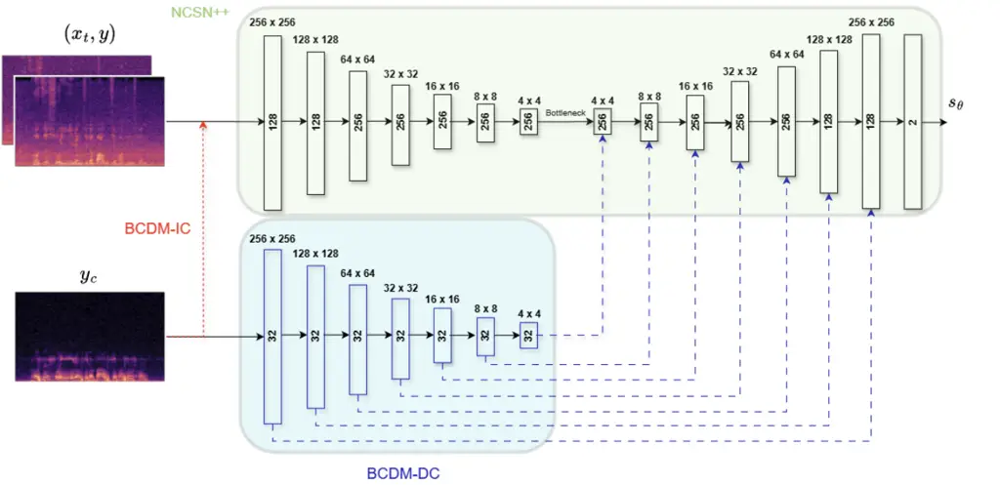

# Bone-conduction Guided Multimodal Speech Enhancement with Conditional Diffusion Models

Sina Khanagha    Bunlong Lay    Timo Gerkmann

###### Abstract

Single-channel speech enhancement models face significant performance
degradation in extremely noisy environments. While prior work has shown
that complementary bone-conducted speech can guide enhancement,
effective integration of this noise-immune modality remains a challenge.
This paper introduces a novel multimodal speech enhancement framework
that integrates bone-conduction sensors with air-conducted microphones
using a conditional diffusion model. Our proposed model significantly
outperforms previously established multimodal techniques and a powerful
diffusion-based single-modal baseline across a wide range of acoustic
conditions.

###### Index Terms: 

Bone-conducted speech, multimodal speech enhancement, conditional
diffusion models, speech enhancement, score-based generative models

^(†)^(†)address: Signal Processing Group, University of Hamburg, Germany

## 1 Introduction

Conventional speech enhancement models aim to reconstruct the original
clean speech signal from the corrupted noisy mixture. Recent deep neural
network (DNN) based speech enhancement models can be categorized into
predictive and generative models \[1\]. Predictive models aim to
directly estimate the clean speech from the noisy mixture whereas the
generative models employ strategies to utilize the noisy mixture as a
conditioning signal to guide a stochastic generation process in order to
create plausible clean speech samples that resemble the original clean
speech.

Naturally, the denoising performance of both types depends on the
intensity of the noise. At very low signal-to-noise ratios (SNRs) the
models often fail to output adequate results. This motivates the idea of
moving beyond the single-modality speech enhancement models and
utilizing auxiliary modalities that are immune to acoustic noise such as
visual cues \[2\], or bone-conducted speech \[3, 4, 5, 6, 7, 8\].

Bone-conducted speech is commonly recorded with an accelerometer by
tracking the local vibrations of human skull which in turn originates
from the vibrations of the vocal tract. Although by nature this modality
of speech is immune against acoustic noise, it suffers from limited
bandwidth and poor intelligibility. Therefore, a plausible idea is to
simultaneously employ both modalities to construct multimodal speech
enhancement models that are able to take advantage of both the acoustic
noise immunity of the band-limited bone-conducted speech and the
high-frequency content of the air-conducted speech.

Most of the recent bone-conduction guided multimodal speech enhancement
models utilize a U-Net like backbone \[3, 6, 7\] and make an effort to
introduce the auxiliary bone-conducted signal into the denoising process
with various strategies. The most prominent method is to either directly
fuse the conditioning signal with the noisy mixture at the input \[6,
7\] or to implement an attention based feature pre-processing layer to
construct a fused input for the network \[4, 6\]. Furthermore, some of
the methods utilize separate downsampling encoders for each modality and
perform the feature fusion steps on the embeddings of each encoder
before the bottleneck layer \[3, 7\]. Li et al. \[3\] also introduced a
contrastive learning loss as a regularizer term for the embeddings of
each encoder in order to reduce the embedding distance of the two
modalities which marginally improves the enhancement performance of the
model. Duan et al. \[9\] also utilizes a diffusion process as a
complimentary generation step for bandwidth extension of the
bone-conducted speech. It is important to note however that this pursues
a different goal than multimodal speech enhancement.

In this paper, we introduce the Bone-conduction Conditional Diffusion
Model (BCDM), a complex-domain diffusion model for multimodal speech
enhancement. To effectively integrate bone-conduction sensor data, we
propose and compare two distinct conditioning strategies for a U-Net
denoiser: a direct input concatenation (IC) method and a decoder
conditioning (DC) feature injection approach. Extensive experiments
demonstrate that BCDM substantially outperforms both single-modality
diffusion and state-of-the-art multimodal baselines across low and high
SNR conditions. To the best of our knowledge, this is the first work to
apply a conditional diffusion framework to bone-conduction guided speech
enhancement.

## 2 Method

The fundamental idea behind recent generative diffusion models is to
gradually add noise to the samples until the sample transforms into pure
noise in the forward process and then training a DNN to reverse this
process and generate high fidelity samples with respect to our original
data distribution. The general forward process is expressed as the
following stochastic differential equation (SDE) \[10\]:

```math
dx_{t}=f(x_{t},t)\,dt+g(t)\,dW_{t},\quad t\in[0,T], \tag{1}
```

where $`x_{t}`$ denotes the process state at time step $`t`$ and
$`W_{t}`$ denotes a standard Wiener process. Moreover, $`f(x_{t},t)`$
and $`g(t)`$ represent the drift and diffusion coefficients,
respectively. The drift coefficient dictates the deterministic evolution
and overall direction of the process whereas the diffusion coefficient
controls the stochastic part of the process by determining the magnitude
of random fluctuations added at each step.

Speech enhancement can be expressed as a conditional generation task
with the goal of generating clean speech distribution samples
conditioned on the noisy mixture \[11, 12\]. In our work, we utilize the
same conditioning method proposed by Richter et al. \[12\] in which the
drift coefficient is modified as:

```math
f(x_{t},y):=\gamma(y-x_{t}), \tag{2}
```

where $`y`$ denotes the noisy air-conducted mixture and $`\gamma`$
denotes the stiffness constant controlling the mean evolution of the
process from clean speech $`x_{0}`$ to $`y`$. Essentially, instead of a
transition of samples to zero-mean noise, we move the mean towards the
noisy mixture distribution. Furthermore, similar to the variance
exploding method of Song et al. \[10\], we define the diffusion
coefficient as:

```math
g(t):=\sigma_{\min}\left(\frac{\sigma_{\max}}{\sigma_{\min}}\right)^{t}\sqrt{2\log\left(\frac{\sigma_{\max}}{\sigma_{\min}}\right)}, \tag{3}
```

Where $`\sigma_{\max}`$ and $`\sigma_{\min}`$ parameters bound the noise
schedule of the Wiener process. The choice of these parameters play a
crucial role in denoising capabilities of the model as it has been shown
that having a higher $`\sigma_{\max}`$ results in a superior
environmental noise removal at the cost of losing more speech components
\[13\]. In our work we opted for $`\sigma_{\min}=0.05`$ and
$`\sigma_{\max}=0.5`$ as it provides a reasonable trade-off between
noise removal and speech preservation.

The associated reverse SDE for (1) can be derived as:

```math
dx_{t}=[-f(x_{t},y)+g(t)^{2}\nabla_{x_{t}}\log{p_{t}}(x_{t}|y)]dt+g(t)d\overline{w} \tag{4}
```

The score term $`\nabla_{x_{t}}\log{p_{t}}(x_{t}|y)`$ is intractable but
can be estimated with a DNN, resulting in a score _model_. We denote our
score model with $`s_{\theta}(x_{t},y,y_{c},t)`$ which receives the
current process state $`x_{t}`$, noisy air-conducted speech $`y`$, the
conditional bone-conducted speech signal $`y_{c}`$, and diffusion time
step $`t`$ as inputs, with $`\theta`$ representing the parameters of the
DNN. By swapping the score model in (4) we have:

```math
dx_{t}=[-f(x_{t},y)+g(t)^{2}s_{\theta}(x_{t},y,y_{c},t)]dt+g(t)d\overline{w} \tag{5}
```

Which during inference can be solved by an ODE solver for deterministic
results or a stochastic SDE solver for sampling-based solutions. In this
work we have utilized the predictor-corrector (PC) sampler strategy
proposed by Song et al. \[10\] as our SDE solver.

Moreover, the objective function for score model training is the score
matching objective described as:

```math
\mathbb{E}\left[\|s_{\theta}(x_{t},y,y_{c},t)-\nabla_{x_{t}}\log p_{0t}(x_{t}\mid x_{0},y)\|_{2}^{2}\right], \tag{6}
```

where the expectation $`\mathbb{E}`$ is taken over $`(t,x_{t})`$
conditioned on $`(x_{0},y,y_{c})`$ with $`t\sim\mathcal{U}(0,1)`$. In
addition, $`\nabla_{x_{t}}\log p_{0t}(x_{t}\mid x_{0},y)`$ can be
efficiently calculated at each randomly sampled step t according to
\[12\].



Figure 1: An overview of two IC (red) and DC (blue) conditioning
strategies for the large variant of BCDM. The skip connections and
progressive layers of the NCSN++ have been excluded from this diagram
for clarity improvement

## 3 Conditioning Strategies

In this section we introduce our two conditioning strategies for
inserting the bone-conducted speech signal into the score model. The
fundamental backbone architecture of the score model in our experiments
is a modified version of NCSN++ \[10\] proposed by \[12\] which is a
multi-resolution U-Net type DNN. Two configurations of the backbone have
been considered where the smaller one has half the number of feature
maps at each down or upsampling layers and the depth of the ResNet
blocks are reduced to 1. The large configuration is referred to with the
suffix ”-L” and the smaller one with ”-S”, respectively. An overview of
the conditioning methods and layer configurations of the large variant
is presented in Fig. 1.

### 3.1 Input Concatenation (IC)

For the first method, we concatenate the time-aligned bone-conducted
speech spectrogram with both the noisy air-conducted speech spectrogram
and the current process state spectrogram along the channel dimension.
The advantage of this method lies in its simplicity and minimal number
of added parameters to the network. Additionally, due to the similarity
of the two modalities, theoretically having a mutual encoder with the
same architecture should not drastically limit the learning
capabilities. We denote this method with BCDM-IC.

### 3.2 Decoder Conditioning (DC)

It can also be beneficial to utilize separate encoders for each modality
to increase the network’s capability to extract nuance information from
each modality individually instead of dealing with a fused input feature
immediately at the initial layers. Also, it has been demonstrated that
injecting the conditioning feature maps into the upsampling layers of
the score model can result in significant performance gains \[14\]. Such
conditioning resembles the typical skip connections in the U-Net
backbone. Hence, we designed a separate encoder for the bone-conducted
speech that injects the resulting feature maps into decoder’s upsampling
layers at each corresponding resolution. The conditioning encoder
downsampling blocks are constructed from ResNet type blocks proposed in
the BigGAN \[15\] model which are also conditioned on the time
embeddings of the diffusion process. Finally, after concatenating the
feature maps from skip connections, condition encoder, and the previous
layer’s output feature maps, we have utilized 1x1 Conv2D layers to
reduce the number of feature maps to match the original NCSN++ decoder
feature maps in order to avoid a significant increase in parameters. We
denote this method with BCDM-DC. Note that in both large and small
variants of this method, configuration of the conditioning encoder is
identical.

[TABLE]

Table 1: Comparison of models across SNR levels with metrics POLQA,
PESQ, and ESTOI on 3741 test utterances. The average POLQA, PESQ and
ESTOI values for bone-conducted speech are 1.89 ± 0.45, 1.43 ± 0.25, and
0.58 ± 0.09, respectively. For all diffusion-based models we used N=60
denoising reverse steps. ^(\*)SGMSE+ is the only single-modality model.

## 4 Experimental Setup

For our experiments, we utilized the ABCS dataset ¹¹ 1
[https://github.com/wangmou21/abcs](https://github.com/wangmou21/abcs)
\[5\], which contains 42 hours of time-aligned air-conducted and
bone-conducted speech recordings. The dataset comprises utterances of
1–5 seconds in duration, collected from 100 Chinese speakers. Following
the original setup, the dataset is divided into training, validation,
and test subsets with 84, 8, and 8 speakers, respectively, and we
adopted the same speaker partitions in our experiments. To create the
noisy air-conducted mixtures for our training and testing, we used the
CHiME3 dataset \[16\]. The SNR value for each training utterance has
been uniformly sampled from -5 to 20 dB.

We extract complex-valued STFT representation using a window size of 510
and the hop length of 128, resulting in 256 frequency bins. The length
is also trimmed to 256 frames to construct the 256 x 256 complex input
of the score model. The batch size is set to 8 and we used Adam
optimizer with the learning rate of $`10^{\text{-4}}`$. The exponential
moving average of the DNN weights are also recorded with a decay rate of
0.999 for sampling \[12\].

We compare our results with three of the recently proposed
bone-conduction guided multimodal speech enhancement models as our
baselines: FCN-LF \[7\], DCCRN \[6\], and BiNet \[3\]. We also included
the single-modality SGMSE+ model \[12\], which shares the NCSN++
backbone with ours but lacks the conditioning additions.

The metrics used for comparison are extended short-time objective
intelligibility (ESTOI) \[17\], wide-band perceptual evaluation of
speech quality (PESQ) \[18\], and the perceptual objective listening
quality analysis (POLQA) \[19\]. All of the models have been trained
from scratch by us and the checkpoint with the highest average PESQ
value for 20 randomly chosen utterances of validation speakers is chosen
for comparisons.

## 5 Results and Discussions

We created subsets with various noise intensities from the test
speakers, totaling 3,741 samples per condition where the SNR value is
randomly drawn according to Gaussian distributions centered at -10, -5,
0, 5, 15 with $`\sigma=1`$. The results are presented in Table 1.

### 5.1 Comparison Against Baseline Models

As demonstrated in Table 1, all of our proposed BCDM models outperform
the recently proposed models across all acoustic conditions. Although
the BiNet model is competitive with our small models at low SNR
conditions, it is evident that there is a clear under-utilization of the
air-conducted modality in the BiNet model that is specially apparent at
higher SNR where at 15 dB, our small variants outperform BiNet by as
much as 0.81 POLQA, 0.8 PESQ and 0.1 ESTOI. The BiNet model essentially
acts similarly to a bandwidth extension model rather than a multimodal
speech enhancement which explains the relative low performance gain in
higher SNRs. Conversely, the DCCRN model demonstrates better
adaptiveness across different conditions but fails to properly utilize
the bone-conducted modality which results in subpar performance at lower
SNRs. Moreover, all of the multimodal baselines only manage to
outperform the SGMSE+ single-modality model at extreme conditions where
we can observe that even at 5 SNR, SGMSE+ outperforms other baselines.
However, even at 15 SNR, BCDM large variants with comparable size
comfortably outperform the SGMSE+ in terms of POLQA and PESQ while the
small variants with approximately six times fewer parameters demonstrate
almost identical performance across all metrics.

### 5.2 Number of Reverse Steps

Figure 2: PESQ evolution of BCDM’s small variants as a function of $`N`$
at -5 dB SNR

Although our models exhibit superior performance, it is important to
acknowledge that other baselines are predictive models which produce the
output in a single function call whereas in diffusion frameworks several
reverse steps N are required to produce adequate results. As
demonstrated in Fig. 2, BCDM small variants surpass DCCRN at around 10
steps and BiNet with 20 steps where each step corresponds to 2 score
function calls in the PC sampling strategy. It is also noticeable that
the IC strategy requires fewer steps to reach its peak performance
compared to DC strategy.

## 6 Conclusion

In this work we introduced BCDM, a multimodal bone-conduction guided
speech enhancement model. Our experiments demonstrate that BCDM
significantly outperforms recent multimodal baselines and a strong
single-modality baseline across all acoustic conditions. Furthermore, we
proposed two conditioning strategies where our experiments suggest that
the DC method offers a noticeable improvement in instrumental metrics at
the cost of more reverse steps and more network parameters compared to
the IC method.

## References

- \[1\] J. Lemercier, J. Richter, S. Welker, and T. Gerkmann (2023)
  Analysing diffusion-based generative approaches versus discriminative
  approaches for speech restoration. In IEEE Int. Conf. Acoustics,
  Speech, Signal Proc. (ICASSP), Vol. , Rhodes Island, Greece. External
  Links:
  [Document](https://dx.doi.org/10.1109/ICASSP49357.2023.10095258) Cited
  by: §1.
- \[2\] J. Richter, S. Frintrop, and T. Gerkmann (2023) Audio-visual
  speech enhancement with score-based generative models. In Speech
  Communication; 15th ITG Conference, Vol. , Aachen, Germany. External
  Links: [Document](https://dx.doi.org/10.30420/456164054) Cited by: §1.
- \[3\] C. Li, F. Yang, and J. Yang (2025) Bone conduction-aided speech
  enhancement with two-tower network and contrastive learning. IEEE
  Transactions on Audio, Speech and Language Processing 33 (),
  pp. 163–174. External Links:
  [Document](https://dx.doi.org/10.1109/TASLP.2024.3512207) Cited by:
  §1, §1, §4.
- \[4\] Z. Liu, Z. Chen, and F. Yin (2025) Robust fusion of bone and
  air-conducted sensors for speech enhancement with adaptive
  temporal-frequency attention. In IEEE Int. Conf. Acoustics, Speech,
  Signal Proc. (ICASSP), Vol. , Hyderabad, India. External Links:
  [Document](https://dx.doi.org/10.1109/ICASSP49660.2025.10888094) Cited
  by: §1, §1.
- \[5\] M. Wang, J. Chen, X. Zhang, Z. Huang, and S. Rahardja (2022)
  Multi-modal speech enhancement with bone-conducted speech in time
  domain. Applied Acoustics 200, pp. 109058. External Links: ISSN
  0003-682X,
  [Document](https://dx.doi.org/https%3A//doi.org/10.1016/j.apacoust.2022.109058)
  Cited by: §1, §4.
- \[6\] H. Wang, X. Zhang, and D. Wang (2022) Fusing bone-conduction and
  air-conduction sensors for complex-domain speech enhancement. IEEE/ACM
  Transactions on Audio, Speech, and Language Processing 30 (),
  pp. 3134–3143. External Links:
  [Document](https://dx.doi.org/10.1109/TASLP.2022.3209943) Cited by:
  §1, §1, §4.
- \[7\] C. Yu, K. Hung, S. Wang, Y. Tsao, and J. Hung (2020) Time-domain
  multi-modal bone/air conducted speech enhancement. IEEE Signal
  Processing Letters 27 (), pp. 1035–1039. External Links:
  [Document](https://dx.doi.org/10.1109/LSP.2020.3000968) Cited by: §1,
  §1, §4.
- \[8\] J. Heitkaemper, J. Caroselli, M. McKinnon, A. Narayanan, and N.
  Howard (2025) Bone conducted signal guided speech enhancement for
  voice assistant on earbuds. In IEEE Int. Conf. Acoustics, Speech,
  Signal Proc. (ICASSP), Vol. , Hyderabad, India. External Links:
  [Document](https://dx.doi.org/10.1109/ICASSP49660.2025.10889416) Cited
  by: §1.
- \[9\] Z. Duan, J. Zhou, C. Fan, L. Tao, and Z. Lv (2024) CATAD:
  conformer-based adversarial training with adaptive diffusion for
  bone-conducted speech enhancement. In IEEE 14th International
  Symposium on Chinese Spoken Language Processing (ISCSLP), Vol. ,
  Beijing, China. External Links:
  [Document](https://dx.doi.org/10.1109/ISCSLP63861.2024.10800089) Cited
  by: §1.
- \[10\] Y. Song, J. Sohl-Dickstein, D. P. Kingma, A. Kumar, S. Ermon,
  and B. Poole (2021) Score-based generative modeling through stochastic
  differential equations. In International Conference on Learning
  Representations, Cited by: §2, §2, §2, §3.
- \[11\] Y. Lu, Z. Wang, S. Watanabe, A. Richard, C. Yu, and Y.
  Tsao (2022) Conditional diffusion probabilistic model for speech
  enhancement. In IEEE Int. Conf. Acoustics, Speech, Signal Proc.
  (ICASSP), Vol. , Singapore. External Links:
  [Document](https://dx.doi.org/10.1109/ICASSP43922.2022.9746901), ISSN
  2379-190X Cited by: §2.
- \[12\] J. Richter, S. Welker, J. Lemercier, B. Lay, and T.
  Gerkmann (2023) Speech enhancement and dereverberation with
  diffusion-based generative models. IEEE/ACM Transactions on Audio,
  Speech, and Language Processing 31 (), pp. 2351–2364. External Links:
  [Document](https://dx.doi.org/10.1109/TASLP.2023.3285241) Cited by:
  §2, §2, §3, §4, §4.
- \[13\] B. Lay and T. Gerkmann (2024) An Analysis of the Variance of
  Diffusion-based Speech Enhancement. In Interspeech, Kos Island,
  Greece. External Links:
  [Document](https://dx.doi.org/10.21437/Interspeech.2024-85), ISSN
  2958-1796 Cited by: §2.
- \[14\] D. Kim, D. Yang, D. Kim, J. Chang, J. Choi, M. Lee, J. Yang,
  and H. Moon (2024) Guided conditioning with predictive network on
  score-based diffusion model for speech enhancement. In Interspeech,
  Kos Island, Greece. External Links:
  [Document](https://dx.doi.org/10.21437/Interspeech.2024-1545), ISSN
  2958-1796 Cited by: §3.2.
- \[15\] A. Brock, J. Donahue, and K. Simonyan (2019) Large scale GAN
  training for high fidelity natural image synthesis. In International
  Conference on Learning Representations, Cited by: §3.2.
- \[16\] J. Barker, R. Marxer, E. Vincent, and S. Watanabe (2015) The
  third ’chime’ speech separation and recognition challenge: dataset,
  task and baselines. In Proceedings of the IEEE Workshop on Automatic
  Speech Recognition and Understanding (ASRU), Scottsdale, Arizona, USA.
  Cited by: §4.
- \[17\] J. Jensen and C. H. Taal (2016) An algorithm for predicting the
  intelligibility of speech masked by modulated noise maskers. IEEE/ACM
  Transactions on Audio, Speech, and Language Processing 24 (11),
  pp. 2009–2022. External Links:
  [Document](https://dx.doi.org/10.1109/TASLP.2016.2585878) Cited by:
  §4.
- \[18\] A.W. Rix, J.G. Beerends, M.P. Hollier, and A.P. Hekstra (2001)
  Perceptual evaluation of speech quality (pesq)-a new method for speech
  quality assessment of telephone networks and codecs. In IEEE Int.
  Conf. Acoustics, Speech, Signal Proc. (ICASSP), Vol. 2, Salt Lake
  City, Utah, USA. External Links:
  [Document](https://dx.doi.org/10.1109/ICASSP.2001.941023) Cited by:
  §4.
- \[19\] J. Beerends, C. Schmidmer, J. Berger, M. Obermann, R.
  Ullmann, J. Pomy, and M. Keyhl (2013) Perceptual objective listening
  quality assessment (POLQA), the third generation ITU-T standard for
  end-to-end speech quality measurement part I-temporal alignment. AES:
  Journal of the Audio Engineering Society 61, pp. 366–384. Cited by:
  §4.
