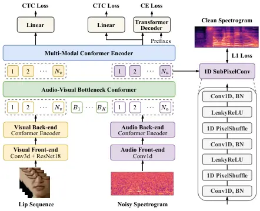

# Purification Before Fusion: Toward Mask-Free Speech Enhancement for Robust Audio-Visual Speech Recognition

Linzhi Wu¹, Xingyu Zhang²\sthanksCorresponding author. This work was
supported in part by the grants from the National Natural Science
Foundation of China under Grant 62332019, the National Key Research and
Development Program of China (2023YFF1203900, 2023YFF1203903), and
sponsored by Beijing Nova Program (20240484513)., Hao Yuan³, Yakun
Zhang², Changyan Zheng⁴ Liang Xie², Tiejun Liu¹, Erwei Yin²

###### Abstract

Audio-visual speech recognition (AVSR) typically improves recognition
accuracy in noisy environments by integrating noise-immune visual cues
with audio signals. Nevertheless, high-noise audio inputs are prone to
introducing adverse interference into the feature fusion process. To
mitigate this, recent AVSR methods often adopt mask-based strategies to
filter audio noise during feature interaction and fusion, yet such
methods risk discarding semantically relevant information alongside
noise. In this work, we propose an end-to-end noise-robust AVSR
framework coupled with speech enhancement, eliminating the need for
explicit noise mask generation. The framework leverages a
Conformer-based bottleneck fusion module to implicitly refine noisy
audio features with video assistance. By reducing modality redundancy
and enhancing inter-modal interactions, our method aims to preserve
speech semantic integrity to achieve robust recognition performance.
Experimental evaluations on the public LRS3 benchmark suggest that our
method outperforms prior advanced mask-based baselines under noisy
conditions.

###### Index Terms: 

audio-visual speech recognition, speech feature enhancement,
noise-robust, multimodal bottleneck Conformer

^(†)^(†)address: ¹University of Electronic Science and Technology of
China, Chengdu, China  
²Defense Innovation Institute, Academy of Military Sciences, Beijing,
China  
³Peking University, Beijing, China  
⁴High-tech Institute, Weifang, China

## 1 Introduction

Audio-visual speech recognition (AVSR) has emerged as a promising
solution to overcome the limitations of automatic speech recognition
(ASR) systems, especially in noisy conditions. By incorporating visual
cues such as lip movements, AVSR leverages complementary multimodal
information to improve recognition robustness, attracting considerable
attention recently \[1, 2, 3\]. Unlike audio-only ASR, which struggles
with degraded performance under challenging acoustic conditions, AVSR
exploits visual modality to provide contextual cues that are invariant
to acoustic noise, thereby enabling reliable speech transcription even
in scenarios with background noise or overlapping speech \[4, 5\].

Most contemporary AVSR models employ cross-modal attention mechanisms to
facilitate effective audio-visual interaction \[6, 7, 8, 9, 10\].
Compared to early strategies such as direct feature concatenation,
cross-attention achieves dynamic alignment and richer multimodal
integration. But, when audio inputs are severely corrupted by noise, the
interaction process is prone to disruption. Noisy audio features can
introduce irrelevant or misleading information, forcing the model to
undertake the entangled tasks of both implicitly denoising the input and
extracting critical speech-related information simultaneously. This dual
burden might overwhelm the cross-modal interaction module, leading to
suboptimal feature fusion. To alleviate the negative effects of noise,
recent studies have proposed custom-designed masking networks to
generate noise-reduction masks, which explicitly suppress irrelevant
noise components in audio features \[4, 11, 12\]. These methods aim to
suppress noise by selectively focusing on relevant audio information
during fusion. Nevertheless, they are typically driven solely by the
final AVSR objective, which cannot guarantee the preservation of
semantic integrity during this lossy noise-suppression process.

By contrast, this work presents a purify-then-fuse paradigm without
explicit mask generation to achieve noise-robust AVSR. The key insight
is that prioritizing feature purification before fusion ensures that
audio representations fed into cross-modal interaction are semantically
complete and noise-free. To this end, we incorporate an auxiliary
audio-visual speech enhancement module based on bottleneck attention
into our AVSR framework, which refines audio representations prior to
deep multimodal fusion. Motivated by \[13\], we design an audio-visual
bottleneck Conformer to facilitate efficient cross-modal interaction and
implicit noise purification. Guided by audio spectrogram reconstruction
objectives, our model tries to extract robust and semantically rich
audio representations with the aid of visual cues, mitigating noise
interference while retaining essential speech information. To our
knowledge, this is the first attempt to exploit a multimodal bottleneck
Conformer for both efficient cross-modal interaction and
reconstruction-based constraints, thus enhancing model resilience to
noise. We evaluate the effectiveness of the proposed method through a
series of experiments on LRS3 \[14\], the large-scale audio-visual
dataset obtained in the wild. The results demonstrate that our model
achieves superior performance over previous competitive methods,
confirming its robustness under challenging acoustic conditions.

## 2 Proposed Method

Fig. 1 illustrates the proposed noise-robust AVSR framework, which takes
video and noisy audio as inputs to perform speech recognition without
explicit mask generation. This framework integrates a primary AVSR model
with a dedicated speech enhancement (denoising) module, which generates
refined audio representations from noisy features. Positioned between
audio feature extraction and cross-modal fusion, the enhancement module
is jointly optimized with the AVSR model. These refined audio features
are subsequently fed into a cross-modal encoder, where they are fused
with visual features to facilitate deep and reliable speech
understanding.



Figure 1: Overall architecture of the proposed model.

### 2.1 Feature Extraction

The video input, denoted as $`\mathbf{x}_{v}`$, consists of mouth
region-of-interest (RoI) sequences. These are first processed by a 3D
convolutional layer with a kernel size of 5$`\times`$7$`\times`$7
followed by a 2D ResNet18 \[15\] to extract spatio-temporal features.
The resulting features are then fed into a three-layer Conformer encoder
\[16\], which captures both local and global visual temporal dynamics,
yielding visual features
$`\mathbf{h}_{v}\in\mathbb{R}^{N_{v}\times d}`$. The audio input,
denoted as log mel-spectrogram $`\mathbf{x}_{a}`$, is first processed by
two subsampling 1D convolutional layers to reduce the temporal dimension
to match the frame rate of the visual features. A similar Conformer is
then applied to encode temporal features, producing audio features
$`\mathbf{h}_{a}\in\mathbb{R}^{N_{a}\times d}`$. Here $`N_{v}`$ and
$`N_{a}`$ are total frames of video and audio respectively, and $`d`$ is
the feature dimension. Each modality frame refers to a token in our
work.

### 2.2 Audio-Visual Bottleneck Conformer

To enhance inter-modal interaction and compress redundant modal
information, we introduce an audio-visual bottleneck Conformer (AVBC)
with $`L`$ layers, inspired by \[13\]. The AVBC employs a small set of
learnable bottleneck tokens
$`\mathbf{b}^{0}=[b_{1},b_{2},\dots,b_{K}]`$, $`b_{i}\in\mathbb{R}^{d}`$
($`K\ll N_{a},N_{v}`$). For each modality, cross-attention is computed
between its feature sequence and the bottleneck tokens. Formally for
layer $`l`$, we calculate token representations as follows:

```math
\begin{split}\mathbf{h}_{v}^{l+1}\|\mathbf{b}_{v}^{l+1}&=\mathrm{Conformer}(\mathbf{h}_{v}^{l}\|\mathbf{b}^{l};\theta_{v}),\\
\mathbf{h}_{a}^{l+1}\|\mathbf{b}_{a}^{l+1}&=\mathrm{Conformer}(\mathbf{h}_{a}^{l}\|\mathbf{b}^{l};\theta_{a}),\\
\mathbf{b}^{l+1}&=(\mathbf{b}_{v}^{l+1}+\mathbf{b}_{a}^{l+1})/2,\end{split} \tag{1}
```

where $`\theta_{v}`$ and $`\theta_{a}`$ are the parameters of the visual
Conformer and the audio Conformer, respectively. “$`\|`$” denotes the
concatenation operation of the latent tokens. Note that the convolution
module within the Conformer block is only used for modality tokens
excluding the bottleneck tokens. The iterative bottleneck attention
computation across $`\mathbf{h}_{a}`$ and $`\mathbf{h}_{v}`$ ultimately
yields refined representations $`\mathbf{z}_{v}=\mathbf{h}_{v}^{L}`$ and
$`\mathbf{z}_{a}=\mathbf{h}_{a}^{L}`$. Since all cross-modal attention
flow must pass through these bottleneck tokens, such tight “fusion”
bottlenecks force the model to condense modality-specific information
and share only essential content. This design allows the visual modality
to guide the purification of noisy audio features in a computationally
efficient manner, which reduces cross-modal attention computations from
$`\mathcal{O}((N_{a}+N_{v})^{2})`$ to
$`\mathcal{O}((K+N_{a})^{2})+\mathcal{O}((K+N_{v})^{2})`$.

### 2.3 Speech Feature Enhancement

To refine noisy audio features into fusion-ready representations, we
reconstruct the clean mel-spectrogram $`\hat{\mathbf{x}}_{a}`$ from
$`\mathbf{z}_{a}`$ via a dedicated 1D sub-pixel convolution layer
\[17\], which efficiently upscales audio feature maps to produce the
final spectrogram output ¹¹ 1 For the spectrogram decoder, our
preliminary experiments have shown that the designed lightweight
sub-pixel convolution module delivers performance comparable to the
widely-used transposed convolution network, while requiring fewer
parameters and offering higher computational efficiency.. The
reconstruction loss is defined as the L1 distance between the
mel-spectrogram of the clean audio and the reconstructed
mel-spectrogram:

```math
\begin{split}\mathcal{L}_{\text{recon}}=\|\hat{\mathbf{x}}_{a}-\mathbf{x}_{a}^{\text{clean}}\|_{1},\end{split} \tag{2}
```

Inspired by the perceptual loss used for image processing \[18\], we
further introduce a spectrogram-based perceptual loss. Unlike
reconstruction loss, which only focuses on raw spectrogram similarity,
this loss function captures perceptual discrepancies by minimizing the
L2 distance between high-level feature maps of the target and
reconstructed mel-spectrograms, where the feature maps are typically
obtained by an optimized feature extractor:

```math
\begin{split}\mathcal{L}_{\text{percep}}=\|\mathcal{F}(\hat{\mathbf{x}}_{a})-\mathcal{F}(\mathbf{x}_{a}^{\text{clean}})\|_{2}^{2},\end{split} \tag{3}
```

where $`\mathcal{F}`$ is our custom audio front-end in our work,
achieving a cycle-consistency regularization. The whole speech feature
enhancement process is guided by these two loss functions:

```math
\begin{split}\mathcal{L}_{\text{enhance}}=\alpha_{1}\mathcal{L}_{\text{recon}}+\alpha_{2}\mathcal{L}_{\text{percep}},\end{split} \tag{4}
```

with the first loss term providing stability (avoid drift in scale) and
the second one driving speech intelligibility. $`\alpha_{1}`$ and
$`\alpha_{2}`$ denote the weighting factors for each loss term.

### 2.4 Fusion and Speech Recognition

The cross-modal fusion encoder is not required to dedicate substantial
effort to denoising; instead, its primary role focuses on integrating
the purified audio with visual information. The refined representations
$`\mathbf{z}_{v}`$ and $`\mathbf{z}_{a}`$ are concatenated along the
temporal dimension and processed by a Conformer encoder to fully capture
intra-modal and inter-modal temporal dependencies \[9\], yielding fused
features $`\mathbf{f}_{v}`$ and $`\mathbf{f}_{a}`$ as follows:

```math
\begin{split}\mathbf{f}_{a}\|\mathbf{f}_{v}=\mathrm{Conformer}(\mathbf{z}_{a}\|\mathbf{z}_{v};\theta_{f}),\end{split} \tag{5}
```

where $`\theta_{f}`$ is the encoder parameter. These are fed into the
CTC \[19\] projection layer and Transformer decoder \[20\] for speech
recognition. Given the target text sequence $`\mathbf{y}`$, the
recognition objective function is defined as a hybrid CTC/attention loss
\[21, 22\]:

```math
\begin{split}\mathcal{L}_{\text{AVSR}}&=\lambda\mathcal{L}_{\text{ctc}}+(1-\lambda)\mathcal{L}_{\text{att}},\\
\mathcal{L}_{\mathrm{ctc}}&=-\log p_{\mathrm{ctc}}(\mathbf{y}|\mathbf{f}_{v})-\log p_{\mathrm{ctc}}(\mathbf{y}|\mathbf{f}_{a}),\\
\mathcal{L}_{\mathrm{att}}&=-\log p_{\mathrm{att}}(\mathbf{y}|\mathbf{f}_{a}),\end{split} \tag{6}
```

where $`\lambda`$ balances the relative weight between the CTC and
cross-entropy attention-based losses. The CTC projection layer is shared
across modalities.

The overall optimization objective combines recognition and enhancement
losses:
$`\mathcal{L}_{\text{total}}=\mathcal{L}_{\text{AVSR}}+\mathcal{L}_{\text{enhance}}`$.
This speech enhancement module is jointly trained with the AVSR modules.
Accordingly, the loss function backpropagates through the enhancement
module, compelling it to produce audio representations that are optimal
for speech transcription, not merely for spectral fidelity.

## 3 Experiments

### 3.1 Data Processing

Dataset. We evaluate the proposed method on the large-scale audio-visual
benchmark LRS3 \[14\], which consists of about 439 hours of TED and TEDx
English talks sourced from YouTube ²² 2
[https://www.robots.ox.ac.uk/~{}vgg/data/lip_reading/lrs3.html](https://www.robots.ox.ac.uk/~%7B%7Dvgg/data/lip_reading/lrs3.html).
The training set is divided into two partitions: pretrain (408 hours)
and trainval (30 hours), both of which are transcribed at the sentence
level. The pretrain part differs from trainval in that the duration of
its video clips span a much broader range. The standard test set (0.9
hours) is used for evaluation.

Processing. For the video stream, mouth RoIs are cropped from the
aligned talking face video sequence at 25Hz, resized to 96$`\times`$96,
converted to grayscale, and normalized to \[0, 1\]. During training, we
apply random cropping with crop size 88$`\times`$88, horizontal flipping
(probability 0.5) and adaptive time masking \[23\] to augment the video
data. We apply center crop at inference time. For the audio stream, raw
waveforms are resampled at 16kHz and transformed into 80-dimensional log
mel-spectrograms over windows of 25 ms strided by 10 ms. To synthesize
noisy audio inputs for training, we select white, pink, factory1,
factory2 and babble noises from the NOISEX-92 database \[24\], and
extract additional overlapping speech noise samples from the training
data. These noise samples are then additively mixed with clean waveforms
at a signal-to-noise ratio (SNR) level in {-7.5, -2.5, 2.5, 7.5, 12.5,
17.5} dB. For each training sample, we uniformly randomly select either
a clean or noisy speech.

### 3.2 Experimental Settings

Model Setup. Each Conformer encoder within our framework for each
modality consists of 3 blocks with 4 attention heads, hidden dimensions
of 512, feed-forward dimensions of 2048, and a convolution kernel size
of 31. We leverage a standard Transformer decoder for prediction and the
decoder comprises 6 layers, 4 attention heads, hidden dimensions of 512,
and feed-forward dimensions of 2048. Following \[2, 12\], the visual
front-end is initialized using a pre-trained model on LRW \[25\]. The
learnable bottleneck tokens are initialized using a Gaussian with a mean
of 0 and a standard deviation of 0.02, and the number of tokens is set
to 4.

Training Setup. We use the AdamW optimizer \[26\] to update model
parameters for 70 epochs with a batch size of 16. The initial learning
rate is set to 0.001, adjusted by a cosine annealing schedule with a
linear warm-up. $`\lambda`$ is set to 0.1 as suggested in \[23\], and
$`\alpha_{1}`$ = $`\alpha_{2}`$ = 0.1 in our work. For the training
stability of the entire framework, we adopt a curriculum learning
strategy. We first train the model for 20 epochs with the primary AVSR
objective using relatively high SNRs (i.e., 7.5-17.5dB), which focuses
on establishing robust multimodal alignments and avoids early divergence
induced by high-noise inputs. Then, we extend training to the full SNR
range and incorporate auxiliary speech enhancement objectives for joint
learning, enabling refined feature purification across various SNRs.

Testing Setup. We utilize the model averaged over the last 10
checkpoints for evaluation following \[23\]. During inference, decoding
is performed with a left-to-right beam search of width 40 on the
Transformer decoder, and following \[27\], we exploit an off-the-shelf
pre-trained GPT-2 language model \[28\] for beam rescoring. Following
prior literature \[1, 2\], we report word error rate (WER) on LRS3 under
both clean (SNR=$`\infty`$) and noisy conditions with varying SNR
levels. A lower WER indicates better recognition performance, while a
lower SNR corresponds to a higher noise level.

Figure 2: Performance comparison of different token numbers at the first
layer of our bottleneck Conformer under -5dB SNR babble noise. “w/o enh”
indicates the model without speech enhancement.

|                |                                |                                                   |         |
| -------------- | ------------------------------ | ------------------------------------------------- | ------- |
| Baseline       | $`\mathcal{L}_{\text{recon}}`$ | $`\mathcal{L}_{\text{percep}}`$ (Audio front-end) | WER (%) |
| $`\checkmark`$ | –                              | –                                                 | 12.8    |
| $`\checkmark`$ | $`\checkmark`$                 | –                                                 | 11.2    |
| $`\checkmark`$ | –                              | $`\checkmark`$                                    | 10.8    |
| $`\checkmark`$ | $`\checkmark`$                 | $`\checkmark`$                                    | 8.5     |
| Baseline       | $`\mathcal{L}_{\text{recon}}`$ | $`\mathcal{L}_{\text{percep}}`$ (Whisper)         | WER (%) |
| $`\checkmark`$ | –                              | –                                                 | 12.8    |
| $`\checkmark`$ | $`\checkmark`$                 | –                                                 | 11.2    |
| $`\checkmark`$ | –                              | $`\checkmark`$                                    | 9.5     |
| $`\checkmark`$ | $`\checkmark`$                 | $`\checkmark`$                                    | 7.9     |

Table 1: Effects of the reconstruction loss
($`\mathcal{L}_{\text{recon}}`$) and the cycle-consistency loss
($`\mathcal{L}_{\text{percep}}`$) on WER, where
$`\mathcal{L}_{\text{percep}}`$ is applied to the audio front-end and a
pre-trained Whisper encoder, respectively.

| Method                 | SNR (dB)   |     |     |     |      |      | Avg. |
| ---------------------- | ---------- | --- | --- | --- | ---- | ---- | ---- |
|                        | $`\infty`$ | 15  | 10  | 5   | 0    | -5   |      |
| EG-Seq2Seq \[29\]      | 6.8        | 3.3 | 3.9 | 5.8 | 12.2 | 27.3 | 9.9  |
| Conformer \[2\]        | 3.2        | 3.6 | 5.4 | 8.3 | 14.6 | 22.3 | 9.6  |
| V-CAFE \[4\]           | 2.9        | 3.0 | 4.0 | 8.4 | 12.5 | 19.3 | 8.4  |
| Joint AVSE-AVSR \[11\] | 2.0        | 2.4 | 2.9 | 4.1 | 8.0  | 19.4 | 6.5  |
| AV-RelScore \[12\]     | 2.8        | 2.9 | 2.9 | 3.3 | 4.8  | 9.0  | 4.3  |
| Ours (w/o enh)         | 2.3        | 3.1 | 3.8 | 4.6 | 6.7  | 12.8 | 5.6  |
| Ours                   | 2.1        | 2.4 | 2.6 | 3.2 | 4.5  | 8.5  | 3.9  |

Table 2: WER (%) comparisons with other competitive methods within
different noise levels.

| Input Condition         | Clean audio |         | Overlap. speech |         |
| ----------------------- | ----------- | ------- | --------------- | ------- |
|                         | w/ vid      | w/o vid | w/ vid          | w/o vid |
| Unified-Attention \[9\] | 2.4         | 2.7     | 11.3            | 27.4    |
| Our (w/o enh)           | 2.3         | 2.5     | 10.7            | 25.9    |
| Ours                    | 2.1         | 2.2     | 9.6             | 24.6    |

Table 3: WER (%) comparisons of different methods under clean audio
(SNR=$`\infty`$) and overlapped speech (SNR=-5dB) inputs, with or
without video assistance.

### 3.3 Results and Analysis

#### 3.3.1 Influence of the number of bottleneck tokens

The bottleneck tokens serve a key role in our AVBC fusion structure. We
thus conduct experiments to evaluate how their quantity influences the
model’s final prediction performance under -5dB babble noise. We keep
the number of bottleneck tokens to be much smaller than the total latent
units per modality, explicitly ensuring only necessary information
resides in these bottleneck tokens. Specifically, we set the number of
tokens to 0, 1, 2, 4, 8, and 16 respectively for comparison, where “0”
means that the two modalities skip the bottleneck and directly engage in
cross-attention. As depicted in Fig. 2, we can observe that the model
delivers relatively favorable performance when the number of tokens is
set to 4. The results imply that too few tokens may hinder sufficient
exchange of essential inter-modal information, while too many could
compromise the model’s ability to prioritize only essential content
transmission.

#### 3.3.2 Effectiveness of the speech enhancement

The audio spectrogram reconstruction within our framework is optimized
with two loss functions, i.e. the spectrum-based term
($`\mathcal{L}_{\text{recon}}`$ in Eq. 2) and the perception-based term
($`\mathcal{L}_{\text{percep}}`$ in Eq. 3). We try to assess the effect
of each individual loss on final performance. Besides the audio
front-end, we also exploit a pre-trained ASR encoder, Whisper \[30\] ³³
3 [https://github.com/openai/whisper](https://github.com/openai/whisper)
medium with fixed parameters, to obtain $`\mathcal{L}_{\text{percep}}`$.
Table 1 presents the ablation results under -5dB SNR babble noise, and
we find that the combination of these two types of losses can
consistently lead to better performance. As our primary objective is
AVSR performance not just for clean-sounding audio restoration, the
$`\mathcal{L}_{\text{percep}}`$ term tends to contribute more to
recognition performance by extracting high-level semantic structures of
the enhanced audio to improve intelligibility. Compared with the audio
front-end, the Whisper can better encourage the enhanced output to
preserve rich phonetic and linguistic information that matters for
decoding results. But, due to its higher computational overhead, it
significantly slows training. Given that our primary goal is robust AVSR
– not audio enhancement in isolation – we opt for the audio front-end in
this work to maintain training efficiency while still achieving
effective gains.

#### 3.3.3 Noise robustness evaluation

To examine the noise robustness of our model against prior competitive
baselines, we perform comparative experiments across acoustic
conditions: clean audio (SNR=$`\infty`$) and noisy settings with an SNR
range of -5 to 15 dB. As shown in Table 2, our proposed method
outperforms these advanced noise-robust methods that require explicit
noise-reduction masks (e.g., AV-RelScore \[12\], which incorporates a
scoring module to suppress unreliable representations) by achieving a
lower average WER. Particularly, as SNR decreases, the performance gap
between our method and these baselines widens. Moreover, our full model
reduces WER by 1.7% compared to the ablation variant without speech
feature enhancement objectives. The results show the effectiveness of
our method in suppressing noisy audio representations without relying on
explicit noise mask generation.

#### 3.3.4 Experiments on various input conditions

Since cross-modal attention operations are decoupled from the modal
encoders, our AVSR framework generalizes to single-modality input
sequences, aligning with \[9, 31\]. To investigate the model’s
robustness under diverse input conditions, we further conduct
evaluations covering clean audio and overlapped speech, each assessed
with and without video input. Overlapped speech is generated by randomly
selecting a sample from the test set that is distinct from the input
audio and overlapping it with the input audio at an SNR of -5dB. During
testing, the two distinct speech signals are played simultaneously,
while the input video only provides visual cues for the target speech.
Notably, the bottleneck tokens within the AVBC still interact with the
audio sequence even when video input is disabled. As shown in Table 3,
the presence or absence of video input exerts minimal influence on the
final performance under clean audio conditions. However, when overlapped
speech is used as the audio input, the visual modality becomes crucial
for effectively “selecting” the target speech from the mixed speech.
Furthermore, our model (without speech enhancement) performs better than
the baseline in \[9\] under overlapped speech scenarios. This advantage
likely stems from the bottleneck tokens preserving modality-shared
features, which serve as complementary cues for the corrupted audio.

## 4 Conclusion

In this paper, we propose a noise-robust AVSR architecture that
integrates AVSR with speech enhancement, achieving noise robustness
without resorting to explicit noise mask generation. We take advantage
of the bottleneck Conformer and audio reconstruction objectives to
effectively refine noisy audio representations with video assistance,
while preserving speech semantic integrity to facilitate subsequent
cross-modal fusion. Experimental results on the LRS3 dataset show
superior noise robustness compared to mask-based baseline methods,
validating the efficacy of implicit noise suppression enabled by
bottleneck-driven cross-modal fusion.

## References

- \[1\] Triantafyllos Afouras, Joon Son Chung, Andrew W. Senior, Oriol
  Vinyals, and Andrew Zisserman, “Deep audio-visual speech recognition,”
  IEEE TPAMI, vol. 44, no. 12, pp. 8717–8727, 2018.
- \[2\] Pingchuan Ma, Stavros Petridis, and Maja Pantic, “End-to-end
  audio-visual speech recognition with conformers,” in Proc. ICASSP,
  2021, pp. 7613–7617.
- \[3\] Maxime Burchi and Radu Timofte, “Audio-visual efficient
  conformer for robust speech recognition,” in Proc. WACV, 2023, pp.
  2257–2266.
- \[4\] Joanna Hong, Minsu Kim, Daehun Yoo, and Yong Man Ro, “Visual
  context-driven audio feature enhancement for robust end-to-end
  audio-visual speech recognition,” in Proc. Interspeech, 2022, pp.
  2838–2842.
- \[5\] Bowen Shi, Wei-Ning Hsu, Kushal Lakhotia, and Abdelrahman
  Mohamed, “Learning audio-visual speech representation by masked
  multimodal cluster prediction,” in Proc. ICLR, 2022, pp. 1–24.
- \[6\] George Sterpu, Christian Saam, and Naomi Harte, “Attention-based
  audio-visual fusion for robust automatic speech recognition,” in Proc.
  ICMI, 2018, pp. 111–115.
- \[7\] Liangfa Wei, Jie Zhang, Junfeng Hou, and Lirong Dai, “Attentive
  fusion enhanced audio-visual encoding for transformer based robust
  speech recognition,” in Proc. APSIPA ASC, 2020, pp. 638–643.
- \[8\] George Sterpu, Christian Saam, and Naomi Harte, “How to teach
  dnns to pay attention to the visual modality in speech recognition,”
  IEEE/ACM TASLP, vol. 28, pp. 1052–1064, 2020.
- \[9\] Jiahong Li, Chenda Li, Yifei Wu, and Yanmin Qian, “Robust
  audio-visual ASR with unified cross-modal attention,” in Proc. ICASSP,
  2023, pp. 1–5.
- \[10\] He Wang, Pengcheng Guo, Pan Zhou, and Lei Xie, “MLCA-AVSR:
  multi-layer cross attention fusion based audio-visual speech
  recognition,” in Proc. ICASSP, 2024, pp. 8150–8154.
- \[11\] Jung-Wook Hwang, Jeongkyun Park, Rae-Hong Park, and Hyung-Min
  Park, “Audio-visual speech recognition based on joint training with
  audio-visual speech enhancement for robust speech recognition,”
  Applied Acoustics, vol. 211, pp. 109478, 2023.
- \[12\] Joanna Hong, Minsu Kim, Jeongsoo Choi, and Yong Man Ro, “Watch
  or listen: Robust audio-visual speech recognition with visual
  corruption modeling and reliability scoring,” in Proc. CVPR, 2023, pp.
  18783–18794.
- \[13\] Arsha Nagrani, Shan Yang, Anurag Arnab, Aren Jansen, Cordelia
  Schmid, and Chen Sun, “Attention bottlenecks for multimodal fusion,”
  in Proc. NeurIPS, 2021, pp. 14200–14213.
- \[14\] Triantafyllos Afouras, Joon Son Chung, and Andrew Zisserman,
  “LRS3-TED: a large-scale dataset for visual speech recognition,” CoRR,
  vol. abs/1809.00496, 2018.
- \[15\] Kaiming He, Xiangyu Zhang, Shaoqing Ren, and Jian Sun, “Deep
  residual learning for image recognition,” in Proc. CVPR, 2016, pp.
  770–778.
- \[16\] Anmol Gulati, James Qin, Chung-Cheng Chiu, Niki Parmar,
  Yu Zhang, Jiahui Yu, Wei Han, Shibo Wang, Zhengdong Zhang, Yonghui Wu,
  and Ruoming Pang, “Conformer: Convolution-augmented transformer for
  speech recognition,” in Proc. Interspeech, 2020, pp. 5036–5040.
- \[17\] Wenzhe Shi, Jose Caballero, Ferenc Huszar, Johannes Totz,
  Andrew P. Aitken, Rob Bishop, Daniel Rueckert, and Zehan Wang,
  “Real-time single image and video super-resolution using an efficient
  sub-pixel convolutional neural network,” in Proc. CVPR, 2016, pp.
  1874–1883.
- \[18\] Justin Johnson, Alexandre Alahi, and Li Fei-Fei, “Perceptual
  losses for real-time style transfer and super-resolution,” in Proc.
  ECCV, 2016, vol. 9906, pp. 694–711.
- \[19\] Alex Graves, Santiago Fernández, Faustino J. Gomez, and Jürgen
  Schmidhuber, “Connectionist temporal classification: labelling
  unsegmented sequence data with recurrent neural networks,” in Proc.
  ICML, 2006, vol. 148, pp. 369–376.
- \[20\] Ashish Vaswani, Noam Shazeer, Niki Parmar, Jakob Uszkoreit,
  Llion Jones, Aidan N. Gomez, Lukasz Kaiser, and Illia Polosukhin,
  “Attention is all you need,” in Proc. NeurIPS, 2017, pp. 5998–6008.
- \[21\] Takaaki Hori, Shinji Watanabe, and John Hershey, “Joint
  CTC/attention decoding for end-to-end speech recognition,” in Proc.
  ACL, 2017, pp. 518–529.
- \[22\] Shinji Watanabe, Takaaki Hori, Suyoun Kim, John R. Hershey, and
  Tomoki Hayashi, “Hybrid ctc/attention architecture for end-to-end
  speech recognition,” IEEE JSTSP, vol. 11, no. 8, pp. 1240–1253, 2017.
- \[23\] Pingchuan Ma, Stavros Petridis, and Maja Pantic, “Visual speech
  recognition for multiple languages in the wild,” Nat. Mac. Intell.,
  vol. 4, no. 11, pp. 930–939, 2022.
- \[24\] Andrew Varga and Herman J. M. Steeneken, “Assessment for
  automatic speech recognition: II. NOISEX-92: A database and an
  experiment to study the effect of additive noise on speech recognition
  systems,” Speech Commun., vol. 12, no. 3, pp. 247–251, 1993.
- \[25\] Joon Son Chung and Andrew Zisserman, “Lip reading in the wild,”
  in Proc. ACCV, 2016, vol. 10112, pp. 87–103.
- \[26\] Ilya Loshchilov and Frank Hutter, “Decoupled weight decay
  regularization,” in Proc. ICLR, 2019, pp. 1–19.
- \[27\] K. R. Prajwal, Triantafyllos Afouras, and Andrew Zisserman,
  “Sub-word level lip reading with visual attention,” in Proc. CVPR,
  2022, pp. 5152–5162.
- \[28\] Alec Radford, Jeffrey Wu, Rewon Child, David Luan, Dario
  Amodei, Ilya Sutskever, et al., “Language models are unsupervised
  multitask learners,” OpenAI blog, vol. 1, no. 8, pp. 9, 2019.
- \[29\] Bo Xu, Cheng Lu, Yandong Guo, and Jacob Wang, “Discriminative
  multi-modality speech recognition,” in Proc. CVPR, 2020, pp.
  14421–14430.
- \[30\] Alec Radford, Jong Wook Kim, Tao Xu, Greg Brockman, Christine
  McLeavey, and Ilya Sutskever, “Robust speech recognition via
  large-scale weak supervision,” in Proc. ICML, 2023, vol. 202, pp.
  28492–28518.
- \[31\] Jiahong Li, Chenda Li, Yifei Wu, and Yanmin Qian, “Unified
  cross-modal attention: Robust audio-visual speech recognition and
  beyond,” IEEE/ACM TASLP, vol. 32, pp. 1941–1953, 2024.
