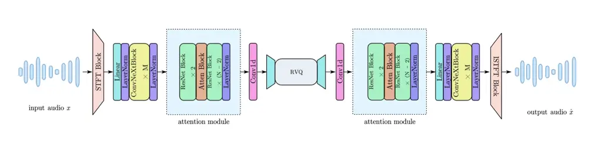

# VoCodec: An Efficient Lightweight Low-Bitrate Speech Codec

Leyan Yang     Ronghui Hu     Yang Xu     Jing Lu

###### Abstract

Recent advancements in end-to-end neural speech codecs enable
compressing audio at extremely low bitrates while maintaining
high-fidelity reconstruction. Meanwhile, low computational complexity
and low latency are crucial for real-time communication. In this paper,
we propose VoCodec, a speech codec model featuring a computational
complexity of only 349.29M multiply-accumulate operations per second
(MACs/s) and a latency of 30 ms. With the competitive vocoder Vocos as
its backbone, the proposed model ranked fourth on Track 1 in the 2025
LRAC Challenge and achieved the highest subjective evaluation score
(MUSHRA) on the clean speech test set. Additionally, we cascade a
lightweight neural network at the front end to extend its capability of
speech enhancement. Experimental results demonstrate that the two
systems achieve competitive performance across multiple evaluation
metrics. Speech samples can be found at
[https://acceleration123.github.io/](https://acceleration123.github.io/).

###### Index Terms: 

speech codec, low computational complexity, low bitrate, generative
adversarial network, speech enhancement

^(†)^(†)address: ¹Key Laboratory of Modern Acoustics, Nanjing
University, Nanjing 210093, Jiangsu, China  
²NJU-Horizon Intelligent Audio Lab, Horizon Robotics, Beijing 100094,
China ²²footnotetext: Equal contribution.¹¹footnotetext: Corresponding
author: lujing@nju.edu.cn

## 1 Introduction

Speech codecs serve the purpose of compressing and decompressing speech
signals to enable effective transmission and storage. Traditional codec
methods \[25, 2\] rely on signal processing techniques, while also
leveraging knowledge of psychoacoustics and speech synthesis to enhance
their coding efficiency. Although traditional codecs are efficient for
improving perceptual quality, their design requires significant manual
effort, including parameter tuning and subjective listening tests.

Neural codecs \[4\] usually consist of an encoder, a decoder, and a
quantizer module. The encoder compresses the speech into a latent
representation, while the decoder reconstructs the waveform from the
quantized vectors. The quantizer is usually parameterized and jointly
trained with the encoder and decoder in an end-to-end manner. Compared
to traditional codecs, neural codecs use discrete tokens for compression
and reconstruction rather than continuous embeddings. Most neural codecs
are based on the VQ-GAN architecture \[3\] and employ diverse
discriminators \[12, 11, 8\] to improve the perceptual quality of the
reconstructed speech. Existing neural codecs have demonstrated
remarkable reconstruction quality \[30, 1, 13\]. Beyond the perceptual
quality of the reconstructed speech, the low bitrate of neural codecs
has long been a research focus in the field, since it is critical for
real-time communication. BigCodec \[29\] scales up the model size to
compensate for the performance degradation caused by its low bitrate,
ultimately achieving high-quality speech reconstruction at a bitrate of
1.04 kbps. WavTokenizer \[9\] carefully investigates codebook
utilization for speech and select a larger single codebook, attaining a
bitrate as low as 0.98 kbps.

Although recent speech codec models have achieved significant progress
in recovering high-quality speech at low bitrates, existing models with
excellent performance often suffer from two critical drawbacks: high
computational complexity and non-causality, rendering them unsuitable
for real-time communication\[13, 29\]. In addition, noise and
reverberation in real-world scenarios may cause severe interference to
real-time communication. The 2025 Low-Resource Audio Codec (LRAC)
challenge \[28\] focuses on speech codec under joint resource
constraints, which includes computational complexity, bitrate, and
latency. Track 1 targets high reconstruction quality, while Track 2
further addresses coding under noisy and reverberant conditions.

In this paper, we propose VoCodec, a model that simultaneously features
low computational complexity, low latency, and support for low-bitrate
transmission. VoCodec’s encoder and decoder are based on Vocos \[22\].
To reduce computational overhead and latency, we operate speech codec
directly in the time-frequency domain. The final model requires a
computational complexity of only 349.29M MACs/s, with the receiver-side
computation accounting for only 144.82M MACs/s. Additionally, UL-UNAS
\[20\], a lightweight model for speech enhancement is cascaded at the
front end of VoCodec to equip our system with capabilities of noise
reduction and dereverberation.

We train the two systems on a large-scale dataset provided by the
challenge organizers. Experimental results demonstrate that compared to
the baseline models, our methods achieve competitive performance across
multiple evaluation metrics.



Figure 1: The architecture of the proposed model

## 2 Proposed Model

### 2.1 Generator

Unlike mainstream time-domain codec models \[1, 29, 9\], we choose to
operate speech codec in the time-frequency domain. The reasons are
twofold: 1) Speech exhibits a highly pronounced harmonic structure in
the time-frequency domain. 2) Downsampling and upsampling operations of
the time dimension can be accomplished by Short-Time Fourier Transform
(STFT) and its inverse transform in a single step, thereby reducing
computational complexity and latency. By outputting complex spectral
coefficients to reconstruct speech, Vocos \[22\] has achieved
state-of-the-art (SOTA) performance in the field of speech synthesis.
Inspired by this, we adopt Vocos as the backbone of VoCodec’s encoder
and decoder.

The architecture of the proposed VoCodec is depicted in Figure 1. Given
a speech signal $`x\in\mathbb{R}^{L}`$, it is first transformed into the
complex spectrum $`X\in\mathbb{C}^{F\times T}`$ via STFT, where $`F`$
and $`T`$ denote the frequency and frame axes, respectively. Then the
logarithmic magnitude and phase of the complex spectrum $`X`$ are
extracted and concatenated along the frequency axis as the input feature
$`Z_{in}`$, formulated as

```math
Z_{in}=\text{Concat}\left(\log(\lvert X\rvert),\mathrm{angle}(X_{i},X_{r})\right)\in\mathbb{R}^{2F\times T} \tag{1}
```

where $`X_{r}`$, $`X_{i}`$ denote the real and imaginary parts of the
complex spectrum, respectively. The $`|\cdot|`$ operator represents the
norm of a complex value and Concat($`\cdot`$) is the concatenation
operation. To reduce computational complexity, a fully connected layer
is employed to project $`Z_{in}`$ into a low-dimensional space.

The subsequent encoder follows the improved Vocos architecture in
WavTokenizer \[9\], which consists of $`M`$ stacked ConvNeXt blocks
\[16\] and an attention module. Each ConvNeXt block consists of a
depthwise convolution, followed by an inverted bottleneck that projects
features into a higher dimensionality and then projects them back using
two pointwise convolutions. The attention module aims to improve the
VoCodec’s sequence modeling ability: we incorporate $`N`$ basic ResNet
blocks \[5\] and add a self-attention block \[27\] after the second
ResNet block. Meanwhile, to ensure causality and avoid introducing extra
latency into the codec model, all convolutions use causal zero-padding
with stride 1, and the self-attention layer employs masked attention to
guarantee that the model does not access information from future frames.

VoCodec’s quantizer uses the Residual Vector Quantization (RVQ) strategy
\[10\]. Following the improved RVQ proposed in DAC \[13\], factorized
codes and L2-normalization are employed. Factorization performs code
lookup in a low-dimensional space (8-D in our model) through a fully
connected layer. The L2-normalization of the encoded and codebook
vectors converts euclidean distance to cosine distance. The quantizer of
our model is applied with 6 layers, each containing 1024 codewords. With
an encoder frame rate of 100 Hz, this corresponds to 1 kbps per layer,
and 6 kbps in total.

For decoder, it is almost a mirror-symmetric structure of the encoder.
However, since we do not perform the upsampling operation in the
network, transposed convolutions are not used in the decoder.
Additionally, to constrain receiver-side’s computational complexity
below 150M MACs/s, we remove the inverted design in the ConvNext block
and the group convolution is used in the ResNet block. The network
ultimately generates complex spectral coefficients and the speech is
reconstructed via the inverse STFT \[22\].

### 2.2 Discriminator

Since we operate speech codec in the time-frequency domain, intuitively,
the multi-scale STFT discriminator \[1\] can further improve the quality
of the output audio. A set of window lengths \[128, 256, 512, 1024,
2048\] is used, and the hop length is fixed to the window length / 4.
Moreover, only this discriminator is employed throughout the training
process, while other types such as multi-scale discriminator \[12\] and
multi-period discriminator \[11\] are not used.

### 2.3 Combined enhancement and compression

As the proposed VoCodec directly operates speech codec in the
time-frequency domain, a lightweight speech enhancement model based on
time-frequency domain masking can be integrated at the front end of the
codec model to eliminate the interference of noise and reverberation.
Specifically, we cascade the UL-UNAS \[20\] and VoCodec models: the
speech signal $`x`$ first passes through UL-UNAS to get the enhanced
spectrum $`X_{enh}`$. Then $`X_{enh}`$ is preprocessed as mentioned in
section 2.1 and fed into VoCodec. Considering that the speech
enhancement network introduces certain nonlinear distortions, we freeze
the parameters of UL-UNAS and conduct fine-tuning of VoCodec after
independently training each one.

### 2.4 Loss functions

When training UL-UNAS, we apply the negative scale invariant SNR
(SI-SNR) \[21\] loss $`\mathcal{L}_{\text{SI-SNR}}`$, the
power-compressed spectrum losses $`\mathcal{L}_{\text{mag}}`$, and
$`\mathcal{L}_{\text{real/imag}}`$ as the loss functions, formulated as

```math
\mathcal{L}_{\text{SI-SNR}}(\hat{x},x)=-\log_{10}\left(\frac{\|\hat{x}_{t}\|_{2}^{2}}{\|\hat{x}-\hat{x}_{t}\|_{2}^{2}}\right);\hat{x}_{t}=\frac{\langle\hat{x},x\rangle x}{\|x\|_{2}^{2}} \tag{2}
```

```math
\mathcal{L}_{\text{mag}}(\hat{X},X)=\left\||\hat{X}|^{0.3}-|X|^{0.3}\right\|_{2}^{2} \tag{3}
```

```math
\mathcal{L}_{\text{real/imag}}(\hat{X},X)=\left\|\frac{\hat{X}_{\text{r/i}}}{|\hat{X}|^{0.7}}-\frac{X_{\text{r/i}}}{|X|^{0.7}}\right\|_{2}^{2} \tag{4}
```

where $`x`$ and $`\hat{x}`$ represent clean and enhanced speech, $`X`$
and $`\hat{X}`$ are their corresponding spectrograms, the subscripts r,
i represent the real and imaginary parts of the spectrograms,
respectively, and $`\langle\cdot,\cdot\rangle`$ denotes the inner
product operator. The general loss function $`\mathcal{L}_{se}`$ for
model training is given by

```math
\displaystyle\mathcal{L}_{se} \displaystyle=\lambda_{1}\mathcal{L}_{\text{SI-SNR}}(\hat{x},x)+\lambda_{2}\mathcal{L}_{\text{mag}}(\hat{X},X) \tag{5}
```

```math
\displaystyle+\lambda_{3}\left(\mathcal{L}_{\text{real}}(\hat{X},X)+\mathcal{L}_{\text{imag}}(\hat{X},X)\right)
```

where $`\lambda_{1}`$, $`\lambda_{2}`$ and $`\lambda_{3}`$ are the
empirical weights.

For VoCodec, the generator loss $`\mathcal{L}_{generator}`$ comprises
three components: the multi-scale mel-spectrogram loss \[13\] as the
reconstruction loss $`\mathcal{L}_{rec}`$, the adversarial loss
$`\mathcal{L}_{g}`$ with the feature matching loss
$`\mathcal{L}_{feat}`$ involved, the same codebook
$`\mathcal{L}_{code}`$ and commitment loss $`\mathcal{L}_{c}`$ in VQ-VAE
\[26\] for codebook updates. The discriminator is trained separately
with the adversarial loss $`\mathcal{L}_{d}`$. Formally,

```math
\mathcal{L}_{rec}=\left\|\log(\mathcal{M}\left(x\right))-\log(\mathcal{M}\left(\hat{x}\right))\right\|_{1} \tag{6}
```

```math
\mathcal{L}_{g}=\left\|1-D(\hat{x})\right\|_{2}^{2} \tag{7}
```

```math
\mathcal{L}_{feat}=2\sum_{l}\left\|D^{l}(x)-D^{l}(\hat{x})\right\|_{1} \tag{8}
```

```math
\begin{split}\mathcal{L}_{\text{generator}}=&\lambda_{\text{rec}}\mathcal{L}_{\text{rec}}+\lambda_{g}\mathcal{L}_{g}+\lambda_{\text{feat}}\mathcal{L}_{\text{feat}}\\
&+\lambda_{\text{code}}\underbrace{\left\|\text{sg}[\mathbf{z}_{e}]-\mathbf{e}_{k}\right\|_{2}^{2}}_{\mathcal{L}_{\text{code}}}+\lambda_{c}\underbrace{\left\|\mathbf{z}_{e}-\text{sg}[\mathbf{e}_{k}]\right\|_{2}^{2}}_{\mathcal{L}_{c}}\end{split} \tag{9}
```

```math
\mathcal{L}_{d}=\left\|1-D(x)\right\|_{2}^{2}+\left\|D(\hat{x})\right\|_{2}^{2} \tag{10}
```

where $`x`$ and $`\hat{x}`$ denote the target and reconstructed speech,
respectively, $`\mathcal{M}(\cdot)`$ is the mel-spectrogram transform.
$`D(\cdot)`$ denotes the discriminator output and $`D^{l}(\cdot)`$
represents the feature map of the $`l`$-th discriminator layer. The
sg$`[\cdot]`$ operator stands for the stopgradient operation.
$`\mathbf{z}_{e}`$ is the output of the quantizer, and
$`\mathbf{e}_{k}`$ is the codebook vector. During training, the
mel-spectrograms are computed with multiple window lengths of \[32, 64,
128, 256, 512, 1024, 2048\] and a fixed hop length set to window length
/ 4. Meanwhile, different mel bin sizes of \[5, 10, 20, 40, 80, 160,
320\] are employed.
$`\lambda_{rec},\lambda_{g},\lambda_{feat},\lambda_{code}`$ and
$`\lambda_{c}`$ are the empirical weights.

## 3 Experimental Settings

### 3.1 Training Data Preparation

All training data follow the cleaning and preprocessing procedures
defined in the baseline of the Challenge.¹¹ 1
[https://github.com/cisco-open/lrac_data_generation](https://github.com/cisco-open/lrac_data_generation)
The sampling rate of all the data is 24 kHz. Considering the attention
module in the codec model and following WavTokenizer \[9\], we extract
3-second speech segments for training VoCodec with no data augmentation
strategies employed.

During the training process of UL-UNAS and the final cascade system,
each speech sample is mixed with background noise with 50% probability,
with the signal-to-noise ratio (SNR) uniformly distributed between -5 dB
and 30 dB. Reverberation is introduced for the remaining 50%
probability, and the final training target is clean speech signals with
early reverberation.

### 3.2 Implementation Details

STFT is computed using a square root Hanning window of a length of 30
ms, a hop length of 10 ms, and an FFT length of 720, resulting in a
buffering latency of 10 ms and an algorithmic latency of 20 ms due to
the inverse STFT.

The frequency dimension of the input feature $`Z_{in}`$ is first reduced
from 722 to 192. Both the encoder and decoder stack 6 ConvNeXt blocks,
with an intermediate dimension of 216 in the encoder and a kernel size
of 7 for the depth-wise convolutional layers. For the attention module,
we stack 4 ResNet blocks using a kernel size of 3 and set the group
number to 2 in the decoder. Our final VoCodec comprises 3.47M parameters
and has a computational complexity of 349.29M MACs/s ²² 2 The
computational complexity is calculated by ptflops:
[https://github.com/tel-0s/ptflops](https://github.com/tel-0s/ptflops).
and a latency of 30 ms, with the receiver-side computation accounting
for only 144.82M MACs/s. In Track 2, we adopt the same network
architecture from UL-UNAS \[20\], and scale up the number of
intermediate channels to \[48, 96, 108, 108, 64\], which results in a
computational complexity of 935.36M MACs/s. The whole system has a
computational complexity of 1.28G MACs/s with 5.34M parameters. The
total latency is 50 ms, of which 20 ms is attributed to the additional
look-ahead in UL-UNAS.

We train UL-UNAS and VoCodec independently on 8 NVIDIA RTX 4090 GPUs.
The batch size for UL-UNAS is set to 4 per GPU, while that for VoCodec
is 24 per GPU. UL-UNAS and VoCodec are trained for 400 and 1000 epochs,
with 1250 and 500 iterations per epoch, respectively. During training,
we use the AdamW optimizer \[17\] and employ a linear warmup scheduler
followed by cosine annealing. The learning rate for UL-UNAS and VoCodec
increases from $`10^{-6}`$ to $`10^{-3}`$ and $`2\times 10^{-4}`$
respectively over the first 25,000 steps and then decay until 500,000
steps. In the joint training phase, we adopt the same configuration as
used in the training of VoCodec, and conduct the training process for a
total of 500 epochs.

For the training of UL-UNAS, the loss weights $`\lambda_{1}`$,
$`\lambda_{2}`$ and $`\lambda_{3}`$ are set to 1.0, 70 and 30,
respectively. For VoCodec, the hyperparameters $`\lambda_{rec}`$,
$`\lambda_{g}`$, $`\lambda_{feat}`$, $`\lambda_{code}`$ and
$`\lambda_{c}`$ are set to 15.0, 1.0, 2.0, 1.0 and 0.25, respectively.
In the final training phase, we employ identical loss weights to those
used during the training of VoCodec.

## 4 Experimental Results

Evaluation on the test set is conducted using the official metrics
provided by the Challenge. Scoreq-ref \[18\], UTMOS \[23\], Audiobox
AE-CE \[24\], PESQ \[19\], and Sheet-SSQA \[7, 6\] are selected to
compare the quality and naturalness of speech reconstructed by the
codec.

|         |          |           |                           |                    |                         |                   |                             |
| ------- | -------- | --------- | ------------------------- | ------------------ | ----------------------- | ----------------- | --------------------------- |
| Bitrate | Model    | Condition | ScoreQ-ref $`\downarrow`$ | UTMOS $`\uparrow`$ | Sheet-SSQA $`\uparrow`$ | PESQ $`\uparrow`$ | Audiobox AE-CE $`\uparrow`$ |
| 6 kbps  | Baseline | Clean     | 0.35                      | 3.23               | 3.84                    | 2.67              | 5.28                        |
|         |          | Noisy     | 0.82                      | 2.76               | 3.12                    | 1.81              | 4.37                        |
|         |          | Reverb    | 1.13                      | 1.32               | 2.22                    | 1.18              | 3.43                        |
|         | VoCodec  | Clean     | 0.17                      | 3.73               | 4.22                    | 3.20              | 5.66                        |
|         |          | Noisy     | 0.70                      | 3.10               | 3.43                    | 2.03              | 4.82                        |
|         |          | Reverb    | 0.94                      | 1.55               | 2.80                    | 1.21              | 3.98                        |
| 1 kbps  | Baseline | Clean     | 1.15                      | 1.44               | 1.84                    | 1.15              | 3.90                        |
|         |          | Noisy     | 1.29                      | 1.33               | 1.72                    | 1.11              | 3.40                        |
|         |          | Reverb    | 1.36                      | 1.26               | 1.85                    | 1.07              | 2.94                        |
|         | VoCodec  | Clean     | 0.40                      | 3.24               | 3.55                    | 1.95              | 5.31                        |
|         |          | Noisy     | 0.83                      | 2.67               | 2.93                    | 1.56              | 4.43                        |
|         |          | Reverb    | 1.10                      | 1.48               | 2.19                    | 1.17              | 3.59                        |

Table 1: Objective Performance Comparison on the Open Test Set of Track
1

|         |              |           |                           |                    |                         |                   |                             |
| ------- | ------------ | --------- | ------------------------- | ------------------ | ----------------------- | ----------------- | --------------------------- |
| Bitrate | Model        | Condition | ScoreQ-ref $`\downarrow`$ | UTMOS $`\uparrow`$ | Sheet-SSQA $`\uparrow`$ | PESQ $`\uparrow`$ | Audiobox AE-CE $`\uparrow`$ |
| 6 kbps  | Baseline     | Clean     | 0.43                      | 2.97               | 3.55                    | 2.13              | 2.97                        |
|         |              | Noisy     | 0.75                      | 2.56               | 2.92                    | 1.73              | 4.60                        |
|         |              | Reverb    | 0.92                      | 1.79               | 2.67                    | 1.29              | 4.25                        |
|         | SE + VoCodec | Clean     | 0.18                      | 3.74               | 4.21                    | 3.06              | 5.68                        |
|         |              | Noisy     | 0.50                      | 3.26               | 3.62                    | 2.19              | 5.00                        |
|         |              | Reverb    | 0.88                      | 2.02               | 2.70                    | 1.38              | 4.20                        |
| 1 kbps  | Baseline     | Clean     | 1.01                      | 1.37               | 2.07                    | 1.21              | 3.96                        |
|         |              | Noisy     | 1.15                      | 1.35               | 1.95                    | 1.18              | 3.70                        |
|         |              | Reverb    | 1.12                      | 1.32               | 2.43                    | 1.15              | 3.55                        |
|         | SE + VoCodec | Clean     | 0.41                      | 3.21               | 3.50                    | 1.92              | 5.29                        |
|         |              | Noisy     | 0.68                      | 2.81               | 3.00                    | 1.63              | 4.75                        |
|         |              | Reverb    | 1.04                      | 1.75               | 2.20                    | 1.26              | 3.95                        |

Table 2: Objective Performance Comparison on the Open Test Set of Track
2

The experimental results are summarized in Table 1 and Table 2. It can
be seen that our two systems outperform the official baseline models³³ 3
[https://github.com/cisco-open/espnet/tree/master/egs2/lrac](https://github.com/cisco-open/espnet/tree/master/egs2/lrac)
across all metrics, particularly on the clean and noisy test sets.
Specifically, on Track 1 we observe that even though no noise or
reverberation is added during training, high-quality reconstruction of
mild noise and light reverberation remains achievable at a 6 kbps
bitrate, which further demonstrates the strong generalization capability
of the proposed VoCodec.

Furthermore, the challenge organizers conducted subjective listening
evaluations on the results of our submitted systems applied to the blind
test set, and the final outcomes are presented in Table 3 and Table 4.
In both tracks, compared with the baseline models, our two systems
achieve higher MUSHRA \[14\] scores on the clean speech test set.
Notably, on Track 1, VoCodec at a 6 kbps bitrate attain an MUSHRA score
of 89.19, demonstrating that our proposed model can still reconstruct
speech with high perceptual quality even under constraints of
computational resources and low bitrates. Additionally, superior DMOS
scores on noisy and reverberant test sets further indicate that VoCodec
inherently possesses strong generalization capability, and its cascade
system with UL-UNAS exhibits certain robustness against real-world
disturbances. The improvement in diagnostic rhyme test (DRT) \[15\]
scores also suggests that the speech processed by our systems achieve
higher intelligibility.

## 5 conclusion

In this paper, we propose VoCodec, a model capable of reconstructing
high-quality speech under constraints of limited computational resources
and low bitrate. Comprehensive experiments have demonstrated that
VoCodec outperforms the official baseline model for transmitted speech
across multiple acoustic conditions. By cascading with UL-UNAS, VoCodec
also exhibits robustness against interference in real-world adverse
environments. However, the distortionless transmission of real-world
speech at extremely low bitrates (e.g., 1 kbps or lower) remains a
challenging task. Our future work will also focus on improving the
reconstruction quality of speech under diverse acoustic scenarios at
such bitrates without increasing the computational complexity.

## 6 ACKNOWLEDGEMENTS

|              |              |       |                  |       |              |       |                 |
| ------------ | ------------ | ----- | ---------------- | ----- | ------------ | ----- | --------------- |
| Test Type    | Clean speech |       | Real-world light |       | Simultaneous |       | Intelligibility |
|              |              |       | noise and reverb |       | talkers      |       | in clean        |
| Scale        | MUSHRA       |       | DMOS             |       | DMOS         |       | DRT score       |
|              | \[0, 100\]   |       | \[1, 5\]         |       | \[1, 5\]     |       | \[-100, 100\]   |
| Bitrate Mode | 1kbps        | 6kbps | 1kbps            | 6kbps | 1kbps        | 6kbps | 1kbps           |
| Baseline     | 17.92        | 74.28 | 1.31             | 3.35  | 1.26         | 2.20  | 75.90           |
| VoCodec      | 65.20        | 89.19 | 2.74             | 4.12  | 1.70         | 2.82  | 82.98           |

Table 3: Subjective Performance Comparison on the Blind Test Set of
Track 1

|              |              |       |                 |       |               |       |                    |                    |
| ------------ | ------------ | ----- | --------------- | ----- | ------------- | ----- | ------------------ | ------------------ |
| Test Type    | Clean speech |       | Real-world      |       | Real-world    |       | Intelligibility in | Intelligibility in |
|              |              |       | speech in noise |       | speech reverb |       | clean              | noise              |
| Scale        | MUSHRA       |       | MOS             |       | MOS           |       | DRT score          | DRT score          |
|              | \[0, 100\]   |       | \[1, 5\]        |       | \[1, 5\]      |       | \[-100, 100\]      | \[-100, 100\]      |
| Bitrate Mode | 1kbps        | 6kbps | 1kbps           | 6kbps | 1kbps         | 6kbps | 1kbps              | 6kbps              |
| Baseline     | 21.16        | 60.06 | 1.30            | 2.25  | 1.39          | 2.32  | 75.86              | 68.21              |
| SE + VoCodec | 58.63        | 75.96 | 2.09            | 2.89  | 2.15          | 3.05  | 76.21              | 66.35              |

Table 4: Subjective Performance Comparison on the Blind Test Set of
Track 2

This work was supported by National Natural Science Foundation of China
with Grant No. 12274221 and the AI & AI for Science Project of Nanjing
University.

## References

- \[1\] A. Défossez, J. Copet, G. Synnaeve, and Y. Adi (2023) High
  fidelity neural audio compression. Transactions on Machine Learning
  Research. Note: Featured Certification, Reproducibility Certification
  External Links: ISSN 2835-8856,
  [Link](https://openreview.net/forum?id=ivCd8z8zR2) Cited by: §1, §2.1,
  §2.2.
- \[2\] M. Dietz, M. Multrus, V. Eksler, V. Malenovsky, E. Norvell, H.
  Pobloth, L. Miao, Z. Wang, L. Laaksonen, A. Vasilache, Y. Kamamoto, K.
  Kikuiri, S. Ragot, J. Faure, H. Ehara, V. Rajendran, V. Atti, H.
  Sung, E. Oh, H. Yuan, and C. Zhu (2015) Overview of the EVS codec
  architecture. In 2015 IEEE International Conference on Acoustics,
  Speech and Signal Processing (ICASSP), Vol. , pp. 5698–5702. External
  Links: [Document](https://dx.doi.org/10.1109/ICASSP.2015.7179063)
  Cited by: §1.
- \[3\] P. Esser, R. Rombach, and B. Ommer (2021) Taming transformers
  for high-resolution image synthesis. In Proceedings of the IEEE/CVF
  conference on computer vision and pattern recognition,
  pp. 12873–12883. Cited by: §1.
- \[4\] Y. Guo, Z. Li, H. Wang, B. Li, C. Shao, H. Zhang, C. Du, X.
  Chen, S. Liu, and K. Yu (2025) Recent advances in discrete speech
  tokens: a review. CoRR abs/2502.06490. External Links:
  [Link](https://doi.org/10.48550/arXiv.2502.06490) Cited by: §1.
- \[5\] K. He, X. Zhang, S. Ren, and J. Sun (2016) Deep residual
  learning for image recognition. In 2016 IEEE Conference on Computer
  Vision and Pattern Recognition (CVPR), Vol. , pp. 770–778. External
  Links: [Document](https://dx.doi.org/10.1109/CVPR.2016.90) Cited by:
  §2.1.
- \[6\] W. Huang, E. Cooper, and T. Toda (2024) MOS-bench: benchmarking
  generalization abilities of subjective speech quality assessment
  models. External Links: 2411.03715,
  [Link](https://arxiv.org/abs/2411.03715) Cited by: §4.
- \[7\] W. Huang, E. Cooper, and T. Toda (2025) SHEET: A Multi-purpose
  Open-source Speech Human Evaluation Estimation Toolkit. In Proc.
  Interspeech, pp. 2355–2359. Cited by: §4.
- \[8\] W. Jang, D. Lim, J. Yoon, B. Kim, and J. Kim (2021) UnivNet: a
  neural vocoder with multi-resolution spectrogram discriminators for
  high-fidelity waveform generation. In Interspeech 2021, pp. 2207–2211.
  External Links:
  [Document](https://dx.doi.org/10.21437/Interspeech.2021-1016), ISSN
  2958-1796 Cited by: §1.
- \[9\] S. Ji, Z. Jiang, W. Wang, Y. Chen, M. Fang, J. Zuo, Q. Yang, X.
  Cheng, z. wang, R. Li, Z. Zhang, X. Yang, R. Huang, Y. JIANG, Q.
  Chen, S. Zheng, and Z. Zhao (2025) WavTokenizer: an efficient acoustic
  discrete codec tokenizer for audio language modeling. In International
  Conference on Representation Learning, Y. Yue, A. Garg, N. Peng, F.
  Sha, and R. Yu (Eds.), Vol. 2025, pp. 93809–93826. External Links:
  [Link](https://proceedings.iclr.cc/paper_files/paper/2025/file/ea1f5f0878d43ff4fb8bf64ef4a2326c-Paper-Conference.pdf)
  Cited by: §1, §2.1, §2.1, §3.1.
- \[10\] B. Juang and A. Gray (1982) Multiple stage vector quantization
  for speech coding. In ICASSP ’82. IEEE International Conference on
  Acoustics, Speech, and Signal Processing, Vol. 7, pp. 597–600.
  External Links:
  [Document](https://dx.doi.org/10.1109/ICASSP.1982.1171604) Cited by:
  §2.1.
- \[11\] J. Kong, J. Kim, and J. Bae (2020) HiFi-gan: generative
  adversarial networks for efficient and high fidelity speech synthesis.
  In Advances in Neural Information Processing Systems, H.
  Larochelle, M. Ranzato, R. Hadsell, M.F. Balcan, and H. Lin (Eds.),
  Vol. 33, pp. 17022–17033. External Links:
  [Link](https://proceedings.neurips.cc/paper_files/paper/2020/file/c5d736809766d46260d816d8dbc9eb44-Paper.pdf)
  Cited by: §1, §2.2.
- \[12\] K. Kumar, R. Kumar, T. de Boissiere, L. Gestin, W. Z. Teoh, J.
  Sotelo, A. de Brébisson, Y. Bengio, and A. C. Courville (2019) MelGAN:
  generative adversarial networks for conditional waveform synthesis. In
  Advances in Neural Information Processing Systems, H. Wallach, H.
  Larochelle, A. Beygelzimer, F. d'Alché-Buc, E. Fox, and R. Garnett
  (Eds.), Vol. 32, pp. . External Links:
  [Link](https://proceedings.neurips.cc/paper_files/paper/2019/file/6804c9bca0a615bdb9374d00a9fcba59-Paper.pdf)
  Cited by: §1, §2.2.
- \[13\] R. Kumar, P. Seetharaman, A. Luebs, I. Kumar, and K.
  Kumar (2023) High-fidelity audio compression with improved rvqgan. In
  Advances in Neural Information Processing Systems, A. Oh, T.
  Naumann, A. Globerson, K. Saenko, M. Hardt, and S. Levine (Eds.), Vol.
  36, pp. 27980–27993. External Links:
  [Link](https://proceedings.neurips.cc/paper_files/paper/2023/file/58d0e78cf042af5876e12661087bea12-Paper-Conference.pdf)
  Cited by: §1, §1, §2.1, §2.4.
- \[14\] L. Lechler, C. Moradi, and I. Balic (2025) Crowdsourcing MUSHRA
  Tests in the Age of Generative Speech Technologies: A Comparative
  Analysis of Subjective and Objective Testing Methods. In Interspeech
  2025, pp. 3160–3164. External Links:
  [Document](https://dx.doi.org/10.21437/Interspeech.2025-2138), ISSN
  2958-1796 Cited by: §4.
- \[15\] L. Lechler and K. Wojcicki (2024) Crowdsourced multilingual
  speech intelligibility testing. ICASSP 2024 - 2024 IEEE International
  Conference on Acoustics, Speech and Signal Processing (ICASSP),
  pp. 1441–1445. External Links:
  [Link](https://api.semanticscholar.org/CorpusID:268569379) Cited by:
  §4.
- \[16\] Z. Liu, H. Mao, C. Wu, C. Feichtenhofer, T. Darrell, and S.
  Xie (2022) A convnet for the 2020s. In Proceedings of the IEEE/CVF
  conference on computer vision and pattern recognition,
  pp. 11976–11986. Cited by: §2.1.
- \[17\] I. Loshchilov and F. Hutter (2017) Decoupled weight decay
  regularization. In International Conference on Learning
  Representations, External Links:
  [Link](https://api.semanticscholar.org/CorpusID:53592270) Cited by:
  §3.2.
- \[18\] A. Ragano, J. Skoglund, and A. Hines (2024) SCOREQ: speech
  quality assessment with contrastive regression. In Advances in Neural
  Information Processing Systems, Vol. 37, pp. 105702–105729. External
  Links:
  [Link](https://proceedings.neurips.cc/paper_files/paper/2024/file/bece7e02455a628b770e49fcfa791147-Paper-Conference.pdf)
  Cited by: §4.
- \[19\] A.W. Rix, J.G. Beerends, M.P. Hollier, and A.P. Hekstra (2001)
  Perceptual evaluation of speech quality (pesq)-a new method for speech
  quality assessment of telephone networks and codecs. In 2001 IEEE
  International Conference on Acoustics, Speech, and Signal Processing.
  Proceedings (Cat. No.01CH37221), Vol. 2, pp. 749–752 vol.2. External
  Links: [Document](https://dx.doi.org/10.1109/ICASSP.2001.941023) Cited
  by: §4.
- \[20\] X. Rong, D. Wang, Y. Hu, C. Zhu, K. Chen, and J. Lu (2025)
  UL-unas: ultra-lightweight u-nets for real-time speech enhancement via
  network architecture search. External Links: 2503.00340,
  [Link](https://arxiv.org/abs/2503.00340) Cited by: §1, §2.3, §3.2.
- \[21\] J. L. Roux, S. Wisdom, H. Erdogan, and J. R. Hershey (2019) SDR
  – half-baked or well done?. In ICASSP 2019 - 2019 IEEE International
  Conference on Acoustics, Speech and Signal Processing (ICASSP), Vol. ,
  pp. 626–630. External Links:
  [Document](https://dx.doi.org/10.1109/ICASSP.2019.8683855) Cited by:
  §2.4.
- \[22\] H. Siuzdak (2024) Vocos: closing the gap between time-domain
  and fourier-based neural vocoders for high-quality audio synthesis. In
  International Conference on Representation Learning, B. Kim, Y.
  Yue, S. Chaudhuri, K. Fragkiadaki, M. Khan, and Y. Sun (Eds.), Vol.
  2024, pp. 25719–25733. External Links:
  [Link](https://proceedings.iclr.cc/paper_files/paper/2024/file/6db0903efdfe9b1bbafb015c10990b78-Paper-Conference.pdf)
  Cited by: §1, §2.1, §2.1.
- \[23\] Takaaki Saeki and Detai Xin and Wataru Nakata and Tomoki
  Koriyama and Shinnosuke Takamichi and Hiroshi Saruwatari (2022) UTMOS:
  UTokyo-SaruLab System for VoiceMOS Challenge 2022. In Interspeech
  2022, pp. 4521–4525. External Links:
  [Document](https://dx.doi.org/10.21437/Interspeech.2022-439), ISSN
  2958-1796 Cited by: §4.
- \[24\] A. Tjandra, Y. Wu, B. Guo, J. Hoffman, B. Ellis, A. Vyas, B.
  Shi, S. Chen, M. Le, N. Zacharov, C. Wood, A. Lee, and W. Hsu (2025)
  Meta audiobox aesthetics: unified automatic quality assessment for
  speech, music, and sound. External Links:
  [Link](https://arxiv.org/abs/2502.05139) Cited by: §4.
- \[25\] J. Valin, K. Vos, and T. B. Terriberry (2012) Definition of the
  Opus Audio Codec. Request for Comments, RFC Editor. Note: RFC 6716
  External Links: [Document](https://dx.doi.org/10.17487/RFC6716),
  [Link](https://www.rfc-editor.org/info/rfc6716) Cited by: §1.
- \[26\] A. van den Oord, O. Vinyals, and k. kavukcuoglu (2017) Neural
  discrete representation learning. In Advances in Neural Information
  Processing Systems, I. Guyon, U. V. Luxburg, S. Bengio, H. Wallach, R.
  Fergus, S. Vishwanathan, and R. Garnett (Eds.), Vol. 30, pp. .
  External Links:
  [Link](https://proceedings.neurips.cc/paper_files/paper/2017/file/7a98af17e63a0ac09ce2e96d03992fbc-Paper.pdf)
  Cited by: §2.4.
- \[27\] A. Vaswani, N. Shazeer, N. Parmar, J. Uszkoreit, L.
  Jones, A. N. Gomez, L. Kaiser, and I. Polosukhin (2017) Attention is
  all you need. In Advances in Neural Information Processing Systems, I.
  Guyon, U. V. Luxburg, S. Bengio, H. Wallach, R. Fergus, S.
  Vishwanathan, and R. Garnett (Eds.), Vol. 30, pp. . External Links:
  [Link](https://proceedings.neurips.cc/paper_files/paper/2017/file/3f5ee243547dee91fbd053c1c4a845aa-Paper.pdf)
  Cited by: §2.1.
- \[28\] K. Wojcicki, Y. Z. Isik, L. Lechler, M. Yesilbursa, I.
  Balić, W. Mack, R. Łaganowski, G. Zhang, Y. Adi, M. Kim, and S.
  Watanabe (2025) Low-resource audio codec (lrac): 2025 challenge
  description. External Links: 2510.23312,
  [Link](https://arxiv.org/abs/2510.23312) Cited by: §1.
- \[29\] D. Xin, X. Tan, S. Takamichi, and H. Saruwatari (2024)
  BigCodec: pushing the limits of low-bitrate neural speech codec. arXiv
  preprint arXiv:2409.05377. Cited by: §1, §1, §2.1.
- \[30\] N. Zeghidour, A. Luebs, A. Omran, J. Skoglund, and M.
  Tagliasacchi (2022) SoundStream: an end-to-end neural audio codec.
  IEEE/ACM Transactions on Audio, Speech, and Language Processing 30 (),
  pp. 495–507. External Links:
  [Document](https://dx.doi.org/10.1109/TASLP.2021.3129994) Cited by:
  §1.
