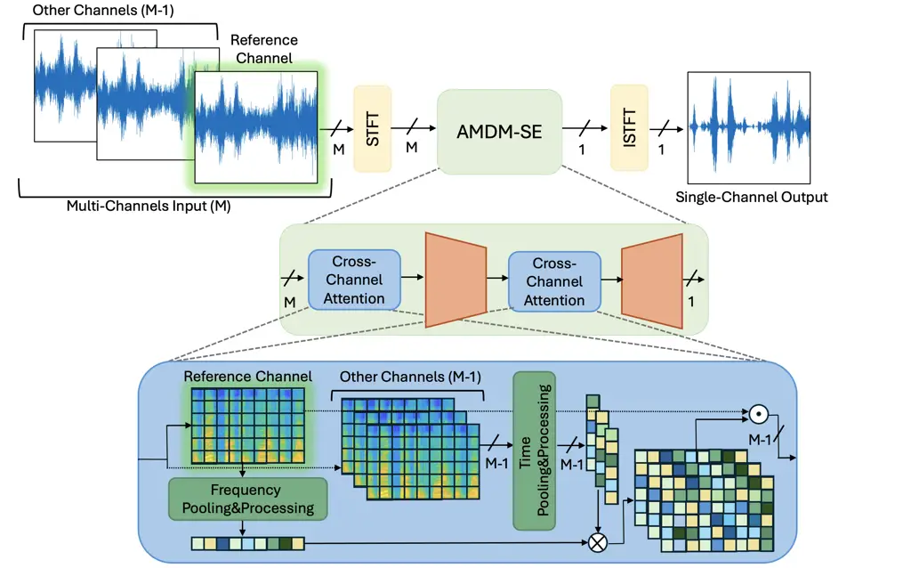
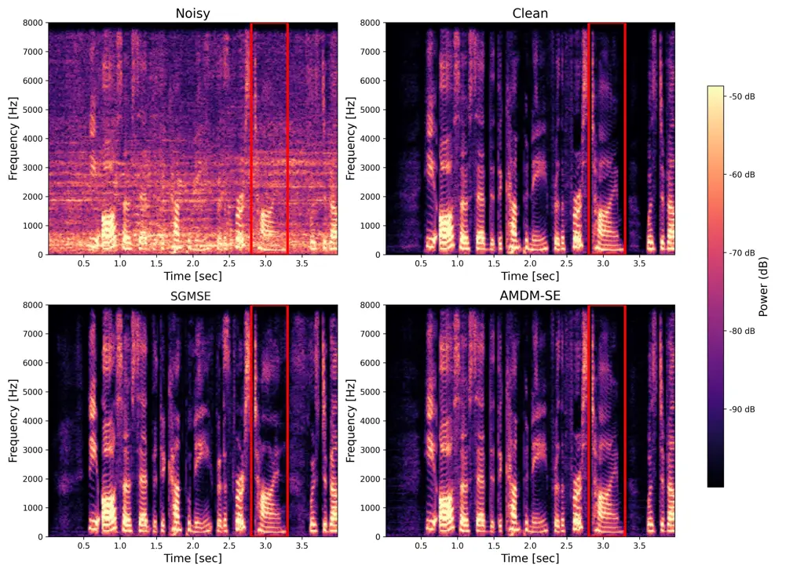

# AMDM-SE: Attention-based Multichannel Diffusion Model for Speech Enhancement

Renana Opochinsky    Sharon Gannot

###### Abstract

Diffusion models have recently achieved impressive results in
reconstructing images from noisy inputs, and similar ideas have been
applied to speech enhancement by treating time–frequency representations
as images. With the ubiquity of multi-microphone devices, we extend
state-of-the-art diffusion-based methods to exploit multichannel inputs
for improved performance. Multichannel diffusion-based enhancement
remains in its infancy, with prior work making limited use of advanced
mechanisms such as attention for spatial modeling—a gap addressed in
this paper. We propose AMDM-SE, an Attention-based Multichannel
Diffusion Model for Speech Enhancement, designed specifically for noise
reduction. AMDM-SE leverages spatial inter-channel information through a
novel cross-channel time–frequency attention block, enabling faithful
reconstruction of fine-grained signal details within a generative
diffusion framework. On the CHiME-3 benchmark, AMDM-SE outperforms both
a single-channel diffusion baseline and a multichannel model without
attention, as well as a strong DNN-based predictive method.
Simulated-data experiments further underscore the importance of the
proposed multichannel attention mechanism. Overall, our results show
that incorporating targeted multichannel attention into diffusion models
substantially improves noise reduction. While multichannel
diffusion-based speech enhancement is still an emerging field, our work
contributes a new and complementary approach to the growing body of
research in this direction.

###### Index Terms: 

Diffusion model, multi-microphone, cross-channel attention

^(†)^(†)address: Faculty of Engineering, Bar Ilan University, Ramat-Gan,
5290002, Israel  
{renana.klainman,sharon.gannot}@biu.ac.il

## 1 Introduction

Multichannel speech enhancement has been the subject of rich and
comprehensive research in model-based approaches, as reviewed in \[1\],
where methods such as MVDR and related beamformers explicitly exploit
spatial coherence. Building on these foundations, recent works have
integrated deep neural networks (DNNs) with classical frameworks,
yielding hybrid strategies that combine statistical modeling with
data-driven learning. Representative examples include FaSNet \[2\],
SpatialNet \[3\], McNet \[4\], and explainable multichannel
architectures \[5\], which illustrate how attention and learned
beamforming mechanisms enhance separation, denoising, and
dereverberation.

In parallel, diffusion models, originally developed for image synthesis
\[6\], have shown remarkable success when adapted to speech. In the
single-channel domain, they have been applied to enhancement \[7\],
separation \[8\], and generation \[9\], demonstrating strong potential
thanks to their ability to capture complex data distributions and
generate perceptually natural audio. Unlike predictive models that
directly map noisy inputs to clean targets, diffusion models iteratively
refine estimates through learned denoising steps. Recent advances such
as SGMSE+ \[10\], StoRM \[11\], conditional diffusion \[7\], and
VAE-guided diffusion \[12\] have further improved robustness and quality
in the single-channel setting.

Nevertheless, the application of diffusion-based speech enhancement in
the multichannel domain remains relatively underexplored. Recent studies
have made substantial progress in this direction: the multi-stream
framework \[13\] integrates model-based priors with data-driven
diffusion, mSGMSE \[14\] generalizes score-based enhancement to a MIMO
architecture, and DiffCBF \[15\] combines convolutional beamforming with
diffusion refinement. These works highlight the promise of combining
physical modeling with generative methods and demonstrate the
feasibility of diffusion for preserving spatial cues in multi-microphone
arrays.

Building on these directions, we propose AMDM-SE, an Attention-based
Multichannel Diffusion Model for Speech Enhancement. Unlike prior
multichannel diffusion approaches, AMDM-SE explicitly incorporates
unique cross-channel time–frequency attention, enabling the model to
jointly leverage spectral, temporal, and spatial cues. Extending the
SGMSE backbone \[10\], our method bridges multi-microphone coherence
with generative refinement. Experiments on simulated data and the
CHiME-3 dataset demonstrate that AMDM-SE outperforms both single-channel
SGMSE and a multichannel variant without attention in terms of
perceptual quality and intelligibility. The project page with audio
samples can be found at https://AMDMSE.github.io .



Figure 1: Network architecture, AMDM-SE in the green frame and Cross
Channel TF-Attention in the blue frame.

## 2 Problem Formulation

In this paper, we address the noise reduction problem using an array of
$`M`$ microphones. Let $`x_{m}(n),\,m=1,\ldots,M`$ be a noisy speech
mixture recorded by the m-th microphone:

```math
x_{m}(n)=h_{m}(n)\ast s(n)+v_{m}(n), \tag{1}
```

where $`s(n)`$ is the clean signal, $`h_{m}(n)`$ is the RIR (RIR)
between the speaker and the $`m`$-th microphone, and $`v_{m}(n)`$ is the
additive noise component as recieved by the $`m`$-th microphone. The
received microphone signal in the STFT (STFT) domain is given by
$`x_{m}(\ell,k)`$, with $`\ell=0,1,\dots,L-1`$, $`k=0,1,\ldots,K-1`$,
and $`L,K`$ are the number of time-frames and frequency bins,
respectively. Define $`\mathbf{x}`$ as a tensor comprising all
microphones, time frames, and frequency bins. Define one of the
microphone channels as the reference channel
$`\mathbf{x}_{\text{ref}}`$, and all other $`M-1`$ channels as
$`\mathbf{\bar{x}}`$, such that
$`\mathbf{x}=\{\mathbf{x}_{\text{ref}},\mathbf{\bar{x}}\}`$.

We opt for a complex STFT representation as the input feature, rather
than the more common magnitude-only representation. Adopting the
“engineering trick” in \[10\], we compress the dynamic range of the
amplitudes as follows:
$`x_{m}(\ell,k)\leftarrow\beta|x_{m}(\ell,k)|^{\alpha}e^{i\angle(x_{m}(\ell,k))}`$,
with $`\alpha=0.5`$ and $`\beta=3`$.

The objective of the proposed method is to estimate the clean
non-reverberant speech signal $`s(n)`$.

## 3 Method: Attention-based Multichannel Diffusion Model for Speech Enhancement (AMDM-SE)

The overall architecture of our network is illustrated in Figure 1. The
input to the network is a multichannel speech signal comprising $`M`$
channels. This signal is first transformed into the complex TF (TF)
domain using the STFT. The resulting representation is then processed by
the AMDM-SE module—the diffusion-based core module of our system—which
produces a single-channel enhanced signal in the STFT domain. Finally,
the enhanced signal is transformed back to the time domain using the
inverse STFT (iSTFT).

### 3.1 AMDM-SE

1: Input: Noisy spectrograms
$`\mathbf{x}=\{\mathbf{x}_{\text{ref}},\bar{\mathbf{x}}\}`$, clean
spectrogram $`\mathbf{s}_{0}`$

2: Hyperparameters (Diffusion Process): $`\gamma`$, $`\sigma_{\min}`$,
$`\sigma_{\max}`$, $`T`$, $`t_{\epsilon}`$

3: Output: Enhanced spectrogram $`\hat{\mathbf{s}}`$

4: Forward Diffusion Process (Training)

5: for each training sample $`(\mathbf{s}_{0},\mathbf{x})`$ do

6:   Sample $`t\sim\mathcal{U}(t_{\epsilon},T)`$

7:   Compute
$`\boldsymbol{\mu_{t}}=e^{-\gamma t}\mathbf{s}_{0}+(1-e^{-\gamma t})\mathbf{x}`$

8:   Compute
$`\sigma_{t}^{2}=\frac{\sigma_{\min}^{2}\left(\left(\frac{\sigma_{\max}}{\sigma_{\min}}\right)^{2t}-e^{-2\gamma t}\right)}{2\log\left(\frac{\sigma_{\max}}{\sigma_{\min}}\right)}`$

9:   Sample $`\mathbf{z}\sim\mathcal{N}(0,\mathbf{I})`$

10:   Generate
$`\mathbf{s}_{t}=\boldsymbol{\mu_{t}}+\sigma_{t}\cdot\mathbf{z}`$

11:   Compute target score:
$`\text{score}_{\theta}=\nabla_{\mathbf{s}_{t}}\log p(\mathbf{s}_{t}|\mathbf{s}_{0},\mathbf{x}_{\text{ref}},\bar{\mathbf{x}})`$

12:   Compute loss:
$`\mathcal{L}=\mathbb{E}\left[\lambda(t)\cdot\left\|\text{score}_{\theta}+\frac{\mathbf{s}_{t}-\boldsymbol{\mu_{t}}}{\sigma_{t}^{2}}\right\|^{2}\right]`$

13:   Update parameters $`\theta`$ using gradient descent

14: end for

15: Reverse Sampling (Inference)

16: Initialize
$`\mathbf{s}_{T}\sim\mathcal{N}(\boldsymbol{\mu_{t}},\sigma_{T}^{2}\mathbf{I})`$

17: for $`t=T`$ down to $`t_{\epsilon}`$ with step $`-\Delta t`$ do

18:   Compute drift:
$`f(\mathbf{s}_{t},\mathbf{x}_{\text{ref}})=\gamma(\mathbf{x}_{\text{ref}}-\mathbf{s}_{t})`$

19:   Compute diffusion:
$`g(t)=\sigma_{\min}\left(\frac{\sigma_{\max}}{\sigma_{\min}}\right)^{t}\sqrt{2\log\left(\frac{\sigma_{\max}}{\sigma_{\min}}\right)}`$

20:   Estimate score:
$`\text{score}_{\theta}(\mathbf{s}_{t},t,\mathbf{x}_{\text{ref}},\bar{\mathbf{x}})`$

21:   Sample $`\mathbf{z}\sim\mathcal{N}(0,\mathbf{I})`$

22:   Update:

23:
  $`\mathbf{s}_{t-\Delta t}=\mathbf{s}_{t}+\left(f(\mathbf{s}_{t},\mathbf{x})-g^{2}(t)\text{score}_{\theta}\right)\Delta t+g(t)\sqrt{\Delta t}\cdot\mathbf{z}`$

24: end for

25: return $`\hat{\mathbf{s}}=\mathbf{s}_{0}`$

Algorithm 1 AMDM-SE (following SGMSE \[10\])

AMDM-SE is a score-based diffusion model in the complex STFT domain,
aiming at speech enhancement using multichannel recordings. Building on
SGMSE \[10\], we introduce the main modifications to the original
formulation and provide a concise summary of the diffusion process in
Algorithm 1. Given the noisy and reverberant multichannel speech,
$`\mathbf{x}`$ , AMDM-SE generates enhanced speech,
$`\hat{\mathbf{s}}`$, using a conditional diffusion model. The diffusion
model comprises three main stages:

Forward Process: Gradually adds noise to the clean spectrogram
$`\mathbf{s}_{0}`$, guided by the noisy observation $`\mathbf{x}`$, to
produce a noisy version $`\mathbf{s}_{t}`$ at step $`t`$, as originally
introduced in \[16\] and subsequently applied to speech enhancement in
\[10\].

Score Estimation: Trains a neural network
$`\text{score}_{\theta}(\cdot)`$ to approximate the gradient of the log
probability density of $`\mathbf{s}_{t}`$, given $`\mathbf{x}`$, namely
$`\nabla_{\mathbf{s}_{t}}\log p(\mathbf{s}_{t}\mathbf{s}_{0},\mathbf{x}_{\text{ref}},\bar{\mathbf{x}})`$.
Note that here we extend the SGMSE \[10\] by providing the multichannel
input to the U-net rather than only a single channel in the original
work and by using cross-channel TF-attention. Explicitly, the score
calculation is conditioned on all $`M`$ channels. In our U-Net design,
we extend the NCSN++ architecture \[16\] to process multichannel
real–imaginary STFT representations, rather than being limited to a
single-channel input.

Reverse Process: Starting from a noisy sample $`\mathbf{s}_{T}`$, this
stage iteratively denoises the sample using the estimated score function
to obtain the enhanced spectrogram $`{\mathbf{s}}_{0}`$. We employ the
so-called PC (PC) samplers proposed in \[16\].

### 3.2 Cross-Channel TF-Attention

The Cross-Channel TF-attention module was adopted from \[17\], where it
was proposed in the context of single-channel noise reduction. The
Cross-Channel TF-attention block is depicted in Fig. 1, in the blue
frame. This block is positioned both before the diffusion network and in
the bottleneck layer inside the diffusion network. The block commences
with average pooling layers on the frequency dimension of the reference
channel and average pooling layers on the time dimension of each of
other $`M-1`$ channels, followed by $`1\times 1`$ Conv layers and
activation functions. The Pooling and Processing blocks described in
Fig. 1 consists of the following operations:

```math
\text{Average Pooling}\rightarrow 1\times 1\text{ Conv}\rightarrow\text{ReLU}\rightarrow 1\times 1\text{ Conv}\rightarrow\text{Sigmoid}
```

These layers produce $`M-1`$ attention masks, each of which is applied
element-wise to the modified spectrogram of the reference channel,
yielding $`M-1`$ masked representations of the reference channel—each
conditioned on one of the remaining channels. We concatenate the $`M-1`$
channel output of the block with the original $`M`$ channels, resulting
in $`2M-1`$ output channels.

## 4 Experimental Results

### 4.1 Datasets

We evaluate the proposed method on both a simulated multichannel dataset
and the CHiME-3 corpus, in order to assess its performance across
controlled and real-world noisy acoustic conditions.

#### 4.1.1 Simulated Datasets

To generate our simulated dataset, we selected clean speech utterances
ranging from 4 to 9 seconds in duration from the LibriSpeech corpus
\[18\]. Specifically, the train-clean-360 and train-clean-100 subsets
were used for training, while the test-clean subset was reserved for
evaluation. There is no speaker overlap between the training and test
sets.

The simulated microphone array consists of four microphones arranged in
a linear configuration with inter-microphone distances of 8, 6, and 8
cm. Each utterance was convolved with RIRs generated using the image
method \[19\], as implemented by \[20\]. We selected a fixed and low
reverberation level, setting the reverberation time to $`RT_{60}=0.2`$.

The reverberated signals were further corrupted with babble noise
sampled from the WHAM! dataset \[21\], with the signal-to-noise ratio
(SNR) uniformly drawn from the range \[5, 15\] dB. Speaker positions
were randomly assigned (within physical constraints) inside
shoebox-shaped rooms, whose dimensions were also randomly sampled:
length and width from a uniform distribution in the range \[4.5, 6.5\]
meters, and height from \[2.5, 3\] meters.

In total, the simulated dataset comprises 8000, 2000, and 2000
utterances (each 10 seconds long) for the training, validation, and test
sets, respectively. The ground-truth target for each utterance is the
clean, anechoic version of the signal with an alignment matching that of
the reference channel (channel \#0), enabling the model to learn both
denoising and dereverberation under low-reverberation conditions.

#### 4.1.2 CHiME-3 Dataset

We employed the publicly available CHiME-3 dataset \[22\], which
comprises recordings captured in four real-world noisy environments: a
cafeteria, a bus, a pedestrian area, and next to a busy street. This
dataset is widely used for evaluating multichannel speech enhancement
algorithms. The recordings were made using a 6-channel microphone array
($`C=6`$) mounted on a tablet held by the speaker, with a sampling rate
of 16 kHz.

The dataset includes 7138 training, 1640 development, and 1320 test
utterances, with an average duration of approximately 3 seconds. We
adopt the close-talk microphone (microphone \#0) as the ground-truth
clean signal, unlike many prior works that use the reverberant 5th
channel as the reference for the speech enhancement target, thus
providing a more accurate target for both denoising and dereverberation.
As noted in \[23\], the CHiME-3 dataset includes certain mismatches that
have led many prior studies to create modified versions of the data,
making direct performance comparisons unreliable.

### 4.2 Evaluation Metrics

We assess the signal quality using PESQ \[24\], eSTOI \[25\] for speech
intelligibility, and deep noise suppression mean opinion score (DNSMOS)
\[26\] for overall speech quality. Additionaly, on the simulated data we
also provide SI-SDR (SI-SDR) measure \[27\].

### 4.3 Training Configuration

The AdamW optimizer \[28\] was used with a batch size of 24. The network
was trained using early stopping based on improvements in validation
PESQ. Most of the network’s training parameters follow those of the
SGMSE \[10\].

We chose the following diffusion parameters: $`\gamma=1.5`$,
$`\sigma_{\min}=0.05`$, $`\sigma_{\max}=0.5`$, $`T=30`$,
$`t_{\epsilon}=0.03`$ as in SGMSE.



Figure 2: Example of spectrogram of upper left: noisy, upper right:
clean signal, bottom left: SGMSE output, bottom rigth: AMDM-SE output.

### 4.4 Baseline Methods

Our evaluation compares the proposed AMDM-SE with other algorithms: 1)
SGMSE \[10\], as described in Section 1, a single-channel diffusion
network; 2) MC-SGMSE multichannel variant of SGME (No Attention): Our
multichannel extension of the SGME model, without incorporating
attention mechanisms; and 3) CA Dense U-Net \[29\] extends the
traditional U-Net architecture with dense connections and channel
attention mechanisms, enabling effective multichannel speech
enhancement.

To the best of our knowledge, existing multichannel diffusion methods
\[14, 13\] have not released code or weights, and rely on different
datasets, making direct comparison infeasible. We therefore restrict our
evaluation to the baselines described above while acknowledging prior
contributions in this area.

### 4.5 Simulation Results

|                 | PESQ $`\uparrow`$ | SI-SDR $`\uparrow`$ | eSTOI $`\uparrow`$ |
| --------------- | ----------------- | ------------------- | ------------------ |
| No Processing   | 1.81              | 2.92                | 0.59               |
| SGMSE \[10\]    | 2.63              | 5.37                | 0.70               |
| MC-SGMSE (ours) | 2.93              | 6.99                | 0.73               |
| AMDM-SE (ours)  | 3.11              | 7.06                | 0.75               |

Table 1: Results on Simulated Data.

We first evaluated the performance of the three models trained on the
previously described simulated dataset. When using SGMSE \[10\], we
chose channel \#0. For both AMDM-SE and MC-SGMSE (multichannel SGMSE, No
Attention) we used all four channels.

Table 1 presents the enhancement performance of all models on the
simulated test set, These results highlight the effectiveness of the
proposed AMDM-SE model. Notably, while both multichannel models
significantly outperform the single-channel baseline, AMDM-SE achieves
the highest scores across all three metrics. This demonstrates the
benefit of incorporating both multichannel input and attention-driven
diffusion modeling for speech enhancement in low-reverberation
environments.

### 4.6 CHiME-3 Results

|                       |                   |                    |                  |                 |                 |
| --------------------- | ----------------- | ------------------ | ---------------- | --------------- | --------------- |
|                       | PESQ $`\uparrow`$ | eSTOI $`\uparrow`$ | ovrl$`\uparrow`$ | sig$`\uparrow`$ | bak$`\uparrow`$ |
| No Processing         | $`1.271`$         | $`0.683`$          | $`1.863`$        | $`2.697`$       | $`1.865`$       |
| CA Dense U-Net \[29\] | $`2.436`$         | x                  | x                | x               | x               |
| SGMSE \[10\]          | $`1.96`$          | $`0.84`$           | $`3.128`$        | $`3.429`$       | 4.072           |
| AMDM-SE (ours)        | 2.58              | 0.91               | 3.158            | 3.492           | $`3.964`$       |

Table 2: Experimental results on CHiME3 data.

The results on the CHiME-3 dataset are presented in Table 2. A
substantial improvement is observed when comparing the single-channel
baseline to the proposed AMDM-SE model, highlighting the effectiveness
of our multichannel, attention-based diffusion approach in more
realistic acoustic conditions. SI-SNR results are not reported for the
CHiME-3 dataset, as temporal misalignment between the original noisy
recordings and the selected target signal (close-talk microphone)
renders this metric unreliable in this context. We also report the PESQ
results for the baseline predictive model, CA Dense U-Net \[29\], using
the scores as reported in the original paper.

To facilitate a qualitative comparison, we visualize the speech
enhancement outputs in Fig. 2. While both the single-channel SGMSE and
the proposed AMDM-SE model effectively suppress most of the background
noise, it can be observed that the AMDM-SE exhibits superior
reconstruction of speech harmonics. This is particularly evident within
the highlighted red frame, where the harmonic structure is preserved
with higher fidelity.

## 5 Conclusion

In this work, we introduced AMDM-SE, an attention-based multichannel
diffusion model for speech enhancement. By integrating spatial cues
across channels through a unique cross-channel TF attention mechanism,
our model effectively leverages the rich information available in
multichannel recordings. Experimental results on both simulated data and
the CHiME-3 dataset demonstrate that AMDM-SE consistently performs well
in terms of perceptual quality and intelligibility. These findings
underscore the potential of combining generative diffusion frameworks
with multichannel spatial modeling for robust speech enhancement in
real-world acoustic environments. Incorporating additional multichannel
input features, such as RTF (RTF), offers a promising direction for
further improving model performance.

## References

- \[1\] S. Gannot, E. Vincent, S. Markovich-Golan, and A. Ozerov (2017)
  A consolidated perspective on multimicrophone speech enhancement and
  source separation. IEEE/ACM Transactions on Audio, Speech, and
  Language Processing 25 (4), pp. 692–730. Cited by: §1.
- \[2\] Y. Luo, C. Han, N. Mesgarani, E. Ceolini, and S. Liu (2019)
  FaSNet: Low-latency adaptive beamforming for multi-microphone audio
  processing. In IEEE automatic speech recognition and understanding
  workshop (ASRU), pp. 260–267. Cited by: §1.
- \[3\] C. Quan and X. Li (2024) SpatialNet: Extensively learning
  spatial information for multichannel joint speech separation,
  denoising and dereverberation. IEEE/ACM Transactions on Audio, Speech,
  and Language Processing 32, pp. 1310–1323. Cited by: §1.
- \[4\] Y. Yang, C. Quan, and X. Li (2023) McNet: Fuse multiple cues for
  multichannel speech enhancement. In IEEE International Conference on
  Acoustics, Speech and Signal Processing (ICASSP), Cited by: §1.
- \[5\] A. Cohen, D. Wong, J. Lee, and S. Gannot (2025) Explainable
  dnn-based beamformer with postfilter. IEEE Transactions on Audio,
  Speech and Language Processing. Cited by: §1.
- \[6\] J. Ho, A. Jain, and P. Abbeel (2020) Denoising diffusion
  probabilistic models. Advances in neural information processing
  systems 33, pp. 6840–6851. Cited by: §1.
- \[7\] Y. Lu, Z. Wang, S. Watanabe, A. Richard, C. Yu, and Y.
  Tsao (2022) Conditional diffusion probabilistic model for speech
  enhancement. In IEEE International Conference on Acoustics, Speech and
  Signal Processing (ICASSP), pp. 7402–7406. Cited by: §1.
- \[8\] S. Lutati, E. Nachmani, and L. Wolf (2023) Separate and diffuse:
  using a pretrained diffusion model for improving source separation.
  arXiv preprint arXiv:2301.10752. Cited by: §1.
- \[9\] V. Popov, I. Vovk, V. Gogoryan, T. Sadekova, and M.
  Kudinov (2021) Grad-TTS: A diffusion probabilistic model for
  text-to-speech. In International conference on machine learning,
  pp. 8599–8608. Cited by: §1.
- \[10\] J. Richter, S. Welker, J. Lemercier, B. Lay, and T.
  Gerkmann (2023) Speech enhancement and dereverberation with
  diffusion-based generative models. IEEE/ACM Transactions on Audio,
  Speech, and Language Processing 31, pp. 2351–2364. Cited by: §1, §1,
  §2, §3.1, §3.1, §3.1, §4.3, §4.4, §4.5, Table 1, Table 2, Algorithm 1.
- \[11\] J. Lemercier, J. Richter, S. Welker, and T. Gerkmann (2023)
  StoRM: A diffusion-based stochastic regeneration model for speech
  enhancement and dereverberation. IEEE/ACM Transactions on Audio,
  Speech, and Language Processing 31, pp. 2724–2737. Cited by: §1.
- \[12\] Y. Yang, N. Trigoni, and A. Markham (2024) Pre-training feature
  guided diffusion model for speech enhancement. arXiv preprint
  arXiv:2406.07646. Cited by: §1.
- \[13\] T. Nakatani, N. Kamo, M. Delcroix, and S. Araki (2024)
  Multi-stream diffusion model for probabilistic integration of
  model-based and data-driven speech enhancement. In International
  Workshop on Acoustic Signal Enhancement (IWAENC), pp. 65–69. Cited by:
  §1, §4.4.
- \[14\] R. Kimura, T. Nakatani, N. Kamo, D. Marc, S. Araki, T. Ueda,
  and S. Makino (2024) Diffusion model-based mimo speech denoising and
  dereverberation. In IEEE International Conference on Acoustics,
  Speech, and Signal Processing Workshops (ICASSPW), pp. 455–459. Cited
  by: §1, §4.4.
- \[15\] R. Kimura, T. Ueda, T. Nakatani, N. Kamo, M. Delcroix, S.
  Araki, and S. Makino (2025) DiffCBF: A diffusion model with
  convolutional beamformer for joint speech separation, denoising, and
  dereverberation. In European Signal Processing Conference (EUSIPCO),
  pp. 945–949. Cited by: §1.
- \[16\] Y. Song, J. Sohl-Dickstein, D. P. Kingma, A. Kumar, S. Ermon,
  and B. Poole (2020) Score-based generative modeling through stochastic
  differential equations. arXiv preprint arXiv:2011.13456. Cited by:
  §3.1, §3.1, §3.1.
- \[17\] Q. Zhang, X. Qian, Z. Ni, A. Nicolson, E. Ambikairajah, and H.
  Li (2023) A time-frequency attention module for neural speech
  enhancement. IEEE/ACM Transactions on Audio, Speech, and Language
  Processing 31 (), pp. 462–475. External Links:
  [Document](https://dx.doi.org/10.1109/TASLP.2022.3225649) Cited by:
  §3.2.
- \[18\] V. Panayotov, G. Chen, D. Povey, and S. Khudanpur (2015)
  Librispeech: an ASR corpus based on public domain audio books. In IEEE
  International Conference on Acoustics, Speech and Signal Processing
  (ICASSP), pp. 5206–5210. Cited by: §4.1.1.
- \[19\] J. B. Allen and D. A. Berkley (1979) Image method for
  efficiently simulating small-room acoustics. The Journal of the
  Acoustical Society of America 65 (4), pp. 943–950. Cited by: §4.1.1.
- \[20\] E. A. Habets (2014) Room impulse response generator. Technical
  report Friedrich-Alexander-Universität Erlangen-Nürnberg. External
  Links: [Link](https://github.com/ehabets/RIR-Generator) Cited by:
  §4.1.1.
- \[21\] G. Wichern, J. Antognini, M. Flynn, L. R. Zhu, E. McQuinn, D.
  Crow, E. Manilow, and J. L. Roux (2019) WHAM!: Extending Speech
  Separation to Noisy Environments. In Interspeech, pp. 1368–1372. Cited
  by: §4.1.1.
- \[22\] J. Barker, R. Marxer, E. Vincent, and S. Watanabe (2015) The
  third ‘CHiME’ speech separation and recognition challenge: dataset,
  task and baselines. In IEEE Workshop on Automatic Speech Recognition
  and Understanding (ASRU), pp. 504–511. Cited by: §4.1.2.
- \[23\] E. Vincent, S. Watanabe, A. A. Nugraha, J. Barker, and R.
  Marxer (2017) An analysis of environment, microphone and data
  simulation mismatches in robust speech recognition. Computer Speech &
  Language 46, pp. 535–557. Cited by: §4.1.2.
- \[24\] A. W. Rix, J. G. Beerends, M. P. Hollier, and A. P.
  Hekstra (2001) Perceptual evaluation of speech quality (PESQ)-a new
  method for speech quality assessment of telephone networks and codecs.
  In IEEE International Conference on Acoustics, Speech, and Signal
  Processing (ICASSP), Vol. 2, pp. 749–752. Cited by: §4.2.
- \[25\] J. Jensen and C. H. Taal (2016) An algorithm for predicting the
  intelligibility of speech masked by modulated noise maskers. IEEE/ACM
  Transactions on Audio, Speech, and Language Processing 24 (11),
  pp. 2009–2022. Cited by: §4.2.
- \[26\] C. K. Reddy, V. Gopal, and R. Cutler (2022) DNSMOS P. 835: A
  non-intrusive perceptual objective speech quality metric to evaluate
  noise suppressors. In IEEE International Conference on Acoustics,
  Speech, and Signal Processing (ICASSP), pp. 886–890. Cited by: §4.2.
- \[27\] S. Li, H. Liu, Y. Zhou, and Z. Luo (2020) A si-sdr loss
  function based monaural source separation. In IEEE International
  Conference on Signal Processing (ICSP), Vol. 1, pp. 356–360. Cited by:
  §4.2.
- \[28\] I. Loshchilov and F. Hutter (2017) Decoupled weight decay
  regularization. arXiv preprint arXiv:1711.05101. Cited by: §4.3.
- \[29\] B. Tolooshams, R. Giri, A. H. Song, U. Isik, and A.
  Krishnaswamy (2020) Channel-attention dense u-net for multichannel
  speech enhancement. In IEEE International Conference on Acoustics,
  Speech and Signal Processing (ICASSP), pp. 836–840. Cited by: §4.4,
  §4.6, Table 2.
