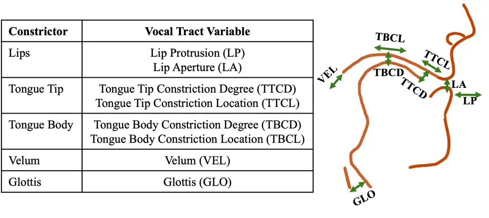
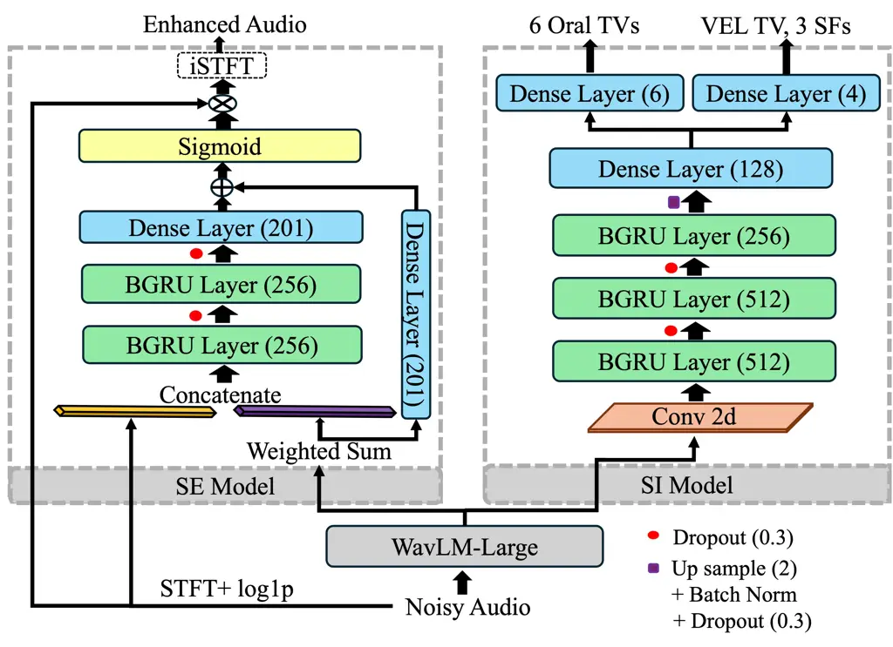
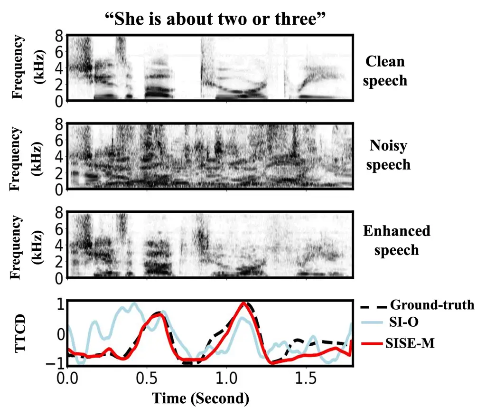

© 20XX IEEE. Personal use of this material is permitted. Permission from
IEEE must be obtained for all other uses, in any current or future
media, including reprinting/republishing this material for advertising
or promotional purposes, creating new collective works, for resale or
redistribution to servers or lists, or reuse of any copyrighted
component of this work in other works.

# Towards Noise-Robust Speech Inversion through Multi-Task Learning with Speech Enhancement

Saba Tabatabaee ^(†)^(†)thanks: This work was supported by NSF Grant No.
BCS2141413.    Carol Espy-Wilson

###### Abstract

Recent studies demonstrate the effectiveness of Self Supervised Learning
(SSL) speech representations for Speech Inversion (SI). However,
applying SI in real-world scenarios remains challenging due to the
pervasive presence of background noise. We propose a unified framework
that integrates Speech Enhancement (SE) and SI models through shared
SSL-based speech representations. In this framework, the SSL model is
trained not only to support the SE module in suppressing noise but also
to produce representations that are more informative for the SI task,
allowing both modules to benefit from joint training. At a
Signal-to-Noise Ratio of $`–`$5 dB, our method for the SI task achieves
relative improvements over the baseline of 80.95% under babble noise and
38.98% under non-babble noise, as measured by the average Pearson
product–moment correlation across all estimated parameters.

###### Index Terms: 

Speech inversion, speech enhancement, multi-task learning, noisy speech.

^(†)^(†)address: ¹Department of Electrical and Computer Engineering,
University of Maryland, College Park, USA

## 1 Introduction

Speech production involves precise coordination of the lips, tongue,
jaw, velum, and glottis to shape the acoustic signal \[1\]. Speech
Inversion (SI) aims to recover this hidden articulatory activity by
mapping speech onto vocal Tract Variables (TVs), which represent
functional synergies among articulators rather than discrete positions
\[2\]. The oral TVs are characterized by the degree and location of
constrictions formed by the lips, tongue body, and tongue tip (see
Figure 1).



Figure 1: A visual illustration of the vocal tract variables.

In addition to oral sounds, speech also includes nasal sounds, which are
produced by partial or complete opening of the Velopharyngeal Port (VP).
The degree of VP constriction regulates nasality by controlling airflow
and acoustic coupling between the nasal and oral cavities through
coordinated movements of the velum and pharyngeal walls. Direct
measurement of VP activity is invasive, costly, and requires trained
specialists. As a non-invasive alternative, nasalance, defined as the
ratio of acoustic energy emitted through the nasal and oral cavities,
serves as an indirect measure of VP constriction and has been validated
through high-speed nasopharyngoscopy imaging \[3\]. In this study,
nasalance is referred to as the VEL TV, as it serves as an acoustic
proxy for velum movement patterns.

Our investigation, supported by ablation studies \[4, 5\], shows that
jointly estimating oral TVs, the VEL TV together with source features
(SFs), including fundamental frequency (F0), periodicity (periodic
energy), and aperiodicity (aperiodic energy) leads to improvements in
their estimation. This is because these variables are inherently related
and provide complementary information. Therefore, in this study, we
adopt the recently developed SI system from \[4\], which simultaneously
estimates oral TVs, VEL TV, and three SFs.

SI systems have a wide range of applications, including assessment for
children with speech disorders \[6, 7, 5\]. However, deploying SI
systems in real-world environments is challenging, as background noise
can degrade performance if the system has not been adapted to such
conditions. A previous study \[8\] demonstrated that adapting a SI
system to noisy conditions can be achieved by fine-tuning with
noise-contaminated speech signals. However, employing a Speech
Enhancement (SE) model as a pre-processing step has been shown to
improve robustness across various speech processing tasks \[9, 10, 11\]
and to outperform approaches that rely solely on fine-tuning the target
system with contaminated speech \[10, 11\]. Therefore, in this study, we
leverage a SE model to improve the adaptation of an SI system to noisy
conditions under two different scenarios: (1) fine-tuning the SI system
on audio pre-processed by the SE model, and (2) jointly training the SI
and SE models within a multi-task learning framework. To the best of our
knowledge, this study is the first to investigate multi-task learning of
SI and SE models to improve SI robustness under noisy conditions.

Recent advances in Self Supervised Learning (SSL) speech models have
significantly improved feature extraction for SI systems, surpassing
traditional acoustic representations such as MFCCs \[12\]. Among these
models, WavLM-Large has been found to outperform other SSL models,
including HuBERT-Large, on SI tasks \[12, 4\]. Furthermore, several
studies have explored the application of SSL models to SE tasks,
reporting promising results \[13, 14\]. Motivated by these findings, we
employ the WavLM-Large pretrained SSL model \[15\] for the SI and SE
systems to extract richer, more informative representations from the
speech signal.

Our key contributions in the current work are as follows:

- •
  Introduction of a novel multi-task learning framework jointly modeling
  SE and SI to estimate enhanced audio along with oral TVs, VEL TV, and
  three SFs.
- •
  Comparative analysis of employing a SE model as a pre-processing step
  for a SI model versus jointly integrating SE and SI models within a
  multi-task learning framework.
- •
  Evaluation of SI system robustness under babble and non-babble
  background noise across varying Signal-to-Noise Ratio (SNR) levels.

## 2 Data prepration

### 2.1 XRMB dataset

The University of Wisconsin XRMB dataset \[16\] comprises speech
recordings accompanied by point-source trajectories of the lips, tongue
tip, and tongue body, captured using a rasterized X-ray microbeam
tracking system. The dataset includes recordings from 46 native English
speakers (21 males and 25 females), totaling approximately 5.74 hours of
speech. The dataset is partitioned into training, development, and test
sets in a speaker-independent manner, as detailed in Table 1. The
original X–Y coordinates of the pellets were mapped to the TVs using a
geometric transformation, as described in \[17\]. Because the TVs are
based on relative measures, this mapping normalizes variability arising
from anatomical differences among speakers. The processed XRMB dataset,
following geometric transformation, comprises six oral TVs: LA, LP,
TBCL, TBCD, TTCL, and TTCD (details are provided in Figure 1). The VEL
TV was extracted from the XRMB speech signals using the method proposed
in \[4\], while ground-truth values for the three SFs were obtained from
speech signals using the APP detector \[18\].

|             |                    |                     |              |
| ----------- | ------------------ | ------------------- | ------------ |
| Split       | Number of subjects | Number of Utterance | Time (hours) |
| Train       | 36                 | 5801                | 4.47         |
| Development | 5                  | 730                 | 0.63         |
| Test        | 5                  | 754                 | 0.64         |

Table 1: Description of the XRMB dataset using speaker-independent
splits.

### 2.2 Data augmentation for XRMB dataset

For data augmentation, two categories of environmental noise were
employed: (1) babble noise and (2) non-babble background noise. The
training and development sets were augmented using the same noise data,
whereas the test set was augmented with a separate set of noise data to
assess SI and SE models performance under unseen noise conditions.  
Noise augmentation of train and development sets: For non-babble
background noise, we used the MUSAN dataset \[19\], and babble noise was
generated from the VoxCeleb1 test set (Vox1-test) \[20\] by overlapping
speech segments from 5–20 speakers. The XRMB training and development
sets were augmented with three noise conditions: babble, non-babble
background noise, and a combination of both, then merged into a single
dataset. For each condition, clean XRMB audio was contaminated with
noise at randomly selected SNRs between 0 and 10 dB.  
Noise augmentation of test set: To evaluate the effect of background
noise on SI and SE performance, the XRMB test set was contaminated with
two noise types: (1) babble noise, simulated by overlapping speech from
5–20 speakers in the Librispeech test-clean dataset \[21\], and (2)
non-babble background noise from the DNS-Challenge dataset \[22\]. Each
noise type was added at four SNR levels: $`-`$5 dB, 0 dB, 5 dB, and 10
dB.

## 3 Methodology

In this study, both the SI and SE systems use WavLM-Large, a SSL model
pre-trained on noisy speech, which provides more robust representations
than other SSL models. Models are optimized with AdamW and early
stopping (patience of five epochs) to prevent overfitting. To stabilize
training and protect SSL representations from randomly initialized task
heads, a Two-Stage Training (TST) strategy is employed. In the first
stage, the task-specific models (SE, SI, or both, depending on the
setup) are trained with WavLM-Large frozen at a learning rate of
$`5\times 10^{-4}`$. After convergence, all components, including
WavLM-Large, are fine-tuned jointly with a reduced learning rate of
$`5\times 10^{-5}`$. All models (SE-Base, SISE-P, and the proposed
SISE-M) are trained using this TST strategy.



Figure 2: Architecture of the proposed SISE-M model.

### 3.1 SE model

As shown in Figure 2, a weighted sum of features from all 25 WavLM-Large
layers is computed to capture contextual information from noisy audio.
This sum is concatenated with the spectral representation
(log1p-compressed STFT magnitude) and fed through two 256-unit
bidirectional GRU layers, followed by a 201-unit dense layer. The output
of the dense layer is added to that of a 201-unit dense layer applied to
the weighted WavLM-Large features. A sigmoid activation is applied to
generate a mask, which is then multiplied with the spectral
representation to suppress noise. The masked magnitude is decompressed
and converted back to the time domain using the inverse STFT to produce
the enhanced audio.

The SE model is trained with the combined losses of Weighted
Signal-to-Distortion Ratio (WSDR), Compressed Magnitude Spectrum (CMS),
and Multi-Resolution STFT (MRS), as shown in equation 1.

```math
\text{Loss}_{\text{SE}}=\text{WSDR}+\text{CMS}+\text{MRS}\vskip-5.69054pt \tag{1}
```

The WSDR loss measures the time-domain difference between the enhanced
and clean waveforms \[23\]. The CMS loss measures the L1 distance
between the log1p-compressed STFT magnitudes of the clean and enhanced
signals, promoting accurate spectral reconstruction. The MRS loss
computes STFTs of the clean and enhanced waveforms using FFT sizes of
256, 512, and 1024, and averages the L1 distance of the complex spectra
across sizes to align both amplitude and phase. The SE model is
evaluated under three settings: (1) Noisy: XRMB data with babble and
non-babble noise, (2) SE-Base: SE model trained on noisy XRMB data using
the TST method, and (3) SISE-M: the proposed multi-task framework
jointly training SE and SI models using the TST method with the total
loss defined as the sum of SE and SI losses. The SE model is evaluated
using standard objective metrics, including PESQ, CSIG, CBAK, COVL, and
STOI.

### 3.2 SI model

For the SI system, we adopt the SI architecture proposed in \[4\]. As
shown in Figure 2, the SI model estimates oral TVs in one task and the
VEL TV along with three SFs in the other task. In the SI framework, each
task loss is defined as a weighted combination of Pearson Correlation
(PC) and Root Mean Square Error (RMSE), as shown in equation  2. The SI
model’s total loss is computed as the sum of the two task losses.

```math
\text{Loss}_{\text{SI}}=(1-\text{PC})+(\alpha)\cdot\text{RMSE}\vskip-5.69054pt \tag{2}
```

In equation  2, $`\alpha`$ is set to 0.2. This value is determined
empirically by evaluating multiple candidates and selecting the one that
achieved the best performance. We evaluate the performance of the SI
model under noisy conditions across three scenarios: SI-O, SISE-P, and
SISE-M. The SISE-M setting was described previously in Section 3.1. The
remaining scenarios are defined as follows: (1) SI-O: The SI model from
\[4\], trained on clean data without adaptation to noisy conditions, is
used as the baseline. (2) SISE-P: The SE-Base model is used as a
pre-processing step for the SI model, performing speech enhancement on
input audio. Subsequently, the SI model is trained using the TST
strategy. For SI model evaluation, the Pearson Product-Moment
Correlation (PPMC) is computed between the SI estimates and the
ground-truth.

## 4 Results and Discussion

### 4.1 Speech inversion

Table 2 shows the performance of SI-O, SISE-P, and SISE-M models on
clean and noisy speech across four SNR levels with babble and non-babble
noise. On the clean XRMB test set, SI-O outperforms SISE-P and SISE-M in
average of PPMC scores. SI-O performance drops at low SNRs ($`-`$5 dB
and 0 dB) since it was trained only on clean speech. Using SE
pre-processing (SISE-P) or a multi-task framework (SISE-M) with
noise-augmented XRMB data significantly improves performance across all
SNRs and noise types compared to SI-O. Specifically, at $`-`$5 dB, the
SISE-M model achieves relative improvements in average PPMC scores
across all 10 parameters of 80.95% for babble noise and 38.98% for
non-babble background noise, compared to the SI-O model.

According to the results in Table 2, SISE-M achieves the highest average
PPMC across all 10 parameters, except at 10 dB (both noise types) and 5
dB and 0 dB for babble noise, where it matches SISE-P. SISE-M achieves
the highest PPMC scores in noisy conditions while maintaining strong
performance on clean speech, showing that multi-task learning with SE
and a shared SSL backbone yields robust results in both scenarios.

### 4.2 Speech enhancement

As shown in Table 3, incorporating the SI task within a multi-task
framework improves SE performance across all SNRs and noise types,
compared to fine-tuning the SE model on noisy data without leveraging SI
(SE-Base). Although our primary aim is to enhance SI performance, it is
encouraging that SISE-M outperforms SE-Base, demonstrating that
multi-task learning improves the performance of both SI and SE systems.



Figure 3: Spectrograms of clean, noisy, and enhanced speech obtained
from SISE-M model. The noisy speech corresponds to an XRMB test sample
corrupted by babble noise at -5 dB SNR. TTCD estimates from the SI-O and
SISE-M models for the noisy speech are shown alongside the ground-truth.

Figure 3 presents spectrograms of clean, noisy, and enhanced speech
processed by the SISE-M model. The noisy speech is taken from a randomly
selected XRMB test sample corrupted with babble noise at $`-`$5 dB SNR.
In addition to the spectrograms, the figure compares TTCD estimates from
the SI-O baseline and the proposed SISE-M model with the ground-truth
measurements. Tongue raising is observed during the “she is”, the /t/ at
the end of “about” and beginning of “two”, and /r/ in “or” and during
“three”. These results demonstrate that the SISE-M model accurately
captures the articulatory constriction patterns, closely matching the
ground-truth under challenging noisy conditions.

|                                              |        |      |      |      |      |      |      |      |      |      |      |         |
| -------------------------------------------- | ------ | ---- | ---- | ---- | ---- | ---- | ---- | ---- | ---- | ---- | ---- | ------- |
| SNR (dB)                                     | Model  | LA   | LP   | TBCL | TBCD | TTCL | TTCD | VEL  | Per  | Aper | F0   | Avg all |
|          clean XRMB test set                 |        |      |      |      |      |      |      |      |      |      |      |         |
| -                                            | SI-O   | 0.91 | 0.76 | 0.80 | 0.86 | 0.84 | 0.95 | 0.96 | 0.94 | 0.88 | 0.75 | 0.87    |
|                                              | SISE-P | 0.91 | 0.76 | 0.71 | 0.84 | 0.79 | 0.94 | 0.97 | 0.95 | 0.89 | 0.76 | 0.85    |
|                                              | SISE-M | 0.91 | 0.74 | 0.76 | 0.85 | 0.79 | 0.94 | 0.97 | 0.95 | 0.89 | 0.77 | 0.86    |
|          XRMB with non-babble noise test set |        |      |      |      |      |      |      |      |      |      |      |         |
| -5                                           | SI-O   | 0.65 | 0.50 | 0.55 | 0.59 | 0.59 | 0.71 | 0.57 | 0.66 | 0.57 | 0.52 | 0.59    |
|                                              | SISE-P | 0.89 | 0.72 | 0.67 | 0.80 | 0.75 | 0.91 | 0.92 | 0.91 | 0.83 | 0.71 | 0.81    |
|                                              | SISE-M | 0.89 | 0.71 | 0.72 | 0.81 | 0.77 | 0.91 | 0.92 | 0.90 | 0.83 | 0.73 | 0.82    |
| 0                                            | SI-O   | 0.81 | 0.64 | 0.69 | 0.73 | 0.74 | 0.86 | 0.76 | 0.82 | 0.74 | 0.63 | 0.74    |
|                                              | SISE-P | 0.90 | 0.74 | 0.69 | 0.82 | 0.77 | 0.93 | 0.95 | 0.94 | 0.86 | 0.73 | 0.83    |
|                                              | SISE-M | 0.90 | 0.73 | 0.74 | 0.83 | 0.78 | 0.93 | 0.95 | 0.93 | 0.86 | 0.75 | 0.84    |
| 5                                            | SI-O   | 0.87 | 0.70 | 0.74 | 0.80 | 0.80 | 0.91 | 0.85 | 0.89 | 0.81 | 0.68 | 0.81    |
|                                              | SISE-P | 0.91 | 0.75 | 0.70 | 0.83 | 0.78 | 0.93 | 0.96 | 0.95 | 0.87 | 0.74 | 0.84    |
|                                              | SISE-M | 0.90 | 0.73 | 0.74 | 0.84 | 0.78 | 0.93 | 0.96 | 0.94 | 0.87 | 0.76 | 0.85    |
| 10                                           | SI-O   | 0.90 | 0.73 | 0.76 | 0.83 | 0.83 | 0.93 | 0.88 | 0.92 | 0.83 | 0.71 | 0.83    |
|                                              | SISE-P | 0.91 | 0.75 | 0.71 | 0.83 | 0.78 | 0.93 | 0.97 | 0.95 | 0.88 | 0.75 | 0.85    |
|                                              | SISE-M | 0.91 | 0.74 | 0.75 | 0.84 | 0.78 | 0.94 | 0.96 | 0.94 | 0.88 | 0.76 | 0.85    |
|          XRMB with babble noise test set     |        |      |      |      |      |      |      |      |      |      |      |         |
| -5                                           | SI-O   | 0.48 | 0.36 | 0.40 | 0.45 | 0.41 | 0.52 | 0.39 | 0.42 | 0.34 | 0.39 | 0.42    |
|                                              | SISE-P | 0.81 | 0.66 | 0.62 | 0.73 | 0.69 | 0.84 | 0.80 | 0.80 | 0.72 | 0.62 | 0.73    |
|                                              | SISE-M | 0.83 | 0.68 | 0.65 | 0.75 | 0.71 | 0.86 | 0.84 | 0.82 | 0.75 | 0.66 | 0.76    |
| 0                                            | SI-O   | 0.72 | 0.55 | 0.59 | 0.64 | 0.62 | 0.75 | 0.61 | 0.68 | 0.60 | 0.53 | 0.63    |
|                                              | SISE-P | 0.90 | 0.74 | 0.70 | 0.82 | 0.77 | 0.92 | 0.94 | 0.92 | 0.85 | 0.72 | 0.83    |
|                                              | SISE-M | 0.90 | 0.74 | 0.72 | 0.82 | 0.76 | 0.93 | 0.94 | 0.92 | 0.85 | 0.74 | 0.83    |
| 5                                            | SI-O   | 0.85 | 0.68 | 0.72 | 0.78 | 0.77 | 0.89 | 0.79 | 0.85 | 0.77 | 0.64 | 0.77    |
|                                              | SISE-P | 0.91 | 0.75 | 0.70 | 0.83 | 0.78 | 0.93 | 0.96 | 0.94 | 0.87 | 0.74 | 0.84    |
|                                              | SISE-M | 0.90 | 0.74 | 0.73 | 0.83 | 0.77 | 0.93 | 0.96 | 0.94 | 0.87 | 0.76 | 0.84    |
| 10                                           | SI-O   | 0.89 | 0.72 | 0.75 | 0.82 | 0.81 | 0.92 | 0.87 | 0.91 | 0.82 | 0.68 | 0.82    |
|                                              | SISE-P | 0.91 | 0.75 | 0.71 | 0.83 | 0.78 | 0.93 | 0.97 | 0.95 | 0.88 | 0.75 | 0.85    |
|                                              | SISE-M | 0.91 | 0.74 | 0.75 | 0.84 | 0.79 | 0.94 | 0.96 | 0.94 | 0.88 | 0.76 | 0.85    |

Table 2: PPMC scores for the estimated parameters of the SI-O, SISE-P,
and SISE-M models. The best results are shown in bold. Per: periodicity;
Aper: aperiodicity; Avg all: average PPMC score computed across all 10
parameters.

### 4.3 Performance under babble versus non-babble noise

Both the SE and SI models showed lower performance for babble background
noise compared to non-babble background noise, indicating that babble
noise poses a more challenging environment for both tasks, as it
interferes more with the target speech signal. Specifically, under noisy
conditions ($`-`$5 dB), the best-performing model, SISE-M, shows a 7.89%
relative improvement in the average PPMC score for the SI task with
non-babble background noise compared to babble noise, and a 16.55%
relative improvement in PESQ for the SE task under the same conditions.

|                                              |         |      |      |      |      |      |
| -------------------------------------------- | ------- | ---- | ---- | ---- | ---- | ---- |
| SNR (dB)                                     | Model   | PESQ | CSIG | CBAK | COVL | STOI |
|          XRMB with non-babble noise test set |         |      |      |      |      |      |
| -5                                           | Noisy   | 1.10 | 1.63 | 1.70 | 1.32 | 0.65 |
|                                              | SE-Base | 1.56 | 3.21 | 2.37 | 2.38 | 0.83 |
|                                              | SISE-M  | 1.62 | 3.29 | 2.41 | 2.46 | 0.84 |
| 0                                            | Noisy   | 1.15 | 2.00 | 1.95 | 1.53 | 0.74 |
|                                              | SE-Base | 1.97 | 3.69 | 2.76 | 2.85 | 0.89 |
|                                              | SISE-M  | 2.05 | 3.77 | 2.81 | 2.94 | 0.90 |
| 5                                            | Noisy   | 1.25 | 2.47 | 2.28 | 1.84 | 0.82 |
|                                              | SE-Base | 2.45 | 4.11 | 3.19 | 3.32 | 0.93 |
|                                              | SISE-M  | 2.55 | 4.20 | 3.24 | 3.42 | 0.93 |
| 10                                           | Noisy   | 1.47 | 2.96 | 2.67 | 2.23 | 0.89 |
|                                              | SE-Base | 2.91 | 4.46 | 3.62 | 3.74 | 0.95 |
|                                              | SISE-M  | 3.03 | 4.56 | 3.68 | 3.86 | 0.96 |
|          XRMB with babble noise test set     |         |      |      |      |      |      |
| -5                                           | Noisy   | 1.09 | 1.63 | 1.65 | 1.30 | 0.54 |
|                                              | SE-Base | 1.34 | 2.88 | 2.14 | 2.07 | 0.72 |
|                                              | SISE-M  | 1.39 | 2.99 | 2.18 | 2.16 | 0.74 |
| 0                                            | Noisy   | 1.13 | 2.02 | 1.91 | 1.51 | 0.66 |
|                                              | SE-Base | 1.81 | 3.58 | 2.65 | 2.70 | 0.86 |
|                                              | SISE-M  | 1.86 | 3.65 | 2.67 | 2.77 | 0.86 |
| 5                                            | Noisy   | 1.24 | 2.54 | 2.25 | 1.86 | 0.77 |
|                                              | SE-Base | 2.33 | 4.04 | 3.11 | 3.22 | 0.91 |
|                                              | SISE-M  | 2.39 | 4.11 | 3.14 | 3.29 | 0.91 |
| 10                                           | Noisy   | 1.51 | 3.11 | 2.69 | 2.31 | 0.86 |
|                                              | SE-Base | 2.78 | 4.39 | 3.54 | 3.63 | 0.94 |
|                                              | SISE-M  | 2.88 | 4.49 | 3.60 | 3.74 | 0.94 |

Table 3: Comparison of SE-Base and SISE-M performance under the noisy
condition at various SNR levels. The best results are shown in bold.

## 5 Conclusions

We proposed a multi-task learning approach that leverages a unified SSL
speech representation framework to jointly optimize SE and SI, with the
primary goal of improving SI robustness in noisy environments.
Experimental results show that this joint training strategy consistently
outperforms separate training, where SE is used solely as a
pre-processing step for SI, across diverse noise types and SNR levels.
Moreover, the multi-task framework not only strengthens SI performance
but also enhances SE, highlighting its effectiveness as a practical
solution for real-world noisy scenarios. Finally, our findings suggest
that SSL speech representations provide a powerful foundation for
simultaneously performing SE and SI tasks.

## References

- \[1\] K. N. Stevens (2000) Acoustic phonetics. Vol. 30, MIT press.
  Cited by: §1.
- \[2\] C. P. Browman and L. M. Goldstein (1986) Towards an articulatory
  phonology. Phonology 3, pp. 219–252. Cited by: §1.
- \[3\] Y. M. Siriwardena, S. E. Boyce, M. K. Tiede, L. Oren, B.
  Fletcher, M. Stern, and C. Y. Espy-Wilson (2024) Speaker-independent
  speech inversion for recovery of velopharyngeal port constriction
  degree. The Journal of the Acoustical Society of America 156 (2),
  pp. 1380–1390. Cited by: §1.
- \[4\] S. Tabatabaee, S. Boyce, L. Oren, M. Tiede, and C.
  Espy-Wilson (2025) Enhancing Acoustic-to-Articulatory Speech Inversion
  by Incorporating Nasality. In Interspeech 2025, pp. 325–329. External
  Links: [Document](https://dx.doi.org/10.21437/Interspeech.2025-2387),
  ISSN 2958-1796 Cited by: §1, §1, §2.1, §3.2, §3.2.
- \[5\] S. Tabatabaee, S. Boyce, L. Oren, M. Tiede, and C.
  Espy-Wilson (2025) Acoustic to articulatory speech inversion for
  children with velopharyngeal insufficiency. arXiv preprint
  arXiv:2509.09489. Cited by: §1, §1.
- \[6\] N. R. Benway, S. Tabatabaee, B. Munson, J. Preston, and C.
  Espy-Wilson (2025) Subtyping Speech Errors in Childhood Speech Sound
  Disorders with Acoustic-to-Articulatory Speech Inversion. In
  Interspeech 2025, pp. 2800–2804. External Links:
  [Document](https://dx.doi.org/10.21437/Interspeech.2025-339), ISSN
  2958-1796 Cited by: §1.
- \[7\] N. R. Benway, S. Tabatabaee, D. Wang, B. Munson, J. L. Preston,
  and C. Espy-Wilson (2025) Perceptual ratings predict speech inversion
  articulatory kinematics in childhood speech sound disorders. arXiv
  preprint arXiv:2507.01888. Cited by: §1.
- \[8\] Y. M. Siriwardena, A. A. Attia, G. Sivaraman, and C.
  Espy-Wilson (2023) Audio data augmentation for
  acoustic-to-articulatory speech inversion. In 2023 31st European
  Signal Processing Conference (EUSIPCO), pp. 301–305. Cited by: §1.
- \[9\] J. Tzeng, S. Leem, A. N. Salman, C. Lee, and C. Busso (2025)
  Noise-robust speech emotion recognition using shared self-supervised
  representations with integrated speech enhancement. In ICASSP
  2025-2025 IEEE International Conference on Acoustics, Speech and
  Signal Processing (ICASSP), pp. 1–5. Cited by: §1.
- \[10\] H. Shi, M. Mimura, and T. Kawahara (2024) Waveform-domain
  speech enhancement using spectrogram encoding for robust speech
  recognition. IEEE/ACM Transactions on Audio, Speech, and Language
  Processing 32, pp. 3049–3060. Cited by: §1.
- \[11\] A. S. Shahrebabaki, G. Salvi, T. Svendsen, and S. M.
  Siniscalchi (2021) Acoustic-to-articulatory mapping with joint
  optimization of deep speech enhancement and articulatory inversion
  models. IEEE/ACM Transactions on Audio, Speech, and Language
  Processing 30, pp. 135–147. Cited by: §1.
- \[12\] C. J. Cho, P. Wu, A. Mohamed, and G. K. Anumanchipalli (2023)
  Evidence of vocal tract articulation in self-supervised learning of
  speech. In ICASSP 2023-2023 IEEE International Conference on
  Acoustics, Speech and Signal Processing (ICASSP), pp. 1–5. Cited by:
  §1.
- \[13\] Z. Huang, S. Watanabe, S. Yang, P. García, and S.
  Khudanpur (2022) Investigating self-supervised learning for speech
  enhancement and separation. In ICASSP 2022-2022 IEEE International
  Conference on Acoustics, Speech and Signal Processing (ICASSP),
  pp. 6837–6841. Cited by: §1.
- \[14\] M. S. Khan, M. La Quatra, K. Hung, S. Fu, S. M. Siniscalchi,
  and Y. Tsao (2024) Exploiting consistency-preserving loss and
  perceptual contrast stretching to boost ssl-based speech enhancement.
  In 2024 IEEE 26th International Workshop on Multimedia Signal
  Processing (MMSP), pp. 1–6. Cited by: §1.
- \[15\] S. Chen, C. Wang, Z. Chen, Y. Wu, S. Liu, Z. Chen, J. Li, N.
  Kanda, T. Yoshioka, X. Xiao, et al. (2022) Wavlm: large-scale
  self-supervised pre-training for full stack speech processing. IEEE
  Journal of Selected Topics in Signal Processing 16 (6), pp. 1505–1518.
  Cited by: §1.
- \[16\] J. R. Westbury (1994) Speech production database user’s
  handbook. IEEE Personal Communications-IEEE Pers. Commun., vol. 0, no.
  Cited by: §2.1.
- \[17\] A. A. Attia, Y. M. Siriwardena, and C. Espy-Wilson (2024)
  Improving speech inversion through self-supervised embeddings and
  enhanced tract variables. In 2024 32nd European Signal Processing
  Conference (EUSIPCO), pp. 306–310. Cited by: §2.1.
- \[18\] O. Deshmukh, C. Y. Espy-Wilson, A. Salomon, and J. Singh (2005)
  Use of temporal information: detection of periodicity, aperiodicity,
  and pitch in speech. IEEE Transactions on Speech and Audio Processing
  13 (5), pp. 776–786. Cited by: §2.1.
- \[19\] D. Snyder, G. Chen, and D. Povey (2015) MUSAN: a music, speech,
  and noise corpus. ArXiv abs/1510.08484. External Links:
  [Link](https://api.semanticscholar.org/CorpusID:15676318) Cited by:
  §2.2.
- \[20\] A. Nagrani, J. S. Chung, W. Xie, and A. Zisserman (2020)
  Voxceleb: large-scale speaker verification in the wild. Computer
  Speech & Language 60, pp. 101027. Cited by: §2.2.
- \[21\] V. Panayotov, G. Chen, D. Povey, and S. Khudanpur (2015)
  Librispeech: an asr corpus based on public domain audio books. In 2015
  IEEE international conference on acoustics, speech and signal
  processing (ICASSP), pp. 5206–5210. Cited by: §2.2.
- \[22\] C. K. Reddy, H. Dubey, K. Koishida, A. Nair, V. Gopal, R.
  Cutler, S. Braun, H. Gamper, R. Aichner, and S. Srinivasan (2021)
  INTERSPEECH 2021 deep noise suppression challenge. In INTERSPEECH,
  Cited by: §2.2.
- \[23\] H. Choi, J. Kim, J. Huh, A. Kim, J. Ha, and K. Lee (2018)
  Phase-aware speech enhancement with deep complex u-net. In
  International Conference on Learning Representations, Cited by: §3.1.
