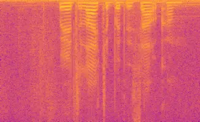
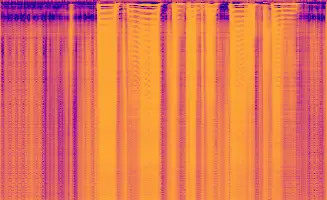
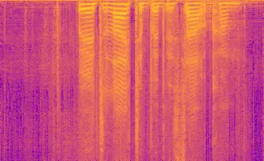
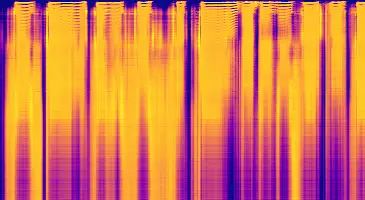
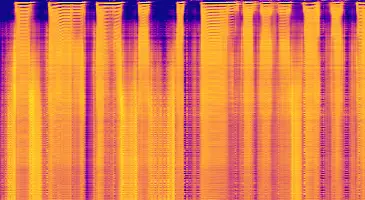
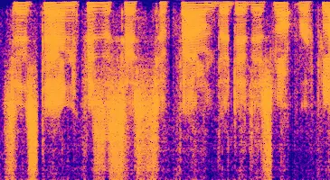
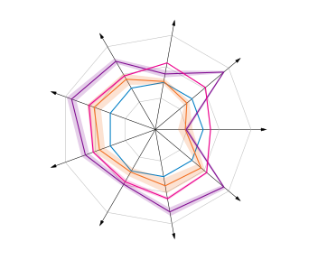
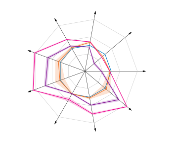

# TEST-TIME ADAPTATION FOR SPEECH ENHANCEMENT VIA MASK POLARIZATION

Tobias Raichle    Erfan Amini    Bin Yang

###### Abstract

Adapting speech enhancement (SE) models to unseen environments is
crucial for practical deployments, yet test-time adaptation (TTA) for SE
remains largely under-explored due to a lack of understanding of how SE
models degrade under domain shifts. We observe that mask-based SE models
lose confidence under domain shifts, with predicted masks becoming
flattened and losing decisive speech preservation and noise suppression.
Based on this insight, we propose mask polarization (MPol), a
lightweight TTA method that restores mask bimodality through
distribution comparison using the Wasserstein distance. MPol requires no
additional parameters beyond the trained model, making it suitable for
resource-constrained edge deployments. Experimental results across
diverse domain shifts and architectures demonstrate that MPol achieves
very consistent gains that are competitive with significantly more
complex approaches.

###### Index Terms: 

Deep Learning, mask polarization, speech enhancement, test-time
adaptation

^(†)^(†)address: University of Stuttgart, Institute of Signal Processing
and System Theory, Stuttgart, Germany^(†)^(†)footnotetext: © 2026 IEEE.
Personal use of this material is permitted. Permission from IEEE must be
obtained for all other uses, in any current or future media, including
reprinting/republishing this material for advertising or promotional
purposes, creating new collective works, for resale or redistribution to
servers or lists, or reuse of any copyrighted component of this work in
other works.

## 1 Introduction

By leveraging large labeled datasets to learn the complex structure of
speech, deep learning based speech enhancement (SE) has revolutionized
the field. However, these methods often suffer from performance
degradation when deployed in environments that differ from their
training conditions \[12\]. As practical SE systems must handle diverse
and time-varying acoustic environments, speaker characteristics and
noise types for which no labeled data is available, robust unsupervised
adaptation methods are essential for reliable deployments. While
unsupervised domain adaptation (UDA) methods exist for SE, they
typically require access to source data, limiting their practical
applicability.

Test-time adaptation (TTA) has emerged as a promising solution to this
challenge. As opposed to UDA, TTA requires only the trained source model
and unlabeled target data, eliminating privacy concerns associated with
sharing source data and reducing storage requirements \[19\]. Crucially,
TTA performs online adaptation, i.e., simultaneous to inference, making
it suitable for real-world and real-time deployments that do not allow
for the latency of a separate adaptation phase. However, existing TTA
methods for SE rely on additional components either via an additional
encoder \[12\] or a teacher-student framework \[16\], limiting the
applicability on resource-constrained deployments. To develop a
parameter-efficient alternative, we investigated how SE models degrade
under domain shifts.

We observe that under domain shifts mask-based SE models exhibit a
phenomenon analogous to confidence loss in classification. In their
source domain, these models predict distinctly bimodal masks that
effectively separate speech from noise. However, under domain shifts,
their predicted masks lose this bimodal distribution and become flatter
(cf. Fig. 1), directly impacting enhancement quality.

Based on this insight, we propose mask polarization (MPol), a
lightweight TTA method that aims at restoring the bimodality under
domain shifts by comparing the predicted mask to a computed reference
via the Wasserstein distance.


Source Domain

SE$`\cdot`$$`\odot`$


Target Domain

$`\mathbf{Y}`$$`\mathbf{M}`$$`\widehat{\mathbf{X}}`$$`\mathbf{Y}`$$`\mathbf{M}`$$`\widehat{\mathbf{X}}`$

Figure 1: Overview of MPol (mask polarization). The mask histogram
flattens under domain shifts.

The main contributions of this work are summarized as follows:

- •
  We empirically demonstrate that SE models suffer from reduced mask
  confidence under domain shifts.
- •
  We propose MPol, a lightweight TTA method for mask-based SE models
  requiring no additional components beyond the trained model.
- •
  We show that MPol achieves competitive performance with significantly
  more complex methods across diverse domain shifts, making it the
  state-of-the-art low complexity TTA method for SE.

### 1.1 Problem Formulation

Given a noisy speech recording

```math
\displaystyle\bm{y}=\bm{x}+\bm{n}, \tag{1}
```

where $`\bm{x}`$ and $`\bm{n}`$ denote the clean speech and noise
signals respectively, the task of SE is to recover an estimate
$`\hat{\bm{x}}`$ of the clean speech signal \[9\]. Generally,
corruptions can include a wide range of effects including reverberation,
limited bandwidth or clipping. However, this work only considers
additive noise and leaves other corruptions for future works. A common
class of SE architectures works by estimating a mask
$`\mathbf{M}\in\mathbb{R}^{T\times F}`$ in the time-frequency (TF)
domain to suppress noise components in the noisy magnitude spectrogram
$`\mathbf{Y}\in\mathbb{R}^{T\times F}`$ (cf. Fig 1). The enhanced
magnitude spectrogram is obtained by

```math
\displaystyle\widehat{\mathbf{X}}=\mathbf{M}\odot\mathbf{Y}=\mathbf{M}\odot(\mathbf{X}+\mathbf{N}), \tag{2}
```

where $`\odot`$ denotes element-wise multiplication.

## 2 Related Work

As SE models frequently encounter unseen target domains where labeled
data is unavailable, several previous works have explored applying UDA
to SE. The most common approach identifies similar source sample to use
as pseudo-labels \[8, 7\], but requires access to source data, defying
the TTA paradigm.

RemixIT \[16\] performs TTA by using a teacher model to generate
pseudo-targets through remixing estimated speech and noise components,
then adapting a student on this weakly-labeled data. Latent denoising
(LaDen) \[12\] computes pseudo-labels by mapping representations of
noisy speech to clean representations in the latent space of a large
pre-trained encoder via a linear approximation. As it requires the CNN
encoder of a WavLM \[2\] model, LaDen introduces 4M additional
parameters, limiting its practical applicability.

Whereas TTA for SE is a relatively new area of research, TTA for
classification has been more thoroughly explored, leading to better
understanding of how classification models degrade under domain shifts.
Based on the observation that classification models lose prediction
confidence under domain shifts, a common TTA approach is to minimize the
prediction entropy \[19\]. However, transferring these insights to SE is
not trivial due to the inherently different regression task.

## 3 Methodology

To address this gap, we investigate whether SE models exhibit analogous
confidence degradation under domain shifts and propose mask polarization
(MPol), a lightweight TTA method that adapts SE models by restoring
ideal TF mask characteristics.

We observe that mask-based SE models exhibit a fundamental change in
their prediction characteristic under domain shifts. In their source
domain, these models predict distinctly bimodal masks $`\mathbf{M}`$
(cf. Fig. 2b) that accurately preserve speech
($`\mathbf{M}_{ij}\approx 1`$) and suppress noise
($`\mathbf{M}_{ij}\approx 0`$). This bimodality is consistent with the
ideal ground truth mask (cf. Fig. 2a). However, under domain shifts,
predicted masks lose this bimodal structure and become flattened, with
values concentrating around an intermediate range (cf. Fig. 2c).

Deviating from the bimodal structure under domain shifts suggests that
models lose confidence in their separation decisions, leading to overly
conservative intermediate mask values. This phenomenon provides a
natural adaptation signal, as restoring the bimodal characteristic
should improve enhancement quality by encouraging more decisive
speech-noise separation.


a) Ground truth


b) Source
domain


c) Target
domain


d)
$`\mathbf{M}_{\mathrm{P}}`$

Figure 2: Comparison of masks and their histograms.

### 3.1 Mask Polarization

Based on this insight, we propose mask polarization (MPol), which
restores mask bimodality by comparing the distribution of predicted
masks with a computed reference that exhibits the desired bimodal
structure.

Similarly to the spectral subtraction principle \[9\], we estimate the
noise spectrum $`\widehat{\mathbf{N}}`$ by averaging time bins of
$`\mathbf{Y}`$ with no voice activity, identified via the $`k=32`$ time
bins with the lowest signal power. We compute a reference mask

```math
\displaystyle\mathbf{M}_{\mathrm{P}}=\frac{\widehat{\mathbf{X}}}{\widehat{\mathbf{X}}+\widehat{\mathbf{N}}}, \tag{3}
```

where $`\widehat{\mathbf{X}}`$ is the enhanced TF magnitude and the
division is computed element-wise. While $`\widehat{\mathbf{X}}`$ comes
from the model’s own prediction, the reference mask
$`\mathbf{M}_{\mathrm{P}}`$ exhibits more reliable bimodality than
$`\mathbf{M}`$. Given Eq. 2, $`\mathbf{M}_{\mathrm{P}}`$ can be phrased
as

```math
\displaystyle\mathbf{M}_{\mathrm{P}}=\frac{\mathbf{M}\odot(\mathbf{X}+\mathbf{N})}{\mathbf{M}\odot(\mathbf{X}+\mathbf{N})+\widehat{\mathbf{N}}}\approx\frac{\mathbf{M}\odot(\mathbf{X}+\mathbf{N})}{\mathbf{M}\odot\mathbf{X}+(\mathbf{M}+\mathbf{1})\odot\mathbf{N}}, \tag{4}
```

assuming $`\widehat{\mathbf{N}}\approx\mathbf{N}`$. If the TF bin $`ij`$
contains speech, we will assume that
$`\mathbf{X}_{ij}\gg\mathbf{N}_{ij}`$ and therefore
$`{\mathbf{M}_{\mathrm{P},ij}\approx\frac{\mathbf{M}_{ij}\mathbf{X}_{ij}}{\mathbf{M}_{ij}\mathbf{X}_{ij}}=1}`$,
i.e., the unwanted attenuation $`\mathbf{M}_{ij}`$ is canceled out. On
the other hand, if the bin does not contain speech,
$`\mathbf{X}_{ij}\ll\mathbf{N}_{ij}`$ means
$`{\mathbf{M}_{\mathrm{P},ij}\approx\frac{\mathbf{M}_{ij}}{1+\mathbf{M}_{ij}}\leq\mathbf{M}_{ij}}`$.
Consequently, $`\mathbf{M}_{\mathrm{P}}`$ is more bimodal than the
predicted mask $`\mathbf{M}`$, maintaining the decisive separation that
the original mask $`\mathbf{M}`$ loses under domain shifts. This
rationale holds even at $`\mathrm{SNR}\approx 0`$, due to the spectral
concentration of speech.

As illustrated in Fig 2, the computed mask $`\mathbf{M}_{\mathrm{P}}`$
(Fig. 2d) approximates the ideal mask’s U-shaped distribution (Fig. 2a),
contrasting sharply with the source model’s flattened distribution
(Fig. 2c). Furthermore, the computed masks adhere to the signal’s
individual speech-to-noise characteristics, instead of enforcing a
single standard with entropy-like losses \[19\].

Due to the simplistic estimation of $`\widehat{\mathbf{N}}`$ that does
not account for non-stationarity, $`\mathbf{M}_{\mathrm{P}}`$ cannot
serve as a direct, point-wise pseudo-label for $`\mathbf{M}`$. Instead,
we compare only the empirical distributions of the predicted mask
$`\mathbf{M}`$ and the reference mask $`\mathbf{M}_{\mathrm{P}}`$ to
leverage $`\mathbf{M}_{\mathrm{P}}`$’s improved bimodality. This is
achieved using the Wasserstein distance between the distributions of the
mask entries, which is defined as the average difference of the sorted
entries of the two masks

```math
\displaystyle\mathcal{L}_{\mathrm{W}}(\mathbf{M},\mathbf{M}_{\mathrm{P}})=\frac{1}{T\cdot F}\sum_{i=1}^{T\cdot F}|\operatorname{vec}(\mathbf{M})_{(i)}-\operatorname{vec}(\mathbf{M}_{\mathrm{P}})_{(i)}|, \tag{5}
```

where $`\operatorname{vec}(\mathbf{M})_{(i)}`$ corresponds to the
$`i`$-th largest entry of $`\mathbf{M}`$. This distribution-based
approach is robust to imperfect references while encouraging the desired
bimodal structure.

To further discourage negative mask values frequently observed under
domain shifts (cf. Fig. 2), we add a penalty term

```math
\displaystyle\mathcal{L}_{\mathrm{S}}(\mathbf{M})=\sum_{i,j}|m_{ij}|\cdot\mathbb{I}_{m_{ij}<0}. \tag{6}
```

The complete MPol loss combines both terms

```math
\displaystyle\mathcal{L}=\mathcal{L}_{\mathrm{W}}+\lambda\mathcal{L}_{\mathrm{S}}, \tag{7}
```

with $`\lambda=0.1`$.

To improve adaptation stability, we employ continual weight ensembling
$`{\theta_{t}\leftarrow\beta\theta_{t}+(1-\beta)\theta_{0}}`$ between
the adapted weights $`\theta_{t}`$ at adaptation step $`t`$ and the
source weights $`\theta_{0}`$ \[11\], where $`\beta=0.8`$ is a smoothing
factor. \[12\]

## 4 Experiments

### 4.1 Datasets

All models were trained on the source dataset EARS-WHAM! (EARS-W) \[13,
20\] and evaluated on the 9 target datasets proposed by \[12\] to cover
a wide range of domain shifts. The EARS-DEMAND (EARS-D) \[13, 15\]
dataset covers domain shifts in only the noisy environment. Analogously,
VoiceBank-WHAM! (VBW) \[18, 20\] represents a shift only in the speech
component. To explore shifts in both components, the VoiceBank-DEMAND
(VBD) \[18, 15, 17\] dataset and the DNS \[4\] dataset in the languages
English, German, Italian, Russian, Spanish, and French are used. In all
domains, the entire testset is used for adaptation.

### 4.2 Models

MPol targets TF-magnitude masking architectures, encompassing a
significant portion of current time-frequency-domain SE models.
Following \[12\], we evaluate MPol on two representative SE
architectures to assess the generality of the mask confidence
observation. The AM model \[12\] is a sequential amplitude masking
(AM)-based architecture that is trained with a MSE error to represent
simple, reconstruction-focused approaches common in resource-constrained
deployments. To represent the current state-of-the-art of SE,
CMGAN \[1\] employs a MetricGAN \[5\] based loss focusing on perceptual
performance and additionally implements a complex additive term to
enable phase correction.

### 4.3 Experimental Details

As is common in SE, we put an emphasis on perceptual performance, i.e.,
how natural the enhanced speech sounds to humans. To objectively
evaluate the performance of our method, we use the PESQ (perceptual
evaluation of speech quality) metric \[14\] and the CSIG, CBAK and COVL
metrics proposed by \[6\]. As these metrics can lead to misleading
results \[3\], we also include the signal-level metrics SSNR (segmental
signal-to-noise ratio) and SI-SDR (scale-invariant signal-to-distortion
ratio) \[9\].

Besides the unadapted source model baseline, RemixIT and LaDen are used
as references to assess MPol’s significance within the field of TTA for
SE.

In all experiments the AdamW optimizer \[10\] was used with a learning
rate of $`\alpha=5\cdot 10^{-4}`$. We adapt only the normalization and
output layers of each model, resulting in 8% and 0.5% of the parameters
of the AM and CMGAN architectures being adapted, respectively. To assess
statistical significance, the key experiments were repeated 10 times.

On a Nvidia A6000 GPU, the unadapted AM model achieves a real-time
factor (RTF) of 0.005 on VBD. Whereas RemixIT and LaDen achieve RTFs of
0.011 and 0.068 respectively, MPol’s reduced overhead allows an RTF of
0.007, representing a roughly tenfold improvement over LaDen.

## 5 Results

### 5.1 Results Analysis

|       |         | $`\overline{\text{PESQ}}`$ $`\uparrow`$ | $`\overline{\text{CSIG}}`$ $`\uparrow`$ | $`\overline{\text{CBAK}}`$ $`\uparrow`$ | $`\overline{\text{COVL}}`$ $`\uparrow`$ | $`\overline{\text{SSNR}}`$ $`\uparrow`$ | $`\overline{\text{SI-SDR}}`$ $`\uparrow`$ |
| ----- | ------- | --------------------------------------- | --------------------------------------- | --------------------------------------- | --------------------------------------- | --------------------------------------- | ----------------------------------------- |
| AM    | Source  | 2.05                                    | 3.07                                    | 2.78                                    | 2.52                                    | 7.42                                    | 12.28                                     |
|       | RemixIT | 2.06$`\pm`$.006                         | 3.10$`\pm`$.007                         | 2.80$`\pm`$.005                         | 2.54$`\pm`$.006                         | 7.48$`\pm`$.03                          | 12.47$`\pm`$.04                           |
|       | LaDen   | 2.13$`\pm`$.005                         | 3.13$`\pm`$.007                         | 2.80$`\pm`$.005                         | 2.59$`\pm`$.006                         | 7.01$`\pm`$.04                          | 12.33$`\pm`$.04                           |
|       | MPol    | 2.10$`\pm`$.001                         | 3.17$`\pm`$.001                         | 2.82$`\pm`$.001                         | 2.60$`\pm`$.001                         | 7.40$`\pm`$.01                          | 12.35$`\pm`$.01                           |
| CMGAN | Source  | 2.60                                    | 3.75                                    | 3.02                                    | 3.15                                    | 6.00                                    | 11.32                                     |
|       | RemixIT | 2.60$`\pm`$.006                         | 3.77$`\pm`$.006                         | 3.03$`\pm`$.007                         | 3.17$`\pm`$.007                         | 5.92$`\pm`$.07                          | 11.52$`\pm`$.07                           |
|       | LaDen   | 2.62$`\pm`$.002                         | 3.81$`\pm`$.002                         | 3.07$`\pm`$.002                         | 3.20$`\pm`$.002                         | 6.31$`\pm`$.03                          | 12.09$`\pm`$.02                           |
|       | MPol    | 2.64$`\pm`$.002                         | 3.78$`\pm`$.002                         | 3.07$`\pm`$.001                         | 3.20$`\pm`$.002                         | 6.27$`\pm`$.01                          | 11.78$`\pm`$.01                           |

Table 1: Results averaged over the datasets ($`\mu\pm 2\sigma`$). SSNR
and SI-SDR in dB.

Table 1 presents the results averaged across all target datasets for the
AM architecture. Despite not introducing any additional parameter
overhead, MPol achieves competitive performance across both perceptual
and signal-level metrics. While MPol is not able to match LaDen’s
exceptional PESQ performance, it approximately matches or exceeds LaDen
and RemixIT in all other metrics. Fig. 3 reveals that MPol yields a very
consistent gain on the PESQ metric across all datasets, despite being on
average smaller than LaDen’s gain. This consistency suggests that the
confidence degradation is universal across domain shifts, constituting
an important benefit over the more variable performance of LaDen. In
combination with the low complexity, this consistency makes MPol
particularly suitable for edge deployments.




Figure 3: $`\Delta`$PESQ results relative to the source performance
using the AM architecture ($`\mu\pm 2\sigma`$).

The CMGAN results demonstrate MPol’s effectiveness across different
architectural paradigms. Despite CMGAN’s complex processing, including
both masking and additive terms, MPol achieves the highest average PESQ
performance among all methods. While MPol’s improvements on other
metrics are more modest compared to LaDen, the method maintains
competitive performance across all measures and outperforms RemixIT in
all metrics. This success on a more sophisticated architecture suggests
that mask confidence degradation represents a fundamental phenomenon in
TF masking-based processing.

These results, combined with the AM findings, confirm that mask
polarization provides a robust adaptation signal across diverse SE
architectures without requiring additional parameters. MPol’s parity
with LaDen is particularly notable, given LaDen’s 4M parameter encoder
overhead.




Figure 4: $`\Delta`$PESQ results relative to the source performance
using the CMGAN architecture ($`\mu\pm 2\sigma`$).

### 5.2 Ablation Study

The ablation study (Table 2) highlights the critical role of the weight
ensembling. While the Wasserstein loss $`\mathcal{L}_{\mathrm{W}}`$
improves the perceptual performance on both datasets, it significantly
degrades the signal-level performance. The penalty term
$`\mathcal{L}_{\mathrm{S}}`$ mitigates the degraded signal-level
performance but has a mixed effect on the perceptual performance. Adding
weight ensembling significantly improves the adaptation stability,
leading to more consistent results across datasets and metrics.

|                                |                   |                     |                            |                     |
| ------------------------------ | ----------------- | ------------------- | -------------------------- | ------------------- |
|                                | VBD               |                     | $`\text{DNS}_{\text{GE}}`$ |                     |
|                                | PESQ $`\uparrow`$ | SI-SDR $`\uparrow`$ | PESQ $`\uparrow`$          | SI-SDR $`\uparrow`$ |
| Source                         | 2.424             | 11.487              | 1.806                      | 11.665              |
| $`\mathcal{L}_{\mathrm{W}}`$   | 2.433             | 10.462              | 1.859                      | 7.462               |
| \+$`\mathcal{L}_{\mathrm{S}}`$ | 2.304             | 10.811              | 1.907                      | 9.367               |
| \+Ensemble                     | 2.489             | 11.741              | 1.881                      | 11.855              |

Table 2: Ablation study using the AM architecture.

## 6 Conclusion

We presented MPol, a lightweight TTA method for speech enhancement that
achieves competitive performance across diverse architectures without
requiring any additional components. Our key observation that mask-based
SE models universally lose bimodal characteristics under domain shifts
provides a natural adaptation signal that can be efficiently exploited
through distribution-based polarization. The method demonstrates that
mask confidence restoration represents a robust approach to TTA for SE,
enabling deployment in resource-constrained scenarios where existing
methods’ parameter overhead would be prohibitive. This work establishes
a foundation for practical TTA in speech enhancement by bridging
insights from classification adaptation to generative audio tasks.

## References

- \[1\] R. Cao, S. Abdulatif, and B. Yang (2022) CMGAN: Conformer-based
  Metric GAN for Speech Enhancement. In Proc. Interspeech 2022,
  pp. 936–940. Cited by: §4.2.
- \[2\] S. Chen, C. Wang, Z. Chen, Y. Wu, S. Liu, Z. Chen, J. Li, N.
  Kanda, T. Yoshioka, X. Xiao, et al. (2022) Wavlm: Large-scale
  self-supervised pre-training for full stack speech processing. IEEE
  Journal of Selected Topics in Signal Processing 16 (6), pp. 1505–1518.
  Cited by: §2.
- \[3\] D. de Oliveira, S. Welker, J. Richter, and T. Gerkmann (2024)
  The PESQetarian: on the relevance of goodhart’s law for speech
  enhancement. In Proc. Interspeech 2024, pp. 3854–3858. Cited by: §4.3.
- \[4\] H. Dubey, V. Gopal, R. Cutler, S. Matusevych, S. Braun, E. S.
  Eskimez, M. Thakker, T. Yoshioka, H. Gamper, and R. Aichner (2022)
  ICASSP 2022 Deep Noise Suppression Challenge. In ICASSP, Cited by:
  §4.1.
- \[5\] S. Fu, C. Liao, Y. Tsao, and S. Lin (2019) MetricGAN: Generative
  adversarial networks based black-box metric scores optimization for
  speech enhancement. In International Conference on Machine Learning,
  pp. 2031–2041. Cited by: §4.2.
- \[6\] Y. Hu and P. C. Loizou (2008) Evaluation of objective quality
  measures for speech enhancement. IEEE Transactions on Audio, Speech,
  and Language Processing 16 (1), pp. 229–238. External Links:
  [Document](https://dx.doi.org/10.1109/TASL.2007.911054) Cited by:
  §4.3.
- \[7\] C. H. Lee, C. Yang, R. S. Srinivasa, Y. M. Saidutta, J. Cho, Y.
  Shen, and H. Jin (2024) Leveraging self-supervised speech
  representations for domain adaptation in speech enhancement. In
  ICASSP, pp. 10831–10835. External Links:
  [Link](https://doi.org/10.1109/ICASSP48485.2024.10447573) Cited by:
  §2.
- \[8\] H. Lin, H. Tseng, X. Lu, and Y. Tsao (2021) Unsupervised noise
  adaptive speech enhancement by discriminator-constrained optimal
  transport. Advances in Neural Information Processing Systems 34,
  pp. 19935–19946. Cited by: §2.
- \[9\] P. C. Loizou (2013) Speech enhancement: theory and practice. 2nd
  edition, CRC Press, Inc., USA. External Links: ISBN 1466504218 Cited
  by: §1.1, §3.1, §4.3.
- \[10\] I. Loshchilov and F. Hutter (2019) Decoupled weight decay
  regularization. In International Conference on Learning
  Representations, Cited by: §4.3.
- \[11\] R. A. Marsden, M. Döbler, and B. Yang (2024) Universal
  test-time adaptation through weight ensembling, diversity weighting,
  and prior correction. In Proceedings of the IEEE/CVF Winter Conference
  on Applications of Computer Vision, pp. 2555–2565. Cited by: §3.1.
- \[12\] T. Raichle, N. Edinger, and B. Yang (2026) Test-time adaptation
  for speech enhancement via domain invariant embedding transformation.
  IEEE Open Journal of Signal Processing (), pp. 1–10. External Links:
  [Document](https://dx.doi.org/10.1109/OJSP.2026.3656059) Cited by: §1,
  §1, §2, §3.1, §4.1, §4.2.
- \[13\] J. Richter, Y. Wu, S. Krenn, S. Welker, B. Lay, S. Watanabe, A.
  Richard, and T. Gerkmann (2024) EARS: An Anechoic Fullband Speech
  Dataset Benchmarked for Speech Enhancement and Dereverberation. In
  ISCA Interspeech, pp. 4873–4877. Cited by: §4.1.
- \[14\] A. W. Rix, J. G. Beerends, M. Hollier, and A. P. Hekstra (2001)
  Perceptual evaluation of speech quality (PESQ)-a new method for speech
  quality assessment of telephone networks and codecs. 2001 IEEE
  International Conference on Acoustics, Speech, and Signal Processing.
  Proceedings (Cat. No.01CH37221) 2, pp. 749–752 vol.2. External Links:
  [Link](https://api.semanticscholar.org/CorpusID:5325454) Cited by:
  §4.3.
- \[15\] J. Thiemann, N. Ito, and E. Vincent (2013) The Diverse
  Environments Multi-Channel Acoustic Noise Database (DEMAND): A
  database of multichannel environmental noise recordings. The Journal
  of the Acoustical Society of America 133, pp. 3591. External Links:
  [Document](https://dx.doi.org/10.1121/1.4806631) Cited by: §4.1.
- \[16\] E. Tzinis, Y. Adi, V. K. Ithapu, B. Xu, P. Smaragdis, and A.
  Kumar (2022) RemixIT: Continual self-training of speech enhancement
  models via bootstrapped remixing. IEEE Journal of Selected Topics in
  Signal Processing 16 (6), pp. 1329–1341. Cited by: §1, §2.
- \[17\] C. Valentini-Botinhao, X. Wang, S. Takaki, and J.
  Yamagishi (2016) Investigating RNN-based speech enhancement methods
  for noise-robust Text-to-Speech. In 9th ISCA Workshop on Speech
  Synthesis Workshop (SSW 9), pp. 146–152. External Links:
  [Document](https://dx.doi.org/10.21437/SSW.2016-24) Cited by: §4.1.
- \[18\] C. Veaux, J. Yamagishi, and S. King (2013) The voice bank
  corpus: design, collection and data analysis of a large regional
  accent speech database. In 2013 International Conference Oriental
  COCOSDA held jointly with 2013 Conference on Asian Spoken Language
  Research and Evaluation (O-COCOSDA/CASLRE), Vol. , pp. 1–4. External
  Links: [Document](https://dx.doi.org/10.1109/ICSDA.2013.6709856) Cited
  by: §4.1.
- \[19\] D. Wang, E. Shelhamer, S. Liu, B. Olshausen, and T.
  Darrell (2020) Tent: Fully Test-Time Adaptation by Entropy
  Minimization. In International Conference on Learning Representations,
  Cited by: §1, §2, §3.1.
- \[20\] G. Wichern, J. Antognini, M. Flynn, L. R. Zhu, E. McQuinn, D.
  Crow, E. Manilow, and J. L. Roux (2019) WHAM!: Extending speech
  separation to noisy environments. arXiv preprint arXiv:1907.01160.
  Cited by: §4.1.
