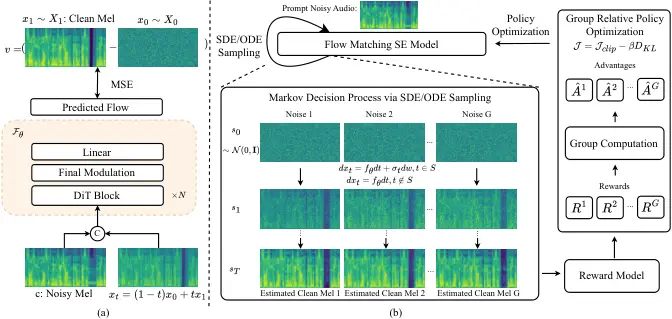

# FLOWSE-GRPO: TRAINING FLOW MATCHING SPEECH ENHANCEMENT VIA ONLINE REINFORCEMENT LEARNING

Haoxu Wang    Biao Tian    Yiheng Jiang    Zexu Pan    Shengkui Zhao   
Bin Ma    Daren Chen    Xiangang Li

###### Abstract

Generative speech enhancement offers a promising alternative to
traditional discriminative methods by modeling the distribution of clean
speech conditioned on noisy inputs. Post‑training alignment via
reinforcement learning (RL) effectively aligns generative models with
human preferences and downstream metrics in domains such as natural
language processing, but its use in speech enhancement remains limited,
especially for online RL. Prior work explores offline methods like
Direct Preference Optimization (DPO); online methods such as Group
Relative Policy Optimization (GRPO) remain largely uninvestigated. In
this paper, we present the first successful integration of online GRPO
into a flow‑matching speech enhancement framework, enabling efficient
post‑training alignment to perceptual and task‑oriented metrics with few
update steps. Unlike prior GRPO work on Large Language Models, we adapt
the algorithm to the continuous, time‑series nature of speech and to the
dynamics of flow‑matching generative models. We show that optimizing a
single reward yields rapid metric gains but often induces reward hacking
that degrades audio fidelity despite higher scores. To mitigate this, we
propose a multi‑metric reward optimization strategy that balances
competing objectives, substantially reducing overfitting and improving
overall performance. Our experiments validate online GRPO for speech
enhancement and provide practical guidance for RL‑based post‑training of
generative audio models.

###### Index Terms: 

Group Relative Policy Optimization, Speech Enhancement, Post Training,
Reinforcement Learning, Generative Models

^(†)^(†)address: Tongyi Lab, Alibaba Group, China

## 1 Introduction

Speech enhancement (SE) aims to estimate the original clean waveform
from noisy audio, improving perceived quality and supporting downstream
speech tasks. Past work mainly uses discriminative methods that predict
the clean spectrum in the magnitude or complex domain to estimate an
enhanced waveform \[15, 28\]. Recently, generative SE has gained
interest: borrowing from speech synthesis, these methods treat noisy
audio as a conditioning input and model the distribution of clean
speech, typically by maximizing the likelihood of the clean waveform
\[30, 37, 29\].

Current generative SE approaches can be grouped roughly into two main
categories: discrete token based and flow-matching based methods.
Discrete token based methods use autoregressive (AR) or
non‑autoregressive (NAR) schemes that predict clean audio discrete
tokens (e.g., SELM\[30\], Genhancer\[34\], GenSE\[35\], LLaSE‑G1\[8\]).
Some masked generative models (MGM) predict masked tokens conditioned on
unmasked ones, such as MaskSR\[12\], AnyEnhance\[37\].
Flow-matching\[14\] methods operate on mel‑spectrograms or latent
representations and use flow-matching to predict the velocity field that
transports a standard Gaussian to the clean audio distribution\[7, 29\].

Meanwhile, post‑training effectively aligns models to human perception
and downstream objectives and is widely applied in generative domains,
including language understanding\[16\], image generation\[32\], and
speech synthesis\[5, 25\]. It finetunes pretrained generative backbones
using reinforcement learning (RL)‑style or preference‑alignment
objectives to improve human‑centric metrics. For example, \[5\] applies
differentiable optimization to CosyVoice2\[3\]’s Large Language Models
(LLM) to improve intelligibility and emotional expressiveness;
F5R‑TTS\[25\] uses Group Relative Policy Optimization (GRPO)\[24\] to
reduce word error rate and improve speaker similarity. \[38\] uses the
offline RL method Direct Preference Optimization (DPO)\[18\] to optimize
the restoration metrics in speech restoration.



Figure 1: (a) The structure of our Flow matching based speech
enhancement model. (b) The pipeline of post-training using GRPO.

However, \[38\] still uses DPO, an off‑policy method. GRPO is an
on‑policy algorithm that more effectively finetunes models and can
optimize diverse metrics without offline generation of large numbers of
win–lose pairs. Flow‑GRPO \[13\] first introduces online RL to
flow‑matching models by converting the original Ordinary Differential
Equation (ODE) trajectory into a Stochastic Differential Equation (SDE)
to provide the stochasticity required by on‑policy RL, and demonstrates
improved human‑perceptual metrics in image generation. In this paper, we
present the first successful integration of online GRPO into a
flow‑matching SE framework, as an on‑policy RL post‑training procedure
without modifying their original architectures (unlike F5R‑TTS\[25\]).
This online RL method can finetune the base model and improve perceptual
quality and objective metrics such as DNSMOS\[20\],
SpeechBERTScore\[22\], and speaker similarity. We systematically study
GRPO training configurations for enhancement metrics and find that
optimizing a single reward rapidly improves that metric but can induce
reward hacking that degrades others; a multi‑metric reward mitigates
this trade‑off. Overall, we validate on‑policy GRPO for speech
enhancement and provide practical guidance for future post‑training of
generative enhancement models.

## 2 Methods

### 2.1 Flow-matching based speech enhancement

We train a flow‑matching SE system with a pretrained vocoder. The
flow‑matching model predicts the velocity field that transports a base
gaussian distribution to the clean mel‑spectrogram, conditioned on the
noisy mel‑spectrogram. The pretrained vocoder then converts the
estimated clean mel‑spectrogram back to the waveform.

Specifically, as shown in Fig. 1(a), the flow‑matching model aims to
predict $`v=x_{1}-x_{0}`$ from the input $`x_{t}=(1-t)x_{0}+tx_{1}`$,
conditioned on the noisy mel $`c`$. Here $`x_{1}\sim X_{1}`$ is sampled
from the clean mel‑spectrogram distribution and
$`x_{0}\sim X_{0}=\mathcal{N}(0,\mathbf{I})`$. The model’s optimization
objective $`\mathcal{L}(\theta)`$ is defined as:

```math
\begin{array}[]{ccc}\mathcal{L}(\theta)=E_{t,x_{0}\sim X_{0},x_{1}\sim X_{1}}[||v-v_{\theta}(x_{t},c,t)||^{2}]\end{array} \tag{1}
```

We concatenate $`x_{t}`$ and noisy mel $`c`$ along the channel dimension
and train $`\theta`$ with loss $`\mathcal{L}(\theta)`$. The
flow‑matching backbone is DiT\[17\] and the vocoder is the pretrained
HiFi‑GAN\[10\] from \[3\].

Note that in the original Flow‑GRPO \[13\], the time of the denoising
steps is $`t:1\to 0`$. In the flow-matching-based SE task, the denoising
time proceeds in the opposite direction: $`t:0\to 1`$. To reconcile
these conventions, we set new $`v=-v_{se}`$, $`t=1-t_{se}`$,
$`x_{0}=x_{se,t=1}\sim X_{1}`$, $`x_{1}=x_{se,t=0}\sim X_{0}`$, and
$`\Delta t=-\Delta t_{se}`$.

### 2.2 Flow-GRPO

#### 2.2.1 Markov Decision Process

Following Flow‑GRPO, the flow-matching decoding process can be
formulated as a Markov decision process $`(S,A,\rho_{0},P,R)`$. Time
runs from $`1\to 0`$ over $`1\to T`$ steps. At step $`t`$ the state is
$`s_{t}\triangleq(c,t,x_{t})`$ and the next state is
$`s_{t+1}\triangleq(c,t,x_{t-1})`$. The action
$`a_{t}\triangleq x_{t-1}`$ is the denoised sample produced from the
model‑predicted velocity, and the policy is
$`\pi(a_{t}\mid s_{t})=p_{\theta}(x_{t-1}\mid x_{t},c)`$. Transitions
are deterministic:
$`P(s_{t+1}\mid s_{t},a_{t})\triangleq(\delta_{c},\delta_{t-1},\delta_{x_{t-1}})`$,
where $`\delta_{y}`$ is a Dirac delta centered at $`y`$. The initial
state distribution is
$`\rho_{0}(s_{0})\triangleq(p_{c},\delta_{T},\mathcal{N}(0,\mathbf{I}))`$.
A reward is given only at $`t=0`$ (after getting the final mel and
decoding it to waveform): $`R(s_{t},a_{t})\triangleq r(x_{0},c)`$ if
$`t=0`$, and $`0`$ otherwise.

#### 2.2.2 ODE to SDE

The standard flow‑matching denoising process is a deterministic ODE
sampler and therefore cannot produce diverse samples by stochastic
sampling, making it unsuitable for on‑policy RL. Flow‑GRPO converts this
deterministic ODE sampler into an equivalent SDE sampler that preserves
the same marginal distributions while introducing the stochasticity
required by GRPO. The standard flow‑matching model is solved using the
deterministic ODE:

```math
\begin{array}[]{ccc}dx_{t}=v_{t}dt\end{array} \tag{2}
```

Flow‑GRPO converts the deterministic ODE into an equivalent SDE that
preserves the model’s marginal probability densities at all time steps.
The resulting reverse‑time SDE is:

```math
\begin{array}[]{ccc}dx_{t}=(v_{t}(x_{t})-\frac{\sigma_{t}^{2}}{2}\nabla logp_{t}(x_{t}))dt+\sigma_{t}dw\end{array} \tag{3}
```

According to \[13\], the above expression can be transformed into:

```math
\begin{array}[]{ccc}dx_{t}=[v_{t}(x_{t})+\frac{\sigma_{t}^{2}}{2(1-t)}(x_{t}+tv_{t}(x_{t}))dt]+\sigma_{t}dw\end{array} \tag{4}
```

The final update rule in \[13\] is:

```math
\begin{array}[]{ccc}x_{t+\Delta t}=x_{t,\mathrm{mean}}+\sigma_{t}\sqrt{\Delta t}\epsilon\\
x_{t,\mathrm{mean}}=x_{t}+[v_{\theta}(x_{t},t)+\frac{\sigma_{t}^{2}}{2t}(x_{t}+(1-t)v_{\theta}(x_{t},t))]\Delta t\end{array} \tag{5}
```

Because our flow‑matching SE uses the opposite time ordering to the
original Flow-GRPO, we substitute symbols accordingly. All $`t`$ in
equation 6 correspond to $`t_{se}\!:\,0\to 1`$. In the following, $`t`$
denotes $`t_{se}`$ and we omit the subscript “se” for brevity.

```math
\begin{array}[]{rcl}x_{t,\mathrm{mean}}&=&x_{t}+\big[-v_{\theta}(x_{t},t)+\frac{\sigma_{t}^{2}}{2(1-t)}(x_{t}-tv_{\theta}(x_{t},t))\big](-\Delta t)\\
&=&x_{t}+\big[v_{\theta}(x_{t},t)+\frac{\sigma_{t}^{2}}{2(1-t)}(-x_{t}+tv_{\theta}(x_{t},t))\big]\Delta t\end{array} \tag{6}
```

where $`\epsilon\sim\mathcal{N}(0,\mathbf{I})`$ and
$`\sigma_{t}=a\sqrt{\frac{1-t}{t}}`$. The noise level $`a`$ is a
hyperparameter that controls stochasticity in the reverse‑time denoising
process.

We also follow MixGRPO\[11\] and Flow‑GRPO‑Fast\[13\] and use window
training: we apply SDE sampling only to a subset of early steps
$`t\in S=[S_{min},S_{min}+ws]`$, where $`S_{min}`$ denotes the SDE
window start and $`ws`$ the window size, while remaining steps use
deterministic ODE updates. Optimization is performed only on these
stochastic steps to reduce training burden and accelerate convergence.

#### 2.2.3 GRPO Loss

RL learns a policy that maximizes the expected cumulative reward. The
policy optimization objective is defined as:

```math
\begin{array}[]{ccc}\mathrm{max}_{\theta}E_{(s_{0},a_{0},...)\sim\pi_{\theta}}\big[\sum_{t\in S}(R(s_{t},a_{t})\\
-\beta D_{KL}(\pi_{\theta}(\cdot|s_{t})||\pi_{ref}(\cdot|s_{t})))\big]\end{array} \tag{7}
```

GRPO estimates the advantage $`A`$ using an intra‑group relative
formulation. As shown in Fig 1(b), given a noisy prompt $`c`$, the
flow‑matching SE model $`p_{\theta}`$ samples a group of $`G`$ candidate
clean outputs $`\{\hat{x}_{T=1}^{i}\}_{i=1}^{G}`$ with the mixed ODE–SDE
sampler, together with their trajectories
$`\{(x_{0}^{i},\ldots,x_{T-1}^{i},x_{T=1}^{i})\}_{i=1}^{G}`$. The
advantage for the $`i`$‑th estimated clean audio is then computed from
the group‑wise policy rewards.

```math
\begin{array}[]{ccc}\hat{A}_{t}^{i}=\frac{R(\hat{x}_{1}^{i},c)-\mathrm{mean}(\{R(\hat{x}_{1}^{i},c)\}_{i=1}^{G})}{\mathrm{std}(\{R(\hat{x}_{1}^{i},c)\}_{i=1}^{G})}\end{array} \tag{8}
```

GRPO updates the policy model by maximizing the following objective:

```math
\begin{array}[]{ccc}\mathcal{J}_{\mathrm{flow\text{-}grpo}}(\theta)=E_{c\sim C,\{x_{i}\}_{i=1}^{G}\sim\pi_{\theta_{\mathrm{old}}(\cdot|c)}}f(r,\hat{A},\theta,\epsilon,\beta),\\
f(r,\hat{A},\theta,\epsilon,\beta)=\frac{1}{G}\sum_{i=1}^{G}\frac{1}{S}\sum_{t\in S}\big(\\
\mathrm{min}(r_{t}^{i}(\theta)\hat{A}_{t}^{i},\mathrm{clip}(r_{t}^{i}(\theta),1-\epsilon,1+\epsilon)\hat{A}_{t}^{i})\big)\\
-\beta D_{\mathrm{KL}}(\pi_{\theta}||\pi_{\theta_{\mathrm{ref}}}))\par\end{array} \tag{9}
```

where
$`r_{t}^{i}(\theta)=\frac{p_{\theta}(x_{t+1}^{i}\mid x_{t}^{i},c)}{p_{\theta_{\mathrm{old}}}(x_{t+1}^{i}\mid x_{t}^{i},c)}.`$
The likelihood $`p_{\theta}(x_{t+1}^{i}\mid x_{t}^{i},c)`$ is the
gaussian density of $`x_{t+\Delta t}`$ with mean $`x_{t,\mathrm{mean}}`$
and standard deviation $`\sigma_{t}\sqrt{\Delta t}`$. Maximizing
$`\mathcal{J}_{\mathrm{flow\text{-}grpo}}(\theta)`$ updates the model by
optimizing $`p_{\theta}(x_{t+1}^{i}\mid x_{t}^{i},c)`$.

Figure 2: (a) The DNSMOS vs training steps with different Noise Level.
(b) The Speaker Similarity vs training steps. (c) Effect of window
training. (d) The SpeechBERTScore vs training steps. All results are
evaluated on the DNS2020 No Reverb test set.

### 2.3 Reward of the SE task

DNSMOS: A non‑intrusive metric that estimates audio quality. It predicts
scores based on ITU‑T P.835 and outputs three measures: speech quality
(SIG), background noise quality (BAK), and overall quality (OVRL). This
metric commonly evaluates discriminative and generative SE when no
reference is available. We use $`\frac{1}{4}`$ weighted OVRL as the
reward $`\frac{R_{\mathrm{DNSMOS}}}{4}`$ for GRPO training. All audio is
resampled to 16 kHz before evaluation.

Speaker similarity measures the speaker correlation between the
estimated clean audio and the reference. We extract speaker embeddings
from both signals using the same ERes2Net\[1\] model as CosyVoice2\[3\]
and compute their cosine similarity as the speaker similarity score. The
score ranges in $`[0,1]`$ (higher is better) and serves as the reward
$`R_{\mathrm{Spk}}`$ in GRPO training.

|             |                    |      |      |            |            |            |
| ----------- | ------------------ | ---- | ---- | ---------- | ---------- | ---------- |
| Data        | Model              | Type | RL   | SIG        | BAK        | OVRL       |
| No Reverb   | MaskSR             | MGM  | ✗    | 3.586      | 4.116      | 3.339      |
|             | GenSE              | AR   | ✗    | 3.650      | 4.180      | 3.430      |
|             | LLaSE-G1           | AR   | ✗    | 3.660      | 4.170      | 3.420      |
|             | FlowSE             | FM   | ✗    | 3.685      | 4.201      | 3.445      |
|             | AnyEnhance         | MGM  | ✗    | 3.640      | 4.179      | 3.418      |
|             |                    |      | DPO  | 3.684      | 4.203      | 3.476      |
|             | AR+Soundstorm      | AR   | ✗    | 3.648      | 4.155      | 3.422      |
|             |                    |      | DPO  | 3.673      | 4.194      | 3.469      |
|             | Flow-SR            | FM   | ✗    | 3.581      | 4.133      | 3.355      |
|             |                    |      | DPO  | 3.632      | 4.173      | 3.420      |
|             |                    |      |      |   (+0.051) |   (+0.040) |   (+0.065) |
|             | FlowSE-GRPO (Ours) | FM   | ✗    | 3.598      | 4.172      | 3.373      |
|             |                    |      | GRPO | 3.753      | 4.248      | 3.549      |
|             |                    |      |      |   (+0.155) |   (+0.076) |   (+0.176) |
| With Reverb | MaskSR             | MGM  | ✗    | 3.531      | 4.065      | 3.253      |
|             | GenSE              | AR   | ✗    | 3.490      | 3.730      | 3.190      |
|             | LLaSE-G1           | AR   | ✗    | 3.590      | 4.100      | 3.330      |
|             | FlowSE             | FM   | ✗    | 3.601      | 4.102      | 3.331      |
|             | AnyEnhance         | MGM  | ✗    | 3.500      | 4.040      | 3.204      |
|             |                    |      | DPO  | 3.670      | 4.178      | 3.438      |
|             | AR+Soundstorm      | AR   | ✗    | 3.681      | 4.127      | 3.431      |
|             |                    |      | DPO  | 3.709      | 4.189      | 3.496      |
|             | Flow-SR            | FM   | ✗    | 3.539      | 4.019      | 3.255      |
|             |                    |      | DPO  | 3.629      | 4.163      | 3.399      |
|             |                    |      |      |   (+0.090) |   (+0.144) |   (+0.144) |
|             | FlowSE-GRPO (Ours) | FM   | ✗    | 3.511      | 4.105      | 3.254      |
|             |                    |      | GRPO | 3.740      | 4.251      | 3.530      |
|             |                    |      |      |   (+0.229) |   (+0.146) |   (+0.276) |

Table 1: Evaluation results on the DNS2020 challenge test set.

SpeechBERTScore: A reference‑based metric for semantic similarity
between two speech signals. It computes BERTScore on self‑supervised
dense speech features extracted from the generated and reference
utterances; in practice, it evaluates precision over discretized speech
tokens. We use SpeechBERTScore to measure semantic similarity between
the estimated clean audio and the reference, and as the reward
$`R_{\mathrm{Speechbertscore}}`$ in GRPO training. The score ranges in
$`[0,1]`$ (higher is better).

Multi‑metric reward: To balance each metric’s influence, we normalize
them by their standard deviation computed from collected data and
combine them with a weighted sum as the final reward:
$`R=\lambda_{1}\frac{R_{\mathrm{DNSMOS}}}{\mathrm{std}(R_{\mathrm{DNSMOS}})}+\lambda_{2}\frac{R_{\mathrm{Spk}}}{\mathrm{std}(R_{\mathrm{Spk}})}+\lambda_{3}\frac{R_{\mathrm{Speechbertscore}}}{\mathrm{std}(R_{\mathrm{Speechbertscore}})}.`$

|                |      |       |       |       |          |          |
| -------------- | ---- | ----- | ----- | ----- | -------- | -------- |
| Data           | RL   | SIG   | BAK   | OVRL  | SPK\[%\] | SBS\[%\] |
| No Reverb      | ✗    | 3.598 | 4.172 | 3.373 | 88.88    | 86.35    |
|                | GRPO | 3.753 | 4.248 | 3.549 | 90.43    | 86.72    |
| With Reverb    | ✗    | 3.511 | 4.105 | 3.254 | 73.72    | 73.62    |
|                | GRPO | 3.740 | 4.251 | 3.530 | 77.75    | 75.89    |
| Real Recording | ✗    | 3.397 | 4.035 | 3.115 | -        | -        |
|                | GRPO | 3.604 | 4.161 | 3.356 | -        | -        |

Table 2: Comparisons with other previous methods on DNS 2020 challenge.
SPK and SBS represent Speaker similarity and SpeechBERTScore.

## 3 Experimental Setup

### 3.1 Dataset

Our training has two stages: Pre‑Training and Post‑Training. We apply
GRPO during the Post‑Training stage. For Pre‑Training, clean speech
consists of DNS2020 (clean English)\[19\], LibriTTS‑960\[36\],
VCTK\[27\], WSJ\[6\], EARS\[21\], and mls_english (Track 2 of the Urgent
Challenge 2025)\[23\]. Noise sources include the DNS2020 noise
set\[19\], WHAM\![31\], DEMAND\[26\], fma_medium\[2\], FSD50k (excluding
speech labels)\[4\], simulated wind noise\[23\], and noises from
RealMan\[33\]. Reverberation uses OpenSLR26 and OpenSLR28\[9\]. For
Post‑Training, we use only LibriTTS‑960 as clean speech; all noise
sources above form the training set. For model evaluation, we use the
non-blind test sets (No Reverb, With Reverb, Real Recording) provided by
DNS2020 Challenge.

### 3.2 Training and Model Configuration

The FlowSE‑GRPO backbone uses DiT\[17\] with hidden dimension 512, 12
layers, 8 attention heads, and FFN hidden size 1024, totaling 46.18M
parameters. In the Pre‑Training stage, the initial learning rate (LR) is
1e‑4 with a 10k‑step warmup followed by linear decay. Training uses 4
GPUs with dynamic batching, each batch containing 100s of audio per GPU.
The model is trained for 100k steps. In Post‑Training, we apply Low-Rank
Adaptation (LoRA) with rank 32 and $`\alpha=64`$, yielding 1.57M
trainable parameters. The LR is 2e‑4 with no warmup and a linear decay
schedule.

During each Post‑Training iteration, we perform data collection followed
by on‑policy training. For data collection, we sample 6 noisy prompt
wavs and repeat this 12 times to obtain 72 prompts. For each prompt, we
generate $`G=10`$ SDE different samples, producing 720 candidates, which
we score. We discard any group with zero within‑group standard
deviation. For on‑policy training, the remaining samples are regrouped
into batches of size $`\mathrm{batchsize}=12`$. Each iteration performs
4 parameter updates, each update counted as one training step.

We use classifier‑free guidance during both training and inference.
During training, we apply SDE sampling to only two time steps $`ws=2`$;
the denoising step is sampled from \[7,10\] and $`S_{min}`$ from
\[1,3\]. In inference, the denoising step is set to 10.

## 4 Results and Discussion

### 4.1 Main Results

#### 4.1.1 Results of single‑metric reward optimization

Fig. 2(a) shows the effect of optimizing only the DNSMOS metric.
Focusing on the blue curve ($`a=0.2`$), DNSMOS rises from about 3.36
and, after roughly 1.5k steps, converges near 3.59. This demonstrates
GRPO’s ability to align the base model with downstream perceptual
metrics. However, we observe reward hacking accompanying this gain; see
Sec. 4.1.2 for discussion.

Fig. 2(b) shows the effect of using only the $`R_{Spk}`$ as the reward.
Focusing on the red curve, speaker similarity increases from 88.86 to
just above 91.20 during training (similarly to DNSMOS). Fig. 2(d) shows
the effect of using only SpeechBERTScore as the reward. Focusing on the
red curve, SpeechBERTScore rises from about 86.4 to about 87.2 during
training. These demonstrate that online RL can optimize downstream
metrics.

#### 4.1.2 Results of multi‑metric reward optimization

As shown in Fig 2(a), (b), (d), we observe an implausible increase of
DNSMOS to 3.59, and also find that optimizing only SpeechBERTScore or
speaker similarity with online RL reduces DNSMOS, indicating reward
hacking toward a single metric. To mitigate this, we combine DNSMOS,
SpeechBERTScore, and speaker similarity into a multi‑metric reward with
weights $`\lambda_{1}=0.6,\lambda_{2}=\lambda_{3}=1`$ (In early
experiments, we try DNSMOS weights 1.0/0.6/0.5/0.4: too large
over-focuses DNSMOS, too small under-optimizes. We use
$`\lambda_{1}=0.6`$ as a stable trade-off), set $`a=0.4`$, and train for
5k steps.

Final results are reported in Table 2. On the DNS2020 No Reverb test
set, compared to the base model without RL, the multi‑metric optimized
model improves OVRL from 3.373 to 3.549, speaker similarity from 88.88
to 90.43, and SpeechBERTScore from 86.35 to 86.72. Additionally, on the
DNS2020 With Reverb test set OVRL increases from 3.254 to 3.530, and on
the real recording test set OVRL increases from 3.115 to 3.356. These
results indicate that multi‑metric optimization alleviates reward
hacking. We also find that score weights require careful tuning; we will
investigate more robust online RL training strategies in future work.

As shown in Table 1, our base model without RL achieves performance
comparable to Flow‑SR. Compared with DPO (+0.065 on No Reverb set,
+0.144 on With Reverb set), GRPO more effectively improves downstream
DNSMOS (+0.176 on No Reverb set, +0.274 on With Reverb set) via an
on‑policy RL mechanism using fewer training steps (GRPO: 5k steps, DPO:
20k steps), demonstrating the superiority of online RL.

### 4.2 Ablation Study

#### 4.2.1 Effect of Noise Level

Increasing the noise_level $`a`$ expands the SDE exploration, which aids
RL exploration. As shown in Fig. 2(a), raising $`a`$ from 0.2 to 0.3 and
0.4 increases the DNSMOS improvement rate during training, indicating
faster learning from wider exploration. However, a larger $`a`$ may
cause reward hacking, so the exploration range must be carefully
balanced.

#### 4.2.2 Effect of window training

As shown in Fig. 2(c), we perform an ablation study of window training.
Training across all denoising steps ($`S_{min}=1,ws=10`$) (Non-Fast)
yields slower reward growth than early‑step window training (Fast),
indicating that applying RL only to early denoising steps accelerates
reward improvement and speeds up model training.

## 5 Conclusion

We introduce GRPO into a generative speech enhancement framework. Unlike
prior GRPO work on LLMs or offline DPO applied to flow‑matching, we
integrate online RL into a flow‑matching SE model, enabling
post‑training alignment to human perceptual and downstream task metrics
with few training steps. We evaluate FlowSE‑GRPO across training
configurations and policies and show consistent improvements on DNSMOS,
speaker similarity, and SpeechBERTScore. We also find that optimizing a
single metric can induce reward hacking and mitigate this by optimizing
a composite multi‑metric reward. Overall, our results validate online
policy GRPO for SE and offer practical guidance for post‑training
generative SE models.

## References

- \[1\] Y. Chen, S. Zheng, H. Wang, L. Cheng, Q. Chen, and J. Qi (2023)
  An Enhanced Res2Net with Local and Global Feature Fusion for Speaker
  Verification. In Proc. Interspeech, pp. 2228–2232. External Links:
  [Document](https://dx.doi.org/10.21437/Interspeech.2023-1294), ISSN
  2958-1796 Cited by: §2.3.
- \[2\] M. Defferrard, K. Benzi, P. Vandergheynst, and X. Bresson (2017)
  FMA: A dataset for music analysis. In Proc. ISMIR, S. J.
  Cunningham, Z. Duan, X. Hu, and D. Turnbull (Eds.), pp. 316–323.
  External Links:
  [Link](https://ismir2017.smcnus.org/wp-content/uploads/2017/10/75%5C_Paper.pdf)
  Cited by: §3.1.
- \[3\] Z. Du, Y. Wang, Q. Chen, X. Shi, X. Lv, T. Zhao, Z. Gao, Y.
  Yang, C. Gao, H. Wang, et al. (2024) Cosyvoice 2: scalable streaming
  speech synthesis with large language models. arXiv preprint
  arXiv:2412.10117. Cited by: §1, §2.1, §2.3.
- \[4\] E. Fonseca, X. Favory, J. Pons, F. Font, and X. Serra (2022)
  FSD50K: an open dataset of human-labeled sound events. IEEE/ACM
  Transactions on Audio, Speech, and Language Processing 30 (),
  pp. 829–852. External Links:
  [Document](https://dx.doi.org/10.1109/TASLP.2021.3133208) Cited by:
  §3.1.
- \[5\] C. Gao, Z. Du, and S. Zhang (2025) Differentiable Reward
  Optimization for LLM based TTS system. In Proc. Interspeech,
  pp. 2450–2454. External Links:
  [Document](https://dx.doi.org/10.21437/Interspeech.2025-704), ISSN
  2958-1796 Cited by: §1.
- \[6\] J. R. Hershey, Z. Chen, J. Le Roux, and S. Watanabe (2016) Deep
  clustering: Discriminative embeddings for segmentation and separation.
  In Proc. ICASSP, pp. 31–35. Cited by: §3.1.
- \[7\] C. Jung, S. Lee, J. Kim, and J. S. Chung (2024) FlowAVSE:
  Efficient Audio-Visual Speech Enhancement with Conditional Flow
  Matching. In Proc. Interspeech, pp. 2210–2214. External Links:
  [Document](https://dx.doi.org/10.21437/Interspeech.2024-701), ISSN
  2958-1796 Cited by: §1.
- \[8\] B. Kang, X. Zhu, Z. Zhang, Z. Ye, M. Liu, Z. Wang, Y. Zhu, G.
  Ma, J. Chen, L. Xiao, C. Weng, W. Xue, and L. Xie (2025) LLaSE-g1:
  incentivizing generalization capability for llama-based speech
  enhancement. In Proc. ACL, pp. 13292–13305. External Links:
  [Link](https://aclanthology.org/2025.acl-long.651/) Cited by: §1.
- \[9\] T. Ko, V. Peddinti, D. Povey, M. L. Seltzer, and S.
  Khudanpur (2017) A study on data augmentation of reverberant speech
  for robust speech recognition. In Proc. ICASSP, Vol. , pp. 5220–5224.
  External Links:
  [Document](https://dx.doi.org/10.1109/ICASSP.2017.7953152) Cited by:
  §3.1.
- \[10\] J. Kong, J. Kim, and J. Bae (2020) HiFi-GAN: Generative
  Adversarial Networks for Efficient and High Fidelity Speech Synthesis.
  In Proc. NeurIPS, External Links:
  [Link](https://proceedings.neurips.cc/paper/2020/hash/c5d736809766d46260d816d8dbc9eb44-Abstract.html)
  Cited by: §2.1.
- \[11\] J. Li, Y. Cui, T. Huang, Y. Ma, C. Fan, M. Yang, and Z.
  Zhong (2025) Mixgrpo: unlocking flow-based grpo efficiency with mixed
  ode-sde. arXiv preprint arXiv:2507.21802. Cited by: §2.2.2.
- \[12\] X. Li, Q. Wang, and X. Liu (2024) MaskSR: Masked Language Model
  for Full-band Speech Restoration. In Proc. Interspeech, pp. 2275–2279.
  External Links:
  [Document](https://dx.doi.org/10.21437/Interspeech.2024-1584), ISSN
  2958-1796 Cited by: §1.
- \[13\] J. Liu, G. Liu, J. Liang, Y. Li, J. Liu, X. Wang, P. Wan, D.
  Zhang, and W. Ouyang (2025) Flow-grpo: training flow matching models
  via online rl. arXiv preprint arXiv:2505.05470. Cited by: §1, §2.1,
  §2.2.2, §2.2.2, §2.2.2.
- \[14\] X. Liu, C. Gong, and Q. Liu (2023) Flow straight and fast:
  learning to generate and transfer data with rectified flow. In Proc.
  ICLR, External Links:
  [Link](https://openreview.net/forum?id=XVjTT1nw5z) Cited by: §1.
- \[15\] Y. Lu, Y. Ai, and Z. Ling (2023) MP-SENet: A Speech Enhancement
  Model with Parallel Denoising of Magnitude and Phase Spectra. In Proc.
  Interspeech, pp. 3834–3838. External Links:
  [Document](https://dx.doi.org/10.21437/Interspeech.2023-1441), ISSN
  2958-1796 Cited by: §1.
- \[16\] L. Ouyang, J. Wu, X. Jiang, D. Almeida, C. Wainwright, P.
  Mishkin, C. Zhang, S. Agarwal, K. Slama, A. Ray, et al. (2022)
  Training language models to follow instructions with human feedback.
  Proc. NeurIPS 35, pp. 27730–27744. Cited by: §1.
- \[17\] W. Peebles and S. Xie (2023) Scalable diffusion models with
  transformers. In Proc. ICCV, pp. 4195–4205. Cited by: §2.1, §3.2.
- \[18\] R. Rafailov, A. Sharma, E. Mitchell, C. D. Manning, S. Ermon,
  and C. Finn (2023) Direct preference optimization: your language model
  is secretly a reward model. Proc. NeurIPS 36, pp. 53728–53741. Cited
  by: §1.
- \[19\] C. K.A. Reddy, V. Gopal, R. Cutler, E. Beyrami, R. Cheng, H.
  Dubey, S. Matusevych, R. Aichner, A. Aazami, S. Braun, P. Rana, S.
  Srinivasan, and J. Gehrke (2020) The INTERSPEECH 2020 Deep Noise
  Suppression Challenge: Datasets, Subjective Testing Framework, and
  Challenge Results. In Proc. Interspeech, pp. 2492–2496. External
  Links: [Document](https://dx.doi.org/10.21437/Interspeech.2020-3038),
  ISSN 2958-1796 Cited by: §3.1.
- \[20\] C. K. Reddy, V. Gopal, and R. Cutler (2022) DNSMOS p. 835: a
  non-intrusive perceptual objective speech quality metric to evaluate
  noise suppressors. In Proc. ICASSP, pp. 886–890. Cited by: §1.
- \[21\] J. Richter, Y. Wu, S. Krenn, S. Welker, B. Lay, S. Watanabe, A.
  Richard, and T. Gerkmann (2024) EARS: An Anechoic Fullband Speech
  Dataset Benchmarked for Speech Enhancement and Dereverberation. In
  Proc. Interspeech, pp. 4873–4877. External Links:
  [Document](https://dx.doi.org/10.21437/Interspeech.2024-153), ISSN
  2958-1796 Cited by: §3.1.
- \[22\] T. Saeki, S. Maiti, S. Takamichi, S. Watanabe, and H.
  Saruwatari (2024) SpeechBERTScore: Reference-Aware Automatic
  Evaluation of Speech Generation Leveraging NLP Evaluation Metrics. In
  Proc. Interspeech, pp. 4943–4947. External Links:
  [Document](https://dx.doi.org/10.21437/Interspeech.2024-1508), ISSN
  2958-1796 Cited by: §1.
- \[23\] K. Saijo, W. Zhang, S. Cornell, R. Scheibler, C. Li, Z. Ni, A.
  Kumar, M. Sach, Y. Fu, W. Wang, T. Fingscheidt, and S. Watanabe (2025)
  Interspeech 2025 URGENT Speech Enhancement Challenge. In Proc.
  Interspeech, pp. 858–862. External Links:
  [Document](https://dx.doi.org/10.21437/Interspeech.2025-1363), ISSN
  2958-1796 Cited by: §3.1.
- \[24\] Z. Shao, P. Wang, Q. Zhu, R. Xu, J. Song, X. Bi, H. Zhang, M.
  Zhang, Y. Li, Y. Wu, et al. (2024) Deepseekmath: pushing the limits of
  mathematical reasoning in open language models. arXiv preprint
  arXiv:2402.03300. Cited by: §1.
- \[25\] X. Sun, R. Xiao, J. Mo, B. Wu, Q. Yu, and B. Wang (2025)
  F5R-tts: improving flow-matching based text-to-speech with group
  relative policy optimization. arXiv preprint arXiv:2504.02407. Cited
  by: §1, §1.
- \[26\] J. Thiemann, N. Ito, and E. Vincent (2013) The diverse
  environments multi-channel acoustic noise database (demand): A
  database of multichannel environmental noise recordings. In
  Proceedings of Meetings on Acoustics, Vol. 19. Cited by: §3.1.
- \[27\] C. Veaux, J. Yamagishi, and S. King (2013) The voice bank
  corpus: design, collection and data analysis of a large regional
  accent speech database. In Proc. O-COCOSDA/CASLRE, Vol. , pp. 1–4.
  External Links:
  [Document](https://dx.doi.org/10.1109/ICSDA.2013.6709856) Cited by:
  §3.1.
- \[28\] H. Wang and B. Tian (2025) ZipEnhancer: Dual-Path Down-Up
  Sampling-based Zipformer for Monaural Speech Enhancement. In Proc.
  ICASSP, Vol. , pp. 1–5. External Links:
  [Document](https://dx.doi.org/10.1109/ICASSP49660.2025.10888703) Cited
  by: §1.
- \[29\] Z. Wang, Z. Liu, X. Zhu, Y. Zhu, M. Liu, J. Chen, L. Xiao, C.
  Weng, and L. Xie (2025) FlowSE: Efficient and High-Quality Speech
  Enhancement via Flow Matching. In Proc. Interspeech, pp. 4858–4862.
  External Links:
  [Document](https://dx.doi.org/10.21437/Interspeech.2025-1745), ISSN
  2958-1796 Cited by: §1, §1.
- \[30\] Z. Wang, X. Zhu, Z. Zhang, Y. Lv, N. Jiang, G. Zhao, and L.
  Xie (2024) SELM: Speech Enhancement Using Discrete Tokens and Language
  Models. In Proc. ICASSP, pp. 11561–11565. Cited by: §1, §1.
- \[31\] G. Wichern, J. Antognini, M. Flynn, L. R. Zhu, E. McQuinn, D.
  Crow, E. Manilow, and J. L. Roux (2019) WHAM!: Extending Speech
  Separation to Noisy Environments. In Proc. Interspeech, pp. 1368–1372.
  External Links:
  [Document](https://dx.doi.org/10.21437/Interspeech.2019-2821), ISSN
  2958-1796 Cited by: §3.1.
- \[32\] J. Xu, X. Liu, Y. Wu, Y. Tong, Q. Li, M. Ding, J. Tang, and Y.
  Dong (2023) Imagereward: learning and evaluating human preferences for
  text-to-image generation. Proc. NeurIPS 36, pp. 15903–15935. Cited by:
  §1.
- \[33\] B. Yang, C. Quan, Y. Wang, P. Wang, Y. Yang, Y. Fang, N.
  Shao, H. Bu, X. Xu, and X. Li (2024) RealMAN: A real-recorded and
  annotated microphone array dataset for dynamic speech enhancement and
  localization. In Proc. NeurIPS, A. Globersons, L. Mackey, D.
  Belgrave, A. Fan, U. Paquet, J. M. Tomczak, and C. Zhang (Eds.),
  External Links:
  [Link](http://papers.nips.cc/paper%5C_files/paper/2024/hash/bf8f6f5b017dc60d0c4e28a7a9a4ee7b-Abstract-Datasets%5C_and%5C_Benchmarks%5C_Track.html)
  Cited by: §3.1.
- \[34\] H. Yang, J. Su, M. Kim, and Z. Jin (2024) Genhancer:
  High-Fidelity Speech Enhancement via Generative Modeling on Discrete
  Codec Tokens. In Proc. Interspeech, pp. 1170–1174. External Links:
  [Document](https://dx.doi.org/10.21437/Interspeech.2024-590), ISSN
  2958-1796 Cited by: §1.
- \[35\] J. Yao, H. Liu, C. Chen, Y. Hu, E. S. Chng, and L. Xie (2025)
  GenSE: generative speech enhancement via language models using
  hierarchical modeling. In Proc. ICLR, External Links:
  [Link](https://openreview.net/forum?id=1p6xFLBU4J) Cited by: §1.
- \[36\] H. Zen, V. Dang, R. Clark, Y. Zhang, R. J. Weiss, Y. Jia, Z.
  Chen, and Y. Wu (2019) LibriTTS: a corpus derived from librispeech for
  text-to-speech. In Proc. Interspeech, pp. 1526–1530. External Links:
  [Document](https://dx.doi.org/10.21437/Interspeech.2019-2441), ISSN
  2958-1796 Cited by: §3.1.
- \[37\] J. Zhang, J. Yang, Z. Fang, Y. Wang, Z. Zhang, Z. Wang, F. Fan,
  and Z. Wu (2025) AnyEnhance: a unified generative model with
  prompt-guidance and self-critic for voice enhancement. IEEE
  Transactions on Audio, Speech and Language Processing 33 (),
  pp. 3085–3098. External Links:
  [Document](https://dx.doi.org/10.1109/TASLPRO.2025.3587393) Cited by:
  §1, §1.
- \[38\] J. Zhang, X. Zhang, J. Yang, Y. Wang, F. Fan, and Z. Wu (2025)
  Multi-metric preference alignment for generative speech restoration.
  arXiv preprint arXiv:2508.17229. Cited by: §1, §1.
