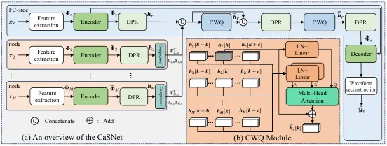
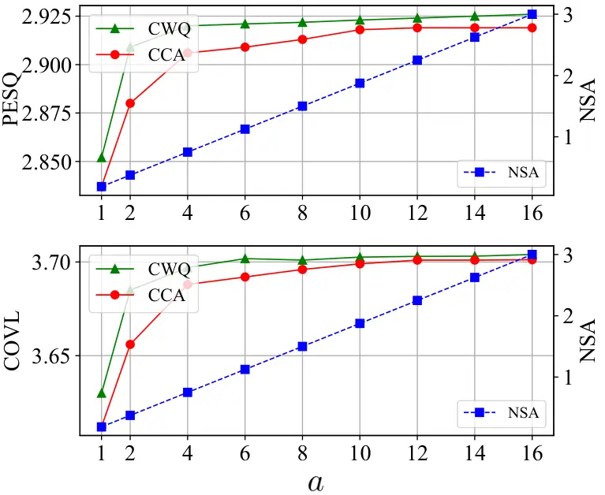

# CaSNet: Compress-and-Send Network Based Multi-Device Speech Enhancement Model for Distributed Microphone Arrays

Chengqian Jiang    Jie Zhang    Haoyin Yan ^(†)^(†)thanks: Financed by
National Natural Science Foundation of China (62571505), Anhui Province
Major Sci. & Tech. Research and Development Project (S2023Z20004) and
Anhui Natural Science Foundation (2508085MF140).

###### Abstract

Distributed microphone array (DMA) is a promising next-generation
platform for speech interaction, where speech enhancement (SE) is still
required to improve the speech quality in noisy cases. Existing SE
methods usually first gather raw waveforms at a fusion center (FC) from
all devices and then design a multi-microphone model, causing high
bandwidth and energy costs. In this work, we propose a
_Compress-and-Send Network (CaSNet)_ for resource-constrained DMAs,
where one microphone serves as the FC and reference. Each of other
devices encodes the measured raw data into a feature matrix, which is
then compressed by singular value decomposition (SVD) to produce a more
compact representation. The received features at the FC are aligned via
cross window query with respect to the reference, followed by neural
decoding to yield spatially coherent enhanced speech. Experiments on
multiple datasets show that the proposed CaSNet can save the data amount
with a negligible impact on the performance compared to the uncompressed
case. The reproducible code is available at
https://github.com/Jokejiangv/CaSNet.

###### Index Terms: 

Distributed microphone array, compress-and-send network, SVD,
lightweight speech enhancement.

^(†)^(†)address: NERC-SLIP, University of Science and Technology of
China (USTC), Hefei, China  
cqjiang@mail.ustc.edu.cn; jzhang6@ustc.edu.cn; hyyan@mail.ustc.edu.cn

## 1 Introduction

With the widespread use of sensor-equipped devices, distributed
microphone array (DMA) has become a practical architecture for speech
applications such as automatic speech recognition \[17\],
teleconferencing, hearing aids \[22\], speaker localization \[3\] and
speech enhancement (SE) \[6\]. Compared with traditional arrays in
regularized shapes, the organization of DMAs brings several benefits,
e.g., stronger scalability (devices are free to leave or join the
array), higher signal quality, wider coverage of the acoustic scene
(devices are randomly placed and some might be close to the target
speaker), etc \[2\].

The focus of this work is on the SE task using DMAs, since SE is a
necessary step to improve the signal quality in practical noisy use
cases. Recent advances in deep neural networks (DNNs) have driven the
design of DMA-based SE models. Many models can be applied in DMA
settings, where some are DMA specified and some are originally proposed
for conventional microphone arrays. They are often divided into
masking-based and end-to-end categories \[5, 14\]. The former estimates
time–frequency masks (or spatial filters) in the spirit of classical
beamforming and applies them to the noisy mixture to recover the target
in a data-driven way \[26, 12, 11, 5\]. The latter learns a direct
multi-input single-output mapping, typically with convolutional neural
network or recurrent neural network to model complex spatio-temporal
structure \[28, 16, 9, 20, 18\].

Most DMA-based SE models depend on aggregation of raw audio waveforms
from all microphone devices to a fusion center (FC), for which high
communication bandwidth and a large amount of data transmissions are
required. Simple signal compression at a lower bit rate can reduce the
cost, but spatiotemporal clues of the target speaker might be distorted,
degrading enhancement quality and limiting downstream performance.
Statistical signal processing algorithms aiming to optimize transmission
bit rates or microphone subsets \[30, 31\] are typically restricted to
stationary acoustic scenes and given second-order statistics of the
entire array (this cannot be estimated in advance). This limits the
applicability of elegant signal processing theories to practical DMA
cases, for which the combination with popular data-driven DNN models
might be a solution. More importantly, as multi-microphone signals are
highly correlated and redundant \[31\], given a prescribed SE
performance it is possible to send the learned and compressed features
rather than raw signals to the FC.

In order to save the data amount, we propose a _compress-and-send
network (CaSNet)_ for multi-device DMA-based lightweight SE. We assign
one device as the FC and reference channel, and the rest as edge nodes.
Each edge device converts the recorded waveform into a feature matrix,
applies low-rank compression to reduce its dimensionality, and then
sends the compressed feature to the FC. To capture informative
characteristics of the raw signal while simultaneously reducing feature
dimensionality, we employ singular value decomposition (SVD) to generate
compact representations. At the FC, the features gathered from each node
are first aligned with the reference microphone using cross window query
(CWQ). The aligned features are then utilized to assist the reference
microphone to produce the enhanced speech signal. We evaluate the
proposed CaSNet model on two public datasets and results show that with
a substantial reduction in the amount of transmitted data, CaSNet
maintains state-of-the-art (SOTA) SE performance.



Figure 1: (a) The overall architecture of our proposed CaSNet and (b)
cross-window query (CWQ) module.

## 2 CaSNet for DMA-based SE

In this work, we assume that each device consists of a single microphone
without loss of generality. Given a single target speech source
$`\bm{s}`$ and $`M`$ spatially separated microphones with an arbitrary
geometry, the noisy observation at the $`m`$-th microphone is modeled as

```math
\displaystyle\bm{x}_{m}=\bm{y}_{m}+\bm{n}_{m}=\bm{y}\circledast\bm{h}_{m}+\bm{n}_{m},\quad m=1,2,...,M, \tag{1}
```

where $`\circledast`$ denotes convolution, $`\bm{h}_{m}`$ the room
impulse response (RIR) from the source to microphone $`m`$,
$`\bm{y}_{m}`$ the target speech component at microphone $`m`$, and
$`\bm{n}_{m}`$ the additive noise that may include ambient noise,
competing sources and late reverberation of the target. Due to the
spatial separation of microphones, the received speech at each channel
undergoes different propagation delays, resulting in time misalignment.
To avoid ambiguity of the target during training, we designate a
reference channel $`r`$. Without loss of generality, we set $`r=1`$ in
this work. Our goal is thus to estimate the target speech $`\bm{y}_{r}`$
using noisy multichannel signals $`\{\bm{x}_{m}\}_{m=1}^{M}`$. Some
modules of CaSNet are modified from the monaural LABNet proposed by us
in \[26\]. The model structure is shown in Fig. 1(a).

### 2.1 Microphone-side compress-and-send (CaS) design

For each node, we independently extract three feature maps:
power-compressed magnitude spectrum, phase differences in the short-time
Fourier transform (STFT) domain. By concatenation, the feature of the
$`m`$-th microphone is denoted as $`\bm{\Phi}_{m}`$ $`\in`$
$`\mathbb{R}^{3\times T\times F}`$, where $`T`$ and $`F`$ are the
numbers of frames and frequency bins, respectively. This is fed into an
encoder that consists of several convolutional blocks in a U-Net
structure to extract richer hierarchical representation
$`\tilde{\bm{\Phi}}_{m}`$ $`\in`$
$`\mathbb{R}^{D\times T\times F^{\prime}},\forall m`$. The encoded
feature is then processed by a dual-path recurrent neural network
(DPR) \[15\], which alternately models long-range dependencies along the
temporal and spectral dimensions, yielding the node-level representation
$`{\bm{h}}_{m}\in\mathbb{R}^{D\times T\times F^{\prime}}`$. Both the
encoder and DPR follow the designs in \[26\] and share parameters across
all devices.

In the compressor, we decompose $`\bm{h}_{m}(t)`$ using SVD as

```math
\displaystyle\bm{h}_{m}[t]=\mathbf{U}_{m}\mathbf{\Sigma}_{m}\mathbf{V}_{m}^{\top}, \tag{2}
```

where $`(\cdot)^{\top}`$ means vector/matrix transpose,
$`\mathbf{\Sigma}_{m}`$ is a diagonal matrix containing singular values
at a decreasing order as
$`\sigma_{1}\geq\sigma_{2}\geq\ldots\geq\sigma_{D}`$ with $`D`$ being
the feature dimension, and matrices
$`\mathbf{U}_{m}=[\mathbf{u}_{1},\ldots,\mathbf{u}_{D}]`$ and
$`\mathbf{V}_{m}=[\mathbf{v}_{1},\ldots,\mathbf{v}_{F^{\prime}}]`$
contain the corresponding left and right singular vectors. Given a rank
$`a\leq D`$, we can construct $`\bm{h}_{m}[t]`$ using rank-$`a`$
approximation as

```math
\displaystyle\hat{\bm{h}}_{m}[t]\approx\sum_{i=1}^{a}\sigma_{i}\mathbf{u}_{i}\mathbf{v}_{i}^{\top},t=1,\ldots,T, \tag{3}
```

which is performed at the FC to recover feature map
$`\hat{\bm{h}}_{m},m\in\{1,\ldots,M\}\backslash r`$. Increasing the rank
can improve the approximation accuracy. As such, for each time frame we
only need to send
$`\mathbf{U}_{m,a}\mathbf{\Sigma}_{m,a}\in\mathbb{R}^{D\times a}`$ and
$`\mathbf{V}_{m,a}^{\top}\in\mathbb{R}^{a\times F^{\prime}}`$ to the FC,
instead of sending $`\bm{h}_{m}`$. This can save the transmitted data
amount compared to the uncompressed feature or raw audio data with
proper choices of rank $`a`$.

### 2.2 FC-side cross-window query (CWQ) and decoding

At the FC, the reference microphone undergoes the same processing as
edge nodes to produce its hidden representation $`\bm{h}_{r}`$. The CWQ
module aims to alleviate temporal misalignment caused by transmission
losses and asynchronous sampling rate between nodes. As shown in
Fig. 1(b), we obtain each frame by short-time framing and windowing the
speech signal. For the $`k`$-th frame of the reference channel, the
hidden representation
$`\bm{h}_{r}[k]\in\mathbb{R}^{D\times F^{\prime}}`$ is taken as _query_,
while representations
$`\{\hat{\bm{h}}_{m}[k-b],\ldots,\hat{\bm{h}}_{m}[k+c]\}`$ at interval
$`[k-b,k+c]`$ from all channels serve as _keys_ and _values_ after layer
normalization and linear projection. The multi-head attention (MHA)
mechanism  \[24\] is then applied, enabling the query frame
$`\bm{h}_{r}[k]`$ to attend contextual frames rather than strict
one-to-one alignment. The output of CWQ is given by

```math
\overline{\bm{h}}_{r}[k]=\mathrm{MHA}\big(\bm{h}_{r}[k],\{\hat{\bm{h}}_{m}[k-b:k+c]\}\big)+\bm{h}_{r}[k], \tag{4}
```

which can effectively compensate for delays and distortions in the
transmitted features and improves the spatial coherence for subsequent
decoding.

|                   |       |        |      |           |      |      |         |      |      |
| ----------------- | ----- | ------ | ---- | --------- | ---- | ---- | ------- | ---- | ---- |
| Method            | Para. | MACs   | NSA  | WSJ_WHAM! |      |      | RealMAN |      |      |
|                   |       |        |      | PESQ      | STOI | COVL | PESQ    | STOI | COVL |
| Noisy             | -     | -      | 1    | 1.48      | 0.81 | 2.27 | 1.17    | 0.74 | 2.03 |
| Oracle MVDR       | -     | -      | 1    | 2.18      | 0.78 | 3.06 | 1.33    | 0.78 | 2.11 |
| FaSNet \[16\]     | 2.8M  | 9.1G   | 1    | 2.18      | 0.90 | 2.93 | 1.54    | 0.81 | 2.34 |
| FaSNet-TAC \[14\] | 2.3M  | 11.7G  | 1    | 2.25      | 0.91 | 2.99 | 1.65    | 0.84 | 2.11 |
| DFSNet \[11\]     | 549k  | 1.7G   | 1    | 2.01      | 0.87 | 2.79 | -       | -    | -    |
| EaBNet \[12\]     | 2.8M  | 7.4G   | 1    | 2.76      | 0.93 | 3.64 | 2.17    | 0.91 | 3.08 |
| McNet \[20\]      | 1.9M  | 30.1G  | 1    | 2.82      | 0.94 | 3.67 | 2.12    | 0.90 | 3.14 |
| LABNet \[26\]     | 52k   | 0.316G | 1    | 2.92      | 0.93 | 3.69 | 2.34    | 0.90 | 3.14 |
| CaSNet ($`a`$=4)  | 52k   | 0.325G | 0.75 | 2.92      | 0.92 | 3.69 | 2.27    | 0.89 | 3.06 |

Table 1: Comparison of CaSNet with other models on both WSJ0-WHAM! and
RealMAN datasets with $`M`$=6 microphones.

After obtaining the enhanced reference embedding
$`\overline{\bm{h}}_{r}`$, we align the features from all channels with
respect to the reference. Specifically, $`\overline{\bm{h}}_{r}`$ is
concatenated with node-specific feature $`\bm{h}_{m}`$, followed by a
linear projection and a DPR module to produce aligned representations
The aligned features from all devices are concatenated along the channel
dimension and subsequently fused by a second CWQ module, which produces
a refined reference embedding $`\overline{\overline{\bm{h}}}_{r}`$.
Finally, a DPR module is applied to the fused embedding to obtain the
enhanced representation $`\hat{\bm{\Phi}}_{r}`$. To this end, the
decoder can reconstruct the magnitude spectrum using
$`\hat{\bm{\Phi}}_{r}`$ together with the intermediate feature maps from
each layer of the reference microphone’s encoder via skip connections.
Finally, the enhanced signal $`\hat{\bm{y}}_{r}`$ is obtained by inverse
STFT.

## 3 Performance Evaluation

### 3.1 Experimental setup

We evaluate our model on two datasets, where all audio is sampled or
resampled to 16 kHz.

1. WSJ0-WHAM!: A simulated dataset constructed from WSJ0 clean
   speech \[7\] and WHAM! noise \[25\]. Each mixture contains one target
   speaker and 1-3 noise sources with signal-to-noise ratio (SNR) randomly
   sampled in $`[-5,15]`$ dB. It includes 24.9 hours data for training, 2.2
   hours data for validation and 1.5 hours data for testing. Training and
   validation involve up to 6 microphones, while testing uses up to 12
   microphones with random channel selection. RIRs are generated using the
   image method \[1\] via gpuRIR \[4\].

2. RealMAN: A real-recorded dataset \[27\] collected with a 32-channel
   array, containing 83.7 hours speech and 144.5 hours background noises
   across diverse acoustic scenes. The ma_speech track is used as the
   target and ma_noise as additive noise with SNR $`\in[-5,15]`$ dB. We
   randomly select 6, 6 and 12 channels for training, validation and
   testing, respectively, to simulate arbitrary microphone placements.

Implementation: During training, we randomly select 1–6 microphones from
the available channels for each mixture to simulate dynamic microphone
array setup. The training utterances are cut into 4-second segments with
50% overlap to increase sample diversity. We apply STFT with a Hann
window of 512 (32 ms) samples and a hop size of 256 (16 ms) The
hyper-parameter setup of the encoder, DPR, and decoder modules in our
model remains identical to those of LABNet \[26\]. The Griffin-Lim
algorithm (GLA) \[8, 19\] is applied for speech reconstruction with one
iteration. For the SVD-based compressor, the rank $`a`$ is fixed at 4.
To ensure causality, the CWQ module is configured with $`b=2`$ and
$`c=0`$, while the number of attention heads is set to 4. The model is
trained using the AdamW \[13\] optimizer for 100 epochs, with the
gradient clipping factor set to 5.0. The learning rate starts from 5e-4
and decays at a factor of 0.98 per epoch.

### 3.2 Experimental results

We compare the proposed CaSNet with several SOTA multichannel SE
systems, including conventional beamforming baseline (Oracle MVDR),
fixed-array models such as EaBNet \[12\] and McNet \[20\], as well as
adaptive array models like FaSNet \[16\], FaSNet-TAC \[14\],
DFSNet \[11\] and LABNet. The SE performance is assessed using three
widely-adopted objective metrics: perceptual evaluation of speech
quality (PESQ) \[21\], short-time objective intelligibility
(STOI) \[23\] and COVL (overall quality) \[10\].

Table 1 summarizes the overall performance of these models on the
WSJ0-WHAM! and RealMAN datasets, where we also include the normalized
sample amount (NSA) per microphone with respect to the case of sending
the raw audio data. Note that all other models do not consider feature
compression in literature, so we regard them as directly sending time
samples¹¹ 1 For compressed features or raw audio data, we use the same
quantization rate per sample. NSA can thus measure the transmission cost
in the case of wireless acoustic sensor network. Given $`t`$-seconds raw
audio data and a sampling frequency of $`f_{s}`$, other models require
to send $`tf_{s}`$ time-domain samples from each microphone to the FC.
For CasNet, only $`T(D+F^{\prime})a`$ samples have to be sent, which can
be easily smaller than $`tf_{s}`$.. Clearly, the proposed
microphone-side CaS design with $`a`$ = 4 can reduce the data amount for
collection. More importantly, CaSNet achieves competitive performance
and outperforms fixed-array models (e.g., EaBNet and McNet in terms of
PESQ, STOI and COVL), confirming its capacity of leveraging multichannel
spatiotemporal clues. Note that the numbers of microphones used for
training and testing of fixed-array models have to be the same.
Meanwhile, although several modules in CaSNet originate from LABNet, the
performance remains nearly unchanged compared to LABNet. This shows that
CaSNet maintains a practical balance between data efficiency and SE
performance. Besides, LABNet and CaSNet are much more lightweight than
SOTA models.

|       |        |        |        |        |
| ----- | ------ | ------ | ------ | ------ |
| $`M`$ | PESQ   |        | COVL   |        |
|       | LABNet | CaSNet | LABNet | CaSNet |
| 2     | 2.712  | 2.705  | 3.490  | 3.487  |
| 3     | 2.790  | 2.789  | 3.569  | 3.570  |
| 4     | 2.854  | 2.851  | 3.636  | 3.630  |
| 5     | 2.893  | 2.891  | 3.672  | 3.669  |
| 6     | 2.922  | 2.920  | 3.694  | 3.692  |
| 7     | 2.945  | 2.942  | 3.722  | 3.719  |
| 8     | 2.959  | 2.958  | 3.732  | 3.734  |
| 9     | 2.973  | 2.969  | 3.749  | 3.745  |
| 10    | 2.984  | 2.981  | 3.760  | 3.757  |
| 11    | 2.989  | 2.988  | 3.766  | 3.764  |
| 12    | 3.002  | 2.996  | 3.793  | 3.772  |

Table 2: Evaluation of PESQ and COVL in terms of the number of
microphones for LABNet and CaSNet (rank $`a`$=4).

Since CaSNet supports arbitrary numbers of input channels, we compare it
with LABNet under the same configurations. Both models are trained with
randomly sampled 1-6 channels and evaluated on 2-12 channels. As shown
in Table 2, the performance of both models consistently improves as the
number of input channels increases, which reflects the benefit of
exploiting richer spatial cues. In all channel cases, CaSNet achieves
performance comparable to LABNet, with average differences in PESQ or
COVL within 0.01. This reveals that the proposed CaS design
substantially reduces data overhead while preserving enhancement
quality, even when the number of input microphones exceeds the training
range, thereby validating the applicability of CaSNet to DMAs with
arbitrary and dynamic structures.

Finally, we analyze the effects of the proposed CWQ module and the rank
$`a`$ in Fig. 2. Indeed, CWQ can be replaced by cross-channel attention
(CCA), similarly as LABNet. We see that both PESQ and COVL increase
steadily with a larger $`a`$, since more feature information is
preserved by data gathering. CWQ consistently outperforms CCA,
especially in the low-rank regime ($`a\leq 6`$), where temporal
misalignment is more serious due to over-compression. This validates the
effectiveness of CWQ in the DMA-based SE framework. Note that
calculations of CWQ and CCA are independent of feature compression.
Increasing $`a`$ also causes a larger NSA and sending STFT features
might cause a higher data amount than the raw case, because more
eigenvectors have to be sent. As the performance approximately saturates
in case $`a\geq 4`$, we can simply choose $`a=4`$ to achieve a tradeoff
between SE performance and data efficiency and incorporate the
superiority of CWQ. This also reveals the data/feature redundancy in
multi-microphone speech processing models \[29\].



Figure 2: The SE performance and NSA in terms of rank $`a\leq D=16`$
with $`M=6`$.

## 4 Conclusion

In this work, we proposed the lightweight CaSNet model for DMA-based SE
in an FC-node collaborative way. Edge nodes record audio signals,
extract acoustic features and compress the features using SVD. The FC
acts as a reference and gathers feature maps from other microphones
instead of conventional raw audio data. The CWQ module is used to
alleviate temporal misalignment and reconstruct spatially coherent
representations. Given the same SE performance, results on public
datasets clearly reveal the superiority of CaSNet in saving data amount.
CaSNet also supports arbitrary numbers of microphones, i.e., scalable to
practical DMA setups. Future work covers learning-based adaptive
bit-rate control, sensor scheduling and joint optimization with
downstream tasks.

## References

- \[1\] J. B. Allen and D. A. Berkley (1976) Image method for
  efficiently simulating small‐room acoustics. J. Acoust. Soc. Amer.
  65, pp. 943–950. Cited by: §3.1.
- \[2\] A. Bertrand (2011) Applications and trends in wireless acoustic
  sensor networks: a signal processing perspective. In IEEE Symp.
  Commun. & Veh. Tech. Benelux (SCVT), pp. 1–6. Cited by: §1.
- \[3\] M. Cobos, F. Antonacci, A. Alexandridis, A. Mouchtaris, and B.
  Lee (2017) A survey of sound source localization methods in wireless
  acoustic sensor networks. Wireless Commun. & Mobile Comput. 2017 (1),
  pp. 3956282. Cited by: §1.
- \[4\] D. Diaz-Guerra, A. Miguel, and J. R. Beltran (2020) gpuRIR: a
  python library for room impulse response simulation with GPU
  acceleration. Multimedia Tools & Applications 80 (4), pp. 5653–5671.
  External Links: ISSN 1573-7721,
  [Document](https://dx.doi.org/10.1007/s11042-020-09905-3) Cited by:
  §3.1.
- \[5\] N. Furnon, R. Serizel, S. Essid, and I. Illina (2021) DNN-based
  mask estimation for distributed speech enhancement in spatially
  unconstrained microphone arrays. IEEE/ACM Trans. Audio, Speech, Lang.
  Process. 29, pp. 2310–2323. Cited by: §1.
- \[6\] S. Gannot, E. Vincent, S. Markovich-Golan, and A. Ozerov (2017)
  A consolidated perspective on multimicrophone speech enhancement and
  source separation. IEEE/ACM Trans. Audio, Speech, Lang. Process. 25,
  pp. 692–730. Cited by: §1.
- \[7\] J. S. Garofolo, D. Graff, D. Paul, and D. Pallett (2007) Csr-i
  (wsj0) complete. Linguistic Data Consortium, Philadelphia. Cited by:
  §3.1.
- \[8\] D. Griffin and J. Lim (1984) Signal estimation from modified
  short-time Fourier transform. IEEE/ACM Trans. Audio, Speech, Lang.
  Process. 32, pp. 236–243. Cited by: §3.1.
- \[9\] H. Guo, Y. Chen, X. Zhang, and X. Li (2024) Graph attention
  based multi-channel U-Net for speech dereverberation with ad-hoc
  microphone arrays. In ISCA Interspeech, pp. 617–621. Cited by: §1.
- \[10\] Y. Hu and P. C. Loizou (2008) Evaluation of objective quality
  measures for speech enhancement. IEEE/ACM Trans. Audio, Speech, Lang.
  Process. 16, pp. 229–238. Cited by: §3.2.
- \[11\] A. K., K. P., and I. P. (2023) DFSNet: a steerable neural
  beamformer invariant to microphone array configuration for real-time,
  low-latency speech enhancement. In ISCA Interspeech, pp. 2493–2497.
  Cited by: §1, Table 1, §3.2.
- \[12\] A. Li, W. Liu, C. Zheng, and X. Li (2022) Embedding and
  beamforming: all-neural causal beamformer for multichannel speech
  enhancement. In ICASSP, pp. 6487–6491. Cited by: §1, Table 1, §3.2.
- \[13\] I. Loshchilov and F. Hutter (2019) Decoupled weight decay
  regularization. In Int. Conf. Learn. Represent. (ICLR), Note:
  arXiv:1711.05101 Cited by: §3.1.
- \[14\] Y. Luo, Z. Chen, N. Mesgarani, and T. Yoshioka (2020)
  End-to-end microphone permutation and number invariant multi-channel
  speech separation. In ICASSP, pp. 6394–6398. Cited by: §1, Table 1,
  §3.2.
- \[15\] Y. Luo, Z. Chen, and T. Yoshioka (2020) Dual-Path RNN:
  efficient long sequence modeling for time-domain single-channel speech
  separation. In ICASSP, pp. 46–50. Cited by: §2.1.
- \[16\] Y. Luo, C. Han, N. Mesgarani, E. Ceolini, and S. Liu (2019)
  FaSNet: low-latency adaptive beamforming for multi-microphone audio
  processing. In IEEE Workshop Auto. Speech Recog. & Understand. (ASRU),
  pp. 260–267. Cited by: §1, Table 1, §3.2.
- \[17\] I. A. McCowan (2001) Robust speech recognition using microphone
  arrays. Ph.D. Thesis, Queensland Uni. of Tech.. Cited by: §1.
- \[18\] A. Pandey, B. Xu, A. Kumar, et al. (2022) Time-domain ad-hoc
  array speech enhancement using a triple-path network. In ISCA
  Interspeech, pp. 729–733. Cited by: §1.
- \[19\] N. Perraudin, P. Balazs, and P. L. Søndergaard (2013) A fast
  Griffin-Lim algorithm. In IEEE Workshop Appl. Signal Process. Audio,
  Acoust. (WASPAA), pp. 1–4. Cited by: §3.1.
- \[20\] C. Quan and X. Li (2024) Multichannel long-term streaming
  neural speech enhancement for static and moving speakers. IEEE Signal
  Process. Lett. 31, pp. 2295–2299. Cited by: §1, Table 1, §3.2.
- \[21\] A.W. Rix, J.G. Beerends, M.P. Hollier, and A.P. Hekstra (2001)
  Perceptual evaluation of speech quality (PESQ)-a new method for speech
  quality assessment of telephone networks and codecs. In ICASSP, Vol.
  2, pp. 749–752. Cited by: §3.2.
- \[22\] R. Serizel, M. Moonen, B. Van Dijk, and J. Wouters (2014)
  Low-rank approximation based multichannel Wiener filter algorithms for
  noise reduction with application in cochlear implants. IEEE/ACM Trans.
  Audio, Speech, Lang. Process. 22 (4), pp. 785–799. Cited by: §1.
- \[23\] C. H. Taal, R. C. Hendriks, R. Heusdens, and J. Jensen (2011)
  An algorithm for intelligibility prediction of time–frequency weighted
  noisy speech. IEEE/ACM Trans. Audio, Speech, Lang. Process. 19,
  pp. 2125–2136. Cited by: §3.2.
- \[24\] A. Vaswani, N. Shazeer, N. Parmar, et al. (2017) Attention is
  all you need. In Int. Conf. on Neural Information Processing Systems
  (NeurIPS), Vol. 30, pp. 1–11. Cited by: §2.2.
- \[25\] G. Wichern, J. Antognini, M. Flynn, et al. (2019) WHAM!:
  extending speech separation to noisy environments. In ISCA
  Interspeech, pp. 1368–1372. Cited by: §3.1.
- \[26\] H. Yan, J. Zhang, C. Jiang, and S. Zhang (2025) LABNet: a
  lightweight attentive beamforming network for ad-hoc multichannel
  microphone invariant real-time speech enhancement. arXiv preprint
  arXiv:2507.16190. Cited by: §1, §2.1, Table 1, §2, §3.1.
- \[27\] B. Yang, C. Quan, Y. Wang, et al. (2024) RealMAN: a
  real-recorded and annotated microphone array dataset for dynamic
  speech enhancement and localization. Advances in Neural Information
  Process. Systems 37, pp. 105997–106019. Cited by: §3.1.
- \[28\] Y. Yang, C. Quan, and X. Li (2023) McNet: fuse multiple cues
  for multichannel speech enhancement. In ICASSP, pp. 1–5. Cited by: §1.
- \[29\] J. Zhang, H. Chen, L. Dai, and R. Hendriks (2021) A study on
  refrence microphone selection for multi-microphone speech enhancement.
  IEEE/ACM Trans. Audio, Speech, Lang. Process. 29, pp. 671–683. Cited
  by: §3.2.
- \[30\] J. Zhang, A. I. Koutrouvelis, R. Heusdens, and R. C.
  Hendriks (2019) Distributed rate-constrained lcmv beamforming. IEEE
  Signal Process. Lett. 26 (5), pp. 675–679. Cited by: §1.
- \[31\] J. Zhang, R. Tao, J. Du, and L. Dai (2022) Energy-efficient
  sparsity-driven speech enhancement in wireless acoustic sensor
  networks. IEEE/ACM Trans. Audio, Speech, Lang. Process. 31,
  pp. 215–228. Cited by: §1.
