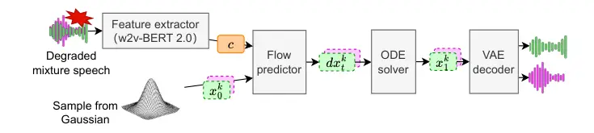

# Geneses: Unified Generative Speech Enhancement and Separation

Kohei Asai    Wataru Nakata    Yuki Saito    Hiroshi Saruwatari

###### Abstract

Real-world audio recordings often contain multiple speakers and various
degradations, which limit both the quantity and quality of speech data
available for building state-of-the-art speech processing models.
Although end-to-end approaches that concatenate speech enhancement (SE)
and speech separation (SS) to obtain a clean speech signal for each
speaker are promising, conventional SE-SS methods suffer from complex
degradations beyond additive noise. To this end, we propose Geneses, a
generative framework to achieve unified, high-quality SE--SS. Our
Geneses leverages latent flow matching to estimate each speaker’s clean
speech features using multi-modal diffusion Transformer conditioned on
self-supervised learning representation from noisy mixture. We conduct
experimental evaluation using two-speaker mixtures from LibriTTS-R under
two conditions: additive-noise-only and complex degradations. The
results demonstrate that Geneses significantly outperforms a
conventional mask-based SE--SS method across various objective metrics
with high robustness against complex degradations. Audio samples are
available in our demo page¹¹ 1
[https://freckle-heron-b84.notion.site/Geneses-Sample-295b7fa15f5580adbb2fefa0ad5dd348](https://freckle-heron-b84.notion.site/Geneses-Sample-295b7fa15f5580adbb2fefa0ad5dd348).

###### Index Terms: 

Speech enhancement, speech separation, generative model, flow matching,
multi-modal diffusion Transformer

^(†)^(†)address: ¹The University of Tokyo, Japan,  
² National Institute of Advanced Industrial Science and Technology
(AIST), Japan.

## 1 Introduction

Speech separation (SS) \[1\], which aims to isolate individual speaker
signals from a mixture of multiple voices, is a key technology for
robust communication through speech processing technologies such as
automatic speech recognition. In practical scenarios, recorded speech is
often degraded not only by overlapping speakers but also by various
real-world factors such as additive noise, reverberation, codec
distortion, and packet loss. To make such degraded speech high-quality
and intelligible, speech enhancement (SE) \[2\]—which converts a clean
signal from degraded one—should be addressed together with SS. A unified
framework that jointly performs SE and SS can provide consistently high
performance across diverse acoustic environments, improving the
usability of speech-based telepresence and extended reality
applications.

Hu et al. \[3\] proposed a unified approach for noise-robust SS by
combining SE and SS as a single deep neural network (DNN)-based model.
Their approach adopts a cascaded SE–SS architecture optimized via
multi-task learning and a gradient modulation (GM) strategy, which
suppresses conflicts between SE and SS to mitigate the over-suppression
of speech components. Although this approach showed promising results
under “additive-noise-only” conditions, it cannot handle complex
degradations due to the limitation of mask-based SE–SS, restricting its
applicability in more realistic environments.

To this end, we propose Geneses²² 2 Generative speech enhancement and
separation, a unified generative approach that jointly performs SE and
SS. Our Geneses leverages flow matching \[4\] on latent feature
representations to estimate each speaker’s clean speech features using
multi-modal diffusion Transformer (MM-DiT) \[5\] conditioned on
self-supervised learning (SSL) representation from noisy mixture. We
conduct experimental evaluation using two-speaker mixtures from
LibriTTS-R \[6\] under two conditions: additive-noise-only and complex
degradations. The results demonstrate that Geneses significantly
outperforms a conventional Hu et al.’s noise-robust SS method \[3\]
across various objective metrics with high robustness against complex
degradations.

## 2 Related Work

### 2.1 DNN-based SS and Noise-robust SS

SS has primarily evolved as a task to separate individual speaker
signals from multi-talker mixtures in clean environments. Developments
on sophisticated DNN architectures such as Transformers (e.g.,
SepFormer \[7\]) and generative modeling like flow matching (e.g.,
FLOSS \[8\]) have achieved high-quality separation. However, these SS
models are designed under the premise of that the mixture consists of
clean speech.

To address this issue, noisy SS, which aims to perform noise removal and
speaker separation simultaneously using a single model, has been
proposed. For example, noise-aware SS \[9\] explicitly treats noise as
an additional source to suppress its leakage into the separated speech,
and GeCo \[10\] post-processes the output of a discriminative model
using a generative model to remove noise and unnatural distortions.
Although these attempts enlarges the application range of SS,
conventional approaches only considered additive noise as the
degradation case. Therefore, noise-robust SS under complex degradations
in more realistic scenarios, such as clipping, codec artifacts, and
packet loss, remains a significant challenge.

### 2.2 Universal SE for Complex Degradations

In the field of SE, universal SE, which aims to restore clean speech
from complex degradations using a single model, has been actively
studied. Especially, universal SE incorporating generative models,
particularly score-based diffusion models \[11\] \[12\], have
demonstrated promising results. The reason is that they can generate
high-quality speech through the stochastic process from degraded input
to clean signal, which is not uniquely determined due to various
degradations, such as bandwidth extension and packet loss.

For example, SGMSE+ \[13\] adapts the diffusion process using a
stochastic differential equation to directly model the transformation
from clean to corrupted speech (including noise and reverberation).
Another notable approach is UNIVERSE++ \[12\], which improves upon the
UNIVERSE model \[11\] by incorporating architectural improvements,
adversarial training to promote high-quality feature extraction, and
low-rank adaptation (LoRA) \[14\] to preserve linguistic content.
Although these methods demonstrated the potential of diffusion models to
tackle a diverse set of degradations effectively, they have
predominantly focused on enhancing single-speaker speech. That is, they
did not address the challenge of separating speech when multiple
speakers are present simultaneously within the complexly degraded
signal.

By leveraging insights from universal SE, this research aims to enable
SS to operate effectively even in environments containing complex
degradations.

## 3 Geneses



Figure 1: Inference pipeline of Geneses. Flow matching is performed on
the latent representations of a pre-trained VAE.

Figure 2: Architecture of flow predictor.

Geneses proposed in this study aims to solve SS and SE in a unified
manner. Based on the recent success of flow matching in universal SE and
generative SS, Genesis also uses flow matching for this task.
Specifically, we employ latent flow matching \[15\] similar to previous
work \[16\] because learning to generate raw waveform is difficult.
Figure 1 shows the overview of inference by Geneses consisting of three
modules: input feature extractor, variational auto encoder (VAE) \[17\],
and flow predictor. The extractor leverages features from the input
degraded mixture signal to provide sufficient information to make the
predictor well estimate the flow towards VAE latent features of clean
speech signals.

In this paper, we mainly focus on SE–SS with a two-speaker mixture case.
However, we expect that Geneses can be extended to more challenging
cases like three or four speakers.

### 3.1 Input Feature Extractor

In order to extract meaningful information from the highly degraded
speaker-mixed speech signal, using a robust feature extractor is
important. Therefore, we use a pre-trained SSL model, w2v-BERT
2.0 \[18\]. w2v-BERT 2.0³³ 3
[https://huggingface.co/facebook/w2v-bert-2.0](https://huggingface.co/facebook/w2v-bert-2.0)
is trained on 4.5M hours of speech spanning across 143 languages, making
it highly suited for extracting robust features from degraded signals as
shown in previous work \[19\]. Furthermore, given this large-scale
training, it is also expected to get rich information robustly from
mixed speech. The extracted features $`\bm{c}`$ are processed through a
linear layer before being fed into the Transformer-based flow predictor
described later. In line with previous studies \[19\], we also finetune
this w2v-BERT model using LoRA \[14\] in order to prevent catastrophic
forgetting of the rich domain knowledge acquired through SSL.

### 3.2 VAE for Latent Flow Matching and Speech Synthesis

Instead of directly handling the raw audio waveform, a VAE is used to
compress the audio into a more manageable lower-dimensional latent
space, where the latent flow matching process occurs. Let $`t\in[0,1]`$
denote the timestep variable for the flow-matching process. Here,
$`\bm{x}_{0}`$ is defined as a sample from a standard Gaussian
distribution, and $`\bm{x}_{1}`$ is the VAE representation of the target
clean speech. Since we use rectified flows \[20\], $`\bm{x}_{t}`$ is
expressed as $`\bm{x}_{t}=(1-t)\bm{x}_{0}+t\bm{x}_{1}`$. For the unified
SE–SS task, this latent space representation is divided into two
independent tracks, $`\bm{x}_{t}^{1}`$ and $`\bm{x}_{t}^{2}`$,
corresponding to the target speakers. These latent representations
define the space where the flow matching process occurs. Each latent
representation $`\bm{x}_{t}^{k}\,(k\in\{1,2\})`$ is passed through a
dedicated linear layer to match the dimensionality to the flow
predictor. For the VAE architecture, we adopt a model based on the
Descript Audio Codec (DAC) \[21\], similar to previous work  \[16\].

In the following sections, we denote the combined latent representation
for both speakers at the timestep $`t`$ as $`\bm{x}_{t}`$, which
typically represents the stacking of the individual latent vectors
$`[\bm{x}_{t}^{1},\,\bm{x}_{t}^{2}]`$. The same notation applies to
$`\bm{x}_{0}`$ and $`\bm{x}_{1}`$.

### 3.3 Flow Predictor

The flow predictor parametrized by $`\theta`$,
$`\bm{v}_{\theta}(\bm{x}_{t},\bm{c},t)`$ is the core of our Geneses,
which predicts this conditional vector field. It takes the current
latent representation $`\bm{x}_{t}`$ (a state on the trajectory between
the noise $`\bm{x}_{0}`$ and the target $`\bm{x}_{1}`$), the SSL
conditional features $`\bm{c}`$, and timestep $`t`$ as input, and
outputs the predicted a vector towards the clean, separated target
representation $`\bm{x}_{1}`$.

We employ the MM-DiT \[5\] architecture for this predictor. MM-DiT
utilizes separate weights for modalities but joins their sequences
during the attention operation, which enables a bidirectional flow of
information between them. It can effectively fuse different features
from the VAE latent representations $`\bm{x}_{t}`$, SSL model features
$`\bm{c}`$, and timestep information $`t`$—through its attention
mechanism. The timestep $`t`$ is encoded using standard sinusoidal
encoding \[22\] followed by a multi-layer perceptron (MLP), and is
supplied as a conditioning vector to all layers of the MM-DiT. The
MM-DiT takes the linearly processed $`\bm{x}_{t},\bm{c}`$ and the
MLP-transformed $`t`$ as input, and outputs the predicted flow vector
field $`\bm{v}_{\theta}`$.

During inference, we sample $`\bm{x}_{0}\sim\mathcal{N}(0,I)`$ and solve
the ODE (Eq. 1) numerically using the predicted vector field to obtain
$`\bm{x}_{1}`$, which is then decoded by the VAE:

```math
\frac{d\bm{x}_{t}}{dt}=\bm{v}_{\theta}(\bm{x}_{t},\bm{c},t). \tag{1}
```

### 3.4 Training

The model parameters of Geneses $`\theta`$ are optimized to minimize the
mean squared error (MSE) loss between the predicted vector field and the
target vector field. This loss function is expressed as:

```math
\mathcal{L}(\theta)=\mathrm{MSE}(\bm{v}_{\theta}(\bm{x}_{t},\bm{c},t),\,\bm{x}_{1}-\bm{x}_{0}). \tag{2}
```

During training, two components are updated: the flow predictor and the
LoRA parameters applied to the pre-trained w2v-BERT 2.0 feature
extractor. Conversely, the parameters of the pre-trained VAE are frozen.

Note that unlike conventional discriminative separation methods, we do
not employ Permutation Invariant Training (PIT) loss. Since our
objective is to regress the vector field pointing to a specific target
instance $`\bm{x}_{1}`$ (the stacked latent representations), applying
PIT would introduce ambiguity into the target direction, hindering the
learning of a consistent flow.

## 4 Experiment

|                    | Background Noise Only |                    |                      |                    | Complex Degradations |                    |                      |                    |
| ------------------ | --------------------- | ------------------ | -------------------- | ------------------ | -------------------- | ------------------ | -------------------- | ------------------ |
| Method             | DNSMOS $`\uparrow`$   | NISQA $`\uparrow`$ | UTMOSv2 $`\uparrow`$ | WER $`\downarrow`$ | DNSMOS $`\uparrow`$  | NISQA $`\uparrow`$ | UTMOSv2 $`\uparrow`$ | WER $`\downarrow`$ |
| Ground Truth       | 3.37                  | 4.73               | 3.65                 | 0.11               | 3.37                 | 4.73               | 3.65                 | 0.11               |
| Conventional       | 2.91                  | 2.32               | 1.75                 | 0.35               | 2.08                 | 1.34               | 0.84                 | 5.54               |
| Geneses (proposed) | 3.40                  | 4.44               | 3.44                 | 0.39               | 3.39                 | 4.44               | 3.40                 | 0.43               |

Table 1: Reference-free evaluation results. Better results among
comparative methods are in bold. Note that the UTMOSv2 score can be less
than 1, which is an inherent characteristic of the model.

|                    | Background Noise Only |                    |                    |                  |                     | Complex Degradations |                    |                    |                  |                     |
| ------------------ | --------------------- | ------------------ | ------------------ | ---------------- | ------------------- | -------------------- | ------------------ | ------------------ | ---------------- | ------------------- |
| Method             | ESTOI $`\uparrow`$    | MCD $`\downarrow`$ | LSD $`\downarrow`$ | SBS $`\uparrow`$ | SpkSim $`\uparrow`$ | ESTOI $`\uparrow`$   | MCD $`\downarrow`$ | LSD $`\downarrow`$ | SBS $`\uparrow`$ | SpkSim $`\uparrow`$ |
| Conventional       | 0.72                  | 7.17               | 3.96               | 0.80             | 0.95                | 0.42                 | 9.24               | 5.79               | 0.61             | 0.91                |
| Geneses (proposed) | 0.75                  | 7.60               | 4.65               | 0.83             | 0.99                | 0.72                 | 8.09               | 5.00               | 0.82             | 0.98                |

Table 2: Reference-aware evaluation results. Better results among
comparative methods are in bold.

### 4.1 Experimental Condition

#### 4.1.1 Data Preparation

We used LibriTTS-R \[6\], which is an English audiobook speech
containing 585 hours by 2,456 speakers. Mixtures were created by taking
a sum of two utterances from different speakers. The splits for the
training, validation, and test sets followed the official subsets
provided by the LibriTTS-R corpus. The numbers of mixed speech samples
were 110,000 for the training set, 5,000 for the validation set, and
1,500 for the test set. We then prepared two types of degraded audio
from these mixtures as follows.

Data with Background Noise Only: Background noise was selected from the
DNS5 Challenge \[23\], WHAM! \[24\], FSD50K \[25\], the Free Music
Archive, and wind noise simulated by the SC-Wind-Noise-Generator \[26\].
This noise was added to the clean speech at a signal-to-noise ratio
(SNR) randomly chosen from a uniform distribution
$`\mathcal{U}(-5,20)\,$\mathrm{d}\mathrm{B}$`$.

Data with Complex Degradations: The degradation process followed as: 1)
reverberation, 2) noise addition, 3) bandwidth limitation, 4) clipping, 5) codec degradation, and 5) packet loss, each with a 50% probability of
being applied. See \[19\] for the implementation details. Note that, for
the test set, unlike previous work \[19\], we used the DEMAND dataset⁴⁴
4
[https://www.kaggle.com/datasets/chrisfilo/demand](https://www.kaggle.com/datasets/chrisfilo/demand)
as the noise dataset and the MIT Environmental Impulse Response Dataset
as the RIR dataset⁵⁵ 5
[https://huggingface.co/datasets/davidscripka/MIT_environmental_impulse_responses](https://huggingface.co/datasets/davidscripka/MIT_environmental_impulse_responses).

#### 4.1.2 DNN Architecture

Feature Extractor: We utilized w2v-BERT 2.0 as the foundation,
extracting 1,024-dimensional features from 16 kHz audio. The model was
fine-tuned by LoRA with rank 64, targeting the output dense layers with
8 hidden adapters ($`\alpha=16,\,\mathrm{dropout}=0.1`$).

VAE: We pretrained the VAE using train subsets of LibriTTS-R. The VAE
operated at 24 kHz. The encoder rates were set to $`2,3,4,5,8`$
resulting in the 25 Hz frame rate of latent features. The latent
dimension of the VAE were set to 16. For other settings, we followed the
previous work \[21\].

Flow Predictor: The MM-DiT consisted of 12 Transformer layers with 768
hidden dimensions and 12 attention heads. It processed concatenated SSL
features (1,024-dim) and VAE latents (16-dim per speaker) using
FlashAttention \[27\] with RMSNorm \[28\]. To encode the temporal
position within the feature sequences, sinusoidal positional embeddings
supported sequences up to 20 seconds of the input signal. This
positional encoding represented the sequential order of the features,
distinct from the flow matching timestep $`t`$. Time conditioning was
achieved through a 256-dimensional timestep embedder followed by a
two-layer MLP with SiLU activation.

#### 4.1.3 Optimization and Inference

For sampling the timestep $`t`$ during training, we used logit normal
sampling \[5\]. For optimization, we employed the AdamW \[29\] optimizer
with $`\beta_{1}=0.9`$, $`\beta_{2}=0.999`$ and weight decay of
$`10^{-4}`$. Learning rate scheduling was performed for improving the
stability of training. The learning rate was set to $`10^{-5}`$. The
model was trained for a total of 150k iterations. All experiments were
conducted on a system with 8 NVIDIA H200 GPUs, using a total batch size
of 16. During inference, the ODE (Eq. 1) was numerically solved using
the Euler method with a fixed step size of 0.01.

#### 4.1.4 Evaluation Criteria

For the objective evaluation, we used two sets of metrics:
reference-free and reference-aware.

The reference-free metrics included DNSMOS \[30\], NISQA \[31\], and
UTMOSv2 \[32\], which are deep learning-based models that predict
subjective speech quality, and word error rate (WER) obtained from the
Whisper ASR system \[33\]⁶⁶ 6
[https://huggingface.co/openai/whisper-large-v3](https://huggingface.co/openai/whisper-large-v3).

The reference-aware metrics consisted of ESTOI (extended short-time
objective intelligibility) \[34\] to evaluate speech intelligibility,
MCD (mel-cepstral distortion) \[35\] to assess timbral distortion, LSD
(log-spectral distance) \[36\] to evaluate overall spectral distortion,
SpeechBERTScore (SBS) \[37\]⁷⁷ 7 The SSL model used to calculate
SpeechBERTScore is
[https://huggingface.co/utter-project/mHuBERT-147](https://huggingface.co/utter-project/mHuBERT-147),
which is highly correlated with human subjective ratings, and speaker
similarity (SpkSim) calculated with x-vectors \[38\]⁸⁸ 8
[https://huggingface.co/speechbrain/spkrec-xvect-voxceleb](https://huggingface.co/speechbrain/spkrec-xvect-voxceleb).

For comparison, we employed the method proposed by Hu et al. \[3\]. The
same dataset as our proposed method was used, and the hyperparameters
were set to the exact values reported in their paper.

### 4.2 Result

The evaluation results for the reference-free and reference-aware
metrics are presented in Table 1 and Table 2, respectively.

#### 4.2.1 Results under Background Noise Only Condition

Looking at the reference-free metrics, Geneses significantly
outperformed the conventional method on the subjective quality
prediction models DNSMOS, NISQA, and UTMOSv2, achieving scores close to
the Ground Truth. However, for WER obtained using Whisper ASR, the
conventional method performed slightly better than Geneses. In the
reference-aware metrics, Geneses showed superior results compared to the
conventional method for ESTOI, SBS, and SpkSim. Conversely, the
conventional method achieved slightly better scores for MCD and LSD.
These results indicate that Geneses achieves high perceptual quality
while slightly degrades scores on objective metrics such as WER, LSD,
and MCD compared to the conventional method. This observation reflects a
well-known trade-off inherent in generative SE. As demonstrated by
Scheibler et al. \[12\], generative SE models often struggle with
content preservation, exhibiting “high LSD and WER”. This is attributed
to the models’ tendency to “change content or drop segments,” a
phenomenon often described as hallucinations \[39\]. In contrast, purely
discriminative models (e.g., BSRNN) typically excel at these fidelity
metrics, showing “low LSD” and “low WER,” but often do so at the expense
of “naturalness.” Therefore, the slight degradation in these objective
fidelity scores for our model is a known characteristic of generative
approaches that prioritize producing natural-sounding speech over
strictly minimizing waveform reconstruction or linguistic errors.

In summary, while there was a slight trade-off in objective fidelity
metrics like WER, LSD, and MCD—a known challenge in generative SE
approaches—the overall results were highly positive, driven by
substantial improvements in perceptual quality. This demonstrates that
Geneses works robustly and effectively, even within conventional
experimental settings.

#### 4.2.2 Results under Complex Degradations Condition

In the reference-free metrics, Geneses substantially surpassed the
conventional method across all metrics (DNSMOS, NISQA, UTMOSv2),
achieving quality close to the Ground Truth shown in Table 2. Notably,
regarding WER, the conventional method’s performance degraded to a level
where recognition is difficult (5.54), whereas Geneses significantly
reduced WER (0.43). Similarly, for the reference-aware metrics, Geneses
demonstrated considerably better results than the conventional method
across all metrics (ESTOI, MCD, LSD, SBS, SpkSim). This signifies that
Geneses is far superior in terms of intelligibility, spectral
distortion, correlation with subjective quality, and speaker similarity.

In summary, these results clearly demonstrate the limitations of the
conventional method when faced with speech corrupted by complex,
real-world degradations. The conventional approach fails to handle such
challenging conditions, as evidenced by its failures across all metrics,
including a WER (5.54) that renders the speech unrecognizable. In
contrast, Geneses not only avoids this failure but also robustly
enhances the audio, delivering high perceptual quality, intelligibility,
and speaker fidelity. This demonstrates that our proposed generative
approach is far superior and effectively capable of separating and
restoring speech from severe and multifaceted degradations where
traditional methods completely break down.

## 5 conclusion

In this paper, we proposed Geneses, a speech separation and enhancement
framework designed to simultaneously address both “complex
degradations”—including clipping and codec distortion, not just
background noise—and the mixture of multiple speakers. Experimental
results showed that our proposed method is highly effective against such
complex degradations, whereas conventional methods degrade
significantly. Future work includes applying this method to
non-simulated speaker-mixed speech, such as actual conversational data.

Acknowledgements: This work was supported by JST Moonshot JPMJMS2011,
JSPS KAKENHI 25KJ0806, JST BOOST JPMJBY24C9, Research Grant S of the
Tateisi Science and Technology Foundation and the AIST policy-based
budget project “R&D on Generative AI Foundation Models for the Physical
Domain.”

## References

- \[1\] D. Wang and J. Chen (2018) Supervised speech separation based on
  deep learning: an overview. IEEE/ACM transactions on audio, speech,
  and language processing 26 (10), pp. 1702–1726. Cited by: §1.
- \[2\] R. Nuthakki, P. Masanta, and T. N. Yukta (2021) A literature
  survey on speech enhancement based on deep neural network technique.
  In Proc. ICCCE, pp. 7–16. Cited by: §1.
- \[3\] Y. Hu, C. Chen, H. Zou, X. Zhong, and E. S. Chng (2023) Unifying
  speech enhancement and separation with gradient modulation for
  end-to-end noise-robust speech separation. In Proc. ICASSP, Cited by:
  §1, §1, §4.1.4.
- \[4\] Y. Lipman, R. T. Chen, H. Ben-Hamu, M. Nickel, and M. Le (2023)
  Flow matching for generative modeling. In Proc. ICLR, Cited by: §1.
- \[5\] P. Esser, S. Kulal, A. Blattmann, R. Entezari, J. Müller, H.
  Saini, Y. Levi, D. Lorenz, A. Sauer, F. Boesel, D. Podell, T.
  Dockhorn, Z. English, and R. Rombach (2024) Scaling rectified flow
  Transformers for high-resolution image synthesis. In Proc. ICML,
  pp. 12606–12633. Cited by: §1, §3.3, §4.1.3.
- \[6\] Y. Koizumi, H. Zen, S. Karita, Y. Ding, K. Yatabe, N.
  Morioka, M. Bacchiani, Y. Zhang, W. Han, and A. Bapna (2023)
  LibriTTS-R: a restored multi-speaker text-to-speech corpus. In Proc.
  INTERSPEECH, pp. 5496–5500. Cited by: §1, §4.1.1.
- \[7\] C. Subakan, M. Ravanelli, S. Cornell, M. Bronzi, and J.
  Zhong (2021) Attention is all you need in speech separation. In Proc.
  ICASSP, pp. 21–25. Cited by: §2.1.
- \[8\] R. Scheibler, J. R. Hershey, A. Doucet, and H. Li (2025) Source
  separation by flow matching. In Proc. WASPAA, Cited by: §2.1.
- \[9\] Z. Zhang, C. Chen, H. Chen, X. Liu, Y. Hu, and E. S. Chng (2024)
  Noise-aware speech separation with contrastive learning. In Proc.
  ICASSP, pp. 1381–1385. Cited by: §2.1.
- \[10\] H. Wang, J. Villalba, L. Moro-Velazquez, J. Hai, T. Thebaud,
  and N. Dehak (2024) Noise-robust speech separation with fast
  generative correction. In Proc. INTERSPEECH, pp. 2165–2169. Cited by:
  §2.1.
- \[11\] J. Serrà, S. Pascual, J. Pons, R. O. Araz, and D. Scaini (2022)
  Universal speech enhancement with score-based diffusion. arXiv
  preprint arXiv:2206.03065. Cited by: §2.2, §2.2.
- \[12\] R. Scheibler, Y. Fujita, Y. Shirahata, and T. Komatsu (2024)
  Universal score-based speech enhancement with high content
  preservation. In Proc. INTERSPEECH, pp. 1165–1169. Cited by: §2.2,
  §2.2, §4.2.1.
- \[13\] J. Richter, S. Welker, J. Lemercier, B. Lay, and T.
  Gerkmann (2023) Speech enhancement and dereverberation with
  diffusion-based generative models. IEEE/ACM Transactions on Audio,
  Speech, and Language Processing 31, pp. 2351–2364. Cited by: §2.2.
- \[14\] E. Hu, Y. Shen, P. Wallis, Z. Allen-Zhu, Y. Li, S. Wang, L.
  Wang, and W. Chen (2022) LoRA: low-rank adaptation of large language
  models. In Proc. ICLR, Cited by: §2.2, §3.1.
- \[15\] Q. Dao, H. Phung, B. Nguyen, and A. Tran (2023) Flow matching
  in latent space. arXiv preprint arXiv:2307.08698. Cited by: §3.
- \[16\] H. R. Guimarães, J. Su, R. Kumar, T. H. Falk, and Z. Jin (2025)
  DiTSE: high-fidelity generative speech enhancement via latent
  diffusion Transformers. arXiv preprint arXiv:2504.09381. Cited by:
  §3.2, §3.
- \[17\] D. P. Kingma and M. Welling (2014) Auto-encoding variational
  Bayes. In Proc. ICLR, Cited by: §3.
- \[18\] L. Barrault, Y. Chung, M. C. Meglioli, D. Dale, N. Dong, M.
  Duppenthaler, P. Duquenne, B. Ellis, H. Elsahar, J. Haaheim, et
  al. (2023) Seamless: multilingual expressive and streaming speech
  translation. arXiv preprint arXiv:2312.05187. Cited by: §3.1.
- \[19\] W. Nakata, Y. Saito, Y. Ueda, and H. Saruwatari (2025) Sidon:
  fast and robust open-source multilingual speech restoration for
  large-scale dataset cleansing. arXiv preprint arXiv:2509.17052. Cited
  by: §3.1, §4.1.1.
- \[20\] X. Liu, C. Gong, and Q. Liu (2023) Flow straight and fast:
  learning to generate and transfer data with rectified flow. In Proc.
  ICLR, Cited by: §3.2.
- \[21\] R. Kumar, P. Seetharaman, A. Luebs, I. Kumar, and K.
  Kumar (2023) High-fidelity audio compression with improved RVQGAN. In
  Proc. NeurIPS, pp. 27980–27993. Cited by: §3.2, §4.1.2.
- \[22\] C. Sun, Z. Yuan, K. Xu, L. Mai, S. N. S. Chen, and M. K.
  Marina (2024) Learning high-frequency functions made easy with
  sinusoidal positional encoding. In Proc. ICML, pp. 47218–47233. Cited
  by: §3.3.
- \[23\] H. Dubey, A. Aazami, V. Gopal, B. Naderi, S. Braun, R.
  Cutler, A. Ju, M. Zohourian, M. Tang, M. Golestaneh, et al. (2024)
  ICASSP 2023 deep noise suppression challenge. IEEE Open Journal of
  Signal Processing 5, pp. 725–737. Cited by: §4.1.1.
- \[24\] G. Wichern, J. Antognini, M. Flynn, L. R. Zhu, E. McQuinn, D.
  Crow, E. Manilow, and J. Le Roux (2019) WHAM!: extending speech
  separation to noisy environments. In Proc. INTERSPEECH, pp. 1368–1372.
  Cited by: §4.1.1.
- \[25\] E. Fonseca, X. Favory, J. Pons, F. Font, and X. Serra (2021)
  FSD50K: an open dataset of human-labeled sound events. IEEE/ACM
  Transactions on Audio, Speech, and Language Processing 30,
  pp. 829–852. Cited by: §4.1.1.
- \[26\] D. Mirabilii, A. Lodermeyer, F. Czwielong, S. Becker, and E. A.
  Habets (2022) Simulating wind noise with airflow speed-dependent
  characteristics. In Proc. IWAENC, Cited by: §4.1.1.
- \[27\] T. Dao, D. Fu, S. Ermon, A. Rudra, and C. Ré (2022)
  FlashAttention: fast and memory-efficient exact attention with
  IO-awareness. In Proc. NeurIPS, pp. 16344–16359. Cited by: §4.1.2.
- \[28\] Z. Jiang, J. Gu, H. Zhu, and D. Pan (2023) In Proc. NeurIPS,
  pp. 45777–45793. Cited by: §4.1.2.
- \[29\] I. Loshchilov and F. Hutter (2019) Decoupled weight decay
  regularization. In Proc. ICLR, Cited by: §4.1.3.
- \[30\] C. K. Reddy, V. Gopal, and R. Cutler (2021) DNSMOS: a
  non-intrusive perceptual objective speech quality metric to evaluate
  noise suppressors. In Proc. ICASSP, pp. 6493–6497. Cited by: §4.1.4.
- \[31\] G. Mittag, B. Naderi, A. Chehadi, and S. Möller (2021) NISQA: a
  deep cnn-self-attention model for multidimensional speech quality
  prediction with crowdsourced datasets. In Proc. INTERSPEECH,
  pp. 2127–2131. Cited by: §4.1.4.
- \[32\] K. Baba, W. Nakata, Y. Saito, and H. Saruwatari (2024) The T05
  system for the VoiceMOS Challenge 2024: transfer learning from deep
  image classifier to naturalness mos prediction of high-quality
  synthetic speech. In Proc. SLT, pp. 818–824. Cited by: §4.1.4.
- \[33\] A. Radford, J. W. Kim, T. Xu, G. Brockman, C. McLeavey, and I.
  Sutskever (2023) Robust speech recognition via large-scale weak
  supervision. In Proc. ICML, pp. 28492–28518. Cited by: §4.1.4.
- \[34\] J. Jensen and C. H. Taal (2016) An algorithm for predicting the
  intelligibility of speech masked by modulated noise maskers. IEEE/ACM
  Transactions on Audio, Speech, and Language Processing 24 (11),
  pp. 2009–2022. Cited by: §4.1.4.
- \[35\] R. Kubichek (1993) Mel-cepstral distance measure for objective
  speech quality assessment. In Proc. PACRIM, pp. 125–128. Cited by:
  §4.1.4.
- \[36\] A. Gray and J. Markel (2003) Distance measures for speech
  processing. IEEE Transactions on Acoustics, Speech, and Signal
  Processing 24 (5), pp. 380–391. Cited by: §4.1.4.
- \[37\] T. Saeki, S. Maiti, S. Takamichi, S. Watanabe, and H.
  Saruwatari (2024) SpeechBERTScore: reference-aware automatic
  evaluation of speech generation leveraging NLP evaluation metrics. In
  Proc. INTERSPEECH, pp. 4943–4947. Cited by: §4.1.4.
- \[38\] D. Snyder, D. Garcia-Romero, G. Sell, D. Povey, and S.
  Khudanpur (2018) X-vectors: robust DNN embeddings for speaker
  recognition. In Proc. ICASSP, pp. 5329–5333. Cited by: §4.1.4.
- \[39\] A. T. Kalai, O. Nachum, S. S. Vempala, and E. Zhang (2025) Why
  language models hallucinate. arXiv preprint arXiv:2509.04664. Cited
  by: §4.2.1.
