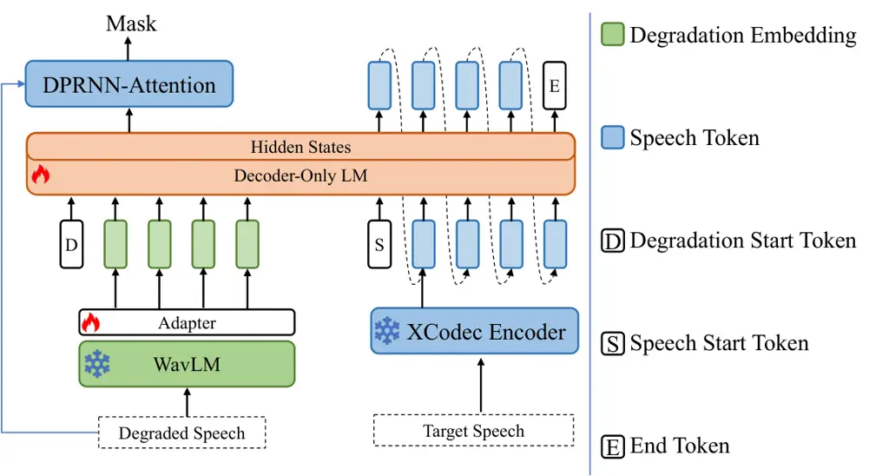

# A Hybrid Discriminative and Generative System for Universal Speech Enhancement

Yinghao Liu    Chengwei Liu    Xiaotao Liang    Haoyin Yan    Shaofei
Xue\sthanksCorresponding Author    Zheng Xue

###### Abstract

Universal speech enhancement aims at handling inputs with various speech
distortions and recording conditions. In this work, we propose a novel
hybrid architecture that synergizes the signal fidelity of
discriminative modeling with the reconstruction capabilities of
generative modeling. Our system utilizes the discriminative TF-GridNet
model with the Sampling-Frequency-Independent strategy to handle
variable sampling rates universally. In parallel, an autoregressive
model combined with spectral mapping modeling generates detail-rich
speech while effectively suppressing generative artifacts. Finally, A
fusion network learns adaptive weights of the two outputs under the
optimization of signal-level losses and the comprehensive Speech Quality
Assessment (SQA) loss. Our proposed system is evaluated in the ICASSP
2026 URGENT Challenge (Track 1) and ranks the third place.

###### Index Terms: 

Universal Speech Enhancement, Discriminative Modeling, Generative
Modeling

^(†)^(†)address: ¹Intelligent Connectivity, Alibaba Group  
²Tongyi AI Lab, Alibaba Group  
{liuyinghao.lyh, liuchengwei.lcw, xiaotao.lxt, yanhaoyin.yhy,
shaofei.xsf, jeremy.xz}@alibaba-inc.com

## 1 Introduction

Universal speech enhancement (USE) aims to recover degraded speech with
diverse distortions and recording conditions (e.g., varying sampling
rates) \[4\]. Recent advances have categorized solutions into
discriminative and generative approaches. Discriminative models, such as
TF-GridNet \[14\], excel at signal fidelity and noise suppression but
often struggle to reconstruct severely corrupted speech
components \[17\]. Conversely, generative models can reconstruct
high-quality speech but frequently suffer from hallucinations and
artifacts due to imperfect alignment between the learned generative
prior and the true underlying clean speech distribution. To address
these issues, we propose a hybrid network for USE, which integrates the
strengths of both paradigms. Specifically, we utilize the TF-GridNet to
produce high-fidelity, noise-suppressed estimates and employ an
autoregressive (AR) module with a spectral mapping \[15\] head to
generate detail-rich but low-hallucination speech. Finally, a fusion
network adaptively combines their outputs, yielding enhanced speech with
fine-grained details and reduced artifacts. The proposed system is
evaluated on the Track 1 (USE) of URGENT Challenge, obtaining promising
performance in terms of both intrusive and non-intrusive metrics.

## 2 Method

### 2.1 Discriminative Branch

We adopt TF-GridNet as the discriminative backbone to process complex
spectrograms via a grid of time-frequency blocks. To preserve spectral
integrity under varying input sampling rates, we apply the
Sampling-Frequency-Independent (SFI) \[20\] strategy: the Short-Time
Fourier Transform (STFT) window and hop durations are fixed, while the
number of frequency bins is adjusted according to the sampling rate.

### 2.2 Semantic-conditioned Refinement Branch

Inspired by \[17\], we utilize the powerful generation capability of AR
modeling to deal with complex distortions in USE, as illustrated in
Fig. 1. Specifically, we extract robust semantic and acoustic
representation from degraded speech using a pre-trained WavLM \[1\] with
a trainable linear adapter. This representation serves as conditional
prefix, leading the decoder-only language model (LM) to autoregressively
predict discrete tokens of the clean speech, which are extracted by the
pre-trained X-Codec \[18\]. We only utilize the tokens of the first RVQ
\[19\] layer, because they capture the most salient semantic and
perceptual information of speech, while higher-layer codes mainly refine
low-level details.

To circumvent the information bottleneck of discrete tokens, we adopt a
DPRNN \[5\] model to directly predict the clean speech spectrum by
fusing the semantic-rich representations from the last LM layer with the
acoustic-rich features derived from the degraded spectrum. Specifically,
we concatenate the magnitude, real, and imaginary components of the
degraded STFT spectrum as the DPRNN input, and apply several
convolutional blocks to downsample along the frequency dimension. Within
each dual-path block, the cross attention is applied after inter-frame
LSTM \[2\], where the representations from LM serve as key matrix and
value matrix, effectively integrating global semantic guidance with
local acoustic nuances. Finally, a convolutional decoder up-samples the
fused features to the original time-frequency resolution, estimating a
complex mask on degraded spectrum. This generative branch operates at 16
kHz, since most of the speech information is concentrated in low
frequencies.



Figure 1: Architecture of the proposed generative branch model.

### 2.3 Fusion Network

The final output is synthesized by a lightweight USES network \[20\]
that adaptively integrates both branches. After resampling the output
$`\hat{\mathbf{Y}}_{gen}`$ from semantic-conditioned refinement branch
to match the sampling rate of discriminative output
$`\hat{\mathbf{Y}}_{disc}`$, the network estimates a time-frequency
fusion mask $`\mathbf{M}_{fuse}`$ to compute the final spectrum as:

```math
\hat{\mathbf{Y}}_{final}=\mathbf{M}_{fuse}\odot\hat{\mathbf{Y}}_{disc}+(1-\mathbf{M}_{fuse})\odot\hat{\mathbf{Y}}_{gen}, \tag{1}
```

where $`\odot`$ denotes element-wise multiplication.

### 2.4 Loss Functions

For the discriminative branch, we employ the multi-resolution STFT Loss
\[16\]. The generative branch is optimized using the Negative
Log-Likelihood loss ($`\mathcal{L}_{NLL}`$) for token prediction and the
Regression loss ($`\mathcal{L}_{Reg}`$) for mask estimation.
$`\mathcal{L}_{Reg}`$ is defined as a weighted sum of the mean squared
errors on the complex and magnitude spectrum, together with a perceptual
loss \[6\]:

```math
\mathcal{L}_{Reg}=0.1\cdot\mathcal{L}_{complex}+0.9\cdot\mathcal{L}_{mag}+0.01\cdot\mathcal{L}_{PMSQE}. \tag{2}
```

Therefore, the loss of generative branch is formulated as

```math
\mathcal{L}_{gen}=\mathcal{L}_{NLL}+\mathcal{L}_{Reg}. \tag{3}
```

The fusion network is trained using multi-resolution STFT \[16\] and L1
losses with a perceptual loss:

```math
\mathcal{L}_{fusion}=\mathcal{L}_{MSTFT}+0.5\mathcal{L}_{L1}+\mathcal{L}_{SQA} \tag{4}
```

Here, $`\mathcal{L}_{\text{SQA}}`$ is a score-based loss derived from
the multi-metric quality assessment model \[13\]. We specifically select
five perceptual metrics for supervision including MOS, DNSMOS \[9\],
ScoreQ \[8\], UTMOS \[11\], and NISQA \[7\].

## 3 Experiments

### 3.1 Experimental Setup

We train our model on the data from Track 1 of the URGENT 2026
Challenge, excluding the pre-trained WavLM \[1\] and X-Codec \[18\]
modules. There are approximately 1.3 million clean speech utterances
across five languages, and the data simulation pipeline follows that
provided by the challenge. The TF-GridNet in discriminative branch
consists of 8 blocks with a embedding size of 64 and a LSTM hidden size
of 256. The window and hop durations are set to 20 ms and 10 ms,
respectively. There are 12 LLaMA \[12\] layers with the hidden dimension
set to 512. The window length and hop size in DPRNN are set to 640 and 320.

### 3.2 Results and Analysis

Table 1 summarizes the performance on the URGENT 2026 non-blind test
set. Discriminative (“Dis.”) branch excels in intrusive metrics but
offers lower perceptual quality, whereas the semantic-conditioned
refinement (“Gen.”) branch achieves high naturalness at the cost of
reduced signal fidelity. Our proposed hybrid method successfully
integrates these strengths. It maintains competitive fidelity (PESQ
\[10\] and ESTOI \[3\]) while significantly enhancing perceptual quality
(DNSMOS \[9\] and NISQA \[7\]) compared to the baseline. Notably, our
approach also achieves the best performance in speaker similarity
(SpkSim) and downstream speech recognition task (CAcc), proving the
efficacy of the hybrid architecture for USE.

| Method   | PESQ \[10\] $`\uparrow`$ | ESTOI \[3\] $`\uparrow`$ | DNSMOS \[9\] $`\uparrow`$ | NISQA \[7\] $`\uparrow`$ | SpkSim $`\uparrow`$ | CAcc (%) $`\uparrow`$ |
| -------- | ------------------------ | ------------------------ | ------------------------- | ------------------------ | ------------------- | --------------------- |
| Noisy    | 1.30                     | 0.62                     | 1.67                      | 1.44                     | 0.54                | 79.28                 |
| Baseline | 2.47                     | 0.82                     | 2.90                      | 2.98                     | 0.75                | 85.79                 |
| Dis.     | 2.65                     | 0.85                     | 2.92                      | 2.97                     | 0.76                | 86.37                 |
| Gen.     | 1.96                     | 0.74                     | 2.98                      | 3.43                     | 0.73                | 84.65                 |
| Hybrid   | 2.58                     | 0.83                     | 3.01                      | 3.26                     | 0.77                | 86.83                 |

Table 1: Results on the URGENT 2026 Non-Blind Test set.

## 4 Conclusion

In this work, we introduced a system submitted to the Track 1 in URGENT
2026 challenge, which combines discriminative precision with generative
richness and naturalness. Experimental results on the test set
demonstrate that our system is more competitive than the baseline.
However, the generative branch is limited to 16 kHz speech and suffers
from high inference latency. Future work will focus on full-band
processing and efficiency optimization for real-time deployment.

## References

- \[1\] S. Chen, C. Wang, Z. Chen, et al. (2022) WavLM: large-scale
  self-supervised pre-training for full stack speech processing. IEEE
  Journal of Selected Topics in Signal Processing 16 (6), pp. 1505–1518.
  External Links:
  [Document](https://dx.doi.org/10.1109/JSTSP.2022.3188113) Cited by:
  §2.2, §3.1.
- \[2\] S. Hochreiter and J. Schmidhuber (1997) Long short-term memory.
  Neural Computation 9 (8), pp. 1735–1780. Cited by: §2.2.
- \[3\] J. Jensen and C. H. Taal (2016) An algorithm for predicting the
  intelligibility of speech masked by modulated noise maskers. IEEE/ACM
  Trans. Audio, Speech, Lang. Process. 24 (11), pp. 2009–2022. Cited by:
  §3.2, Table 1.
- \[4\] C. Li, W. Wang, M. Sach, et al. (2026) ICASSP 2026 URGENT speech
  enhancement challenge. arXiv preprint arXiv:2601.13531. Cited by: §1.
- \[5\] Y. Luo, Z. Chen, and T. Yoshioka (2020) Dual-Path RNN: efficient
  long sequence modeling for time-domain single-channel speech
  separation. In IEEE Int. Conf. Acoust., Speech, Signal Process.
  (ICASSP), pp. 46–50. Cited by: §2.2.
- \[6\] J. M. Martin-Doñas, A. M. Gomez, J. A. Gonzalez, and A. M.
  Peinado (2018) A deep learning loss function based on the perceptual
  evaluation of the speech quality. IEEE Signal Process. Lett. 25 (11),
  pp. 1680–1684. Cited by: §2.4.
- \[7\] G. Mittag, B. Naderi, A. Chehadi, and S. Möller (2021) NISQA: a
  deep CNN-self-attention model for multidimensional speech quality
  prediction with crowdsourced datasets. In ISCA Interspeech,
  pp. 2127–2131. Cited by: §2.4, §3.2, Table 1.
- \[8\] A. Ragano, J. Skoglund, and A. Hines (2024) Speech quality
  assessment with contrastive regression. In Adv. Neural Inf. Process.
  Syst. (NeurIPS), Vol. 37, pp. 105702–105729. Cited by: §2.4.
- \[9\] C. K. A. Reddy, V. Gopal, and R. Cutler (2022) DNSMOS P.835: a
  non-intrusive perceptual objective speech quality metric to evaluate
  noise suppressors. In IEEE Int. Conf. Acoust., Speech, Signal Process.
  (ICASSP), pp. 886–890. Cited by: §2.4, §3.2, Table 1.
- \[10\] A. W. Rix, J. G. Beerends, M. P. Hollier, and A. P.
  Hekstra (2001) Perceptual evaluation of speech quality (PESQ)—a new
  method for speech quality assessment of telephone networks and codecs.
  In IEEE Int. Conf. Acoust., Speech, Signal Process. (ICASSP), Vol. 2,
  pp. 749–752. Cited by: §3.2, Table 1.
- \[11\] T. Saeki, D. Xin, W. Nakata, et al. (2022) UTokyo-SaruLab
  system for VoiceMOS challenge 2022. In ISCA Interspeech,
  pp. 4521–4525. Cited by: §2.4.
- \[12\] H. Touvron, T. Lavril, G. Izacard, et al. (2023) LLaMA: open
  and efficient foundation language models. arXiv preprint
  arXiv:2302.13971. Cited by: §3.1.
- \[13\] W. Wang, W. Zhang, C. Li, J. Shi, et al. (2025) Improving
  speech enhancement with multi-metric supervision from learned quality
  assessment. arXiv preprint arXiv:2506.12260. Cited by: §2.4.
- \[14\] Z.-Q. Wang, S. Cornell, S. Choi, et al. (2023) TF-GridNet:
  integrating full- and sub-band modeling for speech separation.
  IEEE/ACM Trans. Audio, Speech, Lang. Process. 31, pp. 3221–3236. Cited
  by: §1.
- \[15\] Z.-Q. Wang, P. Wang, and D. Wang (2020) Complex spectral
  mapping for single- and multi-channel speech enhancement and robust
  ASR. IEEE/ACM Trans. Audio, Speech, Lang. Process. 28, pp. 1778–1787.
  Cited by: §1.
- \[16\] R. Yamamoto, E. Song, and J.-M. Kim (2020) Parallel WaveGAN: a
  fast waveform generation model based on generative adversarial
  networks with multi-resolution spectrogram. In IEEE Int. Conf.
  Acoust., Speech, Signal Process. (ICASSP), pp. 6199–6203. Cited by:
  §2.4, §2.4.
- \[17\] H. Yang, G. Wichern, R. Aihara, et al. (2025) Investigating
  continuous autoregressive generative speech enhancement. In ISCA
  Interspeech, pp. 2360–2364. Cited by: §1, §2.2.
- \[18\] Z. Ye, P. Sun, J. Lei, et al. (2025) Codec does matter:
  exploring the semantic shortcoming of codec for audio language model.
  In Proceedings of the Thirty-Ninth AAAI Conference on Artificial
  Intelligence (AAAI), Cited by: §2.2, §3.1.
- \[19\] N. Zeghidour, A. Luebs, A. Omran, J. Skoglund, and M.
  Tagliasacchi (2022) SoundStream: an end-to-end neural audio codec.
  IEEE/ACM Trans. Audio, Speech, Lang. Process. 30, pp. 495–507. Cited
  by: §2.2.
- \[20\] W. Zhang, K. Saijo, Z.-Q. Wang, et al. (2023) Toward universal
  speech enhancement for diverse input conditions. In IEEE Workshop
  Auto. Speech Recog. & Understand. (ASRU), pp. 1–6. Cited by: §2.1,
  §2.3.
