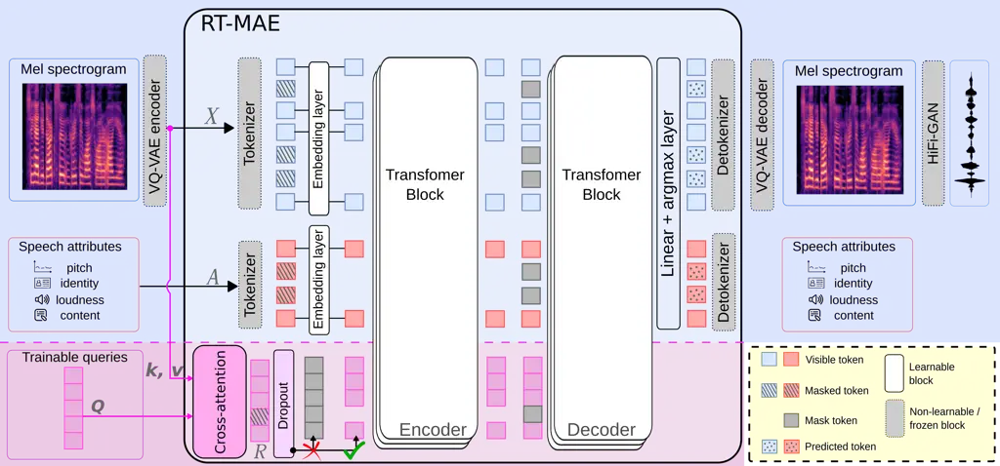

# Residual Tokens Enhance Masked Autoencoders for Speech Modeling

Samir Sadok^(⋆)    Stéphane Lathuilière^(⋆)    Xavier Alameda-Pineda^(⋆)

###### Abstract

Recent speech modeling relies on explicit attributes such as pitch,
content, and speaker identity, but these alone cannot capture the full
richness of natural speech. We introduce RT-MAE, a novel masked
autoencoder framework that augments the supervised attributes-based
modeling with unsupervised residual trainable tokens, designed to encode
the information not explained by explicit labeled factors (e.g., timbre
variations, noise, emotion etc). Experiments show that RT-MAE improves
reconstruction quality, preserving content and speaker similarity while
enhancing expressivity. We further demonstrate its applicability to
speech enhancement, removing noise at inference while maintaining
controllability and naturalness¹¹ 1 Code and audio examples are
available online:
[https://samsad35.github.io/site-residual](https://samsad35.github.io/site-residual).

###### Index Terms: 

Speech modeling, masked autoencoder, Speech
analysis/transformation/synthesis, speech enhancement.

^(†)^(†)address: ^(⋆)Inria at Univ. Grenoble Alpes, CNRS, LJK, France

## 1 Introduction

Extensive research has focused on modeling speech signals, ranging from
parametric models such as linear predictive coding (LPC) \[1\],
sinusoidal models \[2, 3\], and harmonic-pulse-noise models \[4\] and
the phase vocoder \[5\]. Vocoders such as STRAIGHT \[6\] and WORLD \[7\]
further enabled real-time speech manipulation by decomposing signals
into interpretable acoustic features (e.g., $`f_{0}`$, spectral
envelope, aperiodicity). More recently, deep learning has become the
dominant paradigm, with neural audio codecs compressing speech into
low-bitrate discrete units \[8, 9\], self-supervised encoders such as
HuBERT \[10\] capturing linguistic content for reconstruction when
combined with pitch and speaker identity \[11\] achieving high-quality
synthesis, or AnCoGen \[12\] that uses the masked modeling mechanism to
learn a bidirectional mapping between Mel-Spectrogram tokens and
high-level attributes (e.g., pitch, content, speaker identity, loudness,
etc), enabling both analysis (attributes from Mel-Spectrograms) and
generation (Mel-Spectrograms from attributes).

However, the speech signal is more complex than what explicit attributes
can represent. Factorizing only content, speaker identity, and prosody
misses much of the richness of natural speech. The _residual_—defined
here as the aspects of speech that cannot be described by the available
explicit attributes—encompasses speaking style, emotion, articulatory
nuances, micro-prosody, and non-verbal cues, yet it remains largely
unmodeled. Most recent methods \[12, 11, 13, 14\] rely solely on clearly
defined attributes (e.g., $`f_{0}`$, linguistic features, speaker
embeddings), while residual information is implicitly absorbed as a
dataset-specific bias, limiting generalization and control.

Early source-filter models \[1, 6, 7\] already pointed out the presence
of a _residual_ component, corresponding to the excitation signal. This
residual carries irregularities such as jitter, shimmer, or aperiodicity
that cannot be fully explained by the pitch or timbre. In addition, it
also conveys subtle expressive information that enriches speech beyond
explicit attributes. Later research investigated this residual more
systematically: disentanglement-based models separate content, prosody,
and speaker identity, while the remaining variability is interpreted as
residual factors. Examples include factorized VAEs (FHVAE \[15\]),
adversarially regularized models \[16\], hierarchical VAE-based prosody
models \[17\], Global Style Tokens (GST)\[18\], and voice conversion
frameworks like AutoVC \[19\] and StarGAN-VC2 \[20\]. These latent
representations capture rhythm, energy, emotion, and other expressive
cues, complementing explicit attributes to improve naturalness. However,
most of these approaches rely on complex disentanglement objectives and
multiple task-specific losses, which make the resulting models
computationally demanding, less generalizable, and often restricted to
narrow applications such as voice conversion or style transfer.

To address these limitations, we propose RT-MAE, a residual-token masked
autoencoder for speech modeling that explicitly captures residual
information while leveraging recent advances in speech representation
learning \[11, 12, 13, 14\]. In RT-MAE, residual information is
represented as continuous tokens directly integrated in an MAE \[21\],
following the design of \[12\], which supports speech analysis, control,
and generation. Unlike prior disentanglement-based approaches, this
design provides a flexible representation of residual information. Our
main contributions are: (1) we introduce residual tokens to explicitly
encode the _rest_ of speech information not captured by attributes
(e.g., timbre variations, emotion, micro-prosody); (2) we propose a
regularization mechanism to control the information flow in these
tokens, ensuring a balanced trade-off between reconstruction quality and
attributes controllability; and (3) we show that these residual tokens
enable various manipulation tasks, and in this work, we focus on noise
modeling, where noise can be captured and then deactivated at inference
to achieve speech denoising.

Figure 1: Overview of the proposed RT-MAE architecture. The top (blue)
illustrates the current paradigm, where speech and explicit attributes
are jointly modeled using an MAE. The bottom (purple) illustrates the
introduction of trainable queries, which through cross-attention,
capture residual factors not captured by the explicit attributes.

## 2 The proposed approach: RT-MAE

In this section, we present the methodology of our approach. We begin by
introducing the notation and providing intuition on why explicit
attributes alone are insufficient to fully model speech (2.1). We then
describe how we construct residual tokens using a cross-attention
mechanism inspired by the Perceiver architecture (2.2), allowing us to
encode complementary information in a compact and trainable form.
Finally, we explain how we control the flow of information in these
residual tokens through a dropout-based regularization strategy (2.3),
which prevents redundancy, encourages the effective use of explicit
attributes, and ensures that speech generation remains interpretable and
controllable.

### 2.1 Background and Intuition

Let $`\mathbf{X}\in\mathbb{R}^{T\times F}`$ denote the Mel-Spectrogram
of a speech utterance with $`T`$ frames and $`F`$ frequency bins, and
let $`\mathbf{A}={A_{1},\dots,A_{K}}`$ represent explicit speech
attributes such as pitch, linguistic content, speaker embedding, or
loudness. Generating $`\mathbf{X}`$ from $`\mathbf{A}`$ alone provides
interpretable control but cannot capture all aspects of natural speech:
with a finite set of attributes, many subtle phenomena remain unmodeled.
Fully explaining speech would require an impractically large (or even
unbounded) set of attributes. To address this, we introduce $`N`$
continuous residual tokens $`\mathbf{R}\in\mathbb{R}^{N\times d}`$ that
encode information not captured by $`\mathbf{A}`$, where $`d`$ denotes
their dimensionality. The model reconstructs speech from both
$`\mathbf{A}`$ and $`\mathbf{R}`$, separating structured control from
residual variability and enabling both controllability and flexibility
beyond attribute-only models. How can these tokens $`\mathbf{R}`$ be
estimated to effectively complement the explicit attributes?

Figure 1 illustrates the overall RT-MAE architecture, which builds upon
the AnCoGen framework \[12\] using an MAE architecture. In our approach,
the Mel-Spectrogram $`\mathbf{X}`$ and attributes $`\mathbf{A}`$ are
quantized into discrete tokens, while the residual tokens $`\mathbf{R}`$
remain continuous. Following the MAE framework, all three modalities are
partially masked during training, encouraging the model to learn intra-
and inter-dependencies. Visible discrete tokens are embedded into
continuous vectors via trainable codebooks. The three types of
embeddings are concatenated into a single sequence, which is then
processed by the Transformer encoder. After encoding, mask tokens are
inserted to complete the sequence before decoding. At inference, masking
is task-dependent: for analysis, attributes are predicted from an input
Mel-Spectrogram, while for generation, the Mel-Spectrogram is
reconstructed from attributes and the residual tokens, with the final
waveform synthesized using a HiFi-GAN vocoder \[22\]. The autoencoder is
trained by minimizing the cross-entropy loss between predicted and
ground-truth tokens.

A central question is how to integrate the residual $`\mathbf{R}`$ in
the MAE architecture, addressing both its architectural role in
complementing discrete tokens (Section 2.2) and the training strategy to
regulate information flow (Section 2.3).

### 2.2 Extracting the residual tokens via cross-attention

Our goal is to learn residual tokens that encode the residual
information of the Mel-Spectrogram. A natural choice for this is an
attention-based mechanism, which can selectively aggregate information
across time and frequency. However, standard self-attention requires a
token for every Mel frame, which significantly increases computational
cost. Moreover, we want to control the number of trainable tokens that
encode the residual, effectively acting as a compression bottleneck.

Inspired by the Perceiver architecture \[23\], we address these
challenges by introducing a fixed-size set of learnable queries
$`\mathbf{Q}`$ that interact with the input through _cross-attention_.
Each vector queries the entire Mel-Spectrogram, attends to the most
relevant information, and aggregates it into a compact representation.
This mechanism allows the model to selectively encode residual factors
without needing a one-to-one mapping between residual and input tokens.
After cross-attention, the token vectors are further refined through the
Transformer encoder as represented in Figure 1.

Formally, the learnable queries $`\mathbf{Q}`$ attend to the input
embedding $`\mathbf{X}`$, which provides keys ($`\mathbf{K}`$) and
values ($`\mathbf{V}`$). Attention weights are computed by measuring the
similarity (typically via dot product) between each query and all input
keys:
$`\mathbf{M}\leftarrow\text{softmax}\!\left(\frac{\mathbf{Q}\mathbf{K}^{\top}}{\sqrt{d}}\right)`$,
then used to form a weighted sum over values, producing the residual
tokens $`\mathbf{R}\leftarrow\mathbf{M}^{T}\mathbf{V}`$. Each token can
thus focus on different aspects of the input, compressing the
Mel-Spectrogram into a compact space.

Incorporating these residual tokens into the MAE paradigm \[12\] enables
the model to complement explicit attributes with residual information
(as shown in Figure 1). The residual space thus acts as a bottleneck,
organizing the remaining degrees of freedom in the speech signal and
facilitating the generation of richer, more natural, and controllable
speech outputs.

### 2.3 Regularization strategy

|                |                   |                         |                    |                  |                  |                   |                    |                   |                  |     |
| -------------- | ----------------- | ----------------------- | ------------------ | ---------------- | ---------------- | ----------------- | ------------------ | ----------------- | ---------------- | --- |
|                |                   | LibriSpeech Test \[24\] |                    |                  |                  | EmoV-DB \[25\]    |                    |                   |                  |     |
|                | \# Parameters (M) | STOI $`\uparrow`$       | N-MOS $`\uparrow`$ | SBS $`\uparrow`$ | COS $`\uparrow`$ | STOI $`\uparrow`$ | N-MOS $`\uparrow`$ | Acc. $`\uparrow`$ | COS $`\uparrow`$ |     |
| GT MS          | -                 | 0.93                    | 4.44               | -                | 0.96             | 0.93              | 4.40               | 99.30             | 0.94             |     |
| AnCoGen \[12\] | 27.7              | 0.77                    | 4.04               | 0.83             | 0.81             | 0.70              | 4.23               | 96.79             | 0.80             |     |
| RT-MAE (Ours)  | 28.9              | 0.82                    | 4.32               | 0.86             | 0.92             | 0.76              | 4.31               | 98.65             | 0.88             |     |

Table 1: Speech analysis and synthesis results on LibriSpeech and
EmoV-DB test sets. GT MS refers to the ground-truth Mel-Spectrogram,
which is converted to waveform using the HiFi-GAN vocoder (without
passing through the model).

Without regularization, the residual tokens could encode all the
information needed to reconstruct the Mel-Spectrogram—essentially
reducing the model to a simple encoder-decoder with very limited
structuring and generalization capabilities. In this case, the model
might rely primarily on the residual tokens, which do not use the
attributes, limiting controllability and compromising interpretability
in speech generation.

To address this issue, we introduce a dropout-based regularization
mechanism applied to the residual tokens. During training, we draw a
value uniformly from $`[0,1]`$ and compare it to a fixed threshold
$`\tau\in[0,1]`$. If the sampled value is below $`\tau`$, the residual
tokens are dropped, i.e., they are not provided to the transformer,
forcing the model to generate the Mel-Spectrogram solely from the
explicit attributes. Otherwise, the residual tokens are concatenated
with the attributes. Note that, differently from regular dropout \[26\]
the entire vector is dropped and not only single neurons. This strategy
prevents the model from over-relying on the residual tokens, encourages
effective utilization of the provided attributes, and ensures that the
generated speech remains both interpretable and controllable.

## 3 Experiments

### 3.1 Experimental setup

Settings    To ensure a fair comparison, we follow the training protocol
of AnCoGen and train our model using the LibriSpeech 360 Clean dataset
\[24\]. The training data was preprocessed to extract four types of
attributes: Pitch (using CREPE \[27\]), Loudness using the
root-mean-square energy (RMSE), speaker identity embeddings obtained
from a pretrained speaker encoder \[28\], and content represented by
phonetic posteriorgrams (PPGs \[29\]) derived from a forced-alignment
model. The model was trained using 4 NVIDIA A100 GPUs, with a batch size
of 128 and the AdamW optimizer, for a total of 400 epochs.

Architecture    The architecture of RT-MAE used in this work builds upon
the original AnCoGen model \[12\]. Both the encoder and decoder consist
of 6 Transformer layers, each comprising multi-head self-attention
mechanisms, position-wise feedforward networks, and layer normalization.
We introduce $`N=25`$ trainable vectors, each having the same
dimensionality as the internal representations used in the Transformer
($`d=512`$). These vectors interact with the Mel-Spectrogram via
cross-attention (see Section 2.2), allowing the model to capture
complementary information beyond the conditioning attributes. Unless
otherwise specified, the dropout threshold controlling the use of
residual tokens are fixed at $`\tau=0.5`$.

Metrics    To evaluate the quality and intelligibility of the generated
speech, we rely on a combination of objective and perceptual metrics.
STOI (Short-Time Objective Intelligibility) \[30\] measures speech
intelligibility, with higher values indicating better performance. N-MOS
(Neural Mean Opinion Score) non-intrusive estimate of speech naturalness
(1–5) using pretrained models such as SQUIM \[31\]. speechBertScore
(SBS) \[32\] is computed by passing the generated speech through an ASR
system, with higher scores indicating better intelligibility and
linguistic accuracy. Finally, COS (Cosine Similarity on speaker
embeddings) \[33\] measures the similarity between speaker embeddings of
the generated and reference speech, providing an estimate of speaker
consistency.

### 3.2 Results and discussion

Improving speech synthesis through the residual tokens    Table 1
presents the synthesis results, comparing the original model relying
solely on explicit attributes \[12\] with our version augmented by the
residual tokens. In this experiment, each speech signal is first
analyzed to extract its attributes, and then reconstructed either using
only these attributes (as in \[12\]) or with the additional information
provided by the residual tokens. The results in Table 1 highlight the
benefits of introducing the residual tokens in our framework. On the
Librispeech test set, RT-MAE consistently improves AnCoGen. STOI
increases by +0.05, indicating better intelligibility, while N-MOS also
improves by +0.28, showing gains in perceptual quality. Furthermore,
SpeechBertScore rises by +0.03, and speaker similarity achieves a
notable gain of +0.09, confirming a more faithful preservation of
linguistic and speaker information. On Emov-DV \[25\], which is more
challenging due to its expressive and emotional content, RT-MAE also
outperforms AnCoGen across all metrics. STOI improves from 0.7 to 0.76,
and N-MOS increases from 4.18 to 4.31, reflecting both high
intelligibility and quality emotional speech. More importantly, emotion
classification accuracy (96.79$`\rightarrow`$98.65) and cosine
similarity (0.70$`\rightarrow`$0.88) show that our model preserves
emotional cues and speaker identity more effectively. This raises a key
question: what do the residual tokens actually encode? Does it capture
complementary information beyond the explicit attributes, or is it
redundant with them and potentially conflicting? We address this
question in the following.

| Attributes ($`\mathbf{A}`$) | Residual tokens ($`\mathbf{R}`$) | STOI $`\uparrow`$ | N-MOS $`\uparrow`$ | SBS $`\uparrow`$ | COS $`\uparrow`$ |
| --------------------------- | -------------------------------- | ----------------- | ------------------ | ---------------- | ---------------- |
| ✗                           | ✗                                | 0.27              | 2.32               | 0.44             | 0.50             |
| ✓                           | ✗                                | 0.76              | 4.03               | 0.83             | 0.81             |
| ✗                           | ✓                                | 0.50              | 3.04               | 0.56             | 0.72             |
| ✓                           | ✓                                | 0.82              | 4.32               | 0.86             | 0.92             |

Table 2: Speech analysis and synthesis (ablation study): Uncovering the
information encoded in the residual tokens. Results are reported at
inference. A cross (✗) indicates that the component is masked, whereas a
check (✓) indicates it is not masked.

Analyzing the complementarity between residual tokens and attributes   
Since RT-MAE uses a Transformer-based masked modeling approach to
predict masked tokens, we can vary the masking rate to selectively
disable explicit attributes and/or the residual tokens. This setup
enables us to investigate the role of the residual tokens in speech
synthesis, specifically how it complements or compensates for missing
attribute information. Table 2 presents the synthesis results under
different masking configurations, where attributes and/or the residual
tokens are entirely removed. When audio synthesis is performed without
the additional tokens at inference (second row), the architecture
reduces to AnCoGen (second row in Table 1), differing only in the
training procedure, as our model is trained with the residual tokens.
The table shows that the results closely match those of AnCoGen \[12\],
confirming that our model effectively leverages the attributes for
synthesis. In contrast, the third row (where attributes are removed and
only the residual tokens are used) shows a substantial drop in both
content and quality, as expected. Nevertheless, the residual tokens
still achieves a relatively high speaker similarity score, suggesting
that it encodes meaningful identity information. Finally, the last row,
which combines both attributes and the residual tokens during synthesis
(RT-MAE), leads to consistent improvements across all similarity
metrics. This highlights the role of the $`\mathbf{R}`$ as a residual
component that complements the attributes and further enhances synthesis
quality.

Figure 2: Effect of the dropout threshold $`\tau`$ on synthesis quality.
In blue ( ), only the attributes are used ($`\mathbf{R}`$ is masked). In
orange ( ), both attributes and residual tokens are used.

Adjusting the information flow through residual tokens    This paragraph
examines how the dropout threshold ($`\tau`$) shapes the balance between
attributes and the residual tokens. We train models with $`\tau`$
ranging from 0 (residual tokens always available) to 1 (residual tokens
completely disabled). As shown in Figure 2, with $`\tau=0`$ the model
relies almost entirely on the residual tokens, ignoring attributes and
losing controllability. As $`\tau`$ increases (starting around 0.5), the
model begins to effectively integrate both the attributes and the
residual tokens, resulting in improved content preservation, speaker
similarity, and overall synthesis quality. For high values
($`\tau>0.8`$), the residual tokens are largely disregarded, and
synthesis depends almost solely on attributes.

Preserved Controllability    In this paragraph, we report pitch
manipulation experiments showing that the introduction of residual
tokens preserves the controllability capacity of AnCoGen. Table 3
reports pitch manipulation results on the PTDB dataset \[34\] with
ground-truth pitch values. We compare our method without and with the
residual tokens for target shifts of 0%, 10%, and 20%. Evaluation is
based on Absolute Average Error (AAE, lower is better), naturalness
(N-MOS), and SpeechBertScore (SBS). Results show that AAE remains
essentially unchanged, confirming that pitch control accuracy is
preserved, while the inclusion of the residual tokens consistently
improves N-MOS and SBS across all target shifts. This demonstrates that
adding the residual token enhances perceptual quality and semantic
consistency, while maintaining precise and controllable pitch
manipulation.

Encoding noise through an additional residual token    Previously, we
showed that the residue captures information beyond explicit attributes.
We now extend this idea where the noise is treated as a specific form of
residual information. To this end, we introduce an additional residual
vector, $`\mathbf{R}_{\text{noise}}`$, dedicated to modeling noise.
Assuming annotations indicating the presence of noise, this residue is
activated only when the input contains noise, while the previous residue
$`\mathbf{R}`$ continues to capture residual speech-related information.
To enforce disentanglement \[35\], we minimize the mutual information
between the two residues ($`\mathbf{R}`$ and
$`\mathbf{R}_{\text{noise}}`$) using the CLUB estimator \[36\], ensuring
that each encodes complementary information. For evaluation, we use
LibriMix \[37\], which combines clean LibriSpeech utterances \[24\] with
WHAM! noise signals \[38\]. At inference time for noise reduction,
speech attributes are extracted as usual, but the
$`\mathbf{R}_{\text{noise}}`$ is deactivated during synthesis,
effectively removing noise while preserving the residual speech
characteristics via $`\mathbf{R}`$. Additionally, we report DNSMOS
\[39\], which provides objective estimates of the speech signal quality
(SIG), background noise intrusiveness (BAK), and overall quality (OVRL).
Table 4 reports speech denoising results on the LibriMix test set.
RT-MAE consistently improves objective metrics compared to the original
AnCoGen. In particular, it achieves the highest N-MOS (4.25) and SIG
(4.23) scores, while maintaining strong BAK (4.29) and OVRL (3.80)
performance, confirming improved perceptual quality and robustness to
noise. The COS score increases from 0.73 to 0.86, significantly
narrowing the gap with task-specific models like Conv-TasNet.

|                | +0 %               |                    |                  | +10 %              |                    |                  | +20 %              |                    |                  |
| -------------- | ------------------ | ------------------ | ---------------- | ------------------ | ------------------ | ---------------- | ------------------ | ------------------ | ---------------- |
| $`\mathbf{R}`$ | AAE $`\downarrow`$ | N-MOS $`\uparrow`$ | SBS $`\uparrow`$ | AAE $`\downarrow`$ | N-MOS $`\uparrow`$ | SBS $`\uparrow`$ | AAE $`\downarrow`$ | N-MOS $`\uparrow`$ | SBS $`\uparrow`$ |
| ✗              | 4.8                | 4.08               | 0.83             | 5.7                | 4.10               | 0.82             | 5.9                | 4.07               | 0.80             |
| ✓              | 4.8                | 4.33               | 0.86             | 5.7                | 4.30               | 0.86             | 5.9                | 4.20               | 0.84             |

Table 3: Pitch manipulation results on the PTDB dataset \[34\].

|                    |                    |                  |                  |                   |                  |     |
| ------------------ | ------------------ | ---------------- | ---------------- | ----------------- | ---------------- | --- |
|                    | N-MOS $`\uparrow`$ | SIG $`\uparrow`$ | BAK $`\uparrow`$ | OVRL $`\uparrow`$ | COS $`\uparrow`$ |     |
| Noisy              | 2.62               | 3.97             | 2.52             | 2.97              | -                |     |
| DCCRNet \[40\]     | 4.15               | 4.08             | 4.26             | 3.73              | 0.89             |     |
| Conv-TasNet \[41\] | 4.12               | 4.18             | 4.30             | 3.78              | 0.91             |     |
| AnCoGen \[12\]     | 4.24               | 4.21             | 4.32             | 3.81              | 0.73             |     |
| RT-MAE (Ours)      | 4.25               | 4.23             | 4.29             | 3.80              | 0.86             |     |

Table 4: Speech denoising results on LibriMix Test (best score in each
column is in bold, second best score is underlined).

## 4 Conclusion

In this work, we introduced RT-MAE, a residual-token masked autoencoder
for speech modeling. By capturing information not represented by
explicit attributes, the residual tokens improve reconstruction and
enhance robustness to noise. We further regularize these tokens to
control information flow, ensuring a balanced contribution with
structured attributes. This design supports practical applications such
as speech enhancement. As future work, a particularly promising
application is the use of residual tokens in expressive text-to-speech
to capture subtle prosodic and emotional cues for more natural
synthesis, while the framework also enables fine-grained voice
conversion and style transfer by controlling residual factors alongside
explicit attributes.

Acknowledgments: This work was performed using HPC resources from
GENCI–IDRIS (Grant 2025-A0181016041).

## References

- \[1\] J. D. Markel and A. J. Gray (1976) Linear prediction of speech.
  Springer-Verlag, New York. Cited by: §1, §1.
- \[2\] R. McAulay and T. Quatieri (1986) Speech analysis/synthesis
  based on a sinusoidal representation. IEEE Trans. Audio, Speech, Lang.
  Proc.. Cited by: §1.
- \[3\] E. B. George and M. J. Smith (1997) Speech analysis/synthesis
  and modification using an analysis-by-synthesis/overlap-add sinusoidal
  model. IEEE Trans. Audio, Speech, Lang. Proc.. Cited by: §1.
- \[4\] E. Moulines and F. Charpentier (1990) Pitch-synchronous waveform
  processing techniques for text-to-speech synthesis using diphones.
  Speech Com.. Cited by: §1.
- \[5\] J. Laroche, Y. Stylianou, and E. Moulines (1993) HNS: speech
  modification based on a harmonic + noise model. In ICASSP, Cited by:
  §1.
- \[6\] H. Kawahara (2006) STRAIGHT, exploitation of the other aspect of
  VOCODER: perceptually isomorphic decomposition of speech sounds.
  Acoust. Science Technol. 27 (6), pp. 349–353. Cited by: §1, §1.
- \[7\] M. Morise, F. Yokomori, and K. Ozawa (2016) WORLD: a
  vocoder-based high-quality speech synthesis system for real-time
  applications. IEICE Trans. Inform. Systems. Cited by: §1, §1.
- \[8\] N. Zeghidour, A. Luebs, A. Omran, J. Skoglund, and M.
  Tagliasacchi (2021) Soundstream: an end-to-end neural audio codec.
  IEEE/ACM Trans. Audio, Speech, Lang. Proc. 30. Cited by: §1.
- \[9\] A. Défossez, J. Copet, G. Synnaeve, and Y. Adi (2023) High
  fidelity neural audio compression. Trans. Mach. Learn. Res.. Cited by:
  §1.
- \[10\] W. Hsu, B. Bolte, Y. H. Tsai, K. Lakhotia, R. Salakhutdinov,
  and A. Mohamed (2021) HuBERT: self-supervised speech representation
  learning by masked prediction of hidden units. IEEE/ACM Trans. Audio,
  Speech, Lang. Proc.. Cited by: §1.
- \[11\] A. Polyak, Y. Adi, J. Copet, E. Kharitonov, K. Lakhotia, W.
  Hsu, A. Mohamed, and E. Dupoux (2021) Speech resynthesis from discrete
  disentangled self-supervised representations. arXiv:2104.00355. Cited
  by: §1, §1, §1.
- \[12\] S. Sadok, S. Leglaive, L. Girin, G. Richard, and X.
  Alameda-Pineda (2025) AnCoGen: analysis, control and generation of
  speech with a masked autoencoder. In ICASSP, Cited by: §1, §1, §1,
  §2.1, §2.2, Table 1, §3.1, §3.2, §3.2, Table 4.
- \[13\] T. A. Nguyen, B. Muller, B. Yu, M. R. Costa-Jussa, M.
  Elbayad, S. Popuri, C. Ropers, P. Duquenne, R. Algayres, R. Mavlyutov,
  et al. (2025) Spirit-lm: interleaved spoken and written language
  model. Transactions of the Association for Computational Linguistics.
  Cited by: §1, §1.
- \[14\] W. Tan, J. Lian, H. Inaguma, P. Tomasello, P. Koehn, and X.
  Ma (2025) Seeing is believing: emotion-aware audio-visual language
  modeling for expressive speech generation. arXiv preprint
  arXiv:2508.16188. Cited by: §1, §1.
- \[15\] W. Hsu, Y. Zhang, and J. Glass (2017) Unsupervised learning of
  disentangled and interpretable representations from sequential data.
  NeurIPS 30. Cited by: §1.
- \[16\] W. Hsu, Y. Zhang, R. J. Weiss, Y. Chung, Y. Wang, Y. Wu, and J.
  Glass (2019) Disentangling correlated speaker and noise for speech
  synthesis via data augmentation and adversarial factorization. In
  ICASSP, Cited by: §1.
- \[17\] W. Hsu, Y. Zhang, R. J. Weiss, H. Zen, Y. Wu, Y. Wang, Y.
  Cao, Y. Jia, Z. Chen, J. Shen, et al. (2018) Hierarchical generative
  modeling for controllable speech synthesis. arXiv preprint
  arXiv:1810.07217. Cited by: §1.
- \[18\] Y. Wang, D. Stanton, Y. Zhang, R. Ryan, E. Battenberg, J.
  Shor, Y. Xiao, Y. Jia, F. Ren, and R. A. Saurous (2018) Style tokens:
  unsupervised style modeling, control and transfer in end-to-end speech
  synthesis. In ICML, Cited by: §1.
- \[19\] K. Qian, Y. Zhang, S. Chang, X. Yang, and M.
  Hasegawa-Johnson (2019) Autovc: zero-shot voice style transfer with
  only autoencoder loss. In ICML, Cited by: §1.
- \[20\] T. Kaneko, H. Kameoka, K. Tanaka, and N. Hojo (2019)
  Stargan-vc2: rethinking conditional methods for stargan-based voice
  conversion. arXiv preprint arXiv:1907.12279. Cited by: §1.
- \[21\] K. He, X. Chen, S. Xie, Y. Li, P. Dollár, and R.
  Girshick (2022) Masked autoencoders are scalable vision learners. In
  CVPR, Cited by: §1.
- \[22\] J. Kong, J. Kim, and J. Bae (2020) Hifi-GAN: generative
  adversarial networks for efficient and high fidelity speech synthesis.
  In NeurIPS, Cited by: §2.1.
- \[23\] A. Jaegle, S. Borgeaud, J. Alayrac, C. Doersch, C. Ionescu, D.
  Ding, S. Koppula, D. Zoran, A. Brock, E. Shelhamer, et al. (2021)
  Perceiver io: a general architecture for structured inputs & outputs.
  arXiv preprint arXiv:2107.14795. Cited by: §2.2.
- \[24\] V. Panayotov, G. Chen, D. Povey, and S. Khudanpur (2015)
  Librispeech: an asr corpus based on public domain audio books. In
  ICASSP, Cited by: Table 1, §3.1, §3.2.
- \[25\] A. Adigwe, N. Tits, K. E. Haddad, S. Ostadabbas, and T.
  Dutoit (2018) The emotional voices database: towards controlling the
  emotion dimension in voice generation systems. arXiv preprint
  arXiv:1806.09514. Cited by: Table 1, §3.2.
- \[26\] N. Srivastava, G. Hinton, A. Krizhevsky, I. Sutskever, and R.
  Salakhutdinov (2014) Dropout: a simple way to prevent neural networks
  from overfitting. The journal of machine learning research. Cited by:
  §2.3.
- \[27\] J. W. Kim, J. Salamon, P. Li, and J. P. Bello (2018) CREPE: a
  convolutional representation for pitch estimation. In ICASSP, Cited
  by: §3.1.
- \[28\] B. Desplanques, J. Thienpondt, and K. Demuynck (2020)
  Ecapa-TDNN: emphasized channel attention, propagation and aggregation
  in TDNN based speaker verification. arXiv preprint arXiv:2005.07143.
  Cited by: §3.1.
- \[29\] C. Churchwell, M. Morrison, and B. Pardo (2024) High-fidelity
  neural phonetic posteriorgrams. In ICASSPW, Cited by: §3.1.
- \[30\] C. H. Taal, R. C. Hendriks, R. Heusdens, and J. Jensen (2010) A
  short-time objective intelligibility measure for time-frequency
  weighted noisy speech. In ICASSP, Cited by: §3.1.
- \[31\] A. Kumar, K. Tan, Z. Ni, P. Manocha, X. Zhang, E. Henderson,
  and B. Xu (2023) Torchaudio-Squim: reference-less speech quality and
  intelligibility measures in Torchaudio. In ICASSP, Cited by: §3.1.
- \[32\] T. Saeki, S. Maiti, S. Takamichi, S. Watanabe, and H.
  Saruwatari (2024) SpeechBERTScore: reference-aware automatic
  evaluation of speech generation leveraging nlp evaluation metrics.
  arXiv preprint arXiv:2401.16812. Cited by: §3.1.
- \[33\] L. Wan, Q. Wang, A. Papir, and I. L. Moreno (2018) Generalized
  end-to-end loss for speaker verification. In ICASSP, Cited by: §3.1.
- \[34\] G. Pirker, M. Wohlmayr, S. Petrik, and F. Pernkopf (2011) A
  pitch tracking corpus with evaluation on multipitch tracking scenario.
  In INTERSPEECH, Cited by: §3.2, Table 3, Table 3.
- \[35\] D. Wang, L. Deng, Y. T. Yeung, X. Chen, X. Liu, and H.
  Meng (2021) VQMIVC: Vector Quantization and Mutual Information-Based
  Unsupervised Speech Representation Disentanglement for One-Shot Voice
  Conversion. In INTERSPEECH, Cited by: §3.2.
- \[36\] P. Cheng, W. Hao, S. Dai, J. Liu, Z. Gan, and L. Carin (2020)
  Club: a contrastive log-ratio upper bound of mutual information. In
  ICML, Cited by: §3.2.
- \[37\] J. Cosentino, M. Pariente, S. Cornell, A. Deleforge, and E.
  Vincent (2020) Librimix: an open-source dataset for generalizable
  speech separation. arXiv preprint arXiv:2005.11262. Cited by: §3.2.
- \[38\] G. Wichern, J. Antognini, M. Flynn, L. R. Zhu, E. McQuinn, D.
  Crow, E. Manilow, and J. Le Roux (2019) WHAM!: extending speech
  separation to noisy environments. In Interspeech, Cited by: §3.2.
- \[39\] C. Reddy, V. Gopal, and R. Cutler (2022) DNSMOS P.835: a
  non-intrusive perceptual objective speech quality metric to evaluate
  noise suppressors. In ICASSP, Cited by: §3.2.
- \[40\] Y. Hu, Y. Liu, S. Lv, M. Xing, S. Zhang, Y. Fu, J. Wu, B.
  Zhang, and L. Xie (2020) DCCRN: deep complex convolution recurrent
  network for phase-aware speech enhancement. arXiv:2008.00264. Cited
  by: Table 4.
- \[41\] Y. Luo and N. Mesgarani (2019) Conv-tasnet: surpassing ideal
  time–frequency magnitude masking for speech separation. IEEE/ACM
  Trans. Audio, Speech, Lang. Proc.. Cited by: Table 4.
