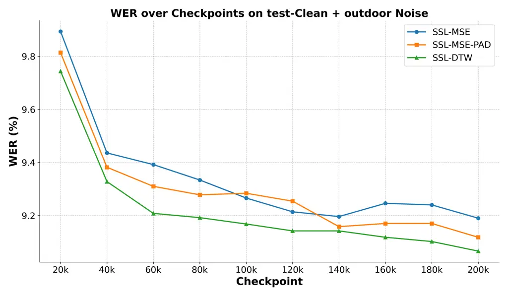

# Position-Invariant Fine-Tuning of Speech Enhancement Models with Self-Supervised Speech Representations

Amit Meghanani    Thomas Hain ^(†)^(†)thanks: © 2026 IEEE. Personal use
of this material is permitted. Permission from IEEE must be obtained for
all other uses, in any current or future media, including
reprinting/republishing this material for advertising or promotional
purposes, creating new collective works, for resale or redistribution to
servers or lists, or reuse of any copyrighted component of this work in
other works.

###### Abstract

Integrating front-end speech enhancement (SE) models with
self-supervised learning (SSL)-based speech models is effective for
downstream tasks in noisy conditions. SE models are commonly fine-tuned
using SSL representations with mean squared error (MSE) loss between
enhanced and clean speech. However, MSE is prone to exploiting
positional embeddings in SSL models, allowing the objective to be
minimised through positional correlations instead of content-related
information. This work frames the problem as a general limitation of
self-supervised representation fine-tuning and investigates it through
representation-guided SE. Two strategies are considered: (1)
zero-padding, previously explored in SSL pre-training but here examined
in the fine-tuning setting, and (2) speed perturbations with a soft-DTW
loss. Experiments show that the soft-DTW-based approach achieves faster
convergence and improved downstream performance, underscoring the
importance of position-invariant fine-tuning in SSL-based speech
modelling.

###### Index Terms: 

self-supervised learning, speech enhancement, positional embeddings,
position-invariant fine-tuning, speech recognition

^(†)^(†)address: Speech and Hearing Research Group  
School of Computer Science, The University of Sheffield, United
Kingdom  
{ameghanani1,t.hain}@sheffield.ac.uk

## 1 Introduction

Recent advances in deep learning have substantially transformed speech
processing technologies, with self-supervised learning (SSL) emerging as
a powerful framework for learning from unlabelled data. SSL-based speech
models such as wav2vec 2.0 \[2\], HuBERT \[13\], and WavLM \[8\] have
demonstrated impressive performance across a variety of downstream tasks
including automatic speech recognition (ASR), phoneme recognition (PR),
speaker identification (SID), emotion recognition (ER), and learning
discriminative acoustic word embeddings (AWE) \[13, 8, 20, 23, 16, 17\].
These models are pre-trained on large amounts of unlabelled speech and
can then be fine-tuned on task-specific labelled datasets, substantially
reducing the reliance on expensive annotated data \[20\]. Despite their
success, SSL models face challenges in noisy environments. Several
approaches have been proposed to improve noise robustness through
self-supervised fine-tuning \[4\]. For example, R-SPIN \[6\] (robust
speaker-invariant clustering) enhances robustness by learning discrete
acoustic units with speaker-invariant clustering, making the resulting
representations both speaker- and noise-invariant. Another recent work,
deHuBERT \[21\], introduced noise-agnostic representations derived from
HuBERT using noise augmentation and a Barlow Twins-based loss \[29\].
WavLM incorporated a denoising task directly into pre-training. Further,
\[7\] demonstrated that integrating a single-channel speech enhancement
(SE) frontend improves performance in noisy conditions. However, the SE
frontend in that work required joint fine-tuning with a downstream ASR
model, limiting its generality and reusability.

To address this limitation, subsequent work proposed the SSL-MSE loss
\[24\], which compares enhanced and clean signals in the SSL feature
space using mean squared error (MSE). This enables task-agnostic
fine-tuning of SE models by aligning their outputs with SSL encoders,
independent of downstream task objectives. However, MSE introduces a
critical issue: it tends to exploit positional embeddings in SSL models,
minimising the loss through positional correlation rather than
meaningful content. When applied between the SSL representations of
enhanced and clean speech, this behaviour reduces generalisation. The
phenomenon is closely related to “positional collapse” observed in SSL
pre-training \[14, 1\], where models reduce loss by exploiting position
rather than learning semantically relevant representations. SPIRAL
\[14\] addressed this in pre-training by introducing random zero-padding
to disrupt positional alignment, thereby encouraging models to focus on
content.

The present study investigates the exploitation of positional embeddings
in SSL-guided SE fine-tuning and introduces two mitigation strategies.
The first, positional perturbation through random zero-padding, was
introduced in SPIRAL for pre-training; here, it is examined in the
fine-tuning setting, providing empirical validation in a new context.
The second, speed perturbation combined with a soft-DTW loss, ensures
temporal alignment between enhanced and clean signals of varying length
while reducing reliance on absolute positional encodings. Soft-DTW \[9,
19, 18\], a differentiable version of dynamic time warping (DTW),
provides a principled way to achieve content-based alignment. To
evaluate these strategies, SE models are fine-tuned using different loss
functions and perturbations, followed by supervised fine-tuning of SSL
models with SE frontends on downstream tasks including ASR and PR.
Experiments are conducted on a noise-augmented version of LibriSpeech
\[22\] consistent with the SUPERB benchmark \[27\], using environmental
recordings from DEMAND \[26\] to simulate noisy conditions.

The main contributions of this study are as follows:

- •
  Identification and verification of the exploitation of positional
  embeddings in SSL-MSE-based SE fine-tuning, showing its adverse effect
  on robustness and generalisation of SE frontends.
- •
  Evaluation of two strategies to mitigate this issue: (1) positional
  perturbation via random zero-padding, previously proposed in
  pre-training but not validated in fine-tuning, and (2) speech
  perturbation with soft-DTW alignment loss, which improves performance
  and convergence speed over the SSL-MSE baseline.

The remainder of this paper is organised as follows: Sec. 2 introduces
the baseline system and the proposed mitigation strategies; Sec. 3
describes the experimental setup; Sec. 4 presents results and
discussion; and Sec. 5 concludes the work.

## 2 Methodology

Figure 1: SSL-MSE: pipeline for fine-tuning a frontend SE model using
SSL-based speech representations with MSE loss \[24\].

### 2.1 Baseline

The pipeline for fine-tuning the speech enhancement model with SSL-based
speech representations \[24\] is shown in Fig. 1. A noise-augmented
version of a speech signal is passed to the SE model, which outputs
enhanced speech. Then, SSL representations are extracted from the SSL
model for both the enhanced signal and the original clean speech signal.
These representations are compared using mean squared error (MSE) loss.
Let $`X=\{x_{1},x_{2},\dots,x_{m}\}`$ and
$`X^{\prime}=\{x_{1}^{\prime},x_{2}^{\prime},\dots,x_{m}^{\prime}\}`$ be
the $`d`$-dimensional representations obtained from the clean and
enhanced speech, respectively, from a particular layer of the SSL model.
Then, for a single training sample, the SSL-MSE loss is defined as:

```math
\mathcal{L}_{\text{SSL-MSE}}(X^{\prime},X)=\frac{1}{m}\sum_{i=1}^{m}\left\|x_{i}-x_{i}^{\prime}\right\|_{2}^{2} \tag{1}
```

As discussed in the introduction, MSE is prone to exploiting positional
embeddings present in SSL models. This behaviour allows the loss to
minimise itself through absolute positional correlation rather than
meaningful content similarity, which limits generalisation. Two methods
to mitigate this issue are described below.

### 2.2 Positional Perturbation through Random Zero-Padding

1: $`M_{\phi}`$ = Pre-trained SE model

2: $`F_{\theta}`$ = Frozen SSL model

3: Total samples in dataset = $`N_{samp}`$

4: $`S_{i}=(\mathbf{s}_{\text{clean}},\mathbf{s}_{\text{noisy}})`$ =
i^(th) clean-noisy pair

5: while Not Converged do

6:    for i = 1 to $`N_{samp}`$ do

7:     Randomly sample $`p\in[0.02,0.05]`$

8:     $`L_{p}=\left\lfloor\frac{p\cdot T}{320}\right\rfloor\cdot 320`$

9:
    $`\mathbf{s}_{\text{clean}}^{\text{pad}}=[\mathbf{0}_{L_{p}},\mathbf{s}_{\text{clean}},\mathbf{0}_{L_{p}}]`$

10:     $`\mathbf{s}_{\text{enh}}=M_{\phi}(\mathbf{s}_{\text{noisy}})`$

11:     $`X=F_{\theta}(\mathbf{s}_{\text{clean}}^{\text{pad}})`$,
$`X\in\mathbb{R}^{n\times d}`$

12:     $`X^{\prime}=F_{\theta}(\mathbf{s}_{\text{enh}})`$,
$`X^{\prime}\in\mathbb{R}^{m\times d}`$

13:     $`r=L_{p}/320`$

14:     $`\hat{X}=\{x_{r+1},x_{r+2},\dots,x_{n-r}\}`$,
$`\hat{X}\in\mathbb{R}^{m\times d}`$

15:
    $`\mathcal{L_{\text{SSL-MSE-PAD}}}=\text{MSE}(X^{\prime},\hat{X})`$

16:     Compute gradients
$`\frac{\partial\mathcal{L_{\text{SSL-MSE-PAD}}}}{\partial\phi}`$

17:     Update $`\phi`$ to minimize $`\mathcal{L_{\text{SSL-MSE-PAD}}}`$

   

Algorithm 1 Fine-tuning SE model with positional perturbation via random
zero-padding (SSL-MSE-PAD)

To discourage reliance on absolute positional information, a random
zero-padding strategy is applied to the clean reference waveform. This
idea was first proposed in the SPIRAL framework \[14\] for SSL
pre-training, and is here evaluated in the fine-tuning context. Let the
clean waveform be represented by
$`\mathbf{s}_{\text{clean}}\in\mathbb{R}^{T}`$, where $`T`$ is the
number of samples. For each training sample, a padding percentage
$`p\in[0.02,0.05]`$ is randomly chosen, and the padding length is
computed as:

```math
L_{p}=\left\lfloor\frac{p\cdot T}{320}\right\rfloor\cdot 320,
```

ensuring consistency with the SSL model’s frame hop size (20 ms at 16
kHz sampling).

The padded signal is then constructed as:

```math
\mathbf{s}_{\text{clean}}^{\text{pad}}=[\mathbf{0}_{L_{p}},\mathbf{s}_{\text{clean}},\mathbf{0}_{L_{p}}],
```

where $`\mathbf{0}_{L_{p}}`$ is a vector of zeros of length $`L_{p}`$.

Let $`X=\{x_{1},x_{2},\dots,x_{n}\}`$ denote the $`d`$-dimensional
frame-level representations extracted from the padded clean waveform
using an SSL model such as HuBERT. Since the enhanced waveform remains
unpadded, $`r=L_{p}/320`$ frames are trimmed from both ends of $`X`$ to
restore alignment:

```math
\hat{X}=\{x_{r+1},x_{r+2},\dots,x_{n-r}\}.
```

This yields $`\hat{X}\in\mathbb{R}^{m\times d}`$, matching the dimension
of $`X^{\prime}\in\mathbb{R}^{m\times d}`$. The SSL-MSE-PAD loss is
then:

```math
\mathcal{L}_{\text{SSL-MSE-PAD}}(X^{\prime},\hat{X})=\frac{1}{m}\sum_{i=1}^{m}\left\|\hat{x}_{i}-x_{i}^{\prime}\right\|_{2}^{2} \tag{2}
```

The SE model fine-tuning process with SSL-MSE-PAD loss is summarised in
Algorithm 1.

### 2.3 Speed Perturbation with Soft-DTW Loss

1: $`M_{\phi}`$ = Pre-trained SE model

2: $`F_{\theta}`$ = Frozen SSL model

3: Total samples in dataset = $`N_{samp}`$

4: $`S_{i}=(\mathbf{s}_{\text{clean}},\mathbf{s}_{\text{noisy}})`$ =
i^(th) clean-noisy pair

5: while Not Converged do

6:    for i = 1 to $`N_{samp}`$ do

7:     Sample speed factor $`\alpha`$

8:
    $`\mathbf{s}_{\text{pert}}=\text{SpeedPerturb}(\mathbf{s}_{\text{clean}},\alpha)`$

9:     $`\mathbf{s}_{\text{enh}}=M_{\phi}(\mathbf{s}_{\text{noisy}})`$

10:     $`\hat{X}=F_{\theta}(\mathbf{s}_{\text{pert}})`$,
$`\hat{X}\in\mathbb{R}^{n\times d}`$

11:     $`X^{\prime}=F_{\theta}(\mathbf{s}_{\text{enh}})`$,
$`X^{\prime}\in\mathbb{R}^{m\times d}`$

12:
    $`\mathcal{L_{\text{SSL-SoftDTW}}}=\frac{\text{soft-DTW}_{\gamma}(X^{\prime},\hat{X})}{m+n}`$

13:     Compute gradients
$`\frac{\partial\mathcal{L_{\text{SSL-SoftDTW}}}}{\partial\phi}`$

14:     Update $`\phi`$ to minimize $`\mathcal{L_{\text{SSL-SoftDTW}}}`$

   

Algorithm 2 Fine-tuning SE model with speed perturbation and soft-DTW
alignment (SSL-SoftDTW)

This approach combines speed perturbation with soft-DTW-based loss
between clean and enhanced representations. Unlike zero-padding, it
introduces continuous and local temporal distortions, simulating
realistic variability in speech timing while enforcing content-based
alignment. Let the clean waveform be denoted by
$`\mathbf{s}_{\text{clean}}\in\mathbb{R}^{T}`$. A speed perturbation
factor $`\alpha`$ is sampled uniformly at random to generate:

```math
\mathbf{s}_{\text{pert}}=\text{SpeedPerturb}(\mathbf{s}_{\text{clean}},\alpha),
```

where $`\mathbf{s}_{\text{pert}}\in\mathbb{R}^{T^{\prime}}`$ with
$`T^{\prime}\neq T`$ when $`\alpha\neq 1`$. Torchaudio \[28\] is used
for speed perturbation. Let
$`\hat{X}=\{\hat{x}_{1},\dots,\hat{x}_{n}\}`$ be the SSL representations
of the perturbed clean waveform, and
$`X^{\prime}=\{x_{1}^{\prime},\dots,x_{m}^{\prime}\}`$ those of the
enhanced waveform. Since the two sequences differ in length and temporal
structure, direct framewise MSE cannot be applied. Instead, alignment is
achieved using soft dynamic time warping (soft-DTW) \[9\], a
differentiable extension of DTW that replaces the hard minimum operator
with a soft-min (log-sum-exp) function.

The SSL-SoftDTW loss is defined as:

```math
\mathcal{L}_{\text{SSL-SoftDTW}}(X^{\prime},\hat{X})=\frac{\text{soft-DTW}_{\gamma}(X^{\prime},\hat{X})}{m+n} \tag{3}
```

Normalisation by $`m+n`$ compensates for sequence length dependence. A
smoothing factor $`\gamma=0.1`$ is used, following common practice
\[9\]. To handle potential negative values, a divergence-based
normalisation of soft-DTW is employed \[3, 25, 12\].

The SE model fine-tuning process with SSL-SoftDTW loss is summarised in
Algorithm 2.

## 3 Experimental Setup

### 3.1 Frontend SE Model Fine-tuning

#### SE Backbone:

The speech enhancement backbone used in this study is the master64 model
from Facebook Research’s Denoiser toolkit¹¹ 1
[https://github.com/facebookresearch/denoiser](https://github.com/facebookresearch/denoiser),
which contains 33.5 million parameters. master64 is a deep convolutional
time-domain speech enhancement network designed for real-time operation
with low latency \[10\]. Architecturally, it is based on a modified
version of the Demucs (Deep Extractor for Music Sources) network,
featuring multiple convolutional encoder and decoder layers with skip
connections and long short-term memory (LSTM) blocks in the bottleneck.
The master64 variant is notable for its relatively small receptive field
and reduced model size, using 64 feature channels throughout. Unlike
spectral masking approaches, master64 directly operates on raw audio
waveforms, learning to map noisy speech to its clean counterpart. The
model is pre-trained on large synthetic datasets with diverse noise
types and speech sources, and is further fine-tuned in this work as
described in Fig. 1 and Sec. 2. The model is implemented in PyTorch and
publicly available as part of the Denoiser repository.

#### Dataset for SE Fine-tuning:

For fine-tuning the SE model, a noise-augmented version of the
LibriSpeech \[22\] train-clean-100 subset was created. Noise samples
were drawn from the DEMAND dataset \[26\], which includes six noise
categories grouped into two broad classes: _indoor_ (Domestic, Office,
Public, Transportation) and _outdoor_ (Street, Nature). Only indoor
recordings were used for SE fine-tuning. From the 16 available channels
in each DEMAND recording, the first channel was used. All noise
recordings were downsampled from 48 kHz to 16 kHz. For each utterance, a
noise segment was randomly selected and added at a signal-to-noise ratio
(SNR) chosen from $`\{0,5,10,20\}`$ dB.

#### Fine-tuning Details:

The SE system is fine-tuned using the clean and noise-augmented
LibriSpeech train-clean-100 dataset, as shown in Fig. 1. In addition to
the conventional SSL-MSE loss, two mitigation strategies addressing the
exploitation of positional embeddings are considered: (1) positional
perturbation via random zero-padding (SSL-MSE-PAD) and (2) speed
perturbation with soft-DTW alignment loss (SSL-SoftDTW), described in
Sec. 2.2 and 2.3. For fine-tuning, the BASE version of HuBERT is used as
the SSL model, containing roughly 95 million parameters. HuBERT-BASE
consists of multi-layer CNNs at the frontend, followed by 12 Transformer
layers. The output from the final Transformer layer is a 768-dimensional
sequence of vectors. Prior work \[24\] reported that using the last
layer for SSL-MSE loss performs best across different downstream tasks.
Therefore, in this study, representations from the final HuBERT layer
are used consistently across all fine-tuning strategies (SSL-MSE,
SSL-MSE-PAD, and SSL-SoftDTW). The master64 SE model was fine-tuned
using the Adam optimizer with a learning rate of $`1.0\times 10^{-4}`$.
Training was performed for one epoch with an effective batch size of 16,
achieved via gradient accumulation. During each step, the noisy speech
was enhanced by the SE model and then passed through a frozen HuBERT
model to extract SSL representations. These were aligned with clean
speech representations as discussed in Sec. 2. All representations were
L2-normalized prior to loss computation. Gradient clipping (max-norm =
1.0) was applied at each step.

### 3.2 Evaluation on SUPERB Downstream Tasks

For ASR and PR evaluation, noise-augmented versions of the LibriSpeech
train-clean-100, dev-clean, and test-clean subsets used in SUPERB \[27\]
were created. DEMAND \[26\] noises were added at SNRs of
$`\{0,5,10,20\}`$ dB. Indoor noises were used for training and
development (seen noise), while evaluation included both indoor and
outdoor noises (unseen noise). After SE frontend fine-tuning, the HuBERT
model augmented with the SE frontend was assessed on ASR and PR using
the S3PRL toolkit²² 2
[https://github.com/s3prl/s3prl](https://github.com/s3prl/s3prl) \[5,
15\]. Each task employed a task-specific head with a learnable weighted
average of HuBERT layer-wise representations, fine-tuned jointly with
the head. For ASR, the head was a two-layer bidirectional LSTM (1024
units per layer) trained with character-level CTC loss \[27, 11\].
Training used train-clean-100 + indoor noise and validation used
dev-clean + indoor noise. Evaluation was conducted on test-clean,
test-clean + indoor noise, and test-clean + outdoor noise, without
external language models. For PR, the head was a linear frame-level
classifier trained with CTC loss, following SUPERB \[27\]. ASR and PR
tasks were optimized using Adam with learning rates of
$`1.0\times 10^{-4}`$ and $`5.0\times 10^{-4}`$, respectively. Each
configuration was repeated five times, and results are reported as the
mean and standard deviation of the word error rate (WER, %) for ASR and
the phoneme error rate (PER, %) for PR.

## 4 Results and Discussion

[TABLE]

Table 1: Performance of HuBERT on the ASR task under three test
conditions: test-clean, test-clean + indoor noise, and test-clean +
outdoor noise. The ASR model head is fine-tuned using noise-augmented
train-clean-100 as the training set and dev-clean as the validation set.

[TABLE]

Table 2: Performance of HuBERT on the PR task under three test
conditions: test-clean, test-clean + indoor noise, and test-clean +
outdoor noise. The PR model head is fine-tuned using noise-augmented
train-clean-100 as the training set and dev-clean as the validation set.

#### Automatic Speech Recognition:

Table 1 presents WER results for the ASR task of SUPERB under three test
sets: test-clean, test-clean + indoor noise (seen noise), and
test-clean + outdoor noise (unseen noise). The first row corresponds to
the no-enhancement condition, where noisy speech is directly used for
training and evaluation. The second row uses the off-the-shelf SE model
master641, without any fine-tuning. In this case, speech is enhanced
prior to ASR training and evaluation. As expected, incorporating an SE
frontend substantially improves performance across all test conditions,
consistent with prior findings \[24, 7\]. The next three rows correspond
to the fine-tuning strategies described in Sec. 2. The baseline SSL-MSE
approach \[24\] is compared with two variants designed to mitigate the
exploitation of positional embeddings: SSL-MSE-PAD and SSL-SoftDTW.
Among these, SSL-SoftDTW yields the best performance in the unseen noise
condition, while SSL-MSE-PAD achieves only marginal gains over the
baseline. The limited improvement of SSL-MSE-PAD may be attributed to
the introduction of artificial discontinuities from zero-padding, which
can interfere with SSL feature extraction.

Another key observation is convergence speed. Fig. 2 shows the WER on
test-clean + outdoor noise across training checkpoints. SSL-SoftDTW
converges significantly faster, reaching the final SSL-MSE performance
in around 60k steps compared to 200k steps for SSL-MSE. SSL-MSE-PAD also
exhibits faster convergence than SSL-MSE, although its final performance
improvement is limited. Each curve represents the mean of five runs,
with variance being negligible and omitted for clarity. It is noteworthy
that addressing the exploitation of positional embeddings here occurs
during SE fine-tuning, a relatively lightweight procedure, unlike in
SPIRAL \[14\] where positional issues arise during computationally
expensive SSL pre-training. These findings suggest that incorporating
such position-invariant strategies into pre-training itself may yield
broader benefits across tasks and conditions.



Figure 2: WER (in %) on test-clean + outdoor noise for ASR across
training checkpoints. SE frontends are fine-tuned with different
objectives: SSL-MSE, SSL-MSE-PAD, and SSL-SoftDTW. Each curve shows the
mean of 5 runs.

#### Phoneme Recognition:

Table 2 reports results for the PR task under the same three test
conditions. Similar to ASR, SSL-SoftDTW consistently improves robustness
in unseen noise conditions compared to SSL-MSE. In contrast, SSL-MSE-PAD
offers no improvement for PR. Taken together, the results in Tables 1
and 2 demonstrate that addressing the exploitation of positional
embeddings through SSL-SoftDTW benefits downstream tasks by improving
error rates and accelerating convergence. These findings highlight the
value of position-invariant fine-tuning strategies in enhancing the
robustness of SSL-guided SE models.

## 5 Conclusions and Future Work

This study examined a general issue associated with self-supervised
learning (SSL) models, namely the exploitation of positional embeddings
when mean squared error (MSE) is used as the fine-tuning objective. Two
mitigation strategies were investigated: SSL-MSE-PAD and SSL-SoftDTW,
using SSL representation-guided speech enhancement as a case study. The
results showed that SSL-SoftDTW achieves faster convergence and improved
performance on downstream tasks, whereas SSL-MSE-PAD, inspired by the
SPIRAL framework \[14\], yielded only marginal improvements. An
important observation is that these benefits were obtained by
fine-tuning only the SE module, without modifying the SSL encoder or
downstream models. This suggests that mitigating positional exploitation
even at the level of a single component can provide measurable gains.
Future work could explore applying these techniques during more
computationally expensive stages such as SSL pre-training, where issues
of positional dependence have previously been noted \[14\]. Extending
these methods to other scenarios where SSL-based losses are employed
outside the pre-training setup also represents a promising direction,
highlighting the broader importance of position-invariant fine-tuning
for SSL-based speech modelling.

## 6 Acknowledgement

This work was supported by the Centre for Doctoral Training in Speech
and Language Technologies (SLT) and their Applications funded by UK
Research and Innovation \[grant number EP/S023062/1\]. This work was
also funded in part by LivePerson, Inc. We acknowledge IT Services at
The University of Sheffield for the provision of services for High
Performance Computing.

## References

- \[1\] A. Aghajanyan, A. Shrivastava, A. Gupta, N. Goyal, L.
  Zettlemoyer, and S. Gupta (2020) Better fine-tuning by reducing
  representational collapse. CoRR abs/2008.03156. External Links:
  [Link](https://arxiv.org/abs/2008.03156), 2008.03156 Cited by: §1.
- \[2\] A. Baevski, Y. Zhou, A. Mohamed, and M. Auli (2020) Wav2vec 2.0:
  a framework for self-supervised learning of speech representations. In
  Advances in Neural Information Processing Systems, H. Larochelle, M.
  Ranzato, R. Hadsell, M.F. Balcan, and H. Lin (Eds.), Vol. 33,
  pp. 12449–12460. Cited by: §1.
- \[3\] M. Blondel, A. Mensch, and J. Vert (2021) Differentiable
  divergences between time series. In Proc. of AIStat, Proceedings of
  Machine Learning Research, Vol. 130, pp. 3853–3861. External Links:
  [Link](https://proceedings.mlr.press/v130/blondel21a.html) Cited by:
  §2.3.
- \[4\] H. Chang, A. H. Liu, and J. Glass (2023) Self-supervised
  Fine-tuning for Improved Content Representations by Speaker-invariant
  Clustering. In Proc. INTERSPEECH 2023, pp. 2983–2987. External Links:
  [Document](https://dx.doi.org/10.21437/Interspeech.2023-847) Cited by:
  §1.
- \[5\] H. Chang, S. Yang, and H. Lee (2022) Distilhubert: speech
  representation learning by layer-wise distillation of hidden-unit
  bert. In Prof. of ICASSP 2022), Vol. , pp. 7087–7091. External Links:
  [Document](https://dx.doi.org/10.1109/ICASSP43922.2022.9747490) Cited
  by: §3.2.
- \[6\] H. Chang and J. Glass (2024) R-spin: efficient speaker and
  noise-invariant representation learning with acoustic pieces. In
  Proceedings of the 2024 Conference of the North American Chapter of
  the Association for Computational Linguistics: Human Language
  Technologies (Volume 1: Long Papers), K. Duh, H. Gomez, and S. Bethard
  (Eds.), Mexico City, Mexico, pp. 642–662. External Links:
  [Link](https://aclanthology.org/2024.naacl-long.36/),
  [Document](https://dx.doi.org/10.18653/v1/2024.naacl-long.36) Cited
  by: §1.
- \[7\] X. Chang, T. Maekaku, Y. Fujita, and S. Watanabe (2022)
  End-to-end integration of speech recognition, speech enhancement, and
  self-supervised learning representation. In Interspeech 2022,
  pp. 3819–3823. External Links:
  [Document](https://dx.doi.org/10.21437/Interspeech.2022-10839), ISSN
  2958-1796 Cited by: §1, §4.
- \[8\] S. Chen, C. Wang, Z. Chen, Y. Wu, S. Liu, Z. Chen, J. Li, N.
  Kanda, T. Yoshioka, X. Xiao, J. Wu, L. Zhou, S. Ren, Y. Qian, Y.
  Qian, J. Wu, M. Zeng, X. Yu, and F. Wei (2022) WavLM: large-scale
  self-supervised pre-training for full stack speech processing. IEEE
  Journal of Selected Topics in Signal Processing 16 (6), pp. 1505–1518.
  Cited by: §1.
- \[9\] M. Cuturi and M. Blondel (2017) Soft-DTW: a differentiable loss
  function for time-series. In Proceedings of the 34th International
  Conference on Machine Learning, D. Precup and Y. W. Teh (Eds.),
  Proceedings of Machine Learning Research, Vol. 70, pp. 894–903.
  External Links:
  [Link](https://proceedings.mlr.press/v70/cuturi17a.html) Cited by: §1,
  §2.3, §2.3.
- \[10\] A. Défossez, G. Synnaeve, and Y. Adi (2020) Real time speech
  enhancement in the waveform domain. In Interspeech 2020,
  pp. 3291–3295. External Links:
  [Document](https://dx.doi.org/10.21437/Interspeech.2020-2409), ISSN
  2958-1796 Cited by: §3.1.
- \[11\] A. Graves, S. Fernández, F. Gomez, and J. Schmidhuber (2006)
  Connectionist temporal classification: labelling unsegmented sequence
  data with recurrent neural networks. In Proceedings of the 23rd
  International Conference on Machine Learning, ICML ’06, New York, NY,
  USA, pp. 369–376. External Links: ISBN 1595933832,
  [Link](https://doi.org/10.1145/1143844.1143891),
  [Document](https://dx.doi.org/10.1145/1143844.1143891) Cited by: §3.2.
- \[12\] S. Haresh, S. Kumar, H. Coskun, S. N. Syed, A. Konin, M. Z.
  Zia, and Q. Tran (2021) Learning by aligning videos in time. In 2021
  IEEE/CVF Conference on Computer Vision and Pattern Recognition (CVPR),
  Vol. , pp. 5544–5554. External Links:
  [Document](https://dx.doi.org/10.1109/CVPR46437.2021.00550) Cited by:
  §2.3.
- \[13\] W. Hsu, B. Bolte, Y. Tsai, K. Lakhotia, R. Salakhutdinov,
  and A. Mohamed (2021) HuBERT: self-supervised speech representation
  learning by masked prediction of hidden units. IEEE/ACM Trans. Audio,
  Speech and Lang. Proc. 29. External Links: ISSN 2329-9290,
  [Link](https://doi.org/10.1109/TASLP.2021.3122291),
  [Document](https://dx.doi.org/10.1109/TASLP.2021.3122291) Cited by:
  §1.
- \[14\] W. Huang, Z. Zhang, Y. T. Yeung, X. Jiang, and Q. Liu (2022)
  SPIRAL: self-supervised perturbation-invariant representation learning
  for speech pre-training. In International Conference on Learning
  Representations, External Links:
  [Link](https://openreview.net/forum?id=TBpg4PnXhYH) Cited by: §1,
  §2.2, §4, §5.
- \[15\] A. T. Liu, S. Li, and H. Lee (2021) TERA: self-supervised
  learning of transformer encoder representation for speech. IEEE/ACM
  Trans. Audio, Speech and Lang. Proc. 29, pp. 2351–2366. External
  Links: ISSN 2329-9290,
  [Link](https://doi.org/10.1109/TASLP.2021.3095662),
  [Document](https://dx.doi.org/10.1109/TASLP.2021.3095662) Cited by:
  §3.2.
- \[16\] A. Meghanani and T. Hain (2023) Deriving translational acoustic
  sub-word embeddings. In 2023 IEEE Automatic Speech Recognition and
  Understanding Workshop (ASRU), Vol. , pp. 1–8. External Links:
  [Document](https://dx.doi.org/10.1109/ASRU57964.2023.10389747) Cited
  by: §1.
- \[17\] A. Meghanani and T. Hain (2024) Improving acoustic word
  embeddings through correspondence training of self-supervised speech
  representations. In Proceedings of the 18th Conference of the European
  Chapter of the Association for Computational Linguistics (Volume 1:
  Long Papers), Y. Graham and M. Purver (Eds.), St. Julian’s, Malta,
  pp. 1959–1967. External Links:
  [Link](https://aclanthology.org/2024.eacl-long.118/),
  [Document](https://dx.doi.org/10.18653/v1/2024.eacl-long.118) Cited
  by: §1.
- \[18\] A. Meghanani and T. Hain (2024) LASER: learning by aligning
  self-supervised representations of speech for improving
  content-related tasks. In Interspeech 2024, pp. 2835–2839. External
  Links: [Document](https://dx.doi.org/10.21437/Interspeech.2024-1824),
  ISSN 2958-1796 Cited by: §1.
- \[19\] A. Meghanani and T. Hain (2024) SCORE: self-supervised
  correspondence fine-tuning for improved content representations. In
  ICASSP 2024 - 2024 IEEE International Conference on Acoustics, Speech
  and Signal Processing (ICASSP), Vol. , pp. 12086–12090. External
  Links:
  [Document](https://dx.doi.org/10.1109/ICASSP48485.2024.10448060) Cited
  by: §1.
- \[20\] A. Mohamed, H. Lee, L. Borgholt, J. D. Havtorn, J. Edin, C.
  Igel, K. Kirchhoff, S. Li, K. Livescu, L. Maaløe, T. N. Sainath,
  and S. Watanabe (2022) Self-supervised speech representation learning:
  a review. IEEE Journal of Selected Topics in Signal Processing 16 (6),
  pp. 1179–1210. External Links:
  [Document](https://dx.doi.org/10.1109/JSTSP.2022.3207050) Cited by:
  §1.
- \[21\] D. Ng, R. Zhang, J. Q. Yip, Z. Yang, J. Ni, C. Zhang, Y. Ma, C.
  Ni, E. S. Chng, and B. Ma (2023) De’hubert: disentangling noise in a
  self-supervised model for robust speech recognition. In ICASSP 2023 -
  2023 IEEE International Conference on Acoustics, Speech and Signal
  Processing (ICASSP), Vol. , pp. 1–5. External Links:
  [Document](https://dx.doi.org/10.1109/ICASSP49357.2023.10096603) Cited
  by: §1.
- \[22\] V. Panayotov, G. Chen, D. Povey, and S. Khudanpur (2015)
  Librispeech: an asr corpus based on public domain audio books. In 2015
  IEEE International Conference on Acoustics, Speech and Signal
  Processing (ICASSP), Vol. , pp. 5206–5210. External Links:
  [Document](https://dx.doi.org/10.1109/ICASSP.2015.7178964) Cited by:
  §1, §3.1.
- \[23\] A. Pasad, J. Chou, and K. Livescu (2021) Layer-wise analysis of
  a self-supervised speech representation model. In 2021 IEEE Automatic
  Speech Recognition and Understanding Workshop (ASRU), Vol. ,
  pp. 914–921. External Links:
  [Document](https://dx.doi.org/10.1109/ASRU51503.2021.9688093) Cited
  by: §1.
- \[24\] H. Sato, R. Masumura, T. Ochiai, M. Delcroix, T. Moriya, T.
  Ashihara, K. Shinayama, S. Mizuno, M. Ihori, T. Tanaka, and N.
  Hojo (2023) Downstream task agnostic speech enhancement with
  self-supervised representation loss. In Interspeech 2023, pp. 854–858.
  External Links:
  [Document](https://dx.doi.org/10.21437/Interspeech.2023-1578), ISSN
  2958-1796 Cited by: §1, Figure 1, §2.1, §3.1, §4.
- \[25\] R. Tavenard, J. Faouzi, G. Vandewiele, F. Divo, G. Androz, C.
  Holtz, M. Payne, R. Yurchak, M. Rußwurm, K. Kolar, and E. Woods (2020)
  Tslearn, a machine learning toolkit for time series data. Journal of
  Machine Learning Research 21 (118), pp. 1–6. External Links:
  [Link](http://jmlr.org/papers/v21/20-091.html) Cited by: §2.3.
- \[26\] J. Thiemann, N. Ito, and E. Vincent (2013) DEMAND: a collection
  of multi-channel recordings of acoustic noise in diverse environments.
  Note:
  [https://zenodo.org/record/1227121](https://zenodo.org/record/1227121)Zenodo
  External Links: [Document](https://dx.doi.org/10.5281/zenodo.1227121)
  Cited by: §1, §3.1, §3.2.
- \[27\] S. Yang, P. Chi, Y. Chuang, C. J. Lai, K. Lakhotia, Y. Y.
  Lin, A. T. Liu, J. Shi, X. Chang, G. Lin, T. Huang, W. Tseng, K.
  Lee, D. Liu, Z. Huang, S. Dong, S. Li, S. Watanabe, A. Mohamed, and H.
  Lee (2021) SUPERB: Speech Processing Universal PERformance Benchmark.
  In Proc. Interspeech 2021, pp. 1194–1198. External Links:
  [Document](https://dx.doi.org/10.21437/Interspeech.2021-1775) Cited
  by: §1, §3.2.
- \[28\] Y. Yang, M. Hira, Z. Ni, A. Astafurov, C. Chen, C. Puhrsch, D.
  Pollack, D. Genzel, D. Greenberg, E. Z. Yang, J. Lian, J. Hwang, J.
  Chen, P. Goldsborough, S. Narenthiran, S. Watanabe, S. Chintala,
  and V. Quenneville-Bélair (2022) Torchaudio: building blocks for audio
  and speech processing. In ICASSP 2022 - 2022 IEEE International
  Conference on Acoustics, Speech and Signal Processing (ICASSP), Vol. ,
  pp. 6982–6986. External Links:
  [Document](https://dx.doi.org/10.1109/ICASSP43922.2022.9747236) Cited
  by: §2.3.
- \[29\] J. Zbontar, L. Jing, I. Misra, Y. LeCun, and S. Deny (2021)
  Barlow twins: self-supervised learning via redundancy reduction. In
  Proceedings of the 38th International Conference on Machine
  Learning, M. Meila and T. Zhang (Eds.), Proceedings of Machine
  Learning Research, Vol. 139, pp. 12310–12320. External Links:
  [Link](https://proceedings.mlr.press/v139/zbontar21a.html) Cited by:
  §1.
