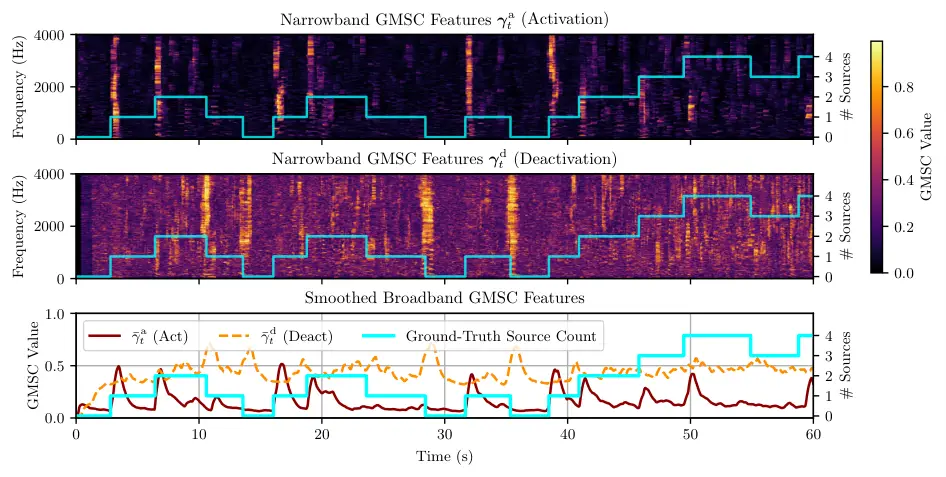

# DNN-Based Online Source Counting Based on Spatial Generalized Magnitude Squared Coherence

Henri Gode    Simon Doclo ^(†)^(†)thanks: This work was funded by the
Deutsche Forschungsgemeinschaft (DFG, German Research Foundation) under
Germany’s Excellence strategy – Project ID 390895286 – EXC 2177/1.

###### Abstract

The number of active sound sources is a key parameter in many acoustic
signal processing tasks, such as source localization, source separation,
and multi-microphone speech enhancement. This paper proposes a novel
method for online source counting by detecting changes in the number of
active sources based on spatial coherence. The proposed method exploits
the fact that a single coherent source in spatially white background
noise yields high spatial coherence, whereas only noise results in low
spatial coherence. By applying a spatial whitening operation, the source
counting problem is reformulated as a change detection task, aiming to
identify the time frames when the number of active sources changes. The
method leverages the generalized magnitude-squared coherence as a
measure to quantify spatial coherence, providing features for a compact
neural network trained to detect source count changes framewise.
Simulation results with binaural hearing aids in reverberant acoustic
scenes with up to $`4`$ speakers and background noise demonstrate the
effectiveness of the proposed method for online source counting.

###### Index Terms: 

source counting, spatial coherence, GRU, TCN, binaural hearing aids

^(†)^(†)address: Department of Medical Physics and Acoustics and Cluster
of Excellence Hearing4all,  
Carl von Ossietzky Universität Oldenburg, Germany, e-mail:
[henri.gode@uni-oldenburg.de](mailto:henri.gode@uni-oldenburg.de)

## 1 Introduction

Enhancing speech quality and intelligibility in complex acoustic
environments with multiple competing sound sources is a primary goal of
assistive listening devices, such as binaural hearing aids. To achieve
this, advanced multi-microphone algorithms are employed for tasks such
as source localization, source separation, and speech enhancement \[6,
8, 19, 11\]. A fundamental prerequisite for many of these algorithms is
knowledge about the number of active sound sources. In dynamic scenarios
where sources may activate and deactivate over time, it is crucial to
perform online source counting, i.e., relying only on past information.

Several methods have been proposed for counting active sound sources.
Single-microphone methods typically rely on deep neural networks (DNNs)
to estimate the source count directly from the mixture \[14, 22, 3\]. In
contrast, multi-microphone methods are able to leverage spatial
information. Some methods perform clustering on spatial features such as
direction-of-arrival estimates, often requiring a-priori knowledge of
the microphone array geometry and hence limiting their
applicability \[18, 23, 2, 12\]. Geometry-agnostic methods have been
proposed based on the eigenvalue distribution of spatial correlation or
coherence matrices \[15, 13\]. While effective, these aforementioned
methods and also recent DNN models that jointly perform source counting
and separation \[24, 21\] typically estimate the source count over long
signal segments ($`1-$20\text{\,}\mathrm{s}$`$), which is too slow for
low-latency speech communication applications. Other methods tackling
online speaker counting \[10, 25, 5\] operate with latencies of at least
$`200\text{\,}\mathrm{ms}`$ or rely on Ambisonics features \[10\], which
is not directly applicable to binaural hearing aids. As a more suitable
baseline for online processing, we will consider the framewise source
counting method proposed in \[9\], using the generalized
magnitude-squared coherence (GMSC) \[20\] on spatially whitened signals.
However, this method is limited to detecting only source activations and
relies on manually-tuned thresholds.

Inspired by the GMSC-based method in \[9\], in this paper we propose a
more robust DNN-based source counting method. First, we introduce a
novel set of features designed to detect source deactivations, based on
a time-reversed whitening approach. Second, to overcome the limitations
of manually tuned thresholds, we train compact neural networks to
provide a framewise estimate of the number of active sources based on
the spatial coherence features in the whitened domain. We consider two
causal architectures, a temporal convolutional network (TCN) and a gated
recurrent unit (GRU)-based recurrent neural network, The proposed
systems are evaluated for a binaural hearing aid setup on recorded noisy
and reverberant acoustic scenarios with a time-varying number of
speakers (see exemplary scenario in Figure 1). Results show that the
proposed DNN-based source count estimators significantly outperform the
conventional threshold-based method in terms of accuracy and mean
absolute error, and especially benefit from incorporating the proposed
deactivation features. The GRU-based source count estimator consistently
outperforms the TCN-based source count estimator, achieving a frame-wise
accuracy of $`91.9\text{\,}\mathrm{\%}`$.

Figure 1: Exemplary source activity timeline with 4 sources, showing
activity intervals and the total number of active sources.

## 2 Signal Model

We consider an acoustic scenario with a time-varying number of
spatially-stationary sound sources in a noisy and reverberant
environment, recorded by an array of $`M`$ microphones. In the
short-time Fourier transform (STFT) domain, the $`m`$-th microphone
signal is denoted by $`y_{m,t,f}`$, with time frame $`t`$ and frequency
$`f`$. The microphone signals are stacked in the vector

```math
\mathbf{y}_{t,f}=\begin{bmatrix}y_{1,t,f}&\cdots&y_{M,t,f}\end{bmatrix}^{\mathrm{T}}\in\mathbb{C}^{M}, \tag{1}
```

where $`\{\cdot\}^{\mathrm{T}}`$ denotes the transpose. For notational
simplicity, the frequency index $`f`$ will be omitted, except when it is
explicitly required. The microphone signal vector $`\mathbf{y}_{t}`$ is
modeled as the sum of all active source contributions and additive
noise, i.e.,

```math
\mathbf{y}_{t}=\sum_{k=1}^{K_{\text{max}}}\mathcal{I}_{k,t}\mathbf{x}_{k,t}+\mathbf{n}_{t}, \tag{2}
```

where $`K_{\text{max}}`$ denotes the total number of potential sources,
$`\mathbf{x}_{k,t}\in\mathbb{C}^{M}`$ denotes the $`k`$-th source
vector, and $`\mathbf{n}_{t}\in\mathbb{C}^{M}`$ denotes the noise
vector. The frequency-independent binary indicator
$`\mathcal{I}_{k,t}\in\{0,1\}`$ denotes the (broadband) activity of the
$`k`$-th source at time frame $`t`$, modeling the time-varying number of
active sources. The method considered in this paper aims at estimating
the number of active sources

```math
K_{t}=\sum_{k=1}^{K_{\text{max}}}\mathcal{I}_{k,t}, \tag{3}
```

per frame using only $`\mathbf{y}_{t}`$ from current and past frames.

Assuming that the length of the STFT analysis window is sufficiently
large compared to the length of the room impulse response, each source
component $`\mathbf{x}_{k,t}`$ can be written as \[1\]

```math
\mathbf{x}_{k,t}=\mathbf{a}_{k}s_{k,t}, \tag{4}
```

where $`s_{k,t}`$ denotes the STFT coefficient of the $`k`$-th source
signal and $`\mathbf{a}_{k}\in\mathbb{C}^{M}`$ denotes the
time-invariant acoustic transfer function (ATF) vector from the $`k`$-th
source to the microphone array. The ATF vectors of all sources are
assumed to be linearly independent. Assuming statistical independence
between all sources and the noise, the covariance matrix of the
microphone signals
$`\mathbf{R}_{y,t}=\mathbb{E}\{\mathbf{y}_{t}\mathbf{y}_{t}^{\mathrm{H}}\}`$
can be expressed as

```math
\mathbf{R}_{y,t}=\sum_{k=1}^{K_{\text{max}}}\mathcal{I}_{k,t}\phi_{k,t}\mathbf{a}_{k}\mathbf{a}_{k}^{\mathrm{H}}+\mathbf{R}_{n}\quad\in\mathbb{C}^{M\times M}, \tag{5}
```

where $`\{\cdot\}^{\mathrm{H}}`$ denotes the conjugate transpose,
$`\phi_{k,t}=\mathbb{E}\{|s_{k,t}|^{2}\}`$ denotes the power spectral
density (PSD) of the $`k`$-th source, and
$`\mathbf{R}_{n}=\mathbb{E}\{\mathbf{n}_{t}\mathbf{n}_{t}^{\mathrm{H}}\}`$
denotes the noise covariance matrix, assumed to be time-invariant.

Considering the activation or deactivation of a single source
$`k^{\prime}`$ between two consecutive time frames $`t-1`$ and $`t`$,
the number of active sources in Equation 3 changes by one, i.e.,
$`K_{t}=K_{t-1}\pm 1`$. Assuming the PSDs of the other active sources do
not change significantly between consecutive time frames, the matrix
$`\mathbf{R}_{y,t}`$ in Equation 5 can be expressed as

```math
\boxed{\mathbf{R}_{y,t}\approx\mathbf{R}_{y,t-1}\pm\phi_{k^{\prime}}\mathbf{a}_{k^{\prime}}\mathbf{a}_{k^{\prime}}^{\mathrm{H}}} \tag{6}
```

where $`\phi_{k^{\prime}}`$ denotes the PSD of the $`k^{\prime}`$-th
source (in frame $`t`$ for activation and frame $`t-1`$ for
deactivation). It can be observed in Equation 6 that a source activation
corresponds to the addition of a rank-1 matrix, whereas a source
deactivation corresponds to the subtraction of a rank-1 matrix. The core
idea of the spatial-coherence based source counting methods, in this
paper is to utilize these rank-1 updates of the noisy covariance matrix
to track the number of active sources $`K_{t}`$.

## 3 Conventional Source Activation Detection

The conventional method for source activation detection \[9\] directly
exploits the rank-1 update property in Equation 6. The core idea is to
reformulate the problem of estimating the number of sources per time
frame into the problem of detecting the activation of a single coherent
source in spatially white noise. This is achieved by a whitening process
(taking into account already active sources and noise), so that the
spatial coherence in this whitened domain, is expected to increase
significantly only when a new source activates.



Figure 2: Illustration of the GMSC-based features (SNR
$`=$9.5\text{\,}\mathrm{dB}$`$). Top: GMSC features for activation.
Middle: GMSC features for deactivation. Bottom: Corresponding broadband
features after recursive smoothing.

### 3.1 Whitened GMSC Features for Source Activation Detection

To detect the addition of the rank-1 matrix corresponding to a new
source activation, the conventional method \[9\] whitens the covariance
matrix $`\mathbf{R}_{y,t}`$ at time frame $`t`$ with a reference
covariance matrix denoted as $`\mathbf{R}_{v,t}`$. Using a matrix
square-root decomposition of $`\mathbf{R}_{v,t}`$, i.e.,
$`\mathbf{R}_{v,t}=\mathbf{R}_{v,t}^{\nicefrac{{\mathrm{H}}}{{2}}}\mathbf{R}_{v,t}^{\nicefrac{{1}}{{2}}}`$
(e.g., Cholesky decomposition), the whitened covariance matrix
$`\mathbf{R}^{\text{a}}_{w,t}`$ is computed as

```math
\boxed{\mathbf{R}^{\text{a}}_{w,t}=\mathbf{R}_{v,t}^{-\nicefrac{{\mathrm{H}}}{{2}}}\mathbf{R}_{y,t}\mathbf{R}_{v,t}^{-\nicefrac{{1}}{{2}}}} \tag{7}
```

The reference covariance matrix is used as an estimate of the covariance
matrix before the activation, containing the $`K_{t}-1`$ already active
sources and the noise. In \[9\] it was proposed to use the covariance
matrix $`\mathbf{R}_{y,t}`$ from $`t_{v}`$ frames in the past as the
reference covariance matrix, i.e.,

```math
\mathbf{R}_{v,t}=\mathbf{R}_{y,t-t_{v}}, \tag{8}
```

where $`t_{v}`$ corresponds to the assumed minimum time between two
source activations. As long as no new source activates,
$`\mathbf{R}_{y,t}\approx\mathbf{R}_{v,t}`$, such that the whitened
covariance matrix $`\mathbf{R}^{\text{a}}_{w,t}`$ is approximately equal
to the identity matrix, resulting in low spatial coherence. When a new
source becomes active, $`\mathbf{R}^{\text{a}}_{w,t}`$ contains an
additional rank-1 component, leading to a sharp increase in spatial
coherence. To quantify this, it was proposed in \[9\] to use the
GMSC \[20\], which extends the concept of spatial coherence between two
microphones to multiple microphones. The GMSC is defined as

```math
\gamma_{t}^{\text{a}}=\frac{\lambda_{\text{max}}\left\{\bm{\Gamma}_{t}^{\text{a}}\right\}-1}{M-1}, \tag{9}
```

yielding a value between $`0`$ and $`1`$, where
$`\lambda_{\text{max}}\{\cdot\}`$ denotes the principal eigenvalue and
$`\bm{\Gamma}_{t}^{\text{a}}`$ denotes the coherence matrix of the
whitened signals, i.e.,

```math
\bm{\Gamma}_{t}^{\text{a}}=\mathbf{D}_{w,t}^{-\nicefrac{{1}}{{2}}}\mathbf{R}^{\text{a}}_{w,t}\mathbf{D}_{w,t}^{-\nicefrac{{1}}{{2}}}. \tag{10}
```

where $`\mathbf{D}_{w,t}`$ denotes a diagonal matrix containing the
diagonal entries of $`\mathbf{R}^{\text{a}}_{w,t}`$. Although presented
without a frequency index for notational simplicity, the whitening in
Equation 7 and the GMSC calculation in Equations 10 and 9 are performed
for each frequency $`f`$. The resulting frequency-dependent GMSC values
$`\gamma_{t,f}^{\text{a}}`$ are then stacked into the GMSC feature
vector

```math
\bm{\gamma}^{\text{a}}_{t}=\begin{bmatrix}\gamma_{t,1}^{\text{a}}&\cdots&\gamma_{t,F}^{\text{a}}\end{bmatrix}^{\mathrm{T}}\in\mathbb{R}^{F}, \tag{11}
```

where $`F`$ denotes the number of frequency bins. This feature vector,
whose dimension does not depend on the number of microphones $`M`$,
serves as the input for the subsequent detection stages. For an
exemplary acoustic scenario, the top subplot of Figure 2 illustrates the
GMSC-based activation features. It can be observed that high GMSC values
occur at time frames when new sources activate.

In practice, the covariance matrix $`\mathbf{R}_{y,t}`$ is estimated
from the observed microphone signals by recursive smoothing, i.e.,

```math
\widehat{\mathbf{R}}_{y,t}=\alpha\widehat{\mathbf{R}}_{y,t-1}+(1-\alpha)\mathbf{y}_{t}\mathbf{y}_{t}^{\mathrm{H}}, \tag{12}
```

where the forgetting factor $`\alpha=e^{-t_{\mathrm{fs}}/t_{\alpha}}`$
depends on the STFT frame shift $`t_{\mathrm{fs}}`$ and a smoothing time
constant $`t_{\alpha}`$.

### 3.2 Threshold-Based Detection

For the conventional threshold-based source activation detection \[9\],
the feature vector $`\bm{\gamma}^{\text{a}}_{t}`$ is first condensed
into a single broadband value $`\tilde{\gamma}^{\text{a}}_{t}`$ by
computing a weighted average, i.e.,

```math
\tilde{\gamma}^{\text{a}}_{t}=\mathbf{w}_{t}^{\mathrm{T}}\bm{\gamma}^{\text{a}}_{t}, \tag{13}
```

where the weight vector
$`\mathbf{w}_{t}=\begin{bmatrix}w_{t,1}&\cdots&w_{t,F}\end{bmatrix}^{\mathrm{T}}\in\mathbb{R}^{F}`$
contains the normalized power of the whitened signal in each frequency
bin, i.e.,
$`w_{t,f}=\mathrm{tr}\{\mathbf{R}_{w,t,f}^{\text{a}}\}/\sum_{f=1}^{F}\mathrm{tr}\{\mathbf{R}_{w,t,f}^{\text{a}}\}`$,
where $`\mathrm{tr}\{\cdot\}`$ denotes the trace. The broadband GMSC
$`\tilde{\gamma}^{\text{a}}_{t}`$ serves as a direct indicator of a new
source activation. To improve robustness,
$`\tilde{\gamma}^{\text{a}}_{t}`$ is recursively smoothed, i.e.,

```math
\bar{\gamma}^{\text{a}}_{t}=\beta\bar{\gamma}_{t-1}+(1-\beta)\tilde{\gamma}^{\text{a}}_{t}, \tag{14}
```

where the forgetting factor $`\beta=e^{-t_{\mathrm{fs}}/t_{\gamma}}`$
depends on the STFT frame shift $`t_{\mathrm{fs}}`$ and a smoothing time
constant $`t_{\gamma}`$. An example of the smoothed broadband GMSC
$`\bar{\gamma}^{\text{a}}_{t}`$ is shown in the bottom subplot of
Figure 2 (red curve). A source activation is then detected if the
smoothed feature $`\bar{\gamma}^{\text{a}}_{t}`$ exceeds a predefined
threshold $`\gamma^{\text{a}}_{\tau}`$. Upon detection, the source count
$`K_{t}`$ is incremented by one. It should be noted that determining a
single threshold that performs robustly across diverse acoustic
scenarios (e.g., varying SNRs or source positions) is non-trivial.

## 4 Source Deactivation Detection Features

A disadvantage of the conventional source activity estimation
method \[9\] is that it can only detect source activations, but no
source deactivations, which is obviously unrealistic. To extend the
conventional method to also detect source deactivations, we propose a
deactivation feature based on interpreting a deactivation as a
time-reversed activation. Following this intuition, a similar
whitening-based approach as in Section 3.1 can be used by swapping the
roles of the current and reference covariance matrices. Instead of
whitening the covariance matrix $`\mathbf{R}_{y,t}`$ at frame $`t`$ with
the covariance matrix $`\mathbf{R}_{y,t-t_{v}}`$ from the past, we
whiten the covariance matrix $`\mathbf{R}_{y,t-t_{v}}`$ from the past
with the current covariance matrix $`\mathbf{R}_{y,t}`$, i.e.,

```math
\boxed{\mathbf{R}^{\text{d}}_{w,t}=\mathbf{R}_{y,t}^{-\nicefrac{{\mathrm{H}}}{{2}}}\mathbf{R}_{y,t-t_{v}}\mathbf{R}_{y,t}^{-\nicefrac{{1}}{{2}}}} \tag{15}
```

As long as no source deactivates,
$`\mathbf{R}_{y,t}\approx\mathbf{R}_{y,t-t_{v}}`$, such that the
whitened covariance matrix $`\mathbf{R}^{\text{d}}_{w,t}`$ is
approximately equal to the identity matrix, resulting in a low GMSC
value. If a source deactivates at time $`t-t_{v}`$, then
$`\mathbf{R}^{\text{d}}_{w,t}`$ becomes approximately equal to an
identity matrix plus a rank-1 component, leading to a high GMSC value.
This effectively turns deactivation detection into an activation
detection problem, with an inherent processing delay of $`t_{v}`$
frames.

Due to this inherent processing delay, we decided not to use recursive
smoothing for estimating the covariance matrix as in Equation 12, but to
use a more instantaneous moving-average estimate, i.e.,

```math
\widehat{\mathbf{R}}_{y,t}=\frac{1}{L}\sum_{l=0}^{L-1}\mathbf{y}_{t-l}\mathbf{y}_{t-l}^{\mathrm{H}}. \tag{16}
```

where the sliding window length $`L`$ is chosen to be smaller than
$`t_{v}`$.

From the whitened matrix $`\mathbf{R}^{\text{d}}_{w,t}`$, the feature
vector $`\bm{\gamma}^{\text{d}}_{t}`$ for deactivation is computed
similarly to Equation 9 - Equation 11. For the deactivation detection, a
similar threshold-based method as described in Section 3.2 can be
applied to the averaged and smoothed broadband value of this feature
vector $`\bar{\gamma}^{\text{d}}_{t}`$ (computed similarly to
Equation 13 and Equation 14), where a detection now leads to
decrementing the source count $`K_{t}`$ by one. An example of the
proposed GMSC deactivation feature vector $`\bm{\gamma}^{\text{d}}_{t}`$
and the smoothed broadband GMSC $`\bar{\gamma}^{\text{d}}_{t}`$ is
illustrated in the middle and bottom subplots (orange curve) of
Figure 2.

## 5 Proposed DNN-Based Source Count Estimation

To overcome the limitations of the threshold-based method, which
requires careful manual tuning and may not generalize well, we propose
to train a DNN to estimate the number of active sources $`K_{t}`$ at
each time frame from spatial coherence features. As input, we use the
GMSC-based feature vectors $`\bm{\gamma}^{\text{a}}_{t}`$ and
$`\bm{\gamma}^{\text{d}}_{t}`$ for activation and deactivation, which
are concatenated to form a combined feature vector
$`\bm{\zeta}_{t}\in\mathbb{R}^{2F}`$. We investigate two causal network
architectures: a TCN \[16\], which uses dilated convolutions to create a
large receptive field, and a GRU-based recurrent neural network
(RNN) \[4\], which uses its internal state to capture temporal
dependencies. For both architectures, a final softmax layer outputs
probabilities $`p_{t,k}`$ for each possible source count
$`k\in\{0,\dots,K_{\text{max}}\}`$, and the final estimate is taken as
the most likely class, i.e.,
$`\widehat{K}_{t}=\underset{k}{\arg\max}\;\;p_{t,k}.`$

## 6 Evaluation

In this section, the performance of the conventional threshold-based
method and the proposed DNN-based source count estimators is compared
for several acoustic scenarios with up to $`4`$ speakers and background
noise. The experimental setup, including dataset generation, algorithmic
implementation, and training procedure, is detailed below.

### 6.1 Dataset

Figure 3: Acoustic setup of the BRUDEX database \[7\].

Acoustic scenarios were generated by convolving clean speech from
Librispeech \[17\] with binaural room impulse responses (RIRs) from the
BRUDEX database \[7\] for the low-reverberation condition
($`\text{T}_{60}\approx$310\text{\,}\mathrm{ms}$`$) at a sampling
frequency of $`8\text{\,}\mathrm{kHz}`$. As depicted in Figure 3, the
RIRs cover 12 source positions on a circle of radius
$`1\text{\,}\mathrm{m}`$ around a dummy head with an angular spacing of
$`30\text{\,}\mathrm{\SIUnitSymbolDegree}`$. The dummy head was equipped
with a behind-the-ear (BTE) hearing aid on each side, with each BTE
having a front and a rear microphone spaced $`1.5\text{\,}\mathrm{cm}`$
apart. Additionally, an in-ear microphone was present on each side of
the head. This setup provides various microphone array configurations
using 2 to 6 of these microphones. Quasi-diffuse babble, cafeteria or
white noise from BRUDEX was added at a random SNR between
$`5\text{\,}\mathrm{dB}`$ and $`15\text{\,}\mathrm{dB}`$. To create
dynamic scenes, the number of simultaneously active sources varies up to
$`K\_{\text{max}}=4`$, with activation/deactivation events occurring at
random intervals between $`2\text{\,}\mathrm{s}`$ and
$`5\text{\,}\mathrm{s}`$. Based on this, two distinct datasets were
generated: Dataset A ($`20\text{\,}\mathrm{s}`$ scenarios) contains only
source activations, while Dataset B ($`60\text{\,}\mathrm{s}`$
scenarios) contains both activations and deactivations. Each dataset is
split into $`6000`$ training, $`600`$ validation, and $`600`$ test
scenarios, where for each scenario the source positions, clean speech
signals, microphone array configuration, SNR, noise type, and activity
pattern were chosen randomly.

### 6.2 Algorithmic Implementation and Training

The microphone signals are processed using an STFT framework with a
frame length of $`800`$ samples (corresponding to
$`100\text{\,}\mathrm{ms}`$), resulting in $`F=401`$, a frame shift of
$`25\text{\,}\mathrm{\%}`$, i.e.,
$`t_{\text{fs}}=$25\text{\,}\mathrm{ms}$`$, and a square-root Hann
analysis window. The GMSC-based activation features are computed with a
recursive smoothing of $`t*{\alpha}=$500\text{\,}\mathrm{ms}$`$
in Equation 12, while the deactivation features are computed with a
sliding window of $`L=14`$ (corresponding to
$`350\text{\,}\mathrm{ms}`$) in Equation 16. For both features, the
delay for the reference covariance matrix in Equations 8 and 15 is equal
to $`t*{v}=20`$ frames (corresponding to $`500\text{\,}\mathrm{ms}`$).

We compare three source count estimators using either only activation
features for Dataset A and Dataset B, or using concatenated activation
and deactivation features for Dataset B:

- •
  The conventional threshold-based method using broadband feature
  smoothing of $`t_{\gamma}=$500\text{\,}\mathrm{ms}$`$ in Equation 14
and fixed thresholds of $`\gamma^{\text{a}}_{\tau}=0.24`$ (activation)
and $`\gamma^{\text{d}}_{\tau}=0.62`$ (deactivation), which were
  determined using a grid search on the test set of Dataset A and
  Dataset B, respectively.
- •
  An TCN-based estimator using 3 stacks of 3 layers with a kernel size
  of 3, a bottleneck dimension of 128, and a hidden dimension of 256,
  resulting in a receptive field of 43 frames
  ($`=$1.075\text{\,}\mathrm{s}$`$).
- •
  An RNN-based estimator using a 3-layer GRU with a hidden size of half
  the input dimension.

The DNN models were trained for 100 epochs using the AdamW optimizer
with a learning rate of $`10^{-4}`$ and a batch size of 30 to minimize
the cross-entropy loss between the estimated and the ground-truth source
count. This ground-truth, $`K_{t}`$ was computed using Equation 3, where
the ground-truth activity indicator $`\mathcal{I}_{k,t}`$ was determined
by applying a power-based voice activity detector to the source
components
$`\mathbf{x}_{k,t}\;\forall k\in\{1,\ldots,K_{\text{max}}\}`$.

### 6.3 Results

|                                            |                 |                              |      |
| ------------------------------------------ | --------------- | ---------------------------- | ---- |
| Features                                   | Detector Method | Accuracy \[$`\mathrm{\%}`$\] | MAE  |
|    Dataset A (Activations only)            |                 |                              |      |
| Features: $`\bm{\gamma}^{\text{a}}_{t}`$   | Threshold-based | 83.1                         | 0.18 |
|                                            | TCN-based       | 94.2                         | 0.06 |
|                                            | RNN-based       | 95.6                         | 0.04 |
|    Dataset B (Activations & Deactivations) |                 |                              |      |
| Features: $`\bm{\gamma}^{\text{a}}_{t}`$   | TCN-based       | 83.8                         | 0.17 |
|                                            | RNN-based       | 89.0                         | 0.12 |
| Features: $`\bm{\zeta}_{t}`$               | Threshold-based | 33.6                         | 1.21 |
|                                            | TCN-based       | 86.4                         | 0.14 |
|                                            | RNN-based       | 91.9                         | 0.09 |

Table 1: Accuracy and MAE results on Dataset A and Dataset B for
different feature sets ($`\bm{\gamma}^{\text{a}}_{t}`$ or
$`\bm{\zeta}_{t}`$).

Performance is evaluated on the test sets using two framewise metrics:
the classification accuracy (percentage of frames where
$`\widehat{K}_{t}=K_{t}`$) and the mean absolute error (MAE), i.e.,
$`\text{MAE}=\nicefrac{{1}}{{T}}\sum_{t=1}^{T}|\widehat{K}_{t}-K_{t}|`$,
where $`T`$ is the total number of frames in a test set. The results are
presented in Table 1. On the activation-only Dataset A, both DNN-based
methods significantly outperform the threshold-based method, with the
RNN achieving the best accuracy of $`95.6\text{\,}\mathrm{\%}`$. On the
more challenging Dataset B, which includes both activations and
deactivations, the performance of the DNN models using only activation
features $`\bm{\gamma}^{\text{a}}_{t}`$ is, as expected, lower than on
Dataset A. The benefit of the proposed deactivation features
$`\bm{\gamma}^{\text{d}}_{t}`$ is clearly demonstrated: while the
threshold-based method fails completely on Dataset B (accuracy of
$`33.6\text{\,}\mathrm{\%}`$), both DNN-based methods show a notable
performance improvement compared to only using the activation features
$`\bm{\gamma}_{t}^{\text{a}}`$. The RNN-based estimator consistently
performs best, reaching an accuracy of $`91.9\text{\,}\mathrm{\%}`$ when
using both activation and deactivation features. Finally, the proposed
method is real-time feasible, with an average real-time factor of
$`0.007`$ (dominated by feature extraction) measured on an NVIDIA RTX
A5000 GPU.

## 7 Conclusion

This paper extends a spatial coherence-based method for online source
activation detection. We propose GMSC-based features for detecting
source deactivations using a time-reversed whitening approach,
complementing existing activation features. Furthermore, we propose to
replace the conventional threshold-based source count estimator with
more robust DNN-based classifiers (TCN and GRU) that directly estimate
the source count from the combined feature set. The evaluation on
real-world acoustic scenarios shows that the DNN-based methods
significantly outperform the threshold-based method. Crucially,
incorporating the proposed deactivation features substantially improves
performance in scenarios involving both activations and deactivations.
The RNN-based source count estimator proves most effective, achieving a
frame-wise accuracy of $`91.9\text{\,}\mathrm{\%}`$.

## References

- \[1\] Y. Avargel and I. Cohen (2007) On Multiplicative Transfer
  Function Approximation in the Short-Time Fourier Transform Domain.
  IEEE Signal Processing Letters 14 (5), pp. 337–340. Cited by: §2.
- \[2\] J. Azcarreta, N. Ito, S. Araki, and T. Nakatani (2018)
  Permutation-free CGMM: complex Gaussian mixture model with inverse
  Wishart mixture model based spatial prior for permutation-free source
  separation and source counting. In Proc. IEEE International Conference
  on Acoustics, Speech and Signal Processing, Calgary, Canada,
  pp. 51–55. Cited by: §1.
- \[3\] S. R. Chetupalli and E. A. P. Habets (2023) Speaker counting and
  separation from single-channel noisy mixtures. IEEE/ACM Trans. on
  Audio, Speech, and Language Processing 31 (), pp. 1681–1692. Cited by:
  §1.
- \[4\] K. Cho, B. Van Merriënboer, D. Bahdanau, and Y. Bengio (2014) On
  the properties of neural machine translation: encoder-decoder
  approaches. arXiv preprint arXiv:1409.1259. Cited by: §5.
- \[5\] S. Cornell, M. Omologo, S. Squartini, and E. Vincent (2022)
  Overlapped speech detection and speaker counting using distant
  microphone arrays. Computer Speech & Language 72, pp. 101306. Cited
  by: §1.
- \[6\] S. Doclo, W. Kellermann, S. Makino, and S. E. Nordholm (2015)
  Multichannel Signal Enhancement Algorithms for Assisted Listening
  Devices: Exploiting spatial diversity using multiple microphones. IEEE
  Signal Processing Magazine 32 (2), pp. 18–30. Cited by: §1.
- \[7\] D. Fejgin, W. Middelberg, and S. Doclo (2023) BRUDEX database:
  binaural room impulse responses with uniformly distributed external
  microphones. In Proc. ITG Conference on Speech Communication, Aachen,
  Germany. Note: \[Online\]. Available:
  [https://doi.org/10.5281/zenodo.7986446](https://doi.org/10.5281/zenodo.7986446)
  External Links: [Link](https://doi.org/10.5281/zenodo.7986446) Cited
  by: Figure 3, §6.1.
- \[8\] S. Gannot, E. Vincent, S. Markovich-Golan, and A. Ozerov (2017)
  A Consolidated Perspective on Multimicrophone Speech Enhancement and
  Source Separation. IEEE/ACM Trans. on Audio, Speech, and Language
  Processing 25 (4), pp. 692–730. Cited by: §1.
- \[9\] H. Gode and S. Doclo (2025) Closed-form successive relative
  transfer function vector estimation based on blind oblique projection
  incorporating noise whitening. arXiv preprint arXiv:2508.04887.
  External Links: 2508.04887, [Link](https://arxiv.org/abs/2508.04887)
  Cited by: §1, §1, §3.1, §3.1, §3.1, §3.2, §3, §4.
- \[10\] P. Grumiaux, S. Kitić, L. Girin, and A. Guérin (2020)
  High-resolution speaker counting in reverberant rooms using CRNN with
  ambisonics features. In Proc. European Signal Processing Conference,
  Amsterdam, Netherlands, pp. 71–75. Cited by: §1.
- \[11\] P. Grumiaux, S. Kitić, L. Girin, and A. Guérin (2022) A survey
  of sound source localization with deep learning methods. The Journal
  of the Acoustical Society of America 152 (1), pp. 107–151. Cited by:
  §1.
- \[12\] S. Hafezi, A. H. Moore, and P. A. Naylor (2019) Spatial
  consistency for multiple source direction-of-arrival estimation and
  source counting. The Journal of the Acoustical Society of America 146
  (6), pp. 4592–4603. Cited by: §1.
- \[13\] Y. Hsu and M. R. Bai (2023) Learning-based robust speaker
  counting and separation with the aid of spatial coherence. EURASIP
  Journal on Audio, Speech, and Music Processing 2023 (1), pp. 36. Cited
  by: §1.
- \[14\] K. Kinoshita, L. Drude, M. Delcroix, and T. Nakatani (2018)
  Listening to each speaker one by one with recurrent selective hearing
  networks. In Proc. IEEE International Conference on Acoustics, Speech
  and Signal Processing, Calgary, Canada, pp. 5064–5068. Cited by: §1.
- \[15\] B. Laufer-Goldshtein, R. Talmon, and S. Gannot (2018) Source
  counting and separation based on simplex analysis. IEEE Trans. on
  Signal Processing 66 (24), pp. 6458–6473. Cited by: §1.
- \[16\] Y. Luo and N. Mesgarani (2019) Conv-tasnet: surpassing ideal
  time–frequency magnitude masking for speech separation. IEEE/ACM
  Transactions on Audio, Speech, and Language Processing 27 (8),
  pp. 1256–1266. Cited by: §5.
- \[17\] V. Panayotov, G. Chen, D. Povey, and S. Khudanpur (2015)
  Librispeech: an ASR corpus based on public domain audio books. In
  Proc. IEEE International Conference on Acoustics, Speech and Signal
  Processing, South Brisbane, Australia, pp. 5206–5210. Cited by: §6.1.
- \[18\] D. Pavlidi, A. Griffin, M. Puigt, and A. Mouchtaris (2013)
  Real-time multiple sound source localization and counting using a
  circular microphone array. IEEE Trans. on Audio, Speech, and Language
  Processing 21 (10), pp. 2193–2206. Cited by: §1.
- \[19\] P. Pertilä, A. Brutti, P. Svaizer, and M. Omologo (2018)
  Multichannel source activity detection, localization, and tracking.
  Audio Source Separation and Speech Enhancement, pp. 47–64. Cited by:
  §1.
- \[20\] D. Ramírez, J. Via, and I. Santamaria (2008) A generalization
  of the magnitude squared coherence spectrum for more than two signals:
  definition, properties and estimation. In Proc. IEEE International
  Conference on Acoustics, Speech and Signal Processing, Vol. , Las
  Vegas, USA, pp. 3769–3772. Cited by: §1, §3.1.
- \[21\] K. Saijo, W. Zhang, Z. Wang, S. Watanabe, T. Kobayashi, and T.
  Ogawa (2023) A single speech enhancement model unifying
  dereverberation, denoising, speaker counting, separation, and
  extraction. In Proc. IEEE Automatic Speech Recognition and
  Understanding Workshop, Taipei, Taiwan, pp. 1–6. Cited by: §1.
- \[22\] F. Stöter, S. Chakrabarty, B. Edler, and E. A. Habets (2019)
  CountNet: estimating the number of concurrent speakers using
  supervised learning. IEEE/ACM Trans. on Audio, Speech, and Language
  Processing 27 (2), pp. 268–282. Cited by: §1.
- \[23\] L. Wang, T. Hon, J. D. Reiss, and A. Cavallaro (2016) An
  iterative approach to source counting and localization using two
  distant microphones. IEEE/ACM Trans. on Audio, Speech, and Language
  processing 24 (6), pp. 1079–1093. Cited by: §1.
- \[24\] Z. Wang and D. Wang (2021) Count and separate: incorporating
  speaker counting for continuous speaker separation. In Proc. IEEE
  International Conference on Acoustics, Speech and Signal Processing,
  Toronto, Canada, pp. 11–15. Cited by: §1.
- \[25\] M. Yousefi and J. H. Hansen (2021) Real-time speaker counting
  in a cocktail party scenario using attention-guided convolutional
  neural network. arXiv preprint arXiv:2111.00316. Cited by: §1.
