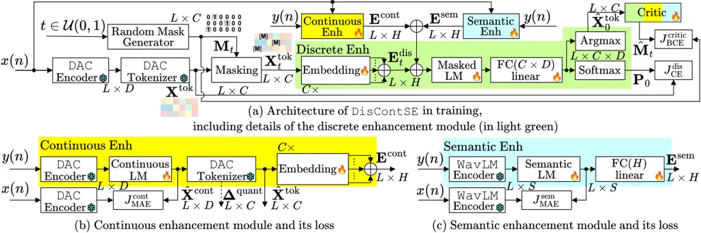
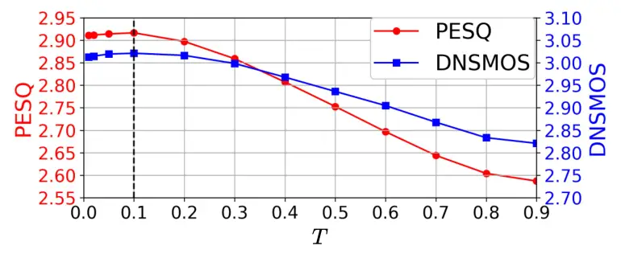

# DISCONTSE: SINGLE-STEP DIFFUSION SPEECH ENHANCEMENT BASED ON JOINT DISCRETE AND CONTINUOUS EMBEDDINGS

Yihui Fu    Tim Fingscheidt

###### Abstract

Diffusion speech enhancement on discrete audio codec features gain
immense attention due to their improved speech component reconstruction
capability. However, they usually suffer from high inference
computational complexity due to multiple reverse process iterations.
Furthermore, they generally achieve promising results on non-intrusive
metrics but show poor performance on intrusive metrics, as they may
struggle in reconstructing the correct phones. In this paper, we propose
DisContSE, an efficient diffusion-based speech enhancement model on
joint discrete codec tokens and continuous embeddings. Our contributions
are three-fold. First, we formulate both a discrete and a continuous
enhancement module operating on discrete audio codec tokens and
continuous embeddings, respectively, to achieve improved fidelity and
intelligibility simultaneously. Second, a semantic enhancement module is
further adopted to achieve optimal phonetic accuracy. Third, we achieve
a single-step efficient reverse process in inference with a novel
quantization error mask initialization strategy, which, according to our
knowledge, is the first successful single-step diffusion speech
enhancement based on an audio codec. Trained and evaluated on URGENT
2024 Speech Enhancement Challenge data splits, the proposed DisContSE
excels top-reported time- and frequency-domain diffusion baseline
methods in PESQ, POLQA, UTMOS, and in a subjective ITU-T P.808 listening
test, clearly achieving an overall top rank.

###### Index Terms: 

discrete codec tokens, continuous embedding, single-step diffusion,
speech enhancement

^(†)^(†)address: Institute for Communications Technology, Technische
Universität Braunschweig, Braunschweig, Germany

## 1 Introduction

Diffusion-based speech enhancement (SE) has gained widespread attention.
Complex-valued frequency-domain representation is commonly adopted for
score-based diffusion models due to the better phase reconstruction
ability and intelligibility \[1, 2, 3\]. However, multiple iterations in
the reverse process greatly increase the computational complexity during
inference. Recently, SE on discrete audio codec features with masked
token estimation method has received increasing attention because of its
outstanding denoising ability and fidelity \[4, 5, 6, 7, 8\]. On the
other hand, SE on continuous embeddings is proven to achieve good
phonetic accuracy and speaker preservation ability \[9, 10\]. However,
all these methods still suffer from high inference complexity due to
multiple reverse iterations. Furthermore, the underlying relationship
between the discrete and continuous embeddings is still to be
investigated. In this paper, we propose DisContSE, an efficient
diffusion-based SE model on joint discrete and continuous embeddings. We
first integrate a discrete enhancement module and a supervised
continuous enhancement module to deliver enhancement on discrete audio
codec tokens and continuous embeddings, respectively, with the features
extracted by the pre-trained descript audio codec (DAC) \[11\]. Then, a
supervised semantic enhancement module based on WavLM-encoded features
\[12\] is further adopted to increase the phonetic accuracy. Finally, a
novel single-step efficient reverse process is presented, integrating
the continuous enhancement module output and a newly proposed
quantization error mask initialization strategy.

## 2 Methods

This section describes training and inference of our proposed DisConSE.



Figure 1: (a) Architecture of the proposed DisContSE and its training
strategy. (b) Block diagram of the continuous enhancement module and its
MAE loss. (c) Block diagram of the semantic enhancement module and its
MAE loss.

Figure 2: Inference of the proposed DisContSE.

Training: As shown in Fig. 1 (a), the DAC encoder and DAC tokenizer
\[11\] are adopted to extract the discrete tokens
$`\mathbf{X}^{\textrm{tok}}=(X^{\textrm{tok}}_{\ell,c})\in\{0,1,...,D\!-\!1\}^{L\times C}`$
from the clean speech $`x(n)`$, where $`L`$ represents the token
sequence length, $`C`$ the number of codebook entries, and $`D`$ the
codebook size. MaskGIT \[13\] is adopted as a random mask generator,
which takes $`t\in\mathcal{U}(0,1)`$ as the input to generate the mask
$`\mathbf{M}_{t}=(M_{t,\ell,c})\in\{0,1\}^{L\times C}`$, within which an
amount of
$`\left\lfloor\textrm{sin}(\frac{\pi t}{2})\cdot L\cdot C\right\rfloor`$
randomly chosen elements fulfill $`M_{t,\ell,c}=1`$, all others are
$`M_{t,\ell,c}=0`$. The masked tokens
$`\mathbf{X}^{\textrm{tok}}_{t}=(X_{t,\ell,c}^{\textrm{tok}})\in\{0,1,...,D\}^{L\times C}`$
are obtained by

```math
X_{t,\ell,c}^{\textrm{tok}}=[\mathrm{M}]\cdot M_{t,\ell,c}+X_{\ell,c}^{\textrm{tok}}\cdot(1-M_{t,\ell,c}), \tag{1}
```

with $`[\mathrm{M}]`$ being a special fixed token with value $`D`$. The
discrete enhancement module contains $`C`$ different parallel embedding
layers with embedding dimension $`H`$ applied to each codebook entry
with index $`c`$ and token sequence with index $`\ell`$, with summation
output $`\mathbf{E}^{\textrm{dis}}_{t}\in\mathbb{R}^{L\times H}`$. The
embeddings $`\mathbf{E}^{\textrm{cont}}`$ and
$`\mathbf{E}^{\textrm{sem}}`$, estimated by the continuous enhancement
and semantic enhancement modules, respectively, are added to
$`\mathbf{E}^{\textrm{dis}}_{t}`$ to deliver the input to the masked
language model (LM) \[13, 6, 7, 8\]. The masked LM consists of cascaded
transformer blocks with dimension $`H`$. After a fully connected (FC)
linear layer $`\textrm{FC}(C\times D)`$ applied to each token with index
$`\ell`$ in the sequence, a cross-entropy loss

```math
J_{\textrm{CE}}^{\textrm{dis}}(\mathbf{P}_{0},\textbf{X}^{\textrm{tok}})=J_{\textrm{CE}}(\mathbf{P}_{0},\textbf{X}^{\textrm{tok}})|_{M_{t,\ell,c}=1} \tag{2}
```

is applied between softmax output
$`\mathbf{P}_{0}=(P_{0,\ell,c,d})\in\mathbb{R}^{L\times C\times D}`$ and
clean speech tokens $`\mathbf{X}^{\textrm{tok}}`$, where the gradients
are calculated only on the masked positions ($`M_{t,\ell,c}=1`$) \[6, 7,
8\]. On the masked positions, the estimated tokens
$`\hat{\mathbf{X}}_{0}^{\textrm{tok}}`$ are derived from the argmax
operation over the $`D`$-dimension of the $`\textrm{FC}(C\times D)`$
output, while the tokens on the unmasked positions are copied from
$`\mathbf{X}^{\textrm{tok}}`$. According to \[8\], a self-critic
sampling strategy is further adopted, which reuses the DisContSE as a
discriminator to evaluate whether a token is real or generated by the
model. By substituting the $`\textrm{FC}(C\times D)`$ linear layer by an
$`\textrm{FC}(C)`$ linear layer and substituting softmax by sigmoid in
the discrete enhancement, and reusing all other parameters, the
estimated mask $`\hat{\mathbf{M}}_{t}`$ is optimized by binary
cross-entropy loss
$`J_{\textrm{BCE}}^{\textrm{critic}}(\hat{\mathbf{M}}_{t},\mathbf{M}_{t})`$.
During training, the parameters of the DAC encoder, DAC tokenizers, and
WavLM encoder are kept frozen. We employ the overall loss

```math
J=J_{\textrm{CE}}^{\textrm{dis}}+J_{\textrm{BCE}}^{\textrm{critic}}+J_{\textrm{MAE}}^{\textrm{cont}}+J_{\textrm{MAE}}^{\textrm{sem}}. \tag{3}
```

Figs. 1 (b) and (c) represent the continuous enhancement module and
semantic enhancement module, respectively. The continuous enhancement
module, acting as a discriminative enhancement module, delivers
continuous embeddings enhancement on the noisy speech $`y(n)`$ being
DAC-encoded, using a continuous LM \[14\], which consists of two FC
linear layers $`\textrm{FC}(H)`$ and $`\textrm{FC}(D)`$, and cascaded
transformer blocks with dimension $`H`$ lying between. Beyond \[7\], we
employ an MAE loss $`J_{\textrm{MAE}}^{\textrm{cont}}`$ to optimize the
enhanced continuous embeddings
$`\hat{\mathbf{X}}^{\textrm{cont}}\in\mathbb{R}^{L\times D}`$. Thus, the
optimized $`\hat{\mathbf{X}}^{\textrm{cont}}`$, as a pre-enhanced speech
feature, provides a reliable initial state for achieving efficient
single-step diffusion. Discrete enhanced tokens
$`\hat{\mathbf{X}}^{\textrm{tok}}`$ are derived from
$`\hat{\mathbf{X}}^{\textrm{cont}}`$ by DAC tokenizers. Then
$`\mathbf{E}^{\textrm{cont}}\in\mathbb{R}^{L\times H}`$, a newly
proposed conditional information, is estimated by summing the outputs of
$`C`$ different parallel embedding layers. Note that for parameter
efficiency, the embedding layers in the discrete enhancement module
share weights pairwise with those in the continuous enhancement module.

The semantic enhancement module, inspired by \[6, 8\], delivers semantic
feature enhancement on the noisy speech $`y(n)`$ being WavLM-encoded
\[12\] using a semantic LM, which consists of two FC linear layers
$`\textrm{FC}(H)`$ and $`\textrm{FC}(S)`$, and cascaded transformer
blocks with dimension $`H`$ lying between. Beyond \[7\], the MAE loss
$`J_{\textrm{MAE}}^{\textrm{sem}}`$ is adopted to optimize the enhanced
semantic features. An $`\textrm{FC}(H)`$ linear layer is further adopted
to estimate $`\mathbf{E}^{\textrm{sem}}\in\mathbb{R}^{L\times H}`$.

Inference: As shown in Fig. 2, during inference of the proposed
DisContSE, initial mask
$`\mathbf{M}_{T}=(M_{T,\ell,c})\in\{0,1\}^{L\times C}`$ is generated
according to the initial diffusion time index $`T\leqslant 1.0`$, where
$`T=1.0`$ represents fully masked initialization \[6, 7, 8\], i.e.,
$`M_{T,\ell,c}=1`$. Furthermore, we propose two initial mask generating
strategies with $`T<1.0`$:

\(i\) Quantization error mask initialization, which takes the DAC
tokenizer (dashed arrow in Figs. 1 (b) and 2, left) quantization error
matrix $`\bm{\Delta}^{\textrm{quant}}\in\mathbb{R}_{+}^{L\times C}`$,
with the MSE quantization error of each of the $`C`$ quantizers for each
token sequence index $`\ell`$ as elements. Then, in the positions of the
largest
$`\left\lfloor\textrm{sin}(\frac{\pi T}{2})\cdot L\cdot C\right\rfloor`$
entries in $`\bm{\Delta}^{\textrm{quant}}`$, we set mask
$`\mathbf{M}_{T}`$ elements to $`M_{T,\ell,c}=1`$.

\(ii\) Random mask initialization (no dashed arrows), which randomly
assigns $`M_{T,\ell,c}=1`$ on
$`\left\lfloor\textrm{sin}(\frac{\pi T}{2})\cdot L\cdot C\right\rfloor`$
positions in $`\mathbf{M}_{T}`$, equaling the mask generation process in
training.

By applying $`\mathbf{M}_{T}`$ to the discrete enhanced tokens
$`\hat{\mathbf{X}}^{\textrm{tok}}`$, in analogy to (1), the initial
state $`\mathbf{X}^{\textrm{tok}}_{T}`$ is calculated and fed into the
discrete enhancement module (switch in left position), together with
$`\mathbf{E}^{\textrm{cont}}\!+\mathbf{E}^{\textrm{sem}}`$. In each
iteration of the reverse process with index $`t`$, $`\mathbf{P}_{0}`$
and $`\hat{\mathbf{X}}^{\textrm{tok}}_{0}`$ are estimated by the
discrete enhancement module.

If multiple reverse iterations are executed (light red boxes), a max
operation is applied to $`\mathbf{P}_{0}`$ on its $`D`$-dimension. Then,
the smallest
$`\left\lfloor\textrm{sin}(\frac{\pi(t-\Delta t)}{2})\cdot L\cdot C\right\rfloor`$
entry positions, which are considered as estimated low-confidence tokens
\[13\], are adopted to remask $`\hat{\mathbf{X}}^{\textrm{tok}}_{0}`$,
using $`\mathbf{M}_{t-\Delta t}`$ estimated by the scheduled mask
generator, to generate $`\mathbf{X}^{\textrm{tok}}_{t-\Delta t}`$ as the
next iteration’s input to the discrete enhancement module (switch in
right position). Here $`\Delta t=T/N`$, with $`N`$ being the number of
the reverse steps during inference.

In the last iteration (or the only one in our proposed single-step
reverse process), the discrete enhancement module estimates
$`\hat{\mathbf{X}}^{\textrm{tok}}_{0}`$, which is further input to the
DAC decoder to estimate the enhanced speech $`\hat{x}(n)`$, shown by
dotted arrows on the right side in Fig. 2.

[TABLE]

Table 1: Performance of the proposed DisContSE method ($`T=0.1`$) and
some popular generative SE models on $`\mathcal{D}^{\textrm{test}}`$.
P.808 MOS is obtained on a 50-sample subset of
$`\mathcal{D}^{\textrm{test}}`$. Best performance in the last two table
segments on each metric is in bold, second best is underlined.

## 3 Experimental Setup

### 3.1 Networks

In the proposed DisContSE, the pretrained 16 kHz DAC¹¹ 1
https://github.com/descriptinc/descript-audio-codec and WavLM²² 2
https://huggingface.co/docs/transformers/model_doc/wavlm weights are
adopted. For DAC, both the encoder output dimension and the codebook
size are $`D\!=\!1024`$, and the number of codebooks is $`C\!=\!12`$.
For WavLM, the 6th encoder layer’s output is adopted \[19\] with
dimension $`S\!=\!1024`$. In the discrete enhancement and the continuous
enhancement, both the masked LM and the continuous LM consist of 8
transformer blocks, while the semantic LM in the semantic enhancement
contains 4 transformer blocks. All transformer blocks have $`H\!=\!512`$
dimensions and 4 heads. The total number of trainable parameters in our
DisContSE is 81.4 M. The number of frozen parameters of DAC and WavLM
encoder are 74.2 M and 158.3 M, respectively.

### 3.2 Data and Metrics

We train and evaluate our proposed DisContSE on the large-scale
diverse-source URGENT 2024 Speech Enhancement Challenge data splits
\[20\], however, excluding the CommonVoice 11.0 English portion \[21\]
due to its occasional background noise \[20\]. For training data
$`\mathcal{D}^{\textrm{train}}`$ and validation data
$`\mathcal{D}^{\textrm{val}}`$, we mainly follow the strategies in the
challenge³³ 3 https://github.com/urgent-challenge/urgent2024_challenge,
in which 3 kinds of distortions are adopted: additive noise with and
without reverberation, and additive noise with clipping. We do not adopt
bandwidth limitation distortion from the challenge. The signal-to-noise
ratio (SNR) range is \[-5, 20\] dB. An active speech level with a range
\[-36, -16\] dB is adopted before mixing speech and noise data \[22\].
All waveforms are downsampled to 16 kHz. We configure a 634.5 h training
set $`\mathcal{D}^{\textrm{train}}`$ and a 32.7 h validation set
$`\mathcal{D}^{\textrm{val}}`$, without speech, speakers and noise
overlapping. We adopt the officially published non-blind test set of the
challenge, excluding the bandwidth limitation waveforms, and downsample
it to 16 kHz, leading to our test set $`\mathcal{D}^{\textrm{test}}`$
with 661 waveforms.



Figure 3: DisContSE performance on $`T`$ in the single-step reverse
process (inference) on $`\mathcal{D}^{\textrm{val}}`$.

We employ intrusive SE metrics, including PESQ \[23\], POLQA \[24\], and
ESTOI \[25\], non-intrusive SE metrics, including DNSMOS \[26\], NISQA
\[27\], and UTMOS \[28\], downstream-task-independent metrics, including
Levenshtein phone similarity (LPS  = 1 - Levenshtein phone distance
(LPD)) \[29\], as a phone fidelity metric being sensitive to
hallucinations, and SpeechBERTScore (SBScore) \[30\], and
downstream-task-dependent metrics, including SpkSim \[20\] and WAcc
\[20\]. We also perform a subjective listening test to estimate the mean
opinion score (MOS) of each model, strictly following ITU-T Rec. P.808
\[31, 32\]. In line with the setup of the URGENT 2024 Challenge \[20\],
we select a 50-sample subset of $`\mathcal{D}^{\textrm{test}}`$, whereby
each sample is evaluated by eight different listeners who are
self-reported native English speakers. The overall rank is calculated
based on the average rank of each metric.

### 3.3 Model Training

The proposed DisContSE is trained on 4 Nvidia H100 with a batch size of
48 for 300 K steps, taking about 3.5 days. The AdamW optimizer is
adopted. The learning rate is 0.00025 with 4 K steps of warmup. During
training, the parameters of DAC encoder, DAC tokenizer, and WavLM
encoder are frozen. We report some popular generative speech enhancement
models as baselines, including SGMSE+ \[1\], BBED \[2\], SB \[3\], CRP
\[15\], CDiffuSE \[16\], StoRM \[17\], and Universe++ \[18\]. For fair
comparison, all these models are trained for 1 M steps with batch size
16 on the same dataset $`\mathcal{D}^{\textrm{train}}`$ as DisContSE.
The best setups in the corresponding papers are taken. We perform
inference with the number of steps of the best performance in the
corresponding papers. For CRP, we use their SB model trained by 950 K
steps as the first stage model to deliver the second stage training for
50 K steps, according to the ratio of the number of training steps of
the two stages in \[15\].

[TABLE]

Table 2: Ablation study on the inference strategies
(
to
)
and training strategies
(
to
),
evaluated on $`\mathcal{D}^{\textrm{val}}`$.

## 4 Results and Discussion

### 4.1 Main Results

We first investigate the optimal $`T<1.0`$ for the single-step reverse
process during inference of the proposed DisContSE on
$`\mathcal{D}^{\textrm{val}}`$, following quantization error mask
initialization. As shown in Fig. 3, the proposed DisContSE reaches the
best PESQ and DNSMOS performance for $`T=0.1`$, thereby we choose this
value for our proposed DisContSE method.

Table 1 shows the performance comparison among the proposed DisContSE
and seven well-known generative diffusion-based speech enhancement
baselines on $`\mathcal{D}^{\textrm{test}}`$. Tags D and G represent
discriminative and generative models, respectively, while “G$`N`$”
represents the number $`N`$ of iterations during the reverse process of
the generative model. Our proposed DisContSE can be regarded as hybrid
approach (D+G$`1`$), as the continuous and semantic enhancement modules
are of discriminative nature, while the discrete enhancement module is
part of the diffusion iterative process. As we perform single-step
diffusion, the latter computes only
$`\hat{\mathbf{X}}^{\textrm{tok}}_{0}`$, which is then input to the DAC
decoder to estimate the enhanced speech. As an ablation, Table 1 also
reports the continuous enhancement module’s output
$`\hat{\mathbf{X}}^{\textrm{tok}}`$ as the input to the DAC decoder to
estimate the enhanced speech (last row), which delivers equal or mostly
poorer performance than DisContSE.

Analyzing the performance of DisContSE and the various baselines in
Table 1, we observe the strength of CRP \[15\], as it delivers top
performance in ESTOI, LPS, and WAcc, all three metrics aiming to
quantify intelligibility and phone fidelity. So it is an approach with
only few hallucinations. CRP seems strong over other metrics as well
(PESQ, MOS), thereby securing the overall second rank among all methods.
SB \[3\], on the other hand, is winner in (reference-free) DNSMOS and
second-ranked in (reference-free) MOS (3.73), but clearly lags behind in
reference-based metrics such as PESQ (2.57) and SpkSim (0.57), obviously
providing waveforms quite different to the clean original. A similar
observation can be made for Universe++ \[18\], as it leads the
(reference-free) NISQA metric and also is second-ranked in
reference-free MOS (3.73), however, performing much better than SB in
PESQ (3.09 vs. 2.57). SGMSE+ \[1\] is the strongest on speaker
similarity, but ranks relatively poorly.

Comparing our proposed DisContSE in Table 1 to the seven baselines, we
observe that is secures five top ranked metrics, including the MOS of
3.75 from the subjective listening test, and three second ranks.
DisContSE combines top performance in waveform-related psychoacoustic
metrics (PESQ, POLQA), with top performance in reference-free UTMOS, but
still is second-ranked in ESTOI and LPS, meaning only a low degree of
hallucinations in low SNR. In total, DisContSE achieves the best overall
rank (2.36, lower is better), with runner-up CRP (3.36) being exactly
one rank worse.

### 4.2 Ablation Study

To further verify the rationality of the inference and training strategy
of the proposed DisContSE, Table 2 shows ablation experiments on
$`\mathcal{D}^{\textrm{val}}`$:

is inferred with quantization error mask initialization (strategy (i)),

with the random mask initialization (strategy (ii)). Both employ
$`T=0.1`$ for a single iteration, where

performs better, and is selected as the proposed method for the initial
mask generating strategy.

to

are inferred with fully masked initialization ($`T=1.0`$) with 1, 5, and
10 iterations, respectively, all with weaker performance.

is trained and inferred without the semantic enhancement module,

is trained and inferred without the continuous enhancement module, and

is trained and inferred without both the discrete enhancement and
semantic enhancement modules (continuous enhancement only), and is,
accordingly, only of discriminative nature.

is trained without self-critic.

and

are infered with quantization error mask initialization ($`T=0.1`$) for
1 iteration, while

is infered with fully masked initialization ($`T=1.0`$) for 1 iteration.

directly takes the continuous enhancement output
$`\hat{\mathbf{X}}^{\textrm{tok}}`$ as the input to the DAC decoder to
estimate the enhanced speech, and therefore corresponds to the last row
in Table 1 on $`\mathcal{D}^{\textrm{val}}`$. All models are trained for
100 K steps. We see the validity of all DisContSE modules confirmed. The
proposed model reaches the most balanced performance on both intrusive
and non-intrusive metrics.

## 5 Conclusions

We propose DisContSE, a hybrid (discriminative/generative)
diffusion-based speech enhancement model employing both discrete codec
tokens and continuous embeddings. A single-step reverse process is
achieved in inference by reliable tokens estimated in a continuous
enhancement module and our proposed quantization error mask
initialization strategy. In a multi-metric ranking with seven other
methods, our model is five times the best and three times the second
best in a metric, overall clearly ranked in top position.

## 6 Acknowledgment

Computational resources were provided by the German AI Service Center
WestAI.

## 7 Compliance with Ethical Standards

The study was performed according to the principles of the Declaration
of Helsinki wherever applicable. Ethical approval wasn’t required.

## References

- \[1\] J. Richter, S. Welker, J.-M. Lemercier, B. Lay, and T. Gerkmann,
  “Speech Enhancement and Dereverberation with Diffusion-Based
  Generative Models,” _IEEE/ACM T-ASLP_, vol. 31, pp. 2351–2364, 2023.
- \[2\] B. Lay, S. Welker, J. Richter, and T. Gerkmann, “Reducing the
  Prior Mismatch of Stochastic Differential Equations for
  Diffusion-Based Speech Enhancement,” in _Proc. of Interspeech_,
  Dublin, Ireland, Aug. 2023, pp. 3809–3813.
- \[3\] J. Richter, D. de Oliveira, and T. Gerkmann, “Investigating
  Training Objectives for Generative Speech Enhancement,” in _Proc. of
  ICASSP_, Hyderabad, India, Apr. 2025, pp. 1–5.
- \[4\] Z. Wang, X. Zhu, Z. Zhang, Y. Lv, N. Jiang, G. Zhao, and L. Xie,
  “SELM: Speech Enhancement Using Discrete Tokens and Language Models,”
  in _Proc. of ICASSP_, Seoul, Korea, Apr. 2024, pp. 11 561–11 565.
- \[5\] B. Kang, X. Zhu, Z. Zhang, Z. Ye, M. Liu, Z. Wang, Y. Zhu,
  G. Ma, J. Chen, L. Xiao, C. Weng, W. Xue, and L. Xie, “LLaSE-G1:
  Incentivizing Generalization Capability for LLaMA-based Speech
  Enhancement,” in _Proc. of ACL_, Vienna, Austria, Jul. 2025, pp.
  13 292–13 305.
- \[6\] X. Li, Q. Wang, and X. Liu, “MaskSR: Masked Language Model for
  Full-Band Speech Restoration,” in _Proc. of Interspeech_, Kos, Greece,
  Sept. 2024, pp. 2275–2279.
- \[7\] H. Yang, J. Su, M. Kim, and Z. Jin, “Genhancer: High-Fidelity
  Speech Enhancement via Generative Modeling on Discrete Codec Tokens,”
  in _Proc. of Interspeech_, Kos, Greece, Sept. 2024, pp. 1170–1174.
- \[8\] J. Zhang, J. Yang, Z. Fang, Y. Wang, Z. Zhang, Z. Wang, F. Fan,
  and Z. Wu, “AnyEnhance: A Unified Generative Model with
  Prompt-Guidance and Self-Critic for Voice Enhancement,” _arXiv_, pp.
  1–5, Jan. 2025.
- \[9\] H. Liu, K. Chen, Q. Tian, W. Wang, and M. D. Plumbley, “AudioSR:
  Versatile Audio Super-Resolution at Scale,” in _Proc. of ICASSP_,
  Seoul, Korea, Apr. 2024, pp. 1076–1080.
- \[10\] H. R. Guimarães, J. Su, R. Kumar, T. H. Falk, and Z. Jin,
  “DiTSE: High-Fidelity Generative Speech Enhancement via Latent
  Diffusion Transformers,” _arXiv_, pp. 1–5, Apr. 2025.
- \[11\] R. Kumar, P. Seetharaman, A. Luebs, I. Kumar, and K. Kumar,
  “High-Fidelity Audio Compression with Improved RVQGAN,” in _Proc. of
  NeurIPS_, New Orleans, LA, Dec. 2023, pp. 27 980–27 993.
- \[12\] S. Chen, C. Wang, Z. Chen, Y. Wu, S. Liu, Z. Chen, J. Li,
  N. Kanda, T. Yoshioka, X. Xiao _et al._, “WavLM: Large-Scale
  Self-Supervised Pre-Training for Full Stack Speech Processing,” _IEEE
  Journal of Selected Topics in Signal Processing_, vol. 16, no. 6, pp.
  1505–1518, Oct. 2022.
- \[13\] H. Chang, H. Zhang, L. Jiang, C. Liu, and W. T. Freeman,
  “MaskGIT: Masked Generative Image Transformer,” in _Proc. of CVPR_,
  New Orleans, LA, Jun. 2022, pp. 11 315–11 325.
- \[14\] H. Li, J. Q. Yip, T. Fan, and E. S. Chng, “Speech Enhancement
  Using Continuous Embeddings of Neural Audio Codec,” in _Proc. of
  ICASSP_, Hyderabad, India, Apr. 2025, pp. 1–5.
- \[15\] B. Lay, J.-M. Lermercier, J. Richter, and T. Gerkmann, “Single
  and Few-Step Diffusion for Generative Speech Enhancement,” in _Proc.
  of ICASSP_, Seoul, Korea, Apr. 2024, pp. 626–630.
- \[16\] Y.-J. Lu, Z.-Q. Wang, S. Watanabe, A. Richard, C. Yu, and
  Y. Tsao, “Conditional Diffusion Probabilistic Model for Speech
  Enhancement,” in _Proc. of ICASSP_, Singapore, May 2022, pp.
  7402–7406.
- \[17\] J.-M. Lemercier, J. Richter, S. Welker, and T. Gerkmann,
  “StoRM: A Diffusion-Based Stochastic Regeneration Model for Speech
  Enhancement and Dereverberation,” _IEEE/ACM T-ASLP_, vol. 31, pp.
  2724–2731, 2023.
- \[18\] R. Scheibler, Y. Fujita, Y. Shirahata, and T. Komatsu,
  “Universal Score-Based Speech Enhancement with High Content
  Preservation,” in _Proc. of Interspeech_, Kos, Greece, Sep. 2024, pp.
  1165–1169.
- \[19\] J. Yao, H. Liu, C. Chen, Y. Hu, E. Chng, and L. Xie, “GenSE:
  Generative Speech Enhancement via Language Models using Hierarchical
  Modeling,” in _Proc. of ICLR_, Singapore, Apr. 2025, pp. 1–21.
- \[20\] W. Zhang, R. Scheibler, K. Saijo, S. Cornell, C. Li, Z. Ni,
  A. Kumar, J. Pirklbauer, M. Sach, S. Watanabe, T. Fingscheidt, and
  Y. Qian, “URGENT Challenge: Universality, Robustness, and
  Generalizability for Speech Enhancement,” in _Proc. of Interspeech_,
  Kos, Greece, Sep. 2024, pp. 4868–4872.
- \[21\] R. Ardila, M. Branson, K. Davis, M. Kohler, J. Meyer,
  M. Henretty, R. Morais, L. Saunders, F. Tyers, and G. Weber, “Common
  Voice: A Massively-Multilingual Speech Corpus,” in _Proc. of LREC_,
  Marseille, France, May. 2020, pp. 4218–4222.
- \[22\] ITU, _Rec. P.56: Objective Measurement of Active Speech Level_,
  International Telecommunication Union, Telecommunication
  Standardization Sector (ITU-T), Dec. 2011.
- \[23\] A. W. Rix, J. G. Beerends, M. P. Hollier, and A. P. Hekstra,
  “Perceptual Evaluation of Speech Quality (PESQ)—A New Method for
  Speech Quality Assessment of Telephone Networks and Codecs,” in _Proc.
  of ICASSP_, Salt Lake City, UT, USA, May 2001, pp. 749–752.
- \[24\] J. G. Beerends, C. Schmidmer, J. Berger, M. Obermann,
  R. Ullmann, J. Pomy, and M. Keyhl, “Perceptual Objective Listening
  Quality Assessment (POLQA), the Third Generation ITU-T Standard for
  End-to-End Speech Quality Measurement Part I-—Temporal Alignment,”
  _Journal of the Audio Engineering Society_, vol. 61, no. 6, pp.
  366–384, 2013.
- \[25\] J. Jensen and C. H. Taal, “An Algorithm for Predicting the
  Intelligibility of Speech Masked by Modulated Noise Maskers,”
  _IEEE/ACM T-ASLP_, vol. 24, no. 11, pp. 2009–2022, Nov. 2016.
- \[26\] C. K. Reddy, V. Gopal, and R. Cutler, “DNSMOS P. 835: A
  Non-Intrusive Perceptual Objective Speech Quality Metric to Evaluate
  Noise Suppressors,” in _Proc. of ICASSP_, Singapore, May 2022, pp.
  886–890.
- \[27\] G. Mittag, B. Naderi, A. Chehadi, and S. Möller, “NISQA: A Deep
  CNN-Self-Attention Model for Multidimensional Speech Quality
  Prediction with Crowdsourced Datasets,” in _Proc. of Interspeech_,
  Brno, Czech Republic, Aug. 2021, pp. 2127–2131.
- \[28\] T. Saeki, D. Xin, W. Nakata, T. Koriyama, S. Takamichi, and
  H. Saruwatari, “UTMOS: UTokyo-SaruLab System for VoiceMOS Challenge
  2022,” in _Proc. of Interspeech_, Incheon, Korea, Sep. 2022, pp.
  4521–4525.
- \[29\] J. Pirklbauer, M. Sach, K. Fluyt, W. Tirry, W. Wardah,
  S. Moeller, and T. Fingscheidt, “Evaluation Metrics for Generative
  Speech Enhancement Methods: Issues and Perspectives,” in _Proc. of ITG
  Speech Communication_, Aachen, Germany, Sep. 2023, p. 265–269.
- \[30\] T. Saeki, S. Maiti, S. Takamichi, S. Watanabe, and
  H. Saruwatari, “SpeechBERTScore: Reference-Aware Automatic Evaluation
  of Speech Generation Leveraging NLP Evaluation Metrics ,” in _Proc. of
  Interspeech_, Kos, Greece, Sept. 2024, pp. 4943–4947.
- \[31\] ITU, _Rec. P.808: Subjective Evaluation of Speech Quality with
  a Crowdsourcing Approach_, ITU-T, Jun. 2001.
- \[32\] B. Naderi and R. Cutler, “An Open Source Implementation of
  ITU-T Recommendation P.808 with Validation,” in _Proc. of
  Interspeech_, Shanghai, China, Oct. 2020, pp. 2862–2866.
