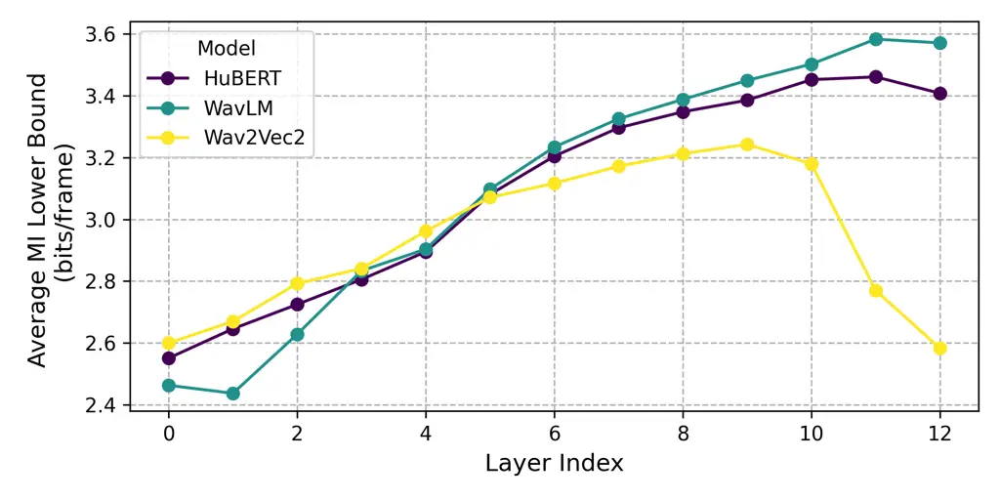
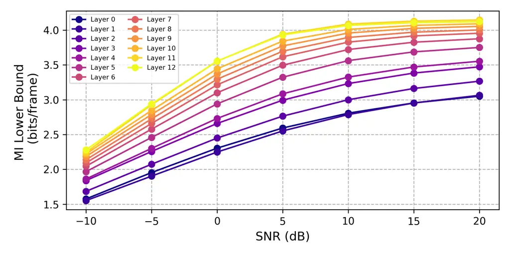
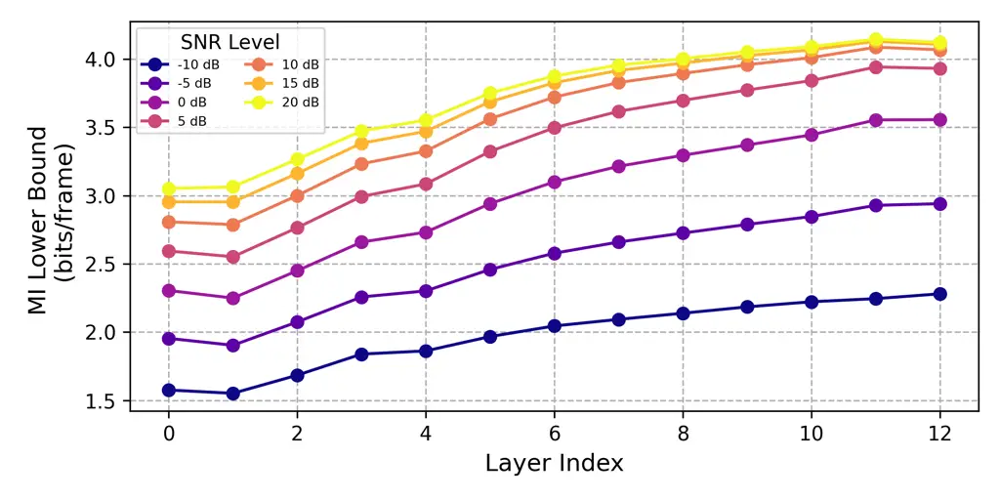
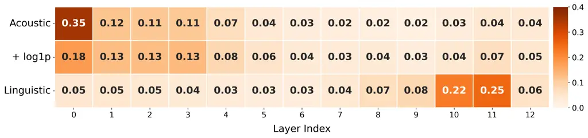
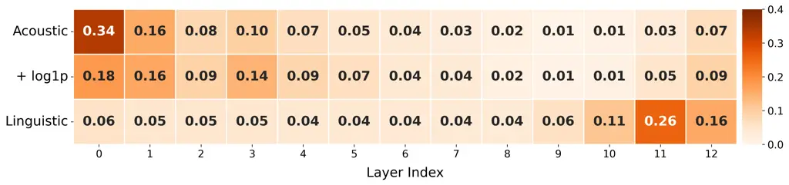
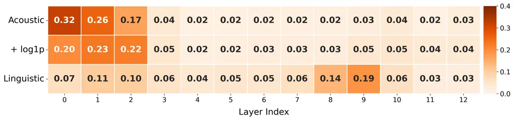
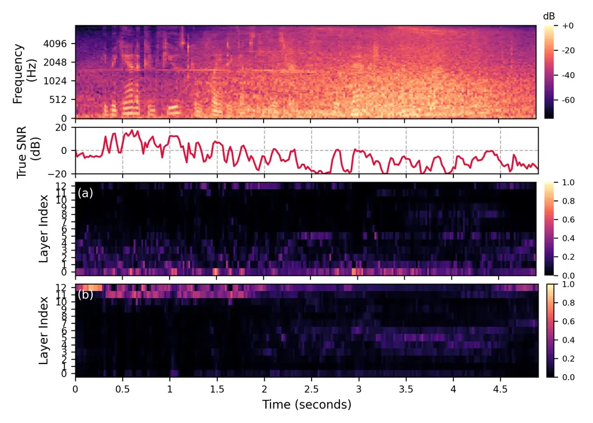

# Rethinking Speech Representation Aggregation in Speech Enhancement: A Phonetic Mutual Information Perspective

Seungu Han^(⋆)    Sungho Lee^(⋆)    Kyogu Lee^(⋆†)

###### Abstract

Recent speech enhancement (SE) models increasingly leverage
self-supervised learning (SSL) representations for their rich semantic
information. Typically, intermediate features are aggregated into a
single representation via a lightweight adaptation module. However, most
SSL models are not trained for noise robustness, which can lead to
corrupted semantic representations. Moreover, the adaptation module is
trained jointly with the SE model, potentially prioritizing acoustic
details over semantic information, contradicting the original purpose.
To address this issue, we first analyze the behavior of SSL models on
noisy speech from an information-theoretic perspective. Specifically, we
measure the mutual information (MI) between the corrupted SSL
representations and the corresponding phoneme labels, focusing on
preservation of linguistic contents. Building upon this analysis, we
introduce the linguistic aggregation layer, which is pre-trained to
maximize MI with phoneme labels (with optional dynamic aggregation) and
then frozen during SE training. Experiments show that this decoupled
approach improves Word Error Rate (WER) over jointly optimized
baselines, demonstrating the benefit of explicitly aligning the
adaptation module with linguistic contents.

###### Index Terms: 

Speech enhancement, representation analysis, mutual information, noise
robustness

^(†)^(†)address: ^(⋆) Department of Intelligence and Information, Seoul
National University, Republic of Korea  
^(†) Artificial Intelligence Institute, Seoul National University,
Republic of Korea

## 1 Introduction

Recent speech enhancement (SE) methods \[9, 10, 1, 26, 6\] have
increasingly integrated self-supervised learning (SSL) representations
of speech, motivated by their ability to capture high-level structure
and thereby information of linguistic content and speaker
characteristics. However, these SSL models are generally trained on
clean data without considering robustness, and there is no guarantee
that they retain their semantic information when the input signal is
corrupted. While research exists on robust speech representations \[28,
5, 14\], fine-tuning these large-scale models on noisy data is often
impractical. This is due to the high computational cost, the risk of
degrading performance on clean speech, and reduced generalization
capabilities, which is a primary goal of such representations.

Therefore, to quantify this degradation, we first analyze how linguistic
information is distributed and preserved across the model’s layers when
the input is corrupted. We employ the information-theoretic framework
from \[12\], measuring the lower bound of mutual information (MI)
between the SSL features obtained from noisy speech and their
corresponding linguistic contents (phonemes). We analyze three
pre-trained Base models: HuBERT \[8\], WavLM \[4\], and wav2vec 2 \[2\].
Note that, while recent work studied the layer-wise distribution of
linguistic properties for clean speech \[16, 17\], an analysis of these
representations under noisy conditions is needed to understand their
practical robustness. We find that, while the upper layers remain the
primary carriers of phonetic information even in noisy conditions, the
distribution varies with SNR and the absolute magnitude of peak
information is reduced.

In SE, SSL representations are commonly used as an auxiliary input along
with the noisy speech. A typical approach is to introduce a lightweight
aggregation module, e.g., a learnable weighted sum of intermediate
features \[9, 10, 26, 6\], which is then used to condition the SE model.
Such a method was motivated by observations that different layers tend
to capture distinct acoustic and linguistic properties \[16, 17\]. We
observe two limitations of this approach. First, the aggregation modules
are typically trained jointly with the SE model using only “acoustic”
criteria—ones that compare the SE prediction with clean ground truth in
the low-level signal representations, such as magnitude spectrograms. As
a result, the joint SE training could lack guidance to preserve or
recover the rich semantic information from the SSL features. Indeed, our
empirical analysis shows that the resulting aggregation weights from
joint SE training differ from those that maximize the MI with the
phonemes. Note that, while the SSL model can alternatively be used for a
semantic loss function \[7, 23, 22\], this method introduces significant
computational overhead from an extra forward and backward pass through
the SSL model during training. Second, our investigation shows that the
layer-wise information distribution varies with Signal-to-Noise Ratio
(SNR), and so do the optimal adaptation weights. Since SNR is a
time-varying characteristic, this suggests that the layer aggregation
should also be dynamic.

Building on this insight, we propose the Linguistic Aggregation Layer, a
module specialized in preserving linguistic content. In our decoupled
framework, this module is first pre-trained by maximizing the MI between
its output and phoneme labels. Once linguistically optimized, the module
is frozen and used to provide robust linguistic conditioning for the
main SE model. We first explore this method with a global Weighted-Sum
(WS) and find it effective at preserving linguistic information.
Additionally, we propose a more powerful, time-varying Dynamic
Weighted-Sum (DWS). Experiments show that this linguistic-first approach
significantly reduces the Word Error Rate (WER) compared to jointly
optimized baselines, demonstrating the benefit of explicitly aligning
the conditioning module with its intended semantic purpose.



(a) Layer-wise MI for various models.



(b) MI vs. SNR for each layer (WavLM).



(c) MI vs. Layer index for each SNR (WavLM).

Figure 1: Analysis of the MI lower bounds between the SSL features and
phonemes across different layers and SNR conditions. In (a), ”Average MI
Lower Bound” denotes values averaged across all evaluated SNR levels.

## 2 Measuring Self-supervised Models’ Robustness with Mutual Information

Liu et al. \[12\] adopted an information-theoretic framework and
proposed a practical method to estimate an SSL model’s performance on
downstream tasks. We extend the application of this framework to a more
challenging scenario, quantifying the noise robustness of SSL
representations and their applications for the SE task.

### 2.1 Bounding Mutual Information with Labeled Data

Most conventional MI estimation methods for speech representations \[21,
25, 8, 16\] rely on clustering of the representations to construct
empirical discrete probability distributions, due to the intractability
of direct MI estimation for high-dimensional, continuous data. In our
case, however, the presence of noise could further perturb the
representations, preventing us from ensuring that the clusters are
meaningful and effective for the MI quantification.

Therefore, we adopt the approach of \[12\], which instead lower-bounds
MI through direct probing. Specifically, we consider an MI $`I(Z;Y)`$
between a noisy representation $`Z`$ and a target categorical label
$`Y`$ (e.g., the corresponding phoneme). While the entropy of the target
$`H(Y)`$ can be estimated from an empirical distribution, the full MI
metric is intractable because the true conditional probability
$`p(y|z)`$ is unknown. To overcome this, \[12\] introduce a linear
probe, $`q_{\phi}(y|z)`$, to approximate $`p(y|z)`$. This allows us to
derive a tractable lower bound on the MI as follows,

```math
\displaystyle I(Z;Y) \displaystyle=H(Y)-H(Y\mid Z) \tag{1a}
```

```math
\displaystyle=H(Y)-\mathbb{E}_{(y,z)\sim p(y,z)}\bigl[-\log p(y\mid z)\bigr] \tag{1b}
```

```math
\displaystyle=H(Y)-\mathbb{E}_{p}\left[-\log q_{\phi}(y|z)-\log\frac{p(y|z)}{q_{\phi}(y|z)}\right] \tag{1c}
```

```math
\displaystyle\geq H(Y)-\mathbb{E}_{p}\left[-\log q_{\phi}(y|z)\right]. \tag{1d}
```

The last inequality follows from the non-negativity of the
Kullback-Leibler divergence. The final term,
$`\mathbb{E}_{p}\left[-\log q_{\phi}(y\mid z)\right]`$, is the
cross-entropy loss of the probe network. Therefore, by simply training
the probe for the classification, we obtain the desired MI lower bound.

### 2.2 Empirical Analysis

We analyze three pre-trained SSL models with “Base” size: HuBERT \[8\],
WavLM \[4\], and wav2vec 2 \[2\]. The probe network $`q_{\phi}`$ is a
3-layer multi-layer perceptron (MLP) with ReLU activation and dropout.
Following \[12\], this probe is trained to predict force-aligned phoneme
sequences \[13\] from noisy representations. These noisy representations
are created by adding noise from folds 1-4 of the ESC-50 dataset \[18\]
to the clean audio from the dev-clean subset of LibriSpeech \[15\] with
SNRs (-10, -5, 0, 5, 10, 15, and 20 dB). A trained MLP is used to
estimate MI noisy test samples created using test-clean and a disjoint
noise set from fold 5 of ESC-50. We optimize with a learning rate of
0.001 for 15 epochs.

Figure 1 shows the MI analysis results. Consistent with findings on
clean speech \[16, 17\], we observe that phonetic information peaks in
the upper layers (9-11). Notably, wav2vec 2.0 exhibits an
”autoencoder-style” behavior where, after deviating from input features,
the deepest layers trend back toward the input \[16\]. As expected,
Figure 1(b) confirms that information degrades across all layers as
noise increases, though the upper layers consistently retain more
linguistic content. Figure 1(c) shows that the absolute magnitude of the
peak is drastically reduced, suggesting that relying on a single layer
may not provide sufficient linguistic information.

## 3 Decoupled Linguistic Optimization for Speech Enhancement

Conventional adaptation modules in SE, such as weighted sums of layer
outputs, are typically trained jointly with the SE model using only
universal objectives, such as simple spectrogram or waveform losses.
While these objectives guide SE models to improve acoustic performance,
they also guide the adaptation module to prioritize acoustically
relevant features, neglecting its potential to preserve the semantic
content encoded in the SSL representations. This joint training approach
is standard practice, as in the SUPERB SE benchmark \[24, 9\] and in
subsequent work that improved acoustic performance by adding more
acoustic features \[10\].

To address this, we propose a decoupled approach that specializes the
adaptation module for its linguistic role. The adaptation module is
first trained independently to maximize the Mutual Information (MI)
between its output and phoneme labels. This ensures that the module is
specialized for retaining phonetic information. Once optimized, this
linguistic module is frozen and used to condition the downstream SE
model, which is then trained solely on acoustic objectives. This design
allows the SE model to leverage both rich linguistic input. We focus on
the widely-used weighted-sum architecture, which fuses the $`L`$ layer
representations $`\{L_{i}\}`$ into a single representation
$`R_{\mathrm{fused}}`$ using a set of scalar weights $`\mathbf{w}`$:

```math
R_{\mathrm{fused}}(\mathbf{w})=\sum_{i}w_{i}L_{i}. \tag{2}
```

The key difference between the conventional method and our proposal lies
in how the weights $`\mathbf{w}`$ in Eq. (2) are determined.

Acoustic-Tuned Weighted-Sum (WS): This is the conventional approach
where a weighted-sum adaptation module is jointly trained with the SE
model using a standard acoustic loss. The layer weights are learned
jointly with the SE model to minimize acoustic error, not to preserve
semantics.

Linguistic-Tuned Weighted-Sum (WS): Our primary method determines the
weights $`\mathbf{w}`$ on each layer differently. A set of fixed weights
$`\mathbf{w}^{*}`$ is pre-trained by maximizing the MI between the fused
representation $`R_{\mathrm{fused}}(\mathbf{w})`$ and the ground-truth
phoneme labels $`Y_{\mathrm{phoneme}}`$. This process identifies which
layers are consistently the most critical for linguistic content. Once
learned, these weights are frozen during SE training.

Hybrid Weighted-Sum (WS): Building on the above method, this approach
uses the same fixed linguistic weights $`\mathbf{w}^{*}`$ to combine the
transformer layers, but allows the aggregation weight $`w_{0}`$ on the
convolutional front-end of the SSL model to be fine-tuned with the SE
model. This tests whether adapting the initial feature extraction helps
while keeping the more linguistic layer fusion fixed.

Dynamic Weighted-Sum (DWS): Instead of assigning fixed scalar weights,
we introduce a self-attention mechanism to capture time-dependent
importance across layers. All hidden states from the $`L`$ layers are
stacked at each time step, forming a tensor of shape $`L\times D`$ where
$`D`$ is the feature dimension. A single-head self-attention is then
applied across the layer dimension:

```math
R_{\mathrm{attn}}=\mathrm{Avg}_{\text{layer}}\!\left(\mathrm{Softmax}\!\left(\frac{QK^{\top}}{\sqrt{D}}+\mathbf{b}\right)V\right), \tag{3}
```

where $`Q,K`$ are linear projections of the stacked layer
representations, and $`V`$ is the stack itself. The $`QK^{\top}`$ term
computes a dynamic $`L\times L`$ attention score matrix for each time
frame. $`\mathbf{b}`$ is a time-invariant learnable bias vector of shape
$`1\times L`$, encoding the layers’ global relative importance. The
attention output is then averaged across the layers to produce the final
fused representation. This design allows the model to dynamically select
informative layers at each time step while maintaining a global prior.
Analogous to the weighted sum case, we also compare two training
strategies: an acoustic-tuned DWS trained jointly with the SE model, and
our linguistic-tuned DWS, which is first pre-trained by maximizing the
lower bound of MI $`I(R_{\mathrm{attn}};Y)`$ and frozen during SE
training. For hybrid tuning, we make only bias of layer 0, $`b_{0}`$,
learnable.

### 3.1 Experimental Setup

We follow the SE downstream task in the official SUPERB benchmark
recipe¹¹ 1
github.com/s3prl/s3prl/tree/main/s3prl/downstream/enhancement_stft2
\[27, 24\], which uses the VoiceBank-DEMAND dataset \[3\]. We utilize
the same SE model as our backbone and replace only the standard
adaptation module with our proposed, linguistically optimized versions.
To investigate the impact of additional acoustic features, we also
conduct experiments where a log1p spectrogram is concatenated with the
SSL representation, following \[10\]. To obtain MI-maximizing
aggregation modules, we jointly train them with linear probes using the
same objective described in Section 2.1. We train the static linguistic
WS module on the same dataset as in Section 2.2. Regarding its higher
complexity, the linguistic DWS module is trained on the larger
train-clean-100 subset, augmented with MUSAN noise, to prevent
overfitting. We evaluate performance using two sets of metrics. For
acoustic quality, we report standard metrics: SI-SDR \[20\], STOI
\[11\], and PESQ \[19\]. To evaluate linguistic fidelity, we report the
Word Error Rate (WER) obtained by transcribing the enhanced speech with
a pre-trained Whisper-Large-v3²² 2 github.com/openai/whisper. Note that
WER can also be slightly affected by acoustic artifacts.

### 3.2 Results



(a) HuBERT



(b) WavLM



(c) wav2vec 2

Figure 2: Layer aggregation weights used for each model.

| Model     | Method          | MI $`\uparrow`$ | SI-SDR $`\uparrow`$ | STOI $`\uparrow`$ | PESQ $`\uparrow`$ | WER $`\downarrow`$ |
| --------- | --------------- | --------------- | ------------------- | ----------------- | ----------------- | ------------------ |
| log1p     |                 | 1.05            | 9.47                | 0.945             | 2.81              | 0.0649             |
| HuBERT    | layer 11        | 3.47            | 8.99                | 0.945             | 2.82              | 0.0710             |
|           | WS (Acoustic)   | 3.30            | 9.63                | 0.949             | 2.97              | 0.0663             |
|           | \+ log1p        | \-              | 9.68                | 0.951             | 3.06              | 0.0616             |
|           | WS (Linguistic) | 3.49            | 8.85                | 0.947             | 2.93              | 0.0609             |
|           | \+ log1p        | \-              | 9.46                | 0.950             | 2.97              | 0.0648             |
|           | WS (Hybrid)     | 3.43            | 9.34                | 0.949             | 3.00              | 0.0590             |
|           | \+ log1p        | \-              | 9.26                | 0.951             | 2.97              | 0.0586             |
| WavLM     | layer 11        | 3.57            | 8.90                | 0.946             | 2.84              | 0.0651             |
|           | WS (Acoustic)   | 3.47            | 9.44                | 0.949             | 2.99              | 0.0602             |
|           | \+ log1p        | \-              | 9.53                | 0.949             | 3.05              | 0.0585             |
|           | WS (Linguistic) | 3.61            | 8.97                | 0.947             | 2.97              | 0.0596             |
|           | \+ log1p        | \-              | 9.98                | 0.950             | 3.04              | 0.0583             |
|           | WS (Hybrid)     | 3.57            | 9.37                | 0.948             | 2.95              | 0.0583             |
|           | \+ log1p        | \-              | 9.61                | 0.950             | 3.06              | 0.0517             |
| wav2vec 2 | layer 9         | 3.23            | 8.83                | 0.945             | 2.85              | 0.0665             |
|           | WS (Acoustic)   | 3.08            | 9.09                | 0.949             | 2.92              | 0.0625             |
|           | \+ log1p        | \-              | 9.42                | 0.949             | 2.99              | 0.0619             |
|           | WS (Linguistic) | 3.32            | 8.98                | 0.948             | 2.92              | 0.0649             |
|           | \+ log1p        | \-              | 9.41                | 0.950             | 3.00              | 0.0630             |
|           | WS (Hybrid)     | 3.25            | 9.53                | 0.947             | 2.97              | 0.0603             |
|           | \+ log1p        | \-              | 9.47                | 0.947             | 2.96              | 0.0615             |

Table 1: SE performance across pre-trained models (HuBERT, WavLM,
wav2vec 2) using Weighted-Sum (WS) adaptation module.

#### 3.2.1 MI-optimized Weights Analysis

Our MI analysis provides the direct motivation for our decoupled
framework. The findings from Figure 1, that phonetic information
consistently peaks in the upper layers, suggest that an effective
adaptation module must prioritize these layers. The layer aggregation
weights in the weighted-sum module (Figure 2) confirm this principle.
The baseline, when optimized for acoustic reconstruction, learns to
heavily weight the acoustically-rich Layer 0 (after the convolutional
frontend and before the main transformer layers). While incorporating
the log1p spectrogram causes this focus to shift slightly towards the
middle layers, potentially due to the log1p partially providing
necessary acoustic information, it still largely prioritizes the use of
the bottom half of the model. In contrast, our fixed Linguistic WS
method, optimized for MI, correctly and consistently identifies and
prioritizes the linguistically-rich upper layers.

#### 3.2.2 Speech Enhancement Results

The performance results for the static WS module are shown in Table 1.
First, focusing on the methods using only the SSL representation, the WS
(Acoustic) baseline consistently achieves the better performance on
intrusive metrics, while our WS (Linguistic) method consistently yields
a higher MI score and a significantly better WER except for wav2vec 2,
although this comes at the cost of slight degradation on acoustic
performance. This confirms our hypothesis that the linguistic
information within SSL models can be effectively preserved and utilized
simply by optimizing how the existing layers are aggregated. For the
distinct behavior of the wav2vec 2 model, the MI analysis (Figure 1)
reveals that its phonetic information is not only lower overall but also
lacks a distinct peak. Consequently, when we train the linguistic
aggregation module, it learns a more distributed set of weights (Figure
2(c)). This lack of a clear linguistic peak within the representation
provides a direct explanation for its relatively poor WER performance
when used without additional acoustic features.

Next, we analyze the effect of incorporating the log1p spectrogram
feature. While the acoustically-tuned baseline benefits from this
additional input, naively concatenating the raw spectrogram with our
specialized linguistic representation leads to inconsistent and often
worse WER performance (Table 1). We hypothesize this is because the
downstream SE model struggles to effectively fuse features from two
different levels of characteristics. To relieve this, we propose WS
(Hybrid), which lets the model also use acoustic information of the SSL
feature, by fine-tuning the SSL model’s convolutional front-end (Layer 0) while keeping the linguistic fusion of the upper layers fixed. Its
consistently strong WER suggests that the failure is not in the
linguistic module itself, but in the naive fusion strategy, and that a
linguistic-first approach is still effective.

| Method           | MI $`\uparrow`$ | SI-SDR $`\uparrow`$ | STOI $`\uparrow`$ | PESQ $`\uparrow`$ | WER $`\downarrow`$ |
| ---------------- | --------------- | ------------------- | ----------------- | ----------------- | ------------------ |
| DWS (Acoustic)   | 3.23            | 9.42                | 0.948             | 2.98              | 0.0587             |
| \+ log1p         | \-              | 9.53                | 0.949             | 2.99              | 0.0545             |
| DWS (Linguistic) | 3.68            | 9.09                | 0.946             | 2.89              | 0.0578             |
| \+ log1p         | \-              | 9.54                | 0.949             | 3.02              | 0.0584             |
| DWS (Hybrid)     | 3.62            | 9.63                | 0.948             | 2.93              | 0.0593             |
| +log1p           | \-              | 9.61                | 0.949             | 3.04              | 0.0587             |

Table 2: SE performance using the Dynamic Weighted-Sum (DWS) adaptation
module on WavLM.

#### 3.2.3 Effects of Dynamic Aggregation Strategy

Next, we investigate the benefit of a time-varying strategy by comparing
the static WS module with the DWS module on WavLM (Table 2). The DWS
(Linguistic) consistently outperforms the static WS (Linguistic),
achieving the best WER among the purely SSL feature inputs. On the other
hand, the hybrid method for DWS did not show any advantage. This
suggests that the module’s ability to adapt to local, frame-level
changes in SNR, as motivated by our MI analysis, provides a tangible
performance benefit.

The visualization of the dynamic layer aggregation weights in Figure 3
provides insight into this behavior. While the acoustically-tuned DWS
(a) maintains a rigid focus on the acoustically-rich bottom layers, our
Linguistically-tuned DWS (b) learns an adaptive strategy. At high SNR,
the module prioritizes the top-most layers containing abstract
linguistic information. Conversely, during low-SNR segments, the
aggregation weights spread out to also include middle layers. As noise
is added, the absolute magnitude of the peak is reduced (Fig. 1(c)),
indicating that the top layer alone may not capture enough linguistic
information. Consequently, because our linguistic module is trained to
optimally combine layers, it also relies on additional layers, resulting
in more distributed aggregation weights under low SNR conditions. A
similar observation holds for the wav2vec 2 model (Fig. 2(c)), where the
MI peak value is also low. This suggests the module has learned a
robust, time-varying policy to search for linguistic content when the
primary source is degraded, validating the motivation for a dynamic
approach despite the need for further refinement to maximize empirical
gains.



Figure 3: The top two subfigures show the Mel spectrogram of noisy
speech and its corresponding time-varying SNR. The bottom two visualize
dynamic layer weights for WavLM: (a) acoustic-tuned baseline and (b)
linguistically-tuned module, respectively.

## 4 Discussion

In this work, we analyzed the robustness of SSL speech representations
using an MI framework. Our findings revealed that the distribution of
the remaining phonetic information is consistently peaking in the upper
layers of the model, which is similar to findings from clean-speech
analysis. And the phonetic information is degraded while noise corrupts
the signal. Based on these insights, we proposed decoupled adaptation
modules that align with the original intent of using SSL features for
SE, explicitly designed for linguistic roles. The results confirm our
hypothesis about a contradiction in conventional adaptation of SSL
features for SE: although these features are integrated for their
linguistic content, this information is corrupted by noise, and the
adaptation module is trained with objectives that prioritize acoustic
fidelity. Our method instead prioritized the linguistically-rich upper
layers, which were shown to be effective when the representation
contains sufficient information. As the SNR decreases, the peak
information is reduced, leading the model to rely on additional layers
for sufficient linguistic information and producing more distributed
aggregation. Since SNR varies over time, the model needs to aggregate
information locally, which supports our use of the Dynamic Weighted-Sum
approach. The combination of a decoupled framework and a dynamic
architecture effectively preserves the linguistic content, which is the
main purpose of using SSL representations for SE. This is achieved
through a simple, well-designed aggregation of the SSL model’s frozen
layers, yielding significant WER improvements with minimal acoustic
quality loss.

Future work could extend our MI analysis to other attributes, such as
speaker identity. A further research direction is to develop alternative
SE components that fully leverage the rich, abstract information
contained in SSL features, moving beyond a single aggregated
representation. Finally, designing a novel metric that is independent of
acoustic details might be desirable to assess the semantic performance
of SE.

## 5 Acknowledgements

This work was partly supported by the National Research Foundation of
Korea(NRF) grant funded by the Korea government(MSIT) \[No.
RS-2025-24683892, 50%\], \[No. RS-2024-00461617, 45%\], and Institute of
Information & communications Technology Planning & Evaluation (IITP)
grant funded by the Korea government(MSIT) \[NO.RS-2021-II211343, 5%\]
The GPUs were partly supported by the National IT Industry Promotion
Agency (NIPA)’s high-performance computing support program in 2025.

## References

- \[1\] N. Babaev et al. (2024) FINALLY: fast and universal speech
  enhancement with studio-like quality. NeurIPS 37, pp. 934–965. Cited
  by: §1.
- \[2\] A. Baevski, Y. Zhou, A. Mohamed, and M. Auli (2020) Wav2vec 2.0:
  a framework for self-supervised learning of speech representations.
  NeurIPS 33, pp. 12449–12460. Cited by: §1, §2.2.
- \[3\] C. V. Botinhao, X. Wang, S. Takaki, and J. Yamagishi (2016)
  Investigating rnn-based speech enhancement methods for noise-robust
  text-to-speech. In 9th ISCA speech synthesis workshop, pp. 159–165.
  Cited by: §3.1.
- \[4\] S. Chen et al. (2022) Wavlm: large-scale self-supervised
  pre-training for full stack speech processing. IEEE Journal of
  Selected Topics in Signal Processing 16 (6), pp. 1505–1518. Cited by:
  §1, §2.2.
- \[5\] H. R. Guimarães, A. Pimentel, A. R. Avila, M. Rezagholizadeh, B.
  Chen, and T. H. Falk (2023) Robustdistiller: compressing universal
  speech representations for enhanced environment robustness. In IEEE
  ICASSP, pp. 1–5. Cited by: §1.
- \[6\] H. R. Guimarães, J. Su, R. Kumar, T. H. Falk, and Z. Jin (2025)
  DiTSE: high-fidelity generative speech enhancement via latent
  diffusion transformers. arXiv preprint arXiv:2504.09381. Cited by: §1,
  §1.
- \[7\] T. Hsieh, C. Yu, S. Fu, X. Lu, and Y. Tsao (2021) Improving
  perceptual quality by phone-fortified perceptual loss using
  wasserstein distance for speech enhancement. In Interspeech,
  pp. 196–200. External Links:
  [Document](https://dx.doi.org/10.21437/Interspeech.2021-582), ISSN
  2958-1796 Cited by: §1.
- \[8\] W. Hsu, B. Bolte, Y. H. Tsai, K. Lakhotia, R. Salakhutdinov,
  and A. Mohamed (2021) Hubert: self-supervised speech representation
  learning by masked prediction of hidden units. IEEE/ACM TASLP 29,
  pp. 3451–3460. Cited by: §1, §2.1, §2.2.
- \[9\] Z. Huang, S. Watanabe, S. Yang, P. García, and S.
  Khudanpur (2022) Investigating self-supervised learning for speech
  enhancement and separation. In IEEE ICASSP, pp. 6837–6841. Cited by:
  §1, §1, §3.
- \[10\] K. Hung, S. Fu, H. Tseng, H. Chiang, Y. Tsao, and C. Lin (2022)
  Boosting Self-Supervised Embeddings for Speech Enhancement. In
  Interspeech, pp. 186–190. External Links:
  [Document](https://dx.doi.org/10.21437/Interspeech.2022-10002), ISSN
  2958-1796 Cited by: §1, §1, §3.1, §3.
- \[11\] J. Jensen and C. H. Taal (2016) An algorithm for predicting the
  intelligibility of speech masked by modulated noise maskers. IEEE/ACM
  TASLP 24 (11), pp. 2009–2022. Cited by: §3.1.
- \[12\] A. H. Liu, S. Yeh, and J. R. Glass (2024) Revisiting
  self-supervised learning of speech representation from a mutual
  information perspective. In IEEE ICASSP, pp. 12051–12055. Cited by:
  §1, §2.1, §2.2, §2.
- \[13\] M. McAuliffe, M. Socolof, S. Mihuc, M. Wagner, and M.
  Sonderegger (2017) Montreal forced aligner: trainable text-speech
  alignment using kaldi.. In Interspeech, Vol. 2017, pp. 498–502. Cited
  by: §2.2.
- \[14\] D. Ng et al. (2023) De’hubert: disentangling noise in a
  self-supervised model for robust speech recognition. In IEEE ICASSP,
  pp. 1–5. Cited by: §1.
- \[15\] V. Panayotov, G. Chen, D. Povey, and S. Khudanpur (2015)
  Librispeech: an asr corpus based on public domain audio books. In IEEE
  ICASSP, pp. 5206–5210. Cited by: §2.2.
- \[16\] A. Pasad, J. Chou, and K. Livescu (2021) Layer-wise analysis of
  a self-supervised speech representation model. In IEEE ASRU,
  pp. 914–921. Cited by: §1, §1, §2.1, §2.2.
- \[17\] A. Pasad, B. Shi, and K. Livescu (2023) Comparative layer-wise
  analysis of self-supervised speech models. In IEEE ICASSP, pp. 1–5.
  Cited by: §1, §1, §2.2.
- \[18\] K. J. Piczak (2015) ESC: dataset for environmental sound
  classification. In Proceedings of the 23rd ACM international
  conference on Multimedia, pp. 1015–1018. Cited by: §2.2.
- \[19\] A.W. Rix, J.G. Beerends, M.P. Hollier, and A.P. Hekstra (2001)
  Perceptual evaluation of speech quality (pesq)-a new method for speech
  quality assessment of telephone networks and codecs. In IEEE ICASSP,
  Vol. 2, pp. 749–752 vol.2. External Links:
  [Document](https://dx.doi.org/10.1109/ICASSP.2001.941023) Cited by:
  §3.1.
- \[20\] J. L. Roux, S. Wisdom, H. Erdogan, and J. R. Hershey (2019) SDR
  – half-baked or well done?. In IEEE ICASSP, Vol. , pp. 626–630.
  External Links:
  [Document](https://dx.doi.org/10.1109/ICASSP.2019.8683855) Cited by:
  §3.1.
- \[21\] M. S. Sajjadi, O. Bachem, M. Lucic, O. Bousquet, and S.
  Gelly (2018) Assessing generative models via precision and recall.
  NeurIPS 31. Cited by: §2.1.
- \[22\] H. Sato et al. (2023) Downstream task agnostic speech
  enhancement with self-supervised representation loss. In Interspeech,
  pp. 854–858. External Links:
  [Document](https://dx.doi.org/10.21437/Interspeech.2023-1578), ISSN
  2958-1796 Cited by: §1.
- \[23\] O. Tal, M. Mandel, F. Kreuk, and Y. Adi (2022) A Systematic
  Comparison of Phonetic Aware Techniques for Speech Enhancement. In
  Interspeech, pp. 1193–1197. External Links:
  [Document](https://dx.doi.org/10.21437/Interspeech.2022-695), ISSN
  2958-1796 Cited by: §1.
- \[24\] H. Tsai et al. (2022) SUPERB-sg: enhanced speech processing
  universal performance benchmark for semantic and generative
  capabilities. In ACL, External Links:
  [Link](https://aclanthology.org/2022.acl-long.580/),
  [Document](https://dx.doi.org/10.18653/v1/2022.acl-long.580) Cited by:
  §3.1, §3.
- \[25\] E. Voita, R. Sennrich, and I. Titov (2019) The bottom-up
  evolution of representations in the transformer: a study with machine
  translation and language modeling objectives. In NAACL, External
  Links: [Link](https://aclanthology.org/D19-1448/),
  [Document](https://dx.doi.org/10.18653/v1/D19-1448) Cited by: §2.1.
- \[26\] H. Yang, J. Su, M. Kim, and Z. Jin (20242024) Genhancer:
  high-fidelity speech enhancement via generative modeling on discrete
  codec tokens. In Interspeech, pp. 1170–1174. Cited by: §1, §1.
- \[27\] S. Yang et al. (2021) SUPERB: speech processing universal
  performance benchmark. In Interspeech, pp. 1194–1198. External Links:
  [Document](https://dx.doi.org/10.21437/Interspeech.2021-1775), ISSN
  2958-1796 Cited by: §3.1.
- \[28\] Q. Zhu, L. Zhou, J. Zhang, S. Liu, Y. Hu, and L. Dai (2023)
  Robust data2vec: noise-robust speech representation learning for asr
  by combining regression and improved contrastive learning. In IEEE
  ICASSP, pp. 1–5. Cited by: §1.
