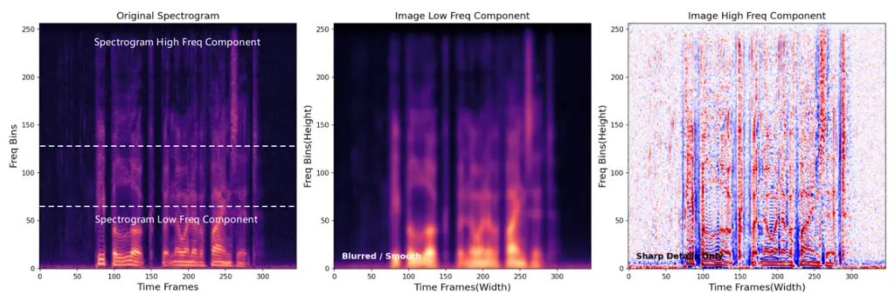
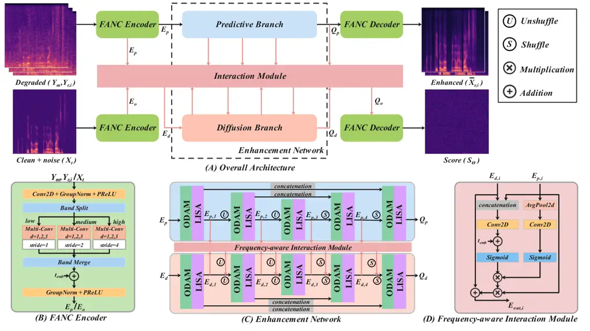
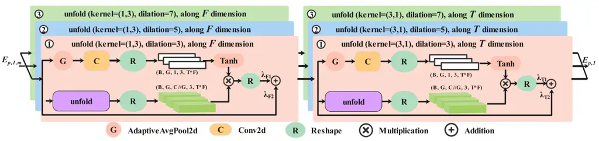
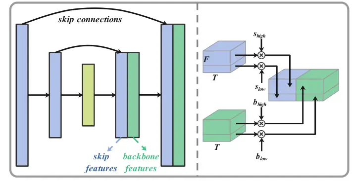
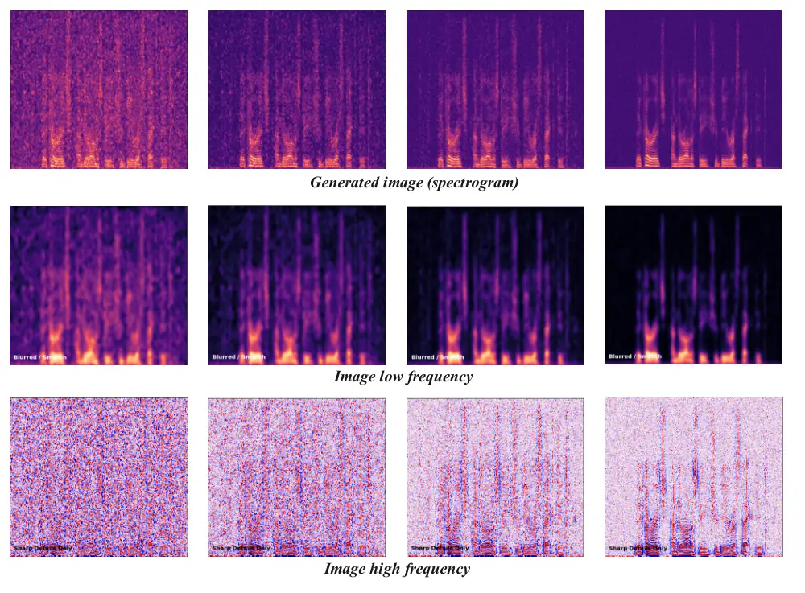
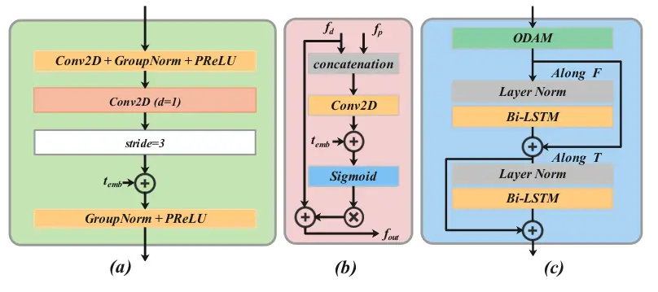
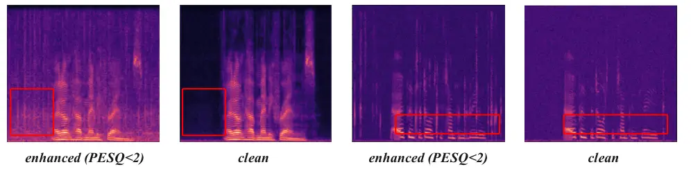
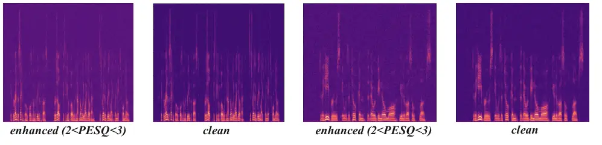
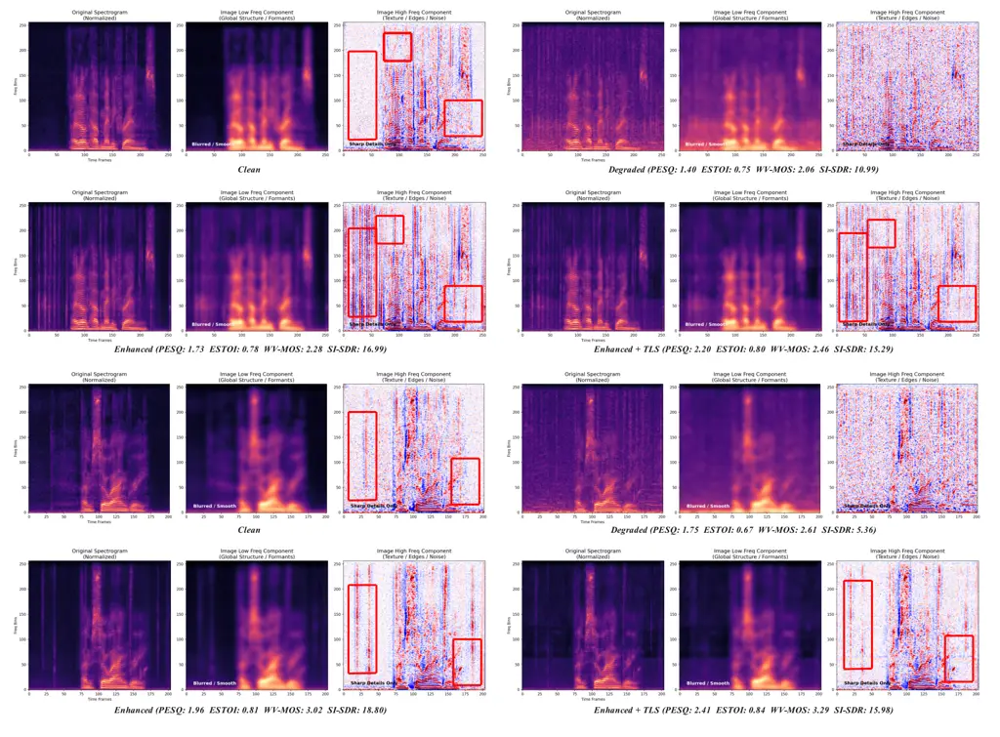

# Dual-View Predictive Diffusion: Lightweight Speech Enhancement via Spectrogram-Image Synergy

Ke Xue Affiliation: School of Cyberspace Science and Technology, Beijing
Institute of Technology, Beijing 100081, China    Rongfei Fan
Affiliation: School of Cyberspace Science and Technology, Beijing
Institute of Technology, Beijing 100081, China Correspondence to:
<fanrongfei@bit.edu.cn>    Kai Li Affiliation: Department of Computer
Science and Technology, Institute for AI, BNRist, Tsinghua University,
Beijing 100084, China    Shanping Yu Affiliation: School of Cyberspace
Science and Technology, Beijing Institute of Technology, Beijing 100081,
China    Puning Zhao Affiliation: School of Cyberspace Science and
Technology Sun Yat-sen University, Guangzhou 510006, China    Jianping
An Affiliation: School of Cyberspace Science and Technology, Beijing
Institute of Technology, Beijing 100081, China

###### Abstract

Diffusion models have recently set new benchmarks in Speech Enhancement
(SE). However, most existing score-based models treat speech
spectrograms merely as generic 2D images, applying uniform processing
that ignores the intrinsic structural sparsity of audio, which results
in inefficient spectral representation and prohibitive computational
complexity. To bridge this gap, we propose DVPD, an extremely
lightweight Dual-View Predictive Diffusion model, which uniquely
exploits the dual nature of spectrograms as both visual textures and
physical frequency-domain representations across both training and
inference stages. Specifically, during training, we optimize spectral
utilization via the Frequency-Adaptive Non-uniform Compression (FANC)
encoder, which preserves critical low-frequency harmonics while pruning
high-frequency redundancies. Simultaneously, we introduce a Lightweight
Image-based Spectro-Awareness (LISA) module to capture features from a
visual perspective with minimal overhead. During inference, we propose a
Training-free Lossless Boost (TLB) strategy that leverages the same
dual-view priors to refine generation quality without any additional
fine-tuning. Extensive experiments across various benchmarks demonstrate
that DVPD achieves state-of-the-art performance while requiring only 35%
of the parameters and 40% of the inference MACs compared to SOTA
lightweight model, PGUSE. These results highlight DVPD’s superior
ability to balance high-fidelity speech quality with extreme
architectural efficiency. Code and audio samples are available at the
anonymous website:
[https://anonymous.4open.science/r/dvpd_demo-E630](https://anonymous.4open.science/r/dvpd_demo-E630)

###### Keywords: 

Machine Learning, ICML

## 1 Introduction

In real-world acoustic environments, speech signals are commonly
degraded by noise (Braun et al., 2021), reverberation, clipping (Mack
and Habets, 2019), and other distortions, which severely impair speech
quality and intelligibility. Speech enhancement (SE) seeks to recover
high-fidelity speech from corrupted signals. Existing SE methods (Braun
et al., 2021; Mack and Habets, 2019; Purushothaman et al., 2023; Wang
and Wang, 2021) have predominantly focused on task-oriented settings,
offering tailored solutions for individual distortions, whereas
practical scenarios often involve multiple interacting degradations.
Universal speech enhancement (USE) (Pascual et al., 2019; Nair and
Koishida, 2021; Serrà et al., 2022; Scheibler et al., 2024) has emerged
as a promising paradigm for addressing diverse distortions within a
unified framework; however, reconciling task-specific precision with
universal robustness remains a formidable challenge.



Figure 1: Dual-view of spectrogram frequency bands. Left: Acoustic
perspective; Middle and Right: Visual image perspectives of
low-frequency and high-frequency components, respectively.

Current SE methods are primarily bifurcated into two paradigms:
predictive and generative. Predictive models (Krawczyk and Gerkmann,
2014; Williamson et al., 2015; Park et al., 2022; Lu et al., 2023;
Abdulatif et al., 2024) typically formulate SE as a supervised learning
task, optimizing either a direct mapping or a temporal-frequency mask to
recover clean speech through deterministic objective functions. Although
computational efficient and effective for single distortions, these
methods often suffer from over-smoothing due to intrinsic “regression to
the mean” phenomenon, leading to the loss of fine-grained acoustic
details, “muffled” outputs, and poor generalization in complex
multi-distortion scenarios.

In contrast, generative methods model the intrinsic data distribution in
a unified latent space, enabling effective recovery under severe
information loss. Among various paradigms, including VAEs (Kingma and
Welling, 2013; Richter et al., 2020), GANs (Goodfellow et al., 2014;
Kong et al., 2020), and Normalizing Flows (Rezende and Mohamed, 2015;
Yang et al., 2025a; Lee et al., 2025), Diffusion Models (Lu et al., 2022) have recently emerged as SOTA, driven by their success in image
synthesis and their growing adoption in SE. Score-based diffusion models
(Welker et al., 2022; Richter et al., 2023) are particularly notable for
formulating diffusion via stochastic differential equations, enabling a
continuous-time modeling framework. However, “pure” diffusion models
entail prohibitive computational costs due to numerous iterative reverse
steps. To mitigate this, recent work has shifted toward a
predictive-diffusion paradigm (Lemercier et al., 2023; Scheibler et al.,
2024; Zhang et al., 2025), which employs predictive models as robust
priors to constrain the diffusion process, thereby enhancing
reconstruction stability while reducing sampling overhead.

Despite these advancements, current methods still remain computationally
burdensome. We attribute this inefficiency to a fundamental oversight:
spectrograms are treated as generic 2D images with spatially uniform
operations, ignoring their underlying physical structure. As illustrated
in Fig. 1, we argue that extreme efficiency requires embracing the dual
nature of spectrograms from two complementary perspectives: 1) a visual
perspective, where spectrograms exhibit image-like textures and spatial
patterns (Welker et al., 2022); 2) an acoustic perspective, where
spectrograms are physical representations with strong anisotropy and
non-uniform information density (Yu and Luo, 2023), featuring
information-dense low-frequency harmonics and sparse yet critical
high-frequency transients.

Based on above complementary views, we introduce DVPD, the dual-view
predictive diffusion framework that harmonizes visual structural
textures with acoustic physics. To optimize spectral efficiency, we
design a frequency-adaptive non-uniform compression (FANC) encoder,
which employs heterogeneous kernels to preserve low-frequency harmonic
integrity while pruning high-frequency redundancies, in alignment with
human auditory frequency resolution. Furthermore, we incorporate a
backbone augmented with a multi-range lightweight image-based
spectro-awareness (LISA) module to efficiently capture anisotropic
features, including horizontal harmonic correlations and vertical
transients, with minimal overhead. At inference time, we further propose
a training-free lossless boost (TLB) strategy that exploits the
dual-view structure to recalibrate feature scales, yielding consistent
quality improvements without additional training. Extensive experiments
demonstrate that DVPD achieves a new efficiency and quality trade-off in
generative SE. Notably, our model attains SOTA performance while using
only 35% of the parameters and 40% of the MACs of the SOTA lightweight
model, PGUSE, thereby establishing a new baseline for efficiency and
quality in generative SE.



Figure 2: Architectural overview of the proposed DVPD. (A) The overall
symmetrical dual-branch structure of DVPD, comprising the predictive
branch (upper) and the diffusion branch (lower). (B) Detailed design of
the Frequency-Adaptive Non-uniform Compression (FANC) Encoder. (C)
Detailed design of enhancement network. (D) Illustration of the
Frequency-Aware Interaction module.

## 2 Related Work

### 2.1 Score-based Diffusion Models for SE

Diffusion Probabilistic Models (DPMs) have revolutionized SE by
mitigating the over-smoothing and loss of high-frequency details common
in traditional methods (Lu et al., 2021; Lu et al., 2022). The field has
matured with the introduction of continuous-time Stochastic Differential
Equations (SDEs), enabling sophisticated score-based modeling in the
complex STFT domain (Welker et al., 2022; Richter et al., 2023) and
refined conditioning mechanisms (Tai et al., 2023; Yang et al., 2025b).
Despite their generative prowess, these models incur prohibitive
computational costs due to the extensive iterative sampling steps. While
recent efforts like Latent Diffusion Models (LDM) (Zhao et al., 2025)
attempt to mitigate this by operating in compressed spaces or optimizing
trajectories, the inherent inference complexity remains a significant
bottleneck.

### 2.2 Predictive-Diffusion Hybrid Architectures

To alleviate the sampling bottleneck and suppress hallucinations, recent
trends have converged toward hybrid paradigms that integrate predictive
and generative models. These approaches generally follow three
trajectories: 1) Conditioning-based integration, where a predictive
network serves as an auxiliary conditioner to guide the diffusion
process (Serrà et al., 2022; Scheibler et al., 2024; Kim et al., 2024); 2) Cascaded regression refinement, where a predictive model provides an
initial estimate or residual, which is then refined by the diffusion
branch to reduce the required sampling steps (Qiu et al., 2023;
Lemercier et al., 2023); 3) Parallel Architecture, which introduces a
dual-branch parallel framework that achieves SOTA performance with
relatively low complexity (Zhang et al., 2025). DVPD belongs to the
parallel category but distinguishes itself through a domain-specific
architecture. Instead of relying on generic spatially-homogeneous
backbones, we explicitly model “spectrogram-image synergy” by bridging
acoustic physics with visual structural priors, which allows DVPD to
achieve superior performance with significantly fewer parameters and
MACs.

## 3 The Proposed Model

### 3.1 Preliminaries: Score-based Diffusion Models

Score-based diffusion models conceptualize SE as a continuous time
transformation between clean speech
$`\mathbf{x}_{0}\in\mathbb{R}^{1\times L}`$ and a noisy condition
$`\mathbf{y}\in\mathbb{R}^{1\times L}`$ via Stochastic Differential
Equations (SDEs) (Song et al., 2021). The forward process
$`\{\mathbf{x}_{t}\}_{t=0}^{T}`$ perturbs the data distribution toward a
prior distribution, while the reverse process recovers clean signals by
learning the score function
$`\nabla_{\mathbf{x}_{t}}\log p_{t}(\mathbf{x}_{t})`$. In the context of
SE, two prominent SDE formulations are widely used: Ornstein-Uhlenbeck
Variance Exploding (OUVE) (Welker et al., 2022; Richter et al., 2023)
and Brownian Bridge with Exponential Diffusion (BBED) (Lay et al.,
2023). To mitigate the prior mismatch and inference bias inherent in
finite-time OUVE formulations, we adopt the BBED. Unlike OUVE, where the
mean only converges to $`\mathbf{y}`$ as $`T\to\infty`$, BBED’s linear
mean evolution ensures the forward process reaches $`\mathbf{y}`$ at
$`T=1`$, significantly enhancing restoration stability. A comprehensive
mathematical comparison is provided in Appendix A.

### 3.2 Overall Pipeline

DVPD follows the parallel predictive-diffusion architecture illustrated
in Fig. 2(A). All operations are conducted in the T-F domain using STFT.
Given a clean waveform $`\mathbf{x}_{0}\in\mathbb{R}^{1\times L}`$ and a
degraded waveform $`\mathbf{y}\in\mathbb{R}^{1\times L}`$, we obtain
their complex spectrograms
$`\mathbf{X}_{r,i},\mathbf{Y}_{r,i}\in\mathbb{R}^{2\times F\times T}`$,
and the magnitude spectrum of them
$`\mathbf{Y}_{m},\mathbf{X}_{m}\in\mathbb{R}^{1\times F\times T}`$.
Power-law compression is then applied to compensate for the heavy-tailed
distribution of speech amplitudes (Gerkmann and Martin, 2010) and
improve numerical stability.



Figure 3: Detailed architecture of the LISA module.

The predictive branch takes the degraded spectrogram
$`\mathbf{Y}=[\mathbf{Y}_{r,i},\mathbf{Y}_{m}]\in\mathbb{R}^{3\times F\times T}`$
as input, which is initially projected by the FANC encoder into a
compressed latent space to yield encoded features
$`\mathbf{E}_{p}\in\mathbb{R}^{C\times F_{1}\times T}`$. Subsequently,
$`\mathbf{E}_{p}`$ is processed by the hierarchical enhancement network
to produce $`\mathbf{Q}_{p}\in\mathbb{R}^{C\times F_{1}\times T}`$,
which is then passed through the FANC decoder to reconstruct the
deterministic spectral estimate
$`\hat{\mathbf{X}}_{r,i}\in\mathbb{R}^{2\times F\times T}`$.
Simultaneously, in the diffusion branch, the noise-perturbed magnitude
$`\mathbf{X}_{t}\in\mathbb{R}^{1\times F\times T}`$ is encoded into
$`\mathbf{E}_{o}\in\mathbb{R}^{C\times F_{1}\times T}`$ via the same
FANC encoder. To leverage predictive guidance, an initial interaction
module harmonizes $`\mathbf{E}_{o}`$ with $`\mathbf{E}_{p}`$ to produce
a synergistic representation
$`\mathbf{E}_{d}\in\mathbb{R}^{C\times F\times T}`$. This latent is then
refined by the hierarchical enhancement network, where cross-branch
interaction is performed at every level to inject stable deterministic
priors into the diffusion flow. The resulting diffusion features
$`\mathbf{Q}_{d}`$ are further calibrated with $`\mathbf{Q}_{p}`$ to
yield $`\mathbf{Q}_{o}\in\mathbb{R}^{C\times F_{1}\times T}`$, which is
ultimately projected through the FANC decoder to estimate the score
function $`\mathbf{S}_{\theta}\in\mathbb{R}^{1\times F\times T}`$.

Upon the estimation of the score function $`\mathbf{S}_{\theta}`$, the
enhancement process concludes with a synergistic fusion and
reconstruction phase. To ensure computational tractability, we execute a
partial reverse diffusion process starting from a reduced time step
$`T_{\text{rs}}`$, initialized as
$`\mathbf{X}_{T_{\text{rs}}}\approx\mu(\bar{\mathbf{X}}^{p}_{m},\mathbf{Y}_{m},T_{\text{rs}})+\sigma(T_{\text{rs}})\mathbf{z}`$.
Throughout this iterative refinement, the TLB strategy (Sec. 3.4) is
seamlessly integrated into the hierarchical U-Net backbone to adaptively
modulate the feature maps. After $`N`$ sampling steps, the resulting
generative magnitude $`\hat{\mathbf{X}}^{d}_{m}`$ is fused with the
predictive magnitude $`\bar{\mathbf{X}}^{p}_{m}`$ to yield the final
magnitude spectrum:

```math
\hat{\mathbf{X}}_{m}=\alpha\bar{\mathbf{X}}^{p}_{m}+(1-\alpha)\hat{\mathbf{X}}^{d}_{m}, \tag{1}
```

where $`\alpha`$ serves to balance deterministic stability with
generative realism. The final complex spectrogram is then reconstructed
by coupling $`\hat{\mathbf{X}}_{m}`$ with the phase spectrum inherited
directly from the predictive branch, ultimately facilitating
high-fidelity speech restoration with minimal computational overhead. A
comprehensive summary of DVPD inference procedure is detailed in
Algorithm 1 (see Appendix).

### 3.3 Detailed Architectural Components

The core architecture of DVPD contains: FANC encoder, enhancement
network, Frequency-aware Interaction (FI) Module, FANC decoder, which is
described as follows:

#### FANC Encoder

The FANC encoder (Fig. 2(B)) is designed to exploit the non-uniform
information density of speech spectrograms, which distinguishes them
from spatially homogeneous natural images. For inputs
$`\mathbf{Y}\in\mathbb{R}^{3\times F\times T}`$ or
$`\mathbf{X}_{m}\in\mathbb{R}^{1\times F\times T}`$, FANC implements a
band-specific partitioning strategy: (i) low-band ($`0`$–$`2`$ kHz),
containing the fundamental frequency ($`f_{0}`$) and primary formants,
is preserved without compression to maintain critical harmonic
integrity; (ii) mid-band ($`2`$–$`4`$ kHz) undergoes moderate
compression; and (iii) high-band ($`>4`$ kHz) is heavily compressed to
prune spectral redundancy. In contrast to architectures like BSRNN (Yu
and Luo, 2023) or PGUSE (Zhang et al., 2025) that often over-compress
the low-frequency manifold, FANC prioritizes the preservation of the
“acoustic image.” This is achieved through heterogeneous dilated kernels
($`3\times 3,3\times 5,\text{and }3\times 7`$) that create an
anisotropic receptive field specifically targeting vertical transients
and horizontal harmonics. For the predictive branch, this process yields
the encoded features
$`\mathbf{E}_{p}\in\mathbb{R}^{C\times F_{1}\times T}`$. For the
diffusion branch, sinusoidal time embeddings (Song et al., 2021) are
integrated post-fusion, resulting in the generative encoded features
$`\mathbf{E}_{o}\in\mathbb{R}^{C\times F_{1}\times T}`$.

#### Enhancement Network

To extract hierarchical acoustic features, we employ a 3-layer symmetric
U-Net (Fig. 2(C)) as the core enhancement network. Each layer of the
backbone is conceptualized as a global-to-local refinement unit,
integrating the Omni-Directional Attention Mechanism (ODAM) (Ke et al., 2026) and the LISA module. Specifically, the predictive features
$`\mathbf{E}_{p}`$ and diffusion features $`\mathbf{E}_{d}`$ are
processed independently within each level before undergoing cross-branch
calibration via the FI module. We utilize Pixel Unshuffle for
downsampling and Pixel Shuffle for upsampling, effectively mitigating
the information loss inherent in traditional pooling. At each level,
downsampled features are fused with their counterparts through additive
residuals to serve as input for the subsequent stage, ultimately
yielding the refined hierarchical representations $`\mathbf{Q}_{p}`$ and
$`\mathbf{Q}_{d}`$.

Taking the first predictive level as an exemplar, the feature
$`\mathbf{E}_{p}`$ is first processed by the ODAM to capture global
dependencies and model long-range correlations across both time and
frequency axes. The resulting globally-aware feature
$`\mathbf{E}_{p,1,m}`$ is then fed into the LISA module to refine
spectral textures through a three-stage dynamic filtering process: (i)
Dynamic Kernel Generation: instance-specific weights
$`\mathbf{W}_{d}=\tanh(\text{Conv}_{1\times 1}(\text{GAP}(\mathbf{E}_{p,1,m})))`$
are derived from the global context $`\mathbf{E}_{p,1,m}`$; (ii) Stripe
Dynamic Convolution: anisotropic features are aggregated via
$`\mathbf{L(\cdot)}=\sum_{k=1}^{K}\mathbf{W}_{d}^{(k)}\odot\mathcal{U}(\text{Pad}(\mathbf{\cdot}),d)^{(k)}`$,
where $`\mathcal{U}(\cdot,d)`$ denotes an unfold operation; and (iii)
Dual-path Refinement: features are fused to balance structural stability
and detail:

```math
\displaystyle\mathbf{O}_{F,d} \displaystyle=\lambda_{F1,d}\odot\mathbf{L(\mathbf{E}_{p,1,m})}+\lambda_{F2,d}\odot\mathbf{E}_{p,1,m}, \tag{2}
```

```math
\displaystyle\mathbf{N}_{d} \displaystyle=\lambda_{T1,d}\odot\mathbf{L(\mathbf{O}_{F,d})}+\lambda_{T2,d}\odot\mathbf{O}_{F,d}.
```

The final refined output $`\mathbf{E}_{p,1}`$ is formulated as
$`\mathbf{E}_{p,1}=\text{Conv}(\sum_{d\in\{3,5,7\}}(\gamma_{d}\Psi_{d}(\mathbf{E}_{p,1,m})+\beta_{d}\mathbf{N}_{d}))`$,
where $`\Psi_{d}(\cdot)`$ represents sequential $`\mathcal{T}`$ and
$`\mathcal{F}`$ stripe operations with multi-scale dilations
$`d\in\{3,5,7\}`$.

#### Frequency-aware Interaction (FI) Module

The FI module (Fig. 2(D)) adaptively calibrates the cross-branch feature
exchange through a dual-path gating mechanism. Given the diffusion
feature $`\mathbf{E}_{d,i}`$, the predictive feature
$`\mathbf{E}_{p,i}`$, and the time embedding $`t_{emb}`$, the
interaction unfolds as follows: (i) Joint Feature Fusion:
$`\mathbf{E}_{d,i}`$ and $`\mathbf{E}_{p,i}`$ are concatenated and
processed via a Conv2D layer, with $`t_{emb}`$ added to inject
temporal-diffusion context; (ii) Global Prior Extraction: a parallel
path applies AvgPool2d and Conv2D to $`\mathbf{E}_{p,i}`$ to capture
global spectral-temporal dependencies. Both paths are then passed
through Sigmoid functions to generate dynamic importance masks, which
are element-wise multiplied to produce a unified reliability weight.
This weight modulates the predictive guidance $`\mathbf{E}_{p,i}`$
before it is residually added to the original diffusion latent. This
process yields the final interaction output $`\mathbf{E}_{out,i}`$,
ensuring that the generative process prioritizes robust low-frequency
deterministic priors while effectively suppressing unreliable,
noise-dominated regions in the predictive cues.

#### FANC Decoder

The FANC decoder symmetrically mirrors the partitioning structure of the
encoder to facilitate resolution recovery. Taking the hierarchical
features $`\mathbf{Q}_{p}`$ and $`\mathbf{Q}_{o}`$ as inputs, the
decoder utilizes sub-pixel convolutions (SP-Conv2D) (Shi et al., 2016)
to inversely map the compressed latent representations back to the
original spectral resolution $`F\times T`$. This process ultimately
yields the deterministic complex estimate
$`\hat{\mathbf{X}}_{r,i}\in\mathbb{R}^{2\times F\times T}`$ from the
predictive branch and the score estimate
$`\mathbf{S}_{\theta}\in\mathbb{R}^{1\times F\times T}`$ from the
diffusion branch.

### 3.4 TLB strategy



Figure 4: Operations of the TLB strategy. Scaling factors $`b`$ and
$`s`$ modulate the intensity of backbone and skip features,
respectively.

#### TLB strategy

Treating the spectrogram as a structural 2D manifold allows us to
analyze the denoising dynamics within the U-Net backbone. Recent studies
(Si et al., 2024) suggest that the U-Net backbone inherently prioritizes
low-frequency structural restoration while aggressively suppressing
high-frequency noise. Conversely, skip connections are instrumental in
recovering fine-grained transients but may inadvertently propagate
residual noise or expedite premature convergence during the generative
process. Building on our dual-view perspective, we propose the TLB
strategy, an inference technique that modulates feature maps without
additional training (Fig. 4). We define four scaling factors:
$`b_{{low}},b_{{high}}`$ (backbone) and $`s_{{low}},s_{{high}}`$ (skip).
The $`b`$ factors are formulated to modulate the backbone’s
high-frequency suppression intensity, whereas the $`s`$ factors
recalibrate the spectral energy integrity of low-frequency harmonics
within the skip connections. By aligning these factors with the
spectrogram’s anisotropic properties, where “low” and “high”
(Fig. 1(left)) correspond to the distinct harmonic and transient regions
of the spectrogram, TLB adaptively balances noise reduction and
fine-grained detail preservation during the generative refinement stage.
Please note that we only use the TLB strategy on the diffusion branch.
For a more detailed description of using the spectrum as different
frequency components for image denoising, see Appendix B.

|                                       |       |        |      |                   |                    |                   |                   |                   |                     |
| ------------------------------------- | ----- | ------ | ---- | ----------------- | ------------------ | ----------------- | ----------------- | ----------------- | ------------------- |
| Method                                | Para. | MACs   | Type | PESQ $`\uparrow`$ | ESTOI $`\uparrow`$ | CSIG $`\uparrow`$ | CBAK $`\uparrow`$ | COVL $`\uparrow`$ | WV-MOS $`\uparrow`$ |
| Degraded                              | \-    | \-     | \-   | 1.67 $`\pm`$ 0.60 | 0.70 $`\pm`$ 0.18  | 2.41 $`\pm`$ 1.15 | 1.92 $`\pm`$ 0.60 | 2.01 $`\pm`$ 0.87 | 1.79 $`\pm`$ 2.13   |
| Conv-TasNet (Luo and Mesgarani, 2019) | 3.4M  | 3.2G   | P    | 2.01 $`\pm`$ 1.21 | 0.76 $`\pm`$ 0.09  | 3.02 $`\pm`$ 0.99 | 2.23 $`\pm`$ 0.78 | 2.64 $`\pm`$ 1.01 | 2.56 $`\pm`$ 1.33   |
| MANNER (Park et al., 2022)            | 24.1M | 8.7G   | P    | 2.21 $`\pm`$ 1.23 | 0.80 $`\pm`$ 0.05  | 3.41 $`\pm`$ 0.66 | 2.46 $`\pm`$ 0.91 | 2.78 $`\pm`$ 1.03 | 2.99 $`\pm`$ 0.55   |
| PGUSE-P (Zhang et al., 2025)          | 2.3M  | 5.8G   | P    | 2.38 $`\pm`$ 1.10 | 0.85 $`\pm`$ 0.11  | 3.43 $`\pm`$ 0.73 | 2.60 $`\pm`$ 0.51 | 2.91 $`\pm`$ 0.61 | 3.21 $`\pm`$ 0.93   |
| CMGAN (Abdulatif et al., 2024)        | 1.8M  | 31.7G  | P    | 2.66 $`\pm`$ 0.99 | 0.88 $`\pm`$ 0.09  | 3.52 $`\pm`$ 0.81 | 2.81 $`\pm`$ 0.85 | 3.11 $`\pm`$ 0.62 | 3.55 $`\pm`$ 0.55   |
| MP-SENet (Lu et al., 2023)            | 2.26M | 34.58G | P    | 2.71 $`\pm`$ 0.89 | 0.88 $`\pm`$ 0.13  | 3.99 $`\pm`$ 0.76 | 2.90 $`\pm`$ 0.58 | 3.38 $`\pm`$ 0.89 | 4.16 $`\pm`$ 0.25   |
| DVPD-P (ours)                         | 0.61M | 2.41G  | P    | 2.70 $`\pm`$ 0.99 | 0.88 $`\pm`$ 0.08  | 3.91 $`\pm`$ 0.88 | 2.91 $`\pm`$ 0.59 | 3.28 $`\pm`$ 0.99 | 3.76 $`\pm`$ 0.47   |
| CDiffuSE (Lu et al., 2022)            | 4.3M  | 292.4G | D    | 1.97 $`\pm`$ 0.91 | 0.80 $`\pm`$ 0.11  | 2.77 $`\pm`$ 0.71 | 1.99 $`\pm`$ 0.92 | 2.21 $`\pm`$ 1.01 | 2.50 $`\pm`$ 1.05   |
| SGMSE+ (Richter et al., 2023)         | 65.6M | 8.0T   | D    | 2.61 $`\pm`$ 1.12 | 0.90 $`\pm`$ 0.11  | 3.79 $`\pm`$ 0.85 | 2.65 $`\pm`$ 0.81 | 3.09 $`\pm`$ 1.15 | 3.40 $`\pm`$ 0.91   |
| DOSE+ (Yang et al., 2025b)            | 65.9M | 310.4G | D    | 2.84 $`\pm`$ 0.66 | 0.90 $`\pm`$ 0.10  | 3.96 $`\pm`$ 0.63 | 2.79 $`\pm`$ 0.41 | 3.49 $`\pm`$ 0.79 | 3.69 $`\pm`$ 0.71   |
| StoRM (Lemercier et al., 2023)        | 55.1M | 15.8T  | D+P  | 2.75 $`\pm`$ 1.03 | 0.89 $`\pm`$ 0.08  | 3.84 $`\pm`$ 0.77 | 2.66 $`\pm`$ 0.41 | 3.09 $`\pm`$ 0.90 | 3.44 $`\pm`$ 0.78   |
| UNIVERSE++ (Scheibler et al., 2024)   | 42.9M | 42.8G  | D+P  | 2.66 $`\pm`$ 0.93 | 0.89 $`\pm`$ 0.11  | 3.89 $`\pm`$ 0.59 | 2.60 $`\pm`$ 0.49 | 3.21 $`\pm`$ 0.88 | 3.46 $`\pm`$ 0.77   |
| PGUSE (Zhang et al., 2025)            | 5.1M  | 26.3G  | D+P  | 2.95 $`\pm`$ 0.91 | 0.91 $`\pm`$ 0.06  | 4.01 $`\pm`$ 0.77 | 2.61 $`\pm`$ 0.60 | 3.53 $`\pm`$ 0.91 | 3.44 $`\pm`$ 0.66   |
| DVPD (ours) (without TLB)             | 1.9M  | 10.2G  | D+P  | 2.99 $`\pm`$ 0.88 | 0.91 $`\pm`$ 0.12  | 4.06 $`\pm`$ 0.71 | 2.93 $`\pm`$ 0.57 | 3.43 $`\pm`$ 0.87 | 4.16 $`\pm`$ 0.25   |
| DVPD (ours) (with TLB)                | 1.9M  | 10.2G  | D+P  | 3.15 $`\pm`$ 0.79 | 0.92 $`\pm`$ 0.05  | 4.21 $`\pm`$ 0.37 | 3.01 $`\pm`$ 0.47 | 3.51 $`\pm`$ 0.99 | 4.27 $`\pm`$ 0.31   |

Table 1: Speech enhancement results where all models are both trained
and evaluated on the WSJ0-UNI. Bolds indicate the best while underlines
indicate the second best. MACs represent the total computational
complexity of the entire inference process per second of audio.

## 4 Experiments

### 4.1 Datasets

To evaluate the efficacy and versatility of our model across diverse
acoustic conditions, we conduct extensive experiments on several widely
recognized benchmarks: We utilize the WSJ0-UNI (Ristea et al., 2025)
dataset, which encompasses a broad range of distortions, to benchmark
the model’s performance on Universal Speech Enhancement (USE). The
VoiceBank+DEMAND (VBDMD) (Botinhao et al., 2016) dataset is employed as
a standard benchmark for evaluating localized noise suppression
capabilities. VBDMD-SR for evaluating speech super-resolution. To
further assess cross-task robustness, we evaluate our model on
VBDMD-REVERB(VBD-RB), WSJ0-REVERB(WSJ0-RB) (Garofolo et al., 2007) and
WSJ0-CHiME3(WSJ0-CE3) (Barker et al., 2015) to verify the model’s
out-of-distribution generalization in real world noisy and reverberant
environments. All audio samples are resampled to 16 kHz for consistency.
See Appendix C for more details.

### 4.2 Model Configurations and Evaluation Metrics

All audio signals were processed in the T-F domain using an STFT with a
512-point Hann window and a 128-point hop size. The U-Net backbone
employed encoder/decoder stages with an initial channel 24, doubling at
each level to 96 bottleneck. Each stage consisted of a single module,
except for the diffusion bottleneck, which comprised two. For the BBED
SDE, we set $`k=2.6`$, $`c=0.51`$, $`T=0.999`$ (Lay et al., 2023),
$`\alpha=0.4`$, $`T_{\text{rs}}=0.12`$ and $`N`$ = 3 (Appendix E). The
model was trained for 200 epochs using the AdamW on 4 NVIDIA RTX A6000
GPUs with a batch size of 32. The learning rate was $`1\times 10^{-3}`$,
decaying by 0.97 every two epochs, with gradient clipping at an
$`L_{2}`$ norm of 5.0. The total loss $`\mathcal{L}`$ was a combination
of predictive and generative objectives:

```math
\mathcal{L}=\lambda_{1}\mathcal{L}_{\text{mag}}+(1-\lambda_{1})\mathcal{L}_{\text{comp}}+\lambda_{2}\mathcal{L}_{\text{pha}}+\mathcal{L}_{\text{score}}, \tag{3}
```

where $`\mathcal{L}_{\text{mag}}`$, $`\mathcal{L}_{\text{comp}}`$, and
$`\mathcal{L}_{\text{pha}}`$ denoted the magnitude, complex spectral,
and anti-wrapping phase losses for the predictive branch, respectively,
and $`\mathcal{L}_{\text{score}}`$ was the score-matching loss. We
empirically set $`\lambda_{1}=0.5`$ and $`\lambda_{2}=0.002`$ with many
attempts to ensure that all loss components remained within the same
order of magnitude during training.

Performance was evaluated using a comprehensive suite of metrics,
including PESQ (Rix et al., 2001), ESTOI (Jensen and Taal, 2016), SI-SDR
(Jonathan et al., 2019), WV-MOS (Andreev et al., 2023), DNS-MOS (Reddy
et al., 2021) and the composite Mean Opinion Score (MOS) estimates
(CSIG, CBAK, COVL) (Hu and Loizou, 2007). To demonstrate efficiency, we
also reported the number of Parameters (M) and MACs ¹¹ 1
[https://github.com/sovrasov/flops-counter.pytorch](https://github.com/sovrasov/flops-counter.pytorch).
More Details were provided in Appendix D.

Figure 5: Performance comparison across diverse benchmarks. All models
were trained exclusively on the WSJ0-UNI to evaluate their universal
generalization capabilities. Dashed lines represent predictive models,
while solid lines denote diffusion-based generative models.

### 4.3 Comparisons with Methods on USE

As demonstrated in Table 1, we evaluated the USE performance of our
proposed model on the WSJ0-UNI dataset, comparing against various SOTA
predictive and generative baselines in terms of parameter, computational
complexity (MACs), and speech quality metrics. By decoupling our
framework into its predictive and generative components, we observe that
the predictive branch, DVPD-P, achieves speech quality comparable to the
leading MP-SENet while utilizing only one-third of its parameters and
reducing MACs by an order of magnitude. In the diffusion domain, the
results confirm that hybrid predictive-diffusion (D+P) frameworks
consistently outperform pure diffusion (D) models; notably, compared to
the previous SOTA lightweight model PGUSE, our DVPD requires only 35% of
the parameters and 40% of the inference MACs while delivering superior
performance across most objective measures. Furthermore, by
incorporating our TLB strategy during inference, the performance of DVPD
is significantly enhanced without any additional training or
computational overhead, further validating the efficiency and robustness
of our dual-view architectural design.

### 4.4 Evaluation of Out-of-Distribution Generalization

To evaluate robustness against distributional shifts, we assessed the
zero-shot generalization of models trained exclusively on WSJ0-UNI
(Fig. 5) across unseen speech sources, noise types, and reverberant
profiles (VBDMD, VBD-RB, WSJ0-CE3, and WSJ0-RB). Several key
observations emerge. First, diffusion-based models (solid lines)
consistently exhibit superior generalization across nearly all
benchmarks compared to predictive models (dashed lines), highlighting
the inherent advantage of stochastic refinement in handling unseen
distortions. Within the predictive category, our DVPD-P achieves
performance comparable to the SOTA MP-SENet, even surpassing it in
specific scenarios. This is particularly noteworthy given that DVPD-P
possesses significantly fewer parameters and lower computational
complexity. For the generative paradigm, our full DVPD model sets a new
SOTA benchmark across the majority of datasets, further validating the
efficacy of our dual-view architectural design in bridging the gap
between efficiency and universal robustness.

### 4.5 Speech Denoising on VBDMD

Table 2 presents the performance of our model trained and evaluated
specifically on the VBDMD benchmark. In this single distortion
(noise-only) scenario, the spectral mapping task is relatively less
complex compared to universal speech enhancement. Consequently, we
observe that predictive models generally exhibit a performance edge over
generative ones. Specifically, MP-SENet achieves the highest scores;
this is likely because, in the absence of catastrophic information loss,
the mean-regression characteristic of predictive models is highly
effective at capturing the deterministic mapping between noisy and clean
spectral manifolds.

|                                         |                   |                    |                   |                      |
| --------------------------------------- | ----------------- | ------------------ | ----------------- | -------------------- |
| Method                                  | PESQ $`\uparrow`$ | ESTOI $`\uparrow`$ | CSIG $`\uparrow`$ | DNS-MOS $`\uparrow`$ |
| Degraded                                | 1.98              | 0.79               | 3.48              | 2.39                 |
| Conv-TasNet (Luo and Mesgarani, 2019)   | 2.56              | 0.85               | 3.89              | 3.33                 |
| PGUSE-P$`\dagger`$ (Zhang et al., 2025) | 3.09              | 0.87               | 4.45              | 3.59                 |
| MP-SENet (Lu et al., 2023)              | 3.50              | 0.91               | 4.73              | 3.67                 |
| DVPD-P (ours)                           | 3.14              | 0.88               | 4.44              | 3.59                 |
| CDiffuSE (Lu et al., 2022)              | 2.48              | 0.79               | 3.77              | 3.31                 |
| SGMSE+ (Richter et al., 2023)           | 2.88              | 0.86               | 4.24              | 3.45                 |
| StoRM (Lemercier et al., 2023)          | 2.85              | 0.87               | 4.18              | 3.43                 |
| UNIVERSE++ (Scheibler et al., 2024)     | 3.03              | 0.87               | 4.38              | 3.51                 |
| PGUSE$`\dagger`$ (Zhang et al., 2025)   | 3.11              | 0.88               | 4.61              | 3.58                 |
| FlowSE (Lee et al., 2025)               | 3.12              | 0.88               | 4.62              | 3.58                 |
| DVPD (ours)                             | 3.35              | 0.89               | 4.73              | 3.66                 |

Table 2: Performance comparison on the VBDMD dataset. All models are
trained on the VBDMD. The symbol $`\dagger`$ denotes results obtained
from our own implementations and evaluations.

Within this context, our predictive branch, DVPD-P, delivers performance
second only to MP-SENet. More importantly, while pure generative models
typically lag behind SOTA predictive models in localized denoising
tasks, our DVPD (D+P) significantly narrows the performance gap between
the two paradigms. By integrating the stable deterministic priors from
the predictive branch, DVPD demonstrates exceptional versatility,
proving its effectiveness even in simplified, single modality denoising
scenarios.

|                                       |                   |                    |                   |                   |
| ------------------------------------- | ----------------- | ------------------ | ----------------- | ----------------- |
| Method                                | PESQ $`\uparrow`$ | ESTOI $`\uparrow`$ | COVL $`\uparrow`$ | CSIG $`\uparrow`$ |
| Degraded                              | 4.22              | 0.95               | 2.99              | 1.69              |
| Conv-TasNet (Luo and Mesgarani, 2019) | 3.48              | 0.91               | 3.89              | 4.21              |
| MP-SENet (Lu et al., 2023)            | 3.79              | 0.90               | 4.09              | 4.56              |
| DVPD-P (ours)                         | 3.70              | 0.91               | 4.15              | 4.39              |
| CDiffuSE (Lu et al., 2022)            | 2.66              | 0.86               | 3.08              | 3.42              |
| SGMSE+ (Richter et al., 2023)         | 3.84              | 0.92               | 3.91              | 3.86              |
| StoRM (Lemercier et al., 2023)        | 2.89              | 0.88               | 3.24              | 3.50              |
| UNIVERSE++ (Scheibler et al., 2024)   | 3.01              | 0.87               | 3.52              | 3.93              |
| PGUSE (Zhang et al., 2025)            | 4.09              | 0.94               | 4.32              | 4.41              |
| DVPD (ours)                           | 4.15              | 0.96               | 4.28              | 4.44              |

Table 3: Performance comparison on the VBDMD-SR dataset (8kHz - 16kHz).
Models are trained on WSJ0-UNI.

### 4.6 Evaluation on Speech Super-Resolution

We further evaluate the performance of DVPD on the VBDMD-SR dataset
using the model trained on WSJ0-UNI. Speech super-resolution (SR), also
known as bandwidth extension, is a widespread yet fundamentally
ill-posed generative task that requires reconstructing high-frequency
spectral content from band-limited observations. Compared to other
baseline methods, DVPD maintains a leading position in most evaluation
metrics, demonstrating its superior generative capacity. An interesting
observation is that band-limited degraded speech achieves the highest
PESQ score, while all enhanced models exhibit a performance decline in
this specific metric. This phenomenon arises because the PESQ algorithm
is not explicitly designed for SR evaluation, it is heavily biased
toward low-frequency spectral fidelity, which dominates human auditory
perception. During the generation process, models inevitably introduce
minor reconstructive errors in the low-frequency regions, leading to a
penalty in PESQ scores despite the successful reconstruction of
high-frequency components.

|                   |      |      |      |        |
| ----------------- | ---- | ---- | ---- | ------ |
| Configuration     | PESQ | CSIG | CBAK | WV-MOS |
| (DVPD)            | 2.99 | 4.06 | 2.93 | 4.16   |
| w/o FANC Encoder  | 2.93 | 3.98 | 2.86 | 4.09   |
| w/o FI Module     | 2.91 | 4.01 | 2.88 | 4.12   |
| w/o Phase Loss    | 2.91 | 3.99 | 2.88 | 4.11   |
| w/o LISA Module   | 2.71 | 3.79 | 2.75 | 3.85   |
| w/ OUVE SDE       | 2.89 | 3.95 | 2.81 | 4.06   |
| w/ Degraded Phase | 2.65 | 3.66 | 2.61 | 3.71   |

Table 4: Ablation study on the WSJ0-UNI, evaluating the impact of key
components and SDE formalisms. All results demonstrate the contribution
of each module to the overall performance.

### 4.7 Ablation Study

#### Contribution of key components

To quantify the contribution of each key component within the DVPD
framework, we conducted a comprehensive ablation study on the WSJ0-UNI
dataset, as summarized in Table 4. Detailed configuration variants for
each “without” (w/o) case are provided in Appendix F. From the
architectural perspective, removing the FANC Encoder, the FI Module, or
the Phase Loss leads to a measurable decrease in performance, although
the impact is relatively moderate. However, the exclusion of the LISA
Module results in a significant performance degradation across all
perceptual metrics. This pronounced decline underscores the critical
importance of our multi-range processing approach implemented via the
LISA module. Regarding the diffusion formalism and phase strategy,
replacing the BBED formulation with OUVE negatively impacts the efficacy
of the model, which can be attributed to the inherent prior mismatch
issue associated with the OUVE SDE. Furthermore, we observe that
substituting our predicted phase with the original degraded phase for
final waveform reconstruction leads to a substantial drop in speech
quality. This validates our strategy of leveraging the predictive branch
for high-fidelity phase estimation to guide the generative process.

| Dataset  | Performance Tier          | Method | PESQ $`\uparrow`$ | ESTOI $`\uparrow`$ | SI-SDR | WV-MOS $`\uparrow`$ |
| -------- | ------------------------- | ------ | ----------------- | ------------------ | ------ | ------------------- |
| WSJ0-UNI | (PESQ $`<`$ 2)            | Base   | 1.73              | 0.75               | 16.99  | 3.12                |
|          |                           | + TLB  | 1.95 (+0.22)      | 0.78               | 15.85  | 3.35                |
|          | (2 $`\leq`$ PESQ $`<`$ 3) | Base   | 2.45              | 0.84               | 18.50  | 3.85                |
|          |                           | + TLB  | 2.51 (+0.06)      | 0.85               | 18.42  | 3.92                |
|          | (PESQ $`\geq`$ 3)         | Base   | 3.20              | 0.92               | 19.30  | 4.45                |
|          |                           | + TLB  | 3.24 (+0.04)      | 0.92               | 19.25  | 4.46                |
| VBDMD    | (PESQ $`<`$ 2)            | Base   | 1.73              | 0.77               | 13.99  | 2.23                |
|          |                           | + TLB  | 1.88 (+0.15)      | 0.78               | 12.43  | 2.41                |
|          | (2 $`\leq`$ PESQ $`<`$ 3) | Base   | 2.59              | 0.82               | 17.29  | 3.35                |
|          |                           | + TLB  | 2.65 (+0.06)      | 0.82               | 16.59  | 3.55                |
|          | (PESQ $`\geq`$ 3)         | Base   | 3.56              | 0.92               | 20.81  | 4.58                |
|          |                           | + TLB  | 3.60 (+0.04)      | 0.92               | 19.31  | 4.63                |

Table 5: Performance gain of the TLB strategy across different quality
tiers on WSJ0-UNI and VBDMD benchmarks. Tiers are categorized by the
baseline PESQ scores. All results are averaged over 20 independent
inference runs to ensure statistical stability.

#### Analysis of the TLB Strategy

To further investigate the efficacy of the proposed TLB strategy, we
stratify the test samples from WSJ0-UNI and VBDMD into three distinct
quality tiers based on their baseline PESQ scores: (PESQ $`<`$ 2), (2
$`\leq`$ PESQ $`<`$ 3), and (PESQ $`\geq`$ 3). This stratification is
motivated by the varying spectro-temporal characteristics across
different quality levels. Accordingly, the scaling parameters ($`s,b`$)
are fine-tuned for each tier to achieve optimal restoration; The
rationale for quality stratification and the sensitivity of parameters
($`s,b`$) are further elaborated in Appendix G. As shown in Table 5, the
TLB strategy yields the most substantial perceptual gains in the (PESQ
$`<`$ 2) across both datasets. This phenomenon can be attributed to the
fact that in severely degraded scenarios, the base model often fails to
fully reconstruct the fundamental harmonic manifold in the low-frequency
regions. Our TLB strategy effectively compensates for these missing
structural cues by recalibrating and injecting salient features from the
skip-connections, thereby significantly enhancing the harmonic integrity
and perceptual quality. Notably, the marginal SI-SDR decrease reflects a
classic perception-fidelity tradeoff. While modulating skip-connection
features enhances perceptual clarity, it inherently introduces minor
sample-level variations, prioritizing spectral realism over strict
waveform alignment.

## 5 Conclusion

We presented DVPD, a novel predictive-diffusion framework that leverages
a dual-view perspective to model spectrograms as both physical frequency
representations and visual textures. Through the FANC encoder, LISA
module, and the TLB strategy, our model significantly reduces
computational overhead while improving restoration quality. Experimental
results show that DVPD outperforms much larger SOTA models using only
35% of the parameters and 40% of the MACs, which provides a robust
solution for real-world SE.

## Impact Statement

This paper presents work whose goal is to advance the field of Machine
Learning. There are many potential societal consequences of our work,
none which we feel must be specifically highlighted here.

## References

- Abdulatif et al. (2024) S. Abdulatif, R. Cao, and B. Yang Cmgan:
  conformer-based metric-gan for monaural speech enhancement. IEEE/ACM
  Transactions on Audio, Speech, and Language Processing 32,
  pp. 2477–2493. Cited by: §1, Table 1.
- Anderson (1982) B. D. Anderson Reverse-time diffusion equation models.
  Stochastic Processes and their Applications 12 (3), pp. 313–326. Cited
  by: §A.1.
- Andreev et al. (2023) P. Andreev, A. Alanov, O. Ivanov, and D. Vetrov
  Hifi++: a unified framework for bandwidth extension and speech
  enhancement. In ICASSP 2023-2023 IEEE International Conference on
  Acoustics, Speech and Signal Processing (ICASSP), pp. 1–5. Cited by:
  §D.2, §4.2.
- Barker et al. (2015) J. Barker, R. Marxer, E. Vincent, and S. Watanabe
  The third ‘chime’speech separation and recognition challenge: dataset,
  task and baselines. In 2015 IEEE workshop on automatic speech
  recognition and understanding (ASRU), pp. 504–511. Cited by: Appendix
  C, §4.1.
- Botinhao et al. (2016) C. V. Botinhao, X. Wang, S. Takaki, and J.
  Yamagishi Investigating rnn-based speech enhancement methods for
  noise-robust text-to-speech. In 9th ISCA speech synthesis workshop,
  pp. 159–165. Cited by: Appendix C, §4.1.
- Braun et al. (2021) S. Braun, H. Gamper, C. K. Reddy, and I. Tashev
  Towards efficient models for real-time deep noise suppression. In
  ICASSP 2021-2021 IEEE International Conference on Acoustics, Speech
  and Signal Processing (ICASSP), pp. 656–660. Cited by: §1.
- Garofolo et al. (2007) J. S. Garofolo, D. Graff, D. Paul, and D.
  Pallett Csr-i (wsj0) complete. (No Title). Cited by: Appendix C,
  Appendix C, §4.1.
- Gerkmann and Martin (2010) T. Gerkmann and R. Martin Empirical
  distributions of dft-domain speech coefficients based on estimated
  speech variances. In Proc. Int. Workshop Acoust. Echo Noise Control,
  pp. 1–4. Cited by: §3.2.
- Goodfellow et al. (2014) I. J. Goodfellow, J. Pouget-Abadie, M.
  Mirza, B. Xu, D. Warde-Farley, S. Ozair, A. Courville, and Y. Bengio
  Generative adversarial nets. Advances in neural information processing
  systems 27. Cited by: §1.
- Hu and Loizou (2007) Y. Hu and P. C. Loizou Evaluation of objective
  quality measures for speech enhancement. IEEE Transactions on audio,
  speech, and language processing 16 (1), pp. 229–238. Cited by: §D.2,
  §4.2.
- Jensen and Taal (2016) J. Jensen and C. H. Taal An algorithm for
  predicting the intelligibility of speech masked by modulated noise
  maskers. IEEE/ACM Transactions on Audio, Speech, and Language
  Processing 24 (11), pp. 2009–2022. Cited by: §D.2, §4.2.
- Jonathan et al. (2019) L.R. Jonathan, W. Scott, E. Hakan, and H.R.
  John SDR–half-baked or well done?. In Proc. IEEE ICASSP, pp. 626–630.
  Cited by: §D.2, §4.2.
- Ke et al. (2026) X. Ke, S. Chang, F. Rongfei, W. Jing, and H. Han
  Omni-directional attention mechanism based on mamba for speech
  separation. arXiv preprint arXiv:2601.16603. Cited by: §3.3.
- Kim et al. (2024) D. Kim, D. Yang, D. Kim, J. Chang, J. Yang, J.
  Choi, M. Lee, and H. Moon Guided conditioning with predictive network
  on score-based diffusion model for speech enhancement. In Proc.
  Interspeech, Vol. 2024, pp. 1190–1194. Cited by: §2.2.
- Kingma and Welling (2013) D. P. Kingma and M. Welling Auto-encoding
  variational bayes. arXiv preprint arXiv:1312.6114. Cited by: §1.
- Kong et al. (2020) J. Kong, J. Kim, and J. Bae Hifi-gan: generative
  adversarial networks for efficient and high fidelity speech synthesis.
  Advances in neural information processing systems 33, pp. 17022–17033.
  Cited by: §1.
- Krawczyk and Gerkmann (2014) M. Krawczyk and T. Gerkmann STFT phase
  reconstruction in voiced speech for an improved single-channel speech
  enhancement. IEEE/ACM Transactions on Audio, Speech, and Language
  Processing 22 (12), pp. 1931–1940. Cited by: §1.
- Lay et al. (2023) B. Lay, S. Welker, J. Richter, and T. Gerkmann
  Reducing the prior mismatch of stochastic differential equations for
  diffusion-based speech enhancement. arXiv preprint arXiv:2302.14748.
  Cited by: §D.1, §3.1, §4.2.
- Lee et al. (2025) S. Lee, S. Cheong, S. Han, and J. W. Shin FlowSE:
  flow matching-based speech enhancement. In ICASSP 2025-2025 IEEE
  International Conference on Acoustics, Speech and Signal Processing
  (ICASSP), pp. 1–5. Cited by: §1, Table 2.
- Lemercier et al. (2023) J. Lemercier, J. Richter, S. Welker, and T.
  Gerkmann Storm: a diffusion-based stochastic regeneration model for
  speech enhancement and dereverberation. IEEE/ACM Transactions on
  Audio, Speech, and Language Processing 31, pp. 2724–2737. Cited by:
  §1, §2.2, Table 1, Table 2, Table 3.
- Lu et al. (2023) Y. Lu, Y. Ai, and Z. Ling MP-senet: a speech
  enhancement model with parallel denoising of magnitude and phase
  spectra. arXiv preprint arXiv:2305.13686. Cited by: §1, Table 1, Table
  2, Table 3.
- Lu et al. (2021) Y. Lu, Y. Tsao, and S. Watanabe A study on speech
  enhancement based on diffusion probabilistic model. In 2021
  Asia-Pacific Signal and Information Processing Association Annual
  Summit and Conference (APSIPA ASC), pp. 659–666. Cited by: §2.1.
- Lu et al. (2022) Y. Lu, Z. Wang, S. Watanabe, A. Richard, C. Yu,
  and Y. Tsao Conditional diffusion probabilistic model for speech
  enhancement. In ICASSP 2022-2022 IEEE International Conference on
  Acoustics, Speech and Signal Processing (ICASSP), pp. 7402–7406. Cited
  by: §1, §2.1, Table 1, Table 2, Table 3.
- Luo et al. (2020) Y. Luo, Z. Chen, and T. Yoshioka Dual-path rnn:
  efficient long sequence modeling for time-domain single-channel speech
  separation. In ICASSP 2020-2020 IEEE International Conference on
  Acoustics, Speech and Signal Processing (ICASSP), pp. 46–50. Cited by:
  4th item.
- Luo and Mesgarani (2019) Y. Luo and N. Mesgarani Conv-tasnet:
  surpassing ideal time–frequency magnitude masking for speech
  separation. IEEE/ACM transactions on audio, speech, and language
  processing 27 (8), pp. 1256–1266. Cited by: Table 1, Table 2, Table 3.
- Mack and Habets (2019) W. Mack and E. A. Habets Declipping speech
  using deep filtering. In 2019 IEEE workshop on applications of signal
  processing to audio and acoustics (WASPAA), pp. 200–204. Cited by: §1.
- Nair and Koishida (2021) A. A. Nair and K. Koishida Cascaded time+
  time-frequency unet for speech enhancement: jointly addressing
  clipping, codec distortions, and gaps. In ICASSP 2021-2021 IEEE
  International Conference on Acoustics, Speech and Signal Processing
  (ICASSP), pp. 7153–7157. Cited by: §1.
- Park et al. (2022) H. J. Park, B. H. Kang, W. Shin, J. S. Kim,
  and S. W. Han Manner: multi-view attention network for noise erasure.
  In ICASSP 2022-2022 IEEE International Conference on Acoustics, Speech
  and Signal Processing (ICASSP), pp. 7842–7846. Cited by: §1, Table 1.
- Pascual et al. (2019) S. Pascual, J. Serrà, and A. Bonafonte Towards
  generalized speech enhancement with generative adversarial networks.
  arXiv preprint arXiv:1904.03418. Cited by: §1.
- Purushothaman et al. (2023) A. Purushothaman, D. Dutta, R. Kumar,
  and S. Ganapathy Speech dereverberation with frequency domain
  autoregressive modeling. IEEE/ACM Transactions on Audio, Speech, and
  Language Processing 32, pp. 29–38. Cited by: §1.
- Qiu et al. (2023) Z. Qiu, M. Fu, Y. Yu, L. Yin, F. Sun, and H. Huang
  Srtnet: time domain speech enhancement via stochastic refinement. In
  ICASSP 2023-2023 IEEE International Conference on Acoustics, Speech
  and Signal Processing (ICASSP), pp. 1–5. Cited by: §2.2.
- Reddy et al. (2021) C. K. Reddy, V. Gopal, and R. Cutler DNSMOS: a
  non-intrusive perceptual objective speech quality metric to evaluate
  noise suppressors. In ICASSP 2021-2021 IEEE International Conference
  on Acoustics, Speech and Signal Processing (ICASSP), pp. 6493–6497.
  Cited by: §D.2, §4.2.
- Rezende and Mohamed (2015) D. Rezende and S. Mohamed Variational
  inference with normalizing flows. In International conference on
  machine learning, pp. 1530–1538. Cited by: §1.
- Richter et al. (2020) J. Richter, G. Carbajal, and T. Gerkmann Speech
  enhancement with stochastic temporal convolutional networks.. In
  Interspeech, pp. 4516–4520. Cited by: §1.
- Richter et al. (2023) J. Richter, S. Welker, J. Lemercier, B. Lay,
  and T. Gerkmann Speech enhancement and dereverberation with
  diffusion-based generative models. IEEE/ACM Transactions on Audio,
  Speech, and Language Processing 31, pp. 2351–2364. Cited by: §1, §2.1,
  §3.1, Table 1, Table 2, Table 3.
- Ristea et al. (2025) N. Ristea, B. Naderi, A. Saabas, R. Cutler, S.
  Braun, and S. Branets ICASSP 2024 speech signal improvement challenge.
  IEEE Open Journal of Signal Processing. Cited by: Appendix C, §4.1.
- Rix et al. (2001) A. W. Rix, J. G. Beerends, M. P. Hollier, and A. P.
  Hekstra Perceptual evaluation of speech quality (pesq)-a new method
  for speech quality assessment of telephone networks and codecs. In
  2001 IEEE international conference on acoustics, speech, and signal
  processing. Proceedings (Cat. No. 01CH37221), Vol. 2, pp. 749–752.
  Cited by: §D.2, §4.2.
- Scheibler et al. (2024) R. Scheibler, Y. Fujita, Y. Shirahata, and T.
  Komatsu Universal score-based speech enhancement with high content
  preservation. arXiv preprint arXiv:2406.12194. Cited by: §1, §1, §2.2,
  Table 1, Table 2, Table 3.
- Schroeder and Logan (2003) M. R. Schroeder and B. F. Logan ”
  Colorless” artificial reverberation. IRE Transactions on Audio (6),
  pp. 209–214. Cited by: Appendix C.
- Schroter et al. (2022) H. Schroter, A. N. Escalante-B, T. Rosenkranz,
  and A. Maier DeepFilterNet: a low complexity speech enhancement
  framework for full-band audio based on deep filtering. In ICASSP
  2022-2022 IEEE International Conference on Acoustics, Speech and
  Signal Processing (ICASSP), pp. 7407–7411. Cited by: §B.1.
- Serrà et al. (2022) J. Serrà, S. Pascual, J. Pons, R. O. Araz, and D.
  Scaini Universal speech enhancement with score-based diffusion. arXiv
  preprint arXiv:2206.03065. Cited by: §1, §2.2.
- Shi et al. (2016) W. Shi, J. Caballero, F. Huszár, J. Totz, A. P.
  Aitken, R. Bishop, D. Rueckert, and Z. Wang Real-time single image and
  video super-resolution using an efficient sub-pixel convolutional
  neural network. In Proceedings of the IEEE conference on computer
  vision and pattern recognition, pp. 1874–1883. Cited by: §3.3.
- Si et al. (2024) C. Si, Z. Huang, Y. Jiang, and Z. Liu Freeu: free
  lunch in diffusion u-net. In Proceedings of the IEEE/CVF Conference on
  Computer Vision and Pattern Recognition, pp. 4733–4743. Cited by:
  §3.4.
- Song et al. (2021) Y. Song, J. Sohl-Dickstein, D. P. Kingma, A.
  Kumar, S. Ermon, and B. Poole Score-based generative modeling through
  stochastic differential equations. In Proc. ICLR, Cited by: §A.1,
  §3.1, §3.3.
- Tai et al. (2023) W. Tai, Y. Lei, F. Zhou, G. Trajcevski, and T. Zhong
  DOSE: diffusion dropout with adaptive prior for speech enhancement.
  Advances in Neural Information Processing Systems 36, pp. 40272–40293.
  Cited by: §2.1.
- Thiemann et al. (2013) J. Thiemann, N. Ito, and E. Vincent The diverse
  environments multi-channel acoustic noise database (demand): a
  database of multichannel environmental noise recordings. In
  Proceedings of Meetings on Acoustics, Vol. 19, pp. 035081. Cited by:
  Appendix C.
- Wang and Wang (2021) H. Wang and D. Wang Towards robust speech
  super-resolution. IEEE/ACM transactions on audio, speech, and language
  processing 29, pp. 2058–2066. Cited by: §1.
- Welker et al. (2022) S. Welker, J. Richter, and T. Gerkmann Speech
  enhancement with score-based generative models in the complex stft
  domain. arXiv preprint arXiv:2203.17004. Cited by: §1, §1, §2.1, §3.1.
- Wichern et al. (2019) G. Wichern, J. Antognini, M. Flynn, L. R.
  Zhu, E. McQuinn, D. Crow, E. Manilow, and J. L. Roux Wham!: extending
  speech separation to noisy environments. arXiv preprint
  arXiv:1907.01160. Cited by: Appendix C.
- Williamson et al. (2015) D. S. Williamson, Y. Wang, and D. Wang
  Complex ratio masking for monaural speech separation. IEEE/ACM
  transactions on audio, speech, and language processing 24 (3),
  pp. 483–492. Cited by: §1.
- Yang et al. (2025a) L. Yang, Z. Ge, G. Zhang, J. Zhang, and Z. Wu
  Investigating training objective for flow matching-based speech
  enhancement. arXiv preprint arXiv:2512.10382. Cited by: §1.
- Yang et al. (2025b) S. Yang, J. Wu, Y. Lei, W. Tai, and F. Zhou DOSE+:
  a timestep-aware dropout strategy for diffusion models in speech
  enhancement. IEEE Signal Processing Letters. Cited by: §2.1, Table 1.
- Yu and Luo (2023) J. Yu and Y. Luo Efficient monaural speech
  enhancement with universal sample rate band-split rnn. In ICASSP
  2023-2023 IEEE International Conference on Acoustics, Speech and
  Signal Processing (ICASSP), pp. 1–5. Cited by: §B.1, §1, §3.3.
- Zhang et al. (2025) J. Zhang, H. Yan, and X. Li A composite
  predictive-generative approach to monaural universal speech
  enhancement. IEEE Transactions on Audio, Speech and Language
  Processing. Cited by: 4th item, §1, §2.2, §3.3, Table 1, Table 1,
  Table 2, Table 2, Table 3.
- Zhao et al. (2025) S. Zhao, Z. Pan, K. Zhou, Y. Ma, C. Zhang, and B.
  Ma Conditional latent diffusion-based speech enhancement via dual
  context learning. In ICASSP 2025-2025 IEEE International Conference on
  Acoustics, Speech and Signal Processing (ICASSP), pp. 1–5. Cited by:
  §2.1.

## Appendix A Extended Background on Score-based Diffusion Models

### A.1 Forward and Reverse SDEs

The forward diffusion process $`\{\mathbf{x}_{t}\}_{t=0}^{T}`$ is
defined by the following Itô SDE:

```math
d\mathbf{x}_{t}=\mathbf{f}(\mathbf{x}_{t},t)dt+g(t)d\mathbf{w}, \tag{4}
```

where $`\mathbf{f}(\cdot,t)`$ is the drift coefficient, $`g(t)`$ is the
diffusion coefficient, and $`\mathbf{w}`$ denotes the standard
$`d`$-dimensional Brownian motion. In SE, this process is applied
independently to each T-F bin in the STFT domain.

Under certain regularity conditions, the reverse-time process
$`\{\mathbf{x}_{t}\}_{t=T}^{0}`$ satisfies (Anderson, 1982; Song et al.,
2021):

```math
d\mathbf{x}_{t}=[-\mathbf{f}(\mathbf{x}_{t},t)+g^{2}(t)\nabla_{\mathbf{x}_{t}}\log p_{t}(\mathbf{x}_{t})]dt+g(t)d\bar{\mathbf{w}}, \tag{5}
```

where $`d\bar{\mathbf{w}}`$ is the reverse-time Brownian motion. The
term $`\nabla_{\mathbf{x}_{t}}\log p_{t}(\mathbf{x}_{t})`$ is the score
function, which we approximate using a neural network
$`\mathbf{s}_{\theta}(\mathbf{x}_{t},\mathbf{y},t)`$ trained via
denoising score matching:

```math
\mathcal{L}_{\text{score}}=\mathbb{E}_{t,\mathbf{x}_{0},\mathbf{y},\mathbf{z}}\left[\|\mathbf{s}_{\theta}(\mathbf{x}_{t},\mathbf{y},t)+\frac{\mathbf{z}}{\sigma(t)}\|_{2}^{2}\right], \tag{6}
```

where $`\mathbf{z}\sim\mathcal{N}(0,\mathbf{I})`$ and
$`\mathbf{x}_{t}=\mu(\mathbf{x}_{0},\mathbf{y},t)+\sigma(t)\mathbf{z}`$.

### A.2 Comparison: OUVE vs. BBED

#### OUVE formulation:

The drift and diffusion coefficients for OUVE are defined as:

```math
\mathbf{f}(\mathbf{x}_{t},t)=\gamma(\mathbf{y}-\mathbf{x}_{t}),\quad g(t)=\sqrt{ck^{t}}, \tag{7}
```

where $`\gamma>0`$ is the stiffness parameter that controls the speed of
the mean transition from $`\mathbf{x}_{0}`$ to $`\mathbf{y}`$. The
parameters $`c>0`$ and $`k>1`$ are hyperparameters governing the noise
schedule, where $`c`$ scales the diffusion intensity and $`k`$
determines the exponential growth rate of the noise variance over time.
Under these definitions, the closed-form mean and variance are:

```math
\displaystyle\mu(\mathbf{x}_{0},\mathbf{y},t) \displaystyle=e^{-\gamma t}\mathbf{x}_{0}+(1-e^{-\gamma t})\mathbf{y}, \tag{8}
```

```math
\displaystyle\sigma^{2}(t) \displaystyle=\frac{c(k^{t}-e^{-2\gamma t})}{2\gamma+\log k}. \tag{9}
```

#### BBED formulation:

BBED resolves the prior mismatch by redefining the drift coefficient:

```math
\mathbf{f}(\mathbf{x}_{t},t)=\frac{\mathbf{y}-\mathbf{x}_{t}}{1-t}, \tag{10}
```

while maintaining the same diffusion coefficient $`g(t)`$ to ensure a
consistent noise schedule for fair comparison. The linear mean evolution
is given by:

```math
\mu(\mathbf{x}_{0},\mathbf{y},t)=(1-t)\mathbf{x}_{0}+t\mathbf{y}. \tag{11}
```

As $`t\to 1`$, the mean exactly reaches $`\mathbf{y}`$, effectively
eliminating the prior mismatch encountered in OUVE. To ensure numerical
stability and avoid the singularity at $`t=1`$, we set the terminal
diffusion time $`T=0.999`$.

### A.3 Sampling via Euler-Maruyama

During inference, we discretize the interval $`[0,T]`$ into $`N`$
sub-intervals with step size $`\Delta t=T/N`$. The reverse process is
approximated using the Euler-Maruyama method:

```math
\mathbf{x}_{t-\Delta t}=\mathbf{x}_{t}-[-\mathbf{f}(\mathbf{x}_{t},t)+g^{2}(t)\mathbf{s}_{\theta}(\mathbf{x}_{t},\mathbf{y},t)]\Delta t+g(t)\sqrt{\Delta t}\mathbf{z}, \tag{12}
```

where $`\mathbf{z}\sim\mathcal{N}(0,\mathbf{I})`$. This approach allows
us to generate clean samples starting from the initial state
$`\mathbf{x}_{T}\sim\mathcal{N}(\mathbf{y},\sigma^{2}(T)\mathbf{I})`$.

|               |                                |       |
| ------------- | ------------------------------ | ----- |
| Family        | Distortion Type                | Prob. |
| Noise         | General additive noise         | 0.50  |
|               | Gaussian white noise           | 0.60  |
| Reverb        | Freeverb / RIR convolution     | 0.20  |
| Microphone    | Bandpass filtering             | 0.20  |
|               | Bad mic frequency response     | 0.50  |
| ADC/DAC       | High-pass filtering            | 0.70  |
|               | Low-pass filtering             | 0.70  |
|               | Bit depth reduction (8-24 bit) | 0.10  |
| AGC           | Dynamic range expansion        | 1.00  |
|               | Post-processing gain           | 0.10  |
| Preprocessing | Hard clipping (Hard limit)     | 0.25  |
|               | Post-clipping gain change      | 0.25  |
|               | Resampling (3-32 kHz)          | 0.40  |
|               | Multi-algorithm resampling     | 1.00  |
| Transmission  | GSM network compression        | 0.25  |
| Misc.         | Speaker gain fluctuation       | 0.20  |
|               | Nearend gain change            | 0.20  |
|               | Phaser (Phase distortion)      | 0.02  |
|               | Non-linear Tanh distortion     | 0.01  |

Table 6: Distortion categories and corresponding probabilities in the
synthetic training set.

## Appendix B Design Philosophy of the TLB Strategy

### B.1 Motivation for Frequency-Band Partitioning



Figure 6: The reverse denoising process. The top row illustrates the
image’s progressive denoising process across iterations, while the
subsequent two rows display low-frequency and high-frequency components.

The core logic for splitting the scaling parameters $`s`$ and $`b`$ into
“high” and “low” frequency components is rooted in the distinct
denoising dynamics of spectrograms when treated as 2D images. As
illustrated in Fig. 6, during the reverse diffusion process,
high-frequency regions typically exhibit rapid denoising, whereas
low-frequency structural components evolve more gradually. From an
acoustic perspective, we define high-quality restoration via two
dimensions:

- •
  Harmonic Integrity (The “Comb” Structure): In the low-to-mid frequency
  regions, clean speech is characterized by sharp, horizontal
  “comb-like” stripes representing the fundamental frequency ($`f_{0}`$)
  and its harmonics. Clear energy valleys (low-energy gaps) between
  these stripes are indicative of superior pitch restoration.
- •
  Consonant Texture (High-Frequency Transients): High-frequency regions
  (the upper portion of the Y axis) consist of vertical, stochastic yet
  bounded energy blocks representing consonants. Precise reconstruction
  requires sharp temporal boundaries and distinct textures rather than
  smeared background noise.

We empirically set 2 kHz (Schroter et al., 2022; Yu and Luo, 2023)
(corresponding to Frequency Bin 64 in our 512 points STFT) as the
boundary. This threshold is chosen because the 0–2 kHz range encompasses
the $`f_{0}`$ and the majority of critical formants, accounting for over
80% of the total spectral energy and speech information. By splitting
the parameters at this boundary, TLB can independently recalibrate the
backbone’s high-frequency suppression and the skip-connections’
low-frequency structural compensation.

### B.2 Parameter Selection and Branch-Specific Application

Our 3-layer U-Net backbone consists of two encoder-decoder levels and a
bottleneck. The TLB strategy is applied to the first two levels,
resulting in a total of eight parameters:

- •
  Level 1: $`s_{1,\text{high}},s_{1,\text{low}}`$ (skip) and
  $`b_{1,\text{high}},b_{1,\text{low}}`$ (backbone).
- •
  Level 2: $`s_{2,\text{high}},s_{2,\text{low}}`$ (skip) and
  $`b_{2,\text{high}},b_{2,\text{low}}`$ (backbone).

Notably, the TLB strategy is exclusively applied to the diffusion
branch. Although both the predictive and diffusion branches utilize
U-Net architectures, the predictive branch processes complex-valued
spectrograms (incorporating real, imaginary, and magnitude components).
Direct numerical modulation of these feature maps during inference can
inadvertently disrupt the delicate relationship between phase and
magnitude, leading to reconstructive errors and performance degradation.
In contrast, the diffusion branch operates on a score-based manifold
that is better suited for such spectral-image recalibration, allowing
TLB to enhance perceptual quality without compromising phase
consistency. Specifically, a value of $`s`$ exceeding unity ($`s>1`$)
amplifies the injection of high-frequency details from the
skip-connections, whereas a value below unity ($`s<1`$) attenates this
contribution, reducing the fine-grained spectral textures. Similarly,
$`b`$ regulates the backbone’s denoising intensity: $`b>1`$ enhances the
noise suppression capability, while $`b<1`$ mitigates the denoising
effect to prevent over-smoothing. Therefore, the strategic adjustment of
$`s`$ and $`b`$ is crucial for the TLB strategy to adaptively balance
detail restoration and interference rejection across varying
signal-to-noise ratios.

1:  Input: Degraded components $`\{Y_{r},Y_{i},Y_{m}\}`$; Starting time
$`T_{rs}`$; Steps $`N`$; Fusion factor $`\alpha`$; TLB factors
$`\mathcal{S}=\{s_{l,band}\}`$, $`\mathcal{B}=\{b_{l,band}\}`$.

2:  Output: Enhanced components $`\{\hat{X}_{r},\hat{X}_{i}\}`$.

3:  Step 1: Predictive Prior Generation

4:
 $`[\bar{X}^{p}_{r},\bar{X}^{p}_{i}],\{h^{p}_{l}\}_{l=0}^{5}\leftarrow P_{\theta}([Y_{r},Y_{i},Y_{m}])`$

5:
 $`\bar{X}^{p}_{m}\leftarrow\sqrt{(\bar{X}^{p}_{r})^{2}+(\bar{X}^{p}_{i})^{2}}`$

6:  $`\Phi^{p}\leftarrow\text{atan2}(\bar{X}^{p}_{i},\bar{X}^{p}_{r})`$

7:  Step 2: Diffusion Initialization

8:
 $`X_{T_{rs}}\leftarrow\mu(\bar{X}^{p}_{m},Y_{m},T_{rs})+\sigma(T_{rs})\mathbf{Z},\quad\mathbf{Z}\sim\mathcal{N}(0,\mathbf{I})`$

9:  Step 3: Generative Refinement with TLB

10:  for $`t=T_{rs},T_{rs}-\Delta t,\dots,\Delta t`$ do

11:   Inside $`G_{\theta}(X_{t},\{h^{pred}_{l}\},t)`$ with TLB
recalibration:

12:   for Level $`l\in\{1,2\}`$ do

13:    $`x_{skip,l}\leftarrow\text{Encoder}_{l}(X_{t})`$

14:
   $`x_{skip,l}(\mathcal{F}_{low})\leftarrow x_{skip,l}(\mathcal{F}_{low})\cdot s_{l,low}`$

15:
   $`x_{skip,l}(\mathcal{F}_{high})\leftarrow x_{skip,l}(\mathcal{F}_{high})\cdot s_{l,high}`$

16:   end for

17:   for Level $`l\in\{1,2\}`$ do

18:    $`x_{back,l}\leftarrow\text{Decoder}_{l}(\cdot)`$

19:
   $`\mathbf{m}_{l}\leftarrow\text{Normalize}(\text{Mean}(x_{back,l}))`$

20:
   $`x_{back,l}(\mathcal{F}_{low})\leftarrow x_{back,l}(\mathcal{F}_{low})\odot((b_{l,low}-1)\cdot\mathbf{m}_{l}+1)`$

21:
   $`x_{back,l}(\mathcal{F}_{high})\leftarrow x_{back,l}(\mathcal{F}_{high})\odot((b_{l,high}-1)\cdot\mathbf{m}_{l}+1)`$

22:   end for

23:   $`s_{\theta}\leftarrow\text{Score}(x_{back,1},\dots)`$

24:
  $`X_{mean}\leftarrow X_{t}+[-f(X_{t},t)+g(t)^{2}s_{\theta}]\Delta t`$

25:
  $`X_{t-\Delta t}\leftarrow X_{mean}+g(t)\sqrt{\Delta t}\mathbf{Z}`$

26:  end for

27:  Step 4: Synergistic Magnitude Fusion

28:  $`\hat{X}^{d}_{m}\leftarrow\text{Clip}(X_{mean},0,+\infty)`$

29:
 $`\hat{X}_{m}\leftarrow\alpha\bar{X}^{p}_{m}+(1-\alpha)\hat{X}^{d}_{m}`$

30:  Step 5: Waveform Reconstruction

31:
 $`\hat{X}_{r},\hat{X}_{i}\leftarrow\hat{X}_{m}\cos(\Phi^{p}),\hat{X}_{m}\sin(\Phi^{p})`$

32:  return $`\{\hat{X}_{r},\hat{X}_{i}\}`$

Algorithm 1 Inference of DVPD with TLB Strategy

## Appendix C Detailed Dataset Descriptions

In this section, we provide the implementation details and synthesis
protocols for the datasets used in our evaluation.

WSJ0-UNI: Following the pipeline established by the Speech Signal
Improvement Challenge (Ristea et al., 2025), we synthesized the WSJ0-UNI
dataset to evaluate the model’s capacity for universal restoration. We
extended the diversity of distortions compared to previous works to
include: recorded ambient noise, room reverberation, microphone
frequency response variations, analog-to-digital converter (ADC)
effects, automatic gain control (AGC) artifacts, and
transmission-induced signal degradations (Table 6). Clean speech are
sourced from the Wall Street Journal (WSJ0) corpus (Garofolo et al.,
2007). We utilized the si_tr_s set for training, and si_dt_05 and
si_et_05 for validation and testing, respectively. Noise clips were
randomly sampled from the WHAM! dataset (Wichern et al., 2019).

VoiceBank+DEMAND (VBDMD) As a standard benchmark for monaural speech
denoising, we utilized the publicly available VBDMD dataset (Botinhao et
al., 2016). The training set includes 11,572 utterances from 28
speakers, while the test set consists of 872 utterances from 2 distinct
speakers (non-overlapping with the training set). Clean signals were
mixed with DEMAND (Thiemann et al., 2013) noise at Signal-to-Noise
Ratios (SNRs) of $`\{0,5,10,15\}`$ dB for training and
$`\{2.5,7.5,12.5,17.5\}`$ dB for testing.

VBDMD-REVERB (VBD-RB) To assess the model’s generalization to unseen
reverberant environments, we created the VBDMD-REVERB set by applying a
stereo reverberation algorithm (Schroeder and Logan, 2003) to the clean
test utterances of VBDMD. The resulting average reverberation time
($`T_{60}`$) is 0.4 s, providing a robust evaluate for dereverberation
capabilities without specific training on this set.

VBDMD-SR (Bandwidth Extension) Speech Super-Resolution (SR), or
bandwidth extension, requires the model to reconstruct high-frequency
spectral content from band-limited signals. We simulated this by
applying a 12th-order Butterworth low-pass filter with a cutoff
frequency of 4 kHz to the VB-DMD test set. This task evaluates the
generative strength of our dual-view framework in recovering
high-frequency harmonic structures.

#### WSJ0-CHiME3 (WSJ0-CE3)

To rigorously assess the model’s robustness against out-of-distribution
(OOD) real-world noise, we synthesized the WSJ0-CE3 benchmark by
combining clean utterances with authentic urban noise recordings. The
clean components are sourced from the Wall Street Journal (WSJ0) corpus
(Garofolo et al., 2007), a gold-standard benchmark in speech processing.
It consists of high-fidelity, read-out news text recorded in controlled,
anechoic-like environments using close-talk microphones. This ensures
that the base signal is devoid of any pre-existing background noise or
reverberation, providing a clear ground truth for reconstruction. The
noise signals are extracted from the third CHiME challenge (CHiME-3)
dataset (Barker et al., 2015). Unlike synthetic or stationary noise,
CHiME-3 features multi-channel recordings captured in four highly
dynamic and challenging urban environments: public transport (Bus), busy
cafes (Cafe), pedestrian areas (Pedestrian), and street junctions
(Street). These recordings contain highly non-stationary acoustic
events, such as background chatter, engine rumbles, and sudden clatter,
which are representative of the complex distortions encountered in daily
communication. For our evaluation, we randomly selected clean utterances
from the WSJ0 si_et_05 set and mixed them with noise clips from the
CHiME-3 test partition. To simulate varying levels of signal
degradation, the Signal-to-Noise Ratio (SNR) was uniformly sampled from
a wide range of $`-6`$ to $`14`$ dB. This setup, particularly at
negative SNR levels, represents severe acoustic conditions that demand
high generative capability to restore intelligibility. All mixed signals
were resampled to 16 kHz.

WSJ0-REVERB (WSJ0-RB) We simulated realistic reverberant scenarios using
the pyroomacoustics engine. Room dimensions were uniformly sampled
within $`[5,15]\times[5,15]\times[2,6]`$ m, with $`T_{60}`$ values
ranging from 0.4 to 1.0 s. This resulted in a mean Direct-to-Reverberant
Ratio (DRR) of approximately $`-9`$ dB and a measured average $`T_{60}`$
of 0.91 s.

## Appendix D Training Objectives and Evaluation Metrics

### D.1 Loss Functions for the Predictive Branch

To ensure the predictive branch provides high-quality phase and
magnitude estimates, we employ a combination of spectral and phase-aware
losses.

#### Spectral Losses

The magnitude and complex-domain Mean Square Errors (MSE) are defined
as:

```math
\displaystyle\mathcal{L}_{\text{mag}} \displaystyle=\mathbb{E}[\|\hat{X}_{\text{pred},m}-X_{m}\|_{2}^{2}], \tag{13}
```

```math
\displaystyle\mathcal{L}_{\text{comp}} \displaystyle=\mathbb{E}[\|\hat{X}_{\text{pred},r}-X_{r}\|_{2}^{2}+\|\hat{X}_{\text{pred},i}-X_{i}\|_{2}^{2}]. \tag{14}
```

#### Anti-wrapping Phase Loss

Given that the final enhanced waveform inherits the phase from the
predictive branch, we introduce an anti-wrapping phase loss
$`\mathcal{L}_{\text{pha}}`$ (Lay et al., 2023) to mitigate phase
discontinuities:

```math
\mathcal{L}_{\text{pha}}=\mathcal{L}_{\text{IP}}+\mathcal{L}_{\text{GD}}+\mathcal{L}_{\text{IAF}}, \tag{15}
```

where $`\mathcal{L}_{\text{IP}}`$, $`\mathcal{L}_{\text{GD}}`$, and
$`\mathcal{L}_{\text{IAF}}`$ denote the instantaneous phase, group
delay, and instantaneous angular frequency losses. To handle the
periodicity of phase, we utilize the anti-wrapping function
$`f_{\text{AW}}(t)=|t-2\pi\cdot\text{round}(t/2\pi)|`$. These losses are
computed using differential operators along the frequency and time axes
to ensure spectro-temporal phase consistency.

### D.2 Detailed Definitions of Evaluation Metrics

To provide a multifaceted evaluation of the proposed DVPD, we employ a
suite of objective metrics encompassing perceptual quality,
intelligibility, signal fidelity, and deep learning based subjective
score estimation.

#### PESQ (Perceptual Evaluation of Speech Quality):

Validated by ITU-T Recommendation P.862 (Rix et al., 2001), PESQ is the
most widely used intrusive metric for assessing the quality of
narrow-band and wide-band speech. It models the human auditory system by
comparing the loudness spectra of the reference and degraded signals. In
this paper, we report the Wideband PESQ (P.862.2) scores, ranging from
0.5 to 4.5, where higher scores indicate superior perceptual quality.

#### ESTOI (Extended Short-Time Objective Intelligibility):

ESTOI (Jensen and Taal, 2016) is an extension of the STOI metric
designed to predict the intelligibility of speech in the presence of
highly non-stationary noise. Unlike STOI, ESTOI accounts for the
dependencies between frequency bands, making it more robust for
evaluating complex restoration tasks. The score ranges from 0 to 1,
representing the percentage of words likely understood by a human
listener.

#### SI-SDR (Scale-Invariant Signal-to-Distortion Ratio):

SI-SDR (Jonathan et al., 2019) is an energy-ratio-based metric that
measures global reconstruction fidelity. Crucially, it is invariant to
the gain difference between the estimated and reference signals, which
is particularly important for generative models that may produce
variations in signal amplitude. It is defined as:

```math
\text{SI-SDR}=10\log_{10}\left(\frac{\|\mathbf{s}_{\text{target}}\|^{2}}{\|\mathbf{e}_{\text{noise}}\|^{2}}\right), \tag{16}
```

where $`\mathbf{s}_{\text{target}}`$ is the orthogonal projection of the
estimated signal onto the clean reference.

#### WV-MOS (Wav2vec MOS):

WV-MOS (Andreev et al., 2023) is a non-intrusive metric based on a
pre-trained Wav2Vec 2.0 model. It is trained on large-scale subjective
datasets to predict human Mean Opinion Scores directly from raw
waveforms. It has shown a high correlation with subjective listening
tests in recent generative speech enhancement literature.

#### DNS-MOS (Deep Noise Supression MOS):

The DNS-MOS metric (Reddy et al., 2021) was developed by Microsoft based
on the ITU-T P.808 standard. It utilizes a deep neural network to
predict subjective quality for noise suppression tasks. DNS-MOS provides
a robust estimation of perceptual quality in diverse real-world
environments, making it a critical benchmark for the Universal Speech
Enhancement (USE) scenarios investigated in this work.

#### Composite Metrics (CSIG, CBAK, COVL):

Following the methodology in (Hu and Loizou, 2007), we report three
composite Mean Opinion Score (MOS) estimates:

- •
  CSIG: Predicts the MOS of signal distortion, focusing on the integrity
  of the speech itself.
- •
  CBAK: Predicts the MOS of background noise intrusiveness, measuring
  the suppression of residual noise.
- •
  COVL: Predicts the overall MOS, representing the comprehensive quality
  of the enhanced audio.

All composite metrics range from 1 to 5.

## Appendix E Sensitivity Analysis of Inference Hyperparameters

In this section, we provide detailed ablation studies on the key
inference hyperparameters: the weighting factor $`\alpha`$, the starting
time step $`T_{rs}`$, and the number of reverse sampling steps $`N`$.
All experiments in this section were conducted on the WSJ0-UNI test set.

### E.1 Balance between Predictive and Generative Branches ($`\alpha`$)

The parameter $`\alpha`$ weights the magnitude spectra from the
predictive ($`\hat{\mathbf{X}}_{\text{p},m}`$) and diffusion
($`\hat{\mathbf{X}}_{\text{d},m}`$) branches. As shown in Table 7, when
$`\alpha=1.0`$, the model relies solely on the predictive branch,
leading to higher SI-SDR but lower PESQ due to spectral over-smoothing.
Conversely, a very small $`\alpha`$ (e.g., $`0.2,0`$) introduces more
generative details but slightly degrades signal fidelity. We empirically
set $`\alpha=0.4`$ as it yields the optimal balance between perceptual
quality (PESQ) and objective fidelity.

| $`\alpha`$       | PESQ $`\uparrow`$ | SI-SDR $`\uparrow`$ | ESTOI $`\uparrow`$ | WV-MOS $`\uparrow`$ | DNS-MOS $`\uparrow`$ |
| ---------------- | ----------------- | ------------------- | ------------------ | ------------------- | -------------------- |
| 1.0 (Pred. Only) | 2.70              | 20.55               | 0.88               | 3.76                | 3.42                 |
| 0.6              | 2.88              | 20.03               | 0.88               | 3.91                | 3.48                 |
| 0.4 (Ours)       | 2.99              | 19.15               | 0.91               | 4.16                | 3.51                 |
| 0.2              | 2.78              | 19.98               | 0.88               | 4.18                | 3.50                 |
| 0.0(Diff. Only)  | 2.71              | 18.77               | 0.89               | 4.23                | 3.48                 |

Table 7: Ablation of the weighting factor $`\alpha`$
($`T_{rs}=0.12,N=3`$).

### E.2 Impact of Sampling Steps ($`N`$)

We first evaluate the impact of the number of reverse steps $`N`$ by
fixing $`T_{rs}=T`$ and $`\alpha=0.4`$. As shown in Table 8, both
perceptual metrics (PESQ, DNS-MOS) and intelligibility (ESTOI) improve
significantly as $`N`$ increases from 10 to 25. However, beyond
$`N=25`$, the performance gains plateau and even exhibit a slight
regression in WV-MOS. This suggests that 25 steps are sufficient to
capture the generative distribution of clean speech, and further
iterations only increase computational MACs without providing meaningful
acoustic refinement.

| $`N`$ | PESQ $`\uparrow`$ | SI-SDR $`\uparrow`$ | ESTOI $`\uparrow`$ | WV-MOS $`\uparrow`$ | DNS-MOS $`\uparrow`$ |
| ----- | ----------------- | ------------------- | ------------------ | ------------------- | -------------------- |
| 10    | 2.88              | 20.45               | 0.89               | 3.73                | 3.42                 |
| 15    | 2.93              | 21.20               | 0.90               | 3.98                | 3.51                 |
| 20    | 2.98              | 21.12               | 0.90               | 4.19                | 3.55                 |
| 25    | 3.08              | 20.11               | 0.92               | 4.33                | 3.58                 |
| 30    | 3.11              | 19.01               | 0.92               | 4.34                | 3.60                 |
| 35    | 3.09              | 19.28               | 0.92               | 4.32                | 3.60                 |
| 40    | 3.11              | 18.99               | 0.92               | 4.37                | 3.58                 |

Table 8: Ablation of sampling steps $`N`$ (fixing
$`\alpha=0.4,T_{rs}=T`$).

### E.3 Impact of Trajectory Starting Point ($`T_{rs}`$)

We further investigate the effect of the starting time $`T_{rs}`$ with a
fixed discretization step $`\Delta t=0.04`$ and $`\alpha=0.4`$. As
illustrated in Table 9, PESQ continues to show marginal improvements as
$`T_{rs}`$ increases up to 0.24, indicating that a longer diffusion path
helps in reconstructing fine-grained spectral details. However, WV-MOS
and DNS-MOS reach their peak at $`T_{rs}=0.12`$. When $`T_{rs}>0.12`$,
we observe a gradual decline in these metrics, as the stochastic nature
of the diffusion process begins to deviate from the ground-truth
waveform. Thus, $`T_{rs}=0.12`$ is selected as the optimal starting
point to balance generative realism and signal fidelity.

| $`T_{rs}`$ | PESQ $`\uparrow`$ | SI-SDR $`\uparrow`$ | ESTOI $`\uparrow`$ | WV-MOS $`\uparrow`$ | DNS-MOS $`\uparrow`$ |
| ---------- | ----------------- | ------------------- | ------------------ | ------------------- | -------------------- |
| 0.04       | 2.61              | 19.45               | 0.87               | 3.76                | 3.36                 |
| 0.08       | 2.78              | 19.40               | 0.89               | 3.98                | 3.46                 |
| 0.12       | 2.99              | 19.15               | 0.91               | 4.16                | 3.51                 |
| 0.16       | 3.06              | 18.89               | 0.91               | 4.11                | 3.48                 |
| 0.20       | 3.10              | 18.71               | 0.92               | 4.07                | 3.48                 |
| 0.24       | 3.13              | 18.62               | 0.92               | 3.99                | 3.44                 |

Table 9: Ablation of starting time $`T_{rs}`$ (fixing
$`\alpha=0.4,\Delta t=0.04`$).

## Appendix F Detailed Configuration of Ablation Variants

To further clarify the contribution of each module, we provide the
implementation details for the ablation variants discussed in
Section 4.7. The architectural modifications are illustrated in Fig. 7.

- •
  w/o FANC Encoder: In this variant, the non-uniform spectral
  partitioning strategy is disabled. Instead of processing the three
  frequency bands independently with heterogeneous dilated kernels, we
  employ a standard 2D convolution with a uniform stride of 3 across the
  entire frequency axis, as shown in Fig. 7(a).
- •
  w/o FI Module: The Frequency-Aware Interaction (FI) module is not
  entirely removed; rather, we deactivate the frequency-selective
  subpath. In this configuration, the predictive branch provides
  guidance to the diffusion branch without adaptive band-wise weighting,
  as depicted in Fig. 7(b).
- •
  w/o Phase Loss: For this experiment, the anti-wrapping phase
  regularization term $`\mathcal{L}_{\text{pha}}`$ is excluded from the
  optimization objective. The resulting total loss is formulated as:

  ```math
  \mathcal{L}=\lambda_{1}\mathcal{L}_{\text{mag}}+(1-\lambda_{1})\mathcal{L}_{\text{comp}}+\mathcal{L}_{\text{score}}. \tag{17}
  ```

- •
  w/o LISA Module: The multi-range parallel branches and dynamic
  filtering mechanism are removed. We replace the LISA module with a
  conventional dual-path architecture (e.g., intra- and inter-block
  processing) commonly used in standard speech models (Luo et al., 2020;
  Zhang et al., 2025), as illustrated in Fig. 7(c).



Figure 7: Architectural modifications for the ablation study. (a) The
simplified encoder replacing FANC, using a uniform stride without band
splitting. (b) The FI variant with the frequency-selective branch
disabled. (c) The baseline module replacing LISA, featuring a standard
dual-path processing structure.

## Appendix G Performance Analysis of TLB across Quality-based Stratifications

In this section, we provide a detailed rationale for stratifying the
test samples based on their baseline PESQ scores and present the
experimental validation for our parameter selection. In a standard U-Net
architecture, the scaling parameters $`(s,b)`$ are expected to maintain
a delicate equilibrium: $`s`$ is designed to compensate for spectral
energy (particularly in high-frequency details), while $`b`$ aims to
suppress residual noise and preserve low-frequency speech integrity.

### G.1 Case I: Severely Degraded Samples ($`\text{PESQ}<2`$)



Figure 8: Visualization of two typical artifacts in enhanced speech with
$`\text{PESQ}<2`$. Left: High-intensity residual noise localized in
low-frequency quasi-silent regions. Right: Deficiency of core
low-frequency bands caused by the over-suppression of speech energy.

For samples in the lowest quality tier ($`\text{PESQ}<2`$), the primary
challenge lies in rescuing speech information from severe corruption. As
illustrated in Fig. 8, the restored spectrograms from the baseline model
typically exhibit two critical artifacts:

1.  1.  Over-suppression in Low-frequency Bands: Since low-frequency
        components contain the majority of speech energy and phonetic
        information, the model’s tendency to over-denoise leads to a
        significant loss of intelligibility.
2.  2.  Residual Noise in Quasi-silent Regions: Significant noise often
        persists in low-frequency intervals that should ideally be silent,
        which heavily penalizes the PESQ score.

#### Parameter Configuration Logic:

To address these issues, our TLB strategy prioritizes the restoration of
low-frequency spectral integrity. We observe that:

- •
  Low-frequency Enhancement ($`s_{1,low},s_{2,low}\uparrow`$): We set
  these scaling factors to relatively large values. This provides the
  U-Net with additional high-frequency information and spectral energy
  in the low-frequency regions to counteract over-suppression.
- •
  Adaptive Noise Suppression ($`b_{1,low},b_{2,low}\uparrow`$): While
  increasing $`s`$ restores energy, it inevitably introduces extra noise
  artifacts. Therefore, the corresponding bias parameters must also be
  increased to suppress both the inherent residual noise and the
  artifacts introduced by $`s`$.
- •
  The $`b<s`$ Constraint: Crucially, we maintain the constraint that the
  bias values ($`b_{1,low},b_{2,low}`$) do not exceed the scaling
  factors ($`s_{1,low},s_{2,low}`$). This ensures that the denoising
  intensity does not outweigh the energy compensation, resulting in a
  net gain in speech quality.

In this case, since the overall quality is predominantly dictated by
low-frequency restoration, the high-frequency parameters
($`s_{high},b_{high}`$) can be assigned lower priority or reduced values
to avoid introducing unnecessary high-frequency hiss. To validate this
strategy, we conducted an extensive ablation study to identify the
optimal balance for severely degraded samples. A representative optimal
configuration identified through our grid search is:

- •
  Low-frequency components: $`s_{1,low}=2.0,s_{2,low}=4.1`$ and
  $`b_{1,low}=2.5,b_{2,low}=1.5`$.
- •
  High-frequency components: $`s_{1,high}=0.8,s_{2,high}=0.5`$ and
  $`b_{1,high}=1.0,b_{2,high}=1.0`$.

The performance variations under different parameter combinations are
illustrated in Table 10. These results confirm that aggressive scaling
in the low-frequency bands, coupled with synchronized bias suppression,
yields the most significant PESQ improvements for low-quality speech.

|                     |               |               |               |               |      |      |
| ------------------- | ------------- | ------------- | ------------- | ------------- | ---- | ---- |
| Configuration       | $`s_{1,low}`$ | $`b_{1,low}`$ | $`s_{2,low}`$ | $`b_{2,low}`$ | PESQ | STOI |
| Baseline (Original) | 1.0           | 1.0           | 1.0           | 1.0           | 1.73 | 0.77 |
| Only Level 1        | 1.5           | 2.0           | 1.0           | 1.0           | 1.75 | 0.77 |
| Only Level 1        | 1.8           | 2.3           | 1.0           | 1.0           | 1.75 | 0.77 |
| Only Level 1        | 2.0           | 2.5           | 1.0           | 1.0           | 1.76 | 0.77 |
| Only Level 1        | 2.2           | 2.7           | 1.0           | 1.0           | 1.75 | 0.77 |
| Only Level 2        | 1.0           | 1.0           | 3.5           | 1.3           | 1.78 | 0.77 |
| Only Level 2        | 1.0           | 1.0           | 4.1           | 1.5           | 1.81 | 0.77 |
| Only Level 2        | 1.0           | 1.0           | 4.5           | 1.7           | 1.73 | 0.77 |
| Only ($`s`$)        | 2.0           | 1.0           | 4.1           | 1.0           | 1.61 | 0.76 |
| Only ($`b`$)        | 1.0           | 2.5           | 1.0           | 1.5           | 1.71 | 0.77 |
| Optimal TLB         | 2.0           | 2.5           | 4.1           | 1.5           | 1.88 | 0.78 |

Table 10: Ablation study of the four critical low-frequency parameters
for Case 1 ($`\text{PESQ}<2`$).

### G.2 Case II: Moderately Restored Samples ($`2<\text{PESQ}\leq 3`$)



Figure 9: Visualization of two typical artifacts in enhanced speech with
$`2<\text{PESQ}\leq 3`$.

In the second tier, the restored speech generally exhibits high fidelity
in the low-frequency regions with minimal structural degradation,
contributing to a relatively high baseline PESQ. However, the primary
remaining issue is the presence of subtle, quasi-uniform residual noise
distributed across the entire spectro-temporal domain.

#### Parameter Configuration Logic:

Given that the artifacts are no longer concentrated in specific
frequency bands, our strategy shifts toward global consistency. The
parameter configuration follows these principles:

- •
  Uniform Parameter Application: To address the uniform distribution of
  noise, we synchronize the parameters across both high and low
  frequency bands, such that $`s_{high}\approx s_{low}`$ and
  $`b_{high}\approx b_{low}`$. This ensures a balanced restoration
  without introducing spectral tilts.
- •
  Aggressive Noise Suppression ($`b\uparrow`$): The bias parameters are
  set to relatively large values to enhance the model’s ability to
  suppress the persistent background hiss and ”clear up” the global
  spectrogram.
- •
  Energy Compensation ($`s>1`$): Concurrently, the scaling factors
  ($`s`$) are also set greater than 1. This acts as a protective
  mechanism to prevent the aggressive bias term ($`b`$) from
  over-purifying the signal, which could otherwise lead to the loss of
  subtle speech components or ”thinning” of the audio.
- •
  The $`s<b`$ Balance: To ensure that the strategy remains effective for
  denoising, we maintain the constraint $`s<b`$. In this specific tier,
  this relationship ensures that the noise reduction intensity slightly
  outweighs the energy amplification, effectively lowering the noise
  floor without compromising the already well-restored speech structure.

In light of these principles, we adopt a frequency-agnostic
configuration for this tier, applying identical parameters to both low
and high-frequency bands to maintain spectral balance. Specifically, the
optimized parameters are set as follows:

- •
  Level 1: $`s_{1,low}=s_{1,high}=1.5`$ and
  $`b_{1,low}=b_{1,high}=2.5`$.
- •
  Level 2: $`s_{2,low}=s_{2,high}=2.0`$ and
  $`b_{2,low}=b_{2,high}=1.5`$.

This configuration reflects our strategy of aggressive noise suppression
in the first stage ($`b_{1}>s_{1}`$), followed by controlled energy
recovery in the second stage ($`s_{2}>b_{2}`$). To validate the efficacy
of this cross-band uniform application and the selection of these
specific values, we conducted a targeted ablation study, as summarized
in Table 11.

| Configuration         | $`s_{1}`$ | $`b_{1}`$ | $`s_{2}`$ | $`b_{2}`$ | PESQ | STOI |
| --------------------- | --------- | --------- | --------- | --------- | ---- | ---- |
| Baseline (Original)   | 1.0       | 1.0       | 1.0       | 1.0       | 2.59 | 0.82 |
| Level 1 Only          | 1.5       | 2.5       | 1.0       | 1.0       | 2.61 | 0.82 |
| Level 2 Only          | 1.0       | 1.0       | 2.0       | 1.5       | 2.62 | 0.82 |
| Uniform TLB (Optimal) | 1.5\*     | 2.5\*     | 2.0\*     | 1.5\*     | 2.65 | 0.82 |

\*The optimal parameters ($`s_{1},b_{1},s_{2},b_{2}`$) were identified
through an exhaustive grid search and comprehensive empirical validation
to ensure robust performance.

Table 11: Ablation study of global uniform parameters for Case 2
($`2<\text{PESQ}\leq 3`$). All parameters are synchronized across low
and high frequencies ($`s_{low}=s_{high},b_{low}=b_{high}`$).

### G.3 Case III: High-Fidelity Samples ($`\text{PESQ}\geq 3`$)

For samples with $`\text{PESQ}\geq 3`$, the restored speech already
exhibits high fidelity, characterized by nearly intact spectral
structures and negligible residual noise. In this high-quality regime,
the focus of restoration shifts from fundamental reconstruction to the
refinement of fine-grained spectral details.

#### Dominance of High-Frequency Components:

We posit that for high-fidelity speech, the high-frequency regions play
a decisive role in further improving perceptual quality. This is
because:

- •
  Low-frequency Saturation: At this quality level, the low-frequency
  backbone of the speech is typically recovered to a near-optimal state.
  Continued intervention in the low-frequency bands yields diminishing
  returns and poses a risk of introducing unnecessary artifacts into an
  already stable signal.
- •
  Perceptual Brilliance: The subjective clarity and naturalness of
  speech are highly sensitive to high-frequency harmonics and overtones.
  Minor spectral dampening or fine-grained noise in the high-frequency
  range becomes the primary bottleneck preventing the score from
  reaching a near-perfect level (e.g., PESQ ¿ 4).

#### Parameter Configuration Logic:

Based on the above rationale, we implement a selective optimization
strategy:

- •
  High-frequency Specific Tuning: We exclusively apply the TLB strategy
  to the high-frequency scaling and bias parameters
  ($`s_{high},b_{high}`$). By fine-tuning these values, we can subtly
  enhance the high-frequency energy and sharpen the spectral peaks,
  thereby improving the overall ”crispness” of the audio.
- •
  Low-frequency Preservation: The low-frequency parameters
  ($`s_{low},b_{low}`$) are maintained at their identity values (i.e.,
  $`s=1,b=0`$). This ”hands-off” approach ensures that the high-quality
  low-frequency components, which are already well-restored by the
  U-Net, remain untouched, preserving the fundamental integrity of the
  speech.

Given that the baseline quality in this tier is already near-optimal,
the numerical improvement afforded by the TLB strategy is relatively
marginal (approximately 0.02 PESQ). Consequently, visual inspection of
the spectrograms yields no discernible differences; thus, we omit the
visual comparison for the sake of brevity. However, to achieve this
subtle refinement in perceptual clarity, we identified the following
specific parameter configuration:

- •
  Low-frequency components (Preservation):
  $`s_{1,low}=1.0,s_{2,low}=1.0`$ and $`b_{1,low}=1.0,b_{2,low}=1.0`$.
- •
  High-frequency components (Refinement):
  $`s_{1,high}=1.1,s_{2,high}=1.2`$ and
  $`b_{1,high}=1.2,b_{2,high}=1.1`$.

In this configuration, the low-frequency parameters are kept at their
identity mapping to safeguard the fundamental speech structure, while
the high-frequency parameters are slightly elevated to enhance spectral
brilliance. This selective boosting confirms that for high-fidelity
audio, ”less is more,” and targeted high-frequency adjustment is
sufficient to capture the remaining perceptual gains.

## Appendix H Visual results



Figure 10: Visual comparison of spectrograms for clean speech, baseline
enhanced speech, and speech refined by the TLB strategy. The red boxes
highlight regions where the baseline model fails to suppress
high-intensity noise streaks, whereas our TLB strategy effectively
attenuates or eliminates these artifacts.

To provide a more intuitive demonstration of the effectiveness of the
TLB strategy, we provide a comparative visualization of the spectrograms
in Fig. 10. The red-boxed regions highlight the distinct differences
between the clean reference, the baseline enhanced output, and the TLB
result.

It is observable that under conditions of severe degradation, the
baseline enhancement model often fails to completely eliminate residual
noise, which manifests as prominent vertical spectral streaks (as shown
in the red boxes). These artifacts represent structured noise that
heavily degrades the perceptual quality and intelligibility. Upon
applying the TLB strategy, these vertical structures are significantly
attenuated or, in some cases, entirely removed. This qualitative
refinement confirms that TLB not only improves numerical metrics but
also effectively “cleans” the spectro-temporal regions that are most
challenging for standard U-Net architectures, leading to a substantial
gain in overall speech quality.
