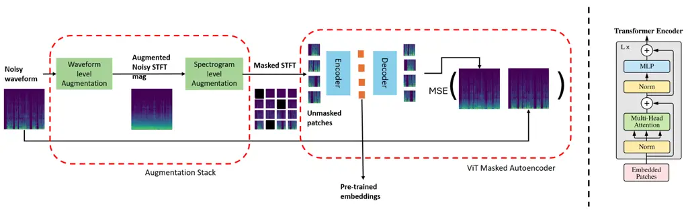
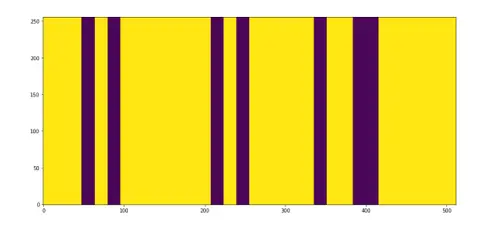
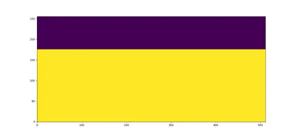
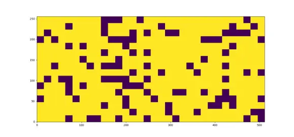
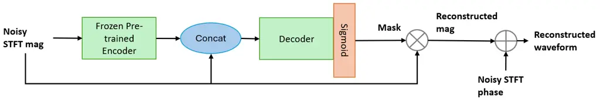

# Masked Autoencoders as Universal Speech Enhancer Thanks: \*Work performed during internship at AWS AI Labs.

Rajalaxmi Rajagopalan\* Affiliation: University of Illinois,
Urbana-Champaign    Ritwik Giri Affiliation: AWS AI Labs    Zhiqiang
Tang Affiliation: AWS AI Labs Affiliation:     Kyu Han Affiliation: AWS
AI Labs    Gerald Friedland Affiliation: AWS AI Labs

###### Abstract

Supervised speech enhancement methods have been very successful.
However, in practical scenarios, there is a lack of clean speech, and
self-supervised learning-based (SSL) speech enhancement methods that
offer comparable enhancement performance and can be applied to other
speech-related downstream applications are desired. In this work, we
develop a masked autoencoder based universal speech enhancer that is
agnostic to the type of distortion affecting speech, can handle multiple
distortions simultaneously, and is trained in a self-supervised manner.
An augmentation stack adds further distortions to the noisy input data.
The masked autoencoder model learns to remove the added distortions
along with reconstructing the masked regions of the spectrogram during
pre-training. The pre-trained embeddings are then used by fine-tuning
models trained on a small amount of paired data for specific downstream
tasks. We evaluate the pre-trained features for denoising and
dereverberation downstream tasks. We explore different augmentations
(like single or multi-speaker) in the pre-training augmentation stack
and the effect of different noisy input feature representations (like
$`log1p`$ compression) on pre-trained embeddings and downstream
fine-tuning enhancement performance. We show that the proposed method
not only outperforms the baseline but also achieves state-of-the-art
performance for both in-domain and out-of-domain evaluation datasets.

###### Index Terms: 

Speech Enhancement, Self-supervised learning, Zero-shot evaluation

## I Introduction

Speech enhancement involves the reconstruction of clean target speech
from a noisy recording corrupted by ambient noise, interfering speech,
distortions, etc. Deep learning approaches \[1, 2, 3, 4, 5, 6, 7, 8, 9,
10, 11\] have successfully outperformed classical ones especially for
denoising. More recently, there has been a paradigm shift from isolated
models for each speech task to pre-trained models that learn universal
useful speech representations that improve various downstream tasks. The
pre-training-finetuning model framework is especially attractive when
the pre-trained model is self-supervised like HuBERT \[12\] and WAVLM
\[13\]. Audio classification tasks like speaker identification, speech
recognition, etc., and audio enhancement tasks like denoising,
dereverberation, etc., are the two major classes of downstream tasks.
Enhancement downstream tasks have derived less benefit from general
pre-trained models. For instance, pre-trained models applied to
classification tasks like keyword spotting, speaker identification, etc
\[14, 15\] have shown great performance but not for audio enhancement.
There is increasing interest in improving pre-trained models for
downstream enhancement \[16, 17, 18\]. Thus, in this work we develop a
Masked Autoeconder (MAE) based model pre-trained in a self-supervised
fashion that (1) can tackle a broad range of distortions simultaneously,
(2) trained without access to large-scale clean speech corpus, and (3)
offers robust performance for enhancement downstream tasks.

## II RELATED WORK

The majority of speech enhancement approaches rely on fully supervised
learning that requires high-quality clean speech reference which is
difficult to obtain. Thus, self-supervised approaches that will relax
this constraint are attractive. There have been overwhelmingly
successful SSL approaches such as HuBERT \[12\] and WavLM \[13\] that
develop pre-trained models for various downstream audio tasks like
speaker identification, separation, and diarization. An open area of
active research is exploring the viability of such SSL pre-trained
models for universal speech enhancement.

WavLM and HuBERT employ a classification/prediction-based objective that
is mismatched with the continuous nature of the enhancement task;
estimating continuous enhanced/restored speech as highlighted by works
like \[16\]. Results show limited success in extending pre-trained
models for enhancement and cannot beat the performance of SOTA
discriminative models like Phase-aware U-Net SE \[11\] and SOTA
diffusion models \[8, 19\]. Since our primary goal is to develop a
foundation model for speech enhancement, we instead use regression loss
similar to Masked Autoencoder \[20\] where some portions of the input
noisy STFT are masked and a vision transformer-based (ViT) model learns
to reconstruct the masked regions thereby learning robust speech
representations. Authors of \[17\] illustrate the benefit of Masked
Autoencoder pre-training on denoising fine-tuning. However, they do not
consider other distortions like background interfering speech, clipping,
codec artifacts, etc, during pretraining, and hence neither their
pre-trained model nor the downstream fine-tuned model is equipped to
handle other distortions.

In contrast, we propose a universal self-supervised speech enhancement
framework that builds on the masked autoencoder \[20\] by adding an
augmentation stack that adds more distortions like distance-based
multi-speaker speech mixtures, reverberation, clipping, codec artifacts,
etc, to the general noisy speech input and the pre-trained model learns
to both reconstruct masked portions and remove the added distortions.
This dual objective ensures that the pre-trained model is
self-supervised and universal. For instance unlike previous works
\[21\], multi-speaker augmented pre-training will learn features that
enable removal of other undesired speech like noise such as background
babble, a TV in the background playing intelligible speech, or
background interfering speakers farther from the target speaker. Thus,
this pre-training scheme offers robust embeddings that can be further
finetuned with a small amount of labeled data for different downstream
tasks like denoising, dereverberation, source separation, bandwidth
extension, etc.



Fig. 1: Pretraining framework: (a) Augmentation stack (b) ViT Masked
Autoencoder \[22\]

## III PROPOSED METHOD

For a speech clip $`s\in\mathbf{R}^{L}`$, the speech distortion process
is modeled as a function $`d(\cdot)`$ and the degraded speech
$`x\in\mathbf{R}^{L}`$, $`x=d(s)`$. Speech enhancement is an inverse
problem that aims to restore high-quality speech $`\hat{s}=f(x)`$ from
$`x`$, where $`f(\cdot)`$ is the enhancement function; an inverse
approximation of $`d(\cdot)`$. The various distortions impacting $`x`$
is a composite function,

```math
\displaystyle d(x) \displaystyle=d_{1}\circ d_{2}\circ\dots d_{Q}(x)\in\mathbf{D} \tag{1}
```

where $`\circ`$ denotes function composition,
$`\mathbf{D}={d_{v}(\cdot)}_{v=1}^{V}`$ is the set of distortion types,
$`Q\leq V`$ is the number of distortions in $`d(\cdot)`$. In our SSL
universal enhancement framework, we first pre-train a general model in a
self-supervised manner on large amounts of noisy speech to learn speech
representations that are then used by specific fine-tuning models
trained on small amounts of paired clean-noisy speech for downstream
tasks.

### III-A Pretraining

Figure 1 shows two main modules of the pre-training:

- (1)
  Augmentation Stack: The general noisy speech is further distorted by
  adding several distortions in the time domain waveform level
  (background noise, reverberation, codec artifacts, etc) and STFT
  spectrogram level (masking).
- (2)
  Masked Autoencoder (MAE): A vanilla ViT-AE \[20\] model with encoder
  and decoder takes the augmented noisy STFT magnitude as input and
  reconstructs the speech before augmentation was added.

This is a self-supervised learning approach as no clean reference is
required and by injecting distortion, the noisy waveform before
augmentation serves as the reference.

1:  Target speaker: $`s_{1}`$, Interfering speaker: $`s_{2}`$

2:  To ensure all speakers are in the same room: pick RIR $`r_{0}`$.

3:  First, $`s_{1}`$ must not too far away from the microphone

4:  Second, $`s_{1}`$ must be closer to the microphone than $`s_{2}`$

5:  Compute the Direct-Reverberant ratio (DRR) of $`r_{0}`$;

```math
\displaystyle\text{DRR(dB)}=10*log\left(\frac{P_{D}}{P_{R}}\right) \tag{2}
```

where, $`P_{D},P_{R}`$ are the direct path and reverberant powers.

6:  if DRR $`\geq`$ Threshold then

7:   Apply $`r_{0}`$ to $`s_{1}`$, $`s_{1}`$ is at appropriate distance
from mic

8:   Attenuate the direct path $`+`$ early reflections of $`r_{0}`$:
$`r_{0}^{\prime}`$

9:   Apply $`r_{0}^{\prime}`$ to $`s_{2}`$, $`s_{2}`$ is farther away
from mic than $`s_{1}`$

10:  else

11:   Apply $`r_{0}`$ to $`s_{2}`$, $`s_{2}`$ is far from the mic

12:   Decay $`r_{0}`$’s late reverberant part using a decay function

```math
\displaystyle A(t)=\begin{cases}1&\quad t<T_{0}\\
\frac{1+\alpha}{2}+\frac{1-\alpha}{2}\text{cos}\frac{\pi(t-T_{0})}{(T_{1}-T_{0})}&\quad T_{0}<t<T_{1}\\
\alpha&\quad t>T_{1}\\
\end{cases} \tag{3}
```

$`T_{0}`$ and $`T_{1}`$ are the RIR’s reverberant part that is decayed.

13:   Apply new $`r_{0}^{\prime\prime}`$ to $`s_{1}`$, $`s_{1}`$ is now
closer to mic than $`s_{2}`$

14:  end if

Algorithm 1 Distance-based Mixture Generation: 2 speakers

#### III-A1 Augmentation Stack

Waveform level augmentations:

Additive Noise: Adding noise $`n\in\mathbf{R}^{L}`$ to speech $`s`$:

```math
\displaystyle d(s) \displaystyle=s+n \tag{4}
```

Reverberation: Modeled by convolving speech signals with a Room Impulse
Response (RIR) filter $`r`$:

```math
\displaystyle d(s) \displaystyle=s*r \tag{5}
```

Clipping: When the single amplitude exceeds a range \[-$`\gamma`$, +$`\gamma`$\], it is clipped:

```math
\displaystyle d(s) \displaystyle=\text{max}(\text{min}(s,\gamma),-\gamma),\quad\gamma\in[0,1] \tag{6}
```

Multi-Speaker Mixtures: Interfering speech from different speakers is
added to the target speaker $`s`$. Algorithm 1 shows how modifying RIRs
applied to each speaker results in the generation of distance-separated
speaker mixtures. Unlike WavLM which generates unrealistic multi-speaker
mixtures by ensuring the target utterance is longer compared to
inferring speaker (not often observed in practice), distance-separated
speaker mixtures are very common in practical scenarios where target
speech is corrupted by background babble, background interfering
speakers who are not part of the conversation, a TV playing speech in
the background, etc.

```math
\displaystyle d(s) \displaystyle=\mathbf{A}\begin{bmatrix}s*r_{0}&s_{1}*r_{1}&\dots&s_{M}*r_{M}\end{bmatrix}^{T} \tag{7}
```

where, $`\mathbf{A}`$ is the mixing matrix,
$`r_{i},i\in\{0,1,\dots,M\}`$ are the RIRs for each speaker. This
distance-based cue allows the model to get around the permutation issue
between speakers and does not require Permutation-Invariant Training
(PIT). Hence the pre-trained model without any finetuning can also be
viewed as an enrollment-free alternative approach to target voice
extraction, where the target voice is assumed to be closest to the
microphone with the highest DRR.

Spectrogram level augmentations:

Time masking: $`x\%`$ of time frames are randomly masked to mimic packet
loss concealment \[20\] distortion whereby some portions of the audio
clip are lost.

Frequency masking: $`x\%`$ of high-frequency bins of the spectrogram are
masked. This mimics bandwidth limitation distortion in audio recordings
caused by a low sampling rate or defects in the recording device.

Random TF Masking: $`x\%`$ of spectrogram TF bins are randomly masked
enabling self-supervision. When a spectrogram portion is masked with a
probability $`p`$, it reduces input sequence length and encourages
learning global, contextualized representations from limited unmasked
patches.

Figure 2 illustrates the masks that are applied as a dot product to the
input STFT magnitude.







Fig. 2: Spectrogram augmentations: (a) Time (b) Frequency (c) Random TF

#### III-A2 Masked Autoencoder

Audio-MAE uses a stack of standard Transformers for its encoder and
decoder. The encoded patches are padded with trainable masked tokens and
passed to the decoder. The decoder processes the embeddings and mask
tokens to reconstruct the input. The decoder enables the encoder to be
trained only on unmasked patches, thereby reducing the computational
cost. Global self-attention in image-based MAEs is not applicable to
audio spectrograms as the time-frequency context is largely local. Thus,
Audio-MAEs use local self-attention mechanisms through shifted windowing
using SwinTransformer decoder blocks \[23\].



Fig. 3: Finetuning: Enhancement

Pre-train augmentation type Model Finetune CSIG CBAK COVL PESQ SSNR
NISQA - Noisy - 3.34 2.44 2.63 1.97 1.68 3.05 - DCUNet \[11\] - 4.24
4.00 3.69 3.13 - - - UNIVERSE \[19\] - 4.03 3.11 3.46 2.9 - - - SGMSE+
\[8\] - 4.25 3.4 3.61 2.94 - 4.56 - VoiceFixer \[24\] - - - - 2.43 - -

- PANN w/ UNet \[18\] - 2.43 2.96 2.3 2.28 - - - Huang et al
  \[25\] - - - - 2.68 - - - Boosting SSL \[26\] Y 4.4 3.52 3.74 3.05 - -
  Random TF mask MAE for restoration¹ \[17\] Y 4.28 2.95 3.51 3.25 11.34
  4.28 Single speaker Ours Y 4.31 3.02 3.68 3.33 11.35 4.13 Multi speaker
  Ours N 4.22 2.75 3.36 3.19 11.35 4.14 Multi speaker Ours Y 4.28 2.99
  3.69 3.32 11.35 4.12 Multi speaker+log1p Ours N 4.3 2.75 3.4 3.23 11.35
  4.14 Multi speaker+log1p Ours Y 4.41 3.21 3.78 3.4 11.49 4.22

TABLE I: In-domain Enhancement Results: Valentini \[27\]

Pre-train augmentation type Model Finetune CSIG CBAK COVL PESQ SSNR
NISQA - Noisy - 2 1.52 1.6 1.47 1.42 2.79 - UNIVERSE \[19\] - 2.19 -
1.76 1.51 - - - SGMSE+ \[8\] - 2.81 - 2.33 1.97 - 4.44 Random TF mask
MAE for restoration¹ \[17\] Y 2.49 - 2.05 1.81 - 2.95 Multi speaker Ours
N 2.34 1.75 1.99 1.78 7.24 2.71 Multi speaker Ours Y 2.57 2.3 2.21 2.09
8.51 3.43 Multi speaker+log1p Ours N 2.45 1.8 2.1 1.8 7.24 2.74 Multi
speaker+log1p Ours Y 2.64 2.51 2.32 2.17 9.1 3.5

- •
  ¹ These numbers in Tables I & II were obtained by reproducing \[21\]
  using random TF masking only in pre-training and with STFT.

TABLE II: Out-of-domain Enhancement Results: DAPS \[28\]

### III-B Finetuning

The pre-trained model can now be finetuned for specific
enhancement-related downstream tasks. The fine-tuning model has access
to a small amount of paired data. Figure 3 shows that the fine-tuning
model input is the concatenation of the pre-trained model encoder
embeddings and the noisy input STFT. The input data is single-speaker
speech corrupted by background noise, background speech and babble, and
reverberation and the expected output is clean anechoic speech. The
model output is a mask $`\in[0,1]`$, that computes the amount of clean
speech target in each TF bin. This TF mask (not to be confused with
pre-training) is multiplied with the noisy input STFT to obtain a clean
reconstruction. The noisy phase is used to generate the raw
reconstructed waveforms.

The multi-speaker pre-training augmentation also allows for source
separation downstream task. The spectrogram augmentations allow for
other downstream tasks like (1) Bandwidth Expansion: Bandwidth expansion
is facilitated by a pre-trained model that learns to reconstruct masked
high-frequencies from frequency masking augmentation. (2) Packet Loss
Concealment (PLC): Missing/corrupted speech frames when transported over
VoIP can be recovered by time masking augmented pre-training that
reconstructs masked time frames \[20\]. We leave detailed analysis of
source separation, bandwidth expansion, and PLC for future work.

## IV RESULTS

### IV-A Experiment Setup

#### IV-A1 MAE Pre-training

Pre-training is done on LibriTTS \[29\] using all three train subsets
(960 hrs). Hyperparameters of the ViT-AE pre-training model are from
\[14\]. The input audio data is cropped or padded to 4-second chunks at
16 KHz sampling rate. We use an STFT window of 32ms and a hop size of
8ms. ViT-AE is pre-trained for $`60`$ epochs with a batch size of
$`256`$, using AdamW optimizer with a weight decay of $`1e^{-4}`$, and
learning rate (LR) of $`1e^{-4}`$ which linearly increases to
$`1e^{-4}`$ during warmup (5 epochs) and then decreases to $`1e^{-6}`$
by the cosine annealing scheduler \[20\]. In the augmentation stack,
each augmentation is applied with a probability $`p`$. First, input
speech is scaled to a random loudness level $`[-30,10]`$ dB, followed by
multi-speaker mixture generation (Algorithm 1) by picking a secondary
interfering speaker from LibriTTS and an RIR from Open SLR28 \[30\].
Next, codec artifacts are added by selecting an audio codec. Random
clipping is applied by picking a level $`[0,1]`$ and finally, background
noise is applied by picking a noise from DNS noise \[31\] with a random
SNR $`[-30,0]`$ dB. For spectrogram level augmentation, one of the three
masks: time (20% of time frames are masked), frequency (random
high-frequency bins up to 50% of the bins are masked), and random TF
(75% of TF bins are masked) is chosen for each input clip with
probability $`p=[0.1,0.1,0.8]`$.

#### IV-A2 Finetuning

The pre-trained ViT encoder is frozen and the encoder patch embeddings
are concatenated with the input noisy STFT magnitude after time
alignment following \[14\]. Unlike pre-training, the fine-tuning decoder
uses global attention, and the batch size is 256, the LR increases to
$`2e^{-4}`$ during warmup (5 epochs) and decreases to $`1e^{-6}`$ by 95
epochs of cosine annealing. The model’s output is a TF mask that is
limited to \[0, 1\] by a sigmoid function.We finetune the ViT-AE
pre-trained model on the Valentini dataset \[27\] (29 hrs), the test set
has 824 noisy-clean paired clips. Zero-shot evaluation is done on the
M10 and F10 speakers of DAPS \[28\] dataset which was generated by
playing back prerecorded clean speeches in noisy and reverberating
environments. Audio-MAE for restoration \[17\] is used as the baseline
for comparison.

### IV-B Evaluation

For evaluation we use standard intrusive metrics (PESQ, CSIG, CBAK,
COVL, SSNR \[32\]) and a non-intrusive metric, NISQA \[33\] on the
Valentini and DAPS datasets. In Table I, we replicate the baseline: MAE
for Audio Restoration (Table 3 row 4 \[17\]) using only
spectrogram-level 75% random TF masking for pre-training augmentation.
The small discrepancy in numbers is because the baseline uses log-mel
spectrograms in pre-training vs STFT used here. We see that when all
augmentations (waveform, spectrogram) are applied except multi-speaker
mixtures, the fine-tuning performance for in-domain Valentini data is
improved. Adding multi-speaker augmentation offers comparable
performance to single-speaker augmentation as it is beneficial for
removing background babble that is not diffused, background interfering
speech, etc. Therefore, full-stack augmented pre-training learns
features for reliable application to a broad range of downstream tasks.
We verify the need for fine-tuning by evaluating directly on the
pre-trained model only and observe the dip in performance. Borrowing the
idea from Boosting SSL \[26\], we replace linear STFT with its $`log1p`$
compressed features. The input to ViT MAE is $`log1p`$ compressed
version of noisy STFT magnitude and the MSE loss (Figure 1) is w.r.t
$`log1p`$ features. Table I shows that using $`log1p`$ compression
boosts numbers of both pre-training only and pre-training+finetuning
models. Our model outperforms classification-based SSL pre-training
\[25\] and the SOTA method (boosting SSL \[26\] that uses WavLM \[13\],
HuBERT \[12\] pre-trained $`log1p`$ compressed features for finetuning)
on 3 out of 4 performance metrics. We beat supervised pre-training works
like PANNs with UNet \[18\] highlighting the benefits of increased
training data availability and diversity (augmentations) from
self-supervised learning. Finetuning with multi-speaker augmented
pre-training (linear and $`log1p`$) beats SOTA discriminative models
DCUNet \[11\] on all metrics except CBAK. For diffusion-based models
like UNIVERSE \[19\] and SGMSE+ \[8\], our performance is superior for
intrusive metrics but underperforms for non-intrusive metrics like
NISQA.

Table II shows that augmented pre-training offers great performance for
out-of-domain generalizations (DAPS \[28\]) over the baseline \[17\]
(Table 5 row 13) and is further improved by using $`log1p`$ compressed
features. Thus, designing an SSL pre-training model that learns
distortion removal through augmentation offers robust generalized
features for downstream enhancement for both in-domain and out-of-domain
data.

## V LIMITATIONS & CONCLUSION

We designed a universal self-supervised pre-training model that offers
robust speech features for various speech enhancement downstream tasks.
We show that the distortion removal objective added to MAE pre-training
boosts enhancement performance while learning features for other
downstream applications. Thus, the pre-trained model can be employed for
universal speech enhancement that removes all types of distortions
corrupting speech and serves as an enhancement alternative to WavLM. We
consider enhancement with background speech removal through
multi-speaker augmentations but we hope to explore in the future how the
distance-based mixtures lend themselves to the separation of harder
mixtures (without distance cues) downstream and zero-shot bandwidth
extension and packet loss concealment using spectrogram augmentations of
time and frequency masking.

## References

- \[1\] X. Hao, X. Su, R. Horaud, and X. Li, “Fullsubnet: A full-band
  and sub-band fusion model for real-time single-channel speech
  enhancement,” in _ICASSP 2021-2021 IEEE International Conference on
  Acoustics, Speech and Signal Processing (ICASSP)_. IEEE, 2021, pp.
  6633–6637.
- \[2\] A. Defossez, G. Synnaeve, and Y. Adi, “Real time speech
  enhancement in the waveform domain,” _arXiv preprint
  arXiv:2006.12847_, 2020.
- \[3\] Y. Zhao, Z.-Q. Wang, and D. Wang, “Two-stage deep learning for
  noisy-reverberant speech enhancement,” _IEEE/ACM transactions on
  audio, speech, and language processing_, vol. 27, no. 1, pp.
  53–62, 2018.
- \[4\] H. Zhao, S. Zarar, I. Tashev, and C.-H. Lee,
  “Convolutional-recurrent neural networks for speech enhancement,” in
  _2018 IEEE International Conference on Acoustics, Speech and Signal
  Processing (ICASSP)_. IEEE, 2018, pp. 2401–2405.
- \[5\] Y. Koizumi, K. Yatabe, M. Delcroix, Y. Masuyama, and
  D. Takeuchi, “Speech enhancement using self-adaptation and multi-head
  self-attention,” in _ICASSP 2020-2020 IEEE International Conference on
  Acoustics, Speech and Signal Processing (ICASSP)_. IEEE, 2020, pp.
  181–185.
- \[6\] U. Isik, R. Giri, N. Phansalkar, J.-M. Valin, K. Helwani, and
  A. Krishnaswamy, “Poconet: Better speech enhancement with
  frequency-positional embeddings, semi-supervised conversational data,
  and biased loss,” _arXiv preprint arXiv:2008.04470_, 2020.
- \[7\] A. Pandey and D. Wang, “Dense cnn with self-attention for
  time-domain speech enhancement,” _IEEE/ACM transactions on audio,
  speech, and language processing_, vol. 29, pp. 1270–1279, 2021.
- \[8\] J. Richter, S. Welker, J.-M. Lemercier, B. Lay, and T. Gerkmann,
  “Speech enhancement and dereverberation with diffusion-based
  generative models,” _IEEE/ACM Transactions on Audio, Speech, and
  Language Processing_, vol. 31, pp. 2351–2364, 2023.
- \[9\] S.-W. Fu, C.-F. Liao, Y. Tsao, and S.-D. Lin, “Metricgan:
  Generative adversarial networks based black-box metric scores
  optimization for speech enhancement,” in _International Conference on
  Machine Learning_. PMLR, 2019, pp. 2031–2041.
- \[10\] S. Pascual, A. Bonafonte, and J. Serra, “Segan: Speech
  enhancement generative adversarial network,” _arXiv preprint
  arXiv:1703.09452_, 2017.
- \[11\] H.-S. Choi, J.-H. Kim, J. Huh, A. Kim, J.-W. Ha, and K. Lee,
  “Phase-aware speech enhancement with deep complex u-net,” in
  _International Conference on Learning Representations_, 2018.
- \[12\] W.-N. Hsu, B. Bolte, Y.-H. H. Tsai, K. Lakhotia,
  R. Salakhutdinov, and A. Mohamed, “Hubert: Self-supervised speech
  representation learning by masked prediction of hidden units,”
  _IEEE/ACM Transactions on Audio, Speech, and Language Processing_,
  vol. 29, pp. 3451–3460, 2021.
- \[13\] S. Chen, C. Wang, Z. Chen, Y. Wu, S. Liu, Z. Chen, J. Li,
  N. Kanda, T. Yoshioka, X. Xiao _et al._, “Wavlm: Large-scale
  self-supervised pre-training for full stack speech processing,” _IEEE
  Journal of Selected Topics in Signal Processing_, vol. 16, no. 6, pp.
  1505–1518, 2022.
- \[14\] D. Niizumi, D. Takeuchi, Y. Ohishi, N. Harada, and K. Kashino,
  “Masked spectrogram modeling using masked autoencoders for learning
  general-purpose audio representation,” in _HEAR: Holistic Evaluation
  of Audio Representations_. PMLR, 2022, pp. 1–24.
- \[15\] D. Chong, H. Wang, P. Zhou, and Q. Zeng, “Masked spectrogram
  prediction for self-supervised audio pre-training,” in _ICASSP
  2023-2023 IEEE International Conference on Acoustics, Speech and
  Signal Processing (ICASSP)_. IEEE, 2023, pp. 1–5.
- \[16\] H. Song, S. Chen, Z. Chen, Y. Wu, T. Yoshioka, M. Tang, J. W.
  Shin, and S. Liu, “Exploring wavlm on speech enhancement,” in _2022
  IEEE Spoken Language Technology Workshop (SLT)_. IEEE, 2023, pp.
  451–457.
- \[17\] Z. Zhong, H. Shi, M. Hirano, K. Shimada, K. Tateishi,
  T. Shibuya, S. Takahashi, and Y. Mitsufuji, “Extending audio masked
  autoencoders toward audio restoration,” in _2023 IEEE Workshop on
  Applications of Signal Processing to Audio and Acoustics
  (WASPAA)_. IEEE, 2023, pp. 1–5.
- \[18\] Q. Kong, H. Liu, X. Du, L. Chen, R. Xia, and Y. Wang, “Speech
  enhancement with weakly labelled data from audioset,” _arXiv preprint
  arXiv:2102.09971_, 2021.
- \[19\] J. Serrà, S. Pascual, J. Pons, R. O. Araz, and D. Scaini,
  “Universal speech enhancement with score-based diffusion,” _arXiv
  preprint arXiv:2206.03065_, 2022.
- \[20\] P.-Y. Huang, H. Xu, J. Li, A. Baevski, M. Auli, W. Galuba,
  F. Metze, and C. Feichtenhofer, “Masked autoencoders that listen,”
  _Advances in Neural Information Processing Systems_, vol. 35, pp.
  28 708–28 720, 2022.
- \[21\] J. Zhang, S. Jayasuriya, and V. Berisha, “Restoring degraded
  speech via a modified diffusion model,” _arXiv preprint
  arXiv:2104.11347_, 2021.
- \[22\] D. Alexey, “An image is worth 16x16 words: Transformers for
  image recognition at scale,” _arXiv preprint arXiv: 2010.11929_, 2020.
- \[23\] Z. Liu, Y. Lin, Y. Cao, H. Hu, Y. Wei, Z. Zhang, S. Lin, and
  B. Guo, “Swin transformer: Hierarchical vision transformer using
  shifted windows,” in _Proceedings of the IEEE/CVF international
  conference on computer vision_, 2021, pp. 10 012–10 022.
- \[24\] H. Liu, Q. Kong, Q. Tian, Y. Zhao, D. Wang, C. Huang, and
  Y. Wang, “Voicefixer: Toward general speech restoration with neural
  vocoder,” _arXiv preprint arXiv:2109.13731_, 2021.
- \[25\] Z. Huang, S. Watanabe, S.-w. Yang, P. García, and S. Khudanpur,
  “Investigating self-supervised learning for speech enhancement and
  separation,” in _ICASSP 2022-2022 IEEE International Conference on
  Acoustics, Speech and Signal Processing (ICASSP)_. IEEE, 2022, pp.
  6837–6841.
- \[26\] K.-H. Hung, S.-w. Fu, H.-H. Tseng, H.-T. Chiang, Y. Tsao, and
  C.-W. Lin, “Boosting self-supervised embeddings for speech
  enhancement,” _arXiv preprint arXiv:2204.03339_, 2022.
- \[27\] C. V. Botinhao, X. Wang, S. Takaki, and J. Yamagishi, “Speech
  enhancement for a noise-robust text-to-speech synthesis system using
  deep recurrent neural networks,” in _Interspeech 2016_, 2016, pp.
  352–356.
- \[28\] G. J. Mysore, “Can we automatically transform speech recorded
  on common consumer devices in real-world environments into
  professional production quality speech?—a dataset, insights, and
  challenges,” _IEEE Signal Processing Letters_, vol. 22, no. 8, pp.
  1006–1010, 2014.
- \[29\] H. Zen, V. Dang, R. Clark, Y. Zhang, R. J. Weiss, Y. Jia,
  Z. Chen, and Y. Wu, “Libritts: A corpus derived from librispeech for
  text-to-speech,” _arXiv preprint arXiv:1904.02882_, 2019.
- \[30\] T. Ko, V. Peddinti, D. Povey, M. L. Seltzer, and S. Khudanpur,
  “A study on data augmentation of reverberant speech for robust speech
  recognition,” in _2017 IEEE international conference on acoustics,
  speech and signal processing (ICASSP)_. IEEE, 2017, pp. 5220–5224.
- \[31\] Y. Chen, M. Antonakakis, R. Perdisci, Y. Nadji, D. Dagon, and
  W. Lee, “Dns noise: Measuring the pervasiveness of disposable domains
  in modern dns traffic,” in _2014 44th Annual IEEE/IFIP International
  Conference on Dependable Systems and Networks_. IEEE, 2014, pp.
  598–609.
- \[32\] “https://github.com/schmiph2/pysepm.”
- \[33\] G. Mittag, B. Naderi, A. Chehadi, and S. Möller, “Nisqa: A deep
  cnn-self-attention model for multidimensional speech quality
  prediction with crowdsourced datasets,” _arXiv preprint
  arXiv:2104.09494_, 2021.
